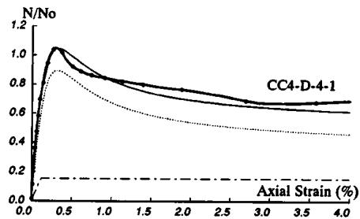
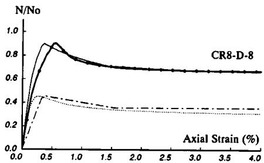

# Behavior of Centrally Loaded Concrete-Filled Steel-Tube Short Columns

Kenji Sakino1; Hiroyuki Nakahara2; Shosuke Morino3; and Isao Nishiyama4

Abstract: A 5 year research on concrete-filled steel tubular (CFT) column system was carried out as a part of the fifth phase of the U.S.-Japan Cooperative Earthquake Research Program, and the tests of centrally loaded short columns were finished. The objectives of these tests were to clarify the synergistic interaction between steel tube and filled concrete, and to derive methods to characterize the load-deformation relationship of CFT columns. A total of 114 specimens was fabricated and tested in the experimental phase of investigations on centrally loaded hollow and CFT short columns. Parameters for the tests are as follows: (1) tube shape, (2) tube tensile strength, (3) tube diameter-to-thickness ratio, and (4) concrete strength. In determining the range of parameters, the emphasis was placed on obtaining a wide range of test data for establishing a generally applicable design method of CFT column systems. Design formulas to estimate the ultimate axial compressive load capacities are proposed for CFT columns with both circular and square sections based on tests results described in this paper.

DOI: 10.1061/(ASCE)0733-9445(2004)130:2(180)

CE Database subject headings: Composite structures; Composite columns; Concrete; Steel; Nonlinear analysis; Stress strain curves.

# Introduction

Extensive experimental studies on the seismic performance of the concrete-filled steel tube (CFT) columns with square and circular sections have been made in the last 2 decades in Japan. The Japanese "Recommendations for Design and Construction of Concrete Filled Steel Tubular Structures" [Architectural Institute of Japan (AIJ) 1997] have been edited based on these investigations by the AIJ. They have, however, some limitations of applications concerning material strength and diameter (width)-to-thickness ratio of circular (square) steel tube. The main objective of a 5 year research on CFT column systems carried out as a part of the fifth phase of the U.S.-Japan Cooperative Earthquake Research Program was to expand the applications.

All the symbols appearing in this paper are summarized in the Notation, and an international system of units is used. The soil mechanics convention for stress and strain is followed; namely, compressive stresses and strains are positive.

$^{1}$ Professor, Dept. of Architecture, Graduate School of Human Environmental Studies, Kyushu Univ., 6-10-1 Hakozaki, Higashi-ku, Fukuoka-shi 812-8581, Japan.   
$^{2}$ Research Associate, Dept. of Architecture, Faculty of Engineering, Kagoshima Univ., 1-21-40 Korimoto, Kagoshima-shi 890-0065, Japan.   
$^{3}$ Professor, Dept. of Architecture, Faculty of Engineering, Mie Univ., Kamihama-cho, Tsu-shi 514-8507, Japan.   
$^{4}$ Advanced Research Engineer, Dept. of Production Engineering, Building Research Institute, Tachihara-1, Tsukuba, Ibaraki 305-0802, Japan.   
Note. Associate Editor: Sherif El-Tawil. Discussion open until July 1, 2004. Separate discussions must be submitted for individual papers. To extend the closing date by one month, a written request must be filed with the ASCE Managing Editor. The manuscript for this paper was submitted for review and possible publication on May 8, 2002; approved on March 25, 2003. This paper is part of the Journal of Structural Engineering, Vol. 130, No. 2, February 1, 2004. ©ASCE, ISSN 0733-9445/2004/2-180-188/$18.00.

Table 1. Axial Compressive Test Results of Steel Tubes Used for Concrete-Filled Steel Tube Specimens   

<table><tr><td>Test No.</td><td>Specimen</td><td>D,B (mm)</td><td>t (mm)</td><td>D/t or B/t</td><td>σsy (MPa)</td><td>σscy (MPa)</td><td>σsu (MPa)</td><td>εsu (%)</td></tr><tr><td>1</td><td>CC4-A-0</td><td>149</td><td>2.96</td><td>50.2</td><td>283</td><td>308</td><td>340</td><td>1.21</td></tr><tr><td>2</td><td>CC4-C-0</td><td>301</td><td>2.96</td><td>102</td><td>283</td><td>279</td><td>284</td><td>0.46</td></tr><tr><td>3</td><td>CC4-D-0</td><td>450</td><td>2.96</td><td>152</td><td>283</td><td>—</td><td>273</td><td>0.28</td></tr><tr><td>4</td><td>CC6-A-0</td><td>122</td><td>4.54</td><td>26.8</td><td>579</td><td>576</td><td>636</td><td>1.79</td></tr><tr><td>5</td><td>CC6-C-0</td><td>238</td><td>4.54</td><td>52.5</td><td>579</td><td>507</td><td>531</td><td>0.65</td></tr><tr><td>6</td><td>CC6-D-0</td><td>360</td><td>4.54</td><td>79.3</td><td>579</td><td>525</td><td>548</td><td>0.60</td></tr><tr><td>7</td><td>CC8-A-0</td><td>108</td><td>6.47</td><td>16.6</td><td>835</td><td>853</td><td>940</td><td>1.73</td></tr><tr><td>8</td><td>CC8-C-0</td><td>222</td><td>6.47</td><td>34.3</td><td>835</td><td>843</td><td>875</td><td>0.74</td></tr><tr><td>9</td><td>CC8-D-0</td><td>336</td><td>6.47</td><td>52.0</td><td>835</td><td>823</td><td>863</td><td>1.22</td></tr><tr><td>10</td><td>CR4-A-0</td><td>149</td><td>4.38</td><td>33.9</td><td>262</td><td>287</td><td>300</td><td>0.50</td></tr><tr><td>11</td><td>CR4-C-0</td><td>215</td><td>4.38</td><td>49.0</td><td>262</td><td>—</td><td>227</td><td>0.22</td></tr><tr><td>12</td><td>CR4-D-0</td><td>323</td><td>4.38</td><td>73.8</td><td>262</td><td>—</td><td>157</td><td>0.14</td></tr><tr><td>13</td><td>CR6-A-0</td><td>144</td><td>6.36</td><td>22.7</td><td>618</td><td>632</td><td>651</td><td>1.01</td></tr><tr><td>14</td><td>CR6-C-0</td><td>211</td><td>6.36</td><td>33.2</td><td>618</td><td>—</td><td>587</td><td>0.28</td></tr><tr><td>15</td><td>CR6-D-0</td><td>318</td><td>6.36</td><td>50.0</td><td>618</td><td>—</td><td>413</td><td>0.32</td></tr><tr><td>16</td><td>CR8-A-0</td><td>120</td><td>6.47</td><td>18.5</td><td>835</td><td>848</td><td>908</td><td>1.37</td></tr><tr><td>17</td><td>CR8-C-0</td><td>175</td><td>6.47</td><td>27.0</td><td>835</td><td>—</td><td>799</td><td>0.50</td></tr><tr><td>18</td><td>CR8-D-0</td><td>265</td><td>6.47</td><td>40.9</td><td>835</td><td>—</td><td>555</td><td>0.59</td></tr><tr><td>19</td><td>CR4-A-0-2</td><td>211</td><td>5.84</td><td>36.1</td><td>294</td><td>315</td><td>324</td><td>0.39</td></tr><tr><td>20</td><td>CR4-C-0-2</td><td>211</td><td>4.50</td><td>46.9</td><td>277</td><td>—</td><td>263</td><td>0.24</td></tr><tr><td>21</td><td>CR6-A-0-2</td><td>210</td><td>8.83</td><td>23.8</td><td>536</td><td>540</td><td>635</td><td>0.98</td></tr><tr><td>22</td><td>CR6-C-0-2</td><td>204</td><td>5.95</td><td>34.3</td><td>540</td><td>—</td><td>504</td><td>0.35</td></tr><tr><td>23</td><td>CR8-A-0-2</td><td>180</td><td>9.45</td><td>19.0</td><td>825</td><td>656</td><td>913</td><td>1.33</td></tr><tr><td>24</td><td>CR8-C-0-2</td><td>180</td><td>6.60</td><td>27.3</td><td>824</td><td>—</td><td>799</td><td>0.50</td></tr><tr><td>25</td><td>CR4-A-0-2&#x27;</td><td>137</td><td>5.84</td><td>23.5</td><td>294</td><td>334</td><td>381</td><td>1.68</td></tr><tr><td>26</td><td>CR4-C-0-2&#x27;</td><td>100</td><td>4.50</td><td>22.2</td><td>277</td><td>328</td><td>364</td><td>1.82</td></tr><tr><td>27</td><td>CR6-A-0-2&#x27;</td><td>150</td><td>8.83</td><td>17.0</td><td>536</td><td>572</td><td>727</td><td>2.53</td></tr><tr><td>28</td><td>CR6-C-0-2&#x27;</td><td>102</td><td>5.95</td><td>17.1</td><td>540</td><td>605</td><td>772</td><td>2.74</td></tr><tr><td>29</td><td>CR8-A-0-2&#x27;</td><td>155</td><td>9.45</td><td>16.4</td><td>825</td><td>820</td><td>927</td><td>2.18</td></tr><tr><td>30</td><td>CR8-C-0-2&#x27;</td><td>102</td><td>6.60</td><td>15.5</td><td>824</td><td>802</td><td>941</td><td>2.81</td></tr></table>

Table 2. Experimental Variables and Test Results (Circular Concrete-Filled Steel Tubes)   

<table><tr><td>Test No.</td><td>Specimen</td><td>D (mm)</td><td>t (mm)</td><td>σsy (MPa)</td><td>fc′ (MPa)</td><td>D/t</td><td>αc</td><td>γU</td><td>Nexp(kN)</td><td>Nexp/N0</td></tr><tr><td>1</td><td>CC4-A-2</td><td>149</td><td>2.96</td><td>308</td><td>25.4</td><td>50.4</td><td>0.075</td><td>0.96</td><td>941</td><td>1.16</td></tr><tr><td>2</td><td>CC4-A-4-1</td><td>149</td><td>2.96</td><td>308</td><td>40.5</td><td>50.3</td><td>0.075</td><td>0.96</td><td>1,064</td><td>1.02</td></tr><tr><td>3</td><td>CC4-A-4-2</td><td>149</td><td>2.96</td><td>308</td><td>40.5</td><td>50.4</td><td>0.075</td><td>0.96</td><td>1,080</td><td>1.03</td></tr><tr><td>4</td><td>CC4-A-8</td><td>149</td><td>2.96</td><td>308</td><td>77.0</td><td>50.5</td><td>0.075</td><td>0.96</td><td>1,781</td><td>1.11</td></tr><tr><td>5</td><td>CC4-C-2</td><td>301</td><td>2.96</td><td>279</td><td>25.4</td><td>101.5</td><td>0.137</td><td>0.88</td><td>2,382</td><td>1.04</td></tr><tr><td>6</td><td>CC4-C-4-1</td><td>300</td><td>2.96</td><td>279</td><td>41.1</td><td>101.4</td><td>0.137</td><td>0.88</td><td>3,277</td><td>1.01</td></tr><tr><td>7</td><td>CC4-C-4-2</td><td>300</td><td>2.96</td><td>279</td><td>41.1</td><td>101.4</td><td>0.137</td><td>0.88</td><td>3,152</td><td>0.97</td></tr><tr><td>8</td><td>CC4-C-8</td><td>301</td><td>2.96</td><td>279</td><td>80.3</td><td>101.5</td><td>0.137</td><td>0.88</td><td>5,540</td><td>0.99</td></tr><tr><td>9</td><td>CC4-D-2</td><td>450</td><td>2.96</td><td>279</td><td>25.4</td><td>152.0</td><td>0.206</td><td>0.84</td><td>4,415</td><td>0.99</td></tr><tr><td>10</td><td>CC4-D-4-1</td><td>450</td><td>2.96</td><td>279</td><td>41.1</td><td>152.0</td><td>0.206</td><td>0.84</td><td>6,870</td><td>1.05</td></tr><tr><td>11</td><td>CC4-D-4-2</td><td>450</td><td>2.96</td><td>279</td><td>41.1</td><td>152.0</td><td>0.206</td><td>0.84</td><td>6,985</td><td>1.07</td></tr><tr><td>12</td><td>CC4-D-8</td><td>450</td><td>2.96</td><td>279</td><td>85.1</td><td>152.0</td><td>0.206</td><td>0.84</td><td>11,665</td><td>0.95</td></tr><tr><td>13</td><td>CC6-A-2</td><td>122</td><td>4.54</td><td>576</td><td>25.4</td><td>26.9</td><td>0.075</td><td>0.98</td><td>1,509</td><td>1.24</td></tr><tr><td>14</td><td>CC6-A-4-1</td><td>122</td><td>4.54</td><td>576</td><td>40.5</td><td>26.8</td><td>0.075</td><td>0.98</td><td>1,657</td><td>1.22</td></tr><tr><td>15</td><td>CC6-A-4-2</td><td>122</td><td>4.54</td><td>576</td><td>40.5</td><td>26.8</td><td>0.075</td><td>0.98</td><td>1,663</td><td>1.22</td></tr><tr><td>16</td><td>CC6-A-8</td><td>122</td><td>4.54</td><td>576</td><td>77.0</td><td>26.8</td><td>0.075</td><td>0.98</td><td>2,100</td><td>1.23</td></tr><tr><td>17</td><td>CC6-C-2</td><td>239</td><td>4.54</td><td>507</td><td>25.4</td><td>52.5</td><td>0.129</td><td>0.91</td><td>3,035</td><td>1.15</td></tr><tr><td>18</td><td>CC6-C-4-1</td><td>238</td><td>4.54</td><td>507</td><td>40.5</td><td>52.5</td><td>0.129</td><td>0.91</td><td>3,583</td><td>1.12</td></tr><tr><td>19</td><td>CC6-C-4-2</td><td>238</td><td>4.54</td><td>507</td><td>40.5</td><td>52.4</td><td>0.129</td><td>0.91</td><td>3,647</td><td>1.14</td></tr><tr><td>20</td><td>CC6-C-8</td><td>238</td><td>4.54</td><td>507</td><td>77.0</td><td>52.4</td><td>0.129</td><td>0.91</td><td>5,578</td><td>1.22</td></tr><tr><td>21</td><td>CC6-D-2</td><td>361</td><td>4.54</td><td>525</td><td>25.4</td><td>79.4</td><td>0.202</td><td>0.87</td><td>5,633</td><td>1.17</td></tr><tr><td>22</td><td>CC6-D-4-1</td><td>361</td><td>4.54</td><td>525</td><td>41.1</td><td>79.4</td><td>0.202</td><td>0.87</td><td>7,260</td><td>1.19</td></tr><tr><td>23</td><td>CC6-D-4-2</td><td>360</td><td>4.54</td><td>525</td><td>41.1</td><td>79.3</td><td>0.202</td><td>0.87</td><td>7,045</td><td>1.15</td></tr><tr><td>24</td><td>CC6-D-8</td><td>360</td><td>4.54</td><td>525</td><td>85.1</td><td>79.4</td><td>0.202</td><td>0.87</td><td>11,505</td><td>1.17</td></tr><tr><td>25</td><td>CC8-A-2</td><td>108</td><td>6.47</td><td>853</td><td>25.4</td><td>16.7</td><td>0.069</td><td>1.00</td><td>2,275</td><td>1.17</td></tr><tr><td>26</td><td>CC8-A-4-1</td><td>109</td><td>6.47</td><td>853</td><td>40.5</td><td>16.8</td><td>0.069</td><td>1.00</td><td>2,446</td><td>1.19</td></tr><tr><td>27</td><td>CC8-A-4-2</td><td>108</td><td>6.47</td><td>853</td><td>40.5</td><td>16.7</td><td>0.069</td><td>1.00</td><td>2,402</td><td>1.17</td></tr><tr><td>28</td><td>CC8-A-8</td><td>108</td><td>6.47</td><td>853</td><td>77.0</td><td>16.7</td><td>0.069</td><td>1.00</td><td>2,713</td><td>1.17</td></tr><tr><td>29</td><td>CC8-C-2</td><td>222</td><td>6.47</td><td>843</td><td>25.4</td><td>34.3</td><td>0.140</td><td>0.92</td><td>4,964</td><td>1.10</td></tr><tr><td>30</td><td>CC8-C-4-1</td><td>222</td><td>6.47</td><td>843</td><td>40.5</td><td>34.3</td><td>0.141</td><td>0.92</td><td>5,638</td><td>1.13</td></tr><tr><td>31</td><td>CC8-C-4-2</td><td>222</td><td>6.47</td><td>843</td><td>40.5</td><td>34.3</td><td>0.140</td><td>0.92</td><td>5,714</td><td>1.15</td></tr><tr><td>32</td><td>CC8-C-8</td><td>222</td><td>6.47</td><td>843</td><td>77.0</td><td>34.4</td><td>0.141</td><td>0.92</td><td>7,304</td><td>1.19</td></tr><tr><td>33</td><td>CC8-D-2</td><td>337</td><td>6.47</td><td>823</td><td>25.4</td><td>52.1</td><td>0.208</td><td>0.87</td><td>8,475</td><td>1.15</td></tr><tr><td>34</td><td>CC8-D-4-1</td><td>337</td><td>6.47</td><td>823</td><td>41.1</td><td>52.0</td><td>0.208</td><td>0.87</td><td>9,668</td><td>1.14</td></tr><tr><td>35</td><td>CC8-D-4-2</td><td>337</td><td>6.47</td><td>823</td><td>41.1</td><td>52.0</td><td>0.208</td><td>0.87</td><td>9,835</td><td>1.16</td></tr><tr><td>36</td><td>CC8-D-8</td><td>337</td><td>6.47</td><td>823</td><td>85.1</td><td>52.0</td><td>0.208</td><td>0.87</td><td>13,776</td><td>1.18</td></tr><tr><td></td><td>mean</td><td>254</td><td>4.66</td><td>555</td><td>46.7</td><td>62.8</td><td>0.138</td><td>0.92</td><td>4,961</td><td>1.13</td></tr><tr><td></td><td>max</td><td>450</td><td>6.47</td><td>853</td><td>85.1</td><td>152.0</td><td>0.208</td><td>1.00</td><td>13,776</td><td>1.24</td></tr><tr><td></td><td>min</td><td>108</td><td>2.96</td><td>279</td><td>25.4</td><td>16.7</td><td>0.069</td><td>0.84</td><td>941</td><td>0.95</td></tr></table>

# Experimental Investigation

# Specimens, Parameters, and Test Procedure

A total of 114 specimens were tested in the experimental investigations on centrally loaded hollow and CFT short columns. The objectives of these tests were to investigate the confining effect of steel tubes on concrete strength and the restraining effect of the concrete fill on local buckling of the steel tube wall, and to derive methods to evaluate ultimate load and load-deformation relationships.

Parameters for the tests are as follows: (1) tube shapes (circular and square); (2) tube tensile strength $(400,600,800\mathrm{MPa})$ ; (3) tube diameter (width)-to-thickness $(D / t$ or $B / t)$ ratio; and (4) design concrete strength (20, 40, 80 MPa). According to the values of the $D / t$ or $B / t$ ratio, the specimens were classified into three groups designated by a symbol code such as A, C, or D shown in Tables 1 and 2. In determining the range of parameters,

the emphasis was placed on obtaining a wide range of test data for establishing a generally applicable design method of CFT column systems. The value of $D / t$ ratio or $B / t$ ratio was controlled by changing the outside diameters of circular tubes (122-450 mm), or the widths of square tubes (120-324 mm). The circular steel tubes were cold formed from a flat plate by press bending and seam welding. The square steel tubes were fabricated by welding together two pieces of channel section, which were cold formed from a flat plate. The details of a typical specimen are shown in Fig. 1. The material properties of the steel tubes were obtained from tensile tests of coupons taken from each steel plate before manufacturing. Properties of all specimens are summarized in Tables 1, 2, and 3. The test setup shown in Fig. 1 was used to apply the axial load. Average longitudinal strains were obtained from four linear variable differential transducers that measured axial shortenings between the two end plates.

  
Fig. 1. Test setup

# Test Results

# Hollow Steel Tube Columns

The compressive stress $\sigma_{\mathrm{su}}$ at the maximum axial load of hollow steel tube columns is given in Table 1, which includes the compressive yield stress $\sigma_{\mathrm{scy}}$ defined as the stress corresponding to an offset strain of $0.2\%$ , as well as the tensile yield stress $\sigma_{\mathrm{sy}}$ obtained from tensile coupon tests. In many cases of square columns with $B / t$ ratio of Type C or D, however, compressive yield stress was not obtained from the test, because an abrupt drop in axial load due to the local buckling occurred before yielding.

# Concrete-Filled Steel Tube Columns

The maximum axial loads $N_{\mathrm{exp}}$ of circular and square CFT columns are summarized in Tables 2 and 3, respectively. The nondimensional maximum axial loads in the form of $N_{\mathrm{exp}} / N_0$ are also given in the tables, where $N_0$ is the nominal squash load given by Eq. (1)

$$
N _ {0} = N _ {s 0} + N _ {c 0} = A _ {s} \sigma_ {\mathrm {s y}} + A _ {c} \sigma_ {\mathrm {c p}} = A _ {s} \sigma_ {\mathrm {s y}} + A _ {c} \gamma_ {U} f _ {c} ^ {\prime} \tag {1}
$$

where $A_{s}$ and $A_{c} =$ cross sectional area of steel tube and filled concrete, respectively; and $\sigma_{\mathrm{cp}} =$ compressive strength of filled concrete which is estimated by multiplying the compressive strength $f_{c}^{\prime}$ of $10~\mathrm{cm}$ by $20~\mathrm{cm}$ cylinder by $\gamma_{U}$ . The $\gamma_{U}$ is a reduction factor introduced to take scale effect into consideration. In the case of circular CFT columns, the value of the compressive yield stress $\sigma_{\mathrm{scy}}$ given in Table 1 was used to evaluate $N_{0}$ from Eq. (1), instead of $\sigma_{\mathrm{sy}}$ . In the case of square CFT columns, the tensile yield stress given in Table 1 is used as the yield stress because the compressive yield stress is not available for many CFT columns with large $B / t$ ratio (Type C or D).

As shown in Table 2, the maximum axial load $N_{\mathrm{exp}}$ is greater than the nominal squash load $N_0$ in almost of all the circular CFT columns. A main reason for this augmentation of axial load capacity is attributed to the confinement effect of the steel tube on the filled concrete. On the other hand, the maximum load is less than the nominal squash load in the square CFT columns with the largest $B / t$ ratio of Type D as shown in Table 3. A main reason for this reduction of axial load capacity is attributed to the local buckling of steel tube wall.

# Scale Effect

One of the most important parameters in the experimental program is the $D / t$ or $B / t$ ratio of the steel tubes as mentioned in the preceding section. Steel tubes were cold formed from the steel plate with the same thickness for each grade of steel. The value of $D / t(B / t)$ ratio was controlled by changing the outside diameter of circular steel tubes and the width of square steel tubes. This resulted in the great differences in diameter or width of specimens as shown in Fig. 2. As expected from Fig. 2, it seemed to be necessary to consider scale effect on the compressive strength of concrete. Based on careful investigations, it is concluded that the concrete compressive cylinder strength should be modified according to the test results obtained by Blanks and McNamara (1935), which is shown in Fig. 3. Symbols $\bigcirc$ (□) with (A) and (B) [(C) and (D)] in Fig. 3 denote the diameter (width) of circular (square) CFT stub column specimens shown by corresponding symbols of (A), (B), (C), and (D) in Fig. 2. Although the conclusion on the scale effect shown in Fig. 3 should be limited to circular columns, Blanks's test results were applied to the square CFT columns by considering them as circular columns with the same sectional area.

Table 3. Experimental Variables and Test Results (Square Concrete-Filled Steel Tubes)   

<table><tr><td>Test No.</td><td>Specimen</td><td>B (mm)</td><td>t (mm)</td><td>σsy (MPa)</td><td>fc′ (MPa)</td><td>B/t</td><td>√αs</td><td>γU</td><td>Nexp(kN)</td><td>Nexp/N0</td></tr><tr><td>1</td><td>CR4-A-2</td><td>148</td><td>4.38</td><td>262</td><td>25.4</td><td>33.9</td><td>1.21</td><td>0.95</td><td>1,153</td><td>1.04</td></tr><tr><td>2</td><td>CR4-A-4-1</td><td>148</td><td>4.38</td><td>262</td><td>40.5</td><td>33.8</td><td>1.21</td><td>0.95</td><td>1,414</td><td>1.02</td></tr><tr><td>3</td><td>CR4-A-4-2</td><td>148</td><td>4.38</td><td>262</td><td>40.5</td><td>33.8</td><td>1.21</td><td>0.95</td><td>1,402</td><td>1.01</td></tr><tr><td>4</td><td>CR4-A-8</td><td>148</td><td>4.38</td><td>262</td><td>77.0</td><td>33.8</td><td>1.21</td><td>0.95</td><td>2,108</td><td>1.03</td></tr><tr><td>5</td><td>CR4-C-2</td><td>215</td><td>4.38</td><td>262</td><td>25.4</td><td>49.1</td><td>1.75</td><td>0.91</td><td>1,777</td><td>0.92</td></tr><tr><td>6</td><td>CR4-C-4-1</td><td>215</td><td>4.38</td><td>262</td><td>41.1</td><td>49.1</td><td>1.75</td><td>0.91</td><td>2,424</td><td>0.96</td></tr><tr><td>7</td><td>CR4-C-4-2</td><td>215</td><td>4.38</td><td>262</td><td>41.1</td><td>49.0</td><td>1.75</td><td>0.91</td><td>2,393</td><td>0.95</td></tr><tr><td>8</td><td>CR4-C-8</td><td>215</td><td>4.38</td><td>262</td><td>80.3</td><td>49.0</td><td>1.75</td><td>0.91</td><td>3,837</td><td>0.95</td></tr><tr><td>9</td><td>CR4-D-2</td><td>323</td><td>4.38</td><td>262</td><td>25.4</td><td>73.7</td><td>2.63</td><td>0.85</td><td>3,367</td><td>0.94</td></tr><tr><td>10</td><td>CR4-D-4-1</td><td>323</td><td>4.38</td><td>262</td><td>41.1</td><td>73.7</td><td>2.63</td><td>0.85</td><td>4,950</td><td>1.01</td></tr><tr><td>11</td><td>CR4-D-4-2</td><td>323</td><td>4.38</td><td>262</td><td>41.1</td><td>73.7</td><td>2.63</td><td>0.85</td><td>4,830</td><td>0.99</td></tr><tr><td>12</td><td>CR4-D-8</td><td>324</td><td>4.38</td><td>262</td><td>80.3</td><td>73.9</td><td>2.63</td><td>0.85</td><td>7,481</td><td>0.91</td></tr><tr><td>13</td><td>CR6-A-2</td><td>144</td><td>6.36</td><td>618</td><td>25.4</td><td>22.7</td><td>1.24</td><td>0.96</td><td>2,572</td><td>1.04</td></tr><tr><td>14</td><td>CR6-A-4-1</td><td>144</td><td>6.36</td><td>618</td><td>40.5</td><td>22.7</td><td>1.24</td><td>0.96</td><td>2,808</td><td>1.03</td></tr><tr><td>15</td><td>CR6-A-4-2</td><td>144</td><td>6.36</td><td>618</td><td>40.5</td><td>22.7</td><td>1.24</td><td>0.96</td><td>2,765</td><td>1.02</td></tr><tr><td>16</td><td>CR6-A-8</td><td>144</td><td>6.36</td><td>618</td><td>77.0</td><td>22.6</td><td>1.24</td><td>0.96</td><td>3,399</td><td>1.03</td></tr><tr><td>17</td><td>CR6-C-2</td><td>211</td><td>6.36</td><td>618</td><td>25.4</td><td>33.1</td><td>1.82</td><td>0.91</td><td>3,920</td><td>0.98</td></tr><tr><td>18</td><td>CR6-C-4-1</td><td>211</td><td>6.36</td><td>618</td><td>40.5</td><td>33.2</td><td>1.82</td><td>0.91</td><td>4,428</td><td>0.97</td></tr><tr><td>19</td><td>CR6-C-4-2</td><td>211</td><td>6.36</td><td>618</td><td>40.5</td><td>33.1</td><td>1.82</td><td>0.91</td><td>4,484</td><td>0.99</td></tr><tr><td>20</td><td>CR6-C-8</td><td>211</td><td>6.36</td><td>618</td><td>77.0</td><td>33.1</td><td>1.81</td><td>0.91</td><td>5,758</td><td>0.99</td></tr><tr><td>21</td><td>CR6-D-2</td><td>319</td><td>6.36</td><td>618</td><td>25.4</td><td>50.1</td><td>2.75</td><td>0.85</td><td>6,320</td><td>0.92</td></tr><tr><td>22</td><td>CR6-D-4-1</td><td>319</td><td>6.36</td><td>618</td><td>41.1</td><td>50.1</td><td>2.74</td><td>0.85</td><td>7,780</td><td>0.96</td></tr><tr><td>23</td><td>CR6-D-4-2</td><td>318</td><td>6.36</td><td>618</td><td>41.1</td><td>50.0</td><td>2.74</td><td>0.85</td><td>7,473</td><td>0.93</td></tr><tr><td>24</td><td>CR6-D-8</td><td>319</td><td>6.36</td><td>618</td><td>85.1</td><td>50.1</td><td>2.74</td><td>0.85</td><td>10,357</td><td>0.89</td></tr><tr><td>25</td><td>CR8-A-2</td><td>120</td><td>6.47</td><td>835</td><td>25.4</td><td>18.5</td><td>1.18</td><td>0.97</td><td>2,819</td><td>1.09</td></tr><tr><td>26</td><td>CR8-A-4-1</td><td>120</td><td>6.47</td><td>835</td><td>40.5</td><td>18.6</td><td>1.18</td><td>0.97</td><td>2,957</td><td>1.07</td></tr><tr><td>27</td><td>CR8-A-4-2</td><td>120</td><td>6.47</td><td>835</td><td>40.5</td><td>18.6</td><td>1.18</td><td>0.97</td><td>2,961</td><td>1.07</td></tr><tr><td>28</td><td>CR8-A-8</td><td>119</td><td>6.47</td><td>835</td><td>77.0</td><td>18.4</td><td>1.17</td><td>0.97</td><td>3,318</td><td>1.06</td></tr><tr><td>29</td><td>CR8-C-2</td><td>175</td><td>6.47</td><td>835</td><td>25.4</td><td>27.0</td><td>1.72</td><td>0.94</td><td>4,210</td><td>1.02</td></tr><tr><td>30</td><td>CR8-C-4-1</td><td>175</td><td>6.47</td><td>835</td><td>40.5</td><td>27.0</td><td>1.72</td><td>0.94</td><td>4,493</td><td>1.00</td></tr><tr><td>31</td><td>CR8-C-4-2</td><td>175</td><td>6.47</td><td>835</td><td>40.5</td><td>27.0</td><td>1.72</td><td>0.94</td><td>4,542</td><td>1.01</td></tr><tr><td>32</td><td>CR8-C-8</td><td>175</td><td>6.47</td><td>835</td><td>77.0</td><td>27.0</td><td>1.72</td><td>0.94</td><td>5,366</td><td>1.00</td></tr><tr><td>33</td><td>CR8-D-2</td><td>265</td><td>6.47</td><td>835</td><td>25.4</td><td>40.9</td><td>2.60</td><td>0.88</td><td>6,546</td><td>0.96</td></tr><tr><td>34</td><td>CR8-D-4-1</td><td>264</td><td>6.47</td><td>835</td><td>41.1</td><td>40.8</td><td>2.60</td><td>0.88</td><td>7,117</td><td>0.93</td></tr><tr><td>35</td><td>CR8-D-4-2</td><td>265</td><td>6.47</td><td>835</td><td>41.1</td><td>40.9</td><td>2.60</td><td>0.88</td><td>7,172</td><td>0.93</td></tr><tr><td>36</td><td>CR8-D-8</td><td>265</td><td>6.47</td><td>835</td><td>80.3</td><td>40.9</td><td>2.61</td><td>0.88</td><td>8,990</td><td>0.91</td></tr><tr><td>37</td><td>CR4-A-4-3</td><td>210</td><td>5.48</td><td>294</td><td>39.1</td><td>38.3</td><td>1.45</td><td>0.91</td><td>3,183</td><td>1.18</td></tr><tr><td>38</td><td>CR4-A-9</td><td>211</td><td>5.48</td><td>294</td><td>91.1</td><td>38.5</td><td>1.45</td><td>0.91</td><td>4,773</td><td>1.04</td></tr><tr><td>39</td><td>CR4-C-4-3</td><td>210</td><td>4.50</td><td>277</td><td>39.1</td><td>46.7</td><td>1.71</td><td>0.91</td><td>2,713</td><td>1.11</td></tr><tr><td>40</td><td>CR4-C-9</td><td>211</td><td>4.50</td><td>277</td><td>91.1</td><td>46.9</td><td>1.72</td><td>0.91</td><td>4,371</td><td>1.00</td></tr><tr><td>41</td><td>CR6-A-4-3</td><td>211</td><td>8.83</td><td>536</td><td>39.1</td><td>23.9</td><td>1.22</td><td>0.91</td><td>5,898</td><td>1.19</td></tr><tr><td>42</td><td>CR6-A-9</td><td>211</td><td>8.83</td><td>536</td><td>91.1</td><td>23.9</td><td>1.22</td><td>0.91</td><td>7,008</td><td>1.04</td></tr><tr><td>43</td><td>CR6-C-4-3</td><td>204</td><td>5.95</td><td>540</td><td>39.1</td><td>34.3</td><td>1.76</td><td>0.91</td><td>4,026</td><td>1.07</td></tr><tr><td>44</td><td>CR6-C-9</td><td>204</td><td>5.95</td><td>540</td><td>91.1</td><td>34.3</td><td>1.76</td><td>0.91</td><td>5,303</td><td>0.96</td></tr><tr><td>45</td><td>CR8-A-4-3</td><td>180</td><td>9.45</td><td>825</td><td>39.1</td><td>19.0</td><td>1.21</td><td>0.91</td><td>6,803</td><td>1.15</td></tr><tr><td>46</td><td>CR8-A-9</td><td>180</td><td>9.45</td><td>825</td><td>91.1</td><td>19.0</td><td>1.21</td><td>0.94</td><td>7,402</td><td>1.03</td></tr><tr><td>47</td><td>CR8-C-4-3</td><td>180</td><td>6.60</td><td>824</td><td>39.1</td><td>27.3</td><td>1.72</td><td>0.94</td><td>5,028</td><td>1.09</td></tr><tr><td>48</td><td>CR8-C-9</td><td>180</td><td>6.60</td><td>824</td><td>91.1</td><td>27.3</td><td>1.72</td><td>0.94</td><td>5,873</td><td>0.98</td></tr><tr><td></td><td>mean</td><td>210</td><td>6.00</td><td>566</td><td>51.1</td><td>37.0</td><td>1.79</td><td>0.91</td><td>4,626</td><td>1.01</td></tr><tr><td></td><td>max</td><td>324</td><td>9.45</td><td>835</td><td>91.1</td><td>73.9</td><td>2.75</td><td>0.97</td><td>10,357</td><td>1.19</td></tr><tr><td></td><td>min</td><td>119</td><td>4.38</td><td>262</td><td>25.4</td><td>18.4</td><td>1.17</td><td>0.85</td><td>1,153</td><td>0.89</td></tr></table>

# Analytical Investigation

In the analytical phase of this study, analytical models to estimate the ultimate strength of CFT short columns have been developed. Based on the test results, separate stress-strain relations for filled concrete and for steel tubes have been proposed, so that the stress-strain relations can be used for a moment-curvature analysis of CFT columns.

# Ultimate Strength of Axially Loaded Short Columns

# Circular Columns

In the initial stages of loading of the circular CFT columns subjected to axial load, Poisson's ratio for the concrete is lower than that for steel, therefore a separation between steel tube wall and concrete core takes place. As the load increases, the longitudinal strain reaches a certain critical strain, and the lateral deformation

  
Fig. 2. Size of specimens (same scale presentation)

of the concrete catches up with that of the steel tube. When the load increases further, a tensile hoop stress is developed in the steel tube, and the concrete core is subjected to triaxial compression. This phenomenon results in an increase of axial compressive load capacity.

The equation for axial compressive load capacity is obtained by the following procedure: First, the strength of confined concrete, $\sigma_{\mathrm{ccB}}$ , is assumed to be given by Eq. (2)

$$
\sigma_ {\mathrm {c c B}} = \gamma_ {U} f _ {c} ^ {\prime} + k \sigma_ {r} \tag {2}
$$

where $\gamma_{U} =$ strength reduction factor for concrete $= 1.67D_{c}^{-0.112}$ (see Fig. 3); $k =$ confinement coefficient $= 4.1$ (Richart et al. 1929); and $\sigma_{r} =$ confining stress (lateral pressure).

The stress of the steel tube at ultimate load is assumed to be given by Eq. (3)

$$
\sigma_ {s \theta} = \alpha_ {u} \sigma_ {\mathrm {s y}}, \quad \sigma_ {s z} = \beta_ {\mathrm {u c}} \sigma_ {\mathrm {s y}} \tag {3}
$$

where $\alpha_{u}$ , $\beta_{\mathrm{uc}} =$ coefficients determined based on experimental results, assumed to be independent of material properties and dimensions of columns.

The relation between the hoop stress $\sigma_{s\theta}$ and the lateral pressure $\sigma_r$ is given by Eq. (4)

$$
\sigma_ {r} = - \frac {2 t}{D - 2 t} \sigma_ {s \theta} \tag {4}
$$

In the course of the evaluation of the confining effect on concrete strength, it is assumed that the difference between the ultimate

  
Fig. 3. Scale effect on compressive strength of circular plain concrete columns

  
Fig. 4. Experimental axial compressive load capacities of circular concrete-filled steel tube columns

strength $N_{u}$ and the nominal squash load $N_{0}$ is provided by the confining effect on concrete strength, and this gain depends upon the tube strength $N_{s0}$ , and thus

$$
N _ {u} - N _ {0} = \lambda N _ {s 0}; \quad \frac {N _ {u}}{N _ {0}} = 1. 0 + \lambda \frac {N _ {s 0}}{N _ {0}} \tag {5}
$$

where $N_{s0} =$ axial yield strength of steel tube $(= A_{s}\sigma_{sy})$ ; and $\lambda =$ augmentation factor determined based on experimental results. On the other hand, $N_{u}$ is given by Eq. (6)

$$
N _ {u} = A _ {s} \sigma_ {s z} + A _ {c} \sigma_ {\mathrm {c c B}} \tag {6}
$$

From Eqs. (1)-(6), the factor $\lambda$ is given by Eq. (7)

$$
\lambda = \frac {N _ {u} - N _ {0}}{N _ {s 0}} = \beta_ {\mathrm {u c}} - 1 - \frac {(D - 2 t)}{2 (D - t)} k \alpha_ {u} \tag {7}
$$

Eq. (7) shows that the value of $\lambda$ becomes constant for the steel tube with the same $D$ and $t$ if the values of coefficients $k$ , $\alpha_{u}$ , and $\beta_{\mathrm{uc}}$ are constant. A constant value of $\lambda$ defines the normalized axial compressive load capacity as a linear function of the parameter $N_{s0} / N_0$ . The value of $\lambda$ was determined by a regression analysis based on available experimental data as described later. The relation between stress coefficients $\alpha_{u}$ and $\beta_{\mathrm{uc}}$ is obtained from the assumption that steel stresses at the ultimate state given by Eq. (3) satisfies the von Mises yield criterion given by Eq. (8)

$$
\sigma_ {s \theta} ^ {2} - \sigma_ {s \theta} \sigma_ {s z} + \sigma_ {s z} ^ {2} = \sigma_ {\mathrm {s y}} ^ {2} \tag {8}
$$

where $\sigma_{s\theta} =$ hoop stress of steel tube in yield condition; $\sigma_{sz} =$ axial stress of steel tube in yield condition; and thus

$$
\alpha_ {u} ^ {2} - \alpha_ {u} \beta_ {\mathrm {u c}} + \beta_ {\mathrm {u c}} ^ {2} = 1. 0 \tag {9}
$$

Once the value of $\lambda$ is fixed, the values of $\alpha_{u}$ and $\beta_{\mathrm{uc}}$ are determined by solving Eqs. (7) and (9), where $k = 4.1$ as described before, and $D / t = 50$ as a representative value to avoid the dependency of $\alpha_{u}$ and $\beta_{\mathrm{uc}}$ on the $D / t$ ratio.

Fig. 4 shows the relationships between experimental axial load capacity $N_{\mathrm{exp}}$ of CFT columns and yield load of the steel tube $N_{s0}$ . The open circles show the existing experimental results obtained elsewhere in Japan. The design formula in AIJ Recommendations was proposed based on the open circle data, where the slope of the dotted line defines $\lambda$ of Eq. (5), and the value of $\lambda$ was determined as 0.27. The solid circles show the results of the U.S.-Japan data. The slope of the solid line based on the U.S.-Japan data is slightly lower than that of the dotted line. However, it is not necessary to revise the existing design formula. The value of $\lambda$ equal to 0.27 gives values of coefficients $\alpha_{u}$ and $\beta_{uc}$ as -0.19 and 0.89, respectively, from Eqs. (7) and (9). Fig. 5 shows comparisons between experimental results on the axial load ca

  
Fig. 5. Comparisons between experimental and calculated results (circular concrete-filled steel tubes)

pacity of circular CFT stub columns tested in the U.S.-Japan Research Program and calculated capacities obtained by using $\lambda = 0.27$ .

# Square Columns

In the case of square columns, it is necessary to take into consideration a capacity reduction due to local buckling of the steel tube wall of the column with large $B / t$ ratio rather than the confinement effect of the steel tube. Fig. 6 shows relationships between the axial load capacity factor of the steel tube $S$ and the normalized width-to-thickness ratio $(B / t)\sqrt{\sigma_{\mathrm{sy}} / E_s}$ , where $S$ denotes the ultimate compressive strength divided by the yield axial strength of the steel tube. The axial load capacity factor of the hollow steel tube stub columns and the steel tube in CFT stub columns shown in Fig. 6 are given by Eqs. (10), (11), and (12)

$$
N _ {\mathrm {s u}} = A _ {s} \sigma_ {\mathrm {s c r}}, \quad \sigma_ {\mathrm {s c r}} = \min  (\sigma_ {\mathrm {s y}}, S \sigma_ {\mathrm {s y}}) \tag {10}
$$

$$
\frac {1}{S} = 0. 6 9 8 + 0. 1 2 8 \left(\frac {B}{t}\right) ^ {2} \frac {\sigma_ {\mathrm {s y}}}{E _ {s}} \tag {11}
$$

for hollow steel tube stub columns

$$
\frac {1}{S} = 0. 6 9 8 + 0. 1 2 8 \left(\frac {B}{t}\right) ^ {2} \frac {\sigma_ {\mathrm {s y}}}{E _ {s}} \times \frac {4 . 0 0}{6 . 9 7} \tag {12}
$$

for steel tube in CFT stub columns.

  
Fig. 6. Axial compressive load capacities of hollow square steel tubes

  
Fig. 7. Comparisons between experimental and calculated results (square concrete-filled steel tubes)

Eq. (11) was obtained by a regression analysis using the experimental results of the hollow steel tube stub columns tested in the U.S.-Japan research program, and modified into Eq. (12) by multiplying 4.0/6.97. This modification is based on an elastic buckling theory by considering the difference in boundary conditions or buckling modes between the hollow steel tube (simply supported plate) and steel tube in CFT columns (clamped plate) shown in Fig. 6.

The axial load capacity of CFT short columns can be estimated by Eq. (13)

$$
N _ {u} = N _ {\mathrm {s u}} + N _ {c 0} = A _ {s} \sigma_ {\mathrm {s c r}} + A _ {c} \gamma_ {U} f _ {c} ^ {\prime} \tag {13}
$$

Fig. 7 shows comparisons between experimental results on axial load capacity of the square CFT stub columns tested in the U.S.- Japan research program and calculated capacities obtained by Eq. (13) which gives a slightly conservative value for columns with small $B / t$ ratio. The reason for this is considered to be a strain hardening effect of steel tubes rather than the confinement effect.

Table 4. Specific Values for Stress-Strain Models for Concrete   

<table><tr><td></td><td>Original</td><td>Circular CFT</td><td>Square CFT</td></tr><tr><td>X=</td><td>εc/εcc0</td><td>εc/εcc0</td><td>εc/εc0</td></tr><tr><td>Y=</td><td>σc/σccB</td><td>σc/σccB</td><td>σc/σcp</td></tr><tr><td>V=</td><td>Ecεcc0/σccB</td><td>Ecεcc0/σccB</td><td>Ecεc0/σcp</td></tr><tr><td>σre=</td><td>2t2(B-t) σsy/b3</td><td>k/krσr</td><td>2t2(B-t) σsy/b3</td></tr><tr><td>σccB/σcp = K=</td><td>1 + ke/σcp</td><td>1 + k/σr/σcp</td><td>1</td></tr></table>

$$
W = 1. 5 0 - 1 7. 1 \times 1 0 ^ {- 3} \sigma_ {\mathrm {c p}} + 2. 3 9 \sqrt {\sigma_ {\mathrm {r e}}}
$$

$$
E _ {c} = (6. 9 0 + 3. 3 2 \sqrt {\sigma_ {\mathrm {c p}}}) \times 1 0 ^ {3}
$$

$$
\varepsilon_ {c 0} = 0. 9 4 \left(\sigma_ {\mathrm {c p}}\right) ^ {1 / 4} \times 1 0 ^ {- 3}
$$

$$
\frac {\varepsilon_ {c c 0}}{\varepsilon_ {c 0}} = \left\{ \begin{array}{l l} 1. 0 + 4. 7 (K - 1) & K \leqslant 1. 5 \\ 3. 4 + 2 0 (K - 1) & K > 1. 5 \end{array} \right.
$$

$$
k = 4. 1, \quad k _ {e} = 2 3, \quad \alpha_ {u} = - 0. 1 9, \quad \sigma_ {r} = - \frac {2 t \alpha_ {u} \sigma_ {\mathrm {s y}}}{D - 2 t}
$$

  
Fig. 8. Stress-strain models for concrete in concrete-filled steel tube columns

# Stress-Strain Models for Filled Concrete

To predict the load-deformation relationships of centrally loaded CFT columns, a stress-strain model for confined concrete is necessary. Sakino and Sun have proposed a unified stress-strain model for concrete confined by steel tubes and/or conventional rectilinear hoops (Sakino and Sun 1994). This model is expressed by Eq. (14)

$$
Y = \frac {V X + (W - 1) X ^ {2}}{1 + (V - 2) X + W X ^ {2}} \tag {14}
$$

where $X$ and $Y =$ concrete stress $(\sigma_{c})$ and strain $(\varepsilon_{c})$ normalized by corresponding peak values $\sigma_{\mathrm{ccB}}$ and $\varepsilon_{\mathrm{cc0}}$ , respectively. As shown in Table 4, the model is a two parameter model for which the stress-strain curve can be determined if the strengths of unconfined (plain) and confined concrete are given. In the case of circular CFT columns, the strength enhancement factor $K$ defined as $\sigma_{\mathrm{ccB}} / \sigma_{\mathrm{cp}}$ is given by Eq. (15) which is obtained from Eqs. (2) and (4)

$$
K = 1. 0 - k \frac {2 t}{(D - 2 t)} \frac {\sigma_ {s \theta}}{\sigma_ {\mathrm {c p}}} \tag {15}
$$

In the case of square CFT columns, the value of $K$ factor should be 1.0 from the viewpoint of axial load capacity of centrally loaded short columns; in other words the confinement effect on ultimate axial load cannot be expected as described before. It is

  
Fig. 9. Stress-strain model for steel tubes in circular concrete-filled steel tube columns

  
Fig. 10. Stress-strain models for steel tubes in square concrete-filled steel tube columns

expected, however, that the axial deformation capacity of filled concrete after reaching ultimate axial load can be improved by the confinement effect of square steel tubes as observed in many experimental results. The slope of the falling branch of the stress-strain curve for the confined concrete is governed by the constant $W$ in Eq. (14), which is a function of $\sigma_{\mathrm{cp}}$ and effective lateral pressure index $\sigma_{\mathrm{re}}$ defined in Table 4. The empirical formula to estimate the value of $W$ for a square steel tube acting only as the transverse reinforcement (referred to as the steel jacket) has also been proposed by Sakino and Sun, and is shown in Table 4 as the "original" model. In this paper, it is assumed that the value of $W$ for the square steel tube in the CFT column is equal to that for the square steel jacket. Table 4 gives all the information to obtain stress-strain curves for concrete confined by square steel jackets and steel tubes of circular and square CFT columns. Fig. 8 shows these stress-strain curve models along with the curve for unconfined concrete.

# Stress-Strain Models for Steel Tube and Comparisons of Experiment and Analytical Model

For the circular CFT columns, the stress-strain relationship of the steel tube is developed as an elastic-perfectly plastic relation model as shown in Fig. 9. The maximum stress of the steel tube is $0.89\sigma_{\mathrm{sy}}$ as described before. In the case of square CFT columns, the stress-strain models for steel tubes are proposed as shown in Fig. 10. The three types of multilinear model are described in the figure, where Type 1 is the model for steel tubes with small $B / t$ ratio and the maximum stress is expected to be larger than the

Table 5. Specific Values for Stress-Strain Models for Steel Tubes in Square Concrete-Filled Steel Tube Columns   

<table><tr><td></td><td>Type 1
√αs≤1.54</td><td>Type 2
1.54&lt;√αs&lt;2.03</td><td>Type 3
2.03≤√αs</td></tr><tr><td>σsB=</td><td>σsySEq.(11)</td><td>σsy</td><td>σsySEq.(12)</td></tr><tr><td>εsB=</td><td>(6.06 1/αs2-0.801 1/αs+1.10) εsy</td><td>εsy</td><td>σsB/Es</td></tr><tr><td>εsE=</td><td>εsy</td><td>εsy</td><td>σsB/Es</td></tr></table>

$$
\frac {\left(\varepsilon_ {\mathrm {s T}} - \varepsilon_ {\mathrm {s B}}\right)}{\varepsilon_ {\mathrm {s E}}} = 3. 5 9, \quad \sigma_ {\mathrm {s T}} = 1. 1 9 - 0. 2 0 7 \sqrt {\alpha_ {s}}
$$

  
Circular CFTs

  
(a) CC4-A,C,D-4

  
(b) CC8-A,C,D-8   
Circular CFTs   
Fig. 11. Comparisons between experimental results and proposed models: (a) CC4-A,C,D-4 circular concrete-filled steel tubes and (b) CC8-A,C,D-8 circular concrete-filled steel tubes

yield stress due to the strain hardening effect. The maximum stress of steel tubes with large $B / t$ ratio (Type 3) does not reach the yield stress due to local buckling. In the case of the steel tube with the medium $B / t$ ratio (Type 2), the maximum stress of the steel tube is defined as the yield stress. The classification for modeling is according to the value of the generalized $B / t$ ratio, as

shown in Fig. 6. The specific values of $\sigma_{\mathrm{sB}}$ , $\varepsilon_{\mathrm{sB}}$ , $\varepsilon_{\mathrm{sE}}$ , $\sigma_{\mathrm{sT}}$ , and $\varepsilon_{\mathrm{sT}}$ , are calculated by using the equations summarized in Table 5 for each type.

The proposed analytical load-deformation curves are compared with the six experimental results for each shape of CFT columns in Figs. 11 and 12. These figures show the relations

  
Square CFTs

  
(a) CR4-A,C,D-4

  
(b) CR8-A,C,D-8  
Square CFTs   
Fig. 12. Comparisons between experimental results and proposed models: (a) CR4-A,C,D-4 square concrete-filled steel tubes and (b) CR8-A,C,D-8 square concrete-filled steel tubes

between experimental or calculated axial load of CFT columns divided by the nominal squash load $N_{0}$ and longitudinal strain. In each figure, specimens with different $D / t$ or $B / t$ ratio are shown for comparison.

# Conclusions

The following conclusions are reached based on the experimental results of 114 centrally loaded stub columns.

1. The difference between the ultimate strength and the nominal squash load of circular CFT columns, which is provided by confining the concrete, can be estimated as a linear function of the tube yield strength.   
2. The capacity reduction factor due to local buckling of the square steel tube wall was empirically derived based on the test results of hollow square steel tube columns with a thin wall, and then modified applicable to the steel tube in square CFT columns by considering the restraining effect of filled concrete on local buckling of the steel tube wall.   
3. Stress-strain models for concrete in CFT columns are formulated based on Sakino-Sun's model which has been proposed for concrete confined by a square steel tube acting only as the transverse reinforcement "so called" steel jacket.   
4. A stress-strain model for a square steel tube is formulated based on the experimental results.

# Notation

The following symbols are used in this paper:

$A_{c} =$ area of concrete at cross section;

$A_{s} =$ area of steel tube at cross section;

$B =$ width of square steel tube;

$D =$ diameter of circular steel tube;

$D_{c} =$ diameter of concrete core $(\mathrm{mm})$

$E_{s} =$ modulus of elasticity of steel;

$f_{c}^{\prime} =$ cylinder strength of concrete;

$K =$ strength enhancement factor of confined concrete;

$k =$ confinement coefficient $= 4.1$ (Richart et al. 1929);

$N_{\mathrm{exp}} =$ experimental axial load capacity of concrete-filled steel tube short columns;

$N_{\mathrm{su}} =$ axial load capacity of square steel tube short columns;

$N_{s0} =$ axial yield strength of steel tube $(= A_{s}\cdot \sigma_{\mathrm{sy}})$

$N_{u} =$ axial load capacity of concrete-filled steel tube short columns;

$N_0 =$ nominal squash load;

$S =$ axial load capacity factor of square steel;

$t =$ wall thickness of steel tube;

$V, W =$ nondimensional parameter to express stress-strain relation for concrete;

$X, Y =$ stress and strain normalized by peak values of stress-strain relations for concrete;

$\alpha_{c} =$ normalized diameter-to-thickness ratio of circular steel tube $\mathrm{= (D / t)(\sigma_{sy} / E_s)}$

$\sqrt{\alpha_s} =$ normalized width-to-thickness ratio of square steel tube $= (B / t)\sqrt{\sigma_{sy} / E_s}$

$\alpha_{u}, \beta_{uc} =$ normalized hoop stress and axial stress in circular steel tube at ultimate load;

$\gamma_{U} =$ strength reduction factor for concrete $= 1.67D_{c}^{-0.112}$ (see Fig. 3);

$\varepsilon_{\mathrm{cc0}} =$ strain at maximum stress of confined concrete;

$\varepsilon_{\mathrm{sE}} =$ strain at elastic limit in stress-strain models for square steel tubes;

$\varepsilon_{s0}$ , $\varepsilon_{sT} =$ strain at characteristic points in stress-strain models for square steel tubes;

$\lambda =$ augmentation factor;

$\sigma_{\mathrm{ccB}} =$ strength of confined concrete;

$\sigma_{\mathrm{cp}} =$ compressive strength of plain concrete;

$\sigma_r =$ confining stress (lateral pressure);

$\sigma_{\mathrm{re}} =$ effective lateral pressure provided by steel tubes (see Table 3);

$\sigma_{\mathrm{sB}} =$ maximum stress in stress-strain models for square steel tubes;

$\sigma_{\mathrm{scr}} =$ ultimate compressive stress of square steel tubes, taken as minimum value of yield strength and buckling strength;

$\sigma_{\mathrm{scy}} =$ compressive yield stress of circular steel tubes;

$\sigma_{\mathrm{sE}} =$ strain at elastic limit in stress-strain models for square steel tubes;

$\sigma_{\mathrm{sT}} =$ stress at terminal point of falling branch in stress-strain models for square steel tubes;

$\sigma_{\mathrm{su}} =$ maximum stress of steel tube obtained by stub column test;

$\sigma_{\mathrm{sy}} =$ tensile yield stress of steel tubes;

$\sigma_{sz} =$ axial stress of steel tube in yield condition; and

$\sigma_{s\theta} =$ hoop stress of steel tube in yield condition.

# References

Architectural Institute of Japan (AIJ). (1997). "Recommendations for design and construction of concrete filled steel tubular structures." Tokyo, 333.   
Blanks, R. F., and McNamara, C. C. (1935). "Mass concrete tests in large cylinders." ACI J., 31, 280-303.   
Richart, F. E., Brandzaeg, A., and Brown, R. L. (1929). "The failure of plain and spirally reinforced concrete in compression." Bulletin No. 190, Univ. Illinois, Engineering Experimental Station, Urbana, Ill.   
Sakino, K., and Sun, Y. (1994). "Stress-strain curve of concrete confined by rectilinear hoop." J. Struct. Constr. Eng. AIJ, 461, 95-104.