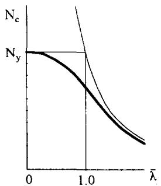
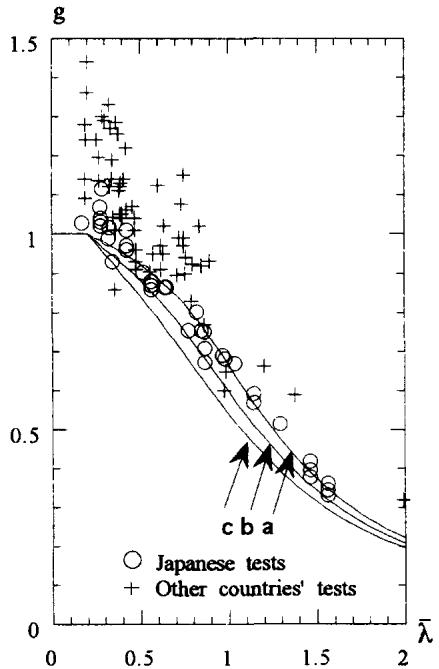
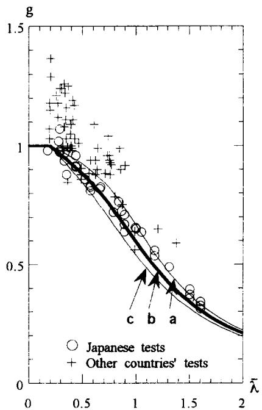
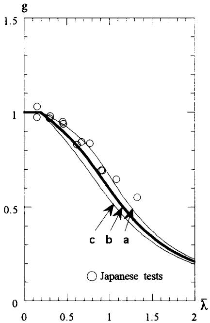
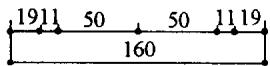
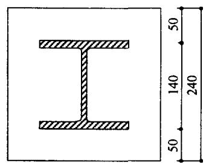
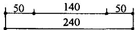
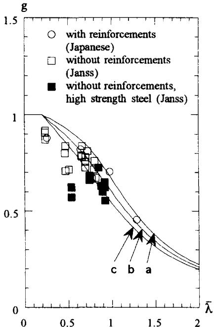

# Column Curves of Steel-Concrete Composite Members

# Ben Kato

Faculty of Engineering, Toyo University, 2100 Kujirai, Kawagoe City 350, Japan

(Received 4 September 1995; revised version received 25 April 1996; accepted 17 May 1996)

# ABSTRACT

Buckling strength curves of centrally loaded composite columns were investigated based on the available test results. Concrete-filled circular and square steel tubes and concrete-encased steel $H$ -section members were covered. It is demonstrated that the design formula given by ISO standard for steel structures can be applied to these composite columns with appropriate modifications for each type of column. Copyright © 1996 Elsevier Science Ltd

# NOTATION

A Sectional area in general

$A_{\mathrm{c}}$ Area of concrete

$A_{s}$ Sectional area of steel section

$a_{\mathrm{r}}$ Area of longitudinal reinforcing bars

$B$ Width of square hollow section, or coefficient

$E$ Modulus of elasticity of steel

$E_{\mathrm{c}}$ Modulus of elasticity of concrete

$f_{\mathrm{c}}$ Compressive strength of concrete

$g$ Reduction coefficient

$g_{\mathrm{e}}$ Reduction coefficient obtained by test

Moment of inertia of concrete

Moment of inertia of longitudinal reinforcing bars

Moment of inertia of steel section

$kL$ Effective column length

$N_{\mathrm{c}}$ （204 Buckling strength of centrally loaded column

$N_{\mathrm{cal}}$ Calculated buckling strength

<table><tr><td>Ncr</td><td>Eulerian elastic buckling strength</td></tr><tr><td>Ntest</td><td>Experimental buckling strength</td></tr><tr><td>Ny</td><td>Squash load</td></tr><tr><td>t</td><td>Wall thickness of hollow section</td></tr><tr><td>φ</td><td>Diameter of circular hollow section</td></tr><tr><td>λ</td><td>Relative slenderness</td></tr><tr><td>σy</td><td>Yield stress of steel</td></tr><tr><td>σyr</td><td>Yield stress of longitudinal reinforcing bars</td></tr></table>

# 1 BUCKLING STRENGTH OF CENTRALLY LOADED COMPOSITE COLUMNS

The buckling strength of centrally loaded columns, $N_{\mathrm{c}}$ , could be given by the general form as

$$
N _ {\mathrm {c}} = g N _ {\mathrm {y}} \tag {1}
$$

in which $N_{\mathrm{y}}$ is the squash load (maximum compressive strength which is not influenced by stability), and $g$ is the reduction coefficient given in terms of the relative slenderness $\bar{\lambda}$ . The relative slenderness $\bar{\lambda}$ is defined as

$$
\bar {\lambda} = \sqrt {\frac {N _ {\mathrm {y}}}{N _ {\mathrm {c r}}}} \tag {2}
$$

in which, $N_{\mathrm{cr}} = \pi^2 D / L^2$ is the Eulerian elastic buckling strength, and $D = (EI)$ is the elastic flexural rigidity of a column. $\tilde{\lambda}$ is related to the traditional slenderness, $\lambda = L / i$ , as follows: $N_{\mathrm{cr}} = A\pi^{2}\mathrm{E} / \lambda^{2}$ ( $A$ is the sectional area), and if the slenderness at which the Eulerian buckling stress attains to yield stress is denoted as $\lambda_{y}$ , namely $N_{\mathrm{y}} = A\sigma_{\mathrm{y}} = A\pi^{2}E / \lambda_{y}^{2}$ , then eqn (2) is written as

$$
\bar {\lambda} = \frac {\lambda}{\lambda_ {y}}. \tag {3}
$$

Thus, the relative slenderness, $\bar{\lambda}$ , is the slenderness normalized by $\lambda y$ (see Fig. 1). The actual column strength is lower than the ideal Eulerian buckling strength due to material and geometrical imperfections as shown in Fig. 1 by bold line and the reduction coefficient, $g$ , is the actual column strength reduction mode from the squash load, $N_{y}$ , in relation to $\bar{\lambda}$ .

In ISO standard for steel structure, $N_{y}$ and $g$ are given as follows:

  
Fig.1. Relative slenderness.

$$
N _ {\mathrm {y}} = A _ {\mathrm {s}} \sigma_ {\mathrm {y}} \tag {4}
$$

$$
g = B (1 - \sqrt {1 - C}) \tag {5}
$$

$$
B = \frac {1 + \alpha (\bar {\lambda} - \bar {\lambda} _ {0}) + \bar {\lambda} ^ {2}}{2 \bar {\lambda} ^ {2}}, C = (B \bar {\lambda}) ^ {- 2}
$$

$$
\bar {\lambda} _ {0} = 0. 2
$$

$$
\alpha = \left\{ \begin{array}{l} 0. 2 1 \text {f o r c u r v e} a \\ 0. 3 4 \text {f o r c u r v e} b \\ 0. 4 9 \text {f o r c u r v e} c \end{array} \right\}
$$

$$
\bar {\lambda} = \sqrt {\frac {N _ {\mathrm {y}} ^ {\prime}}{N _ {\mathrm {c r}}}} = \frac {k L}{\pi} \sqrt {\frac {A \sigma_ {\mathrm {y}}}{E I _ {\mathrm {s}}}}
$$

in which

$A_{s}$ : sectional area of steel section;

$kL$ : effective column length;

$E$ : modulus of elasticity of steel;

$I_{s}$ : moment of inertia of steel section;

$\sigma_{\mathbf{y}}$ yield stress of steel.

Three column strength reduction modes $a$ , $b$ and $c$ are provided depending on the degree of imperfection using the variable coefficient $\alpha$ . If one adopts this concept for the design of composite columns also, the squash load, $N_{y}$ , and the relative slenderness, $\bar{\lambda}$ , could be defined as

$$
N _ {\mathrm {y}} = A _ {\mathrm {s}} \sigma_ {\mathrm {y}} + \left(a _ {\mathrm {r}} \sigma_ {\mathrm {y r}}\right) + A _ {\mathrm {c}} f _ {\mathrm {c}} \tag {6}
$$

in which

$A_{\mathrm{c}}$ : area of concrete;

$f_{\mathrm{c}}$ : compressive strength of concrete;

$a_{\mathrm{r}}$ : area of longitudinal reinforcing bars for concrete-encased steel column if any;

$\sigma_{\mathrm{yr}}$ : yield stress of longitudinal reinforcing bars for concrete-encased steel column if any.

$$
\bar {\lambda} = \frac {k L}{\pi} \sqrt {\frac {A _ {\mathrm {s}} \sigma_ {\mathrm {y}} + \left(a _ {\mathrm {r}} \sigma_ {\mathrm {y r}}\right) + A _ {\mathrm {c}} f _ {\mathrm {c}}}{E \left(I _ {\mathrm {s}} + I _ {\mathrm {r}}\right) + E _ {\mathrm {c}} I _ {\mathrm {c}}}} \tag {7}
$$

in which

$I_{\mathrm{r}}$ : moment of inertia of longitudinal reinforcing bars for concrete-encased steel column;

$I_{\mathrm{c}}$ : moment of inertia of concrete;

$E_{\mathrm{c}}$ : modulus of elasticity of concrete.

In the following, the strength prediction using eqn (6) and eqn (7) and the reduction coefficient, $g$ , given in eqn (5) are compared with the available experimental results for concrete-filled steel tubular columns (circular and square) and concrete-encased steel columns (with and without longitudinal reinforcements), and the suitability of the prediction formulae are assessed.

# 2 CONCRETE-FILLED STEEL TUBULAR COLUMNNS

In concrete-filled steel tubular columns, longitudinal reinforcing bars are generally not installed, therefore the squash load, $N_{\mathrm{y}}$ , and the relative slenderness, $\bar{\lambda}$ , are written as

$$
N _ {\mathrm {y}} = A _ {\mathrm {s}} \sigma_ {\mathrm {y}} + A _ {\mathrm {c}} f _ {\mathrm {c}} \tag {6}
$$

$$
\bar {\lambda} = \frac {k L}{\pi} \sqrt {\frac {A _ {\mathrm {s}} \sigma_ {\mathrm {y}} + A _ {\mathrm {c}} f _ {\mathrm {c}}}{E I _ {\mathrm {s}} + E _ {\mathrm {c}} I _ {\mathrm {c}}}}. \tag {7'}
$$

# 2.1 Concrete-filled circular steel tube columns

Thirty-seven test results from Japan $^{2-4}$ and 63 test results from abroad $^{5}$ were collected. The variation of size and material properties covered in these tested specimens are $25.4 - 267.4 \, \mathrm{mm}$ in tube diameter, $275 - 682 \, \mathrm{N/mm}^2$ in yield

stress of steel and 20.3-66.2 $\mathrm{N} / \mathrm{mm}^2$ in compressive strength of concrete. For test specimens on which the modulus of elasticity of concrete, $E_{\mathrm{c}}$ , were not measured, $E_{\mathrm{c}}$ was estimated by eqn (8):

$$
E _ {\mathrm {c}} = 2. 0 5 8 \times 1 0 ^ {4} \times \sqrt {\frac {f _ {\mathrm {c}}}{1 9 . 6}}, \mathrm {N} / \mathrm {m m} ^ {2}. \tag {8}
$$

The column strength evaluation consists of the selection of the squash load, $N_{y}$ , and of the reduction coefficient, $g$ . First of all, the configuration of the reduction mode, $g$ , is surveyed. Namely, the experimental reduction coefficient, $g_{e}$ , is obtained from eqn (1) as

$$
g _ {\mathrm {e}} = \frac {N _ {\text {t e s t}}}{N _ {\mathrm {y}}} \tag {9}
$$

in which, $N_{\mathrm{test}}$ is the maximum column strength obtained by test, and $N_{\mathrm{y}}$ is the squash load calculated by eqn (6'). They are compared with the formulated reduction coefficient, $g$ , given by eqn (5) in Fig. 2. From this figure, it can be observed that the actual squash load is higher than the squash load given by eqn (6'). This may be caused by the increase of the compressive strength

  
Fig. 2. Concrete-filled circular steel tube columns, $1.0f_{c}$

of in-filled concrete due to the effect of confinement, and through a parametric study it was concluded that concrete strength could be factored by 1.1, and the curve $b$ could be used for the estimation of the reduction coefficient, $g$ .

The results of this modification are summarized in Fig. 3 and Table 1. The correlation between the formulated reduction mode (curve $b$ ) and the experimental reduction coefficients is depicted in Fig. 3, and the comparison of test results, $N_{\mathrm{test}}$ , and the calculated column strength, $N_{\mathrm{cal}}$ , using $1.1f_{\mathrm{c}}$ and curve $b$ is given in Table 1. The effect of confinement, namely the increase in concrete strength, cannot be represented by the simple term of $1.1f_{\mathrm{c}}$ , but it depends on the strength ratio and the stiffness ratio of steel and concrete, and therefore some scattering of experimental reduction coefficient in smaller slenderness regions is inevitable.

# 2.2 Concrete-filled square steel tube column

Thirteen test results from Japan $^{6,7}$ were collected but no test results from abroad were available. The yield stresses of steel are 412 and $431~\mathrm{N / mm^2}$ , and the compressive strength of concrete varies from 24.0 to $32.8~\mathrm{N / mm^2}$ . They are of moderate value. For test specimens on which the modulus of elasticity of concrete, $E_{\mathrm{c}}$ , were not measured, $E_{\mathrm{c}}$ was estimated by eqn (8). The experimental reduction coefficient, $g_{\mathrm{e}}$ , is estimated by eqn (9) in which

  
Fig. 3. Concrete-filled circular steel tube columns, $1.0f_{c}$

TABLE 1 Concrete-filled Steel Tubular Columns. Circular Hollow Sections $(1.1f_{\mathrm{c}})$   

<table><tr><td>No.</td><td>φ (mm)</td><td>t (mm)</td><td>kL (cm)</td><td>σy(N/mm2)</td><td>fc(N/mm2)</td><td>λ</td><td>Ncal(kN)</td><td>Ntest(kN)</td><td>Ntest/Ncal</td><td>Ref.</td></tr><tr><td>1</td><td>165.2</td><td>4.1</td><td>66.1</td><td>353</td><td>40.9</td><td>0.175</td><td>1599</td><td>1562</td><td>0.98</td><td>2</td></tr><tr><td>2</td><td></td><td></td><td>132.2</td><td></td><td></td><td>0.350</td><td>1516</td><td>1412</td><td>0.93</td><td></td></tr><tr><td>3</td><td></td><td></td><td>198.2</td><td></td><td></td><td>0.525</td><td>1397</td><td>1372</td><td>0.98</td><td></td></tr><tr><td>4</td><td></td><td></td><td>297.4</td><td></td><td></td><td>0.788</td><td>1171</td><td>1147</td><td>0.98</td><td></td></tr><tr><td>5</td><td></td><td></td><td>396.5</td><td></td><td></td><td>1.051</td><td>902</td><td>1019</td><td>1.13</td><td></td></tr><tr><td>6</td><td></td><td></td><td>495.6</td><td></td><td></td><td>1.313</td><td>675</td><td>782</td><td>1.16</td><td></td></tr><tr><td>7</td><td>190.7</td><td>5.5</td><td>115.0</td><td>505</td><td>48.3</td><td>0.289</td><td>2821</td><td>3148</td><td>1.12</td><td>3</td></tr><tr><td>8</td><td></td><td></td><td>345.0</td><td></td><td></td><td>0.866</td><td>2101</td><td>2133</td><td>1.01</td><td></td></tr><tr><td>9</td><td>267.4</td><td>6.4</td><td>160.0</td><td>461</td><td></td><td>0.280</td><td>4966</td><td>5188</td><td>1.04</td><td></td></tr><tr><td>10</td><td></td><td></td><td>480.0</td><td></td><td></td><td>0.840</td><td>3568</td><td>3903</td><td>1.09</td><td></td></tr><tr><td>11</td><td>190.7</td><td>5.5</td><td>115.0</td><td>505</td><td>55.9</td><td>0.335</td><td>2987</td><td>3063</td><td>1.02</td><td></td></tr><tr><td>12</td><td></td><td></td><td>230.0</td><td></td><td></td><td>0.669</td><td>2532</td><td>2612</td><td>1.03</td><td></td></tr><tr><td>13</td><td></td><td></td><td>345.0</td><td></td><td></td><td>1.000</td><td>1889</td><td>2059</td><td>1.09</td><td></td></tr><tr><td>14</td><td>267.4</td><td>6.4</td><td>160.0</td><td>461</td><td></td><td>0.331</td><td>5280</td><td>5181</td><td>0.98</td><td></td></tr><tr><td>15</td><td></td><td></td><td>320.0</td><td></td><td></td><td>0.662</td><td>4451</td><td>4534</td><td>1.02</td><td></td></tr><tr><td>16</td><td></td><td></td><td>480.0</td><td></td><td></td><td>0.994</td><td>3323</td><td>3626</td><td>1.08</td><td></td></tr><tr><td>17</td><td>114.3</td><td>3.1</td><td>67.0</td><td>348</td><td>53.5</td><td>0.288</td><td>896</td><td>898</td><td>1.00</td><td>4</td></tr><tr><td>18</td><td></td><td></td><td></td><td></td><td></td><td></td><td></td><td>904</td><td>1.01</td><td></td></tr><tr><td>19</td><td></td><td></td><td></td><td></td><td></td><td></td><td></td><td>910</td><td>1.02</td><td></td></tr><tr><td>20</td><td></td><td></td><td>102.0</td><td></td><td>53.4</td><td>0.439</td><td>842</td><td>888</td><td>1.05</td><td></td></tr><tr><td>21</td><td></td><td></td><td></td><td></td><td></td><td></td><td></td><td>849</td><td>1.01</td><td></td></tr><tr><td>22</td><td></td><td></td><td></td><td></td><td></td><td></td><td></td><td>845</td><td>1.00</td><td></td></tr><tr><td>23</td><td></td><td></td><td>133.5</td><td></td><td>56.0</td><td>0.576</td><td>809</td><td>784</td><td>0.97</td><td></td></tr><tr><td>24</td><td></td><td></td><td></td><td></td><td></td><td></td><td></td><td>773</td><td>0.96</td><td></td></tr><tr><td>25</td><td></td><td></td><td></td><td></td><td></td><td></td><td></td><td>794</td><td>0.98</td><td></td></tr><tr><td>26</td><td></td><td></td><td>204.0</td><td></td><td>57.5</td><td>0.891</td><td>643</td><td>617</td><td>0.96</td><td></td></tr><tr><td>27</td><td></td><td></td><td></td><td></td><td></td><td></td><td></td><td>649</td><td>1.01</td><td></td></tr><tr><td>28</td><td></td><td></td><td></td><td></td><td></td><td></td><td></td><td>688</td><td>1.07</td><td></td></tr><tr><td>29</td><td></td><td></td><td>270.0</td><td>340</td><td>57.5</td><td>1.176</td><td>471</td><td>516</td><td>1.09</td><td></td></tr><tr><td>30</td><td></td><td></td><td></td><td></td><td></td><td></td><td></td><td>537</td><td>1.14</td><td></td></tr><tr><td>31</td><td></td><td></td><td></td><td></td><td></td><td></td><td></td><td>536</td><td>1.14</td><td></td></tr><tr><td>32</td><td></td><td></td><td>337.0</td><td></td><td>63.1</td><td>1.506</td><td>345</td><td>401</td><td>1.16</td><td></td></tr><tr><td>33</td><td></td><td></td><td></td><td></td><td></td><td></td><td></td><td>362</td><td>1.05</td><td></td></tr><tr><td>34</td><td></td><td></td><td></td><td></td><td></td><td></td><td></td><td>379</td><td>1.10</td><td></td></tr><tr><td>35</td><td></td><td></td><td>372.0</td><td></td><td>55.1</td><td>1.605</td><td>286</td><td>320</td><td>1.12</td><td></td></tr><tr><td>36</td><td></td><td></td><td></td><td></td><td></td><td></td><td></td><td>293</td><td>1.02</td><td></td></tr><tr><td>37</td><td></td><td></td><td></td><td></td><td></td><td></td><td></td><td>305</td><td>1.07</td><td></td></tr></table>

TABLE 1 Continued   

<table><tr><td>No.</td><td>φ (mm)</td><td>t (mm)</td><td>kL (cm)</td><td>σy(N/mm2)</td><td>fc(N/mm2)</td><td>λ</td><td>Ncal(kN)</td><td>Ntest(kN)</td><td>Ntest/Ncal</td><td>Ref.</td></tr><tr><td colspan="11">Foreign tests</td></tr><tr><td>1</td><td>139.7</td><td></td><td>91.4</td><td>682</td><td>38.4</td><td>0.361</td><td>2878</td><td>3047</td><td>1.06</td><td></td></tr><tr><td>2</td><td>139.7</td><td></td><td>304.8</td><td>682</td><td></td><td>1.204</td><td>1459</td><td>2002</td><td>1.37</td><td></td></tr><tr><td>3</td><td>177.8</td><td></td><td>304.8</td><td>593</td><td></td><td>0.899</td><td>3113</td><td>4310</td><td>1.38</td><td></td></tr><tr><td>4</td><td>139.7</td><td></td><td>91.4</td><td>682</td><td></td><td>0.361</td><td>2878</td><td>2598</td><td>0.90</td><td></td></tr><tr><td>5</td><td>177.8</td><td></td><td>91.4</td><td>593</td><td></td><td>0.270</td><td>4587</td><td>5253</td><td>1.14</td><td></td></tr><tr><td>6</td><td>177.8</td><td></td><td>91.4</td><td>593</td><td></td><td>0.270</td><td>4587</td><td>5525</td><td>1.20</td><td></td></tr><tr><td>7</td><td>95.0</td><td></td><td>86.1</td><td>275</td><td>20.3</td><td>0.349</td><td>929</td><td>1019</td><td>1.10</td><td></td></tr><tr><td>8</td><td></td><td></td><td>142.0</td><td></td><td></td><td>0.575</td><td>837</td><td>930</td><td>1.11</td><td></td></tr><tr><td>9</td><td></td><td></td><td>198.1</td><td></td><td></td><td>0.803</td><td>710</td><td>903</td><td>1.27</td><td></td></tr><tr><td>10</td><td></td><td></td><td>86.1</td><td>350</td><td>25.0</td><td>0.368</td><td>501</td><td>667</td><td>1.33</td><td></td></tr><tr><td>11</td><td></td><td></td><td>142.0</td><td></td><td></td><td>0.607</td><td>445</td><td>583</td><td>1.31</td><td></td></tr><tr><td>12</td><td></td><td></td><td>198.1</td><td></td><td></td><td>0.846</td><td>371</td><td>529</td><td>1.43</td><td></td></tr><tr><td>13</td><td>215.9</td><td></td><td>222.0</td><td>292</td><td>22.8</td><td>0.395</td><td>1524</td><td>1650</td><td>1.08</td><td>5</td></tr><tr><td>14</td><td></td><td></td><td></td><td>292</td><td>29.8</td><td>0.413</td><td>1750</td><td>2264</td><td>1.29</td><td></td></tr><tr><td>15</td><td></td><td></td><td></td><td>392</td><td>22.8</td><td>0.428</td><td>2055</td><td>2442</td><td>1.19</td><td></td></tr><tr><td>16</td><td></td><td></td><td></td><td>350</td><td>29.8</td><td>0.426</td><td>2252</td><td>2869</td><td>1.27</td><td></td></tr><tr><td>17</td><td>95.0</td><td></td><td>203.2</td><td>338</td><td>24.0</td><td>0.855</td><td>355</td><td>463</td><td>1.30</td><td></td></tr><tr><td>18</td><td>120.9</td><td></td><td>104.9</td><td>312</td><td>21.1</td><td>0.332</td><td>537</td><td>721</td><td>1.34</td><td></td></tr><tr><td>19</td><td></td><td></td><td></td><td></td><td>24.2</td><td>0.337</td><td>663</td><td>854</td><td>1.29</td><td></td></tr><tr><td>20</td><td></td><td></td><td>231.1</td><td></td><td>21.1</td><td>0.731</td><td>509</td><td>636</td><td>1.25</td><td></td></tr><tr><td>21</td><td></td><td></td><td></td><td></td><td>24.2</td><td>0.743</td><td>529</td><td>725</td><td>1.37</td><td></td></tr><tr><td>22</td><td></td><td></td><td>104.9</td><td>343</td><td>21.1</td><td>0.345</td><td>859</td><td>1010</td><td>1.18</td><td></td></tr><tr><td>23</td><td></td><td></td><td></td><td></td><td>24.2</td><td>0.349</td><td>892</td><td>1090</td><td>1.22</td><td></td></tr><tr><td>24</td><td></td><td></td><td>231.1</td><td></td><td>21.1</td><td>0.760</td><td>682</td><td>801</td><td>1.17</td><td></td></tr><tr><td>25</td><td></td><td></td><td></td><td></td><td>24.2</td><td>0.769</td><td>699</td><td>867</td><td>1.24</td><td></td></tr><tr><td>26</td><td>25.4</td><td></td><td>106.7</td><td>524</td><td>27.9</td><td>2.005</td><td>11</td><td>15</td><td>1.36</td><td></td></tr><tr><td>27</td><td>38.1</td><td></td><td></td><td></td><td></td><td>1.379</td><td>73</td><td>110</td><td>1.50</td><td></td></tr><tr><td>28</td><td>50.8</td><td></td><td></td><td></td><td></td><td>0.990</td><td>114</td><td>121</td><td>1.06</td><td></td></tr><tr><td>29</td><td>76.2</td><td></td><td></td><td></td><td>27.3</td><td>0.642</td><td>265</td><td>320</td><td>1.21</td><td></td></tr><tr><td>30</td><td>127.3</td><td></td><td>50.0</td><td>371</td><td>66.2</td><td>0.198</td><td>1115</td><td>1285</td><td>1.15</td><td></td></tr><tr><td>31</td><td></td><td></td><td></td><td>329</td><td></td><td>0.196</td><td>1089</td><td>1285</td><td>1.18</td><td></td></tr><tr><td>32</td><td>127.0</td><td></td><td>50.8</td><td>371</td><td></td><td>0.195</td><td>1267</td><td>1303</td><td>1.03</td><td></td></tr><tr><td>33</td><td></td><td></td><td></td><td>329</td><td></td><td>0.191</td><td>1218</td><td>1303</td><td>1.07</td><td></td></tr><tr><td>34</td><td>101.6</td><td></td><td>152.4</td><td>605</td><td>34.1</td><td>0.752</td><td>641</td><td>818</td><td>1.28</td><td></td></tr><tr><td>35</td><td></td><td></td><td></td><td></td><td></td><td></td><td>641</td><td>801</td><td>1.25</td><td></td></tr><tr><td>36</td><td>120.9</td><td></td><td>104.9</td><td>452</td><td>24.4</td><td>0.395</td><td>981</td><td>1157</td><td>1.18</td><td></td></tr><tr><td>37</td><td></td><td></td><td></td><td></td><td>29.6</td><td>0.389</td><td>934</td><td>1094</td><td>1.17</td><td></td></tr><tr><td>38</td><td></td><td></td><td></td><td></td><td>25.9</td><td>0.385</td><td>896</td><td>952</td><td>1.06</td><td></td></tr><tr><td>39</td><td>152.4</td><td></td><td>227.1</td><td>415</td><td>20.9</td><td>0.622</td><td>827</td><td>939</td><td>1.13</td><td></td></tr><tr><td>40</td><td></td><td></td><td></td><td></td><td></td><td></td><td>827</td><td>881</td><td>1.06</td><td></td></tr><tr><td>41</td><td>76.5</td><td></td><td>152.4</td><td>364</td><td>25.0</td><td>0.759</td><td>197</td><td>245</td><td>1.24</td><td></td></tr><tr><td>42</td><td></td><td></td><td>61.0</td><td></td><td>40.9</td><td>0.330</td><td>321</td><td>423</td><td>1.32</td><td></td></tr><tr><td>43</td><td></td><td></td><td></td><td></td><td>25.9</td><td>0.305</td><td>257</td><td>330</td><td>1.28</td><td></td></tr></table>

TABLE 1 Continued   

<table><tr><td>No.</td><td>φ (mm)</td><td>t (mm)</td><td>kL (cm)</td><td>σy(N/mm2)</td><td>fc(N/mm2)</td><td>λ</td><td>Ncal(kN)</td><td>Ntest(kN)</td><td>Ntest/Ncal</td><td>Ref.</td></tr><tr><td>44</td><td>114.3</td><td></td><td>83.8</td><td>414</td><td>28.9</td><td>0.319</td><td>719</td><td>734</td><td>1.02</td><td></td></tr><tr><td>45</td><td></td><td></td><td></td><td></td><td></td><td></td><td>719</td><td>756</td><td>1.05</td><td></td></tr><tr><td>46</td><td>127.0</td><td></td><td>149.9</td><td>289</td><td>35.2</td><td>0.489</td><td>644</td><td>636</td><td>0.99</td><td></td></tr><tr><td>47</td><td></td><td></td><td></td><td></td><td></td><td></td><td>644</td><td>623</td><td>0.97</td><td></td></tr><tr><td>48</td><td></td><td></td><td></td><td></td><td></td><td></td><td>644</td><td>658</td><td>1.02</td><td></td></tr><tr><td>49</td><td>152.4</td><td></td><td>149.9</td><td>330</td><td>21.0</td><td>0.388</td><td>605</td><td>681</td><td>1.13</td><td></td></tr><tr><td>50</td><td></td><td></td><td></td><td></td><td>25.9</td><td>0.404</td><td>685</td><td>725</td><td>1.06</td><td></td></tr><tr><td>51</td><td></td><td></td><td></td><td></td><td></td><td></td><td>685</td><td>734</td><td>1.07</td><td></td></tr><tr><td>52</td><td>168.1</td><td></td><td>81.3</td><td>298</td><td>43.3</td><td>0.205</td><td>1636</td><td>2233</td><td>1.36</td><td></td></tr><tr><td>53</td><td></td><td></td><td></td><td></td><td></td><td></td><td>1636</td><td>2113</td><td>1.29</td><td></td></tr><tr><td>54</td><td>88.9</td><td></td><td>172.7</td><td>400</td><td>40.0</td><td>0.870</td><td>554</td><td>614</td><td>1.11</td><td></td></tr><tr><td>55</td><td></td><td></td><td>142.2</td><td></td><td>39.6</td><td>0.712</td><td>624</td><td>712</td><td>1.14</td><td></td></tr><tr><td>56</td><td></td><td></td><td>111.8</td><td></td><td>39.1</td><td>0.562</td><td>692</td><td>716</td><td>1.03</td><td></td></tr><tr><td>57</td><td></td><td></td><td>81.3</td><td></td><td>41.8</td><td>0.411</td><td>763</td><td>916</td><td>1.20</td><td></td></tr><tr><td>58</td><td></td><td></td><td>50.8</td><td></td><td>40.8</td><td>0.256</td><td>804</td><td>992</td><td>1.23</td><td></td></tr><tr><td>59</td><td>88.9</td><td></td><td>172.7</td><td>482</td><td>41.4</td><td>0.987</td><td>241</td><td>225</td><td>0.93</td><td></td></tr><tr><td>60</td><td></td><td></td><td>142.2</td><td></td><td>37.0</td><td>0.802</td><td>271</td><td>294</td><td>1.08</td><td></td></tr><tr><td>61</td><td></td><td></td><td>111.8</td><td></td><td>40.8</td><td>0.639</td><td>324</td><td>356</td><td>1.10</td><td></td></tr><tr><td>62</td><td></td><td></td><td>81.3</td><td></td><td></td><td>0.465</td><td>355</td><td>400</td><td>1.13</td><td></td></tr><tr><td>63</td><td></td><td></td><td>50.8</td><td></td><td></td><td>0.291</td><td>380</td><td>489</td><td>1.29</td><td></td></tr></table>

$\phi$ diameter of circular hollow section, $t$ wall thickness.   
$\frac{N_{\mathrm{test}}}{N_{\mathrm{cal}}}$ .. $n = 100$ $\bar{X} = 1.135$ $S = 0.127$   
$n$ : number of specimens, $\bar{X}$ : mean value, $S$ : standard deviation.

$N_{y}$ is calculated by eqn (6'). In Fig. 4, they are compared with the formulated reduction coefficient, $g$ , given by eqn (5). From this figure, it can be observed that eqn (6') can be applied without modification for the estimation of the squash load, $N_{y}$ , i.e. the effect of confinement of concrete is insignificant, and that the curve $b$ can be used for the estimation of the reduction coefficient, $g$ . The test results, $N_{\mathrm{test}}$ , and the calculated column strength, $N_{\mathrm{cal}}$ , using $1.0f_{\mathrm{c}}$ and curve $b$ are compared in Table 2.

# 3 CONCRETE-ENCASED STEEL COLUMN

The squash load, $N_{\mathrm{y}}$ , and the relative slenderness, $\bar{\lambda}$ , are given by eqn (6) and eqn (7), respectively. Only four test results of specimens with longitudinal reinforcements from Japan8 and 30 test results of specimens without longitudinal reinforcements by Anslijn & Janss9 are available (see Fig. 5). All test

TABLE 2 Concrete-filled Steel Tubular Columns. Square Hollow Sections $(1.0f_{\mathrm{c}})$   

<table><tr><td>No.</td><td>B (mm)</td><td>t (mm)</td><td>kL (cm)</td><td>σv(N/mm2)</td><td>fc(N/mm2)</td><td>λ</td><td>Ncal</td><td>Ntest</td><td>Ntest/Ncal</td><td>Ref.</td></tr><tr><td>1</td><td>149.8</td><td>4.3</td><td>59.9</td><td>412</td><td>32.0</td><td>0.151</td><td>1639</td><td>1598</td><td>0.97</td><td>6</td></tr><tr><td>2</td><td></td><td></td><td>119.8</td><td></td><td>31.9</td><td>0.302</td><td>1578</td><td>1586</td><td>1.01</td><td></td></tr><tr><td>3</td><td></td><td></td><td>179.8</td><td></td><td>32.8</td><td>0.455</td><td>1495</td><td>1573</td><td>1.05</td><td></td></tr><tr><td>4</td><td></td><td></td><td>269.6</td><td></td><td>30.3</td><td>0.674</td><td>1281</td><td>1356</td><td>1.06</td><td></td></tr><tr><td>5</td><td></td><td></td><td>359.5</td><td></td><td>32.2</td><td>0.906</td><td>1080</td><td>1143</td><td>1.06</td><td></td></tr><tr><td>6</td><td></td><td></td><td>449.4</td><td></td><td>32.2</td><td>1.325</td><td>848</td><td>909</td><td>1.07</td><td></td></tr><tr><td>7</td><td>60.2</td><td>1.5</td><td>25.0</td><td>431</td><td>25.5</td><td>0.154</td><td>231</td><td>238</td><td>1.03</td><td>7</td></tr><tr><td>8</td><td></td><td></td><td>50.0</td><td></td><td></td><td>0.309</td><td>222</td><td>227</td><td>1.02</td><td></td></tr><tr><td>9</td><td></td><td></td><td>75.0</td><td></td><td></td><td>0.463</td><td>208</td><td>217</td><td>1.04</td><td></td></tr><tr><td>10</td><td></td><td></td><td>100.0</td><td></td><td></td><td>0.620</td><td>191</td><td>192</td><td>1.00</td><td></td></tr><tr><td>11</td><td></td><td></td><td>125.0</td><td></td><td></td><td>0.770</td><td>171</td><td>193</td><td>1.13</td><td></td></tr><tr><td>12</td><td></td><td></td><td>150.0</td><td></td><td>24.0</td><td>0.920</td><td>146</td><td>157</td><td>1.07</td><td></td></tr><tr><td>13</td><td></td><td></td><td>175.0</td><td></td><td>24.0</td><td>1.080</td><td>124</td><td>146</td><td>1.18</td><td></td></tr></table>

$B$ : width of square hollow section, $t$ : wall thickness.   
$N_{\mathrm{test}}$ .. $n = 13$ $\bar{X} = 1.053$ $S = 0.053$

  
Fig. 4. Concrete-filled square steel tube columns, $1.0f_{c}$

  
$\mathbf{H}\cdot 100\cdot \mathbf{H}$ with re-bars

  
IPB140   
Fig. 5. Concrete-encased steel sections.

specimens buckled about the weak axis of the steel H-section. The variation of material properties covered are 269–380 N/mm² in yield stress of steel and 18.5–38.0 N/mm² in compressive strength of concrete in major parts of these test specimens. But some special test specimens using high yield stress (488–502 N/mm² in yield stress) and regular concrete (31.4–38.0 N/mm² in compressive strength) were also tested. For test specimens on which the modulus of elasticity of concrete, $E_{\mathrm{c}}$ , were not measured, $E_{\mathrm{c}}$ was estimated by eqn (8).

First of all, the experimental reduction coefficients, $g_{\mathrm{e}}$ , were estimated by

  
Fig. 6. Concrete-encased steel columns, $1.0f_{c}$

  
Fig. 7. Concrete-encased steel columns, $0.8f_{c}$

eqn (9), in which $N_{\mathrm{y}}$ is calculated by eqn (6). In Fig. 6, they are compared with the formulated reduction coefficient, $g$ , given by eqn (5). From this figure it can be observed that actual squash load is lower than the squash load given by eqn (6). From the behavioural viewpoint, it can be suspected that the periphery zone of the concrete section had cracked prior to the occurrence of buckling. Through a parametric study, similar to the previous case, better fitting can be obtained using the reduced concrete strength, $0.8f_{\mathrm{c}}$ , for the estimation of squash load, and adopting curve $b$ for the reduction coefficient. The comparison of the reduction mode thus modified is given in Fig. 7, and

TABLE 3 Concrete-encased Steel Columns $(0.8f_{\mathrm{c}})$ .With Longitudinal Reinforcements (4-6 mm $\phi$ $\sigma_{\mathrm{yr}} = 376~\mathrm{N / mm}^2)$   

<table><tr><td>No.</td><td>Steel shape</td><td>Concrete (cm × cm)</td><td>kL (cm)</td><td>σy(N/mm2)</td><td>fc(N/mm2)</td><td>λ</td><td>Ncal(kN)</td><td>Ntest(kN)</td><td>Ntest/Ncal</td><td>Ref.</td></tr><tr><td>1</td><td>H.100</td><td>16 × 16</td><td>92.4</td><td>306</td><td>18.5</td><td>0.250</td><td>1030</td><td>996</td><td>0.97</td><td>8</td></tr><tr><td>2</td><td>100.6.8</td><td></td><td>230.9</td><td>298</td><td>21.4</td><td>0.618</td><td>902</td><td>974</td><td>1.08</td><td></td></tr><tr><td>3</td><td></td><td></td><td>346.4</td><td>304</td><td>22.5</td><td>0.937</td><td>729</td><td>874</td><td>1.20</td><td></td></tr><tr><td>4</td><td></td><td></td><td>461.9</td><td>304</td><td>20.6</td><td>1.228</td><td>487</td><td>522</td><td>1.07</td><td></td></tr></table>

the correlation between test results, $N_{\mathrm{test}}$ , and the calculated column strength, $N_{\mathrm{cal}}$ , using $0.8f_{\mathrm{c}}$ and curve $b$ is shown in Tables 3 and 4. Both from this figure and the tables, it should be noted that the combination of high strength steel section and regular strength concrete encasement without longitudinal

TABLE 4 Concrete-encased Steel Columns $(0.8f_{\mathrm{c}})$ . Without Longitudinal Reinforcements   

<table><tr><td>No.</td><td>Steel shape</td><td>Concrete (cm × cm)</td><td>kL (cm)</td><td>σy(N/mm2)</td><td>fc(N/mm2)</td><td>λ</td><td>Ncal(kN)</td><td>Ntest(kN)</td><td>Ntest/Ncal</td><td>Ref.</td></tr><tr><td>1</td><td>IPE220</td><td>21 × 32</td><td>348.7</td><td>273</td><td>29.2</td><td>0.676</td><td>1951</td><td>2285</td><td>1.17</td><td>9</td></tr><tr><td>2</td><td></td><td></td><td>348.7</td><td>270</td><td>37.6</td><td>0.745</td><td>2169</td><td>2530</td><td>1.17</td><td></td></tr><tr><td>3</td><td></td><td></td><td>348.7</td><td>269</td><td>33.7</td><td>0.720</td><td>2056</td><td>2059</td><td>1.00</td><td></td></tr><tr><td>4</td><td></td><td></td><td>348.5</td><td>488</td><td>33.6</td><td>0.844</td><td>2376</td><td>2305</td><td>0.97</td><td></td></tr><tr><td>5</td><td></td><td></td><td>348.5</td><td>488</td><td>31.9</td><td>0.802</td><td>2407</td><td>2707</td><td>1.12</td><td></td></tr><tr><td>6</td><td></td><td></td><td>348.3</td><td>492</td><td>32.0</td><td>0.830</td><td>2361</td><td>2363</td><td>1.00</td><td></td></tr><tr><td>7</td><td>IPB140</td><td>24 × 24</td><td>428.0</td><td>285</td><td>38.0</td><td>0.763</td><td>2087</td><td>2148</td><td>1.03</td><td></td></tr><tr><td>8</td><td></td><td></td><td>428.1</td><td>285</td><td>35.1</td><td>0.759</td><td>2002</td><td>2177</td><td>1.09</td><td></td></tr><tr><td>9</td><td></td><td></td><td>427.6</td><td>274</td><td>33.6</td><td>0.749</td><td>1969</td><td>2089</td><td>1.06</td><td></td></tr><tr><td>10</td><td></td><td></td><td>348.6</td><td>293</td><td>33.6</td><td>0.727</td><td>2035</td><td>2344</td><td>1.15</td><td></td></tr><tr><td>11</td><td></td><td></td><td>347.1</td><td>293</td><td>29.2</td><td>0.614</td><td>2039</td><td>2177</td><td>1.07</td><td></td></tr><tr><td>12</td><td></td><td></td><td>347.8</td><td>293</td><td>435.1</td><td>0.621</td><td>2235</td><td>2579</td><td>1.15</td><td></td></tr><tr><td>13</td><td></td><td></td><td>249.0</td><td>276</td><td>37.6</td><td>0.440</td><td>2495</td><td>2628</td><td>1.05</td><td></td></tr><tr><td>14</td><td></td><td></td><td>247.6</td><td>276</td><td>38.0</td><td>0.439</td><td>2508</td><td>2236</td><td>0.90</td><td></td></tr><tr><td>15</td><td></td><td></td><td>248.8</td><td>276</td><td>33.6</td><td>0.437</td><td>2342</td><td>2344</td><td>1.00</td><td></td></tr><tr><td>16</td><td></td><td></td><td>128.8</td><td>276</td><td>33.6</td><td>0.226</td><td>2534</td><td>2550</td><td>1.01</td><td></td></tr><tr><td>17</td><td></td><td></td><td>128.2</td><td>276</td><td>29.2</td><td>0.223</td><td>2364</td><td>2471</td><td>1.04</td><td></td></tr><tr><td>18</td><td></td><td></td><td>125.3</td><td>276</td><td>35.4</td><td>0.221</td><td>2621</td><td>2746</td><td>1.05</td><td></td></tr><tr><td>19</td><td></td><td></td><td>349.1</td><td>380</td><td>31.4</td><td>0.662</td><td>2338</td><td>2354</td><td>1.01</td><td></td></tr><tr><td>20</td><td></td><td></td><td>348.3</td><td>380</td><td>33.7</td><td>0.662</td><td>2425</td><td>2628</td><td>1.08</td><td></td></tr><tr><td>21</td><td></td><td></td><td>348.5</td><td>380</td><td>32.0</td><td>0.662</td><td>2359</td><td>2471</td><td>1.05</td><td></td></tr><tr><td>22</td><td></td><td></td><td>427.4</td><td>502</td><td>31.4</td><td>0.881</td><td>2326</td><td>2354</td><td>1.01</td><td></td></tr><tr><td>23</td><td></td><td></td><td>427.5</td><td>502</td><td>33.7</td><td>0.882</td><td>2377</td><td>2157</td><td>0.91</td><td></td></tr><tr><td>24</td><td></td><td></td><td>427.4</td><td>502</td><td>32.1</td><td>0.881</td><td>2340</td><td>2481</td><td>1.06</td><td></td></tr><tr><td>25</td><td></td><td></td><td>348.9</td><td>488</td><td>31.9</td><td>0.714</td><td>2647</td><td>2471</td><td>0.93</td><td></td></tr><tr><td>26</td><td></td><td></td><td>348.8</td><td>488</td><td>33.7</td><td>0.714</td><td>2705</td><td>2618</td><td>0.97</td><td></td></tr><tr><td>27</td><td></td><td></td><td>348.7</td><td>488</td><td>32.1</td><td>0.713</td><td>2663</td><td>2569</td><td>0.96</td><td></td></tr><tr><td>28</td><td></td><td></td><td>248.5</td><td>500</td><td>33.6</td><td>0.485</td><td>3150</td><td>2432</td><td>0.77</td><td></td></tr><tr><td>29</td><td></td><td></td><td>248.4</td><td>500</td><td>38.0</td><td>0.512</td><td>3277</td><td>2363</td><td>0.72</td><td></td></tr><tr><td>30</td><td></td><td></td><td>248.8</td><td>500</td><td>37.6</td><td>0.512</td><td>3262</td><td>2550</td><td>0.78</td><td></td></tr></table>

Regular steel, $\frac{N_{\mathrm{test}}}{N_{\mathrm{cal}}}:$ $n = 22$ $\bar{X} = 1.064$ $S = 0.068$   
High strength steel, $\frac{N_{\mathrm{test}}}{N_{\mathrm{cal}}}$ : $n = 12$ , $\bar{X} = 0.933$ , $S = 0.116$ .

reinforcements will result in a risky prediction, especially in short columns. They are shown in bold face in Table 4.

# 4 SUGGESTED DESIGN FORMULAE

From the foregoing survey, the following design formulae can be suggested.

# 4.1 Concrete-filled steel tubular columns

$$
N _ {\mathrm {c}} = g N _ {\mathrm {y}} (1)
$$

$$
N _ {\mathrm {y}} = A _ {\mathrm {s}} \sigma_ {\mathrm {y}} + \beta A _ {\mathrm {c}} f _ {\mathrm {c}} + \left(a _ {\mathrm {r}} \sigma_ {\mathrm {y r}}\right) \tag {10}
$$

$$
\beta = \begin{array}{l} 1. 1 \text {f o r c o n c r e t e - f i l l e d c i r c u l a r t u b e c o l u m n s} \\ 1. 0 \text {f o r c o n c r e t e - f i l l e d s q u a r e t u b e c o l u m n s} \end{array}
$$

$$
g = B (1 - \sqrt {1 - C}) \tag {11}
$$

$$
B = \frac {1 + 0 . 3 4 (\bar {\lambda} - 0 . 2) + \bar {\lambda} ^ {2}}{2 \bar {\lambda} ^ {2}}, C = (B \bar {\lambda}) ^ {- 2}
$$

$$
\bar {\lambda} = \frac {k L}{\pi} \sqrt {\frac {A _ {\mathrm {s}} \sigma_ {\mathrm {y}} + \beta A _ {\mathrm {c}} f _ {\mathrm {c}}}{E I _ {\mathrm {s}} + E _ {\mathrm {c}} I _ {\mathrm {c}}}}. \tag {12}
$$

# 4.2 Concrete-encased steel columns

Replacing $N_{\mathrm{y}}$ with $N_{\mathrm{y}}$ from eqn (13) and replace $\bar{\lambda}$ with $\bar{\lambda}$ from eqn (14) gives:

$$
N _ {\mathrm {y}} = A _ {\mathrm {s}} \sigma_ {\mathrm {y}} + \left(a _ {\mathrm {r}} \sigma_ {\mathrm {y r}}\right) + 0. 8 A _ {\mathrm {c}} f _ {\mathrm {c}} \tag {13}
$$

$$
\bar {\lambda} = \frac {k L}{\pi} \sqrt {\frac {A _ {\mathrm {s}} \sigma_ {\mathrm {y}} + \left(a _ {r} \sigma_ {\mathrm {y r}}\right) + 0 . 8 A _ {\mathrm {c}} f _ {\mathrm {c}}}{E I _ {\mathrm {s}} + \left(E I _ {\mathrm {r}}\right) + E _ {\mathrm {c}} J _ {\mathrm {c}}}}. \tag {14}
$$

The combination of high strength steel section and regular strength concrete for encasement should be avoided.

# 5 CONCLUSIONS

The basic approach for assessing the buckling strength of steel-concrete composite columns is quite the same as that of Eurocode $4^{10}$ or ECCS Recommendations. But in these rules, the effective concrete strength for each type of composite column for assessing the squash load and the selection of buckling curves $(a,b,c)$ for composite columns are not clearly specified. The following findings obtained from this study will improve the design practice of composite columns:

(1) For the reduction coefficient, curve $b$ of ISO standard or Eurocode 4 could be used for all types of composite columns.   
(2) In assessing the squash load, $N_{\mathrm{y}}$ , by eqn (10), $\beta$ could be taken as $\beta = 1.1$ for concrete-filled circular tube columns; $\beta = 1.0$ for concrete-filled square tube columns; $\beta = 0.8$ for concrete-encased steel columns.

For concrete-encased steel columns, the combination of high strength steel section and regular strength concrete for encasement can not be recommended.

# REFERENCES

1. ISO/DIS 10721, Steel structures—materials and design (this draft was approved on 2 December 1994 as an international standard).   
2. CFT Working Group, Compression test on concrete-filled circular steel tube columns. Kozai Club, December 1993 (in Japanese).   
3. Masuo, K. et al., Buckling behavior of concrete-filled circular steel tubular columns using lightweight concrete. Proc. of the International Conference on Composite Construction, ASCCS, Fukuoka, Japan, 1991, pp. 95-100.   
4. Sasaki, R., Experimental study on buckling strength of composite columns having steel tube. Annual Assembly of Architectural Institute of Japan, October 1984, pp. 2735-2736 (in Japanese).   
5. Task Group 20, SSRC, a specification for the design of steel-concrete composite columns. Engineering Journal, AISC, 4th Quarter/1979, pp. 101-145.   
6. Matsui, C., Stability and post-buckling behavior of concrete-filled square tubular columns. Journal of Structural Engineering, 39 (1993) pp. 323-334.   
7. Nakamura, T., Experimental study on compression strength of concrete-filled square tubular steel columns. Journal of Structural Engineering, 40B (1994) 411-417.   
8. Matsui, C. et al., Study on elastic-plastic behavior of concrete-encased columns subjected to eccentric axial thrust. Annual Assembly of Architectural Institute of Japan, September 1979, pp. 1627-1628 (in Japanese).   
9. Anslijn, R. and Janss, J., Le calcul de charges ultimes des colonnes metalliques enrobees de beton. C.R.I.F., Report MT89, April 1974, Brussels.   
10. Eurocode No. 4, Common unified rules for composite steel and concrete structures, ENV 1994-1-1.   
11. ECCS Recommendations for composite structures, Construction Press.