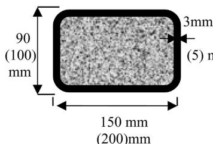
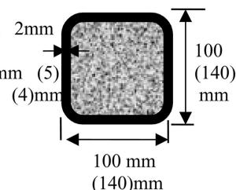
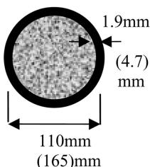
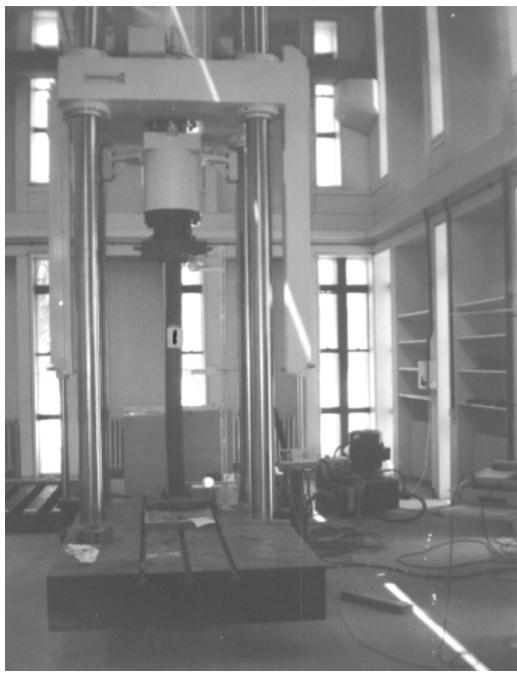
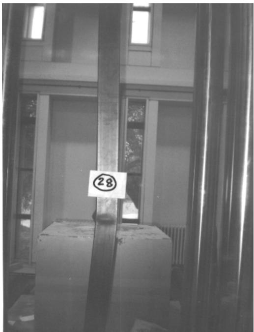
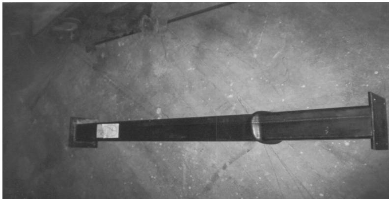
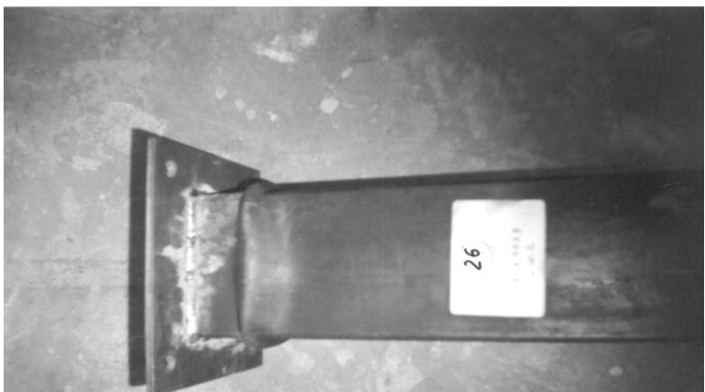
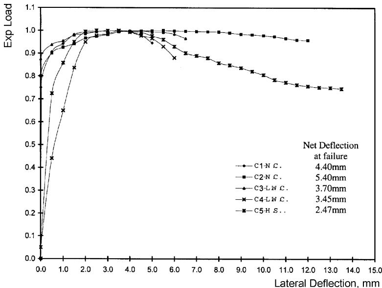
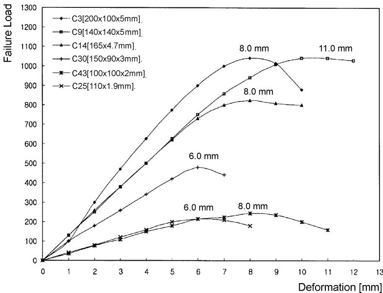

# Failure of lightweight aggregate concrete-filled steel tubular columns

Shehdeh Ghannam†

Wadi Seer Engineering College， Balqa’ Applied University， Jordan

Yahia Abdel Jawad‡

Faculty of Engineering and Technology， University of Science and Technology， Jordan

Yasser Hunaiti‡

Faculty of Engineering and Technology， University of Jordan，Amman， Jordan

(Received August 26, 2003, Accepted February 3, 2004)

Abstract. Tests on steel tubular columns of square, rectangular and circular section filled with normal and lightweight aggregate concrete were conducted to investigate the failure modes of such composite columns. Thirty-six full scale columns filled with lightweight and normal weight aggregate concrete, eighteen specimens for each, were tested under axial loads. Nine hollow steel sections of similar specimens were also tested and results were compared to those of filled sections. The test results were illustrated by a number of load-deflection and axial deformation curves. The results showed that both types of filled columns failed due to overall buckling, while hollow steel columns failed due to bulging at their ends (local buckling). According to the above-mentioned results, and due to low specific gravity and thermal conductivity of the lightweight concrete the further interest should be concentrated in replacing the normal concrete by the lightweight aggregate concrete.

Key words: deformation; deflection; composite columns; steel columns; tubular columns; lightweight concrete; normal concrete; local buckling; overall buckling.

# 1. Introduction

Concrete-filled steel tubular column has an advantage over the spirally reinforced concrete column. In the latter, the core and the cover behave like two different layers and the spiral does not come into action until the cover spalls off, while in the former the core and the tube form one continuous homogeneous medium.

Also in slender columns, where buckling will occur, the steel shell will add significantly to the strength. When the concrete-filled steel tubular columns are employed under favorable conditions, the

steel casing confines the core and the filled concrete inhibits local buckling of the shell. From the other hand the use of lightweight concrete in composite structures, if permitted, is restricted by a specified limit of strength. However, thermal conductivity of lightweight concrete, as well as the low specific gravity that produces lighter structures, seems to be good reasons for using lightweight concrete in composite construction. Several investigations carried by Ramamurthy, Srinivasan, Salani and Sims, Chapman and Neogi, Gardner and Jacobson (1978) in order to study the behavior of short and long columns filled with normal concrete. The results of the tests on short concrete-filled steel tubular columns were used to determine the tangent modulus-buckling load of longer columns. Hunaiti (1997), conducted an experimental study on steel hollow tubes of square and circular section filled with foamed and lightweight aggregate concrete, and the conclusion was that the foamed concrete-filled column specimens were incapable of reaching the predicted values of the squash load, while column specimens filled with lightweight aggregate concrete developed the ultimate axial capacity and the lightweight concrete enhances the strength of the steel section. Brauns (1998) conducted a stress analysis for concrete-filled steel tubular column. His recommendation was summarized in the following conclusion: In order to prevent the possibility of column failure in the case of small steel thickness, large eccentricities and suitable steel strengths have to be used.

The purpose of the present study was to investigate the mode of buckling of the lightweight aggregate concrete-filled steel tubular columns. For this purpose a number of load-deflection curves, and load-axial deformation curves are presented. The type of buckling of composite columns is also included.

# 2. Experiments

Forty five full scale column specimens of rectangular, square and circular steel hollow sections, designated R for rectangular, S for square and C for circular, were tested in this study.

The column specimens were classified into three different groups. The first group specimens consisting of eighteen specimens were filled with lightweight aggregate concrete (designated LW), and the second group specimens also consisting of eighteen specimens, were filled with normal weight concrete (designated N). The rest of the column specimens were tested as bare sections for comparisons (H). All columns were slender with various lengths and slenderness ratios and of crosssectional dimensions as shown in Fig. 1. Types and sectional dimensions of test specimens are given in Table 1.

  
（b）

  
  
Fig. 1 Cross-sectional dimensions of test specimens: (a) Concrete-filled RHS; (b) Concrete-filled SHS; (c) Concrete-filled CHS

Table 1 Types and sectional dimensions of the column specimens   

<table><tr><td>Column type</td><td>Section dimensions. mm</td><td>Effective length (Le) mm</td><td>Slenderness ratio</td></tr><tr><td>C1-N</td><td>200×100×5</td><td>2000</td><td>20</td></tr><tr><td>C2-N</td><td>200×100×5</td><td>2000</td><td>20</td></tr><tr><td>C3-LW</td><td>200×100×5</td><td>2000</td><td>20</td></tr><tr><td>C4-LW</td><td>200×100×5</td><td>2000</td><td>20</td></tr><tr><td>C5-H</td><td>200×100×5</td><td>2000</td><td>20</td></tr><tr><td>C6-N</td><td>140×140×4</td><td>2100</td><td>15</td></tr><tr><td>C7-LW</td><td>140×140×4</td><td>2100</td><td>15</td></tr><tr><td>C8-N</td><td>140×140×5</td><td>2100</td><td>15</td></tr><tr><td>C9-LW</td><td>140×140×5</td><td>2100</td><td>15</td></tr><tr><td>C10-H</td><td>140×140×5</td><td>2100</td><td>15</td></tr><tr><td>C11-N</td><td>165×4.7</td><td>2475</td><td>15</td></tr><tr><td>C12-N</td><td>165×4.7</td><td>2475</td><td>15</td></tr><tr><td>C13LW</td><td>165×4.7</td><td>2475</td><td>15</td></tr><tr><td>C14LW</td><td>165×4.7</td><td>2475</td><td>15</td></tr><tr><td>C15-H</td><td>165×4.7</td><td>2475</td><td>15</td></tr><tr><td>C16-N</td><td>110×1.9</td><td>2200</td><td>20</td></tr><tr><td>C17-N</td><td>110×1.9</td><td>2200</td><td>20</td></tr><tr><td>C18-N</td><td>110×1.9</td><td>2200</td><td>20</td></tr><tr><td>C19-N</td><td>110×1.9</td><td>2200</td><td>20</td></tr><tr><td>C20-H</td><td>110×1.9</td><td>2200</td><td>20</td></tr><tr><td>C21-H</td><td>110×1.9</td><td>2200</td><td>20</td></tr><tr><td>C22LW</td><td>110×1.9</td><td>2200</td><td>20</td></tr><tr><td>C23LW</td><td>110×1.9</td><td>2200</td><td>20</td></tr><tr><td>C24LW</td><td>110×1.9</td><td>2200</td><td>20</td></tr><tr><td>C25LW</td><td>110×1.9</td><td>2200</td><td>20</td></tr><tr><td>C26H</td><td>150×90×3</td><td>2250</td><td>25</td></tr><tr><td>C27H</td><td>150×90×3</td><td>2250</td><td>25</td></tr><tr><td>C28-N</td><td>150×90×3</td><td>2250</td><td>25</td></tr><tr><td>C29-N</td><td>150×90×3</td><td>2250</td><td>25</td></tr><tr><td>C30LW</td><td>150×90×3</td><td>2250</td><td>25</td></tr><tr><td>C31LW</td><td>150×90×3</td><td>2250</td><td>25</td></tr><tr><td>C32LW</td><td>150×90×3</td><td>2250</td><td>25</td></tr><tr><td>C33LW</td><td>150×90×3</td><td>2250</td><td>25</td></tr><tr><td>C34-N</td><td>150×90×3</td><td>2250</td><td>25</td></tr><tr><td>C35-N</td><td>150×90×3</td><td>2250</td><td>25</td></tr><tr><td>C36-N</td><td>100×100×2</td><td>2500</td><td>25</td></tr><tr><td>C37-N</td><td>100×100×2</td><td>2500</td><td>25</td></tr><tr><td>C38-N</td><td>100×100×2</td><td>2500</td><td>25</td></tr><tr><td>C39-N</td><td>100×100×2</td><td>2500</td><td>25</td></tr><tr><td>C40LW</td><td>100×100×2</td><td>2500</td><td>25</td></tr><tr><td>C41LW</td><td>100×100×2</td><td>2500</td><td>25</td></tr><tr><td>C42LW</td><td>100×100×2</td><td>2500</td><td>25</td></tr><tr><td>C43LW</td><td>100×100×2</td><td>2500</td><td>25</td></tr><tr><td>C44H</td><td>100×100×2</td><td>2500</td><td>25</td></tr><tr><td>C45H</td><td>100×100×2</td><td>2500</td><td>25</td></tr></table>

The columns were of different sizes, shapes, lengths and slenderness ratios. From the prototype sections of $2 0 0 { \times } 1 0 0 { \times } 5 \ \mathrm { m m }$ , $1 4 0 { \times } 1 4 0 { \times } 5 \ \mathrm { m m }$ and $1 6 5 { \times } 4 . 7 \mathrm { m m }$ five specimens of each section were prepared, two of them were filled with normal concrete, and two were filled with lightweight aggregate concrete, but the last one was tested as a hollow steel section. The specimens of the sections $1 5 0 { \times } 9 0 { \times } 3 \ \mathrm { m m }$ , $1 0 0 { \times } 1 0 0 { \times } 2 \mathrm { m m }$ , and $1 1 0 { \times } 1 . 9 \mathrm { m m }$ were doubled. End plates, 8 mm thick, were welded to the column ends by 5 mm fillet welds.

Two different concrete mixes were used with a maximum size of aggregate of $1 0 \mathrm { m m }$ . For normal concrete, a concrete mix of $1 { : } 1 . 4 { : } 2 . 8 \mathrm { ~ / ~ } 0 . 6$ was used. Ordinary Portland cement, medium crushed limestone aggregate gravel and fine sand (2 mm size) were used. For the lightweight aggregate concrete, pumice of $1 0 \mathrm { m m }$ size was used with expanded perlite. Proportions suggested by (Sabaleish 1988) were used to produce the lightweight concrete. Concrete mixes and material properties of the columns are summarized in Tables 2 and 3.

The column specimens were tested under incremental monotonic loading in a $2 { , } 0 0 0 { \cdot } \mathrm { k N }$ capacity compression hydraulic jack (M1000/RD), with a deformation rate of $0 . 0 1 \mathrm { m m / s e c }$ . All specimens were prepared and placed under the applied load with a high degree of accuracy to ensure the load application to the required positions as shown in Fig. 2. The axial deformation of the columns was directly recorded by the data acquisition system, while the lateral mid height deflections of the column specimens were measured by three dial gauges with accuracy of $0 . 0 1 \mathrm { m m }$ .

Table 2 Concrete mixes   

<table><tr><td>Type of concrete
(1)</td><td>Cube strength, fcu(Average value) (MPa)
(2)</td><td>Density, ρ(Average value) (kg/m3)
(3)</td><td>Concrete mix proportions
(4)</td></tr><tr><td>Normal weight aggregate concrete</td><td>33.4</td><td>2081</td><td>cement: sand: medium agg.
1:1.4:2.8
w/c = 0.6</td></tr><tr><td>Lightweight aggregate concrete</td><td>10</td><td>1390</td><td>cement: pumice
1:1.53
Expanded perlite: 0.92
L/kg of pumice
w/c = 0.85</td></tr></table>

Table 3. Details and sectional properties of the columns   

<table><tr><td>Steel section (1)</td><td>Dimension of section (mm) (2)</td><td>Area of steel, As(mm2) (3)</td><td>Area of concrete Ac (filled-sections) (mm2) (4)</td><td>Yield strength, fy(average) (MPa) (5)</td><td>Steel modulus of elasticity Est(average) (MPa) (6)</td></tr><tr><td rowspan="2">Rectangular hollow section</td><td>200×100×5</td><td>2900</td><td>17100</td><td>360</td><td>229300</td></tr><tr><td>150×90×3</td><td>1404</td><td>12096</td><td>320</td><td>201000</td></tr><tr><td rowspan="3">Square hollow section</td><td>140×140×5</td><td>2700</td><td>16900</td><td>362</td><td>231580</td></tr><tr><td>140×140×4</td><td>2176</td><td>17424</td><td>366</td><td>234140</td></tr><tr><td>100×100×2</td><td>784</td><td>9216</td><td>240</td><td>149000</td></tr><tr><td rowspan="2">Circular hollow section</td><td>165×4.7</td><td>2267</td><td>19016</td><td>355</td><td>227000</td></tr><tr><td>110×1.9</td><td>645</td><td>8858</td><td>350</td><td>220100</td></tr></table>

  
Fig. 2 Load application on column specimen

  
Fig. 3 Column C28-N filled with normal concrete after failure at midheight

# 3. Results

According to the visual observations and due to the experimental failure loads shown in Table 4, the failure modes of the tested columns are summarized as in the following procedures:

a. Sections filled with lightweight aggregate concrete failed due to local as well as overall buckling as shown in Fig. 3, and they were capable of supporting more than $9 2 \%$ of the squash load. The ratio between experimental and design values ranges from $1 0 4 \%$ to $1 3 0 \%$ .   
b. Sections filled with normal concrete failed due to overall buckling at mid height as shown in Fig. 4, and they were capable of supporting more than $8 7 \%$ of the squash load. Design code values of failure loads, according to all design codes, are also compared with the experimental results. The ratios between the experimental failure loads to the design loads vary between almost $1 0 0 \%$ and $1 3 8 \%$ .   
c. Bare steel sections failed due to excessive yielding and bulging (local buckling) at both top and bottom ends of the column specimens before reaching the plastic load as shown in Fig. 5, and they were capable of supporting more than $8 8 \%$ of the plastic load. The ratios between the experimental failure loads and the design loads range from $9 5 \%$ to $1 2 2 \%$ .

Moreover, deflections at mid height and axial deformations of all columns were plotted against the applied load. Load-lateral deflection and load-axial deformation curves for some columns are shown in Fig. 6, and Fig. 7 respectively. All columns were tested under axial load. It can be seen from the loaddeflection curves that the horizontal deflections in the major axis direction were very small and started to increase at loads more than $8 0 \%$ of the failure load.

Table 4 Experimental failure loads for tested column specimens   

<table><tr><td>Column No. &amp; Type</td><td>Experimental Failure Load [kN]</td><td>Column No. &amp; Type</td><td>Experimental Failure Load [kN]</td></tr><tr><td>C1-N</td><td>1242</td><td>C26H</td><td>389</td></tr><tr><td>C2-N</td><td>1242</td><td>C27H</td><td>410</td></tr><tr><td>C3-LW</td><td>1062</td><td>C28-N</td><td>691</td></tr><tr><td>C4-LW</td><td>1022</td><td>C29-N</td><td>638</td></tr><tr><td>C5-H</td><td>932</td><td>C30LW</td><td>503</td></tr><tr><td>C6-N</td><td>1011</td><td>C31LW</td><td>491</td></tr><tr><td>C7-LW</td><td>716</td><td>C32LW</td><td>515</td></tr><tr><td>C8-N</td><td>1248</td><td>C33LW</td><td>492</td></tr><tr><td>C9-LW</td><td>1005</td><td>C34-N</td><td>738</td></tr><tr><td>C10-H</td><td>953</td><td>C35-N</td><td>625</td></tr><tr><td>C11-N</td><td>1058</td><td>C36-N</td><td>350</td></tr><tr><td>C12-N</td><td>1037</td><td>C37-N</td><td>360</td></tr><tr><td>C13LW</td><td>800</td><td>C38-N</td><td>396</td></tr><tr><td>C14LW</td><td>834</td><td>C39-N</td><td>342</td></tr><tr><td>C15-H</td><td>763</td><td>C40LW</td><td>261</td></tr><tr><td>C16-N</td><td>437</td><td>C41LW</td><td>240</td></tr><tr><td>C17-N</td><td>368</td><td>C42LW</td><td>265</td></tr><tr><td>C18-N</td><td>355</td><td>C43LW</td><td>243</td></tr><tr><td>C19-N</td><td>374</td><td>C44H</td><td>174</td></tr><tr><td>C20-H</td><td>198</td><td>C45H</td><td>170</td></tr><tr><td>C21-H</td><td>197</td><td></td><td></td></tr><tr><td>C22LW</td><td>269</td><td></td><td></td></tr><tr><td>C23LW</td><td>252</td><td></td><td></td></tr><tr><td>C24LW</td><td>211</td><td></td><td></td></tr><tr><td>C25LW</td><td>219</td><td></td><td></td></tr></table>

  
Fig. 4 Top view of failure[bulging of Column C7-LW] filled with lightweight aggregate concrete

  
Fig. 5 Column C26-H-hollow section- after failure at the end of the column

# 4. Conclusions

The load-deflection curves confirm the visual observations that the mode of failure the column exhibited indicated that some columns such as the hollow steel sections failed due to local buckling. Columns filled with lightweight aggregate concrete exhibited local buckling, and when the column reached failure load an overall buckling took place. Nevertheless, such negative effect (the local buckling) did not significantly reduce the load carrying capacity of the column. However columns with normal concrete exhibited overall buckling with no signs of local buckling prior to failure. It can be seen from the results of comparisons between different types of columns and different dimensions, as shown in Figs. 6 and 7, that columns filled with lightweight concrete exhibit more lateral deflection and more axial deformation than hollow steel columns. Higher deflection reflects higher ductility.

  
Fig. 6 Load deflection curve − sections $[ 2 0 0 { \times } 1 0 0 { \times } 5 \mathrm { ~ m ~ }$ m]

  
Fig. 7 Load deformation curve − columns filled with lightweight concrete

Moreover, and regarding Table 4 sections with larger dimensions exhibited higher load carrying capacity and larger deformations.

According to the above-mentioned results and due to low specific gravity and thermal conductivity of lightweight aggregate concrete there is a good possibility to replace normal aggregate concrete by lightweight aggregate concrete.

# Acknowledgements

This study forms part of a research sponsored by the Deanship of Academic Research at the University of Jordan.

# References

Brauns, J. (1998), “Analysis of stress state in concrete-filled steel column”, J. Constructional Steel Research 49(1999), 189-196.   
Chapman, J.C. and Neogi, P.K. Progress to Oct.31, (1964), Research on Concrete-Filled Steel Tubular Column, 1-26.   
Ghannam, S.M. (2001), “Behavior of lightweight concrete-filled steel tubular columns”, PhD- Thesis, University of Jordan.   
Hunaiti, Y.M. (1997), “Strength of composite sections with foamed and lightweight aggregate concrete”, ASCE-J. Materials in Civil Enggs., 9(2), 58-61.   
Ramamurthy, L.N. and Srinivasan, C.N. Salani and Sims, Chapman and Neogi, Gardner and Jacobson. (1978), “Behavior of concrete infilled tubular columns”, J. of Instn. of Engrs, India, 58, 1-16.   
Sabalieish, A. (1988), “The feasibility of producing and developing lightweight concrete from local Jordanian raw materials”, Rep. (in Arabic), Royal Scientific Society (RSS), Amman-Jordan, 69-73.