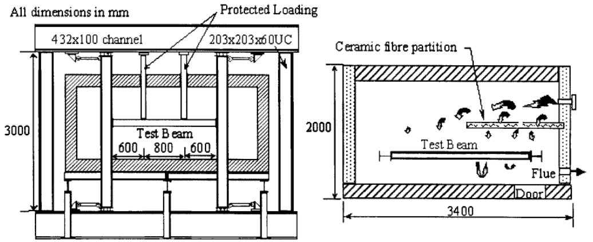
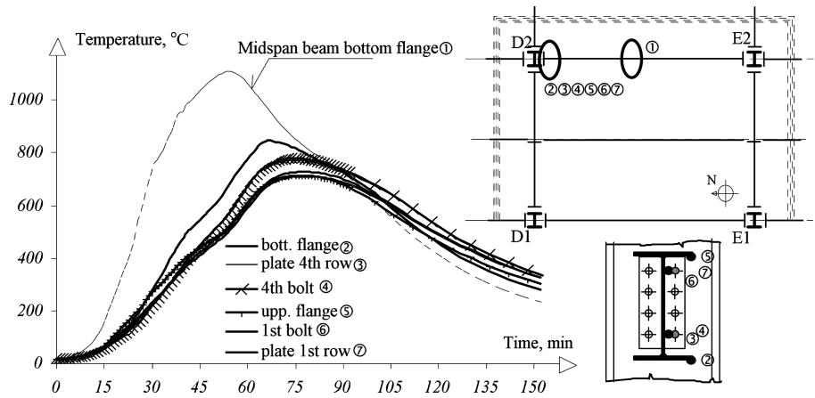
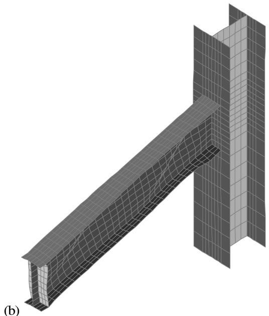

# Behaviour of steel joints under fire loading

Luís Simões da Silva† and Aldina Santiago‡

Department of Civil Engineering, University of Coimbra,

Polo II - Pinhal de Marrocos, 3030-290 Coimbra, Portugal

Paulo Vila Real‡†

Department of Civil Engineering, University of Aveiro, 3810 Aveiro, Portugal

David Moore‡‡

BCSA – British Constructional Steelwork Association, London, U.K.

(Received November 1 1, 2004, Accepted May 25, 2005)

Abstract.This paper presents a state-of-the-art on the behaviour ofsteel joints under fire loading and some recent developments in'this field,currently being carried out by the authors.Firstly,a review of the experimental research work on steel joints is presented,subdivided into isolated member tests,sub-structure tests and tests on complete building structures.Special emphasis is placed on the seventh Cardington test, carried out by the authors within a colaborative research project led by the Czech Technical University in Prague.Secondly,a briefreview of various temperature distributions within a joint is presented, followed by a discussion of the behaviour of isolated joints at elevated temperature, focussing on failure modes and analytical procedures for predicting the moment-rotation behaviour of joints at elevated temperature. Finally, adescription ofthe coupled behaviourofjoints as partofcomplete structures is presented,describing previous work and investigations on real fire (including heating and cooling phases)currently being carried out by the authors.

Key words: axial restraint; component method; composite joints; experimental tests; fire engineering; steel joints; temperature.

# 1. Introduction

The behaviour of steel and composite joints under fire loading is a subject that has only recently received special attention by the research community. In fact, as recently as 1995, the European prestandard on the fire response of steel structures (EN1993-1-2: 1995) deemed it unnecessary to assess the behaviour of steel joints under fire conditions. This approach was supported by the argument of the increased massivity of the joint area. However, observations from real fires show that, on several

occasions, steel joints fail, particularly their tensile components (such as bolts or end-plates) because of the high cooling strains induced by the distortional deformation of the connected members (Buchanan 2002, Bailey . 1999, Wald . 2005).

To characterize the behaviour of steel joints under fire loading, several aspects must be considered:   
a) The time-temperature distribution in and around the joint;   
b) The effect of high temperatures on the structural response of the joints;   
c) The redistribution of internal forces with time acting on the joint from the global behaviour of the structure.

A consistent approach for the assessment of the fire response of steel joints requires a broader view than merely restricting the attention to the joint area. Two directly related aspects must be considered, namely the fire development and the structural fire resistance strategy. Although essential, these aspects will not be dealt with in detail in this paper, generic references are available (Drysdale 1999, Vila Real 2003).

It is the purpose of this paper to present a state-of-the-art of the behaviour of steel joints under fire loading and to describe some recent developments currently being carried out by the authors.

# 2. Experimental research

Experimental research has been used to establish the behaviour of steel structures in fire and, in particular, steel joints. The experimental results on the response of steel connections under fire conditions are relatively recent and are limited, partly because of the high cost of conducting fire tests and partly due to the limitations on the size of furnace used. Only a few connection tests have been performed and these have concentrated on obtaining the moment-rotation relationships of isolated connections. In the following, a summary of available test results is presented.

# 2.1. Tests on isolated joints

The first reported tests on steel beam-to-column connections in fire were performed at CTICM (Kruppa 1976) and by the British Steel (British Steel, 1982). Both experimental projects tested a range of “flexible” to “rigid” connections under the ISO 834 fire curve (ISO 834, 1975) and linear increases in temperature. The main aim of these tests was to establish the performance of high strength bolts. The results suggested that the bolts and their connected elements could undergo considerable deformations in fire.

However, it was in the last fifteen years that research into the behaviour of joints under fire loading experienced significant developments. Lawson (1990) was the first to quantify the benefits of structural continuity under fire conditions on the basis of the results from a series of fire tests on typical beam-tocolumn connections. The tests were set up to fit within the test furnace at the Warrington Fire Research Centre. The cruciform test arrangement was used, comprising beams connected to a column, as shown in Fig. 1.

Eight tests were carried out under the standard temperature-time fire curve ISO 834. These tests included four flush end-plate joints (two using steel beams, one composite beams and one shelf-angle beams), two extended end-plate joints (both using steel beams) and two web-cleat joints (one using steel beams and one composite beams). All the beams supported concrete or a concrete slab. However, they were each restricted to a single load level (two load levels in three cases), providing insufficient

  
Fig. 1 Arrangement of the fire tests on beam-to-column connections (Lawson 1990)

data for the construction of the moment-rotation curves. This single load level varied between $0 . 1 0 M _ { p }$ and 0.40 , $M _ { p }$ - being the plastic moment capacity of the steel beam. From the experimental observations, it was found that the temperatures in the joint were much lower than that of the lower flange of the steel beam, which is usually the element that defines the limiting temperature of the beam. The maximum temperature on the lower beam flange was about 650 to $7 5 0 \mathrm { ‰}$ and the maximum temperature in the upper exposed bolts was 150 to $2 0 0 ^ { \circ } \mathrm { C }$ lower, and those inside the concrete slab were about 200 to $3 5 0 \mathrm { ‰}$ lower than the lower beam flange. Failure was due to large deformation of the endplate. In addition, it was suggested that composite action at elevated temperature contributed to the enhanced moment capacity of the connections. This was estimated by adding together the moment capacities of the bare-steel connection and the reinforced concrete slab.

The first characterization at high temperatures of the moment-rotation behaviour of commonly used joints was performed within a collaborative research programme involving the Building Research Establishment, the University of Sheffield and the Steel Construction Institute in the UK. This programme was divided into two phases; firstly, the behaviour of specimens with only one joint configuration was investigated (Leston-Jones  1997); and secondly, the scope of the experimental programme was extended to include parameters such as member size, connection type and different failure mechanisms (Al-Jabri . 1998, Al-Jabri 1999).

In the first phase, a total of eleven tests were conducted, including two tests at room temperature, for both bare-steel and composite joints. The scope of the programme was restricted to cruciform connections with flush endplates (the most common connection type used in non-composite building frame). The high temperature tests were performed on a furnace that consisted of four ‘barrel’ modules suitable for testing beams or columns, and a junction furnace designed for testing connections within a

  
Fig. 2 High temperature test: schematic arrangement (Leston-Jones et al. 1997)

two- or three-dimensional framework. The high temperature test arrangement is illustrated in Fig. 2. In order to create a temperature distribution across the connection representative of real conditions, the concrete slab was simulated by a $5 0 ~ \mathrm { m m }$ thick ceramic fibre blanket wrapped around the top flange of the beam. All tests were performed by applying a fixed bending moment with a subsequent increase of the furnace temperature at a rate of about $1 0 ^ { \circ } \mathrm { C / m i n }$ while maintaining the applied load.

The tests results at room temperature have shown significant deformation of the column web in the compression zone and of the column flange in the tension zone. Very little damage to the beams, plates or bolts was observed. The joint was capable of resisting moments in excess of $3 0 \ \mathrm { k N m }$ , with a proportional limit of about $1 5 ~ \mathrm { k N m }$ . Observation from the high-temperature tests showed an almost linear temperature profile through the depth of the connection. The uniform heating combined with the relatively slow rate of heating provided a somewhat unrepresentative fire condition when compared to a typical building fire. The failure modes observed at high temperatures were similar to those at room temperature. It was also observed that both the moment capacity and stiffness of the connection degraded with temperature. The critical temperature range of the connection, at which there is a market downturn in capacity, was between $5 0 0 { - } 6 0 0 ^ { \circ } \mathrm { C }$ .

In the second phase (Al-Jabri . 1998, Al-Jabri 1999), the general arrangement for the high temperature tests was the same as for the Leston-Jones tests (Fig. 2). In all cases, the test specimens consisted of a symmetric cruciform arrangement of a single column $2 . 7 \textrm { m }$ high with two cantilever beams $1 . 9 \mathrm { m }$ long, connected on either side of the column flange. The programme of work is summarized in Table 1. The small member sizes associated with Group 1 tests were chosen for comparison with the Leston-Jones tests, the only difference being the adoption of a more realistically sized end-plate thickness

Table 1 High temperature connections tests.   

<table><tr><td>Group</td><td>Beam</td><td>Column</td><td>End-plate</td><td>Material</td><td>Load Level</td></tr><tr><td>1</td><td>254×102×22UB</td><td>152×152×23UC</td><td>flush end-plate, tp=8 mm</td><td>bare steel</td><td>4 tests: 0.2 Mc1; 0.4 Mc1; 0.6 Mc1; 0.8 Mc1.</td></tr><tr><td>2</td><td>356×171×51UB</td><td>254×254×89UC</td><td>flush end-plate, tp=10 mm</td><td>bare steel</td><td>4 tests: 0.2 Mc2; 0.4 Mc2; 0.6 Mc2; 0.8 Mc2.</td></tr><tr><td>3</td><td>356×171×51UB</td><td>254×254×89UC</td><td>header-plate, tp=8 mm</td><td>bare steel</td><td>3 tests: 0.2 Mc3; 0.4 Mc3; 0.6 Mc3.</td></tr><tr><td>4</td><td>356×171×51UB</td><td>254×254×89UC</td><td>header-plate, tp=8 mm</td><td>composite</td><td>5 tests: 0.2 Mc4; 0.4 Mc4; 0.6 Mc4; 0.6 Mc4; full.</td></tr><tr><td>5</td><td>356×171×51UB</td><td>254×254×89UC</td><td>header-plate, tp=10 mm</td><td>composite</td><td>4 tests: 0.2 Mc5; 0.4 Mc5; 0.6 Mc5; 0.8 Mc5.</td></tr></table>

$M _ { c 1 } = 2 0 ~ \mathrm { k N m }$ ; $M _ { c 2 } = 1 4 0 ~ \mathrm { k N m }$ ; $M _ { c 3 } = 6 0 ~ \mathrm { k N m }$ ; $M _ { c 4 } = 1 0 5 ~ \mathrm { k N m }$ ; $M _ { c 5 } = 2 2 7 ~ \mathrm { k N m }$

of $8 ~ \mathrm { m m }$ . The larger section sizes and variation in connection types associated with the bare steel tests in Groups 2 and 3 reflect the adoption of connections used in the eight storey building at Cardington. Groups 4 and 5 extend this philosophy to include the behaviour of the composite slab.

Observations showed little variation in temperature across the bare steel connections. However, in the composite connections, the concrete slab acted as a radiation shield and a heat sink, keeping the upper flange cooler and thus enhancing the failure temperature of the lower beam flange. The observed failure modes depended on the connection type: in group 1, localized deformation at the top of the end-plate was observed, particularly around the top bolt, accompanied by deformation of the column flange and buckling of the column web. In group 2 localized deformations occurred at the top of the end-plate, slipping of the top bolts in the tension zone (maybe due softening of the bolts at elevated temperatures); at high moment levels, cracking of the end-plate along the welds was observed in both the beam web and flange. In group 3 significant end-plate deformation was developed. In groups 4 and 5 failure in the concrete slab (due to separation of the shear stubs from the concrete slab) was observed. After failure of the concrete slab, the applied load was transferred to the connection and end-plate failure was observed. In general, all high temperature tests produced failure modes similar to those of the same connections at room temperature.

Recently, in order to assess the individual behaviour of each component of an end-plate connections at high temperatures, Spyrou . (2004a, 2004b) carried out an experimental programme on T-Stub and column web components using an electric furnace, where the temperature ranged from 20 to $8 0 0 \mathrm { { ‰} }$ . Twenty five specimens were tested to investigate the three failure modes of the T-Stub and twenty nine tests were conducted on the column web in compression. The tests at high temperature highlighted the bolt flexibility as a key parameter in the behaviour of the T-Stub. On the compression zone tests, some discrepancies were highlighted between the capacities calculated using the current design standards and the experimental results at room temperature.

# 2.2. Tests on sub-structures

As stated before, isolated member tests do not truly reflect the behaviour of a member under either normal or fire conditions. Many aspects only occur when steel members are connected together. Global and local failure and the force redistribution capability of highly redundant structural systems are some of the features occurring when the members interact with each other which cannot be represented by

isolated element testing (Armer  1994). In addition, other effects can be observed, as the behaviour associated with restraint to thermal expansion caused by the adjacent cooler structure, increases the axial force in the heated members. This can cause column instability (Bailey  1996) and local buckling in the heated beams, neither of which would occur in isolated members.

In Germany, Rubert and Schaumann (1986) used electrical heating to test a series of three different arrangements of quarter-to-half scale sub-assemblies rigidly connected. No information was provided on the forces in the test frames to enable quantification of the effect between different frame members. Nevertheless, these high temperature tests have been used by various researchers to validate numerical models.

At the same time, the Fire Research Station, UK, carried out perhaps the first fire test on a full-scale structural assembly subjected to a natural fire using wooden cribs (Cooke and Latham 1987). The test structure was a goal post assembly consisting of a steel beam $^ { 4 0 6 \times 1 7 8 \times 5 4 }$ UB) and two steel columns $( 2 0 3 \times 2 0 3 \times 5 2$ UC). The column bases were pinned and the beam was connected to the columns using flush end-plate connections. A concrete slab was placed on top of the steel beam to give realistic heating conditions. Bracing was provided to the test frame near the beam-to-column connections to prevent sway and out-of-plane deflections. This test showed that the performance of the frame was better than that of the individual elements as a result of the continuity between the beam and columns.

At the end of $1 9 9 0 \mathrm { ^ { , } s }$ , the University of Manchester developed an experimental project in order to investigate the effects of restraint to thermal expansion of unprotected beams, from protected columns and adjacent cooler beams (Liu . 2002). These tests focused on the effect that different connection types had on the failure temperature of the connected members at different load levels. The experimental work was based on two-dimensional studies and was complemented with the results from the Cardington full-scale frame fire tests. In total, 25 fire tests on 2D steel frames were conducted. Two types of connections were considered: flush end-plate and web cleat connections, coupled with three levels of loading $20 \%$ , $5 0 \%$ and $70 \%$ of the moment capacity of the beam) and three degrees of horizontal restraint (8 kN/m; 35 kN/m and $6 2 ~ \mathrm { k N / m } \rrangle$ ). The beams had varying amounts of insulation, including the case in which the lower flange was fully exposed and the upper flange was encased in a concrete slab. The columns were generally fire-protected and a section of the beam and column in the region of the connection was exposed to fire. The top flange of the beam was protected by a noncomposite concrete slab. The major axis connection configuration consisted of a $1 7 8 \times 1 0 2 \times 1 9 \mathrm { U B }$ beam connected to a 152x152x30UC column, both in grade 43 (S 275) steel.

  
Fig. 3 (a) High temperature test, (b) Section through furnace (Liu et al. 2002)

The basic layout of the furnace and the specimens are illustrated in Fig. 3(a). The furnace box was constructed of light rectangular hollow steel sections supporting thin steel plates with ceramic fibre lining (with rapid heating times and light-weight construction). To expose the steel frame to uniform heating but to prevent direct exposure to the flame itself, the furnace box was partially divided by a ceramic fibre partition, as shown in Fig. 3(b). The burning system was programmed to follow the ISO 834 fire curve.

Observations showed a small variation in temperature in the web and bottom flange. Due to the fire protection around the top flange, its temperature initially rose at a slower rate, the temperature difference between the top flange and the web being about $3 0 0 \mathrm { { } ^ { \circ } C }$ after $1 0 ~ \mathrm { { m i n } }$ . This difference was subsequently reduced to $1 0 0 \mathrm { { } ^ { \circ } C }$ when the web temperatures reached $8 0 0 \mathrm { { } ^ { \circ } C }$ . It was recognized that web-cleat connections had very little influence on the behaviour of the beam until the beam came into contact with the column. Flush end-plate connections were able to transfer a much higher bending moment to the column than the web-cleat connections. In some tests (those with higher axial restraint and lower load levels), catenary action at large deflections was clearly visible (Liu  . 2001a).

# 2.3.Tests on complete building structures and observation of real fire events

Fire tests on sub-structures are necessary to understand the interaction between different structural members and to appreciate the difference between the behaviour of isolated members and members within a structure. However, in addition to the structural members a complete structure also includes floor slabs, walls and others non-structural members. A proper understanding of the behaviour of a complete building in fire can only be obtained if all such components are included. Although extremely expensive, fire tests on complete buildings are essential, complemented with the investigation of accidental fire events in buildings. Crucial to the understanding of the structural behaviour of a complete building in a real fire are the Broadgate fire accident (SCI, 1991) and the Cardington fullscale fire tests (Armer  1994, Bailey  . 1999, Wang 2002). Others tests and real fires included the William street fire tests by BHP (Thomas  . 1992) and the Collin street fire test by BHP (Proe and Bennetts 1994) in Australia, the Basingstoke fire accident and the Churchill Plaza fire accident in the United Kingdom, the fire tests performed in Germany (Anon 1986) and the fire event at the World Trade Center, NY (Usmani  . 2003, Quintiere  . 2002). In the following paragraph, the Cardington full-scale fire tests will be described in more detail.

The Cardington Laboratory is a unique worldwide facility for the advancement of understanding of whole-building performance. This facility is located at Cardington, Bedfordshire, UK and consists of a former airship hangar with dimensions $4 8 \ \mathrm { m } { \times } 6 5 \ \mathrm { m } { \times } 2 5 0 \ \mathrm { m }$ . It is used by industrial organizations, universities and research institutes, government departments and their agencies. The BRE’s Cardington Laboratory comprises three experimental buildings: a six storey timber structure, a seven storey concrete structure and an eight storey steel structure.

The eight storey steel structure was built in 1993. It is a steel framed construction using composite concrete slabs supported by steel decking in composite action with the steel beams (Fig. 4). It has eight storeys $( 3 3 ~ \mathrm { m } )$ and is five bays wide $\left( 5 { \times } 9 \mathrm { m } = 4 5 \mathrm { m } \right)$ by three bays deep $( 6 + 9 + 6 = 2 1 \mathrm { m } )$ in plan, see Fig. 5. The structure was built as a no-sway frame with a central lift shaft and two end staircases providing the necessary resistance against lateral wind loads. The main steel frame was designed for gravity loads, the joints consisting of flexible end plates for beam-to-column connections and fin plates for beam-to-beam connections, designed to transmit vertical shear loads. The building simulates a real

  
Fig. 4 The eight storey steel structure in Cardington

  
Fig 5. The Cardington fire tests on steel structure

commercial office in the Bedford area and all the elements were designed according to British Standards and checked for compliance with the provisions of the Structural Eurocodes.

The building was designed for a dead load of $3 . 6 5 \mathrm { k N } / \mathrm { m } ^ { 2 }$ and an imposed load of $3 . 5 \mathrm { k N } / \mathrm { m } ^ { 2 }$ (Bravery 1993). The floor construction consisted of a steel deck and a light-weight in-situ concrete composite floor, incorporating an A142 $( 1 4 2 \mathrm { m m } ^ { 2 } / \mathrm { m } )$ anti-crack mesh in both directions. The floor slab had an overall depth of $1 3 0 ~ \mathrm { m m }$ and the steel decking had a trough depth of $6 0 \mathrm { m m }$ .

Table 2 Fire tests on the steel structure in the Cardington laboratory (Wald et al. 2005).   

<table><tr><td rowspan="2">No.</td><td rowspan="2">Test</td><td colspan="2">Fire compartment</td><td colspan="2">Load</td></tr><tr><td>size, m</td><td>area, m2</td><td>Fire</td><td>Mechanical</td></tr><tr><td>1</td><td>One beam heated by gas</td><td>8×3</td><td>24</td><td>Gas</td><td>30%</td></tr><tr><td>2</td><td>One frame heated by gas</td><td>21×2.5</td><td>53</td><td>Gas</td><td>30%</td></tr><tr><td>3</td><td>Corner compartment</td><td>9×6</td><td>54</td><td>40 kg/m2</td><td>30%</td></tr><tr><td>4</td><td>Corner compartment</td><td>10×7</td><td>70</td><td>45 kg/m2</td><td>30%</td></tr><tr><td>5</td><td>Large compartment</td><td>21×18</td><td>342</td><td>40 kg/m2</td><td>30%</td></tr><tr><td>6</td><td>Office – Demonstration</td><td>18×9</td><td>136</td><td>45 kg/m2</td><td>30%</td></tr><tr><td>7</td><td>Structural integrity</td><td>11×7</td><td>77</td><td>40 kg/m2</td><td>56%</td></tr></table>

Seven large-scale structural fire tests at various positions within the experimental building were conducted; see Fig. 5 and Table 2 (Moore 1995, O’Conner and Martin 1998, Bailey  . 1999, Wald . 2005). The main objective of the compartment fire tests was to assess the behaviour of structural elements with real restraint under a natural fire.

The first test performed at Cardington was a restrained beam test involving a single 305x165xUB40 composite beam section supporting part of the seventh floor of the building (Lennon 1997). A gas-fired furnace was used to heat the beam to approximately $9 0 0 \mathrm { { } ^ { \circ } C }$ . The second test, a plane frame test, involved heating a series of beams and columns across the full width of the building. Again, a gas-fired furnace was used to heat the steelwork to approximately $8 0 0 \mathrm { { } ^ { \circ } C }$ . The BRE corner compartment test was the first natural fire carried out at the Cardington Laboratory, representing a typical office fire (timber cribs were used to provide a fire load of $4 0 ~ \mathrm { k g / m } ^ { 2 }$ ). The internal compartment walls were constructed using fire resistant board, one external wall was solid brick and the other external was formed by double glazing windows. All columns were protected up to and including the connections. It was observed that the fire development was largely influenced by the lack of oxygen in the compartment (Moore and Lennon 1997). The fourth test, the BS corner compartment test also used timber cribs to provide a fire load of $4 5 ~ \mathrm { k g } / \mathrm { m } ^ { 2 }$ . In this test, both the perimeter beams and the columns were fire protected with the internal beam unprotected. Load bearing concrete blocks were used for the compartment walls. The fifth test was the largest compartment fire test in the world. The compartment was designed to represent a modern open-plan office $1 8 \mathrm { m } \times 2 1 \mathrm { m } )$ . The compartment was bounded by fire resistant walls. The main aim of this test was to investigate the ability of a large area of composite slab to support the applied load once the main beams had failed. Consequently, none of the beams had any fire protection and all columns were fire protected. Again, the ventilation conditions governed the fire severity. In the demonstration test (sixth test), unlike in the previous tests, real furniture (desks, chairs, filling cabinets, computer terminals, etc.) was used for the fire load. The ventilation was provided by windows and blank openings. The beams were unprotected while the columns were protected. This test was characterized by a rapid rise in temperature representing a severe fire scenario.

Finally, the seventh test, the structural integrity fire test, had the highest amount of mechanical loading and was carried out by the authors. It was developed in order to investigate the global structural behaviour of steel-concrete composite frame building subject to a natural fire test, focusing on the examination of the temperature development within the various structural elements, the corresponding (dynamic) distribution of internal forces and the behaviour of the composite slab, beams, columns and connections. The fire test was performed on the $4 ^ { \mathrm { t h } }$ floor, enclosing a plan area of $1 1 \textrm { m }$ by $7 \textrm { m }$ and it was bounded with three layers of plasterboard and an opening $1 . 2 7 \mathrm { m } \times 9 \mathrm { m }$ long simulating an open

  
Fig. 6 7th Cardington fire test - compartment after fire, residual deformation $9 2 5 ~ \mathrm { m m }$ , no local collapse of structure

window. The columns, external joints and edge beam were fire protected to prevent global structural instability. The mechanical load was simulated using sandbags, each weighing $1 1 0 0 \mathrm { k g }$ and the fire load was provided by $4 0 ~ \mathrm { k g / m } ^ { 2 }$ of wooden cribs. During the test, the predicted local collapse of the structure was not reached (Fig. 6). The maximum deflection was about $1 2 0 0 ~ \mathrm { { m m } }$ and the residual deflection was $9 2 5 \mathrm { m m }$ . Fig. 7 compares the temperatures recorded in the compartment with the parametric curve calculated according to prEN1991-1-2 (2002). The maximum recorded compartment temperature near the wall ( $2 2 5 0 \mathrm { m m }$ from D2) was $1 1 0 7 . 8 ^ { \circ } \mathrm { C }$ after 54 minutes, while the predicted temperature was 1078 $^ { \mathrm { { \circ } } } \mathrm { { C } }$ after $5 3 ~ \mathrm { m i n }$ . The main damage mechanisms observed near the connections can be summarised as follows: local buckling of the beam lower flange, shear buckling of the beam web, buckling of the column flange in compression, fracture of the end-plate along the welds, elongation of the holes in the beam web, fracture in the concrete slab and slippage of the mesh. A detailed description of this fire test can be found in Wald  (2005).

  
Fig. 7 $7 ^ { \mathrm { t h } }$ Cardington fire test - compartment temperature

Table 3 Summary of the results from the major full-scale fire tests in the Cardington laboratory   

<table><tr><td rowspan="2">No.</td><td rowspan="2">Org.</td><td rowspan="2">Level</td><td rowspan="2">Time, min to max. temp.</td><td colspan="2">Maximum temperature (°C)</td><td colspan="2">Deformations (mm)</td></tr><tr><td>gas</td><td>steel</td><td>maximal</td><td>residual</td></tr><tr><td>1</td><td>*BS</td><td>7</td><td>170</td><td>913</td><td>875</td><td>232</td><td>113</td></tr><tr><td>2</td><td>BS</td><td>4</td><td>125</td><td>820</td><td>800</td><td>445</td><td>265</td></tr><tr><td>3</td><td>**BRE</td><td>3</td><td>114</td><td>1000</td><td>903</td><td>269</td><td>160</td></tr><tr><td>4</td><td>BS</td><td>2</td><td>75</td><td>1020</td><td>950</td><td>325</td><td>425</td></tr><tr><td>5</td><td>BRE</td><td>3</td><td>70</td><td>-</td><td>691</td><td>557</td><td>481</td></tr><tr><td>6</td><td>BS</td><td>2</td><td>40</td><td>1150</td><td>1060</td><td>610</td><td>-</td></tr><tr><td>7</td><td>***HPRI-CV 5535</td><td>4</td><td>55</td><td>1108</td><td>1088</td><td>&gt;1000</td><td>925</td></tr></table>

*BS – British Steel (now Corus); **BRE – Building Research Establishment; ***HPRI-CV 5535 – Collaborative European project.

The main results from the Cardington tests are summarized in Table 3.

# 3. Experimental behaviour of joints at high temperature

The experimental results presented above provided information on the temperature distribution within and around the joint area as well as the characterization of the moment-rotation relationship at high temperatures, including some insight into the various failure modes. In the following sections, both aspects are summarized.

# 3.1.Temperature distribution within the joint

The thermal conductivity of steel is high. However, because of the mass concentration within the joint area, a differential temperature distribution should be considered within the joint. Various temperature distributions have been proposed or used in experimental tests by several authors. According to EN 1993-1-2: 2005, the temperature of a joint may be assessed using the local section factor $( A / V )$ of the joint components or calculated using the maximum value of the ratios $A / V$ of the adjacent steel members. For beam-to-column and beam-to-beam joints, where the beams support any type of concrete floor, the temperature may be calculated based on the temperature of the bottom flange at mid span. However, some recent studies do not support the EN 1993-1-2 recommendations. For example, Franssen (2002) has shown that the temperature in the components is higher than the local massivity would have indicated, probably because the dimensions of the components are of an order of magnitude smaller than the dimensions of the connected members and the influence of these members is felt on the components.

Thermocouples were used in some of the previous tests in order to quantify the temperature distribution within a joint. Table 4 summarizes the results, a detailed description being found in the literature. It shows that for deeper beams a web temperature similar to bottom flange temperature is observed while for small beams a smaller web temperature is observed. Additionally, the presence of the concrete slab above a joint causes a reduction in the temperature of the beam top flange.

Table 4 Temperature distribution with time within joint   

<table><tr><td>Authors</td><td>Temperature distribution</td><td>Main contribution</td></tr><tr><td>Kruppa (1976)</td><td>Half of IPE500 on the top flange: 
θjoint (web) ≈ 150 - 200 °C lower than θ (web beam) 
θjoint (flanges) ≈ 150 - 400 °C lower than θ (beam flanges) 
Fin-plate and flush end-plate joints: 
θjoint (web) ≈ θ (web beam) 
θjoint (flanges) ≈ 50 °C lower than θ (beam flanges) 
Extended end-plate joints: 
θjoint (flanges) ≈ 50 °C lower than θ (beam flanges) 
Web-cleats on the flanges and web: 
θjoint (flanges) ≈ 250 °C lower than θ (beam flanges) 
Web-cleats on the flanges and web (column - HEB340): 
θjoint (web) ≈ 100 °C lower than θ (web beam) 
θjoint (flanges) ≈ 150 °C to 200°C lower than θ (beam flanges)</td><td>First measurements of the temperature distribution around the joint area. 
Scope of calibration: Isolated fire test - steel beam-to-column connections (beam: IPE360; column: HEB340).</td></tr><tr><td>Lawson (1990)</td><td>θfb = 650 - 750 °C (failure temperature) 
θexposed upper bolts = 150 - 200 °C lower than θfb 
θbolts inside the concrete slab = 200 - 350 °C lower than θfb 
θlower bolts = 100 - 150 °C higher than θupper bolts</td><td>Measurements of the temperature distribution in the joint components. 
Influence of the concrete slab on the temperature distribution. 
Scope of calibration: Isolated fire test - steel and composite beam-to-column connections.</td></tr></table>

<table><tr><td>SCI
recom.
(1990)</td><td>Temperature (°C)</td><td>800</td><td>1 lower flange
6 inner lower flange
3 bottom bolt
4 exposed top bolt
2 top flange
7 inner top flange
5 embedded top bolt</td><td>Description of the temperature distribution in each joint component.</td></tr><tr><td rowspan="7">Leston-Jones et al.
(1997)</td><td>θupper beam flange</td><td>0.677 × θfb;</td><td></td><td></td></tr><tr><td>θbeam centre web</td><td>0.985 × θfb;</td><td></td><td></td></tr><tr><td>θtop bolt</td><td>0.928 × θfb;</td><td></td><td></td></tr><tr><td>θmiddle bolt</td><td>0.987 × θfb;</td><td></td><td>Scope of calibration: Isolated fire test - steel double-sided joint with flush end-plate.</td></tr><tr><td>θbottom bolt</td><td>0.966 × θfb;</td><td></td><td></td></tr><tr><td>θcolumn flange</td><td>1.036 × θfb;</td><td></td><td></td></tr><tr><td>θend plate</td><td>0.982 × θfb</td><td></td><td></td></tr><tr><td rowspan="3">Al-Jabri et al.
(1998)</td><td colspan="3">Hottest connection elements: column web.</td><td>Influence of the concrete slab on the joint temperature distribution.</td></tr><tr><td colspan="3">θcolumn web (1.08 to 1.26) × θfb;</td><td></td></tr><tr><td colspan="3">θbeam top flange - compos joint(0.7-0.8) × θbeam top flange-steel joint</td><td>Scope of calibration: Isolated fire test - steel and composite beam-to-column con-rections.</td></tr></table>

Table 4 Continued   

<table><tr><td>Authors</td><td>Temperature distribution</td><td>Main contribution</td></tr><tr><td>Liu et al. θconnection 0.8 × θbeam mid-span (2002)</td><td></td><td>Scope of calibration: Fire tests in restrained steel beams</td></tr></table>

  
Wald et al. (2004)

Heating phase, the joint temperature is significantly lower than the remote bottom flange; in contrast, the cooling down in the joints was slower.

For the max. ambient temperature: $\theta _ { \mathrm { j o i n t } } { \approx } 2 0 0 ^ { \circ } \mathrm { C }$ lower than fb $\theta _ { \mathrm { f b } }$

θThe first bolt row from the top was significantly cooler than the lower bolts.

The end-plate was hotter than the bolts.

Description of the temperature distribution in each joint component during a natural fire.

Scope of calibration: Full-scale fire test – header plate beam-to-column and fin plate beam-to-beam

The temperature of a joint may be assessed using:

the local massivity value $( A / V )$ of the joint components, or   
· the maximum value of the ratios $A / V$ of the adjacent steel members.   
· For beam-to-column and beam-to-beam joints, where the beams are supporting any type of con crete floor:

EN 1993-1-2 (2005)   
  
fb Lower beam flange temperature

# 3.2. Failure modes

In general, the high temperature tests on isolated steel joints produced failure modes which are similar to those observed for the same joint at room temperature. However, during a natural fire on a

  
Fig. 8 (a) Beam web in shear and local buckling of beam lower flange; (b) End-plate fracture

framed building, the joint behaviour is influenced by the restrained forces due to the interaction between the fire-affected members and the adjacent structure. In the following section the main failure modes observed during the experiments above are presented:

# Steel joint tests:

(i) Header end-plate joint: 1 - Significant end-plate deformation (Al-Jabri  1998).   
(ii) Flush end-plate joint: 1- Localized deformation at the top of the end-plate, accompanied by deformation of the column flange and buckling of the column web, in cases of small cross-sections and, 2- Slipping of the top bolts in the tension zone. 3- At high temperatures and high load levels, fracture of the end-plate along the welds (Leston-Jones . 1997, Al-Jabri  1998, Lawson 1990).

# Steel joints supporting a concrete slab:

(iii) Flexible end-plate joint: 1- Local buckling in the lower beam flange and web adjacent to the joint, the concrete slab restraining the upper flange. This local buckling occurs during the heating phase, due to the restraint to thermal elongation provided by the adjacent cooler structure and the continuity of the structure. As the temperature and the associated deformations increase, the shear resistance of the beam’s web is reached (Fig. 8a). This failure mode is only observed in global tests, where the thermal expansion is restrained by the adjacent cooler members. 2- Buckling of the column flange in compression in major axis joints. 3- Fracture of the end-plate along the welds caused by the large rotations

  
Fig. 9 Elongation of holes in the beam web in fin plate connection

observed during the heating phase or due to the horizontal tensile forces developed during cooling in restrained beams (Fig. 8b). Fracture occurred along one side of the connection only, while the other side remained intact. After one side has fractured, the increased flexibility allowed larger deformations without further fracture. 4- Large crack propagating from the face of the column flange parallel to the beam. After this, the joint stiffness decreased and secondary cracks occurred perpendicular to, and continuous across, the connections on both sides of the slab (Al-Jabri  1998, Wald  2005).

(iv) Fin plate beam-to-beam joint: 1- Elongation of the holes in the thinest component (beam web or fin plate) due to the associated large rotations (Fig. 9). The elongation of the holes leads to increased joint flexibility, allowing larger deformations (Wald  2005).

# 4. Theoretical studies and design methodologies

# 4.1. Behaviour of isolated joints

From the experimental results it was possible to develop analytical or numerical procedures for the derivation of the moment–rotation relationship of isolated joints at high temperatures using joint properties at ambient temperature. These procedures are based on either (i) fitting of the Ramberg-Osgood type expressions to the global moment-rotation response of the joint, or (ii) application of the philosophy of the component method to deal with high temperatures. Both approaches are described in the following section.

# 4.1.1. Curve fitting methods

El-Rimawi was the first researcher who tried to characterize the joint behaviour at high temperatures. He developed a modified form of the Ramberg-Osgood equation (Ramberg and Osgood 1943) to describe the moment-rotation characteristics (El-Rimawi 1989). This relationship is defined by a single non-linear equation that always yields a positive slope, corresponding to the rotational stiffness of the joint, Eq. (1):

$$
\phi = \frac {M}{A} + 0. 0 1 \left(\frac {M}{B}\right) ^ {n} \tag {1}
$$

$\phi$ is the joint rotation at any given temperature, $M$ is the applied moment to the joint and , $B$ and $n$ are temperature dependent factors. Parameters $A$ and $B$ are directly related to the joint stiffness and capacity, respectively, while $n$ defines the non-linear shape of the curve that is linked to the connection. El-Rimawi calibrated these parameters using data from the tests performed by Lawson (1990) (El-Rimawi  . 1997, 1999). This analytical procedure is relatively easy to apply and gives a good representation of the observed behaviour. However it is limited to the tested connection and before extrapolating to others connections types it is necessary to perform a wide range of tests involving different failure mechanisms. To apply this equation to joints with different section sizes, a factor $\lambda$ was introduced assuming that the moment capacity of a joint is proportional to the distance between the internal tensile and compressive forces $( D )$ :

$$
\lambda = \frac {D - 5 0}{3 0 3 . 8 - 5 0} \tag {2}
$$

and the Ramberg-Osgood equation takes a more general form

$$
\phi = \frac {M}{\lambda^ {2} A} + 0. 0 1 \left(\frac {M}{\lambda \cdot B}\right) ^ {n} \tag {3}
$$

Recently, Al-Jabri developed a simple procedure to enhance the Ramberg-Osgood equation to generate the moment-rotation curves of steel and composite end-plate joints at high temperatures (Al-Jabri   2004). First, the Ramberg-Osgood expression was fitted to the room temperature connection characteristics, then the temperature parameters $A$ and $B$ were reduced with the increasing temperatures based on the degradation rate of the strength of structural steel (EN1993- 1-2:2005) and the levels of strain fitted with previous experimental tests (Al-Jabri 1999). This procedure predicts with reasonable accuracy the moment-rotation curves at high temperatures for the calibrated joints.

# 4.1.2. Component method

At room temperature, the component method (Weynand  1995, Simões da Silva  2002), which consists of modeling a joint as an assembly of extensional springs and rigid links, where the springs (components) represent specific parts of a joint that, dependent on the type of loading, make an identified contribution to one or more of its structural properties, has now become the  standard for the analysis of steel and composite joints at room temperature (EN1993-1-8, 2004). However, high temperature component models are rare, due to the lack of experimental data that describes the connection behaviour. The first author to use a component model at high temperatures was Leston-Jones (1997), to predict the response of steel and composite flush end-plate joints. Comparison with experimental results (Leston-Jones 1997, Leston-Jones  1997) showed that there was good agreement for steel flush end-plate connections. However, the composite model showed a significant difference in the rate of degradation compared with experimental results.

The authors proposed a global methodology for the application of the component method to analyze the behaviour of steel joints at high temperatures (Simões da Silva   2001). The component forcedisplacement response at room temperature is calculated according to part 1.8 of EC3 and the effect ofM M high temperature is incorporated by the continuous change of yield stress and Young’s modulus on eachA B component. It is possible to calculate the joint moment-rotation response at high temperatures (Fig. 10), as well as the non-linear joint behaviour as the temperature increases. Eqs. (4) to (6) illustrate the change in the force-deformation response of component  with increasing temperature, for a given temperature variation $\theta$

$$
F _ {i, \theta} ^ {y} = k _ {y, \theta} \times F _ {i, 2 0 ^ {\circ} \mathrm {C}} ^ {y} \tag {4}
$$

$$
K _ {i, \theta} ^ {e} = k _ {E, \theta} \times K _ {i, 2 0 ^ {\circ} \mathrm {C}} ^ {e} \tag {5}
$$

$$
K _ {i, \theta} ^ {p l} = k _ {E, \theta} \times K _ {i, 2 0 ^ {\circ} \mathrm {C}} ^ {p l} \tag {6}
$$

$k _ { y , \theta }$ and $k _ { E , \theta }$ are the reduction factors for effective yield stress and Young’s modulus at temperature $\theta$ ； $F _ { i , 2 0 ^ { \circ } \mathrm C } ^ { y }$ E,θ is the limit loads of component of component  at room temp $i$ at room temperature and rature. The joint moment- $K _ { i , 2 0 ^ { \circ } \mathrm C } ^ { e }$ is the elastic and post-lin response at temperature $i$ $\theta$ when the component $i$ yields, is expressed by:

  
Fig. 10 Anisothermal temperature–rotation response (Simões da Silva et al. 2001)

$$
M _ {i; \theta} ^ {y} = k _ {y; \theta} \times M _ {i, 2 0 ^ {\circ} \mathrm {C}} ^ {y} \tag {7}
$$

$$
\phi_ {i, \theta} ^ {y} = \frac {M _ {i , \theta} ^ {y}}{S _ {i , \theta} ^ {y}} = \frac {k _ {y , \theta} \times M _ {i , 2 0 ^ {\circ} \mathrm {C}} ^ {y}}{k _ {E , \theta} \times S _ {i , 2 0 ^ {\circ} \mathrm {C}}} = \frac {k _ {y ; \theta}}{k _ {E ; \theta}} \times \phi_ {i, 2 0 ^ {\circ} \mathrm {C}} ^ {y} \tag {8}
$$

where $M _ { i , 2 0 ^ { \circ } \mathrm C } ^ { y }$ denotes the moment corresponding to the yield of component  at room temperature, $\phi _ { i , 2 0 ^ { \circ } \mathrm C } ^ { y }$ is the joint rotation corresponding to the yield of component  at room temperature andi, 20°C $S _ { i , 2 0 ^ { \circ } C }$ is the rotational stiffness at room temperature. Fig. 10 compares the analytical procedure with the experimental results obtained by Al-Jabri  (1998) for a cruciform bolted end-plate beam-tocolumn steel joint under uniform temperature distribution. Excellent agreement is observed between the analytical procedure and the test results (Simões da Silva  2001).

Recently, Al Jabri developed another simplified component-based model to predict the behaviour of steel and composite flexible header plate joints at high temperatures. In this model the elements of the connection are treated as springs with known stiffness and the overall connection response is obtained by assembling the stiffnesses of individual elements in the tension and compression zone. The high temperature effect is incorporated in each element at a given bolt-row (Fig. 11). This method is valid up to the point at which the bottom flange of the beam comes into contact with the column (Al-Jabri 1999, 2003, 2004). Therefore, the rotation at any given moment is expressed by

$$
\phi = \frac {M}{S _ {t}} \tag {9}
$$

Where $S _ { t }$ is the rotational stiffness of the joint for a given temperature. This can be calculated tusing the methods given in EN1993-1-2 for steel joints. Anderson and Najafi (1994) have developed a model for composite connections. The methods for steel and composite joints are given below:

  
Fig. 11 Composite joint component model (Al-Jabri 2004)

$$
\left\{ \begin{array}{l l} K _ {t} ^ {- 1} = S _ {j t} ^ {- 1} = \left(K _ {e q t} z ^ {2}\right) ^ {- 1} + \left(K _ {c w t} z ^ {2}\right) ^ {- 1} & \text {s t e e l j o i n t} \\ K _ {t} ^ {- 1} = S _ {c c t} ^ {- 1} = \left[ \left(K _ {e q t} + K _ {c w t}\right) z ^ {2} + \frac {K _ {r t} K _ {s t} h _ {r} h}{K _ {r t} + K _ {s t}} \right] ^ {- 1} & \text {c o m p o s i t e j o i n t s} \end{array} \right. \tag {10}
$$

where $K _ { e q t }$ and $K _ { c w t } ,$ are the stiffness of the tension zone and compression zone for a given temperature; $K _ { r t }$ and $K _ { s t }$ eqt cwt rt are the stiffnesses of the reinforcement and the shear studs respectively for a given temperature; is the level arm to the centerline of the equivalent spring in the tension zone; $h$ is the distance from the beam-slab interface to the centre of rotation and $h _ { r }$ is the distance from the reinforcement to the centre of rotation.

Comparison of the results from the model with existing test data (Al-Jabri  1998, Al-Jabri 1999) shows good agreement, especially in the elastic region.

# 4.1.3. Component characterization

The application of the component method requires the characterisation of the individual components. To this purpose, Spyrou . (2004a, 2004b) have developed analytical expressions for the forcedisplacement relationships for the column web in compression and the T-stub in tension at high temperatures.

Based on Drdacky’s formula, a new empirical expression has been developed to predict the behaviour of the column web in compression (Spyrou . 2004a):

$$
P _ {u} = t _ {w c} ^ {2} \sqrt {E _ {w c} \sigma_ {w c}} \sqrt {\frac {t _ {f b}}{t _ {w c}}} \left[ 0. 6 5 + \frac {1 . 6 c}{d _ {w c}} \frac {2 \beta}{2 \beta + c} \right] \tag {11}
$$

where $t _ { w c }$ and $t _ { f b }$ are the web and column flange thicknesses; $d _ { w c }$ is the total depth of the column web between fillets; $E _ { w c }$ is the Young’s modulus of the column web; $\sigma _ { w c }$ is the column web yield stress; $c$ is the width of the applied load and $\beta$ is the development width of the bearing zone. The web column

capacity at high temperature is obtained from Eq. (11) applying the reduction factors for yield stress and stiffness from EN1993-1-2.

On the tension zone and based on classical beam theory, a mathematical model was developed to assess the deformation modes for a T-stub assembly under various bending moments. This procedure is divided into two steps: first, the minimum tension force required to form the first plastic hinge or yielding of the bolts is calculated along with the corresponding deformation; secondly, the force and corresponding deformation to form the second plastic hinge in failure modes I and II is calculated. The temperature effect is defined by the reduction factors for yield stress and stiffness from EN1993-1-2 and by the bolt reduction factors obtained by Kirby (1995).

At the same time, Block (Block  . 2004a, 2004b) carried out a numerical and analytical study to understand the behaviour of the column web compression zone in fire, including the effect of superstructure loading. The main aim was to develop a simplified analytical approach to predict the force-displacement response of the compression zone. The resistance of the compression zone at high temperatures was based on the room temperature approach applying the strength reduction factors in EN1993-1-2. The room temperature approach used in this study was chosen by statistical comparison of the design approaches (Block  . 2004a):

$$
F _ {R, \theta} = k _ {y, \theta} f _ {y w} L _ {\text {e f f}} t _ {w} k _ {N, w} \tag {12}
$$

$$
k _ {N, w} = \sqrt {1 - \left[ \frac {\sigma_ {N , w}}{k _ {y , \theta} f _ {y w}} \right] ^ {2}} \tag {13}
$$

$L _ { e f f }$ is the effective length and is related to the critical load, $\sigma _ { N , w }$ is the axial stress in the column web, $f _ { y w }$ is the yield stress of the column web and $t _ { w }$ is the column web thickness. The factor $k _ { N , w }$ was derived from the transverse load capacity due to bending stresses in plate girders (Djubek and Skaloud 1976).

Additionally, Block  . (2004b) proposed a reduction factor for the displacement at ultimate load, which describes the full force-displacement response of the column web in compression:

  
F k f L t kFig. 12 Temperature-rotation curves at various moment levels for Leston-Jones flush end-plate connections (Liu 1999b)

$$
\left\{ \begin{array}{l} k _ {N, \delta , 2 0 ^ {\circ} \mathrm {C}} = - 0. 5 5 \frac {\sigma_ {N}}{f _ {y}} + 1 \\ k _ {N, \delta , \geq 4 0 0 ^ {\circ} \mathrm {C}} = - 0. 7 \frac {\sigma_ {N}}{f _ {y}} + 1 \end{array} \right. \tag {14}
$$

These studies recognized the interest in using the component method for the analysis of steel joints at high temperature. However, it must be stressed that much work still remains ahead to adequately characterize the behaviour of the various components at elevated temperatures.

# 4.1.4. Finite element models

A three-dimensional finite element code (FEAST) was developed at the University of Manchester to simulate the structural response of steel and composite joints at elevated temperatures (Liu 1999b). The program uses isoparametric shell finite elements to model the steel and concrete slab and a sophisticated beam-spring element to model the bolts. It is linked to FIRES-T3 (Iding   1977), which performs the thermal analysis. Comparisons against available tests results (Lawson 1990, Leston-Jones  . 1997, Al-Jabri  . 1998), as shown in Fig. 12, yield good agreement.

# 4.2. Influence of axial restraint

# 4.2.1. Introduction

As stated in the introduction, the behaviour of a steel joint depends on the redistribution of internal forces with time acting on the joint as a result of the global behaviour of the structure. Under real fire conditions, the actual behaviour clearly deviates from the results of isolated joint tests (Wald 2005), the joint being subjected to a full 3D stress state $( N , M _ { y } , M _ { z } , M _ { t } , V _ { y }$ and $V _ { z , \ - }$ ) resulting from local, distortional or global instability of the connected members. The effect of axial restraint and the associated thermal expansion of the structural members play an important role in inducing this 3D state of stress and is reviewed in the following paragraph. Several researchers have addressed this aspect, preliminary attempts being credited to Burgess  (1990), and Saab and Nethercot (1991). Table 5f summarizes the work on this topic.

In addition to the studies described in Table 5, and in order to characterize the effect of axial andk rotational restraint under real fire conditions, the authors developed numerical models of structural subassemblies with different end restrictions under two alternative thermal loadings. There are a) the standard temperature-time exposure, ISO 834 curve; and b) a heating and cooling curve, both of which are illustrated in Fig. 13. (Santiago  2003, 2004). The program SAFIR (Franssen 2003) was chosen to carry out the numerical simulations, which is a specialized finite element program which includes geometrical and material non-linear analysis for studying structures subjected to fire.

This numerical work was carried out in the following two stages:

$1 ^ { \mathfrak { s t } }$ stage – Numerical simulations using 2D beam elements.   
$2 ^ { \mathrm { n d } }$ stage – Numerical simulations using shell elements.

# 4.2.2.Behaviour of a 2D steel beam under fire loading including the end joint response

A 2D model was developed consisting of a beam with different axial and rotational end restraints: one end of the beam (end B) was assumed to be built-in in all simulations, while several possibilities were tested for the opposite end (end A) (Fig. 14). The applied thermal load is illustrated in Fig. 12 and the

Table 5 Influence of end-restraints on structural response under fire loading   

<table><tr><td>Authors</td><td colspan="2">Scope</td><td>Main results</td></tr><tr><td>El-Rimawi et al. (1997, 1999)</td><td>ISO 834</td><td>Influence of connection stiffness on the behaviour of steel beams - Analytical investigation based on the secant-stiffness approach. Connection characteristics expressed by Ramberg-Osgood curves.</td><td>The connection details and its temperature are not critical parameters in determining failure. The connection restraint depends on the ability of the supporting structure to sustain the induced bending effects.</td></tr><tr><td>Bailey (1998)</td><td>Temps. obtained from previous analysis</td><td>Development of a numerical model to simulate the structural response of steel framed building in fire - INSTAF. Semi-rigid connections were simulated by a 3D spring using Ramberg-Osgood curves.</td><td>The failure temperatures increase as the connection rotational restraint becomes stiffer. This software INSTAF was re-named VULCAN and is under continuous development.</td></tr><tr><td>Liu (1996, 1998)</td><td>Temps. obtained from previous tests</td><td>Numerical investigation carried out with a purposely developed program (FEAST). Includes the influence of bolted end-plate connections and axial restraint on the behaviour of a steel beam</td><td>The connection details do not substan- tially affect the overall performance of the beam in the event of a fire.</td></tr><tr><td>Allam et al. (1999)</td><td>ISO 834</td><td>Experimental and numerical study (VULCAN and FEAST) to investigate the influence of axial restraint on the behaviour of a steel beam.</td><td>The joint rotational stiffness reduces beam deflection and the restraint to axial movement prevents the run-way behaviour at high deflections.</td></tr><tr><td>Liu et al. (2001a,b) Liu and Davies (2001)</td><td>ISO 834</td><td>Development of a three-dimensional mathematical model to simulate the response of steel structures in the event of fire and comparison with experimental results. Includes the influence of axial restraint on the behaviour of steel beam and catenary action</td><td>Includes a description and an explana- tion of whole beam behaviour during a fire. Evidence of catenary action in cases with lower load levels and high axial restraints. Proposes a simplified analytical approach to evaluate the axial forces developed during whole fire.</td></tr><tr><td>Huang et al. (2002)</td><td>ISO 834</td><td>Numerical investigation - FEMFAN. Includes the influence of axial restraint on the behaviour of steel beam and catenary action</td><td>The large deflections developed at high temperatures are not controlled by the steel degradation, but by the axial restraints. At high temperatures, the plastic and creep strain together with post-buckling large displacement retards the restrained beam failure.</td></tr><tr><td>Yin and Wang (2004, 2005a,b)</td><td>Steel temp. from Liu tests</td><td>Numerical investigation of the beam behaviour during whole fire, under the effect of axial and rotational end-restraints - ABAQUS. Development of an analytical tool. Comparison with experimental results.</td><td>Development of a simplified calculation method to analyze the beam behaviour during a fire. This method is applied to steel beams with non-linear axial and end-restraints and non-uniform tempera- ture distribution over the cross section.</td></tr></table>

mechanical loading, was assumed to represent a typical serviceability condition for an office building and was taken as a constant uniformly distributed load of $1 4 ~ \mathrm { k N / m }$ . The beam and its joints were assumed unprotected and were exposed to the fire.

From the numerical analysis, it is found that compared to the usual assumptions of a “standard” fire (ISO 834 fire curve and simply-supported boundary conditions) the results are distinctly different. Firstly, even for low axial restraint (beam end A), an initial increase of internal forces is noted as the

  
Fig. 13 Temperature-time curves (Santiago et al. 2003, 2004)

  
Fig. 14 Beam model

temperature increases, leading to a higher overall stress level in the beam without significant bending deformations. Then a reduction of internal forces took place, probably resulting from the bending deformation of the beam induced by the axial restraint and the initial deformation. This is followed by the development of catenary action for the case of high axial restraint, as clearly observed in Fig. 15(b). In the case of an ISO834 fire (continuous temperature increase) this eventually leads to numerical instability reflecting the reduction of the yield stress of steel below values that ensure equilibrium (strength based failure criteria). In contrast, for the real fire curve, complete reversal of the bending moment distribution is observed as the temperature decreases, thus allowing an increase of the axial force as the steel properties recover. Repeating the same analysis with a parametric variation of the rotation restraint at the beam end A reveals the same qualitative behaviour, the failure temperature slowly increasing with increased joint rotational restraint (Santiago  . 2003).

# 4.2.3.Three-dimensional modeling of a beam-column subassembly subject to fire

The next step was the development of a 3D numerical model comprising two columns and a beam supporting a concrete slab (Fig. 16). Given that the behaviour is quite distinct from the results obtained using the ISO 834 fire curve, as shown by the 2D beam model, thermal loading consisted of a heatingcooling curve only, as illustrated in Fig. 13. The parametric study considered a corner column under two thermal boundary conditions: (i) column faces thermally protected and unexposed to the fire load;

  
Fig. 15 Development of internal stresses and displacements: (a) Axial force; (b) Bending moment of beam high axial restrained; (c) Axial displacement; (d) Mid-span beam deflection

  
Fig. 16 Structural column - beam subassembly model

(ii) column faces unprotected and the external column flange protected from the fire load. These two cases correspond to two alternative design concepts, concerning the use of fire protection: (i) unprotected beams and protected columns, which have been shown to give good fire performance

  
Fig. 17 Deformed structure: (a) at 900 sec; (b) at 3600 sec (end of the analysis)

(Wald  2005), and (ii) unprotected beams and partially exposed columns. It should be mentioned that in case i) the axial and rotational stiffness as well as the strength of the columns remain constant during the whole fire, while in case ii) they were all reduced as the temperature increased. Finally, it was considered that the beam was continuously restrained against lateral-torsional buckling due to the supported concrete slab.

From the 3D numerical simulations it was possible to identify the evolution of local deformations. Case i) shows that the lower beam flange and the beam web adjacent to the connection started to buckle locally at around $6 1 0 \mathrm { { ‰} }$ due to the restraint to thermal elongation provided by the adjacent cooler column. The heated lower flange of the beam was unable to transmit the high normal forces generated in the lower flange of the beam where it meets the column. As the temperature increased, shear failure of the beam web was observed (Fig. 17).

Comparing the behaviour of the beam in both cases, it is noted that in case i) the beam starts to deflect faster than in case ii) due to the high column restraint that reduces the thermal expansion and increases the vertical deflection. However, at high temperatures, case i) does not deflect at an accelerating rate as observed in case ii), where the structural response is largely influenced by the column restraint behaviour: the column flexibility induces unrestrained beam axial displacement, see Fig. 18 (Santiago 2004).

Fig. 18 compares the results obtained using shell and beam finite elements. Close examination shows that the resulting curves are qualitatively similar but the maximum values are quite different. These differences result from the fact that shell elements allow local buckling to develop, in contrast to the beam elements which constrain the distortion of the cross section.

  
Fig. 18 Vertical displacement in the mid-span beam

# 5. Conclusions

The behaviour of steel joints under fire loading was reviewed in this paper. Historically, it was only in the last fifteen years that this subject started to receive greater attention from the scientific community. Despite the extensive work carried out in this period, the main conclusion is that the behaviour of steel joints under fire loading is still an open question.

The experimental evidence obtained from tests on isolated joints, tests on sub-structures and tests on complete structures (notably the Cardington fire tests) highlighted the following conclusions: i) during a fire event, the distribution of internal forces in the joint varies dramatically with time; ii) the redistribution of forces within the structure during the fire event strongly affects the joint behaviour; iii)

  
Fig. 19 Experimental layout

the joint response exhibits a true 3-D behaviour even when in cold-design the joint is only loaded in major axis bending; iv) expansion and subsequent contraction of the deformed steel members during fire induce high levels of axial force in the joint, probably leading to fracture of less ductile components.

These conclusions result in the need to develop more general design provisions that are currently available for the cold design of steel joints, the component method being an adequate compromise between accuracy and simplicity to address this issue. Several developments in this direction were also reviewed in this paper.

Finally, as an example of ongoing research, and to try to reach these goals, the authors are currently attempting to complement the results of the Cardington fire test (Wald  . 2005) by carrying out seven substructure fire tests at the University of Coimbra. These tests use the observed and measured boundary conditions from the seventh Cardington test and include a thorough numerical simulation in line with the numerical results presented above (Santiago  . 2003, 2004). Fig. 19 illustrates the experimental layout of a beam-column sub-frame with flush end-plate connections to be tested under a natural fire curve reproduced by a series of gas burners along each side of the beam.

# Acknowledgements

Financial support from the Portuguese Ministry of Science and High Education ( ) under FCT research project POCI/ECM/55783/2004 is acknowledged.

# References

Al-Jabri, K.S., Lennon, T., Burgess, I.W. and Plank, R.J. (1998), “Behaviour of steel and composite beamcolumn connections in fire”, J. Constructional Steel Research, (1-3), paper $\mathrm { n } ^ { \circ } \ 1 8 0$ .   
46Al-Jabri, K.S. (1999), “The behaviour of steel and composite beam-to-column connections in fire”, Doctoral Thesis, University of Sheffield, UK.   
Al-Jabri, K.S. (2003), “Numerical modeling of the behaviour of bare-steel and composite flexible end-plate connections at elevated temperature”, Proc. Conf. Advances in Structures, 635-641, Australia.   
Al-Jabri, K.S., Burgess, I.W. and Plank, R.J. (2004), “Prediction of the degradation of connections characteristics at high temperature”. J. Constructional Steel Research, , 771-781.   
60Al-Jabri, K.S. (2004), “Component-based model of the behaviour of flexible end-plate connections at elevated temperature”, Composite Structures, , 215-221.   
66Allam, A.M., Fahad, M.K., Liu, T.C.H., Burgess, I.W., Plank, R.J. and Davies, J.M. (1999), “Effects of restraint on the behaviour of steel frames in fire”, in Studnicka J, Wald F. and Machacek J. (eds.), Proc. Conf. Eurosteel’99, Praha, Czech Republic, pp. 279-282.   
et alAnderson, D. and Najafi, A.A. (1994), “Performance of composite connections: Major axis end-plate joints”, J. Constructional Steel Research, (1), 31-57.   
31Anon (1986), Fire Behaviour of Steel and Composite Construction, Verlag, TUV, Rheinland. et alArmer, G.S.T. and Moore, D.B. (1994), “Full-scale testing on complete multistorey structures”, The Structural Engineer, (2), 30-31.   
72Bailey, C.G., Burgess, I.W. and Plank, R.J. (1996), “Computer simulation of a full-scale structural fire test”, The Structural Engineer, (6), 93-100.   
74Bailey, C.G. (1998), “Development of computer software to simulate the structural behaviour of steel framed buildings in fire”, Comput. Struct., , 421-438.   
67Bailey, C.G., Lennon, T. and Moore, D.B. (1999), “The behaviour of full-scale steel-framed building subjected to

compartment fires”, The Structural Engineer, (8), 15-21.   
77Block, F., Burgess, I., Davison, B. and Plank, R. (2004a), “A component approach to modeling steelwork connections in fire: Behaviour of column webs in compression”, Proc. of ASCE Structures Congress, Nashville, Tennessee.   
Block, F., Burgess, I. and Davison, B. (2004b), “Numerical and analytical studies of joint component behaviour in fire”, Proc. of Third Int. Workshop Structures in Fire, Ottawa.   
Bravery, P.N.R. (1993), “Cardington large building test facility, Construction details for the first building”, Building Research Establishment, Internal paper, Watford, pp. 158.   
British Steel (1982), “The performance of beam/column/beam connections in the BS476: Art 8 fire test”, Reports T/RS/1380/33/82D and T/RS/1380/34/82D.   
Buchanan, A.H. (2002), Structural Design for Fire Safety, John Wiley & Sons, England.   
Burgess, I.E., El-Rimawi, J.A. and Plank, R.J. (1990), “Analysis of beams with non-uniform temperature profile due to fire”, J. Constructional Steel Research, , 169-192.   
16Cooke, G.M.E. and Latham, D.J. (1987), “The inherent fire resistance of a loaded steel framework”, Steel Construction Today, no . , 49-58.   
1Djubek, J. and Skaloud, M. (1976), “Postbuckling behaviour of web plates in the new edition of Czechoslovak design specifications”, Proc. of Int. Conf. on Steel Plates Structures, Imperial College, London.   
Drysdale, D. (1999), An Introduction to Fire Dynamics, $2 ^ { \mathrm { n d } }$ ed., John Wiley & Sons, West Sussex, England.   
El-Rimawi, J.A., Burgess, I.W. and Plank, R.J. (1997), “The influence of connections stiffness on the behaviour of steel beams in fire”. J. Construction Steel Research, (1-3), 1-15.   
43El-Rimawi, J.A. (1989), “The behaviour of the flexural members under fire conditions”. Doctoral Thesis, University of Sheffield, UK.   
El-Rimawi, J.A., Burgess, I.W. and Plank, R.J. (1999), “Studies of the behaviour of steel subframes with semirigid connections in fire”, J. Construction Steel Research, , 83-98.   
49European Committee for Standardization (CEN) (2002), Draft prEN 1991-1-2: 200x, Eurocode 1: Actions on structures, Part 1.2: Actions on structures exposed to fire, Final Draft, April 2002, Brussels.   
European Committee for Standardization (CEN) (1995), EN - 1993-1-2: 1995, Part 1.2: Structural Fire Design, Eurocode 3: Design of Steel Structures, Brussels.   
European Committee for Standardization (CEN) (2005), EN 1993-1-2:2005, Eurocode 3: Design of steel structures, Part 1.2: Structural fire design, Stage 49 draft, June 2004, Brussels.   
European Committee for Standardization (CEN). (2004), EN 1993-1-8:2004, Eurocode 3: Design of steel structures, Part 1.8: Design of joints, Stage 49 draft, June 2004, Brussels.   
Franssen, J.-M. (2002), “Numerical determination of 3D temperature fields in steel joints”, $2 ^ { n d }$ Int. Workshop Structures in Fire, Christchurch.   
Franssen, J.-M. (2003), “SAFIR. A thermal/structural program modelling structures under fire”, Proc. NASCC 2003, A.I.S.C. Inc., Baltimore.   
Huang, S.F., Tan, K.H. and Ting, S.K. (2002), “Structural response of a steel beam within a frame during a fire”, Advances in Steel Structures, 1111-1118.   
Iding, R., Bresler, B. and Nizamuddin, D. (1977), “FIRES-T3: A computer program for the fire response of structures – thermal”. Fire Research Group Report $\mathrm { N } ^ { \circ }$ UCB FRG 77-15, University of California, Berkeley.   
ISO 834 (1975). Fire Resistance Tests – Elements of Building Construction, International Organisation for Standardisation.   
Kirby, B.R. (1995), “The behaviour of high-strength grade 8.8 bolts in fire”, J. Constructional Steel Research, , 3-38.   
33Kruppa, J. (1976), “Resistance en feu des assemblages par boulons haute resistance”, St. Remy-les-Chevreuse, Centre Technique Industriel de la Construction Metallique, France.   
Lawson, R.M. (1990), “Behaviour of steel-beam-to-column connections in fire”, The Structural Engineer, (14), 263-271.   
Lennon, T, (1997) “Cardington fire tests: Survey of damage to the eight storey building”, Building Research Establishment, Paper No127/97, pp. 56, Watford.   
Leston-Jones, L.C. (1997), “The influence of semi-rigid connections on the performance of steel framed structures in fire”, Doctoral Thesis, University of Sheffield, UK.

Leston-Jones, L.C., Burgess, I.W., Lennon, T., Plank, R.J. (1997), “Elevated-temperature moment-rotation tests on steelwork connections”, Proc. Instn Civil Engrs, Structures & Buildings, , 410-419.   
122Liu, T.C.H. (1996), “Finite element modelling of behaviour of steel beams and connections in fire”, J. Constructional Steel Research, (2), 181-199.   
36Liu, T.C.H. (1998), “Effect of connection flexibility on fire resistance of steel beams”, J. Constructional Steel Research, (1), 99-118.   
45Liu, T.C.H. (1999a), “Fire resistance of unprotected steel beams with moment connections”, J. Constructional Steel Research, , 61-77.   
51Liu, T.C.H. (1999b), “Moment-rotation-temperature characteristics of steel/composite joints”, J. Struct. Eng., ASCE, (10), 1188-1197.   
125Liu, T.C.H and Davies, J.M. (2001a), “Performance of steel beams at elevated temperatures under the effect of axial restraints”, Steel and Composite Structures, (4), 427-440.   
1Liu, T.C.H., Fahad, M.K. and Davies, J.M. (2001b), “Catenary effect in axially restrained steel beam in fire”, in C.-K. Choi, and H.-G. Kwak (eds.), Proc. First Int. Conf. on Steel & Composite Structures, ICSCS’01, Pusan, Korea, 1669-1676.   
Liu, T.C.H., Fahad, M.K. and Davies, J.M. (2002), “Experimental investigation of behaviour of axial restrained steel beams in fire”, J. Constructional Steel Research, , 1211-1230.   
58Moore, D.B. (1995), “Steel fire tests on a building framed”, Building Research Establishment, Paper No. PD220/ 95, Watford, pp. 13.   
Moore, D.B. and Lennon, T. (1997), “Fire engineering design of steel structures”, Progress in Structural Engineering and Materials, (1), 4-9.   
1O’Conner, M.A. and Martin, M.D. (1998), “Behaviour of a multi-storey steel framed building subjected to fire attack”, J. Constructional Steel Research, (1-3), Paper No. 169.   
46Quintiere, J.G., Marzo, M., Becken, R. (2002), “A suggested cause of the fire-induced collapse of the World Trade Towers”, Fire Safety Journal, , 707-716.   
37Ramberg, W. and Osgood, W. (1943), “Description of stress strain curves by three parameters”, National Advisory Committee for Aeronautics. Technical Note 902.   
Rubert, A. and Schaumann, P. (1986), “Structural steel and plane frame assemblies under fire action”, Fire Safety Journal, , 173-184.   
10Saab, H.A. and Nethercot, D.A. (1991), “Modelling steel frame behaviour under fire conditions”, Engineering of Structures, October, 371-382.   
Santiago, A., Simões da Silva, L., Vila Real, P. and Franssen, J.M. (2003), “Effect of cooling on the behaviour of a steel beam under fire loading including the end joint response”, Proc. of the 9th Int. Conf. on Civil and Structural Engineering Computing, ed. Topping, B.H.V., Civil-Comp Press, Stirling, United Kingdom, paper 65.   
Santiago, A., Simões da Silva, L. and Vila Real, P. (2004), “Three-dimensional modeling of a beam-column subassembly under fire loading”, Proc. of $I { \boldsymbol { \theta } } ^ { h }$ Nordic Steel Construction Conf., 565-575, Copenhagen, Denmark.   
SCI (1991), Investigation of Broadgate phase 8 fire, Steel Construction Institute Forum.   
Simões da Silva, L., Santiago, A. and Vila Real, P. (2001), “A component model for the behaviour of steel joint at high temperatures”, J. Constructional Steel Research, (11), 1169-1195.   
57Simões da Silva, L., Santiago, A. and Vila Real, P. (2002), “Post-limit stiffness and ductility of end plate beamto-column steel joints”, Comp. Struct., , 515-531.   
80Spyrou, S., Davidson, J.B., Burgess, I. and Plank, R. (2004a), “Experimental and analytical investigation of the ‘comprension zone’ components within a steel joint at high temperature”, J. Constructional Steel Research, , 841-865.   
60Spyrou, S., Davidson, J.B., Burgess, I. and Plank, R. (2004b), “Experimental and analytical investigation of the ‘tension zone’ components within a steel joint at high temperature”, J. Constructional Steel Research, , 867-896.   
60The Steel Construction Institute (1990), Enhancement of Fire Resistance of Beams by Beam to Column Connections, Technical Report, SCI Publication 086.   
Vila Real, P. (2003), Incêndio em estruturas metálicas, Portugal, Edições Orion.   
Usmani, A.S., Chung, Y.C. and Torero, J.L. (2003), “How did the WTC towers collapse: A new theory”, Fire Safety Journal, , 501-533.

Wald, F., Chladná, M., Moore, D., Santiago, A. and Lennon, T. (2004), “The temperature distribution in a fullscale steel framed building subject to a natural fire”, Proc. of the $2 ^ { n d }$ Int. Conf. of Steel and Composite Structures, Seoul, Korea.   
Wald, F., Simões da Silva, L., Moore, D., Lennon, T., Chladná, M., Santiago, A., Beneš, M. and Borges, L. (2005), “Experimental behaviour of steel structure under natural fire”, New Steel Construction, (3), 24-27.   
Wang, Y.C. (2002), Steel and Composite Structures – Behaviour and Design for Fire Safety, Spon Press, London.   
Weynand, K., Jaspart, J.P. and Steenhuis, M. (1995), “The stiffness model of revised annex J of Eurocode 3”, Proc. of the 3rd Int. Workshop on Connections, Connections in Steel Structures, Behaviour, Strength and Design (Eds.: R. Bjorhovde, A. Colson, R. Zandonini) Trento, Italy, 441-452.   
Yin, Y.Z. and Wang, Y.C. (2004), “A numerical study of large deflection behaviour of restrained steel beams at elevated temperatures”, J. Constructional Steel Research, , 1029-1047.   
60Yin, Y.Z. and Wang, Y.C. (2005a), “Analysis of catenary action in steel beams using a simplified hand calculation method, Part 1: Theory and validation for uniform temperature distribution”, J. Constructional Steel Research, , 183-211.   
61Yin, Y.Z. and Wang, Y.C. (2005b), “Analysis of catenary action in steel beams using a simplified hand calculation method, Part 2: Validation for non-uniform temperature distribution”, J. Constructional Steel Research, , 213-234.

CC