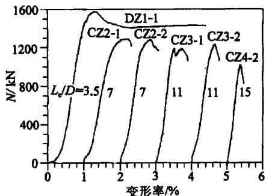
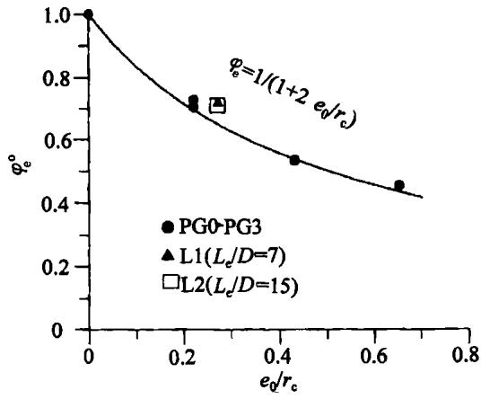

# 钢管超高强混凝土长柱及偏压柱的性能与极限承载能力的研究

谭克锋 ‘ ， 蒲心 诚

西南工学 院， 四 川 绵阳 重 庆建筑大学 ， 重 庆

摘要 本文报导了钢管超高强混凝土长柱和偏压柱的试验研究工作。 长柱试验研究结果表明， 钢管超高强混凝土长柱的承载能力和极限纵向变形率随长细 比 $\pmb { L } _ { \mathrm { e } } / D$ 的增大而下降， 在所研究的 $\mathbfcal { L } _ { \mathrm { e } } / D$ 范围内， 所有的钢管超高强混凝土长柱都有一定的延性 ， 但延性随 $\pmb { L } _ { \mathrm { e } } / D$ 的增大而降低。 普通钢管混凝土长柱的承载能力考虑长细 比影响的折减系数计算公式也适用于钢管超高强混凝土长柱。 偏压柱试验研究结果表明 ， 在偏心率为 一 范围内， 加载后所有偏压柱试件横向无明显的外形变化。在相同的长细 比下 ， 随着偏心率的增加 ， 试件的承载能力降低 ， 极限纵向变形率降低， 但总体来说， 偏压短柱的纵向变形率比轴压短柱的极限应变要大一些。 在相同的偏心率下 ， 长细 比越大，试件的承载能力和纵向变形率也越低。 钢管超高强混凝土耐偏压能力等于或优于普通钢管混凝土偏压柱。 经过适当修正的普通钢管混凝土偏心率折减系数可以用于钢管超高强混凝土偏压柱承载能力计算。

关健词 钢管 超高强混凝土 长柱 偏压柱 承载能力

中圈分类号 十 文献标识码

# 前 言

随着混凝土技术的不断发展 ， 世界各国开发和使用的混凝土强度不断提高 ， 在挪威的实验室 中， 利用优质的砂石骨料 ， 已配制出 $2 3 0 \mathbf { M P a }$ 的超高强混凝土 当采用人工烧制的骨料时 ， 配制的混凝土强度达 $4 6 0 \mathbf { M P a } ^ { [ 1 ] }$ 。 经预测 ， 世纪混凝土仍是主要的建筑材料， 但其强度将达到${ \bf 8 0 } \sim 1 0 0 { \bf M P a }$ 以上。 因此 以上的超高强混凝土应用将是大势所趋。

但混凝土的强度越高， 脆性越大 ， 只有在克服其脆性的情况下 ， 结构中的超高强混凝土才能得到应用 ， 对轴压短柱的试验已证明 ， 钢管超高强混凝土具有强度高、 延性好的优点。 为在实际工程中应用 ， 需对其长柱的性能进行研究。

对普通钢管混凝土长柱 的性能 已做过系列 的研究 ， 中国建筑科学研究 院结构所对${ \bf 6 9 M P a }$ 的钢管高强混凝土长柱也做过研究 【 ’， 但至今为止尚未见到 $1 0 0 \mathbf { M P a }$ 以 上的钢管超高强混凝土长柱的研究报导 。

在工程实际中， 柱子在某些情况下或多或少都受到一定的弯矩作用 ， 因此压弯柱是钢管超高强混凝土应用中经常遇到的间题。 到 目前为止 ， 国内外学者在研究偏心受压钢管混凝土杆件时 ， 主要针对普通钢管混凝土 ， 国内只有 中国建筑科学研究院结构所对 的钢管高

强混凝土偏压柱进行了初步的研究 ， 对 $1 0 0 \mathbf { M P a }$ 以上的钢管超高强混凝土偏压柱的研究 ， 目前 尚未见到研究报导。 为满足设计需要 ， 并为钢管超高强混凝土的应用奠定基础 ， 我们对${ \bf 1 0 0 M P a }$ 以上的钢管超高强混凝土长柱及偏压柱进行了研究。

以下是对这两类构件的试验及研究成果。

# 2 钢管超高强混凝土长柱

# 试验概况

本试验共 个试件， 套箍指标 $f _ { \mathrm { s } } A _ { \mathrm { s } } / \left( f _ { \mathrm { c } } \ A _ { \mathrm { c } } \right)$ 为 ，选用的有效长细 比 $\pmb { L } _ { \Theta } / \pmb { D }$ 有 、 、 、 四 种 ， 试 件 的钢管截面尺寸为 $\Phi$ $1 0 8 \mathrm { m m } \times 4 . 5 \mathrm { m m } _ { \odot }$ 有关试件的详细资料见 表 。

试件所用的超高强混凝土配合 比见表 。 混凝土用强制式搅拌机搅拌， 浇注前将钢管的一端用盖板焊接封牢 ， 浇注时将钢管竖立 ， 边浇边振捣 ， 之后移人恒温室在$2 0 \%$ 下 自然养护 ， 测前再将钢管的另一端用盖板焊接封牢。 试验是在重庆建筑大学结构实验室 压力机上进行的。 荷载用压力传感器测量 ， $\mathbfcal { L } _ { \mathrm { e } } / D$ 为 的试件上下端为平板铰 ， 其余试件的试验装置如图 所示。 试件的上下端各设置了辊轴和刀铰 ， 试件的纵向变形 由两个电测位移计测量 ， 在试件的弯曲平面内沿柱高四分点处布

  
图 试验与测试装置

置了三只电测位移计测量其侧向挠度。 每个试件的中部粘贴了四对 纵、 横各一 电阻应变片以测量钢管的纵向和横向应变。 所有的实验数据是 由 一 数据采集器通过计算机以每秒四次的频率 自动采集。 试验采用分级加载， 每级荷载约为极限荷载的 ， 每级的持荷时间为分 钟 。

表 钢管超高强混凝土长柱试件及试验结果一览表  

<table><tr><td>试件编号</td><td>D×t/mm</td><td>Le/mm</td><td>Le/D</td><td>f1/MPa</td><td>f2/MPa</td><td>Φ</td><td>Nu/kN</td><td>Ne/kN</td><td>Nu/Nc</td></tr><tr><td>DZ1-1</td><td></td><td>378</td><td>3.5</td><td></td><td></td><td></td><td>1535</td><td>1537</td><td>0.999</td></tr><tr><td>DZ1-2</td><td></td><td>378</td><td>3.5</td><td></td><td></td><td></td><td>1578</td><td>1537</td><td>1.027</td></tr><tr><td>DZ1-3</td><td></td><td>378</td><td>3.5</td><td></td><td></td><td></td><td>1518</td><td>1537</td><td>0.988</td></tr><tr><td>CZ2-1</td><td></td><td>756</td><td>7</td><td></td><td></td><td></td><td>1286</td><td>1230</td><td>1.045</td></tr><tr><td>CZ2-2</td><td>108×4.5</td><td>756</td><td>7</td><td>358</td><td>77.4</td><td>0.88</td><td>1280</td><td>1230</td><td>1.041</td></tr><tr><td>CZ3-1</td><td></td><td>1188</td><td>11</td><td></td><td></td><td></td><td>1194</td><td>~1069</td><td>1.117</td></tr><tr><td>CZ3-2</td><td></td><td>1188</td><td>11</td><td></td><td></td><td></td><td>1232</td><td>1069</td><td>1.152</td></tr><tr><td>CZ4-1</td><td></td><td>1620</td><td>15</td><td></td><td></td><td></td><td>974</td><td>951</td><td>1.024</td></tr><tr><td>CZ4-2</td><td></td><td>1620</td><td>15</td><td></td><td></td><td></td><td>1018</td><td>951</td><td>1.070</td></tr></table>

注 $\smash { D _ { \perp } t _ { \perp } L _ { \perp } }$ 分别为钢管的外径 、 壁厚和有效长度  
$\Phi = A { \mathrm { , } } f _ { \mathrm { * } } / \left( A { \mathrm { _ { c } } } f _ { \mathrm { * } } \right)$ ， 套箍指标  
$A _ { 3 } \setminus f _ { 5 }$ 分别为钢管的横截面积和屈服强度  
$A _ { \odot } , f _ { \odot }$ —分别为核心 混凝土 的横截 面积和 轴心 抗压强 度， $f _ { c } = 0 . 7 3 f _ { \mathrm { ~ e u ~ } } ^ { [ 2 ] }$   
$N _ { \mathrm { u } }$ —试件实测极限荷载   
$N _ { \mathfrak { c } }$ —试件计算极限荷载。  
—因试件两端设置 了辊 轴 和 刀 铰 ， 试件有效长度 $L _ { \Theta } =$ 试件原始长度。

衰 超离强混凝土的配合比  

<table><tr><td>水泥/kg·m-3</td><td>石子料径/mm</td><td>水泥:水:砂:石:矿渣:粉煤灰</td><td>高效碱水剂</td><td>坍落度/cm</td><td>fca/MPa</td></tr><tr><td>520</td><td>5~20</td><td>1:0.22:1.30:1.93:0.12:0.12</td><td>1.9%</td><td>22</td><td>106</td></tr></table>

# 试验结果及分析

在试验过程中我们观察到 ， 对 $\pmb { L } _ { \circ } / \pmb { D }$ 为 的试件 ， 片纵向应变片的读值基本相同， 达极限荷载后试件不断地鼓胀， 但仍能支撑相当大的荷载。 对 $L _ { \Theta } / D \geqslant 7$ 的试件， 均表现为柱子发生侧向挠度 ， 丧失稳定而破坏 ， 试验过的试件除弯曲外， 肉眼观察不到横向有所变形。

图 为试件的荷载 一 纵向变形率曲线 ， 此处的变形率是指试件的纵 向位移与试件的初始长度之比。 比较图中曲线可以看出 ， 随着 $L _ { \circ } / D$ 的增加 ， 试件的承载能力下降， 极限纵向变形率降低 ， 由 $\mathbfcal { L } _ { \circ } / D$ 为 时的 $1 , 1 5 \%$ 降至 $\pmb { L } _ { \mathcal { \Theta } } / D$ 为 时的 $0 . 3 8 \%$ 。 由柱中应变片的读值可知 ， 对 $\pmb { L } _ { \circ } / \pmb { D }$ $\bullet 7$ 的试件 ， 达极限荷载时柱中弯曲平面内侧、 左右两侧的应变远远超过钢材的屈服应变 分别为$1 6 9 5 6 \times 1 0 ^ { - 6 }$ 、 $9 3 1 6 \times 1 0 ^ { - 6 }$ 和 $3 2 7 2 \times 1 0 ^ { - 6 } ,$ )；在$L _ { \mathrm { e } } / D = 1 1$ 时， 内侧、 左侧的应变也远超出钢材的

  
图 不同长细 比试件的荷载 一 纵向变形率曲线

屈服应变 分别为 $1 2 5 7 8 \times 1 0 ^ { - 6 }$ 和 $1 1 0 2 1 \times 1 0 ^ { - 6 } )$ 。 这说明在此 $\mathbfcal { L } _ { \circ } / D$ 范围内， 所有的试件都有一定的延性 ， 只不过是随着 $\pmb { L } _ { \pmb { \circ } } / \pmb { D }$ 的增加， 延性下降， 这表明了试件由短柱的材料强度破坏转向非弹性失稳破坏。 在 $\mathbfcal { L } _ { \circ } / D$ 等于 巧 时 ， 柱 中的弯曲平面内侧的纵向应变略微超过了钢材的屈服应变 $\left( 3 7 8 6 \times 1 0 ^ { - 6 } \right)$ ， 可 以预测 ， $L _ { \mathrm { e } } / D = 1 5$ 时是个临界值， 超过此值， 试件将由非弹性失稳破坏转向弹性失稳破坏。

图 给出了长柱试件柱中侧向挠度图， 由图 可见 ， 在 $L _ { \mathrm { e } } / D = 7$ 时， 相对荷载 $( N / N _ { \mathrm { u } } )$ 为时柱中挠度才迅速增大 $L _ { \mathrm { e } } / D = 1 5$ 时， 相对荷载为 时柱中挠度即迅速增大。 可见挠度迅速增大对应的相对荷载随 $\pmb { L } _ { \mathcal { \circ } } / \mathcal { D }$ 的增加而降低。 这解释了试件越长 ， 越易发生失稳破坏 ，承载能力越低 。

# 承载能力计算

钢管超高强混凝土短柱的承载能力可 由以下公式计算 【 ’

$$
N _ {0} = A _ {\mathrm {c}} f _ {\mathrm {c}} (1 + 1. 8 \Phi) \tag {1}
$$

式 中 ， $N _ { 0 }$ 为钢管超高强混凝土轴压短柱的承载能力 其它符号的意义见表 下注。

仿照普通钢管混凝土长柱的处理方法 ， 将钢管超高强混凝土长柱承载能力写成

$$
\begin{array}{l} N _ {c} = \varphi_ {U} N _ {0} (2) \\ \varphi_ {l} = 1 - 0. 1 1 5 \left(L _ {\mathrm {e}} / D - 4\right) ^ {1 / 2} (3) \\ \end{array}
$$

  
图 试件的荷载 。 侧向挠度曲线

式中， $\varphi _ { l }$ 为普通钢管混凝土长柱承载能力长细 比折减系数。

$\varphi _ { l }$ 与有效长细 比 $\mathbfcal { L } _ { \ l \circ } / D$ 的关系见图 ， 比较图 中的实测值和计算曲线可以看出， 两者吻合 良好 ， 并且具有相 同的变化趋势 ， 实测值与计算值之比的平均值为 ， 离散系数为

。 因此， 钢管超高强混凝土长柱的承载能力长细 比折减系数采用式 ， 即普通钢管混凝土的长细 比折减系数计算公式来计算是完全可行的， 用式 、 、 得到的承载能力计算值与试验的实测值相 比比较接近 见表 ， 并留有一定的安全余地。

# 3 钢管超高强混凝土偏压柱

# 试验概况

试 验 共 个 试 件 ， 采 用 了 $\Phi$ $\mathbf { 1 3 3 m m } \times$

4.7mm和 $\Phi$ $\textmd { > } 1 0 8 \mathbf { m } \mathbf { m } \times 4 . 5 \mathbf { m } \mathbf { m }$ 两种规格的钢管， 内填 $1 0 0 \mathrm { m m }$ 立方强度分别为 和的超高强混凝土，其套箍指标 $f _ { \mathrm { s } } A _ { \mathrm { s } } / \left( f _ { \mathrm { c } } A _ { \mathrm { c } } \right)$ 分别为 和 。 试验参数有偏心率 $( \mathbf { \varrho _ { 0 } } / r _ { \mathrm { c } } = 0 . 0 . 2 2 .$ 、$0 . 2 7 . 0 . 4 3 . 0 . 6 5 )$ 和有效长细 比 $: L _ { \mathrm { e } } / D = 3 . 5 , 7 . 1 5 )$ 。 有关试件的详细资料见表 $3 \textdegree$

钢管是在重庆长安汽车公司制作的。 钢管的一端用厚 $3 0 \mathrm { m m }$ 、 中心钻有 $\Phi$ $1 0 \mathrm { m m } \times 1 5 \mathrm { m m }$ 小孔的盖板焊接封牢。 盖板中心的小孔是用于固定加荷板用的。

试件所用的超高强混凝土配合比见表 。 制作及养护同长柱试件。 试验是在重庆建筑大学结构实验室吨压力机上进行的。 荷载角压力传感器测 量 ， 偏心率为零的试件采用普通加载方式， 测试方法和测试装置见文献〔 。 其余试件的试验装置参见图 ， 试件的两端各设置了特别加工制作的加荷板、 辊轴和刀铰。 试件上端的加荷板上 按 预定的偏心 矩设置相 应的圆弧 形 凹 槽 ，与辊轴的 圆弧表面吻接。 同样 ， 试件下端的加荷板按预定的偏心距设置相应的销槽 ， 以 固定刀 铰。 试件测试的位移计、 应变片的设置 ， 以及数据的采集和加载方法等均同长柱试验。

  
图 长细 比折减系数试验值与计算曲线比较

  
图 偏压试件的试验装置图

# 试验结果与讨论

在试验过程 中我们观察到 ， 所有 的偏压试件 除弯 曲外 ， 横 向无甚 明显 的外形 变化。

图 给出了试件的荷载 一 纵向变形 率曲线。 由该图可见 ， 随着偏心率和 长细 比的增加， 试件 的承载 能力 降低。 由于试件 的弯曲作用 ， 所有偏压柱试件 曲线 的线性 段 比轴压短 柱要短得多 ， 这是 由于偏压柱试件在加 载过程 中过早产生 弯 曲造成 的。 但在相 同的长细 比下 ， 偏压柱 的极 限纵 向变形率 对应极 限荷载 时的纵 向变形 率 比轴压短 柱 的极 限应变值要 大得多。 如组试件 偏心率为 的平 均极 限纵 向变形 率是 $2 . 3 \%$ ， 组试件 偏心 率为零 ， 轴压短柱的平均极 限纵 向应变是 $0 , 8 6 \%$ ， 前者是后 者 的 倍。 随着偏 心率的增加 ， 极 限纵 向变形率降低 ， 由 试 件 的 $2 . 3 \%$ 降至 试件 的 $1 , 5 3 \%$ 和 试件的 $1 , 3 5 \%$ 。 并且 ， 随着长细 比的增 加 ， 极 限 纵 向变 形 率也 降低 ， 试 件 和 试 件 的极 限纵 向变 形 率分 别 降至 $0 . 6 3 \%$ 和$0 . 4 2 \%$ 。 试件 的极 限纵 向变形率与 失 稳 现象相 关 ， 偏 心率和长细 比越大 ， 试件越 易发生 失稳和

表 钢管超商强混凝土偏压试件一览表  

<table><tr><td>试件编号</td><td>D×t/mm</td><td>fe/MPa</td><td>f1/MPa</td><td>Le/mm</td><td>Lc/D</td><td>Φ</td><td>e0/mm</td><td>e0/rc</td></tr><tr><td>PG0-1</td><td>133×4.7</td><td>84.7</td><td>352</td><td>465</td><td>3.5</td><td>0.66</td><td>0</td><td>0</td></tr><tr><td>PG0-2</td><td>133×4.7</td><td>84.7</td><td>352</td><td>465</td><td>3.5</td><td>0.66</td><td>0</td><td>0</td></tr><tr><td>PG0-3</td><td>133×4.7</td><td>84.7</td><td>352</td><td>465</td><td>3.5</td><td>0.66</td><td>0</td><td>0</td></tr><tr><td>PG1-1</td><td>133×4.7</td><td>84.7</td><td>352</td><td>465</td><td>3.5</td><td>0.66</td><td>13.3</td><td>0.22</td></tr><tr><td>PG1-2</td><td>133×4.7</td><td>84.7</td><td>352</td><td>465</td><td>3.5</td><td>0.66</td><td>13.3</td><td>0.22</td></tr><tr><td>PG2-1</td><td>133×4.7</td><td>84.7</td><td>352</td><td>465</td><td>3.5</td><td>0.66</td><td>26.6</td><td>0.43</td></tr><tr><td>PG2-2</td><td>133×4.7</td><td>84.7</td><td>352</td><td>465</td><td>3.5</td><td>0.66</td><td>26.6</td><td>0.43</td></tr><tr><td>PG3-1</td><td>133×4.7</td><td>84.7</td><td>352</td><td>465</td><td>3.5</td><td>0.66</td><td>39.9</td><td>0.65</td></tr><tr><td>PG3-2</td><td>133×4.7</td><td>84.7</td><td>352</td><td>465</td><td>3.5</td><td>0.66</td><td>39.9</td><td>0.65</td></tr><tr><td>L1</td><td>108×4.5</td><td>77.4</td><td>358</td><td>756</td><td>7</td><td>0.88</td><td>13.3</td><td>0.27</td></tr><tr><td>L2</td><td>108×4.5</td><td>77.4</td><td>358</td><td>1620</td><td>15</td><td>0.88</td><td>13.3</td><td>0.27</td></tr></table>

表 超高强混凝土的配合比  

<table><tr><td>试验编号</td><td>水泥/kg·m-3</td><td>水泥:水:砂:石:硅灰:砂渣:粉煤灰</td><td>高效减水剂</td><td>坍落度/cm</td><td>fcu/MPa</td></tr><tr><td>A</td><td>585</td><td>1:0.21:1.17:1.75:0.11:0:0</td><td>1.9%</td><td>22</td><td>116</td></tr><tr><td>B</td><td>520</td><td>1:0.22:1.30:1.93:0:0.12:0.12</td><td>1.9%</td><td>22</td><td>106</td></tr></table>

弯曲， 荷载的增加导致弯曲的增大 ， 弯曲的增大又使附加偏心距增加 ， 偏心距的增加将导致试件很快地达到极限强度， 如此叠加的结果导致了极限纵向变形率降低 ， 承载能力也降低。

偏压试件的失稳和弯曲现象可 由试件在加载过程中侧向挠度来体现。 由安装在试件四分点处 电子位移计的读值可知 ， 当 $L _ { \mathrm { e } } / D = 3 . 5$ 时 ， 偏心率为 的 试件在极 限荷载的$9 0 \% \sim 9 5 \%$ 时柱 中才产生 $1 \mathbf { m m }$ 的挠度 对偏心率为 的 试件和偏心率为 的试件， 产生同样挠度对应的相对荷载分别约为 $60 \%$ 和 $40 \%$ 。 同样 ， 、 、 试 件 产 生$2 \mathbf { m m }$ 挠度对应的相对荷载分别为 $98 \%$ 、 $80 \%$ 和 $60 \%$ 。 证明了在相同的长细 比下 ， 偏心率越大 ，开始产生侧向挠度对应的相对荷载越低 ， 越易产生失稳现象。

  
图 荷载 一 纵向变形率 应变 曲线

  
图 不同长细 比试件荷载 一 侧向挠度曲线

为更为清楚的表明上述关系 ， 图 给出了各种偏心率和长细 比试件的荷载 一 柱 中挠度曲线 ， 该图除了证明上述的挠度的产生和增长与偏心率之间的关系外 ， 还可以看出挠度的产生和增长与长细 比 $\pmb { L } _ { \ l \mathrm { e } } / D$ 之间的关系。 在相 同的偏心率下 ， 长细 比越大 ， 开始产生挠度对应的相对荷载越低 ， 产生一定挠度对应的相对荷载也越低。 与短柱不 同， 长柱挠度的产生包含两方面的因素， 一是长柱本身的失稳 ， 另一是偏压造成的失稳。 因此偏压长柱的挠度产生是上述两个因

素影响的叠加。

以上事实证明了钢管混凝土 由于 圆形钢管的断面特征 ， 耐偏压能力较弱 ， 偏心率增大时侧向挠度增大很快 ， 不适于用于大偏心结构构件。

# 承载能力

所有钢管超高强混凝土偏压试件承载能力的测试结果列于表 。

表 钢管超离强混凝土偏压试件测试值与计算值的比较  

<table><tr><td rowspan="2">编号</td><td colspan="2">偏压极限荷载/kN</td><td colspan="2">偏心率折减系数</td><td rowspan="2">φe/φc或
Nu/Nc</td></tr><tr><td>试验值Nu</td><td>计算值Nc</td><td>试验值φ°</td><td>计算值φc</td></tr><tr><td>PG0-1</td><td>2273</td><td>2188</td><td>1.039</td><td>1</td><td>1.039</td></tr><tr><td>PG0-2</td><td>2158</td><td>2188</td><td>0.986</td><td>1</td><td>0.986</td></tr><tr><td>PG0-3</td><td>2253</td><td>2188</td><td>1.030</td><td>1</td><td>1.030</td></tr><tr><td>PG1-1</td><td>1540</td><td>1519</td><td>0.687</td><td>0.694</td><td>0.990</td></tr><tr><td>PG1-2</td><td>1593</td><td>1519</td><td>0.728</td><td>0.694</td><td>1.049</td></tr><tr><td>PG2-1</td><td>1173</td><td>1176</td><td>0.536</td><td>0.538</td><td>0.996</td></tr><tr><td>PG2-2</td><td>1167</td><td>1176</td><td>0.534</td><td>0.538</td><td>0.993</td></tr><tr><td>PG3-1</td><td>1001</td><td>951</td><td>0.458</td><td>0.435</td><td>1.053</td></tr><tr><td>PG3-2</td><td>990</td><td>951</td><td>0.453</td><td>0.435</td><td>1.041</td></tr><tr><td>L1</td><td>889</td><td>799</td><td>0.722</td><td>0.649</td><td>1.112</td></tr><tr><td>L2</td><td>682</td><td>617</td><td>0.717</td><td>0.649</td><td>1.105</td></tr></table>

仿照蔡绍怀对普通钢管混凝土的处理方法 〔 ，， 将钢管混凝土偏压柱的承载能力计算公式写成为

$$
N _ {\mathrm {c}} = \varphi_ {\mathrm {e}} \varphi_ {l} N _ {0} = \varphi_ {\mathrm {e}} \varphi_ {l} A _ {\mathrm {c}} f _ {\mathrm {c}} (1 + 1. 8 \Phi) \tag {4}
$$

式 中 $N _ { 0 }$ 钢管混凝土轴压短 柱 的承载 能力

$\varphi _ { i }$ 承载能力长细 比折减系数 ， 由式 计算

$\varphi .$ e- 承载能力偏心率折减系数 ， 将 由试验结果确定。

以偏心率为零的轴压短柱承载能力计算值 $N _ { 0 }$ 为基础 ， 计算出各种偏心率轴压短柱实测的相对承载能力 $N _ { \mathrm { u } } / N _ { 0 }$ ， 即折减系数的实测值。 计算结果列于表 并示于 图 ， 通过分析归纳 ，得出偏心率折减系数 $\varphi _ { \mathrm { e } }$ 为

$$
\varphi_ {\mathrm {e}} = \frac {1}{1 + 2 \frac {e _ {0}}{r _ {\mathrm {c}}}} \tag {5}
$$

蔡绍怀等针对普通钢管混凝土和钢管高强混凝土提出的偏心率折减系数「〕 “ 〕

当 $e _ { 0 } / r _ { \mathrm { c } } { \leqslant } 1 . 5 5$ 时

$$
\varphi_ {e} = \frac {1}{1 + 1 . 8 5 \frac {e _ {0}}{r _ {c}}} \tag {6}
$$

—比较式 和式 可知 ， 式 中的 $\varphi _ { \mathfrak { e } }$ 值略低于公式 ， 但这并不意味着钢管超高强混凝土耐偏压能力低 ， 从文献【 中的试验结果看 ， 利用公式 计算的钢管高强混凝土的 $\varphi _ { e }$ 值 ，有近 $60 \%$ 的试验值低于计算值 ， 偏于不安全 ， 这一点从图 也得到 了证明。 而利用式 计算的钢管超高强混凝土 $\varphi _ { \mathfrak { e } }$ 值， 基本上全部等于或低于试验值 见表 ， 安全系数较高。 因此可以肯定 ， 钢管超高强混凝土耐偏压能力将不亚于普通钢管混凝土。

将钢管超高强混凝土偏压长柱包含在 内， 将实测的试件承载能力 $N _ { \mathbf { u } }$ 、 轴压短柱承载能力

  
图 偏压短柱偏心率折减系数实测值与计算值比较

  
图 偏压试件偏心率折减系数实测值与计算值比较

计算值以及长细 比折减系数计算值代人式 ， 可得到所有长细 比钢管超高强混凝土偏压柱承载能力偏心率折减系数的实测值

$$
\varphi_ {\mathrm {e}} ^ {\circ} = N _ {\mathrm {u}} / \left(\varphi_ {l} N _ {0}\right) \tag {7}
$$

全部试件的实测值 $\varphi _ { e } ^ { \circ }$ 见表 ， $\varphi _ { e } ^ { \circ }$ 与偏心率的关系见图 。 图中的曲线是由式 计算的钢管超高强混凝土偏压柱承载能力偏心率折减系数。 可见 ， 包含长柱在内， 所有试件的偏心率折减系数的实测值都符合式 给出的规律。 并且，相对偏压短柱而言，偏压长柱的安全系数更高。

由表 可见 ， 本试验的 个偏心试件的偏心率折减系数及相应的承载能力的实测值与按式 计算值之比为 ， 离散系数 ， 两者吻合良好。 因此可以用式 、 式 、 式 计算钢管超高强混凝土偏压柱的承载能力 ， 并留有一定的安全余地。

# 结论

通过对钢管超高强混凝土长柱及偏压柱的研究， 可以得出如下主要结论。

钢管超高强混凝土长柱的承载能力和极限纵向变形率随有效长细 比 $\pmb { L } _ { \mathrm { e } } / D$ 的增大而降 低 。  
侧 向挠度迅速增大时对应的相 对荷载 $N / N _ { \mathrm { u } }$ 随 $L _ { \mathrm { e } } / D$ 的增 大 而 下 降。  
钢管超高强混凝土长柱的承载能力折减系数与普通钢管混凝土一致 ， 可用式 来表达 ， 由此得到的承载能力计算值与实测 值吻合 良好 ， 且留有一 定的安全余地。  
所有的钢管超高强混凝土偏压试件在所研究的偏心率 $0 . 2 2 \sim 0 . 6 5$ 范围内， 除弯曲外横向无甚明显的外形变化。  
从偏压试件应力 一 纵向变形率曲线可以看出 ， 随着偏心率和长细 比的增加 ， 试件的承载能力降低。 由于试件的弯曲作用 ， 与轴压柱相 比 ， 曲线的线性段要短得多 ， 但在相同的长细 比下 ， 偏压短柱的极限纵向变形率比轴压短柱的极限应变值要大得多。 但是 ， 随着偏心率的增加 ，极限纵向变形率降低 随着长细 比的增加 ， 极限纵向变形率也降低。  
在相同的长细 比下 ， 偏心率越大 ， 开始产生侧向挠度对应的相对荷载越低 ， 越易发生弹

失稳 在相 同的偏心 率下 ， 长细 比越大 ， 开始产生 挠度对应的相对荷载越低 ， 产生 一定挠度对应 的相对荷 载也越低。 证 明 了钢管混凝土 由于 圆形钢管 的断面特征 ， 耐偏压能力较弱 ， 不宜用于大偏压构件。

可 以用式 、 式 和式 来计算钢管超高强混凝土偏压构件偏心率折减系数和承载能力。 实测值与计算值之比为 ，离散系数 ，两者吻合很好，并 留有较大的安全余地。

# 参 考 文 献

[1]Gjorv，OE. High-Strength Concrete[M]. Advanced in Concrete Technology，Edited by V.M. Malhotra, CANMET,1992.21-78.   
【 谭克锋，蒲心诚，蔡绍怀 钢管超高强混凝土的性能与极限承载能力的研究 建筑结构学报， ，  
【 蔡绍 怀 ， 顾万黎 钢管混凝土长柱 的性能和 强 度计算 〔 建筑结构学报， ，  
顾维平 ，蔡绍 怀， 冯 文林 银管高强混凝土长柱性能和 承载能力 的研究 建筑科学 ， ，  
〔 顾维平 ，蔡绍 怀 ，冯 文林 钢管高强混凝土偏压柱性能与承载能力 的研究 〔 建筑科学 ， ，  
〔 蔡绍怀 ， 邸小坛 钢管混凝土偏压柱 的性能和强度计算 〔 建筑结构学报 ， ，

# Study on Behavior and Load Bearing Capacities of Slender Steel Tubular Columns and Eccentrically Loaded Steel Tubular Columns Filled with Extra-high Strength Concrete

TAN Kefeng'，PU Xincheng2

(1. Southwest Institute of Technology， Mianyang 621002, China;   
只 只 访 ， 只 只 ，

# Abstract

The behavior and load bearing capacities of slender steel tubular columns filled with extra-high strength concrete have been first studied. The test results show that the load bearing capacity and maximum strain decrease as the Le/D increases.All specimens behave a cartain ductility， but the $\pmb { L } _ { \hat { \mathbf { e } } } / D$ ductility decreases as the Le/D increases.The formula for calculating the load bearing capacity $\pmb { L } _ { \Re } / \pmb { D }$ reduction factor of slender steel tubular columns filld with normal strength concrete due to slenderness can be also used for calculating the load bearing capacity of slender columns filld with extra-high strength concete.

Then the behavior and load bearing capacities of eight eccentrically loaded steel tubular columns filled with extra-high strength concrete have been studied as well. The test results show that，under the same slenderness ratio Le/D,the loading capacity and maximum displacement ratio (the ratio of $L _ { \mathfrak { e } } / D$ displacement to the initial length of specimen） decrease as the eccentricity ratio eo/r. increases. $e _ { 0 } / r _ { c }$ However,the maximum displacement ratio for the eccentrically loaded short column is generally bigger than the ultimate strain of concentrically loaded short column. Under the same eccentricity ratio,the loading capacity and maximum displacement ratio also decrease as the Le/D increases. $L _ { \mathrm { e } } / D$ The modified formula for the calculating load bearing capacity of eccentrically loaded steel tubular column filled with normal strength concrete can be also used for the eccentrically loaded steel tubular column filled with extra-high strength concrete columns.

Keywords: steel tube, extra-high strength concrete, slender column, eccentrically loaded column, load bearing capacity