# Strength of Concrete Filled Steel Tubular Columns

Muhammad Naseem Baig, FAN Jiansheng ( ), NIE Jianguo ( 国)**

Department of Civil Engineering, Tsinghua University, Beijing 100084, China

Abstract: Composite columns of steel and concrete have been used and studied world wide, but filled tubular columns need more attention. This paper presents an experimental study on the behavior of short concrete filled steel tubular columns (CFT) axially loaded in compression to failure. A total of 28 specimens (16 were filled with concrete and 12 were kept hollow) with different cross-sections were tested to investigate the load capacity. The length-to-diameter ratios of these columns were between 4 and 9. Parameters for the tests were tube shape and diameter-to-thickness ratio. Some of the concrete filled columns had internal bracing of #3 deformed bars. The test results are compared with the theoretical results and previous studies. The results show that the confinement effect on concrete does play a role in increasing the compressive strengths to almost $60 \%$ in some cases. Based on the test results, an equation to estimate the ultimate axial compressive loading capacities is also proposed for square CFT columns.

Key words: concrete filled tubes; axial load; internal bracing; strength; confinement

# Introduction

The steel tube in a concrete filled tubular column (CFT) acts as both longitudinal and lateral reinforcement, and is thus subjected to biaxial stresses of longitudinal compression and hoop tension. At the same time, concrete is stressed tri-axially. Concrete filled tubular columns have long been used in buildings and bridges, and research had been reported in China on such since the 1970s. CFT has become popular as structural members in buildings due to their excellent structural performance characteristics, which include high strength, stiffness, and high ductility. The advantages of the CFT over other composite members are that the steel tube provides formwork for the concrete, the filled-in concrete from prolongs local buckling of the steel tube wall, the tube prevents excessive concrete

spalling, and composite columns add significant stiffness to a frame compared to more traditional steel frame construction.

According to past study on the concentric compression behavior of CFT columns, the ultimate axial strength of CFT columns is considerably affected by the thickness of the steel tube, as well as by the shape of its cross section. Although a confining effect could be expected in circular CFT columns, square columns show only a small increase in axial strength due to triaxial effects, even for those with large wall thicknesses. On the other hand, the axial load-deformation behavior of columns is remarkably affected by the crosssectional shape, diameter/width-to-thickness ratio of the steel tube, and the strength of the filled concrete. The load vs. deformation relationship for circular columns showed strain-hardening or elastic perfectly plastic behavior after yielding, whereas square columns exhibited a degrading type load-deformation curve. The test strengths of circular specimens are compared with the design equation proposed by Giakoumelis and Lam[1].

# 1 Experimental Investigation

Tests to investigate the axial strength of CFT columns have been performed on various cross-sectional shapes. In the past few decades, extensive work has been done[2]. Here, Schneider explains that circular CFT columns offered more axial ductility than the square or rectangular ones. In the tests for thin-walled high strength CFT columns, O’Shea and Bridge[3] observed two types of failure patterns. The columns failed either by local buckling combined with concrete crushing or by sudden failure without any local buckling. Roeder et al. stated that the bond between steel and concrete depends on three factors, including radial enlargement of wet concrete due to its pressure on steel tubes, roughness of the tube wall, and shrinkage of the concrete. The strengths have been calculated using ACI 318-99/R-99 (American Concrete Institute)[4], Eurocode 4 (EC4)[5], LRFD[6], etc. and compared by different authors. These methods are quite different in concept.

Johansson and Gylltoft[7] said, “The increase in concrete strength due to confinement of the concrete core by the steel tube has been found to be valid only for columns with a slenderness ratio below a certain limiting value”. For instance, according to EC4, the effect of confinement is considered when the

non-dimensional relative slenderness ratio $\bar { I }$ is less than 0.5.

Also, there are effects of slenderness “l” explained by Han et al.[8] $\ddot { e }$ is the slenderness given by $4 L / D$ for circular and $2 \sqrt { 3 L / B }$ for square columns. Slenderness of columns tested in this study is between 18 and 30.

# 1.1 Experimental setup

The steel pipes were made up of mild steel of grade 36 $( 2 5 0 \mathrm { { M P a } ) }$ steel sheets produced in the Pakistan Steel Mills, Karachi. The sheets are further seam-welded in Maula Buksh Pipe Industries, Lahore. The sheets available in the market are of different thickness varying from $1 . 9 8 ~ \mathrm { m m }$ to $1 0 \ \mathrm { m m }$ . Also, the sizes of pipes available are from 50-mm diameter to $4 5 0 \mathrm { - m m }$ diameter. Lengths of pipes available are 6 m each but only with the circular cross section. Tests carried out on 200-mm-long steel tubes subjected to axial compression gave a mean compressive strength of $2 5 0 \mathrm { M P a }$ . Geometry of the specimens is shown in Fig. 1.

For each batch of concrete, three concrete cylinders were cast and tested on the day of the composite column test. Cylinder sizes were $1 5 0 ~ \mathrm { m m }$ diameter and $3 0 0 ~ \mathrm { \ m m }$ length. The average compressive strength $f _ { \mathrm { c } } = 2 7 . 5 9 \ \mathrm { M P a }$ , the modulus of concrete $E _ { \mathrm { c } } =$ $2 4 0 0 0 \mathrm { M P a }$ .

To avoid local buckling of steel members in

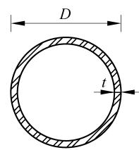

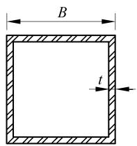

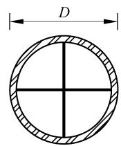

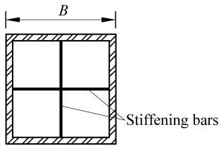

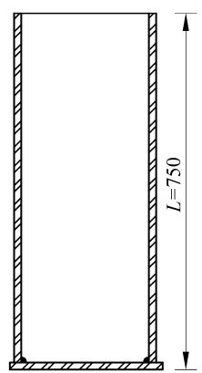  
(a) Normal columns

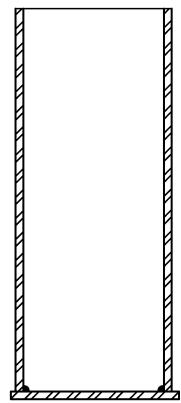

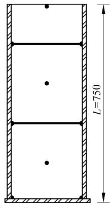

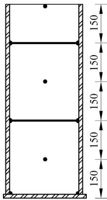  
(b) Braced columns   
Fig. 1 Details of normal and braced columns (mm)

composite columns, some design codes have been consulted for the check of minimum thickness of steel pipes to be incorporated in CFT columns. The

equations of these design codes and the values are listed in Table 1, and the actual values are listed in Table 2.

Testing was done at the University of Engineering

Table 1 Limiting values for the specimens   

<table><tr><td rowspan="2"></td><td colspan="2">ACI[4] and LRFD[6]</td><td colspan="2">EC4[5]</td><td colspan="2">CECS 28:90[9]</td></tr><tr><td>Equation</td><td>Value</td><td>Equation</td><td>Value</td><td>Equation</td><td>Value</td></tr><tr><td>Circular sections</td><td>D/t ≤√8Ea/fy</td><td>80.0</td><td>D/t ≤90×235/fy</td><td>85.0</td><td>20√235/fy ≤D/t</td><td>85√235/fy Except for 4 mm minimum “t”, all other requirements were satisfied</td></tr><tr><td>Square sections</td><td>B/t ≤√3Ea/fy</td><td>49.2</td><td>B/t ≤52√235/fy</td><td>50.6</td><td></td><td></td></tr></table>

Table 2 Actual values for the specimens   

<table><tr><td>Column type</td><td>D or B (mm)</td><td>t /mm</td><td>D/t or B/t</td><td>L/D or L/B</td></tr><tr><td>Circular</td><td>160.00</td><td>2.5</td><td>64.00</td><td>4.69</td></tr><tr><td>Circular</td><td>111.25</td><td>2.5</td><td>44.50</td><td>6.74</td></tr><tr><td>Square</td><td>125.66</td><td>2.5</td><td>50.26</td><td>5.97</td></tr><tr><td>Square</td><td>87.38</td><td>2.5</td><td>34.95</td><td>8.58</td></tr></table>

Note: Column in Serial 3 is not meeting the requirements of LRFD and ACI codes.

and Technology, Peshawar, Pakistan, with a 200-t capacity testing machine. The specimens were centered in the testing machine in order to avoid eccentricity effects. The vertical displacement was measured by a displacement transducer. Since the objective of these tests was to obtain column strengths, only displacement transducers were placed on each column to obtain test data which may be used to conduct more detailed analysis of the behavior of these columns later on by other scholars. Both surfaces of the specimens were leveled and ground smooth to remove imperfections on the surface and to maintain uniformity of the loading on the surface. A photograph showing the failure modes and test setup is given in Fig. 2 and the detail of samples is given in Table 3.

Table 3 Detail of specimens   

<table><tr><td>Size and type</td><td>Marking</td><td>Numbers</td></tr><tr><td>111.25 mm circular hollow</td><td>4CH</td><td>3</td></tr><tr><td>111.25 mm circular filled</td><td>4CF</td><td>3</td></tr><tr><td>111.25 mm circular filled and braced</td><td>4CFB</td><td>1</td></tr><tr><td>160 mm circular hollow</td><td>6CH</td><td>3</td></tr><tr><td>160 mm circular filled</td><td>6CF</td><td>3</td></tr><tr><td>160 mm circular filled and braced</td><td>6CFB</td><td>1</td></tr><tr><td>87.38 mm equivalent square hollow</td><td>4SH</td><td>3</td></tr><tr><td>87.38 mm equivalent square filled</td><td>4SF</td><td>3</td></tr><tr><td>87.38 mm equivalent square filled and braced</td><td>4SFB</td><td>1</td></tr><tr><td>125.66 mm equivalent square hollow</td><td>6SH</td><td>3</td></tr><tr><td>125.66 mm equivalent square filled</td><td>6SF</td><td>3</td></tr><tr><td>125.66 mm equivalent square filled and braced</td><td>6SFB</td><td>1</td></tr><tr><td>Total</td><td></td><td>28</td></tr></table>

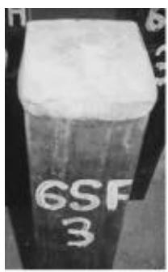  
(a)

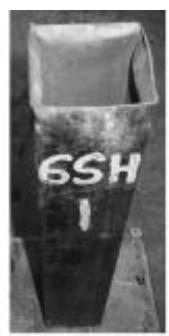  
(b)

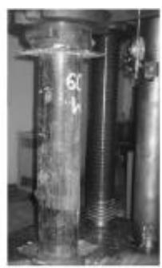

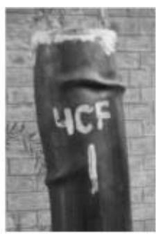  
(d)

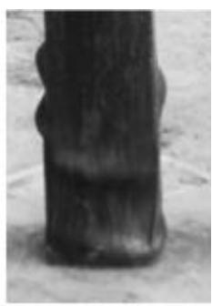  
  
Fig. 2 Photographs showing failure modes and test setup of columns

# 1.2 Experimental results

The behavior of specimens tested is shown in Figs. 3-8 (with Figs. 3-5 showing stress vs. strain and Figs. 6-8 showing load vs. displacement relationships). Also, the strength results are listed in Table 4. The behavior and strength of hollow and filled circular columns is also compared with the equation proposed by Giakoumelis and Lam[1], and load vs. deformation behavior is compared with results by Johansson and Gylltoft[7,10].

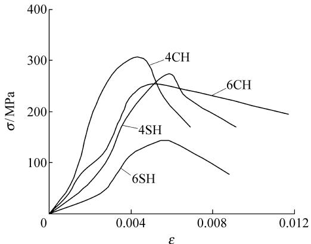  
Fig. 3 Stress-strain relationship for hollow columns

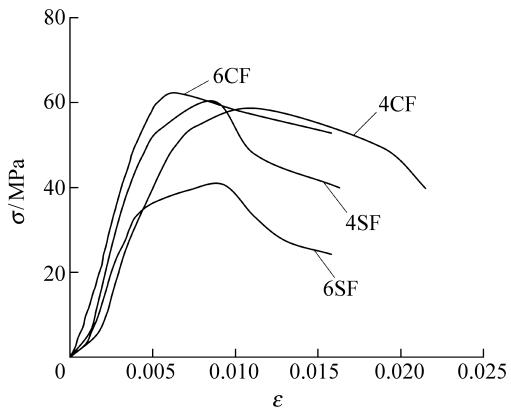  
Fig. 4 Stress-strain relationship for filled columns

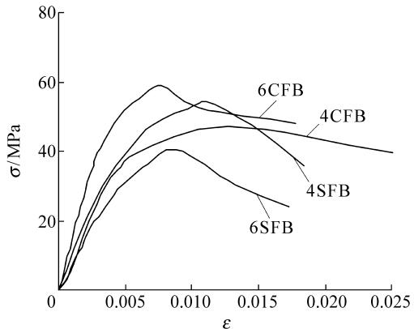  
Fig. 5 Stress-strain relationship for filled and braced columns

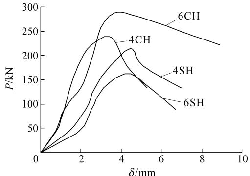  
Fig. 6 Load-displacement relationship for hollow columns

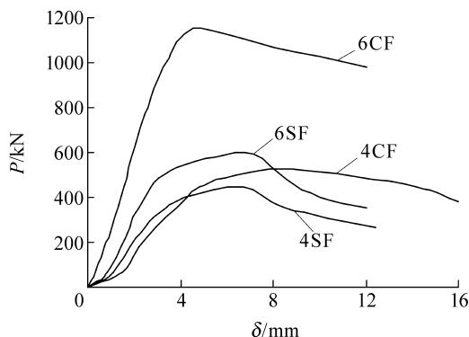  
Fig. 7 Load-displacement relationship for filled columns

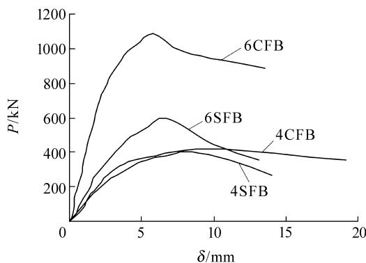  
Fig. 8 Load-displacement relationship for filled and braced columns

# 1.2.1 Hollow steel columns

Except for the 125.66-mm square column, all other specimens behaved similarly. Yielding strain was between 0.004 and 0.006 and stress was around $2 5 0 \mathrm { M P a }$ Deformation behavior was also similar. Circular columns proved to be much stronger and their deformations were large after yielding. A mild slope of curve was observed suggesting ductile behavior. For the square columns, however, the slope after yielding was steep, showing a brittle or non ductile behavior. Another behavior noted was that square columns

Table 4 Detailed observations and test results   

<table><tr><td rowspan="2">Marking</td><td rowspan="2">D/mm</td><td rowspan="2">Aa/mm2</td><td rowspan="2">Ac/mm2</td><td colspan="6">P_u/kN</td></tr><tr><td>Tested</td><td>LRFD</td><td>ACI</td><td>EC4</td><td>Chinese</td><td>By Eq. (5)</td></tr><tr><td>4CH</td><td>160.00</td><td>1237</td><td>0</td><td>290</td><td>341</td><td>341</td><td>309</td><td>341</td><td>309.25</td></tr><tr><td>4CF</td><td>160.00</td><td>1237</td><td>18869</td><td>1153</td><td>698</td><td>784</td><td>909</td><td>1237</td><td>986.27</td></tr><tr><td>4CFB</td><td>160.00</td><td>1237</td><td>18869</td><td>1090</td><td>698</td><td>784</td><td>909</td><td>1237</td><td>986.27</td></tr><tr><td>6CH</td><td>111.25</td><td>854</td><td>0</td><td>237</td><td>235</td><td>235</td><td>214</td><td>235</td><td>213.50</td></tr><tr><td>6CF</td><td>111.25</td><td>854</td><td>8866</td><td>526</td><td>380</td><td>443</td><td>454</td><td>685</td><td>531.61</td></tr><tr><td>6CFB</td><td>111.25</td><td>854</td><td>8866</td><td>422</td><td>380</td><td>443</td><td>454</td><td>685</td><td>531.61</td></tr><tr><td>4SH</td><td>125.66</td><td>1231</td><td>0</td><td>179</td><td>339</td><td>339</td><td>308</td><td>339</td><td>307.75</td></tr><tr><td>4SF</td><td>125.66</td><td>1231</td><td>14559</td><td>594</td><td>551</td><td>681</td><td>788</td><td>1061</td><td>830.13</td></tr><tr><td>4SFB</td><td>125.66</td><td>1231</td><td>14559</td><td>595</td><td>551</td><td>681</td><td>788</td><td>1061</td><td>830.13</td></tr><tr><td>6SH</td><td>87.38</td><td>848</td><td>0</td><td>215</td><td>234</td><td>234</td><td>212</td><td>234</td><td>212.00</td></tr><tr><td>6SF</td><td>87.38</td><td>848</td><td>6786</td><td>450</td><td>293</td><td>393</td><td>428</td><td>598</td><td>455.48</td></tr><tr><td>6SFB</td><td>87.38</td><td>848</td><td>6786</td><td>407</td><td>293</td><td>393</td><td>428</td><td>598</td><td>455.48</td></tr></table>

started yielding at lower loads but at more deformations than circular ones. Photographs of hollow square columns (Fig. 2) indicate that yielding was due to local buckling of steel walls, mostly observed at top or bottom ends, which is the same as was observed by O’Shea and Bridge[3].

# 1.2.2 Filled columns

Behavior of filled columns was in line with the previous studies. A clear increase in compressive strength was observed especially in circular columns and small sides square columns. Yielding range for columns was 0.005 to 0.01. Except for the $1 2 5 . 6 6 \mathrm { - m m }$ square column, the stress of all columns was around $6 0 \ \mathrm { M P a }$ , which was almost double the compressive strength of concrete. Load-deformation behavior also indicates that circular columns were stronger and almost all columns had a ductile behavior. Deformations were as large as $1 2 ~ \mathrm { m m }$ . Except for 6SF, almost all other columns had a similar mode of failure. Bulging of walls, forming of rings, and buckles at different locations but mostly near the ends was observed. Similar behavior for filled, square, circular, and rectangular columns was also observed by Schneider[2].

# 1.2.3 Filled and braced columns

Geometry of this column is shown in Fig. 1. Behavior of braced columns was not much different from filled columns. Comparatively low strength results were observed in some cases. Since columns had to be drilled first and then welded with the #3 bars, it may have changed the properties of steel tubes. If bars would

have been bolted instead of welded, the results might have been different. But nothing happened to the bar geometry, it was neither twisted nor elongated. This kind of bracing may not prove to be useful in future. However, circular columns do not need bracing because only a slight increase in thickness would achieve the required effect. For square columns, arrangement can be made as studied by Huang et al.[11] The stiffeners provided by Huang et al. enhanced not only the ultimate strength but also the ductility.

# 2 Strength Comparison by Design Codes

# 2.1 Eurocode-4

EC4 is the most recently completed international standard in composite construction. EC4 covers concreteencased and partially encased steel sections and concrete-filled sections with or without reinforcement. EC4 considers confinement effects for circular sections when relative slenderness has value less than 0.5. EC4 uses limit state concepts to achieve the aims of serviceability and safety by applying partial safety factors to load and material properties. It is the only code that treats the effects of long-term loading separately. The ultimate axial force of a square column is

$$
N _ {\mathrm {p l}, \mathrm {R}} = A _ {\mathrm {a}} f _ {\mathrm {y}} + A _ {\mathrm {c}} f _ {\mathrm {c}} \tag {1}
$$

where $A _ { \mathrm { a } }$ and $A _ { \mathrm { c } }$ are the area of steel and concrete, and $f _ { \mathrm { y } }$ and $f _ { \mathrm { c } }$ are the strength of steel and concrete.

For circular columns, confinement effects have to be

incorporated if the relative slenderness $\bar { I }$ is less than 0.5, where $\bar { I }$ is defined as

$$
\bar {I} = \sqrt {N _ {\mathrm {p l , R}} / N _ {\mathrm {c r}}} \tag {2}
$$

where $N _ { \mathrm { c r } } = P ^ { 2 } ( E I ) _ { \mathrm { e } } / l ^ { 2 } , ~ ( E I ) _ { \mathrm { e } } = E _ { \mathrm { a } } I _ { \mathrm { a } } + 0 . 8 E _ { \mathrm { c d } } I _ { \mathrm { c } } ,$ $E _ { \mathrm { c d } } = E _ { \mathrm { c m } } / { \bf g } _ { \mathrm { c } } , E _ { \mathrm { c } }$ $E _ { \mathrm { { c m } } }$ is the secant modulus of concrete (given by Clause 3.2.4.1 and Table 3.2 in $\operatorname { E C } 4 ^ { [ 5 ] } .$ ), $\pmb { \xi } _ { \mathrm { c } } = 1 . 3 5$ is a safety factor (given by Clause A.3.1 and A.3.4 in $\mathrm { E C } 2 ^ { [ 1 2 ] }$ ).

Values of $\bar { I }$ for $1 6 0 \mathrm { - m m }$ and $1 1 1 . 2 5 \mathrm { - m m }$ circular columns were 0.22 and 0.44, which shows that

confinement effects have to be included in design calculation. With the equation as

$$
N _ {\mathrm {p l}, \mathrm {R}} = A _ {\mathrm {a}} n _ {2} f _ {\mathrm {y}} + A _ {\mathrm {c}} f _ {\mathrm {c}} [ 1 + n _ {1} (t / d) \left(f _ {\mathrm {y}} / f _ {\mathrm {c}}\right) ] \tag {3}
$$

where $n _ { 1 } = 4 . 9 - 1 8 . 5 \overline { { I } } + 1 7 \overline { { I } } ^ { 2 }$ and $n _ { 2 } = 0 . 2 5 ( 3 + 2 \overline { { I } } )$ .

The values calculated for square and circular columns by this method are listed in Table 5. Although the values are a bit conservative, even they are to some extent accurate for both circular and square columns. The incorporation of confinement effect adds up to the estimation of ultimate capacity of circular columns.

Table 5 Comparison of capacities filled columns   

<table><tr><td rowspan="3">Type</td><td rowspan="3">D or B (mm)</td><td rowspan="3">Actual capacity pu0(kN)</td><td colspan="2">LRFD</td><td colspan="2">ACI</td><td colspan="2">EC4</td><td colspan="2">Chinese</td><td colspan="2">Georgios equation</td></tr><tr><td>Pu</td><td>D</td><td>Pu</td><td>D</td><td>Pu</td><td>D</td><td>Pu</td><td>D</td><td>Pu</td><td>D</td></tr><tr><td>kN</td><td>%</td><td>kN</td><td>%</td><td>kN</td><td>%</td><td>kN</td><td>%</td><td>kN</td><td>%</td></tr><tr><td>Circular</td><td>160.00</td><td>1153</td><td>698</td><td>-40</td><td>784</td><td>-32.0</td><td>909</td><td>-21</td><td>1237</td><td>7</td><td>986</td><td>-14.0</td></tr><tr><td>Circular</td><td>160.00</td><td>1090</td><td>698</td><td>-35</td><td>784</td><td>-28.0</td><td>909</td><td>-17</td><td>1237</td><td>12</td><td>986</td><td>-9.5</td></tr><tr><td>Circular</td><td>111.25</td><td>526</td><td>380</td><td>-28</td><td>443</td><td>-16.0</td><td>454</td><td>-14</td><td>685</td><td>23</td><td>531</td><td>1.0</td></tr><tr><td>Circular</td><td>111.25</td><td>422</td><td>380</td><td>-10</td><td>443</td><td>5.0</td><td>454</td><td>7</td><td>685</td><td>38</td><td>531</td><td>25.0</td></tr><tr><td>Square</td><td>125.66</td><td>594</td><td>551</td><td>-7</td><td>681</td><td>13.0</td><td>709</td><td>16</td><td>788</td><td>24</td><td>830</td><td>28.0</td></tr><tr><td>Square</td><td>125.66</td><td>595</td><td>551</td><td>-7</td><td>681</td><td>13.0</td><td>709</td><td>16</td><td>788</td><td>24</td><td>830</td><td>28.0</td></tr><tr><td>Square</td><td>87.38</td><td>450</td><td>293</td><td>-35</td><td>393</td><td>-13.0</td><td>399</td><td>-11</td><td>428</td><td>-5</td><td>455</td><td>1.0</td></tr><tr><td>Square</td><td>87.38</td><td>407</td><td>293</td><td>-28</td><td>393</td><td>-3.5</td><td>399</td><td>-2</td><td>428</td><td>-5</td><td>455</td><td>11.0</td></tr></table>

Note: u u 0P PD −= . $\pmb { D } { = } \frac { P _ { \mathrm { u } } - P _ { \mathrm { u 0 } } } { P _ { \mathrm { u 0 } } }$

# 2.2 ACI code

The ACI and Australian Standards (AS) use the same formula for calculating the squash load. Neither code takes into consideration the concrete confinement. The limiting thickness of the steel tube to prevent local buckling is almost the same for both codes and is calculated in succeeding paragraphs. The squash load for square, rectangular, and circular columns is determined by

$$
N _ {\mathrm {u}} = 0. 8 5 A _ {\mathrm {c}} f _ {\mathrm {c}} + A _ {\mathrm {a}} f _ {\mathrm {y}} \tag {4}
$$

A modification for ACI and AS equations was proposed by Giakoumelis and Lam[1]. A coefficient is proposed for the ACI and AS equation to take into account the effect of concrete confinement on the axial load capacity of concrete filled circular steel tube, a revised equation was proposed as follows:

$$
N _ {\mathrm {u}} = 1. 3 A _ {\mathrm {c}} f _ {\mathrm {c}} + A _ {\mathrm {a}} f _ {\mathrm {y}} \tag {5}
$$

The values calculated by this method are listed in

Table 5. The capacities given by the ACI code are too conservative whereas those calculated by using new equations are more realistic, especially for circular columns.

# 2.3 LRFD design specification

The squash load is given by

$$
P _ {\mathrm {n}} = A _ {\mathrm {a}} f _ {\mathrm {y}} + 0. 8 5 A _ {\mathrm {c}} f _ {\mathrm {c}} \tag {6}
$$

$$
\frac {P _ {\mathrm {n}}}{A _ {\mathrm {a}}} = F _ {\mathrm {m y}} = f _ {\mathrm {y}} + 0. 8 5 \frac {A _ {\mathrm {c}}}{A _ {\mathrm {a}}} f _ {\mathrm {c}} \tag {7}
$$

For composite columns

$$
F _ {\mathrm {m y}} = f _ {\mathrm {y}} + c _ {2} f _ {\mathrm {c}} \left(A _ {\mathrm {c}} / A _ {\mathrm {a}}\right) \tag {8}
$$

where $c _ { 2 } = 0 . 8 5$

Also

$$
E _ {\mathrm {m}} = E _ {\mathrm {a}} + c _ {3} E _ {\mathrm {c}} \left(A _ {\mathrm {c}} / A _ {\mathrm {a}}\right) \tag {9}
$$

where $E _ { \mathrm { a } }$ is the modulus of steel and $c _ { 3 } = 0 . 4$

$$
I _ {\mathrm {c}} = \frac {K L}{\delta r _ {\mathrm {m}}} \sqrt {\frac {F _ {\mathrm {m y}}}{E _ {\mathrm {m}}}} \tag {10}
$$

$$
F _ {\mathrm {c r}} = 0. 6 5 8 ^ {I _ {\mathrm {c}} ^ {2}} F _ {\mathrm {m y}} \tag {11}
$$

where $K$ is the effective length factor and $r _ { \mathrm { m } }$ is the radius of gyration.

Nominal strength $P _ { \mathrm { n } }$ can be calculated as

$$
P _ {\mathrm {n}} = A _ {\mathrm {a}} F _ {\mathrm {c r}} \tag {12}
$$

The minimum steel requirement is confirmed that all columns have steel area ratio $\pmb { r } _ { \mathrm { s } }$ more than $4 \%$ . The capacities calculated by this method are listed in Table 5 and details are given in Table 6. These values are also too conservative.

Table 6 LRFD design details   

<table><tr><td>Column type</td><td>D/mm</td><td>Aa/mm2</td><td>Ac/mm2</td><td>rs</td><td>rm/mm</td><td>Ac/Aa</td><td>Fmy/MPa</td><td>Em/MPa</td><td>Ic</td><td>Fcr/MPa</td><td>Pn/kN</td></tr><tr><td>Circular</td><td>160.00</td><td>1237</td><td>18869</td><td>6.15</td><td>1-11</td><td>15.25</td><td>608</td><td>346400</td><td>0.090</td><td>564</td><td>698</td></tr><tr><td>Circular</td><td>111.25</td><td>854</td><td>8866</td><td>8.80</td><td>77</td><td>10.40</td><td>494</td><td>299840</td><td>0.126</td><td>445</td><td>380</td></tr><tr><td>Square</td><td>125.66</td><td>1231</td><td>14559</td><td>7.80</td><td>50</td><td>11.83</td><td>528</td><td>313568</td><td>0.195</td><td>448</td><td>551</td></tr><tr><td>Square</td><td>87.38</td><td>848</td><td>6786</td><td>11.11</td><td>35</td><td>8.00</td><td>438</td><td>276800</td><td>0.280</td><td>345</td><td>293</td></tr></table>

# 2.4 Chinese code

Axial load capacity of circular CFT is given in “Specification for design and construction of concrete-filled steel tubular structures”[9] as below:

$$
N _ {\mathrm {u}} = f _ {l} f _ {\mathrm {e}} N _ {0} \tag {13}
$$

where $N _ { \mathrm { 0 } } = f _ { \mathrm { c } } A _ { \mathrm { c } } ( 1 + \sqrt { \pmb q } + \pmb q ) , \pmb q = f _ { \mathrm { y } } A _ { \mathrm { a } } \big / f _ { \mathrm { c } } A _ { \mathrm { c } } .$

Axial load capacity for square CFT is given in “Specifications for CFT with Square Cross Section” from technical specifications for early strength model composite structure used for navy port emergency repair in wartime (GJB 4142-2000)[13].

$$
N ^ {\prime} \leqslant f A _ {\mathrm {a c}} f _ {\mathrm {s c}} \tag {14}
$$

where $\pmb { f } = 1$ for short columns, $A _ { \mathrm { { a c } } } = A _ { \mathrm { { a } } } + A _ { \mathrm { { c } } }$ , $f _ { \mathrm { s c } } =$

$$
(1. 2 1 2 + \boldsymbol {a} \boldsymbol {x} _ {0} + \boldsymbol {b} \boldsymbol {x} _ {0} ^ {2}) f _ {\mathrm {c}}, \quad \boldsymbol {x} _ {0} = \boldsymbol {a} _ {\mathrm {s}} \frac {f}{f _ {\mathrm {c}}}, \quad \boldsymbol {a} = 0. 1 3 8 1 \frac {f}{2 1 5} +
$$

$$
0. 7 6 4 6, \boldsymbol {b} = - 0. 0 7 2 7 \frac {f _ {\mathrm {c}}}{1 5} + 0. 0 2 1 6, \boldsymbol {a} _ {\mathrm {s}} = \frac {A _ {\mathrm {a}}}{A _ {\mathrm {a c}}} \text {, a n d} f \text {i s}
$$

the design strength of steel.

Also, the section should follow these limits: side/edge of steel columns should be greater than or equal to $2 0 \mathrm { m m }$ and thickness of the steel should be greater than or equal to $4 \mathrm { m m }$ .

Chinese code is the only code which is close to the values for both circular and square columns. But it is not true for square columns not meeting the minimum thickness requirements of other codes, i.e., $4 ~ \mathrm { m m }$ . For $4 \mathrm { m m }$ thick tubes and above, Chinese code seems to be the best option for calculating the ultimate strength of

short CFT columns.

The capacities calculated by all these methods have been listed in Table 5 with a percentage plus or minus calculations as compared to actual capacity of columns. It is observed that almost all codes give a conservative value except for the Chinese code and the Giakoumelis equation[11] for circular columns and the EC4 for square columns.

# 3 Analytical Study

A total of 32 hollow and filled specimens were tested in the experimental investigations, which were axially loaded only.

The objectives of these tests were to investigate the confining effect of steel tubes on concrete strength and the restraining effect of the concrete fill on local buckling of the steel tube wall, and to derive methods to evaluate ultimate load and load-deformation relationship. The bond strength has no influence on the compressive strength because there is no relative slip between concrete core and steel pipe. It is also highlighted that there was no strain hardening behavior of columns contrary to RCC columns and also agree with some previous studies. Columns after 1st yielding curve kept the slope of strain descending almost linearly. Behavior of hollow and filled columns follows the similar curves as given by Johansson and Gylltoft[7,10].

# 3.1 Effect of confinement on concrete

For concrete filled circular sections, the confinement

effect of concrete increases the concrete resistance, but at the same time reduces the axial resistance of the steel section. In EC4, the reduction of concrete strength by 0.85 may be omitted for concrete filled composite columns since the development of concrete strength is better achieved due to the protection against the environment and against splitting of concrete. The effect of confinement is considered when the relative slenderness $\bar { I }$ is less than 0.5. Due to confinement on concrete, the stress bearing capacity of concrete increased to almost twice that of the ordinary circular column.

Another version of confinement has been explained by Han and Yang[14], where the confinement factor $\pmb { X }$ is defined as

$$
\mathbf {x} = \frac {A _ {\mathrm {a}} f _ {\mathrm {y}}}{A _ {\mathrm {c}} f _ {\mathrm {c}}} \tag {15}
$$

The increase in confinement depends upon $A _ { \mathrm { a } } .$ , if we keep $f _ { \mathrm { y } }$ and $f _ { \mathrm { c } }$ constant. This means that when the diameter is kept constant and the thickness is varied, the greater the thickness the higher the confinement factor. But for varying diameters, the compressive strength of concrete and the ductility of the column will not increase with the increasing confinement factor. The confinement factor has been calculated and listed in Table 7. For different sizes of columns, the confinement factor may be higher but neither the corresponding strength nor the axial capacity is higher.

Table 7 Effects of confinement factor   

<table><tr><td>Column type</td><td>D
mm</td><td>Aa
mm²</td><td>Ac
mm²</td><td>X</td><td>fc
MPa</td><td>Pu
kN</td></tr><tr><td>Circular</td><td>160.00</td><td>1237</td><td>18869</td><td>0.594</td><td>62.26</td><td>1153</td></tr><tr><td>Circular</td><td>160.00</td><td>1237</td><td>18869</td><td>0.594</td><td>58.83</td><td>1090</td></tr><tr><td>Circular</td><td>111.25</td><td>854</td><td>8866</td><td>0.873</td><td>58.60</td><td>526</td></tr><tr><td>Circular</td><td>111.25</td><td>854</td><td>8866</td><td>0.873</td><td>47.10</td><td>422</td></tr><tr><td>Square</td><td>125.66</td><td>1231</td><td>14559</td><td>0.766</td><td>40.60</td><td>594</td></tr><tr><td>Square</td><td>125.66</td><td>1231</td><td>14559</td><td>0.766</td><td>40.60</td><td>595</td></tr><tr><td>Square</td><td>87.38</td><td>848</td><td>6786</td><td>1.132</td><td>60.25</td><td>450</td></tr><tr><td>Square</td><td>87.38</td><td>848</td><td>6786</td><td>1.132</td><td>54.50</td><td>407</td></tr></table>

# 3.2 ACI code requirement to neglect slenderness effects

ACI code neglects the slenderness effects if $k \frac { l _ { \mathrm { u } } } { r } { \overset { \cdot } {  } } 3 4$ with no moments applied at either ends, where $k = 1$ and $l _ { \mathrm { u } } { = } 7 5 0 \mathrm { m m }$ , $r = 0 . 3 0 D$ for square and $0 . 2 5 D$ for circular columns. The check for the specimens for slenderness effects is listed in Table 8. We can see that all columns have values of $k l _ { \mathrm { u } } / r$ less than 34, so effects of slenderness can be neglected.

Table 8 Check for $k l _ { \mathrm { s } } / r ; \leqslant 3 4$   

<table><tr><td>Column type</td><td>D or B (mm)</td><td>r</td><td>lv/r</td></tr><tr><td>Circular</td><td>160.00</td><td>40.0</td><td>19</td></tr><tr><td>Circular</td><td>111.25</td><td>27.8</td><td>27</td></tr><tr><td>Square</td><td>125.66</td><td>37.7</td><td>20</td></tr><tr><td>Square</td><td>87.38</td><td>26.2</td><td>29</td></tr></table>

# 3.3 Slenderness ratio

Slenderness ratio also plays an important role in the strength calculation of columns and its behavior. As the slenderness ratio $( I )$ increases, the ultimate strength decreases. For circular columns, the ultimate strength is $9 8 7 \mathrm { k N }$ when $I = 1 9$ and $5 3 2 \mathrm { k N }$ when $\boldsymbol { I = }$ 27. For square columns, the ultimate strength is 830 kN when $\ddot { e } = 2 1$ and $4 4 6 \mathrm { k N }$ when $ { \boldsymbol { I } } = 3 0$ . Details are shown in Table 9 and graphically shown in Fig. 9. The same behavior was observed by Han et al.[8,15]

Table 9 Values of slenderness ratio   

<table><tr><td>Column type</td><td>D or B (mm)</td><td>t /mm</td><td>D/t or B/t</td><td>L/D or L/B</td><td>è</td></tr><tr><td>Circular</td><td>160.00</td><td>2.5</td><td>64.00</td><td>4.69</td><td>19</td></tr><tr><td>Circular</td><td>111.25</td><td>2.5</td><td>44.50</td><td>6.74</td><td>27</td></tr><tr><td>Square</td><td>125.66</td><td>2.5</td><td>50.26</td><td>5.97</td><td>21</td></tr><tr><td>Square</td><td>87.38</td><td>2.5</td><td>34.95</td><td>8.58</td><td>30</td></tr></table>

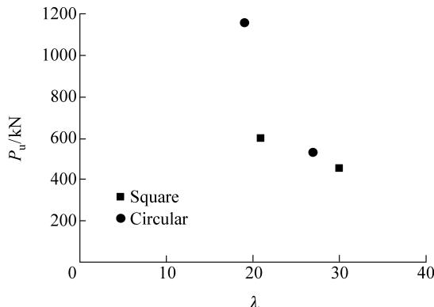  
Fig. 9 The slenderness virus load relationship

# 3.4 Failure modes

Almost all columns failed due to local buckling and concrete crushing. Local buckling took place after the elastic range, and after this concrete crushing followed. The failure mode of almost all columns at the bottom or the top was a typical crushing failure mode where the steel wall was pushed out by the concrete core, which in turn was confined by the steel. When the steel was removed from the specimen after failure, the concrete was found to have taken the shape of the deformed steel tube, which illustrates the composite action of the section.

# 3.5 Ultimate strength of axially loaded short columns

# 3.5.1 Circular columns

In the initial stages loading of the circular CFT columns are subjected to axial load while Poisson ratio for concrete is lower than that for steel. Therefore, separation between the steel tube wall and concrete

core takes place. As the load increases, the longitudinal strain reaches a certain critical strain. The lateral deformation strength and the nominal squash load are enhanced by the confining effect on concrete, and this enhancement depends upon the tube strength. Figures 3-8 indicate the behavior of circular columns is much better as compared to square ones for both hollow and filled series. At failure, ring shaped buckles developed outwards mostly near the top or bottom ends of the column. The equation developed by Giakoumelis and Lam[1] predicts the ultimate strength most accurately for circular columns.

# 3.5.2 Square columns

In the case of square columns, it is necessary to take into consideration a capacity reduction due to local buckling of the steel tube wall of the column with large $B / t$ ratio rather than the confinement effect of the steel tube. Also, the compressive strength decreases as the size of square columns increases as shown in Figs. 3-8. This is also investigated by Sakino et al.[16] So an equation for square columns is suggested to be used for calculating the ultimate strength as below:

$$
P _ {\mathrm {u}} = 1. 1 0 A _ {\mathrm {c}} f _ {\mathrm {c}} + A _ {\mathrm {a}} f _ {\mathrm {y}} \tag {16}
$$

Strengths calculated by Eq. (16) are listed in Table 10. It is observed that the square columns which do not meet the requirement of thickness have not enough strength to confirm this equation. But the other columns show the value fairly near the proposed equation. Some more tests are needed to verify and support this equation not only for CFTs but also for double skinned CFTs.

Table 10 Square column strength using proposed equation   

<table><tr><td rowspan="2">B
mm</td><td rowspan="2">t
mm</td><td rowspan="2">B/t</td><td rowspan="2">L/B</td><td colspan="2">Pu/kN</td><td rowspan="2">Remarks</td></tr><tr><td>Tested</td><td>By Eq. (16)</td></tr><tr><td>125.66</td><td>2.5</td><td>50.26</td><td>5.97</td><td>594</td><td>749.8</td><td>Not meeting the B/t requirements</td></tr><tr><td>87.38</td><td>2.5</td><td>34.95</td><td>8.58</td><td>450</td><td>418.0</td><td>Reasonably safe</td></tr></table>

# 4 Conclusions

A set of detailed experiments have been conducted on hollow and filled short steel tubular columns. The experiments have shown that strength increases in

circular columns much more than in square columns. Increase in strength of circular columns of one series was more than $6 0 \%$ . Local wall buckling was observed in square columns both hollow and filled. The strength increase may be due to the good quality of the concrete

caused by the retention of moisture. Almost all filled columns behaved in a fairly ductile manner. Further experiments should be carried out on double skinned short columns DSCFTs filled with normal strength concrete and having different geometries.

This paper is based upon the tests carried out on specimens fabricated using the local materials indigenously produced in Pakistan. In order to encourage the inland designers, builders and contractors and to build their confidence in using CFTs as structural components, locally produced materials were used. Although concrete encased steel sections are being used on a lower scale as compared to RCC, CFTs also need to be incorporated as it is a step forward in the construction industry of Pakistan.

# Acknowledgements

Experimental results used in this paper are based on tests conducted by Muhammad Naseem Baig under the guidance of Prof. Tahir Kibriya at the Military College of Engineering (National Institute of Transportation, Pakistan). The author is thankful for the financial support provided by the National University of Science and Technology (NUST) of Pakistan.

# References

[1] Giakoumelis G, Lam D. Axial capacity of circular concrete-filled tube columns. Journal of Constructional Steel Research, 2004, 60(7): 1049-1068.   
[2] Schneider S P. Axially loaded concrete-filled steel tubes. Journal of Structural Engineering, 1998, 124(10): 1125- 1138.   
[3] O’Shea M D, Bridge R Q. Design of circular thin-walled concrete filled steel tubes. Journal of Structural Engineering, 2000, 126(11): 1295-1303.   
[4] American Concrete Institute (ACI). Building code requirements for structural concrete and commentary. ACI 318-99/R-99. Farmington Hills, Mich., 1999.

[5] European Committee for Standardization (ECS). Eurocode 4: Design of composite steel and concrete structures. Brussels, Belgium, 1994.   
[6] American Institute for Steel Construction (AISC). Load and resistance factor design specification for structural steel buildings. AISC, Chicago, 1999.   
[7] Johansson M, Gylltoft K. Structural behavior of slender circular steel-concrete composite columns under various means of load application. Steel and Composite Structures, 2001, 1(4): 393-410.   
[8] Han Linhai, Zhong Tao, Liu Wei. Effects of sustained load on concrete-filled hollow structural steel columns. Journal of Structural Engineering, 2004, 130(9): 1392-1404.   
[9] CECS 28:90. Specification for design and construction of concrete-filled steel tubular structures. Beijing: China Planning Press, 1992. (in Chinese)   
[10] Johansson M, Gylltoft K. Mechanical behavior of circular steel-concrete composite stub columns. Journal of Structural Engineering, 2002, 128(8): 1073-1081.   
[11] Huang C S, Yeh Y K, Liu G Y, Hu H T, Tsai K C, Weng Y T, Wang S H, Wu M H. Axial load behavior of stiffened concrete-filled steel columns. Journal of Structural Engineering, 2002, 128(9): 1222-1230.   
[12] European Committee for Standardization (ECS). Eurocode 2: Design of concrete structures. Brussels, Belgium, 1992.   
[13] GJB 4142-2000. Technical specifications for early-strength model composite structure used for navy port emergency repair in wartime. General Logistics Department of People’s Liberation Army, 2001. (in Chinese)   
[14] Han Linhai, Yang Youfu. Cyclic performance of concretefilled steel CHS columns under flexural loading. Journal of Constructional Steel Research, 2005, 61(4): 423-452.   
[15] Han Linhai, Yang Youfu. Analysis of thin-walled steel RHS columns filled with concrete under long-term sustained loads. Thin-Walled Structures, 2003, 41(9): 849-870.   
[16] Sakino K, Nakahara H, Morino S, Nishiyama I. Behavior of centrally loaded concrete-filled steel tube short columns. Journal of Structural Engineering, 2004, 130(2): 180-188.