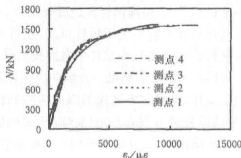
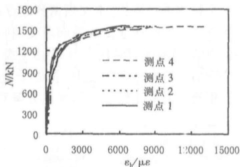
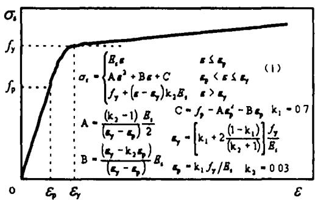
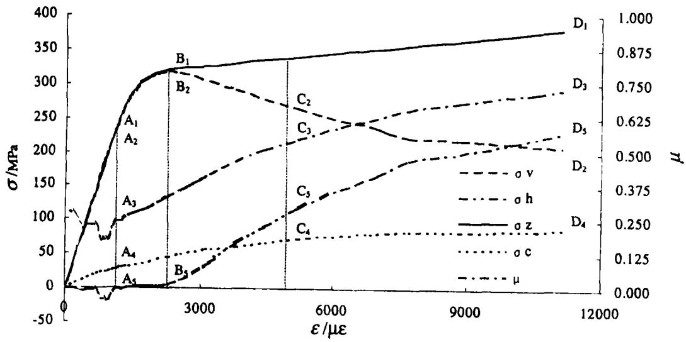
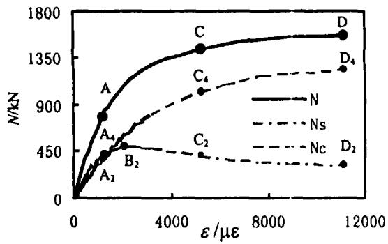

# 圆钢管高强混凝土轴压短柱剥离分析

王玉银，张素梅

（哈尔滨工业大学土木工程学院，黑龙江哈尔滨150090）

摘要：以36根圆钢管混凝土短柱轴压试验为基础，采用混凝土处于三向应力状态，钢材处于平面应力状态的假定，根据测定的逐级荷载下试件中截面处钢管外表面的纵向应变和横向应变，利用数值分析的方法，剥离出钢管和混凝土各自受力情况.给出了钢管和核心混凝土的纵向应力-纵向应变关系曲线.把处于复杂应力状态下的钢管和混凝土综合工作性能分解开来，对钢管和核心混凝土的相互作用依赖关系进行了更明确和全面地阐述.

关键词：钢管混凝土；轴压；剥离；应力-应变关系

中图分类号：TU398

文献标识码：A

文章编号：0367-6234(2003)增刊-0031-04

# Individual bheavior of steel tube and concrete in CFST stub columns subjected to axial compression

WANG Yu-yin, ZHANG Su-mei

(School of Civil Engineering, Harbin Institute of Technology, Harbin 150090, China)

Abstract: This paper presents 36 specimen test results of high strength concrete-filled steel tube (CFST) stub columns subjected to axial compressive load. In the stest, the external compressive load vs. strain on the steel tube relations were monitored and used to develop the stress--strain curves of steel tube under the 2-dimensional stress state assumption for the tube. Then the load on concrete core is successfully separated from the total load. Based on above separation, the longitudinal stress vs. longitudinal strain of concrete and steel tube were developed and discussed in detail, which greatly simplified the analysis for CFST members. In showed that concrete bearing capacity has been increased by the confinement from steel tube and the ductility of CFST stub columns improved to a certain extent.

Key words: concrete-filled steel tubes; axial conditions; separation; stress-strain relationship

钢管混凝土以其优越的结构性能受到工程师的青睐，工程应用越来越广泛；国内外学者对钢管混凝土进行了大量的研究工作，并取得了大量的成果[1,2].但现有的研究多是将钢管与核心混凝土作为一个整体进行分析.本文根据测定逐级荷载下钢管外表面的纵向应变和横向应变，利用数值分析的方法，计算出钢管的内力，再由平衡条件确定核心混凝土的内力变化.这样，把处于复杂受力状态的钢管和混凝土综合工作性能分解开来，

对钢管和核心混凝土的相互依赖关系可获得更明确和深刻的认识.

# 1 钢管混凝土轴压短柱试验

本文进行了12根圆钢管普通混凝土和24根圆钢管高强混凝土轴心受压短柱试验.试件实际尺寸及材料强度见表1.在试件中截面按间隔 $90^{\circ}$ 对称位置的四个测点各粘贴一片纵向应变片和一片横向应变片，以测定中截面的纵向应变和横向应变.将试件直接放置在5000kN液压试验机上进行一次压缩试验，试件两端采用平板铰加载.

通过试验可得到由中截面应变片测得的轴向压力 $N$ 与纵向应变 $\varepsilon_{\nu}$ 和横向应变 $\varepsilon_{h}$ 的关系曲线

图1所示为试件M-C-1-120h实测的 $N - \varepsilon_{\nu}$ 和 $N - \varepsilon_{n}$ 关系曲线

表 1 试件实际尺寸、材料强度及极限承载力  
Table 1 Actual dimensions, material strengths and ultimate bearing capacities of the specimens   

<table><tr><td>序号</td><td>试件编号①</td><td>D×t×L/mm</td><td>含钢率α</td><td>fy/MPa</td><td>fcu10②/MPa</td><td>fck③/MPa</td><td>套箍系数ξ④</td><td>Ne⑤/kN</td><td>fzy/fy⑥</td><td>εu⑦/με</td><td>σv^u/fy⑧</td><td>σh^u/fy⑨</td><td>σc^u/fck⑩</td></tr><tr><td>1</td><td>L-A-1-92h</td><td>167.4×3.32×503</td><td>0.084</td><td>354.0</td><td>50.8</td><td>36.7</td><td>0.813</td><td>1704</td><td>0.963</td><td>13 872</td><td>0.668</td><td>0.732</td><td>1.741</td></tr><tr><td>2</td><td>L-A-2-99h</td><td>167.3×3.35×502</td><td>0.085</td><td>354.0</td><td>50.8</td><td>36.7</td><td>0.822</td><td>1 668</td><td>0.958</td><td>14 685</td><td>0.693</td><td>0.718</td><td>1.638</td></tr><tr><td>3</td><td>L-A-3-98h</td><td>167.5×3.33×503</td><td>0.084</td><td>354.0</td><td>50.8</td><td>36.7</td><td>0.815</td><td>1 700</td><td>0.964</td><td>14 296</td><td>0.800</td><td>0.587</td><td>1.575</td></tr><tr><td>4</td><td>L-B-1-85h</td><td>138.9×3.29×419</td><td>0.102</td><td>331.7</td><td>44.6</td><td>32.2</td><td>1.048</td><td>1 140</td><td>0.945</td><td>15 232</td><td>1.021</td><td>0.354</td><td>1.323</td></tr><tr><td>5</td><td>L-B-2-88h</td><td>139.0×3.29×419</td><td>0.102</td><td>331.7</td><td>44.6</td><td>32.2</td><td>1.049</td><td>1 220</td><td>0.990</td><td>14 342</td><td>0.881</td><td>0.511</td><td>1.602</td></tr><tr><td>6</td><td>L-B-3-89h</td><td>139.5×3.37×419</td><td>0.104</td><td>331.7</td><td>44.6</td><td>32.2</td><td>1.071</td><td>1 180</td><td>0.970</td><td>15 119</td><td>0.984</td><td>0.399</td><td>1.503</td></tr><tr><td>7</td><td>L-C-1-87h</td><td>139.9×3.58×416</td><td>0.111</td><td>325.3</td><td>44.6</td><td>32.2</td><td>1.118</td><td>1 222</td><td>0.963</td><td>14 393</td><td>0.763</td><td>0.665</td><td>1.842</td></tr><tr><td>8</td><td>L-C-2-101h</td><td>139.9×3.54×421</td><td>0.109</td><td>325.3</td><td>44.6</td><td>32.2</td><td>1.104</td><td>1 242</td><td>0.973</td><td>15 995</td><td>1.019</td><td>0.377</td><td>1.522</td></tr><tr><td>9</td><td>L-C-3-30h</td><td>139.9×3.48×419</td><td>0.107</td><td>325.3</td><td>44.6</td><td>32.2</td><td>1.084</td><td>1 300</td><td>0.971</td><td>12 262</td><td>1.011</td><td>0.282</td><td>1.752</td></tr><tr><td>10</td><td>L-E-1-15h</td><td>133.4×5.21×396</td><td>0.177</td><td>351.0</td><td>46.5</td><td>33.6</td><td>1.847</td><td>1 612</td><td>0.950</td><td>13 548</td><td>1.207</td><td>-0.02</td><td>1.033</td></tr><tr><td>11</td><td>L-E-2-25h</td><td>133.2×5.06×397</td><td>0.171</td><td>351.0</td><td>46.5</td><td>33.6</td><td>1.790</td><td>1 580</td><td>0.844</td><td>15 267</td><td>1.228</td><td>0.001</td><td>0.955</td></tr><tr><td>12</td><td>L-E-3-13h</td><td>133.4×5.23×398</td><td>0.177</td><td>351.0</td><td>46.5</td><td>33.6</td><td>1.855</td><td>1 640</td><td>0.925</td><td>12 701</td><td>1.023</td><td>0.272</td><td>1.506</td></tr><tr><td>13</td><td>M-A-1-97h</td><td>167.0×3.37×503</td><td>0.086</td><td>354.0</td><td>70.6</td><td>52.5</td><td>0.579</td><td>2 075</td><td>0.965</td><td>10 690</td><td>0.604</td><td>0.717</td><td>1.610</td></tr><tr><td>14</td><td>M-A-2-100h</td><td>167.1×3.33×503</td><td>0.085</td><td>354.0</td><td>70.6</td><td>52.5</td><td>0.571</td><td>2 105</td><td>0.955</td><td>13 312</td><td>0.648</td><td>0.737</td><td>1.610</td></tr><tr><td>15</td><td>M-A-3-95h</td><td>167.8×3.33×504</td><td>0.084</td><td>354.0</td><td>70.6</td><td>52.5</td><td>0.568</td><td>2 055</td><td>0.909</td><td>4791</td><td>0.735</td><td>0.451</td><td>1.434</td></tr><tr><td>16</td><td>M-B-1-20h</td><td>138.6×3.31×418</td><td>0.103</td><td>331.7</td><td>62.5</td><td>47.0</td><td>0.725</td><td>1 480</td><td>1.039</td><td>10 795</td><td>0.453</td><td>0.881</td><td>1.945</td></tr><tr><td>17</td><td>M-B-2-26h</td><td>138.9×3.36×420</td><td>0.104</td><td>331.7</td><td>62.5</td><td>47.0</td><td>0.735</td><td>1 520</td><td>0.956</td><td>12 269</td><td>0.570</td><td>0.810</td><td>1.938</td></tr><tr><td>18</td><td>M-B-3-90h</td><td>138.6×3.30×420</td><td>0.103</td><td>331.7</td><td>62.5</td><td>47.0</td><td>0.723</td><td>1 500</td><td>0.960</td><td>9 986</td><td>0.564</td><td>0.759</td><td>1.894</td></tr><tr><td>19</td><td>M-C-1-120h</td><td>140.3×3.62×418</td><td>0.112</td><td>325.3</td><td>61.4</td><td>46.2</td><td>0.788</td><td>1 582</td><td>0.979</td><td>11 142</td><td>0.646</td><td>0.711</td><td>1.922</td></tr><tr><td>20</td><td>M-C-2-96h</td><td>140.0×3.60×418</td><td>0.111</td><td>325.3</td><td>61.4</td><td>46.2</td><td>0.785</td><td>1 582</td><td>0.938</td><td>11 873</td><td>0.894</td><td>0.438</td><td>1.690</td></tr><tr><td>21</td><td>M-C-3-86h</td><td>139.7×3.61×420</td><td>0.112</td><td>325.3</td><td>61.4</td><td>46.2</td><td>0.789</td><td>1 540</td><td>0.940</td><td>9 040</td><td>0.835</td><td>0.442</td><td>1.667</td></tr><tr><td>22</td><td>M-E-1-21h</td><td>133.4×5.17×396</td><td>0.175</td><td>351.0</td><td>70.6</td><td>52.5</td><td>1.170</td><td>1 810</td><td>0.995</td><td>3 464</td><td>0.847</td><td>0.270</td><td>1.314</td></tr><tr><td>23</td><td>M-E-2-27h</td><td>133.2×5.03×396</td><td>0.170</td><td>351.0</td><td>70.6</td><td>52.5</td><td>1.136</td><td>1 770</td><td>0.996</td><td>4 173</td><td>0.848</td><td>0.286</td><td>1.470</td></tr><tr><td>24</td><td>M-E-3-23h</td><td>133.2×5.07×397</td><td>0.172</td><td>351.0</td><td>70.6</td><td>52.5</td><td>1.147</td><td>1 835</td><td>1.016</td><td>2 262</td><td>1.016</td><td>-0.08</td><td>0.916</td></tr><tr><td>25</td><td>H-B-1-310h</td><td>138.9×3.28×420</td><td>0.102</td><td>331.7</td><td>77.1</td><td>58.9</td><td>0.573</td><td>1 688</td><td>0.930</td><td>4 632</td><td>0.562</td><td>0.642</td><td>1.754</td></tr><tr><td>26</td><td>H-B-2-309h</td><td>138.7×3.28×418</td><td>0.102</td><td>331.7</td><td>77.1</td><td>58.9</td><td>0.574</td><td>1 680</td><td>0.980</td><td>4 252</td><td>0.694</td><td>0.491</td><td>1.684</td></tr><tr><td>27</td><td>H-B-3-312h</td><td>139.0×3.29×418</td><td>0.102</td><td>331.7</td><td>77.1</td><td>58.9</td><td>0.574</td><td>1 628</td><td>0.979</td><td>5 679</td><td>0.621</td><td>0.604</td><td>1.654</td></tr><tr><td>28</td><td>H-D-1-311h</td><td>159.3×5.36×477</td><td>0.149</td><td>356.3</td><td>77.1</td><td>58.9</td><td>0.904</td><td>2 480</td><td>0.891</td><td>2 718</td><td>0.495</td><td>0.662</td><td>1.903</td></tr><tr><td>29</td><td>H-D-2-308h</td><td>160.2×5.01×476</td><td>0.138</td><td>356.3</td><td>77.1</td><td>58.9</td><td>0.834</td><td>2 440</td><td>1.017</td><td>5 305</td><td>0.482</td><td>0.724</td><td>1.939</td></tr><tr><td>30</td><td>H-D-3-324h</td><td>159.3×5.07×478</td><td>0.141</td><td>356.3</td><td>77.1</td><td>58.9</td><td>0.851</td><td>2 460</td><td>0.961</td><td>4 510</td><td>0.846</td><td>0.297</td><td>1.635</td></tr><tr><td>31</td><td>H-E-1-322h</td><td>133.3×5.10×396</td><td>0.172</td><td>351.0</td><td>77.1</td><td>58.9</td><td>1.028</td><td>1 930</td><td>1.040</td><td>4 878</td><td>0.550</td><td>0.672</td><td>2.192</td></tr><tr><td>32</td><td>H-E-2-306h</td><td>133.4×5.20×396</td><td>0.176</td><td>351.0</td><td>77.1</td><td>58.9</td><td>1.051</td><td>1 955</td><td>1.095</td><td>4 446</td><td>0.933</td><td>0.180</td><td>1.093</td></tr><tr><td>33</td><td>H-E-3-323h</td><td>133.1×5.04×397</td><td>0.170</td><td>351.0</td><td>77.1</td><td>58.9</td><td>1.016</td><td>1 955</td><td>1.041</td><td>3 662</td><td>0.839</td><td>0.300</td><td>1.491</td></tr><tr><td>34</td><td>H-F-1-307h</td><td>133.3×5.43×397</td><td>0.185</td><td>392.0</td><td>77.1</td><td>58.9</td><td>1.233</td><td>1 820</td><td>0.952</td><td>3 293</td><td>0.937</td><td>0.113</td><td>1.411</td></tr><tr><td>35</td><td>H-F-2-313h</td><td>133.1×5.44×397</td><td>0.186</td><td>392.0</td><td>77.1</td><td>58.9</td><td>1.238</td><td>1 915</td><td>0.912</td><td>5 404</td><td>0.827</td><td>0.332</td><td>1.696</td></tr><tr><td>36</td><td>H-F-3-314h</td><td>133.1×5.43×397</td><td>0.186</td><td>392.0</td><td>77.1</td><td>58.9</td><td>1.236</td><td>1 930</td><td>0.958</td><td>3 497</td><td>0.923</td><td>0.142</td><td>1.465</td></tr></table>

注：①试件编号L、M、H分别代表核心混凝土标号为C45、C60、C70；A~F分别代表钢管为 $\phi 168\times 3$ 、 $\phi 140\times 3$ 、 $\phi 140\times 4$ 、 $\phi 159\times 5$ 、 $\phi 133\times 5$ 、 $\phi 133\times 6$ ；1~3表示同种试件的序号；“ $\times \times h$ ”为所有短柱试件的统一编号；  
② $f_{cu}^{10}$ ——试验测得边长为 $100\mathrm{mm}$ 立方体试块抗压强度；  
③ $f_{ck}$ ——混凝土轴心抗压强度标准值， $f_{ck} = k_1 f_{cu}^{15} f_{cu}^{15} = k_2 f_{cu}^{10}, k_1, k_2$ 取值分别参见文献[3]；  
④ $\xi$ ——套箍系数， $\xi = \alpha f_{y} / f_{ck}, \alpha = A_{s} / A_{c}, A_{s}, A_{c}$ 分别为钢管和混凝土的截面面积；  
$⑤ N_{e}$ ——试件实测极限承载力， $\mathrm{N} - \Delta$ 曲线没有下降段的试件取试验结束时的轴向荷载；  
$⑥ f_{\mu}$ ——钢管纵向屈服应力；  
⑦ $\varepsilon_{u}$ ——由中截面应变片测得的最大纵向应变均值；  
⑧ $\sigma_{v}^{u}$ ——与 $\varepsilon_{u}$ 对应的钢管纵向应力；  
⑨ $\sigma_h$ ——与 $\varepsilon_u$ 对应的钢管横向应力；  
⑩ $\sigma_{c}^{u}$ ——由剥离分析得到的与 $\varepsilon_{u}$ 对应的核心混凝土纵向平均应力.

  
图1试件M-C-1-120h的 $N - \varepsilon_{\mathrm{v}}(\varepsilon_{h})$ 曲线  
Fig.1 $N - \varepsilon_{\mathrm{r}}(\varepsilon_{h})$ curves of specimen M-C-1-120 h

和 $N - \varepsilon_h$ 关系曲线

# 2 剥离分析

根据试验测定的逐级荷载下钢管外表面中截面四个测点的纵向和横向应变，利用平面应力状态时的应力一一应变关系，编制了数值分析程序，分别求得四个测点处钢管纵向应力 $\sigma_{\mathrm{ui}}$ ，横向应力 $\sigma_{\mathrm{hi}}$ 以及折算应力 $\sigma_{\mathrm{zi}}$ 。在分析时采用了以下几点假设：

(1) 圆钢管混凝土中钢材的应力——应变关系服从平面应力状态时的应力——应变关系，即忽略径向应力对钢管的影响；  
(2)钢管管壁较薄，假设横向应力沿管壁厚度均匀分布；  
(3) 核心混凝土处于纵向轴心压力和均匀径向压力三向受力状态；  
(4)钢管与混凝土之间无纵向相对滑移；  
(5) 钢材的应力-应变曲线由单轴拉伸试验数据回归得到，见图2及图中的公式1. 式中： $\sigma_{s}, \varepsilon$ 为钢材的应力和应变； $f_{y}, \varepsilon_{y}$ 为钢材屈服强度和屈服应变； $f_{p}, \varepsilon_{p}$ 为钢材的比例极限和对应的应变； $E_{s}$ 为钢材的弹性模量； $A, B, C, k_{1}, k_{2}$ 为系数.

由钢管纵向平均应力 $\sigma_{\nu} = \frac{1}{4}\sum_{i = 1}^{4}\sigma_{\nu i}$ ，可求得钢管平均纵向内力 $N_{s},N_{s} = \sigma_{v}A_{s}$ ，由公式 $N = N_{s}$ $+N_{c}$ 得到作用在核心混凝土上的外力 $N_{c},N_{c} = N$ $-N_{s}$ ，进而得到核心混凝土纵向平均应力 $\sigma_c,\sigma_c$ $= N_{c} / A_{c}$ ，从而剥离出核心混凝土的纵向平均应力 $\sigma_{c}$ 与纵向平均应变 $\pmb{\varepsilon}$ 的试验关系曲线

  
图2 钢材 $\sigma_{s} - \varepsilon$ 关系理论曲线  
Fig.2 Theoretical $\sigma, -\varepsilon$ relationship curve of steel

将试件 $\mathbf{M} - \mathbf{C} - 1 - 120\mathrm{h}$ 的钢管应力与纵向应变均值的 $\sigma_{s} - \varepsilon$ 关系曲线（其中， $\sigma_v,\sigma_h$ 和 $\sigma_{s}$ 分别为钢管的纵向应力、横向应力和折算应力），试件横向变形系数与纵向应变均值的 $\mu \sim \varepsilon$ 关系曲线和剥离出的核心混凝土纵向平均应力与纵向平均应变的 $\sigma_c - \varepsilon$ 关系曲线绘制在同一张图上，如图3所示.

由图3可以看出， $\sigma_{1} - \varepsilon$ 关系曲线可分为弹性段（ $OA_{1}$ ）、弹塑性段 $(A_{1}B_{1})$ 和塑性强化段 $(B_{1}D_{1})$

$\sigma_{v} - \varepsilon$ 关系曲线可分为三段：① 弹性段 $(\mathrm{OA}_2)$ ， $\varepsilon = 0 \sim 1160 \mu \varepsilon$ ， $\sigma_v^{A\gamma} = 238.9 \mathrm{MPa} \approx f_p$ ；② 弹塑性段 $(\mathrm{A}_2\mathrm{B}_2)$ ， $\varepsilon = 1160 \sim 2280 \mu \varepsilon$ ， $\sigma_v^{B\gamma} = 318.5 \mathrm{MPa} \approx 0.98f_y$ ，这表明由于钢管处于异号双向应力场，钢材的纵向峰值应力低于钢材的屈服应力；③ 下降段 $(\mathrm{B}_2\mathrm{D}_2)$ ， $\varepsilon = 2280 \sim 11140 \mu \varepsilon$ ， $\sigma_v^{D\gamma} = 210.1 \mathrm{MPa} \approx 0.646f_y$ ，钢管纵向应力近似呈线性减小。

  
图3试件 $\mathbf{M} - \mathbf{C} - 1 = 120\mathrm{h}$ 的钢管和核心混凝土应力及试件横向变形系数与纵向平均应变的关系曲线  
Fig.3 $\sigma_{\varepsilon}(\sigma_{\varepsilon},\mu) - \varepsilon$ relationship cure of M-C-1-120 h

$\sigma_{h} - \varepsilon$ 关系曲线可分为三段：①波动段（ $\mathrm{OA}_{5}$ ）， $\varepsilon = 0 \sim 1160 \mu \varepsilon$ ， $\sigma_{v}^{A5} = -0.53 \mathrm{MPa}$ ，此段曲线与 $\sigma_{v} - \varepsilon$ 中的弹性段相对应，横向应力一直为压应力，峰值压应力 $\sigma_{h}^{\max} = -16.5 \mathrm{MPa}$ ；②平稳段（ $\mathrm{A}_{5} \mathrm{~B}_{5}$ ）， $\varepsilon = 1160 \sim 2280 \mu \varepsilon$ ，此段曲线与 $\sigma_{v} - \varepsilon$ 中的弹塑性段相对应，横向压应力由压应力转变为拉应力，并基本上保持在较小的应力水平 $\sigma_{h}^{BS} = 5.34 \mathrm{MPa} \approx 1.6 \% f_{y}$ ；③上升（ $\mathrm{B}_{5} \mathrm{D}_{5}$ ）， $\varepsilon = 2280 \sim 11140 \mu \varepsilon$ ，此段与 $\sigma_{v} - \varepsilon$ 中的塑性强化段相对应， $\sigma_{h}^{DS} = 231.4 \mathrm{MPa} \approx 0.711 f_{y}$ ，钢管横向应力近似呈线性增大。

$\mu - \varepsilon$ 关系曲线可分为三段: ① $\mathrm{OA}_3$ 段, $\varepsilon = 0 \sim 1160 \mu \varepsilon$ , $\mu^{A3} = 0.282$ , 横向变形系数由最初的 0.319 降至 0.202 后又迅速增大; ② $\mathrm{A}_3\mathrm{C}_3$ 段, $\varepsilon = 1160 \sim 5200 \mu \varepsilon$ , $\mu^{C3} = 0.632$ , 横向变形系数近似呈线性增大; ③ $\mathrm{C}_3\mathrm{D}_3$ 段, $\varepsilon = 5200 \sim 11140 \mu \varepsilon$ , 横向变形系数近似呈线性增大, 但速度变慢.

$\sigma_{c} - \varepsilon$ 关系曲线可分为三段：① $\mathrm{OA}_4$ 段， $\varepsilon = 0 \sim 1160 \mu \varepsilon$ ， $\sigma_{c}^{A4} = 29.4 \mathrm{MPa} \approx 0.635 f_{ck}$ ，该段曲线近似呈线性；② $\mathrm{A}_4 \mathrm{C}_4$ 段， $\varepsilon = 1160 \sim 5200 \mu \varepsilon$ ， $\sigma_{c}^{C4} = 73.1 \mathrm{MPa} \approx 1.579 f_{ck}$ ，该段曲线近似呈为一段圆滑的二次曲线，由于钢管对核心混凝土的约束作用，使得核心混凝土的抗压强度随纵向应变的增大，约束效应的增强而增大，刚度在逐渐降低；③ $\mathrm{C}_4 \mathrm{D}_4$ 段， $\varepsilon = 5200 \sim 11140 \mu \varepsilon$ ， $\sigma_{c}^{D4} = 88.8 \mathrm{MPa} \approx 1.918 f_{ck}$ ，该段曲线近似呈线性，刚度趋向于零。

对比可以发现， $\varepsilon^{A1} = \varepsilon^{A2} = \varepsilon^{A3} = \varepsilon^{A4} = \varepsilon^{A5}$ ； $\varepsilon^{B1} = \varepsilon^{B2} = \varepsilon^{B3}; \varepsilon^{C3} = \varepsilon^{C4}; \varepsilon^{D1} = \varepsilon^{D2} = \varepsilon^{D3} = \varepsilon^{D4} = \varepsilon^{D5}$ ，这反映出上述关系曲线间内在的相互关系和相互影响。

图4所示为试验测得的试件M-C-1-120h轴向压力N与纵向应变均值 $\pmb{\varepsilon}$ 的关系曲线，以及试验剥离出来的钢管和混凝土之间轴力分配的 $N_{s} - \varepsilon$ 和 $N_{\varepsilon} - \varepsilon$ 关系曲线.其中， $N - \varepsilon$ 关系曲线可分为三段： $①$ OA段， $N = 0\sim 780\mathrm{kN}$ ，该段为弹性工作阶段， $\varepsilon^{A} = 1160\mu \varepsilon \approx \varepsilon_{p}$ ，这表明试件的弹性段终止与钢管纵向应力进入弹塑性阶段； $②$ AC段， $N = 780\sim 1430\mathrm{kN},\varepsilon^{C} = 5200\mu \varepsilon$ ，该段为弹塑性工作阶段，与 $\mu -\varepsilon$ 关系曲线中的 $\mathbf{A}_3\mathbf{C}_3$ 段相对应，曲线近似为一段圆滑二次曲线，

试件的整体刚度随纵向应变的增大而逐渐减小； $③$ BC段： $N = 1430\sim 1560\mathrm{kN}$ ，该段为塑性强化工作阶段， $\varepsilon^{D} = 11140\mu \varepsilon$ ，试件的整体刚度随纵向应变的增大而逐渐减小并趋近于0.同时也可以看出，由于钢管对核心混凝土的约束作用，混凝土的抗压强度提高，而钢管的纵向应力降低，出现内力由钢管向核心混凝土转移的现象.

  
图4 M-C-1-120h钢管和混凝土之间的轴力分配  
Fig. 4 Distribution of axial forces between the concrete and steel in the midsection for M-C-1-120 H

本文对36根试件进行剥离分析得到的关键点数据列在表1中.

# 3 结 论

(1)本文所采用的剥离分析方法能够剥离出钢管与混凝土的各自受力；钢管与混凝土的应力变化以及试件横向变形系数的变化是相互影响的；剥离分析有助于加深对两者之间的相互作用的认识.  
(2) 核心混凝土由于受到钢管的约束其轴心抗压强度有较大提高，延性得到了显著的改善.  
(3)钢管为混凝土提供径向约束作用的同时纵向应力大幅降低，内力由钢管转向核心混凝土.

# 参考文献：

[1]钟善桐.高层钢管混凝土结构[M].哈尔滨：黑龙江科学技术出版社，1999.  
[2]SHANMUGAM N E, LAKSHMI B. State of the art report on steel--concrete composite columns [J]. Journal of Constructional Steel Research. 2001,57:1041-1080.   
[3]中国土木工程学会高强混凝土委员会. 高强混凝土结构设计与施工指南(第二版)[M]. 北京：中国建筑工业出版社，2001.