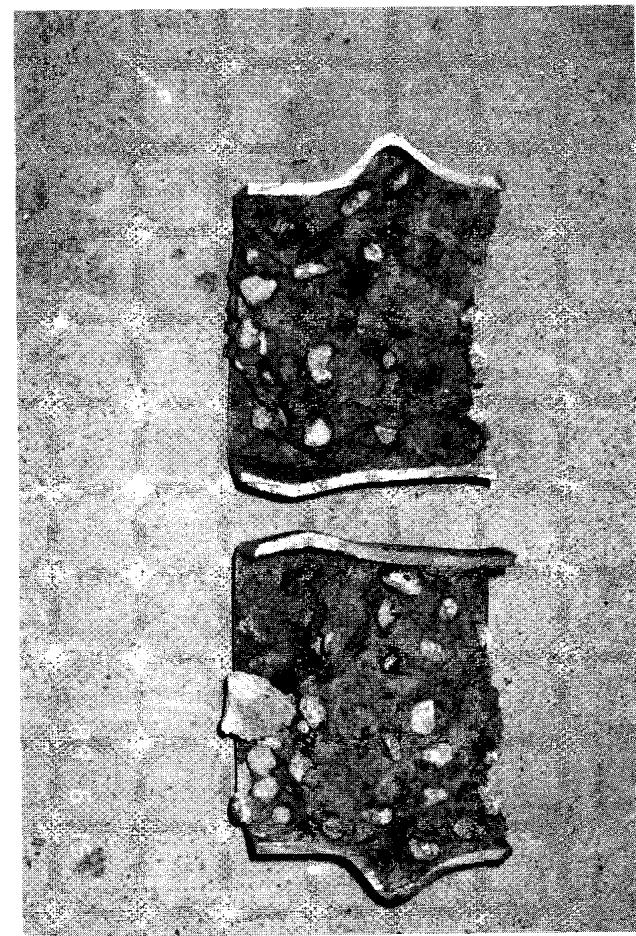
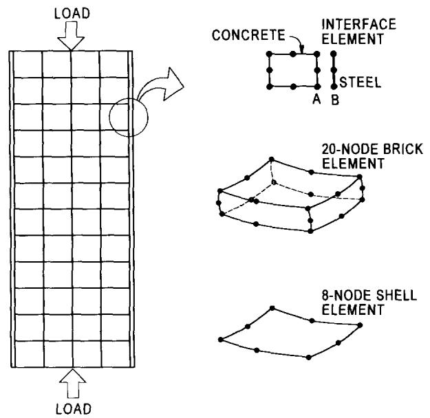
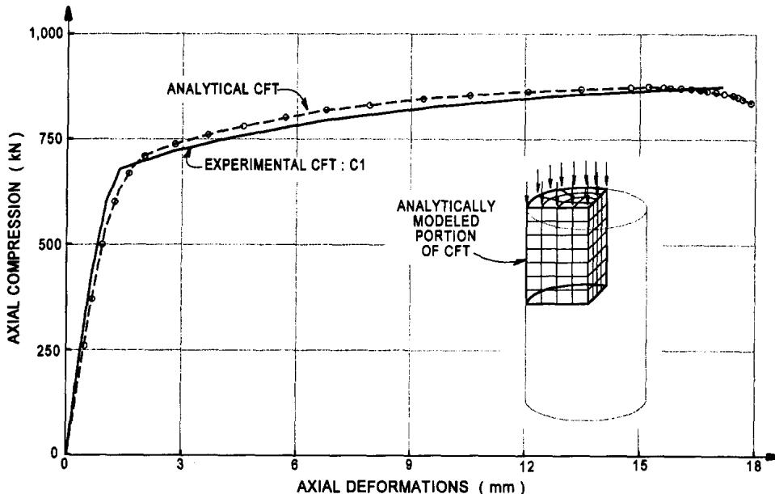
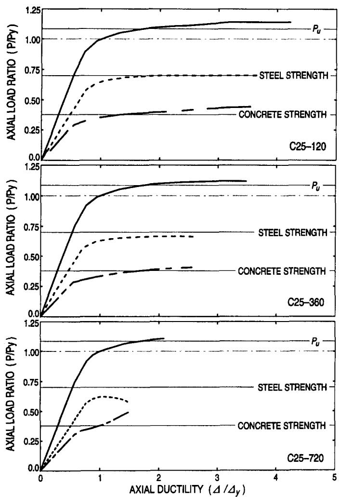

# AXIALLY LOADED CONCRETE-FILLED STEEL TUBES

By Stephen P. Schneider, $^{1}$ Associate Member, ASCE

ABSTRACT: This paper presents an experimental and analytical study on the behavior of short, concrete-filled steel tube columns concentrically loaded in compression to failure. Fourteen specimens were tested to investigate the effect of the steel tube shape and wall thickness on the ultimate strength of the composite column. Confinement of the concrete core provided by the tube shape was also addressed. Depth-to-tube wall thickness ratios between $17 < D / t < 50$ , and the length-to-tube depth ratios of $4 < L / D < 5$ were investigated. Ultimate strength results were compared to current specifications governing the design of concrete-filled steel tube columns. Nonlinear finite-element models were developed and verified using experimental results. The analytical models were further used to investigate the adequacy of design specifications. Experimental results suggest that circular tubes offer substantial post-yield strength and stiffness, not available in most square or rectangular cross sections. Also observed by these results was that current design specifications were adequate to predict the yield load under most conditions for a variety of structural shapes.

# INTRODUCTION

In the mid-1980s several buildings constructed in Seattle, Wash., became well known for their use of concrete-filled tube [CFT] columns. Most of these buildings were high-rises that utilized CFTs as primary columns in the lateral load-resisting frame. The notoriety of these building systems was due to the large diameter CFTs used, ranging from 2.3 to $3.2\mathrm{m}$ and to the use of high-performance concrete, with target strengths of 96 MPa and cylinder strengths of $130\mathrm{MPa}$ . The depth-to-wall thickness $(D / t)$ ratios of these large dimension columns ranged from 180 to 250 and length-to-depth $(L / D)$ ratios ranging from 2 to $\sim 14$ . Although stiffness was the primary concern for these large columns, the calculated strength of these CFTs was extrapolated from results of small-scale test specimens with quite different material and column properties. Although these large composite columns are beyond the scope of current design specifications, smaller CFTs were also used in low- to mid-rise construction projects. Circular CFTs were used in braced frames, and a smaller percentage were used in moment-resistant frames. Compared to the extremely large CFTs, the steel tube dimensions used in the low- to mid-rise buildings were in a more practical range of $0.36 - 0.76\mathrm{m}$ . Depth-to-wall thickness ratios for the smaller diameter CFTs ranged from 26 to 48 and $L / D$ ratios from 5 to 9. These smaller size CFTs have the most common application in current building construction and are the focus of this research.

Although the use of CFT columns is becoming more commonplace, concrete core confinement is not well understood. The prevailing attitude is that the steel tube can be used for longitudinal and confining reinforcement. Confinement in a CFT is continuous, unlike the conventional spiral reinforced concrete column. Therefore, CFTs are generally considered to possess favorable characteristics for use in regions at high seismic risk. However, if the concrete core and the steel tube are loaded simultaneously, the steel tube expands more than the concrete core under moderate loads, since Poisson's ratio is higher for the steel section. This suggests that the steel tube may offer little confinement under certain conditions.

This paper presents an experimental and analytical study on the behavior of the CFTs loaded in compression. Test results include data from 14 CFT specimens concentrically loaded to

failure. The shape of the steel tube and the wall thickness were the primary parameters in the test program. These factors were studied to determine their influence on the ultimate strength of the CFT and the confinement offered by the steel tube. Yield strength results were compared to applicable design specifications governing CFT behavior. The analytical portion of this study was needed to develop calibrated nonlinear finite-element models of CFT specimens and to further investigate the adequacy of the design provisions. The primary purpose of the analytical investigation was to investigate the effect of the $D/t$ ratio on the axial compressive strength of the CFT and to extrapolate these effects to the large dimension columns used in construction. Depending on the shape of the steel tube, CFTs can offer substantial post-yield axial ductility. Experimental results suggested that all circular tubes exhibited significant strain-hardening behavior; however, the post-yield behavior for the square and rectangular tubes depended on the $D/t$ ratio. Current design specifications offer a reasonable prediction of the strength of the CFT column, although it produced conservative results for some small-dimension tube columns.

# PREVIOUS RESEARCH

Tests to investigate the axial strength of CFT columns have been performed on a variety of cross-sectional shapes and $D/t$ and $L/D$ ratios. Furlong (1967) investigated 13 specimens with $D/t$ ratios ranging from 29 to 98. Results indicated that each component of the composite column resisted load independent of each other, and consequently there was no increase in the load-resisting capacity due to confinement of the concrete core. Gardner and Jacobson (1967) investigated 22 composite columns with $D/t$ ratios between 30 and 40. These results suggested that at ultimate load the steel tube was at failure but the concrete core was not. However, an increased strain level was noted for the steel tube without local buckling, suggesting that the concrete stabilized the tube wall.

Knowles and Park (1969) studied 12 circular and seven square columns with $D / t$ ratios of 15, 22, and 59, and $L / D$ ratios ranging from 2 to 21. Results indicated that the tangent modulus method accurately predicted the capacity for columns with $L / D$ ratios $> 11$ but was slightly conservative for columns with small slenderness ratios. It was concluded that this larger than expected capacity for composite columns with $L / D < 11$ was due to the increase of concrete strength resulting from triaxial confinement effects. It was observed that for certain values of longitudinal strain the concrete began to increase in volume due to microcracking, which induced concrete confinement by the steel tube. This confinement increased the overall load-resisting capacity of the CFT column. However, this increase was noted for circular tubes only, not for square

or rectangular shapes. Furthermore, it was determined that this increase occurred only in short columns. For columns with large $L / D$ ratios the composite section failed by column buckling before reaching the strains necessary to cause an increase in concrete core volume.

Tomii et al. (1977) investigated almost 270 circular, octagonal, and square composite columns. Values of $D / t$ ranged from 19 to 75, and $L / D$ ranged from 2 to 9. Results suggested that the post-yield behavior for the vertical load may be characterized as either (1) strain-hardening; (2) perfectly plastic; or (3) degrading stiffness type. Circular and many octagonal shapes were classified as either Type 1 or 2, while some of the octagonal and all of the square cross sections were categorized as Type 3. At high axial loads, concrete confinement was observed in the circular and many octagonal cross sections, which explained the strain-hardening characteristics for these specimens. Square tubes provided very little confinement of the concrete because the wall of the square tube resisted the concrete pressure by plate bending, instead of the membrane-type hoop stresses. Consequently, there was no axial load increase due to the triaxial compression effects for the square tubes.

Sakino et al. (1985) tested 18 circular specimens with $D / t$ ratios ranging between 18 and 192. In this investigation, three otherwise identical specimens were subjected to different load conditions. Axial load was applied to the concrete and the steel tube simultaneously for the first specimen group. The load was applied exclusively to the concrete core in the second specimen group, and the load application was similar to this in the third group except the inside tube wall was greased before casting the concrete. Results indicated that when the steel tube and the concrete core were loaded simultaneously, the tube provided no confinement until post-yield behavior. In the concrete loaded only specimens, some longitudinal stresses were noted in the steel tube even for the columns with the greased wall. Therefore, regardless of the loading condition, the wall of the steel tube appeared to be primarily in a biaxial stress state. Although test results indicated that the axial stiffness of the concrete loaded only columns were about half that of the other CFTs tested, the concrete loaded only columns obtained a greater yield and ultimate axial load capacity.

Lundberg (1993) assembled available experimental data for axially loaded column and beam-column tests on CFTs. The ultimate strength was compared to current strength specifications of composite columns according to the AISC's Manual of Steel Construction: Load and Resistance Factor Design (LRFD) (Manual 1994). The ultimate strength for the CFTs exhibited a large variation compared to predicted strengths obtained by the LRFD. The average strength of the axially loaded CFTs was about 1.32 times the LRFD predicted strength, with a standard deviation of 0.23. More scatter, and higher actual-to-predicted strength ratios, were observed for stub CFT columns compared to the relatively slender columns. Stub columns were defined by the column slenderness parameter being $\lambda_{c} < 0.20$ . This overstrength was generally explained by more confinement of the concrete core exhibited by the stub columns than observed for more slender columns. It was suggested that this concrete-steel interaction was not fully addressed by the current composite column strength specifications. Finally, a Monte Carlo simulation was performed on all of these CFT columns to determine the overall reliability of the design specifications. Although the steel ratio had large variation, the reliability index was within target values for elements designed according to the LRFD specifications.

This previous research demonstrated that slender columns did not exhibit the beneficial effects of composite behavior, in which the concrete strength increased over that of the cylinder strength due to core confinement. Thus, it was concluded that

the concrete core and the steel tube acted independent of each other. Short columns, however, exhibited greater than predicted capacity, generally associated with the higher concrete strength due to the confinement offered by the steel tube. The focus of this research was to investigate the effect of the steel tube shape and the wall thickness on the yield strength of the CFT and confinement of the concrete core. Only short columns were investigated in this research.

# STRENGTH PROVISIONS FOR CFT COLUMN

Results from the experimental and analytical studies will be compared to current design specification governing the strength of CFT columns. Task Group 20 of the Structural Stability Research Council (1979) proposed guidelines for the design of composite members, which were adopted by the LRFD specification. This specification provides design guidelines for elements in which the area of the steel tube comprises at least $4\%$ of the total composite cross-sectional area. The axial strength of a composite element is computed similar to that of a structural steel column, except the material yield strength and stiffness are modified to account for the steel and concrete components in the composite column. The AISC/LRFD defines the square of the column slenderness parameter as

$$
\lambda_ {c} ^ {2} = F _ {\mathrm {m y}} / F _ {E} = \left(K L / r _ {m} \pi\right) ^ {2} \left(F _ {\mathrm {m y}} / E _ {m}\right) \tag {1}
$$

where $F_{E} =$ Euler buckling stress for a column; $r_{m} =$ radius of gyration of the steel tube only; and $KL =$ effective simply supported column length. $E_{m}$ is the modified elastic modulus and $F_{\mathrm{my}}$ is the modified yield strength of the CFT column which are defined by the equations

$$
E _ {m} = E _ {s} + 0. 4 0 E _ {c} \left(A _ {c} / A _ {s}\right) \tag {2}
$$

$$
F _ {\mathrm {m y}} = F _ {\mathrm {y}} + 0. 8 5 f _ {c} ^ {\prime} \left(A _ {c} / A _ {s}\right) \tag {3}
$$

$E_{s}, A_{s}$ , and $F_{y} =$ elastic modulus, cross-sectional area, and the yield strength of the steel tube, respectively; $E_{c}, A_{c}$ , and $f_{c}^{\prime} =$ elastic modulus, area, and strength of the concrete core, respectively. Once the column slenderness parameter is known the critical stress $F_{\mathrm{cr}}$ is computed from

$$
F _ {c r} = \left(0. 6 5 8 ^ {\lambda_ {c} ^ {2}}\right) F _ {m y} \quad \text {f o r} \quad \lambda_ {c} \leq 1. 5 \tag {4}
$$

$$
F _ {\mathrm {c r}} = (0. 8 7 7 / \lambda_ {c} ^ {2}) F _ {\mathrm {m y}} \quad \text {f o r} \quad \lambda_ {c} > 1. 5 \tag {5}
$$

The ultimate strength of the CFT is determined by multiplying the critical stress by the cross-sectional area of the steel tube

$$
P _ {\mathrm {c r}} = A _ {s} F _ {\mathrm {c r}} \tag {6}
$$

# TEST SPECIMENS

A total of 14 test specimens were constructed and tested under concentric axial compression (Ito 1990; Masada 1990). Of these 14 CFT specimens, three were circular, five were square, and six were rectangular steel tube shapes. Cross-sectional properties of all test specimens are listed in Table 1. For convenience, circular tubes were designated with C, S for square, and R for rectangular. For each tube profile, specimens were arranged in order of increasing wall thickness. As shown by this table, $D / t$ ratios in this study ranged from 17 to $\sim 50$ , and the steel to total composite area ratio $A_{s} / A_{\text{total}}$ ranged from 8 to $22\%$ . For the rectangular shapes, $D / t$ was listed for the broad face. Although the nominal dimension of each tube was given, outside dimensions and wall thickness were measured at several locations. These measured values were used in determining the cross-sectional properties listed. Since it was de

TABLE 1. Properties for Concrete-Filled Steel Tube Components   

<table><tr><td rowspan="2">Shape(1)</td><td rowspan="2">Outer nominal diameter(mm)(2)</td><td rowspan="2">Actual dimensions(mm)(3)</td><td rowspan="2">Actual wall thickness(mm)(4)</td><td rowspan="2">D/t ratio(5)</td><td rowspan="2">L/D ratio(6)</td><td rowspan="2">\( A_s/A_{total} \)(%) (7)</td><td colspan="3">Steel Properties</td><td colspan="3">Concrete Properties</td></tr><tr><td>\( A_s \)(mm2)(8)</td><td>\( F_y \)(MPa)(9)</td><td>\( E_s \)(MPa)(10)</td><td>\( A_c \)(mm2)(11)</td><td>\( f_c&#x27; \)(kPa)(12)</td><td>\( E_c \)(MPa)(13)</td></tr><tr><td>C1</td><td>140</td><td>140.8</td><td>3.00</td><td>47.0</td><td>4.3</td><td>8.3</td><td>1,297</td><td>285</td><td>189,475</td><td>14,258</td><td>28,180</td><td>25,599</td></tr><tr><td>C2</td><td>140</td><td>141.4</td><td>6.50</td><td>21.7</td><td>4.3</td><td>17.5</td><td>2,755</td><td>313</td><td>206,011</td><td>12,968</td><td>23,805</td><td>23,528</td></tr><tr><td>C3</td><td>140</td><td>140.0</td><td>6.68</td><td>21.0</td><td>4.4</td><td>18.2</td><td>2,794</td><td>537</td><td>205,322</td><td>12,581</td><td>28,180</td><td>25,599</td></tr><tr><td>S1</td><td>127 × 127</td><td>127.3 × 127.3</td><td>3.15</td><td>40.4</td><td>4.8</td><td>9.5</td><td>1,535</td><td>356</td><td>180,518</td><td>14,645</td><td>30,454</td><td>26,611</td></tr><tr><td>S2</td><td>127 × 127</td><td>126.9 × 126.9</td><td>4.34</td><td>29.2</td><td>4.8</td><td>13.0</td><td>2,077</td><td>357</td><td>190,164</td><td>13,935</td><td>26,044</td><td>24,609</td></tr><tr><td>S3</td><td>127 × 127</td><td>126.9 × 127.0</td><td>4.55</td><td>27.9</td><td>4.8</td><td>13.6</td><td>2,174</td><td>322</td><td>205,322</td><td>13,871</td><td>23,805</td><td>23,528</td></tr><tr><td>S4</td><td>127 × 127</td><td>125.3 × 126.5</td><td>5.67</td><td>22.3</td><td>4.8</td><td>17.0</td><td>2,684</td><td>312</td><td>203,944</td><td>13,097</td><td>23,805</td><td>23,528</td></tr><tr><td>S5</td><td>127 × 127</td><td>126.8 × 127.2</td><td>7.47</td><td>17.0</td><td>4.8</td><td>21.5</td><td>3,426</td><td>347</td><td>204,633</td><td>12,516</td><td>23,805</td><td>23,528</td></tr><tr><td>R1</td><td>76 × 152</td><td>76.6 × 152.3</td><td>3.00</td><td>50.8</td><td>4.0</td><td>11.3</td><td>1,316</td><td>430</td><td>190,164</td><td>10,323</td><td>30,454</td><td>26,611</td></tr><tr><td>R2</td><td>76 × 152</td><td>76.5 × 152.8</td><td>4.47</td><td>34.2</td><td>4.0</td><td>16.6</td><td>1,923</td><td>383</td><td>213,590</td><td>9,677</td><td>26,044</td><td>24,609</td></tr><tr><td>R3</td><td>102 × 152</td><td>101.8 × 152.4</td><td>4.32</td><td>35.3</td><td>4.0</td><td>13.5</td><td>2,077</td><td>413</td><td>214,968</td><td>13,355</td><td>26,044</td><td>24,609</td></tr><tr><td>R4</td><td>102 × 152</td><td>102.8 × 152.7</td><td>4.57</td><td>33.4</td><td>4.0</td><td>14.1</td><td>2,200</td><td>365</td><td>206,011</td><td>13,419</td><td>23,805</td><td>23,528</td></tr><tr><td>R5</td><td>102 × 152</td><td>101.3 × 151.4</td><td>5.72</td><td>26.5</td><td>4.0</td><td>17.5</td><td>2,671</td><td>324</td><td>204,633</td><td>12,581</td><td>23,805</td><td>23,528</td></tr><tr><td>R6</td><td>102 × 152</td><td>102.13 × 152.37</td><td>7.34</td><td>20.8</td><td>4.0</td><td>22.0</td><td>3,381</td><td>358</td><td>205,322</td><td>12,000</td><td>23,805</td><td>23,528</td></tr></table>

$\oplus$ LOCATION OF LVDTs

LOCATION OF LONGITUDINAL & PERIMETER STRAIN GAUGES

PERIMETER GAUGES ON SPECIMEN R5

  
FIG. 1. CFT Test Specimen and Instrument Location

sired to keep tube depths approximately the same, the $L / D$ ratios ranged between 4 and 5.

All steel tubes were cold-formed carbon steel with a specified yield strength of $317\mathrm{MPa}$ . All tubes were seam welded and annealed to relieve residual stresses. Each tube was supplied longer than needed for the CFT test to provide enough material for a tensile coupon test. Type I portland cement, sand, and a maximum aggregate size of $9.5\mathrm{mm}$ were mixed to obtain a 28-day target concrete strength of $20\mathrm{MPa}$ and a $75\mathrm{-mm}$ slump. The concrete for the composite columns was mixed in four batches, and four standard concrete cylinders were cast for each batch. Cylinders were tested within 2 days of the compressive test for the composite column. Material properties listed for the composite column specimens were the average values obtained from the cylinder tests. The elastic modulus listed in Table 1 was the tangent modulus at one-third the ultimate strength of the cylinder tests.

A stiffened end cap was attached at the base of each steel tube. Concrete was placed in five layers, and each layer was

compacted by a steel rod. This process was similar to that used for the concrete cylinders. After allowing the composite column to cure for one day, the top surface was roughened with a wire brush. A thin layer of hydrostone was poured on the roughened surface to eliminate voids, and another stiffened end cap was attached to the top of the CFT. This ensured that the concrete core and the steel tube were loaded simultaneously.

The test specimen and location of the instrumentation are shown in Fig. 1. Specimens were placed in a 9-MN fixed load frame. A spherical bearing was placed on the top of the CFT to ensure the applied load was concentric. Linear variable differential transducers (LVDTs) were placed inside the top and bottom end caps to monitor overall deformation. These LVDTs were also monitored in the early stages of loading to ensure that a uniform compression was imposed on the composite specimen. Axial deformations were obtained from the average of the LVDTs at each corner; however, very little variation was observed in displacement readings among the four LVDTs for any specimen. Strain gauges were placed on the exterior of the CFT to measure vertical deformations and perimeter expansion of the steel tube wall. Column load, as measured by the test machine load cell, was applied at a very slow rate such that local buckling behavior of the CFT could be carefully observed.

# EXPERIMENTAL RESULTS

Load-displacement relations for all specimens are shown in Fig. 2. For clarity, test results have been separated by tube shape, and therefore these graphs show behavior for the circular, square, and rectangular steel tubes separately. The storage capacity needed for the test data of Specimen C3 was underestimated; data beyond a load of $1,850\mathrm{kN}$ was not recorded. Testing continued, however, and the yield strength of the specimen was approximated at $2,010\mathrm{kN}$ during the test. The fixed load frame accurately recorded the maximum load for the specimen, which was measured at $2,715\mathrm{kN}$ .

Fig. 2 shows the post-yield behavior of each tube shape. In general, circular tube shapes exhibited strain-hardening characteristics long after the CFT reached yield. Square and rectangular tube shapes exhibited various post-yield behavior depending on the tube wall thickness. Specimen S5 was classified as strain-hardening, and R6 exhibited signs of modest strain-hardening. Specimen S4 was classified as elastic, perfectly plastic, and Specimen R5 appeared to be in transition between elastic-plastic and degrading stiffness. Behavior of the remaining cross sections were classified as degrading stiffness type, or strain-softening, behavior. These plots clearly show

  
(a)   
AXIAL DEFORMATIONS (mm)

  
(b)   
AXIAL DEFORMATIONS (mm)   
(c)   
AXIAL DEFORMATIONS (mm)   
FIG. 2. Comparison of CFT Behavior with Respect to Tube Shape: (a) Circular Tubes; (b) Square Tubes; (c) Rectangular Tubes

  
FIG. 3. Comparison of CFT Behavior with Respect to $D / t$ Ratio: (a) $D / t < 25$ ; (b) $25 < D / t < 30$ ; (c) $30 < D / t < 40$ ; (d) $40 < D / t$

  
FIG. 3. (Continued)

that post-yield characteristics approached strain-hardening behavior for the square and rectangular shapes with large wall thickness. Also shown in Fig. 2 is the approximate location of observed local wall buckling of the steel tube. Local wall buckling did not occur for any specimen prior to yield of the CFT. Furthermore, higher axial deformations were obtained, prior to local wall buckling, for the thicker tubes of each shape type.

Fig. 3 shows nondimensional force-displacement behavior for each specimen. If a definite yield point was not evident, a $0.2\%$ offset was used to estimate the yield load. In Fig. 3, specimens were arranged by $D / t$ ratios. These plots indicated that there was a correlation between $D / t$ and the post-yield behavior for the square and rectangular tubes. Specimens C2 and S5 exhibited clear signs of strain-hardening behavior, with an ultimate strength of $>25\%$ of the yield strength. Specimens S5 and S4 exhibited distinctly different behavior for cross sections with a $31\%$ difference in the $D / t$ ratio. Specimens R5 and R6 showed a similar pattern, in that the post-yield behavior exhibited a significant transition from strain-hardening to mildly elastic-plastic with a $27\%$ increase in the $D / t$ ratio. Post-yield behavior for the remaining noncircular CFT shapes was clearly strain-softening. On the other hand, C1 was clearly

strain-hardening even though the $D / t$ ratio was quite large compared to other specimens tested in this study.

Local wall buckling, shown in Fig. 3, for all CFTs with strain-softening post-yield behavior occurred at an axial ductility between 2 and 6. For the square and rectangular strain-hardening specimens local wall buckling occurred at a ductility between 6 and 8, while wall buckling did not occur for the circular tube until a ductility of $\sim 10$ or larger.

The yield and ultimate loads for each specimen are listed in Table 2. The ultimate load was the maximum axial load observed during each test. For most of the strain-softening type specimens the ultimate load occurred within an axial ductility of $\sim 2$ . Thus the strain-softening CFTs had very little ductility before the ultimate load was reached, while the strain-hardening CFTs had a ductility of 10 or more before reaching the ultimate load. Furthermore, except for the specimens with strain-hardening characteristics, the maximum value of ultimate load was 1.07 times the yield strength. Specimens that possessed strain-hardening characteristics had an ultimate strength that ranged up to a maximum of 1.41 times the yield strength.

Calculated values of strength, according to the LRFD specifications, are also listed in Table 2. The modified yield

TABLE 2. Comparison of Experimental Data to Predicted Axial Capacity   

<table><tr><td rowspan="2">Shape (1)</td><td rowspan="2">D/t ratio (2)</td><td colspan="5">Test Data</td><td colspan="6">AISC/LRFD Strength Estimate</td><td colspan="2">Measured versus Computed</td></tr><tr><td>Py(kN) (3)</td><td>Pu(kN) (4)</td><td>Pu/Py(5)</td><td>Em(MPa) (6)</td><td>Longitudinal yield compared to Py(7)</td><td>rm(8)</td><td>KL/rm(9)</td><td>Fmy(MPa) (10)</td><td>Em(MPa) (11)</td><td>λc(12)</td><td>Pcr(kN) (13)</td><td>Py/Ptr(14)</td><td>Em ratio (15)</td></tr><tr><td>C1</td><td>47.0</td><td>703</td><td>881</td><td>1.25</td><td>297,847</td><td>Before</td><td>48.7</td><td>12.5</td><td>548.6</td><td>309,775</td><td>0.168</td><td>703</td><td>1.00</td><td>0.96</td></tr><tr><td>C2</td><td>21.7</td><td>1,291</td><td>1,825</td><td>1.41</td><td>143,873</td><td>Before</td><td>47.7</td><td>12.8</td><td>408.1</td><td>260,473</td><td>0.161</td><td>1,112</td><td>1.16</td><td>0.55</td></tr><tr><td>C3</td><td>21.0</td><td>2,010</td><td>2,715</td><td>1.35</td><td>364,389</td><td>—</td><td>47.1</td><td>12.9</td><td>645.3</td><td>254,596</td><td>0.207</td><td>1,771</td><td>1.14</td><td>1.43</td></tr><tr><td>S1</td><td>40.4</td><td>868</td><td>917</td><td>1.06</td><td>305,826</td><td>After</td><td>50.7</td><td>12.0</td><td>603.1</td><td>282,246</td><td>0.177</td><td>914</td><td>0.95</td><td>1.08</td></tr><tr><td>S2</td><td>29.2</td><td>1,024</td><td>1,095</td><td>1.07</td><td>212,299</td><td>Before</td><td>50.0</td><td>12.2</td><td>505.4</td><td>259,862</td><td>0.171</td><td>1,037</td><td>0.99</td><td>0.82</td></tr><tr><td>S3</td><td>27.9</td><td>1,090</td><td>1,113</td><td>1.02</td><td>172,630</td><td>Simultaneously</td><td>50.0</td><td>12.2</td><td>450.9</td><td>279,135</td><td>0.156</td><td>970</td><td>1.12</td><td>0.62</td></tr><tr><td>S4</td><td>22.3</td><td>1,179</td><td>1,202</td><td>1.02</td><td>113,332</td><td>Simultaneously</td><td>48.9</td><td>12.5</td><td>410.9</td><td>260,402</td><td>0.158</td><td>1,091</td><td>1.08</td><td>0.44</td></tr><tr><td>S5</td><td>17.0</td><td>1,647</td><td>2,069</td><td>1.26</td><td>151,678</td><td>Before</td><td>48.7</td><td>12.5</td><td>420.5</td><td>246,903</td><td>0.164</td><td>1,424</td><td>1.16</td><td>0.61</td></tr><tr><td>R1</td><td>50.8</td><td>801</td><td>819</td><td>1.02</td><td>342,769</td><td>Simultaneously</td><td>32.5</td><td>18.8</td><td>633.0</td><td>273,817</td><td>0.287</td><td>805</td><td>1.00</td><td>1.25</td></tr><tr><td>R2</td><td>34.2</td><td>979</td><td>1,006</td><td>1.03</td><td>230,548</td><td>Simultaneously</td><td>31.8</td><td>19.1</td><td>494.5</td><td>265,889</td><td>0.263</td><td>924</td><td>1.06</td><td>0.87</td></tr><tr><td>R3</td><td>35.3</td><td>1,144</td><td>1,144</td><td>1.00</td><td>272,959</td><td>After</td><td>41.8</td><td>14.6</td><td>555.7</td><td>281,762</td><td>0.206</td><td>1,134</td><td>1.01</td><td>0.97</td></tr><tr><td>R4</td><td>33.4</td><td>1,202</td><td>1,224</td><td>1.02</td><td>185,275</td><td>After</td><td>42.1</td><td>14.5</td><td>488.6</td><td>276,583</td><td>0.194</td><td>1,058</td><td>1.14</td><td>0.67</td></tr><tr><td>R5</td><td>26.5</td><td>1,291</td><td>1,335</td><td>1.03</td><td>168,609</td><td>After</td><td>41.0</td><td>14.9</td><td>419.1</td><td>259,128</td><td>0.190</td><td>1,103</td><td>1.17</td><td>0.65</td></tr><tr><td>R6</td><td>20.8</td><td>1,602</td><td>1,691</td><td>1.06</td><td>167,912</td><td>Before</td><td>40.7</td><td>15.0</td><td>429.4</td><td>246,390</td><td>0.199</td><td>1,428</td><td>1.12</td><td>0.68</td></tr></table>

strength $F_{\mathrm{my}}$ and the elastic modulus $E_{m}$ were determined using actual material properties of each CFT specimen. The values for $P_{\mathrm{cr}}$ were unfactored. The ratio of the yield load-to-LRFD calculated strength $P_{y} / P_{\mathrm{cr}}$ of each test specimen ranged between 0.95 and 1.17. The average value of the yield-to-predicted strength ratio was 1.08, with a 0.07 standard deviation. Therefore, for this range of column slenderness values of 0.15 $< \lambda_{c} < 0.30$ , the LRFD predicted strength was not overly conservative, and it underestimated the capacity for only two of the 14 specimens.

Also listed in Table 2 was the measured modified elastic modulus of each CFT. The slope of the elastic portion of the force-displacement behavior of the CFT represented the elastic stiffness of an axial element $A_{s}E_{m} / L$ , where $A_{s}$ is the area of the steel tube, $E_{m}$ is the modified elastic stiffness, and $L$ is the length of the specimen. The elastic stiffness was determined and the measured modified elastic modulus of each specimen was listed under the Test Data heading in Table 2. Comparison between the measured and the LRFD computed elastic moduli illustrated substantial scatter in the ability to predict the stiffness of the composite column. However, $P_{\mathrm{cr}}$ was recomputed

using the measured value of $E_{m}$ . All of these recomputed $P_{cr}$ values were within $< 1\%$ of the originally computed LRFD value. Consequently, for this range of column slenderness values, predicted CFT capacity was not sensitive to the modified elastic modulus. For these computations the modified yield stress $F_{my}$ did not change from the originally predicted values.

Figs. 4 and 5 illustrate the comparison of the measured-to-predicted load ratio for each CFT specimen. Fig. 4 is a plot of each load ratio relative to the column slenderness parameter $\lambda_{c}$ , and Fig. 5 plots the same data against the $D / t$ ratio. The data shown in Fig. 4 was quite scattered, and therefore the load ratio for these specimens showed little correlation with the column slenderness parameter. However, the data exhibited a modest correlation with the $D / t$ ratio, in that the CFTs with larger $D / t$ values exhibited higher load ratios compared to the less compact cross sections.

Fig. 6 illustrates the portion of the total CFT load shared by the steel section. The load shared by the steel tube $P_{s}$ was computed by averaging the values of the longitudinal strain gauges times the measured elastic modulus of the steel tube. Elastic, perfectly plastic strength was assumed for the steel

  
FIG. 4. Yield Load-to-Critical Load Ratio with Respect to Column Slenderness Parameter

  
FIG. 5. Yield Load-to-Critical Load with Respect to $D / t$ Ratio

JOURNAL OF STRUCTURAL ENGINEERING/OCTOBER 1998/1131

  
FIG. 6. Axial-to-Yield Load Ratio Compared to Load Shared by the Steel Tube

  
FIG. 7. Axial-to-Yield Load Ratio with Respect to Strain Ratio

tube once the yield strain was exceeded. In Fig. 6, specimens with the smallest and largest wall thickness are shown explicitly, while the remaining data was bounded by the area shaded in gray. Fig. 6 shows that steel sections with thicker walls maintained about the same portion of total load throughout most of the load history. Sections with thinner walls exhibited an increase in the total shared by the steel tube as the load approached the yield strength of the CFT. On the other hand, the contribution of the steel tube for CFTs with strain-hardening behavior decreased once the CFT yield strength was reached.

Fig. 7 shows a comparison of the strain ratio of the steel tube wall to the axially load ratio applied to the CFT. The strain ratio was the absolute value of the perimeter strain divided by the longitudinal strain. Strain values were averaged for the longitudinal and the lateral strain gauges on the specimen. Strain ratio behavior for most specimens was bounded by the gray shaded region, with the location of the extreme value for most specimens indicated. The specimens with strain ratio behavior well outside this bounded region were shown independently. Also shown by these plots was the earliest yield

of any steel tube in the longitudinal direction. Table 2 lists whether the average longitudinal strain in the steel tube yielded before, simultaneously with, or after $P_y$ was imposed on the CFT. In all cases in which the tube yielded after $P_y$ , it occurred within a ductility $\mu$ of $< 1.3$ .

An increase in the perimeter strains relative to the longitudinal strains, for the behavior shown in Fig. 7, would indicate confinement of the concrete core offered by the steel tube. Except for the specimens shown explicitly, the strain ratio was nearly constant and approximately equivalent to that of Poisson's ratio, for an axial compression ratio $< 0.92P_{y}$ . Beyond this load ratio level, the strain ratios increased $\sim 15\%$ as the load approached $P_{y}$ . Specimen C2 was the only column that appeared to yield in the lateral direction prior to yield of the CFT. It should be noted that strains were difficult to measure accurately after the steel tube yielded, particularly if the tube wall buckled locally. Therefore, at very high loads the strain readings became slightly erratic. However, these curves do illustrate trends in the tube wall behavior as the steel tube yielded about the longitudinal axis and the perimeter.

Fig. 8 shows examples of typical wall buckling that oc

  
(a)

  
(b)   
FIG. 8. Typical Local Buckling of Steel Tube Wall: (a) Circular Tubes; (b) Square and Rectangular Tubes

curred for these specimens. Rectangular and square tubes had very similar local buckling behavior, and therefore only S3 is shown for an example. Clearly, most of the local wall buckling of the circular cross section was due to a radial expansion of the tube. The square and rectangular tubes, however, showed clear signs of wall bulging. Local buckling occurred equally on every face for the square tube. For the rectangular CFT, local buckling was more extensive for the broad face than for the narrow face. Fig. 8 illustrates how ineffective the flat tube wall was in confining the concrete core. In general, tubes with large $D / t$ ratios had more local wall buckling, with higher apparent distortions, compared to the sections with small $D / t$ ratios. This behavior accounted for the differences observed in the strain-hardening and strain-softening characteristics of the steel tube shapes.

At the end of the test, S3 was cut open in the vicinity of the locally buckled tube wall. Fig. 9 shows the condition of the tube wall and the concrete after failure of the specimen. Although diagonal cracks were observed in the concrete core, there were few gaps between the concrete and steel tube wall near the locally buckled region. Furthermore, the concrete near the severe tube wall distortions was usually not granulated. Consequently, it appeared that the concrete flowed plastically to fill the buckled shape of the tube wall and yet remained cohesive.

# ANALYTICAL STUDY

Three-dimensional nonlinear finite-element models were developed to further study the axial load behavior of CFTs. Calibrated nonlinear models were needed to investigate behavior of CFTs with dimensions that were different from the specimens tested. Therefore, this study focused on calibrating an

alytical models for simple axial CFT behavior, so that behavior can be expanded to specimen sizes that are likely to be used in construction. ABAQUS (ABAQUS 1994) was used for all nonlinear analytical modeling.

The concrete core of the CFT was modeled using 20-node brick elements, with three translation degrees of freedom at each node. The three-dimensional concrete material model available in ABAQUS was developed to simulate conditions with uniaxial strain and relatively low confining pressure. Therefore, reasonable results were expected with confinement on the order of one-fourth the uniaxial compressive stress or less. Since the experimental results suggested that little confinement was observed for the concrete core prior to yield, this material model for the concrete was considered adequate. The unconfined uniaxial stress-strain curve for the concrete used in this analysis is shown in Fig. 10. The stiffness beyond the ultimate strength of the concrete was indicative of the amount of confinement expected. This portion of the curve was adjusted according to the experimental results. The values listed in Fig. 10 represent the concrete model used for all of the finite-element analyses.

The steel tube was modeled using an 8-node shell element, with five degrees of freedom at each node. Inelastic material and geometric nonlinear behavior were used for this element. von Mises yield criteria defined the yield surface, and the Prandtl-Reuss flow rule was used to determine inelastic deformations. No strain-hardening was assumed for the steel tube. Therefore, if strain-hardening characteristics were observed in CFT behavior, it was due primarily to the interaction between the steel and concrete components.

The interface, or gap, element, also available in ABAQUS, was used for the interface between the concrete and the steel components. A schematic of the gap element is illustrated in

  
FIG. 9. Concrete Core after Severe Local Wall Buckling; Specimen S3

  
FIG. 10. Concrete Material Model

Fig. 11. As shown, the element has two faces denoted as A and B. When the faces were in contact, normal forces developed between the two materials resulting in frictional forces. A coefficient of friction of 0.25 was used in all of these analytical models. On the other hand, if the gap element experienced tension, face A separated from face B, resulting in no contact between the concrete and steel, and consequently no bond developed.

Fig. 12 shows the results obtained using this analytical finite-element model compared to the results of experimental Specimen C1. Although elastic and inelastic behavior were closely predicted, the yield strength was not as well defined for the analytical model as it was for the test specimen. Con-

sequentially, the yield strength of the analytical model was obtained using a $0.2\%$ offset. For this condition, the strength of the analytical model was $\sim 1.05$ times the yield strength of the experimental specimen. While the strength of the CFT specimen was slightly larger, it was clear the behavior of the analytical model was close to that of the experimental specimen, thereby providing an opportunity to investigate trends in behavior for larger size CFT columns. It is of interest to note that local buckling of the tube wall in the analytical model was similar to that observed from the experimental specimen.

To investigate the behavior of the $D / t$ ratio on larger diameter pipes, 15 finite-element models were analyzed. The circular tube was investigated since this shape exhibited favora

  
FIG. 11. Finite-Element Modeling

ble post-yield behavior. Table 3 lists cross-sectional properties used for these analytical models. Mechanical properties for the steel tube and concrete were the same for all analytical models and were equivalent to the values obtained in the test program. The concrete strength was $f_{c}^{\prime} = 31$ MPa, and the steel strength was $F_{y} = 317$ MPa.

Three different circular tube diameters were investigated with the finite-element analysis. The low end reflected the dimension of the tube used in the experimental study, while the large diameters represented pipe sizes used in previous low-to mid-rise building construction. Pipe lengths were selected to obtain $L / D$ values of 5 and approximate $KL / r_{m}$ values of 15. These $L / D$ values were consistent with the dimensions of the test specimen used in the experimental study. As shown, $KL / r_{m}$ was not sensitive to the tube wall thickness, and thus all of these tubes had approximately the same column slenderness of $\lambda_{c} \approx 0.2$ .

It was desired to investigate a broad range of $D/t$ ratios for each different tube diameter, so that values ranged from 10 to 85 by increments of 15. This was accomplished by adjusting the steel tube wall thickness to obtain the needed $D/t$ ratio. The LRFD specifies that the minimum wall thickness

  
FIG. 12. Comparison between Numerical and Experimental Results

TABLE 3. Properties and Strength of Analytical Finite-Element Models   

<table><tr><td colspan="6">Cross-Sectional Properties</td><td colspan="5">AISC/LRFD Strength Estimate</td><td colspan="2">Finite-Element Analysis</td></tr><tr><td>Tube dimension (mm) (1)</td><td>Wall thickness (mm) (2)</td><td>D/t ratio (3)</td><td>As(mm²) (4)</td><td>Ac(mm²) (5)</td><td>As/Atotal (%) (6)</td><td>KL/rm(7)</td><td>Em(MPa) (8)</td><td>Fmy(MPa) (9)</td><td>λc(10)</td><td>Pcr(kN) (11)</td><td>Py(kN) (12)</td><td>Py/Pcr (13)</td></tr><tr><td rowspan="4">120</td><td>2.18</td><td>55</td><td>808</td><td>10,502</td><td>7.1</td><td>14.4</td><td>332,977</td><td>659.6</td><td>0.204</td><td>523</td><td>535</td><td>1.02</td></tr><tr><td>3.00</td><td>40</td><td>1,103</td><td>10,207</td><td>9.8</td><td>14.5</td><td>294,596</td><td>560.8</td><td>0.201</td><td>608</td><td>635</td><td>1.04</td></tr><tr><td>4.80</td><td>25</td><td>1,737</td><td>9,573</td><td>15.4</td><td>14.7</td><td>256,237</td><td>462.1</td><td>0.199</td><td>790</td><td>855</td><td>1.08</td></tr><tr><td>12.0</td><td>10</td><td>4,072</td><td>7,238</td><td>36.0</td><td>15.7</td><td>218,014</td><td>363.8</td><td>0.204</td><td>1,455</td><td>1,650</td><td>1.13</td></tr><tr><td rowspan="6">360</td><td>4.24</td><td>85</td><td>4,734</td><td>97,054</td><td>4.7</td><td>14.3</td><td>409,760</td><td>857.2</td><td>0.208</td><td>3,985</td><td>3,830</td><td>0.96</td></tr><tr><td>5.14</td><td>70</td><td>5,733</td><td>96,054</td><td>5.6</td><td>14.3</td><td>371,367</td><td>758.4</td><td>0.206</td><td>4,271</td><td>4,320</td><td>1.01</td></tr><tr><td>6.55</td><td>55</td><td>7,268</td><td>94,519</td><td>7.1</td><td>14.4</td><td>332,977</td><td>659.6</td><td>0.204</td><td>4,711</td><td>4,720</td><td>1.00</td></tr><tr><td>9.00</td><td>40</td><td>9,924</td><td>91,863</td><td>9.8</td><td>14.5</td><td>294,596</td><td>560.8</td><td>0.201</td><td>5,472</td><td>5,560</td><td>1.02</td></tr><tr><td>14.4</td><td>25</td><td>15,635</td><td>86,153</td><td>15.4</td><td>14.7</td><td>256,237</td><td>462.1</td><td>0.199</td><td>7,106</td><td>7,150</td><td>1.01</td></tr><tr><td>36.0</td><td>10</td><td>36,644</td><td>65,144</td><td>36.0</td><td>15.7</td><td>218,014</td><td>363.8</td><td>0.204</td><td>13,099</td><td>13,200</td><td>1.01</td></tr><tr><td rowspan="5">720</td><td>8.47</td><td>85</td><td>18,935</td><td>388,216</td><td>4.7</td><td>14.3</td><td>409,760</td><td>857.2</td><td>0.208</td><td>15,938</td><td>15,100</td><td>0.95</td></tr><tr><td>10.3</td><td>70</td><td>22,933</td><td>384,217</td><td>5.6</td><td>14.3</td><td>371,367</td><td>758.4</td><td>0.206</td><td>17,085</td><td>16,400</td><td>0.96</td></tr><tr><td>13.1</td><td>55</td><td>29,073</td><td>378,078</td><td>7.1</td><td>14.4</td><td>332,977</td><td>659.6</td><td>0.204</td><td>18,845</td><td>18,300</td><td>0.97</td></tr><tr><td>18.0</td><td>40</td><td>39,697</td><td>367,453</td><td>9.8</td><td>14.5</td><td>294,596</td><td>560.8</td><td>0.201</td><td>21,889</td><td>22,300</td><td>1.02</td></tr><tr><td>28.8</td><td>25</td><td>62,538</td><td>344,612</td><td>15.4</td><td>14.7</td><td>256,237</td><td>462.1</td><td>0.199</td><td>28,426</td><td>28,600</td><td>1.01</td></tr></table>

of the structural steel pipe for a CFT column must be $t > D\sqrt{F_y / 8E_s}$ . This required $D / t < 71$ for the tube properties used in this analytical study. However, the $D / t = 85$ was considered to investigate the extreme condition of the $D / t$ ratio. For the $120 \mathrm{~mm}$ tube, $D / t = 70$ and 85 produced a wall thickness that was much too thin, and the $D / t = 10$ for the $720 \mathrm{~mm}$ pipe was considered to be too thick, for practical tube columns. Therefore, these column sizes were not investigated.

Each analytical model had $\sim 2,000$ elements for one-eighth of the total CFT column. The analytical model cut the CFT about orthogonal axes, and symmetry was enforced by preventing displacements out of each plane. Axial deformations were imposed on the concrete core and the steel tube simultaneously and were increased monotonically until solution convergence was not possible.

Representative axial load-displacement behavior for the CFT columns and the contribution of the steel and concrete components individually are shown in Fig. 13. Each curve was nondimensionalized with respect to the yield load of the CFT column. Results shown are for the 120-, 360-, and 720-mm-diameter tube columns with a $D / t$ ratio of 25. Although results for $D / t = 25$ were shown, this was representative of the trends exhibited by the other CFTs. Indicated for each plot was the compressive strength of the concrete core $A_{c}f_{c}^{\prime}$ , the yield strength of the steel tube $A_{s}F_{y}$ , and the combined strength of these components that was defined as the squash load $P_{u}$ .

Results from the analytical models showed that for the small diameter CFT, the steel tube and the concrete core were both near capacity as the CFT reached $P_{y}$ . For the larger diameter CFTs, the concrete strength eventually reached the compres

  
FIG. 13. Analytical Force-Displacement Behavior for $D / t = 25$

1136 / JOURNAL OF STRUCTURAL ENGINEERING / OCTOBER 1998

  
FIG. 14. Analytical Longitudinal Concrete Stress Distribution at Yield and Ultimate Load for $D / t = 25$

sive strength; however, the steel tube did not obtain its full strength in compression. This was due to the biaxial stress state, which reduced the compression strength once the tube was confining the concrete core at later stages of loading.

Analytical results suggested that the trends observed in the small dimensional tube columns, compared to the LRFD predicted values, diminish for larger diameter pipes. A comparison between the analytical finite-element strength and the values obtained from the LRFD specification is listed in Table 3. For the $120\mathrm{-mm}$ -diameter pipes the values of $P_{y} / P_{cr}$ decreased with increasing $D / t$ ratios. This was similar to trends exhibited by the experimental data. For the larger diameter tubes, however, analytical results suggest that the LRFD estimated the yield load reasonably well for small values of $D / t$ while slightly unconservative values were obtained for large $D / t$ ratios. The $D / t = 85$ used in this analytical study would not be allowed by the present restriction on the tube wall thickness. However, for the $720\mathrm{-mm}$ -diameter pipe the LRFD underestimated the strength of the $D / t = 55$ and 70 CFTs by $\sim 4\%$

Approximate distributions of the concrete stresses at yield and at ultimate are shown in Fig. 14 for all three diameter tubes for $D / t = 25$ . Fig. 14 shows that for the small diameter tube, the concrete stresses for most of the concrete core were near the cylinder strength. At ultimate load for the 120-mm-diameter pipe, the concrete stresses were almost $30\%$ more than the cylinder strength. This was due to the confinement of the small concrete core provided by the steel tube. The magnitude of stress in the concrete core for the large diameter tubes at ultimate load was much less, with a maximum increase of only $1.15f_c'$ .

# IMPLICATION OF RESULTS

In general, the circular CFT columns offered more axial ductility than the square or rectangular shapes. All of the circular pipes tested in this experimental study were categorized

as strain-hardening, even for the very thin tube walls. On the other hand, strain-hardening was observed in the square or rectangular shapes only for the tubes with very thick walls, approximately $D / t \leq 20$ . The increased ultimate load compared to the yield load for the rectangular strain-hardening tube was $6\%$ and was $26\%$ for the square tube classified as strain-hardening. For the circular CFTs the minimum increase in strength beyond the yield load was $25\%$ . This strength increase was attributed to the confinement of the concrete core once the CFT reached yield. Clearly, the circular tube offered more concrete confinement than the square or rectangular tubes once the column yielded.

A decrease in the $P_{s} / P$ ratio, when plotted against the applied load ratio, suggested that the strain-hardening characteristics observed in these CFTs were due to the increase in load distributed to the concrete core. Most CFTs with strain-softening characteristics showed an increase in load distributed to the steel tube once the CFT yielded. This was also an example of the lack of confinement offered by the steel tube for CFTs that exhibited strain-softening characteristics. An increase in the axial load distributed to the steel tube beyond the yield strength of the composite column was detrimental to the post-yield performance of the square and rectangular tubes with thin walls.

Many buildings constructed with CFTs utilized the composite column in braced frame structural systems. Results from this study suggested that circular CFT columns offer more ductility than the square and rectangular columns. For example, the ultimate load for the strain-hardening specimens occurred at a ductility $\mu$ of $\geq 10$ , while the ultimate strength of strain-softening specimens occurred within $\mu < 2$ . Consequently, square and rectangular tubes should be avoided for buildings constructed in regions of moderate-to-high seismic risk if CFT columns are desired. This will ensure that the gravity load resisting elements have sufficient ductility in a severe seismic event. It is possible, however, that depending on the alternative cross sections, CFT behavior of square and rectangular sections is an improvement compared to conventional reinforced concrete, or perhaps even structure steel, columns.

Behavior exhibited by the test specimens also suggests possible requirements for connection details to CFT columns. The tube will unlikely provide confinement for the concrete core if the connection attaches to the steel tube only. For specimens in which the steel tube and concrete core were loaded simultaneously, these test results suggest that very little concrete confinement occurred before $0.92P_y$ . Even for loads above $0.92P_y$ the increased confinement offered by the steel tube was minimal for most specimens until the yield strength was reached. This study suggests that an optimum connection design distributes load to the concrete core. For square and rectangular tubes, however, the load transferred to the CFT should not be distributed exclusively to the core since they provide much less confinement than the circular tube counterpart. Loads distributed primarily to the core in a square or rectangular tube may induce early local wall buckling of the steel tube.

Finally, the AISC/LRFD predicted the yield capacity of the CFT column reasonably well for this range of column slenderness values. Compared to the test data, the LRFD specifications predicted conservative strengths for tubes with small $D/t$ ratios, but closer estimates were obtained for tubes with large $D/t$ ratios. It should be noted, however, that experimental data from this, and previous, studies were generally based on data for small dimensional CFTs. Testing large dimensional CFTs has been prohibited due to the large forces needed to test the column to failure. The analytical study suggested that the trends noted for the small CFTs diminish for large-size

CFTs. The scale effect on unconfined concrete cylinders has been known for some time. Among other parameters, Blanks and McNamara (1935) studied the scale effect on unconfined cylinder tests. Compared to the $f_{c}^{\prime}$ strength for a standard of 152-mm-diameter cylinder, Blanks and McNamara's study showed that 101-mm-diameter cylinders had a strength of $1.05f_{c}^{\prime}$ , and 610-mm cylinders had $\sim 0.84f_{c}^{\prime}$ strength. No further decrease in strength was observed for an increase in cylinder diameter, up to the 915-mm cylinder that was tested. A similar trend was evident in these finite-element results, in which the stress contours showed little confinement offered by the steel tube for large-scale CFT elements. For the large diameter pipes in the analytical study, the LRFD predicted load was almost the same as the yield load obtained from the finite-element analysis. Therefore, the 0.85 factor for the concrete compressive strength is an essential component in the equation to determine the CFT strength for tubes larger than 600 mm in depth.

# CONCLUSIONS

This paper presents an experimental study on short, concentrically loaded, concrete-filled steel tube columns. Parameters for this study included the shape of the steel tube and the $D/t$ ratio. The influence of these parameters on the confinement of the concrete core and the compression shared by the steel tube was investigated. An analytical investigation was used to further study the effect of the $D/t$ ratio on the load sharing between the concrete core and the steel tube. Several aspects from these studies are worth noting.

1. Circular steel tubes offer much more post-yield axial ductility than the square or rectangular tube sections. All circular tubes in this experimental study was classified as strain-hardening, while only the small $D / t$ ratios, approximately $D / t < 20$ for this study, exhibited strain-hardening characteristics for the square or rectangular tubes.   
2. Measured perimeter-to-longitudinal strains of the steel tube suggest significant confinement is not present for most specimens until the axial load reaches almost $92\%$ of the yield strength of the column. Furthermore, the square and rectangular tube walls, in most cases, did not offer significant concrete core confinement beyond the yield load of the composite column.   
3. Local wall buckling for the circular tubes occurred at an axial ductility of 10 or more, while most local wall buckling of the square and rectangular tubes occurred at a ductility between 2 and 8.   
4. For small dimensional concrete-filled steel tube columns, smaller $D/t$ ratios provide a significant increase in yield load compared to the computed AISC/LRFD Specifications (Manual 1994). Furthermore, the small $D/t$ ratios exhibited more favorable post-yield behavior. However, these effects diminished for large diameter concrete-filled tube columns.   
5. In almost all cases the AISC/LRFD Specification provides a reasonable, conservative estimate for the axial strength of the concrete-filled steel tube column. In the few cases that the LRFD predicted load underestimated the actual yield load, the predicted load was unconservative by only $5\%$ .

# ACKNOWLEDGMENTS

Experimental results used in this paper are based on tests conducted by Noburu Ito and Masakazu Masada at the University of Washington under the guidance of Prof. Neil M. Hawkins, who provided consent for the use of this test data. His encouragement to consolidate this data is gratefully appreciated.

# APPENDIX I. REFERENCES

ABAQUS User's Manual. (1994). Hibbitt, Karlsson, and Sorensen, Inc., Pawtucket, R.I.   
Blanks, R. F., and McNamara, C. C. (1935). "Mass concrete tests in large cylinders." ACI J., 31(Jan.-Feb.), 280-303.   
"Building code requirements for reinforced concrete." (1989). ACI 318-89, Am. Concrete Inst., Detroit, Mich.   
Furlong, R. W. (1967). "Strength of steel-encased concrete beam-columns." J. Struct. Div., ASCE, 93(5), 113-124.   
Furlong, R. W. (1968). "Design of steel-encased concrete beam-columns." J. Struct. Div., ASCE, 94(1), 267-281.   
Gardner, N. J., and Jacobson, E. R. (1967). "Structural behavior of concrete filled steel tubes." ACI J., 64(7), 404-412.   
Ito, N. (1990). "Effect of cross sectional shape on the behavior of axially loaded concrete filled steel tubes," Master's thesis, Dept. of Civ. Engrg., Univ. of Washington, Seattle, Wash.   
Knowles, R. B., and Park, R. (1969). "Strength of concrete-filled steel tubular columns." J. Struct. Div., ASCE, 95(12), 2565-2587.   
Knowles, R. B., and Park, R. (1970). "Axial load design for concrete filled steel tubes." J. Struct. Div., ASCE, 96(10), 2125-2153.   
Lundberg, J. E. (1993). "The reliability of composite columns and beam columns." Struct. Engrg. Rep. No. 93-2, Dept. of Civ. and Mineral Engrg., Univ. of Minnesota, Minneapolis, Minn.   
Manual of steel construction: Load and resistance factor design (LRFD). (1994). 2nd Ed., Am. Inst. of Steel Constr., Chicago, Ill.   
Masada, M. (1990). "The behavior of concrete-filled steel tubular short columns subjected to axial compression," Master's thesis, Dept. of Civ. Engrg., Univ. of Washington, Seattle, Wash.   
Sakino, K., Tomii, M., and Watanabe, K. (1985). "Sustaining load capacity of plain concrete stub columns by circular steel tubes." Proc., Int. Spec. Conf. on Concrete-Filled Steel Tubular Struct., 112-118.   
Structural Stability Research Council (SSRC)—Task Group 20 (1979). "A specification for the design of steel-concrete composite columns." AISC Engrg. J., Fourth Quarter.

Tomii, M., and Sakino, K. (1988). "Concrete-filled steel tubes." Rep., Ministry of Educ., Sci. and Culture, Dept. of Arch., Kyushu Univ., Fukuoka, Japan, Pt. I, 1-22.   
Tomii, M., Yoshimura, K., and Morishita, Y. (1977). "Experimental studies on concrete filled steel tubular stub columns under concentric loading." Proc., Int. Colloquium on Stability of Struct. Under Static and Dyn. Loads, 718-741.

# APPENDIX II. NOTATION

The following symbols are used in this paper:

$A_{c} =$ concrete cross-sectional area;   
$A_{s} =$ steel tube cross-sectional area;   
$D =$ steel tube outside dimension;   
$E_{c} =$ elastic modulus for concrete;   
$E_{m} =$ modified elastic modulus;   
$E_{s} =$ elastic modulus for steel tube;   
$F_{\mathrm{cr}} =$ critical compressive stress of CFT columns;   
$F_{E} =$ Euler buckling stress;   
$F_{\mathrm{my}} =$ modified yield strength for CFT column;   
$F_{y} =$ yield stress of steel tube;   
$f_{c}^{t} =$ concrete cylinder strength;   
$L =$ length of CFT column;   
$P =$ applied axial load in CFT column;   
$P_{\mathrm{cr}} = \mathrm{LRFD}$ critical compressive load for CFT column;   
$P_{s} =$ portion of CFT load shared by steel tube;   
$P_{\nu} =$ yield strength of CFT;   
$r_m =$ radius of gyration of steel tube;   
$t =$ steel tube wall thickness;   
$\lambda_{c} =$ column slenderness parameter; and   
$\mu =$ axial ductility of CFT column in compression.