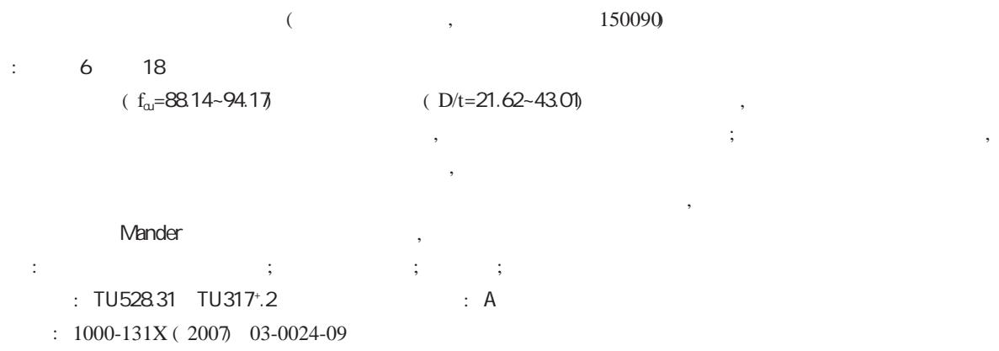

# Axial compr ession test and analysis of cir cular tube confined HSC stub columns

Zhang Sumei Liu Jiepeng Ma Le Xing Tao

(Harbin Institute of Technology, Harbin 150090, China)

Abstr act: A total of 18 circular tube confined high strength concrete (HSC) stub columns were tested under cyclic or monotonic axial compression. The parameters in the study include the compressive strength of concrete $\mathrm { f _ { c u } = }$ $8 8 . 1 4 { \sim } 9 4 . 1 7 \ \mathrm { M P a }$ ) and diameter-to-thickness ratio of the steel tube $( \mathrm { D } / \mathrm { t } = 2 1 . 6 2 \sim 4 3 . 0 1 $ ). The experimental results indicate that the axial bearing capacity of a steel tube confined concrete stub column is greater than that of a CFT column with equivalent parameters, while difference in ductility is insignificant. The axial bearing capacity of the columns increases as the longitudinal stress of the steel tube decreases. The results of elasto-plastic analysis of the steel tube indicate that the steel yields at the peak load. A design equation is proposed to calculate the axial bearing capacity of circular tube confined concrete columns. The results from the proposed equation for stub columns are consistent with the test results. A modified Mander’s model that is suitable for confined HSC is proposed based on the test results.

Keywords: circular tube confined HSC; cyclic axial compression; diameter-to-thickness ratio; axial load strength E-mail: smzhang@hit.edu.cn

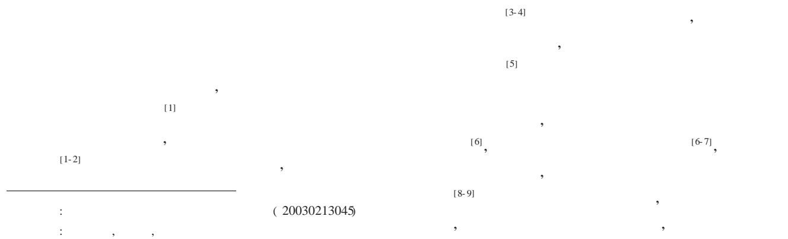

1985 Tomii (tubed column),

16

2

Tomii

$$
[ 1 3 - 1 5 ] \quad ,
$$

Priestley

Mandre[21]

[10- 11, 17- 20]

1994 Lahlou[17]

$$
\bar {f} _ {\mathrm {r}} = \frac {2 t f _ {\mathrm {y}} (\mathrm {D} - 2 \mathrm {t})}{f _ {\mathrm {c}}}
$$

: f! r ; fy ; f c

[ 16] ,

1

1.1

2

2

1

a

6

18

4

1

b

c

h/D ( 1)

2000 Peter[20]

$$
\mathrm {P _ {u} = f _ {c} A (1 + 3 . 2 4 \bar {f} _ {r} - \bar {f} _ {r} ^ {2})}
$$

Fam[11] 2004

( 2)

1

$$
\mathrm {L} / \mathrm {D} = 3
$$

2500 kN MTS ( 5000 kN )

( LVDT)

1

3

a c

( 2)

80%,

4

b

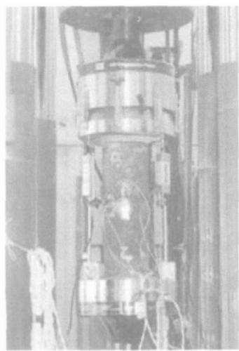

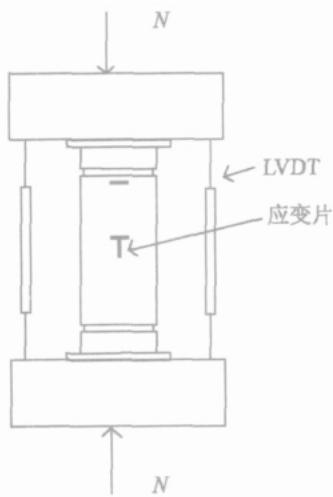

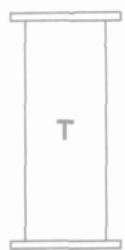

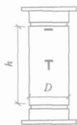

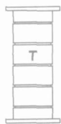

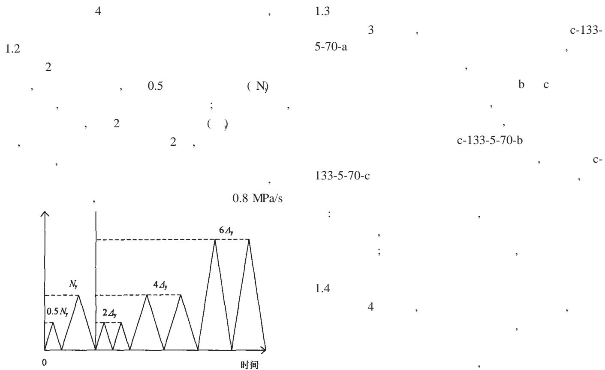  
图2加载制度  
Fig. 2 Loading program

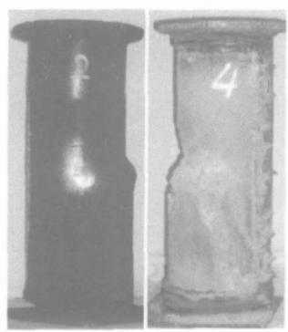  
(a) c-133-5-70-a

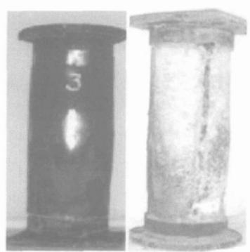  
(b) c-133- 5-70-b

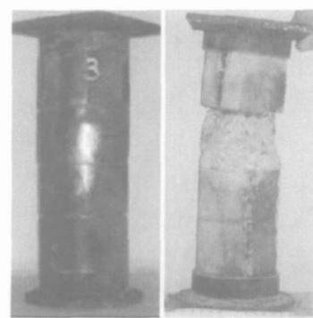  
(c) c-133- 5-70-c

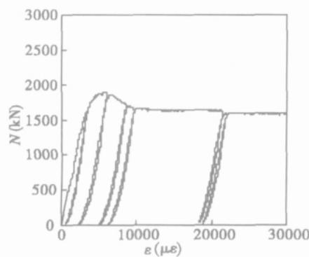  
3 c-1   
Fig. 3 Failur e modes of gr oup c-1   
(a) c-133-5-70-a

  
(b) c-133-5-70-b

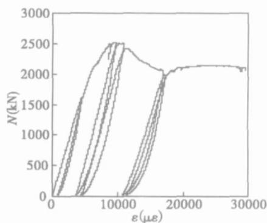  
(c) c-133-5-70-   
4 c-1 -   
Fig. 4 Load-axial compr essive str ain of the stub columns of gr oup c-

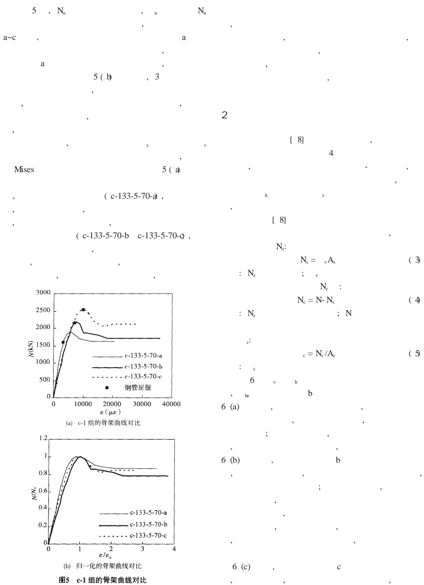  
Fig. 5Comparison of skeleton curves of group c-1

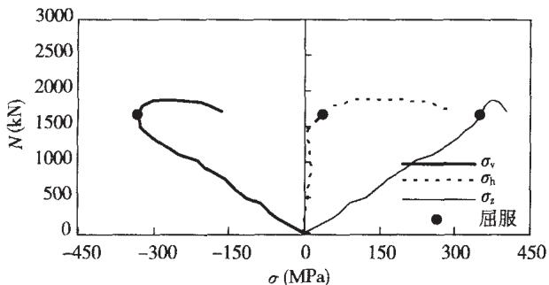

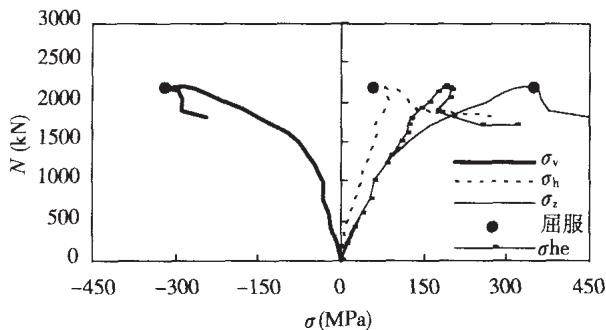  
(a)c-133-5-70-a   
(b)c-133-5-70-b

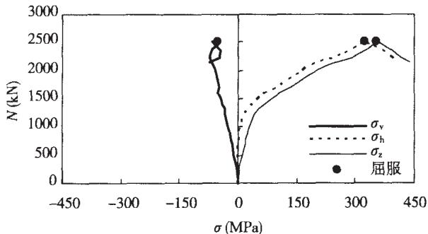  
(c) c-133-5-70-c   
图6c-1组试件的应力分析结果

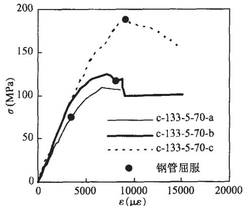  
Fig.6Elasto-plastic analysis results of the steel of group c-1   
图7c-1组试件的核心混凝土应力-应变关系  
7 c-1 -   
3   
3.1   
b   
8   
b

$$
v = 1 6 5 8 (D / t) ^ {- 0. 4 5} (M P a) \tag {6}
$$

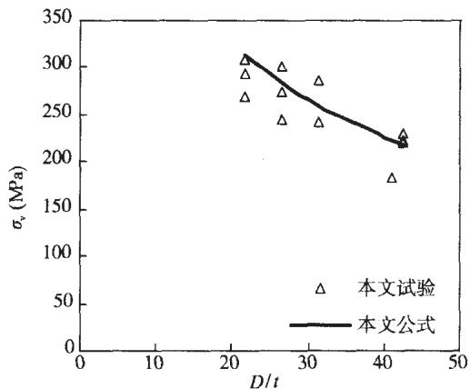  
图8加载模式 $\mathbf { b }$ 试件的 $\pmb { \sigma } _ { \mathbf { v } } { \pmb { D } } / t$ 关系  
Fig.8 The $\pmb { \sigma } _ { \mathbf { v } } \pmb { D } / t$ relationship of type b columns

$$
\begin{array}{c c c c} & & \text {M i s e s} \\ , & & \text {M i s e s} \\ & \text {v}, & \text {M i s e s} \\ , & \text {v}), \\ & \text {f _ {r}}; \end{array}
$$

$$
\mathrm {f} _ {\mathrm {r}} = 2 \mathrm {t} _ {\mathrm {h}} (\mathrm {D} - 2 \theta) \tag {7}
$$

b

$$
\mathrm {N} _ {\mathrm {u}} = \mathrm {v A} _ {\mathrm {s}} + \mathrm {f} _ {\mathrm {c c}} \mathrm {A} _ {\mathrm {c}} \tag {8}
$$

Mander[21]

$$
\mathrm {f _ {c c} = f _ {c o} \left(- 1 . 2 5 4 + 2 . 2 5 4 \sqrt {1 + \frac {7 . 9 4 f _ {r}}{f _ {c o}}} - 2 \frac {f _ {r}}{f _ {c o}}\right)} \tag {9}
$$

: Nu

; As Ac

; fcc

$$
\mathrm {N} _ {\mathrm {u}} = \mathrm {v A} _ {\mathrm {s}} + \mathrm {f} _ {\mathrm {c c}} \mathrm {A} _ {\mathrm {c}} + \mathrm {f} _ {\mathrm {b}} \mathrm {A} _ {\mathrm {b}} \tag {10}
$$

3.2

c

c fr = 2tfy /( D- 2t) ( 12)

c Nu= fcc Ac+ fb Ab ( 13)

1

$\mathrm { N _ { u } } = \mathrm { f _ { c c } } \mathrm { A _ { c } }$ ( 11) 9

c

1

Table 1 Par ameter s and test r esults of tube column specimens   

<table><tr><td></td><td></td><td>D (mm)</td><td>t (mm)</td><td>D/t</td><td>f_y(MPa)</td><td>f^10_{cu}(MPa)</td><td>f_cu(MPa)</td><td>Nuc(kN)</td><td>Nu(kN)</td><td>Nu/Nuc</td></tr><tr><td rowspan="3">c-1</td><td>c-133-5-70-a</td><td>133.05</td><td>5.00</td><td>26.64</td><td></td><td></td><td></td><td>1890</td><td>-</td><td>-</td></tr><tr><td>c-133-5-70-b</td><td>133.34</td><td>5.01</td><td>26.61</td><td>351.00</td><td>88.14</td><td>69.78</td><td>2004</td><td>1983</td><td>0.907</td></tr><tr><td>c-133-5-70-c</td><td>133.10</td><td>5.05</td><td>26.36</td><td></td><td></td><td></td><td>2514</td><td>2500</td><td>0.994</td></tr><tr><td rowspan="3">c-2</td><td>c-140-3-70-a</td><td>138.50</td><td>3.24</td><td>42.75</td><td></td><td></td><td></td><td>1851</td><td>-</td><td>-</td></tr><tr><td>c-140-3-70-b</td><td>139.30</td><td>3.36</td><td>41.46</td><td>331.70</td><td>88.14</td><td>69.78</td><td>1920</td><td>1895</td><td>0.926</td></tr><tr><td>c-140-3-70-c</td><td>138.25</td><td>3.34</td><td>41.45</td><td></td><td></td><td></td><td>2330</td><td>2295</td><td>0.985</td></tr><tr><td rowspan="3">m-3</td><td>c-133-5-75-b-1</td><td>133.25</td><td>4.91</td><td>27.14</td><td></td><td></td><td></td><td>2347</td><td>2040</td><td>0.869</td></tr><tr><td>c-133-5-75-b-2</td><td>133.21</td><td>5.05</td><td>26.40</td><td>351.00</td><td>94.17</td><td>74.55</td><td>2366</td><td>2046</td><td>0.865</td></tr><tr><td>c-133-5-75-b-3</td><td>133.42</td><td>5.41</td><td>24.68</td><td></td><td></td><td></td><td>2324</td><td>2066</td><td>0.889</td></tr><tr><td rowspan="3">m-4</td><td>c-133-6-75-b-1</td><td>133.22</td><td>6.07</td><td>21.97</td><td></td><td></td><td></td><td>2234</td><td>2357</td><td>1.055</td></tr><tr><td>c-133-6-75-b-2</td><td>133.29</td><td>6.17</td><td>21.62</td><td>392.00</td><td>94.17</td><td>74.55</td><td>2267</td><td>2367</td><td>1.044</td></tr><tr><td>c-133-6-75-b-3</td><td>133.29</td><td>6.11</td><td>21.82</td><td></td><td></td><td></td><td>2275</td><td>2362</td><td>1.038</td></tr><tr><td rowspan="3">m-5</td><td>c-140-3-75-b-1</td><td>139.40</td><td>3.27</td><td>42.70</td><td></td><td></td><td></td><td>2120</td><td>1959</td><td>0.924</td></tr><tr><td>c-140-3-75-b-2</td><td>138.70</td><td>3.23</td><td>43.01</td><td>331.70</td><td>94.17</td><td>74.55</td><td>2147</td><td>1936</td><td>0.902</td></tr><tr><td>c-140-3-75-b-3</td><td>138.70</td><td>3.27</td><td>42.48</td><td></td><td></td><td></td><td>2185</td><td>1942</td><td>0.889</td></tr><tr><td rowspan="3">m-6</td><td>c-160-5-75-b-1</td><td>158.60</td><td>5.17</td><td>30.71</td><td></td><td></td><td></td><td>3198</td><td>2866</td><td>0.896</td></tr><tr><td>c-160-5-75-b-2</td><td>158.90</td><td>5.12</td><td>31.04</td><td>356.30</td><td>94.17</td><td>74.55</td><td>3095</td><td>2870</td><td>0.927</td></tr><tr><td>c-160-5-75-b-3</td><td>159.10</td><td>5.11</td><td>31.17</td><td></td><td></td><td></td><td>3031</td><td>2875</td><td>0.949</td></tr></table>

: 0.941; : 0.061

( cyclic) ( monotonic) , 2

2 c-133-5-75-b-1 , c ( circular) , 133 133 mm, 5 5 mm, 75

75 MPa, b b, 1 3 1 (

)

3 D t , D/t , fy f 10cu 100 mm , fco

4 Nue Nuc

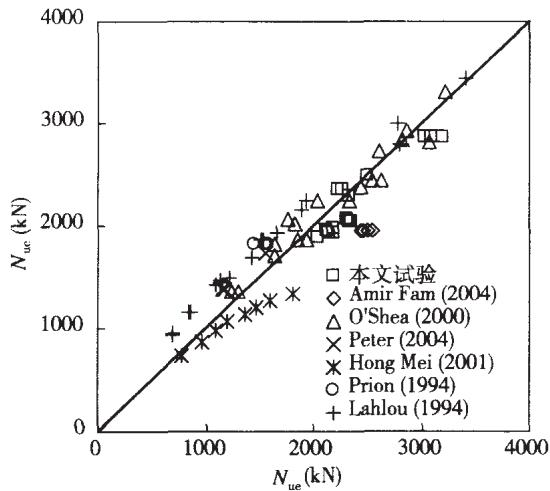  
Fig.9Comparison of test resultsand predictions

图9计算结果与试验结果的对比

b

c

h/D 0.7 h/D 1 ,

c, (11)

1<h/D 3 ,

b, (8)

4

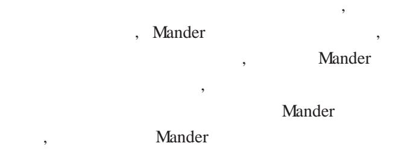

4.1

Mander

C80 Mander

$$
\mathrm {c c} = \quad \mathrm {c o} \left[ 1 + 2. 3 9 \left(\frac {\mathrm {f} _ {\mathrm {c c}}}{\mathrm {f} _ {\mathrm {c o}}} - 1\right) \right] \tag {14}
$$

cc co

10

Mander

$$
\mathrm {f _ {c} = f _ {c c} \frac {x r}{r - 1 + x ^ {r}}} \tag {15}
$$

$$
\begin{array}{r l} & \text {: f _ {c} c} \\ & \text {: ; x} \end{array}
$$

$$
\mathrm {x} = \quad_ {\mathrm {c}} / \quad_ {\mathrm {c c}}; \quad \mathrm {r} \quad , \quad \mathrm {r} = 0. 8 \mathrm {E} _ {\mathrm {c}} / (\mathrm {E} _ {\mathrm {c}} - \mathrm {E} _ {\sec}); \quad \mathrm {E} _ {\mathrm {c}}
$$

$$
, \quad \mathrm {E} _ {\mathrm {c}} = 4 5 0 0 \mathrm {f} _ {\mathrm {c o}} ^ {0. 5}; \quad \mathrm {E} _ {\mathrm {s e c}}
$$

$$
, \quad E _ {\mathrm {s e c}} = f _ {\mathrm {c c}} / \quad_ {\mathrm {c c}}
$$

11

4.2

12

$$
\mathrm {f _ {c} = f _ {u n} - \frac {f _ {u n} x r}{r - 1 + x ^ {r}}} \tag {16}
$$

$$
\mathrm {p l} = 0. 3 \begin{array}{c c c} - 0. 8 & 1. 8 \\ \mathrm {c c c} & \mathrm {u n} \end{array} \tag {17}
$$

$$
\begin{array}{l l} \text {:} & \mathrm {x} \\ \hline \end{array} , \mathrm {x} = (\mathrm {c} - \mathrm {u n}) / (\mathrm {p l} - \mathrm {u n}); \quad \mathrm {f} _ {\mathrm {c}} \quad \mathrm {c}
$$

$$
; \quad \mathbf {f} _ {\mathrm {u n}} \qquad \mathbf {\Phi} _ {\mathrm {u n}}
$$

$$
; \quad_ {\mathrm {p l}} \quad ; \quad \mathrm {r} \quad , \quad \mathrm {r} = 1. 5 \mathrm {E} _ {\mathrm {u}} /
$$

$$
\begin{array}{l} \left(\mathrm {E} _ {\mathrm {u}} - \mathrm {E} _ {\mathrm {s e c}}\right); \quad \mathrm {E} _ {\mathrm {u}}, \quad \mathrm {E} _ {\mathrm {u}} = 2 \mathrm {E} _ {\mathrm {c}}; \quad \mathrm {E} _ {\mathrm {s e c}} \\ , \quad \mathrm {E} _ {\sec} = f _ {\mathrm {u n}} / \\ \end{array}
$$

$$
(\quad \mathrm {u n} ^ {-} \quad \quad \mathrm {p l})
$$

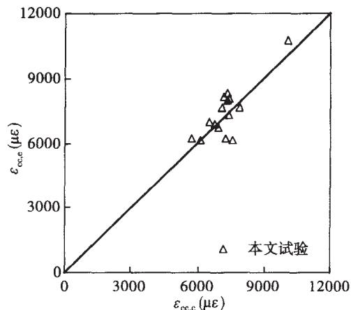  
图10峰值应变公式计算结果与试验的对比

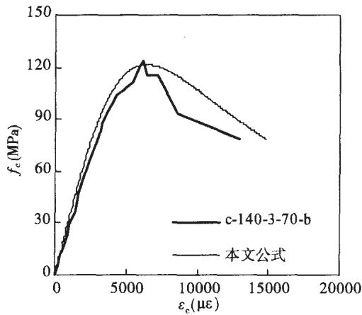  
Fig. 10 Compar ison of peak stain between test and pr edictio   
图11本文模型与试验结果的对比

  
Fig. 11 Compar ison of pr oposed model and exper iment r es   
图12约束高强混凝土的滞回模型  
Fig. 12 Cyclic model of confined H

0;

pl

0

4.3

12

ro fro

0

$$
\begin{array}{c c c} & \mathrm {u n} & , \\ & & \mathrm {f _ {n e w}} \\ \mathrm {f _ {u n}}, \end{array}
$$

$$
\begin{array}{r l r} \left(\mathrm {u n}, \quad \mathrm {f} _ {\text {n e w}}\right) & , & \mathrm {f} _ {\text {n e w}} \\ \mathrm {f} _ {\text {n e w}} = 0. 9 2 \mathrm {f} _ {\text {u n}} + 0. 0 8 \mathrm {f} _ {\text {r o}} \end{array} \tag {18}
$$

$$
\left( \begin{array}{c c} & \\ \text {u n}, & \mathrm {f} _ {\text {n e w}} \end{array} \right)
$$

$$
( \begin{array}{c c} & \\ \mathrm {r e}, & \mathrm {f _ {r e}} \end{array} )
$$

$$
\left( \begin{array}{c c} & \\ \mathrm {r e}, & \mathrm {f _ {r e}} \end{array} \right)
$$

$$
= \mathrm {u n} + \frac {\mathrm {f} _ {\mathrm {u n}} - \mathrm {f} _ {\mathrm {n e w}}}{\mathrm {E} _ {\mathrm {r}} \left(2 + \frac {\mathrm {f} _ {\mathrm {c c}}}{\mathrm {f} _ {\mathrm {c o}}}\right)} \tag {19}
$$

$$
\begin{array}{c c} : & \mathrm {E} _ {\mathrm {r}} \\ & , \end{array} \quad \mathrm {E} _ {\mathrm {r}} = (\mathrm {f} _ {\mathrm {r o}} - \mathrm {f} _ {\mathrm {n e w}}) / (\mathrm {f} _ {\mathrm {r o}} - \mathrm {f} _ {\mathrm {u n}})
$$

5

( 1)   
  
( 3)   
( 4)   
( 5)

Mander

[ 1] , [ M] . , 2002 (Shen Jumin, Zhou Xiyuan, Gao Xiaowang, et al. Aseismic Engineering [ M] . Beijing:

$$
[ \mathrm {M} ]. \quad , \quad , \quad . \quad :
$$

[ 2] Paulay T, Priestley M J N.   
, 1999 (Paulay T, Priestley M J N. Seismic Design of Reinforced Concrete and Masonry Buildings [ M] . New York: John Wiley & Sons, 1999)   
[ 3] [ M] . , 1992 (Chen Zhaoyuan, Zhu Jinquan, Wu Peigang. High Strength and Application [ M] . Beijing: Tsinghua University Publishing Company, 1992 (in Chinese))   
[ 4] ACI Committee 363. State-of-the-art report on high-strength concrete[ J] . ACI Journal, 1984, 81 (4) : 364- 411   
[ 5] Frédéric Légeron, Patrick Paultre. Behavior of high-strength concrete columns under cyclic flexure and constant axial load[ J] . ACI Structural Journal, 2000, 97 (4) : 591- 601   
[ 6] [ M] . 2003 ( Zhong Shantong. The concrete-filled steel tubular structures [ M] . Beijing: Tingshua University Publishing Company, 2003 (in Chinese))   
[ 7] Furlong R W. Strength of steel-encased concrete beam columns[ J] . Journal of Structural Division, 1967, 93 (5) : 113- 124   
[ 8] Sumei Zhang, Lanhui Guo, Zaili Ye, et al. Behavior of steel tube and confined concrete high strength concrete for concrete-filled RHS tubes [ J] . Advances in Structural Engineering, 2005, 8 (5) : 101- 116   
[ 9] [ J] . 2005, 26 ( 3) : 9- 18 (Zhang Sumei, Liu Jiepeng, Wang Yuyin, et al. Hysteretic behavior of biaxially loaded high strength concrete- filled square hollow section beam- columns [ J] . Journal of Building Structures, 2005, 26 ( 3) : 9 - 18 (in Chinese))   
[ 10] Gardner N J, Jacobson E R. Structural behavior of concrete filled steel tubes[ J] . ACI Journal, 1967, 64: 404- 413   
[ 11] Fam A, Qie F S, Rizkalla S. Concrete-filled steel tubes subjected to axial compression and lateral cyclic loads[ J] . Journal of Structural Engineering, 2004, 130 (4) : 631- 640   
[ 12] [ D] . , 2003 (Wang Yuyin. Research on basic behavior of high - strength concrete-filled steel tubular short columns under axial compressive loading [ D] . Harbin: Harbin Institute of Technology, 2003 ( in Chinese))   
[ 13] Tomii M, Sakino K, Xiao Y, et al . Earthquake resisting hysteretic behavior of reinforced concrete short columns confined by steel tube [ C] // Proceeding of the International Speciality Conference on Concrete Filled Steel Tubular Structures, Harbin: Harbin Architecture & Civil Engineering Institue, 1985: 119- 125

5

PC

(4)

μ

k

0.0015~0.0066

PC

PC

[ 1]

[ J] .

[ 2]   
[ 3] JTGD62—2004   
[ 4]   
[ 7]   
, 2000, 17 (4): 138 - 144 ( Ren Chaxian, Zhu Runxiang. Analysis of prestressing effect for curved continuous box girders[ J] . Engineering Mechanics, 2000, 17(4): 138- 144 (in Chinese))   
[ J] . , 1998, 11 (4): 48- 53 ( Zhong Ming, Li Wenhui, Yuan Changqing. Frictional loss calculation of prestressing tendons in curved girder bridge [ J] . Journal of Shijiazhuang Railway Institute , 1998 , 11 (4): 48 - 53 ( in Chinese))   
[ S] ( JTGD62—2004 Code for Design of Highway Reinforced Concrete and Prestressed Concrete Bridges and Culverts[ S] (in Chinese))   
, 1994 (Shao Rongguang, Xia Gan.Curved Concrete Girder Bridge [ M] . Beijing: China Communications Press, 1994 (in Chinese))   
[ 5] AASHTO LRFD-SI-2 AASHTO LRFD Bridge Design Specifications[ S] , 1998   
[ 6] ACI343-R-95 Analysis and Design ofReinforced Concrete Bridge Structures[ S]   
[ R] . , 2000 ( Chang’an University. Technical report of prestress loss of PC continuous curved box girder bridge [ R] . Xi’an: Chang’an University, 2000 ( in Chinese))   
[ 8] ACI318-R-02 Building code requirements for structural concrete and commentary[ S]

( 31 )

[ 14] Xiao Y, Tomii M, Sakion K. Experimental study on design method to prevent shear failure of reinforced concrete short circular columns by confining in steel tube[ J] . Transactions of Japan Concrete Institute, 1986, 8: 535- 542

[ 15]

[ J] . , 2003, 24 ( 6) : 79- 86

( Xiao Yan, Guo Yurong, He Wenhui, et al. Retrofit of reinforced concrete columns using partially stiffened steel jackets [ J] . Journal of Building Structures, 2003, 24 ( 6) : 79- 86 (in Chinese))

[ 16] Priestley M J N, Seible F, Calvi M. Seismic design and retrofit of bridges[ M] . New York: John Wiley & Sons, 1996   
[ 17] Lahlou K. Comportement des colonnes courtes en béton à hautes performances confinédans des tubes circulaires en

acier soumises à des efforts de compression [ D] . Sherbrooke: PhD thesis, Université de Sherbrooke ( in French) , 1994   
[ 18] O’Shea M D , Bridge R Q . Design of circular thinwalled concrete filled steel tubes[ J] . Journal of Structural Engineering, 2000, 126 (11): 1295- 1303   
[ 19] Mei H, Kiiousis P D, Ehsani M R, et al. Confinement effects on high-strength concrete[ J] . ACI Structural Journal, 2001, 98 (4) : 548- 553   
[ 20] Mcateer P, Bonacci J F, Lachemi M. Composite response of high-strength concrete confined by circular steel tube [ J] . ACI Structural Journal, 2004, 101 (4) : 466- 474   
[ 21] Mander J B, Priestley M J N, Park R. Theoretical stressstrain model for confined concrete [ J] . Journal of the Structural Engineering, 1988, 114 (8) : 1804- 1823