# Axial performance of short concrete filled steel tubes with high- and ultra-high- strength materials

Ming-Xiang Xiong a,b,⇑ , De-Xin Xiong b , J.Y. Richard Liew b,c

a School of Civil and Transportation Engineering, Guangdong University of Technology, 100 Waihuan Xi Road, GuangZhou 510006, China   
b Department of Civil Engineering, National University of Singapore, 21 Lower Kent Ridge Road, Singapore 119077, Singapore   
c School of Civil Engineering, Nanjing Tech University, No. 30 Puzhu Road(S), Nanjing 211816, China

# a r t i c l e i n f o

Article history:

Received 1 July 2016

Revised 16 January 2017

Accepted 17 January 2017

Available online 31 January 2017

Keywords:

Concrete filled steel tubes

Short columns

High tensile steel

Ultra-high strength concrete

Eurocode 4

Modifications

# a b s t r a c t

The use of high strength concrete and steel have significant advantages for composite members subject to significant compression as in the cases of high-rise buildings. Current design codes place limits on the strengths of steel and concrete due to limited test data and experience on the behaviour of composite members with the high strength materials. To extend their applications, a comprehensive experimental program has been carried out to investigate the behaviour of concrete filled steel tubes (CFSTs) with highand ultra-high- strength materials at ambient temperature. This article presented some new findings on the axial performance of 56 short CFSTs. High tensile steel with yield strength up to 780 MPa and ultrahigh strength concrete with compressive cylinder strength up to 190 MPa were used to prepare the CFST test specimens. The key issue is to clarify if the plastic cross-sectional resistance could be used at ultimate limit state as for CFSTs with the normal strength materials. To address this, experimental and analytical methods were adopted where the test results were compared with the predictions by various design codes world widely, and design recommendations were therefore proposed so that the prediction methods could be safely extended to the short CFSTs with the high- and ultra-high- strength materials.

$^ { © }$ 2017 Elsevier Ltd. All rights reserved.

# 1. Introduction

Steel and concrete are capable to compensate each other meanwhile working together to form composite structural members with expected characteristics. Concrete filled steel tubes (CFSTs), one of the most widely used composite members in high-rise construction in Asia, take the full advantages of the characteristic behaviour of steel and concrete materials. It is well known that the core concrete delays the local buckling and temperature rise of steel tube and in turn enhances the strength and ductility of core concrete. Moreover, the steel tube eliminates the need of formwork for concrete casting and thus leads to fast track construction. The CFSTs have various types of cross-section. Circular, square and rectangular sections are generally used whereas elliptical and polygonal sections could be adopted catering for architectural aesthetics or functional requirements. Conventionally, only plain concrete is infilled to the hollow tubes. Nowadays, the concrete may be reinforced by polymer or steel fibers to enhance ductility

and fire resistance, in which cases the workability or the flowablility of the concrete should be carefully controlled if it is pumped into the tubes. Reinforcing steel cages are mainly used to improve the fire resistance, since the steel cages are capable to take over loads when the external tube is sacrificed under fire. For convenience, the steel cage could be replaced by an internal tube to improve the fire resistance as well as the compressive resistance and ductility due to higher confinement provided. Other steel sections, such as solid steel sections or H-sections, can be inserted into the core concrete to further improve the compressive resistance and thus reduce the member size. Nevertheless, the steel cages, internal tubes and inserted sections are less used in practice due to some incurred construction difficulties, such as congesting the concrete casting area and obstructing the inner diaphragm plates at beam-column joints, etc.

With the development of concrete technology and availability of various materials such as silica fume and high-range water-reducing admixtures, the production of ultra-high strength concrete (UHSC) with compressive strength higher than 120 MPa is possible nowadays. However, the UHSC has been limited to some special applications such as marine and offshore structures, pavements, industrial floors, and security barriers, etc. It has not been used in building structures due to concerns on its brittleness and

spalling behaviour under fire [1]. To reduce the brittleness, the UHSC may be confined by the steel tubes. As the UHSC is more brittle than normal strength concrete (NSC), high tensile steel (HTS) tubes may be used to provide higher confinement. However current state-of-art design guidelines for CFSTs are only applicable for normal strength concrete and steel. For example, Eurocode 4 [2] method is applicable to composite columns with normal weight concrete cylinder strength from 20 MPa to 50 MPa and structural steel yield strength from 235 MPa to $4 6 0 \mathrm { M P a }$ ; AISC 360-10 [3] is for composite columns with normal weight concrete cylinder strength from 21 MPa to 70 MPa, light weight concrete cylinder strength from 21 MPa to 42 MPa and structural steel yield strength up to 525 MPa; GB 50936 [4] only applies to composite columns with concrete cylinder strength from 25 MPa to 70 MPa and steel yield strength from 235 MPa to $4 2 0 \mathrm { M P a }$ ; and AIJ [5] allows the use of high strength concrete with compression strength up to 90 MPa. Therefore, sufficient work should be done to extend current design guidelines to the CFSTs with high strength materials. With regard to this, the axial performance of the said CFSTs were firstly investigated and introduced hereinafter.

For the high strength concrete (HSC) used in short CFSTs, there were researches in the available literature done by Han et al. [6] and Liu et al. [7][8] where the concrete strength reached 106 MPa. The test results were compared with the predictions based on the EC 4 approach, showing that the EC 4 approach overestimated the ultimate axial resistance. However, different conclusions were drawn by Lue et al. [9] and Yu et al. [10] based on their tests where the concrete strength was close to 120 MPa. It is found that the EC 4 approach actually provided conservative predictions. For the high tensile steel (HTS) employed for the short CFSTs, Uy [11] carried out an experimental investigation on box CFSTs where the yield strength of the HTS was approximately 750 MPa. The comparisons with the EC 4 predictions showed that the EC 4 approach overestimated the ultimate resistance. A 5 year research on centrally loaded stub CFSTs was carried out under the U.S.– Japan Cooperative Earthquake Research Program [12]. A total of 114 specimens was tested and the steel strength reached $8 5 3 \mathrm { M P a }$ . The test results were used to form the design basis of the AISC Standards for the CFSTs. Again similar research was done by Aslani et al. [13] and the yield strength of HTS reached 700 MPa. Test results were compared with the predictions by Australian Standards, Eurocode 4, and AISC. The comparisons showed conservative predictions, implying applicability of the said codes to the short CFSTs with the HTS.

The foresaid studies have provided significant contributions to the research progress in developing cross-sectional resistance of the short CFSTs using the HSC and HTS. However, the work is insufficient, especially for CFSTs with the UHSC of compressive strength higher than 120 MPa and the HTS of yield strength greater than 460 MPa as shown in Fig. 1. Therefore, more investigations should be carried out to assess their potential applications in high-rise construction. This paper presented the test data and code predictions on the short CFSTs under concentric compression to evaluate the cross-sectional resistance. Design recommendations were then proposed for the relevant design approaches. It should be mentioned that this is a supplementary and summary work to the preliminary and incomplete research introduced in Ref.[14]. In this article, all the test data on short CFSTs were covered, and the detailed test program and test results were described and discussed.

# 2. Eurocode 4 approach for short CFSTs under compression

According to Eurocode 4 [2], the characteristic plastic crosssectional compressive resistance of a CFST without reinforcing steel is calculated by

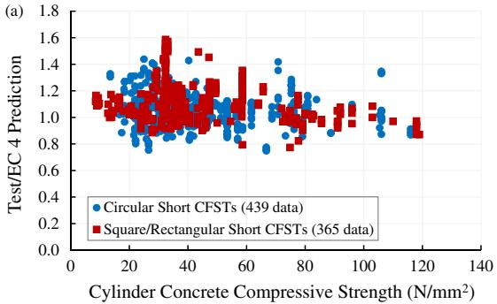

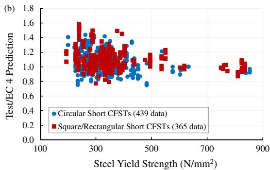  
Fig. 1. Database of tests on short CFSTs.

$$
N _ {p l, R k 1} = A _ {a} f _ {y} + A _ {c} f _ {c k} \tag {1}
$$

where $A _ { \mathfrak { a } }$ and $A _ { \mathrm { c } }$ are the cross-section area of steel and concrete section, respectively; $f _ { \mathrm { y } }$ and $f _ { \mathrm { c k } }$ are the characteristic yield and cylinder compressive strength of steel and concrete, respectively. Confinement effect may be considered for circular CFSTs with nondimensional slenderness ratio $\bar { \lambda } \leqslant 0 . 5$ and the ratio of load eccentricity to diameter $e / d < 0 . 5$ , where kis the non-dimensional slenderness ratio $= \sqrt { \mathrm { { N _ { p l , R k 1 } } / \mathrm { { N _ { c r } } } } }$ , $\Nu _ { \mathrm { c r } }$ is the Euler buckling force of the CFST. The cross-sectional compressive resistance is then calculated by

$$
N _ {p l, R k 2} = \eta_ {a} A _ {a} f _ {y} + A _ {c} f _ {c k} \left(1 + \eta_ {c} \frac {t}{d} \frac {f _ {y}}{f _ {c k}}\right) \tag {2}
$$

where t and $d$ is the wall thickness and diameter of the steel tube; $\eta _ { \mathrm { a } }$ and $\eta _ { \mathrm { c } }$ are given by the following expressions:

$$
\eta_ {a} = 0. 2 5 \left(3 + 2 \bar {\lambda}\right) + \left(1 - 0. 2 5 \left(3 + 2 \bar {\lambda}\right)\right) \left(1 0 e / d\right) \tag {3}
$$

$$
\eta_ {c} = (4. 9 - 1 8. 5 \bar {\lambda} + 1 7 \bar {\lambda} ^ {2}) (1 - 1 0 e / d) \tag {4}
$$

The Euler buckling force $N _ { \mathrm { c r } }$ is formulated as

$$
N _ {c r} = \frac {\pi^ {2} (E I) _ {e f f}}{L ^ {2}} \tag {5}
$$

where

$$
(E I) _ {e f f} = E _ {a} I _ {a} + 0. 6 E _ {c m} I _ {c} \tag {6}
$$

L is column length; $E _ { \mathrm { { c m } } }$ and $E _ { a }$ are the test elastic moduli of concrete and steel; $I _ { \mathbf { a } }$ and $I _ { \mathrm { c } }$ are the second moment of area of steel and concrete sections, respectively.

# 3. Discussion on confinement effect

According to Eq. (2), there is an increase of concrete strength for circular CFSTs due to confinement effect which is normally ignored for the other shapes of sections. The level of confinement is related to the steel yield strength and concrete compressive strength. Basically, the level of confinement is represented by the ratio of

confining stress over the concrete strength, and could be derived based on the force equilibrium between steel tube and core concrete of which the stress states are shown in Fig. 2. Assuming the steel tube is a thin-wall element, the stress in steel tube along the radial direction is not considered. According to force equilibrium and the Von Mises failure criteria for the steel tube, we have:

$$
N = A _ {c} \sigma_ {c} + A _ {s} \sigma_ {1} \tag {7}
$$

$$
\sigma_ {2} t = p \cdot d _ {c} / 2 \tag {8}
$$

$$
\sigma_ {1} ^ {2} + \sigma_ {1} \sigma_ {2} + \sigma_ {2} ^ {2} = f _ {y} ^ {2} \tag {9}
$$

Subject to confinement, the concrete strength could be generally written as Eq. (1) [15], in which $p$ is the confining stress, $K$ is a coefficient.

$$
\sigma_ {c} = f _ {c k} \left(1 + K \frac {p}{f _ {c k}}\right) \tag {10}
$$

Rearranging above equations gives:

$$
N = A _ {s} f _ {y} \left[ \sqrt {1 - 3 \left(\frac {A _ {c} p}{A _ {s} f _ {y}}\right) ^ {2}} - \frac {A _ {c} p}{A _ {s} f _ {y}} \right] + A _ {c} f _ {c k} \left(1 + K \frac {p}{f _ {c k}}\right) \tag {11}
$$

or

$$
N = A _ {c} f _ {c k} \left[ 1 + (K - 1) \frac {p}{f _ {c k}} + \sqrt {\left(\frac {A _ {s} f _ {y}}{A _ {c} f _ {c k}}\right) ^ {2} - 3 \left(\frac {p}{f _ {c k}}\right) ^ {2}} \right] \tag {12}
$$

Eq. (11) is similar to Eurocode 4 formula as given in Eq. (2). The coefficient K is generally calibrated by tests. Early investigations by Richart et al. found the average value of K was to be 4.1 [16] whereas it was proposed by Balmer to be 5.6 [17]. The confining stress $p$ can be determined when the axial capacity is achieved, thus, taking $\mathrm { d } N / \mathrm { d } p = 0$ based on Eq. (12), we have:

$$
\frac {p}{f _ {c k}} = \frac {A _ {s} f _ {y}}{A _ {c} f _ {c k}} \frac {K - 1}{\sqrt {9 + 3 (K - 1) ^ {2}}} \tag {13}
$$

Eq. (13) indicates that the level of confinement $p / f _ { \mathrm { c k } }$ increases with the yield strength of steel and is in inverse proportion to the compressive strength of concrete. It is worth noting that the magnitude of confining stress $p$ is not related to the concrete strength, but affected by concrete cross-sectional area $A _ { \mathrm { c } }$ .

# 4. Experimental program

# 4.1. Specimen details

The short CFSTs investigated in present study consisted of circular, square, single-tube, and double-tube specimens. The concrete used included NSC and UHSC, whereas mild steel hot-rolled steel and welded HTS plates were employed as the tubes.

At least three cylinders with nominal diameter of $1 0 0 \mathrm { m m }$ and height of $2 0 0 \mathrm { m m }$ were cast for each batch of concrete, and cured at ambient temperature where the relative humidity was approximately $8 5 \%$ and the room temperature was around $3 0 ^ { \circ } \mathrm { C }$ at daytime and $2 5 ^ { \circ } \mathsf C$ at night. The cylinders were sealed by aluminium foils so that the curing condition was the same with that for CFSTs. The cylinders were tested on the same days when the corresponding CFSTs were tested to obtain the basic mechanical properties. The NSC was made from ordinary Portland cement, sand, coarse aggregates with maximum size $1 0 \mathrm { m m }$ , and a proper volume of water. The mix proportion design is shown Table 1. The UHSC was made from commercial Ducorit product D4 (refer to http:// www.densit.com/) which is a pre-blended mixture containing cementitious mineral material, super-plasticizer, and ultra-high strength fine aggregates with maximum size less than $4 . 7 5 \ : \mathrm { m m }$ and $4 9 \%$ less than $0 . 6 \mathrm { m m }$ [1]. The mix proportions is given in Table 2. Workability of the fresh UHSC was tested using the slump flow test in accordance with ASTM C1611/C1611M-09b [18], and the slump flow spread was $7 3 5 \mathrm { m m }$ [19]. Ultra-high tensile strength steel fibers $\cdot d = 0 . 1 6 \mathrm { m m }$ , $l = 1 3 \mathrm { m m }$ , $f _ { \mathbf { y } } = 2 3 0 0 \mathbf { M } \mathrm { P a } .$ ) and ordinary granite coarse aggregates were used to improve the ductility.

The sizes and classification of the hollow steel sections are given in Table 3. At least three coupons were tested for each type of steel section. The HTS, labelled as RQT701, was a quenched and tempered steel provided by TATA Steel [20]. The sections were classified according to Eurocode 3 [21] and the maximum b/t or $\mathrm { d } / \mathrm { t }$ values were calculated based on Eurocode 4 [2]. It is shown that one section fell in Class 3 according to Eurocode 3 but was still allowed to be used for the CFSTs by Eurocode 4. Backing plates and shear connectors were used for the welded box sections as shown in Fig. 3. The full penetration butt welds were used and are continuous along the column height. The low-hydrogen electrodes were adopted to avoid hydrogen induced cold cracks in the heat affected zones. The shear connectors were used to ensure the gap distance between the double tubes during casting, and to

  
Fig. 2. Stress states of steel tube and core concrete under axial compression.

Table 1 Mix proportions per cube meter of NSC.   

<table><tr><td>Water/cement</td><td>Water (kg/m3)</td><td>Cement (kg/m3)</td><td>Sand (kg/m3)</td><td>Coarse aggregate (kg/m3)</td></tr><tr><td>0.5</td><td>225</td><td>450</td><td>625</td><td>1005</td></tr></table>

Table 2 Mixing proportions of plain UHSC.   

<table><tr><td>Water/D4</td><td>Water (kg)</td><td>Pre-blended D4 (kg)</td><td>UHSC Volume (m3)</td></tr><tr><td>0.076</td><td>202.1</td><td>2659.6</td><td>1.0</td></tr></table>

diminish the local buckling at end areas of the plates during loading.

The specimen details are shown in Table 4 for single-tube CFSTs and Table 5 for double-tube CFSTs. Six types of UHSC mixures were used in this study as

 $\bf { U _ { 0 } }$ : plain UHSC;   
 $\mathbf { U S _ { 0 . 5 } }$ : $\mathrm { U H S C } + 0 . 5 \%$ steel fibers;   
 $\bf { U S _ { 1 } }$ : $\mathrm { U H S C } + 1 \%$ steel fibers;   
 $\bf { U C } _ { 1 9 / 1 0 }$ : UHSC + 19% 10 mm coarse aggregates;   
 $\bf { U C } _ { 1 9 / 2 0 }$ : UHSC + 19% 20 mm coarse aggregates;   
 $\bf { U C } _ { 3 8 / 1 0 }$ : UHSC $+ 3 8 \%$ 10 mm coarse aggregates;   
 $\bf { U C } _ { 3 8 / 2 0 }$ : UHSC + 38% 20 mm coarse aggregates.

The coefficient $\delta$ is the steel contribution ratio as defined in Eq. (14). It is limited within a range of 0.2–0.9 by EC 4. The overall buckling of all specimens under compression can be ignored since all the values of relative slenderness k are less than 0.2.

$$
\delta = \frac {A _ {a} f _ {y}}{N _ {p l , R k 1}} \tag {14}
$$

# 4.2. Test setup and instrumentations

There were two specimens which were only loaded on core concrete as shown in Fig. 4a. The other specimens were loaded on their full cross-sections. The middle-height strain values were monitored by four post-yielding cross-strain gauges placed at $9 0 ^ { \circ } C$ apart and fixed to the external surfaces of the tubes. Each strain gauge consists of two components, one aligned in the longitudinal direction and the other in the horizontal direction. The axial shortening displacements were measured by four linear varying displacement transducers (LVDTs) which were also placed on four sides. The test setup is shown in Fig. 4b. A quasi-static loading procedure was introduced in four steps: (1) preload the specimen at a rate of $0 . 2 \mathrm { m m / m i n }$ or 5kN/s up to $1 0 \%$ its resistance; (2) unload at a rate of $1 . 0 \mathrm { m m / m i n }$ ; (3) reload at the same rate as that in Step 1

to $6 0 \% \sim 7 0 \%$ of its resistance, and then change the rate to $0 . 2 \mathrm { m m } /$ min until the peak load is achieved; (4) finally in the post-peak range, increase the rate up to $0 . 5 \mathrm { m m / m i n }$ until complete failure occurs.

# 5. Test results and observations

All the 56 specimens after tested are shown in Fig. 5. They were governed by typical compression failure occurring on the principal planes $4 5 ^ { \circ } \mathsf { C }$ from the horizontal planes) where the maximum shear stresses were developed and local bulges were observed on the steel tubes. The overall buckling failure was not found, indicating the specimens are short columns. Some seamless circular tubes and welds of the square tubes were split at large deformations due to the tensile ring stresses developed in providing the confinement to the core concrete.

The load-shortening curves of the hollow steel tubes are shown in Fig. 6. For HC2, HC3 and HC5 with Class 1 sections according to EC 3, the strength hardenings beyond peak load were developed; whereas they were not found for HC1 and HC4 with Class 2 and Class 3 sections, respectively. The yielding plateau was found for the HC5 with a $1 0 \mathrm { m m }$ tube thickness. The behaviour was similar to that of standard coupon test, indicating the less imperfections were induced in the thicker tube. For the square hollow sections, although they are both classified as Class 1, the HS2 with $1 2 \mathrm { m m }$ plates developed significant hardening whereas the HS1 with $8 \mathrm { m m }$ plates did not. The plates of HS1 might not fall in Class 1. Therefore, care should be taken for the classification of high tensile steel and the smaller maximum width-to-thickness ratios may be adopted.

Typical load-shortening curves of CFSTs are shown in Fig. 7. Generally, for the CFSTs with the UHSC mixtures, the load dropped rapidly after they reached their peaks. For the CFSTs with the NSC (C9 and C12), the rapid drops were not observed, the load of C9 after the peak was smoothly reduced due to a Class 3 section; whereas the C12 with a Class 1 section developed strength hardening. It seemed that the said load drop was larger for the circular single-tube CFST (C18) than the square CFST (S4), the doubletube CFSTs (DC9 & DS2) were in like manner. This could be due to the fact that the strength of concrete of the circular CFSTs was increased more due to the larger confinement. As a result, more loads were reduced when the confinement was suddenly released after the peaks. The load drop was generally steeper for the circular

Table 3 Classification for hollow steel sections.   

<table><tr><td>Sections</td><td>d or b (mm)</td><td>t (mm)</td><td>b/t or d/t</td><td>Max. d/t or b/t values from EC 4</td><td>Section classification by EC 3</td></tr><tr><td>CHS114.3 × 3.6</td><td>114.3</td><td>3.6</td><td>31.8</td><td>49.2</td><td>2</td></tr><tr><td>CHS114.3 × 6.3</td><td>114.3</td><td>6.3</td><td>18.1</td><td>49.4</td><td>1</td></tr><tr><td>CHS219.1 × 5</td><td>219.1</td><td>5</td><td>43.8</td><td>55.7</td><td>3</td></tr><tr><td>CHS219.1 × 10</td><td>219.1</td><td>10</td><td>21.9</td><td>55.5</td><td>1</td></tr><tr><td>SHS150 × 8</td><td>150</td><td>8</td><td>18.8</td><td>28.6</td><td>1</td></tr><tr><td>SHS150 × 12</td><td>150</td><td>12</td><td>12.5</td><td>29.0</td><td>1</td></tr><tr><td>CHS219.1 × 6.3</td><td>219.1</td><td>6.3</td><td>34.8</td><td>70.5</td><td>1</td></tr><tr><td>SHS150 × 12.5</td><td>150</td><td>12.5</td><td>12.0</td><td>37.7</td><td>1</td></tr><tr><td>SHS80 × 8</td><td>80</td><td>8</td><td>10.0</td><td>28.6</td><td>1</td></tr></table>

Note: ‘‘b” depth of rectangular tube; ‘‘d” diameter of circular tube; ‘‘t” wall thickness of tube.

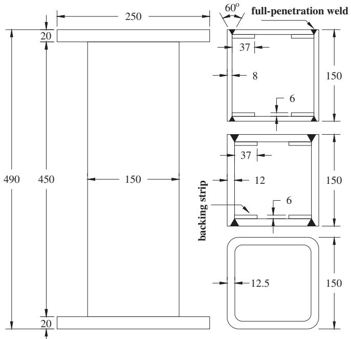  
(a) Single-tube specimens (unit: mm)

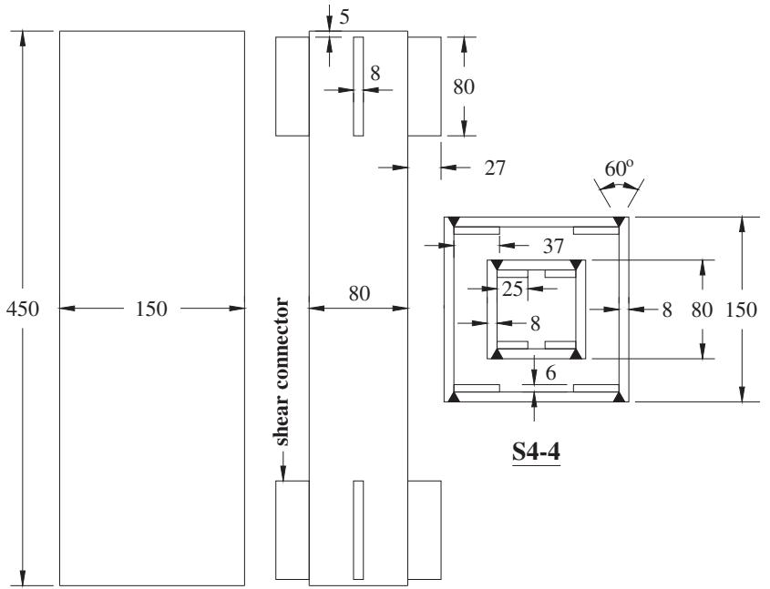  
(b) Double-tube specimens (unit: mm)   
Fig. 3. Dimension details for square single- and double-tube specimen.

CFSTs, compared with the square CFSTs. Additional observation is that the circular CFSTs failed at the larger axial shortenings, indicating better ductility.

The test resistances and the comparisons with the Eurocode predictions are given in Table 6 for the circular specimens. For the 5 hollow tubes, the ratio of test result to prediction ranged from 0.931 to 1.219, with a mean value of 1.066 and a standard deviation value of 0.120. Tubes with Class 1 sections have larger test/prediction ratios. For the specimen with a Class 2 section (HC1), the prediction was overestimated by about $4 \%$ ; whereas for the specimen with a Class 3 section (HC4), the overestimation was around $7 \%$ .

There were two single-tubes and two double-tubes filled with the NSC. Both the predictions without and with confinement effect, $\mathsf { N } _ { \mathrm { p l } , \mathrm { R k } 1 }$ and $ { \mathrm { N } } _ { \mathrm { p l } ,  { \mathrm { R k } } 2 }$ , were provided in Table 6b and c. Without considering confinement effect, all the 4 predictions were underestimated, especially for the specimens C12 and DC5 with Class 1 steel sections which were underestimated by $2 8 \%$ . However, if the confinement effect is considered, the prediction was overestimated by up to $1 3 \%$ for the single-tube specimen C9 with a Class 3 steel section, and by $9 \%$ for the double-tube specimen DC1 with the same Class 3 steel section for the external tube. With regard to this observation, the use of increase of concrete strength due to the confinement effect should be carefully considered when the NSC is

Table 4   
Single-tube short CFST specimens.   

<table><tr><td rowspan="2">Col.</td><td rowspan="2">No.</td><td>L</td><td rowspan="2">Steel sections</td><td colspan="3">Steel</td><td colspan="3">Concrete</td><td rowspan="2">λ</td><td rowspan="2">δ</td></tr><tr><td>(mm)</td><td>fy(MPa)</td><td>fu(MPa)</td><td>Es(GPa)</td><td>Type</td><td>fck(MPa)</td><td>Ec(GPa)</td></tr><tr><td rowspan="5"></td><td>HC1</td><td>250</td><td>CHS114.3 × 3.6</td><td>403</td><td>505</td><td>213</td><td></td><td>-</td><td>-</td><td>0.088</td><td>-</td></tr><tr><td>HC2</td><td>250</td><td>CHS114.3 × 6.3</td><td>428</td><td>519</td><td>209</td><td></td><td>-</td><td>-</td><td>0.094</td><td>-</td></tr><tr><td>HC3</td><td>250</td><td>CHS114.3 × 6.3</td><td>428</td><td>519</td><td>209</td><td></td><td>-</td><td>-</td><td>0.094</td><td>-</td></tr><tr><td>HC4</td><td>600</td><td>CHS219.1 × 5</td><td>380</td><td>511</td><td>205</td><td></td><td>-</td><td>-</td><td>0.109</td><td>-</td></tr><tr><td>HC5</td><td>600</td><td>CHS219.1 × 10</td><td>381</td><td>509</td><td>212</td><td></td><td>-</td><td>-</td><td>0.109</td><td>-</td></tr><tr><td rowspan="2"></td><td>HS1</td><td>450</td><td>SHS150 × 8</td><td>779</td><td>846</td><td>200</td><td></td><td>-</td><td>-</td><td>0.150</td><td>-</td></tr><tr><td>HS2</td><td>450</td><td>SHS150 × 12</td><td>756</td><td>825</td><td>199</td><td></td><td>-</td><td>-</td><td>0.154</td><td>-</td></tr><tr><td rowspan="18"></td><td>C1</td><td>210a</td><td>CHS114.3 × 6.3</td><td>428</td><td>519</td><td>209</td><td>U0</td><td>173.5</td><td>63</td><td>0.110</td><td>0.493</td></tr><tr><td>C2</td><td>210a</td><td>CHS114.3 × 6.3</td><td>428</td><td>519</td><td>209</td><td>U0</td><td>173.5</td><td>63</td><td>0.110</td><td>0.493</td></tr><tr><td>C3</td><td>250</td><td>CHS114.3 × 3.6</td><td>403</td><td>505</td><td>213</td><td>U0</td><td>173.5</td><td>63</td><td>0.142</td><td>0.326</td></tr><tr><td>C4</td><td>250</td><td>CHS114.3 × 3.6</td><td>403</td><td>505</td><td>213</td><td>U0</td><td>173.5</td><td>63</td><td>0.142</td><td>0.326</td></tr><tr><td>C5</td><td>250</td><td>CHS114.3 × 3.6</td><td>403</td><td>505</td><td>213</td><td>US1</td><td>184.2</td><td>63</td><td>0.145</td><td>0.313</td></tr><tr><td>C6</td><td>250</td><td>CHS114.3 × 3.6</td><td>403</td><td>505</td><td>213</td><td>US1</td><td>184.2</td><td>63</td><td>0.145</td><td>0.313</td></tr><tr><td>C7</td><td>250</td><td>CHS114.3 × 6.3</td><td>428</td><td>519</td><td>209</td><td>U0</td><td>173.5</td><td>63</td><td>0.131</td><td>0.493</td></tr><tr><td>C8</td><td>250</td><td>CHS114.3 × 6.3</td><td>428</td><td>519</td><td>209</td><td>U0</td><td>173.5</td><td>63</td><td>0.131</td><td>0.493</td></tr><tr><td>C9</td><td>600</td><td>CHS219.1 × 5</td><td>380</td><td>511</td><td>205</td><td>NSC</td><td>51.6</td><td>28</td><td>0.142</td><td>0.520</td></tr><tr><td>C10</td><td>600</td><td>CHS219.1 × 5</td><td>380</td><td>511</td><td>205</td><td>U0</td><td>185.1</td><td>66</td><td>0.191</td><td>0.232</td></tr><tr><td>C11</td><td>600</td><td>CHS219.1 × 5</td><td>380</td><td>511</td><td>205</td><td>US0.5</td><td>193.3</td><td>67</td><td>0.193</td><td>0.224</td></tr><tr><td>C12</td><td>600</td><td>CHS219.1 × 10</td><td>381</td><td>509</td><td>212</td><td>NSC</td><td>51.6</td><td>28</td><td>0.130</td><td>0.700</td></tr><tr><td>C13</td><td>600</td><td>CHS219.1 × 10</td><td>381</td><td>509</td><td>212</td><td>U0</td><td>185.1</td><td>66</td><td>0.168</td><td>0.394</td></tr><tr><td>C14</td><td>600</td><td>CHS219.1 × 10</td><td>381</td><td>509</td><td>212</td><td>US0.5</td><td>193.3</td><td>67</td><td>0.170</td><td>0.384</td></tr><tr><td>C15</td><td>600</td><td>CHS219.1 × 6.3</td><td>300</td><td>467</td><td>202</td><td>U0</td><td>163</td><td>62</td><td>0.174</td><td>0.258</td></tr><tr><td>C16</td><td>600</td><td>CHS219.1 × 6.3</td><td>300</td><td>467</td><td>202</td><td>UC19/10</td><td>175.4</td><td>58</td><td>0.181</td><td>0.244</td></tr><tr><td>C17</td><td>600</td><td>CHS219.1 × 6.3</td><td>300</td><td>467</td><td>202</td><td>UC38/10</td><td>148.8</td><td>54</td><td>0.172</td><td>0.276</td></tr><tr><td>C18</td><td>600</td><td>CHS219.1 × 6.3</td><td>300</td><td>467</td><td>202</td><td>UC38/20</td><td>174.5</td><td>56</td><td>0.182</td><td>0.245</td></tr><tr><td rowspan="15"></td><td>S1</td><td>450</td><td>SHS150 × 8</td><td>779</td><td>846</td><td>200</td><td>U0</td><td>152.3</td><td>62</td><td>0.173</td><td>0.688</td></tr><tr><td>S2</td><td>450</td><td>SHS150 × 8</td><td>779</td><td>846</td><td>200</td><td>UC19/10</td><td>157.2</td><td>58</td><td>0.175</td><td>0.682</td></tr><tr><td>S3</td><td>450</td><td>SHS150 × 8</td><td>779</td><td>846</td><td>200</td><td>UC38/10</td><td>147</td><td>54</td><td>0.174</td><td>0.696</td></tr><tr><td>S4</td><td>450</td><td>SHS150 × 8</td><td>779</td><td>846</td><td>200</td><td>UC19/20</td><td>164.1</td><td>58</td><td>0.177</td><td>0.672</td></tr><tr><td>S5</td><td>450</td><td>SHS150 × 8</td><td>779</td><td>846</td><td>200</td><td>UC38/20</td><td>148</td><td>56</td><td>0.174</td><td>0.695</td></tr><tr><td>S6</td><td>450</td><td>SHS150 × 12</td><td>756</td><td>825</td><td>200</td><td>U0</td><td>152.3</td><td>62</td><td>0.171</td><td>0.777</td></tr><tr><td>S7</td><td>450</td><td>SHS150 × 12</td><td>756</td><td>825</td><td>200</td><td>UC19/10</td><td>157.2</td><td>58</td><td>0.173</td><td>0.771</td></tr><tr><td>S8</td><td>450</td><td>SHS150 × 12</td><td>756</td><td>825</td><td>200</td><td>UC38/10</td><td>147</td><td>54</td><td>0.172</td><td>0.783</td></tr><tr><td>S9</td><td>450</td><td>SHS150 × 12</td><td>756</td><td>825</td><td>200</td><td>UC19/20</td><td>164.1</td><td>58</td><td>0.174</td><td>0.764</td></tr><tr><td>S10</td><td>450</td><td>SHS150 × 12</td><td>756</td><td>825</td><td>200</td><td>UC38/20</td><td>148</td><td>56</td><td>0.172</td><td>0.782</td></tr><tr><td>S11</td><td>450</td><td>SHS150 × 12.5</td><td>446</td><td>565</td><td>201</td><td>U0</td><td>152.3</td><td>62</td><td>0.149</td><td>0.655</td></tr><tr><td>S12</td><td>450</td><td>SHS150 × 12.5</td><td>446</td><td>565</td><td>201</td><td>UC19/10</td><td>157.2</td><td>58</td><td>0.151</td><td>0.648</td></tr><tr><td>S13</td><td>450</td><td>SHS150 × 12.5</td><td>446</td><td>565</td><td>201</td><td>UC38/10</td><td>147</td><td>54</td><td>0.150</td><td>0.663</td></tr><tr><td>S14</td><td>450</td><td>SHS150 × 12.5</td><td>446</td><td>565</td><td>201</td><td>UC19/20</td><td>164.1</td><td>58</td><td>0.153</td><td>0.638</td></tr><tr><td>S15</td><td>450</td><td>SHS150 × 12.5</td><td>446</td><td>565</td><td>201</td><td>UC38/20</td><td>148</td><td>56</td><td>0.150</td><td>0.662</td></tr></table>

a Loaded on concrete only which was $2 1 0 \mathrm { m m }$ in height, the tubes were $2 5 0 \mathrm { m m }$ in height; ‘‘L” specimen height; ‘‘k” non-dimensional slenderness ratio; ‘‘d” steel contribution ratio; $" f _ { \mathrm { y } } "$ steel yield strength; $\ " f _ { \mathrm { u } } \ " $ steel ultimate strength; $" f _ { \mathrm { c k } } \ " { }$ concrete cylinder compressive strength; ‘ $\because \mathit { E _ { s } } ^ { \prime \prime }$ and $\because E _ { \mathrm { c } } ^ { ^ { \prime } \prime }$ steel and concrete elastic modulus.

Table 5   
Double-tube short CFST specimens.   

<table><tr><td rowspan="3">Col.</td><td rowspan="3">No.</td><td rowspan="3">L (mm)</td><td rowspan="3">Steel sections</td><td colspan="6">Steel</td><td colspan="6">Concrete</td><td rowspan="3">λ</td><td rowspan="3">δ</td></tr><tr><td colspan="3">Outer</td><td colspan="3">Inner</td><td colspan="3">Outer</td><td colspan="3">Inner</td></tr><tr><td>fy</td><td>fu</td><td>Es</td><td>fy</td><td>fu</td><td>Es</td><td>Type</td><td>fck</td><td>Ec</td><td>Type</td><td>fck</td><td>Ec</td></tr><tr><td rowspan="16"></td><td>DC1</td><td>600</td><td>CHS219.1 × 5/114.3 × 3.6</td><td>380</td><td>511</td><td>205</td><td>403</td><td>505</td><td>213</td><td>NSC</td><td>51.6</td><td>28</td><td>NSC</td><td>51.6</td><td>28</td><td>0.147</td><td>0.610</td></tr><tr><td>DC2</td><td>600</td><td>CHS219.1 × 5/114.3 × 3.6</td><td>380</td><td>511</td><td>205</td><td>403</td><td>505</td><td>213</td><td>U0</td><td>175</td><td>66</td><td>U0</td><td>175</td><td>66</td><td>0.186</td><td>0.316</td></tr><tr><td>DC3</td><td>600</td><td>CHS219.1 × 5/114.3 × 3.6</td><td>380</td><td>511</td><td>205</td><td>403</td><td>505</td><td>213</td><td>NSC</td><td>51.6</td><td>28</td><td>U0</td><td>175</td><td>66</td><td>0.167</td><td>0.487</td></tr><tr><td>DC4</td><td>600</td><td>CHS219.1 × 5/114.3 × 3.6</td><td>380</td><td>511</td><td>205</td><td>403</td><td>505</td><td>213</td><td>NSC</td><td>51.6</td><td>28</td><td>US0.5</td><td>193.3</td><td>67</td><td>0.169</td><td>0.473</td></tr><tr><td>DC5</td><td>600</td><td>CHS219.1 × 10/114.3 × 6.3</td><td>381</td><td>509</td><td>212</td><td>428</td><td>519</td><td>209</td><td>NSC</td><td>51.6</td><td>28</td><td>NSC</td><td>51.6</td><td>28</td><td>0.137</td><td>0.774</td></tr><tr><td>DC6</td><td>600</td><td>CHS219.1 × 10/114.3 × 6.3</td><td>381</td><td>509</td><td>212</td><td>428</td><td>519</td><td>209</td><td>U0</td><td>175</td><td>66</td><td>U0</td><td>175</td><td>66</td><td>0.166</td><td>0.503</td></tr><tr><td>DC7</td><td>600</td><td>CHS219.1 × 10/114.3 × 6.3</td><td>381</td><td>509</td><td>212</td><td>428</td><td>519</td><td>209</td><td>NSC</td><td>51.6</td><td>28</td><td>U0</td><td>185.1</td><td>66</td><td>0.151</td><td>0.665</td></tr><tr><td>DC8</td><td>600</td><td>CHS219.1 × 10/114.3 × 6.3</td><td>381</td><td>509</td><td>212</td><td>428</td><td>519</td><td>209</td><td>NSC</td><td>51.6</td><td>28</td><td>US0.5</td><td>193.3</td><td>67</td><td>0.151</td><td>0.659</td></tr><tr><td>DC9</td><td>600</td><td>CHS219.1 × 6.3/114.3 × 6.3</td><td>300</td><td>467</td><td>202</td><td>428</td><td>519</td><td>209</td><td>U0</td><td>163</td><td>62</td><td>U0</td><td>163</td><td>62</td><td>0.175</td><td>0.390</td></tr><tr><td>DC10</td><td>600</td><td>CHS219.1 × 6.3/114.3 × 6.3</td><td>300</td><td>467</td><td>202</td><td>428</td><td>519</td><td>209</td><td>UC19/10</td><td>175.4</td><td>58</td><td>UC19/10</td><td>175.4</td><td>58</td><td>0.182</td><td>0.373</td></tr><tr><td>DC11</td><td>600</td><td>CHS219.1 × 6.3/114.3 × 6.3</td><td>300</td><td>467</td><td>202</td><td>428</td><td>519</td><td>209</td><td>UC38/10</td><td>148.8</td><td>54</td><td>UC38/10</td><td>148.8</td><td>54</td><td>0.174</td><td>0.412</td></tr><tr><td>DC12</td><td>600</td><td>CHS219.1 × 6.3/114.3 × 6.3</td><td>300</td><td>467</td><td>202</td><td>428</td><td>519</td><td>209</td><td>UC38/20</td><td>174.5</td><td>56</td><td>UC38/20</td><td>174.5</td><td>56</td><td>0.183</td><td>0.374</td></tr><tr><td>DS1</td><td>450</td><td>SHS150 × 8/80 × 8</td><td>779</td><td>846</td><td>200</td><td>779</td><td>846</td><td>200</td><td>U0</td><td>152.3</td><td>62</td><td>U0</td><td>152.3</td><td>62</td><td>0.185</td><td>0.802</td></tr><tr><td>DS2</td><td>450</td><td>SHS150 × 8/80 × 8</td><td>779</td><td>846</td><td>200</td><td>779</td><td>846</td><td>200</td><td>UC19/10</td><td>157.2</td><td>58</td><td>UC19/10</td><td>157.2</td><td>58</td><td>0.187</td><td>0.797</td></tr><tr><td>DS3</td><td>450</td><td>SHS150 × 8/80 × 8</td><td>779</td><td>846</td><td>200</td><td>779</td><td>846</td><td>200</td><td>UC38/10</td><td>147</td><td>54</td><td>UC38/10</td><td>147</td><td>54</td><td>0.186</td><td>0.807</td></tr><tr><td>DS4</td><td>450</td><td>SHS150 × 8/80 × 8</td><td>779</td><td>846</td><td>200</td><td>779</td><td>846</td><td>200</td><td>UC19/20</td><td>164.1</td><td>58</td><td>UC19/20</td><td>164.1</td><td>58</td><td>0.188</td><td>0.790</td></tr></table>

Notes (applicable to Table 4):   
(1) 6 mm-thick mild backing plate was used in welded sections: $f _ { \mathrm { y } } = 3 2 5$ MPa and $E _ { s } = 2 0 1$ GPa;   
(2) ‘‘k” non-dimensional slenderness ratio; ‘‘d” steel contribution ratio; $" f _ { \mathrm { y } } "$ steel yield strength; $" f _ { \mathrm { u } } "$ steel ultimate strength; ‘‘fck” concrete cylinder compressive strength; ‘‘Es” and $" E _ { \mathrm { c } } "$ steel and concrete elastic modulus.

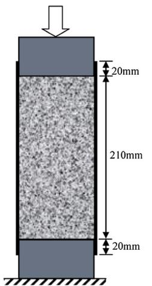

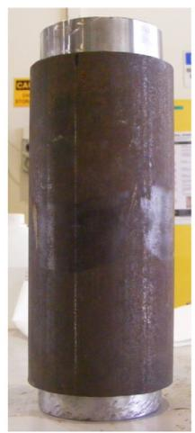  
(a) Setup for CFSTs loaded on concrete only

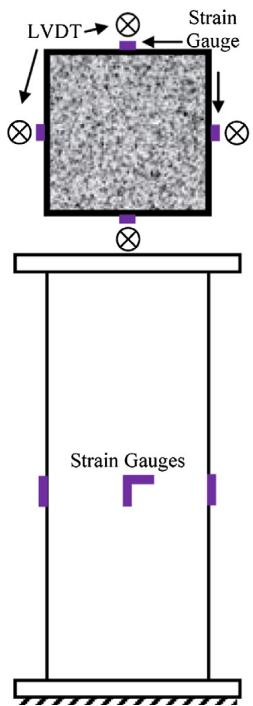

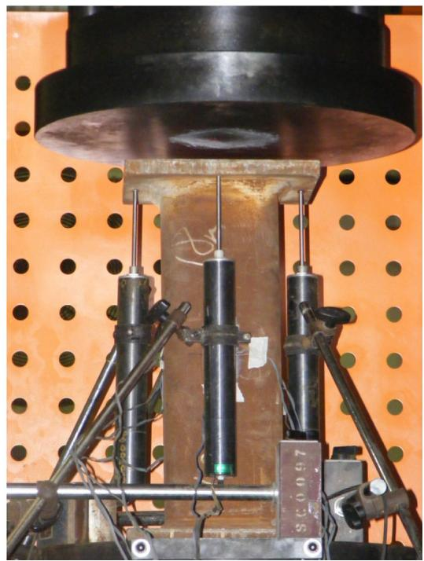  
(b) Setup and instrumentation for CFSTs loaded on both the steel tube and concrete   
Fig. 4. Test setup and instrumentations.

infilled in Class 3 steel tubes. Conservatively, the confinement effect could be ignored.

The comparisons for all the 16 UHSC filled single-tubes are shown in Table 6d. Without considering the confinement effect, the test/prediction ratio ranged from 1.027 to 1.233 with a mean value of 1.104 and a standard deviation value of 0.055; whereas it was in the range of 0.949 to 1.064 with a mean value of 1.004 and a standard deviation value of 0.036, if the confinement effect is considered. Without confinement, all the predictions were underestimated with an average safety margin of more than $1 0 \%$ . However, if the confinement effect is considered, half specimens were overestimated and the safety margin almost diminished on average (in other words, the average value close to 1.0). According the abovementioned derivation in Eq. (13), the level of confinement decreases with the increase of concrete strength. Set against

this background, the comparisons herein indicated that significant confinement effect might not have been developed when the specimens failed. Considering this, the Eurocode 4 limitation on concrete strength could be conservatively extended to the UHSC for the circular single-tube short CFSTs, subject to ignoring the confinement effect.

For all the 10 UHSC filled double-tubes, the comparisons are given in Table 6e. It can be seen that the ratio of test result to prediction ranged from 0.939 to 1.181 with a mean value of 1.090 and a standard deviation value of 0.076, if the confinement effect is not considered; and it was in the range of 0.884 to 1.072 with a mean value of 1.005 and a standard deviation value of 0.060, if the confinement effect is considered. Without confinement effect, only one specimen was overestimated approximately by $6 \%$ and all the other specimens were underestimated by up to $1 8 \%$ . However,

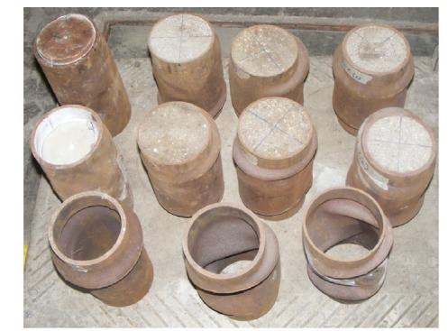

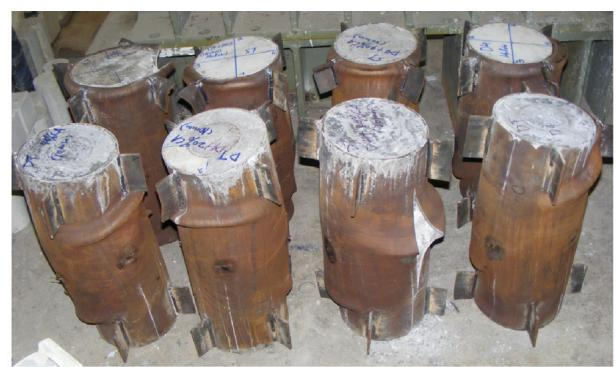

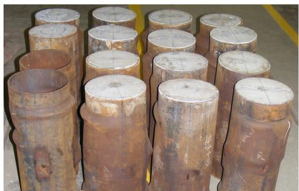

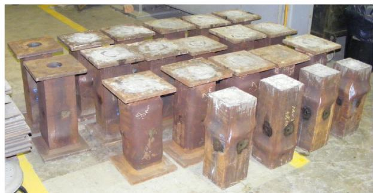  
Fig. 5. The 56 CFST specimens after testing.

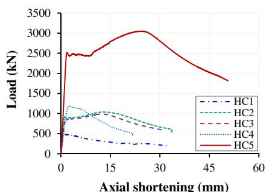  
(a) Circular

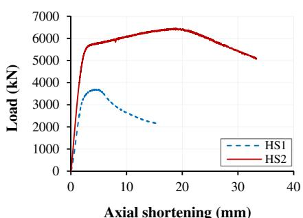  
(b) Square   
Fig. 6. Load-shortening curves of hollow tubes.

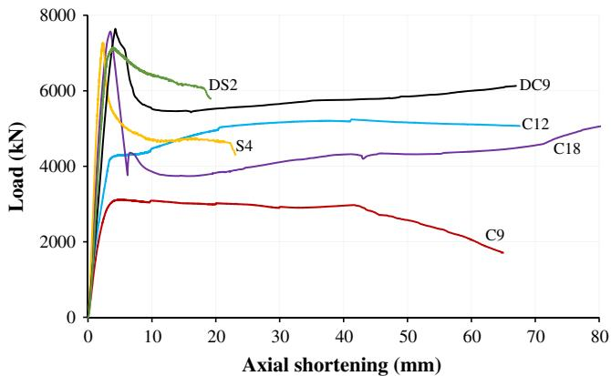  
Fig. 7. Typical load-shortening curves of CFST specimens.

if the confinement effect is considered, 4 specimens were overestimated by up to $1 2 \%$ and the safety margin on average almost diminished (the average value close to 1.0). Therefore, for conservative design purpose, the Eurocode 4 limitation on concrete strength could also be extended to the UHSC for the circular

double-tube short CFSTs without considering the confinement effect.

For the square specimens, the test results and comparisons with the Eurocode predictions are shown in Table 7. It should be noted that the confinement effect is not taken into account for the square CFSTs according to Eurocode 4 [2]. For the two welded hollow tubes with Class 1 sections, the axial resistance of HS1 with a $5 \mathrm { m m }$ wall thickness was overestimated by $3 . 5 \%$ ; whereas the axial resistance of HS2 with a $1 2 \mathrm { m m }$ wall thickness was approximately underestimated by $2 2 \%$ . This indicated a premature local buckling on HS1 and thus the classification of high tensile steel plates should be carefully examined.

The comparisons for the 5 UHSC filled single-tubes with mild steel sections are shown in Table 7b. The test/prediction ratio ranged from 1.089 to 1.189 with an average value of 1.139 and a standard deviation of 0.039. All the resistance were underestimated with an average safety margin of $1 3 . 9 \%$ . Therefore, the Eurocode 4 limitation on concrete strength could be extended to the UHSC for square single-tube short CFSTs with mild steel sections.

10 UHSC filled single-tubes with HTS sections were tested and the comparisons are shown in Table 7c. The ratio of test result to prediction was in the range of 1.017 to 1.186 with an average value of 1.099 and a standard deviation of 0.055. All the axial resistance

Table 6 Test loads and comparisons with Eurocode predictions – Circular.   

<table><tr><td>No.</td><td>Ntest(kN)</td><td>Npl,Rk1(kN)</td><td>Npl,Rk2(kN)</td><td>Ntest/Npl,Rk1</td><td>Avg.</td><td>St.Dev.</td><td>Ntest/Npl,Rk2</td><td>Avg.</td><td>St.Dev.</td></tr><tr><td colspan="10">(a) Hollow mild steel tubes (5 data)a</td></tr><tr><td>HC1</td><td>486</td><td>505</td><td>-</td><td>0.963</td><td>1.066</td><td>0.120</td><td>-</td><td>-</td><td>-</td></tr><tr><td>HC2</td><td>1039</td><td>915</td><td>-</td><td>1.136</td><td></td><td></td><td>-</td><td></td><td></td></tr><tr><td>HC3</td><td>990</td><td>915</td><td>-</td><td>1.082</td><td></td><td></td><td>-</td><td></td><td></td></tr><tr><td>HC4</td><td>1190</td><td>1278</td><td>-</td><td>0.931</td><td></td><td></td><td>-</td><td></td><td></td></tr><tr><td>HC5</td><td>3050</td><td>2503</td><td>-</td><td>1.219</td><td></td><td></td><td>-</td><td></td><td></td></tr><tr><td colspan="10">(b) NSC filled mild steel single-tubes (2 data)</td></tr><tr><td>C9</td><td>3118</td><td>3050</td><td>3601</td><td>1.022</td><td>1.149</td><td>0.179</td><td>0.866</td><td>0.942</td><td>0.107</td></tr><tr><td>C12</td><td>5241</td><td>4109</td><td>5155</td><td>1.275</td><td></td><td></td><td>1.017</td><td></td><td></td></tr><tr><td colspan="10">(c) NSC filled mild steel double-tubes (2 data)</td></tr><tr><td>DC1</td><td>3626</td><td>3490</td><td>3999</td><td>1.039</td><td>1.161</td><td>0.172</td><td>0.907</td><td>0.999</td><td>0.129</td></tr><tr><td>DC5</td><td>6300</td><td>4914</td><td>5781</td><td>1.282</td><td></td><td></td><td>1.090</td><td></td><td></td></tr><tr><td colspan="10">(d) UHSC filled mild steel single-tubes (16 data)</td></tr><tr><td>C1</td><td>2866</td><td>2324</td><td>2733</td><td>1.233</td><td>1.104</td><td>0.055</td><td>1.049</td><td>1.004</td><td>0.036</td></tr><tr><td>C2</td><td>2595</td><td>2324</td><td>2733</td><td>1.117</td><td></td><td></td><td>0.949</td><td></td><td></td></tr><tr><td>C3</td><td>2422</td><td>2068</td><td>2277</td><td>1.172</td><td></td><td></td><td>1.064</td><td></td><td></td></tr><tr><td>C4</td><td>2340</td><td>2068</td><td>2277</td><td>1.132</td><td></td><td></td><td>1.028</td><td></td><td></td></tr><tr><td>C5</td><td>2497</td><td>2164</td><td>2369</td><td>1.154</td><td></td><td></td><td>1.054</td><td></td><td></td></tr><tr><td>C6</td><td>2314</td><td>2164</td><td>2369</td><td>1.069</td><td></td><td></td><td>0.977</td><td></td><td></td></tr><tr><td>C7</td><td>2610</td><td>2324</td><td>2685</td><td>1.123</td><td></td><td></td><td>0.972</td><td></td><td></td></tr><tr><td>C8</td><td>2633</td><td>2324</td><td>2685</td><td>1.133</td><td></td><td></td><td>0.980</td><td></td><td></td></tr><tr><td>C10</td><td>7837</td><td>7634</td><td>8030</td><td>1.027</td><td></td><td></td><td>0.976</td><td></td><td></td></tr><tr><td>C11</td><td>8664</td><td>7916</td><td>8303</td><td>1.094</td><td></td><td></td><td>1.043</td><td></td><td></td></tr><tr><td>C13</td><td>9085</td><td>8266</td><td>9080</td><td>1.099</td><td></td><td></td><td>1.001</td><td></td><td></td></tr><tr><td>C14</td><td>9187</td><td>8521</td><td>9323</td><td>1.078</td><td></td><td></td><td>0.985</td><td></td><td></td></tr><tr><td>C15</td><td>6915</td><td>6723</td><td>7152</td><td>1.029</td><td></td><td></td><td>0.967</td><td></td><td></td></tr><tr><td>C16</td><td>7407</td><td>7138</td><td>7545</td><td>1.038</td><td></td><td></td><td>0.982</td><td></td><td></td></tr><tr><td>C17</td><td>6838</td><td>6247</td><td>6682</td><td>1.095</td><td></td><td></td><td>1.023</td><td></td><td></td></tr><tr><td>C18</td><td>7569</td><td>7108</td><td>7512</td><td>1.065</td><td></td><td></td><td>1.008</td><td></td><td></td></tr><tr><td colspan="10">(e) UHSC filled mild steel double-tubes (10 data)</td></tr><tr><td>DC2</td><td>8529</td><td>7573</td><td>7955</td><td>1.126</td><td>1.090</td><td>0.076</td><td>1.072</td><td>1.005</td><td>0.060</td></tr><tr><td>DC3</td><td>4968</td><td>4602</td><td>5045</td><td>1.080</td><td></td><td></td><td>0.985</td><td></td><td></td></tr><tr><td>DC4</td><td>5239</td><td>4766</td><td>5200</td><td>1.099</td><td></td><td></td><td>1.008</td><td></td><td></td></tr><tr><td>DC6</td><td>9817</td><td>8492</td><td>9194</td><td>1.156</td><td></td><td></td><td>1.068</td><td></td><td></td></tr><tr><td>DC7</td><td>7022</td><td>5998</td><td>6787</td><td>1.171</td><td></td><td></td><td>1.035</td><td></td><td></td></tr><tr><td>DC8</td><td>7160</td><td>6065</td><td>6849</td><td>1.181</td><td></td><td></td><td>1.045</td><td></td><td></td></tr><tr><td>DC9</td><td>7640</td><td>7289</td><td>7791</td><td>1.048</td><td></td><td></td><td>0.981</td><td></td><td></td></tr><tr><td>DC10</td><td>7209</td><td>7678</td><td>8154</td><td>0.939</td><td></td><td></td><td>0.884</td><td></td><td></td></tr><tr><td>DC11</td><td>6882</td><td>6844</td><td>7350</td><td>1.006</td><td></td><td></td><td>0.936</td><td></td><td></td></tr><tr><td>DC12</td><td>8375</td><td>7650</td><td>8123</td><td>1.095</td><td></td><td></td><td>1.031</td><td></td><td></td></tr></table>

a The resistance $N _ { \mathrm { p l , R k 1 } }$ was calculated based on Eq. (1) without concrete.

were underestimated with an average safety margin of $1 0 \%$ . Similarly, the Eurocode 4 limitations on materials could be extended to both the UHSC and HTS for square single-tube CFSTs. It is worth noting that the average $N _ { \mathrm { t e s t } } / N _ { \mathrm { p l } , \mathrm { R k } 1 }$ ratio of specimens S1–S5 with a section size of $1 5 0 \times 1 5 0 \times 8 \mathrm { m m }$ is 1.057. It is lower than that of specimens S6–S10 with a section size of $1 5 0 \times 1 5 0 \times 1 2 \mathrm { m m }$ which is 1.142. As the steel/concrete strengths and steel section classification are the same, the reason may be attributed to the residual stresses involved in the full penetration butt welds which induced severer imperfection for the thinner tubes. Unfortunately, due to the limited test data in the available literature, this phenomenon has not been found in the other researches.

The test results of the 4 UHSC filled double-tubes with HTS sections are shown in Table 7d. It can be observed that the ratio of test result to prediction ranged from 0.885 to 0.968 with an average value of 0.908 and a standard deviation value of 0.040. All the predictions were overestimated by $9 . 2 \%$ on average. This is different from the observations for the other types of CFSTs abovementioned. It was again doubted if there were high residual stresses involved in welding the double tubes and the connectors between tubes. According to the research of Chiew et al. [22] on the residual stress of RQT 701 steel, the residual stress to yield strength ratio could achieve 0.5 at section corner if it is welded at ambient temperature without pre-heating. In addition, the thickness of the outer and inner tubes is $8 \mathrm { m m }$ which might have suffered severer

imperfections as discussed above. Thus, the average $N _ { \mathrm { t e s t } } / N _ { \mathrm { p l } , \mathrm { R k } 1 }$ is lower when compared with single-tube CFSTs. Nevertheless, the attribution to the residual stress could not be confirmed, in such cases, care should be taken to determine the axial resistance of the double-tube short CFSTs using the UHSC and HTS. A safety factor of 0.8 may be conservatively applied to the resistance in current design. Future work may focus on the residual stress of HTS under different plate thickness, and further enrich the test data on double-tube CFSTs with the HTS.

# 6. Discussions on test results

# 6.1. Effect by loading on core concrete

The load-shortening curves of the specimens (C1 and C2) loaded on the core concrete only are shown in Fig. 8. Owing to the existence of interfacial bonding, the steel tube and the core concrete resisted the axial load together at the initial loading stage. The interfacial bonding was subsequently broken, and then the load was mainly taken by the core concrete. As a result, the axial stiffness was reduced where the slopes of the load-displacement curves became smaller. Significant confinement and friction forces were then developed due to the concrete’s faster expanding. Consequently, the axial load was transferred from the core concrete to the steel tube, and the axial stiffness again increased. The steel

Table 7 Test loads and comparisons with Eurocode predictions – Square.   

<table><tr><td>No.</td><td>Ntest(kN)</td><td>Npl,Rk1(kN)</td><td>Ntest/Npl,Rk1</td><td>Avg.</td><td>St.Dev.</td></tr><tr><td colspan="6">(a) Hollow HTS tubes (2 data)a</td></tr><tr><td>HS1</td><td>3695</td><td>3828</td><td>0.965</td><td>1.092</td><td>0.180</td></tr><tr><td>HS2</td><td>6456</td><td>5296</td><td>1.219</td><td></td><td></td></tr><tr><td colspan="6">(b) UHSC filled mild steel single-tubes (5 data)</td></tr><tr><td>S11</td><td>5953</td><td>5351</td><td>1.113</td><td>1.139</td><td>0.039</td></tr><tr><td>S12</td><td>5911</td><td>5427</td><td>1.089</td><td></td><td></td></tr><tr><td>S13</td><td>6039</td><td>5269</td><td>1.146</td><td></td><td></td></tr><tr><td>S14</td><td>6409</td><td>5534</td><td>1.158</td><td></td><td></td></tr><tr><td>S15</td><td>6285</td><td>5284</td><td>1.189</td><td></td><td></td></tr><tr><td colspan="6">(c) UHSC filled HTS single-tubes (10 data)</td></tr><tr><td>S1</td><td>6536</td><td>6428</td><td>1.017</td><td>1.099</td><td>0.055</td></tr><tr><td>S2</td><td>6715</td><td>6511</td><td>1.031</td><td></td><td></td></tr><tr><td>S3</td><td>6616</td><td>6337</td><td>1.044</td><td></td><td></td></tr><tr><td>S4</td><td>7276</td><td>6629</td><td>1.097</td><td></td><td></td></tr><tr><td>S5</td><td>6974</td><td>6354</td><td>1.097</td><td></td><td></td></tr><tr><td>S6</td><td>8585</td><td>7579</td><td>1.133</td><td></td><td></td></tr><tr><td>S7</td><td>8452</td><td>7652</td><td>1.105</td><td></td><td></td></tr><tr><td>S8</td><td>8687</td><td>7500</td><td>1.158</td><td></td><td></td></tr><tr><td>S9</td><td>8730</td><td>7756</td><td>1.126</td><td></td><td></td></tr><tr><td>S10</td><td>8912</td><td>7515</td><td>1.186</td><td></td><td></td></tr><tr><td colspan="6">(d) UHSC filled HTS double-tubes (4 data)</td></tr><tr><td>DS1</td><td>7058</td><td>7975</td><td>0.885</td><td>0.908</td><td>0.040</td></tr><tr><td>DS2</td><td>7143</td><td>8045</td><td>0.888</td><td></td><td></td></tr><tr><td>DS3</td><td>7032</td><td>7900</td><td>0.890</td><td></td><td></td></tr><tr><td>DS4</td><td>7880</td><td>8143</td><td>0.968</td><td></td><td></td></tr></table>

a The resistance $N _ { \mathrm { p l , R k 1 } }$ was calculated based on Eq. (1) without concrete.

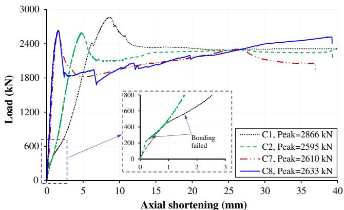  
Fig. 8. Effect by loading on concrete only.

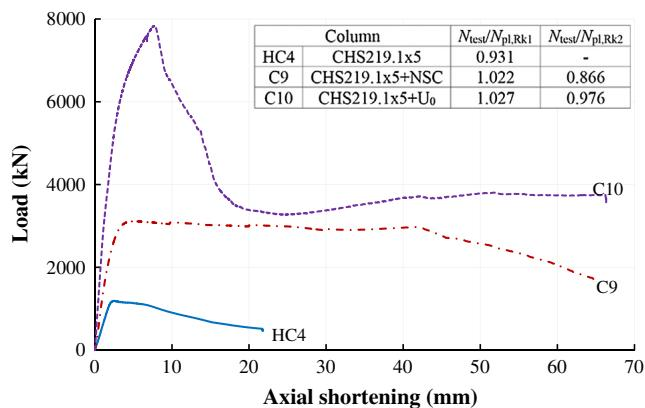  
Fig. 9. Effect of local buckling.

tube and the core concrete were believed to work together to take the load finally until the specimen failed.

It is worth noting in Fig. 8 that a larger interfacial slip was observed in C1 (smaller slope after debonding), thus higher confinement stresses were produced. As a result, the compressive strength of the UHSC in C1 should be increased more than that in C2. This explains why the ultimate resistance of C1 was higher than that of C2, although they were identical specimens. The interfacial slips, in other words, the bonding resistance were different between C1 and C2, this could be caused by different surface conditions, for instance, the rust conditions might be different. In practice, there are CFST columns with discontinuous steel tubes at the beam-column connections (floor beams are continuous), thus the beam reaction forces are exactly transferred to the core concrete only. Under such circumstances, proper measures could be taken to decrease the bonding resistance and then to increase the ultimate resistance of the CFST columns. This is favourable for the design at ultimate limit state. However, there is an adverse effect as the axial stiffness will be reduced, this is unfavourable for the design at serviceability limit state. Hence the bonding resistance

is a rather critical parameter influencing the performance of CFST columns loaded on the core concrete only. There will be always a trade-off between the ultimate limit design and the serviceability limit design.

The bonding resistance seemed to be not critical for the specimens C7 and C8 which were similar specimens to C1 and C2, except they were loaded on the full cross-section. The steel tubes and the core concrete in C7 and C8 were believed to separate at the initial stage of loading as the Poisson’s ratio of the steel is larger than that of concrete. The gaps closed at later stage when the concrete Poisson’s ratio became larger than that of steel. The axial stiffness of C7 and C8 were larger than those of C1 and C2, this is due to the fact that there was not very significant interfacial slips in C7 and C8. The axial capacity of C1 was higher than those of C7 and C8. This phenomenon could be explained by Eq. (8). Rearranging Eq. (8) and considering $A _ { s } / A _ { c } = 4 t / d _ { c }$ for thin-walled CFSTs, we have:

$$
\frac {p}{f _ {c k}} = \frac {1}{2} \frac {A _ {s} \sigma_ {2}}{A _ {c} f _ {c k}} \tag {15}
$$

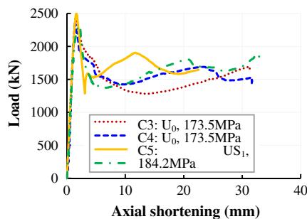  
(a) CHS114.3x3.6

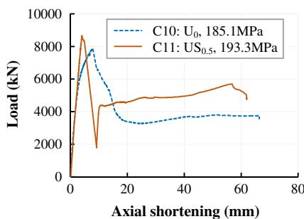  
(b) CHS219.1x5

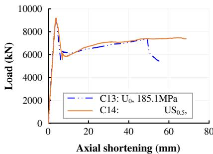  
(c) CHS219.1x10

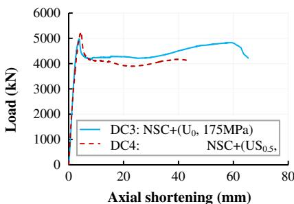  
(d) CHS219.1x5/CHS114.3x3.6

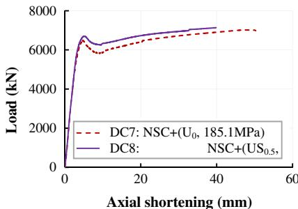  
(e) CHS219.1x10/CHS114.3x3.6

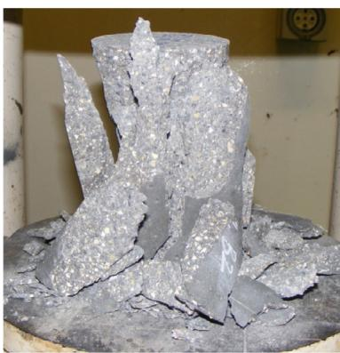  
Fig. 10. Effect of steel fibers.   
(a) UHSC without CA

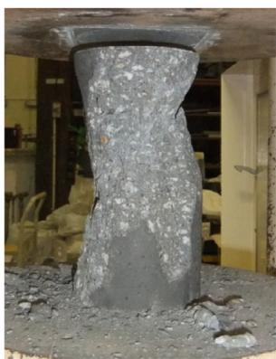  
(b) UHSC with 19%CA

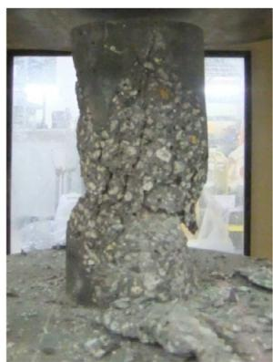  
(c) UHSC with 38%CA   
Fig. 11. Failure modes of UHSC mixed with coarse aggregates.

It can be seen than the level of confinement is in direct proportion to the hoop stress $\sigma _ { 2 }$ . The hoop stress can reach the yield strength of steel $f _ { \mathrm { y } }$ for the steel tube of C1 loaded on core concrete only, but could not for C7 and C8 loaded on entire section due to the existence of longitudinal stress $\sigma _ { 1 }$ . Thus the level of confinement is higher in specimen C1, as a result, higher axial capacity. This phenomenon was also observed by Orito et al. where the ratio of axial capacity of specimens loaded on core concrete and loaded on entire

section was in the range of 1.06–1.13 (tube size CHS $1 1 4 . 3 \times 5 . 2 \mathrm { m m }$ ) [23].

# 6.2. Effect of local buckling

Theoretically, Class 3 sections can develop plastic resistance under the perfect axial loading with uniform stress distributions on the cross-sections. In fact, the Class 3 sections could not develop

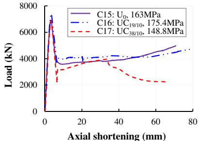  
(a) CHS219.1x6.3

  
(b) CHS219.1x6.3/CHS114.3x3.6

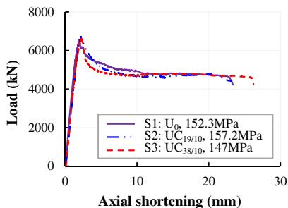  
(c) SHS150x8 (1)

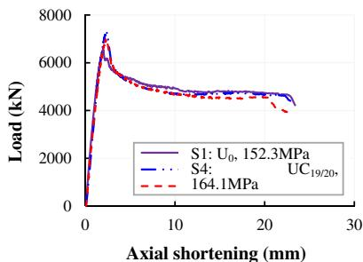  
(d) SHS150x8 (2)

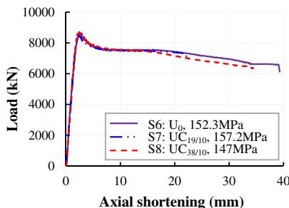  
(e) SHS150x10 (1)

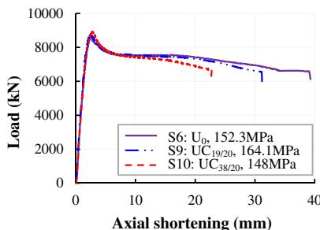  
(f) SHS150x10 (2)

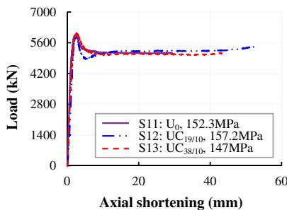  
(g) SHS150x12.5 (1)

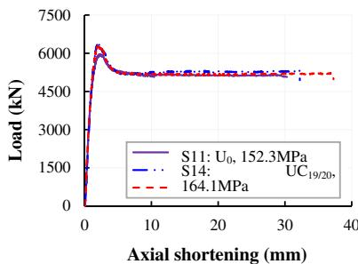  
(h) SHS150x12.5 (2)

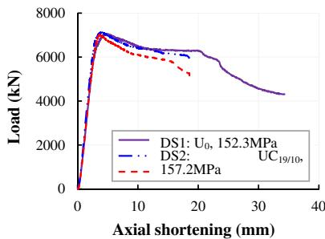  
(i) SHS150x8/SHS80x8   
Fig. 12. Effect of coarse aggregate proportion.

the plastic resistance due to the geometric imperfections and then the resulted bending moments. Non-uniform stress distributions are involved, and the sections are susceptible to plastic local buckling wherever the yielding occurs. Fig. 9 shows the curve of the axial shortening versus load of the hollow tube HC4 with a Class 3 section. As mentioned above, there was local buckling before the load reached the plastic resistance. Thus the value of $N _ { \mathrm { t e s t } } / N _ { \mathrm { p l } , }$ Rk1 was smaller than 1.0. However the plastic resistance were reached when the said Class 3 section was infilled by the NSC (C9) or the UHSC (C10). The values of $N _ { \mathrm { t e s t } } / N _ { \mathrm { p l } , \mathrm { R k } 1 }$ were greater than 1.0 for C9 and C10. The reason is due to the fact that the infilled concrete delayed the local buckling, which is reflected by the axial shortening at peak loads. The axial shortening at peak of C10 was the largest, followed by that of C9, and that of HC4 was the smallest. Meanwhile, it could be concluded that the higher the infilled concrete strength is, the more the local buckling is delayed. However, the confinement actions provided by the Class 3 sections should be ignored as can be seen that the values of $N _ { \mathrm { t e s t } } / N _ { \mathrm { p l } , \mathrm { R k } 2 }$ were smaller than 1.0 $\mathrm { \Delta } N _ { \mathrm { p l } , \mathrm { R k } 2 }$ is the plastic resistance considering confinement effect).

# 6.3. Effect of steel fibers

The addition of steel fibers into the plain UHSC were expected to increase the concrete strength, and then the ultimate resistance of the CFSTs. This is because the concrete under axial compression tends to be sheared along $4 5 ~ ^ { \circ } \mathrm { C }$ from the horizontal plane. With the addition of steel fibers, the shear strength of concrete is improved. This is similar to the stirrups to increase the shear resistance of RC beams. The comparisons between the CFSTs with and without steel fibers are shown in Fig. 10. Based on above mechanical explanation, the ultimate resistance was generally increased. However, for the CFSTs with Class 2 $( \mathrm { C H S } 1 1 4 . 3 \times 3 . 6 )$ or Class 3 $( \mathsf { C H S 2 1 9 . 1 \times 5 } )$ ) sections, the ductility, in terms of the slopes of the dropping parts of the load-shortening curves, was impaired when compared with the CFSTs with the plain UHSC. In cases where the Class 2 and Class 3 sections were then combined to form double-tube CFSTs (DC3 and DC4), the said ductility of the CFSTs using steel fiber reinforced UHSC was comparable to that without steel fibers. The comparable ductility could be similarly achieved by using Class 1 sections $( \mathsf { C H S 2 1 9 . 1 \times 1 0 } )$ as shown in Fig. 10c for C13 and C14. It is worth noting that both the resistance and ductility could be improved when both the Class 1 sections and doubletube cross-sections were adopted (refer to DC7 and DC8 in Fig. 10e).

# 6.4. Effect of coarse aggregate proportion

As shown in Fig. 11 for the material tests, the UHSC cylinders without adding coarse aggregates were crushed into pieces and very loud crushing noise was heard when the maximum loads were reached. However, the presence of ordinary coarse aggregates seemed to have some marginal improvement on the brittleness of the UHSC. The noise resulted from the failure was not as loud as the plain UHSC.

Tables 4 and 5 show that the compressive strength of the UHSC was increased by adding $1 9 \%$ coarse aggregates, however it was reduced and lower than that of plain UHSC as the percentage of coarse aggregates further increased to $3 8 \%$ . This trend was generally followed by the ultimate resistance of the CFSTs as shown in Fig. 12. For the CFSTs with low steel contribution ratios (in other words, high concrete contribution ratios) given in Table 4 and Fig. 12a, the drops of resistance were steeper than those of the others in Fig. 12b–(i). Overall, the addition of coarse aggregates did not significantly improve both the ultimate resistance and the ductility in terms of the dropping slopes of the loadshortening curves. The main reason should be attributed to the fact

  
Fig. 13. The failure of ordinary coarse aggregates in UHSC.

that the ordinary granite coarse aggregate used in this study was not strong enough to prevent the initiating and propagating of cracks in the UHSC.

It is well known that cracks normally propagate along the interfaces between mortar and aggregates for normal strength concrete at failure. For high strength concrete, however, the interfacial zones have been shown to be denser and stronger than those in normal strength concrete, often preventing the formation of cracks at interfaces and facilitating stress transfer to weaker aggregates, failure of high strength concrete is thus characterized by cracks propagating through the aggregates [24]. Similarly, for UHSC, the interface zones are further denser and stronger. The ordinary granite coarse aggregates are weak links and thus the cracks propagated through the aggregates as shown in Fig. 13. In such cases, high strength coarse aggregates are recommended to be used in the UHSC.

# 6.5. Effect of diameter of coarse aggregate

Tables 4 and 5 show that the larger the diameter of the coarse aggregate was, the higher the compressive strength of the UHSC would be. This trend was followed by the ultimate resistance of the CFSTs as shown in Fig. 14. The increase of ultimate resistance of the double-tube CFSTs as given in Fig. 14b and i was in the range of $1 0 . 3 { - } 2 1 . 7 \%$ , this is higher than that of the single-tube CFSTs which ranged from $2 . 6 { - } 1 0 . 7 \%$ . Thus the double tubes might provide higher confinements to the UHSC reinforced with larger size coarse aggregates. Similarly, the ductility of the CFST short columns in terms of the dropping slope was not significantly influenced by the diameter of the coarse aggregates.

# 6.6. Comparisons between Single-Tube and Double-Tube CFSTs

Fig. 15 shows that the double-tube specimens exhibited the higher ultimate resistance and axial stiffness in terms of the ascending slopes of the load-shortening curves. It is worth noting that the axial shortenings of the double-tube specimens at failure were smaller than those of single-tube specimens. The double-tube specimens showed poorer ductility. This is similar to RC columns with a high reinforcement ratio compared with low reinforcement ratio where highly reinforced RC columns have poor ductility. Likewise, the double-tube specimens could be over-reinforced due to the existence of inner tube, as a result, impairing the ductility.

# 6.7. Comparisons with code predictions

Except Eurocode 4, the design codes given in Table 8 are also used to predict the axial compressive resistance of the short CFSTs

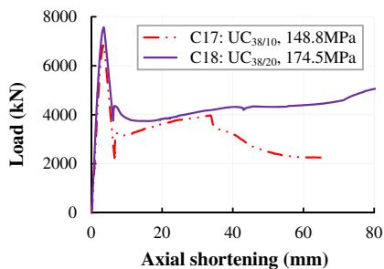  
(a) CHS219.1x6.3

  
(b) CHS219.1x6.3/CHS114.3x3.6

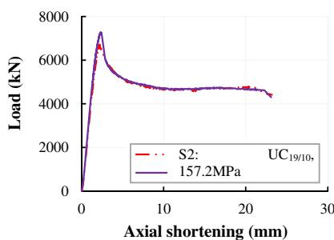  
(c) SHS150x8 (1)

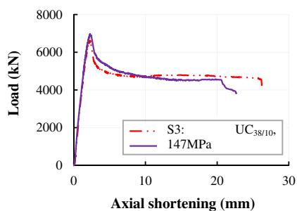  
(d) SHS150x8 (2)

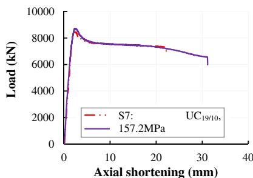  
(e) SHS150x10 (1)

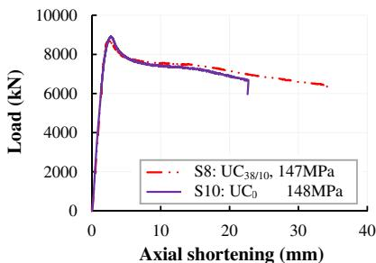  
(f) SHS150x10 (2)

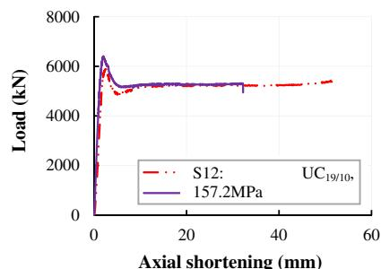  
(g) SHS150x12.5 (1)

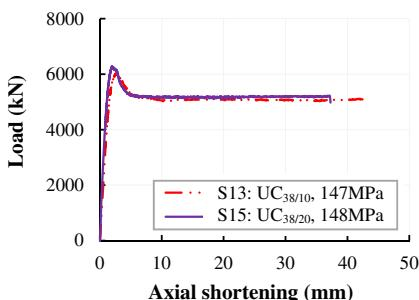  
(h) SHS150x12.5 (2)

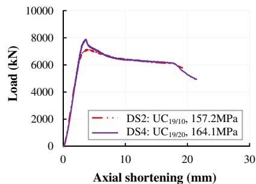  
(i) SHS150x8/SHS80x8   
Fig. 14. Effect of diameter of coarse aggregate.

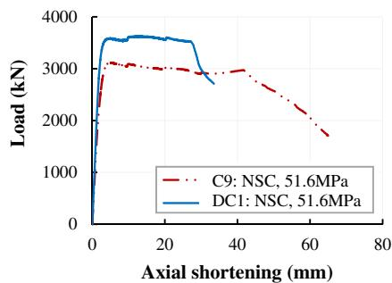  
(a) outer tube-CHS219.1x5

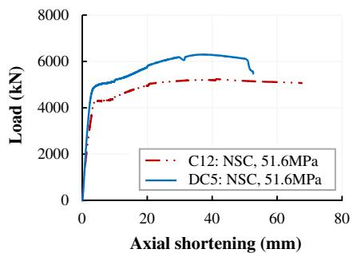  
(b) outer tube-CHS219.1x10

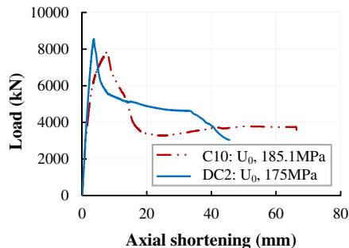  
(c) outer tube-CHS219.1x5

  
(d) outer tube-CHS219.1x10   
Fig. 15. Comparison of single-tube specimens with double-tube specimens.

Table 8 Code specified characteristic compressive resistance of short CFSTs.   

<table><tr><td>Design codes</td><td>Expressions</td><td>Notes</td></tr><tr><td>AISC 360-10 (2010)</td><td>Compact: N = PpNon-compact: N = Pp - \(\frac{P_p - P_y}{(\lambda_r - \lambda_p)^2} (\lambda - \lambda_p)^2\)</td><td>\(P_p=f_yA_s+C_2f_{ck}A_c\)C2={0.85:rectangular0.95:Circular\(\begin{array}{l}{\lambda,\lambda_p,\lambda_r:\text{section slenderness ratios}}\\{\text{-}}\end{array}\)</td></tr><tr><td>ACI/AS (ACI 318R, 2005; AS4100,1998; AS3600, 2001)</td><td>N = f_yA_s + 0.85f_{ck}A_c</td><td>-</td></tr><tr><td>AIJ (1997); AIJ (2001).</td><td>N = A_c f_{ck} + (1 + \eta) A_s f_y</td><td>l_k/D ≤ 4{lk: effective lengthD : width or diameterη={0:square0.27:circular</td></tr><tr><td>CISC (2007)</td><td>N = (\tau A_s f_y + \tau&#x27; 0.85 A_c f_{ck})(1 + \lambda^{3.6})^{-0.556}</td><td>τ={(1 + ρ + \(\rho^2\))^{-0.5} L/D &lt; 251.0L/D ≥ 25\(\tau&#x27;= \left\{ \begin{array}{l}{1+\left(\frac{25\rho^2\tau}{D/t}\right)\left(\frac{f_y}{0.85f_{ck}}\right)L/D&lt; 25}\\ {1.0L/D\geqslant 25}\end{array} \right.\)ρ=0.02(25-L/D)\(\lambda=\sqrt{\frac{\tau A_f y+\tau&#x27; 0.85 A_c f_{ck}}{\pi^2(E_s I_s+\frac{0.6E_c I_c}{C_f/c_f})/(KL)^2}}\)Cfs=sustained axial load on columnCf=total axial load on column</td></tr></table>

in this paper. The section slenderness is considered by the AISC 360-10 [3] as well as the confinement effect for the circular CFSTs $C _ { 2 }$ factor). The ACI 318R [25], AS 4100 [26] and AS 3600 [27] use the same formula and the confinement effect is ignored for both circular and square CFSTs. Thus, they will yield the same predictions with the AISC 360-10 for the square CFSTs. The expression by AIJ 1997 [5] and AIJ 2001 [28] takes the confinement effect into account but it is unexpectedly applied to the steel section. The Canadian code CISC [29] presents detailed but tedious expressions as the Eurocode 4 does. The confinement effect is separately

considered for the steel section and concrete section by the coefficients s and $\tau ^ { \prime }$ , although there is an amplification factor $\gimel$ for the entire section.

The comparisons for circular CFSTs are shown in Table 9. As the confinement effect is ignored, the ACI and AS codes provided the most conservative predictions. In contrary, the Eurocode 4 overestimated the confinement effect which should thus be ignored. This has been discussed in Section 4. The AIJ and CISC overestimated the test results and then gave unsafe predictions for the double-tube CFSTs. Overall, the AISC 360-10 seemingly

Table 9 Comparisons between test results and code predictions for circular CFSTs.   

<table><tr><td>No.</td><td>Ntest(kN)</td><td>NEC4(kN)</td><td>NAISC(kN)</td><td>NACI/AS(kN)</td><td>NAIJ(kN)</td><td>NCISC(kN)</td><td>NTestNEC4</td><td>NTestNAISC</td><td>NTestNAIJ</td><td>NTestNAIJ</td><td>NCISC</td></tr><tr><td rowspan="2" colspan="6">Single-tubes</td><td rowspan="2">Avg.=St.Dev.=</td><td>0.997</td><td>1.149</td><td>1.240</td><td>1.028</td><td>1.029</td></tr><tr><td>0.047</td><td>0.067</td><td>0.064</td><td>0.050</td><td>0.065</td></tr><tr><td>C1</td><td>2866</td><td>2733</td><td>2254</td><td>2113</td><td>2571</td><td>2697</td><td>1.049</td><td>1.272</td><td>1.356</td><td>1.115</td><td>1.063</td></tr><tr><td>C2</td><td>2595</td><td>2733</td><td>2254</td><td>2113</td><td>2571</td><td>2697</td><td>0.950</td><td>1.151</td><td>1.228</td><td>1.009</td><td>0.962</td></tr><tr><td>C3</td><td>2422</td><td>2277</td><td>1989</td><td>1833</td><td>2204</td><td>2180</td><td>1.064</td><td>1.217</td><td>1.321</td><td>1.099</td><td>1.111</td></tr><tr><td>C4</td><td>2340</td><td>2277</td><td>1989</td><td>1833</td><td>2204</td><td>2180</td><td>1.028</td><td>1.176</td><td>1.277</td><td>1.062</td><td>1.074</td></tr><tr><td>C5</td><td>2497</td><td>2369</td><td>2081</td><td>1915</td><td>2300</td><td>2262</td><td>1.054</td><td>1.200</td><td>1.304</td><td>1.086</td><td>1.104</td></tr><tr><td>C6</td><td>2314</td><td>2369</td><td>2081</td><td>1915</td><td>2300</td><td>2262</td><td>0.977</td><td>1.112</td><td>1.208</td><td>1.006</td><td>1.023</td></tr><tr><td>C7</td><td>2610</td><td>2685</td><td>2254</td><td>2113</td><td>2571</td><td>2679</td><td>0.972</td><td>1.158</td><td>1.235</td><td>1.015</td><td>0.974</td></tr><tr><td>C8</td><td>2633</td><td>2685</td><td>2254</td><td>2113</td><td>2571</td><td>2679</td><td>0.981</td><td>1.168</td><td>1.246</td><td>1.024</td><td>0.983</td></tr><tr><td>C9</td><td>3118</td><td>3601</td><td>2961</td><td>2784</td><td>3395</td><td>3652</td><td>0.866</td><td>1.053</td><td>1.120</td><td>0.918</td><td>0.854</td></tr><tr><td>C10</td><td>7837</td><td>8030</td><td>7316</td><td>6681</td><td>7979</td><td>7540</td><td>0.976</td><td>1.071</td><td>1.173</td><td>0.982</td><td>1.039</td></tr><tr><td>C11</td><td>8664</td><td>8303</td><td>7584</td><td>6920</td><td>8261</td><td>7779</td><td>1.043</td><td>1.142</td><td>1.252</td><td>1.049</td><td>1.114</td></tr><tr><td>C12</td><td>5241</td><td>5155</td><td>4029</td><td>3868</td><td>4785</td><td>5408</td><td>1.017</td><td>1.301</td><td>1.355</td><td>1.095</td><td>0.969</td></tr><tr><td>C13</td><td>9085</td><td>9080</td><td>7978</td><td>7401</td><td>8941</td><td>8934</td><td>1.001</td><td>1.139</td><td>1.227</td><td>1.016</td><td>1.017</td></tr><tr><td>C14</td><td>9187</td><td>9323</td><td>8220</td><td>7618</td><td>9197</td><td>9151</td><td>0.985</td><td>1.118</td><td>1.206</td><td>0.999</td><td>1.004</td></tr><tr><td>C15</td><td>6915</td><td>7152</td><td>6450</td><td>5904</td><td>7064</td><td>6736</td><td>0.967</td><td>1.072</td><td>1.171</td><td>0.979</td><td>1.027</td></tr><tr><td>C16</td><td>7407</td><td>7545</td><td>6844</td><td>6257</td><td>7479</td><td>7087</td><td>0.982</td><td>1.082</td><td>1.184</td><td>0.990</td><td>1.045</td></tr><tr><td>C17</td><td>6838</td><td>6682</td><td>5998</td><td>5499</td><td>6588</td><td>6332</td><td>1.023</td><td>1.140</td><td>1.243</td><td>1.038</td><td>1.080</td></tr><tr><td>C18</td><td>7569</td><td>7512</td><td>6816</td><td>6231</td><td>7449</td><td>7062</td><td>1.008</td><td>1.111</td><td>1.215</td><td>1.016</td><td>1.072</td></tr><tr><td rowspan="2" colspan="6">Double-tubes</td><td rowspan="2">Avg.=St.Dev.=</td><td>1.003</td><td>1.135</td><td>1.208</td><td>0.991</td><td>0.995</td></tr><tr><td>0.067</td><td>0.087</td><td>0.081</td><td>0.062</td><td>0.111</td></tr><tr><td>DC1</td><td>3626</td><td>3999</td><td>3404</td><td>3234</td><td>3971</td><td>3948</td><td>0.907</td><td>1.065</td><td>1.121</td><td>0.913</td><td>0.918</td></tr><tr><td>DC2</td><td>8529</td><td>7955</td><td>7283</td><td>6704</td><td>8054</td><td>7412</td><td>1.072</td><td>1.171</td><td>1.272</td><td>1.059</td><td>1.151</td></tr><tr><td>DC3</td><td>4968</td><td>5045</td><td>4461</td><td>4179</td><td>5083</td><td>5611</td><td>0.985</td><td>1.114</td><td>1.189</td><td>0.977</td><td>0.885</td></tr><tr><td>DC4</td><td>5239</td><td>5200</td><td>4617</td><td>4319</td><td>5248</td><td>5857</td><td>1.008</td><td>1.135</td><td>1.213</td><td>0.998</td><td>0.894</td></tr><tr><td>DC5</td><td>6300</td><td>5781</td><td>4839</td><td>4689</td><td>5837</td><td>5883</td><td>1.090</td><td>1.302</td><td>1.343</td><td>1.079</td><td>1.071</td></tr><tr><td>DC6</td><td>9817</td><td>9194</td><td>8238</td><td>7731</td><td>9415</td><td>8920</td><td>1.068</td><td>1.192</td><td>1.270</td><td>1.043</td><td>1.101</td></tr><tr><td>DC7</td><td>7022</td><td>6787</td><td>5869</td><td>5611</td><td>6921</td><td>8213</td><td>1.035</td><td>1.196</td><td>1.251</td><td>1.015</td><td>0.855</td></tr><tr><td>DC8</td><td>7160</td><td>6849</td><td>5933</td><td>5668</td><td>6988</td><td>8356</td><td>1.045</td><td>1.207</td><td>1.263</td><td>1.025</td><td>0.857</td></tr><tr><td>DC9</td><td>7640</td><td>7791</td><td>7033</td><td>6522</td><td>7877</td><td>7082</td><td>0.981</td><td>1.086</td><td>1.171</td><td>0.970</td><td>1.079</td></tr><tr><td>DC10</td><td>7209</td><td>8154</td><td>7403</td><td>6853</td><td>8266</td><td>7411</td><td>0.884</td><td>0.974</td><td>1.052</td><td>0.872</td><td>0.973</td></tr><tr><td>DC11</td><td>6882</td><td>7350</td><td>6611</td><td>6144</td><td>7432</td><td>6704</td><td>0.936</td><td>1.041</td><td>1.120</td><td>0.926</td><td>1.027</td></tr><tr><td>DC12</td><td>8375</td><td>8123</td><td>7376</td><td>6829</td><td>8238</td><td>7387</td><td>1.031</td><td>1.135</td><td>1.226</td><td>1.017</td><td>1.134</td></tr></table>

Table 10 Comparisons between test results and code predictions for square CFSTs   

<table><tr><td>No.</td><td>Ntest(kN)</td><td>NEC4(kN)</td><td>NAISC(kN)</td><td>NACI/AS(kN)</td><td>NAIJ(kN)</td><td>NCISC(kN)</td><td>NTestNEC4</td><td>NTestNAISC</td><td>NTestNAICI/AS</td><td>NTestNAIJ</td><td>NTestNCISC</td></tr><tr><td colspan="6">Single-Tube CFSTs</td><td>Avg.=St.Dev.=</td><td>1.113</td><td>1.109</td><td>1.109</td><td>1.050</td><td>1.110</td></tr><tr><td>S1</td><td>6536</td><td>6428</td><td>6441</td><td>6441</td><td>6831</td><td>6435</td><td>1.017</td><td>1.015</td><td>1.015</td><td>0.957</td><td>1.016</td></tr><tr><td>S2</td><td>6715</td><td>6511</td><td>6512</td><td>6512</td><td>6915</td><td>6506</td><td>1.031</td><td>1.031</td><td>1.031</td><td>0.971</td><td>1.032</td></tr><tr><td>S3</td><td>6616</td><td>6337</td><td>6364</td><td>6364</td><td>6741</td><td>6358</td><td>1.044</td><td>1.040</td><td>1.040</td><td>0.982</td><td>1.041</td></tr><tr><td>S4</td><td>7276</td><td>6629</td><td>6612</td><td>6612</td><td>7032</td><td>6606</td><td>1.098</td><td>1.100</td><td>1.100</td><td>1.035</td><td>1.101</td></tr><tr><td>S5</td><td>6974</td><td>6354</td><td>6379</td><td>6379</td><td>6758</td><td>6373</td><td>1.098</td><td>1.093</td><td>1.093</td><td>1.032</td><td>1.094</td></tr><tr><td>S6</td><td>8585</td><td>7579</td><td>7619</td><td>7619</td><td>7962</td><td>7612</td><td>1.133</td><td>1.127</td><td>1.127</td><td>1.078</td><td>1.128</td></tr><tr><td>S7</td><td>8452</td><td>7652</td><td>7682</td><td>7682</td><td>8035</td><td>7675</td><td>1.105</td><td>1.100</td><td>1.100</td><td>1.052</td><td>1.101</td></tr><tr><td>S8</td><td>8687</td><td>7500</td><td>7552</td><td>7552</td><td>7882</td><td>7545</td><td>1.158</td><td>1.150</td><td>1.150</td><td>1.102</td><td>1.151</td></tr><tr><td>S9</td><td>8730</td><td>7756</td><td>7770</td><td>7770</td><td>8139</td><td>7762</td><td>1.126</td><td>1.124</td><td>1.124</td><td>1.073</td><td>1.125</td></tr><tr><td>S10</td><td>8912</td><td>7515</td><td>7565</td><td>7565</td><td>7897</td><td>7558</td><td>1.186</td><td>1.178</td><td>1.178</td><td>1.128</td><td>1.179</td></tr><tr><td>S11</td><td>5953</td><td>5351</td><td>5370</td><td>5370</td><td>5707</td><td>5368</td><td>1.113</td><td>1.109</td><td>1.109</td><td>1.043</td><td>1.109</td></tr><tr><td>S12</td><td>5911</td><td>5427</td><td>5431</td><td>5431</td><td>5779</td><td>5429</td><td>1.089</td><td>1.088</td><td>1.088</td><td>1.023</td><td>1.089</td></tr><tr><td>S13</td><td>6039</td><td>5269</td><td>5304</td><td>5304</td><td>5629</td><td>5301</td><td>1.146</td><td>1.139</td><td>1.139</td><td>1.073</td><td>1.139</td></tr><tr><td>S14</td><td>6409</td><td>5534</td><td>5518</td><td>5518</td><td>5881</td><td>5515</td><td>1.158</td><td>1.161</td><td>1.161</td><td>1.090</td><td>1.162</td></tr><tr><td>S15</td><td>6285</td><td>5284</td><td>5316</td><td>5316</td><td>5643</td><td>5314</td><td>1.189</td><td>1.182</td><td>1.182</td><td>1.114</td><td>1.183</td></tr><tr><td rowspan="2" colspan="6">Double-Tube CFSTs</td><td rowspan="2">Avg.=St.Dev.=</td><td>0.908</td><td>0.851</td><td>0.851</td><td>0.820</td><td>0.852</td></tr><tr><td>0.040</td><td>0.040</td><td>0.040</td><td>0.037</td><td>0.040</td></tr><tr><td>DS1</td><td>7058</td><td>7975</td><td>8514</td><td>8514</td><td>8831</td><td>8503</td><td>0.885</td><td>0.829</td><td>0.829</td><td>0.799</td><td>0.830</td></tr><tr><td>DS2</td><td>7143</td><td>8045</td><td>8572</td><td>8572</td><td>8899</td><td>8559</td><td>0.888</td><td>0.833</td><td>0.833</td><td>0.803</td><td>0.835</td></tr><tr><td>DS3</td><td>7032</td><td>7900</td><td>8452</td><td>8452</td><td>8758</td><td>8439</td><td>0.890</td><td>0.832</td><td>0.832</td><td>0.803</td><td>0.833</td></tr><tr><td>DS4</td><td>7880</td><td>8143</td><td>8654</td><td>8654</td><td>8995</td><td>8640</td><td>0.968</td><td>0.911</td><td>0.911</td><td>0.876</td><td>0.912</td></tr></table>

yielded most reasonable (safe but not too conservative) predictions which are, however, somewhat scattered in terms of the standard deviation value.

The comparisons for square CFSTs are shown in Table 10. As there is no confinement effect considered, the predictions were quite close by abovementioned codes. All predictions were on the safe side in average. The standard deviations were consistent and less scattered than those for circular CFSTs. Similar to the Eurocode 4, the other codes also over-predicted the results for the double-tube CFSTs.

# 7. Conclusions

Structural behaviour of a total of 56 CFST short columns employing UHSC and HTS have been presented in this article. Test results showed that the ultra-high compressive resistance, which is required for structural members in high-rise structures, can be achieved by employing the UHSC. The compressive resistance can be further higher if both the UHSC and HTS are used. The ductility performance of the CFST columns with the UHSC should be considered, due to the brittleness of the UHSC. The ductility can be improved if: (1) the compression load is applied only on the UHSC core; (2) double-tube scheme is properly adopted; (3) Class 1 steel sections are used; (4) or the higher steel contribution ratio is adopted.

The addition of steel fibers slightly increases the strengths of the UHSC, and then the ultimate resistance of the short CFSTs. However, there will be adverse effects on the ductility of the CFSTs, especially for the CFSTs with Class 2 or Class 3 steel sections. Furthermore, the steel fibers will affect the flowability of the UHSC and increase the cost of the UHSC. Hence, the use of steel fibers is not recommended for the presented UHSC.

The usage of ordinary granite coarse aggregates with a mix proportion up to $3 8 \%$ by volume has no significant influence on the resistance and ductility of the CFST columns with the UHSC. However, it may lead to significant cost saving in the UHSC casting. The higher strength coarse aggregates are recommended for the presented UHSC.

For the short CFST columns with the UHSC, the ultimate resistance can be achieved at a very small axial strain before any significant confinement on core material can be developed due to the brittleness of the UHSC. For the CFST columns with the Class 3 steel sections, local buckling may occur at the yielding of steel tubes and no significant confinement can be developed for the ultimate resistance. Therefore, the confinement effect should be ignored for CFST columns with the UHSC or Class 3 steel sections, which has been confirmed by the comparisons between the test results and the Eurocode 4 predictions.

The comparisons of test results with the Eurocode 4 predictions have indicated that the Eurocode 4 method can provide conservative predictions if the confinement effect is not considered and the Class 3 steel sections are not used. The limitations on concrete classes and steel grades could be safely extended for the UHSC with characteristic compressive strength up to 190 MPa and the HTS with yield strength up to 780 MPa for the short CFST columns, except the double-tube CFSTs with the welded HTS plates.

The other codes (AISC 360-10, ACI 318R, AS 4100, AS 3600, AIJ, CISC) generally gave conservative predictions for the CFSTs with the UHSC and HTS, except AIJ and CISC slightly overestimated the axial resistance in average for the circular double-tubes. All design codes over-predicted the resistance for the double-tube CFSTs using HTS. This needs further study, alternatively, a reduction factor of 0.8 may be adopted for the ultimate axial resistance.

# Acknowledgement

The authors would like to acknowledge the funding support by Agency for Science, Technology and Research, Singapore $( \mathsf { A } { \ast } \mathsf { S T } \mathsf { A R } )$ for research project ‘‘Steel-concrete composite systems employing ultra-high strength steel and concrete for sustainable high-rise construction” under SERC Grant No: 092 142 0045.

# References

[1] Xiong MX, Liew JYR. Mechanical behviour of ultra-high strength concrete at elevated temperatures and fire resistance of ultra-high strength concrete filled steel tubes. Mater Des 2016;104:414–27.   
[2] EN 1994-1-1. Eurocode 4: Design of composite steel and concrete structures – Part 1-1: General rules and rules for buildings, European Committee for Standardization; 2004.   
[3] ANSI/AISC 360-10. Specification for structural steel buildings. Chicago (IL): American Institute of Steel Construction; 2010.   
[4] GB 50936. Technical code for concrete-filled steel tubular structures. Ministry of Housing and Urban-Rural Development of the People’s Republic of China; 2014 [in Chinese].   
[5] AIJ. Recommendations for design and construction of concrete filled steel tubular structures, Architectural Institute of Japan, Japan; 1997 [in Japanese.   
[6] Han LH, Yao GH, Zhao XL. Tests and calculations for hollow structural steel (HSS) stub columns filled with self-consolidating concrete (SCC). J Constr Steel Res 2005;61(9):1241–69.   
[7] Liu DL, Gho WM, Yuan J. Ultimate capacity of high-strength rectangular concrete-filled steel hollow section stub columns. J Constr Steel Res 2003;59 (12):1499–515.   
[8] Liu DL, Gho WM. Axial load behaviour of high-strength rectangular concretefilled steel tubular stub columns. Thin-Wall Struct 2005;43(8):1131–42.   
[9] Lue DM, Liu JL, Yen T. Experimental study on rectangular CFST columns with high-strength concrete. J Constr Steel Res 2007;63(1):37–44.   
[10] Yu Q, Tao Z, Wu YX. Experimental behaviour of high performance concretefilled steel tubular columns. Thin-Wall Struct 2008;46(4):362–70.   
[11] Uy B. Strength of short concrete filled high strength steel box columns. J Constr Steel Res 2001;57(2):113–34.   
[12] Sakino K, Nakahara H, Morino S, Nishiyama I. Behavior of centrally loaded concrete-filled steel-tube short columns. J Struct Eng 2004;130(2):180–8.   
[13] Aslani F, Uy B, Tao Z, Mashiri F. Behaviour and design composite columns incorporating compact high-strength steel plates. J Constr Steel Res 2015;107:94–110.   
[14] Liew JYR, Xiong DX. Ultra-high strength concrete filled composite columns for multi-storey building construction. Adv Struct Eng 2012;15(9):1487–503.   
[15] Mander JB, Priestley MJN, Park R. Theoretical stress-strain model for confined concrete. J Struct Eng 1988;114(8):1804–26.   
[16] Richart FE, Brandtzaeg A, Brown RL. A study of the failure of concrete under combined compressive stresses. Bulletin 185, University of Illinois Engineering Experimental Station, Champaign, III; 1928.   
[17] Balmer GG. Shear strength of concrete under high triaxial stress – computation of Mohr’s envelope as a curve. SP-23, Structural Research Laboratory, U.S. Bureau of Reclamation; 1944.   
[18] C 1611/C 1611M-09b. Standard test method for slump flow of selfconsolidating concrete. United States: ASTM International; 2009.   
[19] Xiong MX, Liew JYR. Spalling behavior and residual resistance of fibre reinforced ultra-high performance concrete after exposure to high temperatures. Mater Constr 2015;65(320):1–10.   
[20] Xiong MX, Liew JYR. Mechanical properties of heat-treated high tensile structural steel at elevated temperatures. Thin-Wall Struct 2016;98:169–76.   
[21] EN 1993-1-1. Eurocode 3: Design of steel structures – Part 1-1: General rules and rules for buildings, European Committee for Standardization; 2005.   
[22] Chiew SP, Zhao MS, Lee CK. Fatigue performance of high strength steel built-up box T-joints. J Constr Steel Res 2015;106:296–310.   
[23] Orito Y, Sato T, Tanaka N, Watanabe Y. Study on the un-bonded steel tube concrete structure. Composite Construction in Steel and Concrete. In: Buckner CD, Viest IM, editors. Proceedings of an engineering foundation conference. Henniker, New Hampshire, USA. June 7–12, 1987. New York: ASCE; 1988. p. 786–804.   
[24] Buyukozturk O, Hearing B. Crack propagation in concrete composites influenced by interface fracture parameters. Int J Sol Struct 1998;35(31– 32):4055–66.   
[25] ACI-318R. Building code requirements for structural concrete and commentary. Farmington Hills (MI, USA): American Concrete Institute; 2005.   
[26] AS4100. Australian Standards. Steel structures. Standards Association of Australia, Sydney, Australia; 1998.   
[27] AS3600. Australian Standards. Concrete structures. Standards Association of Australia, Sydney, Australia; 2001.   
[28] AIJ. Standards for structural calculation of steel reinforced concrete structures. 5th ed., Tokyo (Japan): Architectural Institute of Japan; 2001 [in Japanese].   
[29] CISC. Handbook of steel construction. 9th ed. Ontario, Canada: Canadian Institute of Steel Construction; 2007 [Lakeside Group Inc. ].