# Strength, stiffness and ductility of concrete-filled steel columns under axial compression

CrossMark

Zhi-Bin Wang a,b , Zhong Tao b,⇑ , Lin-Hai Han c , Brian Uy d , Dennis Lam e , Won-Hee Kang

a College of Civil Engineering, Fuzhou University, Fuzhou, Fujian Province 350108, China   
b Centre for Infrastructure Engineering, Western Sydney University, Penrith, NSW 2751, Australia   
c Department of Civil Engineering, Tsinghua University, Beijing 100084, China   
d School of Civil Engineering, The University of Sydney, Sydney, NSW 2006, Australia   
e School of Engineering, University of Bradford, Richmond Road, Bradford BD7 1DP, United Kingdom

# a r t i c l e i n f o

Article history:

Received 16 June 2016

Revised 22 December 2016

Accepted 23 December 2016

Available online 12 January 2017

Keywords:

Concrete-filled steel tubes

Axial compression

Finite element analysis

Compressive strength

Compressive stiffness

Ductility

# a b s t r a c t

Extensive experimental and theoretical studies have been conducted on the compressive strength of concrete-filled steel tubular (CFST) columns, but little attention has been paid to their compressive stiffness and deformation capacity. Despite this, strength prediction approaches in existing design codes still have various limitations. A finite element model, which was previously proposed by the authors and verified using a large amount of experimental data, is used in this paper to generate simulation data covering a wide range of parameters for circular and rectangular CFST stub columns under axial compression. Regression analysis is conducted to propose simplified models to predict the compressive strength, the compressive stiffness, and the compressive strain corresponding to the compressive strength (ductility) for the composite columns. Based on the new strength prediction model, the capacity reduction factors for the steel and concrete materials are recalibrated to achieve a target reliability index of 3.04 when considering resistance effect only.

$\circledcirc$ 2016 Elsevier Ltd. All rights reserved.

# 1. Introduction

Concrete-filled steel tubular (CFST) members have been widely used in routine structural design as piles, building columns and bridge piers. This is due to the great advantages of composite members, including high strength, good ductility, high energy absorption capacity, and rapid construction. From the 1960s, behaviour of CFST members has been extensively investigated [1–4]. Accordingly, many design codes have been developed, such as the Japanese code AIJ [5], Australian code AS 5100 [6], European code EN1994 [7], American codes AISC [8] and ACI [9], and Chinese code DBJ 13-51-2010 [10]. For design purposes, all these codes have provided some limitations on material strengths and section slenderness, as summarised in Table 1. Beyond those limitations, the existing codes might give less accurate strength predictions [11,12]. Even within the limitations, the strength predictions from the existing codes show considerable deviation from the experimental results and the predication accuracy could be further improved [13–15].

In recent years, developments of high strength steel and concrete have progressed in leaps and bounds, and high strength CFST columns have already been used in some building structures. For example, the Latitude Building in Sydney used a steel grade of 690 MPa and 80 MPa strength concrete in box-shaped CFST sections in the two-storey, $7 \mathrm { m }$ deep transfer trusses [16]. In Japan, the Obayashi Technical Research Institute Main Building used CFST columns with a steel grade of 780 MPa and concrete compressive strength of 160 MPa [17]. These applications highlight the urgent need to develop design methods to cope with the development of high-strength materials.

In investigating CFST stub columns under compression, previous studies have mainly focused on their compressive strength. Very little attention has been paid to their compressive stiffness and deformation capacity [18,19]. For structural analysis, compressive stiffness of a member affects the internal force distribution; therefore accurate values should be provided. Meanwhile, designers nowadays are paying more attention to extreme loading, such as seismicity, impact and fire; and other abnormal events. Accordingly, the issue of ductility or deformation capacity is of considerable interests to the designers. The compressive strain corresponding to the ultimate strength to some extent reflects ductility or deformation capacity of an axially loaded CFST column,

<table><tr><td colspan="4">Nomenclature</td></tr><tr><td>Ac</td><td>cross-sectional area of concrete</td><td>Nu</td><td>ultimate strength of a CFST stub column</td></tr><tr><td>As</td><td>cross-sectional area of the steel tube</td><td>R²</td><td>coefficient of determination</td></tr><tr><td>B</td><td>width of a rectangular cross-section</td><td>SD</td><td>standard deviation</td></tr><tr><td>D</td><td>diameter of a circular cross-section</td><td>t</td><td>wall thickness of the steel tube</td></tr><tr><td>D&#x27;</td><td>equivalent diameter of a rectangular cross-section</td><td>β</td><td>reliability index for resistance</td></tr><tr><td>EA</td><td>compressive stiffness of a CFST stub column</td><td>ε</td><td>strain</td></tr><tr><td>Ec</td><td>elastic modulus of concrete</td><td>εc</td><td>compressive strain corresponding to the compressive strength</td></tr><tr><td>Es</td><td>elastic modulus of steel</td><td></td><td></td></tr><tr><td>fc&#x27;</td><td>cylinder compressive strength of concrete</td><td>φ</td><td>capacity reduction factor for steel</td></tr><tr><td>fcu</td><td>cube compressive strength of concrete</td><td>φc</td><td>capacity reduction factor for concrete</td></tr><tr><td>fy</td><td>yield stress of steel</td><td>κc</td><td>correction factor for the concrete stiffness</td></tr><tr><td>fu</td><td>ultimate strength of steel</td><td>μ</td><td>average value</td></tr><tr><td>H</td><td>cross-sectional height of a rectangular tube</td><td>σ</td><td>stress</td></tr><tr><td>L</td><td>length of a CFST stub column</td><td></td><td></td></tr><tr><td>Na</td><td>strength contribution of the steel tube</td><td></td><td></td></tr><tr><td>Nc</td><td>strength contribution of the concrete core</td><td></td><td></td></tr></table>

Table 1 Strength prediction methods and related limitations.   

<table><tr><td></td><td>Sectional type</td><td>Prediction of strength</td><td>D/t or H/t</td><td>fy (MPa)</td><td>fc MPa</td></tr><tr><td rowspan="2">ACI</td><td>Circular</td><td>Nu = fyAs + 0.85f_c&#x27;A_c</td><td>D/t ≤ √8Es/fy</td><td>-</td><td>fc ≥ 17.2 MPa</td></tr><tr><td>Rectangular</td><td></td><td>H/t ≤ √3Es/fy</td><td>-</td><td>fc ≥ 17.2 MPa</td></tr><tr><td rowspan="3">AISC</td><td>Circular</td><td>Nu = { [0.658(N0/Ncr) ]N0 N0 ≤ 2.25Nr</td><td>D/t ≤ 0.15Es/fy</td><td>fy ≤ 525 MPa</td><td>21 ≤ fc ≤ 70 MPa</td></tr><tr><td>Rectangular</td><td>N0 = fyAs + 0.85f_c&#x27;A_c</td><td>H/t ≤ 2.26E_s/f_y</td><td>fy ≤ 525 MPa</td><td>21 ≤ fc ≤ 70 MPa</td></tr><tr><td></td><td>Ncr = π2(KL)^2(EIeff)</td><td></td><td></td><td></td></tr><tr><td rowspan="4">AS 5100</td><td>Circular</td><td>Nu = ηaf_yAs + f_c&#x27;Ac(1 + ηc tf_y/Df_c)</td><td>D/t ≤ 82 × 250/f_y</td><td>230 ≤ fy ≤ 400 MPa</td><td>25 ≤ fc ≤ 65 MPa</td></tr><tr><td></td><td>ηa = 0.25(3 + 2λ) ≤ 1</td><td></td><td></td><td></td></tr><tr><td></td><td>ηc = 4.9 - 18.5λ + 17λ^2 ≥ 0</td><td></td><td></td><td></td></tr><tr><td>Rectangular</td><td>Nu = fyAs + f_c&#x27;A_c</td><td>H/t ≤ 35√250/f_y</td><td>230 ≤ fy ≤ 400 MPa</td><td>25 ≤ fc ≤ 65 MPa</td></tr><tr><td rowspan="2">EN1994</td><td>Circular</td><td>Nu = ηaf_yAs + f_c&#x27;Ac(1 + ηc tf_y/Df_c)</td><td>D/t ≤ 90 × 235/f_y</td><td>235 ≤ fy ≤ 460 MPa</td><td>20 ≤ fc ≤ 60 MPa</td></tr><tr><td>Rectangular</td><td>Nu = fyAs + f_c&#x27;A_c</td><td>H/t ≤ 52√235/f_y</td><td>235 ≤ fy ≤ 460 MPa</td><td>20 ≤ fc ≤ 60 MPa</td></tr><tr><td rowspan="3">DBJ 13-51-2010</td><td>Circular</td><td>Nu = f_sc(A_s + A_c); ξ = f_yAs/f_cA_c</td><td>D/t ≤ 150 × 235/f_y</td><td>235 ≤ fy ≤ 420 MPa</td><td>24 ≤ fc ≤ 70 MPa</td></tr><tr><td>Rectangular</td><td>f_sc = f_ck(1.14 + 1.02ξ) for circular</td><td>H/t ≤ 60√235/f_y</td><td>235 ≤ fy ≤ 420 MPa</td><td>24 ≤ fc ≤ 70 MPa</td></tr><tr><td></td><td>f_sc = f_ck(1.18 + 0.85ξ) for rectangular</td><td></td><td></td><td></td></tr></table>

and simplified equations should be proposed to assist the designers.

A finite element (FE) model was previously developed by Tao et al. [20] for simulating circular and rectangular CFST stub columns under axial compression, which has been verified by a large amount of full-range load-deformation curves. The FE model will be used in this paper to generate simulation data to cover a wide range of parameters, and regression analysis will be conducted to propose simplified models to predict the compressive strength and corresponding strain, and compressive stiffness for the composite columns. Based on the new strength prediction model, the capacity reduction factors for the steel and concrete materials will be recalibrated.

# 2. Compressive strength predictions based on existing design codes

A database containing test results of 484 circular CFST stub columns and 445 rectangular CFST stub columns was used by Tao et al. [13] to evaluate the applicability of existing design codes, including AIJ, AISC, DBJ 13-51-2003 and EN1994, in calculating

the compressive strength. It should be pointed out that the formulae presented in AS 5100: Part 6 are virtually the same as those suggested in EN1994 for compressive strength prediction. Therefore, the predicted results using AS 5100 are similar to those from EN1994. The evaluation conducted by Tao et al. [13] indicates that EN1994 has provided comparable predictions as DBJ 13-51-2003 for rectangular CFST stub columns, but gives better predictions than do the AIJ and AISC. In contrast, EN1994 gives better strength predictions than other design codes for circular CFST stub columns.

Although reasonable strength predictions are given by EN1994, considerable deviation from the experimental results was still reported by Tao et al. [13], Kuranovas et al. [14], and Güneyisi et al. [15]. This is also the case for other design codes. The deviations are mainly caused by unavoidable experimental errors, different specimen end conditions and variations in specimen preparation and quality. The influence of these factors is difficult, if not impossible, to be eliminated in code comparison. Another contributing factor to the variation is the limitations of the design codes themselves. For example, EN1994 considers the local buckling effect for circular thin-walled tubes by limiting the diameter (D) to thickness (t) ratio to $9 0 \times 2 3 5 / f _ { \mathrm { y } }$ and the cross-sectional

height $( H )$ to thickness ratio (t) to $5 2 \sqrt { 2 3 5 / f _ { y } }$ for rectangular thinwalled tubes, where $f _ { \mathrm { y } }$ is the yield stress of the steel tube. However, no details were given in the EN1994 on how to account for the local buckling effect if these limits were exceeded. Therefore, previous code comparisons simply ignored this specification to check the possibility of relaxing the section slenderness limitation.

The ambiguity in the definition of ultimate strength $( N _ { \mathrm { u } } )$ is also a factor causing the deviation of prediction accuracy. This particularly becomes an issue for specimens without descending branches in their load-deformation curves. For most CFST columns demonstrating softening post-peak response, $N _ { \mathrm { u } }$ is normally taken as the peak load corresponding to an axial strain of less than 0.01. But CFST columns with compact sections, high-strength steel or low-strength concrete may not have a softening response or may demonstrate softening at a very late stage. In this case, ultimate strength was often arbitrarily determined by researchers. The majority of researchers simply reported the maximum loads obtained at a very large axial strain, most likely at the end of testing. Those maximum loads were later used in the database for code comparison. An example is shown in Fig. 1, where the circular CFST specimen C7 with compact section was tested by Giakoumelis and Lam [21]. This specimen had a diameter-to-thickness ratio $( D / t )$ of 23.4 and a length (L) of $3 0 0 . 5 \mathrm { m m }$ . The yield stress of steel $( f _ { \mathrm { y } } )$ and compressive cube strength of concrete $\left( f _ { \mathrm { c u } } \right)$ were 365 and 34.7 MPa, respectively. The maximum strength $( N _ { \mathrm { m a x } } )$ of 1380 kN was achieved at the end of testing and the corresponding EN1994 prediction $( N _ { \mathrm { E N } } )$ is $1 1 3 4 . 2 \ \mathrm { k N }$ . If the values of $N _ { \mathrm { m a x } }$ and $N _ { \mathrm { E N } }$ are simply compared, it seems that EN1994 underestimates the strength of this specimen by $1 7 . 8 \%$ . However, $N _ { \mathbf { u } }$ of this specimen should not be taken as its $N _ { \mathrm { m a x } }$ since the axial strain ( ) of 0.24 corresponding to $N _ { \mathrm { m a x } }$ eobtained at the end of the testing is totally unrealistic for a member under axial compression. The specimen reached $N _ { \mathrm { E N } }$ at an axial strain of $2 . 8 \%$ , which is still relatively high.

Following the definition by Tao et al. [20] and Uy et al. [22], the ultimate load-carrying capacity $N _ { \mathrm { u } }$ in this paper is defined as the maximum or first peak load if the load is attained below an axial strain of 0.01; otherwise it is defined as the strength corresponding to a maximum strain limit of 0.01. For fibre reinforced polymerconfined concrete, a maximum compressive strain of 0.01 is also specified in ACI 440.2R [23] to prevent excessive cracking and the resulting loss of concrete integrity. Similarly, reaching an axial strain of 0.01 has been defined in ISO 834 [24] as a failure criterion for columns in fire. If the definition of $N _ { \mathrm { u } }$ is applied, $N _ { \mathbf { u } }$ –value of C7 corresponding to an axial strain of 0.01 is $1 0 2 0 \mathrm { k N }$ , which is $1 0 . 1 \%$ lower than $N _ { \mathrm { E N } } ,$ as shown in Fig. 1. This example demonstrates that care should be taken when using reported test results. Even when $N _ { \mathrm { u } }$ is taken as $N _ { \mathrm { m a x } }$ , EN1994 can sometimes overestimate the con-

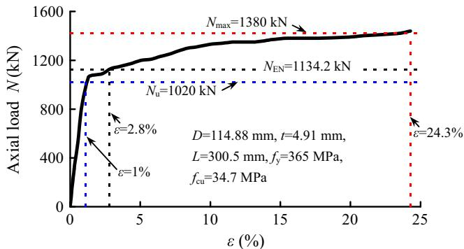  
Fig. 1. Comparison between $N _ { \mathrm { E N } }$ and $N _ { \mathbf { u } }$ for a typical column C7 [21] with compact section.

crete confinement effect [25]. Thus, new models should be proposed to predict the compressive strength of CFST columns.

# 3. Finite element model

Apart from the above-mentioned limitations of test data, existing assembled test database also lacks uniformity regarding key parameters of material strengths and section slenderness because it was randomly assembled from numerous test results in the literature [26]. The results of code comparison can be misleading if only the mean and standard deviation are checked for the predicted-to-measured strength ratios since most columns tested were small scale with normal material strength and section slenderness. More data outside the normal range of parameters is required to develop reliable design models. Meanwhile, test results of compressive stiffness and compressive strain corresponding to the ultimate strength of CFST stub columns were seldom reported in the literature. To develop accurate simplified models for these parameters, it is favourable to generate a large amount of data based on a reliable numerical model to cover a wide range of parameters. This will ensure the developed models are designoriented but with theoretical background.

A FE model was successfully developed by Tao et al. [20] to simulate CFST stub columns using ABAQUS software [27]. The FE model has been rigorously verified by load-deformation curves of 142 circular, 154 square and 44 rectangular specimens, rather than just by reported ultimate strengths. The 340 curves are from 30 references and the majority of the references have received extensive citations. The parameter ranges for the circular specimens are: $f _ { \mathrm { y } } = 1 8 6 { - } 8 5 3 ~ \mathrm { M P a }$ , $f _ { c } = 1 8 \mathrm { - } 1 8 5$ MPa, $D = 6 0 { - } 4 5 0 \mathrm { m m }$ , and $D / t = 1 7 -$ 221. For the rectangular specimens, the parameter ranges are: $f _ { \mathrm { y } } = 1 9 4 \mathrm { - } 8 3 5 \mathrm { M P a }$ , $f _ { c } = 1 3 \mathrm { - } 1 6 4 \mathrm { M P a }$ , $H = 6 0 { - } 5 0 0 \mathrm { m m }$ , $H / t = 1 1 -$ 150, and $H / B = 1 - 2$ , where B is the width of a rectangular tube, and $f _ { c }$ is the cylinder compressive strength of concrete. Obviously, the parameter ranges of both circular and rectangular test specimens are very broad and cover the current practical ranges.

In the FE modelling, the ratio of length L to diameter D (circular CFST) or cross-sectional height H (rectangular CFST) was chosen as 3 for a stub column. Shell elements S4R and solid elements C3D8R were used for the steel tube and core concrete, respectively. But when a steel tube has a small $D / t$ (or $H / t )$ ratio of 12 in the later parametric analysis, both the steel tube and core concrete were simulated using solid elements C3D8R to avoid excessively thick shell elements. Surface-based interaction was used to model the concrete-steel tube interface. ‘‘Hard contact” in the normal direction was specified for the interface, whereas tangent contact was simulated using the Coulomb friction model with a specified friction coefficient of 0.6. The top and bottom surfaces of the steel tube and concrete were fixed against all degrees of freedom except for the axial displacement at the top end. The axial load was applied to the top end plate in a displacement control mode.

For rectangular CFST columns, an elastic-perfectly plastic model was adopted for the steel to better predict the descending branch of the load-deformation curve. But for circular CFST columns, the strain-hardening behaviour of steel was considered using the stress $( \sigma ) .$ –strain ( ) model proposed by Tao et al. [28], which is r eexpressed as follows

$$
\sigma = \left\{ \begin{array}{l l} E _ {\mathrm {s}} \varepsilon & 0 \leqslant \varepsilon <   \varepsilon_ {\mathrm {y}} \\ f _ {\mathrm {y}} & \varepsilon_ {\mathrm {y}} \leqslant \varepsilon <   \varepsilon_ {\mathrm {p}} \\ f _ {\mathrm {u}} - \left(f _ {\mathrm {u}} - f _ {\mathrm {y}}\right) \cdot \left(\frac {\varepsilon_ {\mathrm {u}} - \varepsilon}{\varepsilon_ {\mathrm {u}} - \varepsilon_ {\mathrm {p}}}\right) ^ {p} & \varepsilon_ {\mathrm {p}} \leqslant \varepsilon <   \varepsilon_ {\mathrm {u}} \\ f _ {\mathrm {u}} & \varepsilon \geqslant \varepsilon_ {\mathrm {u}} \end{array} \right. \tag {1}
$$

in which $f _ { \mathrm { u } }$ is the ultimate strength of steel; $E _ { s }$ is the elastic modulus of steel; $\varepsilon _ { \mathrm { y } } = f _ { \mathrm { y } } / E _ { \mathrm { s } } ; \varepsilon _ { \mathrm { p } }$ is the strain at the beginning of strain harden-

ing; $\varepsilon _ { \mathrm { u } }$ is the ultimate strain of steel corresponding to $f _ { \mathrm { u } }$ ; and $p$ is the estrain-hardening exponent. Equations were proposed by Tao et al. [20,28] to determine $f _ { \mathrm { u } } , \varepsilon _ { \mathrm { p } } , \varepsilon _ { \mathrm { u } }$ and $p$ from $f _ { \mathrm { y } } .$ .

e eThe concrete damaged plasticity model available in ABAQUS was used by Tao et al. [20] to simulate the confined concrete, where the following three-stage model was proposed to represent the strain hardening/softening rule of concrete confined by the steel tube:

$$
\sigma = \left\{ \begin{array}{l l} \left[ \frac {A ^ {\prime} \left(\varepsilon / \varepsilon_ {c 0}\right) + B ^ {\prime} \left(\varepsilon / \varepsilon_ {c 0}\right) ^ {2}}{1 + \left(A ^ {\prime} - 2\right) \left(\varepsilon / \varepsilon_ {c 0}\right) + \left(B ^ {\prime} + 1\right) \left(\varepsilon / \varepsilon_ {c 0}\right) ^ {2}} \right] \cdot f _ {c} ^ {\prime} & 0 <   \varepsilon \leqslant \varepsilon_ {c 0} \\ f _ {c} ^ {\prime} & \varepsilon_ {c 0} <   \varepsilon \leqslant \varepsilon_ {c c} \\ f _ {r} + \left(f _ {c} ^ {\prime} - f _ {r}\right) \exp \left[ - \left(\frac {\varepsilon - \varepsilon_ {c c}}{\alpha}\right) ^ {\beta^ {\prime}} \right] & \varepsilon_ {c c} <   \varepsilon \end{array} \right. \tag {2}
$$

where $\varepsilon _ { \mathrm { c } 0 }$ and $\varepsilon _ { \scriptscriptstyle \mathrm { C C } }$ are peak strains of the unconfined concrete and e econfined concrete, respectively; $f _ { \mathrm r }$ is the residual stress of concrete; A0 , B0 ,  and $\beta ^ { \prime }$ are material parameters [20].

a bMore details of the FE model can be found in Tao et al. [20]. It has been proved that the developed three-dimensional FE model can accurately capture the local buckling of the steel tube and confinement to the concrete core, even when high-strength materials and/or thin-walled tubes are used.

The above FE model is used in this paper to generate simulation data with different material strengths and section slenderness ratios. A total of 499 CFST (270 circular and 229 rectangular) stub columns are analysed using various parameter combinations. Eight yield stress levels $( f _ { \mathrm { y } } = 1 7 5$ , 210, 300, 400, 500, 650, 800, 960 MPa) are chosen for the steel and five cylinder compressive strength levels $( f _ { c } = 2 0$ , 45, 70, 95, 120 MPa) are chosen for the concrete. For circular columns, the diameter-to-thickness ratio ranges from 12 to 150 $\scriptstyle { \mathrm { : } D / t = 1 2 }$ , 33, 52, 75, 100, 127, 150). For rectangular columns, the height-to-width ratio varies at three levels $( H / B = 1$ , 1.5, 2) and the height-to-thickness ratio varies at five levels $( H / t = 1 2$ , 33, 52, 75, 100). In the analysis, the diameter or the width of the concrete core is kept at $4 0 0 \mathrm { m m }$ , whereas the thickness of the steel tube is changed to obtain the required $D / t$ ratio or $H / t$ ratio.

# 4. Proposed model for compressive strength

# 4.1. Further evaluation of EN1994 model

Values of $N _ { \mathrm { u } }$ are determined from numerical simulations according to the definition of $N _ { \mathbf { u } }$ in Section 2. The obtained results are used to further evaluate the applicability of EN1994 in predicting $N _ { \mathbf { u } }$ . Accordingly, EN1994 predictions $( N _ { \mathrm { E N } } )$ are compared with the numerical results $( N _ { \mathrm { u , F E } } )$ in Fig. 2. For all the circular columns, an average value $( \mu )$ of 1.040 is obtained for $N _ { \mathrm { E N } } / N _ { \mathrm { u , F E } }$ with a stanldard deviation (SD) of 0.049. For all the rectangular columns, the

corresponding values of $\mu$ and SD are 1.002 and 0.060 respectively. lIf only these values are checked, the first impression is that EN1994 predicts the ultimate strength very well for both circular and rectangular columns. However, EN1994 can overestimate $N _ { \mathbf { u } }$ of circular columns by up to $2 0 \%$ if the ratio of $t f _ { \mathrm { y } } / D f _ { c }$ is very high. In fact, $\mu$ and SD of the $N _ { \mathrm { E N } } / N _ { \mathrm { u , F E } }$ lratio are 1.136 and 0.04 respectively for the 36 circular CFST samples with $t f _ { \mathrm { y } } / D f _ { c }$ ratios equal to or greater than 0.5, as shown in Table 2. It should be mentioned that $t f _ { \mathrm { y } } / D f _ { c }$ ratio indirectly reflects the concrete confinement effect. The larger the $t f _ { \mathrm { y } } / D f _ { c }$ ratio, the higher the concrete confinement.

For a rectangular column, the width (B) and height $( H )$ of the cross-section may be different. To account for the effect of nonuniform confinement in the rectangular column, an equivalent diameter $D ^ { \prime }$ recommended in ACI 440.2R-08 [23] is tentatively adopted in this paper to evaluate the concrete confinement effect:

$$
D ^ {\prime} = \sqrt {B ^ {2} + H ^ {2}} \tag {3}
$$

As shown in Table 3, the 229 analysed samples of rectangular columns can be classified into three groups according to their $t f _ { \mathrm { y } } /$ $D ^ { \prime } f _ { c }$ and $H / t$ ratios. When $H / t \leqslant 1 0 0 \sqrt { 2 3 5 / f _ { \mathrm { y } } }$ and $t f _ { \mathrm { y } } / D ^ { \prime } f _ { c } < 0 . 7 0 7$ , $\mu$ and SD of the $N _ { \mathrm { E N } } / N _ { \mathrm { u , F E } }$ ratio for the 155 samples are 0.986 and l0.030, respectively. These are normal rectangular CFST columns, and EN1994 [7] gives reasonably good strength predictions. But when the tubes are very thin $( H / t > 1 0 0 \sqrt { 2 3 5 / f _ { \mathrm { y } } }$ and $t f _ { \mathrm { y } } /$ $D ^ { \prime } f _ { c } < 0 . 7 0 7 $ ), $\mu$ and SD of the $N _ { \mathrm { E N } } / N _ { \mathrm { u , F E } }$ ratio for the 58 samples lare 1.082 and 0.052, respectively. Clearly, unsafe predictions are given by EN1994 if the local buckling effect is not accounted for thin-walled rectangular CFST columns. In contrast, the mean value of $N _ { \mathrm { E N } } / N _ { \mathrm { u , F E } }$ ratio is 0.922 for the 16 rectangular columns with compact sections $( t f _ { \mathrm { y } } / D ^ { \prime } f _ { c } \geqslant 0 . 7 0 7 )$ . It means that the concrete confinement effect has not been adequately considered by EN1994 for these columns with compact sections.

The above comparison further confirms that EN1994 can give unsafe or conservative predictions for the compressive strength of CFST columns. More accurate strength prediction models should be developed accordingly.

# 4.2. Proposed model

For a CFST under axial compression, the confined concrete is in a triaxial stress state and the steel is in a biaxial state after the development of ‘‘composite action” between the steel tube and concrete. The confinement to concrete can lead to the increase of its compressive strength, whereas the development of tensile hoop stresses in the steel tube reduces its load-carrying capacity in the axial direction. This mechanism has been well established [29].

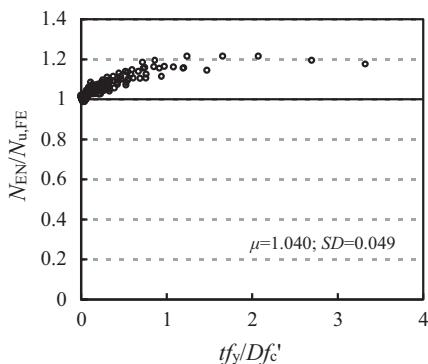  
(a) Circular CFST

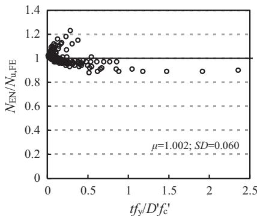  
(b) Rectangular CFST   
Fig. 2. Comparison between $N _ { \mathrm { u , F E } }$ and $N _ { \mathrm { E N } } .$

Table 2 Strength comparison between FE and simple calculations for circular CFST columns.   

<table><tr><td rowspan="2"></td><td rowspan="2">Number of specimens</td><td colspan="4">Eurocode 4 (EN/Nu,FE)</td><td colspan="4">Current design method (Nu/Fe)</td></tr><tr><td>μ</td><td>SD</td><td>Maximum</td><td>Minimum</td><td>μ</td><td>SD</td><td>Maximum</td><td>Minimum</td></tr><tr><td>tfy/Df_c&lt;0.5</td><td>234</td><td>1.025</td><td>0.029</td><td>1.126</td><td>0.981</td><td>1.004</td><td>0.012</td><td>1.055</td><td>0.969</td></tr><tr><td>tfy/Df_c≥0.5</td><td>36</td><td>1.136</td><td>0.040</td><td>1.212</td><td>1.061</td><td>0.998</td><td>0.009</td><td>1.009</td><td>0.979</td></tr></table>

Table 3 Strength comparison between FE and simple calculations for rectangular CFST columns.   

<table><tr><td></td><td></td><td>Number of specimens</td><td colspan="4">Eurocode 4 (EN/Nu,FE)</td><td colspan="4">Current design method (Nu/Cu,FE)</td></tr><tr><td></td><td></td><td></td><td>μ</td><td>SD</td><td>Maximum</td><td>Minimum</td><td>μ</td><td>SD</td><td>Maximum</td><td>Minimum</td></tr><tr><td rowspan="2">tfy/D&#x27;fc&lt;0.707</td><td>Ht&gt;100√235fy</td><td>58</td><td>1.082</td><td>0.052</td><td>1.260</td><td>1.022</td><td>1.003</td><td>0.019</td><td>1.047</td><td>0.944</td></tr><tr><td>Ht≤100√235fy</td><td>155</td><td>0.986</td><td>0.030</td><td>1.040</td><td>0.878</td><td>0.989</td><td>0.012</td><td>1.022</td><td>0.958</td></tr><tr><td>tfy/D&#x27;fc≥0.707</td><td></td><td>16</td><td>0.922</td><td>0.031</td><td>0.969</td><td>0.887</td><td>0.997</td><td>0.018</td><td>1.027</td><td>0.972</td></tr></table>

Meanwhile, the load-carrying capacity of the steel tube will decrease further if local buckling of the tube occurs prior to the ultimate state. Considering the contributions from the steel tube and concrete, a simple superposition model is proposed as follows to predict the ultimate strength for both circular and rectangular CFST columns:

$$
N _ {\mathrm {u}} = N _ {\mathrm {a}} + N _ {\mathrm {c}} = \eta_ {\mathrm {a}} f _ {\mathrm {y}} A _ {\mathrm {s}} + \eta_ {\mathrm {c}} f _ {\mathrm {c}} ^ {\prime} A _ {\mathrm {c}} \tag {4}
$$

where $N _ { \mathbf { a } }$ and $N _ { \mathrm { c } }$ are the strength contributions from the steel tube and concrete, respectively; $A _ { s }$ and $A _ { \mathrm { c } }$ are the cross-sectional areas of the steel tube and core concrete, respectively; $\eta _ { \mathrm { a } }$ is a reduction facgtor (smaller than 1) for the strength contribution of the steel tube to consider the influence of concrete confinement and possible local buckling of the steel tube; and $\eta _ { \mathrm { c } }$ is an amplification factor (larger gthan 1) to account for the increased strength of concrete due to the confinement effect. The derivation of $\eta _ { \mathrm { a } }$ and $\eta _ { \mathrm { c } }$ is presented in the following subsections.

# 4.2.1. Circular CFST columns

At the ultimate state, the loads carried by the steel tube $\left( N _ { \mathrm { a } } \right)$ and concrete $( N _ { \mathrm { c } } )$ can be determined from the numerical analysis of a CFST stub column. To avoid the end effects, $N _ { \mathbf { a } }$ and $N _ { \mathrm { c } }$ are derived from the mid-height of the column. Based on Eq. (4), the factors of $\eta _ { \mathrm { a } }$ and $\eta _ { \mathrm { c } }$ can be determined as: $\eta _ { \mathrm { a } } = N _ { \mathrm { a } } / f _ { \mathrm { y } } A _ { s }$ and $\eta _ { \mathrm { c } } = N _ { \mathrm { c } } / f _ { c } A _ { \mathrm { c } }$ .

g g gParametric analysis indicates that $\eta _ { \mathrm { a } }$ gis mainly affected by the $D / t$ gratio of the steel tube and its yield stress $f _ { \mathbf { y } } ,$ , whereas the concrete strength has little influence on $\eta _ { \mathrm { a } }$ . In general, $\eta _ { \mathrm { a } }$ increases with increasing $f _ { \mathrm { y } }$ or decreasing $D / t$ g gratio, as depicted in Fig. 3. When $f _ { \mathrm { y } }$ increases or $D / t$ ratio decreases, the concrete is under increased confinement. However, the ratio of hoop tensile stress

to the yield stress of the steel tube decreases, leading to increased $\eta _ { \mathrm { a } }$ .

A nonlinear regression is performed and Eq. (5) is proposed to predict $\eta _ { \mathrm { a } }$ for circular CFST columns:

$$
\eta_ {\mathrm {a}} = 0. 9 5 - 1 2. 6 f _ {\mathrm {y}} ^ {- 0. 8 5} \ln (0. 1 4 D / t) \tag {5}
$$

where the unit for $f _ { \mathrm { y } }$ is MPa. As shown in Fig. 4, the coefficient of determination $R ^ { 2 }$ is 0.932, indicating a very good fitting model. The data points shown in this figure are obtained from FE analysis.

The amplification factor $\eta _ { \mathrm { c } }$ for the concrete is mainly affected by $t f _ { \mathrm { y } } / D f _ { c } , D / t$ and $f _ { c }$ g, as shown in Fig. 5. Increasing $t f _ { \mathrm { y } } / D f _ { c }$ or decreasing $D / t$ or $f _ { c }$ leads to increasing concrete confinement. As can be seen from Fig. 5a and b, $\eta _ { \mathrm { c } }$ decreases dramatically as D/t or $f _ { c }$ increases initially. Then $\eta _ { \mathrm { c } }$ gbecomes stable at a value larger than 1. In contrast, $\eta _ { \mathrm { c } }$ gincreases almost linearly with increasing $t f _ { \mathrm { y } } / D f _ { c }$ ratio, as gshown in Fig. 5c. Regression analysis indicates that $\eta _ { \mathrm { c } }$ may be expressed as a function of $t f _ { \mathrm { y } } / D f _ { c }$ gratio only. However, if $D / t$ and $f _ { c }$ are introduced as additional terms, a better model can be produced for $\eta _ { \mathrm { c } }$ as shown in Fig. 6, where the value of $R ^ { 2 }$ is 0.996. The equagtion to predict $\eta _ { \mathrm { c } }$ is given as follows:

$$
\eta_ {\mathrm {c}} = 0. 9 9 + \left[ 5. 0 4 - 2. 3 7 \left(\frac {D}{t}\right) ^ {0. 0 4} \left(f _ {\mathrm {c}} ^ {\prime}\right) ^ {0. 1} \right] \left(\frac {t f _ {\mathrm {y}}}{D f _ {\mathrm {c}} ^ {\prime}}\right) ^ {0. 5 1} \tag {6}
$$

where the unit of $f _ { c }$ is MPa.

# 4.2.2. Rectangular CFST columns

Similar to circular CFST columns, the $\eta _ { \mathrm { a } }$ factor for rectangular CFST columns is mainly affected by the $D ^ { \prime } / t$ ratio and $f _ { \mathrm { y } }$ . Since thin-walled rectangular tubes are very susceptible to local buck-

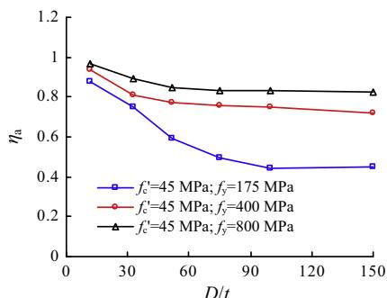  
(a)

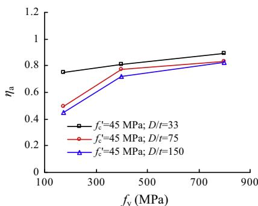  
(b)   
Fig. 3. Effects of $f _ { \mathrm { y } }$ and $D / t$ ratio on $\eta _ { \mathrm { a } }$ of circular CFST columns.

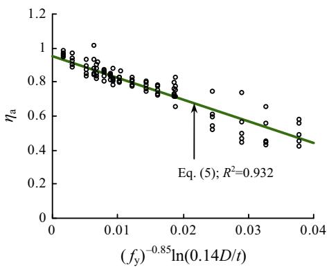  
Fig. 4. $\eta _ { \mathrm { a } }$ of circular CFST columns as a function of $f _ { \mathrm { y } }$ and $D / t$ ratio.

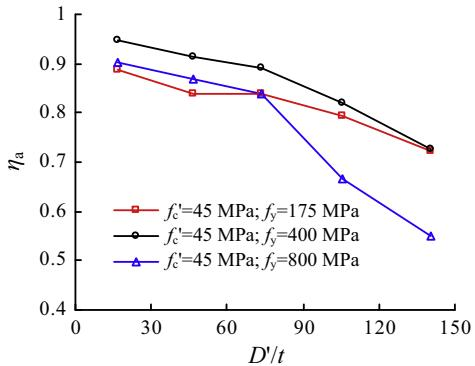  
Fig. 7. Effects of $D ^ { \prime } / t$ ratio on $\eta _ { \mathrm { a } }$ of rectangular CFST columns.

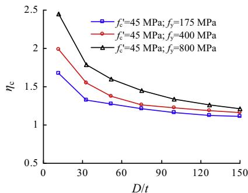

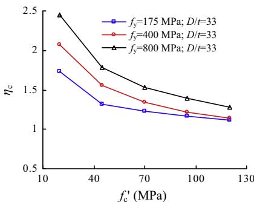  
(b)

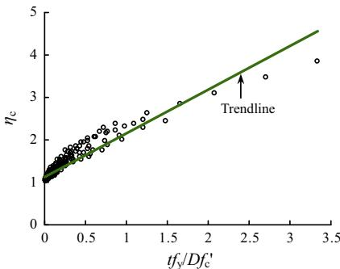  
  
Fig. 5. Effects of different parameters on $\eta _ { \mathrm { c } }$ of circular CFST columns.

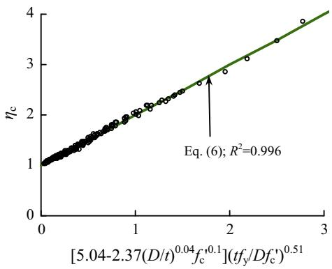  
Fig. 6. $\eta _ { \mathrm { c } }$ of circular CFST columns as a function o $\boldsymbol { f } _ { c } , D / t$ ratio and $t f _ { \mathrm { y } } / D f _ { c }$

ling, $\eta _ { \mathrm { a } }$ decreases dramatically after reaching a certain limit, as gshown in Fig. 7. This is in contrast to circular CFST columns as shown in Fig. 3a, since local buckling is less likely to occur or

occurs at a much later stage for circular tubes. Based on regression analysis, the following equation is proposed to predict $\eta _ { \mathrm { a } }$ for the rectangular CFST columns:

$$
\begin{array}{l} \eta_ {\mathrm {a}} = 0. 9 1 + 7. 3 1 \times 1 0 ^ {- 5} f _ {\mathrm {y}} \\ - \left(1. 2 8 \times 1 0 ^ {- 6} + 2. 2 6 \times 1 0 ^ {- 8} f _ {\mathrm {y}}\right) \left(\frac {D ^ {\prime}}{t}\right) ^ {2} \tag {7} \\ \end{array}
$$

where the unit o $f _ { \mathrm { y } }$ is MPa. By comparing with simulation data, the accuracy of the proposed model for $\eta _ { \mathrm { a } }$ can be seen in Fig. 8.

gFor rectangular CFST columns, it is well known that only concrete in the core and at the corners is effectively confined while the confinement to the rest is negligible. The concept of effective confining area is often used to account for this effect. Based on this concept, Lam and Teng [30] proposed an equivalent confining coefficient $k _ { s }$ , which is adopted in this paper:

$$
k _ {s} = \frac {1}{3} \left(\frac {b}{h}\right) ^ {2} = \frac {1}{3} \left(\frac {B - 2 t}{H - 2 t}\right) ^ {2} \tag {8}
$$

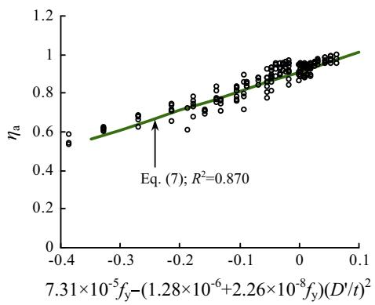  
Fig. 8. $\eta _ { \mathrm { a } }$ of rectangular CFST columns as a function of $f _ { \mathrm { y } }$ and $D ^ { \prime } / t$ ratio.

where $b$ and $h$ are the width and height of the rectangular concrete core. When $h / b$ increases from 1 to 2, $k _ { s }$ decreases from 0.333 to 0.083.

Parametric analysis indicates that $\eta _ { \mathrm { c } }$ of rectangular CFST columns is mainly affected by the $t f _ { \mathrm { y } } / D ^ { \prime } f _ { c }$ ratio, as shown in Fig. 9a. This trend is similar to that observed in Fig. 5c for circular CFST columns. Meanwhile, it is found that $\eta _ { \mathrm { c } }$ is also slightly affected by $k _ { s } ,$ as well as by $f _ { \mathrm { y } }$ gas shown in Fig. 9b and c. However, for rectangular CFST columns with very compact section $( D ^ { \prime } / t = 1 7 )$ , the influence of $f _ { \mathrm { y } }$ becomes more pronounced. Based on regression analysis, Eq. (9) is proposed to predict $\eta _ { \mathrm { c } } ,$ which is a function of $k _ { s } , f _ { \mathrm { y } }$ and $t f _ { \mathrm { y } } / D ^ { \prime } f _ { c }$ :

$$
\eta_ {\mathrm {c}} = 0. 9 8 + 2 9. 5 \left(f _ {\mathrm {y}}\right) ^ {- 0. 4 8} k _ {\mathrm {s}} ^ {0. 2} \left(\frac {t f _ {\mathrm {y}}}{D ^ {\prime} f _ {\mathrm {c}} ^ {\prime}}\right) ^ {1. 3} \tag {9}
$$

where the unit for $f _ { \mathrm { y } }$ is MPa. The accuracy of the proposed model for $\eta _ { \mathrm { c } }$ can be seen from the comparison with numerical data shown in gFig. 10.

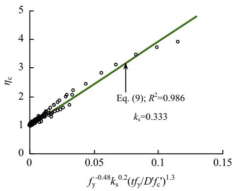  
Fig. 10. $\eta _ { \mathrm { c } }$ of rectangular CFST columns as a function of $k _ { s } , f _ { \mathrm { y } }$ and $t f _ { \mathrm { y } } / D ^ { \prime } f _ { c }$ .

# 4.3. Prediction accuracy

Calculated ultimate strengths $( N _ { \mathrm { u c } } )$ from Eq. (4) are compared with FE predictions $\left( N _ { \mathrm { u , F E } } \right)$ of circular and rectangular CFST columns, as shown in Fig. 11. Very good agreement is achieved between $N _ { \mathrm { u c } }$ and $N _ { \mathrm { u , F E } }$ for all the 499 numerical examples. This is in contrast to the EN1994 predictions as shown in Fig. 2. For circular CFST stub columns, the improvement of the current model against EN1994 model can be further seen from the comparisons shown in Table 2 for both groups of samples $( t f _ { \mathrm { y } } / D f _ { c } < 0 . 5$ and $t f _ { \mathrm { y } } /$ $D P _ { c } \geqslant 0 . 5 $ . Similarly, for rectangular CFST stub columns, the improvement of the current model against EN1994 model can be found from the comparisons shown in Table 3 for three groups of samples $( t f _ { \mathrm { y } } / D ^ { \prime } f _ { c } < 0 . 7 0 7$ and $H / t > 1 0 0 \sqrt { 2 3 5 / f _ { y } }$ ; $t f _ { \mathrm { y } } / D ^ { \prime } f _ { c } < 0 . 7 0 7$ and $H / t \leqslant 1 0 0 \sqrt { 2 3 5 / f _ { y } }$ ; and $t f _ { \mathrm { y } } / D ^ { \prime } f _ { c } \geqslant 0 . 7 0 7 ;$ ).

Calculated strengths of $N _ { \mathrm { u c } }$ from Eq. (4) are further compared with test strengths $( N _ { \mathrm { u e } } )$ retrieved from the load-deformation curves of 118 circular CFST columns and 177 rectangular CFST

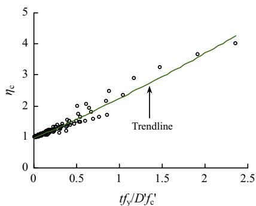  
(a)

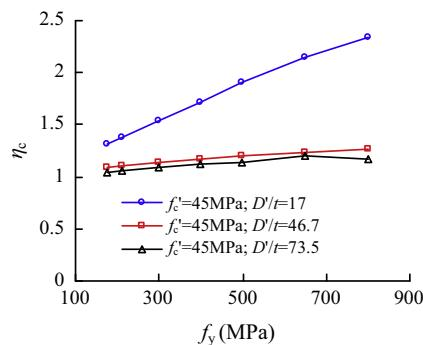  
( b)

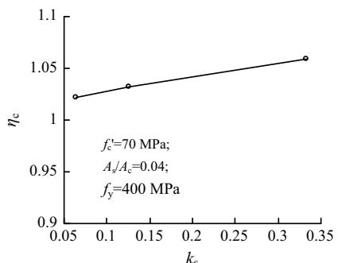  
  
Fig. 9. Effects of different parameters on $\eta _ { \mathrm { c } }$ of rectangular CFST columns.

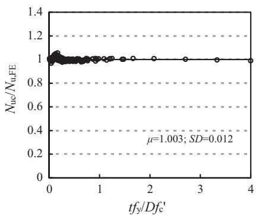  
(a) Circular CFST

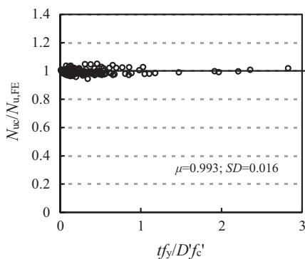  
(b) Rectangular CFST   
Fig. 11. Comparison between $N _ { \mathrm { u c } }$ and $N _ { \mathrm { u , F E } }$ of CFST columns.

columns as shown in Figs. 12a and 13a, respectively. The majority of the curves were collected by Tao et al. [20] except those of four square high strength CFST specimens recently presented by Khan et al. [31]. The load-deformation curves of 24 circular columns and 21 square columns collected by Tao et al. [20] are not used in this paper since only load versus axial shortening curves were reported. The end effects caused a significant reduction in initial compressive stiffness, resulting in significant errors in determining $N _ { \mathbf { u } }$ from the load-axial shortening curves.

As expected, Figs. 12a and 13a show obvious variation in the predictions due to the unavoidable experimental errors. However, compared to the EN1994 predictions shown in Figs. 12b and 13b, obvious improvement in predictions can still be identified for the proposed simplified model. Meanwhile, the current model is also much simpler than the EN1994 model.

# 5. Proposed model for compressive stiffness

Steel exhibits a sensibly linear stress-strain relation before reaching its elastic limit. But the development of microcracks in concrete leads to the decrease of the secant modulus with an increase in stress [32]. In practice, the modulus of elasticity for concrete $\left( E _ { \mathrm { c } } \right)$ is often defined as the secant modulus corresponding to $0 . 4 f _ { c }$ . Due to the concrete cracking, the secant compressive stiffness of CFST columns also decreases with increasing compressive load. Huo et al. [33] and Yang et al. [34] defined the compressive stiffness (EA) as the secant stiffness corresponding to the column strength of $0 . 4 N _ { \mathrm { u } }$ . This definition is also adopted in this paper to derive EA from N– curves.

Values of compressive stiffness $( E A ) _ { \mathrm { F E } }$ retrieved from the numerical examples are compared in Fig. 14 with calculated stiffness based on superposition $[ ( E A ) _ { s } = E _ { s } A _ { s } + E _ { c } A _ { c } ]$ . As can be seen, only when $t f _ { \mathrm { y } } / D f _ { c }$ or $t f _ { \mathrm { y } } / D ^ { \prime } f _ { c }$ is very small, $( E A ) _ { \mathrm { F E } }$ is close to $( E A ) _ { s }$ . When $t f _ { \mathrm { y } } / D f _ { c }$ is greater than 0.3 for circular CFST columns or $t f _ { \mathrm { y } } / D ^ { \prime } f _ { c }$ is greater than 0.35 for rectangular CFST columns, $( E A ) _ { \mathrm { F E } }$ is often smaller than $( E A ) _ { s }$ . From numerical results, it is found that the steel tube normally remains elastic when the axial load reaches $0 . 4 N _ { \mathrm { u } }$ . However, the concrete stress has exceeded $0 . 4 f _ { c }$ due to the concrete confinement. If the confinement is strong, significant reduction in concrete stiffness might occur. Therefore, a correction factor $\kappa _ { \mathrm { c } }$ is introduced for the concrete stiffness and Eq. (10) is projposed to predict EA

$$
E A = E _ {\mathrm {s}} A _ {\mathrm {s}} + \kappa_ {\mathrm {c}} E _ {\mathrm {c}} A _ {\mathrm {c}} \tag {10}
$$

# 5.1. Determining $\kappa _ { c }$ for circular CFST columns

From Eq. (10), $\kappa _ { \mathrm { c } }$ can be expressed as $( E A - E _ { s } A _ { s } ) / E _ { c } A _ { c } .$ Accordingly, $\kappa _ { \mathrm { c } }$ jcan be calculated once EA is determined from numerical jsimulation. Parametric analysis indicates that $\kappa _ { \mathrm { c } }$ is mainly affected by the $D / t$ ratio and $t f _ { \mathrm { y } } / D f _ { c }$ jfor circular CFST columns. As exhibited in Figs. 14a and 15a, $\kappa _ { \mathrm { c } }$ decreases with increasing $t f _ { \mathrm { y } } / D f _ { c }$ or decreasing $D / t$ jratio. This confirms that the reduction in concrete stiffness increases with an increase in concrete confinement.

Based on regression analysis, the following equation is proposed to determine $\kappa _ { \mathrm { c } }$ for circular CFST columns:

$$
\kappa_ {c} = \left(\frac {D}{t}\right) ^ {0. 0 0 4} + \left(\frac {t f _ {\mathrm {y}}}{D f _ {\mathrm {c}} ^ {\prime}}\right) ^ {1. 5} \left[ 5 6. 8 - 5 6. 3 \left(\frac {D}{t}\right) ^ {0. 0 0 4} \right] \leqslant 1 \tag {11}
$$

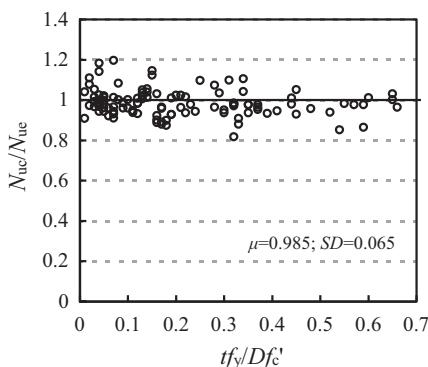  
(a) Current model

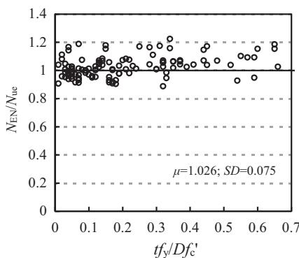  
(b) EN1994 model   
Fig. 12. Comparison between $N _ { \mathrm { u c } }$ $N _ { \mathrm { E N } }$ and $N _ { \mathrm { u e } }$ of circular CFST columns.

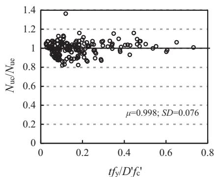  
(a) Current model

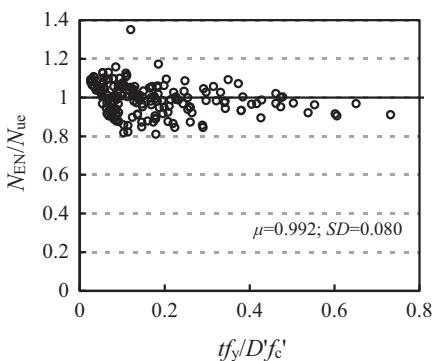  
(b) EN1994 model

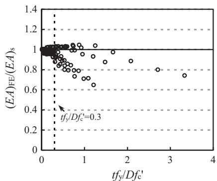  
Fig. 13. Comparison between Nuc, NEN and $N _ { \mathrm { u e } }$ of rectangular CFST columns.   
(a) Circular CFST

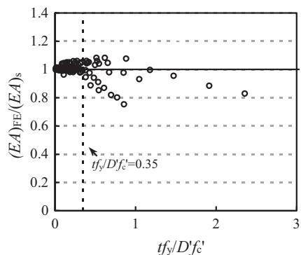  
(b) Rectangular CFST

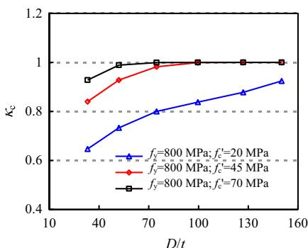  
Fig. 14. Comparison between $( E A ) _ { \mathrm { F E } }$ and $( E A ) _ { s }$   
(a) Circular CFST

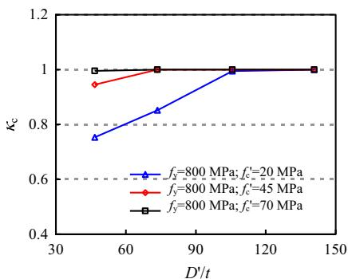  
(b) Rectangular CFST   
Fig. 15. Effects of $D / t$ (or $D ^ { \prime } / t )$ ratio on concrete stiffness of CFST columns.

where the units for $f _ { \mathrm { y } }$ and $f _ { c }$ are MPa. The coefficient of determination $R ^ { 2 }$ is 0.886 for the $\kappa _ { \mathrm { c } }$ regression. As can be seen from Fig. 16, the predicted values of $\kappa _ { \mathrm { c } }$ jagree very well with numerical data.

# 5.2. Determining $\kappa _ { c }$ for rectangular CFST columns

Similar to circular CFST columns, $\kappa _ { \mathrm { c } }$ decreases with increasing tfy/D0 f0 or decreasing $D ^ { \prime } / t$ jratio for rectangular CFST columns, as can be seen from Figs. 14b and 15b. Based on regression analysis, the following formula is proposed to calculate $\kappa _ { \mathrm { c } }$ for rectangular CFST columns:

$$
\kappa_ {\mathrm {c}} = \left(\frac {D ^ {\prime}}{t}\right) ^ {0. 0 0 3} + \left(\frac {t f _ {\mathrm {y}}}{D ^ {\prime} f _ {\mathrm {c}} ^ {\prime}}\right) ^ {2. 3} \left[ 1 0 3. 1 2 - 1 0 2. 2 6 \left(\frac {D ^ {\prime}}{t}\right) ^ {0. 0 0 3} \right] \leqslant 1 \tag {12}
$$

where the units for $f _ { \mathrm { y } }$ and $f _ { c }$ are MPa. The coefficient of determination $R ^ { 2 }$ is 0.935 for the $\kappa _ { \mathrm { c } }$ regression. The comparison shown in jFig. 17 demonstrates that the predicted values of $\kappa _ { \mathrm { c } }$ have a good agreement with the simulated results.

# 5.3. Prediction accuracy

The predicted values of compressive stiffness $( E A ) _ { \mathrm { c } }$ using Eq. (10) are compared with FE predictions $( E A ) _ { \mathrm { F E } }$ , as shown in Fig. 18. For the samples of 270 circular CFST columns, the average value $( \mu )$ and standard deviation coefficient (SD) of $( E A ) _ { \mathrm { c } } / ( E A ) _ { \mathrm { F E } }$ are l1.000 and 0.012, respectively. Meanwhile, for the samples of 229 rectangular CFST columns, $\mu$ and SD of $( E A ) _ { \mathrm { c } } / ( E A ) _ { \mathrm { F E } }$ are 0.997 and

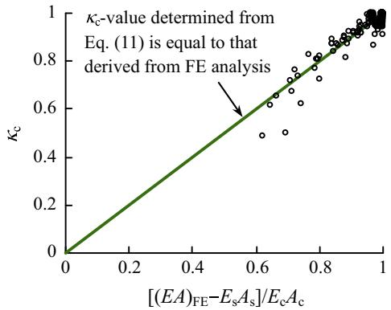  
Fig. 16. Prediction accuracy of $\kappa _ { \mathrm { c } }$ for circular CFST columns.

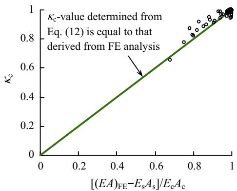  
Fig. 17. Prediction accuracy of $\kappa _ { \mathrm { c } }$ for rectangular CFST columns.

0.010, respectively. Thus, it is confirmed that the proposed simplified model for compressive stiffness has very good accuracy.

# 6. Proposed model for compressive strain corresponding to the ultimate strength

The compressive strain $\left( \varepsilon _ { \mathrm { c } } \right)$ corresponding to the ultimate estrength to some extent reflects the deformation ability and ductility of a CFST stub column, which may be of interest to the designers. $\varepsilon _ { \mathrm { c } }$ -values obtained from numerical simulation $\left( \varepsilon _ { \mathrm { c , F E } } \right)$ are used e eto analyse the influence of different parameters. It is found that $\varepsilon _ { \mathrm { c , F E } }$ normally increases with increasing $f _ { \mathrm { y } }$ and decreasing $f _ { c }$ or $D / t$ e(or $D ^ { \prime } / t )$ ratio, as shown in Figs. 19 and 20. This indicates the increasing influence of concrete confinement. The higher the concrete confinement, the larger the compressive strain $\varepsilon _ { \mathrm { { C } } }$ .

For rectangular CFST columns, it is also observed from Fig. 20b that $\varepsilon _ { \mathrm { c , F E } }$ increases with an increase in $f _ { c }$ when the $D ^ { \prime } / t$ ratio is e106.1 or 141.4. This is owing to the fact that the concrete confinement is very moderate in thin-walled rectangular CFST columns. In this case, $\varepsilon _ { \mathrm { c } }$ of a composite column is mainly determined by the epeak strain $\left( \varepsilon _ { 0 } \right)$ corresponding to the ultimate strength of the eunconfined concrete, which increases with increasing $f _ { c }$ [20].

Based on nonlinear regression analysis, Eq. (13a) and (13b) are proposed to predict $\varepsilon _ { \mathrm { { C } } }$ for circular and rectangular CFST stub columns, respectively:

$$
\begin{array}{l} \varepsilon_ {\mathrm {c}} = 3 0 0 0 - 1 0. 4 f _ {\mathrm {y}} ^ {1. 4} \left(f _ {\mathrm {c}} ^ {\prime}\right) ^ {- 1. 2} \left[ 0. 7 3 - 3 7 8 5. 8 (D / t) ^ {- 1. 5} \right] \\ \leqslant 1 0 0 0 0 \mu \varepsilon \text {f o r c i r c u l a r C F S T} \tag {13a} \\ \end{array}
$$

$$
\begin{array}{l} \varepsilon_ {c} = 2 3 0 0 + 3 1. 2 f _ {c} ^ {0. 7} \\ + \left(2. 3 2 \times 1 0 ^ {4} - 3. 8 8 \times 1 0 ^ {6} f _ {\mathrm {c}} ^ {\prime - 1. 8}\right) \left(\frac {t f _ {\mathrm {y}}}{D ^ {\prime} f _ {\mathrm {c}} ^ {\prime}}\right) ^ {2} \text {f o r r e c t a n g u l a r C F S T} \tag {13b} \\ \end{array}
$$

where the units for $f _ { \mathrm { y } }$ and $f _ { c }$ are MPa.

Fig. 21 compares the predicted compressive strains $\left( \varepsilon _ { \mathrm { c , c } } \right)$ from Eq. (13) with the FE predictions $\left( \varepsilon _ { \mathrm { c , F E } } \right)$ e. For the 270 circular CFST samples, the average value $( \mu )$ e and standard deviation (SD) of the $\varepsilon _ { \mathrm { c , c } } / \varepsilon _ { \mathrm { c , F E } }$ lratio are 0.999 and 0.052, respectively; whereas the corree esponding values are 0.999 and 0.053, respectively, for the 229 rectangular CFST samples. Due to the influence of possible local buckling, it seems that the predictions for rectangular columns are less accurate than those for circular columns. Despite this, the predictions of the simplified model for the ultimate strain are still reasonable.

# 7. Capacity factor calibration

To ensure safety and serviceability of structures, it is required by design codes to apply safety factors to materials or the resistance equations. Accordingly, capacity reduction factors for steel $\left( \phi \right)$ and concrete $\left( \phi _ { \mathrm { c } } \right)$ are introduced into Eq. (4) to calculate the / /nominal section capacity $( N _ { \mathrm { u s } } )$ :

$$
N _ {\mathrm {u s}} = \phi \eta_ {\mathrm {a}} f _ {\mathrm {y}} A _ {\mathrm {s}} + \phi_ {\mathrm {c}} \eta_ {\mathrm {c}} f _ {\mathrm {c}} ^ {\prime} A _ {\mathrm {c}} \tag {14}
$$

In the Australian code AS 4100 [6], the specified values are 0.9 and 0.6 for $\phi$ and $\phi _ { \mathbf { c } } ,$ respectively. Since Eq. (14) is different from / /that in AS 4100 for predicting $N _ { { \mathrm { u s } } } ,$ , it is necessary to recalibrate the capacity reduction factors in this equation.

Kang et al. [26] recently recalibrated the capacity reduction factors in AS 4100 used for CFST stub columns based on the statistical method proposed by Johnson and Huang [35]. This method

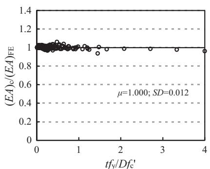  
(a) Circular CFST

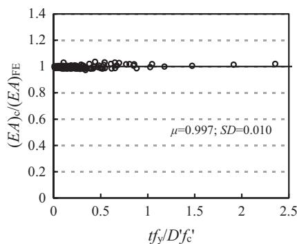  
(b) Rectangular CFST   
Fig. 18. Comparison between $( E A ) _ { \mathrm { c } }$ and $( E A ) _ { \mathrm { F E } }$ of CFST columns.

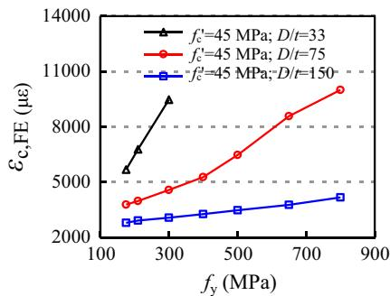  
(a)

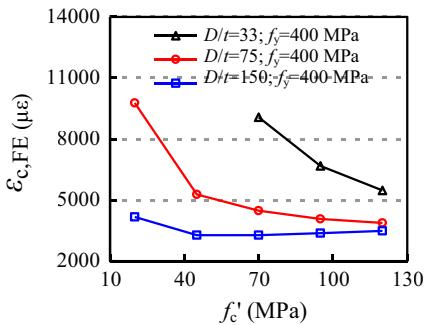  
(b)

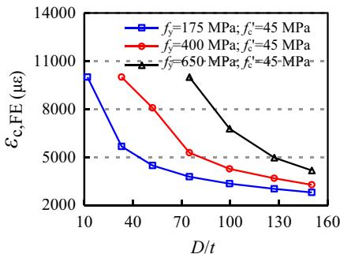  
(c)

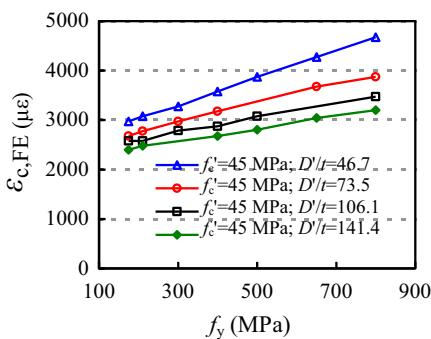  
Fig. 19. Effects of $f _ { \mathbf { y } } , f _ { c }$ and $D / t$ ratio on compressive strains of circular CFST columns.   
(a)

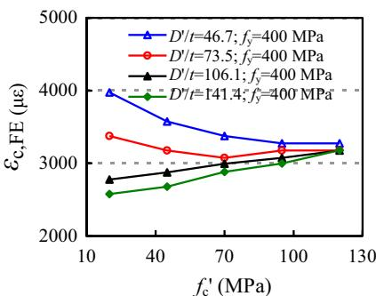  
(b)

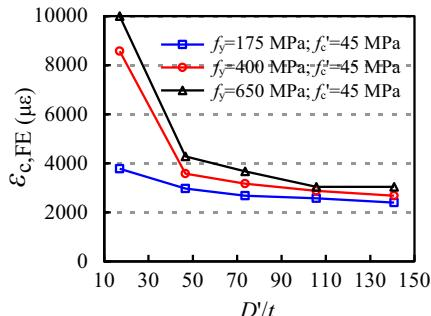  
(c)   
Fig. 20. Effects of $f _ { \mathrm { y } } , f _ { c }$ and $D ^ { \prime } / t$ ratio on compressive strains of rectangular CFST columns.

calibrates multiple capacity factors extensively applying the theoretical background of the statistical method given in EN 1990 Annex D.8 [36]. This method provides procedures for calibrating multiple capacity factors as the ratio of the design resistance to the nominal resistance utilising experimental data.

The detailed procedure presented by Kang et al. [26] is followed in this paper. The target reliability index for both resistance and

load effects can be taken as 3.8 (equivalent to the probability of the actual strength lower than the design strength of 0.0012). To consider the resistance effect separately from the load effect, a FORM sensitivity factor of 0.8 is multiplied to the target reliability index, and the reliability index for resistance only is calculated as $\beta = 3 . 8 \times 0 . 8 = 3 . 0 4$ [37]. The test ultimate strengths $( N _ { \mathrm { u e } } )$ retrieved bfrom the load-deformation curves of 118 circular CFST columns

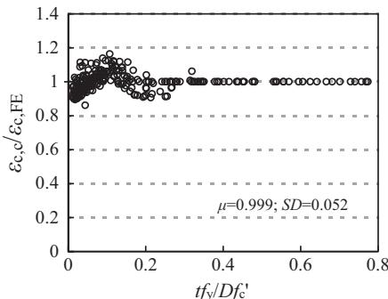  
(a) Circular CFST

  
(b) Rectangular CFST

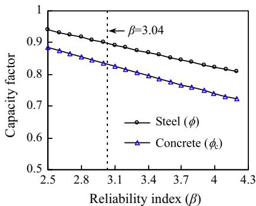  
Fig. 21. Comparison between $\varepsilon _ { \mathrm { c , c } }$ and $\varepsilon _ { \mathrm { c , F E } }$ of CFST columns.   
(a) Circular CFST

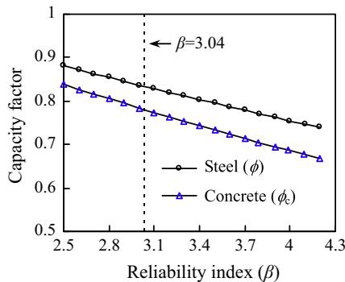  
(b) Rectangular CFST   
Fig. 22. Capacity factor versus reliability index for CFST columns.

Table 4 COV of input parameters.   

<table><tr><td>Variable</td><td>COV</td><td>Ref.</td></tr><tr><td>Yield stress of steel (fy)</td><td>0.07</td><td>[38]</td></tr><tr><td>Compressive strength of concrete (fpc)</td><td>0.10</td><td>[39,40]</td></tr><tr><td>All linear dimensions (D, B, and H)</td><td>0.01</td><td>[6,41]</td></tr><tr><td>Tube thickness (t)</td><td>0.10</td><td>[41]</td></tr></table>

and 177 rectangular CFST columns shown in Figs. 12 and 13 are used for the calibration. In the calibration process, it is assumed that the mean values of the input parameters (material strengths and cross-sectional dimensions) are taken as the mean measured values from the tests, and the coefficients of variation of the input parameters are obtained from the design codes [6,38–41], as presented in Table 4.

Fig. 22 presents the calibrated capacity reduction factors $\cdot$ or $\phi _ { \mathrm { c } } )$ ) as a function of target reliability index $( \beta )$ /. Values of both $\phi$ /and $\phi _ { \mathrm { c } }$ decrease with increasing $\beta$ b /. When the target reliability index / bis taken as 3.04, the capacity reduction factors $\cdot$ and $\phi _ { \mathrm { c } } \mathrm { . }$ ) for circu-/ /lar CFST stub columns are 0.90 and 0.83; whereas those for rectangular CFST columns are 0.83 and 0.78, as shown in Table 5. As can

Table 5 Reliability indices when the target reliability index is taken as 3.04.   

<table><tr><td>Section type</td><td>Number of specimens</td><td colspan="2">Capacity factors</td></tr><tr><td rowspan="2">Circular</td><td rowspan="2">118</td><td>When φ is not fixed</td><td>φ = 0.90 and φc = 0.83</td></tr><tr><td>When φ is fixed as 0.90</td><td>φ = 0.90 and φc = 0.83</td></tr><tr><td rowspan="2">Rectangular</td><td rowspan="2">177</td><td>When φ is not fixed</td><td>φ = 0.83 and φc = 0.78</td></tr><tr><td>When φ is fixed as 0.90</td><td>φ = 0.90 and φc = 0.74</td></tr></table>

  
(a) Circular CFST

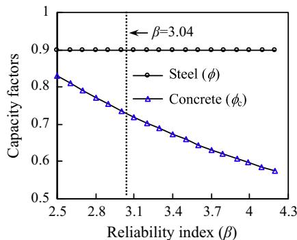  
(b) Rectangular CFST   
Fig. 23. Concrete capacity factor versus reliability index when $\phi$ is taken as 0.9.

be seen, the capacity reduction factors for rectangular columns are smaller than those of circular columns due to the larger scatter of the predictions using Eq. (4) for rectangular columns, as shown in Fig. 13. In design, smaller values of 0.83 and 0.78 may be used for $\phi$ and $\phi _ { \mathbf { c } } ,$ respectively, in all cases.

/To clearly demonstrate the influence of using new capacity factors for the proposed equations rather than those specified in AS 4100 [6], the steel capacity factor $\left( \phi \right)$ may be fixed to a constant /value of 0.9 as specified in AS 4100, and the concrete capacity factor $\left( \phi _ { \mathsf { c } } \right)$ can be calibrated using the same procedure. The obtained /results are shown in Fig. 23. When $\beta$ is taken as 3.04, the obtained values of $\phi _ { \mathsf { c } }$ bare 0.83 and 0.74 for circular and rectangular columns, /respectively. For design purposes, a constant $\phi _ { \mathsf { c } }$ of 0.74 may be /used for all CFST columns, and this value is higher than the value of 0.6 specified in AS 4100 [6]. Clearly, higher nominal section capacities will be obtained for CFST stub columns if the proposed capacity reduction factors are used for steel and concrete. It should be noted that the strength predictions when $\phi$ and $\phi _ { \mathrm { c } }$ are taken as / /0.83 and 0.78 respectively are virtually the same as those when $\phi$ is taken as 0.9 and $\phi _ { \mathrm { c } }$ as 0.74. The errors are within $5 \%$ .

# 8. Conclusions

This paper focused on the predictions of compressive strength and corresponding strain as well as compressive stiffness of circular and rectangular concrete-filled steel stub columns subjected to axial compression. Through the current investigation, the following conclusions can be obtained:

(1) Existing design codes have various limitations in predicting the compressive strength. The new simplified models proposed in this paper cover a wide range of parameters: diameter-to-thickness ratio $( D / t = 1 2 – 1 5 0 )$ ; width-tothickness ratio $( B / t = 1 2 – 1 0 0 )$ ; height-to-width ratio $( H /$ $B = 1 - 2 ,$ ); yield stress of steel $( f _ { \mathrm { y } } = 1 7 5 { \ - } 9 6 0 \mathrm { M P a } )$ and concrete cylinder compressive strength $( f _ { c } = 2 0 - 1 2 0 \mathrm { M P a }$ ). The effects of concrete confinement and possible local buckling of the steel tube have been implicitly included in the models, which simplifies the strength calculation.   
(2) Based on numerical data, simplified models have been proposed for the predictions of compressive stiffness and compressive strain corresponding to the ultimate strength. These models can be used in structural analysis and to assist the evaluation of ductility and deformation capacity.   
(3) To assist the use of the new strength prediction models, capacity reduction factors for the steel and concrete materials have been recalibrated to achieve a target reliability index of 3.04 when considering resistance effect only. The capacity reduction factors can be taken as 0.83 and 0.78 for the steel and concrete, respectively.

# Acknowledgements

This work is supported by the Australian Research Council Discovery Project (Grant No.: DP170100001). It has also been supported by the China Scholarship Council.

# References

[1] Shanmugam NE, Lakshmi B. State of the art report on steel-concrete composite columns. J Constr Steel Res 2001;57(10):1041–80.   
[2] Han LH. Tests on stub columns of concrete-filled RHS sections. J Constr Steel Res 2002;58(3):353–72.   
[3] Han LH, Li W, Bjorhovde R. Developments and advanced application of concrete-filled steel tubular (CFST) structures: members. J Constr Steel Res 2014;100(9):211–28.

[4] Tao Z, Song TY, Uy B, Han LH. Bond behavior in concrete-filled steel tubes. J Constr Steel Res 2016;120:81–93.   
[5] Architectural Institute of Japan (AIJ). Recommendations for design and construction of concrete filled steel tubular structures. Tokyo (Japan): AIJ; 1998.   
[6] Standards Australia. Bridge design, Part 6: steel and composite construction. AS5100.6-2004, Sydney, Australia; 2004.   
[7] European Committee for Standardization (CEN). Design of composite steel and concrete structures - Part 1-1: general rules and rules for buildings. EN 1994- 1-1 Eurocode 4, Brussels; 2004.   
[8] American Institute of Steel Construction (AISC). Specification for structural steel buildings. AISC 360-10, Chicago (IL); 2010.   
[9] American Concrete Institute. Building code requirements for structural concrete and commentary. ACI 318-11, Farmington Hills, MI; 2011.   
[10] DBJ 13-51-2010. Development of Fujian Province, technical specification for concrete-filled steel tubular structures. Department of Housing and Urban; 2010 [in Chinese].   
[11] Lu ZH, Zhao YG. Suggested empirical models for the axial capacity of circular CFT stub columns. J Constr Steel Res 2010;66(6):850–62.   
[12] Aslani F, Uy B, Tao Z, Mashiri F. Predicting the axial load capacity of highstrength concrete filled steel tubular columns. Steel Compos Struct 2015;19 (4):967–93.   
[13] Tao Z, Uy B, Han LH, He SH. Design of concrete-filled steel tubular members according to the Australian Standard AS 5100 model and calibration. Austr J Struct Eng 2008;8(3):197–214.   
[14] Kuranovas A, Goode D, Kvedaras AK, Zhong S. Load-bearing capacity of concrete-filled steel columns. J Civ Eng Manage 2009;15(1):21–33.   
[15] Güneyisi EM, Gültekin A, Mermerdas K. Ultimate capacity prediction of axially loaded CFST short columns. Int J Steel Struct 2016;16(1):99–114.   
[16] Chaseling C. Star attraction. Mod Steel Constr 2004;44(12):36–42.   
[17] Liew JYR, Xiong MX, Xiong DX. Design of high strength concrete filled tubular columns for tall buildings. Int J High-Rise Build 2014;3(3):215–21.   
[18] Han LH, Yao GH, Zhao XL. Tests and calculations of hollow structural steel (HSS) stub columns filled with self-consolidating concrete (SCC). J Constr Steel Res 2005;61(9):1241–69.   
[19] Ding FX, Yu ZW, Bai Y, Gong YZ. Elasto-plastic analysis of circular concretefilled steel tube stub columns. J Constr Steel Res 2011;67(10):1567–77.   
[20] Tao Z, Wang ZB, Yu Q. Finite element modelling of concrete-filled steel stub columns under axial compression. J Constr Steel Res 2013;89(10):121–31.   
[21] Giakoumelis G, Lam D. Axial capacity of circular concrete-filled tube columns. J Constr Steel Res 2004;60(7):1049–68.   
[22] Uy B, Tao Z, Han LH. Behaviour of short and slender concrete-filled stainless steel tubular columns. J Constr Steel Res 2011;67(3):360–78.   
[23] American Concrete Institute (ACI). Guide for the design and construction of externally bonded FRP systems for strengthening concrete structures. ACI 440.2R-08, USA; 2008.   
[24] International Organization for Standardization (ISO). Fire-resistance tests— elements of building construction-Part 1: general requirements. ISO 834-1, Geneva; 1999.   
[25] de Oliveira WLA, De Nardin S, de Cresce El ALH, El Debs MK. Influence of concrete strength and length/diameter on the axial capacity of CFT columns. J Constr Steel Res 2009;65(12):2103–10.   
[26] Kang WH, Uy B, Tao Z, Hicks S. Design strength of concrete-filled steel columns. Adv Steel Constr 2015;11(2):165–84.   
[27] ABAQUS. ABAQUS standard user’s manual. Version 6.9. Providence (RI, USA): Dassault Systèmes Corp.; 2009.   
[28] Tao Z, Wang XQ, Uy B. Stress–strain curves of structural and reinforcing steels after exposure to elevated temperatures. J Mater Civ Eng 2013;25(9):1306–16.   
[29] Johansson M, Gylltoft K. Mechanical behavior of circular steel-concrete composite stub columns. J Struct Eng, ASCE 2002;128(8):1073–81.   
[30] Lam L, Teng JG. Design-oriented stress–strain model for FRP-confined concrete in rectangular columns. J Reinf Plast Compos 2003;22(13):1149–86.   
[31] Khan M, Uy B, Tao Z, Mashiri F. Concentrically loaded short high strength composite columns. In: Pacific structural steel conference, Singapore; 2013.   
[32] Neville AM. Properties of concrete. FL (United States): Addison-Wesley Longman, Limited; 2011.   
[33] Huo JS, Huang GW, Xiao Y. Effects of sustained axial load and cooling phase on post-fire behaviour of concrete-filled steel tubular stub columns. J. Constr. Steel Res. 2009;65(8):1664–76.   
[34] Yang YF, Cao K, Wang TZ. Experimental behavior of CFST stub columns after being exposed to freezing and thawing. Cold Reg Sci Technol 2013;89:7–21.   
[35] Johnson RP, Huang D. Statistical calibration of safety factors for encased composite columns. Composite construction in steel and concrete III. New York (USA): ASCE; 1997. p. 380–91.   
[36] European Committee for Standardization (CEN). Basis of structural design. EN 1990: 2002 Eurocode, Brussels; 2002.   
[37] International Organization for Standardization (ISO). ISO 2394:1998 General principles on reliability for structures, Geneva, Switzerland; 1998.   
[38] Joint Committee on Structural Safety (JCSS). JCSS probabilistic model code; 2001. http://www.jcss.byg.dtu.dk/.   
[39] Standards Australia International Ltd. Concrete structures. AS 3600:2009, New South Wales, Australia; 2009.   
[40] Standards New Zealand (NZS). Specification for concrete production. NZS 3104: 2003, Wellington, New Zealand; 2003.   
[41] Standards Australia/Standards New Zealand (AS/NZS). Cold-formed structural steel hollow sections. AS/NZS 1163: 2009, Sydney, Australia; 2009.