# 钢管超高强石渣混凝土轴压短柱静力性能试验研究

陈国灿1‚2‚徐志胜1‚杨智硕1‚2‚田智友2

中南大学 土木建筑学院 湖南长沙 莆田学院 土木建筑工程学系 福建莆田

摘要：通过 个钢管超高强石渣混凝土短柱试件的轴压试验 考察其破坏形态 分析混凝土强度 试件的直径 径厚比等参数对其力学特性的影响 试验结果表明 以较低的水泥消耗量配制的超高强石渣混凝土填充至钢管内 钢管与核心混凝土界面密实 没有脱空的现象 在试验参数范围内 试件的套箍指标和混凝土强度是影响其静力特性的主要因素 试件的峰值荷载 低谷荷载及二次峰值荷载与核心混凝土的名义承载力 （fA）之比基本与套箍指标成线性关系 但变化规律有别 试件的荷载轴向平均应变曲线可以分为四个阶段,即弹性阶段、弹塑性阶段、荷载下降阶段和荷载回升阶段;套箍指标较小时 弹塑性段较短 下降段陡峭 峰值荷载后荷载下降幅值较大 套箍指标较大时 弹塑性上升段和荷载下降变形曲线较平缓 峰值荷载后荷载下降幅值较小 所有试件都呈剪切型的破坏特征 有较高的残余承载力和良好的延性 最后 给出了经回归分析得到与试验结果比较吻合的钢管超高强石渣混凝土短柱轴心受压承载力的计算公式

关键词：钢管超高强混凝土短柱 超高强石渣混凝土 静力试验 承载力 延性

中图分类号：TU TU 文献标志码：A

# Experimentalstudyonbehaviorofshortsteeltubularcolumns filledwithultra-highstrengthconcretemixedwith stone-chipsubjectedtoaxialload

CHENGuocan1‚2‚XUZhisheng1‚YANGZhishuo1‚2‚TIANZhiyou2

SchoolofCivilEngineeringandArchitecture CentralSouthUniversity Changsha China

2．DepartmentofCivilEngineering‚PutianUniversity‚Putian351100‚China）

Abstract： Basedontheexperimentalstudiesof14shortsteeltubularcolumnsfilledwithultra-highstrengthconcrete mixedwithstonechip abbreviatedasSSTCFUSCMS thispaperdescribesthefailuremodeofthistypeofshort columnssubjectedtoaxialload．Theinfluencesoftheconcretestrength‚diameteranddiameter-thicknessratioofthe steeltubeonthestaticpropertiesofthespecimensarealsoanalyzed Itisfoundthatitispossibletoeliminatethe disengagingattheinterfaceofsteeltubeandthecoreconcretebyfillingultra-highstrengthconcretemixedwithstonechip（abbreviatedasUSCMS）withreducedconsumptionofcement．Withinthescopeofthetestparameters‚boththe confinementindexandtheconcretestrengthhavegreatinfluenceonthefeaturesoftheSSTCFUSCMSspecimens subjectedtoaxialload．Therespectiveratiosofthepeakload‚theloweryieldloadandthepeakloadintheascent processofitscarryingcapacitytothenominalbearingcapacity（i．e．fcAc） ofthecoreconcretearealmostlinearly proportionaltotheconfinementindexofthespecimensfollowingdifferentrules．Experimentalresultsshowthattheload versusaveragestraincurvesofthespecimensshouldbedividedintofourstages：theelasticdeformationstage‚the elasto-plasticdeformationstage‚thedescentstageandtherecoverystageoftheloadingcarryingcapacity．The specimenswithlowerconfinementindexexhibitarapidsofteningprocessinthepost-peakregionwithatoweringpeak andashorterincrementalportionplustheweakrecoveryintheforthstage．Thespecimenswithhigherconfinement indexexhibitagradualsofteningprocessinthepost-peakregionwithachubbycurveandalongerincrementalportion plusthestrongmomentumofrecoveryintheforthstage．Theexperimentalobservationsindicatethatallspecimenshave highresidualloadcarryingcapacityandexcellentductility．Thentheformulaforpredictingtheultimateloadcarrying

capacityisdevelopedbyregressionanalysisbasedontheexperimentalresults．Thecalculatedresultshaveagood agreementwiththeexperimentalresults

Keywords： shortsteeltubularcolumnsfilledwithultrahighstrengthconcretemixedwithstonechip abbreviatedas SSTCFUSCMS）；ultra-highstrengthconcretemixedwithstone-chip（abbreviatedasUSCMS）；load-bearingcapacity； staticproperties；ductility

# 0 引言

超高强 超高性能混凝土具有比强度高 资源消耗量少等优点‚已成为近几年研究的热点领域［1-13］科技部与建设部联合发布的 十一五 国家科技支撑计划重点项目 现代建筑设计与施工关键技术研究课题申请指南中 明确要求研究利用地方原材料和普通成型工艺配制出 C 以上高性能混凝土的关键技术。

目前现代混凝土的研究中存在着盲目追求超高强度而忽视水泥消耗量的误区 活性粉末混凝土的抗压强度虽然较高但水泥消耗量过大 如文献单方混凝土的水泥消耗量高达 $8 8 4 \mathbf { k g }$ 水泥用量大不仅浪费宝贵的石灰石资源 还带来自收缩偏大等问题［1］‚在钢管混凝土中较大的自收缩将导致钢管混凝土界面脱空而影响钢管混凝土的受力性能［10］。

为妥善解决水泥用量大引发的混凝土自收缩偏大的问题［2-3］‚及由此引发的钢管与核心混凝土界面间过早脱离［5-8］的技术难题 针对本地河砂短缺的问题 作者利用本地廉价的石渣等原材料 以单方混凝土水泥消耗量低至 $3 5 0 \mathrm { k g }$ 研发了强度超过 $1 3 0 \mathrm { { M P a } }$ 的超高强石渣混凝土 其单位质量水泥贡献的质强比约为普通混凝土的 倍 约为高强混凝土的倍 为活性粉末混凝土的 倍［8］ 但是 超高强石渣混凝土同样存在着延性差的问题［2］ 因此 超高强石渣混凝土必须与其它延性材料复合共同承受荷载才能充分显示出它的优越性能。

钢管混凝土由于具有抗震性能好 承载力高 施工简便等优点 受到了人们的青睐 得到了迅速的发展［14］ 目前对钢管混凝土的研究比较深入 部分研究成果已经编入相应的规范［15-18］。但钢管超高强混

凝土的基础理论研究还很缺乏 见诸报道的研究成果也极为有限［11-13］ 而对钢管超高强石渣混凝土的研究还少见报道［5-6］。 。

事实上 由于超高强石渣混凝土本身的力学性能与混凝土 高强混凝土的特性不同［2］ 导致钢管超高强石渣混凝土具有与钢管混凝土 钢管高强混凝土不同的特性［5］ 为此 本文设计制作 个不同混凝土强度等级 不同直径及不同钢管径厚比的钢管超高强石渣混凝土短柱试件 对其进行轴压试验 研究其力学性能 为钢管超高强石渣混凝土进行深入系统的探讨和研究奠定基础

# 1 试验概况

# 1∙1 试件设计

钢管混凝土 钢管高强混凝土短柱在轴向荷载作用下的承载力的主要影响因素是套箍指标［10］ 而套箍指标与钢管的径厚比和核心混凝土强度密切相关 为此 本文共制作了 个钢管超高强石渣混凝土短柱试件 以核心混凝土强度 钢管的径厚比和试件直径为试验参数 核心混凝土的配合比及强度见表试件基本参数见表

# 1∙2 试件制作与养护

核心混凝土的配制技术 试件及试块的制作 养护详见参考文献 钢管选用 号无缝钢管 其屈服强度见表 内填超高强石渣混凝土的立方体抗压强度为 $1 1 1 . 8 { \sim } 1 3 7 . 3 \mathrm { { M P a } }$ 。

超高强石渣混凝土在强制式搅拌机中搅拌后先在钢管内装入约三分之一的混凝土 然后将钢管竖直放置于磁性振动台上 开动振动台 边振动边添料 同盘混凝土混合料留置边长为 $1 0 0 \mathrm { m m }$ 的立方体试块1组用于测试核心混凝土的抗压强度。

表1 超高强石渣混凝土配合比  
Table1 Mixofextra-highstrengthconcretemixedwithstone-chip   

<table><tr><td rowspan="2">配合比种类</td><td colspan="9">配合比</td><td rowspan="2">水胶比</td><td rowspan="2">水泥用量/kg·m-3f&lt;sub&gt;cu&lt;/sub&gt;/MPa</td></tr><tr><td>水泥</td><td>硅粉</td><td>偏高岭土</td><td>粉煤灰</td><td>石渣</td><td>碎石</td><td>减水剂</td><td></td><td></td></tr><tr><td>A3</td><td>1</td><td>0.167</td><td>0.167</td><td>0.333</td><td>2.028</td><td>3.056</td><td>0.0694</td><td>0.22</td><td></td><td>350</td><td>137.3</td></tr><tr><td>A5</td><td>1</td><td>0.175</td><td>0.175</td><td>0.338</td><td>1.750</td><td>2.575</td><td>0.0625</td><td>0.22</td><td></td><td>380</td><td>130.1</td></tr><tr><td>A6</td><td>1</td><td>0.167</td><td>0</td><td>0.500</td><td>2.028</td><td>3.056</td><td>0.0444</td><td>0.25</td><td></td><td>350</td><td>111.8</td></tr></table>

注 养护条件为绝湿养护 $\mathrm { f _ { c u } }$ 为超高强石渣混凝土 $1 0 0 \mathrm { m m }$ 立方体 d的抗压强度

表2 试件基本参数  
Table2 Parametersofspecimens   

<table><tr><td>试件编号</td><td>D × t /mm</td><td>D/t</td><td>L / mm</td><td>L/D</td><td>fy / MPa</td><td>配合比种类</td><td>fu / MPa</td><td>θ</td></tr><tr><td>G106</td><td>121.0×5.0</td><td>24.2</td><td>370</td><td>3.1</td><td>295</td><td>A3</td><td>137.3</td><td>0.57796</td></tr><tr><td>G112</td><td>127.4×5.7</td><td>22.4</td><td>390</td><td>3.1</td><td>295</td><td>A3</td><td>137.3</td><td>0.63294</td></tr><tr><td>G118</td><td>127.4×8.5</td><td>15.0</td><td>390</td><td>3.1</td><td>295</td><td>A3</td><td>137.3</td><td>1.01807</td></tr><tr><td>G124</td><td>152.0×5.5</td><td>27.6</td><td>465</td><td>3.1</td><td>295</td><td>A3</td><td>137.3</td><td>0.49759</td></tr><tr><td>G130</td><td>133.0×5.0</td><td>26.6</td><td>405</td><td>3.1</td><td>275</td><td>A3</td><td>137.3</td><td>0.48417</td></tr><tr><td>G132</td><td>121.0×5.0</td><td>24.2</td><td>370</td><td>3.1</td><td>295</td><td>A5</td><td>130.1</td><td>0.60994</td></tr><tr><td>G135</td><td>127.4×5.7</td><td>22.4</td><td>390</td><td>3.1</td><td>295</td><td>A5</td><td>130.1</td><td>0.66797</td></tr><tr><td>G141</td><td>127.4×8.5</td><td>15.0</td><td>390</td><td>3.1</td><td>295</td><td>A5</td><td>130.1</td><td>1.07441</td></tr><tr><td>G147</td><td>152.0×5.5</td><td>27.6</td><td>465</td><td>3.1</td><td>295</td><td>A5</td><td>130.1</td><td>0.52513</td></tr><tr><td>G153</td><td>133.0×5.0</td><td>26.6</td><td>405</td><td>3.1</td><td>275</td><td>A5</td><td>130.1</td><td>0.51096</td></tr><tr><td>G137</td><td>127.4×5.7</td><td>22.4</td><td>390</td><td>3.1</td><td>295</td><td>A6</td><td>111.8</td><td>0.77731</td></tr><tr><td>G143</td><td>127.4×8.5</td><td>15.0</td><td>390</td><td>3.1</td><td>295</td><td>A6</td><td>111.8</td><td>1.25027</td></tr><tr><td>G149</td><td>152.0×5.5</td><td>27.6</td><td>465</td><td>3.1</td><td>295</td><td>A6</td><td>111.8</td><td>0.61109</td></tr><tr><td>G155</td><td>133.0×5.0</td><td>26.6</td><td>405</td><td>3.1</td><td>275</td><td>A6</td><td>111.8</td><td>0.5946</td></tr></table>

注 D为钢管外径 t为钢管厚度 L为钢管的长度 f为钢管的屈服强度 $\theta ^ { \prime } { = } \ f _ { \mathrm { { s } } } \operatorname { A } _ { \mathrm { { s } } } / ( \ f _ { \mathrm { { c u } } } \operatorname { A } _ { \mathrm { { c } } } )$ ）为广义套箍指标 $\mathrm { f _ { v } \cdot A _ { s } }$ 为钢管材料屈服强度及钢管截面面积 $\mathrm { f _ { c u v } \ A _ { c } }$ 为核心混凝土立方体抗压强度和核心混凝土截面面积；套箍指标 $\theta = \mathrm { f _ { y } A _ { s } } / ( \mathrm { f _ { c } A _ { c } } ) = \theta ^ { \prime } / \alpha ,$ ‚根据式 （7） $\alpha = \mathrm { f _ { c } } / \mathrm { f _ { c u } } = 0 . 7 ,$ ‚ $\mathrm { f _ { c } }$ 为核心混凝土圆柱体抗压强度。  
由于同时进行其它试验 所以试件的编号不连续

试件成型后 立即用塑料保鲜膜封闭上端 在实验室内进行绝湿养护 混凝土试块拆模后 用塑料袋包裹隔绝空气与试件接近同条件养护

# 1∙3 测试内容及加载制度

短柱试件成型 d后 托运到长沙做测试的准备工作 即将试件端面磨平 粘贴应变片等 加载与量测装置见图 沿着环向等间距的 对应变片粘贴在钢管的中部附近 用以测量钢管表面的纵向 环向应变。

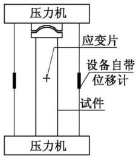  
图 加载与量测装置  
Fig．1 Testset-up

钢管超高强石渣混凝土试件的测试工作在中南大学铁道校区的土木工程安全实验室进行 核心混凝土的测试见文献 轴向荷载 位移数据由试验机自带的软件自动采集 轴向 横向的应变则通过DH 静态应变测试仪由电脑自动采集

本试验采用分级加载 每级荷载近似取 $2 5 0 \mathrm { k N } ,$ 约为极限荷载的 达到每级荷载后 持荷约min达到极限荷载后则连续加载 直至试件达到极限变形时 终止试验

# 2 试验结果与分析

# 2∙1 加载前试件的宏观特点

超高强石渣混凝土由于采用低水泥消耗量配制混凝土的方案 加上石渣中石粉的惰性填充效应 混凝土的收缩量明显减小 试件的制作与养护过程观察表明 内置超高强石渣混凝土的收缩量不大 试件表面均不需要采用高强砂浆补平 采用简易方法检查 钢管与核心混凝土界面未出现明显的脱空现象

# 2∙2 试件破坏过程与形态描述

# 试件的破坏特征

对钢管超高强石渣混凝土轴压短柱试验的全过程观察表明 在本次试验参数范围内 破坏发展过程基本相似

在加载的初期 钢管超高强石渣混凝土处于弹性阶段时 试件的外观基本上没有明显的变化。  
当钢管表面的铁锈 附着物等逐渐脱落时‚荷载-变形关系曲线逐渐偏离原来的直线轨随着变形的增大 钢管外表面逐渐形成斜向的滑同时在两端 或在钢管的中部薄弱部位逐渐外此时 表盘上的指针回转 荷载 变形曲线上出现段；随后‚荷载-变形曲线止跌回升‚钢管进入强段 随着荷载的不断增大 试件终因剪切变形过而破坏（图2）。

试验结束时触摸试件的外凸部位和剪切面的外表面感到有点发烫 割开钢管后可见到 $\textcircled{1}$ 核心混凝土基本上仍是一个整体 图 $\mathrm { 2 b }$ ）； $\textcircled{2}$ 核心混凝土被剪切面分割为若干个完好无损的块体 剪切破坏面上混凝土摩擦粉化后呈现灰白色 图 $2 \mathrm { e } ^ { \sim 2 } \mathrm { e }$ ）。

钢管的径厚比越大 吕德尔滑移斜线越明显 本次试验所用的最大外径为 $1 5 2 \mathrm { m m }$ 的试件均有最明显的滑移斜线（图2a）。  
（4）所有的试件都呈现剪切型破坏的特征。

# 2∙2∙2 试件的剪切破坏机理分析

超高强石渣混凝土在单向受压变形过程中 在临近极限状态时才在内部产生裂缝 而裂缝一旦产生即迅速扩展形成剪切破裂面 瞬间崩裂破坏 图表现出高度脆性特征 超高强石渣混凝土的泊松比 约为 横向应变与纵向应变的比值几乎保持不变 图 ［2］ 小于钢管的泊松比 据此推断 在核心混凝土的横向应变与纵向应变之比达到钢管的泊松比之前 钢管与混凝土界面上的径向相互作用力为零 钢管 核心混凝土基本上处于单向受压状态。

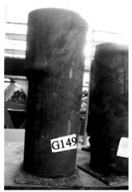  
（a）试件G149

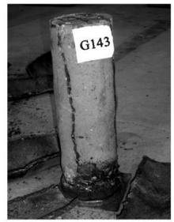  
（b）试件G143

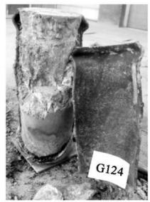  
（c）试件G124

  
（d）试件G149

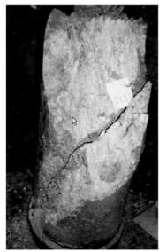  
（e）试件G121

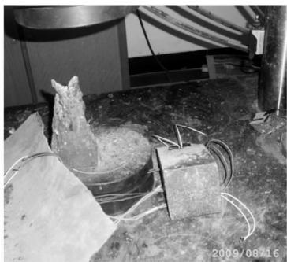  
图 钢管超高强石渣混凝土轴心受压短柱的破坏形态  
Fig．2 Failuremodeofspecimens   
图3 超高强石渣混凝土的破坏形态

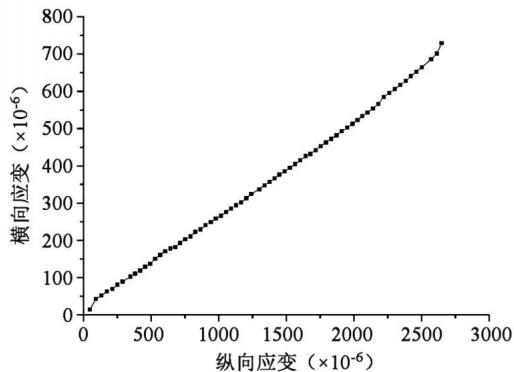  
Fig．3 FailuremodeofUSCMS   
图 超高强石渣混凝土横向应变与纵向应变的关系曲线 ［2］  
Fig．4 Transversestrainvs∙longitudinalstrainofUSCMS［2］

当核心混凝土接近极限状态 在混凝土内产生了微裂缝 并形成剪切面 核心混凝土沿着剪切面相对滑动 当横向应变与纵向应变之比增大至大于钢管的泊松比时 核心混凝土与钢管之间在径向产生相互作用力‚高度脆性的核心混凝土受到延性钢管的约束 并与具有较高抗剪能力的钢管共同抵抗剪切变形 延缓了剪切破坏的发生

# 2∙3 钢管超高强石渣混凝土短柱轴心受压工作性能的全过程分析

试件的荷载与钢管轴向平均应变关系曲线见图5。图 $5 _ { \mathrm { a } } ~ 5 \mathrm { b }$ 分别为试件 G 径厚比较大 G径厚比较小 从加载直至破坏全过程的荷载与平均应变的关系图 它们有相似之处 也有各自的特点

从图 可以知 钢管超高强石渣混凝土短柱轴心受压时的荷载 轴向平均应变曲线大致可以分成四个阶段

第一阶段 弹性变形阶段 （OA段 在此阶段 除了刚开始加载的小范围 因试件端面支垫层的压实过程 斜率略有改变外 荷载与轴向平均应变基本呈线性关系‚比例极限荷载 $\mathrm { N _ { A } }$ 约为峰值荷载 $\mathrm { N _ { B } }$ 的$9 0 \% \sim 9 5 \%$ 其值主要受套箍指标的影响 套箍指标较小的试件 此值接近高值 套箍指标较大的试件此值接近低值

第二阶段 弹塑性变形阶段 （AB段 在此阶段 由于钢管进入弹塑性状态 引起钢管与核心混凝土之间的内力重分布 因此 随着试件的套箍指标核心混凝土强度的不同而呈现不同的特征

（1）径厚比较大的试件‚如 G130、G153、G155‚由于钢管对核心混凝土的约束较弱 混凝土脆性的特征得以充分的展示‚弹塑性变形阶段相对较短 （图5c~5e)。 ${ \sim } 5 \mathrm { e }$   
径厚比较小的试件 如 G G 由于钢管对核心混凝土的约束较强 混凝土脆性特征得到有效的抑制 弹塑性变形阶段曲线较丰满 平缓  
在套箍指标和其它试验参数相同或相近的情况下 核心混凝土强度越高 极限荷载越大

第三阶段 荷载下降阶段 （BC段 试件的套箍指标 核心混凝土强度对该阶段的影响尤为明显

（1）径厚比较大的试件‚由于试件的含钢管率较小‚钢管屈服后‚试件局部变形过大外凸导致核心混凝土所受的径向压力迅速减小 核心混凝土强度增长幅度迅速下降 导致试件的抵抗力快速降低 所以下降段较陡峭 低谷荷载 $\mathrm { N _ { c } }$ 与峰值荷载 $\mathrm { N _ { B } }$ 比值下降较多 图 $5 \mathrm { g } \sim 5 \mathrm { i } )$ 下降幅度取决于套箍指标 如试件G G G 低谷荷载 $\mathrm { N _ { c } }$ 仅为峰值荷载 $\mathrm { N _ { B } }$ 的$7 1 . 5 \%$ $7 0 . 0 \%$ 和 $7 8 . 4 \%$   
径厚比较小的试件 由于试件的套箍指标较大 钢管屈服后 钢管对核心混凝土的约束仍较强所以荷载 平均应变曲线的下降段变化缓慢 低谷荷

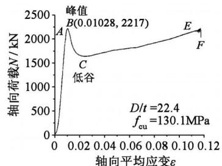  
（a）试件G135

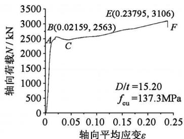  
（b）试件G118

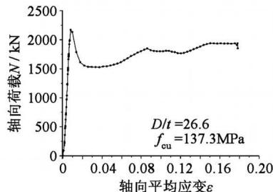  
（c）试件G130

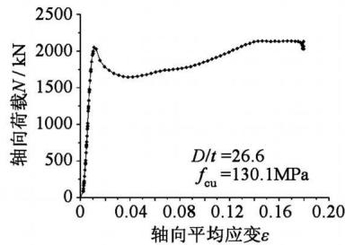  
（d）试件G153

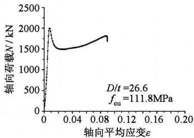  
（e）试件G155

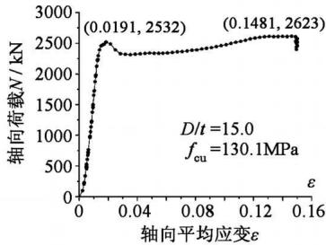  
（f）试件G141

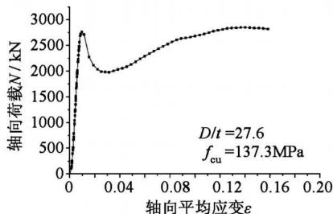  
（g）试件G124

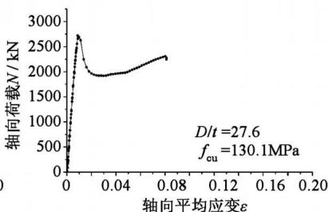  
（h）试件G147

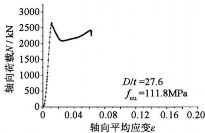  
（i）试件G149

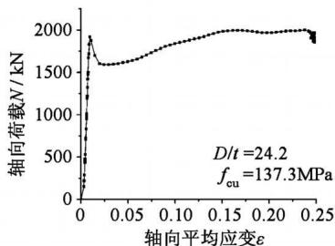  
（j）试件G106

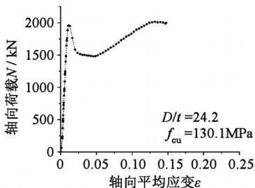  
（k）试件G132

  
（1）试件G112

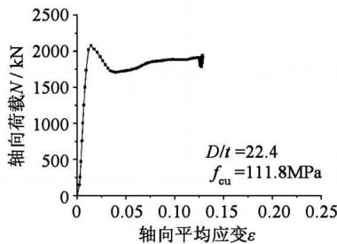  
（m）试件G137  
图 荷载 钢管轴向平均应变关系曲线  
Fig．5 Loadvs．averagestraincurves

载 $\mathrm { N _ { c } }$ 与峰值荷载 $\mathrm { N _ { B } }$ 比值下降不多 图 $5 \mathrm { b } \ 5 \mathrm { f } )$ 如试件G118、G141‚低谷荷载 $\mathrm { N _ { c } }$ 与峰值荷载 $\mathrm { N _ { B } }$ 的比值高达 $9 5 . 9 \%$ 、91.4%。

在套箍指标和其它试验参数相同或相近的情况下 核心混凝土强度越低 低谷荷载 $\mathrm { N _ { c } }$ 越小

第四阶段 荷载的回升阶段 （CE段 经过低谷荷载点C后 钢管进入强化工作状态 此时 无论径

厚比大小 荷载 轴向平均应变曲线基本上呈现回升的态势 试验数据分析表明 表 试件的套箍指标和核心混凝土强度是影响二次峰值荷载 $\mathrm { N _ { E } }$ 的主要因素。

大部分试件继续加载后出现的二次峰值荷载均大于峰值荷载 如试件G 见图 $5 \mathrm { k \Omega }$ 试件G 的二次峰值荷载达到峰值荷载的 倍 只有部分径

厚比较大 套箍指标比较小 的试件 如 G $\mathrm { { } [ D / t = }$ 26.6, $\theta = 0 . 4 8 4 1 7 ;$ 或径厚比较大且核心混凝土强度稍低的试件 如 G ${ \bf \langle D \ / / t = } 2 2 . 4 { \bf \rangle }$ 、G149 $\mathrm { { } [ D / t ^ { = } }$ 27.6)、G155 $\mathrm { ( D / t } ^ { \mathrm { = } 2 6 . 6 }$ 等试件 继续加载后出现的二次峰值荷载小于峰值荷载 （图 $5 \mathrm { e } , 5 \mathrm { i } 5 \mathrm { m }$ ）。

加载至二次峰值荷载后 部分试件的荷载 轴向平均应变曲线上出现了接近于水平的直线段 如G G 见图 $5 \mathbf { g } 5 \mathbf { j } ,$ 部分试件在二次峰值荷载位置‚终因剪切变形过大而破坏（如 G112‚见图5l）但都具有较高的残余承载力 实测试件的残余承载力与峰值荷载的比值均在 $8 1 . 1 \%$ 以上

综上所述 钢管超高强石渣混凝土试件轴心受 压时的荷载 轴向平均应变曲线的性状主要受试件的 套箍指标和混凝土强度的影响

# 2∙4 数据回归分析

# 钢管超高强石渣混凝土短柱的承载力

钢管超高强石渣混凝土短柱轴压试验结果见表设短柱的承载力与核心混凝土的名义承载力之比 $\mathrm { { N } _ { u } / ( \mathrm { { f } A _ { c } ) } }$ 与套箍指标θ满足线性关系：

$$
\mathrm {N} _ {\mathrm {u}} / \left(\mathrm {f} _ {\mathrm {c}} \mathrm {A} _ {\mathrm {c}}\right) = 1 + \mathrm {b} \theta \tag {1}
$$

设 $\mathrm { f } = \alpha \mathrm { f } _ { \mathrm { u } }$ ‚ $\theta ^ { ' } = \mathrm { f . A _ { s } / ( \mathrm { f _ { u } } A _ { c } ) }$ ‚ $\theta = \mathrm { { f } _ { \mathrm { { A } _ { \mathrm { { s } } } } } / ( \mathrm { { f } _ { \mathrm { { A } _ { \mathrm { { c } } } } } ) = } }$ $\theta ^ { ' } / \alpha ,$ ‚则：

$$
\mathrm {y} = \mathrm {N} _ {\mathrm {u}} / \left(\mathrm {f} _ {\mathrm {u}} \mathrm {A} _ {\mathrm {c}}\right) = \alpha + \mathrm {b} \theta^ {\prime} \tag {2}
$$

其中 $\alpha$ 和b为参数。

假设残差 $\mathrm { e _ { i } = y _ { i } - ( \alpha \mathrm { { \alpha } \mathrm { { + } \mathrm { { b } \mathrm { { \dot { 0 } } _ { i } ) } } } } }$ 数列服从平均值为零 方差为 $\boldsymbol { \sigma } _ { \mathrm { ~ i ~ } } ^ { 2 }$ 的正态分布 则 $\alpha$ 和b由最小二乘法确定 即利用残差平方和 $Q ( \theta , \mathbf { \mu } _ { \mathrm { y } } ) = \sum _ { \mathrm { i = 1 } } ^ { \mathrm { n } } \mathbf { \mu } _ { \mathrm { e } } ^ { 2 }$ 最小 求得斜率 $\mathbf { \rho } _ { \mathrm { b } }$ 和截距 $\alpha _ { 0 }$ 为：

$$
\mathrm {b} _ {0} = \frac {\sum_ {\mathrm {i} = 1} ^ {\mathrm {n}} \theta_ {\mathrm {i}} ^ {\prime} \mathrm {y} _ {\mathrm {i}} - \mathrm {n} \bar {\theta} ^ {\prime} \bar {\mathrm {y}}}{\sum_ {\mathrm {i} = 1} ^ {\mathrm {n}} \theta_ {\mathrm {i}} ^ {2} - \mathrm {n} (\bar {\theta} ^ {\prime}) ^ {2}} \tag {3}
$$

$$
\alpha_ {0} = \bar {\mathbf {y}} - \mathbf {b} _ {0} \bar {\theta} ^ {\prime} \tag {4}
$$

$\overline { { { \theta } } } ^ { \prime } = \frac { 1 } { \mathbf { n } } \sum _ { \mathrm { i } = 1 } ^ { \mathrm { n } } \mathbf { \theta } _ { \mathrm { i } } ^ { \prime }$ $\mathrm { { \overline { { y } } = \mathrm { { \frac { 1 } { n } } \sum _ { i = 1 } ^ { n } \ y _ { i \circ } } } }$

拟合的标准差为

$$
\sigma = \sqrt {\frac {\sum_ {i = 1} ^ {n} \left(\mathrm {y} _ {\mathrm {i}} - \alpha - \mathrm {b} \theta_ {\mathrm {i}} ^ {\prime}\right) ^ {2}}{\mathrm {n} - 2}} \tag {5}
$$

相关系数按式 计算

$$
R = \frac {\sum_ {i = 1} ^ {n} \left(\theta_ {i} ^ {\prime} - \overline {{\theta}}\right) \left(y _ {i} - \overline {{y}}\right)}{\sqrt {\sum_ {i = 1} ^ {n} \left(\theta_ {i} ^ {\prime} - \overline {{\theta}} ^ {\prime}\right) ^ {2} \sum_ {i = 1} ^ {n} \left(y _ {i} - \overline {{y}}\right) ^ {2}}} \tag {6}
$$

将 组试验数据代入式 $( 2 ) \sim ( 6 )$ 其中承载力$\mathrm { N _ { u } }$ 用峰值荷载 $\mathrm { N _ { B } }$ 代入 得到 $\alpha = 0 . 7 0 , \mathrm { \Delta ~ b = 1 } . 8 4 ,$ $\alpha = 0 . 7 0 ,$ 相关系数 $\begin{array} { r } { \mathbf { R } = 0 . 9 8 8 9 5 , } \end{array}$ 拟合的标准差 $\begin{array} { r } { \sigma = 0 . 0 6 9 1 5 , } \end{array}$ 显

表3 各试件试验结果  
Table3 Experimentalresultsofspecimens   

<table><tr><td>试件编号</td><td>NB/kN</td><td>NC/kN</td><td>NE/kN</td><td>NF/kN</td><td>εB%</td><td>εE%</td><td>εF%</td><td>Nuc/kN</td><td>η0%</td></tr><tr><td>G106</td><td>1927</td><td>1586</td><td>1996</td><td>1903</td><td>0.946</td><td>16.781</td><td>24.843</td><td>1919</td><td>-0.415</td></tr><tr><td>G112</td><td>2217</td><td>1762</td><td>2266</td><td>2126</td><td>1.460</td><td>21.031</td><td>21.182</td><td>2199</td><td>-0.812</td></tr><tr><td>G118</td><td>2563</td><td>2458</td><td>3106</td><td>2887</td><td>2.159</td><td>23.795</td><td>23.877</td><td>2643</td><td>3.121</td></tr><tr><td>G124</td><td>2764</td><td>1976</td><td>2851</td><td>2734</td><td>0.963</td><td>13.897</td><td>16.054</td><td>2875</td><td>4.016</td></tr><tr><td>G130</td><td>2178</td><td>1530</td><td>1939</td><td>1829</td><td>0.822</td><td>15.030</td><td>17.830</td><td>2159</td><td>-0.872</td></tr><tr><td>G132</td><td>1963</td><td>1479</td><td>2016</td><td>1908</td><td>1.251</td><td>13.078</td><td>14.778</td><td>1870</td><td>-4.738</td></tr><tr><td>G135</td><td>2217</td><td>1639</td><td>2227</td><td>2036</td><td>1.028</td><td>11.71</td><td>11.726</td><td>2145</td><td>-3.248</td></tr><tr><td>G141</td><td>2532</td><td>2315</td><td>2623</td><td>2417</td><td>1.910</td><td>14.81</td><td>15.018</td><td>2595</td><td>2.488</td></tr><tr><td>G147</td><td>2734</td><td>1914</td><td>2317</td><td>2217</td><td>0.877</td><td>8.067</td><td>8.129</td><td>2796</td><td>2.268</td></tr><tr><td>G153</td><td>2070</td><td>1641</td><td>2142</td><td>1980</td><td>1.153</td><td>14.458</td><td>17.983</td><td>2099</td><td>1.401</td></tr><tr><td>G137</td><td>2078</td><td>1703</td><td>1966</td><td>1890</td><td>1.387</td><td>1.387</td><td>12.892</td><td>2010</td><td>-3.272</td></tr><tr><td>G143</td><td>2544</td><td>2418</td><td>2544</td><td>2418</td><td>3.815</td><td>7.887</td><td>7.887</td><td>2473</td><td>-2.791</td></tr><tr><td>G149</td><td>2662</td><td>2087</td><td>2443</td><td>2228</td><td>1.114</td><td>6.138</td><td>6.452</td><td>2596</td><td>-2.479</td></tr><tr><td>G155</td><td>2002</td><td>1490</td><td>1818</td><td>1799</td><td>0.765</td><td>8.815</td><td>9.012</td><td>1947</td><td>-2.747</td></tr></table>

注 $\mathrm { { N _ { B } } }$ 为峰值荷载实测值 $\mathrm { N _ { C } }$ 为低谷荷载实测值 $\Nu _ { \mathrm { E } }$ 为二次峰值荷载实测值 $\mathrm { N _ { F } }$ 为残余承载力的下限 近似取每个试件的最后几个荷载数据之最小值作为残余承载力的下限 $\varepsilon _ { \mathrm { B } }$ 为峰值荷载对应的压缩应变实测值 $\mathfrak { E } _ { \mathrm { E } }$ 为二次峰值荷载对应的压缩应变实测值 $\tt { E } _ { \mathrm { { F } } }$ 为试验结束时试件的压缩应变值； $\mathrm { N _ { u c } }$ 为极限荷载计算值‚按式 （8）计算； $\eta _ { 0 } = [ \left( \mathrm { N } _ { \mathrm { u c } } - \mathrm { N } _ { \mathrm { B } } \right) / \mathrm { N } _ { \mathrm { B } } ] \times 1 0 0 \% _ { \mathrm { \Omega } }$ 。

表 4 回归参数  
Table4 Fittingparameters   

<table><tr><td></td><td>拟合公式</td><td>R</td><td>n</td><td>σ</td><td>P</td></tr><tr><td>承载力下降幅度</td><td>η1=(0.43027-0.32709θ)</td><td>-0.90603</td><td>14</td><td>0.03823</td><td>&lt;0.0001</td></tr><tr><td>二次峰值荷载</td><td>Nd=fcAe(0.72521+2.25216θ)</td><td>0.95492</td><td>14</td><td>0.17520</td><td>&lt;0.0001</td></tr><tr><td>残余承载力的下限</td><td>NF=fcAe(0.7081+2.08491θ)</td><td>0.95720</td><td>14</td><td>0.15776</td><td>&lt;0.0001</td></tr></table>

注 承载力下降幅度 $\eta _ { 1 } = ( \mathrm { N _ { B } } ^ { - } - \mathrm { N _ { C } }$ ） $/ \mathrm { N _ { B } }$ ；R为相关系数 n为拟合的数据个数 σ为拟合的标准差 P为显著性水平

著性水平 $\mathrm { P } \mathop { < { } 0 . 0 0 0 1 } _ { \circ }$ 所以超高强石渣混凝土的轴心抗压强度与立方体抗压强度满足式 关系

$$
f _ {c} = 0. 7 0 f _ {u} \tag {7}
$$

钢管超高强石渣混凝土短柱承载力的计算公式为：

$$
\mathrm {N} _ {\mathrm {u}} / \mathrm {f} _ {\mathrm {c}} \mathrm {A} _ {\mathrm {c}} = 1 + 1. 8 4 \theta \tag {8}
$$

利用式 计算结果与峰值荷载的实测值 $\mathrm { N _ { B } }$ 对比见表 和图 $6 _ { \mathbf { \hat { \alpha } } }$ 最大相对误差为 $4 . 7 \%$

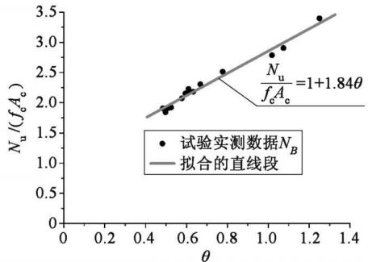  
a 承载力的实测数据与计算结果比较

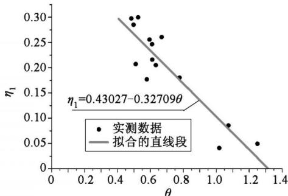  
b 承载力下降幅度与套箍指标关系

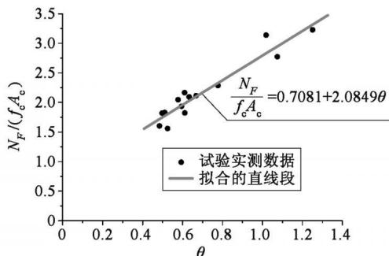  
c 残余承载力下限的实测数据与计算结果比较

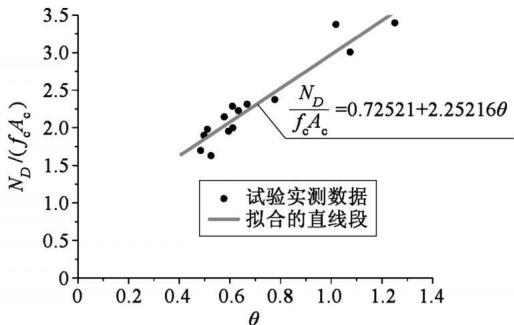  
d 二次峰值荷载的实测数据与计算结果比较  
图6 实测数据与计算结果比较  
Fig．6 Comparisonofexperimentalandcalculatedresults

# 变形分析

钢管超高强石渣混凝土短柱的最大压缩应变实测值达到 $6 . 4 5 \% \sim 2 4 . 8 4 \%$ （表3）‚按文献 ［5］定义的公式计算‚位移延性系数达到 $6 . 5 \sim 2 6 . 3 ,$ ‚具有明显的塑性变形特征

# 2∙4∙3 其它

将有关试验数据代入式 $( 2 ) \sim ( 6 )$ 回归分析 结果见表 及图 $6 \mathrm { b } \sim 6 \mathrm { d }$ 从分析结果得出结论 试件的承载力下降幅度与试件套箍指标密切相关 而试件的残余承载力的下限 二次峰值荷载与核心混凝土名义承载力之比基本上与套箍指标成线性关系

# 3 结论

通过钢管超高强石渣混凝土短柱的轴心受压试验研究与分析 可以得出如下结论

超高强石渣混凝土的水泥用量少 自收缩量小 钢管超高强石渣混凝土界面密实 无脱空现象  
影响钢管超高强石渣混凝土静力特性的主要因素是试件的套箍指标和核心混凝土强度  
（3）钢管超高强石渣混凝土轴心受压时‚其荷载 轴向平均应变曲线基本上可以分为四个阶段 即弹性阶段、弹塑性阶段、荷载下降阶段和荷载回升阶段 曲线形状主要受试件的套箍指标和核心混凝土强度的影响  
在本次试验参数范围内 所有的试件都呈现剪切型破坏特征 残余承载力与峰值荷载的比值均高于 $8 1 . 1 \%$   
超高强石渣混凝土与钢管复合后 其脆性性能得到显著的改善 具有明显的塑性材料的特征  
试件的峰值荷载 二次峰值荷载 残余承载力的下限与核心混凝土的名义承载力之比基本上与套箍指标成线性关系 但变化的规律不同 荷载下降段的下降幅度与试件的套箍指标密切有关  
根据试验数据回归得到的承载力计算式反映了核心混凝土强度和套箍指标的影响 形式简单与试验结果比较吻合 最大相对误差为 $4 . 7 \%$

# 参 考 文 献

［1］ 蒲心诚．超高强高性能混凝土 ［M］．重庆：重庆大学出版社‚2004．（PuXincheng．Superhighstrengthhighperformance concrete［M］． Chongqing： ChongqingUniversityPress‚2004．（inChinese））  
［2］ 陈国灿．低碳超高强石渣混凝土的力学性能试验研究 J 佳木斯大学学报 自然科学版693-697．（ChenGuo-can．Experimentalstudiesonthemechanicalpropertiesofgreen superhigh strengthconcreteused stone-chip ［J］． JournalofJiamusiUniversity NaturalScienceEdition

697．（inChinese））  
［3］ 陈国灿‚徐志胜．预制钢管超高强石渣混凝土叠合柱的轴压试验 J 厦门大学学报 自然科学版49（6）：819-825．（ChenGuo-can‚XuZhi-shengExperimentalstudiesontheaxialpressurebehaviorsofcompositioncolumnsreinforcedwiththeprefabricatedGSHSCUSfilledwithsteeltubes［J］．JournalofXiamenUniversity NaturalScience（inChinese））  
［4］ PierreRichard‚Marcel Cheyrezy． Composition of reactivepowderconcretes［J］．CementandConcrete Research   
陈国灿 钢管聚丙烯纤维超高强石渣混凝土短柱的静力特性 J 武汉大学学报 工学版（5）：617-622．（ChenGuo-can‚ExperimentalstudiesonthebehaviorsofPFRGSHSCUSfilledwithsteeltubesshortcolumnssubjectedtoaxialload［J］．EngineeringJournalofWuhanUniversity（inChinese））  
［6］ 陈国灿‚徐志胜．高温后钢管超高强石渣混凝土短柱的轴压性能 J 三峡大学学报 自然科学版32 （6）：36-41． （Chen Guo-can‚ Xu Zhi-shengExperimentalstudiesonthebehaviorsofGSHSCUSfilled with steeltubes shortcolumns after hightemperature［J］． Journal of China Three GorgesUniversity：NaturalScience‚2010‚32（6）：36-41．（inChinese））  
［7］ 陈国灿．低碳超高强石渣混凝土的抗火性能研究J 武汉工程大学学报（Chen Guo-can． Experimentalstudieson the frebehaviorofgeensuperhighstrengthconcreteusedstone-chip atelevated temperature［J］． JournalofWuhanInstituteTechnology‚2010‚32（11）：36-41．（inChinese））  
［8］ 陈国灿．低碳超高强石渣混凝土的配制技术研究［J］．湘潭大学学报：自然科学学报‚2010‚32（4）：58-63．（ChenGuo-can．Experimentalstudiesonthemixtechnologyofgreensuperhighstrengthconcreteusedstone-chip［J］．JournalofXiangtanUniversity：NaturalScience‚2010‚32（4）：58-63．（inChinese））  
冯乃谦 高性能混凝土与超高性能混凝土的发展和应用 ［J］．施 工 技 术‚2009‚38（4）：1-6． （FengNaiqian． Development and application of highperformance concrete and ultra-high performanceconcreteJ ConstructionTechnology1-6．（inChinese））

［10］ 蔡绍怀．现代钢管混凝土结构 ［M］．修订版．北京：人民交通出版社 CaiShaohuaiModernsteeltube confined concrete structures ［M ］． RevisedEdition BeijingChinaCommunicationsPress（inChinese））  
田志敏 张想柏 冯建文 等 钢管超高性能 RPC短柱的轴压特性研究 J 地震工程与工程振动28（1）：99-107．（TIAN Zhimin‚ZHANG XiangbaiFENGJianwen‚etal．CharacteristicsofRPC-filledsteeltubularpuncheonswithultrahighperformancesubjectedtoaxialcompressiveloading［J］．JournalofEarthquake Engineering and Engineering Vibration2008‚28（1）：99-107．（inChinese））  
谭克锋 蒲心诚 蔡绍怀 钢管超高强混凝土的性能与极限承载能力 J 建筑结构学报10-20．（TANKefeng‚PUXincheng‚CAIShaohuaiStudyonthemechanicalpropertiesofsteelextra-highstrengthconcreteencasedinsteeltubesJ JournalofBuildingStructures‚ 1999‚20 （1）： 10-20． （inChinese））  
谭克锋 蒲心诚 钢管超高强混凝土长柱和偏压柱的性能与极限承载力的研究 J 建筑结构学报2000‚21（2）：12-19．（ TANKefeng‚PUXinchengStudyonbehaviorandloadbearingcapacitiesofslendersteeltubularcolumnsandeccentricallyloadedsteeltubularcolumnsfilledwithextrahighstrengthconcreteJ JournalofBuildingStructures19．（inChinese））  
钟善桐 高层钢管混凝土结构 M 哈尔滨 黑龙江科学技术出版社‚1999．（ZHONGShantong．Concretefilledsteeltubularstructuresforhigh-risebuildings［M ］．Harbin：HeilongjiangScienceandTechnologyPress‚1999．（inChinese））  
［15］ CECS28：90 钢管混凝土结构设计与施工规程 ［S］CECS Specification for design andconstructionofconcrete-filledsteeltubularstructures［S］．（inChinese））  
［16］ CECS104：99 高强混凝土结构技术规程 ［S］CECS Technicalspecificationforhighstrengthconcretestructures［S］．（inChinese））  
［17］ Eurocode4 Designofcompositesteelandconcrete structures［S］．   
AISCLRFD Loadandresistancefactordesign specification for structural steel buildings［S］ AmericanInstituteofSteelConstruction INC