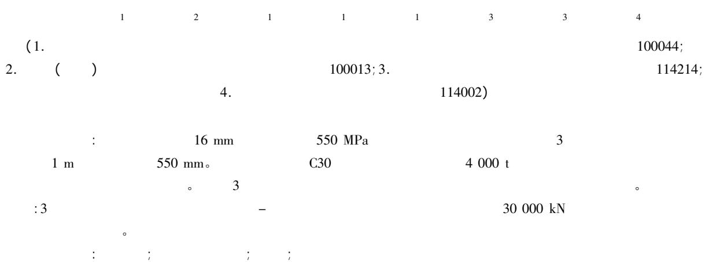  
DOI: 10.13204/j.gyjz201607003

# EXPERIMENTAL STUDY ON AXIAL COMPRESSION BEHAVIOR OF CONCRETE FILLED HIGH STRENGTH CIRCULAR STEEL TUBULAR SHORT COLUMN

Ma Limeng $^{1}$ Li Shuwen $^{2}$ Zhu Lei $^{1}$ Song Qiming $^{1}$ Wei Yue $^{1}$ Zhang Lianyou $^{3}$ Zhang Zhiyi $^{3}$ Sha Xiaochun $^{4}$

(1. Beijing Higher Institution Engineering Research Center of Structural Engineering and New Materials School of Civil and Transportation Engineering Beijing University of Civil Engineering and Architecture Beijing 100044 China;   
2. China Construction Design International Co. Ltd Beijing 100013 China; 3. Anshan Steel Pressure Vessel Co. Ltd Anshan 114214 China; 4. Anshan Iron and Steel Group Corporation Anshan 114002 China)

Abstract: Three circular steel tubular short columns were made by rolling and welding steel plates with thickness about $16\mathrm{mm}$ and strength grade $550\mathrm{MPa}$ . The column heights were about $1\mathrm{m}$ and the outer diameters were about $550\mathrm{mm}$ . The steel tubes were filled with C30 concrete and they were subjected to axial compression by a 4000 t press machine and the whole test process was recorded. The formulas from three kinds of design codes were used to calculate the column loading capacity and the calculation results were compared with the test results. It was found that the load-displacement curves of the three concrete filled high strength circular steel tubular short columns were very close to each other and the ultimate capacity was about $30000\mathrm{kN}$ ; and the bearing capacities calculated by the formulas agreed well with the test results.

Keywords: high strength steel; concrete filled circular steel tube; short column; axial compression test

0

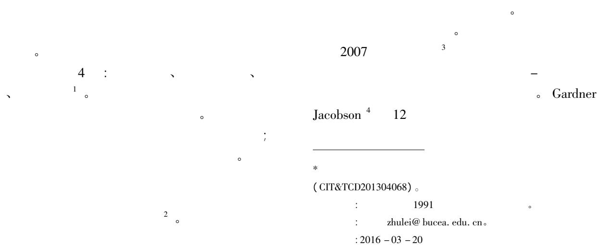

<table><tr><td colspan="2">495 MPa。</td></tr><tr><td colspan="2">Knowles Park 5 6</td></tr><tr><td colspan="2">482 MPa。</td></tr><tr><td colspan="2">H Ivengar 6 20</td></tr><tr><td colspan="2">452 ~ 682 MPa。</td></tr><tr><td colspan="2">Masuo 7 10</td></tr><tr><td colspan="2">461 ~ 505 MPa。</td></tr><tr><td colspan="2">Kato 8 5</td></tr><tr><td colspan="2">477 ~ 767 MPa。</td></tr><tr><td colspan="2">Schneider 9 1</td></tr><tr><td colspan="2">537 MPa。B.</td></tr><tr><td colspan="2">Uy 10-11</td></tr><tr><td colspan="2">Uy 12 2</td></tr><tr><td colspan="2">Nishiyama 13 24</td></tr><tr><td colspan="2">38</td></tr><tr><td colspan="2">507 ~ 853 MPa</td></tr><tr><td colspan="2">618 ~ 835 MPa。Gho Liu 14 4</td></tr><tr><td colspan="2">495 MPa。</td></tr><tr><td colspan="2">;</td></tr><tr><td colspan="2">;</td></tr><tr><td colspan="2">;</td></tr><tr><td colspan="2">;</td></tr><tr><td colspan="2">;</td></tr><tr><td colspan="2">;</td></tr><tr><td colspan="2">;</td></tr><tr><td colspan="2">;</td></tr><tr><td colspan="2">;</td></tr><tr><td colspan="2">;</td></tr><tr><td colspan="2">;</td></tr><tr><td colspan="2">;</td></tr><tr><td colspan="2">;</td></tr><tr><td colspan="2">;</td></tr><tr><td colspan="2">;</td></tr><tr><td colspan="2">;</td></tr><tr><td colspan="2">;</td></tr><tr><td colspan="2">;</td></tr><tr><td colspan="2">;</td></tr><tr><td colspan="2">;</td></tr><tr><td colspan="2">4000 t</td></tr><tr><td colspan="2">。</td></tr><tr><td colspan="2">Fig. 2 Layout of displacement meters</td></tr><tr><td colspan="2">1</td></tr><tr><td colspan="2">1.1</td></tr><tr><td colspan="2">3</td></tr><tr><td colspan="2">16 mm</td></tr><tr><td colspan="2">。</td></tr><tr><td colspan="2">550 MPa。</td></tr><tr><td colspan="2">。</td></tr><tr><td colspan="2">。</td></tr><tr><td colspan="2">。</td></tr></table>

185.47GPa

560 MPa;

195.59GPa 546MPa。

546 MPa。

3

4000t

1)

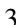

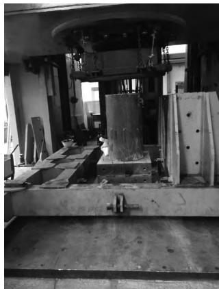  
3   
Fig. 3 Completion of lifting members

2)

2

( 4)

10%

3)

4

: a.

1/10。

27000kN

$0.1 \times 27000\mathrm{kN} = 2700\mathrm{kN}$

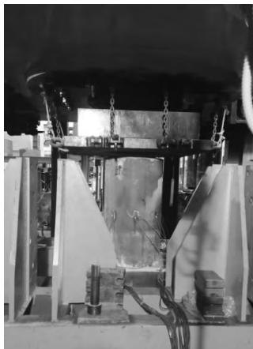  
4   
Fig.4 Preloading of members

$2\sim 3$ min。

b.

$$
40 \% \sim 50 \%
$$

$$
1 0 8 0 0 \sim 1 3 5 0 0 \mathrm {k N}
$$

$$
1 / 2 0 。
$$

$$
0. 0 5 \times 2 7 0 0 0 \mathrm {k N} = 1 3 5 0 \mathrm {k N}
$$

$$
2 \sim 3 \mathrm {m i n} 。
$$

C.

$$
60 \% \sim 80 \%
$$

1/20

1 $350\mathrm{kN}$

$2\sim 3\mathrm{min}$

d.

$$
1 \mathrm {m m} / \mathrm {m i n}
$$

8%

3.1

$$
60 \% \sim 80 \%
$$

5。

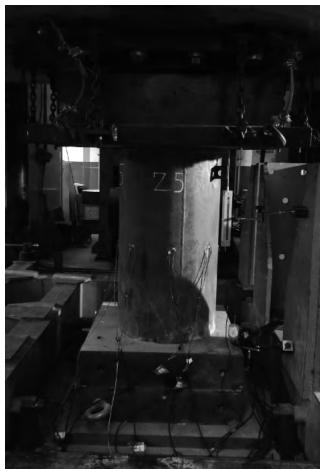  
5   
Fig.5 Elastic work stage of members

3.2

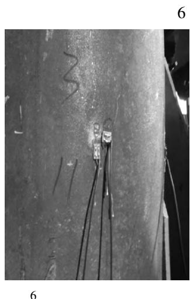  
Fig. 6 Relaxation of strain gauge in elastoplastic stage

3.3

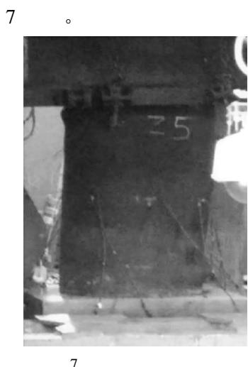  
Fig.7 Failure heaving of members

4

4.1

3

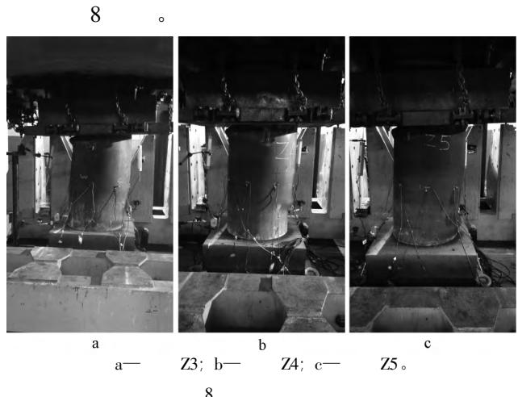  
Fig.8 Failure mode of specimens

4.2

1)

1。

1

Table 1 Section property of CFT columns   

<table><tr><td></td><td>/ mm2</td><td>/ mm4</td><td>/ GPa</td></tr><tr><td rowspan="2">Z3</td><td>28 128</td><td>16 515 080 972</td><td>196</td></tr><tr><td>216 504</td><td>3 730 120 940</td><td>30.35</td></tr><tr><td rowspan="2">Z4</td><td>28 088</td><td>16 464 901 550</td><td>196</td></tr><tr><td>216 149</td><td>3 717 916 171</td><td>30.35</td></tr><tr><td rowspan="2">Z5</td><td>28 203</td><td>16 638 803 576</td><td>196</td></tr><tr><td>217 569</td><td>3 766 915 584</td><td>30.35</td></tr></table>

2)

：

$$
f _ {\mathrm {c u}} = 3 1. 7 \mathrm {M P a};
$$

$$
f _ {\mathrm {y}} = 5 4 6 \mathrm {M P a} 。
$$

3)

EC4

$$
^ {1 5} \quad \text {C E C S} 2 8: 2 0 1 2 \llbracket
$$

$$
\text {》} ^ {1 6} \quad \mathrm {B S} 5 4 0 0 ^ {1 7} \quad \mathrm {Z 3} 、 \mathrm {Z 4} 、 \mathrm {Z 5}
$$

$$
1 8 \quad ,
$$

2。

2

Table 2 The ultimate bearing capacity of members   

<table><tr><td></td><td></td><td>fy/MPa</td><td>fcu/MPa</td><td>Nu/kN</td><td>/%</td></tr><tr><td rowspan="4">Z3</td><td>EC4</td><td>546</td><td>31.7</td><td>29 810</td><td>2.62</td></tr><tr><td>CECS 28:2012</td><td>546</td><td>31.7</td><td>27 434</td><td>-5.56</td></tr><tr><td>BS 5400</td><td>546</td><td>31.7</td><td>27 527</td><td>-5.24</td></tr><tr><td></td><td>546</td><td>31.7</td><td>29 050</td><td></td></tr><tr><td rowspan="4">Z4</td><td>EC4</td><td>546</td><td>31.7</td><td>29 774</td><td>3.28</td></tr><tr><td>CECS 28:2012</td><td>546</td><td>31.7</td><td>27 393</td><td>-4.98</td></tr><tr><td>BS 5400</td><td>546</td><td>31.7</td><td>27 487</td><td>-4.66</td></tr><tr><td></td><td>546</td><td>31.7</td><td>28 830</td><td></td></tr><tr><td rowspan="4">Z5</td><td>EC4</td><td>546</td><td>31.7</td><td>29 926</td><td>1.14</td></tr><tr><td>CECS 28:2012</td><td>546</td><td>31.7</td><td>27 528</td><td>-6.97</td></tr><tr><td>BS 5400</td><td>546</td><td>31.7</td><td>27 611</td><td>-6.69</td></tr><tr><td></td><td>546</td><td>31.7</td><td>29 590</td><td></td></tr></table>

$$
: N _ {\mathrm {u}}
$$

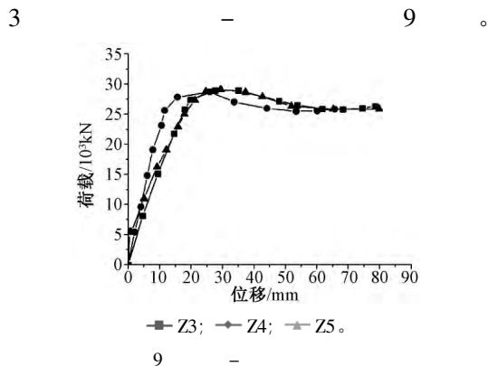  
4.3   
Fig. 9 Comparison of load-displacement curves

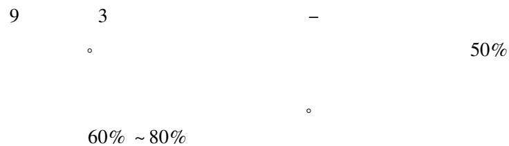

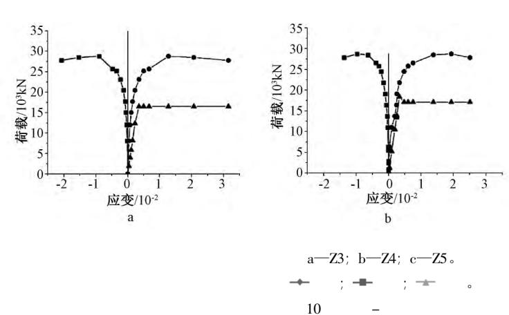

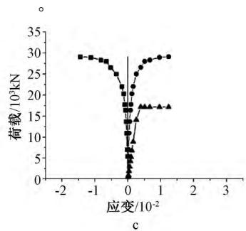

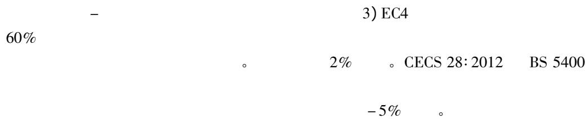  
Fig. 10 Comparison of load-strain curves

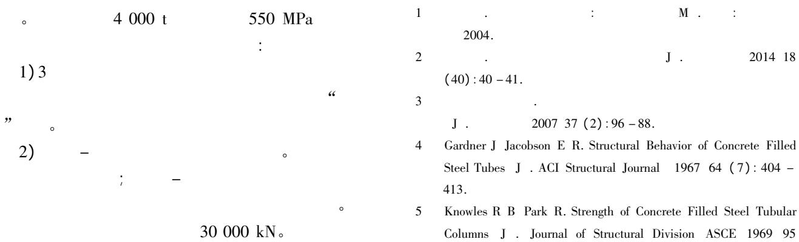

(ST12) : 2565 - 2587.   
6 Ivengar H Furlong R W Graham R et al. Specification for the Design of Steel-Concrete Composite Columns J. Engineering Journal AISC 1979 16(4):101-145.   
7 Masuo K Adachi M Kawabata K et al. Buckling Behavior of Concrete Filled Circular Steel Tubular Columns Using Light-Weight Concrete C // Proceedings of the Third International Conference on Steel-Concrete Composite Structures. Fukuoka: 1991: 95 - 100.   
8 Kato B. Column Curves of Steel-Concrete Composite Members J. Journal of Constructional Steel Research 1996 39 (2): 121 -135.   
9 Schneider S P. Axially Loaded Concrete-Filled Steel Tubes J. Journal of Structural Engineering ASCE 1998 124(10):1125-1138.   
10 Uy B. Strength of Short Concrete Filled High Strength Steel Box Columns J. Journal of Constructional Steel Research 2001 (57):113-134.   
11 Uy B. Strength of Slender Concrete Filled High Strength Steel Box Columns J. Journal of Constructional Steel Research 2004

(60): 1825-1848.   
12 Vrcelj Z Uy B. Behaviour and Design of Steel Square Hollow Sections Filled with High Strength Concrete J. Australian Journal of Structural Engineering 2001 3(3):153-169.   
13 Nishiyama I Morino S Sakino K et al. Summary of Research on Concrete-Filled Structural Steel Tube Column System Carried out Under the US-Japan Cooperative Research Program on Composite and Hybrid Structures R. Japan: Building Research Institute 2002: 147.   
14 Gho W M Liu D. Flexural Behavior of High-Strength Rectangular Concrete-Filled Steel Hollow Sections J. Journal of Constructional Steel Research 2004 60(11):1681-1696   
15 Eurocode 4. Design of Composite Steel and Concrete Structures S. London: British Standards Institution 1994.   
16 CECS 28:2012 S.   
17 BS 5400. Steel Concrete and Composite Bridges Part 5: Code of Practice for Design of Composite Bridges S.2005.   
18 D. 2012.

( 56 )

4)

5)

1 J. 2013 $30(1):1 - 13$   
2 J. 2012 33(3):8-14.   
3 Q460 J. 2011 32(11):   
149-155.   
4 J. 2013 46(2): 1-9.   
5 . 960 MPa J. 2014 35(1):117-125.   
6

J. 2014 35(5): 57-64.   
7 J. 2014 47 (11): 19-28.   
8 . Q690D J. 2014 35(12): 97 - 103.   
9 . Q690 T D : 2013.   
10 Qiang X H Bijlaard F S K Kolstein H et al. Behaviour of Beam-to-Column High Strength Steel Endplate Connections Under Fire Conditions-Part 1: Experimental Study J. Engineering Structures 2014 64: 23 - 38.   
11 Qiang X H Bijlaard F S K Kolstein H et al. Behaviour of Beam-to-Column High Strength Steel Endplate Connections Under Fire Conditions-Part 2: Numerical Study J. Engineering Structures 2014 64: 39 - 51.   
12 M 2014.   
13 . Q460 D. : 2013.   
14 . Q460C J. 2012 33(3): 15-21.   
15 GB 50017-2003 S.