Full length article

# Experimental behaviour of circular concrete filled steel tube columns and design specifications

Talha Ekmekyapar n , Baraa J.M. AL-Eliwi

Civil Engineering Department, University of Gaziantep, 27310 Gaziantep, Turkey

# a r t i c l e i n f o

Article history:

Received 11 November 2015

Received in revised form

28 March 2016

Accepted 4 April 2016

Available online 13 May 2016

Keywords:

Circular CFST columns

Experiments

Confinement effect

Design specifications

# a b s t r a c t

This paper presents 18 tests conducted on short, medium and long circular Concrete Filled Steel Tube (CFST) columns. To explore the impact of column parameters and confinement effect three L/D ratios, two D/t ratios, two steel qualities and three concrete classes were employed. Some specimens have properties within application limits of EC4 and AISC 360-10 whereas others have properties beyond the application limits. Since new, large and efficient structures require adoption of high strength materials, it is compulsory to push the limits of design specifications. It is shown that 56 MPa and 66 MPa concretes provide very smooth and ductile load-shortening curves which imply high deformation capacity of such concrete classes. Brittle nature of 107 MPa concrete is shown by very sharp transitions from pre-peak to post-peak region and sudden discharge of loading in load-shortening curves. Additionally, 239 experimental data were collected from literature to assess EC4 and AISC 360-10 predictions within application limits and beyond application limits. Instead of focusing on a narrow region of configurations, this paper examines the performance of prediction methods on short, medium and long CFST columns. EC4 predictions indicate much better agreement with the test results. However AISC 360-10 predictions are conservative for all combinations of parameters. The application limits of EC4 can be widened to cover solutions of columns with broader properties. Confinement effect should be handled elaborately in AISC 360-10 formulations. L/D and relative slenderness are key parameters and have direct impact on column behaviour. However D/t does not have direct impact on column behaviour.

$\circledcirc$ 2016 Elsevier Ltd. All rights reserved.

# 1. Introduction

Concrete Filled Steel Tube (CFST) columns have distinctive characteristics which allow use of such compression members in challenging engineering fields. High rise buildings [1,2], deep underground tunnels [3], bridges [4,5] and towers [6] are some examples of structures in which CFST columns are deployed as main load carrying members. High energy absorption capacity, stiffness and ductility of CFST columns motivate engineers to adopt such members in earthquake prone zones [6,7]. The steel tubing serves as a formwork for concrete core, thus construction time and costs can be reduced [7–9]. Further cost savings can be provided since CFST columns cover smaller areas on storeys compared to bare steel and reinforced concrete counterparts [1]. Also the concrete core precludes early local buckling of steel and improves the performance of entire composite cross section [5,10]. The confinement effect of circular steel tubes on concrete is the most prominent characteristic of CFST columns. With proper

geometrical and mechanical properties of materials, circular tubes enable concrete core to exhibit higher performance than its characteristic compressive strength [11].

Research into the compression performance of circular CFST columns has been widely carried out in recent decades. Strength of stub CFST columns has attracted the attention of many researchers [1,2,9,12–14]. Considering the practical applications, the behaviour of long CFST columns was also investigated in past [10,15–17]. However a recent paper by Kang et al. [18] reports that a number of experimental studies conducted on long columns is less than the number of studies on stub columns. Also in the same paper, it can be observed that the studied material parameters range is not wide enough to capture underlying mechanics of CFST columns adequately. For example, concrete strength between 80 and 110 MPa was used in $6 . 6 \%$ of circular stub columns. On the other hand just $3 . 8 \%$ of long column tests were conducted using concrete strength between 60 and 96 MPa. The paper presented by Kang et al. [18] reports these statistical information based on the database developed by Tao et al. [19] in 2008. Lots of studies on CFST columns have been published since Tao et al. [19] presented the database. However, there is still need for more experimental studies on long columns and broader material parameters to be able

to understand the behaviour of circular CFST columns explicitly. The need for more CFST column experimental data to calibrate specification formulations was also highlighted in a document which was published as “Commentary on the AISC 360-10 Specification of Structural Steel Buildings” [20].

Practical formulations of design specifications help engineers predict the capacity of CFST columns. American AISC 360-10 [21], European Eurocode-4 (EC4) [22], Japanese AIJ 2008 [23], Australian AS 5100.6 [24], Chinese DBJ/T13-51-2010 [25] and South African SANS 10162-1 [26] are some specifications which are employed for this purpose. Expected performances of those design specifications differ in predicting the capacity of CFST columns. Several researchers showed that for stub columns AISC 360-10 gives conservative predictions compared to experiments [1,5,9,12,14]. Based on experimental results of short and long columns Oliveira [15] also highlighted conservative predictions of AISC 360-10. On the other hand, capacity prediction of EC4 for stub columns was reported to be unconservative [1,15]. On the contrary, some other experimental results of stub columns were found to be very close to EC4 predictions [9,12,14]. For longer columns Oliveira [15] reported that EC4 predictions are very close to experimental results but still on unconservative side. Dundu [16] assessed EC4 predictions against his experiments on long columns which have L/D ratios ranging from 6 to 21.7 and concluded that EC4 predictions are conservative up to $2 5 \%$ . Zeghiche [10] assessed test results of very long CFST columns which have $L / D$ ratios greater than 12.5 against EC4 predictions and reported that EC4 predictions are on the safe side. Aforementioned conclusions of specification assessments also denote the need for more experiments to shed light on the behaviour of circular CFST columns. However, to provide new drawbacks novel characteristics are required for new experiments. Significant amount of experiments with mean material and geometrical properties which comply with the applicability limits of the specifications have already been published. Hence, new experiments should push the limits of design specifications.

The aim of this paper is thus twofold; The first aim is to examine the experimental performance of circular CFST columns which have properties close to the application limits and beyond the limits of the design specifications of AISC 360-10 and EC4. To this end, 18 CFST specimens, including short, medium and long columns were tested to failure under compressive loading. Column lengths were chosen with the intent to observe the confinement effect. Towards this aim, three L/D and two $D / t$ ratios were considered. Three levels of concrete strength of 56 MPa, 66 MPa and 107 MPa were utilized to assess the effect of concrete strength on column performance. Concrete strengths of $5 6  { \mathrm { M P a } }$ and 66 MPa are very close to the applicability boundaries of AISC 360-10 and EC4 specifications. On the other hand, 107 MPa concrete strength is far away from the applicability boundaries of both AISC 360-10 and EC4. Steel tubes with S235 and S355 European steel qualities were used to develop different confinement effects. The above properties enabled the authors to test CFST columns with confinement factors ranging from 0.226 to 1.538 and steel contribution factors (a parameter used in EC4) from 0.185 to 0.606. The second aim of this paper is to make a general assessment of prediction methods of AISC 360-10 and EC4. After detailing experimental behaviour of 18 CFST columns with above properties, 239 additional CFST column data which were collected from literature and cover a relatively wide range of parameters were utilized to make reliable assessments of specifications. Evaluations undertaken on 257 CFST column experiments have the potential to depict the effects of column parameters on compression capacity and prediction capability of design specifications more precisely.

# 2. Experimental research

# 2.1. Material properties

Two different steel qualities were employed for CFST column specimens. The first one is European S235 steel, with 235 MPa yield strength and $2 . 7 4 \ : \mathrm { m m }$ thickness and the second is European S355 steel, with 355 MPa yield strength and $5 . 9 0 \mathrm { m m }$ thickness. The main idea behind the selection of material and thickness properties is to examine behaviours of columns with low and high confinement factors $( \xi ) ,$ , Eq. (1). Confinement factor is a practical parameter which has been used by several researchers to roughly characterize confinement capability of the column. This factor can be employed for circular [5,27,28] as well as rectangular [29,30] CFST columns.

$$
\xi = \frac {A _ {\mathrm {s}} f _ {\mathrm {y}}}{A _ {\mathrm {c}} f _ {\mathrm {c}}} \tag {1}
$$

where $A _ { s }$ and $A _ { c }$ are the cross sectional areas of the steel tube and core concrete, respectively. $f _ { y }$ is the yield strength of steel and $f _ { c }$ is the compressive strength of concrete. Also, the values of the above parameters ( As, Ac, $f _ { y }$ and $f _ { c }$ ) directly affect the steel contribution ratio $\left( \delta \right)$ , which is an important parameter in EC4. This parameter is introduced in Section 6 in Eq. (21). The above parameters allow testing columns with steel contribution ratio within and beyond the applicability limits of EC4.

Three different concrete mixes were prepared. Cylinder concrete compression specimens of $1 0 0 \times 2 0 0 \mathrm { m m }$ size were cast from the concrete batch. Considering the small diameter of tubes, coarse aggregate of maximum diameter of $1 0 \mathrm { m m }$ and fine aggregate (sand) were used in the concrete mix. Moulds were filled in three layers and a shaking table was used to compact the concrete after each layer. Concrete specimens were crushed in accordance with ASTM C39/C39M [31] after curing stage. Measured average compressive strengths of concrete mixes are 56.20 MPa, 66.75 MPa and 107.20 MPa. In the present study, these levels of concrete strengths were deliberately chosen to test columns which have concrete properties close to the upper limits of design specifications and far away from those limits. New, large and efficient structures require the adoption of high strength materials, and thus high strength CFST columns are particularly appropriate for investigation.

# 2.2. Column specimens

Column specimens were manufactured using $1 1 4 . 3 \mathrm { m m }$ diameter steel tubes. Three $L / D$ and two D/t ratios were specified for the specimens. These tube properties were selected to allow different types of failure behaviours to take place under compressive loading. Properties of CFST column specimens are presented in Table 1. Employed specimen naming system in Table 1 includes circular tube diameter $( D )$ , tube thickness (t), column length (L) and core concrete strength $( \ f _ { c } )$ , respectively. For example, the specimen 114.3-2.74-300-56 represents CFST column with $1 1 4 . 3 \mathrm { m m }$ outer diameter, 2.74 tube thickness, $3 0 0 \mathrm { m m }$ length and 56 MPa core concrete strength. The seventh and eighth columns of Table 1 present the confinement factor $\left( \xi \right)$ and steel contribution ratio ( δ), respectively.

Prior to filling the concrete, the ends of each tube specimen were machined to insure maximum uniformity of contact with the loading heads of the testing machine. Providing the uniformity and flatness of column ends is a crucial step in column testing procedure to obtain reliable test results [32]. The machining process of steel tubes is shown in Fig. 1.

In order to provide appropriate interaction between the steel

Table 1 Properties of column specimens.   

<table><tr><td>Column</td><td>L/D</td><td>t (mm)</td><td>D (mm)</td><td>fc(MPa)</td><td>fy(MPa)</td><td>Conf. Fac. (ξ)</td><td>Steel Cont. (δ)</td><td>Nexp(kN)</td><td>SI</td></tr><tr><td>114.3-2.74-300-56</td><td>2.62</td><td>2.74</td><td>114.3</td><td>56.20</td><td>235</td><td>0.432</td><td>0.301</td><td>901.81</td><td>1.35</td></tr><tr><td>114.3-2.74-300-66</td><td></td><td></td><td></td><td>66.75</td><td></td><td>0.364</td><td>0.267</td><td>981.23</td><td>1.30</td></tr><tr><td>114.3-2.74-300-107</td><td></td><td></td><td></td><td>107.20</td><td></td><td>0.226</td><td>0.185</td><td>1295.06</td><td>1.21</td></tr><tr><td>114.3-5.90-300-56</td><td></td><td>5.9</td><td></td><td>56.20</td><td>355</td><td>1.538</td><td>0.606</td><td>1753.77</td><td>1.58</td></tr><tr><td>114.3-5.90-300-66</td><td></td><td></td><td></td><td>66.75</td><td></td><td>1.295</td><td>0.564</td><td>1818.62</td><td>1.54</td></tr><tr><td>114.3-5.90-300-107</td><td></td><td></td><td></td><td>107.20</td><td></td><td>0.806</td><td>0.446</td><td>1989.86</td><td>1.36</td></tr><tr><td>114.3-2.74-600-56</td><td>5.25</td><td>2.74</td><td></td><td>56.20</td><td>235</td><td>0.432</td><td>0.301</td><td>947.75</td><td>1.41</td></tr><tr><td>114.3-2.74-600-66</td><td></td><td></td><td></td><td>66.75</td><td></td><td>0.364</td><td>0.267</td><td>1031.92</td><td>1.37</td></tr><tr><td>114.3-2.74-600-107</td><td></td><td></td><td></td><td>107.20</td><td></td><td>0.226</td><td>0.185</td><td>1296.61</td><td>1.21</td></tr><tr><td>114.3-5.90-600-56</td><td></td><td>5.9</td><td></td><td>56.20</td><td>355</td><td>1.538</td><td>0.606</td><td>1723.19</td><td>1.56</td></tr><tr><td>114.3-5.90-600-66</td><td></td><td></td><td></td><td>66.75</td><td></td><td>1.295</td><td>0.564</td><td>1810.94</td><td>1.53</td></tr><tr><td>114.3-5.90-600-107</td><td></td><td></td><td></td><td>107.20</td><td></td><td>0.806</td><td>0.446</td><td>1968.06</td><td>1.34</td></tr><tr><td>114.3-2.74-900-56</td><td>7.87</td><td>2.74</td><td></td><td>56.20</td><td>235</td><td>0.432</td><td>0.301</td><td>877.28</td><td>1.31</td></tr><tr><td>114.3-2.74-900-66</td><td></td><td></td><td></td><td>66.75</td><td></td><td>0.364</td><td>0.267</td><td>983.51</td><td>1.30</td></tr><tr><td>114.3-2.74-900-107</td><td></td><td></td><td></td><td>107.20</td><td></td><td>0.226</td><td>0.185</td><td>1233.24</td><td>1.15</td></tr><tr><td>114.3-5.90-900-56</td><td></td><td>5.9</td><td></td><td>56.20</td><td>355</td><td>1.538</td><td>0.606</td><td>1592.48</td><td>1.44</td></tr><tr><td>114.3-5.90-900-66</td><td></td><td></td><td></td><td>66.75</td><td></td><td>1.295</td><td>0.564</td><td>1713.34</td><td>1.46</td></tr><tr><td>114.3-5.90-900-107</td><td></td><td></td><td></td><td>107.20</td><td></td><td>0.806</td><td>0.446</td><td>1907.29</td><td>1.30</td></tr></table>

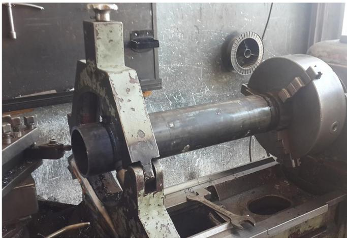  
Fig. 1. Machining of steel tubes.

tubes and the infill concrete, inner surfaces of steel tubes were cleaned from dust. In order to restrict the fresh concrete, thick mica plates were used at the bottom ends of tubes. Silicon was used to connect the mica plates to the bottom ends of the steel tubes. There was no bond between mica material and concrete, so, flat surfaces of concrete at the bottom ends were obtained easily after removing mica plates. Steel tubes with 300 mm, 600 mm and $9 0 0 \mathrm { m m }$ lengths were filled with concrete in 3, 5 and 7 layers, respectively. A shaking table was activated after each layer to eliminate entrapped air. Flat surfaces of concrete have to be obtained at upper ends of columns as well. To accomplish this goal, the top last $1 0 \mathrm { m m }$ of steel tubes were left empty. After completing the curing process, the top of the columns was levelled using high strength leveling epoxy. Fig. 2 illustrates 18 CFST column specimens, which are ready for testing.

Before the test, mica plates were removed from the bottom ends of the columns and silicone residues were cleaned. Specimens were carefully centered in the testing machine to eliminate the possibility of eccentric loading. A displacement controlled loading with a rate of $0 . 4 \mathrm { m m / m i n }$ was applied to all column specimens up to end of the tests, as shown Fig. 3. Compression loading versus end shortening data of specimens were recorded to be able to discuss the behaviour of columns in pre-collapse and post-collapse regions.

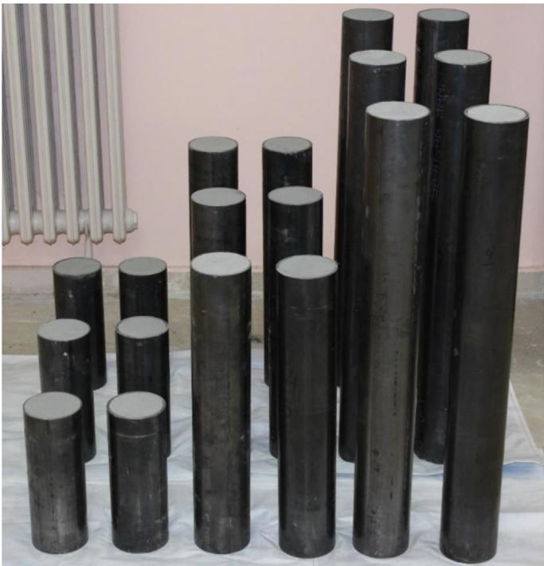  
Fig. 2. Column specimens.

# 3. Test results and discussions

Discussions of CFST column test results are given in this section, in conjunction with end shortening versus compression loading curves and failure behaviour of specimens. End shortening versus compression loading curves delineate stiffness, ductility and toughness behaviours of columns. Behaviour of concrete core can also be captured by observing load-shortening curves. Strength index (SI) is also used to compare the performance of the columns. SI is a very useful measure for composite action and confinement assessments in CFST columns and has been used in literature [5,27,33,34]. SI is defined as follows:

$$
S I = \frac {N _ {u}}{A _ {s} f _ {y} + 0 . 8 5 A _ {c} f _ {c}} \tag {2}
$$

where $N _ { u }$ is the compression capacity of a composite column section, determined by experiment or design specifications. The

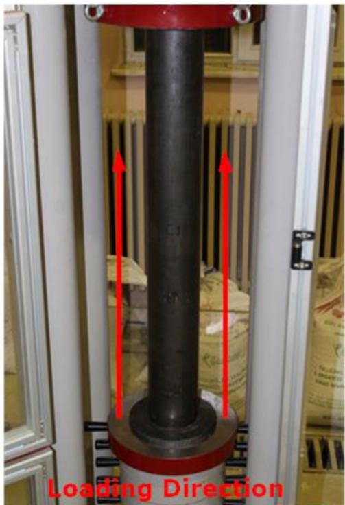  
Fig. 3. Column test.

denominator in Eq. (2) is called as squash load of a section [2]. The factor, 0.85, is used in the calculation of the concrete cross sectional strength to compensate for uncertainties inherent in the concrete itself. The squash load formulation is also used in ACI [35] and AS 3600-2009 [36] specifications to calculate the strength of composite sections. Compression load capacities of specimens and corresponding SI of the columns are given in ninth and tenth columns of Table 1, respectively.

# 3.1. 300 mm columns

The columns with $3 0 0 \mathrm { m m }$ length are considered as stub columns. Typical failure mechanism of these columns was crushing of concrete and yielding of steel, as expected. Local buckling of the steel tube was also observed for all columns in this set. Failure modes of some specimens in this set are shown in Fig. 4. Although there are some common characteristics with regard to failure behaviours of columns in this set, differences in concrete and steel properties led to different responses in load-shortening curves. Fig. 5 presents load-shortening curves of six $3 0 0 \mathrm { m m }$ stub columns.

The ultimate load of column specimen 114.3-2.74-300-56 was recorded to be 901.81kN. The load-shortening curve of this column is very smooth, as shown in Fig. 5, which implies a high deformation capacity of the 56 MPa core concrete. The SI of this specimen is 1.35, which means a good confinement effect was provided in this column configuration. Specimen 114.3-2.74-300- 66 developed a compression capacity of 981.23 kN and the loadshortening curve of this specimen has also a smooth behaviour, as shown in Fig. 5. This level of concrete strength has also a good level of deformation capacity and the SI of this column is equal to 1.30. This value of SI implies that the 66 MPa concrete exhibits slightly lower confinement performance compared to 56 MPa concrete. Specimen 114.3-2.74-300-107 achieved a compression capacity of 1295.06 kN. However the load-shortening curve of this specimen has distinct characteristics that are different to the curves of specimens with 56 MPa and 66 MPa concrete cores. First,

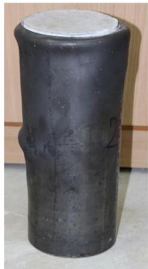  
(a)

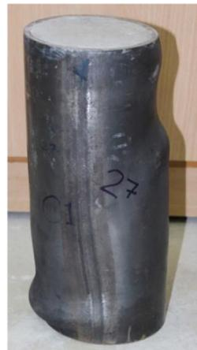  
(b)

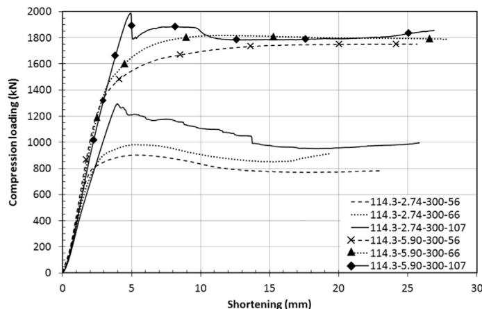  
Fig. 4. Failure modes of $3 0 0 \mathrm { m m }$ columns (a) 114.3-2.74-300-107 (b) 114.3-5.90- 300-107.   
Fig. 5. Compression load - shortening curves of 300 mm columns.

it is worth to note that the transition from pre-peak region to postpeak region is very sharp for this specimen, as shown in Fig. 5. Also, the curve has an unsmooth behaviour in the post-peak region. These behaviours are attributed to brittle nature of 107 MPa concrete. This means that the steel tube of specimen 114.3-2.74- 300-107 is not able to effectively confine the 107 MPa concrete core to the same magnitude it confines 56 MPa and 66 MPa concretes. A SI of 1.21 for this column supports this conclusion. Nevertheless, a SI of 1.21 is still favourable since the performance of this specimen is $2 1 \%$ higher than squash load.

Specimens with $5 . 9 0 \mathrm { m m }$ tube thickness and 355 MPa yield strength provided greater performance. It can be observed in Fig. 5 that an increase in tube thickness and yield strength led to higher initial stiffness, ductility and toughness. Confinement characteristic of this steel tube was also shown to be superior. Compression load capacities of specimens 114.3-5.90-300-56, 114.3-5.90-300- 66 and 114.3-5.90-300-107 are 1753.77 kN, 1818.62 and 1989.86 kN respectively. Also, the corresponding SI of these specimens of 1.58, 1.54 and 1.36 are larger than the SI magnitudes of columns with $2 . 7 4 \ : \mathrm { m m }$ thickness and 235 MPa yield strength. From the discussion, it can be concluded that thicker steel tubes with higher yield strength have considerable influence on confinement effect. Also, it has been shown again that increment in concrete strength decreases the effectiveness of steel tube in confining the concrete core. Load-shortening curves of these specimens exhibit some similar behaviours to curves of specimens with $2 . 7 4 \ : \mathrm { m m }$ tube thickness and 235 MPa yield strength. Load-

shortening curves of specimens 114.3-5.90-300-56 and 114.3-5.90- 300-66 have smooth behaviours while specimen with 114.3-5.90- 300-107 has a sharp transition from pre-peak region to post-peak region. Also, this specimen experienced a sudden discharge of load just after reaching compression capacity. Brittle nature of 107 MPa concrete was also reduced with this steel tube.

Although the confinement effect of thicker tube was proven to be greater than thinner tube, it is noted that the 107 MPa concrete core contributed to compression load capacity more for thinner tube. Thinner tubes filled with 56 MPa and 107 MPa concrete have compression capacities of 901.81 kN and 1295.06 kN, respectively. In this case, the 107 MPa concrete core achieved $4 3 . 6 1 \%$ compression capacity increment. On the other hand, thicker tubes filled with 56 MPa and 107 MPa concrete have 1753.77 kN and 1989.86 kN compression capacities, respectively. This means that the use of 107 MPa concrete core increased the compression load capacity just by $1 3 . 4 6 \%$ , compared to the capacity of the same tube filled with 56 MPa concrete.

Initial stiffness of columns is another critical parameter in structural evaluations. Specimens with 107 MPa concrete core have lower initial stiffness than that of columns with 56 MPa and 66 MPa concrete. These lower stiffness behaviours can be attributed to the amount of fine aggregate used in per $\mathrm { m } ^ { 3 }$ of concrete. In order to obtain a level of 107 MPa compressive strength it was required to use much more fine material in mix design and this caused a reduction in initial stiffness of CFST columns.

Failure modes of the specimens are also important in the performance assessment of CFST columns. There exist some main differences between failure modes of columns with $2 . 7 4 \ : \mathrm { m m }$ and $5 . 9 0 \mathrm { m m }$ tube thicknesses. Outward local buckling behaviour of steel tubes was observed in all specimens of this set. Also, at higher shortening levels crippling type of failures occurred in the columns with thinner tubes. Fig. 6 illustrates the crippling behaviour in specimen 114.3-2.74-300-66 as an example. Such behaviour was not observed in specimens with thicker tubes.

# 3.2. 600 mm columns

All specimens of $6 0 0 \mathrm { m m }$ columns showed evidence of interaction between global and local failure modes. However, such combined failure mode is more dominant in columns with thinner tubes. Fig. 7 shows the failure modes of some columns in this set. Load-shortening curves of $6 0 0 \mathrm { m m }$ columns are presented in Fig. 8.

Specimen 114.3-2.74-600-56 achieved a compression load capacity of 947.75 kN and a SI of 1.41, specimen 114.3-2.74-600-66 achieved a compression load capacity of 1031.92 kN and a SI of 1.37 and, specimen 114.3-2.74-600-107 achieved a compression load capacity of 1296.61 kN and a SI of 1.21. It can be observed that the increment in concrete strength reduces the confinement effect. The brittle nature of the 107 MPa concrete was also visible in the load-shortening curve. However, the transition from pre-peak to post-peak region is not as sharp as the $3 0 0 \mathrm { m m }$ column. Also, the $6 0 0 \mathrm { m m }$ column with 107 MPa concrete exhibited more end shortening at peak compression load level, compared to $3 0 0 \mathrm { m m }$ counterpart in Fig. 5.

An increase in stiffness, ductility and toughness was again observed with the increase in tube thickness and yield strength. Compression load capacities of specimens 114.3-5.90-600-56, 114.3-5.90-600-66 and 114.3-5.90-600-107 are 1723.19 kN, 1810.- $9 4 \mathrm { k N }$ and 1968.06 kN, respectively and the corresponding SI magnitudes are 1.56, 1.53 and 1.34. Superior confinement effect of thicker tubes with higher yield strength is also noted in this set. As with previous sets, the brittle behaviour of the 107 MPa concrete core can be observed in Fig. 8, however the discharge of the load, after peak load is not sudden as it was with the column of $3 0 0 \mathrm { m m }$

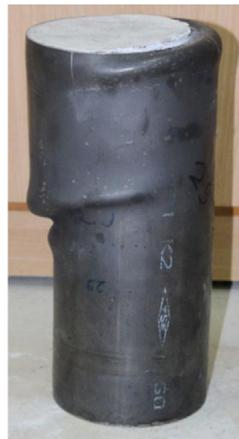  
Fig. 6. Crippling in specimen with thinner tube (Specimen 114.3-2.74-300-66).

length. Also, more end shortening was observed in the specimen with 107 MPa concrete core at peak compression load, compared to the $3 0 0 \mathrm { m m }$ specimen.

As for the influence of the 107 MPa concrete to compression load capacity, compared to the performance of 56 MPa concrete, a $3 6 . 8 1 \%$ increment was realized in specimens with thinner tubes whereas this capacity increment is just $1 4 . 2 \%$ for thicker tubes.

Reduction in initial stiffness due to the use of large amount of fine aggregate per $\mathrm { m } ^ { 3 }$ was again observed in columns with 107 MPa concrete.

# 3.3. 900 mm columns

Global mode of failure was more dominant in $9 0 0 \mathrm { m m }$ columns. Failure modes of some specimens are depicted in Fig. 9. In addition to the global mode of failure, local modes of crippling were observed in the columns with thinner steel tube. This type of local failure can be observed in Fig. 9a (concave side of column at mid-height level). In order to provide a clear vision of this behaviour, Fig. 10 presents an extended view of this local mode of failure. Compression load- shortening curves of six $9 0 0 \mathrm { m m }$ specimens are presented in Fig. 11.

Specimens 114.3-2.74-900-56, 114.3-2.74-900-66 and 114.3- 2.74-900-107 developed compression load capacities of 877.28 kN, 983.51 kN and 1233.24 kN, respectively with corresponding SI of 1.31, 1.30 and 1.15. Considering the SI magnitudes of $3 0 0 \mathrm { m m }$ and $6 0 0 \mathrm { m m }$ columns with thinner tubes, it can be obviously seen that increment in L/D ratio reduces the confinement effect. Although the transition from pre-peak to post-peak region is more gradual for specimen with 107 MPa concrete core and $9 0 0 \mathrm { m m }$ length, brittle behaviour of 107 MPa concrete still shows itself on the load shortening curve (Fig. 11). Also, a larger shortening value was recorded at peak compression load level for all specimens with 107 MPa concrete compared to shortening levels of $3 0 0 \mathrm { m m }$ and $6 0 0 \mathrm { m m }$ columns with the same tube thickness and concrete strength, (Figs. 5, 8 and 11).

Increments in tube thickness and yield strength in the $9 0 0 \mathrm { m m }$ column led to higher stiffness, ductility and toughness in this set, as shown in Fig. 11. Specimens 114.3-5.90-900-56, 114.3-5.90-900- 66 and 114.3-5.90-900-107 achieved compression load capacities of 1592.48 kN, 1713.34 kN and 1907.29 kN, respectively, and the corresponding SI of the specimens are 1.44, 1.46 and 1.30. An anomaly in SI magnitudes was observed in this set. The SI magnitude of specimen 114.3-5.90-900-56 was expected to be larger than that of specimen 114.3-5.90-900-66. This inconsistent behaviour can be attributed to uncertainties generated by the concrete strength. In general, these SI magnitudes are smaller than the SI magnitudes of columns of $3 0 0 \mathrm { m m }$ and $6 0 0 \mathrm { m m }$ length with same

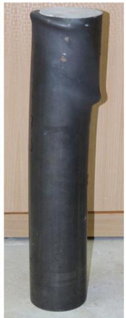  
  
Fig. 7. Failure modes of $6 0 0 \mathrm { m m }$ columns (a) 114.3-2.74-600-56 (b) 114.3-2.74- 600-66.

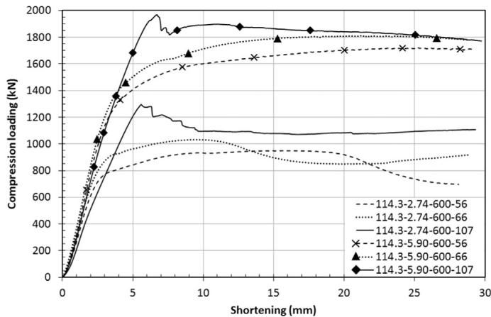  
Fig. 8. Compression load - shortening curves of 600 mm columns.

steel thickness and concrete strength. Thus, the effect of $L / D$ ratio on confinement can be noticed here again. Although the fall in the load of the specimen 114.3-5.90-900-107 is more gradual compared to the fall in the load of $3 0 0 \mathrm { m m }$ and $6 0 0 \mathrm { m m }$ columns, the brittle behaviour of the 107 MPa concrete was observed up to end of the test for this specimen, (Fig. 11). This behaviour is most likely due to the global failure mode of the column. With global failure mode, tension and compression crack regions spread out from column mid-height to lower and upper ends. This behaviour causes gradual concrete failures at different shortening levels. A similar behaviour also was observed for specimen 114.3-2.74-900- 107, (Fig. 11).

For the $9 0 0 \mathrm { m m }$ column with thinner tube the 107 MPa concrete core increased the compression load capacity of the column by $4 0 . 5 6 \%$ , compared to compression load capacity of the same tube with 56 MPa concrete. On the other hand, the contribution of the 107 MPa concrete to the compression load capacity of the thicker tube is $1 9 . 7 6 \%$ . As with previous tests, 107 MPa concrete again contributed much more to compression load capacity of

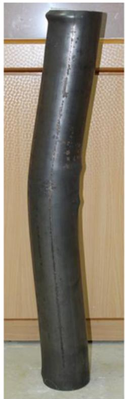  
(a)

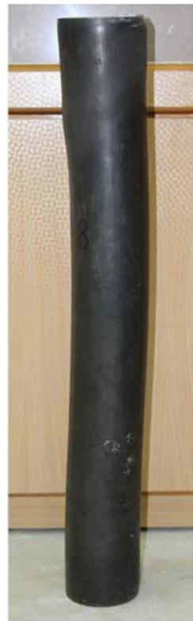  
  
Fig. 9. Failure modes of $9 0 0 \mathrm { m m }$ columns (a) 114.3-2.74-900-56 (b) 114.3-5.90- 900-107.

thinner tubes.

As explained in previous sections, the fine aggregate in the 107 MPa concrete causes the low initial stiffness in specimens 114.3-2.74-900-107 and 114.3-5.90-900-107 compared to specimens with 56 MPa and 66 MPa concrete.

# 4. Design specifications

EC4 and AISC 360-10 standards are used in this paper. EC4 adopts the limit state design to provide for serviceability and safety, by employing some partial safety factors to load and material properties. On the other hand, the AISC 360-10 procedure, which is based on structural steel design, allows the use of either the limit state or the allowable stress design. In addition to 18 novel test results presented in this paper, 239 CFST column test data on circular sections were collected from literature. In total, 215 test data (repetitive tests reduce the number of unique columns) which cover a relatively wide range of CFST column parameters, were employed in the design specification calculations. Table 2 presents the number of CFST columns tested in each literature study and the ranges of the physical properties of the columns. In all design specification assessments material partial safety factors were set to unity.

# 4.1. Eurocode-4

Plastic resistance of the concrete filled composite section is calculated by adding the resistance of the constituent steel and concrete materials as follows:

$$
N _ {\mathrm {p l}, \mathrm {R d}} = A _ {\mathrm {s}} f _ {\mathrm {y}} + A _ {\mathrm {c}} f _ {\mathrm {c}} \tag {3}
$$

Square and rectangular tubes offer little confinement because

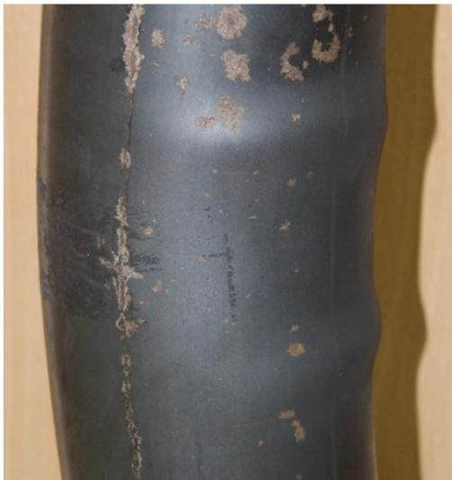  
Fig. 10. Local failure region of specimen 114.3-2.74-900-56.

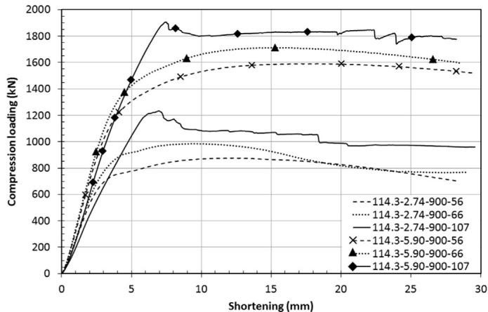  
Fig. 11. Compression load - shortening curves of 900 mm columns.

the walls in these tubes must resist the concrete pressure by plate bending, instead of generated hoop stress in circular sections [44]. For the circular CFST columns, EC4 presents an explicit formulation which also incorporates the confinement effect, as follows:

$$
N _ {\mathrm {p l}, \mathrm {R d}} = \eta_ {a} A _ {s} f _ {y} + A _ {c} f _ {c} \left(1 + \eta_ {c} \frac {t}{D} \frac {f _ {y}}{f _ {c}}\right) \tag {4}
$$

in which $\eta _ { a }$ is the steel reduction factor and $\eta _ { c }$ is the concrete enhancement factor. If eccentricity is smaller than $1 0 \%$ of the external diameter of the steel tube, the steel reduction and the concrete enhancement factors are evaluated as follows:

$$
\eta_ {a} = 0. 2 5 (3 + 2 \bar {\lambda}) \leq 1. 0 \tag {5}
$$

$$
\eta_ {c} = 4. 9 - 1 8. 5 \bar {\lambda} + 1 7 \bar {\lambda} ^ {2} \geq 0 \tag {6}
$$

EC4 considers the confinement effect in circular CFST columns when the relative slenderness ratio $( \bar { \lambda } )$ does not exceed 0.5.

$$
\bar {\lambda} = \sqrt {\frac {N _ {\mathrm {p l} , \mathrm {R d}}}{N _ {\mathrm {c r}}}} \tag {7}
$$

where $N _ { \mathrm { p l , R d } }$ is the plastic resistance of column, evaluated by using Eq. (3) and $N _ { \mathrm { c r } }$ is Euler critical load. The critical load of column is evaluated as follows:

$$
N _ {\mathrm {c r}} = \frac {\pi^ {2} (E I) _ {e}}{L ^ {2}} \tag {8}
$$

in which $( E I ) _ { e }$ refers to the effective stiffness of the member which is given by:

$$
(E I) _ {e} = E _ {s} I _ {s} + K _ {e} E _ {c} I _ {c} \tag {9}
$$

where $E _ { s }$ is the elastic modulus of steel and $E _ { c }$ is the elastic modulus of concrete defined by $\begin{array} { r } { E _ { c } = 2 2 0 0 0 \left( \frac { f _ { c } + 8 \mathrm { \ M P a } } { 1 0 } \right) ^ { 0 . 3 } . \ I _ { s } } \end{array}$ + f 8 MPa 0.3 c s is moment of inertia of steel tube and $I _ { c }$ is moment of inertia of concrete core. Finally, $K _ { e }$ is a correction factor equal to 0.6. EC4 also considers the effects of imperfections that might cause second order moments by multiplying the column plastic resistance by a reduction factor $\chi$ :

$$
\chi = \frac {1}{\varnothing + \left[ \varnothing^ {2} - \bar {\lambda} ^ {2} \right] ^ {0 . 5}} \leq 1. 0 \tag {10}
$$

The reduction factor $\chi$ is calculated using European column curves and the parameter $\varnothing$ is evaluated as follows:

$$
\varnothing = 0. 5 \left[ 1 + \alpha (\bar {\lambda} - 0. 2) + \bar {\lambda} ^ {2} \right] \tag {11}
$$

in which $\alpha$ is an imperfection factor, equal to 0.21 for circular CFST columns.

# 4.2. AISC-360-10

For axially loaded CFST columns based on slenderness of member, AISC 360-10 calculates compressive load capacity as follows:

$$
P _ {n} = P _ {n o} \left[ 0. 6 5 8 ^ {\frac {P _ {n o}}{P _ {e}}} \right] \quad \frac {P _ {n o}}{P _ {e}} \leq 2. 2 5
$$

$$
P _ {n} = 0. 8 7 7 P _ {e} \quad \frac {P _ {n o}}{P _ {e}} > 2. 2 5 \tag {12}
$$

where $P _ { n o }$ is the nominal compressive capacity of the composite section and $P _ { e }$ is the Euler critical load, which is calculated using effective stiffness $( E I ) _ { e }$ :

$$
(E I) _ {e} = E _ {s} I _ {s} + C _ {3} E _ {c} I _ {c} \tag {13}
$$

Elastic modulus of concrete in AISC 360-10 is given by $E _ { c } = 4 7 0 0 \sqrt { f _ { c } }$ and $C _ { 3 }$ is the coefficient for effective rigidity of the filled composite column:

$$
C _ {3} = 0. 6 + 2 \left[ \frac {A _ {s}}{A _ {c} + A _ {s}} \right] \leq 0. 9 \tag {14}
$$

AISC 360-10 considers local buckling effect using three different classifications for steel tubes. A circular CFST member is considered to be compact if $D / t$ ratio is lower than $\lambda _ { p } = 0 . 1 5 E _ { s } / f _ { y }$ . The section is considered to be non-compact if $D / t$ ratio is greater than $\lambda _ { p }$ but lower than $\lambda _ { r } = 0 . 1 9 E _ { s } / f _ { y }$ . Finally, the section is considered to be slender when $D / t$ ratio is larger than $\lambda _ { r }$ . The nominal compressive capacity of the composite section $P _ { n o }$ is calculated according to these classifications of the sections. For compact sections nominal compressive capacity is equal to plastic strength of the composite section $\left( P _ { p } \right)$ :

$$
P _ {n o} = P _ {p} \tag {15}
$$

and plastic strength of the section is given by:

$$
P _ {p} = A _ {s} f _ {y} + C _ {2} A _ {c} f _ {c} \tag {16}
$$

$C _ { 2 }$ is equal to 0.95 for circular CFST columns. By adopting this coefficient, AISC 360-10 implies that the steel tube reaches its

Table 2 CFST column experiments collected from literature.   

<table><tr><td>Ref.</td><td># of tests</td><td>L/D</td><td>D (mm)</td><td>t (mm)</td><td>fc(MPa)</td><td>fy (MPa)</td></tr><tr><td>[2]</td><td>6</td><td>2.10–2.19</td><td>114.0–167.0</td><td>3.10–5.60</td><td>44–60</td><td>300</td></tr><tr><td>[16]</td><td>24</td><td>5.16–21.77</td><td>114.85–193.7</td><td>3.00–3.50</td><td>27.2–34.11</td><td>345.2–488.2</td></tr><tr><td>[11]</td><td>27</td><td>7.87–22.50</td><td>44.45–63.5</td><td>1.25–2.00</td><td>36.04–51.60</td><td>250</td></tr><tr><td>[37]</td><td>36</td><td>3.00–10.00</td><td>114.3</td><td>3.35–6.00</td><td>22.50–105.45</td><td>287.33–342.95</td></tr><tr><td>[9]</td><td>17</td><td>2.97–3.09</td><td>165.0–219.0</td><td>2.72–4.78</td><td>34.1–68.7</td><td>350</td></tr><tr><td>[38]</td><td>12</td><td>3.17–3.27</td><td>159.0–164.0</td><td>3.80–6.30</td><td>25.93</td><td>342–379</td></tr><tr><td>[1]</td><td>13</td><td>2.61–2.63</td><td>114.09–115.04</td><td>3.75–5.02</td><td>24.6–83.9</td><td>343–365</td></tr><tr><td>[39]</td><td>14</td><td>4.52–9.13</td><td>219.0</td><td>7.00</td><td>34.09–35.87</td><td>272–275</td></tr><tr><td>[10]</td><td>15</td><td>12.48–25.03</td><td>159.6–160.3</td><td>4.96–5.20</td><td>40–106</td><td>270–283</td></tr><tr><td>[13]</td><td>12</td><td>3.00</td><td>108.0–149.0</td><td>2.96–6.47</td><td>25.4–77</td><td>308–853</td></tr><tr><td>[40]</td><td>11</td><td>32.50–38.50</td><td>108.0</td><td>4.00</td><td>18.11–26.01</td><td>348.1</td></tr><tr><td>[41]</td><td>14</td><td>2.01–3.29</td><td>111.3–250.0</td><td>1.70–9.00</td><td>29.41–49.64</td><td>248–482.5</td></tr><tr><td>[42]</td><td>15</td><td>3.47–3.52</td><td>165.0–190.0</td><td>0.86–2.82</td><td>41–108</td><td>185.7–363.3</td></tr><tr><td>[43]</td><td>23</td><td>6.00–51.48</td><td>108.0</td><td>4.00</td><td>28.99</td><td>338.88</td></tr><tr><td>Pres. study</td><td>18</td><td>2.62–7.87</td><td>114.3</td><td>2.74–5.90</td><td>56.20–107.20</td><td>235–355</td></tr><tr><td>Total</td><td>257</td><td></td><td></td><td></td><td></td><td></td></tr></table>

yield strength when the concrete core strength is about $0 . 9 5 f _ { c }$ . For square and rectangular composite columns the parameter $C _ { 2 }$ is equal to 0. 85. AISC 360-10 considers the confinement effect of circular steel sections by just incorporating $C _ { 2 }$ coefficient of 0.95, instead of 0.85, which implies an $1 1 \%$ constant performance increment for circular tubes.

For non-compact sections, the nominal compressive capacity is calculated as follows:

$$
P _ {n o} = P _ {p} - \frac {P _ {p} - P _ {y}}{\left(\lambda_ {r} - \lambda_ {p}\right) ^ {2}} \left(\lambda - \lambda_ {p}\right) ^ {2} \tag {17}
$$

where, $P _ { y }$ is the yield strength of the composite section, and is given by:

$$
P _ {y} = A _ {s} f _ {y} + 0. 7 A _ {c} f _ {c} \tag {18}
$$

For slender sections, the nominal compressive capacity is formulated as follows:

$$
P _ {n o} = A _ {s} f _ {c r} + 0. 7 A _ {c} f _ {c} \tag {19}
$$

In Eq. (19) $f _ { c r }$ is the critical local buckling stress of the filled circular section, and is calculated as follows:

$$
f _ {c r} = \frac {0 . 7 2 f _ {y}}{\left(\left(\frac {D}{t}\right) \frac {f _ {y}}{E _ {s}}\right) ^ {0 . 2}} \tag {20}
$$

Through these AISC 360-10 equations slender sections are limited to developing critical local buckling stress $f _ { c r }$ of steel tube and $0 . 7 f _ { c }$ of concrete core.

# 5. Design Specifications against Experiments

A comparison of the specification prediction performances is given in this section. Fig. 12 shows the relative slenderness $( \bar { \lambda } )$ versus the ratio of design specification prediction to experimental result for CFST columns listed in Table 2. It can be seen from this figure that for lower relative slenderness values there is a significant difference between predictions. In this region EC4 generally overpredicts column capacity, whereas AISC 360-10 underpredicts the capacity. Beyond the relative slenderness value of approximately 0.4, EC4 also gives conservative results. In this region AISC 360-10 still gives lower predictions compared to EC4. It is also shown in Fig. 12 that as the relative slenderness increases, predictions of two codes get closer to each other. Beyond the relative slenderness of 1.0, AISC 360-10 has greater predictions

compared to EC4. In this region, predictions of AISC 360-10 are also closer to experimental results. Since Euler elastic column behaviour governs the response, for longer columns, these two codes give very close results beyond relative slenderness of 2.0. However, both codes are very conservative in this region, Fig. 12.

It is also crucial to specify the importance of parameters $( L / D , D /$ t and $\xi$ ) to be able to understand the mechanics of CFST columns. Fig. 13 presents the relationship between $L / D$ ratios and SI values of columns listed in Table 2. It can be observed in Fig. 13 that L/D ratio has a direct impact on column capacity. The relationship is approximately linear and as the $L / D$ ratio increases capacity of the column decreases. This means that L/D should be a major parameter in CFST member design. It is also shown in Fig. 13 that SI greater than unity can be provided up to a L/D ratio of 20. Considering the columns which have SI value greater than unity and L/ D ratio greater than 7.0 it was noticed that these columns have diverse concrete and steel strengths but maximum D/t ratio of 55.3. This conclusion is similar to the conclusion drawn by Giakoumelis and Lam [1].

It can be also shown that the relative slenderness ratio defined in EC4 formulations has the potential to be a good measure for column capacity predictions (Fig. 14).

From the relationship between D/t and SI, and confinement factor $\left( \xi \right)$ and SI it can be observed in Figs. 15 and 16, respectively that these parameters have no direct impact on column compression behaviour. However, an important conclusion can be drawn by observing Fig. 15. For columns with D/t ratios greater than 55.3 and SI values greater than unity, the maximum L/D ratio is 5.16.

# 6. Limitations of design specifications

Five limitations from the two design specifications (EC4 and AISC 360-10) are noted and these are presented in Table 3.

In this table, r refers radius of gyration of the composite section and parameter $\delta$ is called as steel contribution ratio, and is calculated as follows:

$$
\delta = \frac {A _ {\mathrm {s}} f _ {\mathrm {y}}}{N _ {\mathrm {p l} , \mathrm {R d}}} \tag {21}
$$

$N _ { \mathrm { p l , R d } }$ is the plastic resistance of composite section which is calculated using Eq. (3). If $\delta$ is less than 0.2, EC4 refers the design procedure of the CFST to Eurocode-2. On the other hand, if $\delta$ is greater than 0.9, EC4 refers the design procedure of the CFST to Eurocode-3.

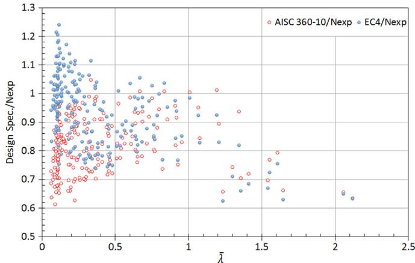  
Fig. 12. Relative slenderness versus ratios of EC4 and AISC 360-10 predictions to test results.

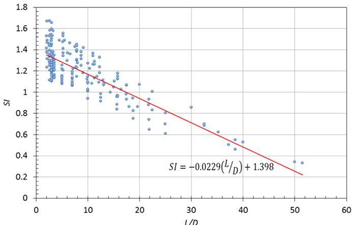  
Fig. 13. L/D ratio versus strength index of columns.

Fig. 17 presents the minimum circular tube thicknesses allowed by EC4 and AISC 360-10 for S355 European steel. It can be observed from Fig. 17 that AISC 360-10 covers relatively lower thicknesses. This is a prominent characteristic of AISC 360-10. Unlike AISC 360-10, EC4 has a strict limitation on the thickness of the tube to eliminate adverse effects of local buckling. The difference is remarkable even between compact section limit of AISC 360-10 and EC4 thickness limit. As the diameter of steel tube increases the difference between allowed thicknesses also increases. Table 4 presents the number of columns from the literature (among 215 unique specimens) which have properties beyond the application limits of design specifications. It should be noted that some specimens violate more than one design specification limit. However, such an interaction effect is not considered in this section. Performance of design specification prediction methods beyond the application limits are assessed considering each limit separately.

The ratios of EC4 prediction to experimental result for 30 columns out of the thickness limit of EC4 range from 0.75 to 1.04 with an average value of 0.92. It is very important here to note that all columns in this group have SI value greater than unity. Therefore, it can be concluded that minimum thickness limit equation of EC4 should be improved to allow thinner circular tubes in design calculations. On the other hand ratios of AISC 360-10 prediction to experimental result for 7 non-compact sections range from 0.65 to 0.86 and for 3 slender sections range from 0.63 to 0.71. SI values of these 10 columns are also greater than unity. So it can be deduced that AISC 360-10 non-compact and slender column limits also should be updated. Comparing the performances of codes it can be

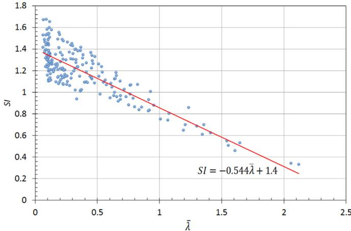  
Fig. 14. Relative slenderness versus strength index of columns.

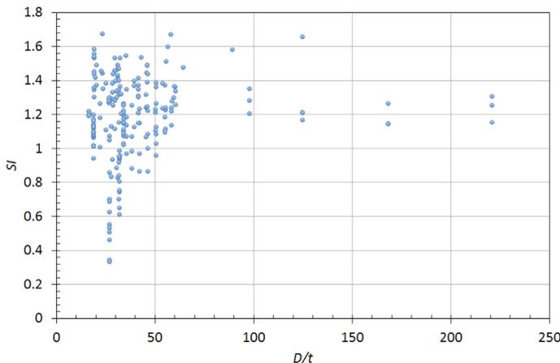  
Fig. 15. D/t ratio versus strength index of columns.

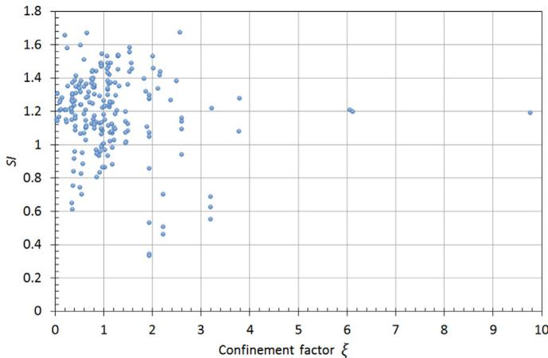  
Fig. 16. Confinement factor (ξ) versus strength index of columns.

inferred that EC4 predictions are more successful and closer to target test results even for the columns which are out of the tube thickness limits.

Steel contribution ratios $( \delta )$ of 16 columns are lower than 0.2 and range from 0.035 to 0.195. For these columns EC4 prediction to experimental result ratios range from 0.75 to 1.04 with an average value of 0.97. All these columns also have SI value greater than unity. Thus, EC4 predictions for lower steel contribution ratios are not far away from target test results and lower limit of steel contribution ratio could be changed to include solution of columns with lower steel areas.

For 17 columns which have steel tube yield strength beyond

EC4 limits the ratios of EC4 prediction to experimental result range from 0.81 to 1.23 with an average value of 1.01. Therefore, it can be deduced that EC4 has also successful predictions for CFST columns which have steel yield strength out of EC4 lower and upper limits. On the other hand, AISC 360-10 prediction to experimental result ratios for 7 columns which have steel yield strength beyond the limit of AISC 360-10 range from 0.80 to 0.84. AISC 360-10 predictions are still conservative for these columns.

Core concrete strengths of 63 CFST columns are out of the limits of EC4. For those columns ratios of EC4 prediction to experimental result range from 0.67 to 1.18 with an average value of 0.97. Lower prediction to experimental result ratios are belong to columns which have L/D ratios greater than 30. Without very long columns, minimum prediction to experimental result ratio is 0.75 and the average value of predictions is 0.99. It can be inferred that especially upper limit of concrete strength in EC4 can be altered to

Table 3 Differences in applicability limits of design specifications.   

<table><tr><td></td><td>EC4</td><td>AISC-360-10</td></tr><tr><td>Thickness of tube</td><td>t≥90235fy</td><td>t≥0.31Fsfy</td></tr><tr><td>Steel amount</td><td>0.2≤δ≤0.9</td><td>≥1% of gross area</td></tr><tr><td>Steel yield strength (MPa)</td><td>235≤fy≤460</td><td>≤525</td></tr><tr><td>Concrete strength (MPa)</td><td>20≤fc≤60</td><td>21≤fc≤70</td></tr><tr><td>Column slenderness</td><td>λ≤2.0</td><td>KL/r≤200</td></tr></table>

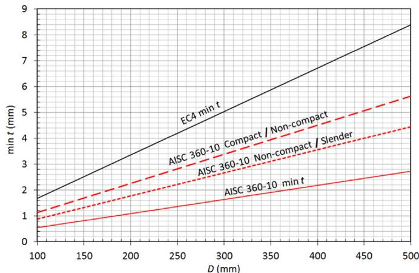  
Fig. 17. Differences between EC4 and AISC 360-10 in allowed circular tube thickness.

cover higher strength concrete classes. Among the 215 experimental data 54 columns have concrete strength beyond AISC 360- 10 limits. The ratios of AISC 360-10 prediction to experimental result for these columns range from 0.63 to 1.01 with an average value of 0.87. Nevertheless, lower ratios of prediction to experimental results for AISC 360-10 has nothing to do with L/D ratios of columns. Very conservative predictions of AISC 360-10 in this group are also belong to short stub columns.

Just 2 columns have slenderness values greater than slenderness limits of EC4 and AISC 360-10. Ratios of EC4 and AISC 360-10 predictions to experimental results for these columns are very close since Euler elastic buckling governs the behaviour. For both specifications those ratios are between 0.63 and 0.65. It can be clearly concluded that both specifications have very conservative predictions for these columns.

# 7. Conclusions

The results of tests convey important information about the physical behaviour of CFST columns and present the opportunity to assess the contribution of steel and concrete properties to column axial capacity. In addition to 18 novel tests presented in this paper, 239 CFST column test data were also collected from literature to assess EC4 and AISC 360-10 predictions. The following conclusions can be drawn:

SI of the column decreases as the core concrete strength increases. So, confinement performance is greater for columns with lower concrete strength.   
Unlike 107 MPa concrete, 56 MPa and 66 MPa concretes have greater deformation capacity and ductility. Also, the confinement of thicker steel tubes with higher yield strength is better for 107 MPa concrete. In order to obtain more ductile and smooth behaviours this type of concrete should be used with much thicker steel tubes.   
 Contribution of 107 MPa concrete to the compression load capacity was found to be more for columns with thinner steel tubes.   
Unconservative predictions of EC4 generally were observed for columns with relative slenderness ratios smaller than 0.4. Beyond the relative slenderness value of approximately 0.4, EC4 gives conservative results. However, except for five tests, AISC 360-10 predictions are conservative for all test data.   
As the column slenderness increases predictions of EC4 and AISC 360-10 get closer. Although both codes give conservative results beyond a relative slenderness of 1.0, AISC 360-10

Table 4 Number of columns beyond application limits of design specifications.   

<table><tr><td rowspan="2">Ref.</td><td colspan="3">Thickness</td><td colspan="2">Steel Amount</td><td colspan="2">Yield Strength</td><td colspan="2">Concrete Strength</td><td colspan="2">Column Slenderness</td></tr><tr><td>EC4</td><td>AISC 360-10 NC</td><td>AISC 360-10 SL</td><td>EC4</td><td>AISC 360-10</td><td>EC4</td><td>AISC 360-10</td><td>EC4</td><td>AISC 360-10</td><td>EC4</td><td>AISC 360-10</td></tr><tr><td>[16]</td><td>11</td><td>-</td><td>-</td><td>-</td><td>-</td><td>3</td><td>-</td><td>-</td><td>-</td><td>-</td><td>-</td></tr><tr><td>[37]</td><td>-</td><td>-</td><td>-</td><td>-</td><td>-</td><td>-</td><td>-</td><td>18</td><td>18</td><td>-</td><td>-</td></tr><tr><td>[9]</td><td>2</td><td>-</td><td>-</td><td>-</td><td>-</td><td>-</td><td>-</td><td>3</td><td>-</td><td>-</td><td>-</td></tr><tr><td>[1]</td><td>-</td><td>-</td><td>-</td><td>-</td><td>-</td><td>-</td><td>-</td><td>5</td><td>5</td><td>-</td><td>-</td></tr><tr><td>[10]</td><td>-</td><td>-</td><td>-</td><td>-</td><td>-</td><td>-</td><td>-</td><td>9</td><td>9</td><td>-</td><td>-</td></tr><tr><td>[13]</td><td>-</td><td>-</td><td>-</td><td>-</td><td>-</td><td>7</td><td>7</td><td>3</td><td>3</td><td>-</td><td>-</td></tr><tr><td>[40]</td><td>-</td><td>-</td><td>-</td><td>-</td><td>-</td><td>-</td><td>-</td><td>3</td><td>3</td><td>-</td><td>-</td></tr><tr><td>[41]</td><td>2</td><td>1</td><td>-</td><td>1</td><td>-</td><td>1</td><td>-</td><td>-</td><td>-</td><td>-</td><td>-</td></tr><tr><td>[42]</td><td>15</td><td>6</td><td>3</td><td>12</td><td>-</td><td>6</td><td>-</td><td>10</td><td>10</td><td>-</td><td>-</td></tr><tr><td>[43]</td><td>-</td><td>-</td><td>-</td><td>-</td><td>-</td><td></td><td></td><td></td><td></td><td>2</td><td>2</td></tr><tr><td>Pres. study</td><td>-</td><td>-</td><td>-</td><td>3</td><td>-</td><td>-</td><td>-</td><td>12</td><td>6</td><td>-</td><td>-</td></tr><tr><td>Total</td><td>30</td><td>7</td><td>3</td><td>16</td><td>-</td><td>17</td><td>7</td><td>63</td><td>54</td><td>2</td><td>2</td></tr></table>

NC: Non-compact, SL: Slender.

performs a little better in this region and has predictions closer to test results for the specimens studied in this paper.

 It is shown that $L / D$ ratio and relative slenderness $( \bar { \lambda } )$ are very important parameters for CFST columns and have direct impacts on column capacity. On the other hand, D/t and confinement factor do not have direct impact on CFST column behaviour.   
 In general, EC4 predictions indicate much better agreement with the test results and it has also reasonable predictions for CFST columns which have properties beyond the application limits. Therefore, application limits of EC4 could be changed to cover solution of wider column configurations. AISC 360-10 gives conservative results for CFST columns which have properties within and beyond the application limits. This means that the confinement effect of circular tubes in AISC 360-10 equations should be revised.

# Acknowledgements

This work is financially supported by the Scientific Research Unit of University of Gaziantep, under the Project MF 14.06. The authors also wish to thank to BASF/Turkey (AKAS) for providing concrete admixtures for the experiments.

# References

[1] G. Giakoumelis, D. Lam, Axial capacity of circular concrete-filled tube columns, J. Constr. Steel Res. 60 (2004) 1049–1068.   
[2] F. Abed, M. AlHamaydeh, S. Abdalla, Experimental and numerical investigations of the compressive behavior of concrete filled steel tubes (CFSTs), J. Constr. Steel Res. 80 (2013) 429–439.   
[3] X. Chang, X. Luo, C. Zhu, C. Tang, Analysis of circular concrete-filled steel tube (CFT) support in high ground stress conditions, Tunn. Undergr. Space Technol. 43 (2014) 41–48.   
[4] N.K. Brown, M.J. Kowalsky, J.M. Nau, Impact of D/t on seismic behavior of reinforced concrete filled steel tubes, J. Constr. Steel Res. 107 (2015) 111–123.   
[5] L.H. Han, W. Li, R. Bjorhovde, Developments and advanced applications of concrete-filled steel tubular (CFST) structures: Members, J. Constr. Steel Res. 100 (2014) 211–228.   
[6] F. Xu, J. Chen, W.L. Jin, Experimental investigation of thin-walled concretefilled steel tube columns with reinforced lattice angle, Thin-Walled Struct. 84 (2014) 59–67.   
[7] M.H. Lai, J.C.M. Ho, Confinement effect of ring-confined concrete-filled-steeltube columns under uni-axial load, Eng. Struct. 67 (2014) 123–141.   
[8] N. Ferhoune, Experimental behaviour of cold-formed steel welded tube filled with concrete made of crushed crystallized slag subjected to eccentric load, Thin-Walled Struct. 80 (2014) 159–166.   
[9] Z.W. Yu, F.X. Ding, C.S. Cai, Experimental behavior of circular concrete-filled steel tube stub columns, J. Constr. Steel Res. 63 (2007) 165–174.   
[10] J. Zeghiche, K. Chaoui, An experimental behaviour of concrete-filled steel tubular columns, J. Constr. Steel Res. 61 (2005) 53–66.   
[11] M.V. Chitawadagi, M.C. Narasimhan, S.M. Kulkarni, Axial strength of circular concrete-filled steel tube columns — DOE approach, J. Constr. Steel Res. 66 (2010) 1248–1260.   
[12] F.X. Ding, Z.W. Yu, Y. Bai, Y.Z. Gong, Elasto-plastic analysis of circular concretefilled steel tube stub columns, J. Constr. Steel Res. 67 (2011) 1567–1577.   
[13] K. Sakino, H. Nakahara, S. Morino, I. Nishiyama, Behavior of centrally loaded concrete-filled steel-tube short columns, J. Struct. Eng. 130 (2004) 180–188.   
[14] Y. Wang, J. Chen, Y. Geng, Testing and analysis of axially loaded normalstrength recycled aggregate concrete filled steel tubular stub columns, Eng. Struct. 86 (2015) 192–212.   
[15] W.L.A. de Oliveira, S. De Nardin, A.L.H. de Cresce El Debs, M.K. El Debs, Influence of concrete strength and length/diameter on the axial capacity of CFT

columns, J. Constr. Steel Res. 65 (2009) 2103–2110.   
[16] M. Dundu, Compressive strength of circular concrete filled steel tube columns, Thin-Walled Struct. 56 (2012) 62–70.   
[17] M. Yu, X. Zha, J. Ye, C. She, A unified formulation for hollow and solid concretefilled steel tube columns under axial compression, Eng. Struct. 32 (2010) 1046–1053.   
[18] W.H. Kang, B. Uy, Z. Tao, S.J. Hicks, Design Strength of Concrete-Filled Steel Columns, Adv. Steel Constr. 11 (2015) 165–184.   
[19] Z. Tao, B. Uy, L.H. Han, S.H. He, Design of concrete-filled steel tubular members according to australian standard AS5100 model and calibration, Aust. J. Struct. Eng. 8 (2008) 197–214.   
[20] Commentary on the Specification for Structural Steel Buildings AISC-360-10, in: AISC, Chicago, Illinois, 2010.   
[21] AISC 360-10. Specification for Structural Steel Buildings, in: AISC, Chicago, Illinois, 2010.   
[22] EN 1994-1-1 Eurocode 4. Design of Composite Steel and Concrete Structures-Part 1-1: General Rules and Rules for Buildings, in: CEN, Brussels, 2004.   
[23] AIJ 2008. Recommendations for Design and Construction of Concrete Filled Steel Tubular Structures, in: AIJ, Tokyo, 2008.   
[24] AS 5100.6-2004 Bridge Design Part 6: Steel and Composite Construction, in: AS, Sydney, 2004.   
[25] DBJ/T13-51-2010. Technical Specifications for Concrete-Filled Steel Tubular Structures, in: DBJ, Fuzhou, 2010 (in Chinese).   
[26] SANS 10162-1. The Structural Use of Steel Part 1: Limit-State Design of Hot-Rolled Steelwork, in, South Africa National Standards, Pretoria, South Africa, 2005.   
[27] L.H. Han, G.H. Yao, X.L. Zhao, Tests and calculations for hollow structural steel (HSS) stub columns filled with self-consolidating concrete (SCC), J. Constr. Steel Res. 61 (2005) 1241–1269.   
[28] B. Uy, Z. Tao, L.H. Han, Behaviour of short and slender concrete-filled stainless steel tubular columns, J. Constr. Steel Res. 67 (2011) 360–378.   
[29] L. Guo, S. Zhang, W.J. Kim, G. Ranzi, Behavior of square hollow steel tubes and steel tubes filled with concrete, Thin-Walled Struct. 45 (2007) 961–973.   
[30] H.T. Thai, B. Uy, M. Khan, Z. Tao, F. Mashiri, Numerical modelling of concretefilled steel box columns incorporating high strength materials, J. Constr. Steel Res. 102 (2014) 256–265.   
[31] ASTM C39/C39M-14a, Standard Test Method for Compressive Strength of Cylindrical Concrete Specimens, ASTM International, in: West Conshohocken, PA, 2014.   
[32] R.D. Ziemian, Guide to Stability Design Criteria for Metal Structures, 6th edition, Wiley, 2010.   
[33] F.X. Ding, J. Liu, X.M. Liu, Z.W. Yu, D.W. Li, Mechanical behavior of circular and square concrete filled steel tube stub columns under local compression, Thin-Walled Struct. 94 (2015) 155–166.   
[34] Z. Tao, L.H. Han, D.Y. Wang, Strength and ductility of stiffened thin-walled hollow steel structural stub columns filled with concrete, Thin-Walled Struct. 46 (2008) 1113–1128.   
[35] ACI. Building Code Requirements for Structural Concrete and Commentary, in: American Concrete Institute (ACI), USA, 2011.   
[36] AS 3600–2009. Concrete Structures, in: Australian Standards (AS), Sydney, 2009.   
[37] A.T. Beck, W.L.A. de Oliveira, S. De Nardim, A.L.H.C. ElDebs, Reliability-based evaluation of design code provisions for circular concrete-filled steel columns, Eng. Struct. 31 (2009) 2299–2308.   
[38] B. Li, R. Hao, The analysis of concrete filled steel tube column carrying capacity, J. Baotou Univ. Iron Steel Technol. 24 (2005) 5–8 (in Chinese).   
[39] B. Li, Y. Wen, Experimental study on bearing capacity of long concrete filled steel tubular columns with axial compression, Earthq. Eng. Eng. Vib. 23 (2003) 130–133 (in Chinese).   
[40] L. Han, S. Jiang, Y. Cao, Y. Yuan, Experimental studies on the behavior and strength of very slender concrete filled steel tubular columns, Steel Constr. 14 (1999) 21–25 (in Chinese).   
[41] L. Han, Theoretical analyses and experimental researches for the behaviors of high strength concrete filled steel tubes subjected to axial compression, Ind. Constr. 27 (1997) 39–44 (in Chinese).   
[42] R. Bridge, M. O’Shea, Australian composite code concrete filled steel tubes – A Comparison of International Codes and Practices, in: Proceedings of International Conference on Composite Construction, Innsbruck, 1997, pp. 59–74.   
[43] S. Cai, W. Gu, Behavior and ultimate strength of long concrete-filled steel tubular columns, J. Build. Struct. 6 (1985) 32–40 (in Cinese).   
[44] Y.M. Alostaz, S.P. Schneider, Connections to Concrete-Filled Steel Tubes, Department of Civil Engineering, University of Illinois, Urbana Champaign, 1996.