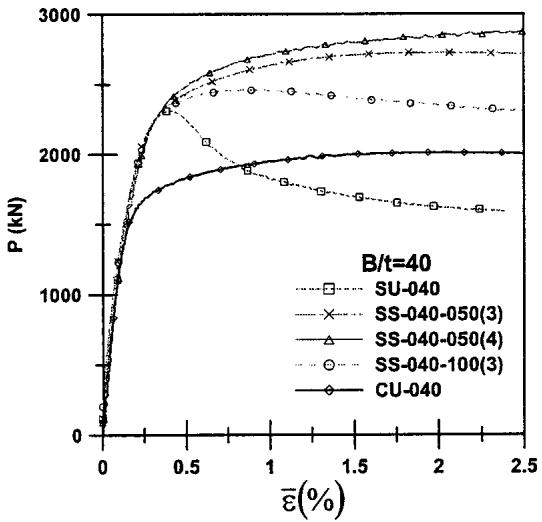
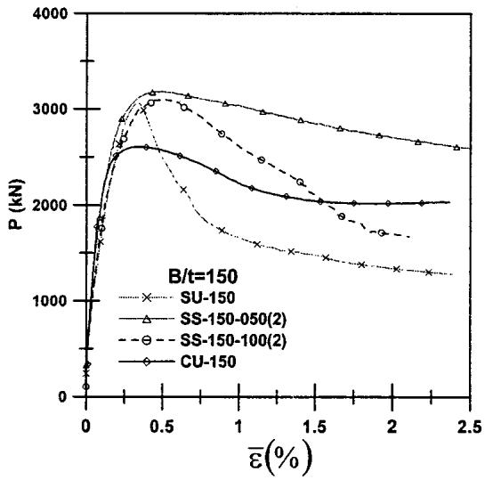

# Axial Load Behavior of Stiffened Concrete-Filled Steel Columns

C. S. Huang $^{1}$ ; Y.-K. Yeh $^{2}$ ; G.-Y. Liu $^{3}$ ; H.-T. Hu $^{4}$ ; K. C. Tsai $^{5}$ ; Y. T. Weng $^{6}$ ; S. H. Wang $^{7}$ ; and M.-H. Wu $^{8}$

Abstract: This study investigates the axial load behavior of concrete-filled steel tubular (CFT) columns with the width-to-thickness ratios between 40 and 150, and proposes an effective stiffening scheme to improve the mechanical properties of square cross-sectional CFT columns. Seventeen specimens were tested to examine the effects of cross-sectional shapes, width-to-thickness ratios, and stiffening arrangements on the ultimate strength, stiffness, and ductility of CFT columns. Moreover, nonlinear finite element analysis was also conducted to investigate cross-sectional axial stress distribution at the ultimate strength. Comparing the measured ultimate strength with estimates by using some current specifications suggested that current specifications may considerably underestimate the ultimate strength of circular CFT columns, particularly for columns with a small width-to-thickness ratio. Results in this study demonstrate that the proposed stiffening scheme can significantly enhance the ultimate strength and ductility of square CFT columns.

DOI: 10.1061/(ASCE)0733-9445(2002)128:9(1222)

CE Database keywords: Tubes; Axial loads; Finite element method; Stiffening; Steel columns.

# Introduction

In modern structural constructions, concrete-filled steel tubular (CFT) columns have gradually become a central element in structural systems like buildings, bridges and so forth. CFT columns have become so widespread owing to their axially compressed nature making them superior to conventional reinforced concrete and steel structural systems in terms of stiffness, strength, ductility, and energy absorption capacity. The steel tube not only takes axial load, but also provides confining pressure to the concrete core, while the concrete core takes axial load and prevents or delays local buckling of the steel tube. Furthermore, concrete-filled composite columns also have the advantage of requiring no formwork during construction, thus reducing construction costs.

$^{1}$ Associate Professor, Dept. of Civil Engineering, National Chiao Tung Univ., 1001 Ta-Hsueh Rd., Hsinchu, Taiwan 30050. Email: cshuang@cc.nctu.edu.tw

$^{2}$ Associate Research Fellow, National Center for Research on Earthquake Engineering, Taipei, Taiwan 10617.

3Associate Research Fellow, National Center for Research on Earthquake Engineering, Taipei, Taiwan 10617.

$^{4}$ Professor, Dept. of Civil Engineering, National Cheng Kung Univ., Tainan, Taiwan 70101.

$^{5}$ Professor, Dept. of Civil Engineering, National Taiwan Univ., Taipei, Taiwan 10617.

6Graduate Student, Dept. of Civil Engineering, National Taiwan Univ., Taipei, Taiwan 10617.

$^{7}$ Former Graduate Student, Dept. of Civil Engineering, National Taiwan Univ., Taipei, Taiwan 10617.

$^{8}$ Former Graduate Student, Dept. of Civil Engineering, National Cheng Kung Univ., Tainan, Taiwan 70101.

Note. Associate Editor: Amir Mirmiran. Discussion open until February 1, 2003. Separate discussions must be submitted for individual papers. To extend the closing date by one month, a written request must be filed with the ASCE Managing Editor. The manuscript for this paper was submitted for review and possible publication on May 9, 2001; approved on January 7, 2002. This paper is part of the Journal of Structural Engineering, Vol. 128, No. 9, September 1, 2002. ©ASCE, ISSN 0733-9445/2002/9-1222-1230/$8.00+$ .50 per page.

According to Zhong's book (Zhong 1995), the review by Uy (1998) and the report by Huang et al. (1998), numerous researchers have investigated the axial load behavior of CFT columns through laboratory tests and finite element analyses (i.e., Furlong 1967; Gardner and Jacobson 1967; Knowles and Park 1969; Tomii et al. 1977; Sakino et al. 1985; Lin and Huang 1989; Kwon and Song 1998; and Schneider 1998). These studies confirmed that the behavior of CFT columns is heavily influenced by the width-to-thickness ratio $(B / t$ or $D / t$ , $D$ for diameter of circular cross section), the height-to-width ratio $(L / B$ or $L / D)$ , the cross-sectional shape of the steel tube, and the strength ratio of concrete to steel. For example, Furlong (1967) experimentally investigated the effects of $B / t$ (between 30 and 100), and the strength ratio of concrete to steel on the axial strength of CFT columns. Meanwhile, Knowles and Park (1969) experimentally studied how $D / t$ (between 15 and 60) and $L / D$ (between 2 21) affect the behavior of circular CFT columns. Tomii et al. (1977) collected and analyzed about 270 experimental results for CFT columns with circular, octagonal, and square cross sections. Schneider (1998) also experimentally investigated the axial load behavior of CFT columns with circular and rectangular cross sections, and with $D / t$ between 17 and 50 and $L / D$ between 4 and 5. Additionally, a nonlinear finite element analysis was carried out to investigate the adequacy of the design provisions. Since the early 1960s, researchers in China have systematically and comprehensively investigated the behavior of circular CFT columns through laboratory tests and numerical analyses, and Zhong's book summarizes some of the results (Zhong 1995). These early works revealed that a square concrete-filled steel tube does not perform as well as a circular one because a square steel tube provides less confining pressure, making local buckling more likely. This fact is reflected in modern design codes such as Manual of Steel Construction: Load and Resistance Factor Design (LRFD) by American Institute of Steel Construction (AISC 1994; 1997) and Recommendations for Design and Construction of Concrete-Filled Steel Tubular Structures by Architectural Institute of Japan (AIJ 1997), in which the limiting width-to-thickness ratio of a steel

  
(a)   
(b)   
Fig. 1. (a) Photo for typical arrangement of stiffness, and (b) layout of typical stiffened cross section

tube with a rectangular cross section is smaller than that with a circular cross section.

To improve the behavior of rectangular CFT columns, two stiffening measures are frequently adopted: welding longitudinal steel strips on the internal surface of a steel tube and welding shear studs. Ge and Usami (1992) and Kwon and Song (1998) experimentally studied the effects of the former measure on the behavior of square CFT columns. According to their results, this approach increases ultimate strength because the longitudinal stiffeners share the axial load. However, this method also causes a severe strength loss in the postbuckling range. Lin et al. (1993)

found that although the second stiffening scheme does not influence strength, it does enhance the ductility of square CFT columns.

This work proposes a new stiffening scheme as an alternative for enhancing the behavior of square CFT columns in terms of strength and ductility. The proposed stiffening scheme involves welding a set of four steel bars (called tie bars below) at regular spacing along the tube axis. The stiffeners are typically arranged as displayed in Fig. 1. To investigate the effectiveness of the proposed stiffening scheme, laboratory tests of 14 specimens under concentric compression were carried out for short square CFT columns with or without stiffening. For comparison, experiments were also conducted on three short CFT columns with circular cross sections. The primary parameters considered in this test program include $B / t$ , the spacing of the tie bars $(L_{s})$ , and the diameters of the tie bars. These factors were experimentally investigated to assess their influence on ultimate strength, initial stiffness, and ductility. Finally, to further understand the effects of cross-sectional shapes and stiffening in confining the concrete core, nonlinear finite element analyses were conducted to determine the distribution of axial stress along a typical cross section when a CFT column reached maximum strength.

# Experimental Program

Seventeen test specimens with $L / B = 3$ were tested under concentric axial compression. Of the specimens, five were for $B / t$ (or $D / t = 40$ , eight were for $B / t$ (or $D / t = 70$ , and four were for $B / t$ (or $D / t = 150$ ). Three of the specimens were for circular cross section and the rest were for square cross section. Table 1 summarizes the dimensions and material properties of the specimens, with $A_{s}$ and $f_{y,t}$ representing the cross-sectional area and the yield strength of the steel tube, respectively; $f_{c}^{\prime}$ denoting the strength of the concrete core; $A_{\mathrm{total}}$ being the total composite cross-sectional area; and $d$ and $f_{y,b}$ representing the diameter and yield strength of the tie bars, respectively. For convenience, each specimen has an individual designation, involving two English letters followed by a series of numbers (see Table 1). The first

Table 1. Properties for Concrete-Filled Steel Tube Components   

<table><tr><td rowspan="2">Specimen</td><td rowspan="2">B or D (mm)</td><td rowspan="2">t (mm)</td><td rowspan="2">B/t or D/t</td><td rowspan="2">As/Atotal</td><td rowspan="2">Steel tube fy,t (MPa)</td><td rowspan="2">Concrete f′c (MPa)</td><td colspan="2">Tie Bar</td></tr><tr><td>d (mm)</td><td>fy,b (MPa)</td></tr><tr><td>SU-040</td><td>200</td><td>5</td><td>40</td><td>0.098</td><td>265.8</td><td>27.15</td><td>—</td><td>—</td></tr><tr><td>SS-040-050(3)</td><td>200</td><td>5</td><td>40</td><td>0.098</td><td>265.8</td><td>27.15</td><td>9.52</td><td>410.9</td></tr><tr><td>SS-040-050(4)</td><td>200</td><td>5</td><td>40</td><td>0.098</td><td>265.8</td><td>27.15</td><td>12.7</td><td>386.0</td></tr><tr><td>SS-040-100(4)</td><td>200</td><td>5</td><td>40</td><td>0.098</td><td>265.8</td><td>27.15</td><td>12.7</td><td>386.0</td></tr><tr><td>CU-040</td><td>200</td><td>5</td><td>40</td><td>0.098</td><td>265.8</td><td>27.15</td><td>—</td><td>—</td></tr><tr><td>SU-070</td><td>280</td><td>4</td><td>70</td><td>0.056</td><td>272.6</td><td>31.15</td><td>—</td><td>—</td></tr><tr><td>SS-070-050(3)</td><td>224</td><td>3.2</td><td>70</td><td>0.056</td><td>323.8</td><td>23.94</td><td>9.52</td><td>395.7</td></tr><tr><td>SS-070-050(3)R</td><td>224</td><td>3.2</td><td>70</td><td>0.056</td><td>323.8</td><td>25.73</td><td>9.52</td><td>395.7</td></tr><tr><td>SS-070-093(2)</td><td>280</td><td>4</td><td>70</td><td>0.056</td><td>272.6</td><td>30.49</td><td>7</td><td>588.6</td></tr><tr><td>SS-070-093(3)</td><td>280</td><td>4</td><td>70</td><td>0.056</td><td>272.6</td><td>30.49</td><td>9.52</td><td>615.3</td></tr><tr><td>SS-070-140(3)</td><td>280</td><td>4</td><td>70</td><td>0.056</td><td>272.6</td><td>29.84</td><td>9.5</td><td>615.3</td></tr><tr><td>SS-070-187(3)</td><td>280</td><td>4</td><td>70</td><td>0.056</td><td>272.6</td><td>29.18</td><td>9.52</td><td>615.3</td></tr><tr><td>CU-070</td><td>280</td><td>4</td><td>70</td><td>0.056</td><td>272.6</td><td>31.15</td><td>—</td><td>—</td></tr><tr><td>SU-150</td><td>300</td><td>2</td><td>150</td><td>0.026</td><td>341.7</td><td>27.20</td><td>—</td><td>—</td></tr><tr><td>SS-150-050(2)</td><td>300</td><td>2</td><td>150</td><td>0.026</td><td>341.7</td><td>24.00</td><td>7</td><td>735.8</td></tr><tr><td>SS-150-100(2)</td><td>300</td><td>2</td><td>150</td><td>0.026</td><td>341.7</td><td>25.21</td><td>7</td><td>735.8</td></tr><tr><td>CU-150</td><td>300</td><td>2</td><td>150</td><td>0.026</td><td>341.7</td><td>27.23</td><td>—</td><td>—</td></tr></table>

letter represents the cross-sectional shape of the specimen ( $C$ and $S$ for circular and square, respectively). The second letter, $S$ or $U$ , denotes a specimen with or without stiffening, respectively. Meanwhile, the three numbers following the English letters denote the width-to-thickness ratio. For stiffened specimens, the last three numbers before the parentheses represent the center-to-center spacing between the stiffened cross sections $L_{s}$ in terms of millimeters. Finally, the parenthesized number is the reinforcing bar number of the tie bar. To more accurately simulate practical applications, the steel tubes of these specimens were not annealed.

Additionally, to investigate the behavior of CFT columns influenced by the residual stresses from the welding, one specimen was constructed by annealing its stiffened steel tube before pouring concrete into the tube. An additional $R$ following the parentheses in Table 1 is used to denote this specimen that has been annealed.

All steel tubes were cold-formed carbon steel with a yield strength of between 265 and $342\mathrm{MPa}$ , depending on the thickness of the steel tube. The yield strength was determined from tests on tensile coupons taken from the steel plates that were also used to form the steel tubes. The size of coupons and the test procedures follow American Society for Testing and Materials, ASTM E10-84 (ASTM 1991) requirements. The square tubes were constructed by seam welding two U-shaped cold-formed steel plates. If stiffening were specified, the tie bars were fillet welded to the U-shaped cold-formed steel plates (see Fig. 1) before making the seam complete penetration groove welds (see Fig. 1). The typical layout of the tie bars is also shown in Fig. 1. Notably, a CFT constructed by seam welding four pieces of steel plates is likely to fail in the seam weld when tested because of stress concentration at the corners (Lin and Huang 1989).

Type I Portland cement, sand, and a maximum aggregate size of $2\mathrm{cm}$ were mixed to obtain an $18\mathrm{cm}$ slump with a 28-day target strength of $27.47\mathrm{MPa}$ . Table 1 lists the concrete strength for each specimen, obtained from cylinder tests conducted at the same test day for the CFT specimen.

The values of $A_{s} / A_{\mathrm{total}}$ listed in Table 1 reveal that all the specimens satisfy AIJ specifications on $A_{s} / A_{\mathrm{total}} \geqslant 0.8\%$ . However, the specimens of $B / t$ (or $D / t = 150$ violate the LRFD requirements of $A_{s} / A_{\mathrm{total}} \geqslant 4\%$ .

To consider the limitations of the width-to-thickness ratios prescribed in some of the design codes, LRFD specifications (AISC 1997) require that for a square cross section

$$
\frac {B}{t} \leqslant \sqrt {\frac {2 E _ {s}}{f _ {y , t}}} \tag {1}
$$

where $E_{s} =$ Young's modulus of the steel plate. Meanwhile, Japanese AIJ design code (AIJ 1997) requires that for a circular cross section

$$
\frac {D}{t} \leqslant 1. 5 \left(\frac {2 4 0}{F}\right) \tag {2a}
$$

and for a square cross section

$$
\frac {B}{t} \leqslant 1. 5 \left(\frac {7 4}{\sqrt {F}}\right) \tag {2b}
$$

where $F =$ nominal strength of the steel plate in units of $\mathrm{t/cm}^2$ and is equal to the smaller value from between the yield strength and 70% of the ultimate strength. Apparently, only specimens with

  
Fig. 2. Experimental behavior of $P$ versus $\overline{\varepsilon}$ for $B / t(D / t) = 40$

$B / t = 40$ for the square cross section and $D / t = 40$ and 70 for the circular cross section satisfy the requirements prescribed in these two design codes.

Four LVDTs were used to determine the average longitudinal strain. For circular specimens, the LVDTs were placed $90^{\circ}$ apart around the periphery of the specimen, while for square specimens, the LVDTs were placed along the central line of each of the four sides. Sets of strain gauges containing three-element rectangular rosettes were also placed on the exterior of each CFT column to measure the local strains of the steel tube wall. Finally, uniaxial strain gauges were placed on some of the tie bars in the stiffened specimens.

The compression tests were conducted in a $4900\mathrm{kN}$ universal testing machine. Axial loads, measured by the test machine load cell, were slowly applied to the specimen such that the average strain rate was approximately $2.5\times 10^{-5}\mathrm{L / s}$ . The compression tests stopped at a strain level of $5\%$ . If LVDTs could possibly be damaged by the large deformations of a specimen, they were removed before the $5\%$ strain level.

# Experimental Results and Discussion

Figs. 2-5 show load-average strain curves (or $P - \overline{\varepsilon}$ curves) for all specimens. These measured results are presented according to the different width-to-thickness ratios of the specimens. Generally, the $P - \overline{\varepsilon}$ curve of Specimen CU-040 closely approaches an elastic-perfectly plastic behavior, while Specimens CU-070 and CU-150 exhibit strain-softening behavior. The $P - \overline{\varepsilon}$ curves for square specimens without stiffening (SU specimens) appear to display strain-softening behavior, and the strength-degrading rate after the peak load increases with the $B / t$ ratio. The $P - \overline{\varepsilon}$ curves for stiffened square (SS) specimens demonstrate the effects of slowing the strength-degrading rate when the proposed stiffening scheme was used. An appropriate stiffening arrangement can enhance the $P - \overline{\varepsilon}$ relationship from a strain-softening case to an elastic-perfectly plastic response [see the curves for Specimens SS-040-050(3), SS-040-050(4), and SS-070-050(3)]. Load-strain relations may have been improved because of increased confinement on the core concrete and delay of local buckling with the proposed stiffening scheme. The effects of different stiffening arrangements on the behavior of CFT columns in terms of ultimate strength, elastic modulus, and ductility are discussed below.

  
Fig. 3. Experimental behavior of $P$ versus $\overline{\varepsilon}$ for $B / t(D / t) = 70$

# Ultimate Strength

The maximum load in the $P - \overline{\varepsilon}$ relationship for each specimen is defined as the ultimate strength of the specimen and is denoted as $P_{p}$ . The strain corresponding to the ultimate strength is called peak strain and represented as $\overline{\varepsilon}_{p}$ . Meanwhile, Table 2 lists the values of $P_{p}$ and $\overline{\varepsilon}_{p}$ for each specimen. Local buckling was not clearly observable in either specimen at the ultimate strength. Notably, the smaller value of $P_{p}$ for a circular cross-sectional specimen than that for a square one with the same width-to-thickness ratio is caused by the smaller cross-sectional area of the former.

To reduce the influence of variations in concrete strength and cross-sectional area when comparing $P_{p}$ for different specimens, the values of $P_{p}$ were normalized by the nominal axial strength given by Eurocode 4 ENV 1994-1-1 (BSI 1994),

$$
P _ {n, \mathrm {E U}} = A _ {s} f _ {y, t} + A _ {c} f _ {c} ^ {\prime} \tag {3}
$$

where $A_{c} =$ cross-sectional area of the core concrete. Table 2 also summarizes those results. Notably, the nominal strength defined by Eq. (3) differs from that given in AIJ, where a reduction factor of 0.85 is prescribed on the concrete strength $f_{c}^{\prime}$ . The values of

  
Fig. 4. Experimental behavior of $P$ versus $\overline{\varepsilon}$ for $B / t (D / t) = 150$

  
Fig. 5. Comparison of experimental results for specimens with/ without annealing

$P_{p} / P_{n,\mathrm{EU}}$ for circular cross-sectional specimens are all greater than one (even for $D / t = 150$ ), and the specimens with a smaller $D / t$ exhibit a larger $P_{p} / P_{n,\mathrm{EU}}$ . For square unstiffened specimens, only the value of $P_{p}$ for $B / t = 40$ is larger than that determined by Eq. (3). All the square stiffened specimens have $P_{p} / P_{n,\mathrm{EU}}$ greater than one.

For comparison, Table 2 also lists the values of $P_{p} / P_{n,\mathrm{LRFD}}$ , where $P_{n,\mathrm{LRFD}}$ stands for nominal strength estimated using the LRFD specifications

$$
P _ {n, \mathrm {L R F D}} = A _ {s} F _ {\mathrm {c r}} \tag {4}
$$

where

$$
F _ {\mathrm {c r}} = (0. 6 5 8 ^ {\lambda}) F _ {m y} \text {f o r} \lambda \leqslant 1. 5 \tag {5a}
$$

$$
F _ {m y} = f _ {y, t} + 0. 8 5 f _ {c} ^ {\prime} \left(A _ {c} / A _ {s}\right) \tag {5b}
$$

$$
\lambda = \left(K L / \gamma_ {m} \pi\right) ^ {2} \left(F _ {m y} / E _ {m}\right) \tag {5c}
$$

$$
E _ {m} = E _ {s} + 0. 4 0 E _ {c} \left(A _ {c} / A _ {s}\right) \tag {5d}
$$

where $KL =$ effective simply supported column length and $\gamma_{m}$ $=$ radius of gyration of steel tube. The elastic modulus of the core concrete was estimated from $E_{c} = 4730\sqrt{f_{c}^{\prime}} (\mathrm{MPa})$ , and the elastic modulus for steel tube $E_{s}$ was set as $2\times 10^{5}\mathrm{MPa}$ . Notably, the values of $P_{p} / P_{n,\mathrm{LRFD}}$ exceed those of $P_{p} / P_{n,\mathrm{EU}}$

Interestingly, the values of $\overline{\varepsilon}_p$ for circular cross-sectional specimens markedly decrease when $D / t$ changes from 40 to 70. This decrease occurs because the load-strain relationship for Specimen CU-040 exhibits elastic-plastic characteristics (see Fig. 2) while strain-softening behavior is observed for Specimen CU-070 (see Fig. 3). The value of $\overline{\varepsilon}_p$ for a square specimen is much smaller than that for a circular one with the same $B / t$ ratio. Moreover, the values of $\overline{\varepsilon}_p$ for the square specimens with a larger $B / t$ are closer to the ultimate strain of $0.3\%$ for unconfined concrete, indicating that specimens with a larger $B / t$ result in less confinement of the core concrete. The proposed stiffening scheme markedly increases $\overline{\varepsilon}_p$ , especially when stiffened with smaller $L_s$ .

Generally, the results in Table 2 indicate that $P_{p} / P_{n,\mathrm{EU}}$ (or $P_{p} / P_{n,\mathrm{LRFD}}$ ) and $\overline{\varepsilon}_{p}$ increase with decreasing longitudinal tie bar spacing $(L_{s})$ , regardless of the $B / t$ ratios. The maximum increase of $P_{p} / P_{n,\mathrm{EU}}$ (or $P_{p} / P_{n,\mathrm{LRFD}}$ ) value from stiffening exceeds $15\%$ . The stiffened specimens with $L_{s} = B / 4 - B / 6$ for $B / t = 40 - 150$

Table 2. Experimental Results   

<table><tr><td>Specimens</td><td>Pp(kN)</td><td>εp(%)</td><td>Pp/Pn,EU</td><td>Pp/Pn,LRFD</td><td>(EA)comp(MN)</td><td>Ecomp(MPa)</td><td>(EA)comp(EA)LRFD</td><td>(EA)comp(EA)F</td><td>εy(%)</td><td>ε95(%)</td><td>μ95</td></tr><tr><td>SU-040</td><td>2,312</td><td>0.41</td><td>1.15</td><td>1.24</td><td>976.72</td><td>24418</td><td>0.857</td><td>0.571</td><td>0.17</td><td>0.53</td><td>3.19</td></tr><tr><td>SS-040-050(3)</td><td>2,728</td><td>2.04</td><td>1.35</td><td>1.46</td><td>889.64</td><td>22241</td><td>0.780</td><td>0.542</td><td>0.16</td><td>—</td><td>a</td></tr><tr><td>SS-040-050(4)</td><td>2,903</td><td>4.44</td><td>1.44</td><td>1.55</td><td>883.64</td><td>22091</td><td>0.775</td><td>0.535</td><td>0.18</td><td>—</td><td>a</td></tr><tr><td>SS-040-100(4)</td><td>2,463</td><td>0.84</td><td>1.22</td><td>1.32</td><td>883.16</td><td>22079</td><td>0.775</td><td>0.511</td><td>0.16</td><td>1.85</td><td>11.6</td></tr><tr><td>CU-040</td><td>2,013</td><td>2.08</td><td>1.27</td><td>1.37</td><td>1133.6</td><td>36083</td><td>1.266</td><td>0.869</td><td>0.12</td><td>—</td><td>a</td></tr><tr><td>SU-070</td><td>3,401</td><td>0.33</td><td>0.97</td><td>1.08</td><td>1299.9</td><td>16580</td><td>0.783</td><td>0.639</td><td>0.14</td><td>0.41</td><td>2.92</td></tr><tr><td>SS-070-050(3)</td><td>2,344</td><td>1.21</td><td>1.14</td><td>1.25</td><td>727.80</td><td>14505</td><td>0.727</td><td>0.611</td><td>0.20</td><td>2.90</td><td>14.5</td></tr><tr><td>SS-070-050(3)R</td><td>2,328</td><td>1.06</td><td>1.10</td><td>1.21</td><td>791.38</td><td>15772</td><td>0.778</td><td>0.648</td><td>0.16</td><td>3.09</td><td>19.7</td></tr><tr><td>SS-070-093(2)</td><td>3,744</td><td>0.47</td><td>1.08</td><td>1.18</td><td>1023.1</td><td>13050</td><td>0.619</td><td>0.503</td><td>0.19</td><td>0.60</td><td>3.19</td></tr><tr><td>SS-070-093(3)</td><td>3,855</td><td>0.48</td><td>1.11</td><td>1.24</td><td>1121.8</td><td>14308</td><td>0.679</td><td>0.555</td><td>0.19</td><td>0.67</td><td>3.53</td></tr><tr><td>SS-070-140(3)</td><td>3,610</td><td>0.50</td><td>1.06</td><td>1.17</td><td>1057.6</td><td>13490</td><td>0.647</td><td>0.527</td><td>0.18</td><td>0.62</td><td>3.37</td></tr><tr><td>SS-070-187(3)</td><td>3,457</td><td>0.37</td><td>1.03</td><td>1.14</td><td>1085.8</td><td>13850</td><td>0.664</td><td>0.546</td><td>0.19</td><td>0.54</td><td>2.92</td></tr><tr><td>CU-070</td><td>3,025</td><td>0.49</td><td>1.09</td><td>1.22</td><td>1358.5</td><td>22063</td><td>1.042</td><td>0.850</td><td>0.11</td><td>1.21</td><td>11.4</td></tr><tr><td>SU-150</td><td>3,062</td><td>0.33</td><td>0.96</td><td>1.08</td><td>924.66</td><td>10274</td><td>0.694</td><td>0.415</td><td>0.19</td><td>0.39</td><td>2.10</td></tr><tr><td>SS-150-050(2)</td><td>3,184</td><td>0.49</td><td>1.14</td><td>1.24</td><td>1143.9</td><td>12710</td><td>0.893</td><td>0.513</td><td>0.14</td><td>0.97</td><td>6.84</td></tr><tr><td>SS-150-100(2)</td><td>3,105</td><td>0.50</td><td>1.03</td><td>1.09</td><td>1040.8</td><td>11564</td><td>0.800</td><td>0.467</td><td>0.16</td><td>0.71</td><td>4.34</td></tr><tr><td>CU-150</td><td>2,608</td><td>0.34</td><td>1.04</td><td>1.17</td><td>1169.4</td><td>12993</td><td>0.877</td><td>0.525</td><td>0.08</td><td>0.65</td><td>7.89</td></tr></table>

Note: — means no data available.   
${}^{a}$ Corresponding curve either displays perfectly elastic-perfectly plastic behavior or has very small strength degrading rate.

(smaller $L_{s}$ for larger $B / t$ ) have a larger $P_{p} / P_{n,\mathrm{EU}}$ (or $P_{p} / P_{n,\mathrm{LRFD}}$ ) value than the circular specimens with the same width-to-thickness ratio have. The increases of $P_{p} / P_{n,\mathrm{EU}}$ (or $P_{p} / P_{n,\mathrm{LRFD}}$ ) and $\overline{\varepsilon}_{p}$ in the SS specimens suggest that the proposed stiffening scheme enhances the confinement effect on the core concrete.

The experimental results presented in Table 2 do not conclusively reveal how tie bar diameter affects $P_{p} / P_{n,\mathrm{EU}}$ (or $P_{p} / P_{n,\mathrm{LRFD}}$ ) and $\overline{\varepsilon}_{p}$ . Comparison of the results for Specimens SS-040-050(3) and SS-040-050(4) reveals that increasing tie bar diameter significantly increases $P_{p} / P_{n,\mathrm{EU}}$ (or $P_{p} / P_{n,\mathrm{LRFD}}$ ) and $\overline{\varepsilon}_{p}$ . However, there are no such trends indicated in the results for Specimens SS-070-093(2) and SS-070-093(3). Apparently, the effects of the tie bar diameter on $P_{p} / P_{n,\mathrm{EU}}$ (or $P_{p} / P_{n,\mathrm{LRFD}}$ ) and $\overline{\varepsilon}_{p}$ also depend on $L_{s}$ .

# Composite Stiffness

The composite stiffness $\left[(EA)_{\mathrm{comp}}\right]$ of the CFT member is needed for analyzing and designing a structural system comprising CFT columns. To evaluate the composite stiffness from the $P - \overline{\varepsilon}$ curves, experimental data with the strains between $0.05\%$ and $0.1\%$ were applied to determine the initial slope of a $P - \overline{\varepsilon}$ curve by a linear regression. Notably, the load corresponding to $\overline{\varepsilon} = 0.1\%$ is less than $0.5P_{p}$ , and the strains less than $0.1\%$ are essentially in the elastic range. This slope is denoted as the stiffness of the composite cross section. The sixth column of Table 2 lists the values of the measured stiffness for all specimens.

Since the cross-sectional areas for different $B / t$ and cross-sectional shapes differ, directly comparing the composite stiffness of all specimens is inappropriate. The elastic modulus of the composite section is defined herein as

$$
E _ {\text {c o m p}} = (E A) _ {\text {c o m p}} / A _ {\text {t o t a l}} \tag {6}
$$

The seventh column of Table 2 lists the values of $E_{\mathrm{comp}}$ for all specimens. Given the same width-to-thickness ratio, the $E_{\mathrm{comp}}$ of a circular tube exceeds that for a square tube, regardless of whether the square tube is stiffened. Furthermore, $E_{\mathrm{comp}}$ decreases

with increasing $B / t$ (or $D / t$ ). Interestingly, the elastic moduli of the stiffened tubes are generally smaller than those for the corresponding unstiffened tubes, except for the specimens with $B / t = 150$ .

Notably, the definition of elastic modulus by Eq. (6) differs from the definition of the modified elastic modulus $E_{m}$ given in LRFD. The stiffness of the composite cross section in LRFD is defined as

$$
(E A) _ {\mathrm {L R F D}} = E _ {m} A _ {s} \tag {7}
$$

The measured versus computed stiffness $(EA)_{\mathrm{comp}} / (EA)_{\mathrm{LRFD}}$ given in the eighth column of Table 2 reveals that for the specimens with a width-to-thickness ratio that satisfies the requirement of LRFD, Eq. (7) underestimates the composite stiffness for the circular cross section, but overestimates it for the square cross section. Meanwhile, Eq. (7) overestimates the stiffness of specimens with a width-to-thickness ratio that exceeds the limitations in LRFD.

Furlong (1968) also proposed a design formula for estimating the elastic modulus by assuming the composite stiffness equal to the algebraic sum of stiffness for the steel tube and core concrete

$$
(E A) _ {\text {c o m p}} = A _ {c} E _ {c} + A _ {s} E _ {s} \tag {8}
$$

In Table 2, the estimate of $(EA)_{\mathrm{comp}}$ using Eq. (8) is denoted by $(EA)_F$ . The ninth column of Table 2 lists the ratio of the measured $(EA)_{\mathrm{comp}}$ over the estimate using Eq. (8). The results in the ninth column indicate that Eq. (8) overestimates the composite stiffness, particularly for square cross-sectional specimens.

# Ductility

The definition of ductility proposed by Ge and Usami (1996) was applied herein, which is

$$
\mu_ {9 5} = \delta_ {9 5} / \delta_ {y} \tag {9}
$$

where $\delta_{95} =$ deformation corresponding to loads of $95\%$ of the ultimate load and is larger than the deformation corresponding to the ultimate load, and $\delta_y =$ yield displacement. The definite yield

point was not evident from the $P - \overline{\varepsilon}$ curves given in Figs. 2-5. Nevertheless, the procedure for estimating yield strain proposed by Zahn et al. (1990) for traditional reinforced concrete was adopted here. The yield strain was estimated using $133\%$ of the strain corresponding to $0.75P_{n,\mathrm{LRFD}}$ . Apparently, the definition given by Eq. (9) is only suitable for $P - \overline{\varepsilon}$ curves with strainsoftening characteristics. As mentioned above, most of the $P - \overline{\varepsilon}$ curves obtained herein are of this type. Generally, based on the ductility defined by Eq. (9), the $P - \overline{\varepsilon}$ curves with smaller strength degrading rate after the ultimate load have larger ductility.

The last column of Table 2 lists the values of $\mu_{95}$ for all the specimens. The corresponding $P - \overline{\varepsilon}$ curve either displays elastic-perfectly plastic behavior or has very small strength degrading rate, so that $\varepsilon_{95}$ cannot be obtained from the experimental $P - \overline{\varepsilon}$ curves. In such cases, the specimen has excellent ductility.

Carefully observing the $P - \bar{\varepsilon}$ curves given in Figs. 2-5 and comparing the values of $\mu_{95}$ reveal several facts. With the same width-to-thickness ratio, circular specimens display better ductility than nonstiffened square specimens. Furthermore, ductility is better for specimens with smaller width-to-thickness ratios. The proposed stiffening scheme with appropriate longitudinal spacing of tie bars significantly enhances the ductility of square tubes. Using $L_{s}$ (spacing between tie bars) $= B / 4 - B / 6$ for $B / t = 40\sim 150$ (larger $B / t$ with smaller $L_{s}$ ) considerably increases the ductility of a stiffened square specimen. Finally, there is no strong indication that the diameters of tie bars significantly influence ductility.

# Effect of Annealing

Welding operations on a steel tube are inevitable in constructing CFT components, and usually cause residual stresses of the steel tube. To investigate the influence of residual stresses on CFT column behavior, an additional specimen with heavy stiffening was constructed by annealing the steel tube before pouring concrete inside it, thus removing residual stresses. The specimen is denoted as SS-070-050(3)R in Tables 1 and 2. This specimen is identical to Specimen SS-070-050(3) except that Specimen SS-070-050(3) was not annealed.

Fig. 5 plots the $P - \overline{\varepsilon}$ curves for the above two specimens, while the corresponding values of $P_{p}$ , elastic modulus, and $\mu_{95}$ are also listed in Table 2. Fig. 5 reveals that the two specimens share very similar $P - \overline{\varepsilon}$ curves. In the small strain range say $\overline{\varepsilon} \leqslant 0.7\%$ , Specimen SS-070-050(3)R can sustain a greater load than Specimen SS-070-050(3) at the same strain levels, while the opposite occurs at large strain levels. Nevertheless, Table 2 indicates that ultimate strength is only slightly affected by residual stresses, and residual stresses slightly reduce composite stiffness. These two observations were also reported by Zhong (1995) and Furlong (1968), respectively. Although it has not been reported before, residual stresses may considerably reduce $\mu_{95}$ . Further experimental data are required to confirm the effect of residual stresses on the ductility.

# Failure Mode

Fig. 6 illustrates a typical wall buckling for the specimens of $B / t = 70$ with and without stiffening at a strain level of about $5\%$ . The grid on the surface of the steel tube has a size of $7 \times 7 \, \text{cm}^2$ . The dots on the surface of the steel tube in Fig. 6(b) indicate the locations of tie bars. The stiffened specimen appears to have a smaller wavelength of the appearance for a local buckling than the unstiffened one. No significant outward deformation

  
(a)

  
(b)   
Fig. 6. Typical local buckling of steel tube wall: (a) Specimen SU-070 and (b) Specimen SS-070-093(3)

was observed at the stiffened cross sections. For the stiffened specimen, an observable local buckling is confined to within two adjacent stiffened cross sections. Consequently, local buckling is expected to be further inhibited by decreasing the spacing between the stiffened cross sections.

# Numerical Study

Stress distribution at a cross section can be very helpful in understanding the behavior of the concrete core during axial loading. However, stress distribution cannot be measured directly. Consequently, finite element analyses were carried out for Specimens CU-070, SU-070, and SS-070-093(2). Three-dimensional nonlinear (material and geometry nonlinear) finite element models were established by using the commercial finite element package ABAQUS. (Hibbitt, Karlsson, and Sorensen, Inc., Pawtucket, R.I., 1994).

# Finite Element Mesh

Owing to the symmetry of a specimen and boundary conditions, only $1/8$ of the specimen with symmetric boundary conditions on the symmetric planes was analyzed. The core concrete and steel tube were modeled by 27-node solid elements (three degrees of freedom per node), while the stiffeners were modeled by two-node truss elements. Additionally, nine-node interface elements were also used to link the core concrete and the steel tube. The interface elements allow slipping between the core concrete and the steel tube when they are in contact. A coefficient of friction 0.25 was used, and the interface elements also allow the contact surface to open.

# Material Modeling

The finite element analyses employed the basic material properties given in Table 1. The steel tube and stiffeners (if any) were

  
Fig. 7. Uniaxial stress-strain relation for concrete

assumed to be elastic-perfectly plastic and follow von Mises yield criterion. Meanwhile, the experimental results indicated that the steel tube might effectively confine the core concrete during testing. To account for the confinement, the uniaxial compressive stress versus strain given in Fig. 7 was used. In Fig. 7, the maximum concrete stress and the corresponding strain were estimated by the following equations:

$$
f _ {\mathrm {c c}} ^ {\prime} = f _ {c} ^ {\prime} + k _ {1} f _ {l} \tag {10a}
$$

$$
\varepsilon_ {\mathrm {c c}} = \varepsilon_ {c} \left(1 + k _ {2} \frac {f _ {l}}{f _ {c} ^ {\prime}}\right) \tag {10b}
$$

where $\varepsilon_{c} =$ strain corresponding to $f_{c}^{\prime}$ , and was set as $0.3\%$ , and $f_{l} =$ confining pressure around the concrete core. Meanwhile, the constants $k_{1}$ and $k_{2}$ were set as 4.1 and 20.5 based on the studies of Richart et al. (1928). The stress-strain relation up to $(f_{cc}^{\prime},\varepsilon_{cc})$ was defined by the following equation, which was a modification of Saenz's (1964):

$$
\sigma = \frac {E _ {c} \varepsilon}{1 + \left(R + R _ {e} - 2\right) \left(\frac {\varepsilon}{\varepsilon_ {\mathrm {c c}}}\right) - (2 R - 1) \left(\frac {\varepsilon}{\varepsilon_ {\mathrm {c c}}}\right) ^ {2} + R \left(\frac {\varepsilon}{\varepsilon_ {\mathrm {c c}}}\right) ^ {3}} \tag {11}
$$

where

$$
R = \frac {R _ {e} \left(R _ {\sigma} - 1\right)}{\left(R _ {\varepsilon} - 1\right) ^ {2}} - \frac {1}{R _ {\varepsilon}} \tag {12a}
$$

$$
R _ {e} = E _ {c} / E _ {0} \tag {12b}
$$

$$
E _ {0} = f _ {\mathrm {c c}} ^ {\prime} / \varepsilon_ {\mathrm {c c}} \tag {12c}
$$

and $R_{\sigma}$ and $R_{\varepsilon}$ were set equal to 4, as suggested by Elwi and Murray (1979). The stress-strain relationship after $(f_{cc}^{\prime}, \varepsilon_{cc})$ was assumed to be linear, with $k_{3}$ defining the stiffness degradation.

The values for $f_{l}$ and $k_{3}$ have to be provided to completely define the uniaxial stress-strain relation. These two parameters are apparently dependent on the confining pressure, which varies during loading and depends on the $B / t$ , cross-sectional shape, and stiffening means. Consequently, the appropriate values were determined by matching the numerical results with experimental results by trial and error.

Since the steel tube confines the core concrete, the core concrete experiences three-dimensional stress. To consider the behavior of the core concrete in multiple stress condition, the linear Drucker-Prager model was applied. The yield surface of this model expands with increasing hydrostatic pressure. During plastic deformation, the expansion of the yield surface was guided by the uniaxial stress-strain curve shown in Fig. 7.

  
Fig. 8. Comparison of experimental and analytical results

# Results and Discussion

Fig. 8 shows good agreement between the experimental and analytical results by choosing appropriate values for $f_{l}$ and $k_{3}$ as indicated in the figure. The convergence studies for different meshes were given in Wu's thesis (Wu 2000). Apparently, using a smaller value of $k_{3}$ for Specimen SU-070 than that shown in Fig. 8 will achieve closer agreement with the experimental results. However, using a smaller $k_{3}$ caused a convergence problem in nonlinear analysis in this case. The values of $k_{3}$ obtained for different specimens reflect the fact that the strength degradation rate of Specimen CU-070 after reaching the maximum load is smaller than those for Specimens SU-070 and SS-070-093(2).

The values of $f_{l}$ obtained for different specimens reveal that the value of $f_{l}$ for Specimen CU-070 is larger than that for SU-070, while the value of $f_{l}$ for Specimen SS-070-093(2) lies in between the above two values. Besides, the value of $f_{l}$ for Specimen SU-070 is zero. These values reflect the fact that confining pressure is greater for circular specimens than for square ones, and the proposed stiffening scheme enhances the confining pressure of a square specimen. The zero of $f_{l}$ for Specimen SU-070

  
(a)

  
(b)   
(c)   
Fig. 9. Axial stress distribution at $P = Pp$ for $B / t$ $(D / t) = 70$ : (a) CU-70; (b) SU-70; and (c) SS-070-093(2)

means that the behavior of the concrete core, if considered in the uniaxial stress state, is just like an unconfined concrete cylinder under axial loading.

Fig. 9 displays the approximate distributions of concrete axial stresses at the cross section located $B / 6$ (or $D / 6$ ) above the middle cross section under the ultimate load. Since the problem is symmetrical, only the stress distribution of $1 / 4$ the cross section is shown. Notably, this cross section is a stiffened cross section for Specimen SS-070-093(2). The three specimens have totally different distribution patterns. Specimen CU-070 has an almost uniform distribution over the cross section, and the existence of stiffeners not only changes the pattern of the stress distribution but also increases stress capacity. Meanwhile, Specimen SU-070 has stress concentration around the corner, while Specimen SS-070-093(2) has stress concentration both around the corner and around the connections between the tie bars and the steel tube. The axial stresses around the stress concentration areas are much larger than $f_{c}^{\prime}$ , meaning that confinement is better in these areas. Interestingly, the axial stresses at the stress concentration areas for square specimens exceed those for circular specimens. The axial stress at the corner for Specimen SU-070 was $50\%$ greater than the cylinder strength, while the axial stresses at the stress concentration

areas for Specimen SS-070-093(2) were $73\%$ greater than the cylinder strength. These figures confirm that the proposed stiffening scheme enhances confinement for square CFT columns.

# Concluding Remarks

This study mainly presents an experimental investigation of short concrete-filled steel tube columns under a concentric load. A stiffening scheme is also proposed to enhance the behavior of square cross-sectional columns in terms of ultimate strength and ductility. The parameters under investigation included the shape of the cross section (square and circular), width-to-thickness ratio $(B / t = 40, 70, 150)$ , and stiffener arrangement, aiming to determine how these factors influenced ultimate strength, stiffness, and ductility. A nonlinear finite element analysis was also carried out to study the effects of cross-sectional shape and stiffener on axial stress distribution at a typical cross section. Several interesting points were noted:

1. Without stiffeners, only the load–strain relation for Specimen CU-040 shows elastic–perfectly plastic behavior, while the remaining specimens exhibit strain-softening characteristics. An appropriate arrangement of stiffeners in the proposed stiffening scheme can improve strength degradation after reaching the ultimate load, and can even alter strain-softening characteristics to achieve elastic–perfectly plastic behavior.   
2. In terms of ultimate strength, stiffness, and ductility, the circular CFT columns, as expected, perform better than the square ones, even for large width-to-thickness ratios (i.e., $D / t = 150$ ). The CFT column with a smaller width-to-thickness ratio behaves better.   
3. The Eurocode 4 specifications provide a conservative estimate of the ultimate axial strength of CFT columns with circular cross sections, even for $D / t = 150$ , and the underestimation may exceed $25\%$ . However, the Eurocode 4 specifications appear to only slightly overestimate the ultimate strength of a square CFT column with $B / t \geqslant 70$ , with the overestimation being under $5\%$ .   
4. The stiffness computed by directly superposing the stiffness of the steel tube and the core concrete is significantly overestimated, sometimes by over $40\%$ .   
5. The proposed stiffening scheme can enhance the ultimate strength and ductility of square CFT columns but may somewhat decrease the stiffness for $B / t \leqslant 70$ . The enhancement, especially for ductility, becomes more significant as the longitudinal spacing of tie bars decreases (i.e., $L_{s} = B / 4 - B / 6$ for $B / t = 40 - 150$ ). The failure modes of the specimens indicate that the stiffening scheme effectively delays local buckling.   
6. The nonlinear finite element analysis reveals that the cross-sectional axial stress distribution for Specimen CU-070 is quite uniform at the ultimate strength. The existence of stiffeners alters the pattern of axial stress distribution for square cross-sectional specimens. Specimen SS-070-093(2) shows stress concentration around the corners and around the connections between the tie bars and the steel tube, while Specimen SU-070 only shows the stress concentration around the corners. The axial stresses at the stress concentration areas indicate that the proposed stiffening scheme improves the confinement of steel tube on the core concrete.

The enhanced mechanical properties achieved by applying the proposed stiffening scheme to a square CFT column should also be valid for a CFT column with high strength core concrete, especially in improving the ductility of the high strength concrete.

# Acknowledgments

This research was supported by the National Science Council, Republic of China (Grant No. NSC88-2711-3-319-200-06). The financial support is gratefully acknowledged. Thanks are also extended to the National Center for Research on Earthquake Engineering for assistance in carrying out experiments.

# References

American Institute of Steel Construction (AISC). (1994). Manual of steel construction: Load and resistance factor design (LRFD), 2nd Ed., Chicago.   
American Institute of Steel Construction, Inc. (AISC). (1997) Seismic provisions for structural steel buildings, Chicago.   
Architectural Institute of Japan (AIJ) (1997). Recommendations for design and construction of concrete-filled steel tubular structures, Tokyo Japan.   
ASTM. (1991). "ASTM standards in building codes: specifications, test methods, practices, classifications, terminology," Philadelphia.   
British Standards Institution (BST). (1994). Design of composite steel and concrete structures. Eurocode 4, ENV 1994-1-1, London.   
Elwi, A. A., and Murray, D. W. (1979). "A 3D hypoelastic concrete constitutive relationship." J. Eng. Mech. Div., Am. Soc. Civ. Eng., 105(4), 623-641.   
Furlong, R. W. (1967). "Strength of steel-encased concrete beam-column." J. Struct. Div. ASCE, 93(5), 113-124.   
Furlong, R. W. (1968). "Design of steel-encased concrete beam-columns." J. Struct. Div. ASCE, 94(1), 267-281.   
Gardner, N. J., and Jocobson, E. R. (1967). "Structural behavior of concrete-filled steel tubes." ACI J., 64(7), 404-412.   
Ge, H. B., and Usami, T. (1992). "Strength of concrete-filled thin-walled steel box column: experiment." J. Constr. Steel Res., 30, 179-186.   
Ge, H. B., and Usami, T. (1996). "Cyclic tests of concrete-filled steel box columns." J. Struct. Eng., 122(10), 1169-1177.   
Huang, C. S., Cheung, L. L., Yeh, Y.-K., Yeh, C. K., Lu, L. Y., and Liu, G.-Y. (1998). "Review of researches on concrete-filled steel tubes." Rep. of National Center for Research on Earthquake Engineering No. NCREE-98-012, Taipei, Taiwan (in Chinese).

Knowles, R. B., and Park, R. (1969). "Strength of concrete-filled steel tubular column." J. Struct. Div. ASCE, 95(2), 2565-2587.   
Kwon, Y. B., and Song, J. Y. (1998). "A study on the structural behavior of concrete-filled steel box sections," Proc., Sixth Asia-Pacific Conf. on Structural Engineering and Construction, National Science Council, Taipei, Taiwan, 701-706.   
Lin, T. I., and Huang, C. M. (1989). "Axial strength of concrete-filled steel tubes." Rep. of Nation Science Council, No. NSC78-0410-E011-007, Taipei, Taiwan (in Chinese).   
Lin, T. I., Huang, C. M., and Chen, S. Y. (1993). "Concrete-filled tubular steel columns subjected to eccentric axial load." J. Chin. Inst. Civil Hydraulic Eng., 5(4), 377-386 (in Chinese).   
Richart, F. E., Brandtzaeg, A., and Brown, R. L. (1928). "A study of the failure of concrete under combined compressive stresses." Bulletin 185, University of Illinois Engineering Experimental Station, Champaign, Ill.   
Saenz, L. P. (1964). "Equation for the stress-strain curve of concrete." ACI J., 61(9), 1229-1235.   
Sakino, K., Tomii, M., and Watanabe, K. (1985). "Substaining load capacity of plain concrete stub columns by circular steel tubes." Proc., International Special Conf. on Concrete-filled Steel Tubular Structure, Technology Exchange Center in Heilongjiang Province, Harbin, China, 112-118.   
Schneider, S. P. (1998). "Axially loaded concrete-filled steel tubes." J. Struct. Eng., 124(10), 1125-1138.   
Tomii, M., Yoshimmra, K., and Morishita, Y. (1977). "Experimental studies on concrete-filled steel stub columns under concentric loading." Proc., International Colloquium on Stability of Structural Under Static and Dynamic Loads, National Science Foundation, Washington, D.C., 718-741.   
Uy, B. (1998). "Concrete-filled fabricated steel box columns for multi-story buildings: behaviour and design." Prog. Struct. Eng. Mater., 1(2), 150-158.   
Wu, M. C. (2000). "Numerical analysis of axially loaded concrete-filled steel tube columns with stiffened cross-section." MS thesis, National Cheng Kung Univ., Tainan, Taiwan.   
Zahn, F. A., Park, R., and Priestley, M. J. N. (1990). "Flexural strength and ductility of circular hollow reinforced concrete columns without confinement on inside face." ACI Struct. J., 87(2), 156-166.   
Zhong, S. T. (1995). Concrete-filled steel tubular structures, Hei Lung Jiang Technology Publication Co., China (in Chinese).