# Effect of preload on the axial capacity of concrete-filled composite columns

J.Y. Richard Liew ∗, D.X. Xiong

Department of Civil Engineering, National University of Singapore, Blk E1A, 1 Engineering Drive 2, Singapore 117576, Singapore

# a r t i c l e i n f o

Article history: Received 26 October 2007 Accepted 25 March 2008

Keywords: Buckling Composite column Composite construction Eurocode Preload effect Finite element analysis Multistorey construction

# a b s t r a c t

Concrete-filled tubes are often preferred for the construction of high-rise buildings because of their high strength and stiffness compared to conventional reinforced concrete or steel columns. However, prior to infilling of concrete, the steel tubes are subjected to preloads from upper floors arising from construction loads and permanent loads of the building. These preloads cause initial stresses and deformations in the steel tubes which would affect the load carrying capacity of the composite columns. In this paper, a design method based on a modified Eurocode 4 approach, incorporating the effect of preload, is proposed to evaluate the axial capacity of concrete filled composite columns. Eight full-scale composite column specimens were tested. Parameters studied included the strength of the concrete infill, slenderness of the columns and the amount of preload applied on the steel tubes. Results obtained from the proposed method are compared against test results and other published data. Comparison studies show that the test results are on average $3 \%$ higher than predicted results with a standard deviation of 0.089. Finite element analyses are also performed for systematic verification, and the results are $8 \%$ higher than predicted results. It is conclude that the proposed design method is accurate and mostly conservative and can be readily used in the context of Eurocode 4: Part 1.1 for designing composite columns.

$^ { © }$ 2009 Published by Elsevier Ltd

# 1. Introduction

Concrete-filled steel tubes (CFST) have many advantages over conventional steel and reinforced concrete columns due to their high resistance to compression because the occurrence of the local buckling of steel tube is delayed by the restraint afforded by the concrete, and the strength and ductility of concrete is enhanced by the confining effect provided by the steel tube [1,2]. Steel tubes serve as permanent formwork for multistorey construction in which concrete may be pumped upwards from the base or cast downwards from the top of the columns. Therefore, CFST are becoming popular for high rise construction [3–10].

In multi-storey construction, steel columns, prior to the development of composite action, are often subject to pre-loading arising from self-weight and construction imposed loads. Steel columns are usually installed first and followed by steel beams and metal floor decking forming the steel skeleton structures which are then connected to the vertical bracing system to ensure lateral stability during construction. Fig. 1 shows a typical multistorey building with an internal core wall providing lateral bracing to the structural steelwork during construction. Fig. 2 shows the tubular steel columns at the perimeter of the building before concrete is pumped into the columns. Fig. 3 illustrates a general

construction sequence of a multi-storey composite building in which concrete is pumped into hollow steel tubes after several floors above them have been constructed. Before the concrete is pumped into the steel tubes, these columns are subject to preloads due to the building self-weight and construction imposed loads. These preloads cause initial stresses and deformations in the steel tubes which could affect the axial load capacity of composite columns after construction.

Some experimental studies and numerical analyses have been conducted to investigate the preload effect on composite columns [11–16]. Design methods were proposed by various researchers to predict the load carrying capacity of composite columns by calibrating them against the test data and numerical results. These studies have shown significant influence of preload on slender columns. However, the formulae proposed by different researchers are semi-empirical in nature and the terms and parameters used are rather different from each other.

This paper presents a more comprehensive investigation, including analytical derivation of governing equations, experimental studies and numerical analyses on the preload effect on axial capacities of concrete filled steel tubes (CFST). Theoretical analyses are conducted first and a design method is proposed based on the modified Eurocode 4’s approach in which the terms and parameters used are consistent with the Eurocode’s formulae for designing composite columns. Experimental studies are carried out on CFST with various preload ratios, material strengths and column lengths. Test results together with other published test data are used to validate the proposed design method. Numerical simulations are also

Nomenclature   

<table><tr><td>A</td><td>Total area of composite cross-section</td></tr><tr><td>Aa</td><td>Area of steel section</td></tr><tr><td>Ac</td><td>Area of concrete section</td></tr><tr><td>As</td><td>Area of reinforcement section</td></tr><tr><td>b</td><td>Breadth of square column</td></tr><tr><td>d</td><td>Diameter of circular column</td></tr><tr><td>Ea</td><td>Modulus of elasticity of structural steel</td></tr><tr><td>Ecm</td><td>Secant modulus of elasticity of concrete (Eurocode 4)</td></tr><tr><td>Es</td><td>Modulus of elasticity of reinforcement</td></tr><tr><td>(EI)eff</td><td>Effective flexural stiffness of composite cross-section</td></tr><tr><td>fcd</td><td>Design strength of concrete</td></tr><tr><td>fck</td><td>Characteristic strength of concrete</td></tr><tr><td>fsd</td><td>Design strength of reinforcement</td></tr><tr><td>fsy</td><td>Characteristic strength of reinforcement</td></tr><tr><td>fy</td><td>Characteristic strength of structural steel</td></tr><tr><td>fyd</td><td>Design strength of structural steel</td></tr><tr><td>Ia</td><td>Second moment of area of structural steel section</td></tr><tr><td>Ic</td><td>Second moment of area of uncracked concrete section</td></tr><tr><td>Is</td><td>Second moment of area of reinforcement section</td></tr><tr><td>le</td><td>Effective column length</td></tr><tr><td>M</td><td>Moment applied on columns</td></tr><tr><td>N</td><td>Axial load applied on columns</td></tr><tr><td>Nadd</td><td>Superimposed axial load added to preload</td></tr><tr><td>Na,cr</td><td>Euler buckling load of steel columns, Na,cr = π2EaIa/l2</td></tr><tr><td>Na,Ek</td><td>Characteristic buckling resistance of steel columns, Na,Ek = χaNa,pl,Rk</td></tr><tr><td>Na,pl,Rk</td><td>Characteristic cross-sectional plastic resistance of steel columns, Na,pl,Rk = Aafy</td></tr><tr><td>Ncr</td><td>Euler buckling load of composite columns, Ncr = π2(EI)eff/l2</td></tr><tr><td>NEd</td><td>Design buckling load of composite columns</td></tr><tr><td>NEk</td><td>Characteristic buckling load of composite columns</td></tr><tr><td>Npl,Rd</td><td>Design plastic resistance of composite cross-section to compression</td></tr><tr><td>Npl,Rk</td><td>Characteristic plastic resistance of composite cross-section to compression</td></tr><tr><td>Npre</td><td>Axial preload applied to steel tube</td></tr><tr><td>Npre,Ed</td><td>Design buckling load of composite columns with preload effect</td></tr><tr><td>Npre,Ek</td><td>Characteristic buckling load of composite columns with preload effect</td></tr><tr><td>r</td><td>Radius of gyration for composite cross-section</td></tr><tr><td>S</td><td>Elastic section modulus</td></tr><tr><td>t</td><td>Wall thickness of steel tube</td></tr><tr><td>α</td><td>Imperfection factor</td></tr><tr><td>βa</td><td>Preload ratio, βa = Npre/Na,Ek</td></tr><tr><td>χ,χ&#x27;</td><td>Slenderness reduction factor of composite columns</td></tr><tr><td>χa</td><td>Slenderness reduction factor of steel tubes</td></tr><tr><td>χpre</td><td>Slenderness reduction factor of composite columns with preload effect</td></tr><tr><td>δ,δ1,δ2</td><td>Maximum total deflection of columns</td></tr><tr><td>δ0</td><td>Initial deflection of columns</td></tr><tr><td>γa</td><td>Partial factor for structural steel</td></tr><tr><td>γc</td><td>Partial factor for concrete</td></tr><tr><td>ηa</td><td>Steel strength reduction factor</td></tr><tr><td>ηc</td><td>Concrete strength enhancement factor</td></tr><tr><td>ηpre</td><td>Preload reduction factor, ηpre = Npre,Ek/NEk = χpre/χ</td></tr><tr><td>λ</td><td>Relative slenderness of composite columns, λ = (Npl,Rk/Ncr)1/2</td></tr><tr><td>λa</td><td>Relative slenderness of steel tube, λa = (Na,pl,Rk/Na,cr)1/2</td></tr><tr><td>σmax</td><td>Maximum equivalent nominal stress in composite cross-section</td></tr><tr><td>ξpre</td><td>Preload effect factor, ξpre = (1 - Npre/NEk)/(1 - Npre/Na,Ek)</td></tr></table>

performed for systematic verification. Finally, a step-by-step design procedure is given to illustrate the application of the proposed method for designing preloaded composite columns.

# 2. Theoretical analyses

In this section, the reduction factor for column buckling is derived theoretically and compared with the approach adopted in Eurocode 4. Further modification is proposed to consider the preload effect on the overall buckling capacity of concrete filled steel tubes.

# 2.1. Buckling resistance of steel columns

When a compressive axial force $N$ acts on a steel column with initial out-of-straightness deflection $\delta _ { 0 }$ at mid-height, the maximum total deflection $\delta$ at the mid-height of the column can be approximated by [17]:

$$
\delta = \frac {\delta_ {0}}{1 - \frac {N}{N _ {a , c r}}} \tag {1}
$$

where $N _ { a , c r } = \pi ^ { 2 } E _ { a } I _ { a } / l _ { e } ^ { 2 }$ is the Euler buckling load of steel column, $E _ { a } I _ { a }$ is the flexural stiffness of the cross-section, and $l _ { e }$ is the effective column length. The maximum moment at the mid-height of the column is obtained as

$$
M = N \delta = N \frac {\delta_ {0}}{1 - \frac {N}{N _ {a , c r}}} \tag {2}
$$

and the maximum nominal stress is

$$
\sigma_ {\max } = \frac {N}{A _ {a}} + \frac {M}{S} = \frac {N}{A _ {a}} \left[ 1 + \frac {\delta_ {0} y}{r ^ {2}} \frac {1}{1 - \frac {N}{N _ {a , c r}}} \right] \tag {3}
$$

where $A _ { a }$ is the cross-sectional area of steel column, S is the elastic section modulus, $y$ is the maximum distance from the neutral axis to the outer edge of the section, $r$ is the radius of gyration.

Assuming that the steel column reaches its maximum resistance when the maximum stress at the outer edge of the section reaches the design yield strength $f _ { y }$ , from Eq. (3) N reaches the overall buckling load $N _ { a , E k }$ :

$$
N _ {a, E k} = \frac {f _ {y} A _ {a}}{1 + \frac {\delta_ {0} y}{r ^ {2}} \frac {1}{1 - \frac {N _ {a , E k}}{N _ {a , c r}}}}. \tag {4}
$$

The column buckling strength reduction factor $\chi ^ { \prime }$ is derived as

$$
\begin{array}{l} \chi^ {\prime} = \frac {N _ {a , E k}}{N _ {a , p l , R k}} = \frac {1}{[ (\frac {1 + \rho + \lambda_ {a} ^ {2}}{2}) + \sqrt {(\frac {1 + \rho + \lambda_ {a} ^ {2}}{2}) ^ {2} - \lambda_ {a} ^ {2}} ]} \\ = \frac {1}{\varphi^ {\prime} + \sqrt {\varphi^ {\prime 2} - \lambda_ {a} ^ {2}}} \tag {5} \\ \end{array}
$$

where $N _ { a , p l , R k } ~ = ~ f _ { y } A _ { a }$ is the characteristic compression plastic resistance of the cross-section; $\rho = \delta _ { 0 } y / r ^ { 2 }$ $\rho = \delta _ { 0 } y / r ^ { 2 } , \varphi ^ { \prime } = 0 . 5 ( 1 + \rho + \lambda _ { a } ^ { 2 } )$ , and $\lambda _ { a }$ is the non-dimensional slenderness given by

$$
\lambda_ {a} = \sqrt {\frac {N _ {a , p l , R k}}{N _ {a , c r}}}. \tag {6}
$$

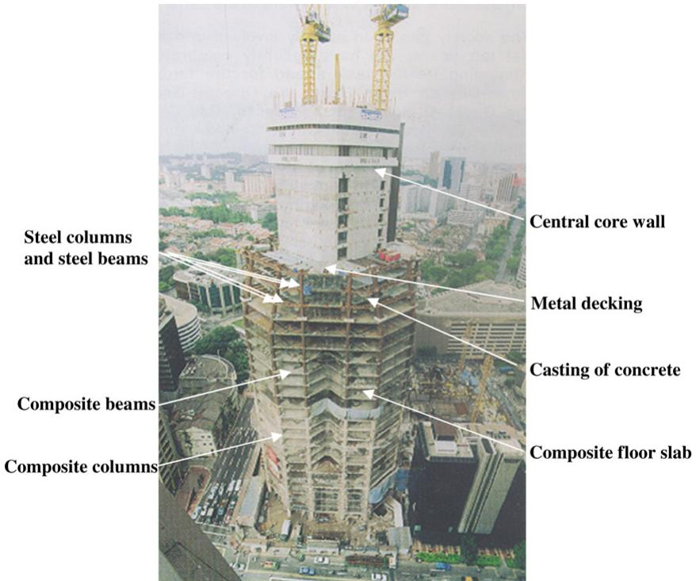  
Fig. 1. Composite construction of a 50-storey building [7].

# 2.2. Comparison with Eurocode 4 approach

According to the simplified method in Eurocode 4 [18], for concrete filled tube of circular cross-section, the plastic resistance of the cross-section to compression is given by

$$
N _ {p l, R d} = A _ {a} \eta_ {a} f _ {y d} + A _ {c} f _ {c d} \left(1 + \eta_ {c} \frac {t}{d} \frac {f _ {y}}{f _ {c k}}\right) + A _ {s} f _ {s d} \tag {7}
$$

and for concrete filled tubes of rectangular cross-section, it is given by

$$
N _ {p l, R d} = A _ {a} f _ {y d} + A _ {c} f _ {c d} + A _ {s} f _ {s d} \tag {8}
$$

where $\eta _ { a }$ and $\eta _ { c }$ are the steel strength reduction factor and concrete strength enhancement factor respectively, Aa, Ac and $A _ { s }$ are crosssectional areas of the steel section, concrete and reinforcement respectively, $f _ { y }$ and $f _ { c k }$ are characteristic strengths of structural steel and concrete respectively, fyd, $f _ { c d }$ and $f _ { s d }$ are design strengths of structural steel, concrete and reinforcement respectively, t is the wall thickness of the steel tube, $d$ is the overall diameter of column. Eq. (8) should only be used if the relative slenderness λ exceeds 0.5.

To account for overall buckling in the columns, the reduction factor $\chi$ is given in terms of the relative slenderness $\lambda$ and the corresponding buckling curve as

$$
\chi = \frac {1}{\varphi + \sqrt {\varphi^ {2} - \lambda^ {2}}}, \quad \text {b u t} \chi \leq 1. 0 \tag {9}
$$

where $\phi = 0 . 5 ( 1 + \alpha ( \lambda - 0 . 2 ) + \lambda ^ { 2 } )$ , and $\lambda$ is

$$
\lambda = \sqrt {\frac {N _ {p l , R k}}{N _ {c r}}}. \tag {10}
$$

$\alpha$ is an imperfection factor corresponding to the appropriate buckling curve. For concrete filled tubes, buckling curve “a” and $\alpha ~ = ~ 0 . 2 1$ are adopted when the reinforcement ratio does not exceed $3 \%$ , and buckling curve “b” and $\alpha \ = \ 0 . 3 4$ are adopted when the reinforcement ratio ranges from $3 \%$ to $6 \%$ . $N _ { p l , R k }$ is the

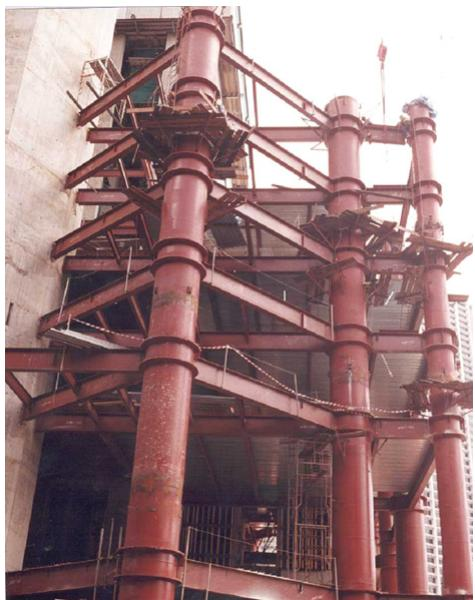  
Fig. 2. Hollow circular steel columns before infilling with concrete [7].

characteristic value of plastic resistance calculated from Eq. (7) or (8) if, instead of the design strengths, the characteristic strengths are used. $\begin{array} { r c l } { N _ { c r } } & { = } & { \pi ^ { 2 } ( E I ) _ { \mathrm { e f f } } / l _ { e } ^ { 2 } } \end{array}$ is the Euler buckling load of the composite column, and $( E I ) _ { \mathrm { e f f } } ~ = ~ E _ { a } I _ { a } + 0 . 6 E _ { c m } I _ { c } + E _ { s } I _ { s }$ is the effective flexural stiffness of the composite cross-section, where $E _ { a }$ and $E _ { s }$ are the modulus of elasticity of the structural steel and the reinforcement, $E _ { c m }$ is the secant modulus of elasticity of concrete, and $I _ { a } , I _ { c }$ and $I _ { s }$ are the second moments of area of the structural steel section, the uncracked concrete section and the reinforcement.

Comparing Eq. (9) with Eq. (5), these equations are identical if

$$
\rho = \alpha (\lambda - 0. 2). \tag {11}
$$

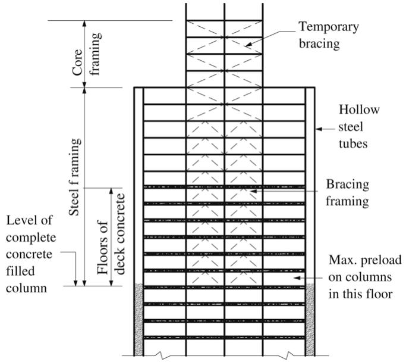  
Fig. 3. Fast-track construction sequence of a typical composite building.

# 2.3. Considering the preload effect

Eq. (11) shows that the column buckling reduction factor proposed by Eq. (5) is consistent with that recommended in Eurocode 4 if a proper value for initial deflection is selected. Herein, the approach to derive Eq. (5) is further modified by considering the axial preload effect. When a preload $N _ { \mathrm { p r e } }$ acts on the steel tube, the maximum deflection $\delta _ { 1 }$ at the mid-height of the column is given by

$$
\delta_ {1} = \frac {\delta_ {0}}{1 - \frac {N _ {\mathrm {p r e}}}{N _ {a , c r}}}. \tag {12}
$$

Eq. (12) gives the initial deflection of a preloaded column before composite action is achieved. After the infilled concrete has gained sufficient strength, $\delta _ { 1 }$ can be treated as the initial out-ofstraightness deflection of the composite column just like $\delta _ { 0 }$ while an equivalent Euler buckling load $\left( N _ { c r } - N _ { \mathrm { p r e } } \right)$ should be used for considering the action of existing preload. When a superimposed load $N _ { \mathrm { a d d } }$ is applied to the composite column with initial deflection $\delta _ { 1 }$ , the maximum total deflection $\delta _ { 2 }$ at the mid-height of the

composite column can be approximated as

$$
\delta_ {2} = \frac {\delta_ {1}}{1 - \frac {N _ {\mathrm {a d d}}}{N _ {c r} - N _ {\mathrm {p r e}}}} = \frac {1 - N _ {\mathrm {p r e}} / N _ {c r}}{1 - N _ {\mathrm {p r e}} / N _ {a , c r}} \frac {\delta_ {0}}{1 - \frac {N _ {\mathrm {p r e}} + N _ {\mathrm {a d d}}}{N _ {c r}}}. \tag {13}
$$

The term $( 1 ~ - ~ N _ { \mathrm { p r e } } / N _ { c r } ) / ( 1 ~ - ~ N _ { \mathrm { p r e } } / N _ { a , c r } )$ in Eq. (13) is the amplification factor representing the preload influence on the initial deflection $\delta _ { o }$ . Since the axial bearing capacity of a practical column is normally smaller than its Euler buckling load, calibration with experiment and numerical results (to be presented in Sections 3 and 4) show that the Euler buckling load in the amplification factor should be replaced by the actual axial buckling load in order to capture the preload influence more accurately:

$$
\xi_ {\mathrm {p r e}} = \frac {1 - N _ {\mathrm {p r e}} / N _ {E k}}{1 - N _ {\mathrm {p r e}} / N _ {a , E k}} \geq 1. 0 \tag {14}
$$

where $\xi _ { \mathrm { p r e } }$ is the preload influence factor, $N _ { E k }$ is the axial buckling resistance of composite column without the preload effect, and $N _ { a , E k }$ is the axial buckling resistance of steel columns.

Following the same procedure to derive Eq. (5), considering the preload effect with amplified initial deflection $\xi _ { \mathrm { p r e } } \delta _ { o }$ , the column buckling strength reduction factor $\chi _ { \mathrm { p r e } }$ is

$$
\chi_ {\mathrm {p r e}} = \frac {N _ {\mathrm {p r e} , E k}}{N _ {p l , R k}} = \frac {1}{\varphi_ {\mathrm {p r e}} + \sqrt {\varphi_ {\mathrm {p r e}} ^ {2} - \lambda^ {2}}} \tag {15}
$$

where

$$
\varphi_ {\text {p r e}} = 0. 5 [ 1 + \alpha (\xi_ {\text {p r e}} \lambda - 0. 2) + \lambda^ {2} ]. \tag {16}
$$

Eq. (15) considers the fact that preload has no significant effect on short columns (i.e. $\xi _ { \mathrm { p r e } } \lambda ~ \leq ~ 0 . 2 )$ . When there is no preload, i.e., $N _ { \mathrm { p r e } } = 0$ and $\xi _ { \mathrm { p r e } } = 1$ , Eqs. (15) and (16) are the same as those formulae recommended in Eurocode 4. However, when $N _ { \mathrm { p r e } } > 0$ and $\xi _ { \mathrm { p r e } } > 1$ , the value predicted from Eq. (15) is smaller than that calculated according to Eurocode 4, which means that compression resistance is reduced by the preload effect.

# 2.4. Parametric studies

Fig. 4 shows an example of a composite column comprising square steel tube $6 0 0 \ : \mathrm { m m } \times 1 4 \ : \mathrm { m m } \left( \boldsymbol { b } \times \boldsymbol { t } \right)$ with a design strength $f _ { y } ~ = ~ 3 5 5$ MPa and infilled concrete with cylinder strength $f _ { c k } =$ 40 MPa. The design buckling curves versus the column nondimensional slenderness for columns various preload ratios are compared with the Euler buckling curve and the design buckling curves “a” and “d” as in Eurocode 4.

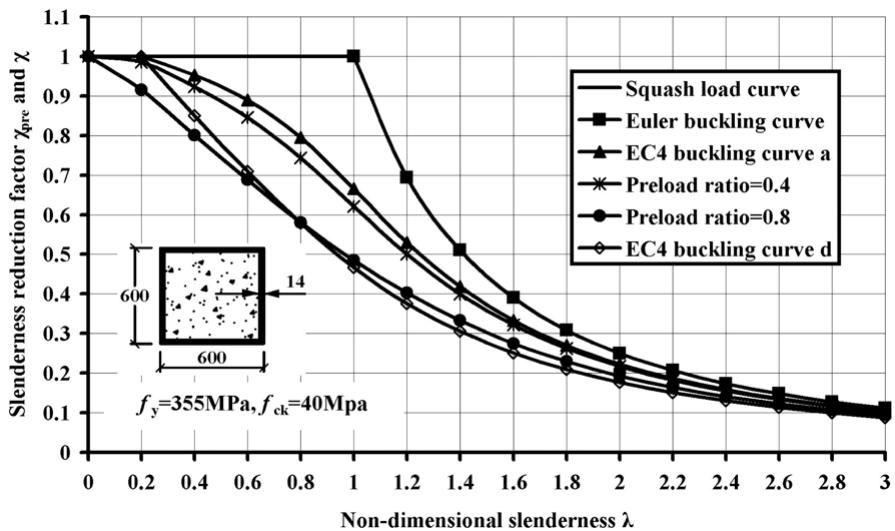  
Fig. 4. Buckling curves of composite columns.

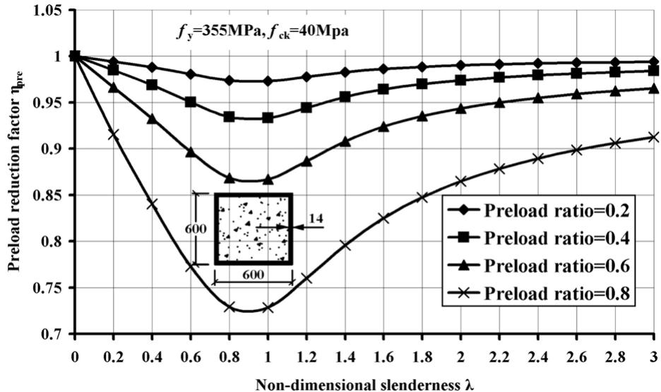  
Fig. 5. Preload reduction factor curves under different preload ratios.

Table 1 Test specimen details   

<table><tr><td rowspan="2">Series</td><td rowspan="2">Specimens</td><td rowspan="2">le(mm)</td><td colspan="2">Steel tube</td><td rowspan="2">fy(MPa)</td><td rowspan="2">fck(MPa)</td><td rowspan="2">Preload ratio βa</td><td rowspan="2">Initial deflection</td></tr><tr><td>D(mm)</td><td>t(mm)</td></tr><tr><td rowspan="3">CS</td><td>CFT-S-40-30P</td><td>708</td><td>219</td><td>6.3</td><td>300</td><td>37</td><td>0.252</td><td>-</td></tr><tr><td>CFT-S-100-0P</td><td>708</td><td>219</td><td>6.3</td><td>300</td><td>108</td><td>0</td><td>-</td></tr><tr><td>CFT-S-100-30P</td><td>708</td><td>219</td><td>6.3</td><td>300</td><td>107</td><td>0.250</td><td>-</td></tr><tr><td rowspan="4">CI</td><td>CFT-I-40-30P</td><td>1728</td><td>219</td><td>6.3</td><td>405</td><td>44</td><td>0.299</td><td>le/1200</td></tr><tr><td>CFT-I-100-0P</td><td>1728</td><td>219</td><td>6.3</td><td>405</td><td>99</td><td>0</td><td>le/3500</td></tr><tr><td>CFT-I-100-30P</td><td>1728</td><td>219</td><td>6.3</td><td>405</td><td>113</td><td>0.305</td><td>le/1570</td></tr><tr><td>CFT-I-130-40P</td><td>1728</td><td>219</td><td>6.3</td><td>405</td><td>139</td><td>0.380</td><td>le/4300</td></tr><tr><td rowspan="4">CL</td><td>CFT-L-40-30P</td><td>3078</td><td>219</td><td>6.3</td><td>393</td><td>49</td><td>0.306</td><td>le/2800</td></tr><tr><td>CFT-L-100-0P</td><td>3078</td><td>219</td><td>6.3</td><td>393</td><td>100</td><td>0</td><td>le/2200</td></tr><tr><td>CFT-L-100-30P</td><td>3078</td><td>219</td><td>6.3</td><td>393</td><td>111</td><td>0.310</td><td>le/2800</td></tr><tr><td>CFT-L-130-40P</td><td>3078</td><td>219</td><td>6.3</td><td>393</td><td>125</td><td>0.399</td><td>le/1700</td></tr></table>

The preload ratio in Fig. 4 is defined as

$$
\beta_ {a} = N _ {\text {p r e}} / N _ {a, E k} <   1. 0. \tag {17}
$$

It can be observed that column buckling resistance reduces when the preload ratio increases. The reduction becomes less significant when the column non-dimensional slenderness increases beyond 2.0. For practical reasons, the preload ratio does not exceed 0.8. All the column strength reduction curves are above the column buckling curve “d” of Eurocode 4. Therefore, it is conservative to adopt buckling curve “d” recommended in Eurocode 4 to design preloaded composite columns with preload ratio up to 0.8.

For preloaded concrete filled steel tubes (CFST), the characteristic axial resistance is

$$
N _ {\text {p r e}, E k} = \chi_ {\text {p r e}} N _ {p l, R k}. \tag {18}
$$

For non-preloaded CFST, the characteristic axial resistance is

$$
N _ {E k} = \chi N _ {p l, R k}. \tag {19}
$$

The preload reduction factor $\eta _ { \mathrm { p r e } }$ is defined as

$$
\eta_ {\text {p r e}} = \frac {N _ {\text {p r e} , E k}}{N _ {E k}} = \frac {\chi_ {\text {p r e}}}{\chi} \leq 1. 0. \tag {20}
$$

Fig. 5 shows the preload reduction factor versus non-dimensional slenderness for the composite column shown in the inserted figure. The preload effect has little influence on short columns (less than $5 \%$ ), and it can be neglected if the relative slenderness is $\xi _ { \mathrm { p r e } } \lambda \le 0 . 2$ or preload ratio $\beta _ { a } \leq 0 . 2$ . However, it has a significant

influence on intermediate and slender columns, and the strength reduction may exceed $1 5 \%$ if the preload ratio is more than 0.6.

The design overall buckling strength $N _ { \mathrm { p r e } , E d }$ which includes preload and design plastic resistance of composite cross-sections to compression $N _ { p l , R d }$ should satisfy

$$
N _ {\text {p r e}, E d} = \chi_ {\text {p r e}} N _ {p l, R d} > \text {d e s i g n v a l u e o f} \left(N _ {\text {p r e}} + N _ {\text {a d d}}\right). \tag {21}
$$

# 3. Experimental verification

The objective of the tests was to apply some preload to the steel columns before infilling with concrete and then conduct the regular axial compression test on the composite columns. The amount of preload that has to be applied was derived from practical considerations. A typical plan of a multistory building was considered and the loads that act on the steel tubes prior to concreting were calculated. The building adopted was a 50- storey commercial building of height $2 0 0 \mathrm { m }$ with features that are common to concrete filled tube construction. A common practice in the industry is to erect the steel skeleton structure around the braced core and concrete fill the tubes after six to eight floors are constructed. In finding a reasonable preload to be applied to the hollow steel tubes, gravity loads due to self-weights of steel and concrete and the construction load were calculated for six to eight storeys. Based on an attributed loading area of 6m by 9m, the column is subject to a preload ratio ranging from 0.20 to 0.30. Hence a preload of $3 0 \%$ of the buckling capacity of the steel column was chosen and applied throughout this experimental program.

Table 2 Concrete mix proportions   

<table><tr><td rowspan="2">Specimen</td><td rowspan="2">W/b</td><td rowspan="2">Cement (kg/m3)</td><td colspan="3">Mineral admixture</td><td rowspan="2">Water (kg/m3)</td><td rowspan="2">Sand (kg/m3)</td><td rowspan="2">Coarse Agg. (kg/m3)</td></tr><tr><td>Type</td><td>Content (kg/m3)</td><td>% volume replacement</td></tr><tr><td>CFT-40-series</td><td>0.44</td><td>400</td><td>SF</td><td>0</td><td>0</td><td>176</td><td>765</td><td>980</td></tr><tr><td>CFT-100-series</td><td>0.26</td><td>450</td><td>SF</td><td>50</td><td>10</td><td>130</td><td>914</td><td>914</td></tr><tr><td>CFT-130-series</td><td>0.20</td><td>550</td><td>SF</td><td>60</td><td>9.84</td><td>122</td><td>641</td><td>1105</td></tr></table>

Notes: $S \mathrm { F = }$ Undensified Silica fume; $W / b =$ Water–binder ratio.

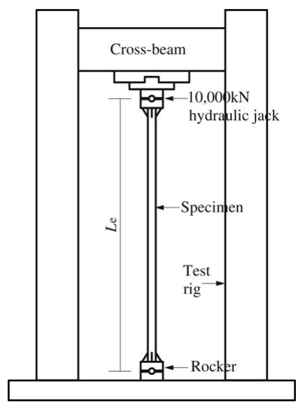  
(a) Compression testing rig.

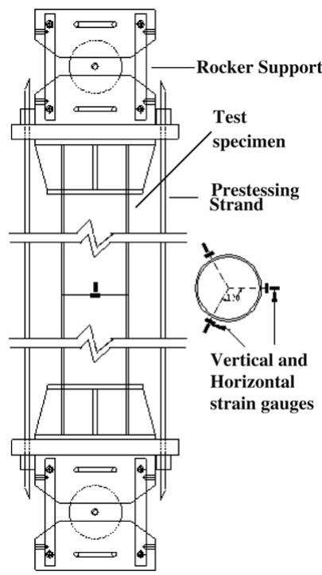  
(b) Setup and instrumentation.   
Fig. 6. Testing rig, setup and instrumentation details for preloaded specimen.

# 3.1. Details of test specimens

Column specimens were fabricated from circular hot-rolled steel tubes of $2 1 9 \mathrm { m m }$ diameter and $6 . 3 ~ \mathrm { m m }$ thick. Details of the specimens tested are summarized in Table 1. In order to ensure that both the steel and concrete are loaded simultaneously, thick steel plates $\mathrm { 5 0 0 \times 5 0 0 \times 5 0 m m }$ were attached to both ends of the columns. The specimens in Table 1 are designated with notations such as CFT-I-100-30P, in which the first field CFT indicates a circular concrete filled tube, the second field indicates the column slenderness range i.e. Stub (S), Intermediate (I) or Long (L), the third field refers to the approximate concrete strength in MPa, and the fourth field indicates the approximate preload ratio. Table 2 shows the mix proportions for the concrete. The strengths of infilling concrete were varied by using different water/binder ratios varying from 0.20 to 0.44. Undensified silica fume was also used as a binder, partially replacing OPC. The maximum aggregate size is $1 0 ~ \mathrm { m m }$ . A superplasticizer was used to obtain a slump of $6 0 \pm 1 0 ~ \mathrm { m m }$ for the mix. From coupon tests, the yield stress and the ultimate tensile stress were found to be 300 MPa and 484 MPa for series CS, 405 MPa and 518 MPa for series CI, and 393 MPa and 506 MPa for series CL. Cross-sections are classified as ‘Compact’ sections for intermediate and slender columns and ‘Plastic’ section for the stub columns.

Pre-stressing strands were used to apply preload to the steel tubes. The 7-wire strand used in this study had a nominal diameter of $1 2 . 5 4 \mathrm { ~ m m }$ and nominal area of $9 8 . 7 1 ~ \mathrm { m m } ^ { 2 }$ . The tensile strength of these strands was 1860 MPa. In the proposed

method, preload effect is incorporated into Eurocode 4 approach through amplification of the imperfection factor. Thus the initial out-of-straightness is an important parameter that has to be ascertained before conducting the experiments. Initial out-ofstraightness measurements were carried only on intermediate and slender columns, since the strength of short columns is not affected by imperfections. The measured initial deflections enabled columns to be instrumented with displacement transducers to capture the subsequence deflections in the direction of maximum initial deflection.

# 3.2. Instrumentation and testing procedure

Steel tubes were preloaded by means of pre-stressing strands anchored between two end plates attached to the specimens. Prestressing strands were stressed to achieve the desired amount of preload. Strain gauges were attached at the mid-length of the strands to monitor the force applied. A total of six strain gauges were also fixed to external surfaces of the steel tubes to monitor strains. They were placed in pairs at angular positions, $1 2 0 ^ { \circ }$ apart, one aligned in the longitudinal direction and the other in the circumferential direction. The concrete was poured from the top through a hole in the end plate. A compression testing rig with a maximum capacity of 10,000 kN was used for testing of the composite columns 24 days after casting the concrete. Both ends of the column were pin-supported. Axial deformation of the composite column was measured by means of vertical transducers

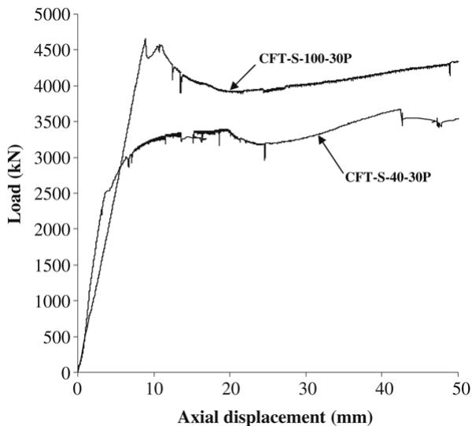  
Fig. 7. Response of CFT-S-40-30P and CFT-S-100-30P under axial loading.

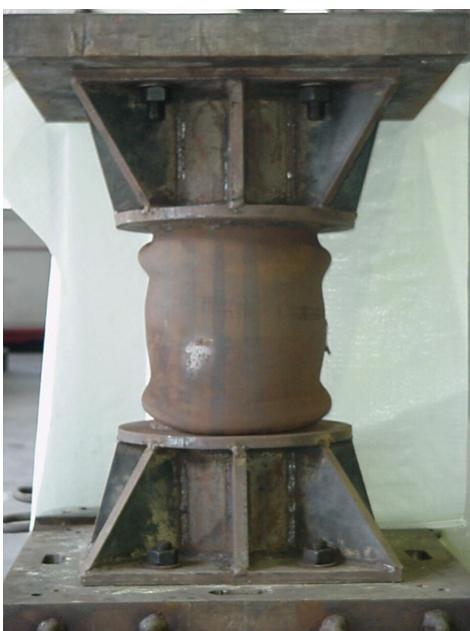  
Fig. 8. Bulging of steel tube in specimen CFT-S-40-30P.

attached to the top end plate. Two transducers were placed at midheight of the column to capture lateral deflection. The compression testing rig, set-up, column effective length and instrumentation details are illustrated in Fig. 6.

# 3.3. Test results and observations

A total of eleven composite columns were tested, of which eight were subjected to preloads (Table 1). The main parameters considered are concrete strength, relative slenderness and preload ratio. The columns in series CS failed due to squashing while the columns in series CI and CL failed mainly due to overall buckling of the member. Local buckling of steel tubes was observed in some column specimens, but it appeared only in the post-ultimate load range.

Series CS specimens comprise of three short columns. Specimen CFT-S-40-30P was infilled with normal concrete $\left( f _ { c k } < 5 0 \mathrm { M P a } \right)$ and CFT-S-100-30P infilled with high strength concrete $( f _ { c k } \ge 9 5 $ MPa), and they were subjected to a preload of about $3 0 \%$ the column capacity. For comparison purposes, specimen CFT-S-100-0P was

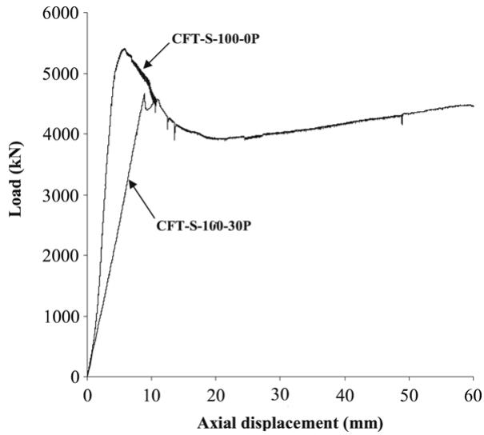  
Fig. 9. Response of CFT-S-100-0P and CFT-S-100-30P under axial loading.

prepared with high strength concrete infill and was not subjected to preload.

Axial load displacement curves for CFT-S-40-30P and CFT-S-100-30P are compared as shown in Fig. 7. CFT-S-40-30P showed lower strength but better ductility because lower strength concrete was used and stronger concrete confinement was provided by steel tube to the concrete core. The failure of CFT-S-40-30P was initiated by yielding of the steel tube, and later the load was resisted by the concrete until it was crushed at the ultimate load. A distinct bulging of the steel casing was observed for CFT-S-30-30P at the post-ultimate load range as shown in Fig. 8. However, no such bulging was observed for CFT-S-100-30P; instead, a loud cracking noise emanating from the specimen was heard just before the ultimate load was achieved, and this was followed by a shape drop in load. This phenomenon was due to a sudden failure of the high strength concrete inside the tube causing a dip in hydraulic pressure supplied to the actuator. After the unloading process was completed, redistribution within the concrete matrix enabled a slight increase in the load applied but this was less than the first peak load observed earlier.

Load displacement curves for CFT-S-100-0P and CFT-S-100-30P are compared as shown in Fig. 9. They failed in a similar mode, but CFT-S-100-0P shown higher strength and stiffness while its displacement at the ultimate load was smaller.

Series CI specimens comprise four columns with intermediate length. CFT-I-40-30P was infilled with normal concrete whereas CFT-I-100-30P and CFT-I-130-40P were infilled with high strength concrete and they were all subjected to preload. CFT-I-100-0P was infilled with high strength concrete and tested without preload.

Load displacement curves for CFT-I-40-30P and CFT-I-100-30P are shown in Fig. 10. CFT-I-40-30P showed lower strength but better ductility. It failed due to overall buckling, and no local buckling was observed (see Fig. 11 for the failure mode). However, local buckling was observed at mid-height and near the bottom end of CFT-I-100-30P after the maximum load was reached (Fig. 12).

Load displacement curves for CFT-I-100-0P and CFT-I-100-30P are shown in Fig. 13. CFT-I-100-0P failed due to over buckling. The load displacement curve for CFT-I-130-40P is shown in Fig. 14. The steel tube was infilled with very high strength concrete $( f _ { c k } =$ 139 MPa). The preload ratio was 0.38. During testing, a loud cracking noise emanating from the concrete infill was heard prior to failure. It failed due to crushing of the concrete but not due to the usual overall buckling. Subsequently, local buckling of the steel casing occurred as shown in Fig. 15.

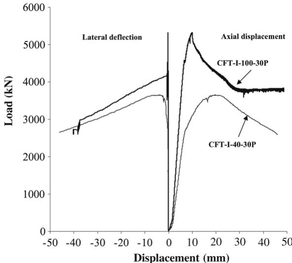  
Fig. 10. Response of CFT-I-40-30P and CFT-I-100-30P under axial loading.

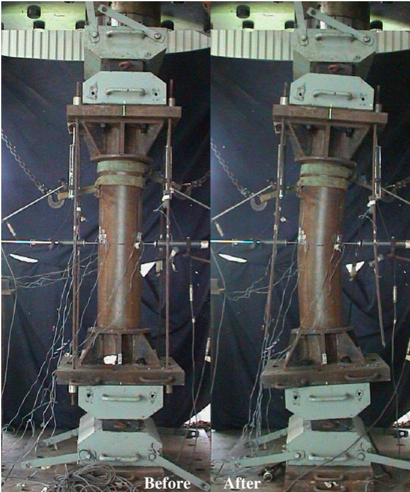  
Fig. 11. Specimen CFT-I-40-30P before and after failure.

Series CL comprises four long column specimens. CFT-L-40- 30P was infilled with normal concrete, whereas CFT-L-100-30P and CFT-L-130-40P were infilled with high strength concrete. CFT-L-100-0P was tested without preload for comparison. Load displacement curves for CFT-L-40-30P and CFT-L-100-30P are shown in Fig. 16. CFT-L-40-30P showed lower strength but better post-peak ductility. Figs. 17 and 18 show the load displacement curves for CFT-L-100-0P, CFT-L-100-30P and CFT-L-130-40P, respectively. These four columns were failed by overall buckling mode and no local buckling was observed (Fig. 19).

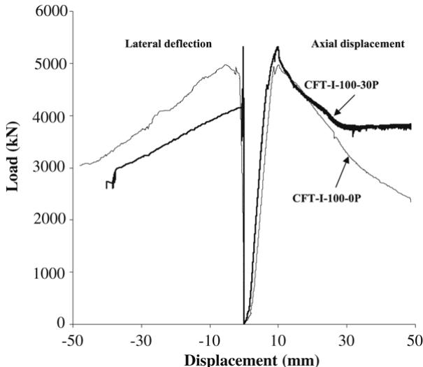  
Fig. 12. Specimen CFT-I-100-30P before and after failure.   
Fig. 13. Response of CFT-I-100-0P and CFT-I-100-30P under axial loading.

# 3.4. Comparison of the proposed design method with test results and FE analyses

Comparison of test results with FE analysis results and predicted values are shown in Table 3 and Fig. 20. $N _ { \mathrm { e x p } }$ , $N _ { \mathrm { c a l } }$ and $N _ { \mathrm { F E } }$ are the test results, predicted values and FE analysis results, respectively. For non-preloaded columns, composite column capacities are calculated from Eurocode 4, and the same results can be obtained from the proposed formula by taking preload influence factor $\xi _ { \mathrm { p r e } } = 1 . 0$ . Compared with test results, predicted values are mostly conservative except for CFT-S-100-30P where the strength is overestimated by $12 \%$ and for CFT-I-30-40P where

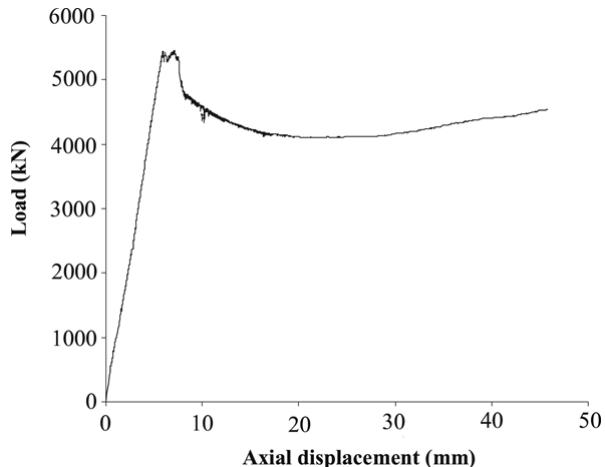  
Fig. 14. Response of CFT-I-130-40P under axial loading.

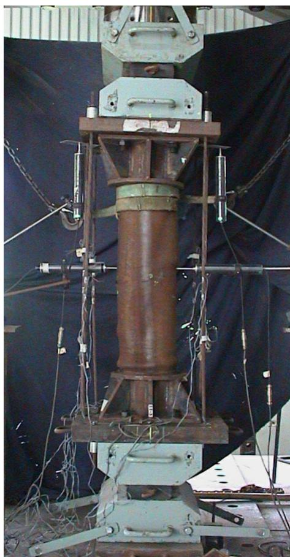  
Fig. 15. Specimen CFT-I-130-40P after failure.

it was overestimated by $3 \%$ . Compared with FE analyses, predicted values are also mostly conservative except in two cases where the strengths are overestimated by $2 \%$ . Mean values of $N _ { \mathrm { c a l } } / N _ { \mathrm { e x p } }$ and $N _ { \mathrm { c a l } } / N _ { \mathrm { F E } }$ are 0.924 and 0.958, and the standard deviations are 0.092 and 0.049.

# 3.5. Verification with other published test results

Predicted results from the proposed equations are compared with the available test results from Zha [15]. Concrete strengths in the tests were reported in cube strengths and hence they are converted to cylinder strength for use in the calculation. Eight composite tubular columns were available, and test results are

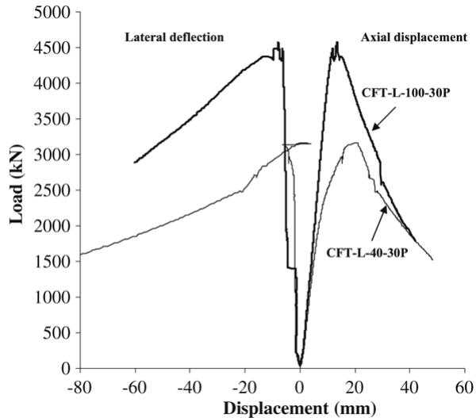  
Fig. 16. Response of CFT-L-40-30P and CFT-L-100-30P under axial loading.

  
Fig. 17. Response of CFT-L-100-0P and CFT-L-100-30P under axial loading.

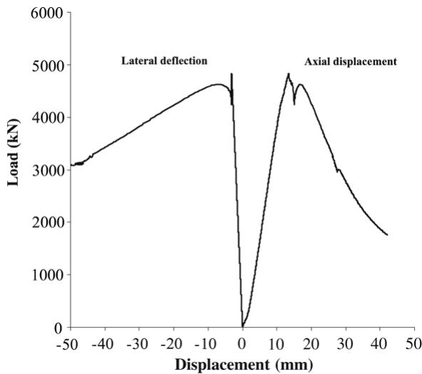  
Fig. 18. Response of CFT-L-130-40P under axial loading.

compared with predicted results as shown in Table 4 and Fig. 21. The mean value of $N _ { \mathrm { c a l } } / N _ { \mathrm { e x p } }$ is 1.014, and the standard deviation is 0.096.

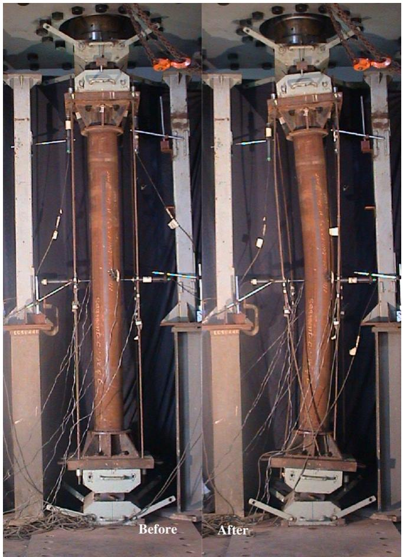  
Fig. 19. Specimen CFT-L-40-30P before and after failure.

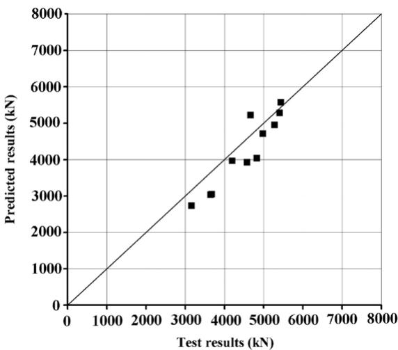  
Fig. 20. Test and predicted results for axially loaded columns.

Predicted results obtained from the proposed method are also compared with other available test results from Han and Yao [12]. Six square composite column specimens were tested and the comparison of results is shown in Table 5 and Fig. 21. Specimens HS1-2 and HS2-2 are short columns $( \lambda \approx 0 . 1 $ , so preload has no influence on their capacities. The predicted results agree well with the experimental results with errors within $5 \%$ . The mean value of $N _ { \mathrm { c a l } } / N _ { \mathrm { e x p } }$ is 0.988, and the standard deviation is 0.017.

In conclusion, the proposed design method predicts conservative and reliable values. Considering all the test results shown in

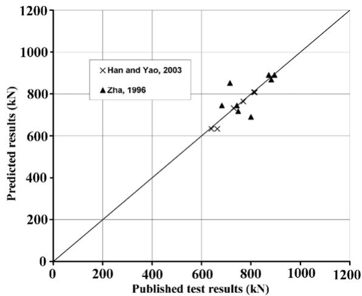  
Fig. 21. Comparison of theoretical prediction with published test results.

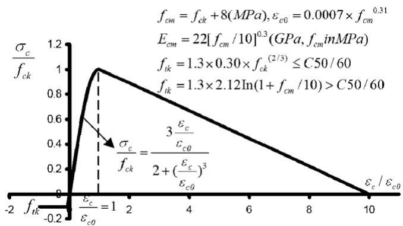  
Fig. 22. Uniaxial stress–strain curve for concrete.

Tables 3–5, the mean value of $N _ { \mathrm { c a l } } / N _ { \mathrm { e x p } }$ is 0.968, and the standard deviation is 0.089.

# 4. Finite element analyses

Finite element analyses have been carried out [14,19] to study the behaviour of concrete-filled composite columns with and without initial preload. Herein the finite element analysis method is briefly described, and the main aim is to provide numerical results for preloaded columns to further verify the proposed design method. A detailed description of the finite element model can be found in [14].

# 4.1. Numerical modelling and calibration

The general purpose finite element package ABAQUS is adopted for numerical simulation. Continuum solid element C3D8R, conventional shell element S4R and continuum shell element SC8R are used to mesh the concrete core, square steel tube and circular steel tube, respectively. The material constitutive model is a conventional elastic-plastic model for the steel tube while a damaged plasticity model is used for concrete. Uniaxial stress–strain relationship curves adopted for concrete and steel are shown in Figs. 22 and 23. Typical FE meshes for the concrete core and steel tube are shown Fig. 24. Only the half length $\left( l _ { e } / 2 \right)$ of the composite column, fixed at the bottom and free at the top, is modeled. Geometrical imperfection in the form of half-sine curve with maximum initial deflection of $\delta _ { 0 } ~ = ~ l _ { e } / 1 0 0 0$ at the tip is considered as shown in Fig. 24.

Table 3 Test results compared with FE analyses and theoretical calculations   

<table><tr><td>Series</td><td>Specimens</td><td>Nexp(kN)</td><td>Ncal(kN)</td><td>NFE(kN)</td><td>Ncal/Nexp</td><td>NFE/Nexp</td><td>Ncal/NFE</td></tr><tr><td rowspan="3">CS</td><td>CFT-S-40-30P</td><td>3677</td><td>3050</td><td>3502</td><td>0.829</td><td>0.952</td><td>0.871</td></tr><tr><td>CFT-S-100-0P</td><td>5410</td><td>5280</td><td>5692</td><td>0.976</td><td>1.052</td><td>0.928</td></tr><tr><td>CFT-S-100-30P</td><td>4667</td><td>5218</td><td>5661</td><td>1.118</td><td>1.213</td><td>0.922</td></tr><tr><td rowspan="4">CI</td><td>CFT-I-40-30P</td><td>3648</td><td>3033</td><td>3378</td><td>0.831</td><td>0.926</td><td>0.898</td></tr><tr><td>CFT-I-100-0P</td><td>4977</td><td>4708</td><td>4853</td><td>0.946</td><td>0.975</td><td>0.970</td></tr><tr><td>CFT-I-100-30P</td><td>5278</td><td>4952</td><td>5078</td><td>0.938</td><td>0.962</td><td>0.975</td></tr><tr><td>CFT-I-130-40P</td><td>5437</td><td>5571</td><td>5700</td><td>1.025</td><td>1.048</td><td>0.977</td></tr><tr><td rowspan="4">CL</td><td>CFT-L-40-30P</td><td>3160</td><td>2731</td><td>2868</td><td>0.864</td><td>0.908</td><td>0.952</td></tr><tr><td>CFT-L-100-0P</td><td>4204</td><td>3964</td><td>3987</td><td>0.943</td><td>0.948</td><td>0.994</td></tr><tr><td>CFT-L-100-30P</td><td>4580</td><td>3924</td><td>3843</td><td>0.857</td><td>0.839</td><td>1.021</td></tr><tr><td>CFT-L-130-40P</td><td>4827</td><td>4032</td><td>3937</td><td>0.835</td><td>0.816</td><td>1.024</td></tr><tr><td>Mean</td><td></td><td></td><td></td><td></td><td>0.924</td><td>0.967</td><td>0.958</td></tr><tr><td>Standard deviation</td><td></td><td></td><td></td><td></td><td>0.092</td><td>0.109</td><td>0.049</td></tr></table>

Table 4 Comparison of predicted results with published test results by Zha [15]   

<table><tr><td>Specimen</td><td>Dimension (d × t × le) (mm)</td><td>Preload ratio βa</td><td>fck,cube (MPa)</td><td>fy (MPa)</td><td>Nexp (kN)</td><td>Ncal (kN)</td><td>Ncal/Nexp</td></tr><tr><td>Z11-1</td><td>133 × 4.5 × 1862</td><td>0</td><td>42.2</td><td>325</td><td>895</td><td>891</td><td>0.995</td></tr><tr><td>Z11-2</td><td>133 × 4.5 × 1862</td><td>0</td><td>42.2</td><td>325</td><td>872</td><td>891</td><td>1.021</td></tr><tr><td>Z12</td><td>133 × 4.5 × 1862</td><td>0.305</td><td>42.2</td><td>325</td><td>882</td><td>868</td><td>0.985</td></tr><tr><td>Z13</td><td>133 × 4.5 × 1862</td><td>0.436</td><td>42.2</td><td>325</td><td>715</td><td>853</td><td>1.192</td></tr><tr><td>ZL1-1</td><td>133 × 4.5 × 2793</td><td>0</td><td>42.2</td><td>325</td><td>743</td><td>745</td><td>1.003</td></tr><tr><td>ZL1-2</td><td>133 × 4.5 × 2793</td><td>0</td><td>42.2</td><td>325</td><td>682</td><td>745</td><td>1.092</td></tr><tr><td>ZL2</td><td>133 × 4.5 × 2793</td><td>0.311</td><td>42.2</td><td>325</td><td>748</td><td>718</td><td>0.960</td></tr><tr><td>ZL3</td><td>133 × 4.5 × 2793</td><td>0.498</td><td>42.2</td><td>325</td><td>800</td><td>690</td><td>0.863</td></tr><tr><td>Mean</td><td></td><td></td><td></td><td></td><td></td><td></td><td>1.014</td></tr><tr><td>Standard deviation</td><td></td><td></td><td></td><td></td><td></td><td></td><td>0.096</td></tr></table>

Table 5 Comparison of predicted results with published test results by Han and Yao [12]   

<table><tr><td>Specimen</td><td>Dimension (b × t × le) (mm)</td><td>Preload ratio βa</td><td>fck,cube (MPa)</td><td>fy (MPa)</td><td>Nexp (kN)</td><td>Ncal (kN)</td><td>Ncal/Nexp</td></tr><tr><td>HS1-1</td><td>120 × 2.65 × 360</td><td>0</td><td>20.1</td><td>340</td><td>640</td><td>633</td><td>0.990</td></tr><tr><td>HS1-2</td><td>120 × 2.65 × 360</td><td>0.499</td><td>20.1</td><td>340</td><td>664</td><td>633</td><td>0.954</td></tr><tr><td>HS2-1</td><td>120 × 2.65 × 360</td><td>0</td><td>36.0</td><td>340</td><td>816</td><td>808</td><td>0.991</td></tr><tr><td>HS2-1</td><td>120 × 2.65 × 360</td><td>0.499</td><td>36.0</td><td>340</td><td>812</td><td>808</td><td>0.996</td></tr><tr><td>HI1-1</td><td>120 × 2.65 × 1400</td><td>0</td><td>36.0</td><td>340</td><td>769</td><td>764</td><td>0.994</td></tr><tr><td>HI1-2</td><td>120 × 2.65 × 1400</td><td>0.478</td><td>36.0</td><td>340</td><td>730</td><td>733</td><td>1.004</td></tr><tr><td>Mean</td><td></td><td></td><td></td><td></td><td></td><td></td><td>0.988</td></tr><tr><td>Standard deviation</td><td></td><td></td><td></td><td></td><td></td><td></td><td>0.017</td></tr></table>

  
Fig. 23. Uniaxial stress–strain curve for steel.

It is recognized that potential slip between the steel and concrete could have some effect on the serviceability response of the columns. The bond/contact between steel and concrete is important in analysing local buckling failure of the steel tube. However, the present investigation focuses only on composite columns with non-slender cross section; hence the assumption of a perfect bond between steel and concrete is adopted. Relative slip

at the interface of steel and concrete is limited by the fact that the column bottom end is restrained from displacement and the steel tube does not buckle locally due to its low d/t ratio. Hence the perfect bond assumption is not expected to have a major influence on the ultimate strength prediction.

The loading process is divided into two steps: (1) preload is firstly applied on top of the steel tube, and (2) the concrete core is added into the model and vertical displacement of the column top is applied and then the vertical reaction at the column bottom reveals the total axial load applied on the column.

To verify the accuracy of the FE model, test specimens shown in Table 1 are analyzed. Numerical results obtained from analyses are compared with test results in Table 3. The mean value of $N _ { \mathrm { F E } } / N _ { \mathrm { e x p } }$ is 0.967, and the standard deviation is 0.109. Compared with test results, numerical analyses provide a conservative and reliable estimate of the ultimate strength of the columns.

# 4.2. Numerical results

Three groups of square cross-sectional specimens with different lengths are analyzed by considering various preload values. The square cross-sectional dimension of steel tube is $6 0 0 \mathrm { m m } \times 1 4 \mathrm { m m }$ $\left( b \times t \right)$ . The concrete strength is $f _ { c k } ~ = ~ 4 0$ MPa, and the steel strength is $f _ { y } ~ = ~ 3 5 5$ MPa. Non-dimensional column slenderness

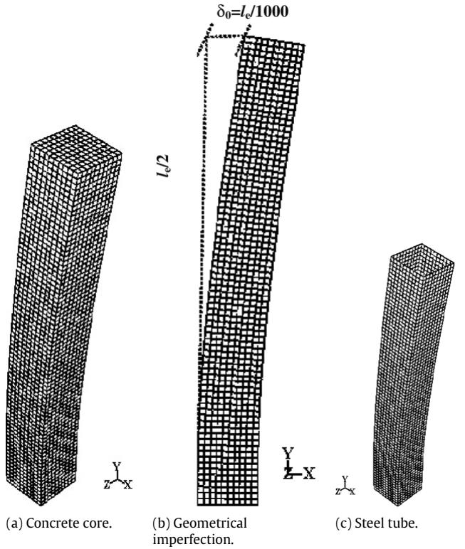  
Fig. 24. Numerical models for tube and concrete with imperfections.

ratios of $\lambda ~ = ~ 0 . 2 4 , 0 . 5 9$ and 1.20 were chosen to represent a typical short, intermediate and long column. Curves showing the applied axial load versus vertical displacement at the column tops are shown in Fig. 25 for composite columns with different preload ratios. The initial axial stiffness of the load displacement curve is contributed by the steel tube alone and composite action comes in after the load is applied to the concrete. Parametric analyses show that the preload effect has little influence on short columns. However, preload seems to have a more pronounced effect on the axial capacity of intermediate and slender columns. A reduction of axial capacity more than $2 0 \%$ is expected if the preload is high $\left. \beta _ { a } > 0 . 6 \right)$ as shown in Fig. 25.

Ultimate loads from numerical simulation are compared with those obtained from the proposed design method as shown in

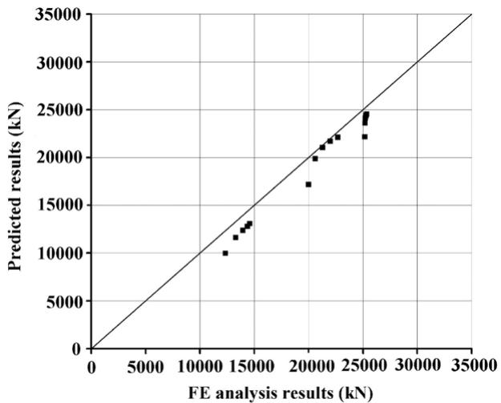  
Fig. 26. FE analysis and corresponding predicted results.

Table 6 and Fig. 26. According to Eurocode 4, the predicted axial capacity of non-preloaded columns are 24 541 kN, 22 108 kN and 13 063 kN for the specimens in group FS, FI and FL respectively, the same as that calculated from the proposed formulae by assuming preload ratio $\beta _ { a } = 0$ .

It can be seen from Table 6 and Fig. 26 that results predicted by the proposed method are conservative in comparison with FEM results with an error less than $2 0 \%$ . The mean value of $N _ { \mathrm { c a l } } / N _ { \mathrm { F E } }$ is 0.921, and the standard deviation is 0.055. Therefore, the proposed method can be used for the design of preloaded concrete-filled composite columns in lieu of the direct analysis method.

# 5. A step-by-step design procedure

In summary the proposed changes to EC4 equations for incorporating the preload effect is shown in Table 7.

The following is a step-by-step procedure of a design of axially loaded composite columns with a preload effect:

(1) Determine the preload $N _ { \mathrm { p r e } }$ according to the practical construction sequence and referring to relative codes for actions (Eurocode 1, for example);   
(2) Determine $\chi _ { a }$ and check the resistance of the steel tube subjected to the preload by $N _ { \mathrm { p r e } } \leq \chi _ { a } N _ { a , p l , R k }$ ;

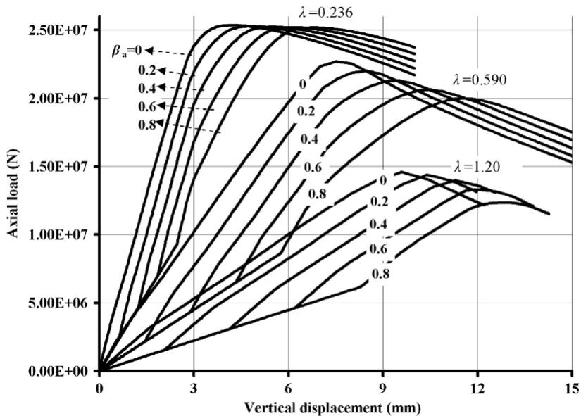  
Fig. 25. Axial load-vertical displacement curves.

Table 6 Comparison of FE analysis results with the predicted results   

<table><tr><td>Specimen</td><td>Dimension (b × t × le) (mm)</td><td>Preload ratio βa</td><td>fck(MPa)</td><td>fy(MPa)</td><td>NFE(kN)</td><td>Ncal(kN)</td><td>Ncal/NFE</td></tr><tr><td>FS-0</td><td>600 × 14 × 3600</td><td>0</td><td>40</td><td>355</td><td>25355</td><td>24541</td><td>0.968</td></tr><tr><td>FS-2</td><td>600 × 14 × 3600</td><td>0.2</td><td>40</td><td>355</td><td>25277</td><td>24374</td><td>0.964</td></tr><tr><td>FS-4</td><td>600 × 14 × 3600</td><td>0.4</td><td>40</td><td>355</td><td>25225</td><td>24102</td><td>0.955</td></tr><tr><td>FS-6</td><td>600 × 14 × 3600</td><td>0.6</td><td>40</td><td>355</td><td>25191</td><td>23576</td><td>0.936</td></tr><tr><td>FS-8</td><td>600 × 14 × 3600</td><td>0.8</td><td>40</td><td>355</td><td>25174</td><td>22135</td><td>0.879</td></tr><tr><td>FI-0</td><td>600 × 14 × 9000</td><td>0</td><td>40</td><td>355</td><td>22705</td><td>22108</td><td>0.974</td></tr><tr><td>FI-2</td><td>600 × 14 × 9000</td><td>0.2</td><td>40</td><td>355</td><td>22007</td><td>21686</td><td>0.985</td></tr><tr><td>FI-4</td><td>600 × 14 × 9000</td><td>0.4</td><td>40</td><td>355</td><td>21295</td><td>21028</td><td>0.987</td></tr><tr><td>FI-6</td><td>600 × 14 × 9000</td><td>0.6</td><td>40</td><td>355</td><td>20627</td><td>19858</td><td>0.963</td></tr><tr><td>FI-8</td><td>600 × 14 × 9000</td><td>0.8</td><td>40</td><td>355</td><td>19994</td><td>17151</td><td>0.858</td></tr><tr><td>FL-0</td><td>600 × 14 × 18000</td><td>0</td><td>40</td><td>355</td><td>14589</td><td>13063</td><td>0.895</td></tr><tr><td>FL-2</td><td>600 × 14 × 18000</td><td>0.2</td><td>40</td><td>355</td><td>14383</td><td>12779</td><td>0.888</td></tr><tr><td>FL-4</td><td>600 × 14 × 18000</td><td>0.4</td><td>40</td><td>355</td><td>13958</td><td>12348</td><td>0.885</td></tr><tr><td>FL-6</td><td>600 × 14 × 18000</td><td>0.6</td><td>40</td><td>355</td><td>13296</td><td>11605</td><td>0.873</td></tr><tr><td>FL-8</td><td>600 × 14 × 18000</td><td>0.8</td><td>40</td><td>355</td><td>12348</td><td>9968</td><td>0.807</td></tr><tr><td>Mean</td><td></td><td></td><td></td><td></td><td></td><td></td><td>0.921</td></tr><tr><td>Standard Deviation</td><td></td><td></td><td></td><td></td><td></td><td></td><td>0.055</td></tr></table>

Table 7 Summary of the proposed changes to EC4 equations for incorporating the preload   

<table><tr><td>Strength</td><td>EC4 approach</td><td>Proposed method with preload Npre</td></tr><tr><td>Characteristic plastic cross-sectional strength</td><td colspan="2">1. For concrete filled circular tubes with λ ≤ 0.5: 
Npl,Rk = Aaηafy + Acfck(1 + nc t fky/d fck) + Asfsy 
2. For concrete filled circular tubes with λ &gt; 0.5 and filled rectangular tubes: 
Npl,Rk = Aafy + Acfck + Asfsy</td></tr><tr><td>Design plastic cross-sectional strength</td><td colspan="2">1. For concrete filled circular tubes with λ ≤ 0.5: 
Npl,Rd = Aaηafyd + Acfcd(1 + nc t fky/d fck) + Asfsd 
2. For concrete filled circular tubes with λ &gt; 0.5 and filled rectangular tubes: 
Npl,Rd = Aafyd + Acfcd + Asfsd</td></tr><tr><td>Characteristic overall buckling strength</td><td>NEk = xNpl,Rk where χ = 1/φ+√φ2-λ2 ≤ 1.0 
φ = 0.5 [1 + α(λ - 0.2) + λ2] 
λ = √Npl,Rk/Ncr 
Ncr = π2(EI)eff /le2 = π2(EaIa + 0.6EcmIc + EsIa) /le2</td><td>Npre,Ek = xpreNpl,Rk where xpre = 1/φpre+√φ2pre-λ2 ≤ 1.0 
φpre = 0.5 [1 + α(ξpreλ - 0.2) + λ2] 
ξpre = 1-Npre/NEk/1-Npre/Na,Ek ≥ 1.0 
Na,Ek is the characteristic overall buckling strength of steel tube.</td></tr><tr><td>Design overall buckling strength</td><td>NEd = xNpl,Rd</td><td>Npre,Ed = xpreNpl,Rd</td></tr></table>

(3) Determine χ by the formulae recommended in Eurocode 4;   
(4) Calculate the preload effect factor $\xi _ { \mathrm { { p r e } } }$ by Eq. (14);   
(5) Calculate the slenderness reduction factor $\chi _ { \mathrm { p r e } }$ by Eq. (15);   
(6) Determine the total design load acting on the composite column $( N _ { \mathrm { p r e } } \mathrm { ~ + ~ } N _ { \mathrm { a d d } } )$ , calculate the design overall buckling resistance $N _ { \mathrm { p r e } , E d }$ by Eq. (21), and then check whether $N _ { \mathrm { p r e } , E d } >$ $( N _ { \mathrm { p r e } } + N _ { \mathrm { a d d } } )$ .

# 6. Conclusions

A design method based on a modified Eurocode’s approach has been developed to evaluate the axial capacity of concrete-filled composite columns considering the preload effect. The accuracy of the proposed method is verified by comparing with test results of 25 column specimens and those obtained from finite element analyses.

The preload effect can be quantified by a non-dimensional preload effect factor $\xi _ { \mathrm { { p r e } } }$ which is related to preload ratios $\beta _ { a }$ , non-dimensional column slenderness ratios λ, material strengths and steel contribution ratios. Parametric analyses show that the preload effect has little influence on short columns, and the effect can be neglected if the amplified relative column slenderness $( \xi _ { \mathrm { p r e } } \lambda )$ is less than 0.2 or the preload ratio $\beta _ { a }$ is less than 0.2. However, preload is expected to have some influence on the axial

capacity of intermediate and slender columns. A reduction of axial capacity of more than $2 0 \%$ is expected if the preload is high $( \beta _ { a } ~ > ~ 0 . 6 )$ . A modified Eurocode 4 method and a step-by-step design procedure are recommended for the design of preloaded composite columns provided that the preload ratio is not greater than 0.8.

For concrete filled columns with a slender cross-section, the preload effect may have a more pronounced effect on its compression resistance because local buckling of the steel tube may occur during preload. For this case, further investigation should be done.

# References

[1] Liang QQ, Uy B, Liew JYR. Nonlinear analysis of concrete-filled thin-walled steel box columns with local buckling effects. Journal of Constructional Steel Research 2006;62(6):581–91.   
[2] Shanmugam NE, Lakshmi B, Uy B. An analytical model for thin-walled steel box columns with concrete in-fill. Engineering Structures 2002;24(6):825–38.   
[3] Bradford MA, Loh HY, Uy B. Slenderness limits for filled circular steel tubes. Journal of Constructional Steel Research 2002;58(2):243–52.   
[4] Han LH. Tests on stub columns of concrete-filled RHS sections. Journal of Constructional Steel Research 2002;58(3):353–72.   
[5] Han LH, Yang YF, Tao Z. Concrete-filled thin-walled steel SHS and RHS beamcolumns subjected to cyclic loading. Thin-Walled Structures 2003;41(9): 801–33.

[6] Han LH, Yang YF. Analysis of thin-walled steel RHS columns filled with concrete under long-term sustained. Thin-Walled Structures 2003;41(9): 849–70.   
[7] Liew JYR. Buildable design of multi-storey and large span steel structures. Journal of Steel Structures, Korean Society of Steel Structures 2004;4(2): 53–70.   
[8] Uy B. Strength of short concrete filled high strength steel box columns. Journal of Constructional Steel Research 2001;57(2):113–34.   
[9] Vrcelj Z, Uy B. Strength of slender concrete-filled steel box columns incorporating local buckling. Journal of Constructional Steel Research 2002; 58(2):275–300.   
[10] Saw HS, Liew JYR. Assessment of current methods for the design of composite columns in buildings. Journal of Constructional Steel Research 2000;53(2): 121–47.   
[11] Huang SJ, Zhong ST, Yan SZ, Cao HL. Experimental research of pre-stress effect on bearing capacity of concrete filled steel tubular axial compressive members. Journal of Harbin University of Architecture and Engineering 1996; 29(6):44–50.   
[12] Han LH, Yao GH. Behaviour of concrete-filled hollow structural steel (HSS) columns with pre-load on the steel tubes. Journal of Constructional Steel Research 2003;59(11):1455–75.

[13] Uy B, Das S. Wet concrete loading of thin-walled steel box columns during the construction of a tall building. Journal of Constructional Steel Research 1997; 42(2):95–119.   
[14] Xiong DX, Zha XX. A numerical investigation on the behavior of concrete-filled steel tubular columns under initial stresses. Journal of Constructional Steel Research 2007;63(5):599–611.   
[15] Zha XX. Investigation on the behavior of concrete filled steel tubular compression-bending-torsion members under the initial stress. Harbin University of C.E. Architecture. 1996.   
[16] Zhang XQ, Zhong ST, Yan SZ, Lin W, Cao HL. Experimental study about the effect of initial stress on bearing capacity of concrete filled steel tubular members under eccentric compression. Journal of Harbin University of C.E. Architecture 1997;30(1):50–6.   
[17] Chen WF, Atsuta T. Theory of Beam-Columns, vol. I: In-Plane Behavior and Design. USA: McGraw-Hill, Inc; 1976.   
[18] Eurocode 4. Design of composite steel and concrete structures, Part 1.1: General rules and rules for buildings. Brussels: Commission of European Communities; 2004.   
[19] Ellobody E, Young B, Lam D. Behaviour of normal and high strength concretefilled compact steel tube circular stub columns. Journal of Constructional Steel Research 2006;62:706–15.