# Experimental behavior of circular concrete-filled steel tube stub columns

Zhi-wu Yua, Fa-xing Dinga, C.S. Caib,∗

a College of Civil Architectural Engineering, Central South University, Changsha, Hunan Province 410075, PR China

b Department of Civil and Environmental Engineering, Louisiana State University, Baton Rouge, LA 70803, USA

Received 28 November 2005; accepted 17 March 2006

# Abstract

This paper presented an experimental study on the behavior of circular, concrete-filled, steel tube (CFT) stub columns with self-compacting concrete (SCC) and normal concrete (NC) concentrically loaded in compression to failure. Four measurement methods on the axial deformation of specimens were compared. Seventeen specimens were tested to investigate the effects of concrete strength, notched holes or slots, and different loading conditions on the ultimate capacity and the load–deformation behavior of the columns. The behavior of these stub columns in confinement was discussed.

It is concluded that for the specimens with the entire section loaded, strain gauges with different dimensions could record the strains of the steel tubes, and electronic displacement transducers with certain gauge lengths could record the axial displacement. By using higher strength concrete, the specimens with the entire section loaded experienced a significant increase in the ultimate capacity, but their residual capacity after failure is almost constant. However, once the steel tube was notched, the axial compressive stiffness of specimens was reduced; in some cases the ultimate capacity was also reduced, and the steel tube acted more as a transverse confinement than an axial compression component. Eurocode 4 predicted a reasonable capacity for the unnotched CFT stub columns with both SCC and NC if the entire section of the specimen is loaded.

$\circledcirc$ 2006 Elsevier Ltd. All rights reserved.

Keywords: Self-compacting concrete; Concrete-filled steel tube; Axial load behavior; Ultimate capacity; Confinement effect

# 1. Introduction

Concrete-filled steel tube (CFT) columns can provide excellent structural properties for seismic resistance, such as high ductility and large energy absorption capacity. In addition to the enhancement in structural properties, a considerable amount of construction time can be reduced due to the elimination of permanent formwork. As a result, various studies on CFT columns with normal and high-strength concrete have been conducted in recent years [1–8].

The enhancement of CFT columns in structural properties is due to the composite action between the constituent elements. The steel tube acts as both longitudinal and transverse reinforcement and also provides a confining pressure to the concrete, which puts the concrete under a triaxial state of stress. On the other hand, the steel tube is stiffened by the concrete core. It is well-known that the ultimate strength of CFT columns is influenced by their constituent material properties, such as the

compressive strength of concrete, the yield strength of steel, and the steel ratio.

Although there have been a large number of studies on CFT columns with normal and high-strength concrete, there has been relatively little research on CFT columns with self-compacting concrete (SCC) [5,6]. SCC possesses high workability, whereby the concrete can flow under its own weight and fill the formwork completely. Due to the rheological properties of SCC, the expense of vibration is eliminated whilst still obtaining a good compaction. Furthermore, advantages of SCC include a reduction of noise level in manufacturing plants and a reduction in construction time and labor costs. Therefore, there is a good potential for using CFT columns with SCC in structures. Previous research [5] indicated that the load carrying capacity and failure modes of CFT columns filled with SCC and with NC were very similar if the concrete strength is close.

The axial compressive stiffness and ultimate capacity are the basic properties of CFT stub columns. In the literature there are different opinions and conclusions about the axial compressive stiffness of the stub columns, and one of the main reasons may be that researchers used different deformation measurement

<table><tr><td colspan="2">Nomenclature</td></tr><tr><td>D</td><td>Diameter of circular steel tube</td></tr><tr><td>Es</td><td>Steel modulus of elasticity</td></tr><tr><td>Esc</td><td>Composite modulus of elasticity</td></tr><tr><td>fs</td><td>Yield strength of steel</td></tr><tr><td>fcu</td><td>Cubic compressive strength of concrete</td></tr><tr><td>fcyl</td><td>Compressive cylinder strength of concrete</td></tr><tr><td>h</td><td>Vertical dimension of full slot</td></tr><tr><td>L</td><td>Length of the stub column</td></tr><tr><td>N</td><td>Axial load</td></tr><tr><td>Nu</td><td>Axial compressive capacity</td></tr><tr><td>Nuc</td><td>Predicted ultimate capacity</td></tr><tr><td>Nue</td><td>Experimental ultimate capacity</td></tr><tr><td>NC</td><td>Normal concrete</td></tr><tr><td>SCC</td><td>Self-compacting concrete</td></tr><tr><td>uL</td><td>Axial compressive deformation</td></tr><tr><td>t</td><td>Wall thickness of steel tube</td></tr><tr><td>εθ,s</td><td>Perimeter expansion stain</td></tr><tr><td>εL</td><td>Axial compressive strain</td></tr><tr><td>vsc</td><td>Strain ratio of steel</td></tr></table>

methods for the stub columns under axial compressive loading. However, there have been very few reports that compare these measurement methods for CFT stub columns. For example, the following three measurement methods were adopted to represent the deformation behavior of the stub columns in the literature: (1) the overall axial deformation of the CFT stub columns was measured with electronic displacement transducers [2–4,7], (2) the axial strain of steel tubes was measured with strain gauges in the mid-height region of the stub columns [5,6], and (3) the axial deformation of steel tubes was measured with electronic displacement transducers with a certain gauge length near the mid-height region of the stub columns [9].

To examine different mechanical behaviors of the stub columns, various loading conditions were studied, namely, the load is applied to (a) the entire section, (b) the concrete section initially, but to the entire section after the concrete was compressed, (c) the steel section initially, but to the entire section after the steel tube was compressed, and (d) the concrete section only. These tests [4,8] were carried out, emphasizing more on the ultimate capacity and less on the axial stiffness of the stub columns. There were only a few discussions on the influence of axial to perimeter strain ratio in the steel tube behavior when loaded to failure. Frame structures which consist of CFT columns and reinforced concrete (RC) beams are used extensively in the construction of medium- to high-rise buildings in China. In these cases steel rebars in RC beams need to pass through the steel tubes at frame joints, which could be simulated by a loading condition (e), namely, the load is applied to the entire section, but the mid-height region of the steel tube was notched with holes or slot in different manners.

The aim of this investigation was thus fivefold: first, to discuss the influence of four measurement methods in the axial deformation of stub column specimens; second, to investigate

the effect of concrete core strength on the load capacity of the stub columns; third, to study the effect of small notched holes and full perimeter notched slots (with different vertical dimensions) of the steel tube on the ultimate capacity, the load–deformation behavior, and the failure mode of the stub columns; fourth, to probe into the behavior of these stub columns in confinement; and fifth, to compare the experimental results of the unnotched specimens with the predicted ultimate capacities using Eurocode 4.

# 2. Experimental study

# 2.1. Specimens

A total of 17 test specimens were constructed and tested under concentric axial compression loads. All specimens were three times the diameter in length to reduce the end effects and to ensure that the specimens would be stub columns with minimum effect from slenderness. Each tube was welded to a square, steel base plate of $5 \mathrm { m m }$ thick at the bottom. The SCC and NC for filling in the steel tube stub columns were mixed first, and then the CFT stub columns were cast. Meanwhile, the corresponding SCC and NC specimens of nine $1 5 0 ~ \mathrm { m m }$ cubes were cast for concrete strength tests. For the NC the specimens were compacted with vibration but without vibration for SCC specimens. A summary of the specimen information is given in Table 1, and the mix designs of SCC and NC are given in Table 2. In Table 1, the specimens labeled as SZ are for stub columns; the third letter labeled as 5 or 3 is for the nominal wall thickness (mm) of the steel tubes; the fourth letter labeled as S is for SCC and C for NC; the fifth letter labeled as 3, 4, or 6 is for concrete strength of 30, 40, or $6 0 \mathrm { M P a }$ ; the sixth letter labeled as A, B, C, D or E is for different loading conditions; the seventh letter labeled as 1 or 2 after A is for the specimen unnotched or notched with small holes, and the eighth letter labeled as a or b is the serial number. However, 1, 2, 3, or 4 after E is the serial number of the specimens notched with slots. There are sixteen CFT stub columns with SCC; among them 3 specimens were notched with small holes and 4 specimens notched with slots, and one CFT stub column with NC in this test.

All the specimens were cured for 30 days using water spaying, and then the top surface was leveled with cement. After about 90 days, the top surfaces of CFT stub columns are ready for testing. For the specimens where the load is applied to the entire section, another square steel cover plate of $5 \mathrm { m m }$ in thickness was welded to the top surface of the steel tube (see Fig. 1(a)–(c)). This was done to ensure that the load was applied evenly across the cross-section and simultaneously to the steel and concrete core. But for the specimens where the load is first applied to the steel or concrete section, the $5 \ \mathrm { m m }$ base plate at the bottom of the steel tube was cut off, and corresponding circular steel plates of $1 . 5 ~ \mathrm { m m }$ (Fig. 1(d) and (e)) and $2 0 ~ \mathrm { m m }$ (Fig. 1(f)) thick were prepared for loading. For the specimens with small holes or full notched slots with different vertical dimensions in the mid-height region of the steel tubes, the holes or slots were notched using a grinding wheel with diamond cutters.

Table 1 Test program and results for CFT stub columns   

<table><tr><td>No.</td><td>Specimens</td><td>Test layout</td><td>D × t × L (mm)</td><td>fs(MPa)</td><td>fcu(MPa)</td><td>Nue(kN)</td><td>Note</td></tr><tr><td>1</td><td>SZ5S4A1a</td><td>Fig. 1(a)</td><td>219 × 4.78 × 650</td><td></td><td rowspan="2">50.5</td><td>3400</td><td></td></tr><tr><td>2</td><td>SZ5S4A1b</td><td>Fig. 1(a)</td><td>219 × 4.72 × 650</td><td></td><td>3350</td><td></td></tr><tr><td>3</td><td>SZ5S3A1</td><td>Fig. 1(a)</td><td>219 × 4.75 × 650</td><td></td><td>42.6</td><td>3150</td><td></td></tr><tr><td>4</td><td>SZ5S4A2</td><td>Fig. 1(b)</td><td>219 × 4.74 × 650</td><td></td><td>50.5</td><td>3160</td><td>Small holes notched at steel tube with 20 × 10 mm</td></tr><tr><td>5</td><td>SZ5S3A2</td><td>Fig. 1(b)</td><td>219 × 4.73 × 650</td><td></td><td>42.6</td><td>3150</td><td></td></tr><tr><td>6</td><td>SZ5S4E1</td><td>Fig. 1(c)</td><td>219 × 4.72 × 650</td><td></td><td></td><td>3380</td><td>Full slot notched at steel tube with vertical dimension h = 10 mm</td></tr><tr><td>7</td><td>SZ5S4E2</td><td>Fig. 1(c)</td><td>219 × 4.73 × 650</td><td></td><td rowspan="2">50.5</td><td>3600</td><td>Full slot notched at steel tube with vertical dimension h = 50 mm</td></tr><tr><td>8</td><td>SZ5S4E3</td><td>Fig. 1(c)</td><td>219 × 4.73 × 650</td><td></td><td>2900</td><td>Full slot notched at steel tube with vertical dimension h = 100 mm</td></tr><tr><td>9</td><td>SZ5S4E4</td><td>Fig. 1(c)</td><td>219 × 4.74 × 650</td><td>350</td><td></td><td>1680</td><td>Full slot notched at steel tube with vertical dimension h = 200 mm</td></tr><tr><td>10</td><td>SZ3S6A1</td><td>Fig. 1(a)</td><td>165 × 2.73 × 510</td><td></td><td></td><td>2080</td><td></td></tr><tr><td>11</td><td>SZ3S6A2</td><td>Fig. 1(b)</td><td>165 × 2.76 × 510</td><td></td><td></td><td>2060</td><td>Small holes notched at steel tube with 20 × 10 mm</td></tr><tr><td>12</td><td>SZ3S6B</td><td>Fig. 1(d)</td><td>165 × 2.81 × 500</td><td></td><td>77.2</td><td>2160</td><td></td></tr><tr><td>13</td><td>SZ3S6C</td><td>Fig. 1(e)</td><td>165 × 2.81 × 500</td><td></td><td></td><td>2095</td><td></td></tr><tr><td>14</td><td>SZ3S6D</td><td>Fig. 1(f)</td><td>165 × 2.76 × 500</td><td></td><td></td><td>2250</td><td></td></tr><tr><td>15</td><td>SZ3S4A1</td><td>Fig. 1(a)</td><td>165 × 2.72 × 510</td><td></td><td rowspan="2">57.0</td><td>1750</td><td></td></tr><tr><td>16</td><td>SZ3S4A2</td><td>Fig. 1(b)</td><td>165 × 2.74 × 510</td><td></td><td>1785</td><td>Small holes notched at steel tube with 20 × 10 mm</td></tr><tr><td>17</td><td>SZ3C4A1</td><td>Fig. 1(a)</td><td>165 × 2.75 × 510</td><td></td><td>46.3</td><td>1560</td><td>Normal concrete</td></tr></table>

Table 2 Mix design of concrete   

<table><tr><td>Concrete strength (MPa)</td><td>Cement (kg/m3)</td><td>UPFA (kg/m3)</td><td>Sand (kg/m3)</td><td>Aggregate (kg/m3)</td><td>Water (kg/m3)</td><td>Super-plasticizer (kg/m3)</td></tr><tr><td>SCC-60</td><td>396.4</td><td>201.4</td><td>867</td><td>858</td><td>165</td><td>3.88</td></tr><tr><td>SCC-40</td><td>360.8</td><td>199.3</td><td>852</td><td>805.6</td><td>201.6</td><td>3.64</td></tr><tr><td>SCC-30</td><td>300.0</td><td>208.5</td><td>814.6</td><td>882.5</td><td>203.4</td><td>3.30</td></tr><tr><td>NC-40</td><td>430</td><td>-</td><td>510</td><td>1300</td><td>170</td><td>-</td></tr></table>

To determine the steel material properties, three tension coupons were cut from randomly-selected steel tubes of each type, with dimensions in accordance with the Chinese standard GB/T228-2002. From these tests, the average yield strength $( f _ { s } )$ of all types of steel tubes is $3 5 0 \ \mathrm { M P a }$ , and the modulus of elasticity $( E _ { s } )$ is $2 . 1 3 \times 1 0 ^ { 5 } \mathrm { M P a }$ .

# 2.2. Test arrangements and measurements

Before the column specimens were tested, the $1 5 0 \mathrm { m m }$ cubes were crushed, and the cubic compressive strength $( f _ { c u } )$ of SCC and NC was recorded. Then the column specimens were placed directly into the testing machine for compression tests. A typical column test layout and instrumentation location is shown in Fig. 1.

Electronic displacement transducers were placed to monitor the axial deformation at symmetric locations. Strain gauges were placed on the exterior surfaces of the stub columns to measure the vertical deformations and the perimeter expansion of the steel tubes in the mid-height region at symmetric locations. These transducers and strain gauges were also monitored in the early stage of loading to ensure that a uniform compression was imposed on the compression specimens. Four measurement methods of displacement or strain were applied in this test, as can be seen in Fig. 1. For convenience, “method 1”, “method $2 ^ { \circ }$ , “method $3 ^ { \circ }$ , and “method $4 ^ { \circ }$ represent strain rosettes with dimensions of $3 \times 2 ~ \mathrm { m m }$ , strain gauges with

dimensions of $1 0 0 \times 3 ~ \mathrm { m m }$ recording the axial shortening and perimeter expansion of specimens in the mid-height region, electronic displacement transducers recording the axial shortening of specimens in the mid-height region with a certain gauge length, and electronic displacement transducers recording the full length axial shortening of specimens, respectively.

All of the columns were tested with a universal testing machine with a $5 0 0 0 ~ \mathrm { k N }$ capacity. The load, as measured by the test machine’s load cell and electronic load transducer, was applied in small increments at a very slow rate (about $5 0 { \mathrm { - } } 1 0 0 ~ \mathrm { \ k N / m i n } )$ . Each load interval was maintained for 2–3 min. At each load increment the strain readings and the displacement measurements were recorded by a computercontrolled data acquisition system. When near to their ultimate capacity, the loads were applied continuously, and the loads, displacements, and strains were recorded. The strain softening characteristics of the specimens were also recorded. Each test took approximately 1 h to reach the maximum load and $1 . 5 \mathrm { ~ h ~ }$ to complete. The maximum loads $( N _ { u e } )$ obtained from the tests are listed in Table 1.

# 3. Experimental results and discussions

# 3.1. Influence of different measurement methods

Fig. 2 shows the influence of four measurement methods in load–deformation curves for typical specimens SZ5S4A1a

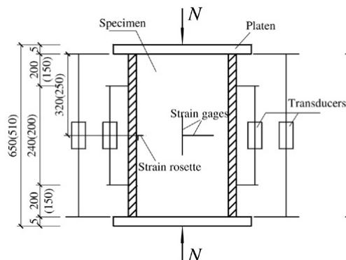  
(a)

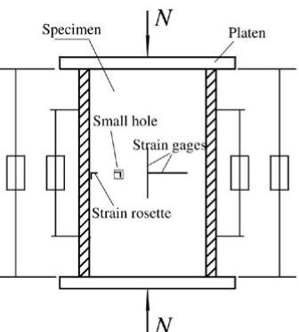  
(b)

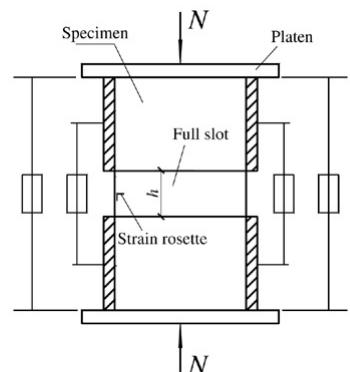  
(c）

  
(d)

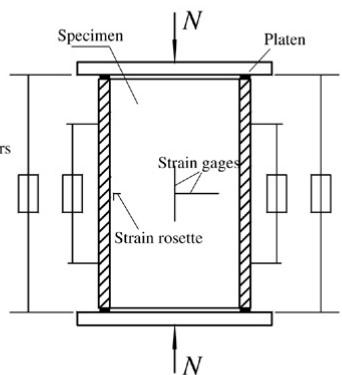  
(e)

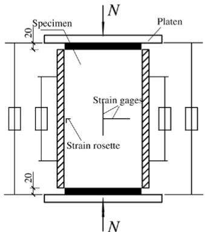  
(f)

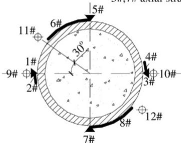  
1#,3# axial strain gauges of "mthod 1"   
2#,4# perimeter strain gauges of "mthod 1"   
5#,7# axial strain gauges of "mthod 2"   
Unnotched section

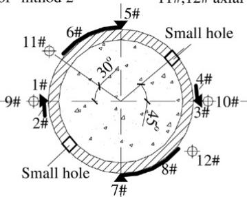  
Small holes notched section

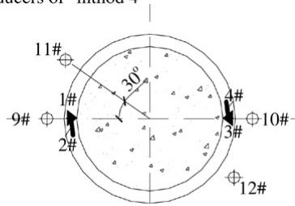  
6#,8# perimeter strain gauges of "mthod 2" 9#,10# axial transducers of "mthod 3"   
11#,12# axial transducers of "mthod 4"   
full notched section   
Fig. 1. Test layout and instrumentation.

Table 3 Influence of different test methods on $E _ { s c }$   

<table><tr><td>Specimens</td><td>SZ5S4A1a</td><td>SZ5S4A1b</td><td>SZ5S3A1</td><td>SZ5S4A2</td><td>SZ5S3A2</td></tr><tr><td>Esc(MPa)</td><td></td><td></td><td></td><td></td><td></td></tr><tr><td>Method 1</td><td>4.34 × 104</td><td>4.69 × 104</td><td>4.20 × 104</td><td>3.63 × 104</td><td>3.90 × 104</td></tr><tr><td>Method 2</td><td>4.57 × 104</td><td>4.51 × 104</td><td>3.99 × 104</td><td>3.61 × 104</td><td>3.92 × 104</td></tr><tr><td>Method 3</td><td>4.65 × 104</td><td>5.04 × 104</td><td>4.29 × 104</td><td>3.28 × 104</td><td>3.36 × 104</td></tr></table>

and SZ5S3A1. All of these deformation values were axially averaged, and the displacements were transformed into strains by dividing by the gauge length. For the composite modulus of elasticity $( E _ { s c } )$ of unnotched specimens SZ5S4A1a, SZ5S4A1b, and SZ5S3A1, there was no significant difference in the results of “method 1”, “method $2 ^ { \circ }$ , and “method 3” when the specimens were loaded at the elastic stage, as can

be seen from Table 3. There is also little difference at the inelastic stage as shown in Fig. 2. Therefore, for the unnotched specimens, the three measurement methods are equally valid. However, “method $3 ^ { \circ }$ could record the deformation behavior of the specimens loaded even at the strain softening stage (seen from Figs. 2 and 3), but “method 1” and “method 2” could not. The measured results of “method 4” are higher

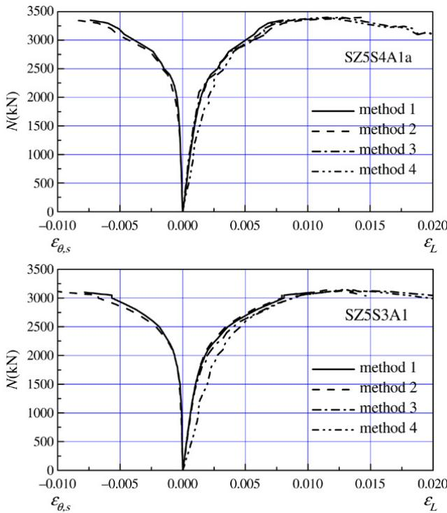  
Fig. 2. Comparison of four measurement methods on load–strain relations.

than those of the other three methods because the deformation might have included the end constraining effects at the top and bottom of the specimens and could not reflect the behavior of the axial compressive stiffness. Therefore, “method $4 ^ { \circ }$ is not recommended for measuring the axial deformation of specimens.

# 3.2. Influence of concrete strength

Previous research [5] indicated that the influence of SCC and NC with close concrete strength on the load carrying capacity and failure modes of CFT columns is very small. So it is assumed in this paper that SCC performed identically to NC.

The experimental load (N ) versus axial strain $( \varepsilon _ { L } )$ curves for the stub columns of SZ5S4A1a, SZ5S4A1b, and SZ5S3A1, and for the stub columns of SZ3C4A1, SZ3S4A1, and SZ3S6A1 are presented in Fig. 3. As the cubic compressive strength of concrete (SCC or NC) increased, the limit load of elasticity and ultimate capacity of the stub columns reached a higher value, but the residual capacity almost maintained the same value. It was found that the concrete strength hardly influenced the failure mode of the stub columns, as seen from Fig. 4.

# 3.3. Influence of notched holes

When the beam is relatively small and some steel rebars pass through the steel tubes at frame joints, its effect could be simulated by a steel tube notched with small holes. The experimental curves of the load versus axial strain of the notched specimens with small holes (A1 specimens) in the midheight region of steel tubes are compared in Fig. 5 with that of unnotched specimens (A2 specimens), and the composite

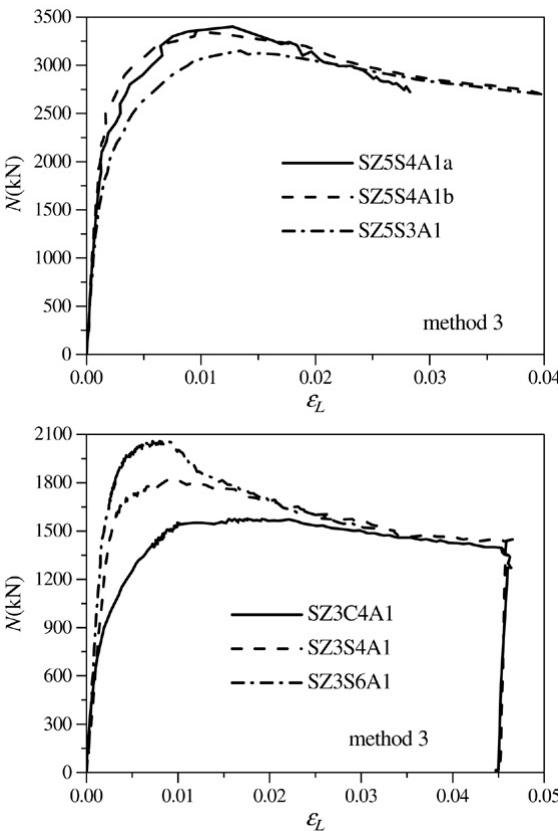

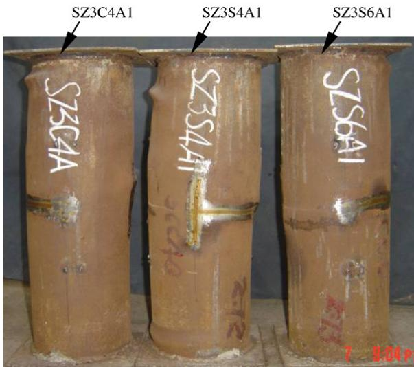  
Fig. 3. Effect of concrete strength.   
Fig. 4. Comparison of typical failure mode of columns with respect to concrete strength.

modulus of elasticity $( E _ { s c } )$ of these specimens is listed in Table 3. Compared to unnotched specimens, the $E _ { s c }$ of notched ones was reduced, and the deformation increased slightly, even at elastic stage. Meanwhile, as shown in Fig. 5, the limit load of elasticity decreased, the deformation grew rapidly at inelastic stage, and the strain corresponding to the ultimate capacity increased slightly. However, there was hardly any influence on the ultimate capacity and residual capacity between the notched and the unnotched specimens. But, as seen from Fig. 6, the failure mode of the notched specimens with small holes

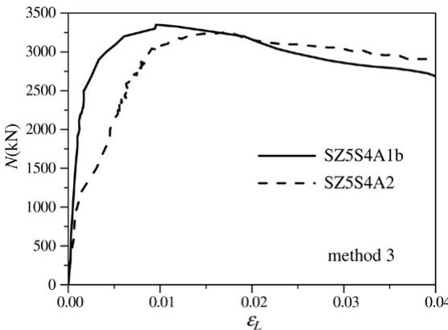

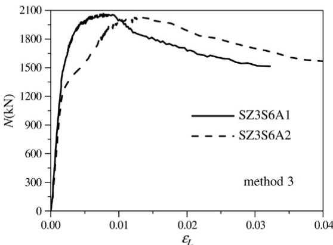

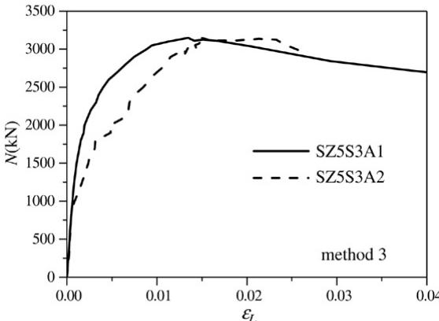  
Fig. 5. Comparison of load–axial strain relations between the specimens notched with small holes and unnotched ones.

was different from that of unnotched ones. For the notched specimens, local buckling of the steel tube happened earlier, the concrete core at the holes was crushed, and the small holes were staved; but they have almost the same apparent distortions compared to those unnotched specimens.

Fig. 7 shows the relationship of the strain ratio $( v _ { s c } )$ of the steel tube versus the axial load (N ) and compares the notched specimens with small holes and the unnotched ones. The strain ratio was defined as the absolute value of the perimeter strain divided by the axial strain, and the values were averaged for the axial and the lateral strain gauges on the specimen.

For the behavior shown in Fig. 7, an increase in the strain ratio would indicate an increased confinement effect of the concrete core offered by the steel tube. For the unnotched specimens, such as specimens SZ5S4A1a, SZ5S3A1, and SZ3S6A1, the strain ratio increased slowly, and it is even less

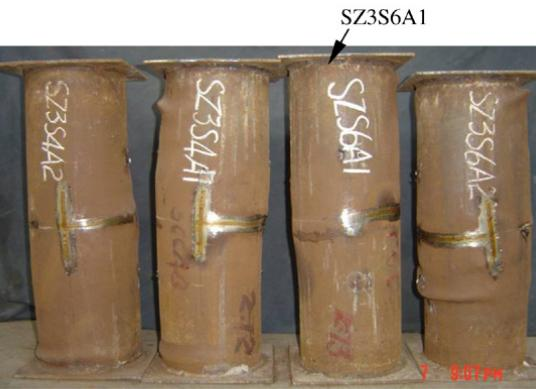

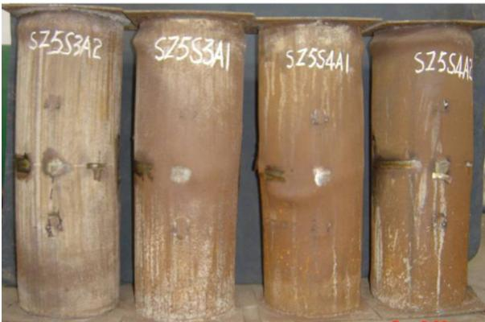  
Fig. 6. Comparison of typical failure mode between the specimens notched with small holes and unnotched ones.

than the Poisson’s ratio of steel when the specimens were loaded at the elastic stage. Beyond the level of the limit load of elasticity, the strain ratio increased faster as the load grew gradually ( $\stackrel { \cdot } { v } _ { s c }$ is even larger than 0.5), then the confinement effect between the steel tube and the concrete core took place. As the load increased, the perimeter stress increased, and the axial stress decreased after the yielding of the steel tube, which made the strain ratios grow continually $\stackrel { \cdot } { v } _ { s c }$ is even closer to 1). Confinement effect of the concrete core is thus enhanced, and the axial compressive strength increased. Therefore, the composite action enhanced the ultimate capacity of the stub columns.

For the notched specimens with small holes in the midheight region of steel tubes, such as specimens SZ5S4A2, SZ5S3A2, and SZ3S6A2, the experimental curves of load versus strain ratio had a notable change. Even at the early loading stage, the strain ratio of notched specimens increased faster than the unnotched ones. At a loading of about $50 \% { - } 7 0 \%$ of their ultimate capacity, the strain ratio increased up to 0.5–0.7. Then, the strain ratio was nearly constant with the load within a certain level. Beyond this load level, the strain ratio increased faster again, and would catch up with, or even exceed, the unnotched specimens at the same load level.

In summary, experimental research shows that the mechanical behavior of the stub columns is significantly influenced by the notched holes. The stress flows of the steel tube were changed due to the holes, and the behavior was also affected. The axial compressive stiffness of the notched specimens was reduced; therefore, the steel tube notched with small holes acted

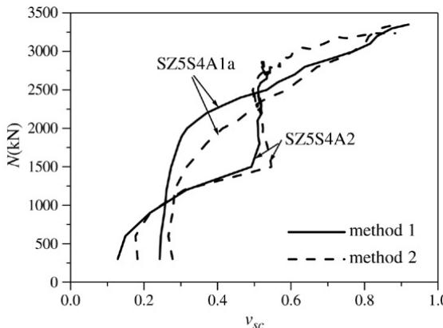

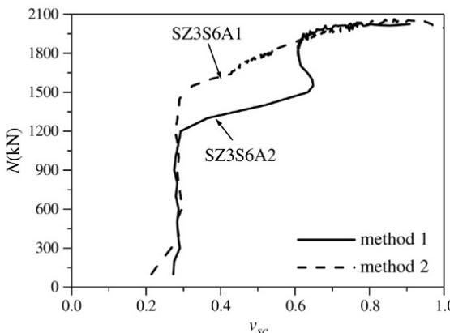

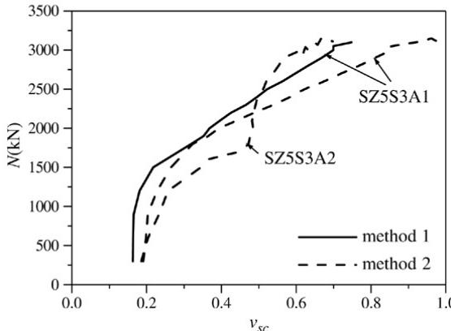  
Fig. 7. Comparison of axial load versus strain ratio of notched specimens with small holes and unnotched ones.

more as transverse confinement and less as an axial compression component than the unnotched ones.

# 3.4. Influence of notched slots

When the beam is relatively large and many steel rebars pass through steel tubes at frame joints, their effects could be simulated by a steel tube notched with full slots (with different vertical dimensions). The experimental load $( N )$ versus axial displacement $( u _ { L } )$ curves for the specimens notched with full perimeter slots with different vertical dimension $( h )$ at the midheight region of steel tubes are presented in Fig. 8. When the full slot has a small vertical dimension, such as $h / D =$ 0.046 $( h ~ = ~ 1 0 ~ \mathrm { m m }$ , SZ5S4E1) and 0.228 $( h \ = \ 5 0 \ \mathrm { m m }$ SZ5S4E2), the load capacity is hardly affected, but when $h$ increased subsequently (SZ5S4E3 and SZ5S4E4), the load

  
Fig. 8. Load (N ) versus axial displacement $( u _ { L } )$ curves for full slot notched specimens.

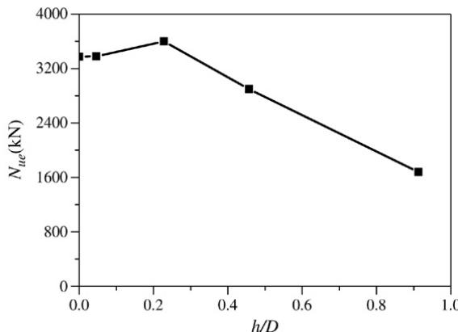  
Fig. 9. Influence of $h / D$ on ultimate capacity.

Table 4 Influence of different test methods on axial deformations of slot notched specimens   

<table><tr><td>Specimen</td><td>SZ5S4E1</td><td>SZ5S4E2</td><td>SZ5S4E3</td><td>SZ5S4E4</td></tr><tr><td>h/D</td><td>0.046</td><td>0.228</td><td>0.457</td><td>0.913</td></tr><tr><td>ESc(MPa)</td><td></td><td></td><td></td><td></td></tr><tr><td>Method 1</td><td>3.40 × 104</td><td>3.64 × 104</td><td>3.72 × 104</td><td>3.42 × 104</td></tr><tr><td>Method 3</td><td>2.33 × 104</td><td>1.81 × 104</td><td>1.63 × 104</td><td>1.50 × 104</td></tr></table>

capacity decreased gradually. The influence of $h / D$ on the ultimate capacity $( N _ { u e } )$ of full notched specimens is given in Fig. 9. It can be found that the ultimate capacity of the specimens notched with a full slot is about $86 \%$ and $50 \%$ of the unnotched ones when $h / D = 0 . 4 5 7$ $( h \ : = \ : 1 0 0 \ : \mathrm { m m } )$ ) and $h / D = 0 . 9 1 3$ $( h = 2 0 0 \mathrm { m m }$ ), respectively.

Seen in Table 4, the composite modulus of elasticity $( E _ { s c } )$ decreased gradually as $h / D$ increased when the strains were measured by “method $3 ^ { \circ }$ , but remained nearly constant when the strains were measured by “method 1”. Obviously, for specimens notched with a full slot, slip occurred between the concrete core and steel tube. With the increase in $h / D$ , the bonding force between the concrete core and the steel tube decreased, thus slip increased.

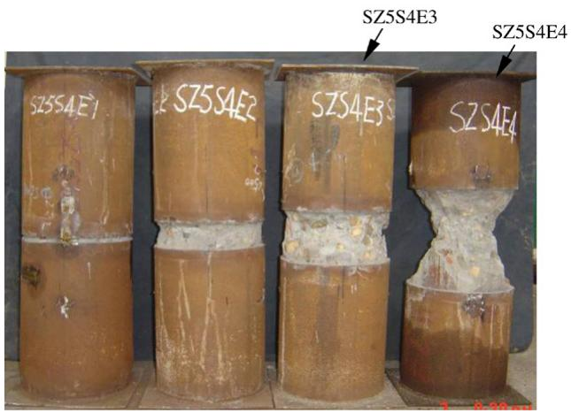

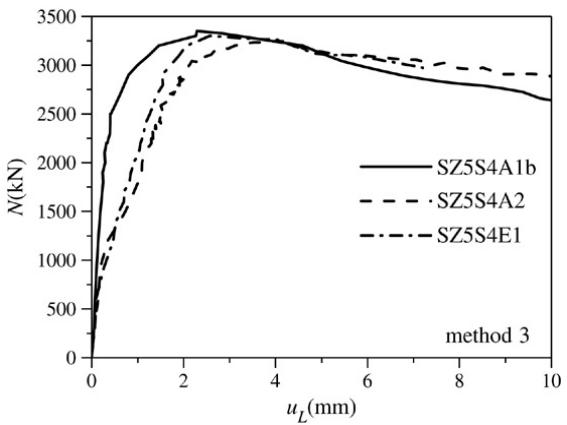  
Fig. 10. Typical failure mode of the full slot notched specimens with different vertical slot dimension.   
Fig. 11. Load (N ) versus axial displacement $( u _ { L } )$ curves for notched specimens.

The failure mode of the slot-notched specimens was different from the unnotched ones, which can be seen from Fig. 10. For specimen SZ5S4E1, the concrete core was crushed near the notched slot, and the steel tube buckled due to a radial expansion; but for specimens SZ5S4E2, SZ5S4E3, and SZ5S4E4, the concrete core was split, and no buckling occurred in the steel tube.

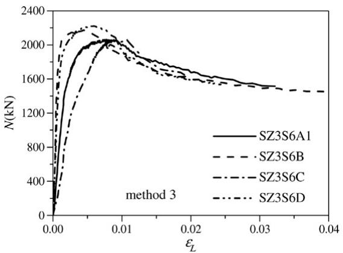  
(a) Load versus axial strain curves.

The experimental load (N ) versus axial displacement $( u _ { L } )$ curves for the slot-notched specimens with a vertical dimension of $1 0 \mathrm { m m }$ (SZ5S4E1), the hole-notched specimen (SZ5S4A2), and the unnotched specimen (SZ5S4A1b) are presented in Fig. 11. The deformation behavior of specimen SZ5S4E1 was similar to that of specimen SZ5S4A2, but the axial stiffness was reduced compared to specimen SZ5S4A1b.

Therefore, once the steel tube was notched with a full slot in the perimeter direction, the stress flows of the steel tube cannot pass through the slot. The concrete behavior with threedimensional compression was changed, and the capacity and axial compressive stiffness were also reduced as a whole. The confinement effect was enhanced when the vertical dimension of the full slot was reduced. When the dimension was large, the confinement effect decreased and the concrete core is hardly strengthened; then the ultimate capacity of these specimens decreased.

# 3.5. Influence of different loading conditions

The influence of different loading conditions on the mechanical behaviors of specimens was also studied. The loading conditions included load applied to: (a) the entire section, (b) the concrete section initially, but to the entire section after the concrete was compressed, (c) the steel section initially, but to the entire section after the steel was compressed, and (d) only the concrete section.

The typical load–axial strain curves of the tested specimens under the four loading conditions are presented in Fig. 12(a), where the axial strain was measured from the steel tube using “method $3 ^ { \circ }$ as discussed earlier. It can be observed that for the specimens of loading conditions (b) (SZ3S6B) and (d) (SZ3S6D), the ultimate capacity and load–axial strain curves were similar, and compared with that of loading condition (a) (SZ3S6A1), the ultimate capacity for both reached slightly higher values and the strain in the steel tube reached a lower value. Therefore, the steel tubes in cases (b) and (d) carried less axial compressive stress than case (a) under the same load. For the specimen of loading condition (c) (SZ3S6C), compared with that of loading condition (a), the ultimate capacity was

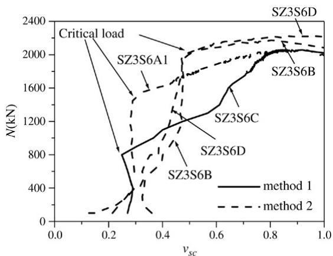  
(b) Load versus strain ratio curves.   
Fig. 12. Influence of different loading conditions on mechanical behavior of columns.

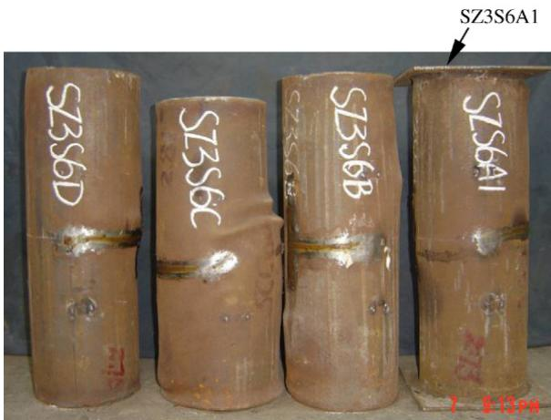  
Fig. 13. Typical failure mode of the specimens under different loading conditions.

in the same range for both, and the strain in the steel tube has a higher value; thus, the steel tube carried more axial compressive stress under the same load. The residual capacity of the stub columns under the four loading conditions was hardly influenced.

The typical load–strain ratio curves of the tested specimens under the four loading conditions are plotted in Fig. 12(b). For the specimens of loading conditions (b) and (d), the load–strain ratio curves were similar, and compared with that of loading condition (a), the strain ratio for both had slightly higher values under the same load. The value of $v _ { s c } ~ < ~ 1$ indicated (since the absolute value of the perimeter strain is less than the axial stain) that the steel tube carried axial compressive stress mainly because of the bonding stress between the steel tube and the concrete core. When the load reached about $90 \%$ of its ultimate capacity, the strain ratio increased faster and the specimen had a higher critical load, as seen from Fig. 12(b), which indicated that the steel tube carried less axial compressive stress and yielded later. For the specimen of loading condition (c), compared with that of loading condition (a), initially the strain ratio was in the same range for both and had a lower critical load, which indicated that the steel tube in case (a) carried more axial compressive stress and yielded earlier.

Typical failure mode of the specimens under different loading conditions is shown in Fig. 13. There was no significant difference in the failure mode for the specimens under these four loading conditions; however, in general, the specimens had more local bulking with higher apparent distortions for loading conditions (d), (b), (a), and (c) in order.

# 4. Analysis of test results and discussion

The existing international standards, such as ACI-1999 [10], AIJ-1997 [11], AISC-LRFD-1999 [12], and Eurocode 4- 1994 [13], were applied to predict the ultimate capacity and were compared with the tested ones by many researchers [5–7]. The general conclusion [5–7] has been made that ACI-1999, AIJ-1997, and AISC-LRFD-1999 are excessively conservative for predicting the ultimate capacities of specimens, while Eurocode 4-1994 gives reasonable predictions. For demonstrations, the Eurocode 4 and ACI codes were applied to predict

Table 5 Conversion relations between $f _ { \mathrm { c y l } }$ and $f _ { c u }$   

<table><tr><td>fcu(MPa)</td><td>20-40</td><td>50</td><td>60</td><td>70</td><td>80</td></tr><tr><td>fcyl/fcu</td><td>0.80</td><td>0.83</td><td>0.86</td><td>0.875</td><td>0.89</td></tr></table>

Table 6 Comparison of test results with Eurocode 4   

<table><tr><td>Specimens</td><td>Nue(kN)</td><td>Nuc(kN)</td><td>Nue/Nuc</td></tr><tr><td>SZ5S4A1a</td><td>3400</td><td>3140.2</td><td>1.083</td></tr><tr><td>SZ5S4A1b</td><td>3350</td><td>3121.9</td><td>1.073</td></tr><tr><td>SZ5S3A1</td><td>3150</td><td>2960.3</td><td>1.064</td></tr><tr><td>SZ3S6A1</td><td>2080</td><td>2207.4</td><td>0.942</td></tr><tr><td>SZ3S4A1</td><td>1750</td><td>1886.7</td><td>0.928</td></tr><tr><td>SZ3C4A1</td><td>1560</td><td>1632.9</td><td>0.955</td></tr></table>

Table 7 Comparison of test results with ACI   

<table><tr><td>Specimens</td><td>Nue(kN)</td><td>Nuc(kN)</td><td>Nue/Nuc</td></tr><tr><td>SZ5S4A1a</td><td>3400</td><td>2375.8</td><td>1.431</td></tr><tr><td>SZ5S4A1b</td><td>3350</td><td>2363.4</td><td>1.417</td></tr><tr><td>SZ5S3A1</td><td>3150</td><td>2215.2</td><td>1.422</td></tr><tr><td>SZ3S6A1</td><td>2080</td><td>1776.8</td><td>1.171</td></tr><tr><td>SZ3S4A1</td><td>1750</td><td>1493.1</td><td>1.172</td></tr><tr><td>SZ3C4A1</td><td>1560</td><td>1268.5</td><td>1.230</td></tr></table>

the ultimate capacity of the unnotched specimens under loading condition (a), namely, the entire section is loaded simultaneously, and was compared with these test results. In the design calculations, the material partial safety factors were set to be unity.

The conversion relations between cylinder compressive strength of concrete $( f _ { \mathrm { c y l } } )$ and cubic compressive strength $f _ { c u }$ that were proposed by CEB-FIP-1990 [14] are seen in Table 5. The ultimate capacities of the tested specimens were compared with the predicted capacities from Eurocode 4 and ACI, as shown in Tables 6 and 7. For Eurocode 4, the predicted values are in good agreement with the test results. The mean value is 1.008, and the standard deviation is 0.073. But for ACI, the predicted values are very conservative, due to the fact that concrete confinement is ignored in their estimation of ultimate capacities. The mean value is 1.307, and the standard deviation is 0.129.

# 5. Conclusions

This paper presents an experimental study on CFT stub columns with SCC and NC under concentrically loaded conditions. Based on experimental observations of the behavior of specimens, the influence of several parameters including measurement methods of deformation, concrete strength, and small holes or full slots notched in the perimeter direction of the steel tube on the confinement of the concrete core and compression shared by the steel tube was investigated. The following conclusions may be drawn:

(1) An increase in compressive strength of concrete (SCC or NC) resulted in a significant increase in load capacity, but

nearly maintained a constant value in residual capacity after failure.

(2) The measured load versus strain ratio curves of the steel tubes suggested that a significant confinement effect was present for most specimens after the axial load reached a certain percentage of the ultimate capacity of stub columns. Once a steel tube was notched with small holes in the midheight region, the confinement effect was presented earlier and enhanced, but the axial compressive stiffness was reduced. However, the ultimate capacity and residual capacity were hardly influenced.

(3) When a steel tube was notched with a full perimeter slot in the mid-height region, the stress flows of steel tube could not pass through the slot; the concrete behavior with threedimensional compressive stress was changed; and the capacity and axial compressive stiffness were also reduced as a whole. The confinement effect was enhanced when the dimension of the full slot was reduced. But when the dimension was large, the confinement effect decreased, and the concrete core was hardly strengthened; thus, the ultimate capacity of these specimens decreased.

(4) For the frame joints, that steel rebars pass through the steel tubes is not recommended in the construction of buildings.

(5) Under different loading conditions the sequence of confinement effect for the specimens changed. Compared to the specimen with the load applied to the entire section, when the load was applied to the steel section initially, the confinement effect appeared earlier but decreased, and the ultimate capacity was almost the same. When the load was applied to the concrete section initially or only to the concrete section, the confinement effect appeared later but enhanced, and the ultimate capacity increased slightly. However, the residual capacity of the stub columns under the four loading conditions was hardly influenced.

(6) Eurocode 4 provides a good prediction of the ultimate capacities of the unnotched CFT stub columns with SCC and NC when the entire section was loaded.

# Acknowledgments

This research work was financially supported by the National Natural Science Foundation of China, Grant No.

50278097, 50578162, and 50438020 and the Natural Science Foundation of Human Province, China, Grant No. 03JJY3089. The authors wish to thank Miss You-Lan Chen for her assistance in the experiments.

# References

[1] O’Shea MD, Bridge RQ. Design of circular thin-walled concrete filled steel tubes. Journal of Structural Engineering, ASCE 2000;126(11): 1295–303.   
[2] Schneider SP. Axially loaded concrete-filled steel tubes. Journal of Structural Engineering, ASCE 1998;124(10):1125–38.   
[3] Sakina K, Nakahara H, Morino S, et al. Behavior of centrally loaded concrete-filled steel-tube short columns. Journal of Structural Engineering, ASCE 2004;130(2):180–8.   
[4] Johansson M, Gylltoft K. Mechanical behavior of circular steel–concrete composite stub columns. Journal of Structural Engineering, ASCE 2002; 128(8):1073–81.   
[5] Han L-H, Yao G-H. Experimental behaviour of thin-walled hollow structural steel (HSS) columns filled with self-consolidating concrete (SCC). Thin-Walled Structures 2004;42(9):1357–77.   
[6] Han L-H, Yao G-H, Zhao X-L. Tests and calculations for hollow structural steel (HSS) stub columns filled with self-consolidating concrete (SCC). Journal of Constructional Steel Research 2005;61(9):1241–69.   
[7] Giakoumelis G, Lam D. Axial capacity of circular concrete-filled tube columns. Journal of Constructional Steel Research 2004;60(7):1049–68.   
[8] Sakina K, Tomii M, Watanabe K. Sustaining loading resistance of plain concrete stub columns by circular steel tube. In: Proceedings of the international conference on concrete-filled steel tubular structures. The Science and Technology Exchange of Heilongjian Province; 1985. p. 112–8.   
[9] Wu H, Xiao Y. Compressive stress–strain behavior of concrete confined by carbon fiber jackets. In: Proceeding of 6th ASCCS conference. 2000. p. 919–26.   
[10] ACI 318-99. Building code requirements for structural concrete and commentary. Farmington Hills (MI), Detroit (USA): American Concrete Institute; 1999.   
[11] AIJ. Recommendations for design and construction of concrete filled steel tubular structures. Tokyo (Japan): Architectural Institute of Japan; 1997.   
[12] AISC-LRFD. Load and resistance factor design specification for structural steel buildings. 2nd ed. Chicago (USA): American Institute of Steel Construction (AISC); 1999.   
[13] Eurocode 4. Design of composite steel and concrete structures, Part 1.1: General rules and rules for buildings (together with United Kingdom National Application Document). DD ENV 1994-1-1:1994. London: British Standards Institution; 1994.   
[14] Comite Euro-International du Beton. Bulletin D’ information No.213/214. CEB-FIP Model Code1990 (Concrete Structures). Lausanne, Switzerland, 1993.