Full length article

# Size effect of circular concrete-filled steel tubular short columns subjected to axial compression

Yuyin Wanga,b,⁎ , Peng Chenc , Changyong Liua,b , Ying Zhangc

a Key Lab of Structures Dynamic Behavior and Control of the Ministry of Education, Harbin Institute of Technology, Harbin 150090, China   
b Key Lab of Smart Prevention and Mitigation of Civil Engineering Disasters of the Ministry of Industry and Information Technology, Harbin Institute of Technology, Harbin 150090, China   
c School of Civil Engineering, Harbin Institute of Technology, Harbin 150090, China

# A R T I C L E I N F O

Keywords:

Concrete-filled steel tubes

Size effect

Steel ratio

Axial compression

# A B S T R A C T

In this paper, thirty-six short columns with different diameters $1 5 0 \mathrm { m m } \leq d \leq 4 6 0 \mathrm { m m } )$ and steel ratios $( 4 . 0 \%$ $\leq \alpha \leq 1 0 . 0 \% )$ ) were tested to failure to investigate the size effect of circular concrete-filled steel tubular short columns subjected to axial compression. Size effects on the peak axial stress, peak axial strain, composite elastic modulus, and ductility coefficient were studied. The experimental results showed that the peak axial stress, peak axial strain and ductility coefficient of the specimens tended to decrease with the increase in the column diameter. The values of the composite elastic modulus remained almost constant when the diameter of the specimens increased, indicating that size effect on the composite elastic modulus was not obvious. Meanwhile, size effect on the peak axial stress was influenced by the steel ratio in the range of $4 { - } 1 0 \%$ . Furthermore, the size effect tended to decrease as the steel ratio increased. By comparing with the current codes, a reduction coefficient was introduced to consider the size effect of concrete core. Based on the reduction coefficient, the size effect of the concrete core inside the steel tube is found to be weaker compared with that of the unconfined concrete columns because of the confinement effect.

# 1. Introduction

Concrete-filled steel tubular (CFST) arch ribs are widely used in the construction of arch bridges due to their excellent performance, such as high compressive strength, good plasticity, excellent seismic performance and convenient construction. Compared with reinforced concrete arches, CFST arch bridges show great advantage in simplifying concrete casting procedures because the thin-walled steel tube can serve as template formwork. Compared with steel arches, less steel is used in CFST arches to meet the requirements for stiffness and stability [1,2]. In the last 20 years, more than 300 arch bridges (maximum span is $5 3 0 \mathrm { m } \mathrm { \Omega }$ ) have employed CFST as their arch ribs. According to the survey from [3] on over 230 CFST arch bridges shows that, more than $9 6 . 1 \%$ arch ribs have an external diameter larger than $6 0 0 \mathrm { m m }$ , among which more than $5 3 . 2 \%$ ribs' diameters are larger than 900 mm. The maximum external diameter of an arch rib has reached $1 8 0 0 \mathrm { m m }$ , shown in Fig. 1(a). Similarly, diameters of CFST columns in high-rise buildings are also usually larger than 600 mm. In 2012, the section size of the CFST columns with multi-cavity in the Guangzhou CTF Finance Centre (Guangzhou, China) has already reached $3 . 5 \mathrm { ~ m ~ } \times \ 5 . 6 \mathrm { ~ m ~ }$ [4].

The compressive strength of concrete is generally accepted to

decrease as the size of concrete increases (i.e., size effect) [5–9]. Based on the size effect equation proposed by Sakino [10], the compressive strength of a concrete column reduces by $1 8 . 3 \%$ when the diameter varies from $1 5 0 \mathrm { m m }$ to $9 0 0 \mathrm { m m }$ . Concrete core is an essential component of the CFST column, thus size effect of concrete may also affect the compressive behavior of CFST columns, especially for those with large section sizes. In addition, the size effect of CFST columns is more complicated than that of unconfined concrete columns, because the confinement from the steel tube can inhibit crack propagation, thereby influencing the size effect of the concrete core to some extent.

Current codes for CFST columns, such as EC4 (EN 1994-1-1) [11], AIJ (AIJ2008) [12], AISC (AISC 360-10) [13], and GB (GB50936-2013) [14], are all based on the experimental results obtained from smalldimension CFST specimens. Whether or not the current codes could accurately predict the performance of CFST members with a large crosssection remains a question when considering the influence of size effect. Although the compressive behavior of CFST columns has already been extensively studied [15–22], researches on the size effect on the compressive behavior of CFST short columns are still limited. Only Yamamoto et al. [23] conducted a test on the size effect of 21 CFST specimens with circular/square cross-sections under axial compression. The

<table><tr><td colspan="2">Nomenclature</td><td>fy</td><td>yield strength of the steel tube</td></tr><tr><td></td><td></td><td>L</td><td>height of the specimen</td></tr><tr><td>CFST</td><td>concrete-filled steel tube</td><td>Nu</td><td>load-carrying capacity of the concrete-filled steel tube</td></tr><tr><td>D</td><td>external diameter of the steel tube</td><td></td><td>short column</td></tr><tr><td>d</td><td>diameter of the concrete core</td><td>t</td><td>thickness of the steel tube</td></tr><tr><td>Ec</td><td>elastic modulus of the unconfined concrete</td><td>α</td><td>ratio of the steel area over the concrete area</td></tr><tr><td>Es</td><td>elastic modulus of the steel tube</td><td>γu</td><td>reduction coefficient of concrete in the compressive</td></tr><tr><td>Esc</td><td>composite elastic modulus of the concrete-filled steel tube</td><td>short column</td><td>strength</td></tr><tr><td></td><td></td><td>δ</td><td>ductility coefficient</td></tr><tr><td>fcu,28</td><td>concrete cubic strength at 28 days</td><td>εv</td><td>longitudinal strain of the column</td></tr><tr><td>fcm,28</td><td>concrete cylinder strength at 28 days</td><td>εu</td><td>peak axial strain</td></tr><tr><td>fcm,test</td><td>concrete cylinder strength at test days</td><td>μs</td><td>Poisson&#x27;s ratio of the steel tube</td></tr><tr><td>fcu,test</td><td>concrete cubic strength at test days</td><td>σu</td><td>peak axial stress of the concrete-filled steel tube short</td></tr><tr><td>fu</td><td>ultimate tensile strength of the steel tube</td><td></td><td>column</td></tr></table>

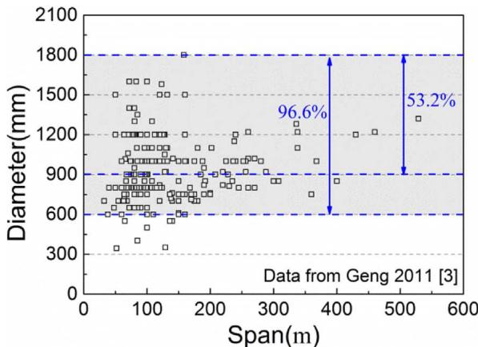  
(a)Diameter

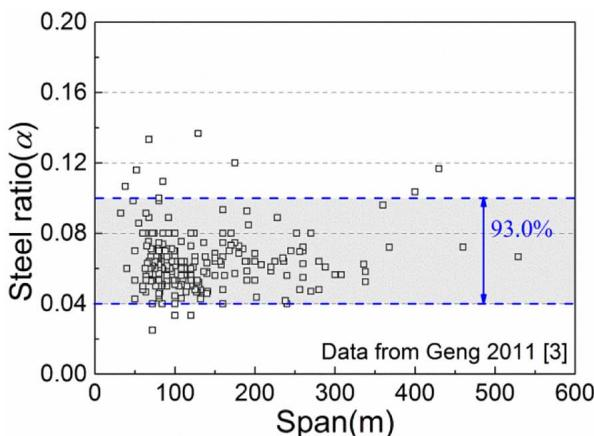  
(b) Steel ratio   
Fig. 1. Survey of CFST arch bridges. The figures show the diameter and steel ratio of arch rib used in CFST arch bridges.

external diameter of the circular CFST specimens varied from $1 0 0 \mathrm { m m }$ to $3 2 0 \mathrm { m m }$ with a constant steel ratio of $^ { 1 3 \% }$ . It was found through the test that the size effect did not exist in circular CFST specimens. This test has provided fundamental understanding for the size effect in CFST columns, but another essential parameter, i.e. steel ratio, has not been investigated apart from diameter/width. The authors believe that it is the steel ratio what makes CFST columns differing from concrete columns. The applicability of Yamamoto's conclusion is doubtful for CFST columns with varied steel ratios especially for those with lower steel ratios. Actually, based upon the statistics for over 230 CFST arch bridges shown in Fig. 1(b), the steel ratio of CFST arch ribs is predominantly distributed in the range of $4 { - } 1 0 \%$ , accounting for $9 3 . 0 \%$ of the total. In building structures, the steel ratio is usually designed in the range of $8 { - } 1 0 \%$ in China to reduce the amount of steel. This means that further work on the size effect of those CFST columns with lower steel ratios is necessary.

In addition to Yamamoto's experimental research, two studies on the size effect were also conducted by analyzing the existing test data. Sakino et al. [10] investigated the size effect based on the existing test data of 36 circular and 48 square CFST short columns. Subsequently, the authors proposed an equation to predict the size effect by directly importing the size effect of unconfined concrete. However, the influence of steel ratio on the size effect was not considered. Lu et al. [24] compared the existing test results with the predicted results calculated by different design codes according to the analysis of 252 test data of square specimens with sizes varying from $8 0 \mathrm { m m }$ to $3 2 0 \mathrm { m m }$ . The comparison showed that the design codes might overestimate the loadcarrying capacity of the square CFST short columns with a large size. In the study, the influence of steel ratio on size effect was also not considered. In addition, the statistical data were collected from square

CFST short columns, which were different with circular CFST specimens in terms of confining pressure distribution.

It can be concluded that previous studies on size effect of CFST columns are limited. The only related experimental research mainly focused on the analysis of specimens with a constant steel ratio $( 1 3 \% )$ , while the specimens with lower steel ratios were lacking. In addition, the influence of steel ratio on size effect was also not considered in the analysis of existing test data. To obtain the size effect law of CFST specimens with low steel ratios, the present study intends to perform a research to extend the minimum steel ratio to $4 . 1 \%$ , and the maximum diameter of the specimens to $4 6 0 \ \mathrm { m m }$ . A total of 36 specimens with different diameters and steel ratios were included in the test. Both the influences of diameter and steel ratio on the size effect were investigated. The size effect on the peak axial stress, peak axial strain, composite elastic modulus, and ductility coefficient was analyzed. The limitations of the current codes were then studied by comparing the test data with the current CFST design provisions, and a reduction coefficient was proposed to consider the size effect of concrete core.

# 2. Experiment program

# 2.1. Specimen design

Two key parameters, namely, diameter $D$ and steel ratio $\alpha$ (Eq. (1)), were studied in the test. Four sizes $( 1 5 0 \mathrm { m m } \le d \le 4 6 0 \mathrm { m m } )$ were designed for each steel ratio to obtain the size effect law of the specimens. Three steel ratios (i.e., $4 . 1 \%$ , $6 . 6 \%$ and $1 0 . 3 \%$ ) were designed herein to cover the low steel ratio range. Each specimen group included three identical specimens to reduce the effect of data scatter. Details of the specimens are shown in Table 1. In the Table, CFST stands for

Table 1 Details of the tested CFST short columns.   

<table><tr><td>Group</td><td>Specimen labels</td><td>D × t × L (mm)</td><td>α (%)</td></tr><tr><td rowspan="3">1</td><td>CFST-LA-1</td><td rowspan="3">153 × 1.54 × 306</td><td rowspan="3">4.14</td></tr><tr><td>CFST-LA-2</td></tr><tr><td>CFST-LA-3</td></tr><tr><td rowspan="3">2</td><td>CFST-LB-1</td><td rowspan="3">250 × 2.48 × 500</td><td rowspan="3">4.09</td></tr><tr><td>CFST-LB-2</td></tr><tr><td>CFST-LB-3</td></tr><tr><td rowspan="3">3</td><td>CFST-LC-1</td><td rowspan="3">372 × 3.64 × 744</td><td rowspan="3">4.02</td></tr><tr><td>CFST-LC-2</td></tr><tr><td>CFST-LC-3</td></tr><tr><td rowspan="3">4</td><td>CFST-LD-1</td><td rowspan="3">469 × 4.66 × 938</td><td rowspan="3">4.09</td></tr><tr><td>CFST-LD-2</td></tr><tr><td>CFST-LD-3</td></tr><tr><td rowspan="3">5</td><td>CFST-MA-1</td><td rowspan="3">157 × 2.48 × 314</td><td rowspan="3">6.69</td></tr><tr><td>CFST-MA-2</td></tr><tr><td>CFST-MA-3</td></tr><tr><td rowspan="3">6</td><td>CFST-MB-1</td><td rowspan="3">282 × 4.36 × 564</td><td rowspan="3">6.48</td></tr><tr><td>CFST-MB-2</td></tr><tr><td>CFST-MB-3</td></tr><tr><td rowspan="3">7</td><td>CFST-MC-1</td><td rowspan="3">358 × 5.66 × 716</td><td rowspan="3">6.61</td></tr><tr><td>CFST-MC-2</td></tr><tr><td>CFST-MC-3</td></tr><tr><td rowspan="3">8</td><td>CFST-MD-1</td><td rowspan="3">474 × 7.42 × 948</td><td rowspan="3">6.57</td></tr><tr><td>CFST-MD-2</td></tr><tr><td>CFST-MD-3</td></tr><tr><td rowspan="3">9</td><td>CFST-HA-1</td><td rowspan="3">153 × 3.64 × 306</td><td rowspan="3">10.25</td></tr><tr><td>CFST-HA-2</td></tr><tr><td>CFST-HA-3</td></tr><tr><td rowspan="3">10</td><td>CFST-HB-1</td><td rowspan="3">235 × 5.66 × 470</td><td rowspan="3">10.36</td></tr><tr><td>CFST-HB-2</td></tr><tr><td>CFST-HB-3</td></tr><tr><td rowspan="3">11</td><td>CFST-HC-1</td><td rowspan="3">393 × 9.38 × 786</td><td rowspan="3">10.28</td></tr><tr><td>CFST-HC-2</td></tr><tr><td>CFST-HC-3</td></tr><tr><td rowspan="3">12</td><td>CFST-HD-1</td><td rowspan="3">477 × 11.36 × 954</td><td rowspan="3">10.32</td></tr><tr><td>CFST-HD-2</td></tr><tr><td>CFST-HD-3</td></tr></table>

concrete-filled steel tube; L, M, and H depict the steel ratios of $4 . 1 \%$ , $6 . 6 \%$ , and $1 0 . 3 \%$ , respectively; A, B, C, and D represent the four different specimen sizes; and 1, 2, and 3 are the numbers of specimens in each group. Fig. 2 shows the specimens before the test.

The steel tubes were manufactured by roll-forming steel plate into tubes and then seam welded longitudinally. To keep the steel ratio remain constant in one testing group, it is required that the external diameter over the steel tube thickness $\left( D / t \right)$ must remain constant when the external diameter of the specimen D varies (Eq. (1)). In the test, the external diameter was precisely machined. Therefore the error of steel ratios for specimens with different diameters was eventually controlled within $2 \%$ . The concrete with a 28-day target strength of 60 MPa was used in the test. To ensure that the compressive strength of the concrete in the specimens was the same, all specimens were manufactured using the same batch of concrete and cured in the same condition.

$$
\alpha = A _ {\mathrm {s}} / A _ {\mathrm {c}} = \frac {4 (D / t - 1)}{(D / t - 2) ^ {2}} \tag {1}
$$

where $\alpha$ is the steel ratio; $A _ { s }$ and $A _ { \mathrm { c } }$ are the areas of steel tube and concrete core, respectively; $D$ is the external diameter of the steel tube, t is the thickness of the steel tube.

# 2.2. Materials

Commercial concrete with the same strength was used to fabricate the specimens. The specimens were sealed with end plates and cured in laboratory conditions. Concrete cubes with a side length of $1 5 0 \mathrm { m m }$ were cast and tested 28 days after concrete casting and at the time of tests on the specimens to evaluate the concrete compressive strength.

Three concrete prisms with a size of $1 5 0 \mathrm { m m } \times 1 5 0 \mathrm { m m } \times 3 0 0 \mathrm { m m }$

were used to determine the elastic modulus of the concrete at the time of the tests. Table 2 shows the mean values of the test results. The table also presents the equivalent values of the cylinder strength developed from the conversion factors specified in CEB-FIP MC90 [25].

Three tensile coupons for each thickness of the steel tube were cut out from the steel plate and tested in accordance with the Chinese standard GB/T228.1 [26] to obtain the properties of the steel tube. The mean values of the elastic modulus $E _ { s } ,$ , Poisson ratio $\mu _ { s } ,$ yield strength $f _ { \mathrm { y } } ,$ and ultimate tensile strength $f _ { \mathrm { u } }$ were then obtained (Table 3).

# 2.3. Test setup

All specimens were tested until failure under axial compression using a $5 0 , 0 0 0 \mathrm { k N }$ hydraulic testing machine at Harbin Institute of Technology. Two linear variable differential transducers (LVDT) were symmetrically positioned around the specimen along the longitudinal direction to monitor the specimen deformation. Eight electrical resistance strain gauges, including four in the longitudinal direction and others in the transverse direction, were symmetrically placed on the surface of the steel tube at the mid-height of the specimen. A steel plate with $3 0 \mathrm { m m }$ thickness was placed between the machine and the specimen before the test to ensure that the load on the short columns was uniformly distributed. Fig. 3 shows the details of the testing machine and the instrument arrangement.

At the initial loading stage, the data of the strain gauges were carefully monitored to ensure that the load was concentrically applied to the columns. The test was performed at the step load. The load interval was $0 . 0 5 N _ { \mathrm { u } }$ , where $N _ { \mathrm { u } }$ is the predicted value of the load-carrying capacity according to the current codes (EC4 and GB 50936). The load was applied at the rate of $0 . 1 1 \mathrm { M P a } / s$ until it reached $0 . 8 5 N _ { \mathrm { u } }$ . The load at each load interval was sustained for 1 min to record the readings after they became stable. The machine was then controlled by longitudinal displacement at the rate of $1 0 ~ \mu \varepsilon / s$ . The tests were terminated until the maximum strain exceeded $4 0 , 0 0 0 ~ \mu \varepsilon$ or the load in the descending stage became smaller than $0 . 7 ~ N _ { \mathrm { u } }$ .

# 3. Experimental results and discussion

# 3.1. Test observation and failure modes

All specimens were tested until failure under axial compression. The failure processes of all specimens were similar. Fig. 4 presents the axial load versus the axial strain response of CFST-HB-1. In the initial stage, the axial strain proportionally increased as the load increased until it approximately reached 0.6 times the maximum load, and no obvious phenomenon was observed on the specimen. After that, the non-linear behavior began to occur. The diagonal slip lines were observed at the end or mid-height of the specimen. The diagonal lines kept propagating with the increase of the load. The specimen made a slight cracking noise when the load approached the maximum value. The local buckling occurred at the ends of the specimen. Subsequently, the load kept decreasing, and the shear failure of the specimen was apparent when the

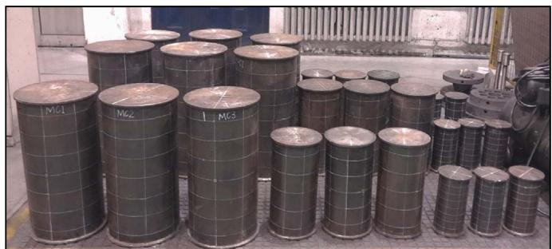  
Fig. 2. Specimens in test. The specimens are geometrically similar.

Table 2 Basic properties of concrete.   

<table><tr><td colspan="2">28 days</td><td colspan="3">Test days</td></tr><tr><td>fcu,28 (MPa)</td><td>fm,28 (MPa)</td><td>fcu,test (MPa)</td><td>fm,test (MPa)</td><td>Ec (GPa)</td></tr><tr><td>77.1</td><td>64.1</td><td>85.4</td><td>73.2</td><td>38.8</td></tr></table>

Table 3 Basic properties of steel tubes.   

<table><tr><td>t (mm)</td><td>Es (GPa)</td><td>μs</td><td>fy (MPa)</td><td>fu (MPa)</td></tr><tr><td>1.54</td><td>187</td><td>0.271</td><td>345</td><td>512</td></tr><tr><td>2.48</td><td>191</td><td>0.294</td><td>326</td><td>477</td></tr><tr><td>3.64</td><td>185</td><td>0.320</td><td>320</td><td>451</td></tr><tr><td>4.36</td><td>194</td><td>0.293</td><td>322</td><td>484</td></tr><tr><td>4.66</td><td>186</td><td>0.263</td><td>291</td><td>448</td></tr><tr><td>5.66</td><td>184</td><td>0.307</td><td>290</td><td>450</td></tr><tr><td>7.42</td><td>194</td><td>0.292</td><td>317</td><td>468</td></tr><tr><td>9.38</td><td>196</td><td>0.312</td><td>312</td><td>451</td></tr><tr><td>11.36</td><td>192</td><td>0.283</td><td>310</td><td>446</td></tr></table>

applied load decreased to the order of 0.9 times the maximum load. Owing to weak confinement, the typical failure mode of the specimens was shear failure.

Size effect is mainly induced by the brittleness of concrete. For those specimens with a lower steel ratio, the brittleness of the specimens is higher due to weaker confinement from steel tube, thus the failure mode and size effect of the specimens should be more obvious. Accordingly, the specimens with a steel ratio of $4 . 1 \%$ were taken as the representative samples when studying the size effect. Fig. 5 shows the failure model of the specimens with a steel ratio of $4 . 1 \%$ . The angles of the shear planes for specimens CFST-LA, CFST-LB, CFST-LC, and CFST-LD were $6 6 ^ { \circ }$ , 71°, 65°, and $7 3 ^ { \circ }$ , respectively. The inclined angles of the shear planes almost did not change as the diameter increased. The steel tubes were removed after the tests to check the damage of the concrete core, shown in Fig. 6. Compared with the steel tube, the shear plane of the concrete core was clearly visible. The influence of the specimen size on macro-crack features in concrete core was not observed in the test. Fig. 7 presents the influence of the steel ratio on the damage status of the concrete cores with the same diameter. The steel ratio has an obvious effect on the damage status of the concrete cores: with an increase of the steel ratio, the confinement effect of the steel tube gets stronger,

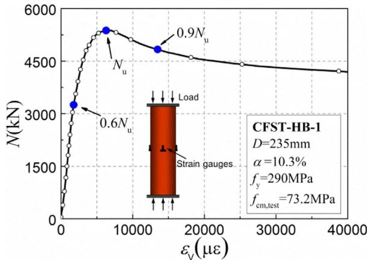  
Fig. 4. Axial load versus axial strain response for CFST-HB-1.

which promotes the transfer from macro-cracks to micro-crack in the fracture zone.

# 3.2. Load–deformation relationship curves

Fig. 8 shows the load (N) versus the axial strain $\left( \varepsilon _ { \mathbf { v } } \right)$ curves of all specimens. The three curves with the same parameters in each group were close, which indicated the accuracy of the test data. The average of the curves was also plotted in the figure, which was shown by the solid line. The descending branches of the curves were relatively steep because the concrete used in the test was high-strength concrete. The curves were affected by the specimen size. For the specimens with a steel ratio of $4 . 1 \%$ (Fig. 8(a)), the descending branch of the CFST-LA was pretty smooth. Meanwhile, the brittleness of the concrete core in steel tube became more obvious with the increase of size. Therefore, the descending branch of the CFST-LD became steeper. The comparison of the three figures in Fig. 8 showed that the steel ratio also affected the curves. The confinement became stronger as the steel ratio increased, and the descending branch became smoother. The composite elastic modulus, peak axial stress, peak axial strain, and ductility coefficient can be obtained by analyzing the load versus the axial strain curves of the specimens. Table 4 presents the details of the test results.

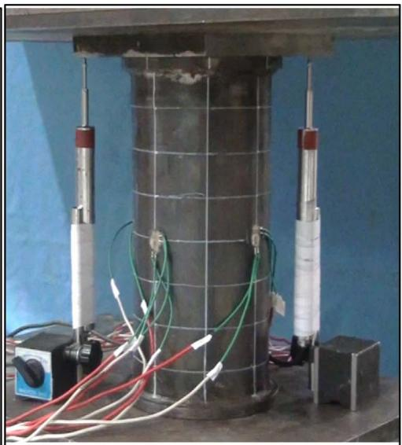  
Fig. 3. Testing machine and instruments. Two LVDTs were used to monitor the specimen deformation. Eight strain gauges were symmetrically placed on the surface of the steel tube at the mid-height of the specimen to monitor the longitudinal and transverse strain.

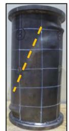  
(a)

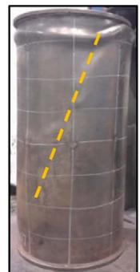

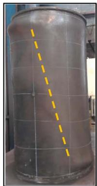  
  
Fig. 5. Failure mode of specimens with a steel ratio of $4 . 1 \% \cdot$ (a) CFST-LA; (b) CFST-LB; (c) CFST-LC; and (d) CFST-LD. The inclined angles of the shear planes almost did not change as the diameter increased.

# 3.3. Composite elastic modulus

In the elastic stage, the stress of the CFST short columns under axial compression is proportional to the strain. The proportional coefficient is called the composite elastic modulus and is defined as $\begin{array} { r } { E _ { \mathrm { s c } } = N / [ ( A _ { \mathrm { s } } + A _ { \mathrm { c } } ) \varepsilon _ { \nu } ] , } \end{array}$ where $N$ and $\varepsilon _ { \nu }$ are the load and the longitudinal strain of the specimens, respectively. Fig. 9 depicts the influence of the diameters and the steel ratios on the composite elastic modulus of the CFST short columns in the test. The composite elastic modulus for the specimens with a steel ratio of $4 . 1 \%$ was 41.5 GPa, 39.9 GPa, 42.7 GPa, and 42.9 GPa when the diameter of the specimens varied from $1 5 0 \mathrm { m m }$ to $4 6 0 \mathrm { m m }$ , which means the composite elastic modulus was almost not influenced by the diameter of the specimen. Similarly, the size effect of the composite elastic modulus was also not observed in the specimens with the steel ratios of $6 . 6 \%$ and $1 0 . 3 \%$ . This conclusion may be explained by that the composite elastic modulus is the property of the specimens in the elastic stage, which is not affected by the concrete core fracture, while the size effect is related to the concrete core fracture. The mean composite elastic modulus of the specimens with steel ratios of $4 . 1 \%$ , $6 . 6 \%$ , and $1 0 . 3 \%$ was 41.8 GPa, 46.0 GPa, and $5 0 . 5 \mathsf { G P a }$ , respectively. These values indicate that the increase of the steel ratio promotes the increase of the composite elastic modulus.

# 3.4. Peak axial stress

The peak axial stress of the CFST columns under axial compression reflects the compressive strength of the component defined by Eq. (2). Fig. 10 shows the influence of the steel ratio $\alpha$ on the peak axial stress of the specimens with a diameter of $1 5 0 \mathrm { m m }$ . The mean values of the peak axial stress for the specimens with steel ratios of $4 . 1 \%$ , $6 . 6 \%$ , and $1 0 . 3 \%$ were $1 0 0 . 2 \mathrm { M P a }$ , $1 0 7 . 7 \mathrm { M P a }$ , and $1 2 1 . 8 \mathrm { M P a }$ , respectively. The peak axial stress exhibited an increasing trend with the increase of the steel ratio. This is because thick steel tubes can obviously bear more loads

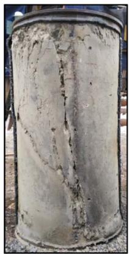  
(a)

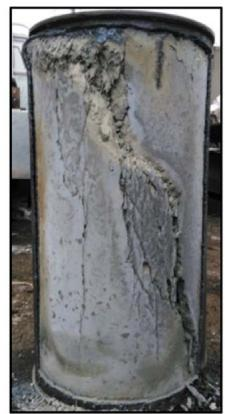

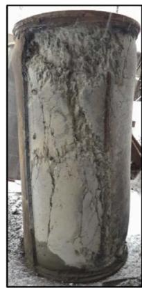  
  
Fig. 7. Influence of the steel ratio on the failure mode: (a) CFST-LD; (b) CFST-MD; and (c) CFST-HD. With an increase of the steel ratio, the confinement effect of the steel tube gets stronger, which promotes the transfer from macro-cracks to micro-crack in the fracture zone.

and provide a higher confining pressure to confine the concrete cores. The test results are in accordance with the current codes.

$$
\sigma_ {\mathrm {u}} = N _ {\mathrm {u}} / \left(A _ {\mathrm {s}} + A _ {\mathrm {c}}\right) \tag {2}
$$

where $\sigma _ { \mathrm { u } }$ is the peak axial stress; $N _ { \mathbf { u } }$ is the load-carrying capacity of the CFST short column.

Fig. 11 shows the influence of the diameter on the peak axial stress of the specimens with the steel ratio varying from $4 . 1 \%$ to $1 0 . 3 \%$ , where γ is the ratio of the peak axial stress between the specimens and standard CFST specimens (the diameter of core concrete $d = 1 5 0 \mathrm { m m } )$ ; and $\gamma _ { \mathbf { u } }$ is strength reduction coefficient of concrete, representing the ratio of the compressive strength between the concrete column with a

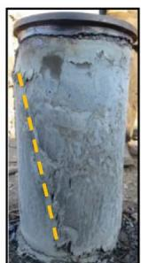

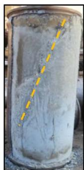

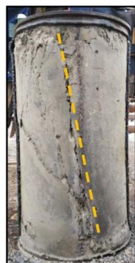  
  
Fig. 6. Damage of concrete core in CFST specimens: (a) CFST-LA; (b) CFST-LB; (c) CFST-LC; and (d) CFST-LD. Compared with the steel tube, the shear plane of the concrete core was clearly visible.

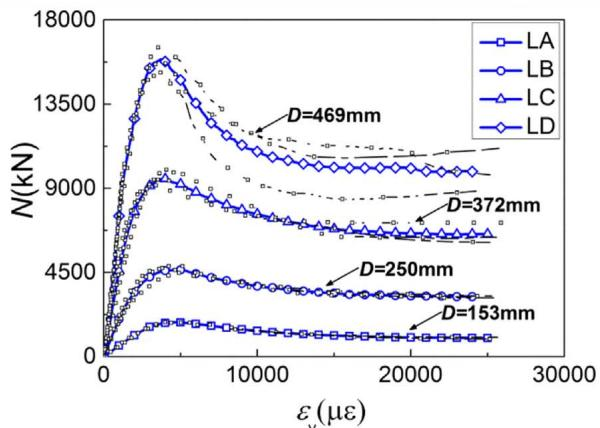  
（a) $\dot { \alpha } = 4 . 1 \%$

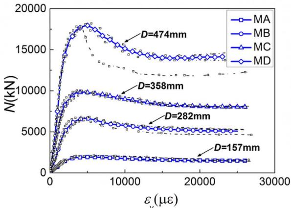  
(b)α=6.6%

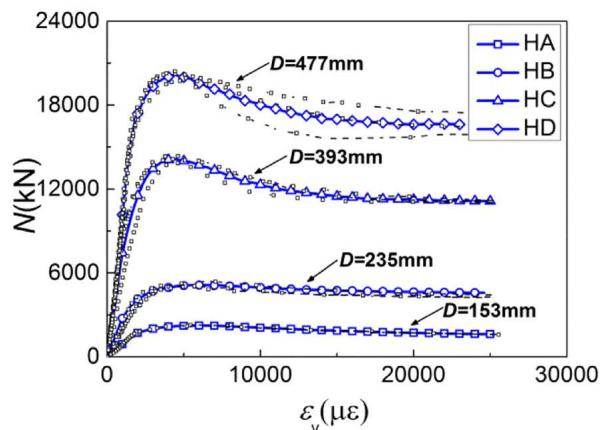  
（c） $\alpha = 1 0 . 3 \%$   
Fig. 8. Load versus axial strain curve. The curves were influenced by specimen size, the confinement became stronger as the steel ratio increased, and the descending branch became smoother.

diameter of $d$ and the standard specimen $\dot { \boldsymbol { d } } = 1 5 0 \mathrm { m m }$ ). The reference line in the figures represents the peak axial stress of the standard CFST specimen, while the regression line depicts the trend of the test data. For the specimens with a steel ratio of $4 . 1 \%$ , the mean values of the peak axial stress corresponding to the four different diameters were 100.2 MPa, 96.0 MPa, 88.1 MPa, and $9 2 . 0 \mathrm { M P a }$ . The peak axial stress of the specimens with the same steel ratio showed a decreasing trend with the increase of diameter. Similarly, the specimens with steel ratios of $6 . 6 \%$ and $1 0 . 3 \%$ exhibited the same trend. The peak axial stress of the specimens with steel ratios of $4 . 1 \%$ , $6 . 6 \%$ , and $1 0 . 3 \%$ had reductions of $9 . 7 \%$ , $6 . 8 \%$ , and $6 . 2 \%$ , respectively, when the diameter varied from 150 mm to 460 mm. This result proved that the size effect on peak axial stress existed in the tested specimens. Meanwhile, the size effect of the peak axial stress was affected to a certain extent by the steel ratio: the magnitude of the size effect decreased with an increase of the steel ratio. The size effect of unconfined concrete is also plotted in Fig. 11. It can be seen that the CFST specimens showed less size effect when compared with the unconfined concrete columns proposed by Sakino. This is because the confining pressure from steel tube can inhibit the development of macro-crack and reduce the size effect of concrete core. With the increase of steel ratio, the difference in size effect between CFST and unconfined concrete became more significant. Therefore, the size effect of unconfined concrete cannot be used directly when predicting the size effect of CFST columns. The influence of steel ratio on size effect of concrete core should be considered.

# 3.5. Peak axial strain

The peak axial strain $\varepsilon _ { \mathrm { u } }$ is defined as the strain value corresponding

to the peak axial stress. Fig. 12 shows the influence of the diameter on the peak axial strain of the specimens with the steel ratio varying from $4 . 1 \%$ to $1 0 . 3 \%$ . For the specimens with the steel ratio of $4 . 1 \%$ , the mean values of the peak axial strain corresponding to the four different diameters were 4806 με, 4566 με, 3873 με, and $3 7 4 8 ~ \mu \varepsilon$ . The peak axial strain of the specimens with the same steel ratio showed a decreasing trend with the increase in the diameter. Similarly, the specimens with steel ratios of $6 . 6 \%$ and $1 0 . 3 \%$ showed the same trend. The concrete failure is caused by a local fracture. The ratio of the height between the fracture zone and the specimen decreases with the increase in the diameter. In addition, the efficiency of confining pressure decreases when the diameter increases. These two reasons may lead to the size effect of the peak axial strain. The peak axial strain of the specimens with steel ratios of $4 . 1 \%$ , $6 . 6 \%$ , and $1 0 . 3 \%$ reduced by $2 3 . 3 \%$ , $2 8 . 1 \%$ , and $2 5 . 1 \%$ , respectively, when the diameter varied from $1 5 0 \mathrm { m m }$ to $4 6 0 \ \mathrm { m m }$ . The size effect of the peak axial strain was much more obvious than that of the peak axial stress. However, the influence of the steel ratio on the size effect of the peak axial strain was not obvious.

# 3.6. Ductility coefficient

The ductility coefficient $\delta$ in this paper is calculated as the ratio between the strain at $0 . 8 5 N _ { \mathrm { u } }$ $N _ { \mathrm { u } }$ in the descending stage of load versus the strain curves and the peak axial strain $\varepsilon _ { \mathrm { { u } } }$ , which is shown by Eq. (3):

$$
\delta = \varepsilon_ {0. 8 5} / \varepsilon_ {u} \tag {3}
$$

Fig. 13 illustrates the influence of the diameter on the ductility coefficient of the specimens with the steel ratio varying from $4 . 1 \%$ to $1 0 . 3 \%$ . The ductility coefficients for the specimens with a steel ratio of

Table 4 Results of the test data.   

<table><tr><td>α</td><td>Group</td><td>Specimen labels</td><td>Es(×103MPa)</td><td>Nu(kN)</td><td>σu(MPa)</td><td>εu(με)</td><td>ε0.85(με)</td><td>δ</td></tr><tr><td rowspan="12">4.1%</td><td rowspan="3">1</td><td>CFST-LA-1</td><td>43.0</td><td>1823</td><td>99.0</td><td>4987</td><td>8325</td><td>1.67</td></tr><tr><td>CFST-LA-2</td><td>41.5</td><td>1842</td><td>100.2</td><td>4640</td><td>7730</td><td>1.67</td></tr><tr><td>CFST-LA-3</td><td>39.9</td><td>1872</td><td>101.5</td><td>4793</td><td>7112</td><td>1.48</td></tr><tr><td rowspan="3">2</td><td>CFST-LB-1</td><td>37.4</td><td>4871</td><td>99.3</td><td>4881</td><td>8322</td><td>1.70</td></tr><tr><td>CFST-LB-2</td><td>38.5</td><td>4528</td><td>92.3</td><td>4705</td><td>9447</td><td>2.01</td></tr><tr><td>CFST-LB-3</td><td>43.9</td><td>4733</td><td>96.5</td><td>4112</td><td>8275</td><td>2.01</td></tr><tr><td rowspan="3">3</td><td>CFST-LC-1</td><td>42.4</td><td>9163</td><td>94.1</td><td>3638</td><td>8234</td><td>2.26</td></tr><tr><td>CFST-LC-2</td><td>43.9</td><td>9996</td><td>91.9</td><td>4076</td><td>8500</td><td>2.09</td></tr><tr><td>CFST-LC-3</td><td>41.7</td><td>9604</td><td>88.3</td><td>3905</td><td>7099</td><td>1.82</td></tr><tr><td rowspan="3">4</td><td>CFST-LD-1</td><td>43.9</td><td>15,827</td><td>91.5</td><td>3721</td><td>6312</td><td>1.70</td></tr><tr><td>CFST-LD-2</td><td>42.2</td><td>16,670</td><td>96.4</td><td>3717</td><td>6529</td><td>1.76</td></tr><tr><td>CFST-LD-3</td><td>42.7</td><td>15,239</td><td>88.1</td><td>3808</td><td>5571</td><td>1.46</td></tr><tr><td rowspan="12">6.6%</td><td rowspan="3">5</td><td>CFST-MA-1</td><td>43.8</td><td>2117</td><td>109.4</td><td>5856</td><td>15,964</td><td>2.73</td></tr><tr><td>CFST-MA-2</td><td>39.5</td><td>2058</td><td>106.6</td><td>5312</td><td>14,013</td><td>2.64</td></tr><tr><td>CFST-MA-3</td><td>49.9</td><td>2068</td><td>107.1</td><td>5760</td><td>16,125</td><td>2.80</td></tr><tr><td rowspan="3">6</td><td>CFST-MB-1</td><td>43.8</td><td>6811</td><td>109.5</td><td>5259</td><td>11,543</td><td>2.19</td></tr><tr><td>CFST-MB-2</td><td>47.0</td><td>6380</td><td>102.6</td><td>4639</td><td>10,730</td><td>2.31</td></tr><tr><td>CFST-MB-3</td><td>46.8</td><td>6860</td><td>110.3</td><td>4411</td><td>11,419</td><td>2.59</td></tr><tr><td rowspan="3">7</td><td>CFST-MC-1</td><td>46.8</td><td>9947</td><td>98.6</td><td>4160</td><td>11,005</td><td>2.65</td></tr><tr><td>CFST-MC-2</td><td>44.1</td><td>10,045</td><td>99.6</td><td>3895</td><td>10,815</td><td>2.78</td></tr><tr><td>CFST-MC-3</td><td>48.8</td><td>9609</td><td>95.2</td><td>4394</td><td>10,635</td><td>2.42</td></tr><tr><td rowspan="3">8</td><td>CFST-MD-1</td><td>49.2</td><td>17,787</td><td>101.0</td><td>4232</td><td>8313</td><td>2.44</td></tr><tr><td>CFST-MD-2</td><td>46.7</td><td>18,306</td><td>104.0</td><td>4179</td><td>10,008</td><td>2.16</td></tr><tr><td>CFST-MD-3</td><td>45.0</td><td>17,885</td><td>101.6</td><td>3966</td><td>8800</td><td>2.22</td></tr><tr><td rowspan="12">10.3%</td><td rowspan="3">9</td><td>CFST-HA-1</td><td>49.3</td><td>2264</td><td>122.9</td><td>5784</td><td>15,785</td><td>2.73</td></tr><tr><td>CFST-HA-2</td><td>49.2</td><td>2274</td><td>123.3</td><td>6048</td><td>17,506</td><td>2.89</td></tr><tr><td>CFST-HA-3</td><td>52.5</td><td>2205</td><td>119.3</td><td>5886</td><td>16,012</td><td>2.22</td></tr><tr><td rowspan="3">10</td><td>CFST-HB-1</td><td>50.0</td><td>5390</td><td>124.0</td><td>6131</td><td>18,763</td><td>3.06</td></tr><tr><td>CFST-HB-2</td><td>45.4</td><td>5047</td><td>116.1</td><td>5690</td><td>17,341</td><td>3.05</td></tr><tr><td>CFST-HB-3</td><td>55.1</td><td>5096</td><td>117.3</td><td>5641</td><td>18,815</td><td>3.34</td></tr><tr><td rowspan="3">11</td><td>CFST-HC-1</td><td>45.7</td><td>13,936</td><td>115.1</td><td>4464</td><td>12,016</td><td>2.69</td></tr><tr><td>CFST-HC-2</td><td>54.3</td><td>14,406</td><td>118.9</td><td>4310</td><td>11,241</td><td>2.61</td></tr><tr><td>CFST-HC-3</td><td>55.0</td><td>14,161</td><td>116.9</td><td>4773</td><td>12,438</td><td>2.61</td></tr><tr><td rowspan="3">12</td><td>CFST-HD-1</td><td>50.2</td><td>20,237</td><td>113.4</td><td>4966</td><td>13,907</td><td>2.80</td></tr><tr><td>CFST-HD-2</td><td>46.9</td><td>20,462</td><td>114.7</td><td>4264</td><td>11,395</td><td>2.67</td></tr><tr><td>CFST-HD-3</td><td>52.8</td><td>19,854</td><td>111.2</td><td>4534</td><td>13,403</td><td>2.96</td></tr></table>

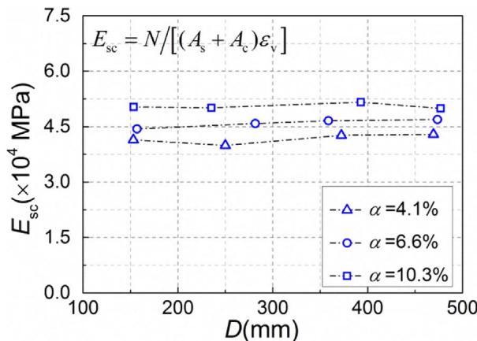  
Fig. 9. Size effect on the composite elastic modulus. The composite elastic modulus was almost not influenced by the diameter of the specimen.

$4 . 1 \%$ were 1.61, 1.91, 2.06, and 1.64 when the diameter of the specimens varied from $1 5 0 \mathrm { m m }$ to $4 6 0 \mathrm { m m }$ . The influence of diameter on the development law of ductility coefficient was not obvious. However, for the specimens with steel ratios of $6 . 6 \%$ and $1 0 . 3 \%$ , the values of ductility coefficient presented a slight decreasing trend as the diameter increased. Considering that the ductility coefficient is sensitive to the variation of strain, the scatter of data is relatively large, which may affect the observation of the size effect. Therefore, it is difficult to determine the size effect of ductility coefficient simply by observation and further analysis is needed. The mean values of the ductility coefficients for the specimens with steel ratios of $4 . 1 \%$ , $6 . 6 \%$ , and $1 0 . 3 \%$ were 1.80, 2.49, and 2.84, respectively. These results indicated that the increase of

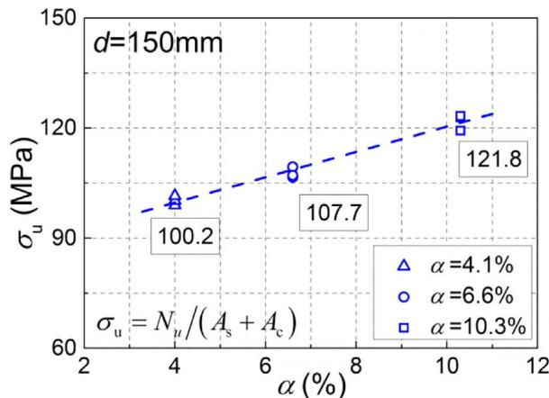  
Fig. 10. Influence of the steel ratio on the peak axial stress. The peak axial stress exhibited an increasing trend with the increase of the steel ratio.

the steel ratio promoted the increase of the ductility coefficient.

# 3.7. Statistical analysis

The size effect was analyzed in previous part of the paper by observation and comparison. It is difficult to obtain a definitive conclusion when the scatter of data is large, especially for the parameters which are sensitive to the strain measurement. To further study the test data of specimens, the two-way analysis of variance (ANOVA) [27] was adopted here to analyze the size effect of the composite elastic modulus, peak axial stress, peak axial strain, and ductility coefficient. The

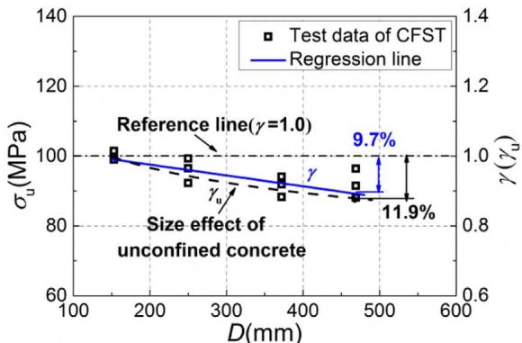  
(a) $\alpha { = } 4 . 1 \%$

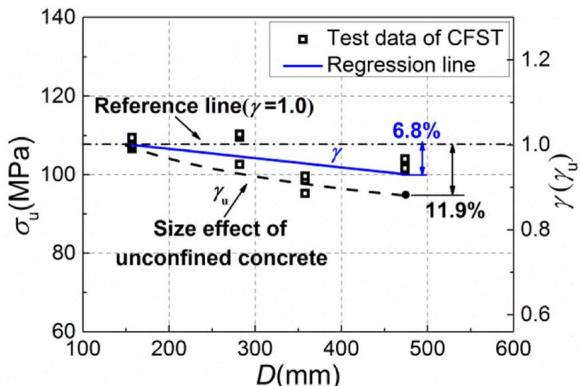  
(b) $\alpha { = } 6 . 6 \%$

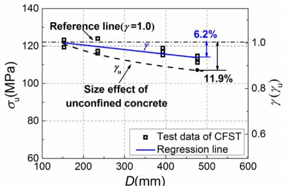  
（C $\alpha { = } 1 0 . 3 \%$

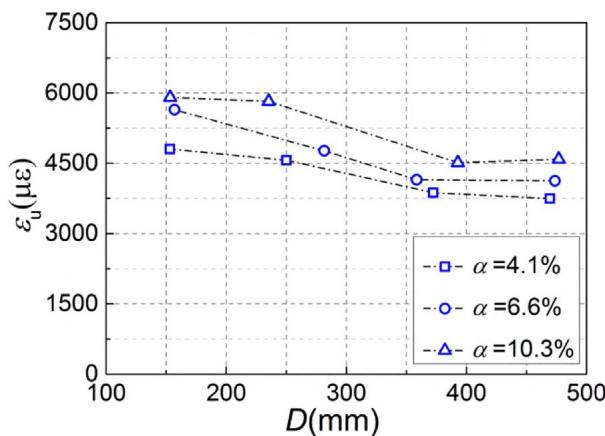  
Fig. 11. Size effect on the peak axial stress. The peak axial stress of the specimens with steel ratios of $4 . 1 \%$ , $6 . 6 \%$ , and $1 0 . 3 \%$ had reductions of $9 . 7 \%$ , $6 . 8 \%$ , and $6 . 2 \%$ , respectively, when the diameter varied from $1 5 0 \mathrm { m m }$ to $4 6 0 \ \mathrm { m m }$ . The CFST specimens showed less size effect when compared with the unconfined concrete columns proposed by Sakino.   
Fig. 12. Size effect on the peak axial strain. Increase of specimen size results in a decrease of peak axial strain.

method can be used to determine whether or not the size effect exists in aspect of statistical analysis, and it includes two following factors: a and b. Factor a represents the diameter, which includes four levels due to four different sizes for the specimens with the same steel ratio. Factor b represents the steel ratio, which includes three levels owing to three steel ratios used in the test. Each group includes three identical specimens. Hence, the repeat number is three.

Table 5 shows the effect of the diameter and the steel ratio on the variation of the composite elastic modulus, peak axial stress, peak axial strain, and ductility coefficient. F is the statistical value of the test data, while [F] is the critical value in the ANOVA analysis. The effect of the factor (a or b) is significant if the corresponding F is larger than [F]; otherwise, the effect is insignificant. The analysis showed that the influence of diameter on the peak axial stress and the peak axial strain

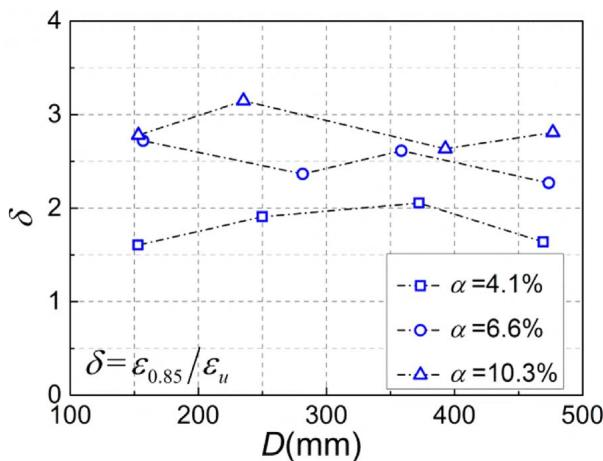  
Fig. 13. Size effect on the ductility coefficient. For specimens with steel ratios of $6 . 6 \%$ and $1 0 . 3 \%$ , the ductility coefficients showed a slight decreasing trend, while that was not observed for specimens with steel ratio of $4 . 1 \%$ due to the influence of data scatter.

were significant, while that on the composite elastic modulus was insignificant. In other words, the size effect on the peak axial stress and peak axial strain exists, but does not exist on the composite elastic modulus. The statistical results coincided with the conclusions obtained from Figs. 9, 11, and 12. The statistical value, F, corresponding to the effect of the diameter on the ductility coefficient was 5.12 (Table 5), which was larger than the critical value of 3.01. The results showed that the diameter had a significant effect on ductility coefficient. In other words, the size effect on ductility coefficient exists. For the specimens with the steel ratios of $6 . 6 \%$ and $1 0 . 3 \%$ , the values of ductility presented a slight decreasing trend with the increase of diameters, and the test results agreed with the statistical results shown in Table 5.

Table 5 Statistical results of the test data.   

<table><tr><td></td><td>Source</td><td>Sum of squares</td><td>Degree freedom</td><td>Mean square</td><td>F</td><td>[F]</td><td>Significant</td></tr><tr><td rowspan="4">Esc</td><td>Diameter</td><td>19.52</td><td>3</td><td>6.51</td><td>1.65</td><td>3.01</td><td>No</td></tr><tr><td>Steel ratio</td><td>463.13</td><td>2</td><td>231.57</td><td>24.14</td><td>3.40</td><td>Yes</td></tr><tr><td>Interaction</td><td>14.42</td><td>6</td><td>2.40</td><td>1.24</td><td>2.51</td><td>No</td></tr><tr><td>Error</td><td>239.09</td><td>24</td><td>9.96</td><td></td><td></td><td></td></tr><tr><td rowspan="4">σu</td><td>Diameter</td><td>478.91</td><td>3</td><td>159.64</td><td>19.51</td><td>3.01</td><td>Yes</td></tr><tr><td>Steel ratio</td><td>3393.40</td><td>2</td><td>1696.7</td><td>197.23</td><td>3.40</td><td>Yes</td></tr><tr><td>Interaction</td><td>88.23</td><td>6</td><td>14.71</td><td>2.72</td><td>2.51</td><td>Yes</td></tr><tr><td>Error</td><td>207.52</td><td>24</td><td>8.65</td><td></td><td></td><td></td></tr><tr><td rowspan="4">εu</td><td>Diameter</td><td>1.13 × 107</td><td>3</td><td>3.77 × 106</td><td>52.78</td><td>3.01</td><td>Yes</td></tr><tr><td>Steel ratio</td><td>5.54 × 106</td><td>2</td><td>2.77 × 106</td><td>39.03</td><td>3.40</td><td>Yes</td></tr><tr><td>Interaction</td><td>8.38 × 105</td><td>6</td><td>1.40 × 105</td><td>2.92</td><td>2.51</td><td>Yes</td></tr><tr><td>Error</td><td>1.75 × 106</td><td>24</td><td>7.29 × 104</td><td></td><td></td><td></td></tr><tr><td rowspan="4">δ</td><td>Diameter</td><td>0.29</td><td>3</td><td>0.097</td><td>5.12</td><td>3.01</td><td>Yes</td></tr><tr><td>Steel ratio</td><td>6.74</td><td>2</td><td>3.37</td><td>146.96</td><td>3.40</td><td>Yes</td></tr><tr><td>Interaction</td><td>0.96</td><td>6</td><td>0.16</td><td>7.91</td><td>2.51</td><td>Yes</td></tr><tr><td>Error</td><td>0.55</td><td>24</td><td>0.023</td><td></td><td></td><td></td></tr></table>

However, the size effect of the ductility coefficient of the specimens with the steel ratio of $4 . 1 \%$ was not observed. This is because the confinement of the specimens is weak and the scatter of the strain is large, which may cover the size effect on ductility coefficient.

The effect of the steel ratio on the variation of the composite elastic modulus, peak axial stress, peak axial strain, and ductility coefficient was significant (Table 5). The interaction in the ANOVA method shows the influence of the steel ratio on the size effect of the specimen. It is concluded based on the ANOVA method that the influence of steel ratio

on size effect of the peak axial stress and the peak axial strain cannot be neglected (Table 5). An analysis of the test data in Fig. 11 demonstrated that the size effect of the peak axial stress decreased when the steel ratio increased. The conclusion coincided with the data shown in Table 5. However, the magnitude of size effect on peak axial strain were $2 3 . 3 \%$ , $2 8 . 1 \%$ , $2 5 . 1 \%$ for the specimens with the three steel ratios when diameter d varied from $1 5 0 \mathrm { m m }$ to $4 6 0 \mathrm { m m }$ . The influence of the steel ratio on the size effect of the peak axial strain had no monotonically increasing or decreasing trend, thereby differing from the data in Table 5. This finding may be related to the scatter of strain measurement. Similarly, the ductility coefficient was also sensitive to the scatter of strain. Further study in the aspect of theory and test may be necessary to answer whether or not the steel ratio influences the size effect on the peak axial strain and ductility coefficient.

# 4. Comparison with current codes

Currently, a number of codes are available for determining the axial strength of CFST short columns. To assess the predicting accuracy of the codes for different sizes of specimens, four design codes, namely, EC4 (EN 1994-1-1) [11], AIJ (AIJ2008) [12], AISC (AISC 360-10) [13], and GB (GB50936-2013) [14], are adopted for a comparison with the test results. Fig. 14 shows the influence of the diameter on the ratio between the load-carrying capacity calculated by the codes and that obtained from the tests. The concrete strength and the yield strength of the steel used in the formulas are the tested values, given in Tables 2 and 3. Fig. 14 illustrates that the ratio presents an increasing trend as the diameter increases, which is because the codes have not considered the size effect of the load-carrying capacity of the CFST short columns. It seems that both EC4 and GB50936 make a closer estimation for the test columns. As the ratio between the load-carrying capacity calculated by the codes and that obtained from the test shows an increasing trend as

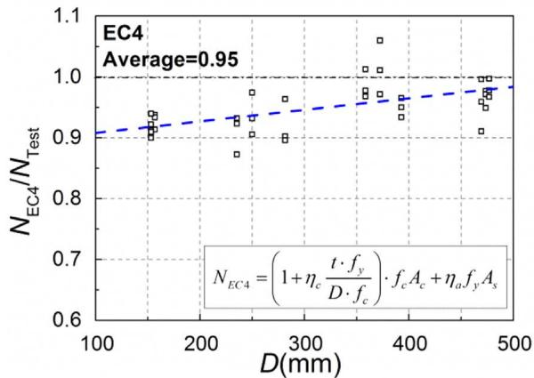

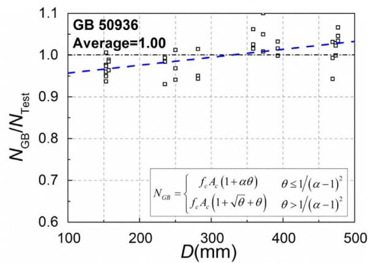

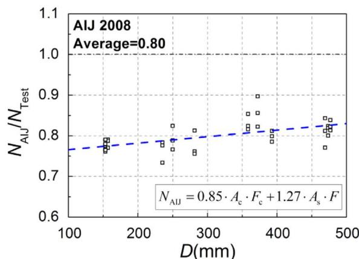

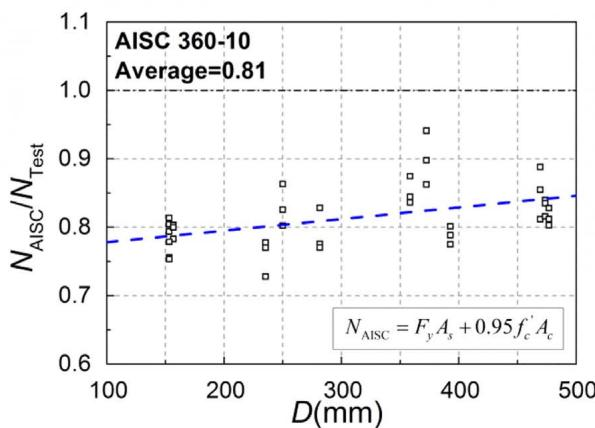  
Fig. 14. Ratio of calculation over tested load-carrying capacity of the 36 CFST short columns. The ratio presents an increasing trend as the diameter increases, which is because the codes have not considered the size effect of the load-carrying capacity of the CFST short columns.

the diameter increases, the two codes may probably overestimate the load-carrying capacity of the CFST short columns under axial compression when the diameter is large enough. For the codes of AIJ and AISC, the ratios are less than 1.0 in the focused size range of the test showing enough reliability in predicting the load-carrying capacity. However, this reliability keeps decreasing with the increase of diameter owing to ignoring the size effect in the codes.

To consider the size effect in CFST columns, a strength reduction coefficient of concrete $\gamma _ { \mathrm { { u } } }$ is proposed. The coefficient $\gamma _ { \mathrm { { u } } }$ is defined as the ratio of the compressive strengths between the concrete core with a diameter of d and the standard specimen $( d \ = \ 1 5 0 \mathrm { m m } )$ . For unconfined concrete, Sakino [8] has proposed a function to describe the influence of size on compressive strength, shown in Eq. (4). For CFST columns, according to our study, size effect is related to not only the diameter but also the steel ratio α. Thus, a modified expression introducing the steel ratio is proposed on the basis of Sakino's equation, shown in Eq. (5). To keep consistency between CFST and unconfined concrete, the expression is set to be the same to Eq. (4) when the steel ratio is equal to zero.

$$
\gamma_ {\mathrm {u}} = 1. 7 5 d ^ {- 0. 1 1 2} = \left(\frac {d}{1 5 0}\right) ^ {- 0. 1 1 2} \tag {4}
$$

$$
\gamma_ {\mathrm {u}} = \left(\frac {d}{1 5 0}\right) ^ {- 0. 1 1 2 (1 6 0 0 ^ {- \alpha})} \tag {5}
$$

The size effect can be considered by simply using $\gamma _ { \mathrm { { u } } f _ { \mathrm { { c } } } }$ instead of $f _ { \mathrm { c } }$ for the prediction of compressive strength when design with current codes. Take EC4 as an example, the original formula (Eq. (6)) can be modified by Eq. (7) in which the size effect has been accounted for via the coefficient of $\gamma _ { \mathrm { { u } } }$ . Similarly, the rest three codes can be modified using this method. Fig. 15 shows the comparison of test data with modified prediction. It can be seen that the increasing trend of the ratio between the calculation and test results almost disappears after

  
Fig. 16. Size effect of concrete core and unconfined concrete. When diameter varies from 150 to $9 0 0 \mathrm { m m }$ , the compressive strength of unconfined concrete reduces by $1 8 . 3 \%$ , whereas the confined concrete reduces by $1 3 . 9 \%$ , $1 1 . 3 \%$ and $9 . 1 \% ,$ respectively, for the steel ratio of $4 \%$ , $7 \%$ and $1 0 \%$ .

introducing $\gamma _ { \mathrm { { u } } }$ . This means that the size effect of CFST specimens can be well predicted.

$$
N _ {\mathrm {E C} 4} = \left(1 + \eta_ {c} \frac {t \cdot f _ {y}}{D \cdot f _ {c}}\right) \cdot f _ {c} A _ {c} + \eta_ {a} f _ {y} A _ {s} \tag {6}
$$

$$
N _ {E C 4, \text {m o d i f i e d}} = \left(1 + \eta_ {c} \frac {t \cdot f _ {y}}{D \cdot \left(\gamma_ {u} f _ {c}\right)}\right) \cdot \left(\gamma_ {u} f _ {c}\right) A _ {c} + \eta_ {a} f _ {y} A _ {s} \tag {7}
$$

Fig. 16 shows a comparison of the size effect between unconfined concrete and concrete core. The reduction due to size effects is calculated by Eqs. (4) and (5), respectively. The figure shows when diameters

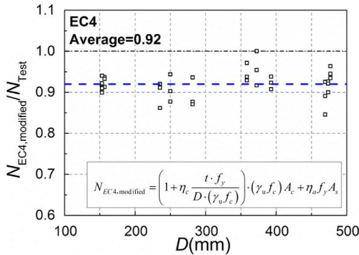

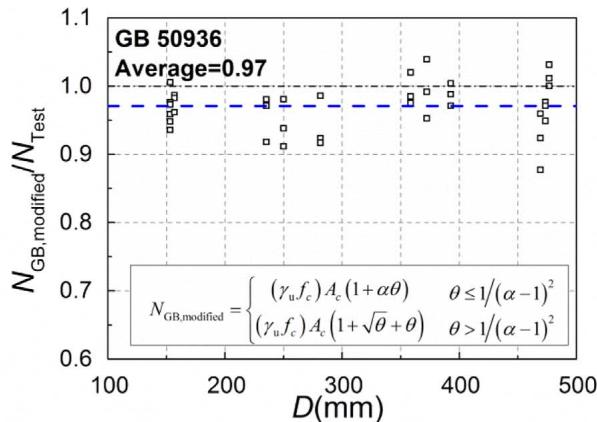

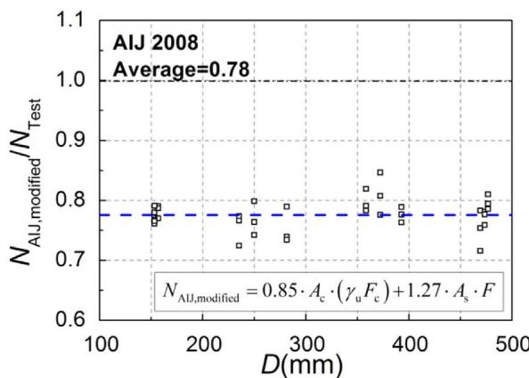

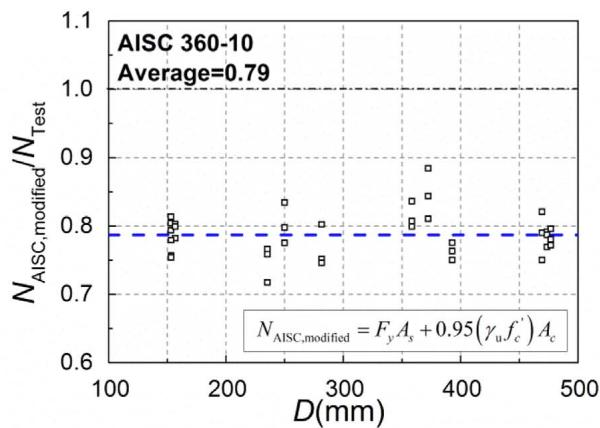  
Fig. 15. Ratio of calculation over tested load-carrying capacity after modification. The increasing trend of the ratio almost disappears after introducing $\gamma _ { \mathrm { { u } } } ,$ and the size effect of CFST specimens can be well predicted.

varying from 150 to $9 0 0 \mathrm { m m }$ , the compressive strength of unconfined concrete reduces by $1 8 . 3 \%$ , whereas the latter reduces by $1 3 . 9 \%$ , $1 1 . 3 \%$ and $9 . 1 \%$ , respectively for the steel ratio of $4 \%$ , $7 \%$ and $1 0 \%$ . This gap between unconfined concrete and concrete core of CFST keeps increasing with the increase of steel ratio.

# 5. Conclusions

A total of 36 short columns with different diameters and steel ratios were tested until failure to investigate the size effect behavior of circular CFST short columns under axial compression. The size effect on peak axial stress, peak axial strain, composite elastic modulus, and ductility coefficient was also studied herein. The following conclusions can be drawn:

Size effect exists in CFST columns with low steel ratios. For the specimen with the steel ratio in the range of $4 . 1 \substack { - 1 0 . 3 \% }$ , the peak axial stress decreases by $6 . 2 \substack { - 9 . 7 \% }$ when the diameter varies from $1 5 0 \mathrm { m m }$ to 460 mm. In addition to diameter, the steel ratio also exhibits the influence on size effect. The peak axial stress has a reduction of $6 . 2 \%$ , $6 . 8 \%$ and $9 . 7 \%$ for the specimen with the steel ratio of $4 . 1 \%$ , $6 . 6 \%$ and $1 0 . 3 \%$ , respectively. Size effect also exists in peak axial strain and ductility coefficient of CFST columns.

Size effect in CFST columns has not been considered in current codes. This leads to non-uniformed reliability between the predictions of small size columns and large size columns. Especially for large size or mega CFST columns, there is a risk of overestimation for the compressive strength. Size effect of CFST columns can be well predicted by current codes after introducing the coefficient $\gamma _ { \mathrm { { u } } }$ which has been proposed in this paper.

# Acknowledgements

The research work reported in this paper was supported by the National Natural Science Foundation of China (No. 51378152). The financial support is highly appreciated.

# References

[1] C.Y. Liu, Y.Y. Wang, X.R. Wu, Seismic performance and collapse prevention of concrete-filled thin-walled steel tubular arches, Thin-Walled Struct. 80 (2014) 91–102.   
[2] X.R. Wu, C.Y. Liu, W. Wang, Y.Y. Wang, In-plane strength and design of fixed concrete-filled steel tubular parabolic arches, J. Bridge Eng. (ASCE) 20 (12) (2015) 04015016.   
[3] Y. Geng, Time-Dependent Behavior of Large Span Concrete-filled Steel Tubular Arch Bridges, Harbin Institute of Technology, China, 2011, pp. 167–182.

[4] H. Zhao, Q. Lei, S.L. Hou, H. Lin, Engineering application of 8 concrete columns mega frame-core wall system in Guangzhou East Tower, Build. Struct. 42 (10) (2012) 1–6 (in Chinese).   
[5] H.F. Gonnerman, Effects of size and shape of test specimen on compressive strength of concrete, Proc. ASTM, 1925.   
[6] R.F. Blanks, C.C. McNamara, Mass concrete tests in large cylinders, Acids J. 30 (1935) 280–303.   
[7] M.A. Mansur, M.M. Islam, Interpretation of concrete strength for non-standard specimens, J. Mater. Civ. Eng. (ASCE) 14 (2002) 151–155.   
[8] S.T. Yi, E.I. Yang, J.C. Choi, Effect of specimen sizes, specimen shapes, and placement directions on compressive strength of concrete, Nucl. Eng. Des. 236 (2) (2006) 115–127.   
[9] J.R. Viso, J.R. Carmona, G. Ruiz, Shape and size effect on the compressive strength of high-strength concrete, Cem. Concr. Res. 38 (2007) 386–395.   
[10] K. Sakino, H. Nakahara, S. Morino, I. Nishiyama, Behavior of centrally loaded concrete-filled steel-tube short columns, J. Struct. Eng. (ASCE) 130 (2004) 180–188.   
[11] European Committee for Standardization (CEN), Design of Composite Steel and Concrete Structures, Part 1-1: General Rules and Rules for Buildings, EN 1994-1-1 Eurocode 4 Brussels, 2004.   
[12] Architectural Institute of Japan (AIJ), Recommendations for Design and Construction of Concrete Filled Steel Tubular Structures, Tokyo, 2008.   
[13] American Institute of Steel Construction (AISC), Specification for Structural Steel Buildings, AISC 360-10 Chicago (IL), 2010.   
[14] Ministry of Housing and Urban–Rural Development of the People’s Republic of China (MOHURD), GB50936-2014: Code for Design of Concrete Filled Steel Tubular Structures, China Architecture and Building Press Beijing, 2014.   
[15] G. Giakoumelis, D. Lam, Axial capacity of circular concrete-filled tube columns, J. Constr. Steel Res. 60 (7) (2004) 1049–1068.   
[16] G.D. Hatzigeorgiou, Numerical model for the behavior and capacity of circular CFT columns, part 1: theory, Eng. Struct. 30 (6) (2008) 1573–1578.   
[17] Z.H. Lu, Y.G. Zhao, Suggested empirical models for the axial capacity of circular CFT stub columns, J. Constr. Steel Res. 66 (6) (2010) 850–862.   
[18] L.H. Han, Y.F. An, Performance of concrete-encased CFST short columns under axial compression, J. Constr. Steel Res. 93 (2014) 62–76.   
[19] L.H. Han, W. Li, R. Bjorhovde, Developments and advanced applications of concrete-filled steel tubular (CFST) structures: members, J. Constr. Steel Res. 100 (2014) 211–228.   
[20] B. Evirgen, A. Tuncan, K. Taskin, Structural behavior of concrete filled steel tubular sections (CFT/CFST) under axial compression, Thin-Walled Struct. 80 (2014) 46–56.   
[21] S.H. Lee, Y.H. Choi, Y.H. Kim, S.M. Choi, Structural performance of welded built-up square CFST stub columns, Thin-Walled Struct. 52 (2012) 12–20.   
[22] T. Ekmekyapar, B.J. Al-Eliwi, Experimental behavior of circular concrete filled steel tube columns and design specifications, Thin-Walled Struct. 105 (2016) 220–230.   
[23] T. Yamamoto, J. Kawaguchi, S. Morino, Experimental study of scale effects on the compressive behavior of short concrete-filled steel tube columns, Compos. Constr. Steel Concr. (2000) 879–891.   
[24] X.Z. Lu, W.K. Zhang, Y. Li, L.P. Ye, Size effect of axial strength of concrete-filled square steel tube columns, J. Shenyang Jianzhu Univ. Nat. Sci. 28 (6) (2012).   
[25] Comité Euro-International du Béton/Federation Internationale de la Pre-contrainte (CEB-FIP), CEB-FIP Model Code 1990 CEB Bulletin d’ Information London: Thomas Telford, 1993.   
[26] GB/T 228.1-2010, Metallic Materials—Tensile Testing, Part 1: Method of Test at Room Temperature, 2010.   
[27] D.C. Montgomery, Design and analysis of experiments, J. Am. Stat. Assoc. 81 (16) (2005) 308.