# Size effect in circular concrete-filled steel tubes with different diameter-to-thickness ratios under axial compression

Wenjing Wang, Hua Ma, Zhenbao Li, Zhenyun Tang ⇑

Beijing University of Technology, Key Laboratory of Urban Security and Disaster Engineering of Education Ministry, Beijing, China

# a r t i c l e i n f o

Article history:

Received 25 February 2017

Revised 11 August 2017

Accepted 12 August 2017

Keywords:

Concrete-filled steel tube

Size effect

Ratio of diameter to thickness

Hoop stress in steel tube stress

Confinement effect

Bearing capacity

# a b s t r a c t

Axial compression tests of circular concrete-filled steel tubes with different diameters (219 mm, 426 mm, and $6 3 0 \mathrm { m m }$ ) and ratios of tube diameter to steel thickness (55 and 88) were conducted to investigate the effect of size on the bearing capacity. The experimental results indicated that the peak nominal stress decreased as the size increased, and the decrease in the nominal stress due to the size effect increased at higher ratios of diameter to thickness. At the peak load moment, an increased specimen diameter corresponded to a decreased hoop stress in the steel tube as well as a decreased concrete strength due to the confinement effect of the steel tube. When the ratio of diameter to thickness increased, the extent of reduction of the hoop stress and the confining effect of the steel tube influenced by the increasing specimen size increased. However, the vertical stress in the steel tube was increased at increased size, and increases in the ratio of diameter to thickness improved the increase degree of the vertical stress of steel tube due to the enlargement of specimen size. Hence, the vertical bearing capacity of the steel tube was affected by both the specimen size and the ratio of diameter to thickness. Based on the size effect law (SEL) proposed by Bazant, and taken the effect of the ratio of diameter to thickness into consideration, a size-dependent formula to evaluate hoop stress in the steel tube was developed. A size-related model considering situations with different ratios of diameter to thickness was established in order to estimate the bearing capacity of large-size circular concrete-filled steel tubes. The model and experimental results showed good agreement.

$^ { © }$ 2017 Elsevier Ltd. All rights reserved.

# 1. Introduction

Concrete-filled steel tubes (CFTs) possess the superior mechanical properties of high bearing capacity, good plasticity, and toughness, with the advantage of convenient construction suitable for modern engineering technology. CFTs also satisfy the structural requirements for high-rise buildings, large-spans bridges, heavyload structures, and construction in harsh environments. Thus, CFTs are widely used in high-rise and super-high-rise buildings, industrial plants, long-span bridges, and underground structures, providing good economic benefits and construction effects. As the required bearing capacity increases, the component sizes for CFT structures also increase. For example, the diameters of the CFT columns used in the outer frame of the Jin Tower in Tianjin, China, is $1 2 0 0 { - } 1 6 0 0 \mathrm { m m }$ , and the maximum diameter of the CFT columns used in the bottom layer of the Union Square building complex in Seattle, WA, USA, is $3 0 5 0 \mathrm { m m }$ . The safety of these

large-size structures, particularly concerning the effect of specimen diameter on the confinement effect of the steel tube, has become a very concerning issue. So far, studies on the bearing capacity of CFTs have used specimens with diameters below 450 mm, with many focusing on the range of $1 0 0 { - } 2 0 0 ~ \mathrm { m m }$ [1], without showing the existence of a size effect in CFTs. However, the existence of size effects is increasingly accepted in theory [2–7] and has been confirmed by many experiments on plain concrete samples and concrete components, such as reinforced concrete (RC) beams, RC columns, RC beam-column joints, and concrete confined by fibre-reinforced plastic (FRP) [8–15].

The size effect on the bearing capacity of concrete columns has been studied from two perspectives, analysing the effect of material size on the behaviour of plain concrete under axial compression and the effect of component size on the confinement effect of enclosing reinforcements.

With increases in specimen size, concrete develops many more internal defects, increased heterogeneity, and quasi-brittleness; the size effect clearly exists in plain concrete. The study of statistical size effect considers the random distribution of internal defects of concrete; therefore, the corresponding study describes size

effect based on statistical theory (1951). A deterministic size effect is observed in the uniaxial compression of short concrete specimens with non-symmetric stress fields (wall friction), attributed to a global energy release during the buckling of inclined or transverse bands of microslabs in axial splitting failure [19]. The effect of size on the uniaxial compression of concrete has been extensively investigated. Gonnerman [16] found and verified experimentally the size effect on the strength of concrete. Axial compression tests on concrete cylinders with diameters of 152– $9 1 4 ~ \mathrm { { m m } }$ , conducted by Blanks et al. [17], showed that increases in diameter decreased the compressive strength of the cylinders, with decreases in strength reaching $1 6 \%$ . Weibull [2] believed that the various defects causing strength reduction in concrete were randomly distributed and therefore proposed a statistical theory for the size-effect distribution law. Sabnis et al. [18] considered that the effect of size on concrete strength was influenced by many factors, and performed a regression analysis on compressive concrete strengths as measured by 12 researchers. They proposed a formula for calculating the compressive strength of concrete as a function of size, considering the influences of concrete strength, age, and curing conditions. Bazant et al. [19] demonstrated that energy dissipation after peak loading was related to specimen size because of the localization of strain softening damage, and thereby proposed a size-dependent model of the compressive strength of concrete based on fracture mechanics. Kim et al. [20] applied Bazant’s size effect law (SEL) for tensile strength [21] to the compressive strength of concrete and then derived a size-effect formula for the compressive strength of concrete cylinders, called the modified size effect law (MSEL) of Bazant, based on a statistical analysis of 678 experimental data including 20 specimens from Smadi et al. [22], 172 from Gonnerman [16], 26 from Blanks et al. [17], 337 from Kesler [23], and 123 from Murdock et al. [24]. Noguchi et al. [25] experimentally studied the effect of size on the cylinder compressive strength of high-strength concrete and provided two formulas for calculating the compressive strength of concrete cylinders, considering the size effect based on the statistical theory of Weibull [2] and the model of Kim et al. [26], respectively. Sakino et al. [27] determined the size effect reduction factor for the compressive strength of concrete cylinders by a regression analysis of 26 test data from Blanks et al. [17]. Yi et al. [28] experimentally investigated the compressive strengths of concrete samples with different sizes, shapes, and pouring directions, obtaining new parameters for the MSEL formula by fitting the test results. The existing results indicate that the uniaxial compressive strength of concrete is decreased as the specimen size increases; the decrease can be estimated by different theoretical methods.

Because of the interaction between concrete and confining materials such as steel and FRP, the size effect in confined concrete is more complicated than that in plain concrete materials. For concrete confined by circular spiral lateral steel subjected to axial compression, Kim et al. [20] analysed the existing test data and concluded that decreasing the volumetric ratio of lateral steel increased the effect of size on the compressive strength of the confined concrete, and then proposed a formula for estimating the compressive strength of confined concrete that considered the interaction between the specimen size and the volumetric ratio of lateral steel, based on the MSEL model. After conducting an axial compression experiment on concrete specimens confined by circular and square lateral steel with the maximum specimen size of $8 0 0 \mathrm { m m }$ , Li et al. [29,30] found that the peak stress of the confined concrete decreased as the size increased, and degree of decrease was enlarged as the volumetric ratio of lateral steel lessened. A size-dependent stress–strain constitutive model of confined concrete under varied volumetric ratios of lateral steel was established based on the SEL model [21]. An experimental study on concrete

confined by carbon FRP (CFRP), conducted by Akogbe et al. [31], showed that the compressive stress of the confined concrete decreased when the diameter was increased from $1 0 0 \mathrm { m m }$ t o $3 0 0 \mathrm { m m }$ . Through axial compression tests on concrete confined by aramid FRP (AFRP) of different sizes, Wang et al. [15] concluded that increases in size caused decreases in the strength of AFRPconfined concrete at the peak bearing capacity of the specimen; the degree of decrease was increased as the confinement ratio of AFRP decreased. A formula to estimate the strength of AFRPconfined concrete considering the influence of both size and confinement ratio was established based on the SEL [21]. Elkadi et al. [32] tested concrete cylinders under triaxial compression and found that the triaxial compressive strength of concrete was decreased for increased specimen size, and then fitted the size effect formula for estimating the triaxial compressive strength based on the SEL [19]. Previous research has shown that the peak stress of confined concrete under axial compression is decreased with increasing size, and degree of decrease is increased with decreases in the confinement factor (such as the volumetric ratio of lateral steel or the confining ratio of FRP). Formulas for the peak stresses of various types of confined concrete under axial compression relating to the interaction of specimen size and confinement factor have been obtained based on the basic SEL [19,21].

For the specific confined concrete type of CFT under axial compression, research on the size effect is limited. Luksha et al. [33] performed axial compression tests on 10 short CFT columns with diameters ranging from $1 5 9 \mathrm { m m }$ to $1 0 2 0 \mathrm { m m }$ , all with different concrete strengths and ratios of diameter to thickness $( D / t )$ . The results showed that increased column sizes corresponded to changes in the failure mode of the columns from plastic to shear. Experimental studies conducted by Yamamoto et al. [34] and Chen et al. [35] found that the peak stress of circular CFT subjected to axial compression was insensitive to specimen size increases for $D / t$ values of less than 50. Based on the analysis of a micro-plane numerical model of CFTs with different $D / t$ subjected to axial compression, Caner et al. [36] speculated that the steel ratio of CFTs which are affected by size ranges from $4 \%$ to $8 \%$ , or $D / t$ of 50 to 100. Wang et al. [37] tested short cylindrical CFT columns with the constant $D / t$ of 88 and diameters ranging from 219 to $8 2 0 \mathrm { m m }$ under axial compression. The nominal stress of the specimen was decreased with increases in the specimen size, while the tested hoop stress of the steel tube was decreased as the size increased; therefore, the confinement effect on concrete provided by the steel tube was subject to size effects. A size-related model was proposed to predict the bearing capacity of CFTs. Existing research has implied that, for large values of $D / t$ , the peak stresses of cylindrical CFTs subjected to axial compression experienced size effects; however, when $D / t$ is varied, the influence of interaction between size and $D / t$ remains unclear.

Actually, the columns used in the practice engineering are always subjected to eccentric compression but not to uniaxial compression. While the axial compression performance is the basic performance of the column, the calculation of axial bearing capacity is also the basic index of engineering design. The research on the size effect of the compressive performance of the concretefilled steel tube (CFT) column is also helpful for the mechanism analysis of the size effect on its performance under eccentric compression, bending moment or even seismic action. Currently, the studies of the size effect on the mechanical properties of CFT columns are lack of strong scientific basis. Therefore, this paper started to investigate the size effect on CFT columns from the basic performance, namely axial compression performance. In this study, the axial bearing capacities of cylindrical CFTs with different diameters and D/t values were investigated experimentally. The diameters of the specimens were 219, 426, and $6 3 0 \mathrm { m m }$ ; the $D / t$ values were 55 and 88. Under different D/t values, the size effects on

the stress of the steel tube and the confinement effect of core concrete provided by the steel tube were analysed. Finally, a model for predicting the bearing capacity of cylindrical CFTs, considering interactions of size and $D / t$ , was proposed.

# 2. Experimental program

# 2.1. Material properties

The mechanical properties of the concrete used in the specimens are shown in Table 1. Aggregates in the concrete included medium-grain sand and gravel with the maximum aggregate size of $2 5 \mathrm { m m }$ . A superplasticizer was used and the mass density of the concrete was $2 4 0 6 . 5 \mathrm { k g } / \mathrm { m } ^ { 3 }$ while the water–cement ratio of the concrete was 0.451. All specimens were cast from the same batch of concrete, meaning that the aggregate gradation in all specimens was equivalent. This is because the study is focused on the size effect at the component level, rather than at the material level; variations in aggregate gradation cause difficulties in separating the component size effect from other factors, and impede analysis of the experimental results. According to the Chinese standards for the mechanical properties of concrete (GB/T 50081-2002) [38], the average compressive stress of standard cubic concrete samples measuring $1 5 0 \times 1 5 0 \times 1 5 0 \mathrm { m m }$ is $5 9 . 7 8 \mathrm { M P a }$ , and the average compressive strength of standard prismatic concrete samples measuring $1 5 0 \times 1 5 0 \times 3 0 0 \mathrm { m m }$ was 49.64 MPa.

The mechanical properties of the steel tubes used in the test are listed in Table 2. The steel grade used for the specimens was Q235. According to the outer diameters and thicknesses of the steel tubes, they were divided into six types as follows: $2 1 9 \times 4 . 0 \ : \mathrm { m m }$ , $2 1 9 \times 2 . 5 \ : \mathrm { m m }$ , $4 2 6 \times 8 . 0 \mathrm { m m }$ , $4 2 6 \times 5 . 0 \mathrm { m m }$ , $6 3 0 \times 1 1 . 0 \mathrm { m m }$ , and $6 3 0 \times 7 . 0 \mathrm { m m }$ . Regarding the production of the steel tubes, the 219-mm-diameter tubes were straight-seam tubulars, while the others were spiral-weld tubulars. According to the Chinese standard for the mechanical properties of steel (GB/T 228.1-2010) [39], three vertical samples were taken from each type of tube to determine the mechanical properties, including the yield strength, ultimate tensile strength, and elongation after fracture, as shown in Table 2.

# 2.2. Specimen details

In the axial compression tests, six groups of 12 short cylindrical CFT columns with three different diameters were cast from the same batch of concrete to reduce dispersion in the test results. Pumped commercial concrete was used in the specimens. After steel plate was welded to the bottoms of the steel tubes, the concrete was cast vertically into the tubes by layers. Samples were reserved during casting to obtain the mechanical properties of the plain concrete. The specimens were steam-cured after casting. After curing, the top surface of each column was plastered and then welded to another piece of steel plate. The surface of each steel tube was painted white to prevent rusting and permit convenient observation of test phenomena.

The detailed design parameters of the 12 cylindrical CFT columns in the test are listed in Table 3. The ratio of height to diameter for all specimens is 3. The variable factors in the test were the

specimen diameter (219, 426, and $6 3 0 \mathrm { m m }$ ) and D/t (55 and 88). The values listed in Table 3 are as measured; the meaning of the specimen designation is as follows: the number 2, 4, or 6 before D represents the specimen diameter of 219, 426, or $6 3 0 \mathrm { m m }$ , respectively; D/t55 and D/t88 means that the $D / t$ of the specimen is 55 and 88 respectively; the final -1 or -2 denotes the first or second specimen in a group. The steel plates at the top and bottom of the column were placed in order to keep the top and bottom surfaces of the specimen perpendicular to its vertical axis, thereby ensuring that the steel tube and concrete were subjected to axial compression loading at the same time. The steel plates also provide confinement at the ends of the specimens. The thickness and side length of the steel plate was increased with the diameter of the specimen.

# 2.3. Loading and measuring

Size effect experiments on CFT columns under axial compression were conducted in a multifunctional electrohydraulic servo loading system with the ultimate load of 100 MN at the Key Laboratory of Urban Security and Disaster Engineering of the Education Ministry at the Beijing University of Technology, China. The assembling and loading of specimen is displayed in Fig. 1(a). The loading device is diagrammed in Fig. 1(b). The two ends of the CFT column are supported by spherical hinges to eliminate eccentricity in loading. A force sensor is located between the upper spherical hinge and the top of the specimen to measure the exerted axial load. Continuous and monotonic axial compressive loading was applied to the specimens. The load was controlled by force or displacement. Before $9 0 \%$ of the bearing capacity was reached, the axial load was controlled by uniform increases in force; after $9 0 \%$ , the control method switched to uniform increases in displacement to obtain accurate peak and decline phases. When the total axial deformation of the specimen reached $6 \%$ of the specimen height, the test was completed.

The arrangements of measuring points on the specimens are illustrated in Fig. 1(b). An IMP static data acquisition system was used for data collection in the testing. Measured items included the axial load, axial deformation, and strain of the steel tube of the specimen. The axial load was measured by force sensors. The axial deformation of the specimen was measured by four linear variable differential transformer (LVDT) displacement meters arranged on the column surface with a gauge length comprising the central $2 / 3$ of the height of the specimen. The range of the LVDTs used for specimens with diameters of $2 1 9 \mathrm { m m }$ was $5 0 \mathrm { m m }$ ; it was 100 and $2 0 0 \mathrm { m m }$ for specimens with diameters of 426 and $6 3 0 \mathrm { m m }$ , respectively. 12 pairs of steel strain gauges were located in the gauge length of the middle 1/3 height of the column to measure the strain in the steel tube. Each pair included one hoop strain gauge and one vertical strain gauge.

# 3. Experimental results and discussion

# 3.1. Observed behaviour

The failure process of each specimen was consistent with main stages illustrated in Fig. 2, using specimen 6D/t88-2 as an example.

Table 1 Mechanical properties and mix proportions of concrete utilized in the CFT columns.   

<table><tr><td>Prism compressive strength of concrete fc[MPa]</td><td>Cube compressive strength of concrete fcu [MPa]</td><td>Cement density [kg·m-3]</td><td>Water density [kg·m-3]</td><td>Sand density [kg·m-3]</td><td>Gravel density [kg·m-3]</td><td>Admixture density [kg·m-3]</td><td>Fly ash density [kg·m-3]</td></tr><tr><td>49.64</td><td>59.78</td><td>366</td><td>165</td><td>746</td><td>1031</td><td>6.5</td><td>92</td></tr></table>

Table 2 Mechanical properties of steel tubes used in the CFT columns.   

<table><tr><td>Specimen No.</td><td>Outer diameter × thickness [mm]</td><td>Yield strength of steel -fy [MPa]</td><td>Ultimate tensile strength -fu [MPa]</td><td>Elongation after fracture A [%]</td></tr><tr><td>2D/t55</td><td>219 × 4.0</td><td>352.1</td><td>450.0</td><td>21.4</td></tr><tr><td>4D/t55</td><td>426 × 8.0</td><td>276.2</td><td>386.0</td><td>29.5</td></tr><tr><td>6D/t55</td><td>630 × 11.0</td><td>269.1</td><td>393.8</td><td>29.9</td></tr><tr><td>2D/t88</td><td>219 × 2.5</td><td>590.4</td><td>619.5</td><td>3.7</td></tr><tr><td>4D/t88</td><td>426 × 5.0</td><td>259.8</td><td>418.4</td><td>24.4</td></tr><tr><td>6D/t88</td><td>630 × 7.0</td><td>276.0</td><td>437.9</td><td>29.1</td></tr></table>

Notes: Compressive stresses are positive values; tensile stresses have negative values.

Table 3Geometric parameters of the CFT columns.  

<table><tr><td>Specimen No.</td><td>Outer diameter of specimen D [mm]</td><td>Height of specimen H [mm]</td><td>Thickness of steel tube t [mm]</td><td>D/t</td></tr><tr><td>2D/t55-1</td><td>219.4</td><td>657</td><td>4.3</td><td>51.4</td></tr><tr><td>2D/t55-2</td><td>220.7</td><td>657</td><td>4.3</td><td>51.3</td></tr><tr><td>4D/t55-1</td><td>425.2</td><td>1278</td><td>7.9</td><td>53.8</td></tr><tr><td>4D/t55-2</td><td>426.1</td><td>1278</td><td>8.2</td><td>51.8</td></tr><tr><td>6D/t55-1</td><td>626.3</td><td>1890</td><td>11.2</td><td>56.1</td></tr><tr><td>6D/t55-2</td><td>626.0</td><td>1890</td><td>11.2</td><td>55.9</td></tr><tr><td>2D/t88-1</td><td>215.9</td><td>657</td><td>2.6</td><td>84.1</td></tr><tr><td>2D/t88-2</td><td>216.9</td><td>657</td><td>2.6</td><td>82.4</td></tr><tr><td>4D/t88-1</td><td>426.8</td><td>1278</td><td>5.1</td><td>84.2</td></tr><tr><td>4D/t88-2</td><td>425.7</td><td>1278</td><td>5.1</td><td>83.5</td></tr><tr><td>6D/t88-1</td><td>625.6</td><td>1890</td><td>7.2</td><td>86.9</td></tr><tr><td>6D/t88-2</td><td>632.1</td><td>1890</td><td>7.0</td><td>89.9</td></tr></table>

Notes: In the specimen number, the number of 2, 4, or 6 before D denotes that the diameter of specimen is 219, 426, or 630 mm respectively; D/t55 or D/t88 represents the D/t value of 55 or 88; the last -1 and -2 denotes the first or second specimen in the same group with the same nominal geometric parameters.

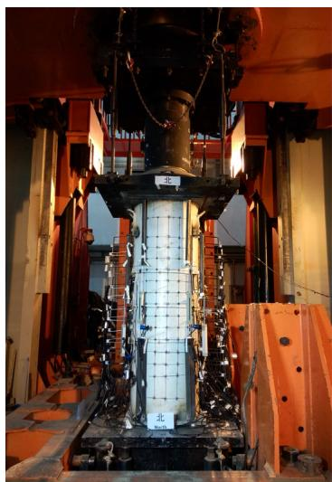  
(a)

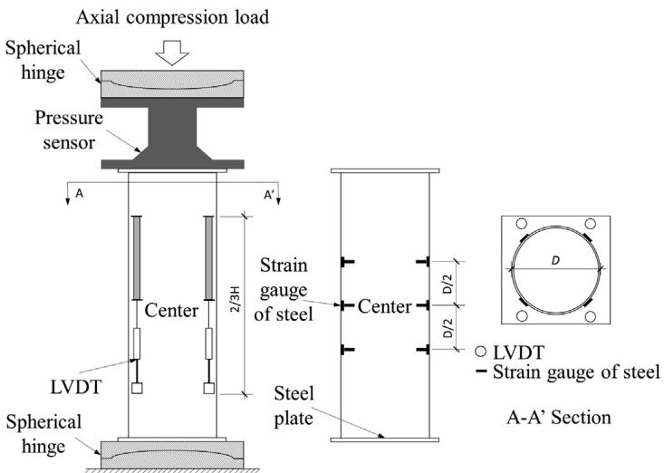  
(b)   
Fig. 1. Loading device and measuring arrangement.

Stage 1 is the initial loading phase of the specimen, when the surface of the specimen experiences no significant change. With increased load, the peak load is reached at Stage 2, but the surface of the specimen is similar to that at Stage 1, indicating that this phase entails slight deformation of the specimen concentrated in axial direction, but no formation of oblique cracks. The development of axial deformation accelerates after entering the decline phase. During Stages 3 and 4, the white paint begins to peel off, and oblique cracks gradually form on the surface of the specimen. The oblique fracture gradually penetrates the column, and local buckling occurs on the surface of the steel tube during Stage 5. Finally, the specimen loses its bearing capacity and fails at Stage 6. At the end of loading, the state of the specimen is as displayed

as Stage 6(a) in Fig. 2. After testing ends, the state of the specimen after removing the peeled white paint on the specimen surface is shown in Stage 6(b) in Fig. 2; the shape of the shear oblique fracture zone in the specimen is clearly visible. The inclined macrocrack band formed in the post-peak stage of the specimen, shown in Fig. 2, indicates the formation of an inclined band of microslabs at the peak load, which causes a global energy release accompanied by size effect [19].

Fig. 3 shows the ultimate failure mode of each specimen after the test; all specimens experience shear failure, which is one of the quasi-brittle failure modes. This indicates that, during the test, the confinement provided by the steel tube is not enough to convert the brittleness of the concrete completely into plasticity;

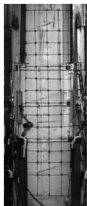  
Stage 1

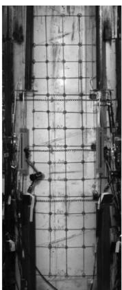  
Stage 2

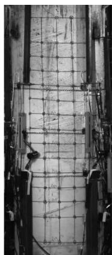  
Stage 3

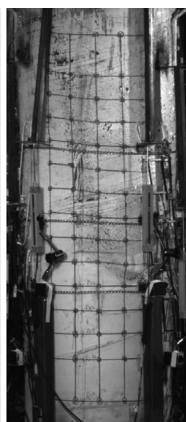

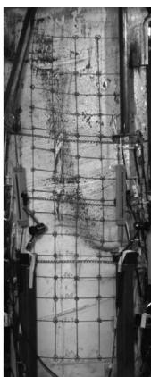  
Stage 5

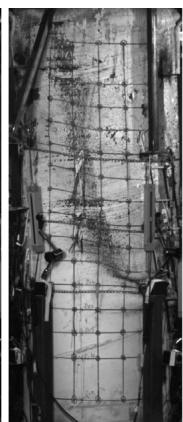  
Stage 6(a)

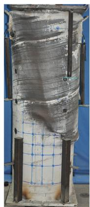  
Stage 6(b)

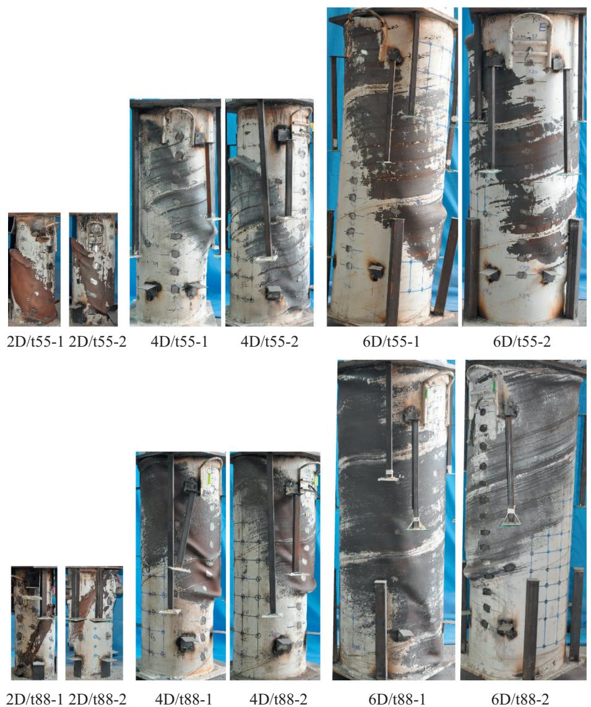  
Fig. 2. Failure evolution of specimen 6D/t88-2.   
Fig. 3. Final failure patterns of all specimens.

therefore, the size effect remains present in the CFT columns because of the quasi-brittle nature of concrete. Fig. 3 illustrates that, for small $D / t$ values, the hoop expansion at ultimate failure is large and the shear fracture band is wide and full. For larger

D/t values, the hoop expansion is smaller, the shear fracture band is narrow, and the main shear fracture is obvious. For specimen group 2D/t88, because the fracture elongation of the steel tube is small, cracking occurs in the steel tube at Stage 5. All cracks in

group 2D/t88 appear in the shear oblique fracture zone but not in the welding seam of the tube. This phenomenon does not occur in the other groups of specimens, as shown in Fig. 3.

# 3.2. Main test results

Fig. 4 depicts curves of the axial load versus axial deformation for all specimens. The axial load is measured by the force sensor, while the axial deformation is the average of displacements measured by the four LVDTs. Fig. 5 shows the nominal stress–strain curves for all specimens. The nominal stress is the ratio of the axial load to the cross-sectional area of the specimen. The nominal strain is processed in two parts. In Fig. 5, nominal strain before the peak nominal stress is defined as the average of vertical strains of the steel tube as measured by the 12 gauge points arranged on the specimen; after the peak nominal stress, the nominal strain is the average of the strains obtained by the four LVDTs, where each strain measured by the LVDTs is the ratio of the measured displacement to the corresponding actual gauge length. The shift in calculation methods is used because the deformation before the peak nominal stress is small, so the strain value obtained from the strain gauges of the steel tube is more accurate than that obtained by the LVDTs. After entering the decline section, the local softening of the specimen is such that the average strain of LVDTs reflects the state of the specimen more accurately. From Fig. 5, it can be seen that the initial tangent modulus of specimens with the same D/t value is essentially constant; with increased size, the peak nominal stress decreases, while the peak nominal strain varies little. Because the yield strength of the steel tube of group 2D/t88 is large, its peak nominal stress is near that of group $2 \mathrm { D } I$ t55, while its peak nominal strain is significantly greater than that of the other specimens with the same $D / t$ .

The primary test results of all specimens at the moment of peak bearing capacity are listed in Table 4. The detailed process to obtain the stress of confined concrete $( f _ { c c \_ e x p } )$ is given in Section 3.4. $N _ { u }$ is the bearing capacity calculated by the model proposed in Section 4. Fig. 6 shows the relation between the peak nominal stresses of all specimens and specimen size. Fig. 6 indicates that, for a constant $D / t$ value, the peak nominal stress of the specimen is decreased as the size increases; when the D/t value of the specimen increases, the degree of decrease in the peak nominal stress of the specimens by the size effect is increased.

# 3.3. Size effect on the stress of steel tube

The bearing capacity of an empty steel tube is determined by its stability. For larger $D / t$ , the empty steel tube is more likely to

collapse, namely because the effects of the initial imperfections of the steel are greater. In a CFT, because of the support by the core concrete, local buckling of the steel tube does not occur before the bearing capacity of the CFT is reached (as shown in Fig. 2), so the axial compression strength of the CFT is determined by the ultimate strength of the material. In addition, the steel is homogeneous while concrete is anisotropic. The size effect of the steel occurs at the microscale, but that of the concrete is in the mesoscale. In components composited from steel and concrete, the size effect of steel imperfections is small enough to be neglected generally [12,29,34]. Therefore, the initial imperfections of the empty steel tubes have little effect on the bearing capacities of CFTs with different diameters, and tests on the axial compression performance of empty steel tubes of different sizes for comparison were not performed.

For the situation in which the concrete and steel tube in the CFT are simultaneously subjected to uniaxial compression, after the steel tube and concrete deform together, the steel tube of the CFT is in the biaxial stress state of vertical compression and hoop tension. The axial load bearing capacity of CFT is distributed over the steel tube and core concrete. In order to separate the bearing capacity of the core concrete from the total bearing capacity of the CFT, the biaxial stress state of the steel tube must be acquired. The vertical strain and hoop strain of the steel tube were measured by the strain gauges arranged on the steel tube during the test. Then the measured strain components of the steel tube were transformed into the vertical compressive stress and hoop tensile stress of the steel tube, using the method of Gu [40]. The method [40] obeys the Von Mises yield criterion with details found in the literature [37].

In the method given by Gu [40] to calculate the component stress in the steel tube, the equivalent stress-strain curve includes the elastic stage, the plastic yield platform stage, and the plastic strengthening stage. The stress and the strain value at each key point in the equivalent stress-strain curve is taken from the mechanical behaviour of the steel tube in the test, and the details of the extraction and parameters can be easily found in the literature [37]. From known values of the equivalent stress-strain relationship and the measured data of vertical and hoop component strain in the steel tube, the vertical and hoop stress in the steel tube can be obtained by the following process: in the elastic stage of equivalent stress-strain curve, the component stress in the steel tube can be obtained by the generalized form of Hooke’s law; at the initial point in the plastic yield platform stage of the equivalent stress-strain curve, the component stress in the steel tube is determined by total deformation theory of the small elastic-plastic deformation of the Ilyushin, the equation of the Von Mises

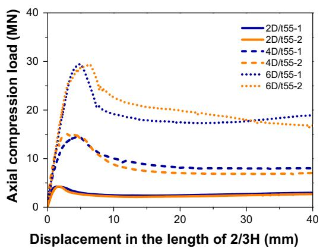  
(a)

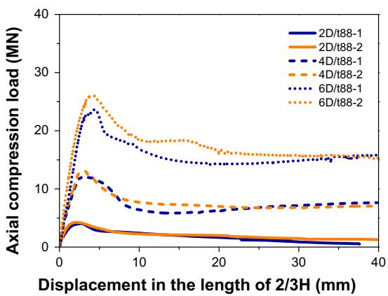  
(b)   
Fig. 4. Axial load–displacement curves of all specimens.

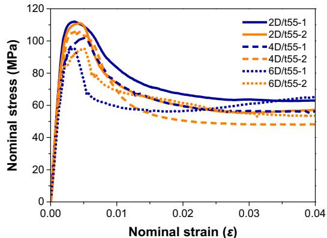  
(a)

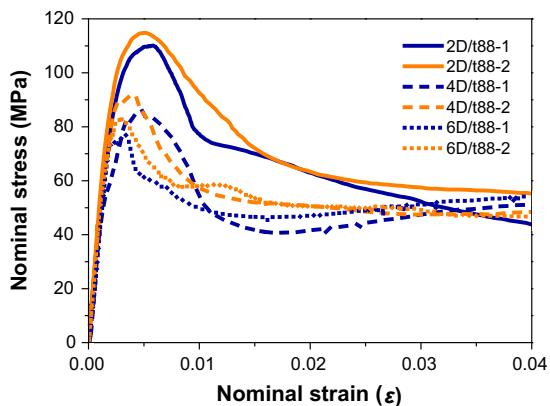  
(b)   
Fig. 5. Nominal stress–strain curves of all specimens.

Table 4 Primary test results at peak bearing capacity.   

<table><tr><td>Specimen No.</td><td>Peak load Nexp[kN]</td><td>Peak nominal stress fcs[MPa]</td><td>Stress of confined concrete fcc_exp[MPa]</td><td>Nexp/Nu</td><td>Average of Nexp/Nu</td></tr><tr><td>2D/t55-1</td><td>4234</td><td>112.03</td><td>109.69</td><td>0.96</td><td>0.97</td></tr><tr><td>2D/t55-2</td><td>4245</td><td>111.00</td><td>96.50</td><td>0.97</td><td></td></tr><tr><td>4D/t55-1</td><td>14469</td><td>101.90</td><td>94.60</td><td>0.96</td><td>0.98</td></tr><tr><td>4D/t55-2</td><td>15077</td><td>105.75</td><td>99.79</td><td>0.99</td><td></td></tr><tr><td>6D/t55-1</td><td>29463</td><td>95.64</td><td>86.43</td><td>0.98</td><td>0.98</td></tr><tr><td>6D/t55-2</td><td>29294</td><td>95.17</td><td>88.45</td><td>0.98</td><td></td></tr><tr><td>2D/t88-1</td><td>4030</td><td>110.08</td><td>103.06</td><td>1.06</td><td>1.04</td></tr><tr><td>2D/t88-2</td><td>4244</td><td>114.86</td><td>104.14</td><td>1.02</td><td></td></tr><tr><td>4D/t88-1</td><td>12360</td><td>86.38</td><td>80.83</td><td>1.03</td><td>1.00</td></tr><tr><td>4D/t88-2</td><td>13092</td><td>91.98</td><td>87.59</td><td>0.97</td><td></td></tr><tr><td>6D/t88-1</td><td>23663</td><td>76.98</td><td>71.64</td><td>1.13</td><td>1.09</td></tr><tr><td>6D/t88-2</td><td>26002</td><td>82.86</td><td>77.10</td><td>1.04</td><td></td></tr></table>

Notes: The peak load $( N _ { e x p } )$ is measured from the present experiment. Peak nominal stress $\left( f _ { c s } \right)$ is defined as $f _ { c s } = N _ { e x p } / A _ { c s }$ , where $A _ { c s }$ is the cross section area of specimen. The process to obtain the stress of confined concrete $( f _ { c c \_ e x p } )$ from the test results refers to Section 3.4, as calculated by Eq. (1). $N _ { u }$ is the bearing capacity calculated by the model proposed in Section 4.

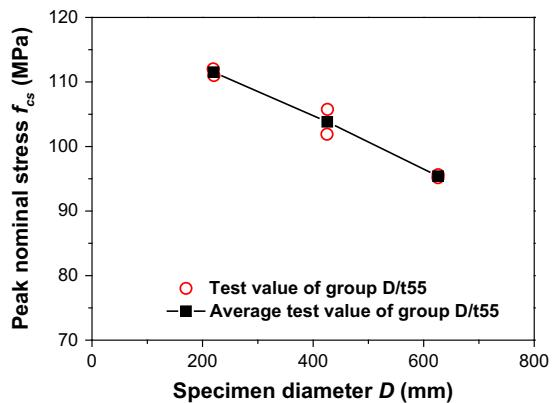  
(a)

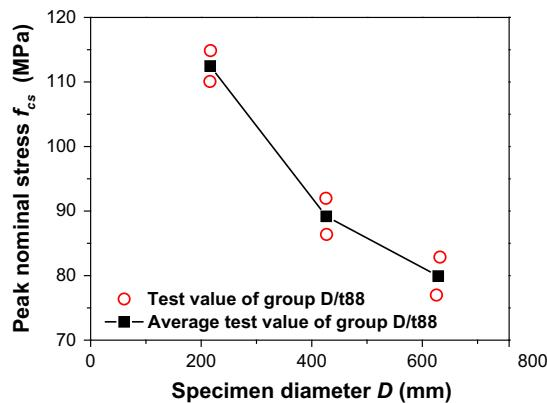  
(b)   
Fig. 6. Peak nominal stress of all specimens with different sizes.

criterion and the numerical iterative method; in the plastic yield platform stage of the equivalent stress-strain curve, Von Mises criterion and incremental theory of Prandtl-Lester flow rule are solved simultaneously to establish the solution of the component stress in the steel tube; in the plastic strengthening stage, the component stress in the steel tube is acquired through the equivalent stress value and the incremental theory of Prandtl-Lester flow rule. Summing up the above, the component stress in the steel tube

corresponding to each stage of the equivalent stress-strain curve of the steel tube can be obtained by the method given by Gu [40].

Fig. 2 shows that local softening has not occurred in the specimen at the peak bearing capacity (Stage 2). Therefore, the average of the stress components of the steel tube from all gauge points uniformly distributed on the specimen can be taken to represent the biaxial stress state of the steel tube throughout the specimen, with hoop stress $f _ { s \theta \_ e x p }$ and vertical stress $f _ { s z \_ e x p }$ . Using specimen

2D/t55-1 as an example, the hoop and vertical stresses at all gauge points when the specimen reaches peak bearing capacity are listed in Table 5, and the corresponding $f _ { s \theta \_ e x p }$ and $f _ { s z \_ e x p }$ acquired by averaging are -229.28 and 140.36 MPa, respectively, where the compressive value is positive and the tensile value is negative. In Table 5, the position of gauge points arranged on the steel tube is shown in Fig. 7. The distribution of hoop stress in the steel tube of gauge points is shown in Fig. 8. The distribution of vertical stress in the steel tube of gauge points is shown in Fig. 9. Table 5 implies that the equivalent stress of all gauge points at the moment of ultimate bearing capacity is mostly in the stage of plastic yielding, indicating that the steel tube is in the yield state at this point.

In order to eliminate the influence of different yield strengths of the steel tubes, the coefficient of the stress component of the steel tube is defined as the ratio of the stress component of the steel tube to the yield strength of the tube. Therefore, as the CFT reaches ultimate bearing capacity, the test value of the hoop stress coefficient of the steel tube is defined as $G _ { \theta _ { - } e x p } = f _ { s \theta _ { - } e x p } / f _ { y } ,$ and the test value of the vertical stress coefficient of the steel tube is $G _ { z \_ e x p } = -$ $- f _ { s z \_ e x p } / f _ { y }$ . The stress component coefficient of the steel tube in each specimen at the ultimate bearing capacity acquired in the test is listed in Table 6. Fig. 10 illustrates the relation between the specimen size and the stress component coefficient of the steel tube at the ultimate bearing capacity. Fig. 10 implies that, when the ultimate bearing capacity is reached, specimens with equal $D / t$ values show decreased hoop stress coefficients of the steel tube $( G _ { \theta _ { - } e x p } )$ and increased vertical stress coefficients $( G _ { z \_ e x p } )$ as the specimen sizes increase. For increasing $D / t$ values, the degrees of decrease and increase for $G _ { \theta \_ e x p }$ and $G _ { z \_ e x p }$ , respectively, related to the influence of diameter are intensified.

# 3.4. Size effect on the confined concrete

Since the test values including the axial bearing capacity of the specimen $( N _ { e x p } )$ , vertical stress of the steel tube $( f _ { s z \_ e x p } )$ , crosssectional area of the steel tube $( A _ { s } , \operatorname* { m m } ^ { 2 } )$ ), and cross-sectional area of the core concrete $( A _ { c } , \operatorname* { m m } ^ { 2 } )$ are known, the stress of the confined concrete $( f _ { c c \_ e x p } )$ at the moment of the ultimate bearing capacity can be determined by Eq. (1), with test results shown in Table 4.

$$
f _ {c c \_ e x p} = \frac {N _ {\exp} - A _ {s} f _ {s z \_ e x p}}{A _ {c}} \tag {1}
$$

The relation between $f _ { c c \_ e x p }$ and specimen size is plotted in Fig. 11. The figure shows that, at the peak bearing capacity, the stress of the confined concrete decreases with the increase of specimen diameter; the extent of decrease increases with the increase in $D / t$ of the specimen. This implies that the interaction between

the size of the CFT and the ratio of confinement $( D / t )$ is similar to that of other confined concretes, such as concrete confined by lateral steels or AFRP.

The stress of confined concrete consists of two parts: the material strength of the concrete and the confinement strength of the concrete provided by the steel tube. In order to compare the influence of size and $D / t$ on these two parts, it is necessary to separate the two parts from the stress of the confined concrete.

Firstly, the concrete material strength is essentially the cylindrical compressive strength of the concrete $( f _ { c d } )$ . Section 1 showed that research on the size effect for this part is abundant. In recent studies on CFTs, a reduction factor is typically introduced and multiplied by the cylindrical compressive strength of concrete in order to account for the effect of size on the strength of the concrete. For example, Liang et al. [41] revised the size-effect reduction factor proposed by Sakino et al. [27] and utilized the revised factor in calculating the bearing capacity. However, the amount of test data that Sakino et al. [27] used to propose the size-effect reduction factor was quite small and unlikely to accurately reflect the effect of size on the strength of concrete. Comparing typical models, including those of Weibull [2], Noguchi et al. [25], Bazant’s SEL [21], MSEL of Kim et al. [20], and Sakino et al. [27], the MSEL model proposed by Kim et al. [20] was based on the size effect law of Bazant [21] and the relevant parameters were determined by the regression analysis of much previously collected experimental data. Therefore, the model has a comprehensive consideration of influencing factors and high credibility. Hence, the MSEL of Kim et al. [20] was utilized to consider the effect of size on the cylindrical compressive strength of concrete in this experiment, and tests on the axial compression performance of concrete cylinders of different sizes were not conducted.

In addition, when the compressive strength of the concrete is transferred from that of a prism measuring $1 5 0 \times 1 5 0 \times 3 0 0 \mathrm { m m }$ to that of a cylinder measuring $1 5 0 \times 3 0 0 \mathrm { m m }$ , a shape conversion factor should be considered. In this scenario, the conversion factor is 1.073 according to the recommendation of the American Concrete Institute in the literature [42]. Therefore, $f _ { c d }$ can be obtained by Eq. (2), and $f _ { c d }$ of each specimen is illustrated in Fig. 11. In Eq. (2), the number of 1.073 is a shape conversion coefficient of concrete compressive strength, and the other part except 1.073 in Eq. (2) is the model to evaluate the compressive strength of cylindrical concrete considering size effect proposed by Kim et al. [20].

$$
f _ {c d} = 1. 0 7 3 \times f _ {c} \times \left[ 0. 8 + \frac {0 . 4}{\sqrt {1 + \frac {H - D}{5 0}}} \right] \tag {2}
$$

Table 5 Stress components of steel tube of specimen 2D/t55-1 at ultimate bearing capacity.   

<table><tr><td>Gauge points No.</td><td>Hoop stress of steel tube [MPa]</td><td>Vertical stress of steel tube [MPa]</td><td>Equivalent stress of steel tube [MPa]</td><td>State of equivalent stress</td></tr><tr><td>G-1, 2</td><td>-306.94</td><td>77.28</td><td>-352</td><td>Stage of yield platform</td></tr><tr><td>G-3, 4</td><td>-226.35</td><td>179.20</td><td>-352</td><td>Stage of yield platform</td></tr><tr><td>G-5, 6</td><td>-225.77</td><td>179.82</td><td>-352</td><td>Stage of yield platform</td></tr><tr><td>G-7, 8</td><td>-174.21</td><td>230.92</td><td>-352</td><td>Stage of yield platform</td></tr><tr><td>G-9, 10</td><td>-311.49</td><td>70.38</td><td>-352</td><td>Stage of yield platform</td></tr><tr><td>G-11, 12</td><td>-342.39</td><td>18.49</td><td>-352</td><td>Stage of yield platform</td></tr><tr><td>G-13, 14</td><td>-92.85</td><td>260.03</td><td>-316.83</td><td>Up to 90% of yield strength of steel tube</td></tr><tr><td>G-15, 16</td><td>39.93</td><td>370.26</td><td>-352</td><td>Stage of yield platform</td></tr><tr><td>G-17, 18</td><td>-359.60</td><td>-15.72</td><td>-352</td><td>Stage of yield platform</td></tr><tr><td>G-19, 20</td><td>-117.17</td><td>278.48</td><td>-352</td><td>Stage of yield platform</td></tr><tr><td>G-21, 22</td><td>-399.41</td><td>-134.46</td><td>-352</td><td>Stage of yield platform</td></tr><tr><td>G-23, 24</td><td>-235.09</td><td>169.60</td><td>-352</td><td>Stage of yield platform</td></tr><tr><td>Average</td><td>-229.28</td><td>140.36</td><td>-</td><td>-</td></tr></table>

Notes: Taking specimen 2D/t55-1 as an example, the stress components of the steel tube for the whole specimen (hoop stress $f _ { s \theta \_ e x p }$ , vertical stress $f _ { s z \_ e x p . }$ ) acquired by averaging is $f _ { s \theta _ { - } e x p } = - 2 2 9 . 2 8 \mathrm { M P } i$ , $f _ { s z \_ e x p } = 1 4 0 . 3 6$ MPa respectively, in which the value in compression is positive and the value in tension is negative.

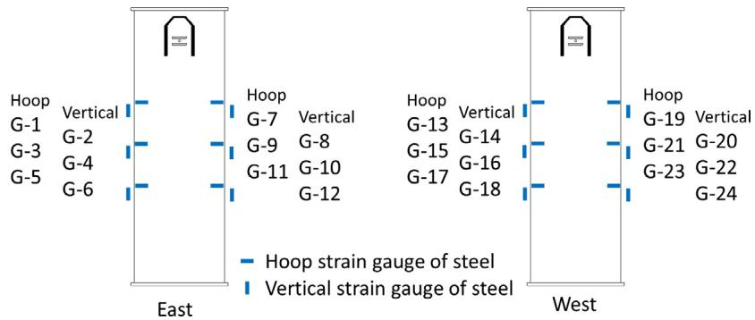  
Fig. 7. Distribution of strain gauges points of the steel tube in Table 5.

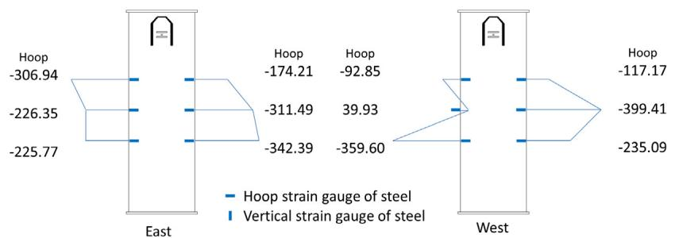  
Fig. 8. Distribution of the hoop stress in the steel tube in Table 5.

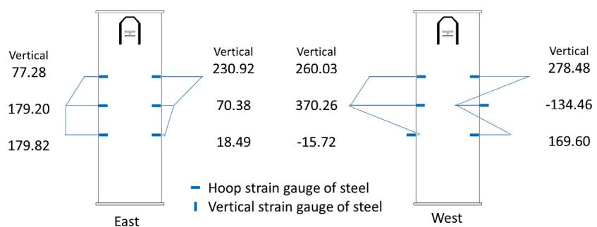  
Fig. 9. Distribution of the vertical stress in the steel tube in Table 5.

Table 6 Stress component coefficient of steel tube of each specimen at ultimate bearing capacity.   

<table><tr><td>Specimen No.</td><td>Gθ_exp</td><td>Average of Gθ_exp</td><td>Gz_exp</td><td>Average of Gz_exp</td></tr><tr><td>2D/t55-1</td><td>65.1%</td><td>42.8%</td><td>39.9%</td><td>60.6%</td></tr><tr><td>2D/t55-2</td><td>20.5%</td><td></td><td>81.3%</td><td></td></tr><tr><td>4D/t55-1</td><td>40.0%</td><td>43.2%</td><td>70.5%</td><td>67.6%</td></tr><tr><td>4D/t55-2</td><td>46.3%</td><td></td><td>64.6%</td><td></td></tr><tr><td>6D/t55-1</td><td>28.2%</td><td>35.0%</td><td>81.0%</td><td>74.7%</td></tr><tr><td>6D/t55-2</td><td>41.8%</td><td></td><td>68.4%</td><td></td></tr><tr><td>2D/t88-1</td><td>72.8%</td><td>66.8%</td><td>42.8%</td><td>49.2%</td></tr><tr><td>2D/t88-2</td><td>60.8%</td><td></td><td>55.5%</td><td></td></tr><tr><td>4D/t88-1</td><td>31.6%</td><td>36.0%</td><td>76.6%</td><td>73.0%</td></tr><tr><td>4D/t88-2</td><td>40.3%</td><td></td><td>69.4%</td><td></td></tr><tr><td>6D/t88-1</td><td>43.1%</td><td>38.2%</td><td>68.5%</td><td>71.9%</td></tr><tr><td>6D/t88-2</td><td>33.4%</td><td></td><td>75.4%</td><td></td></tr></table>

Notes: At the moment of ultimate bearing capacity, the test value of hoop stress coefficient of steel tube is defined as $G _ { \theta _ { - } e x p } = f _ { s \theta _ { - } e x p } / f _ { y } ,$ , and the test value of vertical stress coefficient of steel tube is $G _ { z _ { - } e x p } = - f _ { s z _ { - } e x p } / f _ { y }$ , where $f _ { y }$ is the yield strength of steel tube under axial tension listed in Table 2.

Then, the stress of confinement by the steel tube at the moment when the bearing capacity is reached can be determined by subtracting the size-related cylindrical compressive strength of the concrete from the stress of the confined concrete, namely $f _ { c c \_ e x p } - f _ { c d }$ .

The obtained proportion of the components of the core concrete stress at the ultimate bearing capacity are illustrated in Fig. 12, which uses the average values of the two specimens per group. Fig. 12 shows that, at the moment the ultimate bearing capacity is

  
(a) Coefficient of hoop stress of steel tube

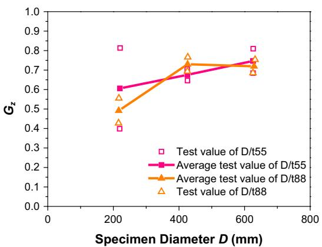  
(b) Coefficient of vertical stress of steel tube

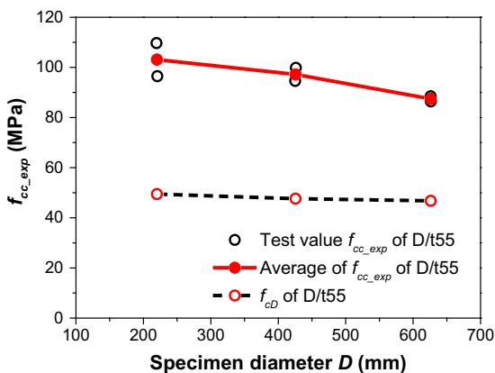  
Fig. 10. Stress component coefficients of steel tube at ultimate bearing capacity versus specimen size.   
(a)

  
(b)   
Fig. 11. Stress of confined concrete of specimens at ultimate bearing capacity versus specimen diameter.

reached, the size effect on the stress of confinement is much greater than that on the strength of the concrete; when $D / t$ increases, the size effect on the stress of confinement of the steel tube is increased. This may be attributed to the hoop deformation of the concrete, which decreases with increased specimen size; the confinement of the core concrete provided by the steel tube is generated by the

deformation of the steel tube with that of the core concrete. Therefore, the confinement effect of the steel tube is decreased with the decreased hoop expansion of the core concrete. When the hoop confining ratio is decreased, namely when the $D / t$ increases, the concrete becomes much more brittle, so that the degree of reduction in confinement becomes greater because of the size effect.

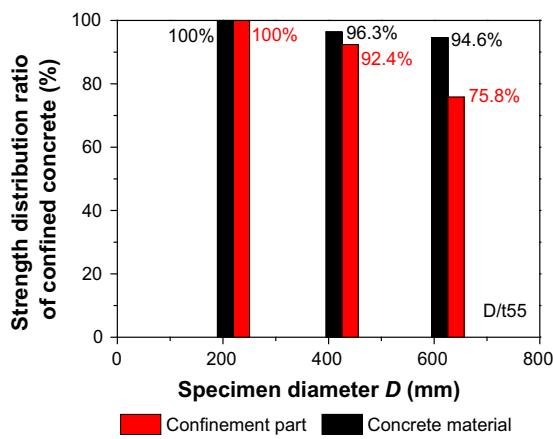  
(a)

  
(b)   
Fig. 12. Component proportions of stress of confined concrete at peak bearing capacity.

# 3.5. Size-dependent model of bearing capacity

During the initial loading of cylindrical CFT columns under axial loading, Poisson’s ratio of concrete is less than that of steel; thereby, the core concrete and steel tube experience axial compression separately. When the vertical deformation is increased under increased loading, Poisson’s ratio of concrete exceeds that of the steel tube until a certain load. Then the steel tube generates hoop tensile stress when it starts to deform with the hoop expansion of the core concrete, hence providing triaxial compressive confinement to the core concrete. Meanwhile, the vertical stress of the steel tube is decreased because of the biaxial stress state of the steel. The interaction between the steel tube and core concrete causes a significant improvement in the axial compressive bearing capacity of the CFT, but also significantly complicates the calculation of the bearing capacity.

The axial compressive bearing capacity of the cylindrical CFT is composed of two parts, including the vertical bearing capacity of the confined concrete and that of the steel tube. The above discussion of the test results implies that the test factors of the size and D/t of the specimen have significant effects on both parts of the bearing capacity of the CFT. In order to consider the mutual influences of size and $D / t$ in the calculation of the axial compressive bearing capacity of the CFT, the two parts of bearing capacity are modelled separately.

First, the confined concrete and its corresponding stress $( f _ { c c } )$ is modelled as two components of the cylindrical compressive strength of concrete $( f _ { c d } )$ and the strength of confinement $\left( K f _ { r } \right)$ at the peak bearing capacity, as shown in Eq. (3):

$$
f _ {c c} = f _ {c d} + K f _ {r} \tag {3}
$$

in which $f _ { c c }$ is the stress of the confined concrete at the ultimate bearing capacity (MPa), $f _ { r }$ is the confining stress on the core concrete provided by the steel tube at the ultimate bearing capacity (MPa), and K is the coefficient of confinement under triaxial compression. The model considering the effect of size on the strength of the concrete material $( f _ { c d } )$ as a part of the stress of the confined concrete was discussed in Section 3.4, as expressed in Eq. (2). The analysis of the influence of size and $D / t$ on the strength of confinement in the modelling proceeds as follows.

The confining stress of the steel tube $( f _ { r } )$ is given as follows:

$$
f _ {r} = - \frac {2 t}{D - 2 t} f _ {s \theta} \tag {4}
$$

$$
f _ {s \theta} = G _ {\theta} f _ {y} \tag {5}
$$

$$
f _ {s z} = - G _ {z} f _ {y} \tag {6}
$$

where $f _ { s \theta }$ is the hoop stress of the steel tube at the ultimate bearing capacity (MPa), $f _ { s z }$ is the vertical stress of the steel tube at the ultimate bearing capacity (MPa), $G _ { \theta }$ is the coefficient of hoop stress in the steel tube at the peak bearing capacity, and $G _ { z }$ is the coefficient of vertical stress in the steel tube at the peak bearing capacity. It can be seen from Eq. (4)–(6), as well as Section 3.3, that the influence of size and $D / t$ on the confining stress $( f _ { r } )$ is mainly reflected in the hoop stress of the steel tube, and more precisely on the coefficient of hoop stress in the steel tube. Hence, it is necessary to establish the relationship between the coefficient of the stress component in the steel tube and factors including the specimen size and $D / t$ .

When establishing a model for predicting the stress of confined concrete considering the influence of specimen size and confining ratio, models for other types of confined concrete generally reflected the impact of the confining ratio based on the SEL model proposed by Bazant [21], as with the models proposed by Kim et al. [20], Song et al. [30], and Wang et al. [15]. Therefore, considering the influence of D/t based on the size effect model of Bazant [21],

the relationship between the coefficient of hoop stress in the steel tube $\left( G _ { \theta } \right)$ and factors including specimen size and D/t can be obtained by a regression analysis of the test data in Fig. 10(a), as given by Eq. (7). In addition, performing regression analysis on the test data in Fig. 10(b) allows the acquisition of the relationship between the coefficient of vertical stress in the steel tube $\left( G _ { z } \right)$ and factors including specimen size and $D / t$ , as given by Eq. (8). The model of $G _ { \theta }$ and $G _ { z }$ is plotted in Fig. 13.

$$
G _ {\theta} = \frac {3 . 1 8 - 1 4 6 \frac {t}{D}}{\sqrt {1 + \frac {D}{1 7 . 1} \left(1 - 5 2 . 9 \frac {t}{D}\right)}} \tag {7}
$$

$$
G _ {z} = 0. 7 5 - \frac {7 8 0}{D ^ {1 . 5}} + 1 4 0 \left(\frac {t}{D}\right) ^ {2} \tag {8}
$$

Although the coefficient of confinement under triaxial compression (K) is not directly related to the size and $D / t$ of the specimen, it is necessary to confirm the variation in $K$ under different lateral pressures. The test values of $K \left( K _ { e x p } \right)$ can be obtained by substituting the known test parameters into Eqs. (2)–(6). Comparing the commonly used models for calculating K, including the model of Richart et al. [43], Zeng et al. [44] and Cai et al. [45] with the test value $K _ { e x p } ,$ , the results are displayed in Fig. 14. Among the models, that provided by Richart et al. [43] views the relation between K and the lateral pressure ratio $( f _ { r } / f _ { c d } )$ as linear; Zeng et al. [44] show a logarithmic nonlinear relationship between $K$ and $f _ { r } / f _ { c d }$ based on their test data; Cai et al. [45] propose a nonlinear relation of $K$ and $f _ { r } / f _ { c d }$ based on a large number of test data under tri-axial compression. The results from this experiment show that $K _ { e x p }$ is nonlinear with $f _ { r } / f _ { c d }$ ; the model provided by Cai et al. [45] is similar to the trend of the experimental data, but the other models are very different. In order to obtain the nonlinear trend of the test data of K, regression analysis is performed to yield the expression of $K$ as follows:

$$
K = 2. 2 8 \left(\frac {f _ {r}}{f _ {c d}}\right) ^ {- 0. 6 2} \tag {9}
$$

Eqs. (6) and (8) imply that the effect of factors including the size and $D / t$ of the specimen on the vertical bearing capacity of the steel tube is present in the coefficient of the vertical stress in steel tube at the ultimate bearing capacity $\left( G _ { z } \right)$ . According to the axial compression mechanism of CFTs, the effect of size and $D / t$ of the specimen on the vertical stress in the steel tube is associated with the effect on the hoop stress in the steel tube, but the effect trend in the vertical stress is opposite that in the hoop stress.

According to the above analysis, substituting Eqs. (2)–(9) into Eq. (10) yields the size-dependent model for predicting the axial compressive bearing capacity of cylindrical CFTs for different values of $D / t$ :

$$
N _ {u} = A _ {s} f _ {s z} + A _ {c} f _ {c c} \tag {10}
$$

where $N _ { u }$ is the calculated axial compressive bearing capacity of the cylindrical CFT (kN). This model is applicable to the circumstance of CFT with the concrete grade of C60, the steel tube grade of Q235, and the $D / t$ of 55–88. Eq. (10) concentrates on the bearing capacity of short CFT columns, therefore a buckling coefficient for the situation of long CFT column is not utilized here. Table 4 lists the ratio of the experimental results $( N _ { e x p } )$ to the model calculation results $\left( N _ { u } \right)$ . Fig. 15 illustrates the comparison between the experimental and calculation results. Table 4 and Fig. 15 both indicate that the values calculated by the model agree well with the experimental values.

A comparison of the test data from similar specimens in references [27] and [33] (listed in Table 7) with those of the model proposed here is shown in Fig. 15. The calculated values of the

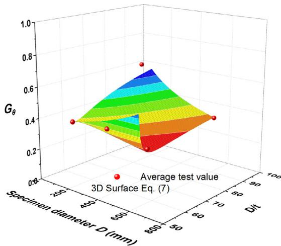  
(a) Coefficient of hoop stress in steel tube

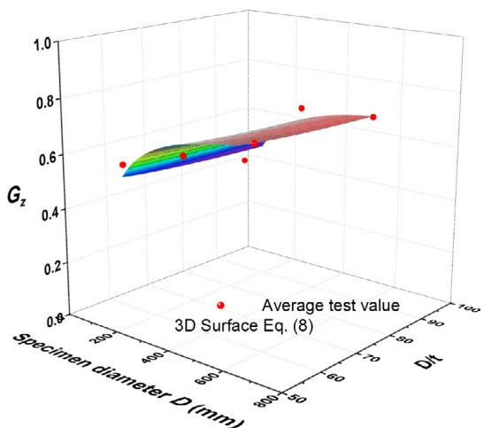  
(b) Coefficient of vertical stress in steel tube

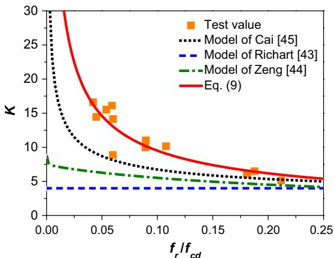  
Fig. 13. The model of the coefficients of the stress components of the steel tube at ultimate bearing capacity.   
Fig. 14. The coefficient of confinement under triaxial compression (K) as a function of the lateral pressure ratio $( f _ { r } / f _ { c D } )$ at ultimate bearing capacity.

specimens are somewhat larger than the test results in other studies. This is because the percentages of the concrete strength contributing to the axial compressive strength of the specimens in the referenced works are greater than that of the specimen in this paper. In Fig. 15, the ratio of the calculated to the experimental value of the

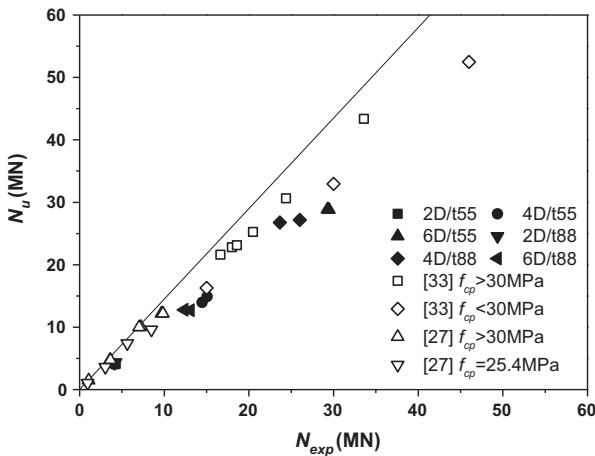  
Fig. 15. Comparison between experimental and calculated results of axial compressive bearing capacity.

specimens with concrete strengths of 15–28.9 MPa in the previous studies decreases obviously, supporting this point. According to the study of Cai [45], the proportion of the increase in strength from confinement in this experiment remains within a reasonable range. Therefore, the adaptability of the model in this study when using other test data still requires further study. Without regarding the influence of the differences in concrete strength percentages between this experiment and others in the literature, the comparison ratios of specimens with different sizes in other studies are at the same level, indicating that the model can evaluate the size effect on the bearing capacities of specimens with different sizes.

The theoretical model proposed in this paper was established by dividing each part of the bearing capacity based on the mechanism of CFTs under axial compression, and then fitting the experimental data to obtain the evaluation equation for each parameter in the model. The semi-empirical, semi-theoretical model is very simple, but it effectively validates and evaluates the size effect on the axial compression behaviour of CFTs.

The test results in Figs. 5 and 6 showed that the increase in the $D / t$ increased the reduction degree of the peak nominal stresses of the CFT due to the increasing specimen size. This was because when the $D / t$ increased, the reduction degree of the hoop stress in the steel tube due to the increase of specimen size at peak load increased, thereby decreasing the confinement provided by the steel tube to the concrete. The decrease of hoop stress in the steel tube was the result of the decrease of the hoop deformation of the concrete with the increase of the specimen size. Therefore, the size effect on CFT is still the result of the concrete material instead of the steel tube.

According to research results based on small-sized specimens, it is debatable whether the strength contribution of confinement should be considered when estimating the axial compressive bearing capacity of CFTs. However, this study shows that, because of the size effect on the concrete material, the confinement of the core concrete provided by the steel tube in large-sized CFTs is weakened. Moreover, the degree of weakening in the confinement is increased as the $D / t$ increases, and the extent of weakening of the confinement far exceeds that of the strength of the concrete material due to the size effect. Therefore, the design formulas based on research of small-sized specimens do not accurately or safely evaluate the axial compressive bearing capacity of large-sized CFTs, and the interaction effect of factors including the size and D/t of specimens should be considered in designing CFTs.

Table 7 Detail of specimens for comparison.   

<table><tr><td>Specimen No. [27]</td><td>D/mm</td><td>D/t</td><td>\(f_{cp}/MPa\)</td><td>\(f_{y}/MPa\)</td><td>Specimen No. [33]</td><td>D/mm</td><td>D/t</td><td>\(f_{cp}/MPa\)</td><td>\(f_{y}/MPa\)</td></tr><tr><td>CC4-A-2</td><td>149.0</td><td>50.3</td><td>25.4</td><td>308</td><td>SB2</td><td>630.0</td><td>90.0</td><td>36.0</td><td>291.4</td></tr><tr><td>CC4-A-4-1</td><td></td><td></td><td>40.5</td><td></td><td>SB6</td><td></td><td>82.8</td><td>35.0</td><td>349.5</td></tr><tr><td>CC4-A-4-2</td><td></td><td></td><td></td><td></td><td>SB7</td><td></td><td>74.6</td><td>34.5</td><td>350.0</td></tr><tr><td>CC6-C-2</td><td>239.0</td><td>52.6</td><td>25.4</td><td>507</td><td>SB3</td><td></td><td>61.7</td><td>38.4</td><td>323.3</td></tr><tr><td>CC6-C-4-1</td><td>238.0</td><td>52.4</td><td>40.5</td><td></td><td>SB4</td><td></td><td>54.3</td><td>46.0</td><td>347.2</td></tr><tr><td>CC6-C-4-2</td><td></td><td></td><td></td><td></td><td>SB5</td><td>820.0</td><td>91.8</td><td>45.0</td><td>331.0</td></tr><tr><td>CC6-D-2</td><td>361.0</td><td>79.5</td><td>25.4</td><td>525</td><td>SB9</td><td>1020.0</td><td>105.8</td><td>16.9</td><td>336.0</td></tr><tr><td>CC6-D-4-1</td><td>361.0</td><td>79.5</td><td>41.1</td><td></td><td>SB10</td><td></td><td>77.0</td><td>28.9</td><td>368.7</td></tr><tr><td>CC6-D-4-2</td><td>360.0</td><td>79.3</td><td></td><td></td><td>SB8</td><td>720.0</td><td>86.8</td><td>15.0</td><td>312.0</td></tr><tr><td>CC8-D-2</td><td>337.0</td><td>52.1</td><td>25.4</td><td>823</td><td></td><td></td><td></td><td></td><td></td></tr><tr><td>CC8-D-4-1</td><td></td><td></td><td>41.1</td><td></td><td></td><td></td><td></td><td></td><td></td></tr><tr><td>CC8-D-4-2</td><td></td><td></td><td></td><td></td><td></td><td></td><td></td><td></td><td></td></tr></table>

Notes: $f _ { c p }$ is the cylinder strength of concrete. $f _ { y }$ is the tensile yield strength of steel.

# 4. Conclusions

In order to investigate the effect of size on the axial compressive bearing capacity of cylindrical CFTs, axial compressive experiments were conducted in which the ratios of diameter to thickness of specimens $( D / t )$ were 55 and 88, and the range of specimen diameters was 219–630 mm. The results verified the existence of the size effect in determining the axial compressive bearing capacity of CFTs with different $D / t$ , and the following conclusions are reached.

(1) All specimens experienced shear failure at the end of the loading tests. This indicates that, for $D / t$ greater than 50, although the confinement of the core concrete provided by the steel tube still exists in the CFT, the core concrete remains brittle, which is associated with the generation of the size effect. When the size and $D / t$ of the specimen are larger, the size effect on the cylindrical CFT becomes stronger; for example, the nominal stress of the CFT decreases more. This is consistent with the results of theoretical analysis in previous reports [36].   
(2) Based on the analysis of test stresses in the steel tube, the bearing capacities of the steel tube and confined concrete are separated from the bearing capacity of the CFT to study the size effect on each component of the bearing capacity. The results imply that, because of the size effect on the hoop stress in the steel tube, with increases in the size and D/t of the specimen, the degree of decrease in the confinement of the core concrete provided by the steel tube is increased, meaning a stronger size effect is observed. This is similar to the size effect law of concrete confined by lateral steels [29] and concrete confined by AFRP [15] under the influence of different confining ratios.   
(3) In addition, by comparing the compressive strength of cylindrical concrete with the strength of confinement, the effect of size and $D / t$ of the specimen on the latter is significantly larger than that on the former. This implies that the design theory of CFT components based on small-sized specimens is likely to be unsafe when applied to large-sized components. Therefore, it is suggested that the interacting effects of the size and $D / t$ of the specimen should be considered in designing large-size components with D/t exceeding 50.   
(4) Unlike concrete confined by lateral steel or AFRP, the steel tube in the CFT is subjected to hoop tension and vertical compression stresses simultaneously. Therefore, the size effect on the vertical stress in the steel tube opposes the size effect on the hoop stress in the steel tube at the same time.

Consequently, the vertical bearing capacity of the steel tube is influenced by both the size and $D / t$ of the specimen. This complicates the size effect law for large-sized CFTs.   
(5) Based on the SEL model of Bazant and considering the effect of $D / t$ , the relationship between the hoop stress in the steel tube and factors including the size and $D / t$ of the specimen was obtained to reflect the size effect on the confinement of the core concrete provided by the steel tube. In this way, a size-dependent model for evaluating the axial compressive bearing capacity of cylindrical CFTs under the influence of different $D / t$ values was established. The calculated results agree well with the experimental data, providing effective reference data for practical engineering.

# Acknowledgments

This project was supported by the National Key Basic Research and Development Program of China (2016YFC0701100) and the Key Laboratory Open Fund of Urban Safety and Disaster Reduction (2013ZD02).

# Appendix A. Supplementary material

Supplementary data associated with this article can be found, in the online version, at http://dx.doi.org/10.1016/j.engstruct.2017. 08.022.

# References

[1] Gourley BC, Tort C, Denavit MD, Schiller PH, Hajjar JF. A synopsis of studies of the monotonic and cyclic behavior of concrete-filled steel tube members, connections, and frames. NSEL report series, No. NSEL-008; 2008.   
[2] Weibull W. A statistical theory of the strength of materials. R Swedish Acad Eng Sci Proc 1939;151:1–45.   
[3] Carpinteri A, Chiaia B, Ferro G. A new explanation for size effects on the flexural strength of concrete. Mag Concrete Res 1997;49(178):45–53.   
[4] Duan K, Hu X, Wittmann FH. Scaling of quasi-brittle fracture: boundary and size effect. Mech Mater 2006;38(1/2):128–41.   
[5] Bazant ZP. Size effect. Int J Solids Struct 2000;37:69–80.   
[6] Bazant ZP, Pang SD. Activation energy based extreme value statistics and size effect in brittle and quasibrittle fracture. J Mech Phys Solids 2007;55:91–131.   
[7] Bazant ZP, Yu Q. Universal size effect law and effect of crack depth on quasibrittle structure strength. J Eng Mech 2009;135(2):78–84.   
[8] Turkel A, Ozkul MH. Size and wall effects on compressive strength of concretes. ACI Mater J 2010;107(4):372–9.   
[9] Caibal MRJ, Iwashita Y, Nakanishi M. Size effect on structural performance of reinforced concrete beams under flexure. J Struct Constr Eng AIJ 2008;73 (626):625–32 [in Japanese].   
[10] Belgin CM, Sener S. Size effect on failure of overreinforced concrete beams. Eng Fract Mech 2008;2008(75):2308–19.   
[11] Nemecek J, Bittnar Z. Experimental investigation and numerical simulation of post-peak behavior and size effect of reinforced concrete columns. Mater Struct 2004;37(3):161–9.

[12] Jin L, Li D, Du XL. Mechanical behavior and size effect of moderate highstrength RC columns under monotonic and cyclic axial compression. Eng Struct 2016;124:269–85.   
[13] Abrams DP. Scale relations for reinforced concrete beam-column joints. ACI Struct J 1987;84(6):502–12.   
[14] Barbhuiya S, Choudhury AM. A study on the size effect of RC beam–column connections under cyclic loading. Eng Struct 2015;95:1–7.   
[15] Wang YF, Wu HL. Size effect of concrete short columns confined with aramid FRP jackets. J Compos Constr 2011;15(4):535–44.   
[16] Gonnerman HF. Effect of size and shape of test specimen on compressive strength of concrete. Proc ASTM 1925;25:237–50.   
[17] Blanks RF, McNamara CC. Mass concrete tests in large cylinders. Proc ACI J 1935;31:280–303.   
[18] Sabnis GM, Mirza SM. Size effects in model concrete. J Struct Div 1979;105 (6):1007–20.   
[19] Bazant ZP, Xiang YY. Size effect in compression fracture: splitting crack band propagation. J Eng Mech 1997;123(2):162–72.   
[20] Kim JK, Yi ST, Park CK, Eo SH. Size effect on compressive strength of plain and spirally reinforced concrete cylinders. ACI Struct J 1999;96(1):88–96.   
[21] Bazant ZP. Size effect in blunt fracture: concrete, rock, metal. ASCE J Eng Mech 1984;110(4):518–35.   
[22] Smadi MM, Slate FO. Micro-cracking of high and normal strength concrete under short-and-long-term loadings. ACI Mater J 1989;86(2):117–27.   
[23] Kesler CE. Effect of length to diameter ratio on compressive strength on ASTM cooperative investigation. Proc ASTM 1959;59:1216–29.   
[24] Murdock JW, Kesler CE. Effect of length to diameter ratio of specimen on the apparent compressive strength of concrete. Proc ASTM 1957;221:68–73.   
[25] Noguchi T, Tomosawa F. Effect of size and shape of specimen on mechanical properties of high strength concrete in compression. J Struct Constr Eng, AIJ 1995;473:19–28 [in Japanese].   
[26] Kim JK, Eo SH. Size effect in concrete specimens with dissimilar initial cracks. Mag Concr Res 1990;42(153):233–8.   
[27] Sakino K, Nakahara H, Morino S, Nishiyama I. Behavior of centrally loaded concrete-filled steel-tube short columns. J Struct Eng 2004;130(2):180–8.   
[28] Yi ST, Yang EI, Choi JC. Effect of specimen sizes, specimen shapes, and placement directions on compressive strength of concrete. Nucl Eng Des 2006;2006(236):115–27.   
[29] Li ZB, Song J, Du XL, Yang XG. Size effect of confined concrete subjected to axial compression. J Cent South Univ 2014;21:1217–26.   
[30] Song J, Li ZB, Wang YQ, Zuo ZY. Stress-strain constitutive model of concrete confined by hoops with considering size effect. J Build Struct 2015;36 (8):99–107 [in Chinese].

[31] Akogbe RK, Liang M, Wu ZM. Size effect of axial compressive strength of CFRP confined concrete cylinders. Int J Concr Struct M 2011;5(1):49–55.   
[32] Elkadi AS, Van Mier JGM. Experimental investigation of size effect in concrete fracture under multiaxial compression. Int J Fract 2006;140:55–71.   
[33] Luksha LK, Nesterovich AP. Strength testing of large-diameter concrete filled steel tubular members. In: Proceedings of the third international conference on steel-concrete composite structures; 1991. p. 67–72.   
[34] Yamamoto T, Kawaguchi J, Morino S. Experimental study of the size effect on the behavior of concrete filled circular steel tube columns under axial compression. J Struct Constr Eng, AIJ 2002;561:237–44 [in Japanese].   
[35] Chen YJ, Li Y, Yan WM, Pan D. Bearing capacity test of large size concrete filled steel tubular column. Chin J Highw Transp 2011;24(4):33–8 [in Chinese].   
[36] Caner FC, Bazant ZP. Lateral confinement needed to suppress softening of concrete in compression. J Eng Mech 2002;128(12):1304–13.   
[37] Wang WJ, Tang ZY, Li ZB, Ma H. Bearing capacities of different-diameter concrete-filled steel tubes under axial compression. Adv Mater Sci Eng 2016:1–10. Article ID 7982365.   
[38] Ministry of Construction of the People’s Republic of China. GB/T 50081–2002, Standard for test method of mechanical properties on ordinary concrete. Beijing: China Architecture & Building Press; 2003 [in Chinese].   
[39] General Administration of Quality Supervision, Inspection and Quarantine of the People’s Republic of China. GB/T 228.1-2010, Metallic materials-Tensile testing-Part 1: Method of test at room temperature. Beijing: Standards Press of China; 2010 [in Chinese].   
[40] Gu WP. Stress analysis of concrete filled steel tubular columns. Build Sci 1987;2:14–21 [in Chinese].   
[41] Liang QQ, Fragomeni S. Nonlinear analysis of circular concrete-filled steel tubular short columns under axial loading. J Constr Steel Res 2009;65:2186–96.   
[42] Zhou JP, Niu XQ, Jia JS. Design of concrete gravity dams – A 20 year perspective. Beijing: China Water & Power Press; 2008. p. 591 [in Chinese].   
[43] Richart FE, Brandtzage A, Brown RL. A study of the failure of concrete under combined compressive stresses. Bulletin No. 185. Urbana (Illinois): Engineering Experimental Station, University of Illinois; 1928.   
[44] Zeng SJ, Ren XD, Li J. Triaxial behavior of concrete subjected to dynamic compression. J Struct Eng 2013;139(9):1582–92.   
[45] Cai SH, Jiao ZS. Behavior and ultimate strength of short concrete-filled steel tubular columns. J Build Struct 1984;6:13–29 [in Chinese].