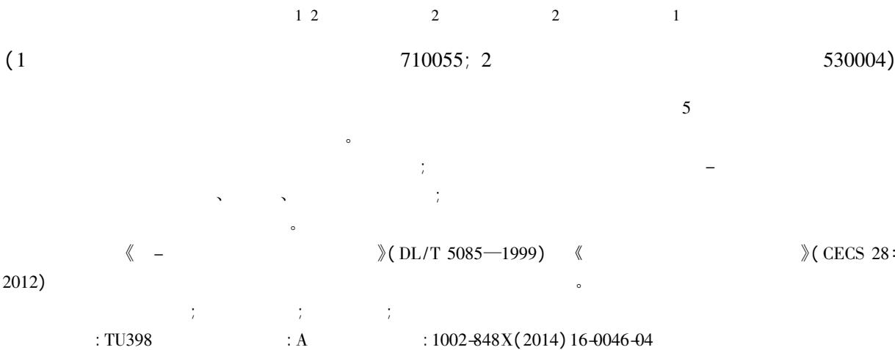

# Experimental study on the axial compression performance of high-strength concrete filled steel tube columns

Ke Xiaojun1 2 Chen Zongping 2 Ying Wudang 2 Xue Jianyang 1

( 1 School of Civil Engineering Xi'an University of Architecture and Technology Xi'an 710055 China;

2 College of Civil Engineering and Architecture Guangxi University Nanning 530004 China)

Abstract: To study the axial compression performance of high-strength concrete filled steel tube ( HCFST) columns 5 HCFST specimens and 2 contrastive specimens ( one hollow steel tube specimen and one pure concrete specimen) were designed for the axial compresion test considering the variable parameters of concrete strength and length-diameter ratio． Test results indicate that HCFST specimens and hollow steel tube specimen are waist-shaped failure and the pure concrete specimen is vertical splitting failure． Load-axial displacement curves of all specimens except the pure concrete specimen are basically similar they all experience three stages as rising stage falling stage and rally stage． The ultimate bearing capacity of HCFST specimens increases with the increase of concrete strength and decreases with the increase of lengthdiameter ratio． According to the analysis of ultimate bearing capacity of HCFST columns by the calculated formulas of Unified Strength Theory and Confinement Theory the results calculated by Code for design of steel-concrete composite structure ( DL / T 5085—1999) and Technical specification for concrete-filled steel tubular structures( CECS 28∶ 2012) are in good agreement with the test results and it indicates that HCFST columns can be designed with DL /T 5085—1999 and CECS 28∶ 2012．

Keywords: concrete filled steel tube; high-strength concrete; axial compression test; ultimate bearing capacity

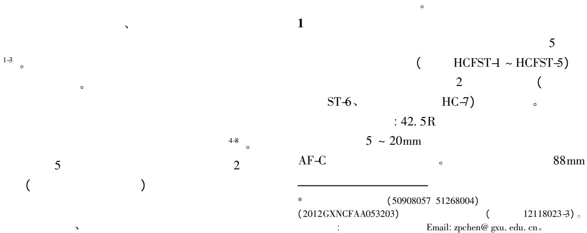  
0

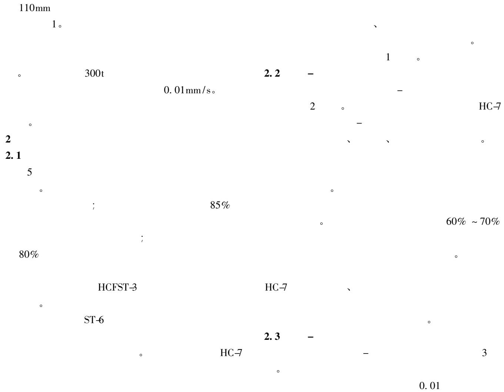

1   

<table><tr><td></td><td></td><td>L/mm</td><td>D/mm</td><td>t/mm</td><td>L/D</td><td>fy/MPa</td><td>fu/MPa</td><td>fc/MPa</td><td>ξ</td><td>Nt/kN</td></tr><tr><td>HCFST-1</td><td>C60</td><td>404</td><td>110</td><td>3.0</td><td>3.67</td><td>398</td><td>458</td><td>44.78</td><td>1.055</td><td>1030</td></tr><tr><td>HCFST-2</td><td>C70</td><td>390</td><td>110</td><td>3.0</td><td>3.55</td><td>398</td><td>458</td><td>47.61</td><td>0.992</td><td>1085</td></tr><tr><td>HCFST-3</td><td>C80</td><td>395</td><td>110</td><td>3.0</td><td>3.59</td><td>398</td><td>458</td><td>51.96</td><td>0.909</td><td>1247</td></tr><tr><td>HCFST-4</td><td>C70</td><td>303</td><td>110</td><td>3.0</td><td>2.75</td><td>398</td><td>458</td><td>47.61</td><td>0.992</td><td>1134</td></tr><tr><td>HCFST-5</td><td>C70</td><td>400</td><td>88</td><td>2.7</td><td>4.55</td><td>410</td><td>479</td><td>47.61</td><td>1.163</td><td>718</td></tr><tr><td>ST-6</td><td>—</td><td>300</td><td>110</td><td>3.0</td><td>2.73</td><td>398</td><td>458</td><td>47.61</td><td>—</td><td>295</td></tr><tr><td>HC-7</td><td>C70</td><td>300</td><td>104</td><td>—</td><td>2.88</td><td>—</td><td>—</td><td>47.61</td><td>—</td><td>299</td></tr><tr><td colspan="10">: L ; D ; t ; L/D ; fy ; fu ; fc</td><td>;ξ</td></tr><tr><td colspan="11">ξ=fyAs/fcAc A_s A_c</td></tr><tr><td></td><td></td><td></td><td></td><td></td><td>; Nt</td><td>。</td><td></td><td></td><td></td><td></td></tr></table>

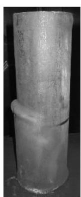

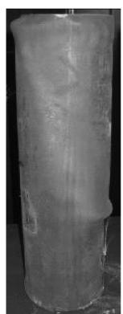

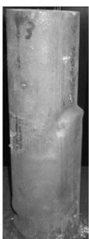

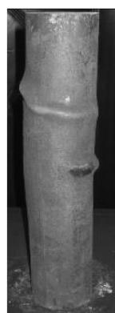

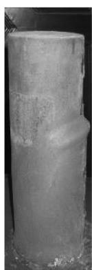

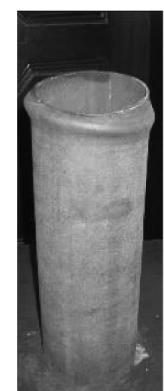

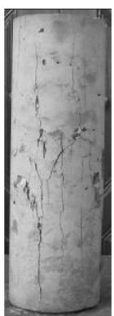

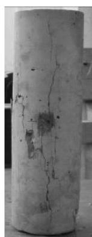  
(a)钢管高强混凝土柱(自左向右依次为 HCFST-1~HCFST-5)  
(b)空钢管柱(ST-6)   
(c）素混凝土柱(HC-7)

( 0. 003 1)

( 0. 001 6 ) 。

3

3. 1

5

2 3

HCFST-2 HCFST-3

HCFST-1

5. 34% $2 1 . 0 7 \%$

1)

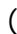

)

3. 2

6

步; 2 ) 3

HCFST-4 HCFST-2

HCFST-5

σ sc

$$
N _ {\mathrm {t}} / A _ {\mathrm {s c}} \left(A _ {\mathrm {s c}} \right.
$$

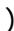

HCFST-4 HCFST-2 HCFST-5

2. 4

119 114 76MPa 。

HCFST-2 HCFST-5

4

HCFST-4

$4 . 2 0 \%$ $3 6 . 1 3 \%$ 。

4

HCFST-4 ST-6 HC-7

1 134 295 299kN( 1 和图 7) 。

0. 008

1. 91

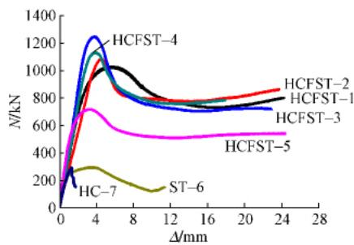  
( 0. 001 6) ，

2

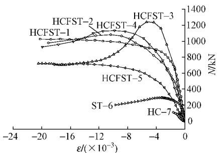

3

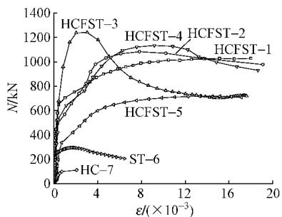

4

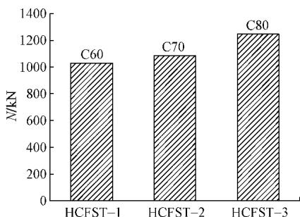

5

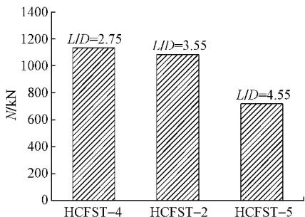

6

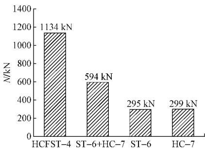

7

$N _ { \mathrm { c } }$ $N _ { \mathrm { t } }$

2

<table><tr><td rowspan="2"></td><td rowspan="2">Nt/kN</td><td colspan="2">1
DL/T 5085-1999 9</td><td colspan="2">2
DBJ 13-51-2010 10</td><td colspan="2">3</td><td colspan="2">CECS 28: 2012 11</td></tr><tr><td>Nc/kN</td><td>Nc/Nt</td><td>Nc/kN</td><td>Nc/Nt</td><td>Nc/kN</td><td>Nc/Nt</td><td>Nc/kN</td><td>Nc/Nt</td></tr><tr><td>HCFST-1</td><td>1030</td><td>1002</td><td>0.973</td><td>911</td><td>0.884</td><td>1183</td><td>1.148</td><td>992</td><td>0.963</td></tr><tr><td>HCFST-2</td><td>1085</td><td>1034</td><td>0.953</td><td>941</td><td>0.868</td><td>1207</td><td>1.112</td><td>1014</td><td>0.934</td></tr><tr><td>HCFST-3</td><td>1247</td><td>1083</td><td>0.869</td><td>981</td><td>0.787</td><td>1243</td><td>0.997</td><td>1047</td><td>0.840</td></tr><tr><td>HCFST-4</td><td>1134</td><td>1035</td><td>0.913</td><td>963</td><td>0.849</td><td>1207</td><td>1.064</td><td>1014</td><td>0.894</td></tr><tr><td>HCFST-5</td><td>718</td><td>706</td><td>0.983</td><td>632</td><td>0.880</td><td>776</td><td>1.080</td><td>649</td><td>0.904</td></tr><tr><td></td><td>—</td><td>—</td><td>0.938</td><td>—</td><td>0.854</td><td>—</td><td>1.080</td><td>—</td><td>0.907</td></tr><tr><td></td><td>—</td><td>—</td><td>0.047</td><td>—</td><td>0.040</td><td>—</td><td>0.057</td><td>—</td><td>0.046</td></tr><tr><td></td><td>—</td><td>—</td><td>0.050</td><td>—</td><td>0.047</td><td>—</td><td>0.052</td><td>—</td><td>0.051</td></tr></table>

$$
\begin{array}{c} \text {《 - 》} \\ (\mathrm {D L / T} 5 0 8 5 - 1 9 9 9) ^ {9} (\quad \mathrm {D L / T} 5 0 8 5 - 1 9 9 9) \\ \langle \text {D B J} 1 3 - 5 1 - 2 0 1 0 \rangle^ {1 0} \\ \langle \text {D B J} 1 3 - 5 1 - 2 0 1 0) \quad \langle \text {D B J} 1 3 - 5 1 - 2 0 1 0) \\ \langle \text {C E C S} 2 8: 2 0 1 2) ^ {1 1} (\quad \text {C E C S} 2 8: 2 0 1 2) \end{array}
$$

$$
\begin{array}{c c c} 2 & 6 \sim 8 \end{array}
$$

4. 1

$$
\mathrm {D L} / \mathrm {T} 5 0 8 5 - 1 9 9 9 ^ {\prime}
$$

$$
N \quad :
$$

$$
N = \varphi (1. 2 1 2 + B \xi + C \xi^ {2}) f _ {\mathrm {c}} A _ {\mathrm {s c}} \tag {1}
$$

$$
B = 0. 1 7 5 9 \frac {f _ {\mathrm {y}}}{2 1 5} + 0. 9 7 4 \tag {2}
$$

$$
C = - 0. 1 0 3 8 \frac {f _ {\mathrm {c}}}{2 0} + 0. 0 3 0 9 \tag {3}
$$

$$
D B J 1 3 - 5 1 - 2 0 1 0 ^ {1 0}
$$

$$
N \quad :
$$

$$
N = \varphi (1. 1 4 + 1. 0 2 \xi) f _ {\mathrm {c}} A _ {\mathrm {s c}} \tag {4}
$$

$$
\varphi \quad \text {D B J} 1 3 - 5 1 - 2 0 1 0 ^ {1 0} 。
$$

4. 2

3 N

$$
\theta \leqslant 1. 2 3 5
$$

$$
N = \varphi A _ {\mathrm {c}} f _ {\mathrm {c}} (1 + 2 \theta) \tag {5}
$$

$$
\theta > 1. 2 3 5
$$

$$
N = \varphi A _ {\mathrm {c}} f _ {\mathrm {c}} (1 + \sqrt {\theta} + 1. 1 \theta) \tag {6}
$$

$$
\varphi = 1 - 0. 1 1 5 \sqrt {L / D - 4} (L / D > 4) \tag {7}
$$

$$
0. 5 <   \theta \leqslant 1. 5 6
$$

$$
1. 5 6 <   \theta \leqslant 2. 5
$$

$$
\begin{array}{l} \mathrm {C E C S} 2 8: 2 0 1 2 ^ {1 1}: \\ N = 0. 9 \varphi A _ {\mathrm {c}} f _ {\mathrm {c}} (1 + 1. 8 \theta) (8) \\ N = 0. 9 \varphi A _ {\mathrm {c}} f _ {\mathrm {c}} (1 + \sqrt {\theta} + \theta) (9) \\ : \theta \quad \theta = f _ {\mathrm {s}} A _ {\mathrm {s}} / f _ {\mathrm {c}} A _ {\mathrm {c}} \quad f _ {\mathrm {s}} \\ ; \varphi \quad \mathrm {C E C S} 2 8: 2 0 1 2 ^ {1 1} \quad \varphi \\ (7) 。 \\ \end{array}
$$

( 1)

$$
D L / T 5 0 8 5 - 1 9 9 9 ^ {9} \quad D B J 1 3 - 5 1 - 2 0 1 0 ^ {1 0}
$$

$$
6 \% \quad 15 \%
$$

( 2)

$$
\text {。 C E C S 2 8 :}
$$

$$
2 0 1 2 ^ {1 1}
$$

$$
10 \%
$$

( 3)

$$
D L / T 5 0 8 5 - 1 9 9 9 \quad C E C S 2 8: 2 0 1 2 ^ {1 1}
$$

5

$$
(1)
$$

$$
(2)
$$

( 76 )

$$
\kappa = 0. 1 1 2 5 \lg N - 0. 4 4 1 6 \tag {6a}
$$

$$
\rho \geqslant 0.6\% :
$$

$$
\kappa = (0. 0 0 1 7 - 0. 0 9 2 6 \rho) n - 1 8. 2 7 6 \rho + 0. 3 4 3 6 \tag {6b}
$$

$$
(6 a) \quad (6 b)
$$

$$

$$

$$
0. 1
$$

$$
0. 0 9 8
$$

$$
\mathrm {H R B F 5 0 0}
$$

$$
f
$$

$$
\rho <   0.6\% :
$$

$$
f = (0. 1 1 2 5 \lg N + 0. 5 5 8 4) f _ {1} \tag {7a}
$$

$$
\rho \geqslant 0.6\% :
$$

$$
f = (0. 0 0 1 7 - 0. 0 9 2 6 \rho) n - 1 8. 2 7 6 \rho + 1. 3 4 3 6 f _ {1}
$$

$$
(7 \mathrm {b})
$$

$$
\colon f _ {1}
$$

$$
\langle \rangle_ {\text {G B 5 0 0 1 0} -}
$$

$$
2 0 1 0)
$$

4

( 1) HRBF500

$$
1 6 0 \mathrm {M P a}
$$

HRBF500

( 3)

》( GB 50010—2010)

HRBF500

J ． 2005 26

( 2) : 94-100．

2

J ． 2006 36 ( 2 ) :

51-54．

3 AL-ROUSAN R ISSA M． Fatigue performance of

reinforced concrete beams strengthened with CFRP sheets

J ． Construction and Building Materials 2011 25( 8) :

3520-3529．

4

RC

J ． 2006 39( 4) : 35-

38．

5 HEFFERNAN P J ERKI M A． Fatigue behavior of

reinforced concrete beams strengthened with carbon fiber

reinforced plastic laminates J ． Journal of Composites

for Construction 2004 8( 2) : 132-140．

6

HRBF500

J ． 2010 40

( 11) : 18-26．

( 49 )

( 4)

1999 9 CECS 28∶ 2012 11

DL /T 5085—

1 M ．

2006．

2 M ．

2007．

3 M ．

2003．

4

J ． 2011 32 ( 10) :

166-172．

5

J ． 2011 41( 6) : 64-67．

6

J ．

2007 40( 3) : 24-31．

7

J ． 2003 33( 7) : 46-49．

8

J ． 2000 17 ( 4 ) :

61-66．

9 DL /T 5085—1999 - S ．

1999．

10 DBJ 13-51—2010 S ．

2010．

11 CECS 28∶ 2012 S ．

2012．