:1000-6869(2017) S1-0249-09

DOI: 10.14006/j. jzjgxb.2017. S1.034

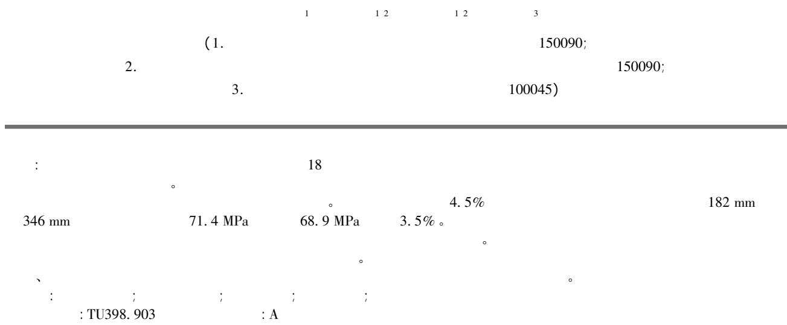

# Experimental study on size effect of circular concrete-filled steel tubular columns subjected to axial compression

CHEN Peng 1 WANG Yuyin1 2 LIU Changyong 1 2 TIAN Yu3

( 1． School of Civil Engineering Harbin Institute of Technology Harbin 150090 China;

2． Key Lab of Structures Dynamic Behavior and Control of the Ministry of Education Harbin Institute of Technology Harbin 150090 China;

3． Beijing Institute of Architectural Design Beijing 100045 China)

Abstract: Eighteen short columns with different diameters and steel ratios were tested to failure to investigate the size effect behavior of concrete-filled steel tubular columns subjected to axial compression． Size effect on composite elastic modulus and peak axial stress were studied.Theexperimental results show that the valueof the composite modulus remains almost constant when the diameter of the specimens is increased; the peak axial stress of the specimens tends to decrease with the increase of the column diameter and it is related to steel ratio． For the specimens with the steel ratio of $4 . 5 \%$ the peak axial stress is decreased from 71． 4 MPa to 68． 9 MPa when the column diameter is increased from 182 mm to 346 mm showing a $3 . 5 \%$ decrease in compressive strength． In addition the size-dependent bearing capacity of concrete filled steel tubular columns was proposed on the basis of concrete ’ s size effect and component analysis． The comparison between predicted and test results indicates that the proposed formula can provide satisfactory estimation． Finally the influences of steel ratio yield stress of steel and compressive strength of concrete on size effect were analyzed based on the proposed formula.

Keywords: concrete filled steel tube; steel ratio; size effect; axial compression test; peak stress

( 51378152) 。( 1988— ) ，银( 1975— ) ，: 2017 8

E-mail: chenpeng. hit@ hotmail. com E-mail: wangyuyin@ hit. edu. cn

0

<table><tr><td colspan="9">530 m</td><td></td></tr><tr><td>1.32 m4;</td><td colspan="8">432 m</td><td></td></tr><tr><td>1.8 m5;</td><td colspan="8">518 m</td><td></td></tr><tr><td></td><td colspan="8">3.5 m×</td><td></td></tr><tr><td>5.6 m6。</td><td></td><td></td><td></td><td></td><td></td><td></td><td></td><td></td><td></td></tr><tr><td></td><td></td><td></td><td></td><td></td><td></td><td></td><td></td><td></td><td></td></tr><tr><td>Sakino7</td><td>1</td><td></td><td></td><td></td><td></td><td></td><td></td><td></td><td></td></tr><tr><td>150 mm</td><td>900 mm</td><td>1.1</td><td></td><td></td><td></td><td></td><td></td><td></td><td></td></tr><tr><td>18.3%。</td><td></td><td></td><td></td><td></td><td></td><td></td><td></td><td></td><td></td></tr><tr><td></td><td></td><td></td><td></td><td></td><td></td><td></td><td></td><td></td><td></td></tr><tr><td></td><td></td><td></td><td></td><td></td><td></td><td></td><td></td><td></td><td></td></tr><tr><td></td><td></td><td></td><td></td><td></td><td></td><td></td><td></td><td></td><td></td></tr><tr><td></td><td></td><td></td><td></td><td></td><td></td><td></td><td></td><td></td><td></td></tr><tr><td></td><td></td><td></td><td></td><td></td><td></td><td></td><td></td><td></td><td></td></tr><tr><td></td><td></td><td></td><td></td><td></td><td></td><td></td><td></td><td></td><td></td></tr><tr><td></td><td></td><td></td><td></td><td></td><td></td><td></td><td></td><td></td><td></td></tr><tr><td></td><td></td><td></td><td></td><td></td><td></td><td></td><td></td><td></td><td></td></tr><tr><td></td><td></td><td></td><td></td><td></td><td></td><td></td><td></td><td></td><td></td></tr><tr><td></td><td>D。</td><td></td><td></td><td></td><td></td><td></td><td></td><td></td><td></td></tr><tr><td></td><td>4.5%、6.5%</td><td>1</td><td></td><td></td><td></td><td></td><td></td><td>182、266、</td><td></td></tr><tr><td></td><td>346 mm</td><td>2</td><td></td><td></td><td></td><td></td><td></td><td>187、246、308 mm。</td><td></td></tr><tr><td></td><td></td><td></td><td></td><td></td><td></td><td></td><td></td><td></td><td></td></tr><tr><td></td><td></td><td></td><td></td><td></td><td></td><td></td><td></td><td></td><td></td></tr><tr><td></td><td></td><td></td><td></td><td></td><td></td><td></td><td></td><td></td><td></td></tr><tr><td></td><td></td><td></td><td></td><td></td><td></td><td></td><td></td><td></td><td></td></tr><tr><td></td><td></td><td></td><td></td><td></td><td></td><td></td><td></td><td></td><td></td></tr><tr><td></td><td></td><td></td><td></td><td></td><td></td><td></td><td></td><td></td><td></td></tr><tr><td></td><td></td><td></td><td></td><td></td><td></td><td></td><td></td><td></td><td></td></tr><tr><td></td><td></td><td></td><td></td><td></td><td></td><td></td><td></td><td></td><td></td></tr><tr><td></td><td></td><td></td><td></td><td></td><td></td><td></td><td></td><td></td><td>H)</td></tr><tr><td></td><td></td><td></td><td></td><td></td><td></td><td></td><td></td><td></td><td></td></tr><tr><td></td><td></td><td></td><td></td><td></td><td></td><td></td><td></td><td></td><td></td></tr><tr><td></td><td></td><td></td><td></td><td></td><td></td><td></td><td></td><td></td><td></td></tr><tr><td></td><td></td><td></td><td></td><td></td><td></td><td></td><td></td><td></td><td></td></tr><tr><td></td><td></td><td></td><td></td><td></td><td></td><td></td><td></td><td></td><td></td></tr><tr><td></td><td></td><td></td><td></td><td></td><td></td><td></td><td></td><td></td><td></td></tr><tr><td></td><td></td><td></td><td></td><td></td><td></td><td></td><td></td><td></td><td></td></tr><tr><td></td><td></td><td></td><td></td><td></td><td></td><td></td><td></td><td></td><td></td></tr><tr><td></td><td></td><td></td><td></td><td></td><td></td><td></td><td></td><td></td><td></td></tr><tr><td></td><td></td><td></td><td></td><td></td><td></td><td></td><td></td><td></td><td></td></tr><tr><td></td><td></td><td></td><td></td><td></td><td></td><td></td><td></td><td></td><td></td></tr><tr><td></td><td></td><td></td><td></td><td></td><td></td><td></td><td></td><td></td><td></td></tr><tr><td></td><td></td><td></td><td></td><td></td><td></td><td></td><td></td><td></td><td></td></tr><tr><td></td><td></td><td></td><td></td><td></td><td></td><td></td><td></td><td></td><td></td></tr><tr><td></td><td></td><td></td><td></td><td></td><td></td><td></td><td></td><td></td><td></td></tr><tr><td></td><td></td><td></td><td></td><td></td><td></td><td></td><td></td><td></td><td></td></tr><tr><td></td><td></td><td></td><td></td><td>C45</td><td>2。</td><td>6</td><td></td><td></td><td></td></tr><tr><td></td><td></td><td></td><td></td><td></td><td></td><td></td><td></td><td></td><td></td></tr><tr><td></td><td></td><td></td><td></td><td>fc&#x27; 54.3 MPa。</td><td colspan="4">Q235</td><td></td></tr><tr><td></td><td></td><td></td><td>Sakino</td><td colspan="5">GB/T 228.1-201014。</td><td></td></tr><tr><td>7</td><td>108~450 mm</td><td>36</td><td>f_c&#x27;</td><td colspan="5">f_y&#x27;</td><td></td></tr><tr><td></td><td>120~323 mm</td><td>48</td><td>E_sc</td><td>N_u</td><td colspan="4">1。</td><td></td></tr><tr><td></td><td></td><td></td><td>1.2</td><td></td><td></td><td></td><td></td><td></td><td></td></tr><tr><td>。</td><td>13</td><td>252</td><td colspan="6">10 MN</td><td></td></tr><tr><td>320 mm</td><td colspan="8">80~</td><td></td></tr><tr><td colspan="9">250</td><td></td></tr></table>

Table 1 Design parameters and test results of specimens   

<table><tr><td rowspan="2" colspan="2"></td><td rowspan="2">D /mm</td><td rowspan="2">t /mm</td><td rowspan="2">H /mm</td><td rowspan="2">α /%(As/Ac)</td><td rowspan="2">fc&#x27; /MPa</td><td rowspan="2">fy /MPa</td><td colspan="2">Ese /GPa</td><td colspan="2">Nu /kN</td></tr><tr><td colspan="2">1803</td><td rowspan="2" colspan="2">1872</td></tr><tr><td rowspan="3">LS</td><td>LS-1</td><td>182.48</td><td>1.99</td><td>548</td><td>4.5</td><td>54.3</td><td>312.8</td><td colspan="2">39.3</td></tr><tr><td>LS-2</td><td>182.90</td><td>2.00</td><td>548</td><td>4.5</td><td>54.3</td><td>312.8</td><td>43.2</td><td>41.0</td><td>1889</td><td>1872</td></tr><tr><td>LS-3</td><td>182.73</td><td>2.04</td><td>548</td><td>4.6</td><td>54.3</td><td>312.8</td><td colspan="2">40.5</td><td colspan="2">1924</td></tr><tr><td rowspan="3">LM</td><td>LM-1</td><td>266.42</td><td>2.85</td><td>799</td><td>4.4</td><td>54.3</td><td>311.6</td><td colspan="2">42.1</td><td colspan="2">3963</td></tr><tr><td>LM-2</td><td>266.19</td><td>2.89</td><td>799</td><td>4.5</td><td>54.3</td><td>311.6</td><td>41.7</td><td>40.8</td><td>3923</td><td>3935</td></tr><tr><td>LM-3</td><td>265.49</td><td>2.82</td><td>799</td><td>4.4</td><td>54.3</td><td>311.6</td><td colspan="2">38.6</td><td colspan="2">3920</td></tr><tr><td rowspan="3">LL</td><td>LL-1</td><td>346.49</td><td>3.68</td><td>1039</td><td>4.4</td><td>54.3</td><td>318.4</td><td colspan="2">43.9</td><td colspan="2">6327</td></tr><tr><td>LL-2</td><td>346.31</td><td>3.67</td><td>1039</td><td>4.4</td><td>54.3</td><td>318.4</td><td>38.3</td><td>40.7</td><td>6586</td><td>6484</td></tr><tr><td>LL-3</td><td>345.89</td><td>3.69</td><td>1039</td><td>4.4</td><td>54.3</td><td>318.4</td><td colspan="2">39.8</td><td colspan="2">6538</td></tr><tr><td rowspan="3">HS</td><td>HS-1</td><td>187.22</td><td>2.93</td><td>562</td><td>6.6</td><td>54.3</td><td>353.5</td><td colspan="2">46.0</td><td colspan="2">2272</td></tr><tr><td>HS-2</td><td>186.91</td><td>2.95</td><td>562</td><td>6.6</td><td>54.3</td><td>353.5</td><td>46.5</td><td>46.1</td><td>2287</td><td>2265</td></tr><tr><td>HS-3</td><td>187.28</td><td>2.93</td><td>562</td><td>6.5</td><td>54.3</td><td>353.5</td><td colspan="2">45.8</td><td colspan="2">2237</td></tr><tr><td rowspan="3">HM</td><td>HM-1</td><td>246.94</td><td>3.86</td><td>741</td><td>6.6</td><td>54.3</td><td>362.5</td><td colspan="2">47.0</td><td colspan="2">4071</td></tr><tr><td>HM-2</td><td>246.90</td><td>3.83</td><td>741</td><td>6.5</td><td>54.3</td><td>362.5</td><td>43.8</td><td>44.6</td><td>4125</td><td>4121</td></tr><tr><td>HM-3</td><td>246.86</td><td>3.81</td><td>741</td><td>6.5</td><td>54.3</td><td>362.5</td><td colspan="2">43.1</td><td colspan="2">4166</td></tr><tr><td rowspan="3">HL</td><td>HL-1</td><td>308.84</td><td>4.67</td><td>925</td><td>6.3</td><td>54.3</td><td>350.0</td><td colspan="2">44.5</td><td colspan="2">6179</td></tr><tr><td>HL-2</td><td>307.40</td><td>4.69</td><td>925</td><td>6.4</td><td>54.3</td><td>350.0</td><td>45.9</td><td>45.6</td><td>6277</td><td>6270</td></tr><tr><td>HL-3</td><td>308.48</td><td>4.66</td><td>925</td><td>6.3</td><td>54.3</td><td>350.0</td><td colspan="2">46.5</td><td colspan="2">6355</td></tr></table>

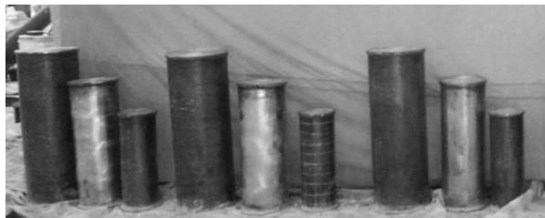  
（a）LS、LM、LL组试件

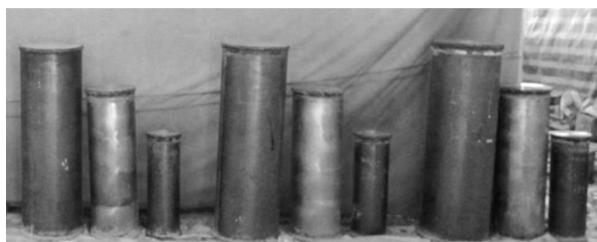  
Fig． 1 Specimens before test

（b）HS、HM、HL组试件

1

2

Table 2 Mix proportion of concrete   

<table><tr><td></td><td></td><td colspan="5">/(kg·m-3)</td></tr><tr><td>C45</td><td>0.45</td><td>180</td><td>400</td><td>1180</td><td>670</td><td>4.0</td></tr><tr><td>(LVDT)</td><td>LVDT</td><td></td><td></td><td>0.001 mm;</td><td></td><td></td></tr><tr><td>LVDT</td><td></td><td></td><td></td><td></td><td></td><td>3</td></tr><tr><td>LVDT</td><td></td><td></td><td>20、50、100 mm。</td><td></td><td></td><td></td></tr><tr><td>90°</td><td></td><td>4</td><td></td><td></td><td>1</td><td></td></tr></table>

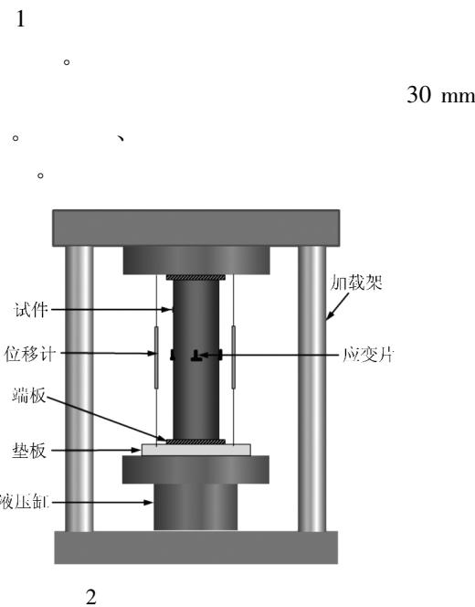  
Fig． 2 Test setup and instrumentation

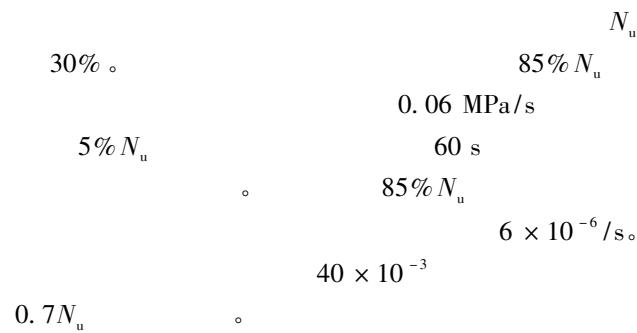

2

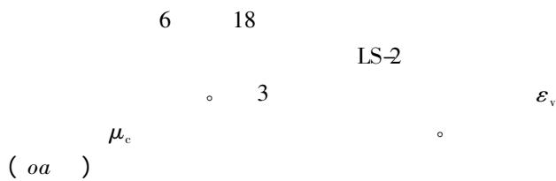

0. 3 。 0. 7Nu

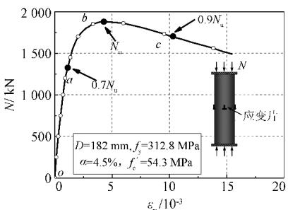

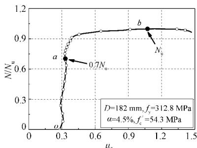  
（a）荷载-轴向应变曲线  
（b）荷载比-横向泊松比曲线

3 LS-2

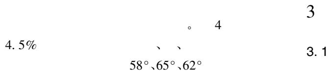  
Fig． 3 Test curves of $N { \ - } _ { \mathcal { E } _ { \mathrm { v } } }$ and $N / { N _ { \mathrm { u } } } \nearrow _ { \mathrm { c } }$ of specimen LS-2

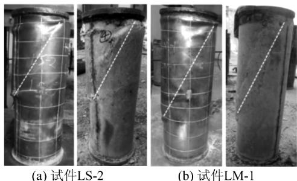

  
Fig． 4 Failure mode of specimens ( $\alpha = 4 . 5 \%$ )

(c)试件LL-1

4 ( α = 4. 5% )

5 18

4. 5%

$$
(D = 1 8 2 \mathrm {m m})
$$

$$
(D = 3 4 6 \mathrm {m m})
$$

$$
(4.5\% ,6.5\%)
$$

$$
E _ {\mathrm {s c}} = N / \left(A _ {\mathrm {s}} + A _ {\mathrm {c}}\right) \varepsilon_ {\mathrm {y}} \tag {1}
$$

$E _ { \mathrm { s c } }$

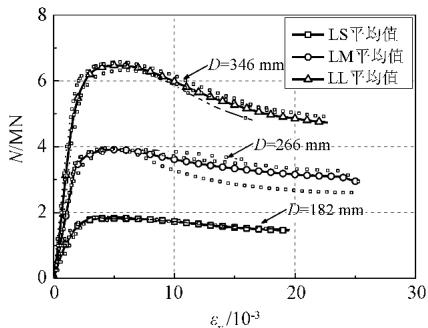

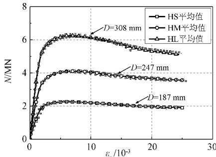  
(a) $\alpha { = } 4 . 5 \%$   
(b)a=6.5%

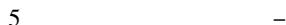  
Fig． 5 Load versus axial strain curves of specimens

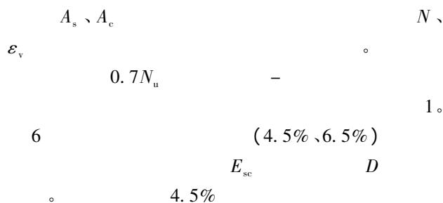

6. 5%

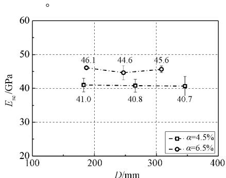  
6   
Fig． 6 Influence of diameter on composite elastic modulus

3. 2

$$
\sigma_ {\mathrm {u}} \quad :
$$

$$
\sigma_ {\mathrm {u}} = N _ {\mathrm {u}} / \left(A _ {\mathrm {s}} + A _ {\mathrm {c}}\right) \tag {2}
$$

$$
N _ {n} \quad \circ
$$

$$
7 \quad 4.5 \% ,6.5 \%
$$

4. 5%

182 mm 346 mm

68. 9 MPa 。

71. 4 MPa

6. 5%

6. 5%

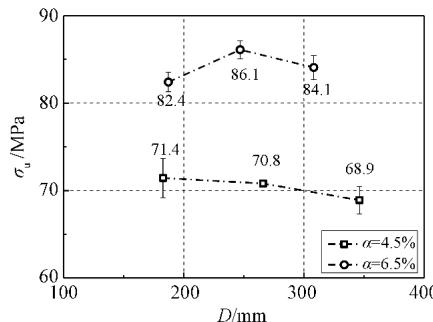  
7   
Fig． 7 Influence of diameter on peak axial stress

3. 3

15

LM-2

$$
\sigma_ {\mathrm {s v}} \cdot \sigma_ {\mathrm {s c}} \cdot \sigma_ {\mathrm {s}}
$$

$$
\sigma_ {\mathrm {c v}} \quad \varepsilon_ {\mathrm {v}}
$$

$$
\sigma_ {\mathrm {s v}}
$$

$$
\left( \begin{array}{l l} O A & \end{array} \right) \quad (A B) 。
$$

OA

A

mises

( AB ) ，

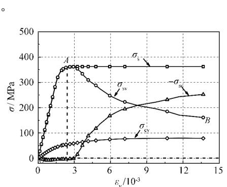  
8

  
Fig． 8 Stress states of steel tubes and concrete core

0. 53fy 。

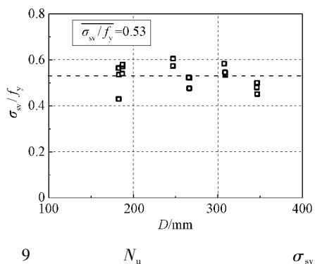  
Fig． 9 Axial stress of steel tube at ultimate load

3. 4

$$
\begin{array}{c c} N _ {\mathrm {u}} & : \\ N _ {\mathrm {s}} & \gamma_ {\mathrm {u}} f _ {\mathrm {c}} ^ {\prime} A _ {\mathrm {c}} \\ \Delta f A _ {\mathrm {c}} & \end{array}
$$

$$
N _ {\mathrm {u}} ^ {\prime} = 0. 5 3 f _ {\mathrm {y}} A _ {\mathrm {s}} + \gamma_ {\mathrm {u}} f _ {\mathrm {c}} ^ {\prime} A _ {\mathrm {c}} + \Delta f A _ {\mathrm {c}} \tag {3}
$$

$$
\begin{array}{c c} \vdots & \gamma_ {\mathrm {u}} \end{array}
$$

Sakino 7

$$
\gamma_ {\mathrm {u}} = \left(\frac {D}{1 5 0}\right) ^ {- 0. 1 1 2} \tag {4}
$$

$$
\Delta f
$$

$$
\Delta f = 1. 1 2 \xi f _ {\mathrm {c}} ^ {\prime} \tag {5}
$$

ξ

$$
\begin{array}{l} \xi = \frac {A _ {\mathrm {a}} f _ {\mathrm {y}}}{A _ {\mathrm {c}} f _ {\mathrm {c}}} \tag {6} \\ \begin{array}{c c c} 1 0 & \xi & \Delta f / f _ {\mathrm {c}} ^ {\prime} \\ & \xi & \Delta f / f _ {\mathrm {c}} ^ {\prime} \end{array} \\ \end{array}
$$

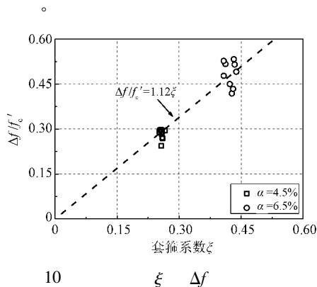  
Fig． 10 Influence of confinement factor $\xi$ on $\Delta f$

( 5) ( 3 )

$$
\begin{array}{l} N _ {\mathrm {u}} ^ {\prime} \\ N _ {\mathrm {u}} ^ {\prime} = 0. 5 3 f _ {\mathrm {y}} A _ {\mathrm {s}} + \left(\gamma_ {\mathrm {u}} + 1. 1 2 \xi\right) f _ {\mathrm {c}} ^ {\prime} A _ {\mathrm {c}} \tag {7} \\ \end{array}
$$

11

$$
(7) \tag {7}
$$

$$
1. 0 0 \quad R ^ {2} = 0. 9 9 \tag {7}
$$

( )

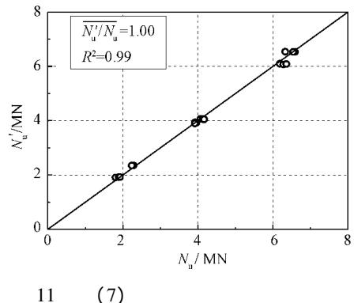  
Fig． 11 Prediction accuracy of formula ( 7)

$$
(7)
$$

396

$$
6 0 \mathrm {m m} \leqslant D \leqslant 1 0 2 0 \mathrm {m m} \quad 2 \leqslant H / D \leqslant
$$

3

$$
0. 0 1 8 \leqslant \alpha \leqslant 0. 3 2 6
$$

$$
1 5 \mathrm {M P a} \leqslant f _ {\mathrm {c}} ^ {\prime} \leqslant 1 0 8 \mathrm {M P a 。}
$$

12 13 EC4 8 ( 7)

12

$$
\mathrm {E C 4}
$$

$$
0. 9 2, 0. 9 7, 1. 0 2 。
$$

EC4 EC4

13

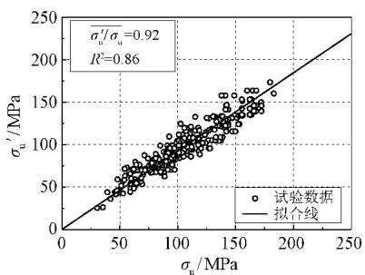  
（a）60 mm≤D≤200 mm

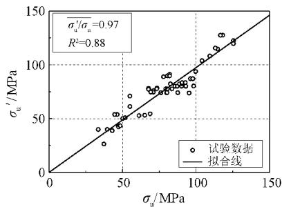  
（b）200 mm<D≤400 mm

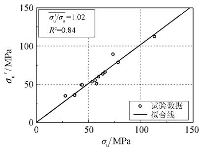  
（c）400 mm<D≤1020 mm

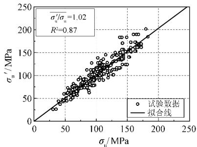  
12 EC4   
Fig． 12 Prediction accuracy of EC4 on peak axial stress of statistical specimens   
（a）60mm≤D≤200mm

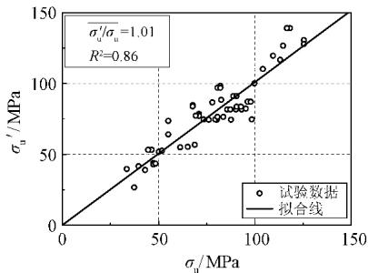  
（b）200 mm<D≤400 mm

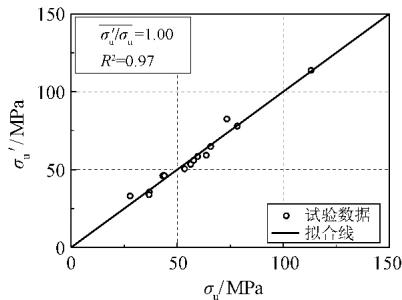  
（c）400 mm<D≤1020mm  
13 ( 7)   
Fig． 13 Prediction accuracy of formula ( 7) on peak axial stress of statistical specimens

1. 02 、1. 01 、1. 00

3. 5

D 、 α 、 $f _ { \mathrm { y } }$

$f _ { \mathrm { c } } ^ { ' }$ 。

14a 、14b 、14c

$f _ { \mathrm { y } }$ 、

$\sigma _ { \mathrm { ~ u ~ } } ^ { \mathrm { ~ \prime ~ } }$

( $D = 1 5 0 ~ \mathrm { m m }$

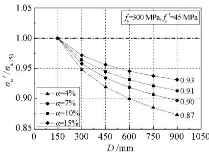  
(a)截面含钢率对尺寸效应的影响

f 'c

α 、

σ u 150

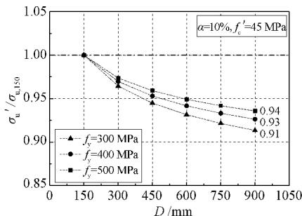  
(b)钢材屈服强度对尺寸效应的影响

( 7)

15a

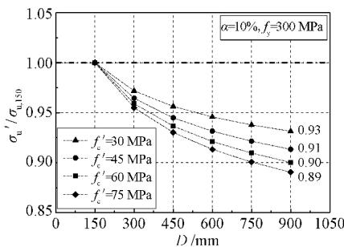  
Fig． 14 Size effect on peak axial stress of CFST column

(c)混凝上强度对尺寸效应的影响

14

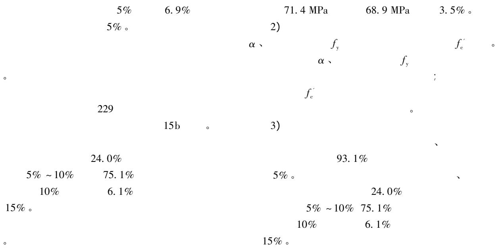

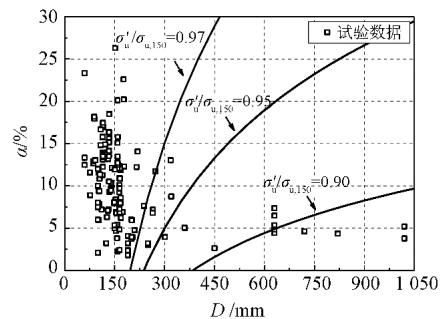

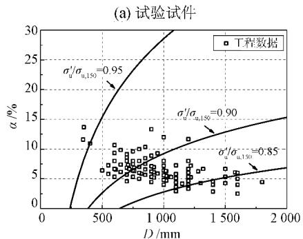  
(b)工程构件  
15   
Fig． 15 Size effect on peak axial stress of CFST columns in test and actual engineering

4

18

1)

182 mm

346 mm

1 HATZIGEORGIOU G D.Numerical model for the behavior and capacity of circular CFT columns: part 1: theory J ． Engineering Structures 2008 30 ( 6 ) : 1573-1578．

2 HAN L H LI W BJORHOVDE R． Developments and advanced applications of concrete-filled steel tubular ( CFST ) structures: members J ． Journal of Constructional Steel Research 2014 100(9):211-228.

3 HAN L H AN Y F． Performance of concrete-encased CFST stub columns under axial compression J ． Journal of Constructional Steel Research 2014 93 ( 1) : 62-76．

4

J ． 2015 ( 9 ) :

42-44． ( WANG Jianjun FENG Zhi HAN Yu QIN Dayan． Steel structure on-site welding process of Hejiang Yangtze River Ibridge arch truss J.Western China Communications Science ＆ Technology 2015 ( 9) : 42-44． ( in Chinese) )

5

J ． 2010 31( 1) : 47-55． ( FANG Xiaodan WEI Hong JIANG Yi et al． Seismic design of the Guangzhou West Tower J ． Journal of Building Structures 2010 31( 1) : 47-55． ( in Chinese) )

6

J ． 2012 42

( 10) : 1-6． ( ZHAO Hong LEI Qiang HOU Shengli LIN Hai． Engineering application of 8 concrete columns mega frame-core wall system in Guangzhou East Tower J ． Building Structure 2012 42 ( 10 ) : 1-6． ( in Chinese) )

7

SAKINO K NAKAHARA H MORINO S NISHIYAMA I． Behavior of centrally loaded concretefilled steel-tube short columns J ． Journal of Structural

Engineering ASCE 2004 130( 2) : 180-188．   
8 European Committee for Standardization ( CEN ) ． Eurocode 4: design of composite steel and concrete structurespart 1-:general rulesand rulesfor buildings: EN 1994-1-1 S ． Brussels: CEN 2004．   
9 Architectural Institute of Japan(AIJ) .Recommendations for design and construction of concrete filled steel tubular structures S. Tokyo: AIJ 2008.   
10 American Institute of Steel Construction． Specification for structural steel buildings: AISC 360-10 S ． Chicago IL: AISC 2010．   
11 : GB 50936—2013 S ． 2013． ( Code for design of concrete filled steel tubular structures: GB 5O936— 2013 S ． Beijing: China Architecture and Building Press 2013． ( in Chinese) )   
12 YAMAMOTO T KAWAGUCHI J MORINO S． Experimental study of scale effects on the compressive behavior of short concrete-filled steel tube columns J ． Composite Construction in Steel and Concrete 2000 25:879-891.

13

) ，2012 28 ( 6) : 974-980． ( LU Xinzheng ZHANG Wankai LI Yi YE Lieping． Size effect of axial strength of concrete-filled square steel tube columns J ． Journal of Shenyang Jianzhu University ( Natural Science ) ，2012 28 ( 6 ) : 974-980． ( in Chinese) )

14

: GB/T

228． 1—2010 S ．

2010． ( Metallic materials-tensile testing: part 1: method of test at room temperature: GB /T 228． 1—2010 S.Beijing:China Architecture & Building Press 2010． ( in Chinese) )

15

D ． 2003: 63-68． WANG Yuyin． Research on behavior of axially loaded circular steel tubes filled with high strength concrete D ． Harbin: Harbin Institute of Technology 2003: 63-68． ( in Chinese) )