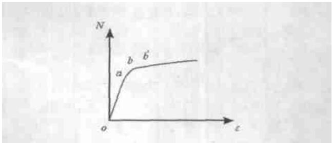

文章编号：1004－9762（2005）01－0005－04

# 钢管混凝土柱的承载能力分析●

李 斌1‚2‚郝润霞2

（1∙西安建筑科技大学 建筑与土木工程学院‚陕西 西安 710055；2∙内蒙古科技大学 建筑与土木工程学院‚内蒙古 包头 014010）

关键词 钢管混凝土柱 承载能力 试验分析 约束效应

中图分类号 文献标识码：A

摘 要 通过对 根钢管混凝土轴压短柱承载力的试验 研究了该种构件承载力的组成及钢管对混凝土的约束效应 分析了各阶段构件的承载能力 认为 钢管混凝土柱的计算可分为使用阶段和极限承载阶段 并提出了相应的推荐公式 理论计算与试验结果吻合较好 可用于指导工程设计

# The analysis of concrete filled steel tube column carrying capacity

LI Bin1‚2‚HAO Run-xia2

（1∙Architecture and Civil Enginering School‚Xi’an Architecture University of Science and Technology‚Xi’an 710055‚China；2．Architecture and Civil Enginering School‚UST Inner Mongolia‚Baotou014010‚China）

Key words：concrete filled steel tube column；carrying capacity；experiment analysis；effect of restriction

Abstract：Through the experiment of 12CFST column‚the composing of carrying capacity and restriction of steel tube were discussed and the carrying capacity was analyzed．It can be concluded that the force process of CFST column was made up of phases-normal phase and limit capability phase．Based on the coincidence of theoretical calculation and experiment‚the corresponding commend formula was proposed‚which may guide the engineering design

钢管混凝土结构因其抗压强度高 抗震性能好施工方便 外形美观和造价经济等优点 在实际工程中得到广泛的应用．我国已经制定了3本有关钢管混凝土的结构设计规程 或规范 然而 由于相关规程（或规范）所采用的理论各不相同‚因此‚制定出的3本规程［1～3］中的有关表达式也不尽相同

本文通过对 根钢管混凝土短柱的试验研究及理论分析 提出钢管混凝土柱分别在使用阶段和极限承载阶段的承载力计算公式 以便更好地利用这种组合构件的优越性

# 1 钢管混凝土短柱承载力计算公式

# 1∙1 基本假定

（1）由于钢管很薄‚径向压应力 $\sigma _ { r }$ 很小‚可略去

不计‚近似认为钢管的纵向压应力 $\sigma _ { 1 }$ 和环向拉应力$\sigma _ { 2 }$ 沿壁厚不变化

（ ）为了便于计算和实践工程中应用‚假定钢管屈服时服从最大剪应力理论‚钢管受纵压环拉力$\sigma _ { 1 }$ 和 $\sigma _ { 2 }$ 异号‚则有

$$
\sigma_ {1} + \sigma_ {2} = f _ {\mathrm {y}}.
$$

为了推导公式的方便‚令 $\sigma _ { 2 } = \beta  { f _ { \mathrm { y } } }$ ‚则

$$
\sigma_ {1} = (1 - \beta) f _ {\mathrm {y}}, \beta = \frac {1}{1 + \sigma_ {1} / \sigma_ {2}}. \tag {1}
$$

（3） 在蔡绍怀等人［4］ 提出的破坏准则的基础上‚提出三向受压下混凝土的强度极限条件为

$$
\sigma_ {0} = f _ {\mathrm {c}} \left(1 + 5. 6 \frac {\sigma_ {r}}{f _ {\mathrm {c}}}\right). \tag {2}
$$

其中 $\sigma _ { r }$ 为核心混凝土及钢管的径向应力

（4） 采用 $\beta$ 和 $L / D$ 的近似关系［5］ 为

$$
\beta = 0. 4 - 0. 0 2 L / D.
$$

# 1∙2 钢管与混凝土的受力示意图

钢管与混凝土的受力示意图如图1所示∙

  
图1 钢管与混凝土受力图  
Fig．1 The force relationship of steel tube and concrete

# 1∙3 公式推导

钢管在弹塑性状态下 应力与 个方向的应变均有关 当塑性变形充分发展时 金属材料遵循体积不变定律‚即

$$
\varepsilon_ {1} + \varepsilon_ {2} + \varepsilon_ {r} = 0,
$$

式中 $\varepsilon _ { r }$ 表示钢管的径向应变

由塑性理论可知‚主剪应力与主剪应变成正比：

$$
\frac {\sigma_ {1} - \sigma_ {r}}{\varepsilon_ {1} - \varepsilon_ {r}} = \frac {\sigma_ {2} - \sigma_ {r}}{\varepsilon_ {2} - \varepsilon_ {r}},
$$

式中 $\sigma _ { 1 }$ 为钢管的纵向应力； $\sigma _ { 2 }$ 为钢管的环向应力； ε $\mathfrak { E } _ { 2 }$ 分别为与 $\sigma _ { 1 }$ $\sigma _ { 2 }$ 对应的应变

根据基本假定‚在钢管表面‚径向应力为零‚故得：

$$
\frac {\sigma_ {1}}{\sigma_ {2}} = \frac {2 \varepsilon_ {1} + \varepsilon_ {2}}{2 \varepsilon_ {2} + \varepsilon_ {1}}, \tag {3}
$$

根据半圈钢管的平衡条件得：

$$
\sigma_ {2} = \frac {d}{2 t} \sigma_ {r}.
$$

由于管壁很薄‚近似得

$$
\frac {4 t}{d} = \frac {A _ {\mathrm {s}}}{A _ {\mathrm {c}}},
$$

则： $\sigma _ { 2 } = \frac { 2 } { \alpha } \sigma _ { r } ( \alpha$ 表示含钢率） （4）

根据上述可以得出：

$$
\begin{array}{l} \sigma_ {r} = \frac {2 t}{d} \left(0. 4 - 0. 0 2 \frac {L}{D}\right) f _ {\mathrm {y}} = \\ \frac {1}{2} \frac {A _ {\mathrm {s}}}{A _ {\mathrm {c}}} \left(0. 4 - 0. 0 2 \frac {L}{D}\right) f _ {\mathrm {y}}. \tag {5} \\ \end{array}
$$

钢管的承载力：

$$
N _ {\mathrm {s}} = A _ {\mathrm {s}} \sigma_ {1} = A _ {\mathrm {s}} \left(f _ {\mathrm {y}} - \sigma_ {2}\right).
$$

混凝土的承载力：

$$
N _ {\mathrm {c}} = A _ {\mathrm {c}} \sigma_ {0} = A _ {\mathrm {c}} f _ {\mathrm {c}} \left(1 + 5. 6 \frac {\sigma_ {r}}{f _ {\mathrm {c}}}\right).
$$

钢管混凝土的极限承载力为：

$$
\begin{array}{l} N = N _ {\mathrm {s}} + N _ {\mathrm {c}} = A _ {\mathrm {s}} \left(f _ {\mathrm {y}} - \sigma_ {2}\right) + A _ {\mathrm {c}} f _ {\mathrm {c}} (1 + \\ 5. 6 \frac {\sigma_ {r}}{f _ {\mathrm {c}}}) = A _ {\mathrm {s}} f _ {\mathrm {y}} + A _ {\mathrm {c}} f _ {\mathrm {c}} (1 + 1. 8 \hat {\xi} (0. 4 - \\ 0. 0 2 L / D)) = A _ {\mathrm {s}} f _ {\mathrm {y}} + \eta A _ {\mathrm {c}} f _ {\mathrm {c k}}, \tag {6} \\ \end{array}
$$

$\eta = \frac { 1 } { 1 . 4 } \biggl ( 1 + 1 . 8 \hat { \mathsf { \mathsf { \mathsf { \xi } } } } ( 0 . 4 - 0 . 0 2 \frac { L } { D } ) \biggr ) \ ,$

$\eta$ 代表核心混凝土强度提高综合系数‚主要和长细比、套箍系数有关‚它综合了钢管纵向应力的下降和核心混凝土强度的提高； $\boldsymbol { \xi }$ 为套箍系数．根据式（ ）计算得出的 $\eta _ { _ { \mathrm { t } } }$ 见表

# 2 试验结果与计算结果的比较

# 2∙1 试件受力的两个阶段

大量的试验研究表明‚在正常含钢率范围（ $\alpha =$ $7 \%$ ） 内‚钢管混凝土短柱的荷载 应变曲线基本可分为弹性、弹塑性及塑性 个阶段‚如图 所示．本次试验试件的含钢率均大于 $9 \%$ ．从图 可以看出‚在$a$ 点以前‚荷载与纵横向应变基本按比例增加．另外‚由于曲线 oabb′与碳素结构钢的荷载应变曲线类似‚因而‚将轴心受压钢管混凝土柱当成理想弹塑

表1 钢管混凝土试件及试验数据一览表  
Table1 CFST member and test data   

<table><tr><td>试件</td><td>D×t×L</td><td>fy /MPa</td><td>ξ</td><td>Neu /MPa</td><td>N0 /MPa</td><td>Nu /MPa</td><td>k/%</td><td>Nu /MPa</td><td>Nu/Nu</td><td>Nu/Nu</td><td>ηt</td><td>ηe</td></tr><tr><td>SC-1</td><td>164×3.8×520</td><td>342</td><td>1.116</td><td>1650</td><td>1239</td><td>1358</td><td>33</td><td>1356</td><td>0.822</td><td>0.823</td><td>1.20</td><td>1.7</td></tr><tr><td>SC-2</td><td>164×3.8×520</td><td>342</td><td>1.116</td><td>1710</td><td>1239</td><td>1358</td><td>38</td><td>1356</td><td>0.793</td><td>0.794</td><td>1.20</td><td></td></tr><tr><td>SC-3</td><td>164×3.8×520</td><td>342</td><td>1.116</td><td>1600</td><td>1239</td><td>1358</td><td>29</td><td>1356</td><td>0.848</td><td>0.849</td><td>1.20</td><td></td></tr><tr><td>SC-4</td><td>159×4.8×520</td><td>366</td><td>1.559</td><td>1600</td><td>1383</td><td>1488</td><td>16</td><td>1587</td><td>0.992</td><td>0.930</td><td>1.38</td><td>1.5</td></tr><tr><td>SC-5</td><td>159×4.8×520</td><td>366</td><td>1.559</td><td>1700</td><td>1383</td><td>1488</td><td>23</td><td>1587</td><td>0.934</td><td>0.875</td><td>1.38</td><td></td></tr><tr><td>SC-6</td><td>159×4.8×520</td><td>366</td><td>1.559</td><td>1600</td><td>1383</td><td>1488</td><td>16</td><td>1587</td><td>0.992</td><td>0.930</td><td>1.38</td><td></td></tr><tr><td>SC-7</td><td>159×5.2×520</td><td>379</td><td>1.763</td><td>1800</td><td>1480</td><td>1578</td><td>22</td><td>1728</td><td>0.960</td><td>0.877</td><td>1.47</td><td>1.6</td></tr><tr><td>SC-8</td><td>159×5.2×520</td><td>379</td><td>1.763</td><td>1850</td><td>1480</td><td>1578</td><td>25</td><td>1728</td><td>0.934</td><td>0.853</td><td>1.47</td><td></td></tr><tr><td>SC-9</td><td>159×5.2×520</td><td>379</td><td>1.763</td><td>1700</td><td>1480</td><td>1578</td><td>15</td><td>1728</td><td>1.034</td><td>0.928</td><td>1.47</td><td></td></tr><tr><td>SC-10</td><td>159×6.3×520</td><td>360</td><td>2.119</td><td>2000</td><td>1602</td><td>1714</td><td>45</td><td>1918</td><td>0.959</td><td>0.857</td><td>1.62</td><td>1.8</td></tr><tr><td>SC-11</td><td>159×6.3×520</td><td>360</td><td>2.119</td><td>1950</td><td>1602</td><td>1714</td><td>41</td><td>1918</td><td>0.984</td><td>0.879</td><td>1.62</td><td></td></tr><tr><td>SC-12</td><td>159×6.3×520</td><td>360</td><td>2.119</td><td>2100</td><td>1602</td><td>1714</td><td>52</td><td>1918</td><td>0.913</td><td>0.816</td><td>1.62</td><td></td></tr></table>

注： $D , t , L$ 分别代表钢管的外直径（mm）、厚度（mm）和长度（m）；f 为混凝土强度标准值； $f _ { \mathrm { y } }$ 为钢管的屈服强度； $N _ { \mathrm { u } } ^ { \mathrm { e } }$ 代表极限承载力的试验值； $N _ { \mathrm { u } } ^ { \mathrm { t } }$ 表示按文献［3］ 计算得出的极限承载力理论值； $\eta$ 表示核心混凝土承载力提高系数； $\eta _ { \mathrm { t } }$ 为按公式（7） 计算得出； $\eta _ { \mathrm { e } }$ 根据试验分析得出； $N _ { 0 }$ 表示使用阶段承载力；ξ表示套箍系数； $k = \mathrm { ~ ( ~ } N _ { \mathrm { u } } ^ { \mathrm { e } } - N _ { \mathrm { 0 } } \mathrm { ) / } N _ { \mathrm { 0 } }$ 代表使用阶段安全储备率； $N _ { \mathrm { u } }$ 按公式（6） 计算得出．

性体也是可行的 如何很好地利用钢管混凝土的受力特性 这就需要将其分阶段来分析 很显然 达到极限阶段可有效地发挥材料的性能 但是可能会产生大的变形 因此 将钢管的某个薄弱点达到屈服为分界点‚将钢管达到屈服以前的阶段称为使用阶段钢管屈服后‚由于混凝土的存在‚构件的承载力继续提高并达到极限承载力的阶段称为极限承载阶段

  
图2 荷载 应变关系图  
Fig．2 Curve of load-strain

第一阶段（使用阶段）：

$$
N _ {0} = N _ {\mathrm {s}} + N _ {\mathrm {c}} = f _ {\mathrm {y}} A _ {\mathrm {s}} + f _ {\mathrm {c k}} A _ {\mathrm {c}},
$$

式中 $N _ { 0 }$ 表示使用阶段轴压承载力； $N _ { \mathrm { s } }$ 表示钢管承担的荷载； $N _ { \mathrm { c } }$ 表示混凝土承担的荷载

此阶段‚通过试验研究发现‚钢管与混凝土的相互作用几乎没有或只是初级阶段‚但由于混凝土的浇筑无腹筋的影响‚浇筑质量好‚其与钢管共同受力‚材料强度可充分发挥‚用混凝土的标准值代替设

计强度值‚其承载力有一定的提高

第二阶段（极限承载阶段）：

此阶段表达式见式（ ）．此阶段可作为安全储备‚用来抵抗突发事故和地震灾害‚保证结构有足够的承载能力和变形能力‚防止结构体系发生灾难性破坏

这样分为 个阶段的表达‚可以使人一目了然概念清晰．在使用阶段‚钢管和混凝土分别按照各自的刚度承担载荷．在极限承载阶段‚由于钢管和混凝土之间相互作用使核心混凝土的承载力提高‚变形能力增强‚可充分发挥 种材料组合的优越性

# 2∙2 试验过程描述

对试验全过程的观测表明：所有的试件都有较好的延性和后期承载能力．在试验开始‚各试件按其预期极限荷载的 $1 / 1 0$ 进行加载．受荷初期‚试件处于弹性阶段‚其外形无明显的变化；当荷载加至极限荷载的 $4 0 \% \sim 5 0 \%$ 时‚钢管表面出现轻微的铁皮脱落‚局部开始出现 $4 5 ^ { \circ }$ 滑移线‚表明钢管已局部达到比例极限‚逐渐进入弹塑性阶段；随后‚各试件按其预期极限荷载的 $1 / 1 5$ 加载‚随着外载的继续增加滑移线逐步布满钢管；当荷载加到极限荷载的 $70 \%$ $\sim 8 0 \%$ 时‚在钢管混凝土试件中部开始有局部凸出现象‚表明钢管已部分进入塑性阶段‚此时‚钢管的环向应变急剧增大‚而试件的承载力有一定的下降但很快又逐渐回升‚表明钢管的纵向应力在下降‚其

承担的部分荷载转移到核心混凝土上‚环向应力迅速增大‚环箍效应发挥比较充分；此时‚慢速连续加载‚试件的上端部也开始出现局部凸出现象；最后试件的下端部也出现局部凸出现象‚试件达到极限承载力‚但是‚试件的承载力在一定范围内保持不变‚并没有下降的趋势‚表明构件具有较好的后期承载能力

通过对钢管混凝土短试件的试验总结和受力分析表明‚在受荷初期‚钢管和混凝土之间不产生相互作用力．在钢管达到弹性比例极限时‚混凝土的横向变形系数已经赶上或超过钢管的变形系数‚但是它们之间的相互抑制作用较弱‚在这个阶段‚根据前面的试验分析‚钢管和混凝土可看作是由 个单独受力的组合体构成．超过弹性比例阶段‚构件进入弹塑性工作阶段‚核心混凝土受到的侧压应力不断增大其横向变形系数 $\boldsymbol { \mu } _ { \mathrm { ~ c ~ } }$ 增大‚钢管进入塑性状态‚但试件不仅不会破坏‚仍能继续增加外荷‚钢管的横向变形系数达到 $\mu _ { \mathrm { _ s } } = 0 . 5$ ‚核心混凝土 $\mu _ { \mathrm { c } } > 0 . 5$ ‚紧箍作用继续存在‚混凝土不但承担了由于钢管塑流的卸荷‚而且还承担了不断增大的外荷‚横向变形急剧增大‚应力 应变曲线平缓上升

# 试验结果与计算结果比较

根据对国内外大量的试验研究结果的分析‚文献 提出标准试件长径比的范围为 $_ \mathrm { L } / \mathrm { D } = 3 . 0 \sim$ ．‚可有效减小端部效应的影响‚并减少偏心的影响．因此‚本试验选取钢管混凝土构件的长细比为$L / D = 3 . 3$ ．钢管采用无缝钢管和焊管‚无缝钢管有三种壁厚‚分别为 $\mathbf { \nabla } _ { [ D } \times \mathbf { \nabla } _ { t } )$ ）： $1 5 9 \times 4 . 8 , 1 5 9 \times 5 . 2$ 及$1 5 9 \times 6 . 3$ ‚焊管的尺寸为 $1 6 4 \times 3 . 8 $ ‚核心混凝土强度等级按 进行配制‚最后测得 $f _ { \mathrm { c k } } = 3 0 . 5 ~ \mathrm { M P a } .$ ．具体数值见表1

从表1试验数据分析可以看出：

（ ） 钢管混凝土轴压构件极限承载力远远大于钢管和核心混凝土承载力之和 $k$ 平均值达 $3 0 \%$ 左

右

（2） 核心混凝土的强度提高综合系数η试验值达 ． 以上‚充分说明使用钢管混凝土这种结构的优越性所在  
（3） $N _ { \mathrm { u } } / N _ { \mathrm { u } } ^ { \mathrm { e } }$ 与 $N _ { \mathrm { u } } ^ { \mathrm { t } } / N _ { \mathrm { u } } ^ { \mathrm { e } }$ 值相比‚前者略大于后者或相持平 $N _ { \mathrm { u } } / N _ { \mathrm { u } } ^ { \mathrm { e } }$ 的平均值为0．930‚均方差为0．0673‚可见理论值与试验值符合较好  
（4） $\eta _ { \mathrm { _ t } } / \eta _ { \mathrm { _ e } }$ 的平均值约为0．861‚充分说明核心混凝土强度提高综合系数理论值与试验值吻合很好

# 3 结论

采用最大剪应力理论得出的钢管混凝土极限承载力计算公式求得的极限承载力值与试验结果所得吻合较好 将钢管混凝土的计算分为两个阶段 便于理解和应用．在正常的受力情况下‚在正常含钢率范围内‚使用阶段的计算公式便可满足要求．当地震来临时‚钢管和混凝土相互作用的发挥使其有足够的强度和变形来耗散和吸收能量 抵御突然的灾害 使用阶段计算时 可将钢管和混凝土的受力均按一维情况考虑 因此计算比较简洁 从试验数据来看 也合乎规范的安全度水平的要求

# 参考文献：

［1］ CECS－中国工程建设标准化协会标准‚钢管混凝土结构设计与施工规程［S］  
［2］ JCJ－国家建筑材料工业局标准‚钢管混凝土结构设计与施工规程［S ］  
［3］ DL／T－中国电力行业标准‚钢管混凝土组合结构设计规程 ［S ］  
［4］ 潘友光．混凝土强度理论及在钢管混凝土中的应用哈尔滨建筑工程学院学报  
［5］ 李继读．钢管混凝土轴压承载力的研究［J］．工业建筑1985，(2).25-31.  
韩林海 钢管混凝土结构 北京 科学出版社