"::: D @E@? = 4::4 A :4 D ::!" D :F

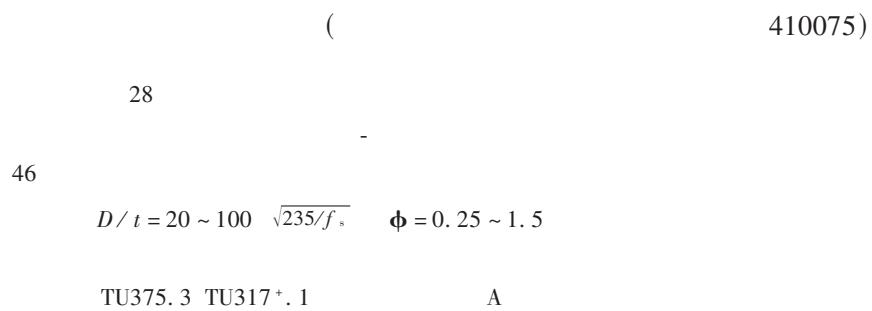

# [232(&1J23 $’ +2J(S,$& $* \,.J><2&*$&](’12 R$’1&202 O,),2- Y%^%)(& /022) /J$&0 R$)%]’3

GH IJ,K%8 LM9N O(P,’.8 QM9 /$’.

= R$))2.2 $* R,S,) T’.,’22&,’. (’- ;&1J,0210%&2 R2’0&() H’,S2&3,0U /$%0J8 RJ(’.3J( !"::FC8 RJ,’( A

!"#$%&’$( +(32- $’ 0J2 2P<2&,]2’0() 30%-U $* 4E J,.J><2&*$&](’12 1$’1&202 *,))2- 0%^%)(& 3022) 3J$&0 1$)%]’38 0J,3 <(<2& -,31%3323 0J2 <&,’1,<() *(10$&3 $**210,’. 0J2 %)0,](02 )$(-,’. 1(<(1,0U $* J,.J><2&*$&](’12 1$’1&202 *,))2- 0%^%)(& 3022) 3J$&0 1$)%]’38 (’- ()3$ <&232’03 0J2 1()1%)(0,$’ *$&]%)( *$& 30&233 >30&(,’ 1%&S23 $* 1$]<$3,02 ](02&,() $* J,.J><2&*$&](’12 1$’1&202 *,))2- 3022) 0%^23 (’- 0J2 2]<,&,1() 1()1%)(0,$’ *$&]%)(3 $* %)0,](02 30&2’.0J8 <2(_ 30&(,’ (’- <)(02(% &2](,’,’. 30&2’.0J7 M’ (--,0,$’8 ^(32- $’ (’()U‘,’. 0J2 0230 &23%)03 $* !@ 3<21,]2’3 (0 J$]2 (’- 0J2 2P,30,’. 0J2$&20,1() (1J,2S2]2’038 0J,3 <(<2& <&$<$323 0J2 1()1%)(0,$’ *$&]%)( *$& %)0,](02 )$(-,’. 1(<(1,0U $* J,.J><2&*$&](’12 1$’1&202 *,))2- 0%^%)(& 3022) 3J$&0 1$)%]’3 (’- ()3$ 3%..2303 ,03 (<<&$<&,(02 &(’.28 ,7 27 0J2 &(0,$ $* -,(]202& 0$ 0J,1_’233 L X 0 ,3 (^$%0 4: W ":: "45CX $ 3 $& 0J2 ,’-2P $* 1$’*,’2]2’0 ^U 3022) 30,&&%<3 $\Phi$ ,3 (^$%0 :B 4C W "B CB

)*+,-%.# ( J,.J><2&*$&](’12 1$’1&202 *,))2- 0%^%)(& 3022)8 %)0,](02 30&2’.0J8 ]21J(’,1() <&$<2&0,238 ,’-2P $* 1$’*,’2> ]2’0 ^U 3022) ’203

"

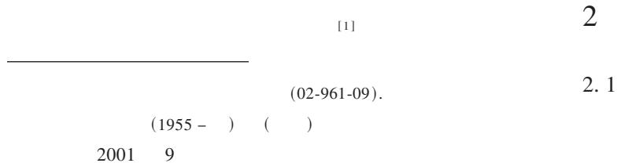

一部分，试验目的在于：（1）观察研究钢管高性能混凝土短柱承受轴心荷载的破坏规律；(2)研究常温下不同含钢率(或套箍指标)对钢管高性能混凝土短柱极限承载力的影响。

钢管高性能混凝土短柱试件制作时，将成型的钢管下端焊上 $1 \mathrm { m m }$ 厚的钢板作底模。混凝土采用强制式25L搅拌机拌和，制作时将钢管直立，混凝土自上口灌入，用实验室平板振动台振实，端部混凝土抹平，标准养护7天，此后自然养护。试验前在所有试件上端用水泥砂浆找平，以厚钢板作承压垫板。

本次试验主要考察常温下不同含钢率对承载力的影响。根据当前已有的普通钢管混凝土和钢管高强混凝土的试验结果可知，影响钢管混凝土轴心受压短柱承载力的因素主要有三个：即混凝土强度，含钢率，钢材强度。用一个指标来综合反映，也就是套箍指标$\bar { \pmb { \phi } } ^ { [ 2 ] }$ 。研究表明套箍指标越大，则承载力越高。这批试件选用9种不同的套箍指标，试件主要试验参数详见表1。试件编号的含义为：G2、G4表示第2批、第4批短柱试件，之后的数字为构件的壁厚，再之后的英文字母为构件的序号。

表1试验参数一览表  
Table 1 Properties of specimens   

<table><tr><td>序号</td><td>试件编号</td><td>尺寸L-D-t/mm</td><td>f1MPa</td><td>feuMPa</td><td>fcMPa</td><td>套箍指标Φ</td><td>含钢率ρ</td><td>D/tkN</td><td>No</td></tr><tr><td>1</td><td>G4-1a</td><td></td><td></td><td></td><td></td><td></td><td></td><td></td><td>1773.8</td></tr><tr><td>2</td><td>G4-1b</td><td>500-165-1</td><td>338</td><td>84.4</td><td>69.208</td><td>0.1206</td><td>0.02424</td><td>165</td><td>1430.8</td></tr><tr><td>3</td><td>G4-1c</td><td></td><td></td><td></td><td></td><td></td><td></td><td></td><td>1372.0</td></tr><tr><td>4</td><td>G4-1d</td><td></td><td></td><td></td><td></td><td></td><td></td><td></td><td>2038.4</td></tr><tr><td>5</td><td>G2-2a</td><td>500-151-2</td><td>405</td><td>80.1</td><td>65.682</td><td>0.3401</td><td>0.05298</td><td>75.5</td><td>2132.4</td></tr><tr><td>6</td><td>G2-2b</td><td></td><td></td><td></td><td></td><td></td><td></td><td></td><td>1933.2</td></tr><tr><td>7</td><td>G4-2a</td><td></td><td></td><td></td><td></td><td></td><td></td><td></td><td>2244.2</td></tr><tr><td>8</td><td>G4-2b</td><td></td><td></td><td></td><td></td><td></td><td></td><td></td><td>2381.4</td></tr><tr><td>9</td><td>G4-2c</td><td>500-165-2</td><td>338</td><td>84.4</td><td>69.208</td><td>0.2457</td><td>0.04848</td><td>82.5</td><td>2077.6</td></tr><tr><td>10</td><td>G4-2d</td><td></td><td></td><td></td><td></td><td></td><td></td><td></td><td>1930.6</td></tr><tr><td>11</td><td>G4-2e</td><td></td><td></td><td></td><td></td><td></td><td></td><td></td><td>1920.8</td></tr><tr><td>12</td><td>G2-3a</td><td></td><td></td><td></td><td></td><td></td><td></td><td></td><td>2337.1</td></tr><tr><td>13</td><td>G2-3b</td><td>500-149-3</td><td>438</td><td>80.1</td><td>65.682</td><td>0.5731</td><td>0.08054</td><td>49.7</td><td>2394.2</td></tr><tr><td>14</td><td>G2-3c</td><td></td><td></td><td></td><td></td><td></td><td></td><td></td><td>2361.0</td></tr><tr><td>15</td><td>G4-3a</td><td></td><td></td><td></td><td></td><td></td><td></td><td></td><td>2567.6</td></tr><tr><td>16</td><td>G4-3b</td><td>500-165-3</td><td>338</td><td>84.4</td><td>69.208</td><td>0.3755</td><td>0.07273</td><td>55</td><td>2714.6</td></tr><tr><td>17</td><td>G4-3c</td><td></td><td></td><td></td><td></td><td></td><td></td><td></td><td>2734.2</td></tr><tr><td>18</td><td>G2-4.5a</td><td></td><td></td><td></td><td></td><td></td><td></td><td></td><td>2743.1</td></tr><tr><td>19</td><td>G2-4.5b</td><td>500-151-4.5</td><td>438</td><td>80.1</td><td>65.682</td><td>0.8721</td><td>0.1192</td><td>33.6</td><td>2572.3</td></tr><tr><td>20</td><td>G2-4.5c</td><td></td><td></td><td></td><td></td><td></td><td></td><td></td><td>2727.6</td></tr><tr><td>21</td><td>G4-4a</td><td></td><td></td><td></td><td></td><td></td><td></td><td></td><td>2704.8</td></tr><tr><td>22</td><td>G4-4b</td><td>500-165-4</td><td>338</td><td>84.4</td><td>69.208</td><td>0.5104</td><td>0.09697</td><td>41.2</td><td>2773.4</td></tr><tr><td>23</td><td>G4-4c</td><td></td><td></td><td></td><td></td><td></td><td></td><td></td><td>2832.2</td></tr><tr><td>24</td><td>G2-6a</td><td>500-159-6</td><td>405</td><td>80.1</td><td>65.682</td><td>1.0478</td><td>0.15095</td><td>26.5</td><td>2957.6</td></tr><tr><td>25</td><td>G2-6b</td><td></td><td></td><td></td><td></td><td></td><td></td><td></td><td>3099.3</td></tr><tr><td>26</td><td>G2-8a</td><td></td><td></td><td></td><td></td><td></td><td></td><td></td><td>3173.7</td></tr><tr><td>27</td><td>G2-8b</td><td>500-159-8</td><td>438</td><td>80.1</td><td>65.682</td><td>1.5757</td><td>0.20126</td><td>19.9</td><td>3267.4</td></tr><tr><td>28</td><td>G2-8c</td><td></td><td></td><td></td><td></td><td></td><td></td><td></td><td>3330.4</td></tr></table>

注： $f _ { \mathrm { c } } = 0 , 8 2 f _ { \mathrm { c u } }$ ， $\Phi { = } f _ { \mathrm { s } } A _ { \mathrm { s } } / \left( f _ { \mathrm { c } } A _ { \mathrm { c } } \right) , \rho { = } 4 t / D , f _ { \mathrm { s } }$ 为实测钢材屈服强度。

# 2.2试验方法及测试内容

试件立方体抗压强度在中南大学建筑材料实验室$2 0 0 0 \mathbf { k N }$ 液压试验机上进行试验；钢管高性能混凝土短柱的承载力在中南大学结构实验室 $5 0 0 0 \mathbf { k N }$ 液压试验机上进行试验；钢条的强度在中南大学结构实验室$2 0 0 \bf k N$ 万能试验机上进行试验。荷载变形曲线和荷载应变曲线由IMP数据采集系统采集。试验加载示意图如图1所示。本次试验的加载制度为：在试件达到最大承载力前分级加载，每级荷载相当于极限荷载的1/10左右，但每级荷载间隔时间较短，近似于慢速连续加载,数据分级采集。试件接近极限荷载时，慢速连续加载直至试件破坏，数据连续采集。

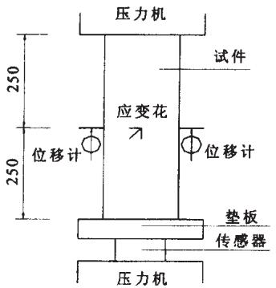  
图1试验装置示意图  
Fig.1 Test specimen and instrumentation

表2混凝土配合比 $( \mathbf { k g } / \mathbf { m } ^ { 3 } .$   
Table 2 Mix proportion of high-performance concrete   

<table><tr><td>强度
等级</td><td>525号硅酸盐水泥</td><td>超细粉
UPFA</td><td>硅粉</td><td>中粗河砂</td><td>碎石(粒径0.5~2cm)</td><td>水</td><td>膨胀剂
UEA</td><td>复合高效
减水剂 SP</td></tr><tr><td>C85</td><td>356.5</td><td>186</td><td>46.5</td><td>530</td><td>1120</td><td>145</td><td>31</td><td>8.04</td></tr><tr><td>C80</td><td>356.5</td><td>155</td><td>46</td><td>530</td><td>1120</td><td>145</td><td>62</td><td>7.44</td></tr></table>

# 2.3材性试验

与钢管高性能混凝土相同配合比的混凝土立方体试件，采用 $1 0 0 \times 1 0 0 \times 1 0 0 \mathrm { m m }$ 立方体试件标养28天的抗压强度平均值91.8MPa和 $8 7 . 1 \mathrm { M P a }$ ，换算成标准立方体抗压强度值分别为 $8 4 . 4 \mathrm { M P a }$ 和 $8 0 . 1 \mathrm { M P a }$ ，满足设计要求，具体配合比见表2。为了测定钢管的屈服强度，把钢管切开，切割成 $5 0 0 \times 2 0 \times { } t$ （厚度） $\mathbf { m m }$ ，钢条的强度在中南大学结构实验室 $2 0 0 \mathbf { k N }$ 万能试验机上进行试验，测得的结果见表1。

# 2.4试验现象描述

图2~4分别为9个不同套箍系数 $\varPhi$ 的钢管高性能混凝土短柱的实测荷载（轴向压力）-钢管竖向应

变、荷载-钢管环向应变和荷载-体积应变图。图5为9个典型的钢管高性能混凝土短柱实测荷载-竖向平均应变曲线。从图中可以看出，整个试件的工作可分为三个工作阶段：

第一阶段：弹性工作阶段。钢管高性能混凝土短柱在加载初期基本上处于弹性工作阶段，荷载-钢管竖向应变曲线基本呈线性变化，比例极限荷载为极限荷载的$7 0 \% \sim 8 0 \%$ 。在荷载达到极限荷载的 $30 \%$ 以前，钢管环向拉应变几乎很小，钢管和混凝土均处于轴向受压状态。随着荷载的增加,钢管中混凝土微裂缝逐渐发展，混凝土在轴向压力作用下发生轴向压缩时伴随发生横向拉伸，其变形因受外侧钢管的约束而导致钢管和混凝土同时处于三向受力状态：钢管径向、环向受拉，轴向受压；混凝土则处于三轴受压状态。但此阶段整个钢管高性能混凝土短柱的体积变形一直是受压缩小。

第二阶段：弹塑性工作阶段。随着荷载的增加，混凝土中微裂缝不断扩展，钢管受压屈服，试件的轴向刚度不断减小，实测荷载-钢管竖向应变曲线和荷载-钢管环向应变曲线均呈现明显的非线性。一般情况，在试件达到极限荷载前，其体积变形由受压缩小逐渐变为受拉增加。

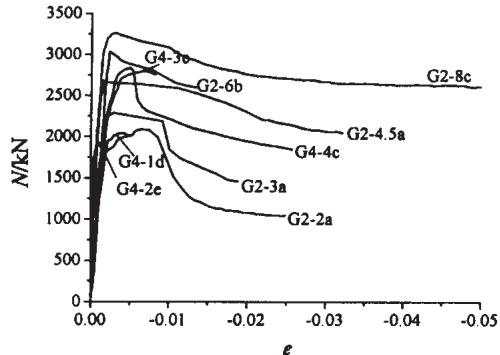  
图2荷载-钢管竖向应变曲线

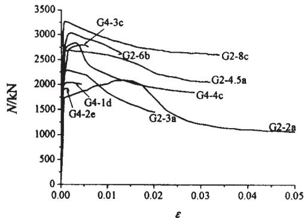  
Fig.2 Relationship between load and longitudinal strain of steel tubes   
图3荷载-钢管环向应变曲线  
Fig.3Relationship between load and hoop strain of steel tubes

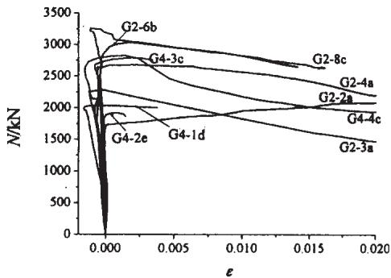  
图4荷载-体积应变曲线

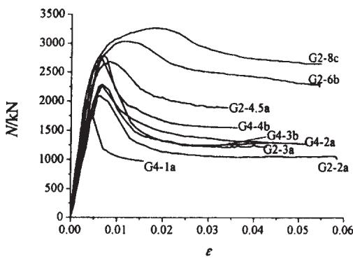  
Fig.4Relationship between load and volumetric strain of steel tubes   
图5荷载-竖向平均应变(压)曲线  
Fig.5Relationship between load and average longitudinal strain of specimens

第三阶段：破坏阶段。当试件达到极限荷载后，混凝土中微裂缝急剧发展，并形成斜向剪切破坏面，变形迅速增加，承载力下降。此阶段试件的工作状态与试件的套箍指标 $\Phi$ 密切相关。当 $\varPhi$ 很小（如G4-1系列）时，钢管对核心混凝土的约束作用在后期几乎失效，试件达到其极限荷载时突然发生破坏，承载力急剧下降，并伴随发出爆裂声，且其剩余承载力很小,试件具有明显的脆性破坏特征。当 $0 . 2 5 < \varPhi < 1 . 0$ 时，由于钢管对核心混凝土具有一定的约束作用，试件达到极限荷载后，其荷载下降速率随 $\Phi$ 的增大而减小，破坏时的剩余承载力(或称平台强度)也随 $\varPhi$ 的增大而增大。当$\varPhi$ 很大（如G2-8系列）时，由于钢管对核心混凝土具有较强的约束作用，破坏时其极限承载力下降缓慢，具有足够的延性，且剩余承载力达相应的极限承载力的$80 \%$ 以上。所有试件破坏时均形成明显的斜向剪切破坏面，外侧钢管产生不同程度的压屈现象。

# 3钢管高性能混凝土组合材料应力-应变关系曲线

为了建立钢管高性能混凝土短柱的强度计算理论，我们视钢管高性能混凝土为一新型组合材料。显然，研究这种组合材料的本构关系是整个研究工作的基础。我们将图5所示的实测荷载-竖向平均应变曲线转变为组合材料的轴向应力 $f _ { \mathrm { s c } ^ { - } }$ 竖向平均应变 $\pmb { \varepsilon } _ { \mathfrak { s c } }$ 曲线,如图6所示。图7为用无量纲参数y=fec/f," $\gamma = { f _ { \mathrm { s c } } } / { f _ { \mathrm { s c , u , \ell } } }$ $x = \varepsilon _ { \mathrm { s c } } / \varepsilon _ { \mathrm { s c } , }$ 。表示的典型应力-应变曲线。通过拟合，得到组合材料的应力－应变关系的特征参数：

(1)极限强度 $f _ { \mathrm { s c , } }$

$f _ { \mathrm { s c , ~ u ~ } }$ 近似按顾维平、蔡绍怀[5建议的公式计算

$$
f _ {\mathrm {s c}, \mathrm {u}} = f _ {\mathrm {c}} (1 + 1. 8 \Phi) \tag {1}
$$

式中 $\Phi = f _ { \mathrm { s } } A _ { \mathrm { s } } / \left( f _ { \mathrm { c } } A _ { \mathrm { c } } \right)$

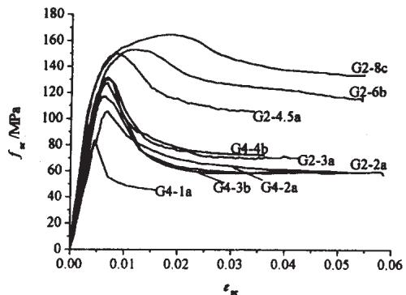  
图6典型试件应力-应变曲线

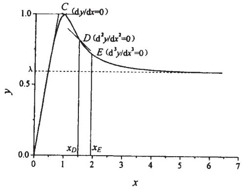  
Fig.6Typical stress-strain curves for specimens   
图7组合截面典型应力-应变曲线  
Fig.7Typical stress-strain curve for composite section

(2)峰值应变 $\pmb { \varepsilon } _ { \mathrm { s c } , 0 }$

一般情况下，组合截面的峰值应变 ${ \pmb \mathcal { E } } _ { \mathrm { s c } , \mathrm { ~ 0 ~ } }$ 大于高性

能混凝土的峰值应变，且随 $\Phi$ 的增大而增大(图8),回归得到

$$
\varepsilon_ {\mathrm {s c}, 0} = 0. 0 0 2 4 (1 + 4 \Phi) \tag {2}
$$

(3)平台强度fec,y

所谓平台强度,指钢管高性能混凝土短柱破坏后,试件保持的剩余强度。根据本次试验， $f _ { \mathrm { s c } , \mathrm { ~ y ~ } }$ 与 $\Phi$ 几乎呈线性增长(图9),拟合得到

$$
f _ {\mathrm {s c}, \mathrm {y}} = 3 7 + 6 6 \Phi \tag {3}
$$

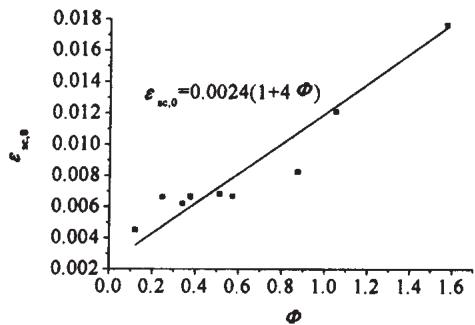  
图8 ${ \pmb \varepsilon } _ { \ast , 0 }$ 计算结果与实测结果的比较

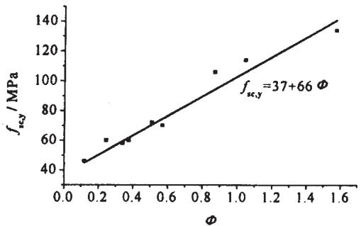  
Fig.8Comparison between calculated and tested values for $\pmb { \varepsilon } _ { \infty , 0 }$   
图9 $f _ { \mathrm { s c , \ y } }$ 计算结果与实测结果的比较  
Fig.9Comparison betwee calculated andtested values for $f _ { \ast , }$

根据上述钢管高性能混凝土组合材料应力-应变关系的特征参数，我们得到如图7所示的二段式曲线描述的钢管高性能混凝土组合材料的应力－应变关系曲线

$$
y = \left\{ \begin{array}{l l} A x + (3 - 2 A) x ^ {2} + (A - 2) x ^ {3} & x \leqslant 1 \\ x ^ {3} [ \alpha (x - 1) ^ {2} + \beta (x - 1) ^ {3} + x ^ {3} ] ^ {- 1} & x > 1 \end{array} \right. \tag {4}
$$

式中 $y = f _ { \mathrm { s c } } / f _ { \mathrm { s c , ~ u ~ \setminus ~ } } x = \varepsilon _ { \mathrm { s c } } / \varepsilon _ { \mathrm { s c , ~ 0 } }$ ,式(4)表达的几何特征与钢管高性能混凝土短柱受压变形和破坏过程完全对应,即

当 $x = 0$ 时， $y = 0$ ；

当 $0 \leqslant x$ <1时 $\mathrm { d } ^ { 2 } y / \mathrm { d } x ^ { 2 } > 0$ ,即曲线斜率 $\left( \mathrm { d } \boldsymbol { y } / \mathrm { d } \boldsymbol { x } \right)$ 单调减小,无拐点；

当 ${ \boldsymbol { x } } = { \boldsymbol { 1 } }$ 时， $\gamma = 1 , \mathbf { d } \gamma / \mathbf { d } x = 0$ ,即单峰值;

当 $\mathbb { P } y / \mathrm { d } x ^ { 2 } = 0$ 时， $_ { x p > 1 }$ 即下降段有一拐点 $( D )$ ；

当 ${ \mathrm { d } } ^ { 3 } y / { \mathrm { d } } x ^ { 3 } = 0$ 时， $\boldsymbol { x } _ { E } > ~ 1$ ,即下降段上的最大曲率点 ${ \bf \Xi } ( \bf \Lambda )$ ；

当 $\pmb { x } \longrightarrow \infty$ 时， $y { \longrightarrow } \lambda ( \lambda = f _ { \mathrm { s c , y } } / f _ { \mathrm { s c , u } } )$ ；

全部曲线 $x { \geqslant } 0 , 1 { \geqslant } y { \geqslant } 0 { \mathrm { , } }$

式(4)中的系数 $A$ 和 $\alpha , \beta$ 为套箍指标 $\Phi$ 的函数，经统计得

$$
A = 1. 2 + 0. 6 \Phi^ {2. 6}
$$

$$
\alpha = \left\{ \begin{array}{l l} 5 & \Phi \leqslant 0. 3 \\ 1. 5 / \Phi & \Phi > 0. 3 \end{array} \right.
$$

$$
\beta = f _ {\mathrm {s c}, \mathrm {u}} / f _ {\mathrm {s c}, \mathrm {y}} - 1
$$

运用公式(4)进行计算，所得计算曲线与本文试验

曲线进行比较,吻合良好,见图10。

# 4钢管高性能混凝土短柱极限承载力计算公式

关于普通钢管混凝土短柱和钢管高强混凝土短柱的极限承载力计算，国内外进行了较多的研究。表3列出了几种有代表性的计算公式及其适用范围。由于这些公式都是针对普通钢管混凝土短柱和钢管高强混凝土短柱提出来的，故是否适用于钢管高性能混凝土短柱的极限承载力计算，还有待进一步验证。

根据我们本次进行的28个钢管高性能混凝土短

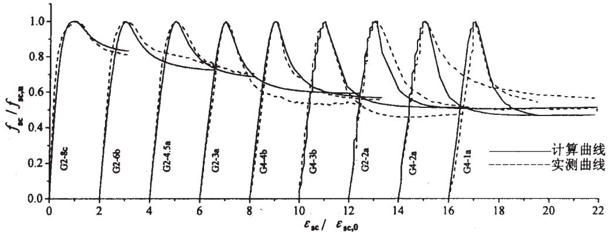  
图10公式(4)计算曲线与试验曲线的比较  
Fig.10Comparison between calculated curves by formula(4）and tested ones

表3钢管混凝土承载力计算公式一览表  
Table 3 Bearing capacity formulas for concrete filled steel tubes   

<table><tr><td>序号</td><td>参考文献</td><td colspan="2">建议公式</td><td>适用范围</td><td>备注</td></tr><tr><td>1</td><td>文献[5]</td><td>Nu = Acfc(1 + 1.8 Φ)式中: Φ = fAa/(fcAe) = pfAa / fc</td><td>(5)</td><td>钢管高强混凝土</td><td>被列入我国规程CECS 28:90[11]</td></tr><tr><td>2</td><td>文献[3]</td><td>Nu = fscAoc = (1.212 + BΦ + CΦ2)fckAoc式中: Φ = fYAs/(fckAc); B = 0.1856fγ/fγ,235 + 1.0276;C = -0.1095fck/fck,20 + 0.0326</td><td>(6)</td><td>钢管高强混凝土</td><td></td></tr><tr><td>3</td><td>文献[2]</td><td>Nu = fscAoc = (1.212 + BΦ + CΦ2)fckAoc式中: Φ = fYAs/(fckAc); B = 0.1759fγ/fγ,235 + 0.974C = -0.1038fck/fck,20 + 0.0309</td><td>(7)</td><td>普通钢管混凝土</td><td></td></tr><tr><td>4</td><td>文献[4]</td><td>Nu = Acfc(1 + 1.1 Φ + √Φ)式中: Φ = fAs/(fcAc) = pfAs/fc</td><td>(8)</td><td>普通钢管混凝土</td><td>被列入我国规程CECS 28:90[11]</td></tr><tr><td rowspan="3">5</td><td rowspan="3">文献[6]</td><td>简化公式: Nu = Acfc(1 + 2 Φ)</td><td>(9)</td><td></td><td></td></tr><tr><td>Nu = fAs + k1fAc</td><td>(10)</td><td></td><td></td></tr><tr><td>式中: k1 = 1 + (√4 - 3α2 - 1) pfck/fck; α = 0.25 + 3.2ρ; ρ = 4t/D</td><td>(11)</td><td>普通钢管混凝土</td><td>被列入我国规程JCJ 01-89[7]</td></tr><tr><td rowspan="2">6</td><td rowspan="2">文献[8]</td><td>Nu = fAs + k2fAc</td><td>(11)</td><td>普通钢管混凝土</td><td></td></tr><tr><td>式中: k2 = 1 + 3.6(σr/σc)0.6 - 2σr/σcσr/σc = 2(t/d) · (σs/σc)(0.4 - 0.02L/D)</td><td>(12)</td><td>普通钢管混凝土</td><td>欧洲规范[9]</td></tr><tr><td>7</td><td>文献[9]</td><td>Nu = [1 + (t/D) · (fγ/fc)]fAc + fAs</td><td>(13)</td><td>普通钢管混凝土</td><td></td></tr><tr><td>8</td><td>文献[10]</td><td>·Nu = [fc + 6tfc / Dc]Ac</td><td>(13)</td><td>普通钢管混凝土</td><td></td></tr></table>

表4钢管高性能混凝土短柱极限承载力计算  
Table 4 Ultimate bearing capacity calculation for high-performance concrete filed tubular steel short columns   

<table><tr><td rowspan="2">序号</td><td rowspan="2">研究者</td><td rowspan="2">试件编号</td><td rowspan="2">实测承载力/kN</td><td colspan="9">\( N_{\mathrm {a}}^{0}/N_{\mathrm {c}}^{0} \)</td></tr><tr><td>式(5)</td><td>式(6)</td><td>式(7)</td><td>式(8)</td><td>式(9)</td><td>式(10)</td><td>式(11)</td><td>式(12)</td><td>式(13)</td></tr><tr><td>1</td><td></td><td>G4-1a</td><td>1773.8</td><td>1.010</td><td>0.985</td><td>1.058</td><td>0.830</td><td>0.990</td><td>1.000</td><td>0.861</td><td>1.068</td><td>1.042</td></tr><tr><td>2</td><td></td><td>G4-1b</td><td>1430.8</td><td>0.814</td><td>0.794</td><td>0.853</td><td>0.670</td><td>0.799</td><td>0.806</td><td>0.694</td><td>0.862</td><td>0.840</td></tr><tr><td>3</td><td></td><td>G4-1c</td><td>1372.0</td><td>0.781</td><td>0.762</td><td>0.818</td><td>0.642</td><td>0.766</td><td>0.773</td><td>0.666</td><td>0.826</td><td>0.806</td></tr><tr><td>4</td><td></td><td>G4-1d</td><td>2038.4</td><td>1.160</td><td>1.132</td><td>1.216</td><td>0.954</td><td>1.138</td><td>1.149</td><td>0.989</td><td>1.228</td><td>1.197</td></tr><tr><td>5</td><td></td><td>G2-2a</td><td>2132.4</td><td>1.187</td><td>1.219</td><td>1.305</td><td>0.978</td><td>1.139</td><td>1.180</td><td>1.025</td><td>1.346</td><td>1.273</td></tr><tr><td>6</td><td></td><td>G2-2b</td><td>1933.2</td><td>1.076</td><td>1.105</td><td>1.183</td><td>0.886</td><td>1.033</td><td>1.070</td><td>0.929</td><td>1.220</td><td>1.154</td></tr><tr><td>7</td><td></td><td>G4-2a</td><td>2244.2</td><td>1.105</td><td>1.112</td><td>1.193</td><td>0.902</td><td>1.069</td><td>1.097</td><td>0.941</td><td>1.221</td><td>1.168</td></tr><tr><td>8</td><td></td><td>G4-2b</td><td>2381.4</td><td>1.173</td><td>1.180</td><td>1.265</td><td>0.958</td><td>1.134</td><td>1.164</td><td>0.998</td><td>1.296</td><td>1.240</td></tr><tr><td>9</td><td></td><td>G4-2c</td><td>2077.6</td><td>1.023</td><td>1.030</td><td>1.104</td><td>0.835</td><td>0.989</td><td>1.016</td><td>0.871</td><td>1.131</td><td>1.082</td></tr><tr><td>10</td><td></td><td>G4-2d</td><td>1930.6</td><td>0.951</td><td>0.957</td><td>1.026</td><td>0.776</td><td>0.919</td><td>0.944</td><td>0.809</td><td>1.051</td><td>1.005</td></tr><tr><td>11</td><td></td><td>G4-2e</td><td>1920.8</td><td>0.946</td><td>0.952</td><td>1.021</td><td>0.772</td><td>0.915</td><td>0.939</td><td>0.805</td><td>1.045</td><td>1.000</td></tr><tr><td>12</td><td rowspan="3">中南大学</td><td>G2-3a</td><td>2337.1</td><td>1.093</td><td>1.169</td><td>1.249</td><td>0.930</td><td>1.035</td><td>1.109</td><td>0.984</td><td>1.300</td><td>1.205</td></tr><tr><td>13</td><td>G2-3b</td><td>2394.2</td><td>1.119</td><td>1.198</td><td>1.279</td><td>0.952</td><td>1.060</td><td>1.136</td><td>1.009</td><td>1.331</td><td>1.235</td></tr><tr><td>14</td><td>G2-3c</td><td>2361.0</td><td>1.104</td><td>1.181</td><td>1.261</td><td>0.939</td><td>1.045</td><td>1.120</td><td>0.995</td><td>1.313</td><td>1.217</td></tr><tr><td>15</td><td></td><td>G4-3a</td><td>2567.6</td><td>1.115</td><td>1.154</td><td>1.235</td><td>0.923</td><td>1.068</td><td>1.122</td><td>0.967</td><td>1.277</td><td>1.204</td></tr><tr><td>16</td><td></td><td>G4-3b</td><td>2714.6</td><td>1.179</td><td>1.220</td><td>1.306</td><td>0.976</td><td>1.129</td><td>1.187</td><td>1.023</td><td>1.350</td><td>1.273</td></tr><tr><td>17</td><td></td><td>G4-3c</td><td>2734.2</td><td>1.188</td><td>1.229</td><td>1.315</td><td>0.983</td><td>1.137</td><td>1.195</td><td>1.030</td><td>1.359</td><td>1.282</td></tr><tr><td>18</td><td></td><td>G2-4.5a</td><td>2743.1</td><td>1.027</td><td>1.156</td><td>1.231</td><td>0.912</td><td>0.961</td><td>1.096</td><td>0.977</td><td>1.274</td><td>1.163</td></tr><tr><td>19</td><td></td><td>G2-4.5b</td><td>2572.3</td><td>0.963</td><td>1.084</td><td>1.155</td><td>0.855</td><td>0.902</td><td>1.027</td><td>0.916</td><td>1.195</td><td>1.091</td></tr><tr><td>20</td><td></td><td>G2-4.5c</td><td>2727.6</td><td>1.021</td><td>1.149</td><td>1.224</td><td>0.907</td><td>0.956</td><td>1.089</td><td>0.971</td><td>1.267</td><td>1.157</td></tr><tr><td>21</td><td></td><td>G4-4a</td><td>2704.8</td><td>1.053</td><td>1.116</td><td>1.193</td><td>0.887</td><td>1.000</td><td>1.083</td><td>0.936</td><td>1.240</td><td>1.156</td></tr><tr><td>22</td><td></td><td>G4-4b</td><td>2773.4</td><td>1.079</td><td>1.145</td><td>1.223</td><td>0.910</td><td>1.025</td><td>1.110</td><td>0.959</td><td>1.272</td><td>1.186</td></tr><tr><td>23</td><td></td><td>G4-4c</td><td>2832.2</td><td>1.102</td><td>1.169</td><td>1.249</td><td>0.929</td><td>1.047</td><td>1.134</td><td>0.980</td><td>1.298</td><td>1.211</td></tr><tr><td>24</td><td></td><td>G2-6a</td><td>2957.6</td><td>0.920</td><td>1.068</td><td>1.137</td><td>0.836</td><td>0.858</td><td>1.039</td><td>0.900</td><td>1.164</td><td>1.058</td></tr><tr><td>25</td><td></td><td>G2-6b</td><td>3099.3</td><td>0.964</td><td>1.119</td><td>1.191</td><td>0.876</td><td>0.899</td><td>1.089</td><td>0.943</td><td>1.220</td><td>1.108</td></tr><tr><td>26</td><td></td><td>G2-8a</td><td>3173.7</td><td>0.785</td><td>1.002</td><td>1.064</td><td>0.755</td><td>0.725</td><td>1.026</td><td>0.826</td><td>1.034</td><td>0.930</td></tr><tr><td>27</td><td></td><td>G2-8b</td><td>3267.4</td><td>0.808</td><td>1.032</td><td>1.095</td><td>0.777</td><td>0.746</td><td>1.057</td><td>0.850</td><td>1.064</td><td>0.957</td></tr><tr><td>28</td><td></td><td>G2-8c</td><td>3330.4</td><td>0.823</td><td>1.051</td><td>1.116</td><td>0.792</td><td>0.761</td><td>1.077</td><td>0.866</td><td>1.085</td><td>0.975</td></tr><tr><td>29</td><td></td><td>Sz61</td><td>2685</td><td>1.085</td><td>1.174</td><td>1.227</td><td>0.928</td><td>1.026</td><td>1.133</td><td>0.983</td><td>1.301</td><td>1.205</td></tr><tr><td>30</td><td></td><td>Sz62</td><td>2681</td><td>1.084</td><td>1.172</td><td>1.226</td><td>0.927</td><td>1.024</td><td>1.131</td><td>0.981</td><td>1.299</td><td>1.203</td></tr><tr><td>31</td><td></td><td>Sz63</td><td>2627</td><td>1.062</td><td>1.148</td><td>1.201</td><td>0.908</td><td>1.003</td><td>1.109</td><td>0.961</td><td>1.273</td><td>1.179</td></tr><tr><td>32</td><td></td><td>Sz71</td><td>2743</td><td>1.001</td><td>1.004</td><td>1.055</td><td>0.817</td><td>0.969</td><td>0.999</td><td>0.848</td><td>1.103</td><td>1.057</td></tr><tr><td>33</td><td></td><td>Sz72</td><td>2981</td><td>1.088</td><td>1.091</td><td>1.147</td><td>0.888</td><td>1.053</td><td>1.086</td><td>0.921</td><td>1.198</td><td>1.149</td></tr><tr><td>34</td><td></td><td>Sz73</td><td>2889</td><td>1.054</td><td>1.057</td><td>1.111</td><td>0.861</td><td>1.021</td><td>1.052</td><td>0.893</td><td>1.161</td><td>1.113</td></tr><tr><td>35</td><td></td><td>Sz74</td><td>2796</td><td>1.020</td><td>1.023</td><td>1.076</td><td>0.833</td><td>0.988</td><td>1.019</td><td>0.864</td><td>1.124</td><td>1.078</td></tr><tr><td>36</td><td rowspan="3">清华大学</td><td>Sz75</td><td>2805</td><td>1.128</td><td>1.107</td><td>1.163</td><td>0.923</td><td>1.102</td><td>1.119</td><td>0.954</td><td>1.205</td><td>1.170</td></tr><tr><td>37</td><td>Sz76</td><td>2562</td><td>1.030</td><td>1.011</td><td>1.063</td><td>0.843</td><td>1.007</td><td>1.022</td><td>0.872</td><td>1.101</td><td>1.069</td></tr><tr><td>38</td><td>Sz77</td><td>2570</td><td>1.033</td><td>1.014</td><td>1.066</td><td>0.846</td><td>1.010</td><td>1.026</td><td>0.874</td><td>1.104</td><td>1.072</td></tr><tr><td>39</td><td></td><td>Sz78</td><td>2435</td><td>0.979</td><td>0.961</td><td>1.010</td><td>0.801</td><td>0.957</td><td>0.972</td><td>0.829</td><td>1.046</td><td>1.016</td></tr><tr><td>40</td><td></td><td>Sz81</td><td>3001</td><td>1.125</td><td>1.193</td><td>1.271</td><td>0.950</td><td>1.067</td><td>1.171</td><td>1.003</td><td>1.329</td><td>1.239</td></tr><tr><td>41</td><td></td><td>Sz82</td><td>2958</td><td>1.109</td><td>1.176</td><td>1.253</td><td>0.937</td><td>1.052</td><td>1.154</td><td>0.988</td><td>1.310</td><td>1.221</td></tr><tr><td>42</td><td></td><td>Sz83</td><td>2877</td><td>1.078</td><td>1.144</td><td>1.218</td><td>0.911</td><td>1.023</td><td>1.122</td><td>0.961</td><td>1.274</td><td>1.188</td></tr><tr><td>43</td><td></td><td>Sz91</td><td>3070</td><td>1.080</td><td>1.128</td><td>1.211</td><td>0.905</td><td>1.028</td><td>1.122</td><td>0.953</td><td>1.262</td><td>1.183</td></tr><tr><td>44</td><td></td><td>Sz92</td><td>3200</td><td>1.126</td><td>1.176</td><td>1.262</td><td>0.943</td><td>1.072</td><td>1.169</td><td>0.993</td><td>1.316</td><td>1.233</td></tr><tr><td>45</td><td></td><td>Sz93</td><td>3180</td><td>1.119</td><td>1.168</td><td>1.254</td><td>0.937</td><td>1.065</td><td>1.162</td><td>0.987</td><td>1.308</td><td>1.225</td></tr><tr><td>46</td><td></td><td>Sz94</td><td>3240</td><td>1.140</td><td>1.190</td><td>1.278</td><td>0.955</td><td>1.085</td><td>1.184</td><td>1.005</td><td>1.332</td><td>1.248</td></tr></table>

表5计算结果统计特征值比较  
Table 5 Statistical eigenvalues of calculated results   

<table><tr><td>研究者</td><td>试件情况</td><td>统计特征值</td><td>式(5)</td><td>式(6)</td><td>式(7)</td><td>式(8)</td><td>式(9)</td><td>式(10)</td><td>式(11)</td><td>式(12)</td><td>式(13)</td></tr><tr><td></td><td>试件</td><td>均值</td><td>1.020</td><td>1.088</td><td>1.163</td><td>0.869</td><td>0.973</td><td>1.066</td><td>0.918</td><td>1.191</td><td>1.115</td></tr><tr><td>中南</td><td>1~28</td><td>离散系数</td><td>0.126</td><td>0.117</td><td>0.107</td><td>0.104</td><td>0.131</td><td>0.095</td><td>0.103</td><td>0.118</td><td>0.116</td></tr><tr><td>大学</td><td>试件</td><td>均值</td><td>1.034</td><td>1.117</td><td>1.192</td><td>0.885</td><td>0.981</td><td>1.088</td><td>0.938</td><td>1.223</td><td>1.139</td></tr><tr><td></td><td>5~28</td><td>离散系数</td><td>0.114</td><td>0.080</td><td>0.072</td><td>0.080</td><td>0.124</td><td>0.061</td><td>0.073</td><td>0.085</td><td>0.092</td></tr><tr><td>清华</td><td>试件</td><td>均值</td><td>1.074</td><td>1.107</td><td>1.172</td><td>0.895</td><td>1.030</td><td>1.097</td><td>0.937</td><td>1.225</td><td>1.158</td></tr><tr><td>大学[12]</td><td>29~46</td><td>离散系数</td><td>0.044</td><td>0.076</td><td>0.074</td><td>0.055</td><td>0.038</td><td>0.060</td><td>0.062</td><td>0.078</td><td>0.062</td></tr></table>

柱和清华大学进行的18个钢管高性能混凝土短柱[12]的有效结果，运用表3中计算公式进行了计算，每个试件的极限承载力实测值与计算值的比较列于表4，各个公式计算精度的统计特征值列于表5。从这些计算结果可以看出：

（1）钢管高强混凝土短柱的极限承载力计算公式（5）的计算结果与钢管高性能混凝土短柱极限承载力实测值比较接近，而普通钢管混凝土短柱的极限承载力计算公式对钢管高性能混凝土短柱不适用。  
(2)公式(5)形式简单,计算方便,计算精度较高，离散较小。因此，本文建议钢管高性能混凝土短柱极限承载力计算公式采用统一计算公式(5)。  
(3）我国《钢管混凝土结构设计与施工规程》(CECS.28:90)指出：钢管混凝土径厚比的取值范围为

$$
D / t = 2 0 \sim 8 5 \sqrt {2 3 5 / f _ {\mathrm {s}}} \tag {14}
$$

本次试验表明，试件G4-1系列 $D / t \ = 1 6 5 = 1 9 8 \times$ $\sqrt { 2 3 5 / f _ { \circ } }$ ，钢管对其核心混凝土的约束增强作用很小，其工作性能与普通钢筋混凝土类似。但试件G4-2系列， $D / t = 8 2 . 5 = 9 9 \sqrt { 2 3 5 / f _ { \mathrm { s } } }$ ，钢管高性能混凝土短柱仍具有良好的共同工作性能，钢管对其核心混凝土的约束增强作用明显，文献[13]也有类似的结论。可见，对钢管高性能混凝土短柱的 $D / \mathbf { \Sigma } _ { t }$ 上限宜适当放宽,即取

$$
D / t = 2 0 \sim 1 0 0 \sqrt {2 3 5 / f _ {\mathrm {s}}} \tag {15}
$$

或采用套箍指标 $\Phi$ 表示， $\pmb { \phi } = 0 . 2 5 \sim 1 . 5 ,$

# 5结论

通过对28根钢管高性能混凝土短柱试件的试验研究和文献[12]中18个试件试验结果的分析(混凝土强度等级在 $\mathbf { C 6 0 } \sim \mathbf { C 9 0 }$ 之间的钢管混凝土短柱)，可得到下列结论：

（1）本次试验表明，套箍指标 $\varPhi$ 是影响钢管高性能混凝土短柱极限承载力的重要综合因素。套箍指标

$\Phi$ 越高，构件极限承载力越高，延性越好。

(2)基于本次试验结果,建立了钢管高性能混凝土组合材料应力－应变关系曲线计算公式，计算结果与试验结果吻合良好，为进行钢管高性能混凝土柱的非线性有限元全过程分析创造了良好的条件。  
(3)通过对国内46个试件的试验值与计算值的比较,公式(5)的计算值与试验值吻合最好。因此本文建议钢管高性能混凝土短柱极限承载力采用公式（5）计算,且建议 $D / \mathrm { \Delta } t$ 的取值范围为 $2 0 \sim 1 0 0 \sqrt { 2 3 5 / f _ { \mathrm { { s } } } }$ 或$\Phi$ 的取值范围为 $0 . 2 5 \sim 1 . 5 ,$ 。

# 参考文献

[1]林松．高性能钢管混凝土柱受力性能的试验研究[D]．长沙铁道学院，2000.  
[2]韩林海，钟善桐．钢管混凝土力学[M]．大连：大连理工大学出版社，1996.  
[3]韩林海．钢管高强混凝土轴压力学性能的理论分析与试验研究[J]．工业建筑,1997,(11)  
[4]蔡绍怀，焦占栓．钢管混凝土受压构件承载力计算[J].工业建筑,1985,(2)  
[5]顾维平,蔡绍怀，冯文林．钢管高强混凝土的性能与极限强度[J]．建筑科学，1991,(1)  
[6]汤关祚，招炳泉．钢管混凝土受压构件承载力计算[J].工业建筑,1985,(2).  
[7]JCJ01—89．钢管混凝土结构设计与施工规程[S].  
[8]李继读．钢管混凝土轴压承载力的研究[J]．工业建筑，1985,(2).  
[9]ENV 1994-1-1: 1992 Eurocode 4. Design of Composite Steel and Concrete Structures，part1.1:General Rules and Rules for Building[S].British Standards Institution, London,1992.   
[10]GoodeCD,韩林海译．钢管混凝土组合柱的研究进展[J].工业建筑,1996,(3).  
[11]CECS28:90.钢管混凝土结构设计与施工规程[S].  
[12]蒋继武．周期反复荷载作用下钢管高强混凝土压弯构件抗震性能的试验研究[D]．清华大学,1997.  
[13]谭克锋．钢管与超高强混凝土复合材料的力学性能及承载力研究[D]．重庆建筑大学，1999.