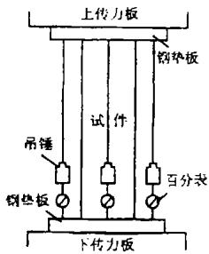
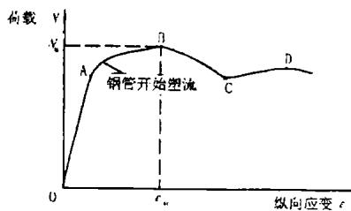
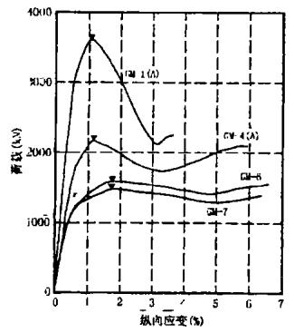
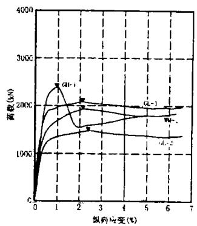

# 钢管高强混凝土轴压短柱承载力性能的试验研究

贺锋，周绪红，唐昌辉

(湖南大学土木工程系，长沙410082)

摘要：本文报导了21个钢管混凝土轴压短柱的试验研究，其中18个钢管高强混凝土试件，3个普通钢管混凝土试件。试验的主要参数是套箍系数 $\xi$ 。研究结果表明，当套箍系数较小时，钢管径向变形对钢管高强混凝土极限承载力有影响。

关键词：高强混凝土；套箍系数；钢管混凝土：极限承载力

中图分类号：TU375.3 文献标识码：A

# 1 前言

高强混凝土可以提高结构的承载能力，减少受压杆件的截面，减轻结构自重，且其材料致密坚硬，抗渗抗冻性能好。高强混凝土的主要缺点是延性差，脆性大，在单轴受压下，高强混凝土的应力——应变曲线在达到峰值应力(抗压强度)以后急剧下降。作为结构材料，这是不容忽视的缺点。因此克服高强混凝土的脆性是工程中应用高强混凝土的关键。钢管高强混凝土使高强混凝土置于约束状态之下，不失为一种有效手段。

现有的文献资料表明[1][2]，钢管高强混凝土轴压短柱的试验资料还不多见，其力学性能研究还需深入探讨。本文介绍了作者最近完成的21根不同套箍系数和不同混凝土强度等级的钢管混凝土轴压短柱的试验，目的在于观察和分析这类轴压短柱的受力性能和破坏特征，为研究钢管高强混凝土轴压短柱的承载力计算方法提供试验依据。

# 2 试验概况

钢管混凝土试件基本数据见表1。混凝土配合比见表2。混凝土配制时采用人工拌和，成型时均用 $\Phi 50$ 振捣棒振捣。试件养护方法为自然养护。混凝土强度由在同一条件下成型养护的三个 $150\mathrm{mm}$ 立方体试块强度平均值得出，同时对高强混凝土进行了 $150\times 150\times 450\mathrm{mm}$ 棱柱体抗压强度试验。钢材强度由拉伸试验得出。

试验于1997年在湖南大学土木工程系结构试验室的

  
图1加载与测量装置简图

5000kN压力试验机上进行。采用分级加载制，每级荷载为预计极限荷载的1/10，钢管屈服后每级荷载约为极限荷载的 $1 / 15\sim 1 / 20$ ，每级荷载的持荷时间为3~4分钟,接近破坏时则采用慢速连续加载。当荷载达到最大值(极限值),试验机压力指针开始回转以后，仍继续向千斤顶油缸送油，直到试件变形很大。

试件的加载与测量装置如图1。加载方式为整体加载。试件在反复小荷载下进行物理对中以达到轴心受压的效果。为了测出包括上升段和下降段的荷载——纵向变形关系全曲线，采用了两种量测方法。

1、通过在试件四周对称布置四个百分表来量测试件全高范围内的平均纵向变形。  
2、试验机上下传力板之间连以细弦线，并牵引缠绕于试验机压力指示盘的联动杆滚筒上，用座标纸连续自动绘出荷载——纵向位移全曲线(位移放大比例为1:4)。

此外在试件1/2高度处，对称贴上4组应变片，每组纵、环方向上各一片，用作测定试件纵、环方向应变值；对于部分试件每组增贴 $45^{\circ}$ 方向上的应变片，测定该方向上的应变值。

试验数据由YJ-5静态应变仪记录。

表 1 钢管混凝土试件基本数据  

<table><tr><td>序号</td><td>试件编号</td><td>D×t×L(mm)</td><td>fy(MPa)</td><td>fc(MPa)</td><td>Ae(mm2)</td><td>Ac(mm2)</td><td>ξ</td></tr><tr><td>1</td><td>GM-1(A)</td><td rowspan="2">273×3×704</td><td rowspan="2">380.0</td><td rowspan="13">42.8</td><td rowspan="2">2545</td><td rowspan="2">55990</td><td rowspan="2">0.408</td></tr><tr><td>2</td><td>GM-1(B)</td></tr><tr><td>3</td><td>GM-2(A)</td><td rowspan="2">253×3×704</td><td rowspan="2">380.0</td><td rowspan="2">2356</td><td rowspan="2">47916</td><td rowspan="2">0.432</td></tr><tr><td>4</td><td>GM-2(B)</td></tr><tr><td>5</td><td>GM-3(A)</td><td rowspan="2">233×3×598</td><td rowspan="2">318.3</td><td rowspan="2">2168</td><td rowspan="2">40471</td><td rowspan="2">0.399</td></tr><tr><td>6</td><td>GM-3(B)</td></tr><tr><td>7</td><td>GM-4(A)</td><td rowspan="2">203×3×603</td><td rowspan="2">318.3</td><td rowspan="2">1885</td><td rowspan="2">30481</td><td rowspan="2">0.460</td></tr><tr><td>8</td><td>GM-4(B)</td></tr><tr><td>9</td><td>GM-5(A)</td><td rowspan="2">183×3×603</td><td rowspan="2">380.0</td><td rowspan="2">1696</td><td rowspan="2">24606</td><td rowspan="2">0.619</td></tr><tr><td>10</td><td>GM-5(B)</td></tr><tr><td>11</td><td>GM-6</td><td>153×3×503</td><td>380.0</td><td>1414</td><td>16972</td><td>0.748</td></tr><tr><td>12</td><td>GM-7</td><td>153×3×465</td><td>380.0</td><td>1414</td><td>16972</td><td>0.748</td></tr><tr><td>13</td><td>WM-1</td><td>153×4.5×499</td><td>340.3</td><td>2057</td><td>15615</td><td>1.048</td></tr><tr><td>14</td><td>GH-1</td><td>203×3×603</td><td>318.3</td><td rowspan="5">53.6</td><td>1885</td><td>30481</td><td>0.367</td></tr><tr><td>15</td><td>GH-2(A)</td><td rowspan="2">153×3×503</td><td rowspan="2">380.0</td><td rowspan="2">1414</td><td rowspan="2">16972</td><td rowspan="2">0.598</td></tr><tr><td>16</td><td>GH-2(B)</td></tr><tr><td>17</td><td>GH-3</td><td>153×3×465</td><td>318.3</td><td>1414</td><td>16972</td><td>0.494</td></tr><tr><td>18</td><td>WH-1</td><td>150×4.5×499</td><td>340.3</td><td>2057</td><td>15615</td><td>0.836</td></tr><tr><td>19</td><td>GL-1</td><td>203×3×603</td><td>318.3</td><td rowspan="3">25.7</td><td>1885</td><td>30481</td><td>0.766</td></tr><tr><td>20</td><td>GL-2</td><td>153×3×503</td><td>318.3</td><td>1414</td><td>16972</td><td>1.032</td></tr><tr><td>21</td><td>WL-1</td><td>150×4.5×499</td><td>340.3</td><td>2057</td><td>15615</td><td>1.744</td></tr></table>

注：试件编号 $W$ ：无缝钢管， $G$ ：由热轧钢板冷卷后焊接而成的钢管； $L$ 、 $M$ 、 $H$ 分别代表混凝土的立方体抗压强度：38.3、60.5、75.1MPa; $A$ 、 $B$ 表示同种试件的组号；表中符号 $D$ 、 $t$ 、 $L$ 一分别为钢管的外径、壁厚和长度； $A_{s}$ 、 $f_{y}$ 一分别为钢管的横截面积和屈服强度； $A_{c}$ 、 $f_{c}$ 一分别为核心混凝土的横截面积和轴心抗压强度； $\xi = A_{s}f_{y} / A_{c}f_{c}$ (套箍系数)。

表 2 混凝土的组成材料及配合比  

<table><tr><td>混凝土设计强度等级</td><td>C30</td><td>C60</td><td>C80</td></tr><tr><td>水灰比</td><td>0.55</td><td>0.28</td><td>0.24</td></tr><tr><td>砂率</td><td>0.36</td><td>0.33</td><td>0.32</td></tr><tr><td>最大粒径(mm)</td><td>25</td><td>20</td><td>20</td></tr><tr><td>FDN高效减水剂(%)</td><td>-</td><td>1.0</td><td>1.0</td></tr><tr><td>东江525#普通硅酸盐水泥(kg/m³)</td><td>389</td><td>375</td><td>544</td></tr><tr><td>水(kg/m³)</td><td>214</td><td>150</td><td>145</td></tr><tr><td>硅粉(kg/m³)</td><td>-</td><td>-</td><td>60</td></tr><tr><td>中粗砂(kg/m³)</td><td>654</td><td>582</td><td>544</td></tr><tr><td>石灰岩碎石(kg/m³)</td><td>1159</td><td>1182</td><td>1157</td></tr><tr><td>超细磨矿渣(kg/m³)</td><td>-</td><td>161</td><td>-</td></tr><tr><td>fcu立方体抗压强度(MPa)</td><td>38.3</td><td>60.5</td><td>75.1</td></tr></table>

# 3 试验结果分析

# 3.1 破坏形态及裂缝分布

对试验全过程的观察表明，破坏时所有试件表面都出现了2~3处局部凸曲。对破坏后的试件GH-1,GL-1剖开钢管观察其核心混凝土，发现在试件两个凸曲之间均存在着斜向剪切破坏面。说明试件破坏形态及裂缝分布与核心混凝土强度无关。

# 3.2 $N - \varepsilon$ 曲线

图2是典型的 $N - \varepsilon$ 曲线示意图。在较低的荷载阶段，图中的OA段为直线。当荷载增长至A点，钢管表面出现吕德尔斯滑移斜线。此后，曲线偏离其初始的直线，试件变形均匀，外形鼓而不曲。至B点，荷载达到最大值，试件出现局部鼓曲，曲线逐渐下降。随着试件轴向变形的增加，荷载退减，曲线下降到C点以后，又开始回升，直到新的峰值点 $D(N_{c} < N_{B})$ 而再次下降，试件剪切滑移破坏。此时试件外形已严重皱曲。

  
图2典型的 $N - \varepsilon$ 曲线示意图

图3是实测荷载——变形曲线，符号▼对应于图2

中的B点，即钢管混凝土的极限荷载点，具体数值见表3。从图中可以看到由于套箍系数 $\xi$ 较小，当试件达到极限状态后，轴压短柱荷载——变形曲线出现较陡的下降趋势，这主

要是因为外包钢管不能对其核心混凝土提供足够的有效约束，核心混凝土呈现出一定的脆性破坏特征，且随着 $\xi$ 的提高，这种趋势逐渐减弱。这说明当套箍系数较高时，外包钢管可以有效地克服高强混凝土的脆性，提高其变形能力。

  
图3钢管混凝土试件部分实测荷载——纵向变形曲线

通过对WM-1与GL-2，GM-6、GM-7与GL-1的比较可知，在套箍系数相同情况下，随着核心混凝土强度的提高，由于混凝土力学性能的改变，构件承载力的提高幅度趋于减小，由此可知，高强混凝土外包钢管的约束效果较差。这是由于高强混凝土在非弹性阶段中的微裂缝少，其横向变形系数要小于普通强度混凝土。且高强混凝土的破坏面比较光滑，通常穿过石子和水泥浆而不是绕着骨料表面，而普通混凝土剪切斜裂，必须绕过骨料，因此钢管普通混凝土剪切斜裂时，骨料之间产生很大的咬合作用。在这种情况下，为抑制钢管高强混凝土的这种剪切滑移变形所需的套箍系数值远大于普通钢管混凝土所需的套箍系数值。说明外包钢管对高强混凝土的约束效果比对普通混凝土的要差。

与普通钢管混凝土相比，在使用相同径厚比 $(D / t)$ 钢管的情况下，钢管高强混凝土的荷载——变形曲线中OA线性段明显比普通钢管混凝土高得多。这是由于使用了高强混凝土，在单轴受压下，高强混凝土的应力——应变曲线线性段的范围比普通混凝土大得多。

由表3中 $N_{u} / N_{k}$ 的比值我们可以知道，对套箍系数 $\xi < 0.367$ 的钢管高强混凝土试件极限承载力近似等于试件的名义承载力，钢管高强混凝土没有达到提高承载能力的效果，这说明当钢管对核心混凝土的环箍效应还没有开始作用时，核心混凝土已经剪切破坏，钢管达到屈服。这主要是因为整体加载方式下，钢管直接承受纵向荷载作用，引起钢管的径向变形，削弱了钢管对核心混凝土的约束效果。随着套箍系数的提高， $N_{u} / N_{k}$ 的比值趋于增大，也即钢管的径向变形对钢管高强混凝土极限承载力的影响趋于减小。

从GM-6与GM-7试验结果看，在 $L / D \leqslant 4$ 的短柱范围内，试件的长细比变化，对极限承载能力没有明显影响。与普通钢管混凝土的情况相同。

# 3.3 钢管混凝土轴压短柱的极限变形 $\varepsilon_{u}$

表3给出了实测的极限应变 $\varepsilon_{u}$ 之值。试验结果表明， $\varepsilon_{u}$ 随套箍系数的增大而增大。对于普通钢管混凝土，文献[3]用下列经验公式描述：

$$
\varepsilon_ {u} = 2. 2 \xi^ {2 / 3} + 0. 2 \tag {1}
$$

式中 $\varepsilon_{u}$ ，以%计。文献[1]认为在套箍系数相同的情况下，当 $\xi >0.9$ 时，钢管高强混

凝土的极限应变与普通钢管混凝土相差不大。但本文试验表明，由于裂缝表面的骨料咬合作用不同，钢管高强混凝土与普通钢管混凝土在变形性能方面存在一定的差异，尤其是在较低套箍系数的情况下。

以公式(1)为基础，根据本文试验结果进行回归分析，可以得下列经验公式：

$$
\varepsilon_ {u} = \left\{ \begin{array}{l l} 2. 3 4 2 3 \xi^ {2 / 3} - 0. 3 0 0 5 & \xi > 0. 1 1 4 \\ 0. 2 5 0 0 & \xi \leq 0. 1 1 4 \end{array} \right. \tag {2}
$$

表 3 钢管混凝土试件实测值及计算值比较  

<table><tr><td>试件编号</td><td>ξ</td><td>Nu(kN)</td><td>Nk(kN)</td><td>Nu/Nk</td><td>εu(%)</td><td>ε01(%)</td><td>ε02(%)</td><td>εu/ε02</td></tr><tr><td>GM-1(A)</td><td rowspan="2">0.408</td><td>3675</td><td rowspan="2">3363</td><td>1.093</td><td>0.9852</td><td rowspan="2">1.4103</td><td rowspan="2">0.9879</td><td>0.9973</td></tr><tr><td>GM-1(B)</td><td>3689</td><td>1.097</td><td>-</td><td>-</td></tr><tr><td>GM-2(A)</td><td rowspan="2">0.432</td><td>3408</td><td rowspan="2">2946</td><td>1.157</td><td>1.0394</td><td rowspan="2">1.4572</td><td rowspan="2">1.0377</td><td>1.0016</td></tr><tr><td>GM-2(B)</td><td>3361</td><td>1.141</td><td>1.0480</td><td>1.0099</td></tr><tr><td>GM-3(A)</td><td rowspan="2">0.399</td><td>2640</td><td rowspan="2">2422</td><td>1.090</td><td>0.9688</td><td rowspan="2">1.3924</td><td rowspan="2">0.9687</td><td>1.0001</td></tr><tr><td>GM-3(B)</td><td>2603</td><td>1.075</td><td>-</td><td>-</td></tr><tr><td>GM-4(A)</td><td rowspan="2">0.460</td><td>2190</td><td rowspan="2">1905</td><td>1.150</td><td>1.0980</td><td rowspan="2">1.5110</td><td rowspan="2">1.0957</td><td>1.0021</td></tr><tr><td>GM-4(B)</td><td>2240</td><td>1.176</td><td>1.0941</td><td>0.9985</td></tr><tr><td>GM-5(A)</td><td rowspan="2">0.619</td><td>2010</td><td rowspan="2">1698</td><td>1.190</td><td>1.4010</td><td rowspan="2">1.7977</td><td rowspan="2">1.4014</td><td>1.0062</td></tr><tr><td>GM-5(B)</td><td>2070</td><td>1.226</td><td>1.3945</td><td>0.9951</td></tr><tr><td>GM-6</td><td rowspan="2">0.748</td><td>1580</td><td rowspan="2">1264</td><td>1.250</td><td>1.6263</td><td rowspan="2">2.0128</td><td rowspan="2">1.6291</td><td>0.9983</td></tr><tr><td>GM-7</td><td>1490</td><td>1.179</td><td>1.6361</td><td>1.0043</td></tr><tr><td>WM-1</td><td>1.048</td><td>1920</td><td>1368</td><td>1.404</td><td>2.1173</td><td>2.2841</td><td>2.4698</td><td>1.0007</td></tr><tr><td>GH-1</td><td>0.367</td><td>2405</td><td>2234</td><td>1.077</td><td>0.8948</td><td>1.3277</td><td>0.9003</td><td>0.9939</td></tr><tr><td>GH-2(A)</td><td rowspan="2">0.598</td><td>1710</td><td rowspan="2">1447</td><td>1.182</td><td>1.3001</td><td rowspan="2">1.7616</td><td rowspan="2">1.3616</td><td>0.9548</td></tr><tr><td>GH-2(B)</td><td>1680</td><td>1.161</td><td>1.3571</td><td>0.9967</td></tr><tr><td>GH-3</td><td>0.494</td><td>1580</td><td>1360</td><td>1.162</td><td>1.1650</td><td>1.5748</td><td>1.1639</td><td>1.0009</td></tr><tr><td>WH-1</td><td>0.836</td><td>2010</td><td>1537</td><td>1.308</td><td>1.7838</td><td>1.9934</td><td>2.1524</td><td>1.0029</td></tr><tr><td>GL-1</td><td>0.766</td><td>2090</td><td>1383</td><td>1.511</td><td>2.0453</td><td>2.0418</td><td>-</td><td>-</td></tr><tr><td>GL-2</td><td>1.032</td><td>1470</td><td>886</td><td>1.659</td><td>2.5291</td><td>2.4466</td><td>-</td><td>-</td></tr><tr><td>WL-1</td><td>1.744</td><td>1820</td><td>1101</td><td>1.653</td><td>3.4102</td><td>3.3875</td><td>-</td><td>-</td></tr></table>

注：表中符号 $N_{u}$ 一试件实测荷载； $N_{k}$ 一表示不考虑紧箍力时试件的名义承载力，即 $N_{k} = A_{s}f_{y} + A_{c}f_{c}$ ； $\varepsilon_{u}$ 一试件实测极限应变； $\varepsilon_{01}$ 一公式(1)计算极限应变： $\varepsilon_{02}$ 一本文公式(2)计算极限应变。

图4是 $\varepsilon_{u}$ 与套箍系数 $\xi$ 的关系，图中还对本文公式(2)与公式(1)及试验结果实测值进

行了比较。实测值与本文公式(2)的计算值之比的平均值为0.9977,变异系数 $C_{\mathrm{V}}$ 为0.0122。

综上所述，影响钢管混凝土轴压短柱承载力的主要因素有：套箍系数 $\xi$ 和混凝土轴心抗压强度 $f_{\varepsilon}$ 。尽管高强混凝土可以显著提高钢管混凝土轴压短柱的极限承载力，但由于高强混凝土的横向变形系数要小于普通混凝土，使得外包钢管对高强混凝土的约束效果较普通混凝土的要差，特别是在套箍系数较小时，这一现象更加明显。

  
图4 $\varepsilon_{u} - \xi$ 关系曲线

# 4 结论

通过本文试验研究可以得到以下结论：

1、整体加载方式下，当套箍系数较小时，钢管高强混凝土达不到提高极限承载力的效果，这主要是因为钢管的径向变形削弱了钢管对核心混凝土的约束效果；  
2、本文所提出的公式(2)计算钢管高强混凝土轴压短柱极限应变，计算值与实测值吻合良好；  
3、在进行钢管高强混凝土轴压短柱的极限承载力计算时应考虑钢管对高强混凝土的约束效果低于对普通混凝土的约束效果。

# 参考文献：

[1] 顾维平, 等. 钢管高强混凝土的性能与极限强度[J]. 建筑科学, 1991, (1): 23-27.   
[2] 韩林海. 钢管高强混凝土构件基本力学性能及承载力的初步研究[J]. 哈尔滨建筑大学学报, 1996, (4): 29-34.  
[3] 蔡绍怀，焦占栓. 钢管混凝土短柱的基本性能和强度计算[J]. 建筑结构学报, 1984, (6): 13-34.

# EXPERIMENTAL RESEARCH ON THE BEARING BEHAVIOR OF HIGH-STRENGTH-CONCRETE-FILLED STEEL TUBE UNDER AXIAL COMPRESSION

HE Feng, ZHOU Xu-hong, TANG Chang-hui

(Dept. of Civil Engineering, Hunan Univ., Changsha 410082)

Abstract: The experimental research performed on twenty-one specimens of short steel tubular columns filled with concrete under axial compression is reported. Eighteen specimens of steel tube are filled with high-strength concrete and three specimens are normal concrete-filled steel tubes. The main parameter of specimens is confinement coefficient. Research result shows that the radial deformation of steel tube has influence on the ultimate bearing capacity of steel tube filled with high-strength concrete, when the confinement coefficient is small.

Key words: high-strength concrete; confinement coefficient; concrete-filled steel tube; ultimate bearing capacity