# LOAD-CARRYING CAPACITY OF AXIALLY LOADED CONCRETE-FILLED STEEL TUBULAR COLUMNS MADE OF THIN TUBES

Marcin Abramski

Gdansk University of Technology, Gdansk, Poland

Post-print of article published in Archives of Civil and Mechanical Engineering (ISSN 1644-9665) in 2018

# Abstract

An experimental investigation was conducted on 30 CFST columns. An influence of the following factors on load-carrying capacity of the investigated columns was analysed: the column slenderness $\lambda _ { 1 } { = } 4 2$ , $\lambda _ { 2 } = 2 7$ and $\lambda _ { 3 } { = } 1 5$ ), the tube thickness (the reinforcement ratio was equal to $4 \%$ or $6 \%$ ), the way of applying the load to CFST columns (through the concrete core or through the entire cross-section), the bond strength between a steel tube and a concrete core.

The results of the experimental investigation let the author derive a practical method of determining load– bearing capacity of CFST columns. The Eurocode 4 provisions regulating composite steel and concrete structures design impose the minimum share of a steel tube in the cross-sectional area of a CFST column. This minimum share is the prerequisite for the Eurocode 4 to be applicable. It ranges from $0 . 5 \%$ to $6 \%$ . As the experimental research presented in the paper indicate, the CFST columns of such low reinforcement ratios can be also effective in carrying loads. The proposed method is a second order analysis based on stiffness, similarly as the calculation procedure for the ordinary reinforced concrete columns which is used in Eurocode 2. The experimental results prove the author's suggestion to be correct.

Keywords: composite column, experiment, load-carrying capacity, bond strength, Eurocode

# 1. INTRODUCTION

Concrete-steel composite columns have numerous advantages and are an interesting alternative for columns made of steel or reinforced concrete. Compared to steel structures, composite structures are distinguished by high fire resistance and, because of their mass, are less sensitive to vibrations. Compared to reinforced concrete columns composite columns, especially CFSTs (Concrete Filled Steel Tubes) are able to resist higher load in a post-critical region. Moreover, the destruction mechanism of the CFSTs is not so immediate. Their behaviour before destruction is plastic, ductile, which is valuable for construction safety. For

that reason CFST columns are widely used for civil engineering structures in the countries of high seismic activity (e.g. Japan, the United States, China). CFST members have a lot of other advantages, which make them popular also in the European countries. CFST columns are comfortable in realisation since they do not require any formwork and additional internal reinforcement. It makes the construction process faster. Moreover, CFST columns are easy to adapt to prefabrication and to form simple standardized connections with beams and other columns. They show also a high impact resistance, which is important for bridge supports. Eventually, building facades with adopted CFST columns are of high aesthetic value. The CFST columns were intensively experimentally tested in recent years. Ahmadi et al. [1] specify 18 important experimental research programs for CFSTs conducted worldwide in the recent 50 years. Design of CFST columns was standardized in Europe 25 years ago [2].

Concrete-filled steel tubular cross-sections are extensively used for the main girders of the arch bridges. Shrestha et al. [3] report that more than 230 CFST arch bridges had been built in China before 2007. Liu et al [4] report that more than 300 CFST arch bridges and 40 bridges spanning over $2 0 0 \mathrm { m }$ were constructed in China over the last 20 years. This effective technology was used in China for the first time in 1990s and since then the technique has been developed and has become popular. When the arch is closed after assembling hollow steel units concrete is pumped into these tubes from the bottom up. Depending on the length of the span and the width of the bridge, different arrangements of CFSTs in the cross-section of an arch girder are used. Common configurations include dumbbells with two tubes closely connected and a tight cluster of tubes known as ‘multiple contiguous’. The separate tubes are connected to each other along the arch by means of other (smaller) CFSTs.

Multiple thin-walled steel tubes are often used as the main girders of the Chinese arch bridges. Table 1 shows the geometrical data of the selected bridges [5]. The share of a steel tube in the cross-sectional area of the presented CFST arches is between $4 { , } 9 \%$ and $6 { , } 6 \%$ which is close to the share analysed in the paper $4 \%$ and $6 \%$ ).

Table 1 – Geometrical data of the selected Chinese arch bridges made of thin-walled CFSTs   

<table><tr><td>No</td><td>Bridge name</td><td>Span [m]</td><td>Tubes configuration (number of CFSTs in the cross-section of the arch girder)</td><td>Tube internal diameter [mm]</td><td>Tube wall thickness [mm]</td><td>Share of a steel tube in the cross-sectional area [%]</td></tr><tr><td>1</td><td>Wang-Cang</td><td>115,0</td><td>dumbbell (2)</td><td>780</td><td>10</td><td>4,9</td></tr><tr><td>2</td><td>Fo-Chen</td><td>110,0</td><td>dumbbell (2)</td><td>972</td><td>14</td><td>5,5</td></tr><tr><td>3</td><td>Gao-Ming</td><td>100,0</td><td>dumbbell (2)</td><td>730</td><td>10</td><td>5,3</td></tr><tr><td>4</td><td>Mo-Zi-Wan</td><td>120,0</td><td>dumbbell (2)</td><td>776</td><td>12</td><td>5,9</td></tr><tr><td>5</td><td>Da-Du</td><td>140,0</td><td>cluster (4)</td><td>534</td><td>8</td><td>5,7</td></tr><tr><td>6</td><td>An-Yang</td><td>135,0</td><td>cluster (4)</td><td>696</td><td>12</td><td>6,6</td></tr><tr><td>7</td><td>San-Shan</td><td>200,0</td><td>cluster (4)</td><td>730</td><td>10</td><td>5,3</td></tr></table>

The main objective of the work is to propose a practical method of calculating CFST columns made of thin-walled tubes. Calculating of such columns is often impossible according to Eurocode 4 [6], as its provisions impose the minimum share of a steel tube in the crosssectional area of a CFST column. Experimental research on 30 CFST columns was carried out. An influence of some factors on load-carrying capacity of the investigated columns was analysed. The most important factor was the bond strength between a steel tube and a concrete core.

# 2. PREVIOUS RESEARCH

# 2.1. DETERMINING LOAD-CARRYING CAPACITY OF CFSTS ACCORDING TO EUROCODES

Calculation of load-carrying capacity of the CFST columns designed in Europe should be made according to Eurocode 4 [6]. However, not every CFST column can be calculated using that standard. Eurocode 4 imposes the upper and lower limits of the load-carrying capacity share of a steel tube in the total cross-section load-carrying capacity of a CFST column. The steel contribution should be between $2 0 \%$ and $9 0 \%$ . The columns with too low steel contribution should be actually calculated according to Eurocode 2 [7] dedicated to the concrete structures design. That group of CFST columns is distinguished by a thin steel tube, i.e. using an analogy to reinforced concrete structures - by a low reinforcement ratio. For instance, for a tube made of steel S275 and a concrete core C30/37, the group will include all the CFST columns with the reinforcement ratio less than $1 . 8 \%$ . Taking into consideration all steel and concrete classes authorized by the European standards the minimum reinforcement ratio required to meet Eurocode 4 criteria ranges from $0 . 5 \%$ to $6 \%$ . There are similar reinforcement

ratios typical for the reinforced concrete columns: the lowest reinforcement ratio approved by Eurocode 2 is $0 . 2 \%$ , whereas the highest is $4 \%$ .

In spite of the huge difference between the load-carrying capacity calculation methods according to Eurocode 2 and Eurocode 4, the author decided to compare the capacities of CFST columns determined in line with both standards. In the existing, very comprehensive literature on the CFST columns design the author has not found any suggestions of utilizing concrete structures design standards to determine load-carrying capacity of the CFST columns with low reinforcement ratio. Meanwhile, there is an analogy in the work of the CFST columns with low reinforcement ratio and the confined reinforced concrete columns: in both cases a concrete core of a column works in triaxial compression.

The presented analysis takes into consideration solely the columns with the low (according to Eurocode 4) reinforcement ratio ranged from $4 \%$ to $6 \%$ . The calculated values of load-bearing capacity are compared to the values provided experimentally. 30 CFST columns of a core of $2 0 5 \mathrm { m m }$ diameter and theoretical height from $7 7 0 \mathrm { m m }$ to 2170 mm were tested.

# 2.2. BOND INFLUENCE ON LOAD-CARRYING CAPACITY OF CFSTS

In addition to the above described issue of calculating methods, another poorly recognized in the literature problem is an influence of bond between a steel tube and a concrete core on load-carrying capacity of a CFST column. A positive influence of composite action between steel and concrete in the beam members subjected to flexure is commonly known and not disputed [8], [9], whereas in the members subjected to axial and eccentric compression is still not sufficiently explained.

The Australian investigations of Kilpatrick and Rangan [10] were performed on a very wide range of slenderness: from $\lambda { = } 1 3 . 8$ up to $\lambda { = } 1 2 6 . 4$ . The research program focused on an influence of the bond strength between the inside of a steel tube and the infill concrete upon the behaviour under load of both stub and slender columns. The bond strength was minimized by heavy coating the inner steel surface with form oil. To maximize the transfer of shear between the inner surface of the circular steel tube and the infill concrete a hardened sheet of metal selftapping screws were inserted through holes in the wall of the tube prior to the placement of the concrete. The authors observed that bond did not play a significant role in the behaviour of the

eccentrically loaded short and slender CFST columns. They reported also that in the case of axially loaded stub columns the increased bond enhanced the strength of the columns.

Fam et al. [11] conducted experiments on CFSTs subjected to concentric axial compression and combined axial compression and lateral cyclic loading. The research findings indicate that the bond did not affect the flexural strength of beam-column members significantly. On the other hand, the axial strengths of the unbonded short columns were slightly increased in comparison with those of the bonded ones.

Mollazadeh and Wang [12] claim that using shear connectors below the connection is ineffective to increase the CFST column strength. Their statement is based on load-introduction tests and numerical simulations investigating the mechanism of load introduction from shear connections to CFST columns.

Tao et al. [13] state that in the case when a concrete core and a steel tube at the column ends are loaded simultaneously and axially the actual bond between the steel tube and concrete has little or no significant influence on the performance of CFST columns.

Xu et al. [14] report that debonding between a steel tube and a concrete core in a CFST column can dramatically reduce the confinement effect of the steel tube on the concrete and decrease the load-carrying capacity as well as the ductility of the CFST. For that reason a development of a reliable debonding monitoring and detection techniques for CFST columns is being studied.

The previous studies provided rather inconsistent information on importance of the bond behaviour between the steel tube and concrete in CFST columns. An experimental investigation conducted on CFST columns of slenderness $\lambda { = } 4 2$ was undertaken in the present research.

# 3. EXPERIMENTAL INVESTIGATION

# 3.1. PROGRAM

The most important geometrical and technical data of all investigated column are collated in Table 2 and Fig. 1 [15].

Table 2 - Technical data of the tested columns   

<table><tr><td>No</td><td>Column indi-cation</td><td>Height (*) [cm]</td><td>Rein-force-ment ratio</td><td>Core type</td><td>Concrete comp-ressive strength \( {f}_{cm} \) [MPa]</td><td>Steel strength (tube /longitudi-nal rein-forcement /spiral rein-forcement) \( {f}_{ym} \) [MPa]</td><td>Bond between steel tube and concrete core(**)</td><td>Loading method (through the core or through the entire section)</td><td>Loading control</td><td>Concrete elasticity modu-lus \( {E}_{cm} \) [GPa]</td><td>Experimental loading capacity \( {N}_{R,{exp}} \) [kN]</td></tr><tr><td>1</td><td>3B30m</td><td>217.0</td><td>6%</td><td>concrete</td><td>30.6</td><td>312</td><td>normal</td><td>core</td><td>force</td><td>31.4</td><td>1 699</td></tr><tr><td>2</td><td>3B30c</td><td>217.0</td><td>6%</td><td>concrete</td><td>35.4</td><td>256</td><td>normal</td><td>core</td><td>force</td><td>32.5</td><td>2 199</td></tr><tr><td>3</td><td>3B60m</td><td>217.0</td><td>6%</td><td>concrete</td><td>50.8</td><td>312</td><td>normal</td><td>core</td><td>force</td><td>33.3</td><td>2 500</td></tr><tr><td>4</td><td>3B60c</td><td>217.0</td><td>6%</td><td>concrete</td><td>54.4</td><td>312</td><td>normal</td><td>core</td><td>force</td><td>37.2</td><td>3 044</td></tr><tr><td>5</td><td>Zb2r</td><td>217.0</td><td>6%</td><td>concrete</td><td>27.9</td><td>312</td><td>normal</td><td>core</td><td>force</td><td>27.8</td><td>1 662</td></tr><tr><td>6</td><td>Zb2r_bis</td><td>217.0</td><td>6%</td><td>concrete</td><td>30.6</td><td>256</td><td>normal</td><td>core</td><td>displacement</td><td>30.9</td><td>1 304</td></tr><tr><td>7</td><td>Zb2r_90</td><td>217.0</td><td>6%</td><td>concrete</td><td>37.9</td><td>297</td><td>shrink</td><td>core</td><td>displacement</td><td>34.4</td><td>1 852</td></tr><tr><td>8</td><td>Zb2c</td><td>217.0</td><td>6%</td><td>concrete</td><td>27.5</td><td>256</td><td>normal</td><td>ent. section</td><td>force</td><td>28.3</td><td>1 449</td></tr><tr><td>9</td><td>Zb2c_bis</td><td>217.0</td><td>6%</td><td>concrete</td><td>32.1</td><td>297</td><td>normal</td><td>ent. section</td><td>displacement</td><td>29.5</td><td>1 405</td></tr><tr><td>10</td><td>Zb2rbp</td><td>217.0</td><td>6%</td><td>concrete</td><td>32.0</td><td>297</td><td>lack</td><td>core</td><td>displacement</td><td>29.1</td><td>1 484</td></tr><tr><td>11</td><td>Zb2cbp</td><td>217.0</td><td>6%</td><td>concrete</td><td>34.7</td><td>297</td><td>lack</td><td>ent. section</td><td>displacement</td><td>30.2</td><td>1 542</td></tr><tr><td>12</td><td>Zbe2r</td><td>217.0</td><td>6%</td><td>concrete</td><td>27.4</td><td>297</td><td>expand</td><td>core</td><td>displacement</td><td>23.8</td><td>1 283</td></tr><tr><td>13</td><td>Zbe2c</td><td>217.0</td><td>6%</td><td>concrete</td><td>25.8</td><td>297</td><td>expand</td><td>ent. section</td><td>displacement</td><td>27.5</td><td>1 300</td></tr><tr><td>14</td><td>Zz2r</td><td>217.0</td><td>6%</td><td>RC core</td><td>26.4</td><td>298 / 452 / 495</td><td>normal</td><td>core</td><td>displacement</td><td>30.3</td><td>1 702</td></tr><tr><td>15</td><td>Zz2r_bis</td><td>217.0</td><td>6%</td><td>RC core</td><td>35.9</td><td>298 / 452 / 495</td><td>normal</td><td>core</td><td>displacement</td><td>34.0</td><td>1 563</td></tr><tr><td>16</td><td>Zz2c</td><td>217.0</td><td>6%</td><td>RC core</td><td>27.9</td><td>298 / 452 / 495</td><td>normal</td><td>ent. section</td><td>force</td><td>29.3</td><td>1 500</td></tr><tr><td>17</td><td>Zz2c_bis</td><td>217.0</td><td>6%</td><td>RC core</td><td>35.9</td><td>298 / 452 / 495</td><td>normal</td><td>ent. section</td><td>displacement</td><td>34.0</td><td>1 475</td></tr><tr><td>18</td><td>2B30m</td><td>217.0</td><td>4%</td><td>concrete</td><td>32.3</td><td>243</td><td>normal</td><td>core</td><td>force</td><td>27.5</td><td>1 399</td></tr><tr><td>19</td><td>2B60m</td><td>217.0</td><td>4%</td><td>concrete</td><td>52.1</td><td>243</td><td>normal</td><td>core</td><td>force</td><td>31.8</td><td>2 000</td></tr><tr><td>20</td><td>Z2</td><td>217.0</td><td>4%</td><td>concrete</td><td>35.6</td><td>297</td><td>normal</td><td>ent. section</td><td>displacement</td><td>31.0</td><td>1 492</td></tr><tr><td>21</td><td>Zb2_be</td><td>217.0</td><td>4%</td><td>concrete</td><td>37.0</td><td>298</td><td>expand</td><td>core</td><td>displacement</td><td>31.2</td><td>1 956</td></tr><tr><td>22</td><td>Zb1_2r</td><td>137.0</td><td>6%</td><td>concrete</td><td>37.8</td><td>256</td><td>normal</td><td>core</td><td>displacement</td><td>32.9</td><td>2 107</td></tr><tr><td>23</td><td>Zb1_2c</td><td>137.0</td><td>6%</td><td>concrete</td><td>28.6</td><td>256</td><td>normal</td><td>ent. section</td><td>displacement</td><td>35.3</td><td>1 606</td></tr><tr><td>24</td><td>Zz1_2r</td><td>137.0</td><td>6%</td><td>RC core</td><td>37.8</td><td>298 / 452 / 495</td><td>normal</td><td>core</td><td>displacement</td><td>30.7</td><td>1 860</td></tr><tr><td>25</td><td>Zz1_2c</td><td>137.0</td><td>6%</td><td>RC core</td><td>40.0</td><td>298 / 452 / 495</td><td>normal</td><td>ent. section</td><td>displacement</td><td>32.7</td><td>1 832</td></tr><tr><td>26</td><td>Z1,2</td><td>137.0</td><td>4%</td><td>concrete</td><td>35.6</td><td>297</td><td>normal</td><td>ent. section</td><td>displacement</td><td>31.0</td><td>1 501</td></tr><tr><td>27</td><td>Zb1_2_be</td><td>137.0</td><td>4%</td><td>concrete</td><td>44.3</td><td>298</td><td>expand</td><td>core</td><td>displacement</td><td>32.3</td><td>2 355</td></tr><tr><td>28</td><td>Zb0,6cbp</td><td>77.0</td><td>6%</td><td>concrete</td><td>34.7</td><td>256</td><td>lack</td><td>ent. section</td><td>displacement</td><td>30.8</td><td>1 929</td></tr><tr><td>29</td><td>Zz0_6r</td><td>77.0</td><td>6%</td><td>RC core</td><td>44.0</td><td>298 / 452 / 495</td><td>normal</td><td>core</td><td>displacement</td><td>31.7</td><td>2 317</td></tr><tr><td>30</td><td>Zz0_6c</td><td>77.0</td><td>6%</td><td>RC core</td><td>40.0</td><td>298 / 452 / 495</td><td>normal</td><td>ent. section</td><td>displacement</td><td>32.7</td><td>2 100</td></tr></table>

* height measured between midpoints of the lower and upper joint   
** shrink – higher shrinkage of the concrete (aged 139 days), lack – lack of bond (smeared internal surface of tube), expand – expanding concrete

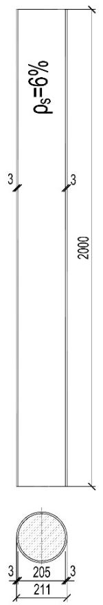  
a)

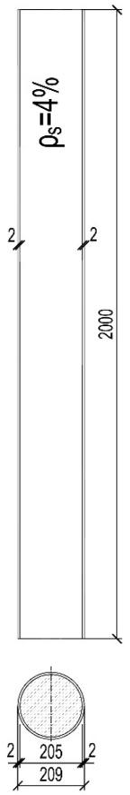  
b)

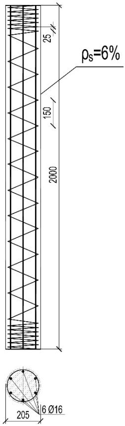  
C   
Fig.1 - Types of the tested columns, listed in Tab. 1.: a) no.1-13 means reinforcement ratio   
b) no. 18-21   
c) no.14-17. Note: ρs

Fig. 1 presents the technical details of the CFST columns of $2 0 0 0 \mathrm { m m }$ height. Their theoretical height was $2 1 7 0 \ \mathrm { m m }$ . The columns of $1 2 0 0 ~ \mathrm { { m m } }$ and of $6 0 0 ~ \mathrm { { m m } }$ height ( $1 3 7 0 ~ \mathrm { m m }$ and $7 7 0 ~ \mathrm { m m }$ theoretical height, respectively) had identical cross-section as their equivalents of $2 0 0 0 \ \mathrm { m m }$ height. The diameter of a concrete core was equal to $2 0 5 ~ \mathrm { m m }$ . All tested columns were supported on both sides on ball bearings (Fig. 2 and Fig. 3), which ensured, that each end of the column could rotate in each direction. The distance between the bearing base and the ball axis was $8 5 \mathrm { m m }$ . Therefore, the theoretical column height was $1 7 0 \ \mathrm { m m }$ bigger than the real one. That is why the values of the theoretical column height collated in Table 2 differ from the values of the real height from Fig. 1.

All columns were subjected to load in a hydraulic press (Fig. 2), which enables carrying out experimental investigations on columns of the load-carrying capacity up to $5 0 0 0 \mathrm { k N }$ and height up to 3 m. The experimental investigations were limited to the axially loaded columns.

The variables in the experimental investigations were: a columns height (2170 mm, 1370 mm and $7 7 0 \ \mathrm { m m }$ ), a compressive strength of concrete (from 25 MPa up to 55 MPa) and a total reinforcement ratio related to the area of concrete core cross-section. The reinforcement ratio was equal either to $4 \%$ or to $6 \%$ , which was tantamount to the thickness of tube equal to either 2 mm or 3 mm.

  
Fig. 2 - The hydraulic press with the column prepared for the test.

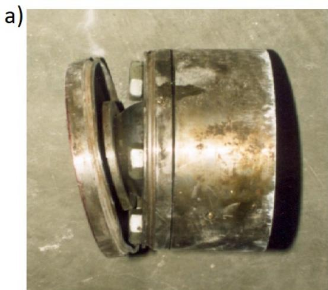

Fig. 3 – The ball bearings used in the experimental investigations:   
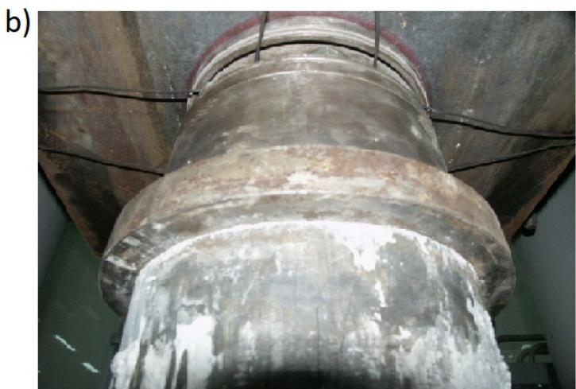  
a) the ball between two plates (upper and lower) of the bearing   
b) the bearing situated on the top of the column in the test setup

Regarding the CFST columns of $6 \%$ reinforcement ratio two kinds of the core were analysed: the plain concrete and the reinforced concrete ones. The thickness of a steel tube was $3 \mathrm { m m }$ in the case of plain concrete and 2 mm in the case of reinforced concrete. In the columns with the reinforced concrete core the total amount of reinforcement was the sum of steel tube cross-section $( 4 \% )$ and 6 bars $\Phi \ : 1 2 \ : \mathrm { m m }$ (the remaining $2 \%$ ). A spiral made of steel bar $\phi 6 \mathrm { m m }$ was used for these columns. The spiral pitch was $1 2 0 \mathrm { m m }$ . At the both column ends the spiral pitch was reduced to 1/3 of a regular spiral pitch (i.e. 40 mm).

In the group of CFST columns of a slenderness $\lambda { = } 4 2$ (design height $2 1 7 0 ~ \mathrm { m m }$ ) and a tube thickness $3 \mathrm { m m }$ the influence of bond degree between a steel tube and a concrete core was investigated. A lack of bond was modelled by smearing the internal surface of tubes with the antiadhesion preparation which is normally used in formworks for concrete. The behaviour of these columns under the acting load was compared to the behaviour of columns with normal bond made of the same concrete in the same time. The possibility of increasing bond between a steel tube and a concrete core was also analysed. Some CFST columns were made of expanding concrete.

# 3.2. MATERIALS

Concrete cylinders of $1 5 0 \mathrm { m m }$ diameter and of $3 0 0 \mathrm { m m }$ height were prepared for each column. The cylinders were cured under the same air conditions as the concrete used to make specific columns. The cylinders were used to determine compressive strength and elasticity module of concrete. These values were determined on the same day as the columns made of this concrete were tested. Elasticity modules were determined using a compressometer according to American ASTM regulations C469. Tube steel strength and reinforcement steel strength were tested according to the appropriate Polish codes. Table 2 presents the following information about strength parameters of the materials which were used in the experimental investigation: yield strength of tube steel, yield strength of longitudinal reinforcement steel and transverse reinforcement steel, compressive strength of concrete obtained from cylinder tests, elasticity module of concrete.

Expanding cement was used to produce expanding concrete. The properties of the cement: compressive strength, free expansion and self-stress had been examined by the producer: The Institute of Mineral Materials in Cracow (Polish: Instytut Mineralnych Materiałów Budowlanych). The results of this examination are presented in Table 3. The cement belongs to cements of low free expansion.

According to [16] expansive cements are classified into three categories in terms of free expansion. The applied cement belongs to the cements of the lowest expansion, marked as NC-10 (CE-1,0). Nevertheless, the restrained expansion induces compressive stresses of a high enough magnitude to result in compression in the concrete after drying shrinkage and creep has occurred.

Table 3 - Results of examination of expanding cement used in the experimental investigation   

<table><tr><td>Expanding cement of 42,5R classMortar Cement/Sand=1:1 ; Water/Cement=0,40</td><td>Result of examination</td><td>Method of examination</td></tr><tr><td>Compressive strength</td><td></td><td></td></tr><tr><td>- after 2 days</td><td>28,6 MPa</td><td rowspan="2">according to PolishCode PN-EN 196-1</td></tr><tr><td>- after 28 days</td><td>50,3 MPa</td></tr><tr><td>Free expansion</td><td></td><td></td></tr><tr><td>- In water</td><td>max. 4%</td><td rowspan="2">according toproducer procedure</td></tr><tr><td>- In air</td><td>max. 1%</td></tr><tr><td>Self-stress</td><td>1,57 MPa</td><td></td></tr></table>

# 3.3. APPLYING THE LOAD

Nine columns were loaded by force control (items from 1 to 5, 8, 16, 18 and 19 in Table 2). The other twenty-one columns were loaded by displacement control. In the case of the columns loaded by displacement control the end of the test was determined when a decrease of the compressive force reached a half of the maximum value.

The load was applied to the columns in two possible ways: either through the concrete core (alternatively the reinforced concrete core) without participation of the steel tube or through the entire cross-section i.e. a concrete core and a steel tube at the same time. The differences in both ways are presented in Fig. 4.

# 3.4. LOADING PROCESS

During the tests the measurements of longitudinal and circumferential strains of a steel tube in CFST columns were taken. Similarly, strains in longitudinal reinforcement bars and spiral reinforcement of reinforced concrete cores were measured. Strain gauges were used for this purpose. Additionally, horizontal displacements of columns were measured using a geodesy method.

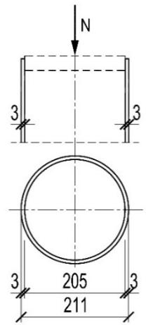

b)   
Fig. 4 - Two ways of applying load to CFST columns:   
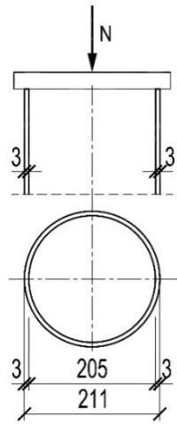  
a) loading through concrete core – e.g. item 1 in Table 2   
b) loading through entire cross-section – e.g. item 8 in Table 2

The loading process was controlled either by the force or by the displacement. In both cases the process was stopped after reaching a specific loading stage, preordained in the test program. One minute after reaching this stage the strains of a steel tube and of steel reinforcement indicated by the strain gauges were recorded. For the columns with the load applied by the displacement control the compressive force as well as steel strains recorded by the strain gauges slightly decreased during each pause in the loading. The decrease of the compressive force by stopping of the press piston in its certain position was not linear: first quick, then slow. In a period of eight minutes between the beginning and the end of the geodetic measurement within one pause in the loading compressive force decreased by a few per cents.

# 4. EXPERIMENTAL RESULTS AND DISCUSSION

# 4.1. FRACTURE MODE

Figure 5 shows CFST columns at the experimental setup just after the fracture. Regardless of their slenderness the columns fractured by buckling – global stability loss. A significant deflection of the examined columns occurred due to the fact that after the maximum compressive force was reached the columns were still loaded at a constant press piston moving until a decrease of the compressive force by $5 0 \%$ .

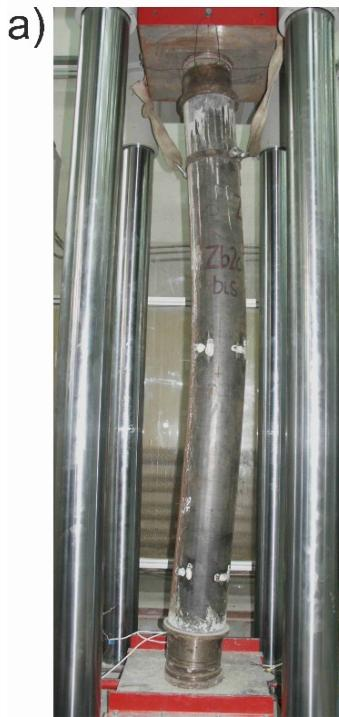

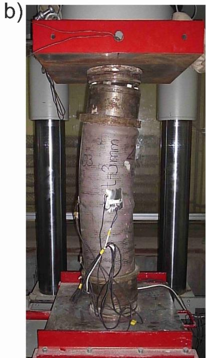  
Fig. 5 – A slender CFST column (phot.a) and a stub (phot.b) at the experimental setup after the experiment completion.

# 4.2. LOAD-CARRYING CAPACITY

One of the objectives of the experimental investigation was to compare load-bearing capacities of CFST columns. Most of them were produced using identical or similar amount of steel and concrete. There was assumed the similar cross-section area of steel and concrete in almost every column. However, the material characteristics of tube steel and reinforcement steel were not the same. Similarly, the characteristics of concrete which was used to produce columns were different in spite of all efforts. That is why a direct comparison of experimentally obtained load-carrying capacities would be pointless.

On account of that fact a comparison of the results obtained in the experiments was made for relative values of load-carrying capacities. The relative value of the load-carrying capacity is a relation between the experimental load-carrying capacity $\mathrm { N } _ { \mathrm { e x p } }$ of the column and the theoretically obtained load-carrying capacity of the cross-section $\mathrm { N _ { c a l c } }$ . These theoretical (or, more precisely, hypothetical) load-carrying capacities were calculated as algebraic sums of load-carrying capacities of steel and concrete in an uniaxial state of stress. Therefore, they were products of:

- the areas of a concrete core cross-section $\mathrm { \bf A _ { c } }$ and a steel tube, alternatively steel reinforcement cross-section, $\mathbf { A } _ { \mathrm { a } }$ or $\mathrm { A } _ { \mathrm { s } }$ respectively   
and uniaxial strength obtained from the tests carried out on concrete prisms $\mathrm { f _ { c } }$ and steel sheet specimens, alternatively steel reinforcing bars fy .

The higher the relative value of the column load-carrying capacity is, the more effectively the concrete strength in the column can be used .

The slenderness of the columns obviously influenced the relative load-carrying capacities of the tested CFST columns (Fig. 6). This influence is comprehensively illustrated by Fig. 7.

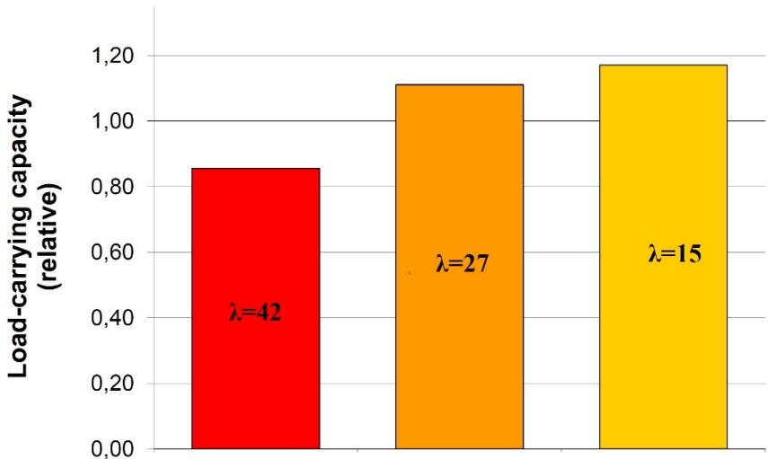  
Fig. 6 – The relative load-carrying capacity for three CFST columns of different slenderness. The presented items are, from the left: 9, 23, and 28 (listed in the Table 2).

A decrease of a slenderness influenced positively load-carrying capacity of the tested columns. It was result of a triaxial state of compressive stresses occurring in a concrete core. The Fig. 7 presents also an influence of steel tube thickness of a CFST column. Higher relative load-carrying capacities were recorded for the CFST columns of a thicker steel tube. It seems that this difference was provoked by a greater ability of a thicker tube to create a triaxial state of compressive stresses in a concrete core of a CFST column. The same figure shows the influence of a way of load applying to a CFST column. Higher relative load-carrying capacities were recorded for the CFST columns loaded through the core and not through the entire cross-section. A more distinctive influence of this parameter was observed for more stub columns.

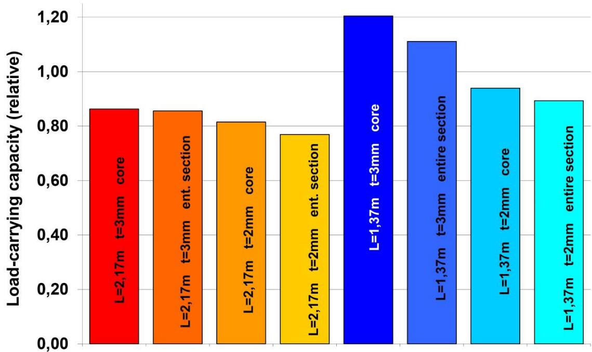  
Fig. 7 - The influence of slenderness (length $\mathrm { L } { = } 2 , 1 7 \mathrm { m }$ or $_ \mathrm { L = 1 , 3 7 m } ,$ ), tube wall thickness $\mathrm { t } { = } 3 \mathrm { m m }$ or $\scriptstyle \mathbf { t } = 2 \mathbf { m } \mathbf { m }$ ) and a loading method (through the core or through the entire section) on relative load-carrying capacity of a CFST column. Concrete strength $\mathrm { f _ { c m } { \approx } 3 0 M P a }$ . The presented items are, from the left: 6, 9, 15, 17, 22, 23, 24 and 25 (listed in the Table 2).

The conducted investigations attempted to assess the influence of bond between a concrete core and a steel tube on a load-carrying capacity of CFST columns. The comparison was made within the group of the most slender columns $\scriptstyle ( \lambda = 4 2$ ) of a tube thickness $\scriptstyle \mathrm { t = } 3 \mathrm { m m }$ . The investigations results (Fig. 8) did not show any relation between bond of a concrete core and a steel tube and a relative load-carrying capacity of slender CFST columns. It did not matter for slender columns whether bond strength was minimized or increased.

This conclusion partly confirms the results of the past research [10], [11] where the authors proved that bond between concrete and steel may influence a load-carrying capacity of CFST columns only at very low slenderness. The Australian researchers [10] stated that there is such an influence for the columns of a slenderness $\lambda { = } 1 4$ . The results presented in [12] and [13] indicate that even for the stub columns in case of the axial loading the bond strength has little or no influence on the columns strength. As Roeder et al. [17] report the bond stress demand is high where longitudinal shearing stresses are likely to be predominant: in regions of geometric discontinuity such as connections and foundation supports. In these regions, external forces are transferred mainly to the concrete core or

the steel tube only, and the load transfer needs to be ensured by sufficient bond strength between the concrete core and the steel tube.

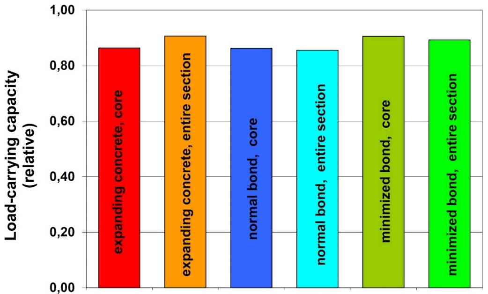  
Fig. 8 - The influence of bond conditions and a load applying method (through the core or through the entire section) on relative load-carrying capacity of a CFST column. The presented items are, from the left: 12, 13, 6, 9, 10 and 11 (listed in the Table 2).

# 5. AUTHOR’S SUGGESTION OF PRACTICAL METHOD OF DETERMINING LOAD-BEARING CAPACITY OF CFST

The author suggests a new practical method of calculating load-bearing capacity of CFST columns based on the column nominal stiffness, analogously as the method used currently for the ordinary reinforced concrete columns in Eurocode 2 [7]. The calculation procedure for the column stiffness is taken from the Polish Code [18]. This procedure based on the results of the Soviet research was applicable in the Polish standards between 1976 and 2008. In the method a CFST column is treated as an ordinary reinforced concrete column with the circular cross-section. A steel tube is considered as longitudinal reinforcement. The strength $f _ { c o r e , c d }$ of the concrete core is higher than the uniaxial concrete strength:

$$
f _ {c o r e, c d} = f _ {c d} + 2, 3 \cdot f _ {y d} \cdot \rho_ {s, c o r e} \cdot \left(1 - \frac {8 e _ {t o t}}{d _ {c o r e}}\right). \tag {1}
$$

The notation used in the formula above means as follows:

$$
\rho_ {s, c o r e} = \frac {A _ {s t}}{A _ {c o r e}},
$$

$A _ { s t } = \pi \big ( d _ { c o r e } + t \big ) t$ - cross-sectional area of a steel tube,

$A _ { c o r e } = \frac { \pi d _ { c o r e } ^ { 2 } } { 4 }$ coreA - cross-sectional area of a concrete core of a column,

$f _ { y d }$ - a design value of yield point of tube steel,

$d _ { c o r e }$ - an internal diameter of a steel tube,

$t$ - thickness of a steel tube,

$$
e _ {t o t} = e _ {o} + e _ {I I} = \eta \cdot e _ {o} - \text {t o t a l f o r c e e c c e n t r i c i t y}, \tag {2}
$$

$e _ { o }$ - initial force eccentricity (not taking into account the influence of slenderness) towards the centroid of concrete cross-section,

$e _ { I I }$ - second order eccentricity,

n - coefficient of second order eccentricity.

The second component of the formula (1) represents the concrete strength increase due to triaxial state of stress according to the code [18]. It was introduced to the code based on the research of Korzeniowski [19].

The procedure of calculating ordinary reinforced concrete columns, which forms the base for the presented calculating method of CFST columns, is well reviewed thanks to many-year use of the Polish Code for concrete structures [18]. The procedure takes into account a column slenderness and an influence of a long-term load. This iteration procedure consists of the following six steps:

1. The value of coefficient $\eta$ is to assume. This coefficient takes into consideration an influence of the second order eccentricity. It increases the eccentricity $e _ { o }$ according to the formula (2).   
2. The increased strength $f _ { c o r e , c d }$ of the core concrete is to calculate formula (1).   
3. It is assumed that in the most compressed fiber of the concrete cross-section the limited value of compressive strains has been reached. The state of strain and stress in the column cross-section are derived from the moment equilibrium equation (e.g. adding up all the moments acting in crosssection relative to the axis of acting the external compressive force). The relation between strain and stress of concrete has been assumed on the basis of Madrid parabola.

4. The load-carrying capacity $N _ { R d }$ of the circular column cross-section is to calculate while the increased concrete core strength $f _ { c o r e , c d }$ and total eccentricity $e _ { t o t }$ (fig. 9) are to take into account. This load-carrying capacity $N _ { R d }$ is equal to the sum of all internal forces in cross-section in the limit state.

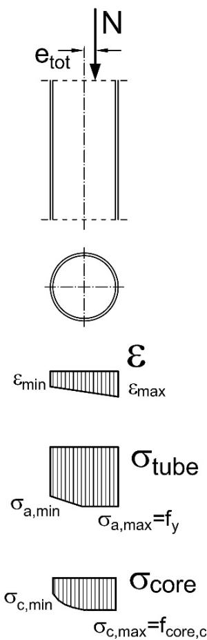  
Fig. 9 - The state of strain and stress in the cross-section of a CFST column.

5. The coefficient $\eta$ is to determine from the following formula:

$$
\eta = \frac {1}{1 - \frac {N _ {R d}}{N _ {c r i t}}} \geq 1, 0. \tag {3}
$$

The critical force $N _ { c r i t }$ is to determine from the formula:

$$
N _ {c r i t} = \frac {9}{l _ {0} ^ {2}} \left[ \frac {E _ {c m} \cdot I _ {c}}{2 \cdot k _ {l t}} \left(\frac {0 , 1 1}{0 , 1 + \frac {e _ {0}}{d _ {\text {c o r e}}}} + 0, 1\right) + E _ {s} \cdot I _ {s} \right], \tag {4}
$$

where: $l _ { 0 }$ - design column length

$E _ { c m }$ - tangent elasticity modulus of concrete,

$I _ { c }$ - a moment of inertia of the concrete cross-section, $I _ { c } = \frac { \pi \cdot d _ { c o r e } ^ { 4 } } { 6 4 }$ 4cored ⋅ π

$k _ { \scriptscriptstyle { l t } }$ - coefficient representing the influence of long-term load,

$E _ { s }$ - elasticity modulus of steel,

$I _ { s }$ - a moment of inertia of the tube cross-section relative to the central axis of the

$$
\text {c o n c r e t e} I _ {s} = \frac {\pi}{6 4} \left[ D ^ {4} - \left(d _ {\text {c o r e}}\right) ^ {4} \right]
$$

The coefficient $k _ { \scriptscriptstyle { l t } }$ representing the influence of a long-term load is to determine from the following formula:

$$
k _ {l t} = 1 + 0, 5 \frac {N _ {S d , l t}}{N _ {S d}} \cdot \phi (\infty , t _ {0}), \tag {5}
$$

where: $\frac { N _ { s d , l t } } { N _ { s d } }$ Sd lt ,N a relation between normal force resulting from the long-term part of the load SdN to the normal force resulting from the total load (design values),

$\phi ( \infty , t _ { 0 } )$ - a final creep coefficient of concrete.

The relation $\frac { e _ { 0 } } { d _ { c o r e } }$ contained in the formula (4) is dependent on the load eccentricity but should core d not be lower than:

$$
\frac {e _ {0}}{d _ {\text {c o r e}}} = 0, 5 0 - 0, 0 1 \cdot \frac {l _ {o}}{d _ {\text {c o r e}}} - 0, 0 1 \cdot f _ {\text {c m}}, \tag {6}
$$

$$
\frac {e _ {0}}{d _ {\text {c o r e}}} = 0. 0 5, \tag {7}
$$

where the value of the mean concrete strength $f _ { c m }$ should be expressed in MPa.

6. If the value of the coefficient $\eta$ which has been assumed in the first iteration step differs from its value obtained in the fifth iteration step, then the new value of the coefficient $\eta$ is to be assumed. The iteration steps 1÷5 are to be repeated till an acceptable conformity of the assumed and calculated values is achieved. Then the calculated value of load-carrying capacity $N _ { R d }$ of the circular column cross-section means load-carrying capacity of the CFST column as a whole.

Calculations conducted according to the procedure presented above give results close to those obtained from the experiments (Fig. 10). The mean value of the $\mathrm { N _ { R , e x p } / N _ { R , c a l c } }$ relation is 1,127 and coefficient of variation equals 0,154. In the author’s opinion it is an interesting alternative for the procedure assumed in Eurocode 4 [6] $( \mathrm { N _ { R , e x p } / N _ { R , c a l c } } { = } 1 , 0 6 5$ , CV=0,136).

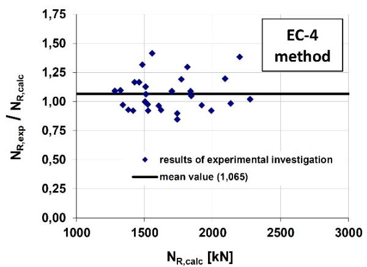  
a)

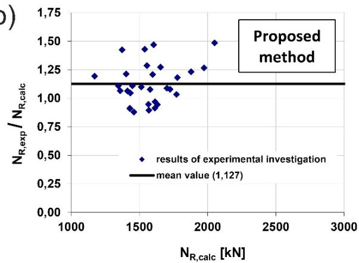  
b   
Fig. 10 - The comparison of load-bearing capacities of CFST columns obtained in the experimental investigation $( { \mathrm { N } } _ { \mathrm { R , e x p } } )$ and calculated $\mathrm { ( N _ { R , c a l } ) }$ according to the method assumed in Eurocode 4 (Fig. a) and author’s proposal (Fig. b).

# 6. CONCLUSION

As a result of the conducted experiments, some interesting observations were made:

Stub CFST columns (in the experiments $\lambda { = } 2 7$ and $\lambda { = } 1 5$ ) enable more effective use of concrete and steel properties in comparison with slender columns (in the experiment $\lambda { = } 4 2$ ).   
Effectiveness of CFST columns, as far as the use of concrete and steel strength is concerned, firmly depends on thickness of a steel tube. Only a tube of appropriate thickness (i.e. of appropriate reinforcement ratio) is able to successfully counteract a concrete core of a loaded

column pushing against it and to create triaxial state of compressive stresses considerably improving concrete strength. If tube proportion in cross-section of a column is lower than $6 \%$ , its ability to create the triaxial state of compressive stresses in the core is minimal. In this context using reinforced concrete core is rather aimless as it complicates CFST column construction and is not visibly beneficial. Application of reinforced concrete core may be useful in joining a column with beam elements.

Way of load applying influenced load-carrying capacity of CFST columns. For such columns a better solution is to apply load only through concrete core, not through the entire cross-section.   
Mean strength of concrete used for filling CFST columns did not visibly affect experimental load-bearing capacity of the columns. Neither did change of bond strength between a steel tube and a reinforced concrete core (applied in slender columns $\lambda { = } 4 2$ ) affect the columns quality. Load-carrying capacities turned out to be similar in the columns of normal and changed bond.   
The conducted experimental investigations confirmed correctness of the calculation methods for load-bearing capacity of CFST columns both accepted by Eurocode 4 and suggested herein. The suggested method, coherent with philosophy of calculating reinforced concrete and confined columns accepted in the former Polish Code [18], provides slightly higher safety than the method accepted by the European design code of composite structures.

# 7. FURTHER RESEARCH

The following directions of research are suggested:

Influence of load eccentricity on effectiveness of steel and concrete in CFST columns.   
- Influence of long-term loads on load-bearing capacity and effectiveness of CFST columns.   
Effectiveness of steel and concrete in CFST columns of higher reinforcement ratios (over $6 \%$ ), significantly exceeding acceptable values for confined and ordinary reinforced concrete columns.   
- Experiments with other types of expanding concrete in CFST columns to enhance their effectiveness (stronger expansion).   
Verification and possible calibration of the suggested calculation method for CFST columns based on investigations of columns subjected to eccentric compression.

# REFERENCES

[1] M. Ahmadi, H. Naderpour, A. Kheyroddin, Utilization of artificial neural networks to prediction of the capacity of CCFT short columns subject to short term axial load, Arch. Civ. Mech. Eng. (2014). doi:10.1016/j.acme.2014.01.006.   
[2] ENV 1994-1-1: 1992. Eurocode 4. Design of composite steel and concrete structures. General rules and rules for buildings, (1992).   
[3] K.M. Shrestha, B. Chen, Y. Chen, State of the art of creep of concrete filled steel tubular arches, KSCE J. Civ. Eng. (2011) 145–151. doi:10.1007/s12205-011-0734-7.   
[4] C. Liu, Y. Wang, W. Wang, W. Xinrong, Seismic performance and collapse prevention of concrete-filled thinwalled steel tubular arches, Thin-Walled Struct. 80 (2014) 91–102.   
[5] G. Yan, Composite Arch Bridges Developed in China, in: Compos. Constr. - Conv. Innov., Innsbruck, 1997.   
[6] EN 1994-1-1. Eurocode 4: Design of composite steel and concrete structures - Part 1-1: General rules and rules for buildings, (2009).   
[7] EN 1992-1-1. Eurocode 2: Design of concrete structures - Part 1-1: General rules and rules for buildings, (2010).   
[8] M. Abramski, T. Friedrich, W. Kurz, J. Schnell, Innovative Shear Connectors for a New Prestressed Composite Slab System for Buildings with Multiple HVACR Installations, in: R.T. Leon, T. Perea, G.A. Rassati, J. Lange (Eds.), VI Int. Eng. Conf. “Composite Constr. Steel Concr., American Society of Civil Engineers, Devil’s Thumb Ranch, Tabernash, Colorado, United States, 2011: pp. 102–111. doi:10.1061/41142(396)9.   
[9] M. Abramski, W. Kurz, J. Schnell, Experimental investigations on unconventional shear connection between steel web and concrete slab in composite beams (in Polish), Inżynieria I Bud. 67 (2011) 109–112.   
[10] A.E. Kilpatrick, B.V. Rangan, Influence of interfacial shear transfer on behavior of concrete-filled steel tubular columns, ACI Struct. J. 96 (1999) 642–648. doi:10.14359/702.   
[11] A. Fam, F. Qie, S. Rizkalla, Concrete-filled steel tubes subjected to axial compression and lateral cyclic loads, J. Struct. Eng. ASCE. 130 (2004) 631–640.   
[12] M.H. Mollazadeh, Y.C. Wang, New Mechanism of Load Introduction into Concrete-Filled Steel Tubular Columns, J. Struct. Eng. ASCE. 142 (2016).   
[13] Z.. Tao, T.-Y.. Song, B.. Uy, L.-H.. Han, Bond behavior in concrete-filled steel tubes, J. Constr. Steel Res. (2016). doi:10.1016/j.jcsr.2015.12.030.   
[14] B. Xu, T. Zhang, G. Song, H. Gu, Active interface debonding detection of a concrete-filled steel tube with piezoelectric technologies using wavelet packet analysis, Mech. Syst. Signal Process. 36 (2013) 7–17. doi:10.1016/j.ymssp.2011.07.029.   
[15] M. Abramski, Experimental investigations on the properties of the axially loaded CFST columns (in Polish). PhD-Thesis, Gdansk University of Technology, 2006.   
[16] M. Król, W. Tur, Expanding concrete (in Polish), Arkady, Warsaw, Poland, 1999.   
[17] C.W. Roeder, B. Cameron, C.B. Brown, Composite Action in Concrete Filled Tubes, J. Struct. Eng. (1999).   
[18] PN-B-03264:2002. Concrete, reinforced concrete and prestressed concrete structures. Static calculation and

design (in Polish), (2002).   
[19] P. Korzeniowski, Confined columns in the tests and theory (in Polish), Gdansk University of Technology, Gdansk, 2000.