Full length article

# Impact of D/t ratio on circular concrete-filled high-strength steel tubular stub columns under axial compression

Shiming Zhoua , Qing Suna,⁎ , Xiaohong Wub

a Department of Civil Engineering, Xi’an Jiaotong University, Xi’an 710049, China

b School of Aerospace, Xi’an Jiaotong University, Xi’an 710049, China

# A R T I C L E I N F O

Keywords:

Concrete-filled steel tubular (CFST)

High-strength steel

Diameter-to-thickness ratio (D/t)

Fibre element method

Ultimate capacity

# A B S T R A C T

Concrete-filled steel tubular (CFST) structures have been widely applied in modern construction industry owing to the composite action between the concrete and the steel tube. The benefits of CFST structures can be further achieved if high-strength materials are used. However, when high-strength steel is applied to CFST structures, the thin-walled steel section may not develop its yield strength owing to the early crushing of the cover concrete. Therefore, this paper presents an experimental study on concrete-filled circular high-strength steel stub tube (CFHST) focusing on the effect of the diameter-to-thickness (D/t) ratio. Fifteen specimens were tested under axial compression, with D/t ratios ranging from 50 to 130. The effects of the D/t ratio on the failure mode, loadversus-deformation relationship, and axial compression strength were investigated. Test results showed that the CFHST with a large D/t ratio can still reach the plastic section design. The fibre element method proposed by Liang et al. was revised to predict the load-axial deformation curves and then validated by using the ultimate bearing strength of CFST columns from 215 collected data. Finally, the bearing capacity of CFHST columns was compared with the present design codes, namely, Eurocode 4, American Institute of Steel Construction standard (AISC 360-10), Architectural Institute of Japan (AIJ) standard, and the proposed model, to evaluate the feasibility of the current codes for predicting the axial compressive strength of CFHST under axial compression.

# 1. Introduction

Concrete-filled steel tubular (CFST) structures have been widely used in the construction of long-span bridges [1], high-rise buildings [2], and transmission towers [3] owing to their high axial load capacity, ductility, seismic performance, and constructional advantages. The enhancement is due to the composite action between the individual elements. On the one hand, the concrete infill can prevent local buckling of the steel tube. On the other hand, the concrete confined by the steel tube is in a tri-axial compression stress state, which leads to higher loading-carrying capacity. Fig. 1 shows the application of CFST columns to a transmission tower.

With the advent of high-strength steel and the progress in welding technique, the application of high-strength steel (yield strength $\geq$ $4 6 0 \mathrm { M P a } )$ has attracted much attention worldwide. High-strength thinwalled steel columns have been widely used in steel structures to reduce the self-weight of structures [4–6]. Fig. 2 shows the Tokyo Sky Tree in Japan that uses Grade 700 steel tubes. However, high-strength steel may not develop its yield strength owing to local buckling, especially at larger diameter-to-thickness (D/t) ratios. Circular concrete-filled high-

strength steel tubes (CFHSTs) can generally overcome the drawback by the confinement effect. Moreover, CFHST can resist the applied loads with smaller wall thickness compared with normal-strength steel. Therefore, both space efficiency and economic benefits can be achieved [7]. Thus, experimental studies on circular CFHST were conducted by researchers in the past and are listed in Table 1.

Gardner and Jacobson [8] tested two circular CFHST stub columns under axial compression. The yield strength of the steel was $6 5 0 \mathrm { M P a }$ , and the D/t ratio was 30. Schneider [9] conducted an experimental program on circular CFHST with a steel strength up to 537 MPa and a D/t ratio of 21. The test results indicated that local buckling of circular steel tubes occurred at an axial ductility index of 10 or more. Kato [10] carried out a test with a steel strength of 470 MPa and a D/t ratio of 26. Saisho et al. [11] investigated the behaviour of CFHST with a steel strength of $4 6 2 \mathrm { M P a }$ . Uy et al. [12–18] undertook an experimental investigation into the behaviour of CFHST with a nominal steel yield stress of 690 MPa. The results suggested that the EC4 approach was unsafe for specimens subjected to pure compression, which was attributed to the rigid plastic analysis adopted in EC4. Sakino et al. [19,20]. experimentally studied the effect of high-strength materials on

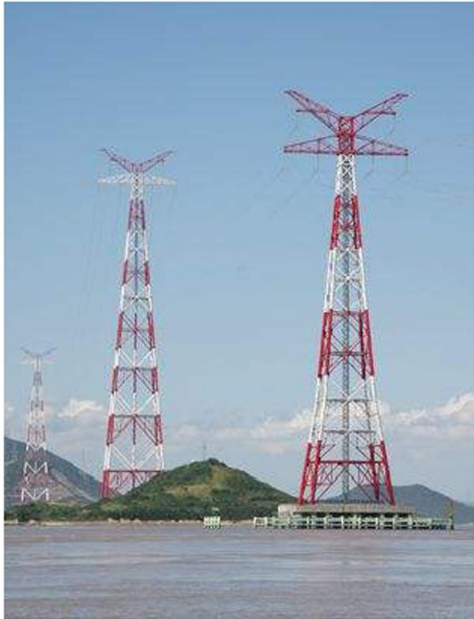  
Fig. 1. Zhoushan electricity pylon.

  
Fig. 2. Sky Tree Tokyo, Grade 700 steel.

the behaviour of CFHST columns with steel yield strengths of between 507 and $8 5 3 \mathrm { M P a }$ and D/t ratios ranging from 50 to 80. Zhu et al. [21] investigated the behaviour of a large-diameter CFHST based on the concept design of an $8 0 0 – \mathrm { m }$ steel wind power tower. Du et al. [22] investigated the size effect of rectangular concrete-filled high-strength steel columns. The test results showed that the EC4 code can extend its

limit to 550 MPa for steel.

However, the above research on circular CFHST still has some deficiencies. First, research on CFHST with a larger D/t ratio is still limited; Second, the size effect on the mechanical properties of CFHST is still unknown.

Therefore, this study aimed to investigate the impact of D/t ratio on the behaviour of circular CFHST under axial compression. The purpose is to exceed the limit of current codes and to validate whether the steel tube can reach the plastic section design.

The rest of the paper is organised as follows. First, an experimental program is introduced to study the behaviour of CFHST columns with different D/t ratios in Sections 2 and 3. Then, a fibre element model is adopted and revised to predict the behaviour of CFHST and then verified against the test results and collected data in Sections 4 and 5. Finally, the validity of current design codes for predicting the axial bearing strength of CFHST columns under axial compression is evaluated in Section 6.

# 2. Experimental investigation

# 2.1. Specimen details

Fifteen CFHST columns divided into five series were fabricated and tested in the research program. The steel tube used in each series had a uniform D/t ratio; however, the D/t ratios were different in different series, as illustrated in Fig. 3. The length (L)-to-diameter (D) ratio of each specimen was unified as 3.75 to make a stub column. The material properties of steel and concrete were obtained from the respective tensile and crushing tests. Other detailed information is recorded in Table 2.

Before the test, each specimen was labelled, which starts with the letter “C”, followed by the nominal diameter size, and the last number is the serial number of the specimen in a series. The D/t limitation in current design codes is also calculated and listed in Table 2.

# 2.2. Material properties

# 2.2.1. Tensile coupon tests

Twelve tensile coupons divided into two groups (thickness: 2 mm and $3 \mathrm { m m }$ , respectively) were cut out from the steel plate and tested in an Instron uniaxial testing machine to determine the performance of the Q690 high-strength steel plate. Detailed sizes for these coupons are provided in Tables 3 and 4, as illustrated in Fig. 4. The test results including the yield strength $( f _ { y } )$ , ultimate strength $( f _ { u } )$ , and elastic Young's modulus $\left( E _ { s } \right)$ for these test coupons are concluded in Tables 3 and 4.

# 2.2.2. Concrete cube tests

For each CFHST column, three cubic concrete cubes (size: $1 5 0 \mathrm { m m } \times 1 5 0 \mathrm { m m } \times 1 5 0 \mathrm { m m } )$ were cast and tested on the same days as for the CFHST columns to determine the cubic strength of the concrete. The concrete was poured in two batches. The mix proportions of the concrete are listed in Table 5. The average compressive strength of the concrete cubes $f _ { c u }$ measured was 50.4 MPa and $5 3 . 4 \mathrm { M P a }$ , respectively. The characteristic compressive strength of the concrete $f _ { c } ^ { \prime }$ (cylinder $1 5 0 \mathrm { m m } \times 3 0 0 \mathrm { m m }$ ) was calculated according to Tang et al. [23]. The results are listed in Table 2.

# 2.3. Fabrication of specimens

All steel tubes were rolled and welded from steel plates in a commercial workshop. After the fabrication of the steel hollow section had been made, a 12-mm-thick flat plate was welded to one of its bases for holding the wet concrete during construction. Concrete was then vertically cast into the steel tube in three layers. For each layer, concrete was compacted with a poker vibrator. Then, the concrete was cured

Table 1 CFHST columns (other researchers’ results).   

<table><tr><td>No.</td><td>Specimens</td><td>L (mm)</td><td>D (mm)</td><td>t (mm)</td><td>fy (MPa)</td><td>Es (GPa)</td><td>fc&#x27; (MPa)</td><td>Nu (kN)</td><td>Reference</td></tr><tr><td>1</td><td>3</td><td>203</td><td>101.7</td><td>3.07</td><td>650.1</td><td>200.0</td><td>34.1</td><td>1112</td><td>Gardner and Jacobson [8]</td></tr><tr><td>2</td><td>4</td><td>203</td><td>101.7</td><td>3.07</td><td>650.1</td><td>200.0</td><td>31.2</td><td>1067</td><td></td></tr><tr><td>3</td><td>C3</td><td>616</td><td>140.0</td><td>6.58</td><td>537.0</td><td>200.0</td><td>28.2</td><td>2010</td><td>Schneider [9]</td></tr><tr><td>4</td><td>C2MBH</td><td>904</td><td>301.3</td><td>11.59</td><td>471.4</td><td>200.0</td><td>34.2</td><td>8594</td><td>Kato [10]</td></tr><tr><td>5</td><td>H60.1</td><td>419</td><td>139.8</td><td>2.37</td><td>462.6</td><td>200.0</td><td>59.9</td><td>1558</td><td>Saisho et al. [11]</td></tr><tr><td>6</td><td>H60.2</td><td>419</td><td>139.8</td><td>2.37</td><td>462.6</td><td>200.0</td><td>68.0</td><td>1577</td><td></td></tr><tr><td>7</td><td>H60.3</td><td>419</td><td>139.8</td><td>2.37</td><td>462.6</td><td>200.0</td><td>68.0</td><td>1577</td><td></td></tr><tr><td>8</td><td>H60.4</td><td>419</td><td>139.8</td><td>2.37</td><td>462.6</td><td>200.0</td><td>68.0</td><td>1626</td><td></td></tr><tr><td>9</td><td>L60.1</td><td>419</td><td>139.8</td><td>2.37</td><td>462.6</td><td>200.0</td><td>26.6</td><td>1098</td><td></td></tr><tr><td>10</td><td>L60.2</td><td>419</td><td>139.8</td><td>2.37</td><td>462.6</td><td>200.0</td><td>26.6</td><td>1107</td><td></td></tr><tr><td>11</td><td>L60.3</td><td>419</td><td>139.8</td><td>2.37</td><td>462.6</td><td>200.0</td><td>26.6</td><td>1078</td><td></td></tr><tr><td>12</td><td>CC6-A-2</td><td>366</td><td>122.0</td><td>4.54</td><td>576.0</td><td>200.0</td><td>25.4</td><td>1509</td><td>Sakino and Hayashi [20]</td></tr><tr><td>13</td><td>CC6-A-4-1</td><td>366</td><td>122.0</td><td>4.54</td><td>576.0</td><td>200.0</td><td>40.5</td><td>1657</td><td></td></tr><tr><td>14</td><td>CC6-A-4-2</td><td>366</td><td>122.0</td><td>4.54</td><td>576.0</td><td>200.0</td><td>40.5</td><td>1663</td><td></td></tr><tr><td>15</td><td>CC6-A-8</td><td>366</td><td>122.0</td><td>4.54</td><td>576.0</td><td>200.0</td><td>77.0</td><td>2100</td><td></td></tr><tr><td>16</td><td>CC6-C-2</td><td>717</td><td>239.0</td><td>4.54</td><td>507.0</td><td>200.0</td><td>25.4</td><td>3035</td><td></td></tr><tr><td>17</td><td>CC6-C-4-1</td><td>714</td><td>238.0</td><td>4.54</td><td>507.0</td><td>200.0</td><td>40.5</td><td>3583</td><td></td></tr><tr><td>18</td><td>CC6-C-4-2</td><td>714</td><td>238.0</td><td>4.54</td><td>507.0</td><td>200.0</td><td>40.5</td><td>3647</td><td></td></tr><tr><td>19</td><td>CC6-C-8</td><td>714</td><td>238.0</td><td>4.54</td><td>507.0</td><td>200.0</td><td>77.1</td><td>5578</td><td></td></tr><tr><td>20</td><td>Z3</td><td>997.5</td><td>558.1</td><td>16.53</td><td>560</td><td>185.5</td><td>21.2</td><td>29,049</td><td>Zhu et al. [21]</td></tr><tr><td>21</td><td>Z4</td><td>994.9</td><td>557.6</td><td>16.52</td><td>560</td><td>185.5</td><td>21.2</td><td>28,828</td><td></td></tr><tr><td>22</td><td>Z5</td><td>994.9</td><td>559.4</td><td>16.54</td><td>560</td><td>185.5</td><td>21.2</td><td>29,588</td><td></td></tr></table>

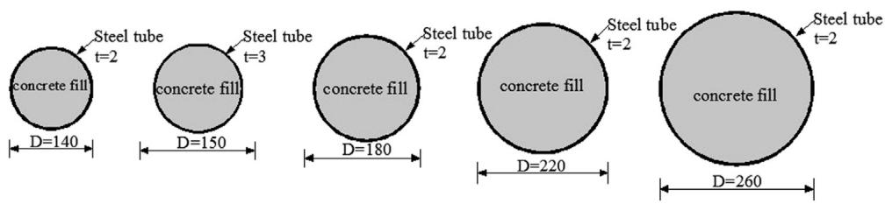  
Fig. 3. CFHST columns (in mm).

Table 2 Summary of the specimens.   

<table><tr><td rowspan="2">Series</td><td rowspan="2">Label</td><td rowspan="2">D (mm)</td><td rowspan="2">t (mm)</td><td rowspan="2">L (mm)</td><td rowspan="2">D/t</td><td rowspan="2">fy (MPa)</td><td rowspan="2">f′c (MPa)</td><td colspan="3">D/t limitation</td></tr><tr><td>EC4</td><td>AIJ</td><td>AISC 360-10</td></tr><tr><td rowspan="3">Series A</td><td>C140-1</td><td>141.42</td><td>2.35</td><td>525</td><td>60</td><td>734</td><td>42.4</td><td rowspan="3">90 235/fy (≤28.5)</td><td rowspan="3">360 98/F (≤47.6)</td><td rowspan="3">0.31 Es/ fy (≤84)</td></tr><tr><td>C140-2</td><td>141.44</td><td>2.22</td><td>525</td><td>64</td><td>734</td><td>42.4</td></tr><tr><td>C140-3</td><td>140.84</td><td>2.37</td><td>525</td><td>59</td><td>734</td><td>42.4</td></tr><tr><td rowspan="3">Series B</td><td>C150-1</td><td>151.05</td><td>2.98</td><td>562.5</td><td>51</td><td>691</td><td>42.4</td><td></td><td></td><td></td></tr><tr><td>C150-2</td><td>150.62</td><td>3.04</td><td>562.5</td><td>50</td><td>691</td><td>45.4</td><td></td><td></td><td></td></tr><tr><td>C150-3</td><td>151.5</td><td>2.98</td><td>562.5</td><td>61</td><td>691</td><td>45.4</td><td></td><td></td><td></td></tr><tr><td rowspan="3">Series C</td><td>C180-1</td><td>182.50</td><td>2.27</td><td>675</td><td>80</td><td>734</td><td>45.4</td><td></td><td></td><td></td></tr><tr><td>C180-2</td><td>181.80</td><td>2.17</td><td>675</td><td>84</td><td>734</td><td>45.4</td><td></td><td></td><td></td></tr><tr><td>C180-3</td><td>181.15</td><td>2.27</td><td>675</td><td>80</td><td>734</td><td>42.4</td><td></td><td></td><td></td></tr><tr><td rowspan="3">Series D</td><td>C220-1</td><td>220.00</td><td>2.13</td><td>825</td><td>103</td><td>734</td><td>45.4</td><td></td><td></td><td></td></tr><tr><td>C220-2</td><td>221.50</td><td>2.17</td><td>825</td><td>102</td><td>734</td><td>45.4</td><td></td><td></td><td></td></tr><tr><td>C220-3</td><td>220.97</td><td>2.13</td><td>825</td><td>104</td><td>734</td><td>42.4</td><td></td><td></td><td></td></tr><tr><td rowspan="3">Series E</td><td>C260-1</td><td>261.70</td><td>2.13</td><td>975</td><td>123</td><td>734</td><td>45.4</td><td></td><td></td><td></td></tr><tr><td>C260-2</td><td>261.90</td><td>2.11</td><td>975</td><td>124</td><td>734</td><td>45.4</td><td></td><td></td><td></td></tr><tr><td>C260-3</td><td>262.00</td><td>2.16</td><td>975</td><td>121</td><td>734</td><td>45.4</td><td></td><td></td><td></td></tr></table>

Notation: $E _ { s }$ is the Young's modulus of the steel. $F = ( f _ { y } , 0 . 7 f _ { u } )$ . $f _ { u }$ is the ultimate strength of the steel.

inside the steel tube with the top open to air for 2 weeks. Finally, a 12- mm-thick flat plate was welded to the top to ensure a uniform shortening of the concrete and steel tube after the concrete on the top was levelled.

# 2.4. Experimental setup

# 2.4.1. Test equipment

Experimental tests were carried out in a 5000-kN-capacity Denison compression testing machine. Fig. 5 illustrates a schematic view and a photo of the test setup. To ensure a uniform compression, we conducted

preliminary tests within the elastic range by adjusting the loading plate on the basis of the eight strain gauges attached at the middle of the test specimens.

The loading process was conducted in two stages. At the initial stage, a load-controlled type of loading with an increment of $1 0 \%$ estimated maximum load $( P _ { \mathrm { m a x } }$ based on the AIJ code) was adopted until $0 . 6 ~ P _ { \mathrm { m a x } }$ was reached. Then, a displacement-controlled loading was alternated. The displacement increment applied in this stage was with an increment of $0 . 2 \mathrm { m m / m i n }$ . The increment was increased to $0 . 5 \mathrm { m m / m i n }$ after the peak load until the failure of the specimens.

Table 3 Tensile coupon tests (2 mm).   

<table><tr><td>Coupon no.</td><td>t (mm)</td><td>Yield strength fy(MPa)</td><td>Ultimate strength fu(MPa)</td><td>fy/fu</td><td>Young&#x27;s modulus Es(GPa)</td><td>Yield strain με</td></tr><tr><td>Q690-2-1</td><td>2.14</td><td>737</td><td>789</td><td>0.934</td><td>201.9</td><td>3650</td></tr><tr><td>Q690-2-2</td><td>2.15</td><td>724</td><td>777</td><td>0.932</td><td>203.3</td><td>3561</td></tr><tr><td>Q690-2-3</td><td>2.13</td><td>739</td><td>792</td><td>0.933</td><td>201.2</td><td>3673</td></tr><tr><td>Q690-2-4</td><td>2.19</td><td>747</td><td>801</td><td>0.933</td><td>204.4</td><td>3655</td></tr><tr><td>Q690-2-5</td><td>2.18</td><td>774</td><td>833</td><td>0.930</td><td>205.4</td><td>3768</td></tr><tr><td>Q690-2-6</td><td>2.19</td><td>725</td><td>777</td><td>0.933</td><td>192.9</td><td>3758</td></tr><tr><td>Average</td><td></td><td>734</td><td>787</td><td>0.933</td><td>200.7</td><td>3659</td></tr><tr><td>Standard devia-tion</td><td></td><td>9.8</td><td>10.3</td><td>0.000</td><td>4.5</td><td>70.2</td></tr></table>

Table 4 Tensile coupon tests (3 mm).   

<table><tr><td>Coupon no.</td><td>Yield strengthfy(MPa)</td><td>Ultimate strengthfu(MPa)</td><td>fy/fu</td><td>Young&#x27;s modulus Es(GPa)</td><td>Yield strain με</td></tr><tr><td>Q690-2-1</td><td>685</td><td>754</td><td>0.908</td><td>201.7</td><td>3396</td></tr><tr><td>Q690-2-2</td><td>690</td><td>755</td><td>0.914</td><td>199.6</td><td>3457</td></tr><tr><td>Q690-2-3</td><td>686</td><td>746</td><td>0.920</td><td>203.8</td><td>3366</td></tr><tr><td>Q690-2-4</td><td>700</td><td>764</td><td>0.916</td><td>198.3</td><td>3530</td></tr><tr><td>Q690-2-5</td><td>686</td><td>761</td><td>0.901</td><td>201.3</td><td>3408</td></tr><tr><td>Q690-2-6</td><td>699</td><td>763</td><td>0.916</td><td>198.6</td><td>3520</td></tr><tr><td>Average</td><td>691</td><td>757</td><td>0.913</td><td>200.6</td><td>3446</td></tr><tr><td>Standard deviation</td><td>6.22</td><td>6.26</td><td>0.010</td><td>1.92</td><td>61.8</td></tr></table>

# 2.4.2. Strain gauge locations

Strain gauges were bonded to the exterior surfaces of the steel section, as illustrated in Fig. 6, to monitor the strain distribution along the cross section of the columns and temperature compensate for steel. Twenty-four biaxial strain gauges were adopted per specimen. Four displacement transducers were placed in the middle of the specimen to measure the lateral displacement. Earth pressure cell with an ultimate stress range of $5 0 \mathrm { M P a }$ , as shown in Fig. 7, was embedded into confined concrete to measure the axial stress during the loading. The placement location is also illustrated in Fig. 7. All of the strains, displacements, and loads were measured automatically and simultaneously by a data logger.

Table 5 Mix proportions of the concrete.   

<table><tr><td rowspan="2">No.</td><td colspan="5">Per unit volume/m3</td></tr><tr><td>Water (kg)</td><td>Cement (kg)</td><td>Fly ash (kg)</td><td>Coarse aggregate (kg)</td><td>PC (kg)</td></tr><tr><td>C40</td><td>170</td><td>360</td><td>80</td><td>1084</td><td>13.2</td></tr></table>

# 3. Experimental results

This section outlines the results for the failure modes and failure loads as well as the load-axial shortening measurements.

# 3.1. Failure loads

The maximum loads adopted for all specimens are summarised in Table 6, where the maximum load is denoted by $N _ { u }$ .

# 3.2. Failure modes

Typical failure modes of the test specimens are shown in Fig. 8. It can be seen and concluded that all the specimens exhibited shear failure. Usually, the failure of a concrete prism subjected to concentric compression load is produced by generating cracks through splitting or sliding, as shown in Fig. 9. Hence, the failure of CFST columns may be explained as illustrated in Fig. 9. Thus, it can be concluded that local plate buckling is induced after the concrete is damaged.

The shear failure process of specimens with different D/t ratios was almost similar, with a few differences. At first, there was no obvious phenomenon until the yield of the steel tube. Then, slip lines occurred on the surface of the steel tube. With the increase in axial load, shear failure occurred at the middle or end of the steel tube. Some differences happened at the moment owing to the D/t ratio. As for specimen with a smaller D/t ratio, for instance, C140-1, the confinement factor was enough for the axial load to transfer and the second shear failure surface could occur. However, as for specimen with a larger D/t ratio, the axial load could not be transferred and only the first shear failure surface was broadened. Finally, the specimen failed with a crack in the steel tube.

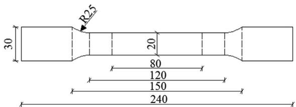

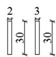

  
(a) Dimension in mm   
(b) Failure mode (thickness=2 mm)

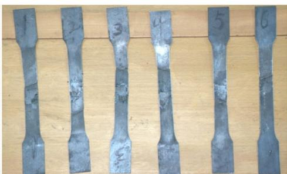  
(c) Failure mode (thickness=3 mm)   
Fig. 4. Dimension in mm and failure modes of the steel coupons.

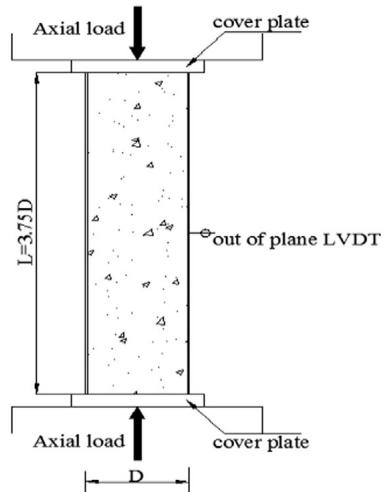  
Fig. 5. Schematic view and photo of the test specimen.

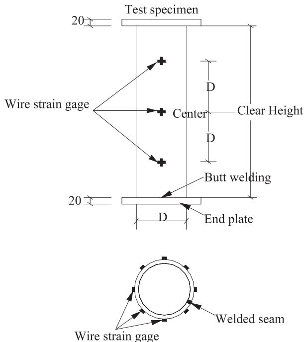  
Fig. 6. Location of the strain gauges for the specimens.

# 3.3. Load-strain behaviour

There are two ways to acquire the axial strain of a specimen. One is to take the axial strain as the average reading from the average midheight axial strain gauges, and the other is to take the overall axial shortening divided by the specimen length. When the deformation of the end plates is considered, the shortening is always larger than the mid-height strain. Therefore, readings from the axial strain gauges could be taken to closely reflect the strain state of the steel tube at the mid-height, as employed by Hu et al. [24]. During the test, significant slips existed after the development of local buckling of the steel tube, as observed in the experimental test, which means that the axial strain gauge readings cannot be assumed to closely reflect the strain state of the confined concrete after local buckling, according to Hu et al. [24]. Therefore, these axial strain gauge readings applied in the analysis of the stress state of the steel tube in the present study were adopted before local buckling. The load-average longitudinal strain and lateral strain curves of the specimens were plotted and are shown in Fig. 10, except for C150-1 owing to data acquisition mistake.

# 3.4. Load-axial shortening

The load-axial shortening curves of the specimens were recorded. Fig. 11 shows the axial load-displacement relationship of all specimens. The axial displacement indicates the change in the vertical displacement between the top and the bottom loading points. Points A-F in Fig. 12 show the key events in the behaviour of specimens in each series and are described as follows:

A. Yielding of the steel tube $( P _ { y } )$   
B. The concrete reaches the failure strain $\varepsilon _ { c u } \approx 0 . 0 0 3$ under short-term loading $\left( P _ { c } \right)$   
C. The axial strain of the steel tube reaches the yield strain $\left( P _ { l s } \right)$   
D. The hoop strain of the steel tube reaches the yield strain $( P _ { h s } )$   
E. Maximum bearing load $\left( N _ { u } \right)$   
F. Ultimate state $\left( P _ { u } \right)$

At Point A, the von Mises stress of the steel tube reaches the yield strength given by Eq. (1):

$$
f _ {z} ^ {2} + f _ {\theta} ^ {2} - f _ {z} f _ {\theta} = f _ {y} ^ {2} \tag {1}
$$

where $f _ { z }$ and $f _ { \theta }$ are the axial stress and the hoop stress of the steel tube, respectively.

At Point F, the load-carrying capacity reduces to $8 5 \%$ of the peak load and it is defined as the ultimate state. Characteristics A, C, D, E, and F can be recorded using the biaxial strain gauges at the mid-height cross section. No slip was assumed between the steel and the concrete during the experiment owing to the effect of the cover plate. Hence, the concrete stress could be recorded on the basis of the strain gauge on the steel tube before local buckling. Five specimens were selected to evaluate the effect of different D/t ratios: C140-1, C150-2, C180-1, C220-1, and C260-1. Let us take specimen C140-1 as an example to elaborate the failure process of the specimens. Specimen C140-1 has a D/t ratio of 60.18. As shown in Fig. 9, the steel tube yielded at $3 6 \%$ of the peak load. The concrete reached the failure strain at $6 9 \%$ of the peak load. Then, the axial strain of the steel tube reached the failure strain at $7 9 \%$ of the peak load. The hoop strain reached the failure strain at $8 6 \%$ when the stiffness began to drop owing to the decrease in the confining effect. Finally, shear failure occurred soon after the specimens had reached the peak load.

The key test results for all specimens are summarised in Table 6. Here, $N _ { u }$ and $\delta _ { p }$ are the peak load and the axial shortening of a specimen, respectively; $P _ { u }$ and $\delta _ { u }$ are the load and the axial shortening of a specimen at the ultimate state, respectively; $P _ { c }$ is the nominal load as the axial strain reaches $3 0 0 0 ~ \mu \varepsilon$ ; and $P _ { y }$ is the strength when the von Mises stress of the steel tube reaches the yield strength. As shown in

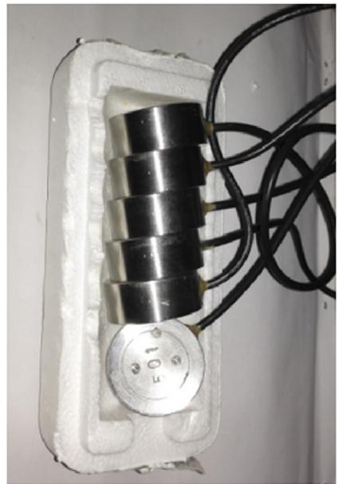

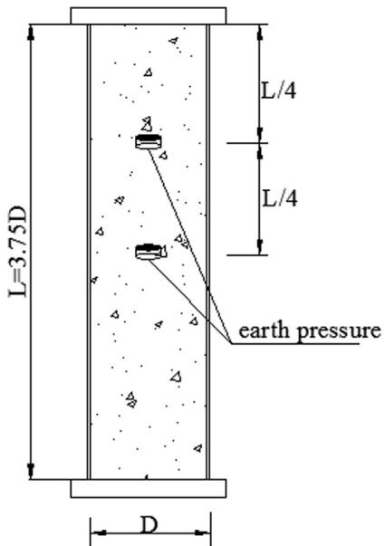  
Fig. 7. Earth pressure cell and displacement.

Table 6 Summary of the test results.   

<table><tr><td>Specimen</td><td>Py(kN)</td><td>Pc(kN)</td><td>Nu(kN)</td><td>Py/Nu</td><td>Pc/Nu</td><td>δp(mm)</td><td>δu(mm)</td><td>δu/δp</td></tr><tr><td>C140-1</td><td>560</td><td>1095</td><td>1588</td><td>0.35</td><td>0.69</td><td>9.2</td><td>54.8</td><td>5.96</td></tr><tr><td>C140-2</td><td>560</td><td>1130</td><td>1550</td><td>0.36</td><td>0.73</td><td>12.9</td><td>69.25</td><td>5.37</td></tr><tr><td>C140-3</td><td>500</td><td>1040</td><td>1555</td><td>0.32</td><td>0.67</td><td>28.9</td><td>/</td><td>/</td></tr><tr><td>C150-2</td><td>1350</td><td>1630</td><td>1965</td><td>0.69</td><td>0.83</td><td>10.7</td><td>56.2</td><td>5.3</td></tr><tr><td>C150-3</td><td>1400</td><td>1812</td><td>2056</td><td>0.68</td><td>0.88</td><td>11.2</td><td>114.5</td><td>10.2</td></tr><tr><td>C180-1</td><td>890</td><td>1800</td><td>2284</td><td>0.39</td><td>0.79</td><td>12.6</td><td>26.63</td><td>2.11</td></tr><tr><td>C180-2</td><td>835</td><td>1650</td><td>2405</td><td>0.35</td><td>0.69</td><td>12.5</td><td>45.16</td><td>3.61</td></tr><tr><td>C180-3</td><td>850</td><td>1690</td><td>2301</td><td>0.37</td><td>0.73</td><td>8.9</td><td>39.52</td><td>4.44</td></tr><tr><td>C220-1</td><td>1150</td><td>2370</td><td>3227</td><td>0.36</td><td>0.73</td><td>14.5</td><td>26.07</td><td>1.80</td></tr><tr><td>C220-2</td><td>1170</td><td>2340</td><td>3072</td><td>0.38</td><td>0.76</td><td>15</td><td>26.08</td><td>1.74</td></tr><tr><td>C220-3</td><td>1110</td><td>2350</td><td>2990</td><td>0.37</td><td>0.79</td><td>14.2</td><td>22.75</td><td>1.60</td></tr><tr><td>C260-1</td><td>1830</td><td>3760</td><td>4120</td><td>0.44</td><td>0.91</td><td>13.28</td><td>18.06</td><td>1.36</td></tr><tr><td>C260-2</td><td>1780</td><td>3650</td><td>4302</td><td>0.41</td><td>0.85</td><td>13.18</td><td>17.63</td><td>1.34</td></tr><tr><td>C260-3</td><td>1700</td><td>3250</td><td>4198</td><td>0.40</td><td>0.77</td><td>14.42</td><td>23.27</td><td>1.61</td></tr></table>

Table 6, the axial shortening at the ultimate state decreased compared with the axial shortening at the peak load, with the increment of the D/t ratio as the yield load compared with the peak load.

# 3.5. Stress analysis of earth pressure cell

The axial stress of the confined concrete obtained by earth pressure cells is illustrated in Fig. 13. It can be concluded from Fig. 13 that the curve features an ascending branch before local buckling. The measured stress of the concrete infill was larger than the characteristic compressive strength $f _ { c } ^ { \prime }$ , which means that the steel tube could still provide constraint to concrete even with a large diameter. Therefore, the D/t ratio is suggested to broaden in some cases.

# 4. Theoretical analysis of the hoop stress

To investigate the behaviour of CFHST, we propose a new hoop stress equation based on the theoretical analysis to measure the confinement mechanics. It is assumed that the steel tube is in a plane strain condition and that there is no gap between the in-filled concrete and the steel tube. By these assumptions, the equilibrium condition in the relationship is illustrated in Fig. 14 and is represented by the following equation:

$$
P = A _ {c} \times \sigma_ {c} + A _ {s} \times f _ {z} \tag {2}
$$

$$
2 t f _ {\theta} = f _ {r} (D - 2 t) \tag {3}
$$

The hoop stress can be calculated using the following equation:

$$
f _ {r} = f _ {\theta} \frac {2 t}{(D - 2 t)} \tag {4}
$$

On the basis of the experimental results that the hoop strain has reached the yield strain of the steel, we can assume that the hoop stress is a function:

$$
\begin{array}{l} f _ {r} = f _ {y} \times f \left(\frac {2 t}{D - 2 t}\right) \\ = f _ {y} \times g \left(\frac {D - 2 t}{2 t}\right) = f _ {y} \times h \left(\frac {D}{t}\right) \tag {5} \\ \end{array}
$$

where $\begin{array} { r } { f ( \frac { 2 t } { D - 2 t } ) , g ( \frac { D - 2 t } { 2 t } ) } \end{array}$ , and $h ( \frac { D } { t } )$ are the functions of the D/t ratio.

# 5. Nonlinear numerical analysis

The fibre element model proposed by Liang et al. [25–27] was revised here to describe the load deformation of CFHST with a larger D/t ratio. A new hoop stress equation for confined concrete is proposed to make up for the gap where the hoop stress equation in Liang et al.’s model is obtained from two points when the D/t ratio is larger than 47 [28]. This section is organised as follows. First, a material constitutive model for confined concrete and steel tube is described. A new hoop

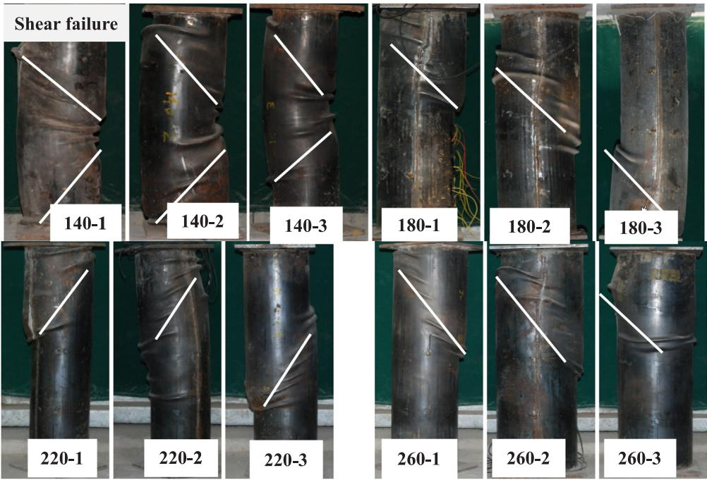  
Fig. 8. Typical failure mode of CFST columns.

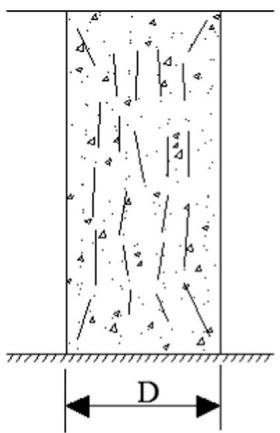  
(a)

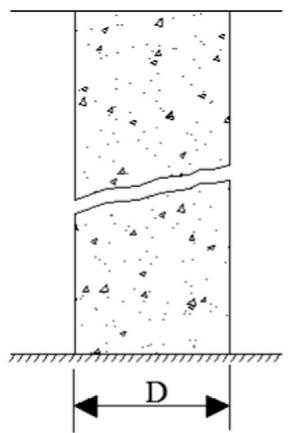  
(b)

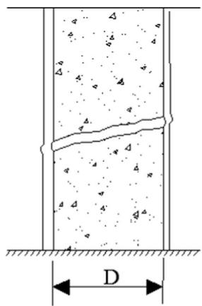  
  
Fig. 9. Failure patterns for concrete prism and CFST columns: (a) splitting for concrete prism; (b) sliding for concrete prism; (c) failure mode for CFST columns.

stress equation is included. Then, the proposed model is verified in two ways. One is through comparison of the load deformation between the numerical results and the experimental results. The other is through the comparison made between the collected data and the numerical results for the ultimate strength of concrete-filled steel tubes.

# 5.1. Material models

The constitutive model of confined concrete adopted here is the model proposed by Liang et al. [25–27], as shown in Fig. 15. The general stress-strain curve is divided into three parts, namely, OA, AB, and BC, and is expressed by the equations below.

The ascending part OA is the model proposed by Mander et al. [29] and is expressed as

partOA

$$
\begin{array}{l} \sigma_ {c} = \frac {f _ {c c} ^ {\prime} \lambda (\varepsilon_ {c} / \varepsilon_ {c c} ^ {\prime})}{\lambda - 1 + (\varepsilon_ {c} / \varepsilon_ {c c} ^ {\prime}) ^ {\lambda}} \\ \lambda = \frac {E _ {\mathrm {c}}}{E _ {\mathrm {c}} - \left(f _ {\mathrm {c c}} ^ {\prime} / \varepsilon_ {\mathrm {c c}} ^ {\prime}\right)} \tag {6} \\ \end{array}
$$

where $\sigma _ { c }$ and $\varepsilon _ { c }$ are the longitudinal compressive stress and strain of concrete, respectively; $f _ { c c } ^ { \prime }$ is the compressive strength of confined concrete; $\varepsilon _ { c c } ^ { \prime }$ is the strain at $f _ { c c } ^ { \prime } \mathrm { : }$ ; and $E _ { c }$ is the Young's modulus of concrete. The Young's modulus of concrete can be calculated by the following formula given in ACI-318 [30]:

$$
E _ {c} = 3 3 2 0 \sqrt {\gamma_ {c} f _ {c} ^ {\prime}} + 6 9 0 0 \tag {7}
$$

where $\gamma _ { c }$ is the strength reduction factor for concrete proposed by Sakino et al. [19] and is defined as follows:

$$
\gamma_ {c} = 1. 6 7 D _ {c} ^ {- 0. 1 1 2} \tag {8}
$$

The compressive strength $f _ { c c } ^ { \prime }$ and the corresponding strain $\varepsilon _ { c c } ^ { \prime }$ of confined concrete under the laterally confining pressures proposed by Mander et al. [29] and modified by Liang and Fragomeni [26] were adopted and are expressed as follows:

$$
f _ {c c} ^ {\prime} = \gamma_ {c} f _ {c} ^ {\prime} + k _ {1} f _ {r p} \tag {9}
$$

$$
\varepsilon_ {c c} ^ {\prime} = \varepsilon_ {c} ^ {\prime} \left(1 + k _ {2} \frac {f _ {r p}}{\gamma_ {c}}\right) \tag {10}
$$

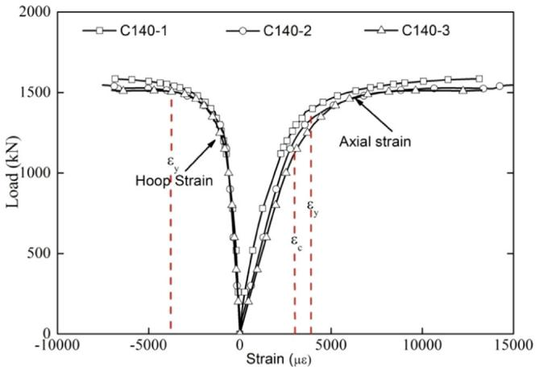  
(a) Series 140

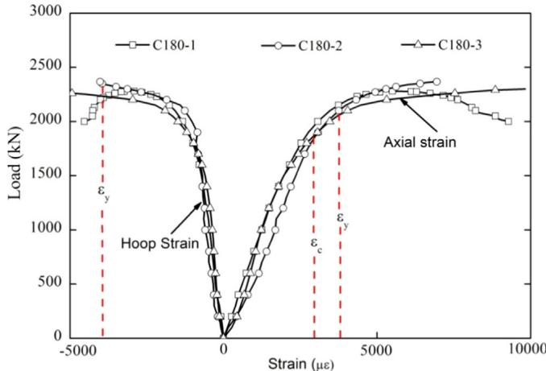  
(c) Series 180

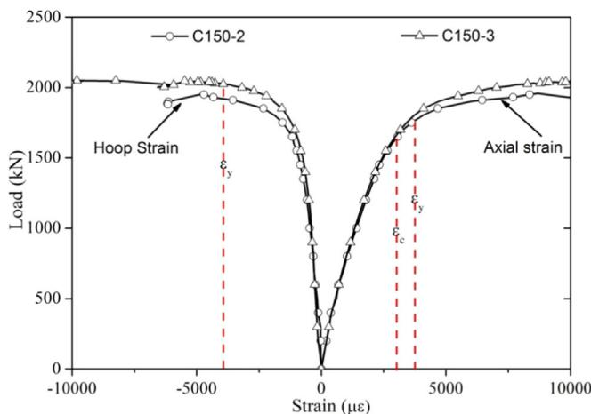  
(b) Series 150

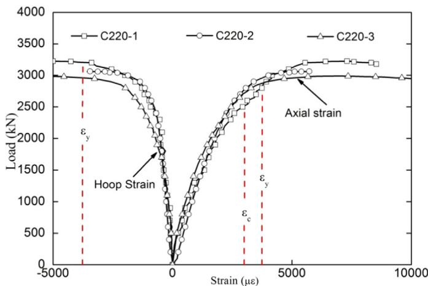  
(d) Series 220

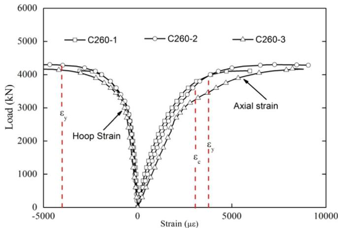  
(e) Series 260   
Fig. 10. Axial load versus strain gauges.

The constant parameters $k _ { 1 }$ and $k _ { 2 }$ are taken as 4.1 and 20.5 on the basis of the experimental study of Richard et al. [31], respectively.

The strain $\varepsilon _ { c } ^ { \prime }$ of unconfined concrete at $f _ { c } ^ { \prime }$ was adopted from Liang and Fragomeni [26] and is defined as follows:

$$
\varepsilon_ {c} ^ {\prime} = \left\{ \begin{array}{l l} 0. 0 0 2 & \text {f o r} \quad \gamma_ {c} f _ {c} ^ {\prime} \leq 2 8 M P a \\ 0. 0 0 2 + \frac {\gamma_ {c} f _ {c} ^ {\prime} - 2 8}{5 4 0 0} & \text {f o r} \quad 2 8 \leq \gamma_ {c} f _ {c} ^ {\prime} \leq 8 2 M P a \\ 0. 0 0 3 & \text {f o r} \quad \gamma_ {c} f _ {c} ^ {\prime} > 8 2 M P a \end{array} \right. \tag {11}
$$

The confining pressure model for confined concrete is given by

$$
f _ {r} = \left\{ \begin{array}{l l} 0. 7 \left(v _ {e} - v _ {s}\right) \frac {2 t}{D - 2 t} f _ {y} & \text {f o r} \quad \frac {D}{t} \leq 4 7 \\ \left(0. 0 0 8 - 0. 0 0 0 0 1 5 \frac {D}{t} - 2 \times 1 0 ^ {- 7} \times \left(\frac {D}{t}\right) ^ {2}\right) f _ {y} & \text {f o r} \quad 4 7 <   \frac {D}{t} <   1 2 5 \end{array} \right. \tag {12}
$$

where $D$ and $t$ are the outer diameter and the thickness of the steel tube,

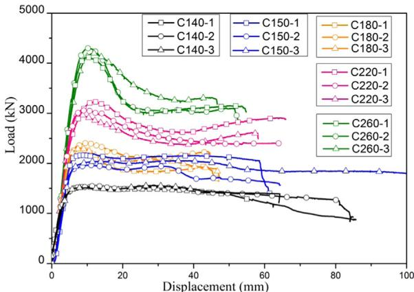  
Fig. 11. Relationship between the axial load and the displacement of all specimens.

respectively; and $\nu _ { e }$ and $\nu _ { s }$ are the Poisson's ratios of a steel tube. The Poisson's ratio $\nu _ { s }$ is taken as 0.5 and $\nu _ { e }$ is given by Tang et al. [32].

The parts AB and BC of the stress-strain curve are given by

$$
\sigma_ {c} = \left\{ \begin{array}{l l} \beta_ {c} f _ {c c} ^ {\prime} + \left(\frac {\varepsilon_ {c u} - \varepsilon_ {c}}{\varepsilon_ {c u} - \varepsilon_ {c c} ^ {\prime}}\right) \left(f _ {c c} ^ {\prime} - \beta_ {c} f _ {c c} ^ {\prime}\right) & \text {f o r} \quad \varepsilon_ {c c} ^ {\prime} <   \varepsilon_ {c} \leq \varepsilon_ {c u} \\ \beta_ {c} f _ {c c} ^ {\prime} & \text {f o r} \quad \varepsilon_ {c} > \varepsilon_ {c u} \end{array} \right. \tag {13}
$$

where $\beta _ { c }$ is defined by Hu et al. [28] as

$$
\beta_ {c} = \left\{ \begin{array}{l l} 1. 0 & \text {f o r} \quad \frac {D}{t} \leq 4 0 \\ 0. 0 0 0 0 3 3 9 \left(\frac {D}{t}\right) ^ {2} - 0. 0 1 0 0 8 5 \left(\frac {D}{t}\right) + 1. 3 4 9 1 \\ \text {f o r} \quad 4 0 <   \frac {D}{t} \leq 1 2 5 \end{array} \right. \tag {14}
$$

In the present numerical model, the ultimate fibre compressive strain of concrete is set to 0.02.

After the concrete cracking, the tensile strength of the concrete is taken as $0 . 6 \sqrt { \gamma _ { c } f _ { c } ^ { \prime } }$ , whereas the ultimate tensile strain is taken as 10 times the stain at cracking.

The steel is developed as an elastic-perfectly plastic relation model, as shown in Fig. 16, which is consistent with the test results. The yield strength, Young's modulus, and Poisson ratio were adopted from the formal tensile test results of the steel.

# 5.2. Stress resultants

In the fibre element method, the axial force taken by the CFST column section is composed of the stress resultants in the composite section. The axial force is calculated as

$$
N = \sum_ {i = 1} ^ {n s} f _ {z, i} A _ {s, i} + \sum_ {j = 1} ^ {n c} \sigma_ {c, j} A _ {c, j} \tag {15}
$$

where $N$ is the axial force; $f _ { z , i }$ and $\sigma _ { c , j }$ are the longitudinal stress at the centre of the steel fibre and concrete fibre, respectively; $A _ { s , i }$ and $A _ { c , j }$ are the area of the steel fibre and concrete fibre, respectively; and ns and nc are the total number of steel fibre elements and concrete fibre elements, respectively.

# 5.3. Validation of fibre element model

The numerical results of the load-axial deformation curves were compared with the experimental results, as shown in Fig. 17. It can be seen that two curves matched well with each other, which means that the revised fibre element model can be applied to study the behaviour of CFHST.

Through an extensive literature search, we collected 215 specimens

and used them to verify the revised fibre element model. The parameters of the specimens are summarised in Table 7. As can be concluded, the parameter ranges of the collected data were abundant. The predicted ultimate strength $\left( N _ { c } \right)$ from the current model was compared with the measured ultimate strength $( N _ { u } )$ in Fig. 18. The mean value and standard deviation of $N _ { c } / N _ { u }$ for specimens with different D/t ratios were 0.907 and 0.07, respectively.

# 6. Comparison of the results between the tests and the design codes

The current design codes, such as Eurocode 4 (EC4) [44], American Institute of Steel Construction standard (AISC 360–10) [45], and the Architectural Institute of Japan (AIJ) standard [46], are only applicable to the design of CFST columns fabricated from normal-strength materials and limited D/t ratio. Whether or not the current codes could accurately predict the behaviour of CFHST with a large D/t ratio remains a question. In this section, the experimental results were employed to calibrate the provisions in the design codes (EC4, AISC 360–10, and AIJ), the Liang et al.‘s model, and the proposed model for the design of high-strength composite columns with a large D/t ratio. The current codes are listed first, and the results are summarised in Table 8.

# 6.1. Code provisions

EC4 (2004) predicts the axial load capacity $( N _ { u } )$ of CFST stub columns by enhancing the strength of the concrete core, as shown in Eq. (16). EC4 is applicable to CFST columns with concrete cylinder strength and steel yield stress not greater than ${ 5 0 } \mathrm { M P a }$ and $4 2 5 \mathrm { { M P a } }$ , respectively.

$$
N _ {u} = \eta_ {s} f _ {y} A _ {s} + \left(1 + \eta_ {c} \times \frac {t}{D} \times \frac {f _ {y}}{f _ {c} ^ {\prime}}\right) \times f _ {c} ^ {\prime} A _ {c} \tag {16}
$$

$$
\eta_ {s} = \eta_ {s o} = 0. 2 5 \times (3 + 2 \bar {\lambda}) \quad (\eta_ {s o} \leq 1) \tag {17}
$$

$$
\eta_ {c} = \eta_ {c 0} = 4. 9 - 1 8. 5 \bar {\lambda} + 1 7 \bar {\lambda} ^ {2} \quad (\eta_ {c 0} \geq 1) \tag {18}
$$

$$
\bar {\lambda} = \sqrt {N / N _ {E}} \tag {19}
$$

$$
N = f _ {y} A _ {s} + f _ {c} ^ {\prime} A _ {c} \tag {20}
$$

$$
N _ {E} = \frac {\pi^ {2} \times \left(E _ {s} I _ {s} + 0 . 6 E _ {c} I _ {c}\right)}{L ^ {2}} \tag {21}
$$

where $E _ { s } = 2 1 , 0 0 0 \mathrm { M P a }$ and $E _ { c } = 2 2$ , $0 0 0 \times ( f _ { c } ^ { \prime } / 1 0 ) ^ { 0 . 3 } \mathrm { M P a } .$

According to the AISC 360–10 standard, the axial load capacity of CFST columns is identical to that for steel columns, as shown in Eq. (22). The use of the AISC specifications is limited to columns with concrete cylinder strength and steel yield stress of not more than 70 MPa and ${ 5 2 5 } \mathrm { M P a }$ , respectively.

$$
P _ {n} = \left\{ \begin{array}{l l} \left(0. 6 5 8 ^ {\left(P _ {n 0} / P _ {e}\right)}\right) P _ {n 0} & P _ {n 0} \leq 2. 2 5 P _ {e} \\ 0. 8 7 7 P _ {e} & P _ {n 0} > 2. 2 5 P _ {e} \end{array} \right. \tag {22}
$$

$$
P _ {p} = f _ {y} A _ {s} + 0. 9 5 f _ {c} ^ {\prime} A _ {c} \tag {23}
$$

$$
P _ {y} = f _ {y} A _ {s} + 0. 7 f _ {c} ^ {\prime} A _ {c} \tag {24}
$$

$$
P _ {n 0} = \left\{ \begin{array}{l l} P _ {p} & \lambda = D / t \leq \lambda_ {r} \\ P _ {p} - \frac {P _ {p} - P _ {y}}{\left(\lambda_ {r} - \lambda_ {p}\right) ^ {2}} (\lambda - \lambda_ {p}) ^ {2} & \lambda_ {r} \leq D / t \leq \lambda_ {p} \\ F _ {c r} A _ {s} + 0. 7 f _ {c} ^ {\prime} A _ {c} & \lambda_ {p} \leq D / t \leq \lambda_ {\lim i t} \end{array} \right. \tag {25}
$$

$$
\lambda_ {p} = 0. 1 5 E _ {s} / f _ {y} \quad \lambda_ {r} = 0. 1 9 E _ {s} / f _ {y} \quad \lambda_ {\lim i t} = 0. 3 1 E _ {s} / f _ {y} \tag {27}
$$

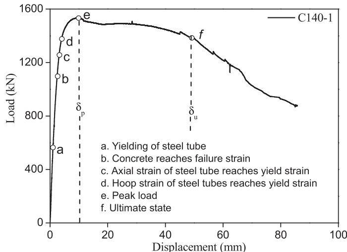  
(a) Displacement response of specimen C140-1

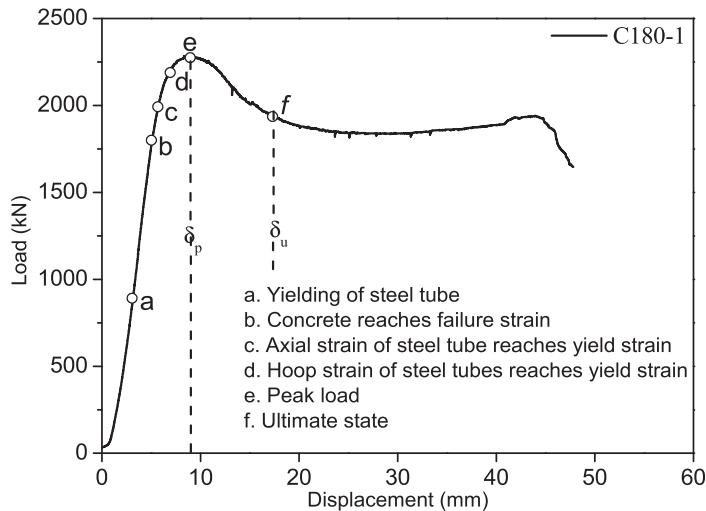  
(c） Displacement response of specimen C180-1

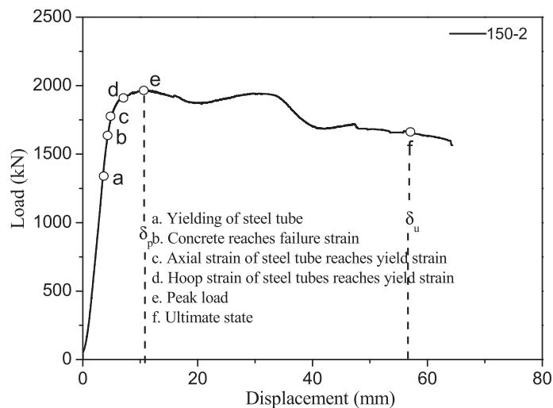  
(b） Displacement response of specimen C150-2

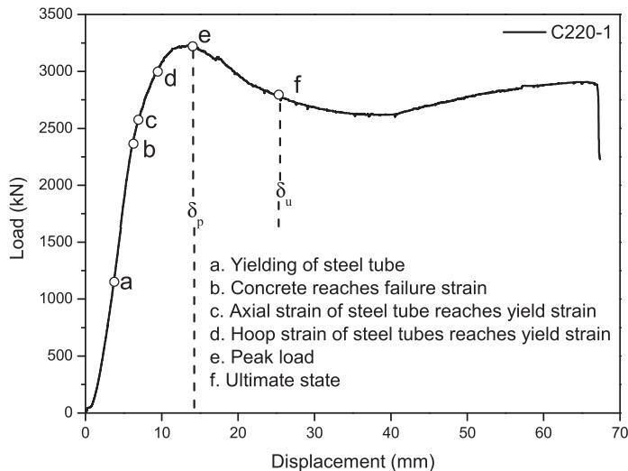  
(d） Displacement response of specimen C220-1

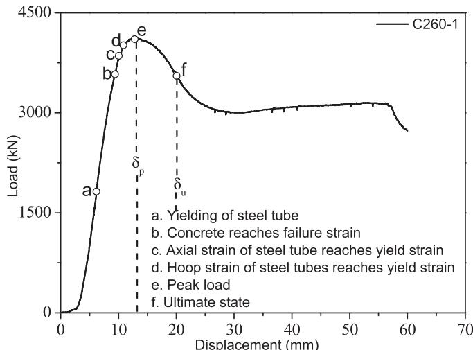  
(e） Displacement response of specimen C220-1  
Fig. 12. Displacement response in each series.

  
Fig. 13. Relationship between axial load and core concrete stress.

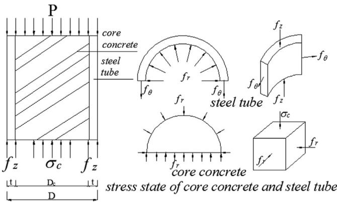  
Fig. 14. Equilibrium relationship between the filled-in concrete and the steel tube.

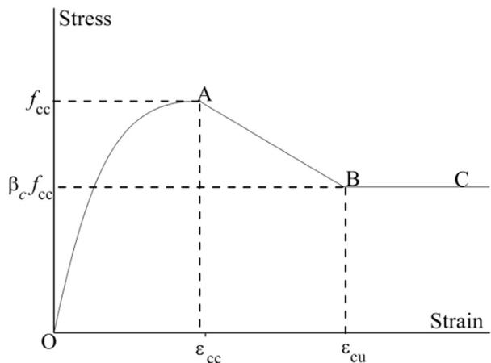  
Fig. 15. General stress-strain curve for confined concrete in circular CFST columns.

$$
F _ {c r} = \frac {0 . 7 2 f _ {y}}{\left(\left(D / t\right) \frac {f _ {y}}{E _ {s}}\right) ^ {0 . 2}} \tag {28}
$$

$$
P _ {e} = \frac {\pi^ {2}}{(K L) ^ {2}} \left(E I _ {\text {e f f}}\right) \tag {29}
$$

$$
E I _ {\text {e f f}} = E _ {s} I _ {s} + C _ {2} E _ {c} I _ {c} \tag {30}
$$

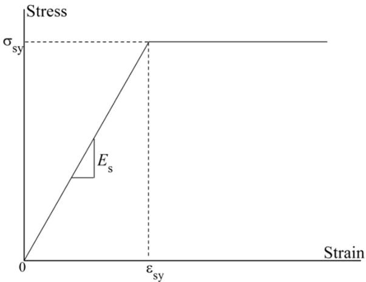  
Fig. 16. Stress-strain model for steel tubes in circular CFST columns.

$$
C _ {2} = 0. 6 + 2 \alpha \quad \alpha = A _ {s} / \left(A _ {s} + A _ {c}\right) \tag {31}
$$

where $E _ { c } = 0 . 0 4 3 \times \omega _ { c } ^ { 1 . 5 } \sqrt { f _ { c } ^ { \prime } }$ MPa, $f _ { y }$ is the yield strength of the steel, $L$ is the length of the column, $E _ { c }$ is the modulus of elasticity of the concrete, and $E _ { s }$ is the modulus of elasticity of the steel.

As for the AIJ (1999), the axial loading capacity of CFST stub columns is expressed as follows:

$$
N _ {u} = A _ {c} \times {} _ {c} r _ {u} \times f _ {c} + 1. 2 7 A _ {s} \times F \tag {32}
$$

where $_ { c } r _ { u } = 0 . 8 5$ and $F = \mathrm { m i n } ( _ { s } \sigma _ { y } , 0 . 7 _ { s } \sigma _ { u } )$

The model proposed by Liang and Fragomeni [26] was also applied to estimate the ultimate capacity in Table 8. The design formula is expressed as follows:

$$
N _ {u} = \left(\gamma_ {c} f _ {c} ^ {\prime} + 4. 1 f _ {r p}\right) A _ {c} + \gamma_ {s} f _ {y} A _ {s} \tag {33}
$$

$$
\gamma_ {c} = 1. 8 5 D _ {c} ^ {- 0. 1 3 5} \tag {34}
$$

$$
\gamma_ {s} = 1. 4 5 8 \left(\frac {D}{t}\right) ^ {- 0. 1} \tag {35}
$$

$$
f _ {r} = \left(0. 0 0 6 2 4 1 - 0. 0 0 0 0 3 5 7 \frac {D}{t}\right) f _ {y} \quad \text {f o r} \quad 4 7 <   \frac {D}{t} \leq 1 5 0 \tag {36}
$$

where $D _ { c }$ is the diameter of the core concrete.

# 7. Conclusions

This paper presented an experiment program on concrete-filled high-strength steel stub columns subjected to concentric loading aimed at gaining a better understanding of the behaviour of CFHST with a large D/t ratio. The experimental program included 15 specimens of five series, in which the main parameters tested were the D/t ratios of the steel tube. On the basis of the detailed instrumentation and of the in-depth analysis of the test results, we can draw the following conclusions:

1. The strength and ductility of the confined concrete still increase owing to the confinement provided by the high-strength steel tube.   
2. A plastic section design can still be applied in CFHST with a D/t ratio less than 125 since the axial strain of the steel tube reaches the yield strain before the shear failure of concrete.   
3. A new hoop stress equation is proposed and verified in the revised fibre element model. The results showed that the revised model predicts the ultimate bearing capacity and load-strain curves well. Therefore, it can be applied to further study the behaviour of CFHST.

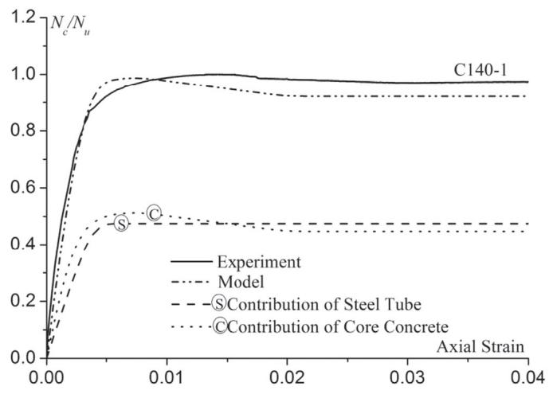  
(a) Axial load-strain curves of C140-1

  
(c) Axial load-strain curves of C180-3

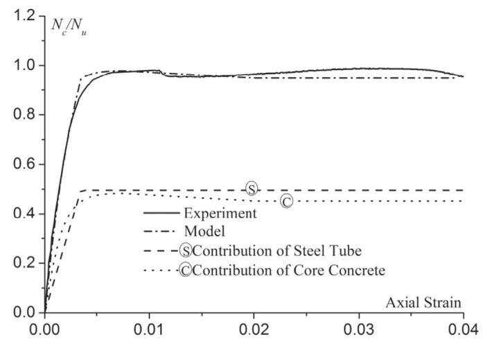  
(b) Axial load-strain curves of C150-2

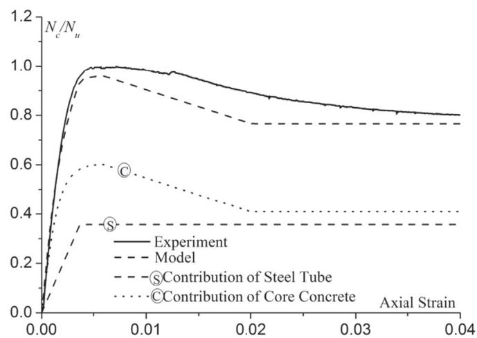  
(d) Axial load-strain curves of C220-2

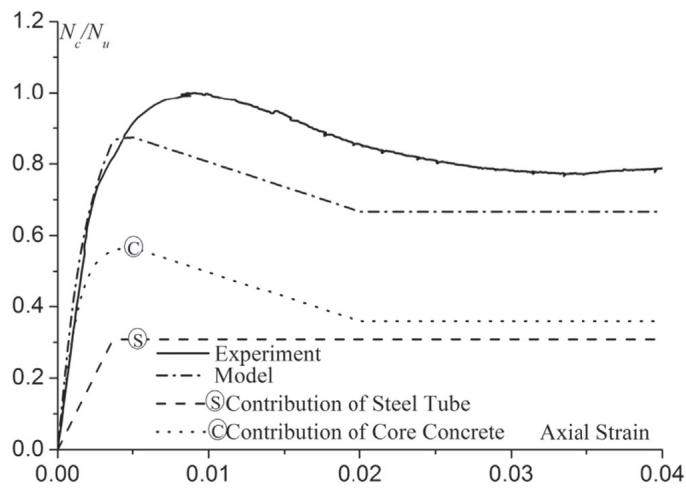  
(e) Axial load-strain curves of C260-3   
Fig. 17. Comparison of the axial load-strain curves between the proposed model and the test results.

4. Experimental results of CFHST with D/t ratios exceeding the current codes were compared against the design codes EC4, AISC, AIJ, and the proposed model. The results revealed that, in general, the AISC 360-10 and AIJ codes underestimated the load-carrying capacity of the

specimens by $2 9 \%$ and $1 9 \%$ , respectively. In contrast, the EC4 overestimated it by $8 \%$ . The proposed model matched conservatively with the test result with a mean value of 0.94 and can be adopted to estimate the ultimate capacity of CFHST stub columns under axial compression.

Table 7 Summary of the test data of circular CFST columns.   

<table><tr><td>No. of specimens</td><td>D (mm)</td><td>t (mm)</td><td>D/t</td><td>fy (MPa)</td><td>fc&#x27; (MPa)</td><td>Reference</td></tr><tr><td>5</td><td>114-167</td><td>3.1-5.6</td><td>20-54</td><td>300</td><td>44-60</td><td>Abed et al. [2]</td></tr><tr><td>7</td><td>76-153</td><td>1.7-4.1</td><td>30-48</td><td>363-605</td><td>21-34</td><td>Gardner and Jacobson [8]</td></tr><tr><td>3</td><td>141</td><td>3.0-6.5</td><td>22-47</td><td>285-313</td><td>24-28</td><td>Schneider [9]</td></tr><tr><td>12</td><td>297-302</td><td>4.5-12</td><td>25-67</td><td>280-472</td><td>26.6-79</td><td>Kato [10]</td></tr><tr><td>18</td><td>101-140</td><td>2.37-3.0</td><td>33-59</td><td>305-419</td><td>26.6-68</td><td>Saisho et al. [11]</td></tr><tr><td>16</td><td>50.8-203</td><td>1.2-2.0</td><td>31-101</td><td>259-291</td><td>20-30</td><td>Uy [12]</td></tr><tr><td>26</td><td>108-450</td><td>3.0-6.5</td><td>17-152</td><td>279-853</td><td>41-85</td><td>Sakino et al. [19]</td></tr><tr><td>12</td><td>174-179</td><td>3.0-9.0</td><td>20-58</td><td>248-283</td><td>22-46</td><td>Sakino and Hayashi [20]</td></tr><tr><td>3</td><td>202-204</td><td>1-2</td><td>102-202</td><td>181-226</td><td>36-42</td><td>Hu et al. [28]</td></tr><tr><td>9</td><td>630-1020</td><td>7-13.25</td><td>54-105</td><td>291-368</td><td>16.9-46</td><td>Luksha and Nesterovich [33]</td></tr><tr><td>13</td><td>102-319</td><td>3.2-10.3</td><td>31-32</td><td>334-452</td><td>23-52</td><td>Yamamoto et al. [34]</td></tr><tr><td>2</td><td>200-280</td><td>2.0-5.0</td><td>40-120</td><td>266-342</td><td>27-31</td><td>Huang et al. [35]</td></tr><tr><td>6</td><td>159</td><td>5-10</td><td>15-32</td><td>390-402</td><td>36.6-94</td><td>Johansson [36]</td></tr><tr><td>8</td><td>114-115</td><td>3.8-5.0</td><td>23-30</td><td>343-365</td><td>26-95</td><td>Giakoumelis and Lam [37]</td></tr><tr><td>20</td><td>60-200</td><td>1.9-2</td><td>30-100</td><td>282-404</td><td>75-80</td><td>Han and Yao [38]</td></tr><tr><td>12</td><td>89-112.6</td><td>2.7-2.89</td><td>32-39</td><td>360</td><td>22-32.5</td><td>Gupta et al. [39]</td></tr><tr><td>9</td><td>100-200</td><td>3.0</td><td>33-67</td><td>304</td><td>50</td><td>Han and Yao [40]</td></tr><tr><td>3</td><td>165</td><td>2.72-2.75</td><td>60-61</td><td>350</td><td>37.8-64</td><td>Yu et al. [41]</td></tr><tr><td>28</td><td>114-170</td><td>0.96-10</td><td>17-115</td><td>285-476</td><td>27-125</td><td>Lai and Ho [42]</td></tr><tr><td>3</td><td>219</td><td>3-5</td><td>43-73</td><td>313</td><td>51.6</td><td>Xue et al. [43]</td></tr></table>

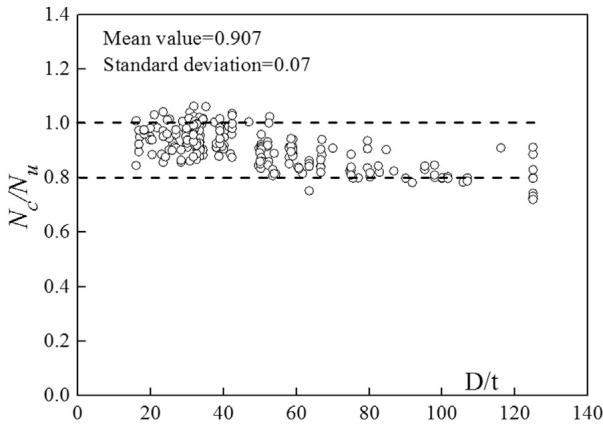  
Fig. 18. Comparison between predicted strength and measured ultimate strength using the fibre element model.

Table 8 Comparisons between the test results, the design codes, and the proposed model.   

<table><tr><td rowspan="2">Series</td><td rowspan="2">Label</td><td rowspan="2">Nu(kN)</td><td colspan="4">Nc/Nu</td><td rowspan="2">Proposed model</td></tr><tr><td>EC4</td><td>AIJ</td><td>AISC</td><td>Liang et al.&#x27;s model</td></tr><tr><td rowspan="3">Series A</td><td>C140-1</td><td>1588</td><td>1.13</td><td>0.71</td><td>0.74</td><td>0.95</td><td>0.99</td></tr><tr><td>C140-2</td><td>1550</td><td>1.12</td><td>0.82</td><td>0.73</td><td>0.94</td><td>0.98</td></tr><tr><td>C140-3</td><td>1555</td><td>1.15</td><td>0.84</td><td>0.75</td><td>0.97</td><td>1.01</td></tr><tr><td rowspan="3">Series B</td><td>C150-1</td><td>2163</td><td>1.01</td><td>0.73</td><td>0.72</td><td>0.84</td><td>0.86</td></tr><tr><td>C150-2</td><td>1965</td><td>1.14</td><td>0.83</td><td>0.81</td><td>0.95</td><td>0.98</td></tr><tr><td>C150-3</td><td>2056</td><td>1.09</td><td>0.80</td><td>0.78</td><td>0.91</td><td>0.93</td></tr><tr><td rowspan="3">Series C</td><td>C180-1</td><td>2284</td><td>1.14</td><td>0.86</td><td>0.73</td><td>0.95</td><td>1.00</td></tr><tr><td>C180-2</td><td>2405</td><td>1.05</td><td>0.79</td><td>0.67</td><td>0.88</td><td>0.93</td></tr><tr><td>C180-3</td><td>2301</td><td>1.09</td><td>0.81</td><td>0.69</td><td>0.91</td><td>0.96</td></tr><tr><td rowspan="3">Series D</td><td>C220-1</td><td>3227</td><td>1.03</td><td>0.79</td><td>0.65</td><td>0.85</td><td>0.89</td></tr><tr><td>C220-2</td><td>3072</td><td>1.10</td><td>0.85</td><td>0.70</td><td>0.91</td><td>0.96</td></tr><tr><td>C220-3</td><td>2990</td><td>1.08</td><td>0.83</td><td>0.68</td><td>0.89</td><td>0.94</td></tr><tr><td rowspan="3">Series E</td><td>C260-1</td><td>4120</td><td>1.06</td><td>0.82</td><td>0.66</td><td>0.85</td><td>0.88</td></tr><tr><td>C260-2</td><td>4302</td><td>1.01</td><td>0.79</td><td>0.63</td><td>0.81</td><td>0.84</td></tr><tr><td>C260-3</td><td>4198</td><td>1.05</td><td>0.81</td><td>0.66</td><td>0.84</td><td>0.87</td></tr><tr><td rowspan="3">Characteristic</td><td>Average</td><td></td><td>1.08</td><td>0.81</td><td>0.71</td><td>0.90</td><td>0.94</td></tr><tr><td>SD</td><td></td><td>0.05</td><td>0.04</td><td>0.05</td><td>0.05</td><td>0.05</td></tr><tr><td>COV</td><td></td><td>0.04</td><td>0.05</td><td>0.07</td><td>0.05</td><td>0.05</td></tr></table>

# Acknowledgments

This research is financially supported by the projects from the National Natural Science Foundation of China (NSFC) (Grant no. 11172226). The support is gratefully acknowledged.

# References

[1] L.H. Han, W. Li, R. Bjorhovde, Developments and advanced applications of concrete-filled steel tubular (CFST) structures: members, J. Constr. Steel Res. 100 (2014) 211–228.   
[2] F. Abed, M. AlHamaydeh, S. Abdalla, Experimental and numerical investigations of the compressive behavior of concrete-filled steel tubes (CFSTs), J. Constr. Steel Res. 80 (2013) 429–439.   
[3] F. Xu, J. Chen, W. Jin, Experimental investigation of thin-walled concrete-filled steel tube columns with reinforced lattice angle, Thin-Walled Struct. 84 (2014) 59–67.   
[4] C. Miki, K. Homma, T. Tominaga, High-strength and high performance steels and their use in bridge structures, J. Constr. Steel Res. 58 (1) (2002) 3–20.   
[5] R. Bjorhovde, Development and use of high performance steel, J. Constr. Steel Res. 60 (3) (2004) 393–400.   
[6] P. Graham, High-strength steel use in Australia, Japan and the US, Struct. Eng. 11 (2006) 27–30.   
[7] J.Y.R. Liew, M. Xiong, D. Xiong, Design of concrete-filled tubular beam-columns with high-strength steel and concrete, Struct. Elsevier 8 (2016) 213–226.   
[8] N.J. Gardner, E.R. Jacobson, Structural behavior of concrete-filled steel tubes, Acids J. 67 (7) (1967) 404–412.   
[9] S.P. Schneider, Axially loaded concrete-filled steel tubes, J. Struct. Eng. 124 (10) (1988) 1125–1128.   
[10] B. Kato, Compressive strength and deformation capacity of concrete-filled tubular stub columns, J. Struct. Constr. Eng. AIJ 468 (1) (1995) 183–191 (In Japanese).   
[11] M. Saisho, T. Abe, K. Nakaya, Ultimate bending strength of high-strength concretefilled steel tube column, J. Struct. Constr. Eng. AIJ 523 (1) (1999) 133–140 (In Japanese).   
[12] B. Uy, Axial compressive strength of short steel and composite columns fabricated with high strength steel plate [J], Steel Compos. Struct. 1 (2) (2001) 171–185.   
[13] B. Uy, Z. Tao, L.H. Han, Behaviour of short and slender concrete-filled stainless steel tubular columns, J. Constr. Steel Res. 67 (3) (2011) 360–378.   
[14] B. Uy, Strength of short concrete-filled high-strength steel box columns [J], J. Constr. Steel Res. 57 (2) (2001) 113–134.   
[15] M. Mursi, B. Uy, Strength of slender concrete-filled high-strength steel box columns [J], J. Constr. Steel Res. 60 (12) (2004) 1825–1848.   
[16] M. Mursi, B. Uy, Behaviour and design of fabricated high-strength steel columns subjected to biaxial bending. Part 1: experiments, Adv. Steel Constr.: Int. J. (2006).   
[17] M. Mursi, B. Uy, Behaviour and design of fabricated high-strength steel columns subjected to biaxial bending. Part 2: analysis and design codes, Adv. Steel Constr.: Int. J. (2006).   
[18] F. Aslani, B. Uy, Z. Tao, et al., Behavior and design of composite columns incorporating compact high-strength steel plates, J. Constr. Steel Res. 107 (2015) 94–110.   
[19] K. Sakino, H. Nakahara, S. Morino, et al., Behavior of centrally loaded concretefilled steel-tube short columns, J. Struct. Eng. 130 (2) (2004) 180–188.   
[20] K. Sakino, H. Hayashi Behavior of concrete-filled steel tubular stub columns under concentric loading.In: Proceedings of the Third International Conference on Steel-

concrete Composite Structures, Fukuoka, Japan.   
[21] L. Zhu, L. Ma, Y. Bai, et al., Large diameter concrete-filled high strength steel tubular stub columns under compression [J], Thin-Walled Struct. 108 (2016) 12–19.   
[22] Y. Du, Z. Chen, Y. Yu, Behavior of rectangular concrete-filled high-strength steel tubular columns with different aspect ratio, Thin-Walled Struct. 109 (2016) 304–318.   
[23] G. Tang, Y. Xiao, Y. Zhang, Study of bearing capacity and complete stress-strain curves for concrete filled square steel tube columns, Eng. Mech. 32 (8) (2015) 103–111 (in Chinese).   
[24] Y.M. Hu, T. Yu, J.G. Teng, FRP-confined circular concrete-filled thin steel tubes under axial compression, J. Compos. Constr. 15 (5) (2011) 850–860.   
[25] Q.Q. Liang, High-strength circular concrete-filled steel tubular slender beam–columns, Part I: numerical analysis, J. Constr. Steel Res. 67 (2) (2011) 164–171.   
[26] Q.Q. Liang, S. Fragomeni, Nonlinear analysis of circular concrete-filled steel tubular short columns under axial loading, J. Constr. Steel Res. 65 (12) (2009) 2186–2196.   
[27] Q.Q. Liang, S. Fragomeni, Nonlinear analysis of circular concrete-filled steel tubular short columns under eccentric loading, J. Constr. Steel Res. 66 (2) (2010) 159–169.   
[28] H.T. Hu, C.S. Huang, M.H. Wu, et al., Nonlinear analysis of axially loaded concretefilled tube columns with confinement effect, J. Struct. Eng. 129 (10) (2003) 1322–1329.   
[29] J.B. Mander, M.J.N. Priestley, R. Park, Theoretical stress-strain model for confined concrete, J. Struct. Eng. 114 (8) (1988) 1804–1826.   
[30] ACI-318. Building code requirements for reinforced concrete. ACI, Detroit, MI, 2002.   
[31] F.E. Richard, A. Brandtzaeg, R.L. Brown A study of the failure of concrete under combined compressive stresses. Bull. 185, University of Illinois, Champaign: Engineering Experimental Station; 1928.III.   
[32] J. Tang, S. Hino, I. Kuroda, T. Ohta, Modeling of stress-strain relationships for steel and concrete in concrete-filled circular steel tubular columns, Steel Constr. Eng., JSSC 3 (11) (1996) 35–46.   
[33] L.K. Luksha, A.P. Nesterovich Strength testing of larger-diameter concrete-filled

steel tubular members. In: Proceeding of the 3rd international conference on steelconcrete composite structures.   
[34] K. Yamamoto, J. Kawaguchi, S. Morino, Experimental study of the size effect on the behavior of concrete-filled circular steel tube columns under axial compression, J. Struct. Constr. Eng. AIJ 56 (2002) 237–244 (In Japanese).   
[35] C.S. Huang, Y.K. Yeh, G.Y. Liu, et al., Axial load behavior of stiffened concrete-filled steel columns, J. Struct. Eng. 128 (9) (2002) 1222–1230.   
[36] M. Johansson, The efficiency of passive confinement in CFT columns, Steel Compos. Struct. 2 (5) (2002) 379–396.   
[37] G. Giakoumelis, D. Lam, Axial capacity of circular concrete-filled tube columns, J. Constr. Steel Res. 60 (7) (2004) 1049–1068.   
[38] L.H. Han, G.H. Yao, Experimental behaviour of thin-walled hollow structural steel (HSS) columns filled with self-consolidating concrete (SCC), Thin-Walled Struct. 42 (9) (2004) 1357–1377.   
[39] P.K. Gupta, S.M. Sarda, M.S. Kumar, Experimental and computational study of concrete-filled steel tubular columns under axial loads, J. Constr. Steel Res. 63 (2) (2007) 182–193.   
[40] L.H. Han, G.H. Yao, Experimental behaviour of thin-walled hollow structural steel (HSS) columns filled with self-consolidating concrete (SCC), Thin-Walled Struct. 42 (9) (2004) 1357–1377.   
[41] Z. Yu, F. Ding, C.S. Cai, Experimental behavior of circular concrete-filled steel tube stub columns, J. Constr. Steel Res. 63 (2) (2007) 165–174.   
[42] M.H. Lai, J.C.M. Ho, A theoretical axial stress-strain model for circular concretefilled-steel-tube columns, Eng. Struct. 125 (2016) 124–143.   
[43] J.Q. Xue, B. Briseghella, B.C. Chen, Effects of debonding on circular CFST stub columns, J. Constr. Steel Res. 69 (1) (2012) 64–76.   
[44] Eurocode 4. Design of composite steel and concrete structures, part 1.1: general rules and rules for building. BS EN 1994-1-1:2004: London, UK; 2004.   
[45] ANSI/AISC360-10, Specification for Structural Steel Buildings, American Institute of Steel Construction, Chicago, USA, 2010.   
[46] Architectural Institute of Japan (AIJ). Recommendations for design and construction of concrete-filled steel tubular structures. Tokyo, 333, 1997.