# Effects of debonding on circular CFST stub columns

Jun-Qing Xue a, ⁎, Bruno Briseghella b , Bao-Chun Chen b

a Department of Construction, Università IUAV di Venezia, Venice, 30135, Italy   
b College of Civil Engineering, Fuzhou University, Fuzhou, 350002, PR China

# a r t i c l e i n f o

Article history:   
Received 10 March 2011   
Accepted 2 August 2011   
Available online 10 September 2011

Keywords:

Concrete filled steel tube

Debonding

Ultimate load capacity

Ductility

Parametric analysis

Simplified calculation formula

# a b s t r a c t

Core concrete subjected to confinement effect from steel tube is the main advantage of concrete filled steel tubular (CFST) column under compression. However, this beneficial composite action could be weakened even destroyed by debonding, which is almost unavoidable as a common phenomenon in CFST structures and has not been considered satisfactorily by current design codes. In this paper, the influence of debonding on circular CFST stub columns was investigated experimentally and numerically. The main experimental parameters were the debonding arc-length ratio, the confinement factor and the load mode. Meanwhile, the finite element models were implemented using the ABAQUS finite element software, of which the validity and accuracy were verified by test results. Utilising the finite element model, the parametric analysis was carried out to study the influence of the following parameters on the ultimate load capacity of debonding specimens: debonding arc-length ratio, debonding thickness and confinement factor. Based on the results of parametric analysis, a simplified calculation formula was proposed to calculate the ultimate load capacity of circular CFST stub columns with debonding.

$^ { © }$ 2011 Elsevier Ltd. All rights reserved.

# 1. Introduction

Concrete filled steel tubular (CFST) columns have many advantages over an equivalent steel, reinforced concrete, or steel-reinforced concrete members because of the benign confinement effect between steel and concrete. The compressive strength of the core concrete can be increased by reason of the lateral confinement provided by the steel tube, and the local buckling of steel tube can be delayed and restrained by the concrete filled [1–3]. This beneficial composite action requires force transfer between the steel tube and the core concrete, while debonding will have unfavourable effect on the confinement. Actually, debonding is almost unavoidable in CFST structures, especially in CFST arch bridges.

There are two different conditions of debonding in CFST structures, in accordance with different causes of formation. One is due to the poor construction quality, which can be avoided by improving the construction techniques, of which the thickness is significant. The influence of de-fill rate $\left( A _ { d } \right)$ on ultimate load capacity of circular CFST columns was conducted experimentally and numerically [4]. The de-fill rate is the ratio of debonding area to concrete area in the cross section of specimens, as shown in Fig. 1. From the result of the test, it is found that the de-fill value has certain

effect on the ultimate load capacity of the CFST columns. When the de-fill rate increases, the ultimate load capacity of CFST columns decreases. On the basis of test results, it is indicated that when the defill rate is less than $1 . 2 \%$ , the influence on the ultimate load capacity and stiffness of CFST columns is very little and it can be neglected. However, when the de-fill rate is higher than $1 . 2 \%$ , it is suggested that the debonding specimens need to be retrofitted by pouring concrete in the debonding gap.

The other debonding condition is caused by some unavoidable reasons, such as the shrinkage of concrete, temperature variation, negative confining force produced during the initial stage of CFST structures subjected to compression and so on. With regard to this kind of debonding, the debonding thickness $\left( T _ { d } \right)$ and debonding arclength ratio $\left( R _ { d } \right)$ are taken as the main parameters in the cross section of specimens, among which $T _ { d }$ is the thickness of debonding gap between steel tube and core concrete in the cross section, and $R _ { d }$ is the ratio of debonding arc-length ${ \bf \Pi } \left( \theta / 2 \pi \right) \pi D )$ to the perimeter (πD) in the cross section, which is equal to $\left( \theta / 2 \pi \right)$ . Debonding length $\left( L _ { d } \right)$ is the length of debonding gap in the longitudinal section, as shown in Fig. 2.

Compared with the thickness of debonding area in Fig. 1, the thickness of debonding gap in Fig. 2 is obviously little and always uniform. A summary of detected debonding information in real CFST arch ribs showed that [5], the common value of debonding arc-length ratio is 0–0.5 because the debonding gap generally occurs only in the upper part of the arch rib, and the debonding thickness is $0 . 5 { - } 3 \mathrm { m m }$ . Meanwhile, a critical thickness (3 mm) is set as the maximum value of detection in real CFST projects, which means that if the debonding

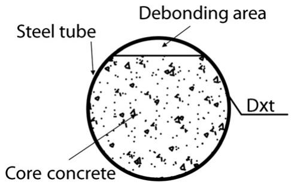  
Fig. 1. De-fill rate.

thickness is larger than 3 mm, retrofitting work needs to be done. This kind of debonding is almost impossible to be avoided and the debonding mentioned in this paper belongs to it. Nowadays, there are some design and construction codes of CFST structures all over the world, such as AIJ-2008, AISC-2005, BS5400-2005, EC4-2004 and DBJ/T 13-51-2010, however, none of them considered about the influence of debonding caused by unavoidable reasons.

The research of debonding on the CFST columns subjected to axial load had been conducted experimentally [6], in which the debonding thickness changed from 0 to 4 mm (every 1 mm) was chosen as the main parameter and the debonding arc-length ratio was fixed. It is observed that with the increase of the debonding thickness, the ultimate load capacity and stiffness of specimens decrease, while the longitudinal deformation and lateral deflection of the specimens increase.

Some numerical researches had also been carried out on the debonding caused by unavoidable reasons. It is observed that with the increase of debonding thickness, debonding arc-length ratio or debonding length, the ultimate load capacity of specimen decreases. It is also found that when debonding thickness and debonding length are less than 5 mm and $2 0 \mathrm { m m }$ , the influence of debonding on the ultimate load capacity could be neglected [7].

In this paper, the debonding of circular CFST stub columns subjected to axial load and eccentric load was investigated experimentally and numerically, taking the debonding arc-length ratio and confinement factor as parameters. The finite element models of experimental specimens were implemented by ABAQUS, of which the validity and accuracy were verified by test results. Then, utilising the finite element model, the parametric analysis was conducted to study the influence of different parameters on the ultimate load capacity of circular CFST stub columns with debonding. Finally, based on the results of parametric analysis, a simplified calculation formula was proposed to calculate the influence of debonding on the ultimate load capacity of circular CFST stub columns.

# 2. Experimental programme

# 2.1. Specimen preparations

A total of 24 specimens were prepared for the test, of which the outer diameter was chosen at $2 1 9 \mathrm { m m }$ according to the compression machine capacity. The length of all specimens was $7 0 0 \mathrm { m m }$ in order to achieve the slenderness ratio of 3.196 which can eliminate end effect. The debonding thickness of all specimens was chosen at $3 \mathrm { m m }$ , according to the critical maximum detection value in real CFST structures [5]. Furthermore, the debonding length of all specimens in the longitudinal section was $7 0 0 \mathrm { m m }$ , which is the same as the total length of the specimens.

In this test, the load mode, confinement factor and debonding arclength ratio were chosen as the key parameters. All the specimens were divided into two parts subjected to axial load and eccentric load, respectively.

The confinement factor is one of the most important parameters in CFST structure, of which the formula is shown as follows [8]:

$$
\xi = A _ {s} f _ {y} / A _ {c} f _ {c k} = a f _ {y} / f _ {c k} \tag {1}
$$

where $A _ { s }$ and $A _ { c }$ are the cross-sectional areas of steel tube and core concrete, respectively; $\alpha$ is the steel ratio which equals to $A _ { s } / A _ { c } ; f _ { y }$ is the yield strength of steel tube and $f _ { c k }$ is the concrete characteristic strength which equals to $0 . 6 7 f _ { c u }$ , and $f _ { c u }$ is the concrete cube strength.

Every part of specimens was divided into three groups on the basis of the confinement factor changes from 0.43; 0.58 to 0.73 (achieved by the wall thickness of steel tube changing from 3; 4 to $5 \mathrm { { m m } }$ ).

Moreover, four specimens were manufactured in each group, among which one is the normal specimen without debonding, and the other three are specimens with different debonding arc-length ratio values of 0.25, 0.5 and 0.75. The cross sections of specimens in one group with different debonding arc-length ratios are illustrated in Fig. 3.

The details of all test specimens are listed in Table 1. The labels of specimens starting with D refer to columns with debonding, and those beginning with N represent specimens without debonding. Following the D or N, the first figures (3; 4; 5) are used to distinguish specimens with different steel tube thicknesses (3 mm; 4 mm; 5 mm) which equal to different confinement factors (0.43; 0.58; 0.73). The second figures (0; 1; 2; 3) denote the different debonding arc-length ratios (0; 0.25; 0.5; 0.75). The last letter A or E refers to columns subjected to axial load or eccentric load. For example, specimen D3-2-E is the CFST stub column with the debonding arc-length ratio of 0.5 subjected to eccentric load, of which the tube thickness is 3 mm.

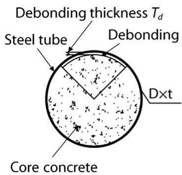

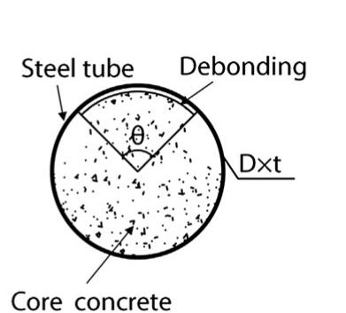

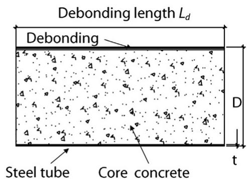  
Debonding arc-length ratio $R _ { d } = \theta / 2 \pi$   
Fig. 2. Debonding parameters in specimen caused by unavoidable reasons.

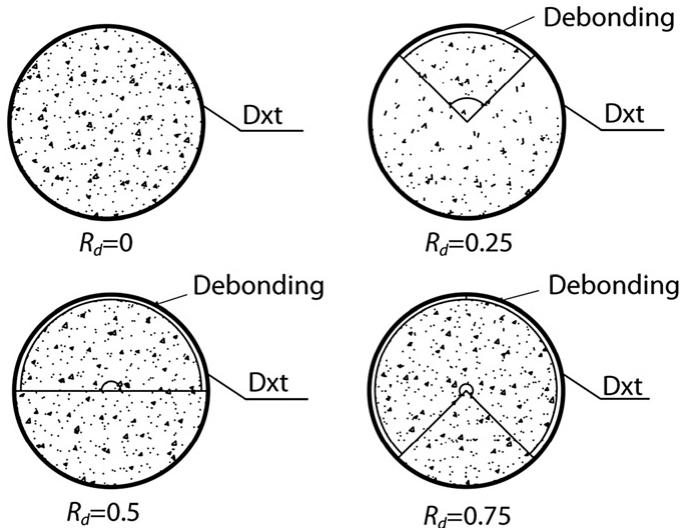  
Fig. 3. The cross section of specimens.

Table 1 Summary of specimens.   

<table><tr><td>Group no</td><td>Label</td><td>t(mm)</td><td>α</td><td>ξ</td><td>e(mm)</td><td>Rd</td><td>Nu,EXP(kN)</td><td>KD</td><td>KDI</td></tr><tr><td rowspan="4">1</td><td>N3-0-A</td><td>3</td><td>0.057</td><td>0.43</td><td>0</td><td>0</td><td>2647</td><td>1</td><td>1</td></tr><tr><td>D3-1-A</td><td></td><td></td><td></td><td></td><td>0.25</td><td>2433</td><td>0.919</td><td>0.70</td></tr><tr><td>D3-2-A</td><td></td><td></td><td></td><td></td><td>0.5</td><td>2306</td><td>0.871</td><td>0.63</td></tr><tr><td>D3-3-A</td><td></td><td></td><td></td><td></td><td>0.75</td><td>2281</td><td>0.862</td><td>0.61</td></tr><tr><td rowspan="4">2</td><td>N4-0-A</td><td>4</td><td>0.077</td><td>0.58</td><td></td><td>0</td><td>2896</td><td>1</td><td>1</td></tr><tr><td>D4-1-A</td><td></td><td></td><td></td><td></td><td>0.25</td><td>2602</td><td>0.895</td><td>0.57</td></tr><tr><td>D4-2-A</td><td></td><td></td><td></td><td></td><td>0.5</td><td>2538</td><td>0.861</td><td>0.53</td></tr><tr><td>D4-3-A</td><td></td><td></td><td></td><td></td><td>0.75</td><td>2503</td><td>0.853</td><td>0.50</td></tr><tr><td rowspan="4">3</td><td>N5-0-A</td><td>5</td><td>0.098</td><td>0.73</td><td></td><td>0</td><td>3218</td><td>1</td><td>1</td></tr><tr><td>D5-1-A</td><td></td><td></td><td></td><td></td><td>0.25</td><td>2805</td><td>0.872</td><td>0.41</td></tr><tr><td>D5-2-A</td><td></td><td></td><td></td><td></td><td>0.5</td><td>2706</td><td>0.841</td><td>0.36</td></tr><tr><td>D5-3-A</td><td></td><td></td><td></td><td></td><td>0.75</td><td>2673</td><td>0.831</td><td>0.34</td></tr><tr><td rowspan="4">4</td><td>N3-0-E</td><td>3</td><td>0.057</td><td>0.43</td><td>50</td><td>0</td><td>1457</td><td>1</td><td>1</td></tr><tr><td>D3-1-E</td><td></td><td></td><td></td><td></td><td>0.25</td><td>1282</td><td>0.880</td><td>0.93</td></tr><tr><td>D3-2-E</td><td></td><td></td><td></td><td></td><td>0.5</td><td>1265</td><td>0.868</td><td>0.84</td></tr><tr><td>D3-3-E</td><td></td><td></td><td></td><td></td><td>0.75</td><td>1245</td><td>0.855</td><td>0.83</td></tr><tr><td rowspan="4">5</td><td>N4-0-E</td><td>4</td><td>0.077</td><td>0.58</td><td></td><td>0</td><td>1634</td><td>1</td><td>1</td></tr><tr><td>D4-1-E</td><td></td><td></td><td></td><td></td><td>0.25</td><td>1434</td><td>0.878</td><td>0.79</td></tr><tr><td>D4-2-E</td><td></td><td></td><td></td><td></td><td>0.5</td><td>1408</td><td>0.861</td><td>0.74</td></tr><tr><td>D4-3-E</td><td></td><td></td><td></td><td></td><td>0.75</td><td>1392</td><td>0.852</td><td>0.71</td></tr><tr><td rowspan="4">6</td><td>N5-0-E</td><td>5</td><td>0.098</td><td>0.73</td><td></td><td>0</td><td>1847</td><td>1</td><td>1</td></tr><tr><td>D5-1-E</td><td></td><td></td><td></td><td></td><td>0.25</td><td>1602</td><td>0.867</td><td>0.62</td></tr><tr><td>D5-2-E</td><td></td><td></td><td></td><td></td><td>0.5</td><td>1573</td><td>0.851</td><td>0.58</td></tr><tr><td>D5-3-E</td><td></td><td></td><td></td><td></td><td>0.75</td><td>1559</td><td>0.844</td><td>0.55</td></tr></table>

$D = 2 1 9 \mathrm { m m }$ ; $L { = } 7 0 0 \mathrm { m m }$ for all specimens).

# 2.2. Material properties

Six standard tensile test specimens for each wall thickness (3 mm, 4 mm, 5 mm) of steel tube were fabricated. Standard tensile coupon tests were conducted to measure the steel properties in accordance with GB/T228-2002 [9]. The average yield stress and the average ultimate stress of steel were 313 MPa and 418 MPa, respectively.

According to the statistics [10], $67 \%$ of the CFST arch ribs are filled with concrete C50. Therefore, C50 was used in this test, of which the mixture design is given as follows: cement: $4 5 9 \mathrm { k g } / \mathrm { m } ^ { 3 }$ ; fly ash: $6 2 . 7 \mathrm { k g } / \mathrm { m } ^ { 3 }$ ; coarse aggregate: 297 $5 { - } 1 0 \mathrm { m m } )$ and 692 (16–25 mm) $\mathrm { k g / m } ^ { 3 }$ ; sand: $6 4 7 \mathrm { k g } / \mathrm { m } ^ { 3 }$ ; water: $1 5 0 \mathrm { k g } / \mathrm { m } ^ { 3 }$ and high range water reducer: $8 ~ \mathrm { k g / m } ^ { 3 }$ . All specimens were cast from one batch of concrete. Six $1 5 0 \mathrm { m m }$ cubes and three $1 5 0 \times 3 0 0 \mathrm { m m }$ prisms were also cast and cured in the same conditions as the corresponding specimens. The 28- day average compressive cube strength and the average elastic modulus of concrete were $6 2 . 5 \mathrm { M P a }$ and 37,500 MPa, which were measured in accordance with GB/T50081-2002 [11]. The compressive characteristic strength and cylinder strength of concrete were 42 MPa and 52.5 MPa calculated as proposed in literature [12,13].

# 2.3. The simulation method of debonding

The simulation of the debonding gap in the specimens was conducted by inserting galvanised sheets with the thickness of 3 mm inside the steel tube before the concrete filled and pulling them out at a certain time. The sharp of the galvanised sheet was bent at the same radian as the inside diameter of the steel tube. Both sides of the sheets were brushed with oil in order to easily pull them out. With regard to the best time of pulling the galvanised sheets out, it is the best choice to do it after 5 to $^ { 6 \mathrm { { h } } }$ of the concrete placing which can be found through repeated tests. The debonding gap of specimens is shown in Fig. 4. The knocking method and ultrasonic detection method were both used to determine if there were debonding gaps that appeared in the specimens before the test. This debonding gap simulation method using the galvanised sheets and the result of knocking method and ultrasonic detection method were verified through this test.

# 2.4. Experimental setup and load mode

The test arrangements with different load modes are illustrated in Fig. 5. For each specimen, eight strain gauges were installed at the mid-height of the steel tube to measure the axial and transversal strains. Four linear voltage displacement transducers (LVDTs) with an accuracy of $0 . 0 0 5 \mathrm { m m }$ were installed on the steel bottom plate to measure the axial shortening of the specimens. Three other LVDTs were used to monitor the lateral deflections at three locations, including the mid-height and the other two points which are at the

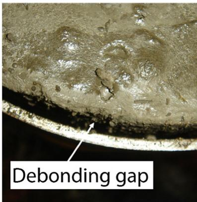  
Fig. 4. Debonding gap.

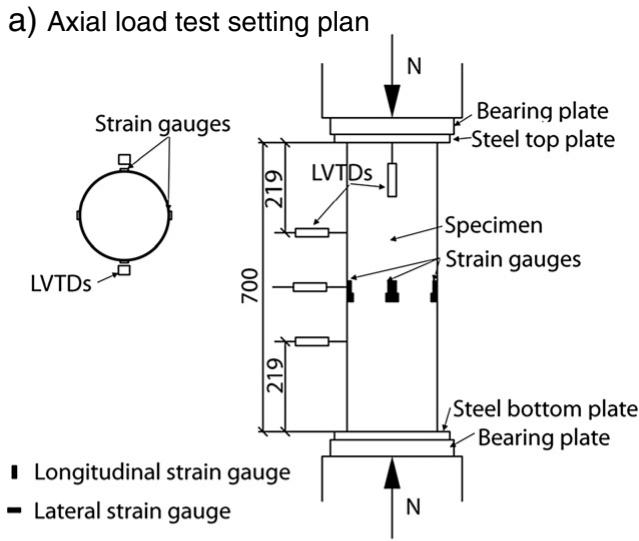

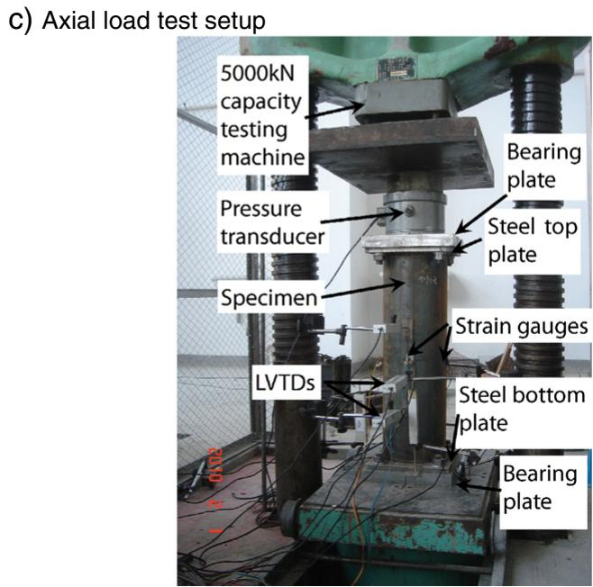

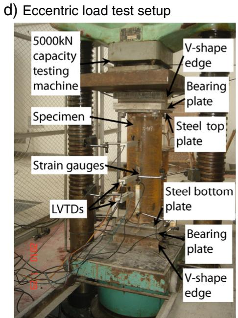  
Fig. 5. Test set-up (dimension in mm).

same distance as the steel tube diameter to both sides of specimens, respectively. The data of strain gauges and LVDTs were all gained by strain measurement instrument and computer.

Two steel square plates with the edge length of $2 8 0 \mathrm { m m }$ and the depth of $2 0 \mathrm { m m }$ were prepared as the end plates for each specimen, which were welded at both sides of specimens after concrete casting. Furthermore, two square plates were manufactured as the bearing plates of which the edge length is $3 0 0 \mathrm { m m }$ and the depth is $4 0 \mathrm { m m }$ Four holes with the diameter of $2 5 \mathrm { m m }$ were drilled in all the end plates and bearing plates in order to fix them together with the bolts during the loading process.

For the specimens subjected to axial loading, the load was applied directly on the bearing plates. However, for the eccentric loading specimens, two bearing plates with triangular groove and two V-shape edges were prepared to apply loads. The two triangular grooves were machined on each bearing plate to receive the V-shape loading edge, so the load could be precisely applied. The eccentric distance of the specimens subjected to eccentric load is $5 0 \mathrm { m m }$ . The position of the loading line was chosen on the same side of the debonding gap, because the debonding gap generally occurs in the upper part of the arch rib in real CFST projects. Moreover, for CFST arch, when the arch

vault is subjected to positive bending moment, which means the loading line is at the same side of the debonding gap, is the worst loading condition.

All the tests were performed on a $5 0 0 0 ~ \mathrm { k N }$ capacity testing machine in the structure engineering testing laboratory of Fuzhou University, China. A multi-stage loading method was chosen to be used for this test. Load increments of about one-fortieth of the design ultimate load capacity were used at the elastic loading stage of specimens. Each load increment was maintained for about 2–3 min. When the loadings reached $6 0 \%$ of the designed ultimate load capacity, load increments were changed to about one-sixtieth of the designed ultimate load. The tests were not stopped until failure with the load capacity of specimens decreased very fast.

# 3. Finite element models

The finite element analysis was conducted in ABAQUS/Standard module [14]. Both material and geometric non-linearities were considered in the calculation and the well-known Newton–Raphson incremental–iterative solution method was used for this model, using the displacement control technique to trace the loading paths.

# 3.1. Material modelling

An elastic–plastic model with the von Mises yield criterion in ABAQUS [14] was applied for steel. The stress–strain relationship model consisting of five stages was chosen to simulate the constitutive relationship of the steel tube, of which the detailed derivations can be found in literature [8]. The yield and ultimate stress of steel are 313 MPa and 418 MPa, respectively, which were gained from the uniaxial tension-coupon tests and need to be converted to the calculated data used in ABAQUS [14]. The modulus of elasticity and the Poisson's ratio are 206,000 MPa and 0.3, respectively [15].

For the concrete, the damage plasticity model defined in ABAQUS [14] was used in the analysis, by which the strength improving at the state of triaxial loading can be achieved by the definition of the yielding surface, and the description of the plastic behaviour coming from the equivalent stress–strain relationships of core concrete. The compressive mean cylinder strength and elastic modulus of concrete are also gained from the material test data, which are 52.5 MPa and 37,500 MPa, respectively. The Poisson's ratio was taken at 0.2. An equivalent concrete stress–strain relationship suggested by Han et al. [16] which is based on a large amount of trying calculations on CFST stub column test results and suitable for ABAQUS, was chosen to simulate the material properties of core concrete in the analysis. The formula is given below:

$$
y = \left\{ \begin{array}{l l} 2 x - x ^ {2} & (x \leq 1) \\ \frac {x}{\beta (x - 1) ^ {2} + x} & (x > 1) \end{array} \right. \tag {2}
$$

$\begin{array} { r } { x = \frac { \varepsilon } { \varepsilon _ { 0 } } ; y = \frac { \sigma } { \sigma _ { 0 } } } \end{array}$ $\sigma _ { 0 } = f _ { c }$ $\xi = A _ { s } f _ { y } / A _ { c } f _ { c k }$ $\varepsilon _ { 0 } = \varepsilon _ { c } + 8 0 0 \cdot \xi ^ { 0 . 2 } \cdot 1 0 ^ { - 6 }$ $\varepsilon _ { c } = ( 1 3 0 0 + 1 2 . 5 \cdot \check { f } _ { c } ) \cdot 1 0 ^ { - 6 }$ $\beta { = } ( 2 . 3 6 \times 1 0 ^ { - 5 } ) ^ { [ 0 . 2 5 + ( \xi - 0 . 5 ) ^ { 7 } ] }$ $f _ { c } ^ { 0 . 5 } \cdot 0 . 5 { \geq } 0 . 1 2$ ; $f _ { c }$ is the compressive cylinder strength of the concrete, in $\mathrm { N } / \mathrm { m m } ^ { 2 }$ ; and $\xi$ is the confinement factor.

For the tension behaviour of concrete, the tensile softening behaviour needs to be set. The fracture energy model suggested by Hillerborg A [17] which, specifying the post failure stress and the fracture energy, is implemented in ABAQUS [14] and it is chosen in this simulation. The calculation formula is illustrated as follows:

$$
\begin{array}{l} G _ {f} = G _ {f 0} \cdot \left(f _ {c u} / 1 0\right) ^ {0. 7} \times 1 0 ^ {- 3} (\mathrm {N} / \mathrm {m m}) \\ \sigma_ {p} = 1. 4 \times \left(f _ {c} / 1 0\right) ^ {2 / 3} \end{array} \tag {3}
$$

where $f _ { c }$ is the cylinder strength of the concrete; $f _ { c u }$ is the compressive cube strength of concrete; $\sigma _ { p }$ is the post failure stress; and $G _ { f 0 }$ is the base value of fracture energy which depends on the maximum aggregate size $d _ { m a x } ,$ calculated by literature [13].

# 3.2. Element types and meshes

Three kinds of element of ABAQUS element library [14] were used in this analysis. The four-node conventional shell element with reduced integration S4R was used for the steel tube. The integration method of Simpson's rule with nine points is applied for the homogeneous shell section. The eight-node 3-D solid element with reduced integration C3D8R was applied for the core concrete. For the rigid plates, 4-node bilinear quadrilateral rigid element R3D4 was chosen.

The structured meshing technique was chosen to have a proper element shape. Different mesh sizes tried to choose a reasonable mesh that provides both reliable results and less computational time. The typical meshes of the specimens are illustrated in Fig. 6.

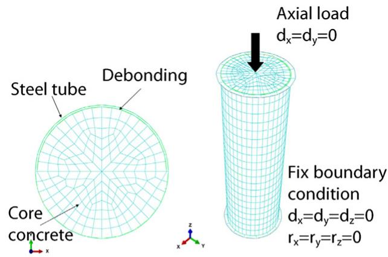  
a) Axial load FE model

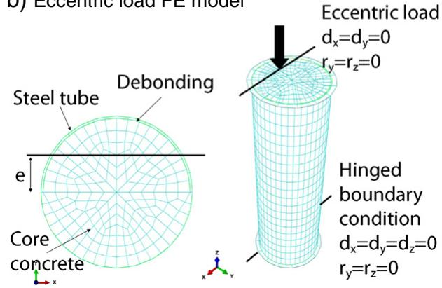  
b) Eccentric load FE model  
Fig. 6. FE model, applied load and restraints.

# 3.3. Boundary conditions and load applications

The debonding area was simulated by the space between concrete and steel. Taking the specimen with the debonding arc-length ratio of 0.5 for example, the debonding gap was located at the upper half of the across section, as shown in Fig. 6. Therefore, for the surfaces of both materials in debonding area, only the contact pressure model in the normal direction was used. However, for the surfaces of both materials without debonding, the steel–concrete interaction with a contact pressure model in the normal direction and a Coulomb friction modelling in the tangential direction with the frictional factor was used. According to the Coulomb friction model, the surfaces can transfer the shear stress until the shear stress is greater than the limit value [14]. The limit value depends on the confinement stress $p$ between the surfaces of steel tube and core concrete, which can be expressed as:

$$
\tau_ {\text {l i m i t}} = \mu \cdot p \geq \tau_ {\text {b o n d}} \tag {4}
$$

where the frictional factor $\mu$ was chosen at 0.6 [16], and the average surface bond stress $\tau _ { b o n d }$ can be calculated by $\tau { = } 2 . 3 1 4 \mathrm { - } 0 . 0 1 9 5 ( D / t )$ for circular CFST specimens as suggested by Roeder [18], D is the outside diameter of the circular steel tube and t is the wall thickness of the steel tube.

For the loading application, the displacement was applied in incremental step for all specimens, and the response of CFST after each step was calculated from the equilibrium equations.

Two different kinds of boundary conditions were used in this analysis depending on different load modes. For the axial loaded columns, the displacements in the x and y directions were constrained on the top base and the fixed boundary condition was applied to the

bottom base. The uniform compression displacement in the z direction was applied to the top surface. For the eccentric loaded columns, the displacements in the x and y directions and rotations around the y and z axes on the loading line of the top base are all constrained. All degrees of freedom except the rotation around the x axis on the loading line of the bottom base are constrained. The displacement in the z direction was applied on the nodes along the loading line on the top base which is on the same side of the debonding gap as shown in Fig. 6(b). The boundary conditions and load applications of finite element models are illustrated in Fig. 6.

# 4. Results and debonding influence discussions

# 4.1. Failure mode

Comparing the failure mode of both tests and the finite element model specimens after loading, which is illustrated in Fig. 7, it is found that a general good agreement is achieved between the failure modes predicted by using the current finite element models and those observed in the tests.

It also can be found that the failure mode of debonding specimens is nearly the same as that of the specimens without debonding, based on the comparison of specimens with different debonding arc-length ratios. In this test, the typical failure mode of the outer tube was the local (outward folding) failure mechanism [19]. However, for the specimens subjected to eccentric load, the flexural failure mode can be observed for all specimens with and without debonding.

However, the local buckling phenomenon in steel tube of debonding specimens is more serious than that of the specimens without debonding. Moreover, with the increase of debonding arclength ratio, the local buckling phenomenon is more serious. The specimen groups N5-A and N3-E are given as an example in Fig. 7. Because of the increase of debonding arc-length ratio, the larger part

of steel tube is loaded alone without the support of the core concrete. Therefore, the local buckling is easier to take place on the CFST specimens with debonding.

# 4.2. Load versus displacement relationship curve

The finite element models load–displacement curves are compared with the corresponding test measured curves in Fig. 8, in which the solid point denotes the experimental load–displacement curves and the dash line denotes the finite element models' results. It can be found that the load–displacement curves of finite element model specimens are very close to that of test specimens. Therefore, the load–displacement relationship of debonding CFST stub columns can be well predicted by the finite element models.

The load–displacement curves of test specimens are shown in Fig. 9. For the axial load specimens, it can be found that in each group the ultimate load capacities of debonding specimens are lower than that of the specimen without debonding. The displacements corresponding to the ultimate load capacity of debonding specimens are less than that of the specimen without debonding. Furthermore, after the load reached the ultimate load capacity, the load decreases much faster than that of the specimen without debonding. However, when the load decreases to a certain value, it does not decrease any more. The reason of this is that some parts of debonding gap will disappear due to the expansion of concrete and the inward buckling of the steel tube.

However, for the eccentric load specimens, the shapes of the load– displacement curves for both specimens with and without debonding are almost the same. The ultimate load capacities of debonding specimens are also lower than that of the specimen without debonding in each group. The displacements corresponding to the ultimate load capacity of debonding specimens are less than that of the specimen without debonding. The load does not decrease, obviously, after the peak value in the load–displacement curves.

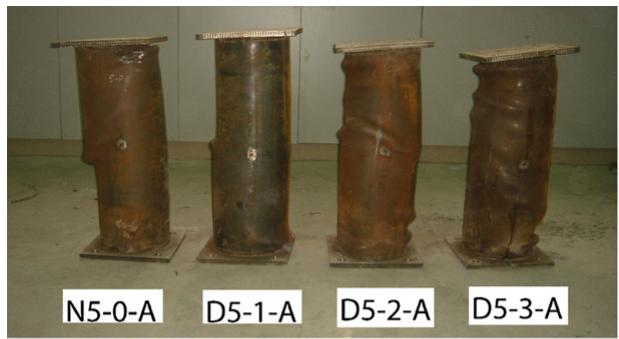  
a) Axial load test specimens

  
c) Axial load FEM models

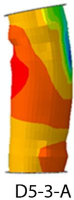

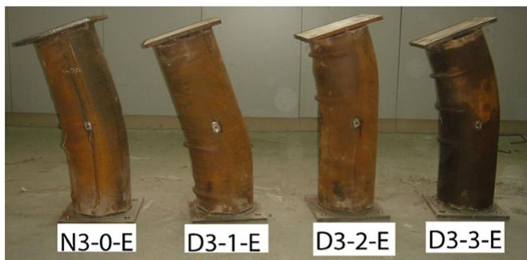  
b) Eccentric load test specimens

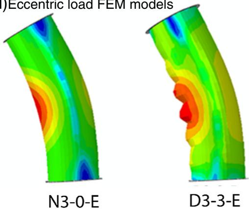  
d)   
Fig. 7. Failure mode of specimens.

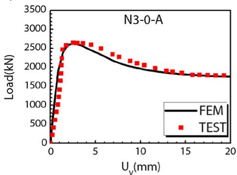  
a) Axial load   
(1) N3-0-A

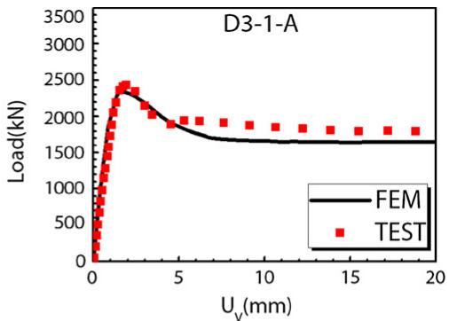  
(2) D3-1-A

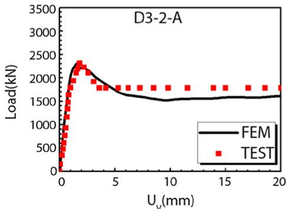  
(3) D3-2-A

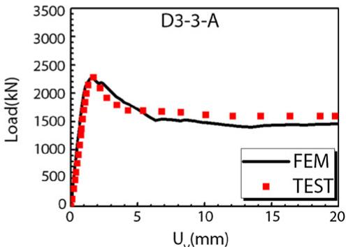  
(4) D3-3-A

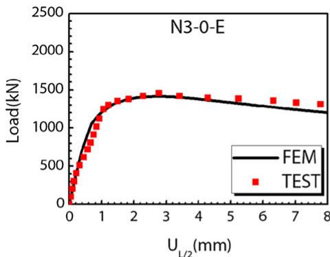  
b) Eccentric load  
(1) N3-0-E

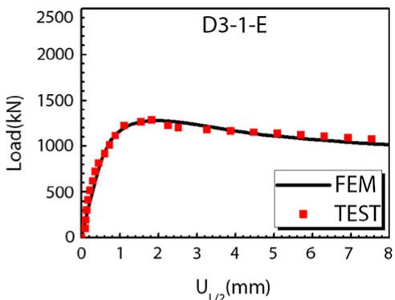  
(2) D3-1-E

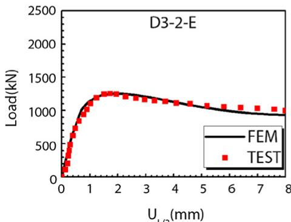  
(3) N3-2-E

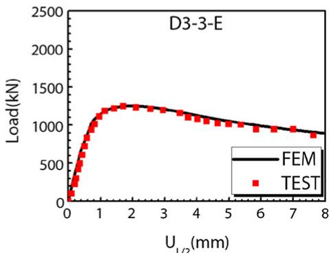  
(4) D3-3-E   
Fig. 8. Comparison of load–displacement curves obtained by finite element models and tests.

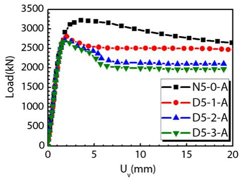  
a) Axial load t=5

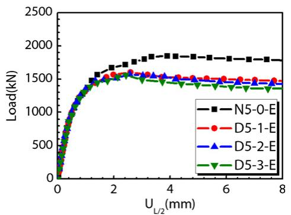  
b) Eccentric load t=5  
Fig. 9. Load–displacement curves of test specimens.

# 4.3. Ultimate load capacity

For the circular CFST stub column subjected to axial load, according to the research on the load–displacement curve by Han et al. [19], it can be found that the confinement factor is the most important factor which can influence the shape of the load–displacement curve. When the confinement factor of specimen is larger than 1.1, the load– displacement curve always increases; when the confinement factor of specimen is nearly 1.1, the load–displacement curve will maintain at a certain value, and when the confinement factor of specimen is smaller than 1.1, the load–displacement curve will decrease after a peak value, as shown in Fig. 10.

In this analysis, the load corresponding to the critical strain defined by Han [19] was chosen as the ultimate load capacity. The calculation formula of $\varepsilon _ { s c y }$ is given below:

$$
\varepsilon_ {\mathrm {s c y}} = 1 3 0 0 + 1 2. 5 f _ {c} + (6 0 0 + 3 3. 3 f _ {c}) \xi^ {0. 2} \tag {5}
$$

where $f _ { c }$ is the cylinder strength of the concrete; and $\xi$ is the confinement factor.

However, due to the influence of debonding on the load– displacement curves, it can be found that the displacements corresponding to the ultimate load capacity of debonding specimens are always less than that of the specimen without debonding. Therefore, for the debonding specimen, if the strain corresponding to the peak-load in the load-strain curve is less than the critical strain calculated by formula (5), this peak-load is taken as the ultimate load capacity.

For the circular CFST stub column subjected to eccentric load, the peak-load in the load–displacement curve is chosen as the ultimate load capacity.

The ultimate load capacities of all test specimens $( N _ { u . E X P } )$ and finite element model specimens $\left( N _ { u . F E M } \right)$ are listed in Table 2. It can be found that the ultimate load capacity decreased significantly with the increase of debonding arc-length ratio. Moreover, the comparisons of

  
Fig. 10. Load–displacement curves corresponding to different confinement factors.

the ultimate load capacities of finite element models and test specimens are also listed in the last row of Table 2, of which the mean value and mean square deviation were 0.993 and 0.0001, respectively. It can be found that, generally good agreement is obtained between the finite element models and test results.

# 4.4. Influence of the debonding on the ductility

For the purpose of understanding the influence of debonding on the ductility of the specimens, the reduction coefficient of ductility $( K _ { D I } )$ is defined as follows:

$$
K _ {D I} = D I _ {D} / D I _ {u} \tag {6}
$$

where $D I _ { D }$ denotes the ductility coefficient of specimens with debonding and $D I _ { u }$ denotes the ductility coefficient of specimens without debonding. Ductility coefficient was defined as $U _ { 8 5 \% } / U ,$ , of which $U$ denotes the axial displacement for axial loaded specimens and mid-height transverse displacement for eccentric loaded specimens, respectively. $U _ { 8 5 \% }$ is the displacement when the load falls to $8 5 \%$ of the ultimate load; $U = U _ { 7 5 \% } / 0 . 7 5$ , and $U _ { 7 5 \% }$ is the displacement when the load attains $7 5 \%$ of the ultimate load in the pre-peak stage.

The results of $K _ { D I }$ are illustrated in Fig. 11 and Table 1, from which it shows that with the increase of debonding arc-length ratio, the reduction coefficient of ductility decreases. Moreover, with the increase of confinement factor, the reduction coefficient of ductility also decreases.

The influence of different loading modes on the reduction coefficient of ductility can be found by comparison of Fig. 11(a) and (b). For the axial load debonding specimens with different confinement factors, $K _ { D I }$ decreases to 0.61; 0.50 and 0.34, respectively. However, for eccentric load debonding specimens with different confinement factors, it can be found that the $K _ { D I }$ decreased to 0.83, 0.71 and 0.55, respectively. Therefore, the influence of debonding on the reduction coefficient of ductility for axial load specimens is larger than that of the specimens subjected to eccentric load.

# 4.5. Influence of the debonding on the ultimate load capacity

In order to analyse the influence of debonding on the ultimate load capacity of the CFST single tube columns conveniently, the reduction coefficient of ultimate load capacity $\left( K _ { D } \right)$ is defined as follows:

$$
K _ {D} = N _ {D} / N _ {u} \tag {7}
$$

where $N _ { D }$ denotes the ultimate load capacity of specimens with debonding, $N _ { u }$ denotes the ultimate load capacity of normal specimens without debonding.

Table 2 Comparison of the experimental and finite element model results.   

<table><tr><td>No</td><td>Nu,EXP (kN)</td><td>Nu,FEM (kN)</td><td>Nu,FEM/Nu,EXP</td><td>No</td><td>Nu,EXP (kN)</td><td>Nu,FEM (kN)</td><td>Nu,FEM/Nu,EXP</td><td>No</td><td>Nu,EXP (kN)</td><td>Nu,FEM (kN)</td><td>Nu,FEM/Nu,EXP</td></tr><tr><td>N3-0-A</td><td>2647</td><td>2614</td><td>0.988</td><td>N4-0-A</td><td>2947</td><td>2916</td><td>0.989</td><td>N5-0-A</td><td>3218</td><td>3190</td><td>0.991</td></tr><tr><td>D3-1-A</td><td>2433</td><td>2356</td><td>0.968</td><td>D4-1-A</td><td>2602</td><td>2595</td><td>0.997</td><td>D5-1-A</td><td>2805</td><td>2807</td><td>1.001</td></tr><tr><td>D3-2-A</td><td>2306</td><td>2303</td><td>0.999</td><td>D4-2-A</td><td>2538</td><td>2505</td><td>0.987</td><td>D5-2-A</td><td>2706</td><td>2711</td><td>1.002</td></tr><tr><td>D3-3-A</td><td>2281</td><td>2288</td><td>1.003</td><td>D4-3-A</td><td>2503</td><td>2484</td><td>0.992</td><td>D5-3-A</td><td>2673</td><td>2682</td><td>1.003</td></tr><tr><td>N3-0-E</td><td>1457</td><td>1413</td><td>0.970</td><td>N4-0-E</td><td>1634</td><td>1610</td><td>0.985</td><td>N5-0-E</td><td>1847</td><td>1797</td><td>0.972</td></tr><tr><td>D3-1-E</td><td>1282</td><td>1277</td><td>0.996</td><td>D4-1-E</td><td>1434</td><td>1435</td><td>1.001</td><td>D5-1-E</td><td>1602</td><td>1581</td><td>0.987</td></tr><tr><td>D3-2-E</td><td>1265</td><td>1253</td><td>0.991</td><td>D4-2-E</td><td>1408</td><td>1409</td><td>1.001</td><td>D5-2-E</td><td>1573</td><td>1554</td><td>0.988</td></tr><tr><td>D3-3-E</td><td>1245</td><td>1251</td><td>1.005</td><td>D4-3-E</td><td>1392</td><td>1406</td><td>1.010</td><td>D5-3-E</td><td>1559</td><td>1550</td><td>0.994</td></tr></table>

The results of test specimens $K _ { D }$ are illustrated in Table 1 and Fig. 12, in which the solid point denotes the test load capacity versus displacement relationship curves and the dash line denotes the finite element models results. Some additional circular CFST stub columns with the debonding arc-length ratio changing from 0 to 0.9 (every 0.1) were simulated by finite element models. All the data of finite element models are the same as the corresponding test specimens.

From the results, it was demonstrated that the reduction coefficient of ultimate load capacity decreased with the increase of debonding arc-length ratio for all specimens. Furthermore, with the increase of confinement factor, the reduction coefficient of ultimate load capacity for all specimens decreases.

By the comparison of Fig. 12(a) and (b), it can be found that for the specimens subjected to small eccentric load $e / r { = } 0 . 4 6$ , where $r$ is the cross section radius of specimen), the influence of debonding arclength ratio on the reduction coefficient of ultimate load capacity is similar to that of the responding axial load specimen with the same confinement factor.

# 5. Parametric analysis on ultimate load capacity

Due to the limitation of specimen quantity in experimental test, a parametric analysis using finite element model was carried out in

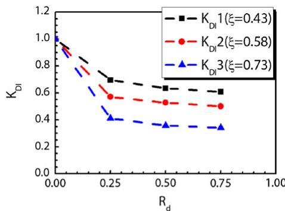  
a) Axial load

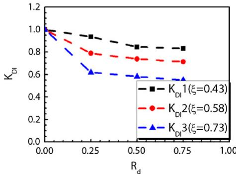  
b) Eccentric load  
Fig. 11. Influence of debonding arc-length ratio on $K _ { D I }$

order to expand the research range and study in-depth the ultimate load capacity of debonding CFST specimens. The diameter (D) and length of specimen (L) were chosen the same as the test specimen, which are $2 1 9 \mathrm { m m }$ and $7 0 0 \mathrm { m m }$ , respectively. The wall thickness of the steel tube (t) changes from 4, 6 and 8. Due to the statistics by Chen [10], the most common materials used in CFST structures were chosen in this analysis. The steel strength is Q235, Q345 and Q390, respectively, of which the yield strength $( f _ { y } )$ , ultimate strength $\left( f _ { u } \right)$ , elastic modulus $\left( E _ { s } \right)$ and Poisson's ratio $\left( \mu _ { s } \right)$ are listed in Table 3 [15]. The concrete strength is C30, C40, C50 and C60, respectively, of which the characteristic strength $( f _ { c k } )$ , cylinder strength $( f _ { c } )$ , elastic modulus $\left( E _ { c } \right)$ and Poisson's ratio $\left( \mu _ { c } \right)$ are also listed in Table 3 [12,13].

The debonding length $\left( L _ { d } \right)$ is the same as the specimen length. Two key factors were taken into account, which are debonding arc-length ratio $( R _ { d } )$ changing from 0 to 0.9 (every 0.1) and debonding thickness $\left( T _ { d } \right)$ changing from 0 to 3, respectively.

The definition of ultimate load capacity of specimens and the reduction coefficient of ultimate load capacity $\left( K _ { D } \right)$ have chosen the same method in this analysis. Based on the analysis results, the ones for the specimens subjected to small eccentric load or axial load, the

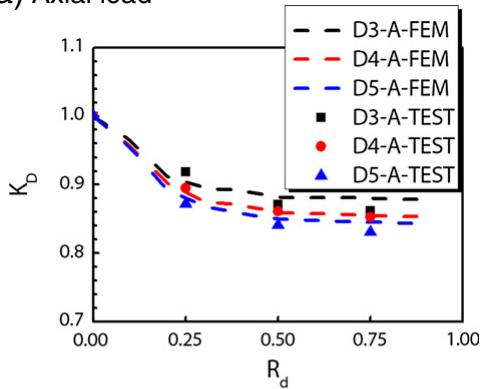  
a) Axial load

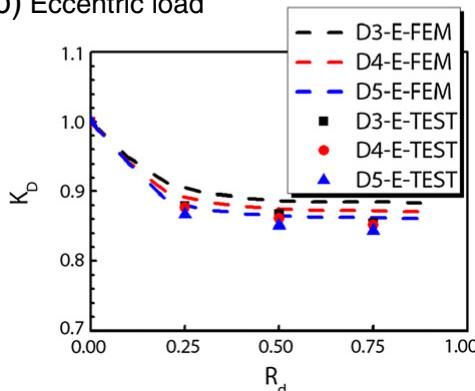  
b) Eccentric load  
Fig. 12. Influence of debonding arc-length ratio on $K _ { D }$

Table 3 Materials in parametric analysis.   

<table><tr><td rowspan="3">Steel strength</td><td>Q235</td><td>fy=235 MPa</td><td>fu=375 MPa</td><td>Es=206,000 MPa</td><td>μs=0.3</td></tr><tr><td>Q345</td><td>fy=345 MPa</td><td>fu=470 MPa</td><td></td><td></td></tr><tr><td>Q390</td><td>fy=390 MPa</td><td>fu=490 MPa</td><td></td><td></td></tr><tr><td rowspan="4">Concrete strength</td><td>C30</td><td>fck=20.1 MPa</td><td>fc=24 MPa</td><td>Ec=31,683 MPa</td><td>μc=0.2</td></tr><tr><td>C40</td><td>fck=26.8 MPa</td><td>fc=33.5 MPa</td><td>Ec=34,550 MPa</td><td></td></tr><tr><td>C50</td><td>fck=33.5 MPa</td><td>fc=41 MPa</td><td>Ec=36,518 MPa</td><td></td></tr><tr><td>C60</td><td>fck=40.2 MPa</td><td>fc=51 MPa</td><td>Ec=38,850 MPa</td><td></td></tr></table>

influence of debonding arc-length ratio on the reduction coefficient of ultimate load capacity is nearly the same. Therefore, all the specimens in parametric analysis are subjected to axial load.

The labels of specimens in parametric analysis starting with letter A refer to columns subjected to axial load. Following letter A, letters D, t, C and Q are used to distinguish specimens with different diameter, wall thickness, steel strength and concrete strength, respectively. For example, AD219t4C40Q235 is the CFST stub column with the diameter $2 1 9 \mathrm { m m }$ , wall thickness 4 mm, of which the concrete and steel strength are C40 and Q235, respectively.

# 5.1. Influence of debonding arc-length ratio

In order to analyse the influence of debonding arc-length ratio on the reduction coefficient of ultimate load capacity $\left( K _ { D } \right)$ of circular CFST stub columns, the debonding thickness was set to 3 mm. There are some possible influence parameters, such as the diameter of the specimen, the wall thickness of specimen, the steel strength and the concrete strength. When the diameter of the specimen is set, some groups of $R _ { d }  – K _ { D }$ curves with different confinement factors are shown in Fig. 13. It is illustrated that in each group, when the confinement factor is similar, the $R _ { d } \mathrm { - } K _ { D }$ curves is nearly the same, although t, C and Q are all different. Thus, it is obvious that the confinement factor is the most important factor of the analysis.

In order to analyse the influence of specimen diameter, a group of $R _ { d } \mathrm { - } K _ { D }$ curves with the same confinement factor $\xi = 0 . 5 8$ ) and

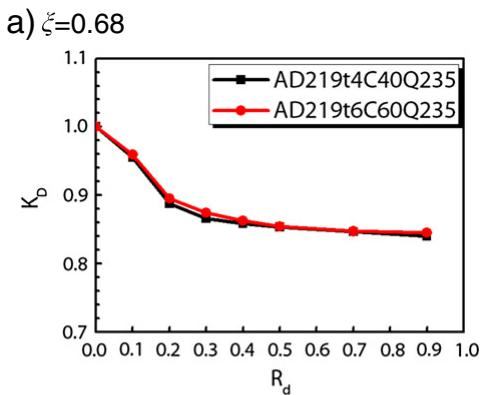

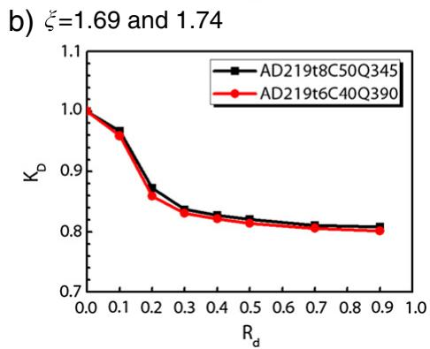  
Fig. 13. $R _ { d } { - } K _ { D }$ curves.

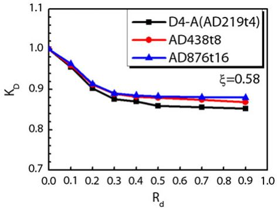  
Fig. 14. $R _ { d } { - } K _ { D }$ curves with same $\xi$ and different D.

different D (219 mm; 438 mm; 876 mm) are shown in Fig. 14. It can be found that when the confinement factor is the same, with the increase of $D$ , the $K _ { D }$ increases. Moreover, the diameters usually used in real CFST structures are larger than $3 0 0 \mathrm { m m }$ . In the research on the influence of $R _ { d }$ on the $K _ { D }$ , the diameter of specimens is chosen the same as that of the experimental specimen $_ { D = 2 1 9 \mathrm { m m } }$ ).

Based on the finite element models, the $R _ { d } \mathrm { - } K _ { D }$ curves are illustrated in Fig. 15, with different confinement factors. The results show that with the increase of confinement factor, the $K _ { D }$ decreases. When $R _ { d }$ is less than $R _ { d 0 } ,$ the $K _ { D }$ decreases fast. However, when $R _ { d }$ is larger than $R _ { d 0 }$ , the $K _ { D }$ decreases slowly. The $R _ { d 0 }$ is nearly 0.3.

# 5.2. Influence of debonding thickness

In order to analyse the influence of debonding thickness on the reduction coefficient of ultimate load capacity $\left( K _ { D } \right)$ of circular CFST stub columns, the debonding arc-length ratio was set to 0.5. There are also some possible influence parameters, such as the diameter of the specimen, the wall thickness of specimen, the steel strength and the concrete strength. There are some groups of $T _ { d } \mathrm { - } K _ { D }$ curves with different confinement parameters as shown in Fig. 16. It can also be found that in each group, when the confinement is similar, the $T _ { d } \mathrm { - } K _ { D }$ curves are nearly the same. Therefore, the confinement factor is the most important factor in this analysis, which could be used to analyse the parameters mentioned before.

Some additional circular CFST stub columns with the debonding thickness changing from 0 to 3 were simulated by accurate finite element models. All the data of finite element models are the same as the corresponding test specimens. The Td–KD curves corresponding to different test specimen groups are shown in Fig. 17. From the results, it was demonstrated that the reduction coefficient of ultimate load capacity decreased with the increase of debonding thickness. Moreover, with the increase of the confinement factor, the reduction coefficient of ultimate load capacity also decreases. Furthermore,

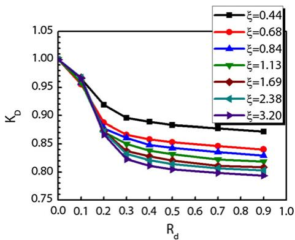  
Fig. 15. $R _ { d } { - } K _ { D }$ curves with different ξ.

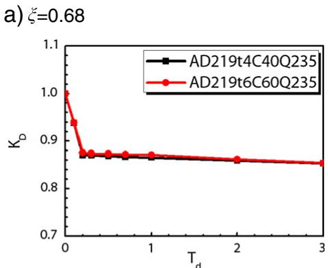

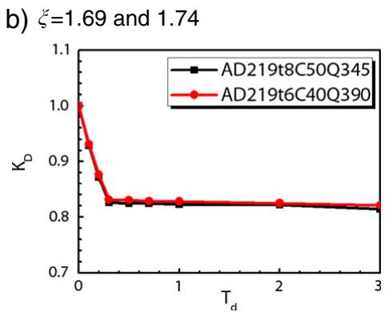  
Fig. 16. $T _ { d } \mathrm { - } K _ { D }$ curves.

when $T _ { d }$ is less than a critical value $T _ { d O } , K _ { D }$ decreases fast. However, when $T _ { d }$ is larger than $T _ { d O } , K _ { D }$ decreases very slowly.

In order to analyse the influence of the diameter of specimens, a group of $T _ { d } \mathrm { - } K _ { D }$ curves with the same confinement factor $\zeta = 0 . 5 8 )$ ) and different D ( $2 1 9 \mathrm { m m }$ ; 438 mm; 876 mm) is shown in Fig. 18. It also can be found that when the confinement factor is the same, with the increase of $D$ , the $K _ { D }$ increases. Furthermore, with the increase of D, the critical value $T _ { d 0 }$ increases. The diameter of specimens in the research on influence of $T _ { d }$ on the $K _ { D }$ is chosen to be the same as the one of the experimental specimen ${ \cal D } = 2 1 9 \mathrm { m m }$ ).

Through the parametric analysis, the different $T _ { d } \mathrm { - } K _ { D }$ curves with the confinement factors changing are illustrated in Fig. 19(b). The results show that with the increase of the confinement factor, $K _ { D }$ decreases. It also can be found that the critical value $T _ { d 0 }$ increases from 0.2 to 0.3, with the increase of the confinement factor.

5.3. Combined influence of debonding arc-length ratio and debonding thickness

Based on the test specimens, an analysis of $K _ { D }$ with the combined influence of debonding arc-length ratio and debonding thickness are

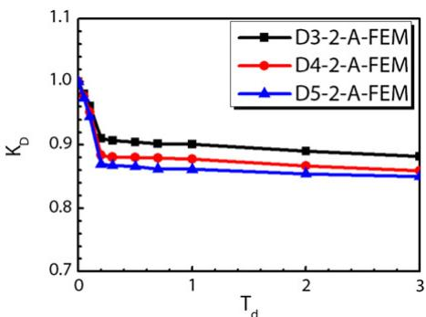  
Fig. 17. $T _ { d } \mathrm { - } K _ { D }$ curve corresponding to different test specimen groups.

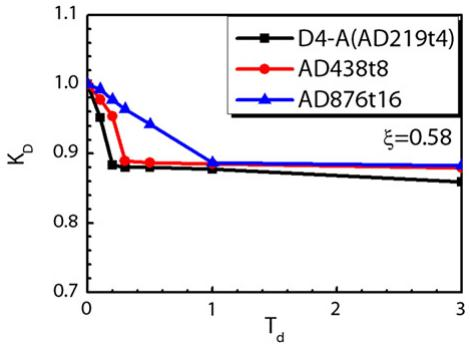  
Fig. 18. $T _ { d } \mathrm { - } K _ { D }$ curves with same $\xi$ and different D.

conducted by finite element model as shown in Fig. 20. The $R _ { d }$ changes from 0.25, 0.5 to 0.75 and $T _ { d }$ changes from 0 to $3 \mathrm { m m }$ . The results show that for D3-1-A, when $T _ { d }$ reaches 0.5, $K _ { D }$ decreases to the critical value $T _ { d O } ,$ , however, for the D3-3-A, when $T _ { d }$ is just 0.1, $K _ { D }$ decreases to $T _ { d O }$ . Thus, with the increase of both $R _ { d }$ and $T _ { d } , K _ { D }$ decreases faster and reaches the $T _ { d O }$ earlier.

# 6. Simplified calculation formula and accuracy analysis

According to the parametric analysis, it can be found that debonding will take a disadvantage influence on the ultimate load capacity of circular CFST stub columns. Therefore, for the debonding circular CFST stub columns subjected to axial load or small eccentric load, the reduction coefficient of ultimate load capacity $\left( K _ { D } \right)$ can be predicted by a simplified calculation formula.

The most influenced parameters found in the parametric analysis are the confinement factor, the debonding arc-length ratio and the debonding thickness, respectively. However, according to the difficulty of the debonding thickness value detection in real CFST structures, the critical maximum value (3 mm) was chosen as the debonding thickness in simplified calculation formula. Thus, the parameters in simplified calculation formula were chosen as confinement factor and debonding arc-length ratio. Due to the provision in literature [20], it can be found that the confinement factor of circular CFST column should be larger than 0.6.

Using the fitting simulation, the simplified calculation formula is proposed as follows:

$$
\begin{array}{l} N _ {D} = K _ {D} \cdot N _ {u} \\ K _ {D} = \left\{ \begin{array}{l l} 1 - a _ {1} \cdot R _ {d} & (0 \leq R _ {d} \leq 0. 3) \\ 1. 0 1 5 - 0. 3 \cdot a _ {1} - 0. 0 5 \cdot R _ {d} & (0. 3 \leq R _ {d} \leq 1) \end{array} \right. \tag {8} \\ \end{array}
$$

where a1= {0. 6250. 25 ⋅ $\displaystyle \boldsymbol { a } _ { 1 } = \bigl \{ \begin{array} { l } { 0 . 2 5 \cdot \xi + 0 . 2 5 ( 0 . 6 \le \xi \le 1 . 5 ) } \\ { 0 . 6 2 5 } \end{array} \bigr .$

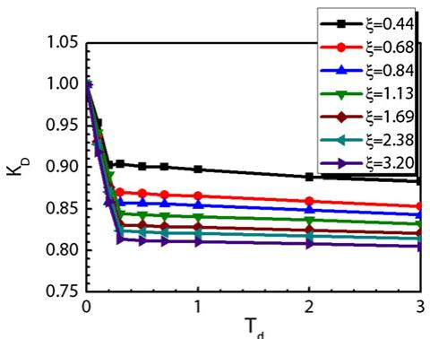  
Fig. 19. $T _ { d } \mathrm { - } K _ { D }$ curves with different ξ.

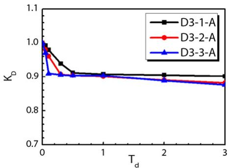  
Fig. 20. KD–Td curves with different $R _ { d } .$ .

In order to analyse the accuracy of the proposed calculation formula, a large number of contrast calculations are carried out. Fig. 21 illustrates the $R _ { d } \mathrm { - } K _ { D }$ curves, in which the solid point denotes the test load capacity versus displacement relationship curves, the hollow point denotes the finite element model results and the dash line denotes the simplified calculation formula results. Moreover, the comparison of $K _ { D }$ of all specimens in parametric analysis between proposed calculation formula, experimental test and finite element model is shown in Fig. 22, in which axis x is the confinement factor and axis y is the comparison of $K _ { D } .$ . It can be found that all the deviations are less than $5 \%$ , and the mean value and mean square deviation are 0.998 and 0.0003, respectively. Therefore, the accuracy of the proposed calculation formula is good and it can be used to predict the reduction coefficient of ultimate load capacity $\left( K _ { D } \right)$ of test specimens and corresponding finite element models.

In order to use the formula easily for engineers, the values of $K _ { D }$ calculated by the most common parameters in CFST structures are listed in Table 4. The interpolation method can be used to obtain the intermediate point value.

# 7. Conclusions

The following conclusions can be drawn within the limitations of the research presented in this paper:

(1) The experimental research on the influence of debonding circular CFST stub columns was conducted. The failure mode of debonding specimens is nearly the same as that of the specimens without debonding. However, the local buckling phenomenon in steel tube of debonding specimens is more serious than that of the specimens without debonding.   
(2) A finite element model which can be used to simulate the mechanical behaviour of circular CFST stub columns with debonding is verified by the test results in this paper.

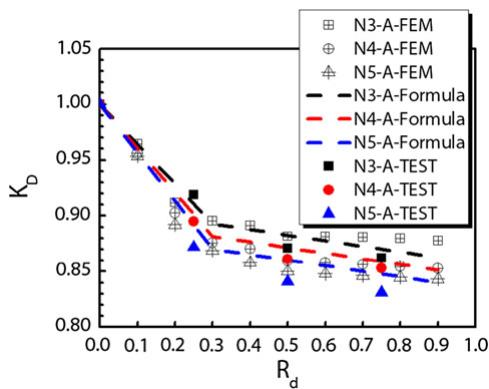  
Fig. 21. $K _ { D } \mathrm { - } R _ { d }$ curves of experimental, finite element model and formula specimens.

  
Fig. 22. The accuracy analysis.

(3) The ultimate load capacity of debonding specimen is lower than that of the specimen without debonding. The displacements corresponding to the ultimate load capacity of debonding specimens are less than that of the specimen without debonding. For the axial loaded specimens, after the load reached the ultimate load capacity, the load decreases much faster than that of the specimen without debonding until a certain value. However, for the eccentric load specimens, the load–displacement curves for both specimens with and without debonding are almost the same.   
(4) The results of parametric analysis show that with the increase of the confinement factor, debonding arc-length ratio or debonding thickness, the reduction coefficient of ultimate load capacity decreases. When debonding arc-length ratio or debonding thickness is less than a critical value, the reduction coefficient of ultimate load capacity decreases fast. On the contrary, the reduction coefficient of ultimate load capacity decreases slowly. Moreover, with the increase of the confinement factor, the critical value of debonding thickness increases.   
(5) Based on the parametric analysis, a simplified formula is proposed for the reduction coefficient of the ultimate load capacity of circular debonding CFST stub columns subjected to axial load or small eccentric load.   
(6) In this paper, the research is focused on the influence of debonding on the circular CFST stub columns subjected to axial load or small eccentric load. However, a further research has been carried out to study the influence of debonding on the circular CFST stub columns subjected to large eccentric load and the circular CFST long columns.

# Nomenclature

<table><tr><td>Ad</td><td>De-fill rate</td></tr><tr><td>Td</td><td>Debonding thickness in the cross section</td></tr><tr><td>Rd</td><td>Debonding arc-length ratio in the cross section</td></tr><tr><td>Ld</td><td>Debonding length in the longitudinal section</td></tr><tr><td>ξ</td><td>Confinement factor ξ = Asfy/Acfck</td></tr><tr><td>Ac</td><td>Concrete cross-sectional area</td></tr><tr><td>As</td><td>Steel cross-sectional area</td></tr><tr><td>α</td><td>Steel ratio α = As/Ac</td></tr><tr><td>fy</td><td>Yield strength of steel tube</td></tr><tr><td>fck</td><td>Characteristic strength of the concrete, equals to 0.67fcu for normal strength concrete</td></tr><tr><td>fcu</td><td>Concrete cube strength</td></tr><tr><td>fc</td><td>Compressive cylinder strength of the concrete</td></tr><tr><td>σp</td><td>Post failure stress</td></tr><tr><td>Gf0</td><td>Base value of fracture energy</td></tr><tr><td>dmax</td><td>Maximum aggregate size</td></tr><tr><td>μ</td><td>Frictional factor</td></tr><tr><td>τbond</td><td>Average surface bond stress</td></tr><tr><td>D</td><td>Outside diameter of circular steel tube</td></tr><tr><td>t</td><td>Wall thickness of steel tube</td></tr></table>

Table 4 Reduction coefficient of ultimate load capacity of circular CFST stub column.   

<table><tr><td>Rdξ</td><td>0</td><td>0.1</td><td>0.2</td><td>0.3</td><td>0.5</td><td>0.7</td><td>0.9</td></tr><tr><td>0.6</td><td>1</td><td>0.96</td><td>0.92</td><td>0.88</td><td>0.87</td><td>0.86</td><td>0.85</td></tr><tr><td>1.0</td><td>1</td><td>0.95</td><td>0.90</td><td>0.85</td><td>0.84</td><td>0.83</td><td>0.82</td></tr><tr><td>&gt;1.5</td><td>1</td><td>0.94</td><td>0.88</td><td>0.81</td><td>0.80</td><td>0.79</td><td>0.78</td></tr></table>

$f _ { c u } = \substack { \mathrm { C } 3 0 – \mathrm { C } 6 0 }$ ; $f _ { s } =  { \mathrm { Q } } 2 3 5$ , Q345, Q390; $R _ { d } = 0 - 0 . 9$ ; $\xi > 0 . 6$ ; $D { > } 2 1 9 \ \mathrm { m m }$ ; specimens subjected to axial load or small eccentric load.

εscy $\varepsilon _ { s c y }$ Critical strain of CFST column   
$N _ { u , E X P }$ Ultimate load capacities of test specimen   
$N _ { u , F E M }$ Ultimate load capacities of finite element model specimen   
$K _ { D I }$ Reduction coefficient of ductility   
$D I _ { D }$ Ductility coefficient of specimens with debonding   
$D I _ { u }$ Denotes the ductility coefficient of specimens without debonding   
$K _ { D }$ Reduction coefficient of ultimate load capacity   
$N _ { D }$ Ultimate load capacity of specimens with debonding   
$N _ { u }$ Ultimate load capacity of specimens without debonding   
$\mu _ { s }$ Poisson's ratio of steel tube   
$\mu _ { c }$ Poisson's ratio of concrete   
$\sigma$ Stress   
ε Strain   
$U _ { v }$ Axial compressive deformation   
$U _ { L / 2 }$ Mid-height deflection

# Acknowledgements

The authors would like to thank Fuzhou University, China for laboratory help.

# References

[1] Shanmugam NE, Lakshmi B. State of the art report on steel–concrete composite columns. J Constr Steel Res 2001;57:1041–80.   
[2] Bradford MA, Loh HY, Uy B. Slenderness limits for filled circular steel tubes. J Constr Steel Res 2002;58:243–52.

[3] Brett CG, Cenk T, Mark DD, Paul HS, Jerome FH. A synopsis of studies of the monotonic and cyclic behavior of concrete-filled steel tube members, connections, and frames. Report No. NSEL-008University of Illinois at Urbana-Champaign: Department of Civil and Environmental Engineering; 2008.   
[4] Mu T, Fan B, Xie B, Zheng Y. Influence of de-fill on performance of concrete-filled steel tubular columns. Arch 07 5th International Conference on arch bridges; 2007. p. 919–24. Madeira, Portugal, September 12–14.   
[5] Xue JQ, Briseghella B, Chen BC. Parametric analysis of debonding on the circular CFST structures. Structural Engineering World Congress (SEWC) 2011. Como, Italy, April 4–6; 2011.   
[6] Ye YZ. Influence of concrete debonding to performance of medium and short columns in concrete filled steel tube. Railway Engineering 2001;10:2–5 [in Chinese].   
[7] Ji HG, Zhang BB. The analysis of load carrying capacity of CFST short column with cementation deviating based on ANSYS. Steel Constr 2007;22(1):59–61 [in Chinese].   
[8] Han LH, Zhao XL, Tao Z. Tests and mechanics model for concrete-filled SHS stub columns, columns and beam-columns. Steel Compos Struct 2001;1(1):51–74.   
[9] National Standards of the People's Republic of China. Metallic materials—tensile testing at ambient temperature. GB/T228-2002.Beijing, China: Standards Press of China; 2002.   
[10] Chen BC, Wang TL. Overview of concrete filled steel tube arch bridges in China. Practice Periodical on Structural Design and Construction, ASCE May 2009;14(2): 70–80.   
[11] National Standards of the People's Republic of China. Standard for test method of mechanical properties on ordinary concrete. GB/T50081-2002.Beijing, China: China Architecture&Building Press; 2003.   
[12] National standard of the People's Republic of China. Code for design of concrete structures. GB50010-2002.Beijing: China Construction Industrial Publishing House; 2002.   
[13] Comite Euro-International Du Beton. CEB-FIP model code 1990 design code. Great Britain: Thomas Telford; 1993.   
[14] Hibbitt, Karlson & Sorensen Inc. ABAQUS/standard user's manual. Version 6.5. Hibbitt, Karlsson, & Sorensen, Inc; 2005.   
[15] National Standard of the People's Republic of China. Code for design of steel structures. GB50017-2003.Beijing: China Architecture & Building Press; 2003.   
[16] Han LH, Yao GH, Tao Z. Performance of concrete-filled thin-walled steel tubes under pure torsion. Thin-Walled Structures 2007;45(1):24–36.   
[17] Hillerborg A, Modeer M, Petersson PE. Analysis of crack formation and crack means of fracture mechanics and finite elements. Cem Concr Res 1976;6:773–82.   
[18] Roeder CW, Cameron B, Brown CB. Composite action in concrete filled tubes. Journal of structural engineering, 5. ASCE; 1999. p. 477–84.   
[19] Han LH, Yao GH, Zhao XL. Tests and calculations for hollow structural steel (HSS) stub columns filled with self-consolidating concrete (SCC). J Constr Steel Res 2005;61:1241–69.   
[20] Fujian Provincial Standard for Engineering Construction. Technical specification for concrete-filled steel tubular structures. DBJ13-51-2003.Fuzhou, China: The Construction Bureau of Fujian Province; 2003 [in Chinese].