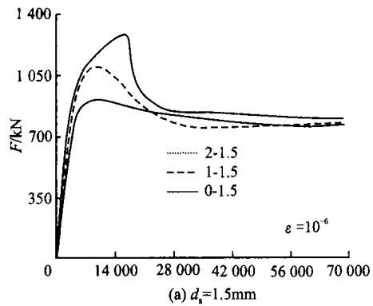
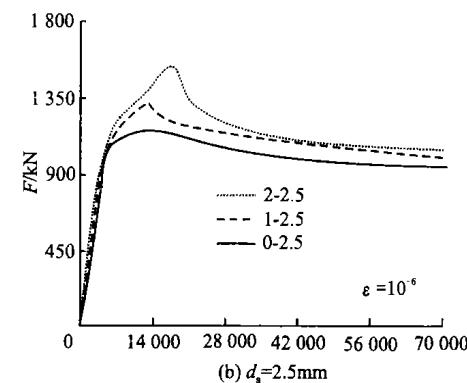
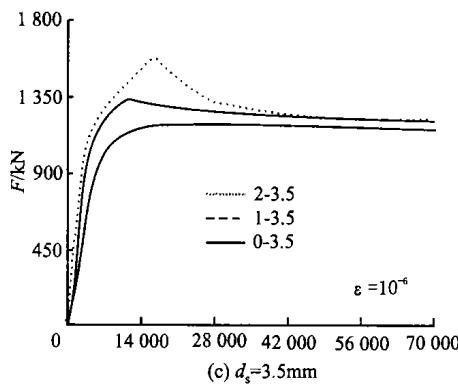
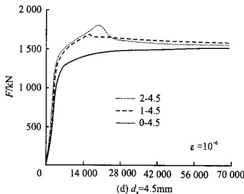
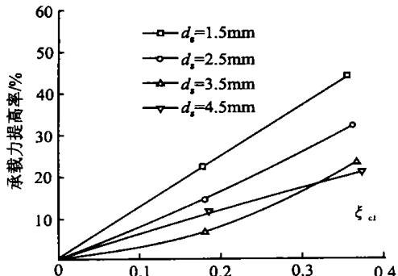
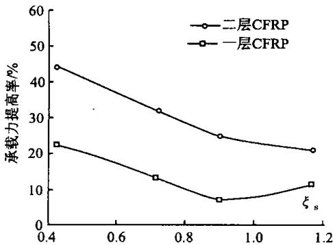

# 圆 CFRP 钢复合管混凝土轴压短柱试验研究

顾 威1‚关崇伟1‚赵颖华2‚曹 华3

沈阳建筑工程学院土木工程学院 辽宁 沈阳 大连海事大学道路与桥梁工程研究所 辽宁 大连沈阳人和房地产开发有限公司 辽宁 沈阳

摘 要：通过对8根圆CFRP（碳纤维增强塑料）钢复合管混凝土轴压短柱和4根圆钢管混凝土轴压短柱极限承载力的试验‚研究CFRP 对圆钢管混凝土轴压短柱的增强效果．分析了钢管约束效应系数和 CFRP 筒约束效应系数等对圆 钢复合管混凝土轴压短柱极限承载力的影响 在本次试验的参数范围内对圆钢管混凝土轴压短柱极限承载力的提高率近似随着 的增加而线性增加 在其它条件相同的情况下 钢管约束效应系数越大 对圆钢管混凝土轴压短柱极限承载力的提高率越小

关键词 钢复合管混凝土结构 轴压短柱 试验研究 钢管约束效应系数 约束效应系数

中图分类号：TU393 文献标识码：A 文章编号:1671—2021(2004)02—0118-03

三向受压下混凝土的抗压强度有很大提高 因此 人们采用不同的材料制成筒体 内部浇筑混凝土作为主要承受压力的构件 利用筒体与混凝土之间的相互作用‚可以充分发挥两种材料的优点‚使承载力得以提高 延性得到改善 应用最多的筒体材料是钢材和CFRP（碳纤维增强塑料）‚并形成了钢管混凝土结构［1］和 筒内填混凝土结构［2～4］ 它们各有不足［5］ 将 与钢管混凝土结合使用 可使纤维的高强度特点得以充分发挥

# 1 试验概况

# 1∙1 试件的设计与制作

本次试验共计 个试件 主要参数为钢管约束效应系数 $\hat { \sf 5 } _ { \mathrm { s } } = A _ { \mathrm { s } } p _ { \mathrm { y } } / ( A _ { \mathrm { c } } / p _ { \mathrm { c k } } )$ 和 CFRP 筒约束效应系数 $\bar { \xi } _ { \mathrm { c f } } = { A _ { \mathrm { c f } } p _ { \mathrm { c f } } } / ( { A _ { \mathrm { c } } } / { p _ { \mathrm { c k } } } )$ ‚其中 $A _ { \textrm { s } , p _ { \textrm { y } } }$ 分别为钢管的横截面积 屈服强度 $A _ { \textrm { c } , \ p _ { \mathrm { c k } } }$ 分别为混凝土的横截面积 轴心抗压强度标准值 $A _ { \mathrm { c f } } \setminus p _ { \mathrm { c f } }$ 分别为的横截面积 极限抗拉强度 柱高均为$\mathrm { m m }$ 砼直径 $d _ { \mathrm { c } } = 1 2 4 ~ \mathrm { m m }$ 其它参数与承载力实测值见表1

在制作试件时‚首先按要求加工钢管．对应每个试件加工两块 $1 0 \mathrm { m m }$ 厚的钢盖板 保证盖板与空钢管的几何中心对中 先在空钢管一端将盖板焊上 另一端浇筑混凝土之后再焊接 钢材强度由拉伸试验确定 将钢管做成标准试件 按金属拉伸试验方法进

行拉伸试验 得到屈服强度等指标 混凝土采用＃普通硅酸盐水泥；石灰岩碎石‚最大颗粒直径为$2 0 \mathrm { m m }$ ；中粗砂；高效减水剂FDN．配合比见表2。

表1 试件参数与承载力实测值  

<table><tr><td>试件编号</td><td>py/MPa</td><td>D/mm</td><td>dcf/mm</td><td>ξer</td><td>ξcf</td><td>Fut/kN</td></tr><tr><td>0-1.5</td><td>350</td><td>127</td><td>0.00</td><td>0.364</td><td>0.000</td><td>890</td></tr><tr><td>0-2.5</td><td>350</td><td>129</td><td>0.00</td><td>0.612</td><td>0.000</td><td>1140</td></tr><tr><td>0-3.5</td><td>310</td><td>131</td><td>0.00</td><td>0.765</td><td>0.000</td><td>1293</td></tr><tr><td>0-4.5</td><td>310</td><td>133</td><td>0.00</td><td>0.992</td><td>0.000</td><td>1528</td></tr><tr><td>1-1.5</td><td>350</td><td>127</td><td>0.17</td><td>0.408</td><td>0.172</td><td>1086</td></tr><tr><td>1-2.5</td><td>350</td><td>129</td><td>0.17</td><td>0.685</td><td>0.172</td><td>1294</td></tr><tr><td>1-3.5</td><td>310</td><td>131</td><td>0.17</td><td>0.856</td><td>0.172</td><td>1348</td></tr><tr><td>1-4.5</td><td>310</td><td>133</td><td>0.34</td><td>1.110</td><td>0.172</td><td>1698</td></tr><tr><td>2-1.5</td><td>350</td><td>127</td><td>0.34</td><td>0.408</td><td>0.344</td><td>1128</td></tr><tr><td>2-2.5</td><td>350</td><td>129</td><td>0.34</td><td>0.685</td><td>0.344</td><td>1506</td></tr><tr><td>2-3.5</td><td>310</td><td>131</td><td>0.34</td><td>0.856</td><td>0.344</td><td>1593</td></tr><tr><td>2-4.5</td><td>310</td><td>133</td><td>0.34</td><td>1.110</td><td>0.344</td><td>1846</td></tr></table>

注 试件编号中 前数字指 层数 后数字指钢管壁厚单位 $\mathrm { m m } ; D$ 为钢管外径 $d _ { \mathrm { c f } }$ 为 厚度 $F _ { \mathrm { u } } ^ { \mathrm { t } }$ 为承载力实测值

表2 混凝土配合比  

<table><tr><td>水泥用量/(kg·m-3)</td><td>m(e): m(s): m(r)</td><td>水灰比</td><td>高效减水剂/%</td></tr><tr><td>490</td><td>1:1.35:2.20</td><td>0.35</td><td>1.0</td></tr></table>

注 $m \left( \mathbf { c } \right) : m \left( \mathbf { s } \right) : m \left( \mathbf { r } \right)$ 为水泥 砂 石的质量比

浇筑混凝土时首先将钢管竖立 从顶部灌入混凝土 并用 $\Phi 5 0$ 插入式振捣棒振捣直至密实 试件

养护为自然养护 混凝土强度由同条件下成型养护的试块尺寸为 $1 5 \ \mathrm { c m } \times 1 5 \ \mathrm { c m } \times 1 5 \ \mathrm { c m }$ 的试验得到最后换算成强度标准值 $p _ { \mathrm { c k } } { = } 4 0 . 1 5 ~ \mathrm { M P a }$ ．本试验采用的碳纤维布和基体材料由沈阳市建筑研究院提供 碳纤维单丝抗拉强度为 $4 \ 2 0 0 \ \mathrm { M P a }$ ，实测CFRP极限抗拉强度 $f _ { \mathrm { { e f } } } { = } 1 2 6 0 ~ \mathrm { { M P a } } .$ 施工工艺按参考文献［6］执行

# 1∙2 试验方法

试验在沈阳建筑工程学院结构工程实验室的压力机上进行 试验时将试件直接放在压力机上 试件上端采用球铰 进行一次压缩试验 为了准确地测量试件的应变 在每个试件钢管外壁中截面处沿周长布置纵向和环向电阻应变片共 对 在外壁中截面处沿周长布置环向应变片共个 沿试件纵向还设置了两个电测位移计以测定试件的纵向变形 试验采用分级加载制 在弹性范围

内 每级荷载为预计荷载的 $1 / 1 0$ 当钢管屈服后 持荷时间约为 $3 \mathrm { { \ m i n } }$ 接近破坏时 慢速连续加载

# 2 试验现象与分析

# 2∙1 试验现象

钢管混凝土试件在开始受荷时处于弹性阶段 外观变形不明显 随着荷载的不断增加 试件的中部开始出现局部凸曲 大约在 $8 5 \% \sim 9 0 \%$ 极限承载力时产生明显变形‚而一旦产生明显变形‚就可听到CFRP 的断裂声响‚随着变形的加大‚CFRP 开始断裂并拌有暴裂声 当 达到极限抗拉强度并断裂时 钢管塑性变形明显 可以看到 钢管混凝土试件在 断裂后马上呈现腰鼓状变形强度下降较快‚最终承载力与相同钢管壁厚的钢管混凝土轴压短柱大致吻合 如图 所示

  
图1 试件荷载 应变关系曲线

# 2∙2 工作机理分析

在初始荷载阶段 工作机理与钢管混凝土相同不受力 随着纵向应变的增加 混凝土与钢管壁之间出现径向压力 钢管壁开始受到环向拉应力 同时 因为钢管壁的径向变形增加 在钢管和 之间也出现径向压应力 开始受到环向拉应力 此时 处于环拉应力状态 钢管处于纵压 环拉的双向应力状态 混凝土处于三向受压状态 当钢管还处于弹性阶段时 钢管混凝土外观体积的变化

不大 此时 受力不大 但是当钢管达到屈服后钢管混凝土的应变发展加剧 此时 混凝土外观体积急剧增长 钢管和 的环向拉应力不断增加 在钢管与核心混凝土之间产生纵向压力的重分布 一方面 钢管承受的纵向压力减小 另一方面 混凝土因受到较大的约束而具有更高的抗压强度 钢管从主要承受纵向压应力转变为主要承受环向拉应力最后 当钢管和核心混凝土所能承担纵向压力之和达到最大值时‚钢管混凝土柱即告破坏．

# 2∙3 试验结果分析

CFRP 对钢管混凝土轴压短柱承载力的提高率近似随着 的增加而线性增加 见图

  
图2 承载力提高 ${ \tt - } \xi _ { \mathrm { o f } }$ 关系曲线

在其它条件相同的情况下 钢管约束效应系数越大 对钢管混凝土轴压短柱承载力的提高率越小 见图

  
图3 承载力提高 关系曲线

# 3 结 论

提高了钢管混凝土的刚度 承载力提高的幅度近似随着 的增加而线性增加 在其它条件相同的情况下 钢管约束效应系数越大 则对极限承载力提高的幅度越小

# 参考文献：

［1］ 韩林海．钢管混凝土结构 ［ M ］．北京：科学出版社2000.  
［2］ Omar Chaallal‚Mohsen Shahawy．Performance of fiber-reinforced polymer-wrapped reinforced concrete column under combined axia-l flexural loading ［ J ］．ACI Structure Journal 2000,97(4):7-8.   
［3］ Wang Y C．Investigation of concentrically loaded reinforced columns confined with GFRP Jackets ［ J ］．ACI Structure Journal,2001,98(3):5-6.   
［4］ Vijay P V‚Hota V S‚Ganga Rao．Bending behavior and deformability of GFRP reinforced concrete members ［ J ］ ACI Structure Journal,2OO1,98(6),11-12.   
［5］ 王庆利‚赵颖华‚顾威．圆截面 CFRP-钢复合管混凝土结构的研究［J］．沈阳建筑工程学院学报（自然科学版)，2003,19(4).272—274.  
建设部建筑物鉴定与加固规范管理委员会 粘贴碳纤维增强复合材料加固混凝土工程施工验收暂行规定［S ］ ．

# Experimental study on concentrically-compressed circular concrete filled CFRP－steel composite tubular short columns

GU Wei1‚GUA N Chong-wei1‚ZHA O Y ing-hua2‚CA O Hua3

（1．College of Civil Engineering‚Shenyang Architecture and Civil Engineering U niversity‚Shenyang‚110168‚China； 2．Dalian Mar-itime University‚Dalian‚116026‚China； 3．ShenYang RenHe Real Estate Exploitation Ltd．‚Shenyang‚110006‚China）

Abstract：T he enhancement of CFRP to the ultimate strength of concentrically-compressed circular concrete filled CFRP-steel composite tubular short columns was studied．T he tested specimens included 8 concentrically-compressed circular concrete filled CFRP-steel composite tubular short columns and 4concentrically-compressed circular concrete filled tubular short columns．T he influences of steel tube confining factor and CFRP tube confining factor on the ultimate strength of concentrically-compressed circular concrete filled CFRP-steel composite tubular short columns were analyzed．It was found that within the factor scope of this test‚the increase rate of ultimate strength owing to CFRP increases nearly linearly with that of CFRP；under the condition that other factors are the same‚the bigger the steel tube confining factor‚the smaller the rate of increase of ultimate strength owing to CFRP

Key Words：concrete filled CFRP-steel composite tubular structures；concentrically-compressed short columns；experimental study；steel tube confining factor；CFRP tube confining factor