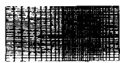
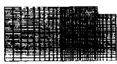

# 钢管高强混凝土轴压力学性能的理论分析与试验研究

韩林海

（ 哈尔滨建筑大学 150008）

摘 要：利用数值分析方法对钢管高强混凝土在轴心受压时的荷载－变形关系曲线进行了全过程分析。为了验证理论分析结果，进行了不同套箍系数的轴压标准试件的试验研究，计算曲线和试验曲线吻合。 最后，提供了钢管高强混凝土轴压强度承载力的简化计算公式。

关键词：钢管高强混凝土 轴压 套箍系数 全过程分析 延性

# THEORETICAL ANALYSES AND EXPERIMENTAL RESEARCHES FOR THE BEHAVIORS OF HIGH STRENGTH CONCRETE FILLED STEEL TUBES SUBJECTED TO AXIAL COMPRESSION

Han L inhai

（ Harbin U niversity of Civil Engineering and A rchitecture 150008）

Abstract：Integral method is applied for the analyses of complete curves of load $-$ deformation and behaviors of high strength concrete filled steel tubes （ HSCFST ） subjected to axial compression.Some HSCFST w ith different confining ratios ξare tested in order toprove the corrections of the theoretical analysis results，and the theoretical results fit w ith those of tests satisfactorily.Finally，simplified calculating fo-r mula of the strength of HSCFST is put forw ard.

Keywords： high strength concrete filled steel tube （ HSCFST ） axial compression confiningratiocomplete analysis ductility

# 1 前 言

高强混凝土 在我国一般指立方试块强度$6 0 _ { \mathrm { M P a } }$ 的混凝土 是近年来国内外进行研究的热门课题。 它的主要优点是强度高，可以节约水泥，减小构件截面面积和减轻结构自重等。目前，我国已开始采用强度指标为 $\mathrm { C } 6 0 \mathrm { \sim } \mathrm { C } 8 0$ 的高强混凝土，它比普遍采用的 $\mathrm { c } 2 0 \mathrm { \sim } \mathrm { C } 5 0$ 混凝土的强度提高 $1 { \sim } 3$ 倍，因

而用于荷载很大的结构，如高层建筑、地下工程和大跨结构的支柱等，效果十分显著，是一种有很大发展前途的材料。

然而，高强混凝土的弱点是脆性大，这就阻碍了其实际工程应用，尤其在复杂受力状态下，将由脆性破坏控制，可靠性大大降低。

如果将高强混凝土灌入钢管中组成钢管高强混凝土，混凝土受到钢管的约束，在复杂应力状态下，钢管具有很强的抗剪和抗扭能力，从而可以有效地防止高强混凝土发生脆性破坏，使钢管高强混凝土具有良好的延性，也使得高强混凝土的实际工程应用得以实现，经济效果得以充分发挥。 众所周知，采用普通混凝土的钢管混凝土承压构件比普通钢筋混凝土的承压构件可节约混凝土约 $5 0 \%$ ，［1］，当采用高强混凝土时至少节约混凝土约 $6 0 \%$ ，钢材用量也能做到约略相等。由此可见，深入研究钢管高强混凝土的力学性能及其承载力计算方法具有十分显著的经济意义。在国外，已有一些应用钢管高强混凝土的工程实例。 例如， $1 9 8 8 { \sim } 1 9 8 9$ 年在美国华盛顿州西雅图建成的 58层 Two Union Square 大厦和 44层的 大厦，以及澳大利亚悉尼市的 M arket City 工程和墨尔本市的 43层的 Casse-工程等，均采用了钢管高强混凝土柱，取得了较好的经济和建筑效果。

在实际结构中，钢管混凝土被经常用作轴心受压构件。 在过去的 20多年里，国内外的众多学者对钢管普通混凝土轴压构件的工作机理进行了极为深入的研究［1～3］，已形成了较成熟的承载力计算方法。对钢管高强混凝土轴压力学性能的研究则相对较少，且主要以试验研究为主［4～6］还未见到从理论方面入手，深入研究钢管高强混凝土轴压荷载－变形全过程关系的报道，所提供的承载力计算公式往往基于试验数据的回归，不利于深入认识这类构件的工作机理。

# 2 轴压荷载－变形关系曲线的全过程分析

文献［ ］确定了钢材在三向应力状态下的本构关系模型；文献［ ］确定了钢管高强混凝土中高强混凝土的应力－应变关系模型。在此基础上，本文利用数值分析方法计算钢管高强混凝土在轴心受压时的荷载－变形全过程关系曲线。

钢管高强混凝土在不同轴心压力 $N$ 的作用下，应符合以下三个条件：

（1） 内外力平衡条件：

$$
N = N _ {\mathrm {s}} + N _ {\mathrm {c}} \tag {1}
$$

（ $2 )$ 纵向变形协调条件：

$$
\xi_ {i} = \xi_ {i} \tag {2a}
$$

（3） 径向变形协调条件：

$$
\triangle_ {\mathrm {s r}} = \triangle_ {\mathrm {c r}} \tag {2b}
$$

式中 $N _ { \mathrm { ~ s ~ } } { + } N$ 分别为钢管和核心离强混凝土承受的轴心力。

求解时，首先给定一个纵向应变增量 $\textrm { d } \&$ ，可求得本步应变值 $\pmb { \mathfrak { E } } _ { \mathrm { i } } + 1 = \pmb { \mathfrak { E } } _ { \mathrm { i } } + \mathrm { d } \ \pmb { \mathfrak { E } } _ { \mathrm { i } }$ （ εli为前一步应变值） ，由钢管和混凝土的应力－应变关系可求得对应的纵向应力 $\mathbb { Q } _ { i } + 1$ 和 $\mathbb { Q } _ { i + 1 } \mathbb { L } ^ { [ 2 ] }$ ；如果存在紧箍力 $P$ ，则需根据径向变形协调条件确定紧箍力后才能求得钢管的应力值。 根据钢管和混凝土的应力计算内力 $N$ 和 $N _ { \mathrm { ~ c ~ } }$ ，$N$ 和ε就可得到的一组值。依此类推，可绘出钢管高强混凝土轴心受压时的荷载－变形全曲线。

当钢管和混凝土单独工作，界面间无紧箍力时，钢管为弹性工作，核心高强混凝土在无约束状态下工作，需满足前两个条件。 这样，可求得钢管应力 $\mathfrak { Q } _ { 1 }$ $= _ { E _ { \mathrm { s } } }$ ε和混凝土的应力 $\mathfrak { q } ^ { [ 1 ] }$ 。

如果核心高强混凝土的横向变形系数 $\mu _ { \mathrm { c } }$ 超过钢格的泊松比 μ，钢管和混凝土界面将产生紧箍力，混凝土三向受压，钢管双向受力，仍保持弹性工作。假设紧箍力为 $P$ ，则钢管的环向拉力 $\mathfrak { g } = - \frac { 2 } { \alpha } { \cal P } ( \mathrm { ~ \mu ~ }$ 2 P （ α$= _ { A \textrm { s } / A } .$ ，为构件截面的含钢率） 。 在这一阶段，三个条件都应满足，方程的求解需要迭代。

当钢管应力强度达到比例极限时进入弹塑性阶段，与此同时，高强混凝土的纵向应力也不断增加，在钢管弹塑性阶段结束前的某一时刻，混凝土的纵向应力达到其极限强度，但由于紧箍力的存在，混凝土并不破坏。 在此阶段采用弹性增量理论求解［2］。

随着荷载的不断增加，钢管的应力强度达到$f _ { \boldsymbol { \textrm { y } } }$ ，钢材进入塑性阶段。由于核心高强混凝土的横向变形系数 μ的表达式在该阶段不再适用［1，2］，为此根据钢管高强混凝土轴压试验结果作如下处理：给定纵向应变增量 ε，环向和径向应变增量取为 ε＝ S ＋ηS ／S ， $\mathrm { ~ d ~ } \mathfrak { s } = \left( \mathbf { \nabla } _ { S _ { \mathrm { r } } } - \mathfrak { p } _ { \mathrm { h } } \right) / S \mathrm { 1 }$ ，其中， $S 1 \ r , S _ { \mathrm { h } }$ 和$S _ { \mathrm { r } }$ 分别为核心高强度混凝土纵向、环向和径向应力偏量。调整η值使纵向变形符合试验结果。计算结果表明，η值在第一次塑流阶段取为 $0 ~ . 0 4 \sim 0 ~ . 0 0 5$ ，在强化阶段 $\mathrm { ~ 0 ~ . 0 0 5 \sim 0 ~ . 0 0 1 }$ ，在第二次塑流阶段为

$\mathrm { ~ 0 ~ . 0 0 1 { \sim } 0 ~ . 0 0 0 5 }$ 较适宜。

利用上述方法可以计算出钢管高强混凝土轴压荷载－变形全过程关系曲线，如图 所示。

  
图1 轴压典型 N（ σ） －ε全曲线

# （1） 弹性阶段（ O A ）

在此阶段，钢管和核心混凝土一般均为单独受力， 点大致相当于钢材进入弹塑性阶段的起点。

# （2） 弹塑性阶段（ A B）

进入此阶段后，核心混凝土在纵向压力作用下，微裂缝不断扩展。 如果横向变形系数超过了钢材的泊松比，则产生对核心高强混凝土的紧箍力，且紧箍力的大小随着纵向变形的增加而增大。 点时，钢材一般进入弹塑性阶段。

# （3） 塑性强化段（ BC）

钢管进入塑性阶段屈服后，紧箍力继续增长，（ $\mathfrak { q } ^ { - }$ ε关系曲线的幅度有继续增长的趋势。 当套箍系 数 $\xi = ( \operatorname { \mathbb { g } } _ { \mathrm { y } } / f _ { \mathrm { c k } } ) > 1 . 0$ 时，曲线强化段可持续增长；当 $\mathsf { \{ K 1 \_ 0 } $ 时，在强化阶段的某一点 ′，曲线开始趋于平缓甚至出现下降段 ′′。 ′的位置与 ξ值的大小有关，ξ值越小，′点越靠近 点，反之则越远离 点。 下降段 ′′的下降幅度也与 ξ值的大小有关，ξ值越小，下降幅度越小，反之则越大。

利用上述分析方法对搜集到的 多个轴压短试件的荷载－变形关系试验曲线进行了验算，结果表明，理论曲线与试验曲线吻合良好，图 给出了二者对比情况的部分结果。

# 3 钢管高强混凝土轴压试验

为了更全面地了解钢管高强混凝土的轴压工作性能，更全面地验证本文理论分析方法的正确性，进行了种不同套箍指标 ξ，共计 个钢管高强混凝土标准试件的荷载－变形全过程关系曲线的试验研究。

  
(a)

  
  
图 轴压荷载－变形关系

# 3.1 试验概况

试件采用了 种不同屈服强度的钢管，屈服强度 $f _ { y } = 3 0 9 \ . 5 { \sim } 4 8 2 \ . 5 \mathrm { { M P a } }$ ，通过标准试件的拉伸试验测得。 高强混凝土的配合比为： 号硅酸盐水泥， $5 0 0 \mathrm { k g / m } ^ { 3 }$ ；水， $\mathrm { 1 4 4 k g / m ^ { 3 } }$ ；砂， $5 7 8 \mathbf { k g } / \mathbf { m } ^ { 3 }$ ；辉绿岩碎石（ 粒径为 $5 \sim 2 5 _ { \mathrm { { m m } } }$ ） ， $1 2 2 8 \mathrm { { k g / m } ^ { 3 } }$ ； 高效减水剂和泵送剂各 $\mathrm { 5 k g / m ^ { 3 } }$ 。高强混凝土的立方试块的抗压强度 $f _ { \mathrm { c u } } { = } 7 6 ~ . 8 \mathrm { { M P a } }$ ，换算为标准抗压强度 $f \mathrm { c k }$ $= 5 3 \ . 4 \mathrm { { M P a } }$ 。立方试块与试件在同条件下自然养护。

试件按长径比 $L / D ^ { = 3 }$ 设计［3］。 制作时，先焊好一端的盖板，再将混凝土灌入钢管。 待混凝土养护$2 0 \mathrm { d }$ 左右基本上无干缩时，用适量水泥砂浆将另一端的核心混凝土截面与钢管截面抹平，再焊上端板，以保证钢管和核心混凝土在施荷初期就共同受力。有关试件的详细资料见表 。

试验时，试件两端采用平板铰。在试件中部对称布置了 对应变计，以测定纵向应变和环向应变。另外，沿试件的纵向还设置了两个电测位移计。试验数据由 电子应变仪自动采集。

表 $1$ 钢管高强混凝土的试件参数  

<table><tr><td>试件号</td><td>D×t×L
mm</td><td>fy
MPa</td><td>fck
MPa</td><td>ξ</td><td>荷载-变形关系曲线特征</td></tr><tr><td>HSC1-1</td><td rowspan="3">159 8×6 3×476</td><td rowspan="3">482 5</td><td rowspan="3">53 4</td><td rowspan="3">1 .62</td><td rowspan="3">无下降段</td></tr><tr><td>HSC1-2</td></tr><tr><td>HSC1-3</td></tr><tr><td>HSC2-1</td><td rowspan="4">159 9×4 9×350</td><td rowspan="4">309 5</td><td rowspan="4">53 4</td><td rowspan="4">1 .12</td><td rowspan="4">有下降段</td></tr><tr><td>HSC2-2</td></tr><tr><td>HSC2-3</td></tr><tr><td>HSC2-4</td></tr><tr><td>HSC3-1</td><td rowspan="3">141 8×4 3×420</td><td rowspan="3">433 0</td><td rowspan="3">53 4</td><td rowspan="3">1 .08</td><td rowspan="3">有下降段</td></tr><tr><td>HSC3-2</td></tr><tr><td>HSC3-3</td></tr><tr><td>HSC4-1</td><td rowspan="3">114 8×3 9×337</td><td rowspan="3">357 7</td><td rowspan="3">53 4</td><td rowspan="3">1 .01</td><td rowspan="3">有下降段</td></tr><tr><td>HSC4-2</td></tr><tr><td>HSC4-3</td></tr><tr><td>HSC5-1</td><td rowspan="3">165 7×5 1×494</td><td rowspan="3">373 3</td><td rowspan="3">53 4</td><td rowspan="3">0 .94</td><td rowspan="3">有下降段</td></tr><tr><td>HSC5-2</td></tr><tr><td>HSC5-3</td></tr><tr><td>HSC6-1</td><td>133 1×4 5×397</td><td>324 3</td><td>53 4</td><td>0 .91</td><td>有下降段</td></tr><tr><td>HSC7-1</td><td rowspan="3">113 6×3 2×337</td><td rowspan="3">354 6</td><td rowspan="3">53 4</td><td rowspan="3">0 .82</td><td rowspan="3">有下降段</td></tr><tr><td>HSC7-2</td></tr><tr><td>HSC7-3</td></tr><tr><td>HSC8-1</td><td>111 3×2 0×339</td><td>354 6</td><td>53 4</td><td>0 .50</td><td>有下降段</td></tr><tr><td>HSC9-1</td><td>130 6×2 3×396</td><td>324 3</td><td>53 4</td><td>0 .45</td><td>有下降段</td></tr></table>

试验在哈尔滨建筑大学结构－力学实验中心进行，采用 $5 0 0 _ { \mathrm { t } }$ 液压压力试验机。 在预计的弹性阶段，一次加载约为预计极限荷载的 ／ 。 超过弹性阶段以后，每次加载约为极限荷载的 ／ 。 每次加载稳定 $2 \sim \mathrm { { 3 } _ { m i n } }$ 后再读数；当应变超过 $1 0 ^ { - 2 }$ 后，连续缓慢加载，同时快速记录各级荷载所对应的变形值。

试验结果表明，钢管高强混凝土在加载初期，试件外形没有明显的变化。随着外荷载的增加，试件逐渐出现不同程度的鼓曲。当试件临近破坏时，对于套箍系数较大的情况，例如 $\mathfrak { F } ) = 1 \ . 6 2$ 时，试件呈腰鼓破坏形态，与同 ξ值的钢管普通强度混凝土试件的破坏形态基本类似［3］。 试件的荷载－变形关系曲线没有下降段，但强度提高幅度不如同 ξ值的钢管普通强度混凝土轴压试件的提高幅度大［3］；对于套箍系数较小的情况，例如 ξ . 时，试件表面出现明显的剪切滑移线，并逐渐形成剪切滑移面，荷载－变形曲线都有下降，且基本上是 ξ值越大，滑移面和下降段出现得越晚，下降段下降的幅度越小；ξ值越小，则滑移面和下降段出现得越早，下降段的下降幅度越大，试件的破坏形态与同 ξ值的钢管普通强度混凝土有所差异，即剪切破坏特征越明显［3］。试件的荷载－变形关系曲线的下段也较同 ξ值的钢管普通强度混凝土出现得早，下降幅度也较大［4］。

图3所示为全部试件的轴压力（ N） －纵向应变

（ ε） 的试验曲线，同时给出与本文理论曲线的对比情况，由图3可见，由于钢管的有效约束，高强度混凝土的延性得到很大程度的改善和提高。 试件－1和 $\mathrm { H S C 4 ^ { - 2 } }$ 没有测到全部下降段部分，主要由于荷载达极限状态后钢管的直焊缝突然断裂所致。由图 可见，理论计算曲线与试验曲线吻合较好，只是对于第 组试件，理论计算曲线明显高于试验曲线，这可能是试件实测钢材屈服极限 $f _ { y } ( = 4 8 2 \mathbf { M } \mathrm { { P a } ) }$ 高于实际值，从而导致计算结果偏高。 图 中，纵向应变 ε在 $1 0 ^ { - 2 }$ 前取应变计的实测值；在 $1 0 ^ { - 2 }$ 以后取位移计的实测值。

如果定义荷载 $N$ 下降到峰值 $8 5 \%$ 时的应变与峰值应力时应变的比值为延性比 β，本次试验测得的 β值最小的情况为试件 9－1，β＝1.74，对应的 ξ值为 . 。 其余有下降段的试件延性比 β均大于2.62。

# 4 轴压强度承载力的简化计算

全过程分析从理论上描述了钢管高强混凝土轴心受压时的工作性能，理论分析结果与试验结果吻合较好，为从机理方面入手，深入地认识钢管高强混凝土轴压力学性能提供了一条有效途径。 为了便于实际应用，在对钢管高强混凝土轴压荷载－变形全过程关系曲线分析的基础上，下面提供钢管高强混凝土轴压强度承载力的简化计算方法。

# 4.1 轴压强度承载力指标的定义

图 为 钢、 混凝土的钢管高强混凝土在不同 ξ值情况下的一簇 $^ - \sigma$ ε关系计算曲线。 由图可见，对应于不同的 ξ值， $^ - \sigma$ ε关系曲线总体上呈上升、平缓或下降趋势，故 $\bar { \boldsymbol { \sigma } }$ ε关系曲线存在强度承载力的定义问题。

当 $\{ < 1 ~ . 0$ 时，σ－ε关系曲线没有下降段，根据分析结果，在工程常用钢材 钢、 钢和$1 5 \mathrm { { M n V } }$ 钢 、常用混凝土等级 $\mathrm { C 5 0 { \sim } C ^ { 8 0 } ) }$ 和常用含钢率 $\infty = 0 \ . 0 5 \sim 0 \ . 2 0 )$ 范围内，建议取 $\bar { \boldsymbol { \sigma } }$ ε关系曲线上 纵 向 应 变 为 $\varepsilon _ { \mathrm { c } } ^ { \mathrm { y } } = 2 4 0 0 \times 1 0 ^ { - 6 } + 7 2 0 [ ( \mathrm { f _ { c k } } -$ $1 3 ~ 5 ) / 1 3 ~ 5 ] ^ { 1 } ~ ^ { 0 5 } \times \xi ^ { 2 } \times 1 0 ^ { - 6 }$ 时对应的荷载为承载力指标，这主要由于钢管高强混凝土的弹性阶段在纵

  
图4 σ－ε关系曲线

向应变为 εy 左右时结束，钢管和核心高强混凝土都达到了极限状态。

根据上述对钢管高强混凝土轴压强度承载力的定义，进行了大量的计算，通过回归分析得出轴压强度承载力的计算公式，即无论构件的荷载－变形曲线出现下降段与否，其强度承载力计算公式可用同一表达式表示：

$$
N _ {\mathrm {u}} = (1. 2 1 2 + B \xi + C \xi f _ {\mathrm {c k}}
$$

式中， $\mathrm { \Delta B = 0 \ . 1 7 5 9 f _ { y } / 2 3 5 + 0 \ . 9 7 4 }$ ； $\mathrm { c } = - \mathrm { ~ 0 ~ } . 1 0 3 8 \mathrm { f } _ { c k } /$ $2 0 + 0 \ . 0 3 0 9 , \mathrm { f } _ { y }$ 和 $\mathbf { f } _ { c k }$ 均以 $\bf { M P a }$ 计。

表 所示为按式 计算的承载力与部分试验结果的比较情况，平均值 $\overline { { X } } = 1 \ . 0 3 8$ ，均方差 $\Bumpeq$ . ，可见计算结果与试验结果吻合良好。

# 5 结 语

（1） 钢管高强混凝土在轴压荷载作用下的力学性能和破坏形态随着套箍系数 ξ的不同而有着较大的差异。 ξ值较大 例如 ${ \mathfrak { S } } 1 \ . 0 )$ 时，轴压荷载－变形关系曲线没有下降段，其力学性能与破坏形态和钢管普通强度混凝土基本类似；ξ值较小 例如 ξ＜ .时荷载－变形关系曲线趋于平缓或出现下降段，ξ越小，下降段越陡，构件延性越差，其力学性能和破坏形态与钢管普通强度混凝土有所不同。 因此，在进行钢管高强混凝土的设计时不能简单套用钢管普通强度混凝土的设计方法。  
由于钢管的有效约束，高强混凝土的延性得到改善。 试验结果表明，钢管高强混凝土轴心受压时

表 2 轴压强度承载力计算和实测值比较  

<table><tr><td>试件数量</td><td>Dmm</td><td>tmm</td><td>Lmm</td><td>fyMPa</td><td>fckMPa</td><td>ξ</td><td>计算NuekN</td><td>实测Nue* kN</td><td>NueNue</td><td>试验数据来源</td></tr><tr><td>2</td><td>152</td><td>1</td><td>65</td><td>500</td><td>270</td><td>58</td><td>40</td><td>2075</td><td>1530</td><td>1498</td></tr><tr><td>2</td><td>250</td><td>2</td><td>0</td><td>750</td><td>260</td><td>48</td><td>00</td><td>1788</td><td>3267</td><td>3400</td></tr><tr><td>2</td><td>178</td><td>9</td><td>0</td><td>360</td><td>283</td><td>36</td><td>71</td><td>8345</td><td>2600</td><td>2671</td></tr><tr><td>2</td><td>179</td><td>5</td><td>5</td><td>360</td><td>248</td><td>36</td><td>60</td><td>9185</td><td>1979</td><td>2034</td></tr><tr><td>2</td><td>174</td><td>3</td><td>0</td><td>360</td><td>266</td><td>34</td><td>60</td><td>5263</td><td>1558</td><td>1642</td></tr><tr><td>3</td><td>159</td><td>8</td><td>6</td><td>3 476</td><td>482</td><td>5</td><td>53</td><td>4 1</td><td>62</td><td>2917</td></tr><tr><td>4</td><td>115</td><td>9</td><td>4</td><td>9 350</td><td>309</td><td>5</td><td>53</td><td>4 1</td><td>12</td><td>1203</td></tr><tr><td>3</td><td>141</td><td>8</td><td>4</td><td>3 420</td><td>433</td><td>5</td><td>53</td><td>4 1</td><td>08</td><td>1961</td></tr><tr><td>3</td><td>141</td><td>8</td><td>3</td><td>9 337</td><td>357</td><td>7</td><td>53</td><td>4 1</td><td>01</td><td>1225</td></tr><tr><td>3</td><td>165</td><td>7</td><td>5</td><td>1 494</td><td>373</td><td>3</td><td>53</td><td>4 0</td><td>94</td><td>2507</td></tr><tr><td>1</td><td>133</td><td>1</td><td>4</td><td>5 397</td><td>324</td><td>3</td><td>53</td><td>4 0</td><td>91</td><td>1573</td></tr><tr><td>3</td><td>113</td><td>6</td><td>3</td><td>2 337</td><td>354</td><td>6</td><td>53</td><td>4 0</td><td>82</td><td>1137</td></tr><tr><td>1</td><td>111</td><td>3</td><td>2</td><td>0 339</td><td>354</td><td>6</td><td>53</td><td>4 0</td><td>50</td><td>921</td></tr><tr><td>1</td><td>130</td><td>6</td><td>2</td><td>3 396</td><td>3243</td><td>53</td><td>4 0</td><td>45</td><td>1224</td><td>1250</td></tr></table>

* 对于一组多个试件的情况， $, N _ { \mathrm { u e } }$ 为实测承载力的平均值。

的延性好坏与套箍系数 ξ的取值大小有很大的关系。 为了保证钢管高强混凝土有足够的延性，ξ值不应太小，建议实际工程应用时 ξ值不小于 .。

本文理论计算的钢管高强混凝土在轴压荷载作用下的荷载－变形全过程曲线和试验结果吻合较好，从机理方面深入认识钢管高强混凝土的轴压力学性能提供了一条有效途径。 基于全过程分析结果导出的钢管高强混凝土轴压强度承协力计算公式与试验结果吻合令人满意，可供工程应用时参考。

# 参考文献

韩林海，钟善桐 .钢管混凝土力学 .大连：大连理工大学出版社，19961  
韩林海，冯九斌 .混凝土的本构关系模型及其在钢管混凝土数值分析中的应用 .哈尔滨建筑大学学报， .（5）  
钟善桐 .钢管混凝土结构 .哈尔滨：黑龙江科学技术出版社， .  
4 Russell Bridge，et al.T hin w alled circular concrete filled steel tubular columns.Proc.of an Engineering Foundation Conference.N ew York：the Structural Div-i sion of the ASCE， $1 9 9 2 \ . 6 3 4 \sim 6 4 9 $ （ 下转第13页）

# 3.3 开挖与建造的模拟

# 3.3.1 开挖效果的模拟

采用邓肯提出的反转应力释放法，开挖后释放的不平衡荷载 $\{ F \} = \spadesuit$ ${ \big [ } B { \big ] } ^ { T } ~ { \big \{ } \sigma { \big \} } \mathrm { d } v$

# 3.3.2 建造过程的模拟

  
(a)

  
(b)

（c）  
图3 建造过程的模拟  
  
（ a） －开挖前；（ b） －第一次开挖并支设土钉；  
（ ） －第二次开挖并支设土钉

  
图 有限元网格

# 4 有限元计算结果的分析

为了弄清土钉墙的支护作用机理，本文针对某一工程，分别计算同一地质及开挖条件下有土钉墙和无土钉墙支护情况，计算结果分别见图 和图 ，图中的黑色部分是滑移面，滑移面以外是破坏带 塑性区 ，对比两种情况下的图形可以清楚地发现有土钉墙支护的基坑破裂滑移面明显较无土钉墙支护的要靠近开挖面，也就是说土体的破坏带明显要小。 因此可以认为土钉的作用是增强土体的整体性能，减小破坏带的范围，从而减小基坑的侧向变形。 实际上土钉并不能阻止开挖附近土体的破坏，但可以限制其向纵深部发展，土钉墙的混凝土面层的作用是防止破坏土体的塌落，从而引发纵深部土体新的塌落。

  
图 有土钉墙支护的基坑破裂滑移面  
图 无土钉墙支护的基坑破裂滑移面

# 5 土钉墙的设计建议

土钉的长度应能保证大多数土钉有足够的有效锚固长度 指超出滑移面以外的长度。）  
（2） 土钉应有足够的抗剪强度，以抵抗已破坏土体向下滑移。  
土钉墙的混凝土面层应具备足够的抗力限制土钉间土体的滑落和侧向变形。

众所周知，由于地质条件的千变万化，土钉墙的设计很难用一二个公式来描述，应具体问题具体分析，最好采用有限元 法来进行土钉墙的设计。

# 参考文献

1 程良奎等 .岩土工程加固实用技术 .北京：地震出版社，  
2 孙钧等.地下结构有限元解析.上海：同济大学出版社，1988  
钱家欢等.土工原理与计算.北京：水利电力出版社，  
4 章根德 .土的本构模型及其土工程应用 .北京：科学出版社1995

# （ 上接第44页）

5 Prion HGL ，et al.Beam － column behavior of steel tubes filled with high strength concrete ·Proc of the 4th Inter.Colloquium N orth A merican Session.N ew York：Structural Stability Research Council，1989. 439~448

6 Kenji Sakino，et al $\cdot$ Behaviors of concrete filled steeltubular columns under concentric loadings.Proc.ofthe T hird Inter.Confer on Steel－Concrete Composite－ ， ： . $2 5 \sim 3 0 9$