doi: 10. 13624 /j. cnki. issn. 1001-7445. 2015. 0806

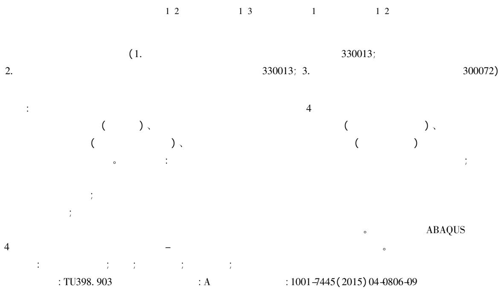

# Comparative experimental research on concrete-filled steel tubular columns subjected to axial compression

HUANG Hong 1 2 GUO Xiao-yu 1 3 CHEN Meng-cheng 1 XU Kai-cheng 1 2

( 1. School of Civil Engineering and Architecture East China Jiaotong University Nanchang 330013 China;

2. Jiangxi Key Laboratory of Control and Simulation of Construction Process Nanchang 330013 China;

3. School of Civil Engineering Tianjin University Tianjin 300072 China)

Abstract: In order to compare synthetically the mechanical behavior of 4 kinds of concrete-filled steel tubular columns under axial compression a comparative experimental research was conducted． Four section forms were included i． e． concrete-filled steel tube ( CFST) with circular section concrete-filled double-skin steel tube ( CFDST) with circular hollow section ( CHS) as both inner and outer tubes CFDST with square hollow section ( SHS) as the inner tube and CHS as the outer tube and composite concrete-filled steel tube ( CSCFST) with circular section． The research results show that the CSCFST has excellent mechanical properties as well as high bearing capacity and axial stiffness． The mechanical behavior of CFDST ( SHS inner and CHS outer) is similar to that of

: 2015-04-22; : 2015-05-15

( 51378206 51008122 51468017) ; ( 20143ACB21020) ; ( 20133BCB23015)

( 1977-) ， ; E-mail: huanghong1977@ foxmail． com 。

CFST and the ductility of CFDST ( CHS inner and CHS outer) is slightly worse than that of CFST． The development of lateral strain of outer steel tubes of CFST and CSCFST columns is faster than that of CFDST columns． Compared with CFST column the confinement of sandwiched concrete of CFDST columns provided by the outer steel tube is weaker and the section type of inner tube has little effect on the confinement of sandwiched concrete． The axial load versus strain curves of 4 members subjected to axial compression were calculated by the finite element software ABAQUS and the calculated results were close to the test results．

Key words: concrete filled steel tube; axial compression; comparative research; section form; bearing capacity

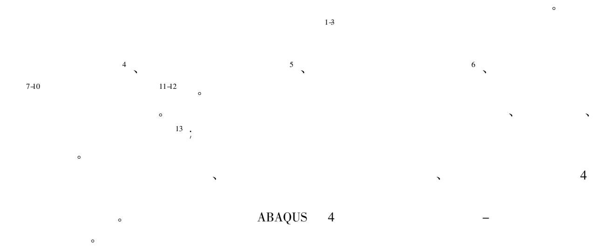

1   
1. 1

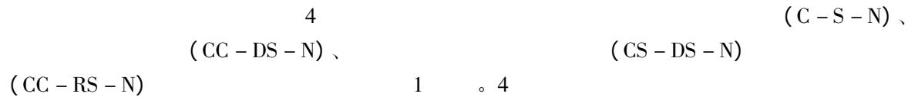

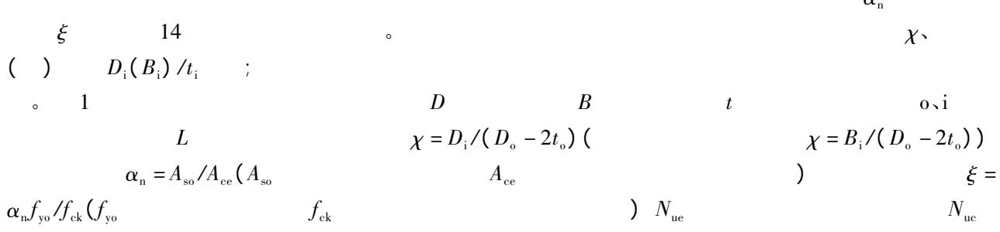

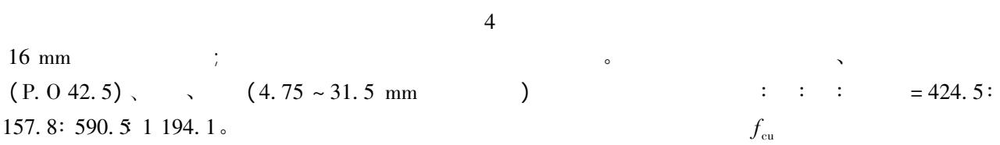

2 。

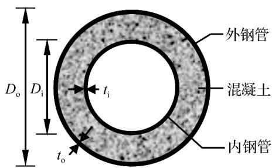  
(a)圆套圆中空夹层(CC-DS-N)

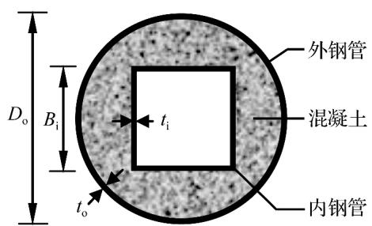  
(b)圆套方中空夹层(CS-DS-N)

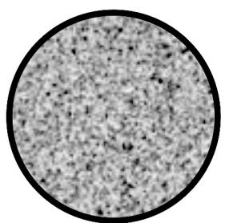  
(c)圆实心 (C-S-N)

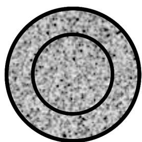  
(d)圆套圆复式(CC-RS-N)

  
Fig. 1 Cross sections of specimens


Tab. 1 Parameters of specimens   

<table><tr><td></td><td>D0/mm</td><td>t0/mm</td><td>Di(Bi)/mm</td><td>ti/mm</td><td>Di(Bi)/ti</td><td>L/mm</td><td>χ</td><td>αn</td><td>ξ</td><td>Nue/kN</td><td>Nuc/kN</td><td>Nuc/Nue</td></tr><tr><td>C-S-N</td><td>165</td><td>3.54</td><td>-</td><td>-</td><td>-</td><td>480</td><td>0</td><td>0.092</td><td>1.03</td><td>1630</td><td>1639</td><td>1.01</td></tr><tr><td>CC-DS-N</td><td>165</td><td>3.54</td><td>60</td><td>2.85</td><td>21</td><td>480</td><td>0.38</td><td>0.092</td><td>1.03</td><td>1660</td><td>1653</td><td>1.00</td></tr><tr><td>CS-DS-N</td><td>165</td><td>3.54</td><td>53</td><td>2.71</td><td>20</td><td>480</td><td>0.34</td><td>0.092</td><td>1.03</td><td>1629</td><td>1597</td><td>0.98</td></tr><tr><td>CC-RS-N</td><td>165</td><td>3.54</td><td>60</td><td>2.85</td><td>21</td><td>480</td><td>0</td><td>0.092</td><td>1.03</td><td>1876</td><td>1829</td><td>0.97</td></tr></table>

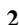

Tab. 2 Test results of material properties   

<table><tr><td colspan="2"></td><td colspan="3">3.54 mm</td><td colspan="3">2.85 mm</td><td colspan="3">2.71 mm</td></tr><tr><td>fcu/MPa</td><td>fc/MPa</td><td>fy/MPa</td><td>fu/MPa</td><td>εy/10-6</td><td>fy/MPa</td><td>fu/MPa</td><td>εy/10-6</td><td>fy/MPa</td><td>fu/MPa</td><td>εy/10-6</td></tr><tr><td>50.5</td><td>32.67</td><td>368</td><td>449</td><td>1786</td><td>394</td><td>490</td><td>1913</td><td>304</td><td>405</td><td>1476</td></tr><tr><td colspan="2">1. fcu(εy=fy/Es Es)</td><td colspan="3">fc206 GPa)。</td><td colspan="2">fy</td><td colspan="2">fu</td><td colspan="2">εy</td></tr></table>

1. 2

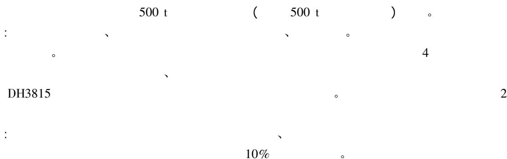

1 /10

1 /15

2 ～ 3 min

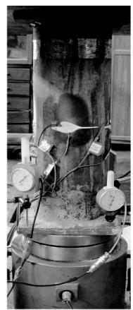  
(a)试验装置照片

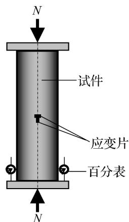  
(b)加载装置示意图

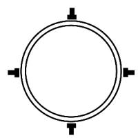  
(c)测点布置

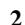  
Fig. 2 Test setup and measurement points arrangement

2

```markdown
65% ~75%  
3 C-S-N 4 CC-DS-N、CS-DS-N L/2 ； CC-RS-N 4 。 4(a) C-S-N 4(b)、4(c)、4(d) CC-DS-N、CS-DS-N、CC-RS-N 、 4(a) 4(b)、4(c)、4(d)
```

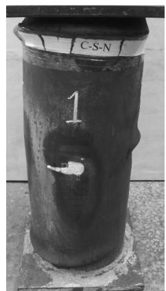  
( a) C － S － N

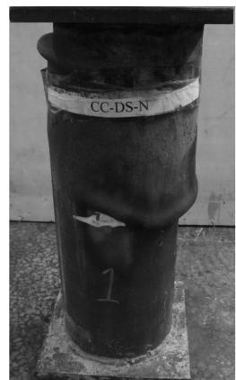  
( b) CC － DS － N

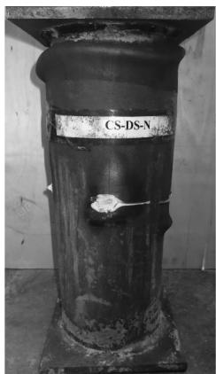  
( c) CS － DS － N

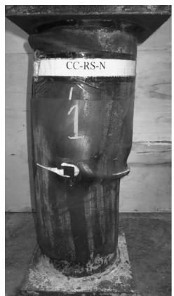  
( d) CC － RS － N

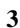  
Fig. 3 Failure modes of specimens

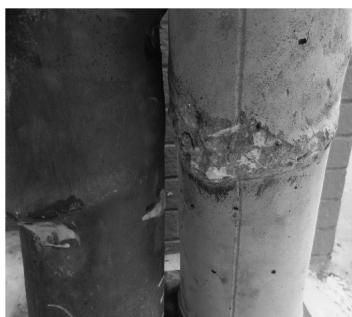  
( a) C － S － N

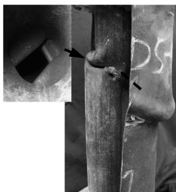  
( b) CC － DS － N

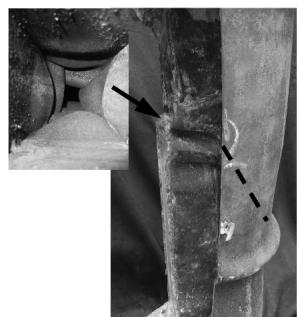  
( c) CS － DS － N

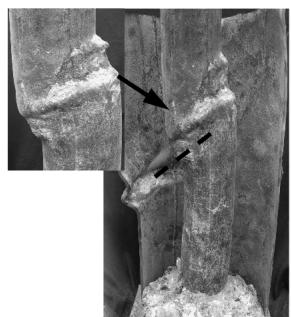  
( d) CC － RS － N

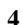  
Fig. 4 Failure modes ofconcrete and inner tubes

3

3. 1

5

①

CC － RS － N

C － S － N

; ②

( N) －

( ε )

。

CC － DS － N CS － DS － N

0. 0018

CC － RS － N ; ③

( 1)

C － S － N、 CC － DS － N、 CS － DS － N

15. 1% 13. 0%

15. 2% ; ④

C － S － N、 CS － DS － N、 CC － RS － N

N － ε

CC － DS － N

，

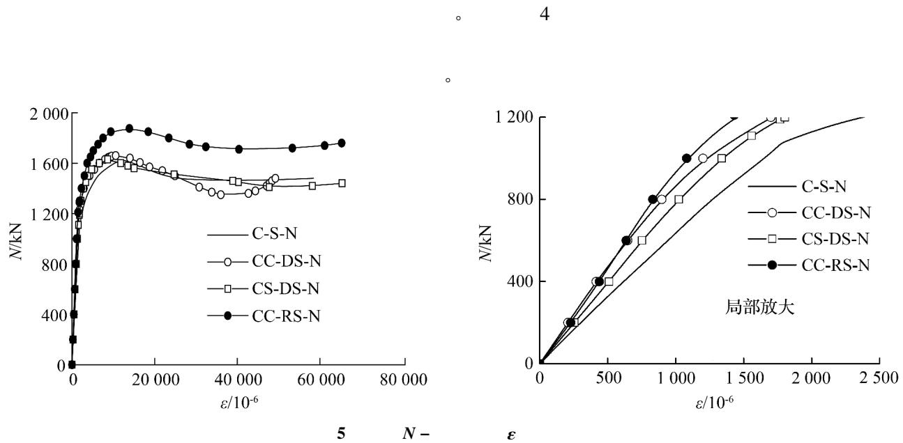  
Fig. 5 Axial load-longitudinal strain curves

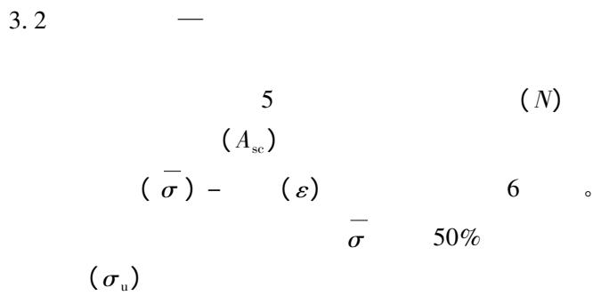

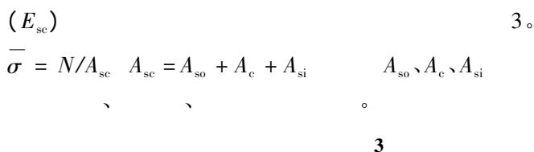

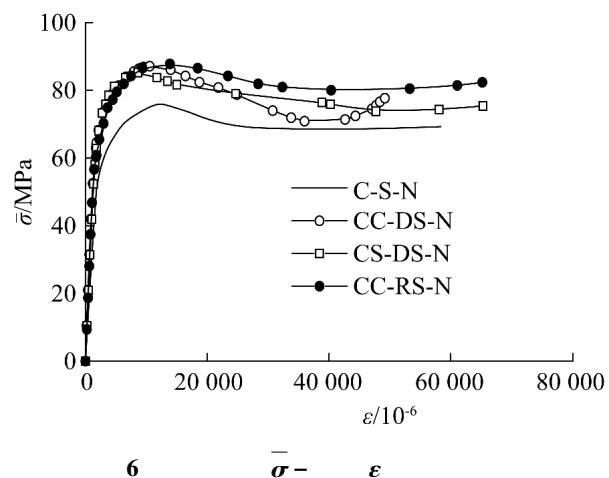  
Fig. 6 Average stress-strain curves

Tab. 3 Measured value of composite elastic modulus and axial compressive strength   

<table><tr><td></td><td>C-S-N</td><td>CC-DS-N</td><td>CS-DS-N</td><td>CC-RS-N</td></tr><tr><td>Esc/GPa</td><td>29.2</td><td>46.2</td><td>41.5</td><td>45.2</td></tr><tr><td>R²</td><td>0.9990</td><td>0.9985</td><td>0.9997</td><td>0.9990</td></tr><tr><td>σu/MPa</td><td>76.27</td><td>87.11</td><td>85.25</td><td>87.78</td></tr><tr><td>1.R²</td><td colspan="4">1</td></tr><tr><td rowspan="2">6 3</td><td rowspan="2" colspan="2">σ - ε</td><td>N - ε</td><td rowspan="2">CS - DS - N、CC -</td></tr><tr><td>。</td></tr><tr><td colspan="5">RS - N、CC - DS - N</td></tr><tr><td colspan="5">。</td></tr><tr><td colspan="2">CC - DS - N</td><td colspan="3">;</td></tr><tr><td colspan="4">CC - RS - N</td><td>CC</td></tr><tr><td>- DS - N</td><td>CC - RS - N</td><td colspan="3">。</td></tr></table>

3. 3

( εL ) 7

$$
N / N _ {\mathrm {u e}} - \varepsilon_ {\mathrm {L}} \quad \circ
$$

2

3. 4

4 εue $\varepsilon _ { \mathrm { u e } }$

$$
; N _ {\mathrm {r}} \cdot \varepsilon_ {\mathrm {r}} \quad N - \varepsilon
$$

$$
\left(\gamma = N _ {\mathrm {r}} / N _ {\mathrm {u e}}\right); S I
$$

$$
f _ {\mathrm {y i}} f _ {\mathrm {y o}} \cdot f _ {\mathrm {c}}
$$

$$
); \overline {{f _ {\mathrm {c}}}} = \left(N _ {\mathrm {u e}} - f _ {\mathrm {y o}} A _ {\mathrm {s o}} - f _ {\mathrm {y i}} A _ {\mathrm {s i}}\right) / A _ {\mathrm {c}} \quad \beta = \overline {{f _ {\mathrm {c}}}} / f _ {\mathrm {c}}
$$

。

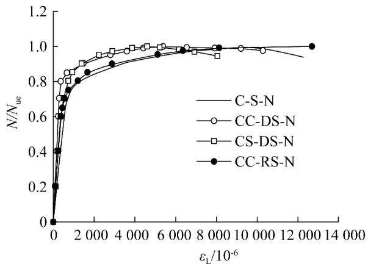  
7 N/Nue － εL  
Fig. 7 $N / N _ { \mathrm { u e } } - \varepsilon _ { \mathrm { L } }$ curves of specimens

; γ

$$
(S I = N _ {\mathrm {u e}} / N _ {\mathrm {u o}} \quad N _ {\mathrm {u o}} = f _ {\mathrm {y o}} A _ {\mathrm {s o}} + f _ {\mathrm {c}} A _ {\mathrm {c}} + f _ {\mathrm {y i}} A _ {\mathrm {s i}}
$$

$$
2 A _ {\mathrm {s i}}, A _ {\mathrm {s o}}, A _ {\mathrm {c}}
$$

4

Tab. 4 Comparison of axial compression mechanical indexes   

<table><tr><td></td><td>Nue/kN</td><td>εue/10-6</td><td>Nr/kN</td><td>εr/10-6</td><td>γ/%</td><td>Nuo/kN</td><td>SI</td><td>f_c</td><td>β</td></tr><tr><td>C-S-N</td><td>1630</td><td>12207</td><td>1460</td><td>42654</td><td>89.57</td><td>1300</td><td>1.25</td><td>49.52</td><td>1.52</td></tr><tr><td>CC-DS-N</td><td>1660</td><td>10562</td><td>1350</td><td>36008</td><td>81.33</td><td>1409</td><td>1.18</td><td>47.64</td><td>1.46</td></tr><tr><td>CS-DS-N</td><td>1629</td><td>8609</td><td>1410</td><td>47743</td><td>86.56</td><td>1374</td><td>1.19</td><td>47.88</td><td>1.47</td></tr><tr><td>CC-RS-N</td><td>1876</td><td>13879</td><td>1710</td><td>40381</td><td>91.15</td><td>1485</td><td>1.26</td><td>53.19</td><td>1.63</td></tr><tr><td>4</td><td>①</td><td></td><td></td><td colspan="6">CC-RS-N、C-S-N、CC-DS-N、CS-DS-N</td></tr><tr><td>εue</td><td>。</td><td>5</td><td></td><td>②</td><td>εr</td><td>γ</td><td colspan="3">CC-RS-N、C-S-N</td></tr><tr><td>CS-DS-N</td><td></td><td></td><td></td><td colspan="4">CC-DS-N</td><td colspan="2">③</td></tr><tr><td></td><td></td><td>SI</td><td></td><td colspan="2">2</td><td>SI</td><td></td><td></td><td></td></tr><tr><td></td><td>④</td><td>f_c</td><td>β</td><td colspan="4">CC-RS-N</td><td colspan="2">C-S-N</td></tr><tr><td>。</td><td>:</td><td></td><td></td><td>;</td><td>CC-DS-N</td><td colspan="4">CS-DS-N</td></tr></table>

4

ABAQUS 4。15 ( C3D8R) ;

1. 03;

10

2. 66 。 8

CC － RS － N

( GB 50010 － 2010)

4

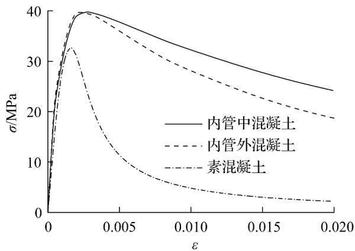  
8   
Fig. 8 Stress-strain curves of concrete

9 。

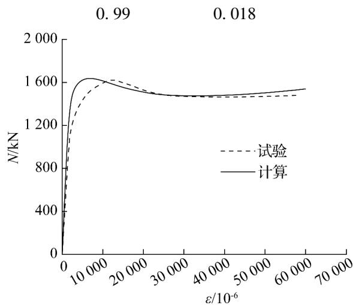  
( a) C － S － N

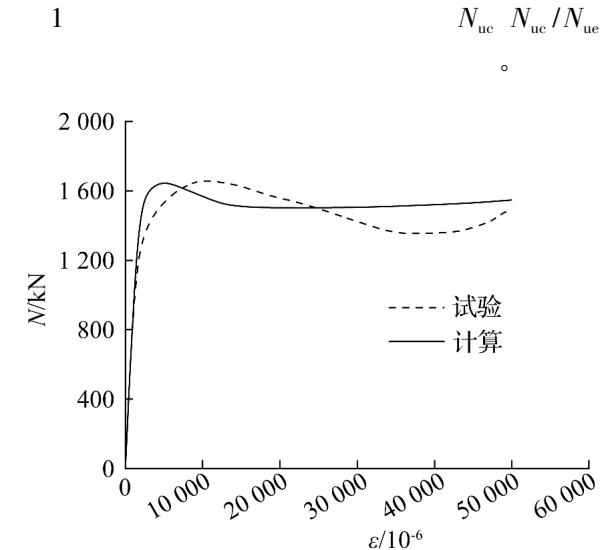  
( b) CC － DS － N

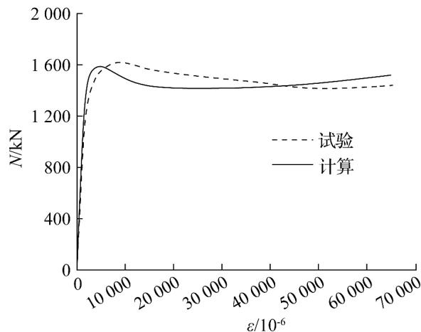  
( c) CS － DS － N

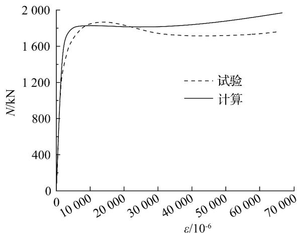  
( d) CC － RS － N  
9   
Fig. 9 Comparison between calculated and test curves

5

$\textcircled{1}$ 4   
②   
③   
④   
⑤

4

J 2010 44( 6) : 749-754．

J ． 2012

28( 6) : 974-980．

ABED F MOHAMMAD A SULIMAN A. Experimental and numerical investigations of the compressive behavior of concrete filled steel tubes ( CFSTs) ［J ． Journal of Constructional Steel Research 2013 80( 1) : 429-439．   
J ． 2014 44( 4) : 16-20．

J ． 2012 45

( 3) : 67-73．

DAI X LAM D. Numerical modelling of the axial compressive behaviour of short concrete-filled elliptical steel columns J ． Journal of Constructional Steel Research 2010 66( 7) : 931-942．   
LI W HAN L H ZHAO X L. Axial strength of concrete-filled double skin steel tubular ( CFDST) columns with preload on steel tubes J ． Thin-Walled Structures 2012 56( 7) : 9-20．   
HUANG H HAN L H ZHAO X L. Investigation on concrete filled double skin steel tubes ( CFDSTs) under pure torsion J ． Journal of Constructional Steel Research 2013 90( 11) : 221-234．

J ． 2012 37( 4) :

676-682．

J ． 2015 30( 1) : 101-110．   
J ． 2011 32( 12) :

162-169．   
J ． 2013 39 ( 6 ) :

886-891．

D ． 2006．   
J ． 2004 6( 2) : 14-22．

J ． 2009( 10) : 113-116．

( )