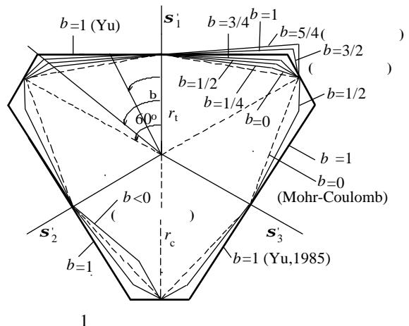
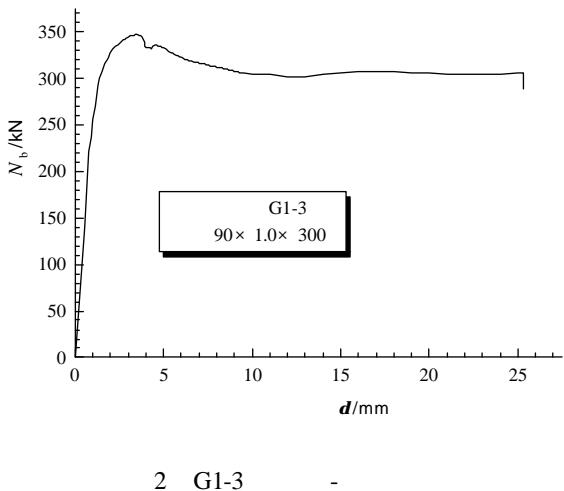

1000-4750(2002)02-032-04

(1.

1,3， 1 2

710055; 2. 710061; 3.

710061)

TU398 A

1 2

1991

s 2

1879

[8]

[1-7]，

$$
F = \boldsymbol {s} _ {1} - \frac {\boldsymbol {a}}{1 + b} \left(b \boldsymbol {s} _ {2} + \boldsymbol {s} _ {3}\right) = \boldsymbol {s} _ {t} \tag {1a}
$$

$$
\begin{array}{l} \boldsymbol {S} _ {2} \leq \frac {\boldsymbol {S} _ {1} + \boldsymbol {a} \boldsymbol {S} _ {3}}{1 + \boldsymbol {a}} \\ F ^ {\prime} = \frac {1}{1 + b} \left(\boldsymbol {s} _ {1} + b \boldsymbol {s} _ {2}\right) - \boldsymbol {a} \boldsymbol {s} _ {3} = \boldsymbol {s} _ {t} \tag {1b} \\ \end{array}
$$

$$
\boldsymbol {s} _ {2} \geq \frac {\boldsymbol {s} _ {1} + \boldsymbol {a} \boldsymbol {s} _ {3}}{1 + \boldsymbol {a}}
$$

s2 1 2 s , s s 3

$$
\begin{array}{c c} \boldsymbol {S} _ {t} & \boldsymbol {S} _ {c} \end{array}
$$

$$
\boldsymbol {a} = \boldsymbol {s} _ {t} / \boldsymbol {s} _ {c}
$$

b

p 1

2000-08-20； 2001-02-10

(59779028)

(1960)，

(1953)，

(1958)，

  
Fig.1 Various limit loci of twin shear unified strength theory

a 0.07~0.15

b=1/2~3/4

b=1/2

( (1a) (1b)

$$
b = \frac {1}{2})
$$

Gachon

[9]。

$$
0 > \boldsymbol {S} _ {1} = \boldsymbol {S} _ {2} > \boldsymbol {S} _ {3}
$$

(1a)(1b)

c f

$$
F ^ {\prime} - F = b \left(\boldsymbol {t} _ {2 3} + \boldsymbol {s} _ {2 3} \sin \boldsymbol {j} - \boldsymbol {t} _ {1 2} - \boldsymbol {s} _ {1 2} \sin \boldsymbol {j}\right)
$$

$$
\boldsymbol {t} _ {2 3} = \frac {\boldsymbol {S} _ {2} - \boldsymbol {S} _ {3}}{2}, \quad \boldsymbol {S} _ {2 3} = \frac {\boldsymbol {S} _ {2} + \boldsymbol {S} _ {3}}{2},
$$

$$
\boldsymbol {t} _ {1 2} = \frac {\boldsymbol {S} _ {1} - \boldsymbol {S} _ {2}}{2}, \quad \boldsymbol {S} _ {1 2} = \frac {\boldsymbol {S} _ {1} + \boldsymbol {S} _ {2}}{2}
$$

$$
F ^ {\prime} - F = b (1 - \sin \boldsymbol {j}) (\boldsymbol {s} _ {1} - \boldsymbol {s} _ {3}) \geq 0
$$

$$
F ^ {\prime} = \boldsymbol {t} _ {1 3} + b \boldsymbol {t} _ {2 3} + \sin \boldsymbol {j} (\boldsymbol {s} _ {1 3} + b \boldsymbol {s} _ {2 3}) = (1 + b) c \sin \boldsymbol {j}
$$

$$
\boldsymbol {S} _ {1} = \boldsymbol {S} _ {2},
$$

$$
\frac {1 + b}{2} \left(\boldsymbol {s} _ {1} - \boldsymbol {s} _ {3}\right) + \frac {1 + b}{2} \left(\boldsymbol {s} _ {1} + \boldsymbol {s} _ {3}\right) \sin \boldsymbol {j} = (1 + b) c \sin \boldsymbol {j}
$$

$$
- \boldsymbol {s} _ {3} = \frac {2 c \cos \boldsymbol {j}}{1 - \sin \boldsymbol {j}} - \frac {1 + \sin \boldsymbol {j}}{1 - \sin \boldsymbol {j}} \boldsymbol {s} _ {1}
$$

c f ，

$$
f _ {t} \quad f _ {c}
$$

$$
\boldsymbol {S} _ {3} = f _ {c} \quad \boldsymbol {S} _ {1} = \boldsymbol {S} _ {2} = 0
$$

$$
\frac {2 c \cos \boldsymbol {j}}{1 - \sin \boldsymbol {j}} = f _ {c}
$$

$$
k = \frac {1 + \sin \boldsymbol {j}}{1 - \sin \boldsymbol {j}}
$$

$- \pmb { S } _ { 3 } = f _ { c } - k \pmb { S } _ { 1 }$ (2)

(2)

b

。G. G. Meyerhof. N. M. Hawkins

b

50

30，

k 7.5~3.0

$$
k = 1. 5 \sim 3
$$

3.1

$$
4 2 5 \quad 1 \sim 2
$$

$$
\mathrm {C}: \mathrm {S}: \mathrm {G}: \mathrm {W} = 1: 1. 5 1: 3. 4 4: 0. 3 8
$$

0.38，

C30。

90mm 1.0mm 1.2mm

1.5mm

300mm，

28

3.2

$$
\boldsymbol {S} _ {s} = 3 2 8. 9 5 \mathrm {M P a}
$$

$$
f _ {c} = 3 6. 4 \mathrm {M P a}
$$

$$
f _ {c y} = 0. 7 9 f _ {c} = 2 8. 8 \mathrm {M P a} \tag {4}
$$

1

G1-3

2

4

[5]，

$$
N _ {b} = f _ {c} ^ {\prime} A _ {c} + A _ {g} \mathbf {s} _ {s} \tag {3}
$$

$$
N _ {b}
$$

$$
A _ {c}
$$

$$
f _ {c} ^ {\prime}
$$

$$
A _ {g}
$$

$$
\boldsymbol {S} _ {s}
$$

(2)

$$
- \boldsymbol {S} _ {3} = f _ {c} - k \boldsymbol {S} _ {1} \tag {2}
$$

1

Table 1 Experimental results for concrete-filled steel tubes under centric compression   

<table><tr><td></td><td>D× t× l(mm)</td><td>(%)</td><td>(mm)</td><td>(kN)</td><td>(kN)</td></tr><tr><td>G1-1</td><td>90× 1.0× 300</td><td>4.40</td><td>3.2</td><td>348.8</td><td></td></tr><tr><td>G1-2</td><td>90× 1.0× 300</td><td>4.40</td><td>3.4</td><td>341.9</td><td>345.7</td></tr><tr><td>G1-3</td><td>90× 1.0× 300</td><td>4.40</td><td>3.5</td><td>346.5</td><td></td></tr><tr><td>G2-1</td><td>90× 1.2× 300</td><td>5.26</td><td>3.4</td><td>358.1</td><td></td></tr><tr><td>G2-2</td><td>90× 1.2× 300</td><td>5.26</td><td>3.6</td><td>351.2</td><td>356.6</td></tr><tr><td>G2-3</td><td>90× 1.2× 300</td><td>5.26</td><td>3.4</td><td>360.5</td><td></td></tr><tr><td>G3-1</td><td>90× 1.5× 300</td><td>6.55</td><td>4.6</td><td>390.7</td><td></td></tr><tr><td>G3-2</td><td>90× 1.5× 300</td><td>6.55</td><td>4.4</td><td>390.7</td><td>387.6</td></tr><tr><td>G3-3</td><td>90× 1.5× 300</td><td>6.55</td><td>4.6</td><td>381.4</td><td></td></tr></table>

  
Fig.2 Loads versus deformation of G1-3

(2)

$$
\boldsymbol {S} _ {3} = f _ {c} + k \boldsymbol {S} _ {1} \tag {4}
$$

(4)

s 3

$$
\begin{array}{c c} f _ {c} ^ {\prime} & f _ {c} \end{array}
$$

$f _ { c }$

(4)

$$
f _ {c} ^ {\prime} = f _ {c y} + k \mathbf {s} _ {1} \tag {5}
$$

s r ，

$$
\boldsymbol {S} _ {r} = \frac {2 t}{D} \boldsymbol {S} _ {s} \tag {6}
$$

$$
f _ {c y} = 2 8. 8 \mathrm {M P a} \quad k = 1. 5 \quad \boldsymbol {S} _ {r} \quad \boldsymbol {S} _ {1}
$$

$$
\boldsymbol {S} _ {s} = 3 2 8. 9 5 \mathrm {M P a}
$$

(6) (5) (3)

$$
\boldsymbol {s} _ {r} \quad f _ {c} ^ {\prime} \quad N _ {b} \tag {2}
$$

Table 2 Analysis of experimental results   

<table><tr><td></td><td>Ss(MPa)</td><td>Sr(MPa)</td><td>f′c(MPa)</td><td>(kN)</td><td>(kN)</td><td>(kN)</td><td>(kN)</td><td>(%)</td></tr><tr><td>G1-1</td><td></td><td></td><td></td><td></td><td></td><td></td><td>348.8</td><td>4.47</td></tr><tr><td>G1-2</td><td>328.95</td><td>7.31</td><td>39.77</td><td>241.89</td><td>91.97</td><td>333.86</td><td>341.9</td><td>2.41</td></tr><tr><td>G1-3</td><td></td><td></td><td></td><td></td><td></td><td></td><td>346.5</td><td>3.79</td></tr><tr><td>G2-1</td><td></td><td></td><td></td><td></td><td></td><td></td><td>358.1</td><td>1.35</td></tr><tr><td>G2-2</td><td>328.95</td><td>8.77</td><td>41.96</td><td>252.89</td><td>110.12</td><td>363.01</td><td>351.2</td><td>3.25</td></tr><tr><td>G2-3</td><td></td><td></td><td></td><td></td><td></td><td></td><td>360.5</td><td>0.69</td></tr><tr><td>G3-1</td><td></td><td></td><td></td><td></td><td></td><td></td><td>390.7</td><td>3.82</td></tr><tr><td>G3-2</td><td>328.95</td><td>10.97</td><td>45.26</td><td>269.02</td><td>137.19</td><td>406.22</td><td>390.7</td><td>3.82</td></tr><tr><td>G3-3</td><td></td><td></td><td></td><td></td><td></td><td></td><td>381.4</td><td>6.11</td></tr></table>

5

[1] [M]. , 1996.

Han Linhai, Zhong Shantong. Mechanics of concrete filled steel tubes[M]. Dalian: Dalian University of Technology Press, 1996.

[2] [J]. , 1985, (1): 32-40.

Cai Shaohuai, Gu Wanli. Behavior and ultimate strength of long concrete-filled steel tubular columns[J]. Journal of Building Structures, 1985, (1): 32-40.(in Chinese)

[3] W F Chen. Plasticity in Reinforced Concrete[M]. New

Youk: McGraw-Hill Book Company, 1982.   
[4]   
[J]. , 1984, (6): 13-29.   
Cai Shaohuai, Jiao Zhanshuan. Behavior and ultimate strength of short concrete-filled steel tubular columns[J]. Journal of Building Structures, 1984, (6): 13-29.(in Chinese)   
[5]   
[J]. , 1982, (1): 13-31.   
Tang Guanzuo, Zhao Bingquan, Zhu Huixian, Shen Ximin. Fundamental structural behavior of concrete filled steel tubular columns[J]. Journal of Building Structures, 1982, (1): 13-31.(in Chinese)   
[6]   
[J]. , 1980, (1): 61-71.   
Zhong Shantong, Wang Yongchun. Theory of axial compression member of concrete filled steel tubes[J]. Journal of Building Structures, 1980, (1): 61-71.(in

Chinese)   
  
[J]. , 1984, (6): 38-48.   
Zhong Shantong, Miao Ruoyu. Computation of bearing capacity of concrete-filled steel tubular members subjected to axial compressive loading[J]. Journal of Building Structures, 1984, (6): 38-48.(in Chinese)   
[8]   
[M].   
, 1992.   
Yu Maohong. New system of strength theory[M]. Xi’an: Xi’an Jiaotong University Press, 1992.(in Chinese)   
[9]   
[J]. , 1998, (4):   
1-9.   
Zhao Junhai, Yu Maohong, Liu Yunhe, Zhang Yongqiang. Unified strength theory for concrete and its applications[J]. Journal of Northwestern Institute of Architectural Engineering, 1998, (4): 1-9.(in Chinese)

# THE STUDY OF THE AXIAL COMPRESSIVE STRENGTH OF CONCRETE FILLED STEEL TUBE (CFST) BASED ON THE TWIN SHEAR UNIFIED STRENGTH THEORY

ZHAO Jun-hai1,3 , GU Qiang1 , MA Shu-fang2

(1. School of Civil Engineering, Xi'an University of Architecture & Technology, Xi'an 710055; 2. The State-owned No.262 Factory, Xi'an 710061; 3. School of Civil Engineering, Chang’an University, Xi’an 710061)

Abstract: For strain-constrained concrete cylinders in CFST, formulae of compressive strength were presented based on the Twin Shear Unified Strength Theory. Axial compressive tests of CFST were conducted and curves of deformation versus limit load were obtained from the tests. Predictions from the derived formulae were compared with test results and satisfactory agreements were reached. It is concluded that the Twin Shear Unified Strength Theory is versatile in theoretical analyses of CFST.

Key words: concrete filled steel tube; twin shear unified strength theory; strain-constrained concrete cylinders