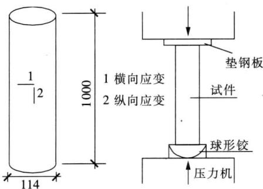
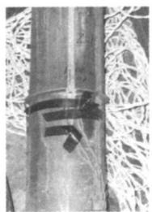
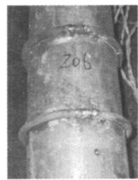
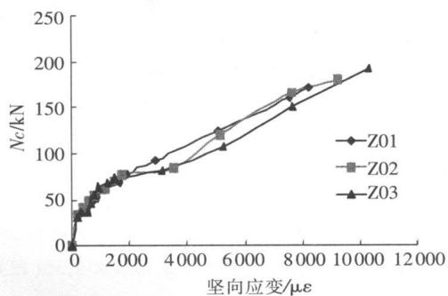
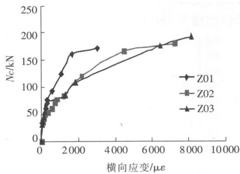
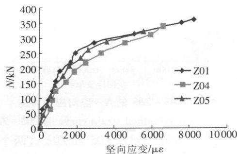
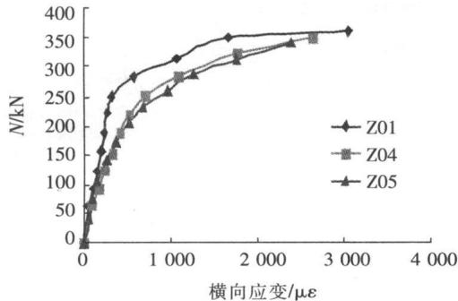
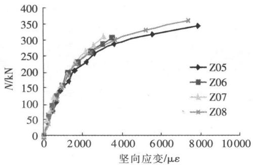

文章编号：1006－0456（2009）01－0099－04

# 圆形薄壁钢管混凝土柱轴压性能的试验研究

李艳 占美森 熊进刚

（南昌大学 建筑工程学院‚江西 南昌 330031）

摘要 制作了 根薄壁圆形钢管混凝土柱试件 进行了薄壁圆形钢管混凝土柱的轴心受压试验 考察径厚比长径比和环箍等因素对其受压性能的影响 对试验现象 破坏形态进行了描述 量测并分析了试件的极限承载力钢管壁的纵向与横向应变 研究结果表明 圆形薄壁钢管对核心混凝土有着较好的约束作用 但径厚比对约束程度的影响并不明显 圆形薄壁钢管柱的承载力较名义承载力有显著提高 长径比越大 圆形薄壁钢管越容易发生屈曲；环箍能对薄壁钢管提供较好约束‚延缓钢管的局部屈曲‚提高柱的承载力。

关键词 钢管混凝土 薄壁钢管 承载性能 轴心受压

中图分类号 TU 文献标识码：A

# ExperimentalResearchonPropertiesofConcreteFilled ThinWalledSteelTubeColumnunderAxialCompression

LIYan‚ZHANMei-sen‚XIONGJin-gang

（SchoolofArchitecturalEngineering‚NanchangUniversity‚Nanchang330031‚China）

Abstract：Eightconcretefilledthinwalledsteeltubecolumnsaremadeandthepropertiesofconcretefilled thin-walledsteeltubecolumnsunderaxialcompressionarestudiedinthispaper．ThefactorsincludingD／tratio‚ L／Dratioandannularhoopbararediscussed．Thephenomenonofexperimentandtheformofcollapseofthespecimensaredescribed‚thentheultimatecapacityandthestrainoftubularareanalysedindetail．Thecoreconcreteis confinedstronglybythin-walledsteeltube．ConfiningdegreeisaffectedlightlybyD／tratio．Thebearingcapacity oftheconcrete-filledthin-walledsteeltubecolumnislargerthannominalbearingcapacity．Buckleofthin-walled steeltubeismoreeasytohappenwithlargerL／Dratio．Annularhoopbarscanstronglyconfinethecoreconcrete andimprovethebearingcapacityoftheconcrete-filledthin-walledsteeltubecolumn

KeyWords：concretefilledsteeltube；thinwalledsteeltubular；mechanicalproperty；axialcompression

钢 混凝土组合结构在工程中的应用 是当前国内外建筑结构发展的重要方向之一 其共同工作性能的研究 是土木工程界普遍重视的一个重要课题。钢管混凝土是一种新型的组合结构型式‚即在钢管内填充混凝土 将两种不同性质的材料组合而形成的组合结构 管内一般只填素混凝土 不再配钢筋 钢管对混凝土变形产生约束 使混凝土处于复杂应力状态 从而使混凝土强度 塑性以及韧性性能大为改善 同时由于混凝土的变形 使钢管亦处于复杂应力状态 通过二者的结合 使其受力性能优于两种材料性能的简单叠加 具有抗震性能佳 施工简单 耐火性能好 经济效果显著等优点 具有相当好

的应用前景［1－4］。 薄壁钢管混凝土是指其横截面径厚比 $\textnormal { D } / \mathrm { t } ( \textnormal { D }$ 为钢管外径‚t为钢管壁厚 大于对应受压构件中空钢管局部稳定限值 倍的情况［3］ 在钢管混凝土工程中采用薄壁钢管‚可以减少钢材用量 减轻焊接工作量 达到降低工程造价的目的 在小高层及多层建筑中推广使用有着广阔的前景和积极的意义［5－12］ 目前在日本和澳大利亚已有不少采用薄壁钢管混凝土建筑的报道 本文对薄壁钢管混凝土柱的试件设计 制作 加载方法和量测项目等内容进行介绍 根据本次试验的数据 对带环箍的薄壁钢管混凝土柱的试验现象 破坏形态作了阐述 对试件的极限承载力 钢管的纵向与横向应变作了分析

# 1 试验概况

# 1．1 试件设计和制作

制作了 根薄壁圆形钢管混凝土柱试件 考虑三个影响因素：径厚比、长径比、约束环箍‚通过轴心受压试验‚研究圆形薄壁钢管混凝土柱的承载性能。

薄壁圆形钢管混凝土柱试件主要参数见表编号为 ${ \bf Z } ^ { 0 1 } { \sim } { \bf Z } ^ { 0 8 } ,$ 第一组三个试件 ${ \bf Z } ^ { 0 1 } { \sim } { \bf Z } ^ { 0 3 }$ 改变钢管壁厚 分别是 $\mathrm { 1 . ~ 4 2 ~ m m , 1 . ~ 9 4 ~ m m }$ 和 $2 \ 7 8 \ \mathrm { m m }$ ，除强度外其余参数相同；第二组试件 ${ \bf Z } ^ { 0 4 }$ 和 ${ \bf Z } ^ { 0 5 }$ 仅改变试件高度 分别为 $8 0 0 \mathrm { { \ m m } }$ 和 $1 \ 0 0 0 _ { \mathrm { m m } } ,$ 其余参数与 Z01相同；第三组试件 ${ \bf Z } ^ { 0 6 } { \sim } { \bf Z } ^ { 0 8 } ,$ ‚增设环箍 $\Phi 8$ $( \omega \ : 1 0 0 , \Phi 8 @ 1 8 0 \ : \mathrm { m m }$ $\textcircled{ a}$ 和 $\Phi 8 @ ~ 3 0 0 ,$ 其余参数与 $Z ^ { 0 5 }$ 相同。

# 1．2 材料强度

混凝土轴心抗压强度实测值是 $9 . \ 2 7 \ \mathrm { N / m m } ^ { 2 }$ 。钢材强度 试件用到三种不同厚度的钢板 分别是mm $1 \ 9 4 \ \mathrm { m m }$ 和 $2 . 7 8 \mathrm { { m m } _ { \mathrm { { o } } } }$ 测得其极限强度 $\mathbf { f } _ { \mathrm { u } }$ 分别为 $4 4 3 . \mathrm { ~ 3 ~ N ~ / m m } ^ { 2 }$ $4 5 5 . \mathrm { ~ 5 ~ N ~ / m m } ^ { 2 }$ 和 $3 9 0 . \mathrm { ~ 3 ~ N ~ } /$ $\mathrm { m m } ^ { 2 }$ 屈服强度 f分别是 $3 7 6 . \mathrm { ~ 6 ~ N ~ / m m } ^ { 2 } .$ $3 8 7 . \ 2 \mathrm { ~ N ~ } /$ $\mathrm { m m } ^ { 2 }$ 和 $3 3 1 \mathrm { ~ 8 ~ N ~ / m m } ^ { 2 } .$ 弹性模量 $\mathrm { E } = 2 \ 0 \times 1 0 ^ { 5 } \ \mathrm { N } \ /$ $\mathrm { m m } ^ { 2 }$ ‚相应屈服应变分别为 $\mathfrak { E } _ { \mathrm { y } } = 1 \ 8 8 3 \mu _ { \mathfrak { E } _ { \mathrm { y } } } \mathfrak { e } _ { \mathrm { y } } = 1 \ 9 3 6$ $\mathfrak { e } _ { \mathrm { g } } = 1 \ 9 3 6$ $\mu _ { \mathfrak E }$ 和 $\mathfrak { e } _ { \mathrm { y } } = 1 6 5 9 \ \mu \mathfrak { e } _ { \circ }$

表1 试件主要参数表  
Tab．1 Parameteroftestcolumns   

<table><tr><td>试件编号</td><td>钢管壁厚</td><td>砼等级</td><td>钢管外径D</td><td>试件长度</td><td>环箍间距</td><td>环箍直径</td></tr><tr><td>Z01</td><td>1.42</td><td>C20</td><td>114</td><td>500</td><td>-</td><td>-</td></tr><tr><td>Z02</td><td>1.94</td><td>C20</td><td>114</td><td>500</td><td>-</td><td>-</td></tr><tr><td>Z03</td><td>2.78</td><td>C20</td><td>114</td><td>500</td><td>-</td><td>-</td></tr><tr><td>Z04</td><td>1.42</td><td>C20</td><td>114</td><td>800</td><td>-</td><td>-</td></tr><tr><td>Z05</td><td>1.42</td><td>C20</td><td>114</td><td>1000</td><td>-</td><td>-</td></tr><tr><td>Z06</td><td>1.42</td><td>C20</td><td>114</td><td>1000</td><td>100</td><td>8</td></tr><tr><td>Z07</td><td>1.42</td><td>C20</td><td>114</td><td>1000</td><td>180</td><td>8</td></tr><tr><td>Z08</td><td>1.42</td><td>C20</td><td>114</td><td>1000</td><td>300</td><td>8</td></tr></table>

注 环箍直径为 $8 \ \mathrm { m m } ,$ 测得环箍的屈服强度 $\mathrm { f _ { y } = 3 5 7 . ~ 4 8 ~ N / m m ^ { 2 } }$ 弹性模量 $\mathrm { { E } = 2 \ N \times 1 0 ^ { 5 } \ N / m m ^ { 2 } } ,$ ‚相应屈服应变为 $\mathfrak { e } _ { \mathrm { y } } = 1 7 0 2 \mu \mathfrak { e } _ { \circ }$ 。

# 13 加载与量测方法

试验在南昌大学土木工程实验中心进行 采用$2 ~ 0 0 0 ~ \mathrm { k N }$ 压力试验机完成。加压时‚在试件的下端放置球铰 在试件的上端放置钢板 在试件的中段布置电阻应变片 以测量柱中钢板的竖向和横向的应变 应变片布置及加载装置示意图见图

# 2 试验结果与分析

# 2．1 试验现象及破坏形态

试件在加载过程中 由于混凝土对钢板的挤压钢板都不同程度地出现了纹络 薄壁圆形钢管混凝土柱均是在柱中段附近向外鼓起 直至核心混凝土被压碎而破坏 有的柱子还在柱中段附近形成几处鼓起‚最终沿其中一处较薄弱处破坏。

  
图1 应变片布置及加载装置示意图  
Fig．1 Strain-flakearrangementandloadinginstallation

对于加设了环箍的试件来说 其破坏形态和无环箍的试件基本相同 但环箍对薄壁钢管起到了约束效果‚延缓了钢管的外鼓‚提高了薄壁钢管混凝土试件的承载力 典型破坏形态如图 所示

  
  
图2 典型破坏形态  
Fig．2 Representativefailureform

# 2．2 极限承载力

试件轴心受压名义承载力 $\mathrm { N _ { m } }$ 取钢管和混凝土两种材料轴心受压承载力的叠加：

$$
\mathrm {N} _ {\mathrm {m}} = \mathrm {A} _ {\mathrm {s}} \mathrm {f} _ {\mathrm {v}} + \mathrm {A} _ {\mathrm {c}} \mathrm {f} _ {\mathrm {c}} \tag {1}
$$

其中： $\mathrm { A } _ { \mathrm { s } }$ 为钢管壁横截面面积；f为钢管抗压强度实测值； $\mathrm { A _ { c } }$ 为核心混凝土横截面面积；f为混凝土轴心抗压强度实测值。

表 列出了各个试件的试验极限承载力。表中 $\Nu _ { \mathrm { s } }$ 为实测的轴心受压极限承载力； $\mathrm { N _ { m } }$ 为轴心受压名义承载力。

从表 可知‚总体上来讲‚圆形薄壁钢管混凝土柱的轴心受压承载力比其名义承载力有着较大的提高。其中 Z 的试验结果更是比名义承载力提高了 $3 3 \%$ ‚说明圆形薄壁钢管混凝土柱的轴压承载力比钢管和混凝土两种材料各自承载力的叠加有着较

表 2 圆形柱轴压承载力  
Tab．2 Compressivecapacityofcirclecolumns   

<table><tr><td>类别组别</td><td>试件编号</td><td>柱高/mm</td><td>环箍间距/mm</td><td>Ns/kN</td><td>Nm/kN</td><td>Ns/Nm</td></tr><tr><td rowspan="3">第一组</td><td>Z01</td><td>500</td><td>-</td><td>376</td><td>281.7</td><td>1.33</td></tr><tr><td>Z02</td><td>500</td><td>-</td><td>453</td><td>355.6</td><td>1.27</td></tr><tr><td>Z03</td><td>500</td><td>-</td><td>514</td><td>412.1</td><td>1.24</td></tr><tr><td rowspan="3">第二组</td><td>Z01</td><td>500</td><td>-</td><td>376</td><td>281.7</td><td>1.33</td></tr><tr><td>Z04</td><td>800</td><td>-</td><td>359</td><td>281.7</td><td>1.27</td></tr><tr><td>Z05</td><td>1000</td><td>-</td><td>353</td><td>281.7</td><td>1.25</td></tr><tr><td rowspan="4">第三组</td><td>Z06</td><td>1000</td><td>100</td><td>373</td><td>281.7</td><td>1.32</td></tr><tr><td>Z07*</td><td>1000</td><td>180</td><td>-</td><td>281.7</td><td>-</td></tr><tr><td>Z08</td><td>1000</td><td>300</td><td>362</td><td>281.7</td><td>1.28</td></tr><tr><td>Z05</td><td>1000</td><td>-</td><td>353</td><td>281.7</td><td>1.25</td></tr></table>

注 Z 试件由于在试验过程中试件偏心严重 故中途停止加载 未按预期完成试验

# 2．3 径厚比的影响

第一组 ${ \bf Z } ^ { 0 1 \sim } { \bf Z } ^ { 0 3 }$ 三个试件所用钢材不是同一种类型 壁厚 强度均不同 不便直接对其承载力做比较 故考察核心混凝土的实际承载力 $\mathrm { N } _ { \mathrm { c o } }$ 。令试件所受压力为 N‚钢管所受压力 ${ \mathrm { N } _ { \mathrm { s } } } ^ { = } { \sigma _ { \mathrm { s } } } { \mathrm { A } _ { \mathrm { s } } } ^ { , }$ ‚则核心混凝土所承受的压力 $\Nu _ { \mathrm { c } } = \Nu - \Nu _ { \mathrm { s o } }$ 。图 给出了 ${ \bf Z } ^ { 0 1 } ,$ Z 和 Z 三个试件的核心混凝土承载力 Nc 竖向应变关系曲线

  
图 3 Z01、Z02和 Z03的 Nc～竖向应变曲线  
Fig．3 Nc～longitudinalstraincurveofZ01‚Z02andZ03

从图 可以看出 圆形薄壁钢管混凝土柱试件在其钢管竖向应变超过钢管的屈服应变以后 ZZ 和 Z 三个试件钢材的屈服应变分别为$\mu \mathfrak { e } , 1 \ 9 3 6 \ \mu \mathfrak { e }$ 和 $1 \ 6 5 9 \ \mu \varepsilon ,$ 还有着相当大的承载能力 试件破坏时 竖向极限应变都在 $1 0 \ 0 0 0 \ \mu \varepsilon$ 左右 说明圆形截面形式的钢管对核心混凝土有着良好的约束作用。

Z Z 和 $\mathbf { Z } ^ { 0 3 }$ 这三个试件的钢管壁厚分别是mm mm和 $2 \ 7 8 \ \mathrm { m m }$ 它们的管径都是$1 1 4 ~ \mathrm { m m }$ 所以其径厚比分别是 和通过计算得出 Z Z 和 Z 这三个试件在破坏时 其核心混凝土所承担的压力 Nc分别为

$\mathrm { k N , 1 8 8 . 7 ~ k N }$ 和 $1 9 1 \ 1 \ \mathrm { k N _ { o } }$ 比较 ${ \bf Z } ^ { 0 1 \sim } { \bf Z } ^ { 0 3 }$ 径厚比分别是 和 知 随径厚比减小 核心混凝土的实际承载力稍有提高 但不明显 表明达到承载力极限时 薄壁钢管对核心混凝土的约束程度不因径厚比的降低而明显提高 （前提是柱达到承载力极限时‚薄壁钢管已达到屈服）。

  
图 4 Z01、Z02和 Z03的 Nc～横向应变曲线  
Fig．4 Nc-horizontalstraincurveofZ01‚Z02andZ03

图 给出了这三个试件的 Nc 横向应变曲线从图 可以看出 在达到承载力极限时 钢管壁的横向应变均超过了屈服应变 且 Z 的横向极限应变最小 Z 的最大 说明径厚比越大 钢管壁横向极限应变越小。

# 2．4 长径比的影响

Z Z 和 Z 这组试件在本次试验中是为了考察长径比对轴压性能的影响 这三个试件采用的是同一种规格的钢管 其余参数均相同 只有柱子的高度不同‚Z01、Z04和 ${ \bf Z } ^ { 0 5 }$ 的高度分别为 $5 0 0 ~ \mathrm { m m }$ 、$8 0 0 \mathrm { { m m } }$ 和 $1 \ 0 0 0 _ { \mathrm { m m } _ { \circ } }$ 。这三个试件的 N～竖向应变关系曲线如图 所示 图中纵坐标采用的是试件的极限承载力。

  
图 5 Z01、Z04和 Z05的 N～竖向应变曲线  
Fig．5 N-longitudinalstraincurveofZ01‚Z04andZ05

从图可以看出 圆形薄壁钢管混凝土柱试件在其钢管竖向应变超过屈服应变以后 还有着相当大的承载能力 极限极应变都在 $1 0 \ 0 0 0 \ \mu \varepsilon$ 左右 不过随着柱子长度的增加 试件的极限承载力有所降

低 而且试件的竖向极限应变也有所减少 由图及表 可知 长径比对薄壁圆形钢管混凝土柱的承载力影响较大 长径比越小 承载能力越高

图 是 Z Z 和Z 三个试件的N 横向应变曲线。从图中可以看出‚在达到承载力极限时‚钢管壁的横向应变均超过了屈服应变 且 Z 试件的横向极限应变最大‚Z05试件的横向极限应变最小说明长径比越大‚钢管壁横向极限应变越小。

  
图 6 Z01、Z04和 Z05的 N～竖向应变曲线  
Fig．6 N～horizontalstraincurveofZ01‚Z04andZ05

# 2．5 环箍的影响

Z Z Z 和 Z 这组试件在本次试验中是为了考察环箍对轴压承载性能的影响 $Z ^ { 0 5 }$ 试件没有设置环箍 Z Z 和 Z 三个试件的环箍间距分别是 $1 0 0 ~ \mathrm { { m m } }$ 、 $1 8 0 ~ \mathrm { m m }$ 和 $3 0 0 \ \mathrm { m m } _ { \circ }$ 。在试验过程中 由于Z 试件出现了严重偏心 导致试验没有按预期完成 ${ \bf Z } ^ { 0 6 }$ 试件由于接近破坏前 应变脱落 而没有测出破坏前的应变。 ${ \bf Z } ^ { 0 5 } { \sim } { \bf Z } ^ { 0 8 }$ 的 N～竖向应变关系曲线如图7所示。

  
图7 ${ \cal Z } ^ { 0 5 } { \sim } { \cal Z } ^ { 0 8 }$ 的 N～竖向应变曲线  
Fig．7 N～longitudinalstraincurveof ${ \cal Z } ^ { 0 5 } { \sim } { \cal Z } ^ { 0 8 }$

结合表 和图 对比 Z 和 Z 这两个试件发现 Z 试件的极限承载力比 Z 试件提高了$3 \%$ 这说明环箍对圆形钢管混凝土柱的极限承载力的提高有一定的作用 只不过Z 试件的环箍间距较大 所以提高幅度有限

另外 虽然 Z 和 Z 这两根试件的试验曲线不完整 但从极限承载力之前的数据来看 这两根试

验曲线在上方‚说明在总体上还是反映出了其特点：环箍间距越密 对薄壁钢管的约束越好 薄壁钢管混凝土柱轴压承载力越大

# 3 结论

1）尽管钢管管壁较薄‚但其对核心混凝土仍有较强的约束作用。圆形薄壁钢管混凝土柱试件在其钢管竖向应变超过屈服应变以后 还有着相当大的承载能力。  
2）圆形薄壁钢管对核心混凝土的约束程度不因径厚比的降低而明显提高  
长径比对薄壁圆形钢管混凝土柱承载力影响较大 长径比越大 圆形薄壁钢管越容易发生屈曲  
带环箍的圆形薄壁钢管混凝土柱 环箍能对薄壁钢管提供较好约束 延缓钢管的局部屈曲 提高柱的承载力。

# 参考文献：

［1］ 陈德明．带约束拉杆异形钢管混凝土柱力学性能的基础研究 D 广州 华南理工大学  
刘大海 杨翠如 型钢钢管混凝土高楼计算和构造M 北京 中国建筑工业出版社  
［3］ 韩林海‚杨有福．现代钢管混凝土结构技术 ［M］．北京 中国建筑工业出版社  
［4］ 周明杰．钢－混凝土组合结构设计与工程应用 ［M］北京 中国建材工业出版社  
［5］ MartinDOShea‚RussellQBridge．DesignofCircular Thin－walledConcreteFilledSteelTubes［J］．Journalof StructuralEngineering   
曹宝珠 张耀春 方形薄壁钢管混凝土柱管壁的宽厚比限值 J 哈尔滨工业大学学报-1 716.  
［7］ 陈勇‚张耀春‚王垚．设斜肋薄壁钢管混凝土长柱优化设计 J 低温建筑技术  
董志君 张耀春 陈勇 设肋方形薄壁钢管混凝土短柱试验研究 J 低温建筑技术  
张耀春 曹宝珠 轴心受压薄壁圆钢管混凝土柱临界径厚比的确定 J 工程力学  
张耀春 陈勇 设直肋方形薄壁钢管混凝土短柱的试验研究与有限元分析 J 建筑结构学报(5).16-22.  
陈勇 张耀春 设对拉片方形薄壁钢管混凝土短柱的试验研究与有限元分析 J 建筑结构学报(5).23-29.  
徐超 张耀春 卢孝哲 方形设肋薄壁钢管混凝土柱的恢复力模型 ［J］．哈尔滨工业大学学报‚2008‚40（4）：514-520.