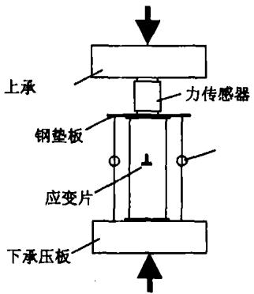
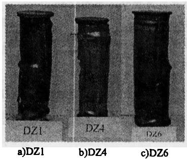
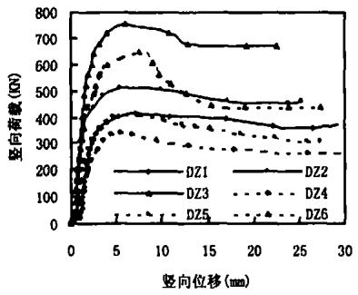
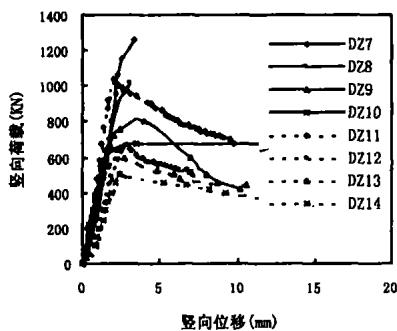
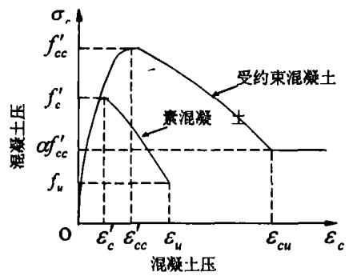

# 圆形薄壁钢管混凝土短柱受力性能研究

曹宝珠 $^{1,2}$ , 张耀春 $^{1}$ , 王秋萍 $^{1}$ , 段文峰 $^{2}$

(1.哈尔滨工业大学，黑龙江哈尔滨150090；2.吉林建筑工程学院，吉林长春130021)

摘要：通过对14个圆形钢管混凝土短柱的理论分析与试验研究，分析其在单调轴压荷载作用下的受力性能及破坏形态，揭示出了薄壁组合柱与普通(厚壁)钢管混凝土柱不同的破坏机理及内在规律，为该类构件的设计及计算提供了理论依据.

关键词：薄壁钢管混凝土短柱；受力性能；破坏机理

中图分类号：TU398

文献标识码：A

文章编号：0367-6234(2005)增刊-0141-04

# Mechanical Behavior of Circular Concrete Filled Thin - walled Steel Tube Stub Columns

CAO Bao-zhu $^{1,2}$ , ZHANG Yao-chun $^{1}$ , WANG Qiu-ping $^{1}$ , DUAN Wen-feng $^{2}$

(1. Harbin Institute of Technology Harbin 150090, China;

2. Jilin Architectural and Civil Engineering Institute, Changchun 130021, China)

Abstract: In an experimental and analytical study on the mechanical behavior of circular concrete filled steel tube (CFST) stub columns, 14 specimens were tested. The diameter to thickness ratio range of CFST was from 50 to 125. And 4 of specimens were filled with light - weight aggregate concrete. The results indicated that mechanical behavior of columns was greatly influenced by diameter and thickness of steel tubes. Thin - walled steel tubes filled with concrete were all found inclined shearing failure. It was different from thick - walled CFST columns which appeared plastic flow failure under ultimate load. Constitutive relationship of concrete in triaxial compression can be used to explain the phenomena above, and to determine the bearing capacity in theory. Thin - walled CFST column were also showed a certain ductility, so it can be used in single or multi story buildings.

Key words: Concrete filled thin - walled steel tube stub column; mechanical behavior; failure mechanics

由于圆形钢管混凝土柱具有较高的承载力和较好的延性性能，国内外学者对其进行了深入系统的研究，并在建筑工程中得到了大量的应用。已有的研究结果表明1,2，随圆形钢管径厚比的逐渐增大，钢管对内部混凝土的约束作用逐渐减弱，因此对于承受竖向荷载较大的钢管混凝土构件，其径厚比不宜过大。过去人们采用钢管约束混凝土主要目的是提高构件的承载力，而现在注重于采用钢管混凝土来获得更好的延性性能。对于多层轻钢建筑，若将其主要受力构件做成组合构件，即

采用薄壁钢管混凝土柱和冷弯薄壁型钢混凝土组合梁作为受力体系，必将获得较好的承载力性能和经济性能。混凝土的存在不仅能够提高承载力，还可以改善薄壁钢管的局部稳定和抗火性能。薄壁钢管作为浇筑混凝土的模板，并承受施工荷载。因此对竖向荷载较小的结构，可以考虑采用薄壁钢管混凝土结构。试验研究及理论分析表明，圆形薄壁钢管混凝土短柱在单调荷载作用下，表面无明显的局部屈曲现象发生，达到极限承载力时内部混凝土发生剪切破坏。这与圆形厚壁构件表现为腰鼓形破坏有所不同。在过去课题组完成了八个薄壁钢管混凝土（轻骨料）短柱的基础上，又补充做了六个试件，径厚比为 $50\sim 125$ ，含钢率范

围为 $3.3\% \sim 8.68\%$ . 由此可以观察不同径厚比试件的承载力及破坏形态, 进一步分析其内在的机理.

# 1 薄壁钢管混凝土短柱的试验研究

先后对14个钢管混凝土短柱进行了试验研究，其中 $\mathrm{DZ1}\sim \mathrm{DZ6}$ 为独立完成， $\mathrm{DZ7}\sim \mathrm{DZ14}$ 为课题组共同完成.前10个试件填充普通混凝土，后4个试件填充轻骨料混凝土.各钢管均由薄壁钢板经卷筒对焊而成，然后在端部焊接一块 $10\mathrm{mm}$ 厚钢盖板，另一端盖板待混凝土浇灌养护完成后焊接.所用薄壁钢板的力学性能如表1所示，各试件的详细情况参见表2.

表 1 试件所用钢材的力学指标  

<table><tr><td>钢管壁厚 t(mm)</td><td>屈服强度 \( {\mathrm{f}}_{\mathrm{y}}\left( \mathrm{{MPa}}\right) \)</td><td>极限抗拉强度 \( {\mathrm{f}}_{\mathrm{u}}\left( \mathrm{{MPa}}\right) \)</td><td>泊松比 u</td><td>弹性模量 E(MPa)</td></tr><tr><td>2.0</td><td>216</td><td>342.9</td><td>0.309</td><td>162050</td></tr><tr><td>1.5</td><td>222.7</td><td>307.1</td><td>0.29</td><td>197000</td></tr><tr><td>1.2</td><td>253.3</td><td>334.2</td><td>0.295</td><td>165700</td></tr></table>

为考查不同钢管对内部混凝土的约束力大小, 每一构件均在柱中部布有 8 各应变片. 即共有 4 个测点, 每一测点应变片横竖各一. 同时设有 4 块百分表, 对薄壁钢管混凝土短柱在竖向单调荷载作用下的位移进行量测. 在 $200 \mathrm{t}$ 液压试验机上进行加载试验, 配有 100 点数据采集系统进行应变片数据的自动采集. 试验装置如图 1 所示.

# 2 试验结果及理论分析

# 2.1 试验现象及结果

通过对试验的全过程观测表明，所有试件均具有较高的后期承载力和一定的延性性能。开始受荷时处于弹性阶段，当外荷加至极限荷载的 $40\% - 55\%$ （普通）或 $60\% - 72\%$ （轻骨料）左右时，纵向平均应变达到钢材的屈服应变，管壁并未有局部屈曲现象出现。随后，柱子进入弹塑性阶段。当荷载加至极限承载力的 $80\% - 95\%$ 左右时，顶部因混凝土填充不实和盖板约束效应出现局部屈曲。构件的径厚比越大，这种现象越明显。随外荷载的增加，其他部分钢管壁的外观并无变化，但内部混凝土出现微裂声。此时钢管和混凝土之间应力发生重分布，钢管承担压力不变而混凝土所受的压力逐渐增大。在接近极限荷载时，柱的纵向位移迅速增加，核心混凝土达压力极限时，即被剪坏（45度左右的斜裂缝），接着钢管壁被撑斜，柱子进入破坏阶段。不同径厚比试件的破坏形

  
图1试验装置

  
图2钢管混凝土短柱的破坏形态

态如图2所示.从试验的荷载-位移曲线(图3)上可以看出，钢管混凝土短柱的径厚比越小，含钢率越大，其极限荷载后的延性越好，曲线越平缓.相同截面的短柱，含钢率大的构件承载力和延性明显好于含钢率小的构件.试验表明，即使薄壁钢管混凝土短柱的含钢率很小，仍然有较好的延性性能，而不发生脆性破坏.各试件的极限承载力值可参见表2.

  
图3 短柱的荷载-位移曲线

# 2.2 理论分析

薄壁钢管内的混凝土采用由Popovics建议[5]

的受约束混凝土单轴应力-应变关系，经Mander[6]修正，表达如下（图4）：

  
图4 素混凝土和受约束混凝土应力-应变曲线

$$
\begin{array}{r l r} f _ {c c} ^ {\prime} f _ {c} ^ {\prime} \alpha f _ {c c} ^ {\prime} f _ {u} \varepsilon_ {c} ^ {\prime} \varepsilon_ {c c} ^ {\prime} \varepsilon_ {u} \varepsilon_ {c u} \varepsilon_ {c} \sigma_ {c} \sigma_ {c} & = & f _ {c c} \\ \frac {x \gamma}{\gamma - 1 + x ^ {\gamma}} & & (1) \end{array}
$$

其中， $x = \frac{\varepsilon_c}{\varepsilon_{cc}'}$ ， $\gamma = \frac{E_c}{(E_c - f'_c / \varepsilon_{cc}')}$ ， $\varepsilon_{cc}' = \varepsilon_{c}^{\prime}\left[1 + 5\left(\frac{f'_c}{f_c^{\prime}} -1\right)\right].$

其切线模量为

$$
E _ {c t} = \frac {\partial \sigma_ {c}}{\partial \varepsilon_ {c}} = f _ {c c} ^ {\prime} \frac {r (r - 1 + x ^ {\prime}) - r ^ {2} x}{\varepsilon_ {c c} ^ {\prime} (r - 1 + x ^ {\prime}) ^ {2}} \tag {2}
$$

式中： $f_{c}^{\prime} -$ 无侧限混凝土的抗压强度； $f_{cc}^{\prime}$ 有侧限混凝土的抗压强度； $\varepsilon_{c}^{\prime}$ 无侧限混凝土极限强度时的应变； $\varepsilon_{cc}^{\prime}$ 有侧限混凝土极限强度时的应变； $\varepsilon_{cu}$ 一有侧限时混凝土的极限压应变； $f_{u}$ 无侧限时混凝土极限变形时所对应的应力. $\sigma_{c}$ 和 $\varepsilon_{c}$ 分别为钢管内混凝土的纵向应力和应变； $E_{c}$ 是混凝土的初始弹性切线模量； $E_{a}$ 为任一荷载作用下混凝土的切线模量.

钢材在弹性阶段，其泊淞比变化很小，在 $0.25\sim 0.3$ 之间，可以认为是常数，一般取0.283，钢材屈服以后，取 $\mu_{s} = 0.5.$ 而混凝土的泊淞比 $\mu_{c}$ 却随着纵向应力的增大而变大，由低应力下的0.167逐渐增大到极限应力下的0.5.当构件接近破坏时，混凝土内部微裂缝不断发展，泊淞比将超过0.5.由文献[1]，有

$$
\left. \begin{array}{c c} \mu_ {c} = 0. 1 7 3 & \left(\sigma_ {c} / f _ {\alpha} ^ {\prime} \leqslant 0. 2 2 1\right) \\ \mu_ {c} = 0. 8 2 \left(\sigma_ {c} / f _ {\alpha} ^ {\prime}\right) ^ {0. 5} - 0. 3 2 3 & \left(0. 2 2 1 <   \sigma_ {c} / f _ {\alpha} ^ {\prime} <   1. 0\right) \\ \mu_ {c} = 0. 5 & \left(\sigma_ {c} = f _ {\alpha} ^ {\prime}\right) \end{array} \right\} \tag {3}
$$

由于钢管管壁较薄，内部约束应力与竖向及环向应力相比要小的多，可认为钢管只受双向应

力作用, 且满足 Mises 屈服条件. 而混凝土在受到竖向应力作用的同时, 还受到侧向约束应力的作用. 因此, 钢管单元可以简化为平面应力状态, 混凝土则为三向应力状态. 此时薄壁钢管与内部混凝土同时满足内力平衡和变形协调条件. 由于钢管为理想弹塑性材料, 采用文献[1]中给出的力学模型, 结合以上受约束混凝土的应力 - 应变关系, 经迭代计算, 可求出薄壁钢管混凝土短柱的极限承载力. 理论计算与试验承载力的对比如表2所示, 可以看出二者吻合良好.

混凝土在不同约束应力下的破坏形态有所不同.文献[7]介绍了混凝土棱柱体在只有竖向荷载作用下的破坏过程.若以 $\varepsilon_{c}$ 表示棱柱体在极限荷载时的应变，则当应变 $\varepsilon = (1\sim 1.35)\varepsilon_{c}$ 时，试件表面出现第一条可见的竖向裂缝，裂缝细而短.随后陆续出现多条不连续的竖向裂缝.随着混凝土骨料和砂浆的粘结不断遭到破坏，相邻的纵向裂缝沿斜向连接，逐渐形成贯通的斜裂缝面.莫尔－库仑强度理论能够很好地解释这一破坏形式.对于受约束混凝土而言，一般认为当约束应力与主压应力之比为 $0.15\sim 0.2$ 时，发生斜剪破坏8,9，破坏面与主压应力成 $20^{\circ}\sim 30^{\circ}$ 夹角；而当应力比超过0.2时，发生挤压流动破坏，主压应力方向变短，横向向外膨胀.因此，薄壁钢管混凝土短柱由于钢管对混凝土的约束应力较小，而发生斜向剪切破坏；厚壁钢管混凝土柱由于钢管提供的约束应力较大，使其内部混凝土在达到极限荷载时发生塑性流动，而呈腰鼓形破坏.目前有关三向应力作用下混凝土力学性能的研究成果很多，但直接用于钢管混凝土柱并不能反映出加载过程中混凝土和钢管的应力状态.因为未加载时和加载初期，钢管尚未对混凝土产生约束作用.只有内部混凝土进入弹塑性状态，其泊淞比超过钢材时，外部钢管才对混凝土产生约束力，二者发生相互作用.需考虑不同的受荷阶段和约束状态对其力学性能的影响.

# 3结论

试验研究结果表明，圆形薄壁钢管内部填充混凝土后，不仅提高了构件的承载力，还可改善其延性性能。随含钢率的逐渐增大，构件的延性性能越来越好。其破坏形式由斜剪型逐渐转为塑流型。采用文献[6]建议的受约束混凝土模型，经迭代计算后所得理论承载力值与试验值对比，吻合良好。对于荷载不大的多、低层建筑，采用薄壁钢管混凝土结构，具有较好的经济性。

表 2 圆钢管混凝土短柱的极限抗压承载力一览表  

<table><tr><td>试件
编号</td><td>L×D×t
(mm)</td><td>D/t</td><td>α
(%)</td><td>fck(MPa)</td><td>fy(MPa)</td><td>Ns(KN)</td><td>Nmax(KN)</td><td>Nmax/Ns</td></tr><tr><td>DZ1</td><td>420×100×2.00</td><td>50</td><td>8.68</td><td>24.03</td><td>216</td><td>420</td><td>380</td><td>0.91</td></tr><tr><td>DZ2</td><td>500×120×2.00</td><td>60</td><td>7.13</td><td>24.03</td><td>216</td><td>514</td><td>501.7</td><td>0.98</td></tr><tr><td>DZ3</td><td>620×150×2.00</td><td>75</td><td>5.63</td><td>24.03</td><td>216</td><td>760</td><td>712.7</td><td>0.94</td></tr><tr><td>DZ4</td><td>420×100×1.20</td><td>83.3</td><td>5.04</td><td>24.03</td><td>253.3</td><td>343</td><td>323.8</td><td>0.94</td></tr><tr><td>DZ5</td><td>500×120×1.20</td><td>100</td><td>4.16</td><td>24.03</td><td>253.3</td><td>408</td><td>434.1</td><td>1.06</td></tr><tr><td>DZ6</td><td>620×150×1.20</td><td>125</td><td>3.3</td><td>24.03</td><td>253.3</td><td>647</td><td>634.2</td><td>0.98</td></tr><tr><td>DZ7</td><td>555×180×1.49</td><td>120.8</td><td>3.4</td><td>33.49</td><td>222.7</td><td>1287</td><td>1251</td><td>0.97</td></tr><tr><td>DZ8</td><td>459×150×1.50</td><td>100</td><td>4.12</td><td>33.49</td><td>222.7</td><td>1024</td><td>1066</td><td>1.04</td></tr><tr><td>DZ9</td><td>417×135×1.46</td><td>92.5</td><td>4.47</td><td>33.49</td><td>222.7</td><td>800</td><td>895</td><td>1.12</td></tr><tr><td>DZ10</td><td>369×120×1.51</td><td>79.5</td><td>5.23</td><td>36.35</td><td>222.7</td><td>680</td><td>792.8</td><td>1.16</td></tr><tr><td>DZ11</td><td>555×180×1.49</td><td>120.8</td><td>3.4</td><td>18.28</td><td>222.7</td><td>1040</td><td>1032.7</td><td>0.99</td></tr><tr><td>DZ12</td><td>459×150×1.50</td><td>100</td><td>4.12</td><td>15.6</td><td>222.7</td><td>666</td><td>752</td><td>1.13</td></tr><tr><td>DZ13</td><td>417×135×1.46</td><td>92.5</td><td>4.47</td><td>18.28</td><td>222.7</td><td>594</td><td>678.7</td><td>1.14</td></tr><tr><td>DZ14</td><td>369×120×1.51</td><td>79.5</td><td>5.23</td><td>18.28</td><td>222.7</td><td>500</td><td>590</td><td>1.18</td></tr></table>

表中， $L, D, t$ -分别为薄壁钢管混凝土短柱的高度、外径和钢管壁厚； $\alpha$ —构件的含钢率 $f_{ck}$ ——混凝土轴心抗压强度标准值； $f_{\gamma}$ —薄壁钢管的屈服强度标准值； $N_{s}$ ——短柱极限承载力试验值； $N_{\max}$ ——短柱的极限承载力计算值.

# 参考文献：

[1]钟善桐著．钢管混凝土结构[M].哈尔滨：黑龙江科学技术出版社．1994.1-14.  
[2]韩林海著．钢管混凝土结构[M].北京：科学出版社. 2000.21-63.  
[3]曹宝珠.薄壁钢－混凝土组合构件静力性能研究[D].哈尔滨工业大学．2004.25-42.  
[4]王秋萍.薄壁钢管混凝土轴压短柱力学性能的试验研究[D].哈尔滨工业大学.2002.11-30.  
[5] Popovics S. A numerical approach to the complete stress -strain curves for concrete[J].Cement Concrete Res,

1973,3(3):583-599.   
[6] Mander JB, Priestly JN, Park R. Theoretical stress - strain model for confined concrete[J]. Journal of Structural Engineering, ASCE, 1998, 114(8): 1804-1826.   
[7]江见鲸. 混凝土结构工程学[M]. 北京：中国建筑工业出版社，1998. 16-18.  
[8]过镇海. 混凝土的强度和变形, 试验基础和本构关系 [M]. 北京: 清华大学出版社. 1997. 155-220.  
[9] Domingo. et al. Study of the behavior of concrete under triaxial compression[J]. Journal of Engineering Mechanics. 2002,128(2):156-158.

# （上接第67页）

(3) 由各控制截面的温度应力分析可知, $1/8, 1/2$ 截面不利温度应力在温降时出现; $1/4$ 截面不利温度应力在温升时出现; 最不利温度应力产生于 $1/2$ 截面处 (上弦杆上缘), 由温降工况产生;  
(4) 温度升高和降低对各控制截面的挠度影响结果如表6所示. 各控制点挠度, 温升有利, 温降有害, 温降产生的挠度较大, 各截面由温降产生的挠度与恒载产生的挠度较接近;  
(5) 温度变化对支反力的影响, 结果如表7所示, 对于水平反力、竖直反力温升时不利, 对于弯矩温降时不利; 其中温升对水平反力、竖直反力的影响几乎为零, 温降对弯矩的影响占恒载的 $82.5\%$ .

# 5结论

通过对北方某大桥的温度特性分析，得到了该钢管混凝土拱桥在温度影响下各控制截面的应力、轴力、弯矩、挠度及支座反力.通过分析可知，

考虑钢管混凝土拱桥的温度影响时并不能仅简单的考虑温升或温降，应将其都考虑，取最不利工况；钢管混凝土拱桥考虑温度产生的影响时，应按钢拱桥计算；本桥由于施工时空钢管合拢和管内灌注混凝土之间有2个多月间隔且温差较大，需将温度分析分为空钢管拱和钢管混凝土拱两个工况，这与实际情况比较相符.以上结果分析和结论对拱桥的检测、评估具有一定的参考价值.

# 参考文献：

[1]交通部标准.公路桥涵设计通用规范（JTJ021-85）[S].北京：人民交通出版社，1985.  
[2] 铁道部标准. 铁路桥涵设计通用规范 (TBJ2-85) [S]. 北京: 中国铁道出版社, 1986.  
[3]李皓月，周田朋，刘相新.ANSYS工程计算应用教程[M].北京：中国铁道出版社，2003.  
[4]张立明. Algor、Ansys 在桥梁工程中的应用方法与实例 [M]. 北京：人民交通出版社，2003.