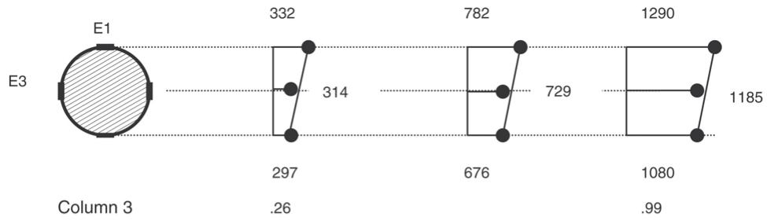
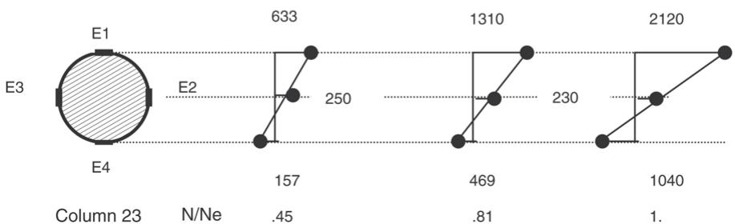

# An experimental behaviour of concrete-filled steel tubular columns

J. Zeghichea,∗ , K. Chaouib

aCivil Engineering Department, University of Annaba, BP 12 Annaba, Algeria bMechanical Engineering Department, University of Annaba, BP Annaba, Algeria

Received 17 December 2003; accepted 29 June 2004

# Abstract

In this paper results of tests conducted on 27 concrete-filled steel tubular columns are reported. The test parameters were the column slenderness, the load eccentricity covering axially and eccentrically loaded columns with single or double curvature bending and the compressive strength of the concrete core. The test results demonstrate the influence of these parameters on the strength and behaviour of concrete-filled steel tubular columns. A comparison of experimental failure loads with the predicted failure loads in accordance with the method described in Eurocode 4 Part 1.1 showed good agreement for axially and eccentrically loaded columns with single curvature bending whereas for columns with double curvature bending the Eurocode loads were higher and on the unsafe side. More tests are needed for the case of double curvature bending.

$^ ©$ 2004 Elsevier Ltd. All rights reserved.

# Notations

$D$ is the outer diameter of the steel tube

$t$ is the wall thickness of the steel tube

$L$ is the column effective length

$e _ { t } , e _ { b }$ are the load eccentricities at the top and bottom of the column, respectively

$\beta$ is the bending moment ratio   
$f _ { y }$ is the yield strength of steel   
$f _ { c } ^ { \prime }$ is the compressive strength of concrete   
$E _ { c 0 }$ , Es are the Young’s Moduli of concrete and steel, respectively

# 1. Introduction

# 1.1. General

The use of concrete-filled steel tubes in different areas of construction is becoming an attractive solution. It provides not only an increase in the load carrying capacity but also economy and rapid construction, and thus additional cost saving. Their use in multistorey buildings has increased in recent years owing to the benefit of increased load carrying capacity for a reduced cross section. Moreover, using confinement in the form of a circular steel tube can greatly improve the ductility of normal or high-strength concrete. No formwork or reinforcement is required for the concrete, and its surface is protected from impact and abrasion. The local buckling of the steel wall, due to the relatively small wall thickness, is delayed because it can only buckle outwards.

# 1.2. Research on concrete-filled steel tubular columns

Experimental studies on concrete-filled steel tubes have been on-going for many decades [1–4]. A review of available experimental studies shows that the main parameters affecting the behaviour and strength of concrete-filled columns are: the geometrical parameters, such as the slenderness, the $D / t$ ratio and the initial geometry of the column [5,6]; the mechanical parameters, such as the strength of the steel and concrete, the loading and boundary conditions and the degree of concrete confinement. The load carrying capacity decreases with increase of the column length and the load eccentricity, while the descending branch of the load–displacement curve is progressing at a smaller rate. Very few experimental data are available for the case of columns with double curvature bending. In such columns the carrying capacity is increased compared to the corresponding loads in single curvature bending [7,8]. The failure is by compressive yielding of steel and crushing of concrete for short columns and an overall instability failure mode by partial compressive yielding of steel and crushing and cracking of concrete for longer columns. For columns with high $D / t$ ratio, failure is by local buckling. For columns under cycling loads, the concrete-filled tubes show a high level of ductility and tenacity; therefore they are a practical solution for constructions subjected to dynamic loads such as earthquakes and wind pressure. More experimental data are needed for concrete-filled tubular columns with height equal to $3 { \mathrm { - } } 4 . 0 \mathrm { m }$ , which represent a typical storey height in multi-storey buildings, using different sizes of the cross section and considering the case of double curvature bending.

# 1.3. Numerical analysis

A Finite Element Method program is made available [1,2] for rectangular concretefilled steel tubes and extended for circular shaped sections. This program is dedicated for

intermediate and long composite columns. The real column is discretised into ten identical beam-column elements. Each node has three degree of freedoms: two translations and one rotation in the plane of bending. The adopted solution technique is an incremental load control step by step solution by re-distributing the out of balance load vector up to a preset deflection tolerance where the deflected shape is satisfying the equilibrium requirements of the structure. The iterations are stopped when no equilibrium can be achieved any longer. The corresponding load is the ultimate load of the column for the preset boundary conditions. Computing the internal bending moment was achieved by using the steel and concrete uniaxial stress–strain relationships, where the effect of steel residual stresses is incorporated; it is assumed that the maximum deviation from straightness of the column at the mid-height and varying according to a sine function includes the lack of straightness of the column.

# 2. Test arrangements and procedure

# 2.1. General

Twenty-seven columns were tested in this series. The circular steel tube had an outer diameter of 160. mm with a wall thickness of 5. mm. The length of the columns varied from $2 . 0 \mathrm { { m } }$ to $4 . 0 \mathrm { m }$ in increments of $5 0 0 . \ \mathrm { m m }$ and they were filled with concrete in the vertical position. Progressive vibration was employed in order to eliminate air pockets in the concrete and give a homogeneous mix. Three concrete mixes were used in this investigation. The 28 day cylinder strength was 40, 70. and $1 0 0 . ~ \mathrm { N / m m } ^ { 2 }$ and slightly increased on the column test day. The concrete mix proportions are given in Table 1, with a maximum size (river gravel) of $1 0 \mathrm { m m }$ aggregate. Three groups of columns were tested under different loading conditions. Columns of the first group were tested under axial loads, columns of the second group were subjected to equal eccentric loads with $e / D$ varying from .05 to .20 and columns of the third group were tested in double curvature bending with $\beta = - 1$ . Strips of the steel tubes were tested in tension for each tested column, in accordance with the European standards. From these tests the average tensile yield strength was found to be 275. MPa and the modulus of elasticity was $2 1 2 \times 1 0 ^ { 3 } \mathrm { M P a }$ . Tests carried out on 200. mm long steel tubes subjected to direct compression gave a mean compressive strength of 270. MPa. Tests carried out on 200. mm long composite tubes using the threeconcrete mix and subjected to direct compression gave the squash loads of the composite columns. All the details and the results are given in Table 2. The failure mode of the short composite specimens was a typical crushing failure mode where the steel wall was pushed out by the concrete core, which in turn was confined by the steel. When the steel was removed from the specimen after failure, the concrete was found to have taken the shape of the deformed steel tube, which illustrates the composite action of the section. The columns were made from circular steel tube $1 6 0 \times 5 ~ \mathrm { m m }$ , each column being provided with two $1 5 ~ \mathrm { m m }$ thick welded endplates. One of the plates had a hole to enable the concrete to be cast. Tapped holes were made in each endplate in the appropriate positions to be used for bolting the column to the loading plates in the test rig.

Table 1 Concrete mix properties   

<table><tr><td></td><td>Mix 1</td><td>Mix 2</td><td>Mix 3</td></tr><tr><td>Cement content</td><td>400 kg/m3</td><td>500 kg/m3</td><td>550 kg/m3</td></tr><tr><td>Water-cement ratio</td><td>.4</td><td>.3</td><td>.29</td></tr><tr><td>Aggregate-cement ratio</td><td>2.6</td><td>2.4</td><td>2.3</td></tr><tr><td>10 mm gravel</td><td>1040 kg/m3</td><td>1200 kg/m3</td><td>1200 kg/m3</td></tr><tr><td>Sand</td><td>550 kg/m3</td><td>600 kg/m3</td><td>600 kg/m3</td></tr><tr><td>Silica fume</td><td>-</td><td>12 kg/m3</td><td>15 kg/m3</td></tr><tr><td>Super-plasticiser</td><td>-</td><td>15 ml/kg of cement</td><td>17 ml/kg of cement</td></tr><tr><td>Slump</td><td>100</td><td>150</td><td>120</td></tr><tr><td>Compressive strength 28 days</td><td>40</td><td>70</td><td>100</td></tr><tr><td>Ec</td><td>32 GPa</td><td>42 GPa</td><td>45 GPa</td></tr></table>

Table 2 Column squash loads   

<table><tr><td>Sample</td><td>D (mm)</td><td>T (mm)</td><td>fy (N/mm2)</td><td>f′c28 (N/mm2)</td><td>Ec0 (GPa)</td><td>Es (GPa)</td><td>Test (kN)</td><td>EC4 (kN)</td></tr><tr><td>S1</td><td>159.8</td><td>4.97</td><td>275.</td><td>0.</td><td>-</td><td>208.</td><td>720.</td><td>-</td></tr><tr><td>Sc1</td><td>159.9</td><td>5.01</td><td>276.</td><td>40.</td><td>32.</td><td>211.</td><td>1506.</td><td>1387.</td></tr><tr><td>Sc2</td><td>159.9</td><td>5.02</td><td>278.</td><td>70.</td><td>42.</td><td>209</td><td>2050.</td><td>1929.</td></tr><tr><td>Sc3</td><td>160.1</td><td>4.99</td><td>275.</td><td>100.</td><td>45.</td><td>208</td><td>2550.</td><td>2451.</td></tr></table>

# 2.2. Test rig and test procedure

All columns were tested in an Amsler compressive testing machine with a maximum load capacity of $1 0 0 0 0 \mathrm { k N }$ . A calibration of the test machine confirmed that the Amsler had an absolute accuracy of $0 . 5 \%$ . A set of adapter endplates equipped with half-spherical bearings were manufactured and fixed to both ends of each column to form a simply supported column. Special attention was given to verifying the correct position of the column before any loading. Each of the first few increments of load was about $1 0 \%$ of the predicted failure load. For the first increment, a complete check of displacements, strains and load was carried out. Several loading, unloading and reloading cycles were performed at this stage. When the results were satisfactory, the loading then proceeded in increments of $1 0 \%$ of the maximum load at each step. After each increment, some time was allowed for the column to find its equilibrium shape, and the load, displacements and strains were then recorded. This loading procedure was followed until some relatively large non-linearity was monitored. At this stage the columns were continually varying, the load increments were halved and more time was allowed before recording any data.

# 2.3. Instrumentation

Fig. 1 shows the electric strain gauge and LVDT arrangements, which were used to record the strains and displacements. Two recording stations were set up at the column

  
Fig. 1. The location of strain gauges and LVDT.

mid-length and also at one quarter point of the column length. Four strain gauges were used at each station. During the tests, graphical monitoring of the load–strain relationships at the mid- and quarter-length sections was carried out to guide the running of the experiment. All columns were loaded to failure.

# 3. Results of column tests

# 3.1. Failure loads

A total of 15 circular concrete-filled steel tubes (1–15) were tested in axial compression. The main parameters studied were the length of the composite column and the concrete strength. The $L / D$ ratio varied from 12.5 to 25.0. Details of the columns tested in axial compression are given in Table 3 including the EC4 predictions [9]. It can be seen from Fig. 2 that increasing the column length decreases the strength of the columns. The increase of the concrete core strength is effective for shorter columns and decreases with the increase of the composite column length. All axially loaded columns failed after having reached the steel yield strain with small lateral mid-length deflections. After the failure of the tested columns, the steel was checked for local buckling. No sign of local buckling was recorded. The removal of the steel envelope from some tested columns revealed no sign of concrete crushing at the mid-length sections. The EC4 predictions for axially loaded columns are close to the experimental loads and on the safe side.

Eight circular concrete-filled steel tubes (16–23) were tested in single curvature bending. The column lengths were 2.0, 4.0 m and the eccentricities were chosen to cover the range most likely to be encountered in practice. The $e / D$ ratio varied from .05 to .20 and the concrete used for this series was from mix 3. Details of the columns tested and the corresponding failure loads are presented in Table 4, which includes the EC4 predictions. Fig. 3 shows the load–eccentricity variation for single curvature bending. The carrying capacity of eccentrically loaded columns in single curvature bending is affected by the increase of the load eccentricity. For both lengths, the rate of load reduction is higher for small eccentricities. The steel yielding process started first in the compression zone for small eccentricities and reached the tension zone for columns with higher eccentricities.

Table 3 Results for axially loaded columns   

<table><tr><td>Column</td><td>D(mm)</td><td>T(mm)</td><td>L(mm)</td><td>fy(N/mm2)</td><td>fc&#x27;(N/mm2)</td><td>Test(kN) (1)</td><td>EC4(kN) (2)</td><td>(2)/(1)</td></tr><tr><td>1</td><td>160.1</td><td>4.98</td><td>2000</td><td>280</td><td>40</td><td>1261</td><td>1200</td><td>.951</td></tr><tr><td>2</td><td>160.2</td><td>4.96</td><td>2500</td><td>281</td><td>41</td><td>1244</td><td>1175</td><td>.944</td></tr><tr><td>3</td><td>160.3</td><td>5.0</td><td>3000</td><td>270</td><td>43</td><td>1236</td><td>1125</td><td>.910</td></tr><tr><td>4</td><td>160.2</td><td>4.97</td><td>3500</td><td>273</td><td>41</td><td>1193</td><td>1031</td><td>.864</td></tr><tr><td>5</td><td>159.9</td><td>4.98</td><td>4000</td><td>281</td><td>45</td><td>1091</td><td>943</td><td>.864</td></tr><tr><td>6</td><td>159.8</td><td>5.01</td><td>2000</td><td>283</td><td>70</td><td>1650</td><td>1593</td><td>.965</td></tr><tr><td>7</td><td>159.7</td><td>5.2</td><td>2500</td><td>281</td><td>71</td><td>1562</td><td>1563</td><td>1.000</td></tr><tr><td>8</td><td>159.8</td><td>5.1</td><td>3000</td><td>276</td><td>73</td><td>1468</td><td>1450</td><td>.987</td></tr><tr><td>9</td><td>160.1</td><td>4.98</td><td>3500</td><td>276</td><td>74</td><td>1326</td><td>1275</td><td>.961</td></tr><tr><td>10</td><td>160.2</td><td>5.02</td><td>4000</td><td>281</td><td>71</td><td>1231</td><td>1087</td><td>.883</td></tr><tr><td>11</td><td>160.3</td><td>5.03</td><td>2000</td><td>281</td><td>99</td><td>2000</td><td>2106</td><td>1.053</td></tr><tr><td>12</td><td>159.8</td><td>5.01</td><td>2500</td><td>275</td><td>100</td><td>1818</td><td>1931</td><td>1.062</td></tr><tr><td>13</td><td>159.7</td><td>4.97</td><td>3000</td><td>275</td><td>101</td><td>1636</td><td>1662</td><td>1.015</td></tr><tr><td>14</td><td>159.6</td><td>4.98</td><td>3500</td><td>270</td><td>106</td><td>1454</td><td>1406</td><td>.966</td></tr><tr><td>15</td><td>159.8</td><td>4.97</td><td>4000</td><td>270</td><td>102</td><td>1333</td><td>1168</td><td>.876</td></tr></table>

  
Fig. 2. Experimental failure loads of axially loaded columns.

No sign of local buckling was recorded before or after failure of the eccentrically loaded columns. The removal of steel from the failed columns revealed crushing and cracking of concrete in the compression and tension zones, respectively, at mid-length sections. The EC4 predictions for single curvature bending were on the safe side.

Four columns (24–27) were tested in double curvature bending with an effective length of $2 . 0 \textrm { m } ( \beta = - 1 )$ ). All specimens were made from the same 160 CHS. The infill concrete was from concrete mix 3. The eccentricity ratio $e / D$ varied from .05 to 0.20 with $\beta = - 1$ . All details and failure loads of the columns tested are given in Table 4. In this case the strength of the composite columns was increased comparatively with columns in single

Table 4 Results for columns with single and double curvature bending   

<table><tr><td>Column</td><td>D(mm)</td><td>T(mm)</td><td>L(mm)</td><td>et,eb(mm)</td><td>fy(N/mm2)</td><td>fc&#x27;(N/mm2)</td><td>Test(kN) (1)</td><td>EC4(kN) (2)</td><td>(2)/(1)</td></tr><tr><td>16</td><td>160.3</td><td>5.10</td><td>2000</td><td>+8,+8</td><td>271</td><td>101</td><td>1697</td><td>1668</td><td>.982</td></tr><tr><td>17</td><td>160.1</td><td>4.97</td><td></td><td>+16,+16</td><td>281</td><td>102</td><td>1394</td><td>1375</td><td>.986</td></tr><tr><td>18</td><td>159.8</td><td>5.02</td><td></td><td>+24,+24</td><td>280</td><td>101</td><td>1212</td><td>1162</td><td>.958</td></tr><tr><td>19</td><td>159.7</td><td>5.02</td><td></td><td>+32,+32</td><td>276</td><td>100</td><td>1091</td><td>1006</td><td>.922</td></tr><tr><td>20</td><td>159.7</td><td>4.96</td><td>4000</td><td>+8,+8</td><td>275</td><td>101</td><td>963</td><td>862</td><td>.895</td></tr><tr><td>21</td><td>159.8</td><td>4.96</td><td></td><td>+16,+16</td><td>275</td><td>100</td><td>848</td><td>712</td><td>.839</td></tr><tr><td>22</td><td>159.8</td><td>5.10</td><td></td><td>+24,+24</td><td>281</td><td>102</td><td>727</td><td>612</td><td>.841</td></tr><tr><td>23</td><td>160.1</td><td>5.12</td><td></td><td>+32,+32</td><td>280</td><td>101</td><td>666</td><td>537</td><td>.806</td></tr><tr><td>24</td><td>160.2</td><td>5.13</td><td>2000</td><td>+8,-8</td><td>276</td><td>100</td><td>1950</td><td>2012</td><td>1.031</td></tr><tr><td>25</td><td>160.3</td><td>5.09</td><td></td><td>+16,-16</td><td>270</td><td>102</td><td>1730</td><td>1918</td><td>1.108</td></tr><tr><td>26</td><td>159.9</td><td>5.09</td><td></td><td>+24,-24</td><td>269</td><td>102</td><td>1480</td><td>1831</td><td>1.237</td></tr><tr><td>27</td><td>159.8</td><td>5.06</td><td></td><td>+32,-32</td><td>268</td><td>100</td><td>1280</td><td>1756</td><td>1.371</td></tr></table>

  
Fig. 3. Experimental failure loads for columns under single curvature bending.

curvature bending. No sign of local buckling was recorded. All EC4 predicted loads for double curvature bending were higher than the experimental loads obtained. The load ratio reached a value of 1.371 for column 27, which was subjected to an eccentricity of $3 2 \mathrm { m m }$ , with the $e / D$ ratio of 0.20.

# 3.2. Strains

Fig. 4 gives the strain variations across the cross section in the case of axially and eccentrically loaded columns. The common feature is that the variation is linear up to failure. The strain at mid-height of the section was obtained by taking the average value from readings taken by the two strain gauges at mid-depth in the plane of bending (E2 & E3). For axially loaded columns, the strains were all in compression and varied from

  
Fig. 4. Strain variation at different load levels.

1440 to $1 2 7 0 \mu \varepsilon$ for columns 1 and 15 respectively from readings taken by strain gauge E1 and from 1080 to $6 8 4 \mu \varepsilon$ from readings taken by strain gauge E4. For eccentrically loaded

Table 5   
Additional experimental results at column failure   

<table><tr><td>Column (1)</td><td>et,eb(mm) (2)</td><td>Ntest(kN) (3)</td><td>Deflectiona(mm) (4)</td><td>Bending momentb(kN m) (5)</td><td>Strain at E1(με) (6)</td><td>Strain at E4(με) (7)</td></tr><tr><td>16</td><td>8,8</td><td>1697.</td><td>6.</td><td>23.7</td><td>2750.</td><td>385.</td></tr><tr><td>17</td><td>16,16</td><td>1394.</td><td>10.</td><td>36.2</td><td>3660.</td><td>-679.</td></tr><tr><td>18</td><td>24,24</td><td>1212.</td><td>12.</td><td>43.6</td><td>3730.</td><td>-1090.</td></tr><tr><td>19</td><td>32,32</td><td>1091.</td><td>14.</td><td>50.1</td><td>3750.</td><td>-1380.</td></tr><tr><td>20</td><td>8,8</td><td>963.</td><td>11.50</td><td>18.7</td><td>1340.</td><td>206.</td></tr><tr><td>21</td><td>16,16</td><td>848.</td><td>20.</td><td>30.5</td><td>1680.</td><td>-290.</td></tr><tr><td>22</td><td>24,24</td><td>727.</td><td>24.</td><td>34.8</td><td>1780.</td><td>-592.</td></tr><tr><td>23</td><td>32,32</td><td>666.</td><td>32.</td><td>42.6</td><td>2120.</td><td>-1040.</td></tr><tr><td>24</td><td>8,-8</td><td>1950.</td><td>1.30</td><td>18.1</td><td>2770.</td><td>719.</td></tr><tr><td>25</td><td>16,-16</td><td>1730.</td><td>2.10</td><td>31.3</td><td>3300.</td><td>-20.</td></tr><tr><td>26</td><td>24,-24</td><td>1480.</td><td>2.40</td><td>39.</td><td>3440.</td><td>-506.</td></tr><tr><td>27</td><td>32,-32</td><td>1280.</td><td>2.90</td><td>44.6</td><td>3650.</td><td>-930.</td></tr></table>

aDeflections represent the results measured at mid-length of the column in single curvature bending and at the quarter-length of the column in double curvature bending when the load reached the maximum.   
bThe bending moment was computed from $( 5 ) = ( 3 ) \cdot [ ( 2 ) + ( 4 ) ]$ .

  
Fig. 5. Load–strain variations in columns 16–19.

columns, the strains were much higher, with some tensile strains at the bottom of the midlength sections. All results at failure are summarised in Table 5. Fig. 5 gives a complete picture of the load–strain variations for some tested columns. The variation is non-linear and the yield strains (1300. µε) were reached at failure and exceeded in the post-failure stage. In most columns, the yield strain was reached first in the compressive zones.

  
Fig. 6. Test Load–deflection variations for columns in single curvature bending.

# 3.3. Displacements

In all tests, the lateral deflections were recorded at mid- and quarter-length. The relationship was non-linear, characterised by an ascending branch up to failure. The descending branch was also recorded; the full relationships of some tested columns are shown in Fig. 6. The maximum displacement at failure was considerably increasing with increasing load eccentricity, and consequently the columns were responding by bending. The deflections at failure of axially loaded columns (1–15) at mid-length were very small and varied from .9 to $5 . 9 0 \mathrm { m m }$ for columns 1 and 15 respectively. The deflections at failure for eccentrically loaded columns were higher, as shown in Table 5, and varied from 6. to 32. mm for columns 16 and 23, respectively. The quarter-length deflections were recorded for columns 24–27, which were subjected to double curvature bending. The deflections at failure were the lowest of this series and varied from 1.3 to $2 . 9 0 \mathrm { m m }$ for columns 24 and 27, respectively.

# 4. Discussion

Columns tested under axial loading (1–15) showed that the increase of the concrete strength has a positive effect on the load carrying capacity of concrete-filled steel tubes. The enhancement in the column load carrying capacity is more significant for shorter columns. The increase in the effective length of the columns considerably affected the column load carrying capacity with a load decreasing rate much higher for higher concrete strength. The failure mode of these columns was overall instability. No sign of local buckling was recorded up to failure of the columns.

Fig. 7 shows that the EC4 curve fits the experimental results well for axially loaded columns. Results in Figs. 8 and 9 and Table 6 for eccentrically loaded columns with single curvature bending (16–23) show that the column strength decrease rate is higher for small eccentricities for both column lengths (2, 4.0 m). Also, both experimental and FEM predicted loads are in good agreement with the EC4 predictions which are on the safe side. The axial load–bending $( N { - } M )$ interaction curve for the tested composite sections is

  
Fig. 7. Comparison between test and EC4 predictions for axially loaded columns.

  
Fig. 8. Test and predicted failure loads for columns in single curvature bending; $L = 2 . 0 \ : \mathrm { m }$ .

  
Fig. 9. Test and predicted failure loads for columns in single curvature bending; $L = 4 . 0 \ : \mathrm { m }$ .

plotted in Fig. 10 for columns subjected to single curvature bending. This curve is known as the short column $M { - } N$ relationship. No consideration was given to concrete confinement

Table 6 Comparison of experimental and predicted column failure loads   

<table><tr><td>Column</td><td>et, eb(mm)</td><td>Ntest(kN)</td><td>NFEM(kN)</td><td>NEC4(kN)</td></tr><tr><td>16</td><td>8,8</td><td>1697.</td><td>1680.</td><td>1668.</td></tr><tr><td>17</td><td>16,16</td><td>1394.</td><td>1410.</td><td>1375.</td></tr><tr><td>18</td><td>24,24</td><td>1212.</td><td>1210.</td><td>1162.</td></tr><tr><td>19</td><td>32,32</td><td>1091.</td><td>1060.</td><td>1006.</td></tr><tr><td>20</td><td>8,8</td><td>963.</td><td>988.</td><td>862.</td></tr><tr><td>21</td><td>16,16</td><td>848.</td><td>831.</td><td>712.</td></tr><tr><td>22</td><td>24,24</td><td>727.</td><td>725.</td><td>612.</td></tr><tr><td>23</td><td>32,32</td><td>666.</td><td>644.</td><td>537.</td></tr><tr><td>24</td><td>8,-8</td><td>1950.</td><td>2020.</td><td>2012.</td></tr><tr><td>25</td><td>16,-16</td><td>1730.</td><td>1780.</td><td>1918.</td></tr><tr><td>26</td><td>24,-24</td><td>1480.</td><td>1560.</td><td>1831.</td></tr><tr><td>27</td><td>32,-32</td><td>1280.</td><td>1390.</td><td>1756.</td></tr></table>

  
Fig. 10. N –M interaction results at failure of tested columns in single curvature bending.

in generating the interaction curve. The failure points of columns with an effective length of $2 . 0 \mathrm { m }$ are close to the boundary of the interaction curve, whereas failure points of columns with an effective length of $4 . 0 \mathrm { m }$ are inside and in a lower position. This shows that the increase in the effective column length and the load end eccentricity leads to a premature failure mode by bending as the second-order displacement becomes more significant.

Columns subjected to double curvature bending (24–27) had an effective length of $2 . 0 \mathrm { m }$ and exhibited small deflections. This had a compensating effect on the second-order phenomena as the failure points fell close to the interaction curve, as shown in Fig. 11. The experimental, numerical and predicted failure loads are plotted in Fig. 12 against the eccentricity ratio $e / D$ . Both experimental and FEM failure loads are in good agreement, whereas the EC4 predictions were higher on the unsafe side.

  
Fig. 11. N–M results at failure of columns in double curvature bending.

  
Fig. 12. Test and predicted failure loads of columns in double curvature bending.

# 5. Conclusions

Within the limits of the investigations reported above, it may be concluded that the column squash resistance calculated in accordance with the EC4 method is a reasonable estimate of the actual failure load of a stub column of concrete-filled CHS. The increase in the column slenderness decreases the load carrying capacity of composite columns. The use of high concrete strength enhanced the load carrying capacity of the tested columns, but with a load–slenderness relationship decreasing at a higher rate compared to that for columns using normal strength concrete. EC4 predictions for axially and eccentrically loaded columns with single curvature bending were on the safe side and in good agreement with the experimental and numerical failure loads. However, for columns in double curvature bending, both numerical and test results show that the EC4 predictions

are on the unsafe side. All tested columns failed by overall buckling with no sign of local buckling of the steel wall. More tests are needed to check the validity of EC4 predictions for columns subjected to double curvature bending.

# Acknowledgement

The authors wish to thank the ministry of higher education of Algeria for providing financial support.

# References

[1] Zeghiche J. Concrete-filled composite columns. MSc Thesis, University of Manchester; 1988.   
[2] Shakir-Khalil H, Zeghiche J. Experimental behaviour of concrete-filled rolled rectangular hollow-section columns. The Structural Engineer 1989;67(19/3):346–53.   
[3] Shakir-Khalil H, Mouli M. Further tests on concrete-filled rectangular hollow-section columns. The Structural Engineer 1990;68(20):405–13.   
[4] Shanmugam NE, Lakshmi B. State of the art report on steel–concrete composite columns. Journal of Constructional Steel Research 2001;57:1041–80.   
[5] Ghasemian M, Schmidt L. Curved circular hollow (CHS) steel struts infilled with high-strength concrete. ACI Structural Journal 1999;275–81.   
[6] O’Shea MD, Bridge RQ. Design of circular thin-walled concrete filled steel tubes. Journal of Structural Engineering 2000;1295–303.   
[7] Kilpatrick AE, Rangan BV. Tests on high-strength concrete-filled steel tubular columns. ACI Structural Journal 1999;268–74.   
[8] Wang YC, Moore DB. A design method for concrete-filled, hollow section, composite columns. The Structural Engineer 1997;75(21):368–73.   
[9] Eurocode 4: Design of composite steel and concrete structures, Part 1.1: General rules and rules for buildings. Brussels, Commission of European Communities, March; 1992.