# 钢管自密实混凝土柱轴心受压承载力试验

李 毅1‚唐习龙2

（1．湖南大学 土木工程学院‚湖南 长沙 410082；2．中山市规划设计院‚广东 中山 528403）

摘要 对 根钢管自密实高性能混凝土柱进行了轴压强度承载力的试验研究 试验的主要参数分别为自密实混凝土的配合比和加载方式 在确定组成钢管自密实高性能混凝土柱的钢材与混凝土的应力 应变关系的基础上 利用钢管混凝土柱轴压强度承载力的实用计算方法对其受力性能进行了理论分析‚并采用有限元程序 ANSYS 对轴压柱的荷载-应变关系进行了分析‚最后得出了试验值高于理论分析值‚而与有限元计算值吻合较好的结论。该试验结论对相关工程实践具有一定的参考价值。

关键词 钢管自密实高性能混凝土 轴压构件 承载力 有限元

中图分类号 文献标志码：A

# Experiment of Axial Bearing Capacity of Self-compacting Concrete-filled Steel Tubular Columns

LI $\mathrm { Y i } ^ { 1 }$ ‚T ANG X-i long2

（1．School of Civil Engineering‚Hunan U niversity‚Changsha410082‚Hunan‚China；

2．U rban Planning and Design Institute of Zhongshan‚Zhongshan528403‚Guangdong‚China）

Abstract： Eighteen self-compacting high-performance concrete-filled steel t ubular columns w ere tested under axial compressive loads．T he main parameters varied in the tests w ere mixt ure ratios of self-compacting concrete and loading modes．Based on the relationship betw een stress and strain of self-compacting concrete-filled steel t ubular and concrete‚a practical calculation method for theoretical analysis w as applied by using axial strength bearing capacity of steel t ubular columns．T he finite element program ANSYS w as applied to the analysis of axial compressive column load-strain relationship．It show s that the test values are higher than the theoretical values and are in good agreement with the finite element analysis．T he test results have some practical references for relevant engineering application

Key words： self-compacting high-performance concrete-filled steel t ube；axial compressive member；bearing capacity；finite element

# 0 引 言

自密实混凝土［1-3］ 在自重或少振捣的情况下能自密实成型 对方便混凝土的施工 节约劳动力投资 减轻噪声污染 确保工程质量具有重要意义 如果将自密实混凝土灌入钢管内 形成自密实高性能

钢管混凝土 更能充分发挥 种材料的优点［4-9］

自密实混凝土的力学性能和普通混凝土有所不同 特别是由于水灰比较低和掺入活性细掺料 使自密实混凝土的自收缩变形与普通混凝土有所差别从而带来钢管自密实混凝土和钢管普通混凝土的性能差异 以往各国学者大都是研究钢管普通混凝土

和钢管高强混凝土 对钢管自密实混凝土的研究报道尚不多见。

本文中笔者拟通过试验及理论研究‚探讨钢管自密实混凝土轴压柱受力性能 进而得出可供有关工程实践参考的结论。

# 1 试验研究

# 1．1 试验概况

共进行 了 18 根 钢 管 自 密 实 高 性 能 混 凝 土柱轴心受压构件的试验研究。钢管构件的试验参

数 外径 $D$ 为 $2 1 9 ~ \mathrm { m m }$ 壁厚 $t$ 为 $4 . 8 \ \mathrm { m m }$ 屈服强度$f _ { \mathrm { y } }$ 为 $2 6 0 \ \mathrm { M P a }$ ‚长度 $L$ 为 $7 4 0 ~ \mathrm { m m }$ ‚长径比 $L / D$ 为径厚比 $D / _ { t }$ 为 $4 5 . 6 ^ { [ 1 0 - 1 2 ] }$

配制的自密实混凝土出料坍落度在 $2 5 0 ~ \mathrm { m m }$ 以上 扩展度在 $6 0 0 ~ \mathrm { m m }$ 以上 浇注试件的同时 每种配合比混凝土各预留 组边长为 $1 5 0 ~ \mathrm { m m }$ 的立方体试件和1组 $1 0 0 \ \mathrm { m m } \times 1 0 0 \ \mathrm { m m } \times 3 0 0 \ \mathrm { m m }$ 的棱柱体试件6个‚以便同步确定混凝土的力学性能［13］。自密实混凝土配合比参数及试件强度见表

加载方式分为核心混凝土加载（A 式加载）和全

表1 自密实混凝土配合比  
Tab．1 Mixture Ratios of Self-compacting Concrete   

<table><tr><td>配合比编号</td><td>试件编号</td><td>水胶比</td><td>基准水泥用量/(kg·m-3)</td><td>砂率/%</td><td>外加剂JM-SCC掺量(质量分数)/%</td><td>混凝土立方体抗压强度fcu/MPa</td><td>混凝土弹性模量Ec/10^4 MPa</td></tr><tr><td>1</td><td>CCC11~CCC16</td><td>0.35</td><td>470</td><td>40</td><td>13</td><td>44.4</td><td>3.577</td></tr><tr><td>2</td><td>CCC21~CCC26</td><td>0.35</td><td>470</td><td>38</td><td>13</td><td>44.9</td><td>3.519</td></tr><tr><td>3</td><td>CCC31~CCC36</td><td>0.36</td><td>470</td><td>38</td><td>12</td><td>47.9</td><td>3.873</td></tr></table>

截面加载（B 式加载）2种‚加载方式同文献［10］。

所有钢管的两端均在车床上刨平 并严格控制其长度的一致性和精度 保证试件两端部的平整度和试件的垂直度。试件下端用 $4 \ \mathrm { m m }$ 厚的正方形钢板焊接封固 端板边长为 $2 3 9 \ \mathrm { { \ m m } }$ 采用角焊缝围焊 采用强制式搅拌机现场搅拌自密实混凝土 浇注时将钢管竖立 采用自由下落法 从钢管顶部灌入混凝土直至钢管底部 式加载的试件保持其初始浇注的状态；B 式加载的试件则在混凝土浇注两周后‚用高强环氧砂浆将试件顶部的混凝土表面与钢管抹平‚再焊接顶部盖板。

将试件放置在 $5 0 0 \textrm { t }$ 液压压力机上进行试验为准确测量试件的变形 除在每个试件中截面每隔$9 0 ^ { \circ }$ 沿纵向和环向黏贴 片电阻应变片外 同时在试件两端布置 个电测位移计以监测试件的纵向总变形 所有试验数据由 $\mathrm { D H ^ { - 3 8 1 8 } }$ 静态应变仪自动采集系统采集 试验采用 式和 式分级加载制 每级荷载约为预计极限荷载的 $1 / 1 5$ 当荷载达到 倍极限荷载以后 每级荷载减为极限荷载的 每级荷载的持荷时间约为 $1 \ \mathrm { m i n }$ 临近极限荷载时徐徐连续加载 直到试件变形相当大 荷载 应变曲线出现明显的下降段时停止试验 每个试件的试验时间约为 ［14-15］ $1 \mathrm { ~ h ~ } ^ { [ 1 4 - 1 5 ] }$ 。

# 1．2 试验现象与分析

加载初期 试件的变形和形态变化均不大 当外荷载加至极限荷载的 $60 \% \sim 7 0 \%$ 时 钢管壁局部开始出现吕德尔斯剪切滑移线 随着外荷载的增加‚滑移线由少到多‚逐渐布满钢管壁‚随后进入破

坏阶段。各试件的破坏过程极为相似：加载初期‚钢管处于弹性阶段时 试件中截面附近的应变和竖向压缩变形随荷载的增长基本上呈线性增长 即试件处于弹性工作阶段‚试件外观无明显的变化；钢管进入弹塑性阶段后 试件中截面附近的应变和竖向压缩变形随荷载的增长而加快增长 钢管表面的铁锈和水泥浆开始剥落 钢管已达到屈服 此时钢管的体积明显增长 开始时体积变形大而均匀 外形鼓而不曲 而后随着荷载的继续增加 试件发生腰鼓形破坏或剪切形破坏‚最终以钢管的竖向压缩变形过大标志试件完成破坏‚并且‚柱体外形也已严重皱曲。试件加载和破坏后的情况如图 所示

从图 可以看出 核心混凝土变形与钢管的变形宏观表现相一致 除在钢管发生局部鼓曲和变形较大的部位混凝土易破碎外 其他部位的混凝土几乎没有裂缝 核心混凝土在钢管的约束下塑性大大提高‚就像一种塑性材料‚可以随钢管的变形发生塑性流动

严格控制试验前试件与试验机的几何和物理对中精度 以保证试件在尽可能均匀轴向受压的条件下 通过布置在试件中截面附近的纵向应变片 测得了试验轴向压力 $N$ 与中截面附近各测点纵向应变关系曲线 同配合比不同试件在 式 式加载条件下的荷载 平均纵向应变关系曲线如图 所示由图 可以看出 整个试验的离散性很小

从图 可以看出 在弹性阶段 每组试验曲线有很好的重合性‚但当应变较大时‚钢管进入弹塑性阶段‚试件上不同的地方变形不均匀‚甚至发生鼓曲

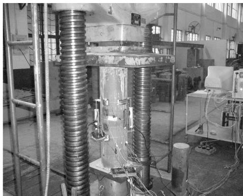

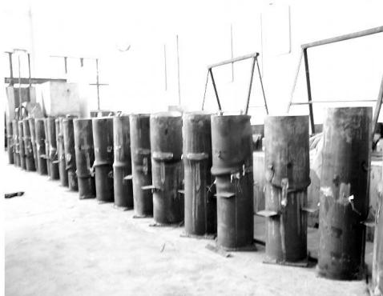  
(a）试件的加载  
(b）破坏后的试件

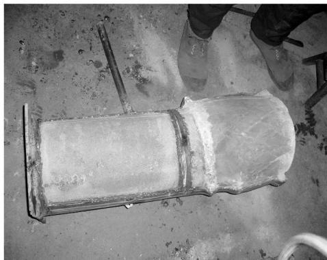  
(c）剥去部分钢管的试件  
图1 试件加载和破坏后的情况  
Fig．1 Loading and Failure Conditions of Specimens

所以应变片读数出现较大的差异‚试验曲线开始出现分叉现象‚如图2（b）所示。

在达到极限承载力之前 试件尚未发生局部屈曲 此时中截面应变片有效 用其测得的应变来表示试件的变形是准确的 当接近极限承载力时 试件开始发生局部屈曲 其局部变形超出了应变片的量程中截面应变片失效 此时用位移计测得的变形值折算后获得的应变来表示试件的变形是合理可行的如图 所示

从图 可以看出 钢管混凝土柱具有良好的塑性和延性 在曲线下降段 承载力下降得比较平缓但是试件表现出的塑性和延性的区别并不十分明显。

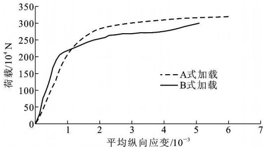  
（a）配合比1

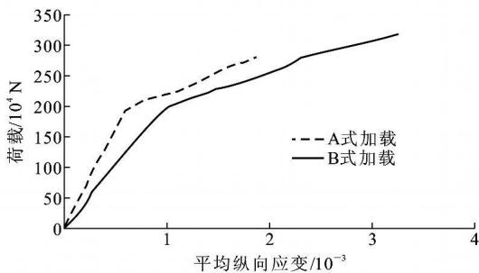

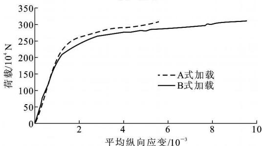  
（b）配合比2  
（c）配合比3  
图2 荷载-平均纵向应变关系曲线  
Fig．2 Relation Curves of Loads and Average Longitudinal Strains

# 2 极限承载力的计算方法

文献 中指出 钢管自密实高性能混凝土的力学性能和普通混凝土基本类似 故可以采用普通钢管混凝土的方法进行钢管自密实混凝土的计算。为此 笔者直接采用文献 中提出的承载力计算公式进行对比验算 对于圆钢管混凝土轴压构件文献［16］中利用数值方法对其极限承载力进行了大规模的参数分析 提出了圆钢管混凝土轴心受压组合强度设计值 $f _ { \mathrm { s c y } }$ 的计算公式 进而得出了其轴压构件强度承载力 $N _ { \mathrm { u c 1 } }$ 的计算公式 即

$$
f _ {\mathrm {s c y}} = (1. 1 4 + 1. 0 2 \xi) f _ {\mathrm {c k}} \tag {1}
$$

$$
N _ {\mathrm {u c l}} = A _ {\mathrm {s c}} f _ {\mathrm {s c y}} \tag {2}
$$

式中： $f _ { \mathrm { c k } }$ 为混凝土抗压强度标准值 $f _ { \mathrm { c k } } { = } 0 . 6 7 f _ { \mathrm { c u } }$ ；ξ为约束效应系数 $\hat { \Xi } { = }  { A _ { \mathrm { s } } } f _ { \mathrm { y } } / (  { A _ { \mathrm { c } } } f _ { \mathrm { c k } } ) ,  { A _ { \mathrm { s } } }  { \mathbf { \Psi } } _ { \mathrm { \mathbf { \times } } } A _ { \mathrm { c } }$ 分别为钢管和混凝土横截面面积； $A { \mathrm { s c } }$ 为钢管混凝土构件的全截面面积 ${ A _ { \mathrm { s c } } } = { A _ { \mathrm { s } } } + { A _ { \mathrm { c } } }$ 。利用式（2）计算的 $N _ { \mathrm { u c 1 } }$ 值见表2。

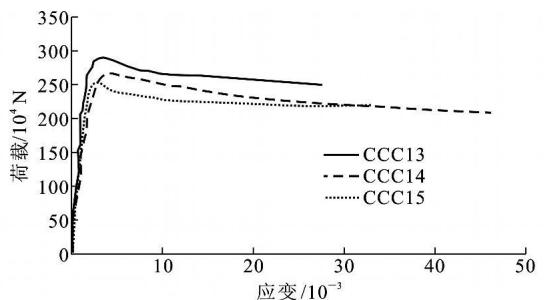  
(a）配合比1,A式加载

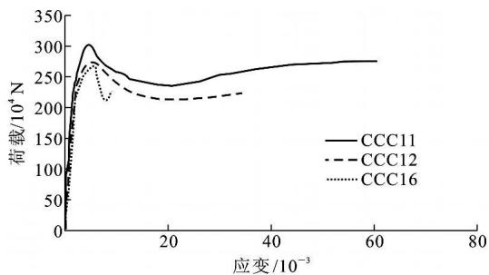  
(b）配合比1,B式加载

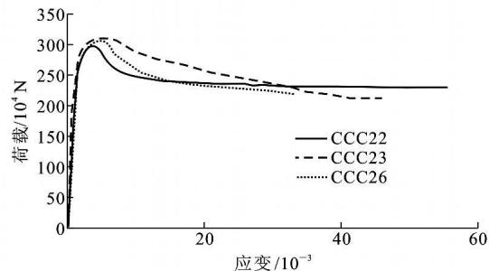  
(c）配合比2,A式加载

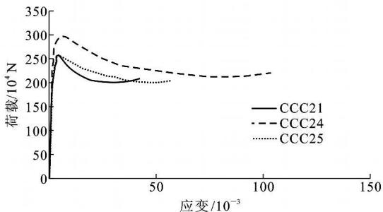  
(d）配合比2,B式加载

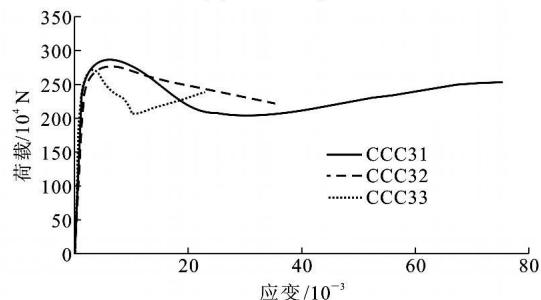  
(e）配合比3,A式加载

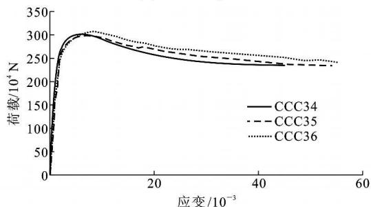  
（f）配合比3,B式加载  
图3 荷载-应变关系曲线  
Fig．3 Relation Curves of Loads and Strains

表2 不同加载方式下钢管自密实混凝土柱的分析结果  
Tab．2 Analysis Results of Self-compacting Concrete-filled Steel Tubular Columns Under Different Loading Modes   

<table><tr><td>序号</td><td>试件编号</td><td>fcu/MPa</td><td>加载方式</td><td>ξ</td><td>承载力试验值Nue/104N</td><td>承载力公式计算值Nuc1/104N</td><td>承载力有限元计算值Nuc2/104N</td><td>Nue·Nuc-1</td><td>Nue·Nuc-1</td></tr><tr><td>1</td><td>CCC11</td><td>44.4</td><td>B</td><td>0.86</td><td>296</td><td>221</td><td>288</td><td>1.339</td><td>1.028</td></tr><tr><td>2</td><td>CCC12</td><td>44.4</td><td>B</td><td>0.86</td><td>278</td><td>221</td><td>288</td><td>1.258</td><td>0.965</td></tr><tr><td>3</td><td>CCC13</td><td>44.4</td><td>A</td><td>0.86</td><td>287</td><td>221</td><td>285</td><td>1.299</td><td>1.007</td></tr><tr><td>4</td><td>CCC14</td><td>44.4</td><td>A</td><td>0.86</td><td>280</td><td>221</td><td>285</td><td>1.267</td><td>0.982</td></tr><tr><td>5</td><td>CCC15</td><td>44.4</td><td>A</td><td>0.86</td><td>270</td><td>221</td><td>285</td><td>1.222</td><td>0.947</td></tr><tr><td>6</td><td>CCC16</td><td>44.4</td><td>B</td><td>0.86</td><td>290</td><td>221</td><td>288</td><td>1.312</td><td>1.007</td></tr><tr><td>7</td><td>CCC21</td><td>44.9</td><td>B</td><td>0.85</td><td>316</td><td>223</td><td>293</td><td>1.417</td><td>1.078</td></tr><tr><td>8</td><td>CCC22</td><td>44.9</td><td>A</td><td>0.85</td><td>305</td><td>223</td><td>291</td><td>1.368</td><td>1.048</td></tr><tr><td>9</td><td>CCC23</td><td>44.9</td><td>A</td><td>0.85</td><td>319</td><td>223</td><td>291</td><td>1.430</td><td>1.096</td></tr><tr><td>10</td><td>CCC24</td><td>44.9</td><td>B</td><td>0.85</td><td>298</td><td>223</td><td>293</td><td>1.336</td><td>1.017</td></tr><tr><td>11</td><td>CCC25</td><td>44.9</td><td>B</td><td>0.85</td><td>263</td><td>223</td><td>293</td><td>1.179</td><td>0.898</td></tr><tr><td>12</td><td>CCC26</td><td>44.9</td><td>A</td><td>0.85</td><td>331</td><td>223</td><td>291</td><td>1.484</td><td>1.137</td></tr><tr><td>13</td><td>CCC31</td><td>47.9</td><td>A</td><td>0.80</td><td>295</td><td>231</td><td>295</td><td>1.277</td><td>1.000</td></tr><tr><td>14</td><td>CCC32</td><td>47.9</td><td>A</td><td>0.80</td><td>288</td><td>231</td><td>295</td><td>1.247</td><td>0.976</td></tr><tr><td>15</td><td>CCC33</td><td>47.9</td><td>A</td><td>0.80</td><td>275</td><td>231</td><td>295</td><td>1.190</td><td>0.932</td></tr><tr><td>16</td><td>CCC34</td><td>47.9</td><td>B</td><td>0.80</td><td>296</td><td>231</td><td>298</td><td>1.281</td><td>0.993</td></tr><tr><td>17</td><td>CCC35</td><td>47.9</td><td>B</td><td>0.80</td><td>313</td><td>231</td><td>298</td><td>1.355</td><td>1.050</td></tr><tr><td>18</td><td>CCC36</td><td>47.9</td><td>B</td><td>0.80</td><td>319</td><td>231</td><td>298</td><td>1.381</td><td>1.070</td></tr></table>

# 3 有限元分析

利用有限元程序 ANSYS 建立钢管自密实混凝土轴压柱的有限元模型［16］‚并将程序计算的结果和试验结果进行对比和分析。

建模中 钢管采用 单元 混凝土采用Solid65单元‚分别建立钢管和混凝土柱的模型‚在接触面采用共节点处理 在进行网格划分时 钢管壁厚方向不再细分单元‚混凝土节点划分较密。主要材料参数取值与试验值一致‚取钢管弹性模量 $E _ { \mathrm { s } }$ 为 $1 . 9 8 \times 1 0 ^ { 5 } \ \mathrm { { M P a } }$ 混凝土弹性模量 $E _ { \mathrm { c } }$ 为 $3 , 6 6 \times$ $1 0 ^ { 5 } ~ \mathrm { { M P a } }$ ‚钢管的泊松比 $\nu$ 为0．28‚钢管的屈服强度$f _ { \mathrm { y } }$ 和极限强度 $f _ { \mathrm { { u } } }$ 分别为 $2 6 0 \ \mathrm { M P a }$ 和 $4 0 0 \ \mathrm { M P a }$ 。

计算时采用如下假设：

（1）钢管和混凝土之间无滑移。  
（2）钢管和混凝土的纵向本构关系选用文献［6］中给出的圆钢管混凝土柱的本构关系。  
只考虑纵向平衡和变形协调条件

图 为 式 式加载各试件试验和有限元分析的荷载-应变曲线对比‚可见有限元计算值与试验值吻合较好

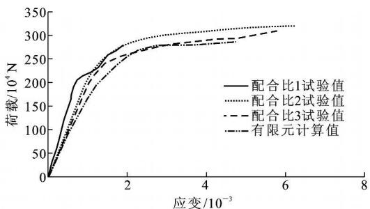

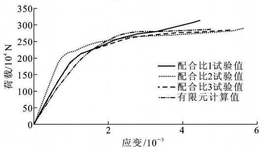  
(a）A式加载  
(b）B式加载   
图4 试验与有限元分析的荷载-应变曲线对比  
Fig．4 Comparisons of Load and Strain Curves by Finite Element Analysis and Test

利用 计算的钢管自密实高性能混凝土柱的极限承载力值 $N _ { \mathrm { u c 2 } }$ 值见表 由表 可以得出 $N _ { \mathrm { u e } } / N _ { \mathrm { u c } } 1$ 的平均值为 均方差为 可见试验值比理论计算值高出 $30 \%$ 左右；Nue／Nuc2的

平均值为1．013‚均方差为0．060‚可见试验值与有限元分析值吻合良好。

# 4 结 语

（1）钢管自密实高性能混凝土轴压构件具有良好的承载能力和抗变形能力。  
（2）不同的加载模式状态下破坏形式没有很明显的差异 但是其承载力和延性表现出一定的差异  
（3）试验所采用的自密实混凝土配合比设计合理 该配合比的钢管混凝土构件的强度承载力与普通混凝土构件基本类似 故可以采用普通钢管混凝土构件的方法进行钢管自密实高性能混凝土构件的强度承载力计算。  
（4）本次试验值高于理论分析值‚与有限元分析值与试验值吻合较好 可为相关工程实践提供参考

# 参考文献：

# References：

吴中伟 廉慧珍 高性能混凝土 北京 中国铁道出版社，1999.  
WU Zhong-wei‚LIAN Hu-i zhen．High-performance Concrete ［ M ］．Beijing：China Railw ay Publishing House,1999.   
［ 2 ］ AIT CIN P C．High-performance Concrete ［ M ］．London：E and F N Spon‚1998．   
［3］ S HA H S P‚A H MAD S H．High-performance Con-crete and Applications ［ M ］． London： Edw ardArnold,1994.  
韩 冰 王元丰 圆钢管混凝土轴心受压构件徐变分析的比较 中国公路学报  
HAN Bing‚WANG Yuan-feng．Creep Analysis Comparison of Circular Axially Compressed Concretefilled Steel T ubular Members ［ J ］．China Journal of Highway and T ransport‚2007‚20（2）：83-86   
［5］ 丁发兴‚余志武‚蒋丽忠．圆钢管混凝土轴压中长柱的承载力 中国公路学报  
DING Fa-xing‚YU Zh-i w u‚JIANG L-i zhong $\because$ ．Bearing Capacity of Middle Lonq Concrete-filled Circular Steel T ubular Columns U nder Axial Compression ［J ］．China Journal of Highway and T ransport‚2007‚20（4）： 65-70.   
［6］ 陈宝春‚韦建刚‚王加迫．钢管混凝土拱桥的挠度限值研究 中国公路学报  
C HEN Bao-chun‚WEI Jian-gang‚WANG Jia-po．Research on Deflection Limit Value for CFST Arch Bridge［J ］．China Journal of Highw ay and T ransport 2007,20(6).56-60.

李小伟 赵均海 朱铁栋 等 方钢管混凝土轴压短柱的力学性能［J］．中国公路学报‚2006‚19（4）：77-81LI Xiao-wei‚Z HAO Jun-hai‚Z HU Tie-dong‚et alMechanics Behavior of Axially Loaded Short Columnswith Concrete-filled Square Steel T ube ［ J ］．ChinaJournal of Highway and T ransport‚2006‚19（4）：77-81.  
［8］ 王毅红‚郭增辉‚李先顺‚等．带有芯钢管的钢管混凝土节点的受力机理［J］．建筑科学与工程学报‚200724（1）：64-68WANG Y-i hong‚GU O Zeng-hui‚LI Xian-shun‚et alBearing Mechanism of Concrete filled Steel TubularJoint with Core Steel T ube ［ J ］．Journal of Architec-ture and Civil Engineering‚2007‚24（1）：64-68  
［9］ 田宏伟‚赵均海‚魏 锦．圆钢管混凝土轴压长柱的极限承载力 ［J］．建筑科学与工程学报‚2007‚24（2）：74-79.TIAN Honq-wei,ZHAO Jun-hai,WEI Jin.UltimateBearing Capacity of Concrete-filled Circular Steel T u-bular Long Columns with Axial Compression ［ J ］Journal of Architecture and Civil Engineering‚2007‚24(2):74-79.  
［10］ 蔡绍怀．现代钢管混凝土结构［M］．北京：人民交通出版社,2003.CAI Shao-huai $\cdot$ ．Modern Steel T ube Confined ConcreteStructures ［ M ］．Beijing：China Communications Press2003.  
［11］ 钟善桐．钢管混凝土结构［M］．3版．北京：清华大学出版社

Z HONG Shan-tong．Concrete-filled Steel T ubular Structures ［ M ］．3rd ed．Beijing：T singhua U niversity Press,2003.   
［12］ 韩林海．钢管混凝土结构－－－理论与实践［ M ］．北京：科学出版社H A N Lin-hai．Concrete-filled Steel T ubular Struc-tures － T heory and Practice ［ M ］．Beijing：SciencePress‚2004  
［13］ CCES 02－2004‚自密实混凝土设计与施工指南［S ］ CCES 02－2004‚Guide to Design and Construction of Self-compacting Concrete［S ］   
［14］ 罗小勇‚余志武‚聂建国‚等．自密实混凝土结构的应 用研究 铁道学报 LU O Xiao-yong‚YU Zh-i w u‚NIE Jian-guo‚et al．Research on Application of Self-compacting Concrete Structures ［J ］．Journal of the China Railw ay Society 2003,25(5).75-80.   
［15］ 韩林海‚杨有福．矩形钢管混凝土轴心受压构件强度承载力的试验研究 土木工程学报22-31.HAN Lin-hai‚YANG You-fu．Study on Axial BearingCapacity of Concrete-filled-stee-l tube Columns withRectangular Section ［J ］．China Civil Engineering Jour-nal,2001,34(4),22-31.  
［16］ 郝文化．ANSYS 土木工程应用实例［M］．北京：中国水利水电出版社H AO Wen-hua．A NSYS Practice Examples in CivilEngineering ［ M ］． Beijing： China Water Pow erPress,2005.

# 《岩土力学》2009年征订通知

岩土力学 是全国中文核心期刊 美国 工程索引 收录期刊 同时也是中国科学引文数据库收录期刊 中国科技论文统计源期刊 且被中国期刊网 中国学术期刊 光盘版 万方数据库 重庆维普数据库全文收录 欢迎读者通过各期刊网查阅本刊内容 本刊主要报道岩土力学与工程研究及工程获得的新理论 新成果 新方法 主要内容有 岩土力学与岩土工程研究 典型工程实录 测试技术与测试方法学术讨论 学术与工程动态 学术讲座等

岩土力学 为月刊 大 开本 页 每月 日出版 国内外公开发行 每期定价 元 全年元。国内邮发代号：38-383‚同时自办发行‚国外订户可通过中国国际图书贸易总公司订阅。汇款请注明：2009年《岩土力学》刊款。

开户行 中国建设银行武汉市科学院支行

账号：42001237053050000260

账 户 中国科学院武汉岩土力学研究所

电 话：（027）87198484

地 址：湖北武汉市小洪山中国科学院武汉岩土力学研究所《岩土力学》编辑部

邮 编

E-mail：ytlx＠w hrsm．ac．cn