doi: 10.3969/j.issn.1002-3550.2015.07.005

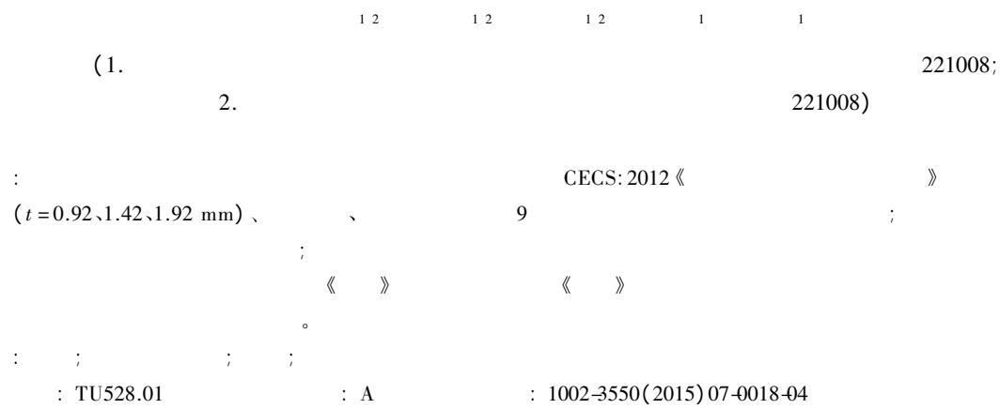  
Ultimate strength analysis to thin - walled circular concrete - filled steel tube column under axial compression

ZHANG Fengjie $^{12}$ XIA Junwu $^{12}$ CHANG Hongfei $^{12}$ TAN Yongchao $^{1}$ XIA Xiang

(1.Jiangsu Key Laboratory of Environmental Impact and Structural Safety in Engineering China University of Mining and Technology Xuzhou 221008 China; 2.State Key Laboratory for Geomechanics and Deep Underground Engineering Xuzhou 221008 China)

Abstract: In order to study ultimate bearing capacity of the thin - walled circular steel tube concrete column is applicable CECS: 2012 "technical specification for concrete filled steel tubular" it made of different thickness $(t = 0.92$ 1.42 1.92 mm) different height different pipe strength experimental study of 9 root circular steel tube concrete column components the test results show that concrete filled thin - walled steel tube columns are still bearing capacity and good ductility load carrying capacity of members comparison the experimental results are consistent with the calculated results according to actual strength member that thin - walled circular steel tube concrete column axial compression bearing capacity is still use the "rules" provides formula and according to the "rules" provides the calculation formula on the conservative side based on the experimental results and the limit of concrete filled thin - walled steel tube columns bearing capacity value of suggestion.

Key words: thin - walled; concrete - filled steel tube column; axial compression; ultimate bearing capacity

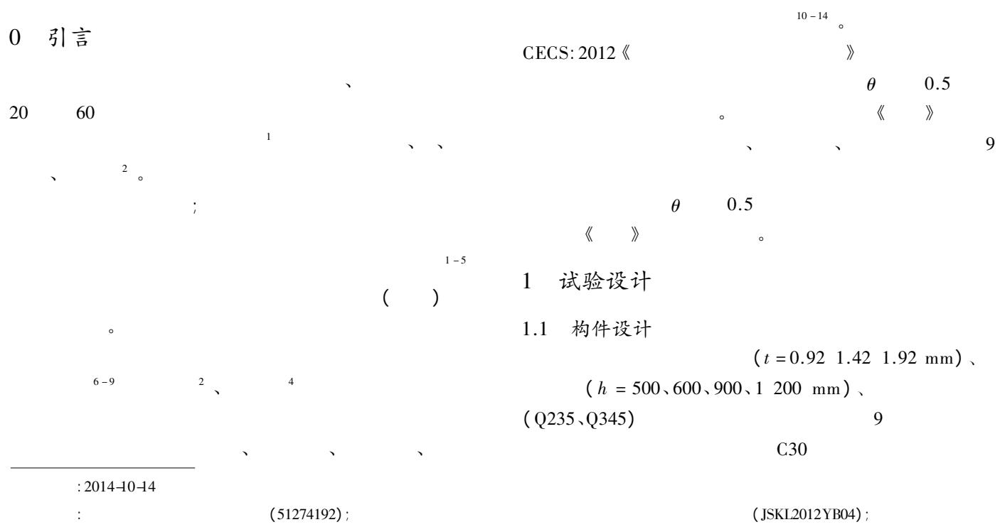

1   

<table><tr><td></td><td>D/mm</td><td>t/mm</td><td>D/t</td><td>θ1</td><td>θ2</td><td>h/mm</td><td>φi</td><td>fc/(N/mm2)</td><td>fc&#x27;/ (N/mm2)</td><td>fy/(N/mm2)</td><td>fy&#x27;/ (N/mm2)</td></tr><tr><td>CSC 1</td><td>139</td><td>0.92</td><td>151</td><td>0.407</td><td>0.27</td><td>500</td><td>1</td><td>14.3</td><td>31.2</td><td>215</td><td>317</td></tr><tr><td>CSC 2</td><td>139</td><td>0.92</td><td>151</td><td>0.407</td><td>0.27</td><td>600</td><td>0.935 3</td><td>14.3</td><td>31.2</td><td>215</td><td>317</td></tr><tr><td>CSC 3</td><td>139</td><td>0.92</td><td>151</td><td>0.407</td><td>0.27</td><td>900</td><td>0.819 1</td><td>14.3</td><td>31.2</td><td>215</td><td>317</td></tr><tr><td>CSC 4</td><td>139</td><td>0.92</td><td>151</td><td>0.407</td><td>0.27</td><td>1 200</td><td>0.752 5</td><td>14.3</td><td>31.2</td><td>215</td><td>317</td></tr><tr><td>CSC 5</td><td>139</td><td>1.42</td><td>97.87</td><td>0.633</td><td>0.396</td><td>500</td><td>1</td><td>14.3</td><td>31.2</td><td>215</td><td>293</td></tr><tr><td>CSC 6</td><td>139</td><td>1.92</td><td>72.4</td><td>0.866</td><td>0.609</td><td>500</td><td>1</td><td>14.3</td><td>31.2</td><td>215</td><td>329.8</td></tr><tr><td>CSC 7</td><td>139</td><td>0.92</td><td>151</td><td>0.374</td><td>0.48</td><td>600</td><td>0.935 3</td><td>14.3</td><td>31.2</td><td>315</td><td>427.66</td></tr><tr><td>CSC 8</td><td>139</td><td>0.92</td><td>151</td><td>0.374</td><td>0.48</td><td>900</td><td>0.819 1</td><td>14.3</td><td>31.2</td><td>315</td><td>427.66</td></tr><tr><td>CSC 9</td><td>139</td><td>0.92</td><td>151</td><td>0.374</td><td>0.48</td><td>1 200</td><td>0.752 5</td><td>14.3</td><td>31.2</td><td>315</td><td>427.66</td></tr><tr><td colspan="4">: θ1 — 《 》; f_c — —</td><td colspan="3">; θ2 — —</td><td colspan="2">; φ1 — —</td><td colspan="3">; f_c — —</td></tr></table>

# 1.2 加载方式设计

<table><tr><td colspan="2">7 000 kN</td></tr><tr><td>200 t</td><td></td></tr><tr><td>、</td><td>、</td></tr><tr><td>50 kN</td><td>3 min</td></tr><tr><td>20 kN。</td><td>1。</td></tr></table>

# 1.3 构件破坏形态

<table><tr><td>(CSCC3)</td><td>( CSCC9)</td></tr><tr><td>2(a)、(b)、(c)</td><td></td></tr><tr><td>2(d)</td><td></td></tr></table>

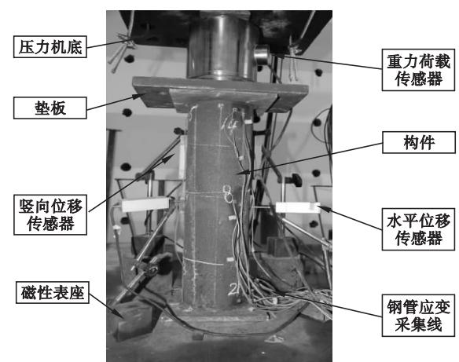  
1

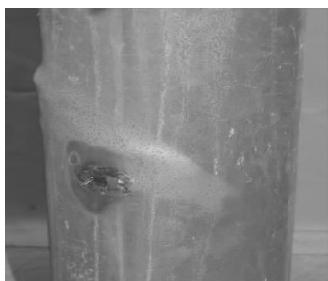  
(a)CSCC1破坏形态

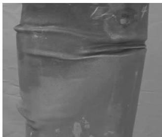  
(b)CSCC3破坏形态

  
(c)CSCC4破坏形态

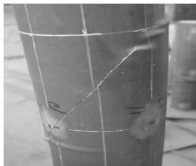  
(d)CSCC9破坏形态   
2

# 2 薄壁钢管混凝土柱力学性能影响因素分析

# 2.1 钢管材性影响

《

$$
N _ {0} \quad , N _ {1}
$$

》

2。

$$

$$

$N_{2}$

N

$$
N _ {0}, N _ {1}, N _ {2}
$$

<table><tr><td colspan="2">N0、N1</td><td>;</td><td colspan="2">N0、N2</td></tr><tr><td colspan="2">Q235</td><td></td><td>1.47%</td><td>5.31%</td></tr><tr><td>5</td><td></td><td></td><td>10%</td><td>17.73%。</td></tr><tr><td></td><td>2</td><td>3、4。</td><td></td><td></td></tr><tr><td>2</td><td>3、4</td><td></td><td></td><td></td></tr><tr><td></td><td></td><td>Q345</td><td>Q235</td><td></td></tr><tr><td></td><td colspan="2">80%</td><td>Q235</td><td></td></tr><tr><td>Q345</td><td colspan="2">;</td><td></td><td></td></tr><tr><td></td><td colspan="2">Q345</td><td></td><td></td></tr></table>

； Q235

<table><tr><td></td><td>θ1</td><td>θ2</td><td>N1/kN</td><td>N2/kN</td><td>N0/kN</td><td>N0/N1/%</td><td>N0/N2/%</td><td>N2/N1/%</td></tr><tr><td>CSCC 1</td><td>0.407</td><td>0.27</td><td>344.8</td><td>638.6</td><td>648.8</td><td>188.48</td><td>101.47</td><td>185.75</td></tr><tr><td>CSCC 2</td><td>0.407</td><td>0.27</td><td>322.5</td><td>597.3</td><td>629.9</td><td>195.04</td><td>105.31</td><td>185.21</td></tr><tr><td>CSCC 3</td><td>0.407</td><td>0.27</td><td>282.4</td><td>523.1</td><td>550.2</td><td>194.76</td><td>105.14</td><td>185.23</td></tr><tr><td>CSCC 4</td><td>0.407</td><td>0.27</td><td>255.0</td><td>480.6</td><td>490.1</td><td>192.16</td><td>101.96</td><td>188.47</td></tr><tr><td>CSCC 5</td><td>0.633</td><td>0.396</td><td>424.4</td><td>732.3</td><td>749.7</td><td>176.65</td><td>102.38</td><td>172.57</td></tr><tr><td>CSCC 6</td><td>0.866</td><td>0.609</td><td>504.2</td><td>893.2</td><td>931.9</td><td>184.83</td><td>104.33</td><td>177.15</td></tr><tr><td>CSCC 7</td><td>0.374</td><td>0.48</td><td>435.7</td><td>930.0</td><td>1 029.2</td><td>236.17</td><td>110.65</td><td>213.45</td></tr><tr><td>CSCC 8</td><td>0.374</td><td>0.48</td><td>357.6</td><td>813.8</td><td>940.6</td><td>262.86</td><td>115.51</td><td>227.57</td></tr><tr><td>CSCC 9</td><td>0.374</td><td>0.48</td><td>328.5</td><td>747.5</td><td>880.7</td><td>267.88</td><td>117.73</td><td>227.55</td></tr></table>

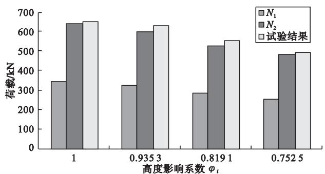  
3 Q235

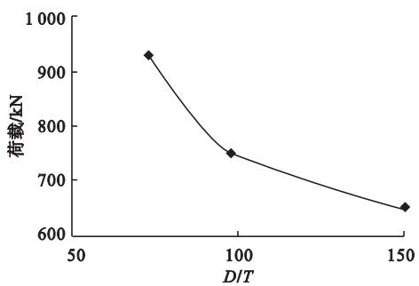  
5 D/T—

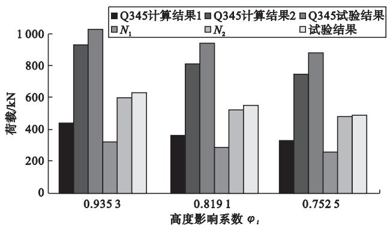  
4 Q345、Q235

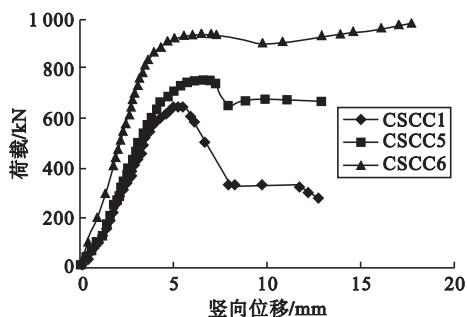  
6

50%

2.2 径厚比 $(D / T)$ 影响

2.3 长径比 $(L / D)$ 的影响

5、6。

5 3 $D / T$

。 6 CSCC1 CSCC5

CSCC6

D/T ； D/T

CSCC1

0.5

7.8。 3 8

CSCC1、CSCC2、CSCC4 $N_{3}$ 331.2、

344.1、331.2 kN

$N_{3} / N_{2}$

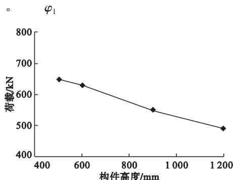

·20·

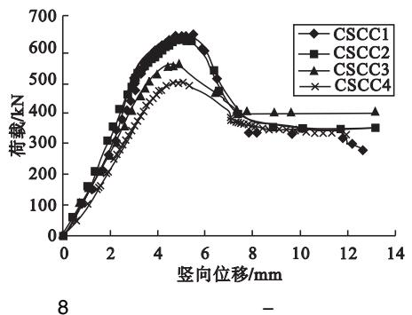

3   

<table><tr><td></td><td>/mm</td><td>N3/kN</td><td>N1/kN</td><td>N0/kN</td><td>N3/N0/%</td></tr><tr><td>CSCC 1</td><td>5.46</td><td>331.2</td><td>344.8</td><td>648.8</td><td>51.05</td></tr><tr><td>CSCC 2</td><td>4.96</td><td>344.1</td><td>322.5</td><td>629.9</td><td>54.63</td></tr><tr><td>CSCC 3</td><td>4.87</td><td>401.4</td><td>282.4</td><td>550.2</td><td>72.96</td></tr><tr><td>CSCC 4</td><td>4.72</td><td>331.2</td><td>255.0</td><td>490.1</td><td>67.57</td></tr><tr><td>CSCC 5</td><td>5.87</td><td>667.7</td><td>424.4</td><td>749.7</td><td>89.06</td></tr><tr><td>CSCC 6</td><td>6.95</td><td>900.2</td><td>504.2</td><td>931.9</td><td>96.60</td></tr></table>

3 薄壁圆钢管混凝土柱构件极限承载力修正建议

1、2、3

3、4

$N_{0}$

$N_{1}$ 88.48%(Q235)

136.17%（Q345）； $N_{2}$

$N_{1}$ 85.21%（Q235）

113.45%（Q345）； $N_{2}$ $N_{0}$

$N_{0}$ $N_{2}5.31\%$ (Q235)

17.73%(Q345) 《 》

$N_{3}$

$N_{1}$

CSCC1

$N_{3}$

$N_{1}$ $N_{3}$ $N_{1}$ 。

6、8

6.8 $N_{0}$ 80%~85% $N_{0}$ $N_{2}$ $(N_{2} / N_{1})$ 80%~85%

《 》 $50\%$

《 》

1.5。

4 结论

(1)

$(D / T)$

$(D / T)$

(2)

(3)

《 》 《 》

1.5。

1 J. 2008 (25): 174 - 175.

2 2007.

3 M. 2007.

4 M. 2004.

5 J. 2002 18(4):1-7.

6 BODE H Columns of steel tubular sections filled with concrete - design and application J .Acier Stahl Steel 11(12):388-393.

7 BRIDGE R Q. Concrete filled steel tubular columns C //Report No.R283 School of Civil Engineering Austrial 1976 29-40.

8 J. 1984(6).

9 OGOODE C D J. 1996 26(3):23-27.

10 J. 2005 35(1):22-27.

11 J. 2012 28(3):34-42.

12 J. 2011 32(8):69-78.

13

J. 2009 29(2):70-74.

14

J. 2006 27(5):16-22. : (1979-)

(221008)

： 13645228766