# Experimental behavior of CFST stub columns after being exposed to freezing and thawing

CrossMark

You-Fu Yang ⁎, Kai Cao, Tian-Zheng Wang

State Key Laboratory of Coastal and Offshore Engineering, Dalian University of Technology, Dalian, People's Republic of China

# a r t i c l e i n f o

Article history:

Received 27 September 2012

Accepted 13 January 2013

Keywords:

Concrete-filled steel tube (CFST)

Stub columns

Freeze–thaw cycles

Ultimate strength

Elastic modulus

Design formula

# a b s t r a c t

The behavior of concrete-filled steel tube (CFST) stub columns after being exposed to freezing and thawing is experimentally investigated in this paper. Thirty CFST stub columns, including 15 circular specimens and 15 square specimens, were tested, and the failure pattern, load versus deformation relationship, ultimate strength and elastic modulus of the specimens were obtained and analyzed. The number of freeze–thaw cycles (from 0 to 300) and the steel ratio (cross-sectional area ratio of steel to concrete, from 0.085 to 0.176) were considered as main parameters. The test results showed that, in general, the CFST stub columns without being subjected to freezing and thawing performed a better property than those after freezing and thawing exposures. Furthermore, the larger the number of freeze–thaw cycles, the lower the ultimate strength and elastic modulus of the CFST stub columns. Based on the regression of the test data, the simplified formula for ultimate strength and elastic modulus of CFST stub columns after being exposed to freezing and thawing was proposed, and the accuracy of the formulae was evaluated by comparison between the calculated and experimental results.

$^ { © }$ 2013 Elsevier B.V. All rights reserved.

# 1. Introduction

Concrete-filled steel tube (CFST) columns are widely used in the field of civil engineering due to their excellent structural performance, such as larger energy absorption during earthquake and easier for construction compared with reinforced concrete columns, and higher strength and fire resistance compared with unfilled steel columns (Zhao et al., 2010). At present, most attention has been devoted to the short-term mechanical properties of such composite members. However, similar to reinforced concrete members, their long-term durability is crucial as they may also suffer from chloride corrosion (Han et al., 2012) and concrete frost heaving (Wang et al., 2012). In recent years, several low-temperature failure accidents of CFST columns have happened in the north of China (Huang et al., 2008; Wang et al., 2005, 2012; Yin and Yang, 2002), as summarized and presented in Table 1. It is concluded that the failure of CFST in freeze–thaw environment is caused by the combination of the icing and migration of free water in the concrete (Powers, 1945) and the low-temperature fracture of the steel. As a result, the investigation on the behavior in freeze–thaw environment is a very important issue to ensure the safety of CFST structures in cold region. To date, the structural performance of CFST members subjected to freezing and thawing has not received sufficient attention.

Recently, a few tests have been conducted to investigate the performance of CFST members subjected to freezing and thawing. Yang (2008) experimentally investigated the performance of steel tube confined concrete (STCC) and plain concrete in freeze–thaw environment, and the tests were carried out through a rapid freeze–thaw testing equipment. The results showed that the performance of all specimens was reduced after freezing and thawing exposures; however, the decrease of strength and elastic modulus of concrete in STCC was less than that of plain concrete due to the confinement effect of outer steel tube. Tests on two specimens in low-temperature $( - 2 0 \ ^ { \circ } \mathrm { C } )$ environment were performed by Wang et al. (2012) to investigate the influence of water–cement ratio and age of concrete on the frost heaving of concrete in CFST. Li et al. (2012) carried out the tests on the structural behavior of concrete-filled glass fiber-reinforced polymer (FRP) externally bonded steel tube specimens after being exposed to freezing and thawing, and in the tests the temperature varied from $- 1 8 ~ ^ { \circ } \mathrm { C }$ to $1 8 ~ ^ { \circ } \mathrm { C } .$ It was found that, the obvious degradation of strength and modulus of the specimens happened after 56 freeze–thaw cycles.

According to the existing information, it is clear that the current study on the structural performance of CFST subjected to freezing and thawing is limited. This paper presents the detailed description of an experimental study on the compressive behavior of CFST stub columns after being exposed to freezing and thawing. The experimental investigation was carried out using circular and square specimens under different number of freeze–thaw cycles and various steel ratio. Based on the regression of the test data, the simplified formula for ultimate strength and elastic modulus of CFST stub columns after

<table><tr><td colspan="2">Nomenclature</td></tr><tr><td>Ac</td><td>Cross-sectional area of concrete</td></tr><tr><td>As</td><td>Cross-sectional area of steel</td></tr><tr><td>C40</td><td>Strength grade of concrete with characteristic cube compressive strength of 40 MPa</td></tr><tr><td>CFST</td><td>Concrete-filled steel tube</td></tr><tr><td>D</td><td>Outside diameter or width of circular or square steel tube</td></tr><tr><td>Ec</td><td>Elastic modulus of concrete</td></tr><tr><td>Es</td><td>Elastic modulus of steel</td></tr><tr><td>Esc,c</td><td>Calculated elastic modulus</td></tr><tr><td>Esc,e</td><td>Experimental elastic modulus</td></tr><tr><td>fc</td><td>Cylinder compressive strength of concrete</td></tr><tr><td>fcu</td><td>Cube compressive strength of concrete</td></tr><tr><td>fy</td><td>Yield strength of steel</td></tr><tr><td>H</td><td>Height of the column</td></tr><tr><td>kce</td><td>Concrete enhancement factor</td></tr><tr><td>kem</td><td>Elastic modulus ratio</td></tr><tr><td>kus</td><td>Ultimate strength ratio</td></tr><tr><td>N</td><td>Axial load</td></tr><tr><td>Nft</td><td>Number of freeze-thaw cycles</td></tr><tr><td>Nuc</td><td>Calculated ultimate strength</td></tr><tr><td>Nue</td><td>Experimental ultimate strength</td></tr><tr><td>t</td><td>Wall thickness of the steel tube</td></tr><tr><td>α</td><td>Steel ratio (=As/Ac)</td></tr><tr><td>δ</td><td>Axial shortening</td></tr><tr><td>ε</td><td>Strain</td></tr><tr><td>σ</td><td>Stress</td></tr></table>

freezing and thawing exposures was proposed, and the accuracy of the formulae was evaluated by comparison between the calculated and experimental results.

# 2. Experimental program

# 2.1. Material properties

Mild steel plates with the average thickness of 2.0 mm, 3.0 mm and $3 . 9 ~ \mathrm { m m }$ were chosen to manufacture the tubes by machining and welding. For each type of steel plate, there were three tensile coupons randomly cut from the steel plate which were tested to determine the yield strength $( f _ { y } )$ , tensile strength $\left( f _ { \mathrm { u } } \right)$ , modulus of elasticity $\left( E _ { s } \right)$ , Poisson's ratio and elongation of the steel. The average

Table 2 Properties of the steel.   

<table><tr><td>No.</td><td>t (mm)</td><td>fy (MPa)</td><td>fu (MPa)</td><td>Es (N/mm2)</td><td>Poisson&#x27;s ratio</td><td>Elongation (%)</td></tr><tr><td>1</td><td>2.0</td><td>184.7</td><td>334.9</td><td>1.87×105</td><td>0.291</td><td>38.5</td></tr><tr><td>2</td><td>3.0</td><td>176.5</td><td>321.3</td><td>1.89×105</td><td>0.289</td><td>35.9</td></tr><tr><td>3</td><td>3.9</td><td>235.1</td><td>458.2</td><td>1.88×105</td><td>0.286</td><td>24.8</td></tr></table>

properties of the steel are presented in Table 2, and the measured typical stress (σ) versus strain (ε) relationship of the steel is shown in Fig. 1.

In this study, self-consolidating concrete (SCC) was produced to fill the steel tube. The mix proportions of SCC were: cement: $4 2 0 ~ \mathrm { k g / m ^ { 3 } }$ ; fly ash: $1 3 0 ~ \mathrm { k g / m ^ { 3 } }$ ; coarse aggregate: $8 3 2 ~ \mathrm { k g / m ^ { 3 } }$ ; fine aggregate: $7 9 9 ~ \mathrm { k g / m ^ { 3 } }$ ; water: $1 7 8 . 8 ~ \mathrm { k g / m ^ { 3 } }$ ; and water reducing agent: $6 . 0 5 ~ \mathrm { k g } / \mathrm { m } ^ { 3 }$ . The fine and coarse aggregate adopted were siliceous sand and carbonaceous stone respectively, and they were air-dried before use. The maximum size of the coarse aggregate was $2 0 ~ \mathrm { m m }$ and the grading profile of the coarse aggregate is presented in Table 3. It is concluded (Aïtcin, 1998) that, for high-performance concrete (e.g. self-consolidating concrete), air entrainment is no longer required to improve the freezing and thawing resistance when the water/binder ratio is below a critical value, and the critical water/ binder ratio lies between 0.25 and 0.30 for most Portland cements. In present tests, the water/binder ratio of SCC is 0.325 which is close to the upper limit suggested by Aïtcin (1998) and at the same time the SCC is isolated from water in freeze–thaw environment. Furthermore, the concrete was produced in summer. Considering these facts, neither air entrainment nor antifreeze mixture of additive was added to the concrete. The slump flow test and slump test were carried out to evaluate the rheological properties of the fresh SCC, and the measured slump and slump-flow were $2 6 0 ~ \mathrm { { m m } }$ and $6 9 5 ~ \mathrm { m m } ,$ , respectively. The cube compressive strength $\left( f _ { \mathrm { c u } } \right)$ and elastic modulus $\left( E _ { \mathrm { c } } \right)$ of SCC were obtained by testing $1 5 0 ~ \mathrm { m m }$ cubes and $1 5 0 ~ \mathrm { m m } \times$ $1 5 0 \ \mathrm { m m } \times 3 0 0 \ \mathrm { m m }$ prisms, respectively. The measured average value of cube compressive strength at 28-day and at the time of the loading tests was 55.0 MPa and 83.9 MPa respectively, and the elastic modulus was $3 6 , 4 0 0 ~ \mathrm { N / m m } ^ { 2 }$ . The SCC was filled into the steel tube without any vibration.

# 2.2. Specimens preparations

Thirty CFST stub columns, including 15 circular specimens and 15 square specimens, were prepared. The outer diameter (width) of the specimens was designed as $1 0 0 ~ \mathrm { { m m } }$ to match the internal dimensions

Table 1 Typical low-temperature failure accidents of CFST columns.   

<table><tr><td>No.</td><td>Location</td><td>Minimum temperature suffered</td><td>Type of column</td><td>Type of steel tube</td><td>Maximum steel tube (mm)</td><td>Strength grade of concrete</td><td>Water to cement ratio of concrete</td><td>Failure time</td><td>Failure pattern</td><td>References</td></tr><tr><td>1</td><td>Liaoning, China</td><td>-16 °C</td><td>Three- or four-leg lattice column</td><td>Spiral seam welded tube</td><td>○ - 450×12</td><td>C40</td><td>0.42</td><td>During construction</td><td>Longitudinal cracking at non-weld zone</td><td>Yin and Yang (2002)</td></tr><tr><td>2</td><td>Hebei, China</td><td>-16 °C</td><td>Single column</td><td>Spiral seam welded tube</td><td>○ - 368×10</td><td>NA</td><td>NA</td><td>During service stage</td><td>Longitudinal cracking from middle part of the column</td><td>Wang et al. (2005)</td></tr><tr><td>3</td><td>Liaoning, China</td><td>-14 °C</td><td>Two- or four-leg lattice column</td><td>Spiral seam welded tube</td><td>○ - 700×12</td><td>C40</td><td>NA</td><td>During construction</td><td>Longitudinal cracking at the junction of column and beam web</td><td>Huang et al. (2008)</td></tr><tr><td>4</td><td>Heilongjiang, China</td><td>-10 °C</td><td>Single column</td><td>Straight seam welded tube</td><td>NA</td><td>C40</td><td>Less than and equal to 0.45</td><td>During construction</td><td>Longitudinal cracking at non-weld zone</td><td>Wang et al. (2012)</td></tr><tr><td>5</td><td>Beijing, China</td><td>&lt;0 °C</td><td>Single column</td><td>NA</td><td>○ - 1000×25</td><td>C40</td><td>NA</td><td>During service stage</td><td>Longitudinal cracking</td><td>Wang et al. (2012)</td></tr></table>

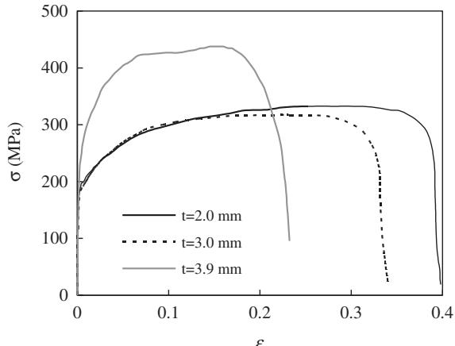  
Fig. 1. Typical $\sigma - \varepsilon$ relationship of the steel.

Table 3 Grading profile of the coarse aggregate.   

<table><tr><td>Sieve size (mm)</td><td>26.5</td><td>19</td><td>16</td><td>9.5</td><td>4.75</td><td>2.36</td></tr><tr><td>Weight of screen residue (g)</td><td>-</td><td>1598</td><td>1073</td><td>2486</td><td>1080</td><td>63</td></tr><tr><td>Cumulative percentage (%)</td><td>-</td><td>25</td><td>42</td><td>82</td><td>99</td><td>100</td></tr></table>

$1 0 5 \ \mathrm { m m } \times 1 0 5 \ \mathrm { m m } \times 4 5 0 \ \mathrm { m m } )$ of the rubber box. The main parameters varied in the tests were:

♦ Number of freeze–thaw cycles $( N _ { \mathrm { f t } } )$ : 0, 50, 100, 200 and 300; and   
$\spadesuit$ Steel ratio $[ \alpha ,$ which is defined as the cross-sectional area ratio of steel $\left( A _ { s } \right)$ to concrete $\left( A _ { \mathrm { c } } \right)$ ]: 0.085, 0.132, and 0.176.

A summary of test information is given in Table 4, where D is the outside diameter (width) of circular (square) steel tube; t is the wall thickness of the steel tube; and H is the height of the specimen. Each steel tube was welded to two endplates with the thickness of $1 2 ~ \mathrm { m m }$ . In Table 4, the first part of the specimen label denotes the section type

and the thickness of the steel tube, and the second part represents the number of freeze–thaw cycles.

# 2.3. Freeze–thaw tests

A China standard GB/T 50082–2009 (2009) for test methods of long-term performance and durability of ordinary concrete was temporarily referenced to determine the number of freeze–thaw cycles $\left( N _ { \mathrm { f t } } \right)$ due to the fact that there is no test standard for CFST subjected to freezing and thawing currently. A rapid freeze–thaw testing equipment was used to carry out the freeze–thaw cycles according to the fast freezing method in GB/T 50082–2009 (2009), and the temperature of the test equipment ranged from $- 2 2 ~ ^ { \circ } \mathrm { C }$ to $2 0 ~ ^ { \circ } \mathrm { C } .$ However, owing to the protection of the outer steel tube, the core concrete of CFST specimens was isolated from the water, so the soaking and freeze–thaw in water requirements for plain concrete were not applied to CFST in present tests. Fig. 2 shows the schematic diagram of rapid freeze–thaw testing equipment and specimens.

The main parameters and technical index during the process of the freezing and thawing are as follows:

• Each freeze–thaw cycle starts by decreasing the temperature of the specimens from 5 to $- 1 8 ~ ^ { \circ } \mathrm { C }$ and then increasing it from $- 1 8$ to $5 ~ ^ { \circ } C$ in $^ { 2 - 4 \mathrm { ~ h ~ } }$ , and not less than a quarter of the time is used for thawing.   
• The lowest and highest temperatures at the center of the specimens are $- 1 8 \pm 2 { \ ^ { \circ } C }$ and $5 \pm 2 ~ ^ { \circ } \mathrm { C }$ respectively, and no specimen reaches a temperature lower than $- 2 0 ~ ^ { \circ } \mathrm { C }$ or higher than $7 ~ ^ { \circ } C$ at any time.   
• The time for the temperature to be reduced from 3 to $- 1 6 ~ ^ { \circ } \mathrm { C }$ is not less than one half of the length of the cooling period, and the time for the temperature to be raised from $- 1 6$ to $3 ~ ^ { \circ } \mathsf { C }$ is not less than one half of the heating period.   
• The temperature difference between the center of a specimen and its surface does not exceed $2 8 ~ ^ { \circ } \mathrm { C }$ at any time.   
• The time of transition from freezing phases to thawing phases of each cycle does not exceed $1 0 ~ \mathrm { { m i n } }$ .

Table 4 Summary of test information.   

<table><tr><td>Section type</td><td>No.</td><td>Label</td><td>D(mm)</td><td>t(mm)</td><td>H(mm)</td><td>α</td><td>Nft</td><td>Nue(kN)</td><td>kus</td><td>Esc,e(N/mm2)</td><td>kem</td></tr><tr><td rowspan="15">Circular</td><td>1</td><td>C2-0</td><td>100</td><td>2.0</td><td>300</td><td>0.085</td><td>0</td><td>683.0</td><td>1.000</td><td>41,417</td><td>1.000</td></tr><tr><td>2</td><td>C2-50</td><td>100</td><td>2.0</td><td>300</td><td>0.085</td><td>50</td><td>577.9</td><td>0.846</td><td>33,129</td><td>0.800</td></tr><tr><td>3</td><td>C2-100</td><td>100</td><td>2.0</td><td>300</td><td>0.085</td><td>100</td><td>671.2</td><td>0.983</td><td>32,680</td><td>0.789</td></tr><tr><td>4</td><td>C2-200</td><td>100</td><td>2.0</td><td>300</td><td>0.085</td><td>200</td><td>680.1</td><td>0.996</td><td>43,291</td><td>1.045</td></tr><tr><td>5</td><td>C2-300</td><td>100</td><td>2.0</td><td>300</td><td>0.085</td><td>300</td><td>580.4</td><td>0.850</td><td>29,611</td><td>0.715</td></tr><tr><td>6</td><td>C3-0</td><td>100</td><td>3.0</td><td>300</td><td>0.132</td><td>0</td><td>772.1</td><td>1.000</td><td>49,865</td><td>1.000</td></tr><tr><td>7</td><td>C3-50</td><td>100</td><td>3.0</td><td>300</td><td>0.132</td><td>50</td><td>689.5</td><td>0.893</td><td>50,165</td><td>1.006</td></tr><tr><td>8</td><td>C3-100</td><td>100</td><td>3.0</td><td>300</td><td>0.132</td><td>100</td><td>726.4</td><td>0.941</td><td>38,428</td><td>0.771</td></tr><tr><td>9</td><td>C3-200</td><td>100</td><td>3.0</td><td>300</td><td>0.132</td><td>200</td><td>682.8</td><td>0.884</td><td>43,057</td><td>0.863</td></tr><tr><td>10</td><td>C3-300</td><td>100</td><td>3.0</td><td>300</td><td>0.132</td><td>300</td><td>625.9</td><td>0.811</td><td>44,871</td><td>0.900</td></tr><tr><td>11</td><td>C3.9-0</td><td>100</td><td>3.9</td><td>300</td><td>0.176</td><td>0</td><td>935.2</td><td>1.000</td><td>59,962</td><td>1.000</td></tr><tr><td>12</td><td>C3.9-50</td><td>100</td><td>3.9</td><td>300</td><td>0.176</td><td>50</td><td>953.7</td><td>1.020</td><td>58,435</td><td>0.975</td></tr><tr><td>13</td><td>C3.9-100</td><td>100</td><td>3.9</td><td>300</td><td>0.176</td><td>100</td><td>1034.0</td><td>1.106</td><td>51,295</td><td>0.855</td></tr><tr><td>14</td><td>C3.9-200</td><td>100</td><td>3.9</td><td>300</td><td>0.176</td><td>200</td><td>977.2</td><td>1.045</td><td>46,419</td><td>0.774</td></tr><tr><td>15</td><td>C3.9-300</td><td>100</td><td>3.9</td><td>300</td><td>0.176</td><td>300</td><td>950.8</td><td>1.017</td><td>57,396</td><td>0.957</td></tr><tr><td rowspan="15">Square</td><td>1</td><td>S2-0</td><td>100</td><td>2.0</td><td>300</td><td>0.085</td><td>0</td><td>867.3</td><td>1.000</td><td>38,731</td><td>1.000</td></tr><tr><td>2</td><td>S2-50</td><td>100</td><td>2.0</td><td>300</td><td>0.085</td><td>50</td><td>810.3</td><td>0.934</td><td>37,499</td><td>0.968</td></tr><tr><td>3</td><td>S2-100</td><td>100</td><td>2.0</td><td>300</td><td>0.085</td><td>100</td><td>753.9</td><td>0.869</td><td>36,645</td><td>0.946</td></tr><tr><td>4</td><td>S2-200</td><td>100</td><td>2.0</td><td>300</td><td>0.085</td><td>200</td><td>779.1</td><td>0.898</td><td>37,300</td><td>0.963</td></tr><tr><td>5</td><td>S2-300</td><td>100</td><td>2.0</td><td>300</td><td>0.085</td><td>300</td><td>673.0</td><td>0.776</td><td>36,432</td><td>0.941</td></tr><tr><td>6</td><td>S3-0</td><td>100</td><td>3.0</td><td>300</td><td>0.132</td><td>0</td><td>891.3</td><td>1.000</td><td>44,781</td><td>1.000</td></tr><tr><td>7</td><td>S3-50</td><td>100</td><td>3.0</td><td>300</td><td>0.132</td><td>50</td><td>818.0</td><td>0.918</td><td>43,400</td><td>0.969</td></tr><tr><td>8</td><td>S3-100</td><td>100</td><td>3.0</td><td>300</td><td>0.132</td><td>100</td><td>754.7</td><td>0.847</td><td>42,651</td><td>0.952</td></tr><tr><td>9</td><td>S3-200</td><td>100</td><td>3.0</td><td>300</td><td>0.132</td><td>200</td><td>830.0</td><td>0.931</td><td>46,544</td><td>1.039</td></tr><tr><td>10</td><td>S3-300</td><td>100</td><td>3.0</td><td>300</td><td>0.132</td><td>300</td><td>696.9</td><td>0.782</td><td>31,549</td><td>0.705</td></tr><tr><td>11</td><td>S3.9-0</td><td>100</td><td>3.9</td><td>300</td><td>0.176</td><td>0</td><td>1068.0</td><td>1.000</td><td>58,937</td><td>1.000</td></tr><tr><td>12</td><td>S3.9-50</td><td>100</td><td>3.9</td><td>300</td><td>0.176</td><td>50</td><td>1095.0</td><td>1.025</td><td>45,878</td><td>0.778</td></tr><tr><td>13</td><td>S3.9-100</td><td>100</td><td>3.9</td><td>300</td><td>0.176</td><td>100</td><td>1127.0</td><td>1.055</td><td>57,419</td><td>0.974</td></tr><tr><td>14</td><td>S3.9-200</td><td>100</td><td>3.9</td><td>300</td><td>0.176</td><td>200</td><td>1134.0</td><td>1.062</td><td>48,358</td><td>0.821</td></tr><tr><td>15</td><td>S3.9-300</td><td>100</td><td>3.9</td><td>300</td><td>0.176</td><td>300</td><td>1126.0</td><td>1.054</td><td>54,887</td><td>0.931</td></tr></table>

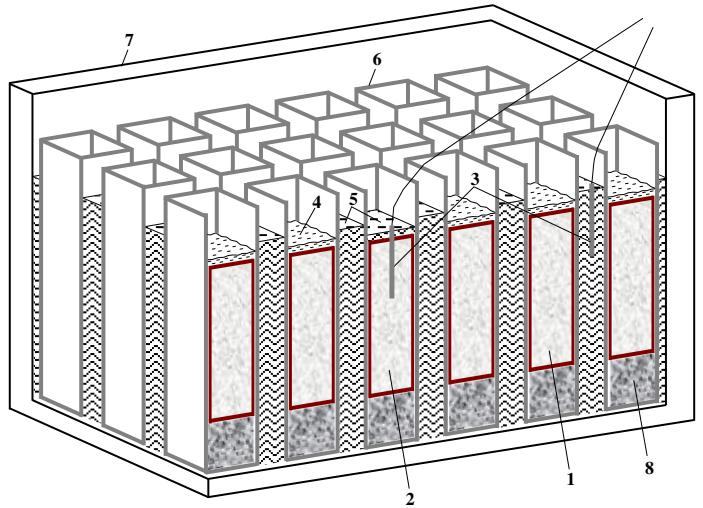  
Fig. 2. Schematic diagram of rapid freeze–thaw testing equipment and specimens. (1 — Specimen; 2 — Specimen for temperature measurement; 3 — Thermocouples; 4 — Water; 5 — Antifreeze fluid; 6 — Rubber box; 7 — Container; and 8 — Concrete cube).

In the tests, the shapes of specimen were categorized into circular and square series, with each of 15 specimens and one companion specimen to determine the temperature at the center and to control the freeze–thaw cycles (see Fig. 2). The freeze–thaw tests started at the 75th and 115th days after productions of circular and square CFST stub columns, respectively. During the tests, the quality and the dynamic elastic modulus of the specimens were not measured considering the particularity of CFST, i.e. the concrete was isolated from the water due to the existence of outer steel tube. The freeze– thaw tests were stopped after completion of 300 freeze–thaw cycles. It was found that, for the steel tube of the specimens, there was neither distortion nor cracking after being exposed to freezing and thawing. It may be explained by that, compared with the practical cases listed in Table 1, the dimensions of the specimens are very small and the water to binder ratio of SCC are relatively low. The freeze–thaw cycles measured by the thermocouples within $2 4 \ \mathrm { h }$ are illustrated in Fig. 3.

# 2.4. Axial compression tests on specimens

A testing machine with the capacity of 3000 kN was used to apply axially compressive loads on CFST stub columns after freezing and thawing exposures. Fig. 4 shows a schematic view of the test setup. Four positions with the interval of $9 0 ^ { \circ }$ at mid-height section of the specimens were chosen to paste the longitudinal and transverse strain gauges on the steel tube, and a total of eight strain gauges were used for each specimen. Two displacement transducers were

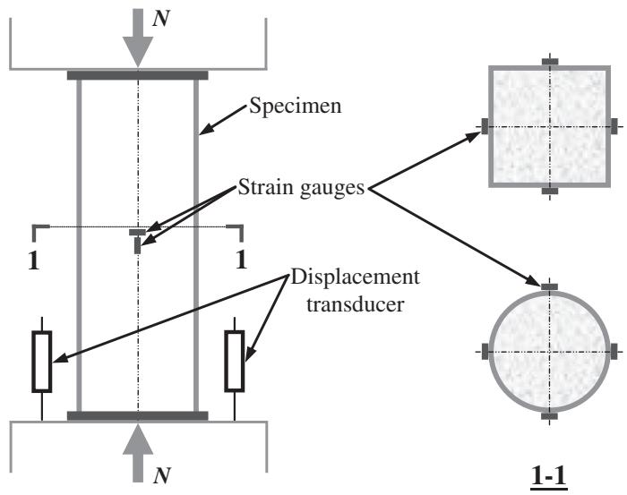  
Fig. 4. Schematic view of the test setup.

adopted to obtain the axial deformations, as shown in Fig. 4. The axial loads were continuously applied on the specimens until failure. The development of axial shortenings and strains, the failure pattern and the ultimate strength of all specimens were duly recorded.

# 3. Test results and discussion

It was found that, the number of freeze–thaw cycles $\left( N _ { \mathrm { f t } } \right)$ and steel ratio $( \alpha )$ had little influence on the failure pattern of the specimens. The typical failure pattern of circular and square specimens is shown in Fig. 5. It can be seen that, in general, one main shear failure surface (white dashed line) is formed along 1/2 to 2/3 heights of circular specimens regardless of the number of freeze–thaw cycles, and after achieving the ultimate strength the relatively large outward deformations appear near the upper and lower ends of the shear failure surface. However, for square specimens, two or three local outward deformations along the periphery of the steel tube are formed. The maximum outward deformation of circular specimens is smaller than that of square specimens. This can be explained by that the confinement to core concrete of circular steel tube is better than that of square steel tube (Zhao et al., 2010).

Fig. 6 shows the typical failure pattern of core concrete. It can be seen that, for circular specimens, core concrete is crushed along the shear failure surface and the thin and dense inclined cracks appear near the shear failure surface regardless of the number of freeze– thaw cycles. There is almost no crack outside the crushing region of circular specimens. However, for square specimens, the concrete

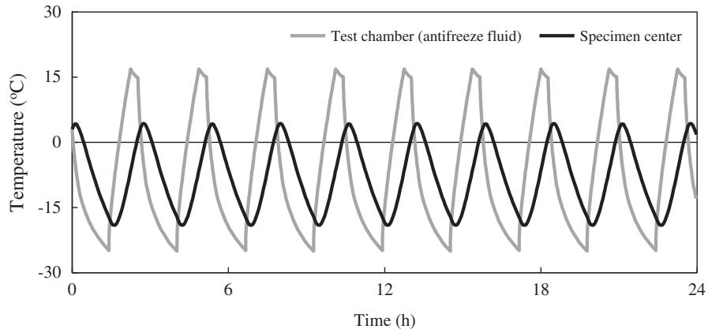  
Fig. 3. Freeze–thaw cycles within 24 h.

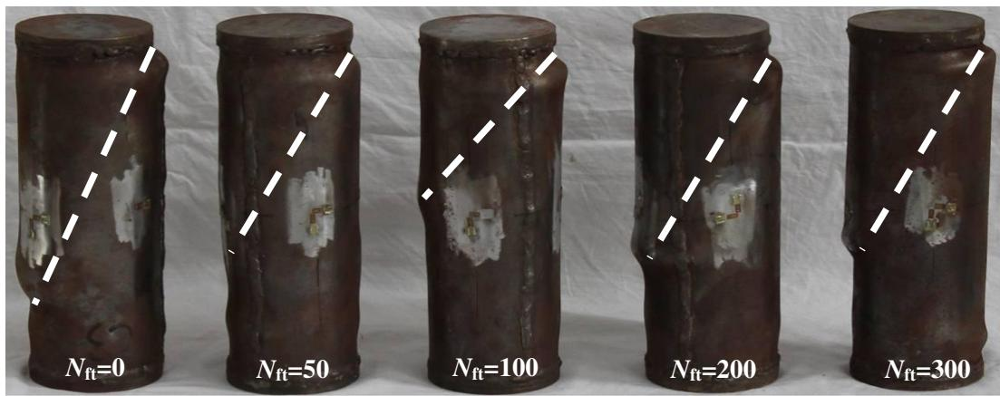  
(a) Circular section

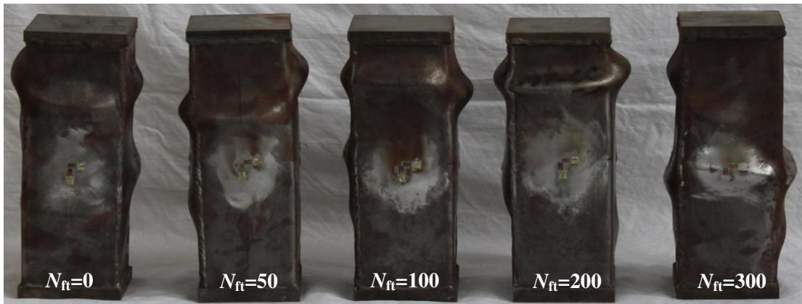  
(b) Square section   
Fig. 5. Typical failure pattern of the specimens.

layers close to the outer steel tube were almost shed off within the height range and there were the wide axial cracks formed in the concrete crushing area. This may be due to the worse confinement of square steel tube to core concrete compared with circular steel tube.

The axial load (N) versus axial shortening (δ) relationship of the specimens is shown in Fig. 7, and the experimental ultimate strength $( N _ { \mathrm { u e } } )$ of all specimens is presented in Table 4. It can be seen that, under the same steel ratio, either circular specimens or square

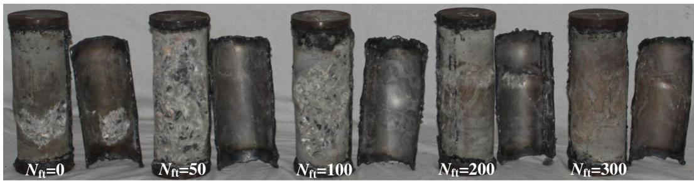  
(a) Circular section

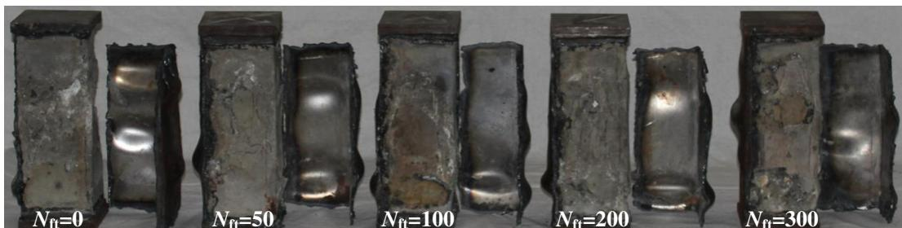  
(b) Square section   
Fig. 6. Typical failure pattern of core concrete.

specimens generally have the similar stable $N - \delta$ responses. The axial shortening corresponding to the ultimate strength of specimens after freezing and thawing exposures is generally larger than that of specimens without being subjected to freezing and thawing. This can be explained by that the elastic modulus of core concrete decreases after being exposed to freezing and thawing, which results in the lowering of the compressive stiffness of the specimen. It can also be found that, the platform capacity of the specimens after the ultimate strength increases with the increasing of the steel ratio due to the enhancement of the confinement of steel tube to core concrete. Moreover, due to the better confinement to core concrete of circular steel tube compared with square steel tube, circular specimens have a slower decreasing in bearing capacity and a higher platform capacity.

Fig. 8 demonstrates the measured axial load (N) versus longitudinal and transverse strain (ε) relationship of CFST stub columns after freezing and thawing exposures, where the longitudinal and transverse strains are considered as positive and negative, respectively. It can be seen that, similar to the specimens without being subjected to freezing and thawing, CFST stub columns after being exposed to freezing and thawing generally have stable load versus strain responses and good deformation-resistant ability. However, the specimens which had experienced more freeze–thaw cycles $\left( N _ { \mathrm { f t } } \right)$ would result in a shorter elastic stage of $N - \varepsilon$ relationship and a quicker load bearing capacity decreasing after achieving the ultimate strength. In general, the variation rule of the transverse strains is similar to that of the longitudinal strains.

Fig. 9 shows the influence of number of freeze–thaw cycles $\left( N _ { \mathrm { f t } } \right)$ and steel ratio $( \alpha )$ on the longitudinal and transverse strains of CFST specimens $\left( \varepsilon _ { \mathrm { u } } \right)$ when the ultimate strength is attained. It can be seen that, in general, $\varepsilon _ { \mathrm { u } }$ increases with the increasing of $\alpha$ as better confinement is produced for specimens with a higher steel ratio (Zhao et al., 2010); however, $N _ { \mathrm { f t } }$ has a moderate effect on $\varepsilon _ { \mathrm { u } } .$ . It can also be found that, $\varepsilon _ { \mathrm { u } }$ of square specimens is generally lower than that of circular specimens. This can be explained by that, compared with circular specimens, worse confinement to core concrete is produced by steel tube of square specimens.

The relationship of load ratio $\left( N / N _ { \mathrm { u e } } \right)$ versus strain ratio $\left( \varepsilon _ { \mathrm { T } } / \varepsilon _ { \mathrm { L } } \right)$ is illustrated in Fig. 10, where $\varepsilon _ { \mathrm { T } }$ and $\varepsilon _ { \mathrm { L } }$ represent the longitudinal and transverse strains, respectively. It can be seen that, the strain ratio $( \varepsilon _ { \mathrm { T } } / \varepsilon _ { \mathrm { L } } )$ of specimens without being subjected to freezing and thawing is larger than that of specimens after freezing and thawing exposures. This means that the composite action between steel tube and core concrete becomes weak in freeze–thaw environment. Furthermore, under the same load ratio $( N / N _ { \mathrm { u e } } )$ , the strain ratio $\left( \varepsilon _ { \mathrm { T } } / \varepsilon _ { \mathrm { L } } \right)$ of circular specimens is generally larger than that of square specimens due to the better constraining effect to core concrete of circular steel tube.

Fig. 11 shows the effect of number of freeze–thaw cycles $\left( N _ { \mathrm { f t } } \right)$ and steel ratio $( \alpha )$ on the experimental ultimate strength $( N _ { \mathrm { u e } } )$ of the specimens. It can be seen that, $N _ { \mathrm { u e } }$ increases with the increasing of $\alpha$ under the same $N _ { \mathrm { f t } } .$ For specimens with $\alpha$ of 0.085 and 0.132, $N _ { \mathrm { u e } }$ of the specimens after freezing and thawing exposures is generally

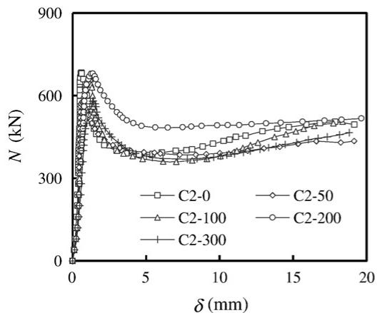  
(a) Circular section

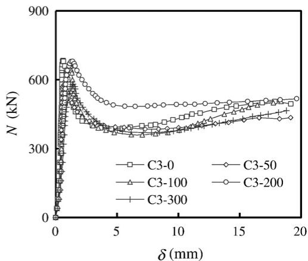  
(2)

(1)

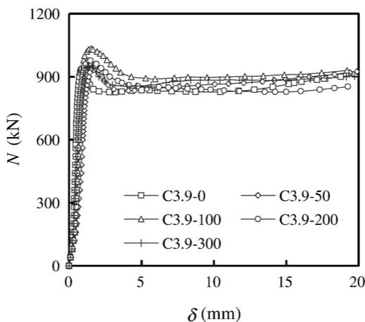  
(3）  
Fig. 7. Axial load (N) versus axial shortening (δ) relationship.

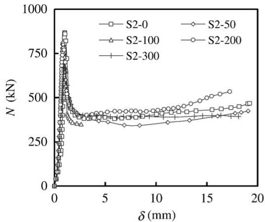  
(b) Square section   
(1)

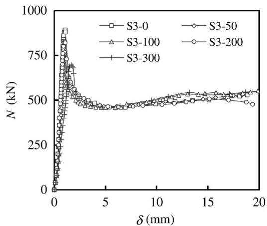  
(2)

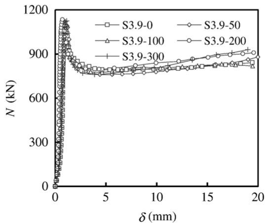  
(3)   
Fig. 7 (continued).

lower than that of the specimens without being subjected to freezing and thawing, and the specimens with a larger $N _ { \mathrm { f t } }$ would have a lower $N _ { \mathrm { u e } }$ . This is caused by the strength degradation of core concrete after being exposed to freezing and thawing, and the larger $N _ { \mathrm { f t } }$ would result in a more serious strength degradation of core concrete. However, for specimens with the $\alpha$ of 0.176, $N _ { \mathrm { u e } }$ of the specimens after freezing and thawing exposures does not decrease evidently with the increasing of $N _ { \mathrm { f t } } .$ . It may be explained by that, for specimens with the $\alpha$ of 0.176, the strength enhancement of core concrete due to the confinement of outer steel tube offsets the strength degradation of concrete in freeze–thaw environment.

In this paper, the ultimate strength ratio $\left( { k _ { \mathrm { u s } } } \right)$ is defined to quantify the residual compression resistance of CFST stub columns after being exposed to freezing and thawing, and it is expressed as:

$$
k _ {u s} = \frac {N _ {u e} \left(N _ {f t}\right)}{N _ {u e} (0)} \tag {1}
$$

where, $N _ { \mathrm { u e } } ( N _ { \mathrm { f t } } )$ is the experimental ultimate strength of CFST specimens after being exposed to different number of freeze–thaw cycles $\left( N _ { \mathrm { f t } } \right)$ , and $N _ { \mathrm { u e } } ( 0 )$ is the experimental ultimate strength of CFST specimens without being subjected to freezing and thawing. The ultimate strength ratio $\mathrm { ( } k _ { \mathrm { u s } } \mathrm { ) }$ of the tested specimens so determined is given in Table 4.

The influence of number of freeze–thaw cycles $( N _ { \mathrm { f t } } )$ and steel ratio $( \alpha )$ on $k _ { \mathrm { u s } }$ is shown in Fig. 12. It can be seen that, except for specimens with $\alpha$ of 0.176, $k _ { \mathrm { u s } }$ of the specimens generally decreases with the increasing of $N _ { \mathrm { f t } } ,$ and $\alpha$ has no consistent influence on $k _ { \mathrm { u s } }$ . On average, the specimens with $N _ { \mathrm { f t } }$ of 300 and $\alpha$ of 0.085 and 0.132 would result in the lower ultimate strength over the specimens without being subjected to freezing and thawing by $1 5 \%$ to $2 2 . 4 \%$ .

To evaluate the confinement effect of steel tube to core concrete, the concrete enhancement factor $\left( k _ { \mathrm { c e } } \right)$ of the tested specimens is obtained based on the equations for the ultimate axial load of a CFST column in EN 1994-1-1 (2004), and it is defined as:

$$
k _ {\mathrm {c e}} = \frac {N _ {\mathrm {u e}} - \eta_ {\mathrm {s}} f _ {\mathrm {y}} A _ {\mathrm {s}}}{f _ {\mathrm {c}} ^ {\prime} A _ {\mathrm {c}}} \tag {2}
$$

where, $\eta _ { s }$ is the steel contribution coefficient, which is related to the relative slenderness for circular CFST and equals to 1.0 for square CFST, (EN 1994-1-1, 2004) and $\boldsymbol { f } _ { \mathrm { ~ c ~ } } ^ { \prime }$ is the cylinder compressive strength of concrete which can be obtained according to EN 1992-1-1 (2004).

The variation of concrete enhancement factor $\left( k _ { \mathrm { c e } } \right)$ of the specimens is shown in Fig. 13, where the capital letters $\mathbf { \cdot } \mathbf { \vec { C } } \mathbf { \cdot }$ and ‘S’ in the brackets represent circular and square specimens respectively. It can be seen that, in general, except for specimens with $\alpha$ of 0.176, $k _ { \mathrm { c e } }$ of the specimens decreases with the increasing of $N _ { \mathrm { f t } }$ and the decreasing of $\alpha$ , and under the same parameters $k _ { \mathrm { c e } }$ of circular specimens is

higher than that of square specimens due to the better confinement of circular steel tube to core concrete.

In present paper, the elastic modulus of the specimens is defined as the secant modulus when the axial stress $[ N / ( A _ { s } { + } A _ { c } ) ]$ equals to $4 0 \%$ of the ultimate stress $\left[ N _ { \mathrm { u e } } / ( A _ { s } + A _ { \mathrm { c } } ) \right]$ . The experimental elastic modulus $( E _ { \mathrm { s c , e } } )$ of all specimens is given in Table 4, and the variation of $E _ { \mathrm { s c , e } }$ is shown in Fig. 14. It can be seen from Table 4 and Fig. 14 that, in general, $E _ { \mathrm { s c , e } }$ of the specimens increases with the increasing of steel ratio $( \alpha )$ . Under the same $\alpha$ , $E _ { \mathrm { s c , e } }$ of specimens after freezing and thawing exposures is lower than that of the corresponding specimens without being subjected to this effect, and a larger number of freeze– thaw cycles $\left( N _ { \mathrm { f t } } \right)$ would lead to a lower elastic modulus $\left( E _ { \mathrm { s c , e } } \right)$ . This is caused by the elastic modulus degradation of core concrete after being exposed to freezing and thawing, and larger number of freeze–thaw cycles leads to more serious degradation.

To account for the effect of $N _ { \mathrm { f t } }$ and $\alpha$ on $E _ { \mathrm { s c , e } }$ of CFST stub columns after being exposed to freezing and thawing, the elastic modulus ratio $\left( k _ { \mathrm { e m } } \right)$ is defined as:

$$
k _ {\mathrm {e m}} = \frac {E _ {\mathrm {s c} , \mathrm {e}} \left(N _ {\mathrm {f t}}\right)}{E _ {\mathrm {s c} , \mathrm {e}} (0)} \tag {3}
$$

where, $E _ { \mathrm { s c , e } } ( N _ { \mathrm { f t } } )$ is the experimental elastic modulus of CFST specimens after being exposed to different number of freeze–thaw cycles $\left( N _ { \mathrm { f t } } \right)$ , and $E _ { \mathrm { s c , e } } ( 0 )$ is the experimental elastic modulus of CFST

specimens without being subjected to freezing and thawing. The $k _ { \mathrm { e m } }$ of the tested specimens determined by Eq. (3) is listed in Table 4.

Fig. 15 shows the variation of elastic modulus ratio $\left( k _ { \mathrm { e m } } \right)$ of the tested specimens. It can be seen that, the changing rules of $k _ { \mathrm { e m } }$ are not clearly demonstrated; however, the average value of $k _ { \mathrm { e m } }$ under the same number of freeze–thaw cycles $( N _ { \mathrm { f t } } )$ generally decreases with the increasing of $N _ { \mathrm { f t } }$ . On average, $k _ { \mathrm { e m } }$ of specimens with $N _ { \mathrm { f t } }$ of 300 is about $1 4 . 2 \%$ lower than that of specimens without being subjected to freezing and thawing.

# 4. Simplified formula

Based on the analysis of the test data, it was found that the ultimate strength of CFST stub columns after freezing and thawing exposures was mainly affected by the number of freeze–thaw cycles $\left( N _ { \mathrm { f t } } \right)$ . To consider the effect of $N _ { \mathrm { f t } }$ on the ultimate strength of CFST stub columns, the simplified formula for the ultimate strength ratio $\mathrm { ( } k _ { \mathrm { u s } } \mathrm { ) }$ was obtained by the regression of the data in Fig. 12. The ultimate strength $\left( N _ { \mathrm { u } } \right)$ is thus defined for the CFST stub columns after being exposed to freezing and thawing by Eq. (4):

$$
N _ {\mathrm {u}} = k _ {\mathrm {u s}} \cdot N _ {\mathrm {u}} (0) = (1 - 0. 0 0 0 5 N _ {\mathrm {f t}}) \cdot N _ {\mathrm {u}} (0) \tag {4}
$$

where, $N _ { \mathrm { u } } ( 0 )$ is the ultimate strength of CFST stub columns without being exposed to freezing and thawing.

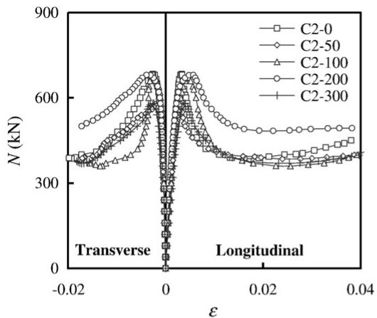  
(a) Circular section   
(1)

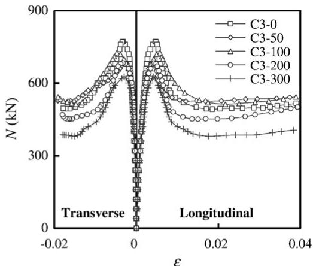  
(2)

  
(3)   
Fig. 8. Axial load (N) versus strain (ε) relationship of the specimens.

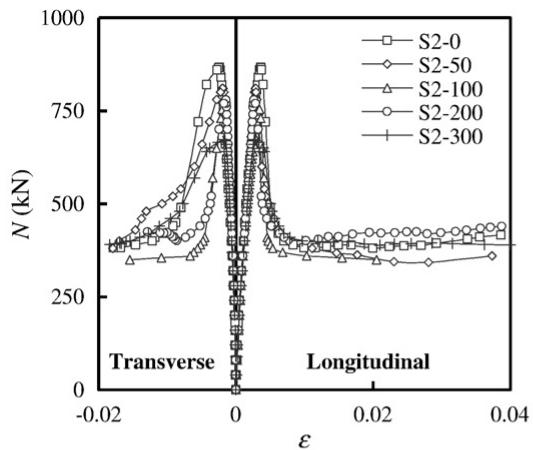  
(b) Square section   
(1)

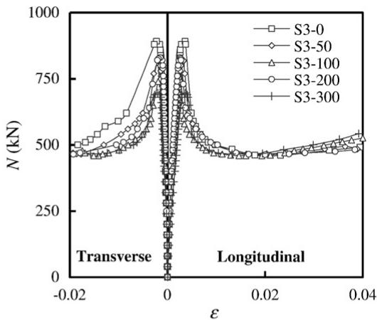  
(2)

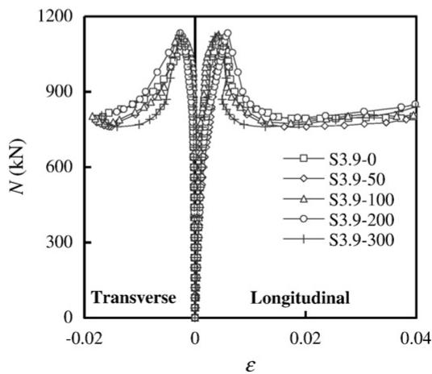  
(3)   
Fig. 8 (continued).

The value of $N _ { \mathrm { u } } ( 0 )$ in Eq. (4) can be determined using one of the following design codes:

$\odot$ ACI 318–05 (2005)   
$\odot$ AIJ (1997)   
$\odot$ ANSI/AISC 360–05 (2005)   
$\odot$ BS 5400–5 (2005)   
$\odot$ DBJ13-51-2003 (2003)   
$\odot$ EC4 (2004)

In all design calculations, the partial safety factor of materials was set to unity and the actual material properties while the testing being conducted were adopted. The comparison between the calculated $( N _ { \mathrm { u c } } )$ and experimental $( N _ { \mathrm { u e } } )$ ultimate strength of CFST stub columns after freezing and thawing exposures is presented in Table 5.

Results in Table 5 clearly show that, the calculated ultimate strength using the aforementioned design codes are conservative compared with the experimental results. For circular members, BS 5400–5, ACI 318–05, AIJ, ANSI/AISC 360–05 and DBJ13-51-2003 give the ultimate strength about $34 \%$ , $2 3 \% ,$ , $1 8 \% ,$ $1 8 \%$ and $1 1 \%$ lower than the results obtained in the tests respectively, and overall EC4, which gives $N _ { \mathrm { u c } } / N _ { \mathrm { u e } }$ with a mean value of 0.951 and a standard deviation of 0.111, is the best predictor. For square members, EC4, which gives $N _ { \mathrm { u c } } / N _ { \mathrm { u e } }$ with a mean value of 0.944 and a standard deviation of 0.115, is also the best predictor, and BS 5400–5, which gives $N _ { \mathrm { u c } } / N _ { \mathrm { u e } }$ with a mean value of 0.661 and a standard deviation of 0.011, is the most conservative predictor.

Moreover, DBJ13-51-2003, ACI 318–05, AIJ and ANSI/AISC 360–05 give the ultimate strength of square members about $9 \%$ to $1 7 \%$ lower than the experimental results.

Similar to the method for obtaining the simplified formula of $k _ { \mathrm { u s } } ,$ the effect of $N _ { \mathrm { f t } }$ on the elastic modulus ratio $\left( k _ { \mathrm { e m } } \right)$ can be considered in the simplified equation for the elastic modulus of CFST after freezing and thawing exposures. Based on the superposition method, the elastic modulus $\left( E _ { \mathrm { s c } } \right)$ of CFST after being exposed to freezing and thawing can be expressed as:

$$
E _ {\mathrm {s c}} = \frac {\alpha \cdot E _ {\mathrm {s}} + E _ {\mathrm {c}}}{\alpha + 1} \cdot (1 - 0. 0 0 1 N _ {\mathrm {f t}}). \tag {5}
$$

Fig. 16 shows the comparison between the calculated $\left( E _ { \mathrm { s c , c } } \right)$ and experimental $\left( E _ { \mathrm { s c , e } } \right)$ elastic modulus of CFST stub columns after freezing and thawing exposures. It can be seen that, generally, $E _ { \mathrm { s c , c } }$ is in good agreement with $E _ { \mathrm { s c , e } }$ and the differences between them are less than $2 0 \%$ . Overall, the average value and standard deviation of $E _ { \mathrm { s c , c } } / E _ { \mathrm { s c , e } }$ are 1.056 and 0.174, respectively. This shows that the calculated elastic modulus are slightly higher than the experimental results, but the data of $E _ { \mathrm { s c , c } } / E _ { \mathrm { s c , e } }$ are relatively discrete.

# 5. Conclusions

A total of 30 tests (15 circular specimens and 15 square specimens) have been conducted to investigate the performance of concrete-filled

  
(a) Circular section

  
(b) Square section   
Fig. 9. Stains corresponding to the ultimate strength.

steel tube (CFST) stub columns after being exposed to freezing and thawing. Based on the experimental results, the following observations and conclusions can be drawn:

(1) Similar to the corresponding CFST specimens without being subjected to freezing and thawing, the axially loaded CFST stub columns after freezing and thawing exposures have the stable load versus deformation responses and good deformation resistant ability.   
(2) After being exposed to freezing and thawing, the compressive responses of CFST stub columns are found to be related to both number of freeze–thaw cycles and steel ratio. Generally, the ultimate strength and elastic modulus would increase with the increasing of steel ratio and the decreasing of number of freeze–thaw cycles. This can be explained by that higher steel ratio would lead to higher confinement effect of steel tube to core concrete and larger number of freeze–thaw cycles would result in more serious degradation of concrete properties.   
(3) For CFST specimens after freezing and thawing exposures, the strains corresponding to the ultimate strength would increase with the increasing of steel ratio owing to the enhanced confinement effect; however, the number of freeze–thaw cycles have a

moderate effect on the ultimate strains. Moreover, the composite action between steel tube and core concrete of CFST becomes weak after being exposed to freezing and thawing.

(4) Based on the regression of the test data, the simplified formula for the ultimate strength and elastic modulus of CFST stub columns after freezing and thawing exposures is proposed considering the effect of number of freeze–thaw cycles. It may be concluded that the existing design codes under short-term loading could ensure a safe ultimate strength of CFST stub columns after being exposed to freezing and thawing, and the EC4 design equations provide an accurate prediction. The calculated elastic modulus of CFST stub columns after freezing and thawing exposures is slightly higher than the experimental results.

# Acknowledgements

The studies in this paper are financially supported by the Science Fund for Creative Research Groups of the National Natural Science Foundation of China (51121005), the Fundamental Research Funds for the Central Universities (DUT12ZD215) and the Independent Research Funds of the State Key Laboratory of Coastal and Offshore Engineering (SL2012-1). The financial support is gratefully acknowledged. The authors also wish to thank Mr. Guo-Liang Ma for his assistance in the experiments.

# References

ACI 318–05, 2005. Building Code Requirements for Structural Concrete and Commentary. Farmington Hills (MI), American Concrete Institute, Detroit, USA.   
AIJ, 1997. Recommendations for Design and Construction of Concrete Filled Steel Tubular Structures. Architectural Institute of Japan, Tokyo, Japan.   
Aïtcin, P.C., 1998. High-performance Concrete. E & FN Spon, London.   
ANSI/AISC 360–05, 2005. Specification for Structural Steel Buildings. American Institute of Steel Construction, Inc., Chicago, USA.   
BS 5400–5, 2005. Steel, Concrete and Composite Bridges — Part 5: Code of Practice for the Design of Composite Bridges. British Standards Institution.   
DBJ13-51-2003, 2003. Technical Specification for Concrete-filled Steel Tubular Structures. Fujian Provincial Department of Construction. (Fujian, China. (in Chinese)).   
EN 1992-1-1, 2004. Design of Concrete Structures — Part 1–1: General Rules and Rules for Buildings. European Committee for Standardisation. (Brussels, Belgium).   
EN 1994-1-1, 2004. Design of Composite Steel and Concrete Structures — Part 1–1: General Rules and Rules for Buildings. European Committee for Standardisation. (Brussels, Belgium).   
GB/T 50082–2009, 2009. Standard for Test Methods of Long-term Performance and Durability of Ordinary Concrete. China Architecture & Building Press, Beijing (in Chinese).   
Han, L.H., Hou, C., Wang, Q.L., 2012. Square concrete filled steel tubular (CFST) members under loading and chloride corrosion: experiments. Journal of Constructional Steel Research 71, 11–25.   
Huang, M., Zhu, T., Liu, J., Zhou, Y., 2008. Treatment of common construction failing for steel-pipe concrete post construction in winter. Concrete 9, 108–109 (in Chinese).   
Li, H., Ma, M., Xian, G., Yan, X., Ou, J., 2012. Performances of concrete-filled GFRP or GFRP-steel circular tubes subjected to freeze–thaw cycles. International Journal of Structural Stability and Dynamics 12 (1), 95–108.   
Powers, T.C., 1945. A working hypothesis for further studies of frost resistance of concrete. Journal of the American Concrete Institute 16 (4), 245–272.   
Wang, P., Tang, Y., Mao, Z., 2005. Research on longitudinal crack damage to concrete-filled steel tube structure and its strengthening. Industrial Construction 35 (2), 96–97 (109. (in Chinese)).   
Wang, Y.Y., Wang, Q.H., Liu, C.Y., 2012. Analysis of typical frost heave accidents of concrete filled steel tubes. Journal of Harbin Institute of Technology 44 (S1), 19–23 (in Chinese).   
Yang, L.Z., 2008. Experimental study and theoretical analysis for the freeze proof durability of concrete filled steel tube. Master thesis, Southwest Jiaotong University. (in Chinese).   
Yin, Z., Yang, Y., 2002. Application of concrete filled steel tube structure in heavy industrial building. Steel Construction 17 (2), 28–31 (in Chinese).   
Zhao, X.L., Han, L.H., Lu, H., 2010. Concrete-filled Tubular Members and Connections. Taylor and Francis, Oxford, UK.

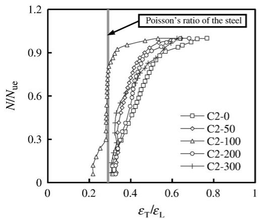  
(a) Circular section

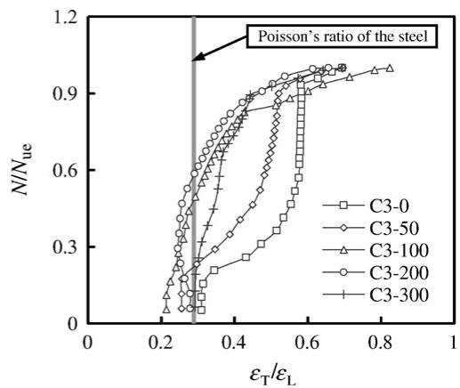  
(2)

(1)

  
(3)   
Fig. 10. Load ratio $\left( N / N _ { \mathrm { u e } } \right)$ versus strain ratio $( \varepsilon _ { \mathrm { T } } / \varepsilon _ { \mathrm { L } } )$ relationship.

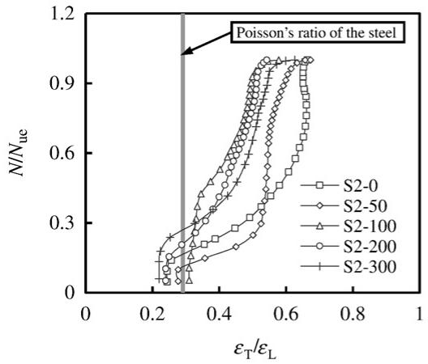  
(b) Square section   
(1)

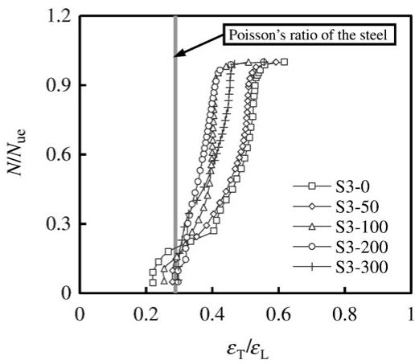  
(2)

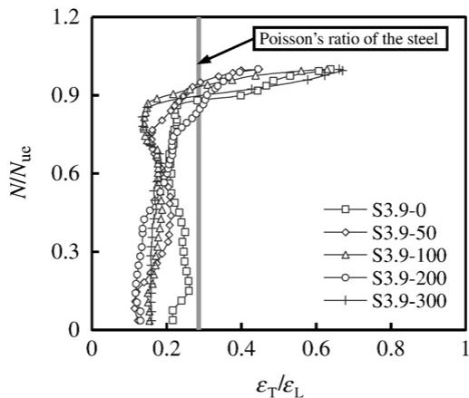  
(3)   
Fig. 10 (continued).

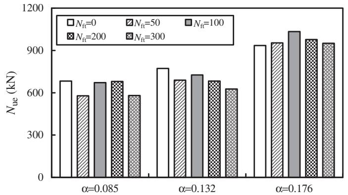  
(a) Circular section

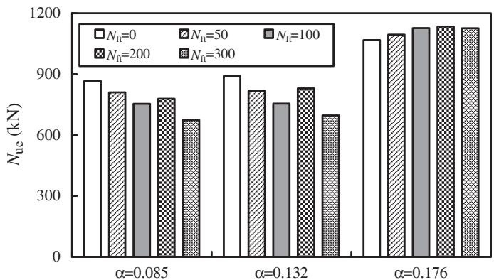  
(b) Square section   
Fig. 11. Experimental ultimate strength $( N _ { \mathrm { u e } } )$ of the specimens.

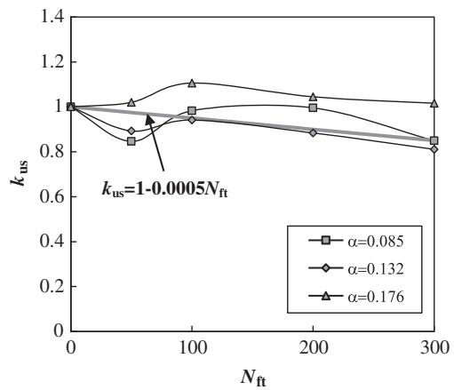  
(a) Circular section

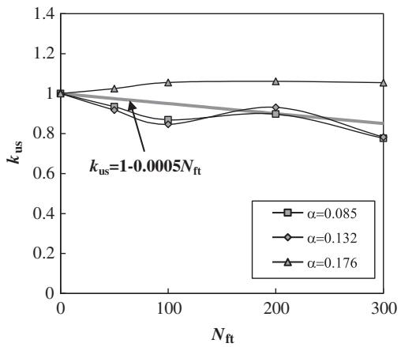  
(b) Square section   
Fig. 12. Influence of $N _ { \mathrm { f t } }$ and $\alpha$ on $k _ { { \mathrm { u s } } }$ .

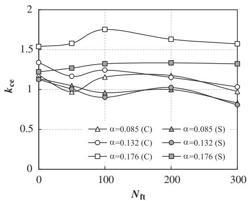  
Fig. 13. Variation of concrete enhancement factor $\left( k _ { \mathrm { c e } } \right)$ of the specimens.

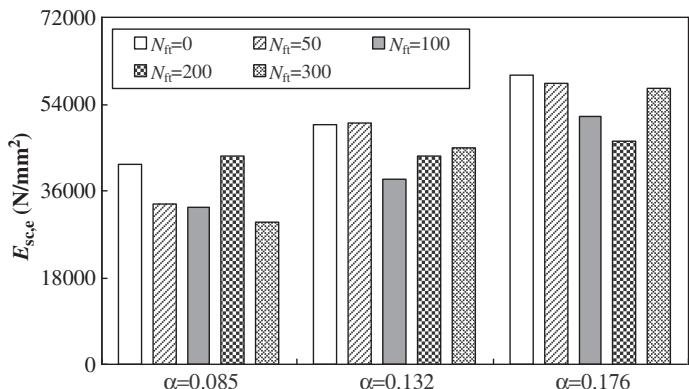  
(a) Circular section

  
(b) Square section   
Fig. 14. Experimental elastic modulus $\left( E _ { \mathrm { s c , e } } \right)$ of the specimens.

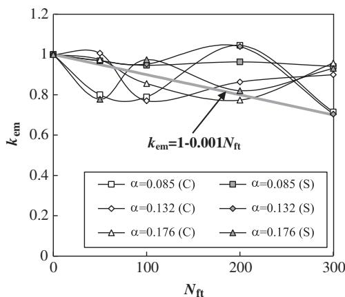  
(a) Circular section   
Fig. 15. Variation of elastic modulus ratio $\left( k _ { \mathrm { e m } } \right)$ .

Table 5 Comparison between the calculated and experimental ultimate strength.   

<table><tr><td rowspan="2">No.</td><td rowspan="2">Specimen</td><td rowspan="2">Nue(kN)</td><td colspan="2">ACI 318-05</td><td colspan="2">AIJ</td><td colspan="2">ANSI/AISC 360-05</td><td colspan="2">BS 5400-5</td><td colspan="2">DBJ13-51-2003</td><td colspan="2">EC4</td></tr><tr><td>Nuc(kN)</td><td>Nuc/Nuc</td><td>Nuc(kN)</td><td>Nuc/Nuc</td><td>Nuc(kN)</td><td>Nuc/Nuc</td><td>Nuc(kN)</td><td>Nuc/Nuc</td><td>Nuc(kN)</td><td>Nuc/Nuc</td><td>Nuc(kN)</td><td>Nuc/Nuc</td></tr><tr><td>1</td><td>C2-50</td><td>577.9</td><td>554.2</td><td>0.959</td><td>584.1</td><td>1.011</td><td>601.2</td><td>1.040</td><td>437.9</td><td>0.758</td><td>623.5</td><td>1.079</td><td>677.5</td><td>1.172</td></tr><tr><td>2</td><td>C2-100</td><td>671.2</td><td>540.0</td><td>0.805</td><td>569.1</td><td>0.848</td><td>585.8</td><td>0.873</td><td>426.6</td><td>0.636</td><td>607.5</td><td>0.905</td><td>660.2</td><td>0.984</td></tr><tr><td>3</td><td>C2-200</td><td>680.1</td><td>511.6</td><td>0.752</td><td>539.2</td><td>0.793</td><td>554.9</td><td>0.816</td><td>404.2</td><td>0.594</td><td>575.6</td><td>0.846</td><td>625.4</td><td>0.920</td></tr><tr><td>4</td><td>C2-300</td><td>580.4</td><td>483.1</td><td>0.832</td><td>509.2</td><td>0.877</td><td>524.1</td><td>0.903</td><td>381.7</td><td>0.658</td><td>543.6</td><td>0.937</td><td>590.7</td><td>1.018</td></tr><tr><td>5</td><td>C3-50</td><td>689.5</td><td>582.4</td><td>0.845</td><td>624.9</td><td>0.906</td><td>627.8</td><td>0.911</td><td>494.7</td><td>0.717</td><td>681.2</td><td>0.988</td><td>723.7</td><td>1.050</td></tr><tr><td>6</td><td>C3-100</td><td>726.4</td><td>567.4</td><td>0.781</td><td>608.9</td><td>0.838</td><td>611.7</td><td>0.842</td><td>482.0</td><td>0.664</td><td>663.8</td><td>0.914</td><td>705.2</td><td>0.971</td></tr><tr><td>7</td><td>C3-200</td><td>682.8</td><td>537.6</td><td>0.787</td><td>576.8</td><td>0.845</td><td>579.5</td><td>0.849</td><td>456.7</td><td>0.669</td><td>628.8</td><td>0.921</td><td>668.1</td><td>0.978</td></tr><tr><td>8</td><td>C3-300</td><td>625.9</td><td>507.7</td><td>0.811</td><td>544.8</td><td>0.870</td><td>547.3</td><td>0.874</td><td>431.3</td><td>0.689</td><td>593.9</td><td>0.949</td><td>631.0</td><td>1.008</td></tr><tr><td>9</td><td>C3.9-50</td><td>953.7</td><td>678.8</td><td>0.712</td><td>751.6</td><td>0.788</td><td>721.8</td><td>0.757</td><td>650.2</td><td>0.682</td><td>820.0</td><td>0.860</td><td>861.1</td><td>0.903</td></tr><tr><td>10</td><td>C3.9-100</td><td>1034.0</td><td>661.4</td><td>0.640</td><td>732.4</td><td>0.708</td><td>703.3</td><td>0.680</td><td>633.6</td><td>0.613</td><td>799.0</td><td>0.773</td><td>839.0</td><td>0.811</td></tr><tr><td>11</td><td>C3.9-200</td><td>977.2</td><td>626.6</td><td>0.641</td><td>693.8</td><td>0.710</td><td>666.3</td><td>0.682</td><td>600.2</td><td>0.614</td><td>756.9</td><td>0.775</td><td>794.9</td><td>0.813</td></tr><tr><td>12</td><td>C3.9-300</td><td>950.8</td><td>591.8</td><td>0.622</td><td>655.3</td><td>0.689</td><td>629.3</td><td>0.662</td><td>566.9</td><td>0.596</td><td>714.9</td><td>0.752</td><td>750.7</td><td>0.790</td></tr><tr><td colspan="3">Mean value</td><td colspan="2">0.766</td><td colspan="2">0.824</td><td colspan="2">0.824</td><td colspan="2">0.657</td><td colspan="2">0.891</td><td colspan="2">0.951</td></tr><tr><td colspan="3">Standard deviation</td><td colspan="2">0.099</td><td colspan="2">0.093</td><td colspan="2">0.112</td><td colspan="2">0.050</td><td colspan="2">0.096</td><td colspan="2">0.111</td></tr><tr><td>1</td><td>S2-50</td><td>810.3</td><td>705.6</td><td>0.871</td><td>705.6</td><td>0.871</td><td>701.5</td><td>0.866</td><td>473.4</td><td>0.584</td><td>758.1</td><td>0.936</td><td>805.3</td><td>0.994</td></tr><tr><td>2</td><td>S2-100</td><td>753.9</td><td>687.5</td><td>0.912</td><td>687.5</td><td>0.912</td><td>683.5</td><td>0.907</td><td>461.2</td><td>0.612</td><td>738.6</td><td>0.980</td><td>784.6</td><td>1.041</td></tr><tr><td>3</td><td>S2-200</td><td>779.1</td><td>651.3</td><td>0.836</td><td>651.3</td><td>0.836</td><td>647.6</td><td>0.831</td><td>437.0</td><td>0.561</td><td>699.8</td><td>0.898</td><td>743.3</td><td>0.954</td></tr><tr><td>4</td><td>S2-300</td><td>673.0</td><td>615.1</td><td>0.914</td><td>615.1</td><td>0.914</td><td>611.6</td><td>0.909</td><td>412.7</td><td>0.613</td><td>660.9</td><td>0.982</td><td>702.0</td><td>1.043</td></tr><tr><td>5</td><td>S3-50</td><td>818.0</td><td>741.5</td><td>0.906</td><td>741.5</td><td>0.906</td><td>737.8</td><td>0.902</td><td>515.6</td><td>0.630</td><td>812.3</td><td>0.993</td><td>836.9</td><td>1.023</td></tr><tr><td>6</td><td>S3-100</td><td>754.7</td><td>722.5</td><td>0.957</td><td>722.5</td><td>0.957</td><td>718.9</td><td>0.953</td><td>502.4</td><td>0.666</td><td>791.4</td><td>1.049</td><td>815.5</td><td>1.081</td></tr><tr><td>7</td><td>S3-200</td><td>830.0</td><td>684.5</td><td>0.825</td><td>684.5</td><td>0.825</td><td>681.0</td><td>0.820</td><td>475.9</td><td>0.573</td><td>749.8</td><td>0.903</td><td>772.6</td><td>0.931</td></tr><tr><td>8</td><td>S3-300</td><td>696.9</td><td>646.4</td><td>0.928</td><td>646.4</td><td>0.928</td><td>643.2</td><td>0.923</td><td>449.5</td><td>0.645</td><td>708.1</td><td>1.016</td><td>729.6</td><td>1.047</td></tr><tr><td>9</td><td>S3.9-50</td><td>1095.0</td><td>864.2</td><td>0.789</td><td>864.2</td><td>0.789</td><td>860.0</td><td>0.785</td><td>639.4</td><td>0.584</td><td>942.6</td><td>0.861</td><td>956.2</td><td>0.873</td></tr><tr><td>10</td><td>S3.9-100</td><td>1127.0</td><td>842.1</td><td>0.747</td><td>842.1</td><td>0.747</td><td>838.0</td><td>0.744</td><td>623.0</td><td>0.553</td><td>918.5</td><td>0.815</td><td>931.7</td><td>0.827</td></tr><tr><td>11</td><td>S3.9-200</td><td>1134.0</td><td>797.8</td><td>0.704</td><td>797.8</td><td>0.704</td><td>793.9</td><td>0.700</td><td>590.2</td><td>0.520</td><td>870.1</td><td>0.767</td><td>882.6</td><td>0.778</td></tr><tr><td>12</td><td>S3.9-300</td><td>1126.0</td><td>753.4</td><td>0.669</td><td>753.4</td><td>0.669</td><td>749.8</td><td>0.666</td><td>557.4</td><td>0.495</td><td>821.8</td><td>0.730</td><td>833.6</td><td>0.740</td></tr><tr><td colspan="3">Mean value</td><td colspan="2">0.838</td><td colspan="2">0.838</td><td colspan="2">0.834</td><td colspan="2">0.586</td><td colspan="2">0.911</td><td colspan="2">0.944</td></tr><tr><td colspan="3">Standard deviation</td><td colspan="2">0.094</td><td colspan="2">0.094</td><td colspan="2">0.093</td><td colspan="2">0.050</td><td colspan="2">0.101</td><td colspan="2">0.115</td></tr></table>

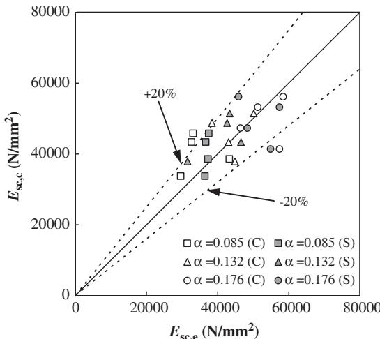  
Fig. 16. Comparison between $E _ { \mathrm { s c , c } }$ and $E _ { \mathrm { s c , e } }$ .