# Tests and calculations for hollow structural steel (HSS) stub columns filled with self-consolidating concrete (SCC)

Lin-Hai Hana,∗ , Guo-Huang Yaoa , Xiao-Ling Zhaob

aCollege of Civil Engineering and Architecture, Fuzhou University, Gongye Road 523, Fuzhou, Fujian, Province, 350002, People’s Republic of China

bDepartment of Civil Engineering, Monash University, Clayton, VIC 3168, Australia

Received 6 September 2004; accepted 27 January 2005

# Abstract

The behaviour of self-consolidating concrete (SCC) filled hollow structural steel (HSS) stub columns subjected to an axial load was investigated experimentally. A total of 50 specimens were tested. The main parameters varied in the tests are: (1) sectional types: circular and square; (2) steel yielding strength: from 282 to $4 0 4 \mathrm { M P a }$ ; and (3) tube diameter or width to wall thickness ratio $( D / t$ or $B / t$ ): from 30 to 134.

A mechanics model is developed in this paper for concrete-filled HSS stub columns. A unified theory is described whereby a confinement factor $( \xi )$ is introduced to describe the composite action of the steel tube and the filled concrete. The predicted load versus deformation relationship was in good agreement with test results. The theoretical model was used to investigate the influence of important parameters that determine the ultimate strength of the composite columns. The parametric and experimental studies provide information for the development of formulae for the calculation of the ultimate strength and the axial load versus axial strain curves of the composite columns. Comparisons are made with predicted stub column strengths using the existing codes, such as ACI-1999, AISC-LRFD-1999, AIJ-1997, BS5400-1979 and EC4-1994.

$^ ©$ 2005 Elsevier Ltd. All rights reserved.

# Nomenclature

$A _ { \mathrm { s } }$ Steel cross-sectional area

$A _ { \mathrm { c } }$ Concrete cross-sectional area

$B$ Width of square steel tube

$b _ { \mathrm { e } }$ Effective width of steel plate

CHS Circular hollow section

$D$ Diameter of circular steel tube

$D I$ Ductility index

$E _ { \mathrm { c } }$ Concrete modulus of elasticity

$E _ { \mathrm { s } }$ Steel modulus of elasticity

$f _ { \mathrm { s y } }$ Yield strength of steel

$f _ { \mathrm { c u } }$ Concrete cube strength

$f _ { \mathrm { c k } }$ Characteristic concrete strength $( f _ { \mathrm { c k } } ~ = ~ 0 . 6 7 f _ { \mathrm { c u } }$ for normal strength concrete)

$f _ { \mathrm { c } } ^ { \prime }$ Concrete cylinder strength

HSS Hollow structural steel

$N$ Axial load

$N _ { \mathrm { u } }$ Axial compressive capacity

$N _ { \mathrm { u c } }$ Predicted ultimate strength

$N _ { \mathrm { u e } }$ Experimental ultimate strength

NC Normal concrete

SCC Self-consolidating concrete

SHS Square hollow section

SI Strength index

t Wall thickness of steel tube

$\alpha$ Steel ratio $( = A _ { \mathrm { s } } / A _ { \mathrm { c } }$

$\sigma$ Stress

$\sigma _ { \mathrm { o l } }$ Local buckling stress

$\varepsilon$ Strain

$\varepsilon _ { \mathrm { u e } }$ Experimental ultimate strain

$\mu _ { \mathrm { s } }$ Poisson’s ratio of steel

ξ Confinement factor $\begin{array} { r } { \left( \xi = \frac { A _ { \mathrm { s } } \cdot f _ { \mathrm { s y } } } { A _ { \mathrm { c } } \cdot f _ { \mathrm { c k } } } \right) } \end{array}$

# 1. Introduction

Self-consolidating concrete (SCC), as it is sometimes known, arrived as a revolution in the field of concrete technology whereby the concrete can flow under its own weight and fill in the formwork in the casting process. Due to its rheological properties, the expense of vibration is eliminated whilst still obtaining good consolidation. Apart from reliability and constructability, advantages of SCC include elimination of noise level in processing plants and reduction in construction time and labour cost. SCC has gained the attention of engineers as demonstrated by the First North American Conference on the Design and Use of Self-Consolidating Concrete held in Northwestern University, November 2002. There is a potential for using SCC-filled Hollow Structural Steel (HSS) as columns in structures.

Studies on the properties of SCC have been reported recently in the literature, for example Persson [16], Zhu and Peter [21]. Persson [16] found that the elastic modulus, creep and shrinkage of SCC did not differ significantly from the corresponding properties of normal concrete (NC). Zhu and Peter [21] studied the permeation properties of a range of SCC mixes. Their results indicated that the SCC mixes had significantly lower oxygen permeability than the vibrated normal concretes of the same strength grades.

In the past, there were a large number of research studies carried out on NC-filled HSS stub columns. This literature has been generally reviewed by Schneider [17]. For the purpose of “full” review on the literatures, Han [8] listed some of the review results and paragraphs presented in Schneider [17], and reviewed more references.

The present study is an attempt to study the behaviour of hollow structural steel (HSS) stub columns filled with SCC. The main objectives of this research were fourfold. First, to report a series of new tests on composite columns filled with SCC. Second, to analyse the axial load versus axial deformation behaviour for concrete-filled HSS stub columns based on the unified theory, which was presented by Han [9] and Han et al. [12]. Third, to develop a simplified model for calculating the sectional capacity and the axial load versus axial deformation relationships of the composite stub columns. And fourth, to compare the predicted ultimate strengths using the existing codes, such as ACI [1], AIJ [2], AISC-LRFD [3], BS5400 [5] and EC4 [7].

# 2. Experimental programme

# 2.1. Test specimens

A total of 50 specimens were tested. The main parameters varied in the tests are: (1) sectional types: circular and square; (2) steel yielding strength: from 282 to $4 0 4 \mathrm { M P a }$ ; and (3) tube diameter or width to wall thickness ratio $\scriptstyle ( D / t$ or $B / t$ ): from 30 to 134.

A summary of the specimens is presented in Table 1. The lengths of stub columns $( L )$ were chosen to be three times the diameter (for CHS) or the width (for SHS) to avoid the effects of overall buckling and end conditions [12].

The tubes were all manufactured from mild steel sheet, with the plate being cut from the sheet, tack welded into a circular or square shape and then welded with a single bevel butt weld.

Table 1 Specimen labels, material properties, section capacities and ductility index   

<table><tr><td>Section type</td><td>No.</td><td>Specimen number</td><td>D(B) (mm)</td><td>t (mm)</td><td>D(B)/t</td><td>fsy(MPa)</td><td>fcu(MPa)</td><td>Nue(kN)</td><td>SI</td><td>εue(με)</td><td>DI</td></tr><tr><td rowspan="50">Circular</td><td>1</td><td>CA1-1</td><td>60</td><td>1.87</td><td>32.1</td><td>282</td><td>85.2</td><td>312</td><td>1.429</td><td>9022</td><td>2.738</td></tr><tr><td>2</td><td>CA1-2</td><td>60</td><td>1.87</td><td>32.1</td><td>282</td><td>85.2</td><td>320</td><td>1.361</td><td>8078</td><td>2.364</td></tr><tr><td>3</td><td>CA2-1</td><td>100</td><td>1.87</td><td>53.5</td><td>282</td><td>85.2</td><td>822</td><td>1.368</td><td>6000</td><td>2.317</td></tr><tr><td>4</td><td>CA2-2</td><td>100</td><td>1.87</td><td>53.5</td><td>282</td><td>85.2</td><td>845</td><td>1.407</td><td>5446</td><td>1.946</td></tr><tr><td>5</td><td>CA3-1</td><td>150</td><td>1.87</td><td>80.2</td><td>282</td><td>85.2</td><td>1701</td><td>1.353</td><td>5300</td><td>1.763</td></tr><tr><td>6</td><td>CA3-2</td><td>150</td><td>1.87</td><td>80.2</td><td>282</td><td>85.2</td><td>1670</td><td>1.329</td><td>5500</td><td>2.036</td></tr><tr><td>7</td><td>CA4-1</td><td>200</td><td>1.87</td><td>107</td><td>282</td><td>85.2</td><td>2783</td><td>1.295</td><td>4800</td><td>2.052</td></tr><tr><td>8</td><td>CA4-2</td><td>200</td><td>1.87</td><td>107</td><td>282</td><td>85.2</td><td>2824</td><td>1.314</td><td>4100</td><td>1.919</td></tr><tr><td>9</td><td>CA5-1</td><td>250</td><td>1.87</td><td>133.7</td><td>282</td><td>85.2</td><td>3950</td><td>1.205</td><td>3800</td><td>2.002</td></tr><tr><td>10</td><td>CA5-2</td><td>250</td><td>1.87</td><td>133.7</td><td>282</td><td>85.2</td><td>4102</td><td>1.251</td><td>5200</td><td>1.980</td></tr><tr><td>11</td><td>CB1-1</td><td>60</td><td>2</td><td>30</td><td>404</td><td>85.2</td><td>427</td><td>1.445</td><td>8600</td><td>3.145</td></tr><tr><td>12</td><td>CB1-2</td><td>60</td><td>2</td><td>30</td><td>404</td><td>85.2</td><td>415</td><td>1.404</td><td>10700</td><td>2.804</td></tr><tr><td>13</td><td>CB2-1</td><td>100</td><td>2</td><td>50</td><td>404</td><td>85.2</td><td>930</td><td>1.359</td><td>5000</td><td>1.762</td></tr><tr><td>14</td><td>CB2-2</td><td>100</td><td>2</td><td>50</td><td>404</td><td>85.2</td><td>920</td><td>1.344</td><td>7498</td><td>2.227</td></tr><tr><td>15</td><td>CB3-1</td><td>150</td><td>2</td><td>75</td><td>404</td><td>85.2</td><td>1870</td><td>1.352</td><td>5000</td><td>2.120</td></tr><tr><td>16</td><td>CB3-2</td><td>150</td><td>2</td><td>75</td><td>404</td><td>85.2</td><td>1743</td><td>1.260</td><td>6500</td><td>2.220</td></tr><tr><td>17</td><td>CB4-1</td><td>200</td><td>2</td><td>100</td><td>404</td><td>85.2</td><td>3020</td><td>1.302</td><td>4639</td><td>1.896</td></tr><tr><td>18</td><td>CB4-2</td><td>200</td><td>2</td><td>100</td><td>404</td><td>85.2</td><td>3011</td><td>1.298</td><td>3775</td><td>2.030</td></tr><tr><td>19</td><td>CB5-1</td><td>250</td><td>2</td><td>125</td><td>404</td><td>85.2</td><td>4442</td><td>1.272</td><td>4100</td><td>1.876</td></tr><tr><td>20</td><td>CB5-2</td><td>250</td><td>2</td><td>125</td><td>404</td><td>85.2</td><td>4550</td><td>1.303</td><td>4001</td><td>2.150</td></tr><tr><td>21</td><td>CC1-1</td><td>60</td><td>2</td><td>30</td><td>404</td><td>90</td><td>432</td><td>1.417</td><td>8531</td><td>2.661</td></tr><tr><td>22</td><td>CC1-2</td><td>60</td><td>2</td><td>30</td><td>404</td><td>90</td><td>437</td><td>1.433</td><td>8600</td><td>2.697</td></tr><tr><td>23</td><td>CC2-1</td><td>150</td><td>2</td><td>75</td><td>404</td><td>90</td><td>1980</td><td>1.368</td><td>4700</td><td>1.978</td></tr><tr><td>24</td><td>CC2-2</td><td>150</td><td>2</td><td>75</td><td>404</td><td>90</td><td>1910</td><td>1.320</td><td>4583</td><td>2.188</td></tr><tr><td>25</td><td>CC3-1</td><td>250</td><td>2</td><td>125</td><td>404</td><td>90</td><td>4720</td><td>1.286</td><td>3600</td><td>2.175</td></tr><tr><td>26</td><td>CC3-2</td><td>250</td><td>2</td><td>125</td><td>404</td><td>90</td><td>4800</td><td>1.307</td><td>3820</td><td>2.165</td></tr><tr><td>27</td><td>SA1-1</td><td>60</td><td>1.87</td><td>32.1</td><td>282</td><td>81</td><td>382</td><td>1.263</td><td>4600</td><td>2.743</td></tr><tr><td>28</td><td>SA1-2</td><td>60</td><td>1.87</td><td>32.1</td><td>282</td><td>81</td><td>350</td><td>1.157</td><td>4400</td><td>2.671</td></tr><tr><td>29</td><td>SA2-1</td><td>100</td><td>1.87</td><td>53.5</td><td>282</td><td>81</td><td>860</td><td>1.173</td><td>3374</td><td>2.667</td></tr><tr><td>30</td><td>SA2-2</td><td>100</td><td>1.87</td><td>53.5</td><td>282</td><td>81</td><td>840</td><td>1.146</td><td>3100</td><td>2.410</td></tr><tr><td>31</td><td>SA3-1</td><td>150</td><td>1.87</td><td>80.2</td><td>282</td><td>81</td><td>1662</td><td>1.088</td><td>1700</td><td>2.529</td></tr><tr><td>32</td><td>SA3-2</td><td>150</td><td>1.87</td><td>80.2</td><td>282</td><td>81</td><td>1740</td><td>1.139</td><td>2600</td><td>2.277</td></tr><tr><td>33</td><td>SA4-1</td><td>200</td><td>1.87</td><td>107</td><td>282</td><td>81</td><td>2890</td><td>1.109</td><td>1200</td><td>2.358</td></tr><tr><td>34</td><td>SA4-2</td><td>200</td><td>1.87</td><td>107</td><td>282</td><td>81</td><td>2920</td><td>1.121</td><td>2490</td><td>2.033</td></tr><tr><td>35</td><td>SA5-1</td><td>250</td><td>1.87</td><td>133.7</td><td>282</td><td>60</td><td>3304</td><td>1.098</td><td>1477</td><td>1.978</td></tr><tr><td>36</td><td>SA5-2</td><td>250</td><td>1.87</td><td>133.7</td><td>282</td><td>60</td><td>3400</td><td>1.130</td><td>1550</td><td>2.256</td></tr><tr><td>37</td><td>SB1-1</td><td>60</td><td>2</td><td>30</td><td>404</td><td>50.9</td><td>318</td><td>1.179</td><td>4230</td><td>2.576</td></tr><tr><td>38</td><td>SB1-2</td><td>60</td><td>2</td><td>30</td><td>404</td><td>50.9</td><td>322</td><td>1.193</td><td>5778</td><td>2.356</td></tr><tr><td>39</td><td>SB2-1</td><td>100</td><td>2</td><td>50</td><td>404</td><td>50.9</td><td>770</td><td>1.219</td><td>4000</td><td>2.225</td></tr><tr><td>40</td><td>SB2-2</td><td>100</td><td>2</td><td>50</td><td>404</td><td>50.9</td><td>772</td><td>1.222</td><td>3400</td><td>2.475</td></tr><tr><td>41</td><td>SB3-1</td><td>150</td><td>2</td><td>75</td><td>404</td><td>50.9</td><td>1300</td><td>1.077</td><td>2200</td><td>2.350</td></tr><tr><td>42</td><td>SB3-2</td><td>150</td><td>2</td><td>75</td><td>404</td><td>50.9</td><td>1420</td><td>1.176</td><td>2400</td><td>1.975</td></tr><tr><td>43</td><td>SB4-1</td><td>200</td><td>2</td><td>100</td><td>404</td><td>50.9</td><td>1990</td><td>1.019</td><td>1400</td><td>2.465</td></tr><tr><td>44</td><td>SB4-2</td><td>200</td><td>2</td><td>100</td><td>404</td><td>50.9</td><td>2054</td><td>1.051</td><td>2289</td><td>2.204</td></tr><tr><td>45</td><td>SB5-1</td><td>250</td><td>2</td><td>125</td><td>404</td><td>50.9</td><td>3100</td><td>1.080</td><td>2000</td><td>2.350</td></tr><tr><td>46</td><td>SB5-2</td><td>250</td><td>2</td><td>125</td><td>404</td><td>50.9</td><td>2965</td><td>1.033</td><td>1496</td><td>2.105</td></tr><tr><td>47</td><td>SC1-1</td><td>60</td><td>2</td><td>30</td><td>404</td><td>81</td><td>422</td><td>1.154</td><td>5231</td><td>2.373</td></tr><tr><td>48</td><td>SC1-2</td><td>60</td><td>2</td><td>30</td><td>404</td><td>81</td><td>406</td><td>1.111</td><td>4800</td><td>2.477</td></tr><tr><td>49</td><td>SC2-1</td><td>150</td><td>2</td><td>75</td><td>404</td><td>81</td><td>2060</td><td>1.220</td><td>4000</td><td>2.225</td></tr><tr><td>50</td><td>SC2-2</td><td>150</td><td>2</td><td>75</td><td>404</td><td>81</td><td>1980</td><td>1.172</td><td>3500</td><td>2.195</td></tr></table>

  
Fig. 1. A schematic view of the L-box.

Two types of steel were used. Strips of the steel tubes were tested in tension. Three coupons were taken from each face of the steel tube; from these tests, the average yield strength $( f _ { \mathrm { s y } } )$ of the tube was found to be 282 and $4 0 4 \mathrm { M P a }$ . The ultimate strength was found to be 358 and $5 1 4 \mathrm { M P a }$ , and the modulus of elasticity was about 201,500 MPa and 207,000 MPa respectively.

The SCC mix was designed for compressive cube strength $( f _ { \mathrm { c u } } )$ at 28 days of approximately 60 MPa. The modulus of elasticity $( E _ { \mathrm { c } } )$ of concrete was measured, the average value being $4 1 { , } 5 4 0 \mathrm { M P a }$ . The mix proportions were as follows:

– Cement: $4 0 0 \mathrm { k g } / \mathrm { m } ^ { 3 }$   
– Blast furnace slag: $1 7 0 \mathrm { k g } / \mathrm { m } ^ { 3 }$ .   
– Water: $1 8 1 ~ \mathrm { k g } / \mathrm { m } ^ { 3 }$   
– Sand: $8 1 5 \mathrm { k g } / \mathrm { m } ^ { 3 }$ .   
– Coarse aggregate: $8 1 5 \mathrm { k g } / \mathrm { m } ^ { 3 }$ .   
– Additional high-range water reducer (HRWR): $5 . 2 \mathrm { k g } / \mathrm { m } ^ { 3 }$ .

In all the concrete mixes, the fine aggregate used was silica-based sand, while the coarse aggregate was carbonate stone from Fuzhou City, South China.

A typical test set-up (L-Box) for simulating the casting process by forcing an SCC sample to flow through a reinforcement net under a static pressure, in China, is shown in Fig. 1. The flow time from the sliding door to the front door of the L-box, the flow speed, as well as the flow distance of the SCC were recorded. The fresh properties of the SCC mixture were as follows:

– Slump flow (mm): 268.   
– Fresh air content (%): 4.5.   
– Unit weight $( \mathrm { k g } / \mathrm { m } ^ { 3 } )$ ): 2386.   
– Concrete temperature ${ } ^ { ( \circ } \mathrm { C } )$ : 26.   
– Flow time (s): 14.   
– Flow speed (mm/s): 57.   
– Flow distance (mm): 800.

  
Fig. 2. Arrangement of stub column tests.

The average cube strengths of each specimen at the time of the test are listed in Table 1. The self-consolidating concrete was cured without any vibration.

For casting the test specimens, the ends of the steel tubes were cut and machined to the required length. The insides of the tubes were wire brushed to remove any rust and loose debris present. The deposits of grease and oil, if any, were cleaned away. Each tube was welded to a circular (for circular sections) or a square (for square sections) steel base plate $1 0 \mathrm { m m }$ thick. The specimens were placed upright to air-dry until testing occurred. During curing, a very small amount of longitudinal shrinkage of $0 . 2 ~ \mathrm { m m }$ or so occurred at the top of the column. A high-strength epoxy was used to fill this longitudinal gap so that the concrete surface was flush with the steel tube at the top.

# 2.2. Test set-up

The experimental study was to determine not only the maximum load carrying capacity of the specimens, but also to investigate the failure pattern up to and beyond the ultimate load.

All the tests were performed on a $5 0 0 0 ~ \mathrm { k N }$ capacity testing machine. The specimens were placed into the testing machine and the loads were applied on the specimens directly. Fig. 2 gives a schematic view of the test arrangement. The loading ram is a solid steel plate, which acts like an end stiffener. Eight strain gauges were used for each specimen to measure strains at the mid-height. Two linear voltage–displacement transducers (LVDTs) were used to measure the axial deformation, as shown in Fig. 2. A load interval of less than one tenth of the estimated carrying load capacity was used. Each load interval was maintained for about 2 min.

# 2.3. Failure modes and load–axial strain curves

A typical failure mode of the outer tube was the local (outward folding) failure mechanism; the failure modes of the stub columns with different sections are shown in

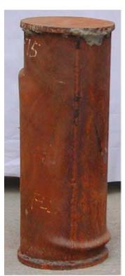  
(a)

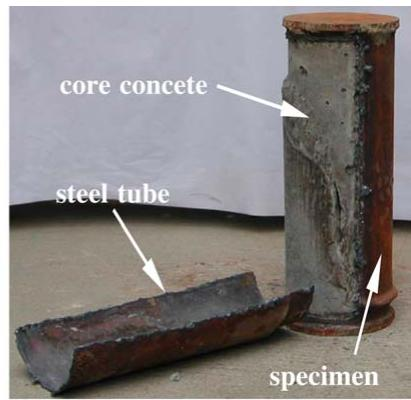  
(b）  
(1) Circular columns.

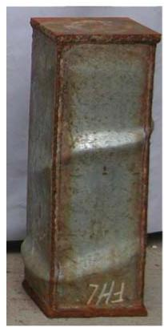  
(a)   
(2) Square columns.

  
(b)   
Fig. 3. Stub column failure mode.

Fig. 3. This is the same as that observed by many other researchers for normal concretefilled steel tubes, such as Uy [19] Han et al. [12], O’Shea and Bridge [13–15].

All the recorded curves of load (N) versus axial strain (ε) are shown in Figs. 4 and 5 for specimens with circular and square sections respectively. The maximum loads $( N _ { \mathrm { u e } } )$ and the ultimate strain $( \varepsilon _ { \mathrm { u e } } )$ corresponding to $N _ { \mathrm { u e } }$ obtained in the test are summarized in Table 1. Figs. 6 and 7 show the measured curves of load (N) versus lateral strain (ε) for specimens with circular and square sections respectively.

All tests show similar behaviour of axial load $( N )$ versus axial strain (ε) relationships, shown in Fig. 8.

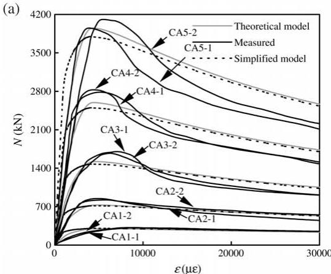

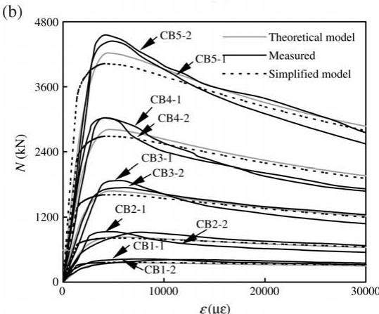

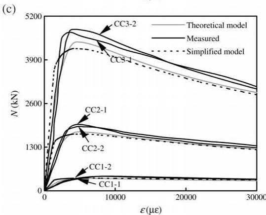  
Fig. 4. Axial load (N ) versus axial strain (ε) curves (circular sections).

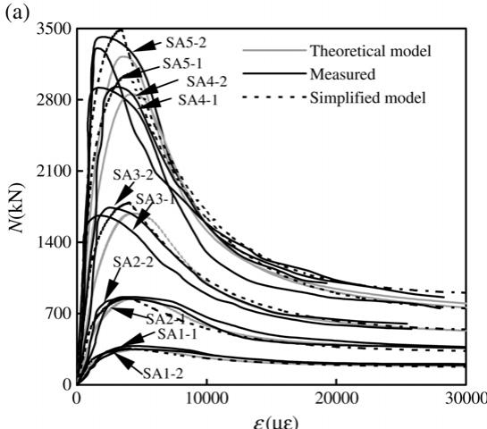

  
Fig. 5. Axial load (N ) versus axial strain (ε) curves (square sections).

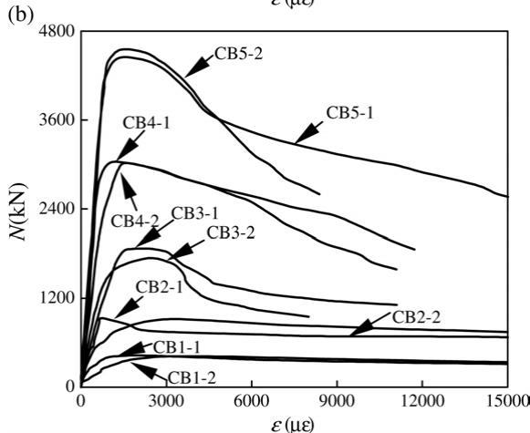

  
Fig. 6. Axial load (N ) versus lateral strain (ε) curves (circular sections).

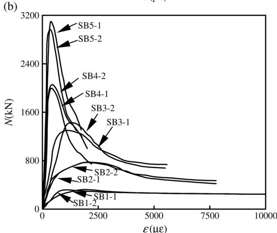

  
Fig. 7. Axial load (N ) versus lateral strain (ε) curves (square sections).

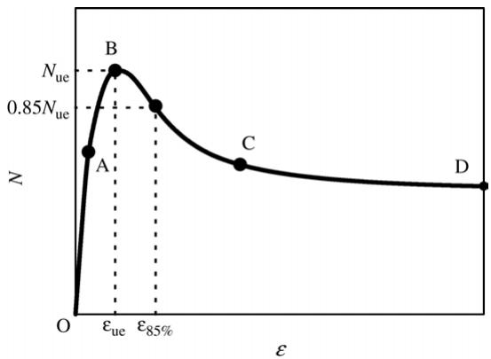  
Fig. 8. A schematic view of the measured axial load (N ) versus axial strain (ε) curves.

# 2.4. Strength index

A strength index is defined to quantify the section strength:

$$
S I = \frac {N _ {\mathrm {u e}}}{N _ {\mathrm {u o}}} \tag {1}
$$

where $N _ { \mathrm { u o } } = A _ { \mathrm { s } } \cdot f _ { y } + 0 . 8 5 A _ { \mathrm { c } } \cdot f _ { \mathrm { c } } ^ { \prime }$ , giving the sectional capacity as in ACI [1].

The strength indexes $( S I )$ so determined are listed in Table 1. They are plotted in Fig. 9(a) and (b) against the tube diameter or the width to wall thickness ratio $( D / t$ or $B / t )$ for the specimens with circular and square sections respectively. It can be seen from Fig. 9 that generally, the strength index decreases with increase of $D / t$ or $B / t$ . The reasons are that the constraining factor $\begin{array} { r } { \left( \xi = \frac { A _ { \mathrm { s } } \cdot f _ { \mathrm { s y } } } { A _ { \mathrm { c } } \cdot f _ { \mathrm { c k } } } \right) } \end{array}$ for the specimens decreases with increase of $D / t$ or $B / t$ , i.e. the composite action of steel tube and core concrete becomes smaller.

# 2.5. Ductility index

One of the parameters used to quantify section ductility is the ductility index. The definition given in [8] is adopted in this paper. It is expressed as

$$
D I = \frac {\varepsilon 85 \%}{\varepsilon_{\mathrm{ue}}} \tag{2}
$$

where, as shown in Fig. 10, $\varepsilon _ { \mathrm { u e } }$ is the strain at the ultimate load, and $\varepsilon _ { 8 5 \% }$ is the strain when the load falls to $8 5 \%$ of the ultimate load.

The ductility indexes $( D I )$ so determined are listed in Table 1. They are plotted in Fig. 10(a) and (b) against the tube diameter or width to wall thickness ratio $( D / t$ or $B / t$ ) for the specimens with circular and square sections respectively. It can be seen from Fig. 10 that, in general, the ductility index decreases with increase in $D / t$ or $B / t$ . The reasons are very similar to the causes of the strength index changing with increase of $D / t$ or $B / t$ .

At the same time, it can be seen from Figs. 9 and 10 that generally a greater reduction for SHS occurs. The reasons are that the constraining effect for CHS is better than for SHS with the same constraining factor $( \xi )$ and SHS are more prone to local buckling than CHS.

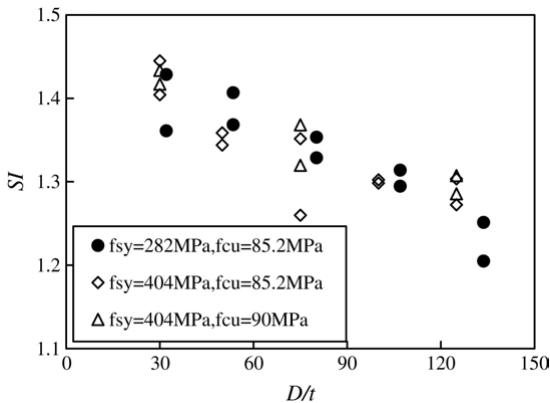  
(a) Circular sections.

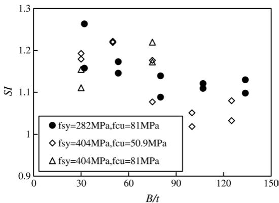  
(b) Square sections.   
Fig. 9. SI versus $D ( B ) / t$ relations.

# 3. Mechanics model

A numerical model was developed for the analysis of the behaviour of concrete-filled HSS stub columns. In the analysis, the effects of local buckling and residual stress are considered, and this was an extension of the former model, which was presented by Han et al. [12].

In this method, for the calculation of the load versus deformation relations of the stub composite columns, the following assumptions were made:

(1) There is no slip between the steel and concrete.   
(2) The stress–strain relationships for steel and for the confined concrete given by Han et al. [12], Han and Huo [10] are adopted. Details of the stress–strain relationship for the confined concrete based on NC are summarized in Appendix A in this paper.   
(3) Residual stress distributions for a steel plate of a column shown as in Fig. 11 is used in the analysis [11].

  
(a) Circular sections.

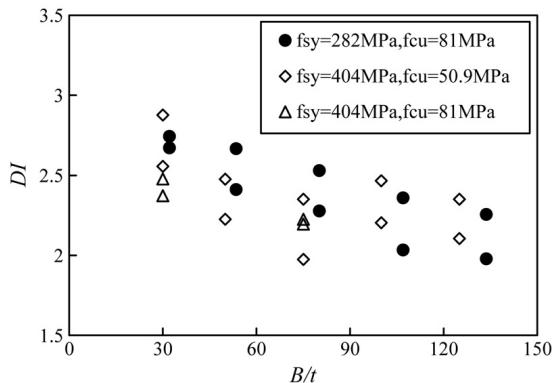  
(b) Square sections.   
Fig. 10. DI versus $D ( B ) / t$ relations.

(4) An effective width model for square sections, illustrated in Fig. 12, was adopted [18]. The effective width of $b _ { \mathrm { e } }$ can be given by

$$
\frac {b _ {\mathrm {e}}}{b} = \alpha \cdot \sqrt {\frac {f _ {\mathrm {o l}}}{f _ {\mathrm {s y}}}} \tag {3}
$$

where $\alpha = 0 . 6 5$ according to the Australian Standard AS4100 [4]; The buckling stress is calculated using the well-known equation of Bryan [6], i.e. $\begin{array} { r } { f _ { \mathrm { 0 l } } = \frac { \pi ^ { 2 } E _ { \mathrm { s } } } { 1 2 ( 1 - \mu _ { \mathrm { s } } ^ { 2 } ) } \frac { k } { ( b / t ) ^ { 2 } } } \end{array}$ ; $E _ { \mathrm { s } }$ and $\mu _ { s }$ are the modulus and the Poisson’s ratio of the steel respectively; the local buckling coefficient $k$ is taken as 10.3 [20].

(5) Force equilibrium and deformation consistencies are considered along the longitudinal direction, i.e.

$$
N = N _ {\mathrm {s}} + N _ {\mathrm {c}} \tag {4}
$$

$$
\varepsilon_ {\mathrm {s l}} = \varepsilon_ {\mathrm {c l}} \tag {5}
$$

  
Fig. 11. Residual stress distributions.

  
Fig. 12. Effective width of concrete-filled steel SHS sections.

in which $N _ { \mathrm { s } }$ and $N _ { \mathrm { c } }$ are forces carried by steel and concrete, $\varepsilon _ { \mathrm { s l } }$ and $\varepsilon _ { \mathrm { c l } }$ are longitudinal strains in steel and concrete.

The procedures for calculating load versus axial strain are expressed as follows:

For a given (i th) increment in axial strain $d \varepsilon _ { \mathrm { l } i } \ \to \ i \mathrm { t h }$ axial strain $\varepsilon _ { 1 , i + 1 } ~ = ~ \varepsilon _ { 1 i } ~ +$ $d \varepsilon _ { \mathrm { l } i } \ \to \ i \mathrm { t h }$ axial stress $\sigma _ { \mathrm { s l } , i + 1 }$ and $\sigma _ { \mathrm { c l } , i + 1 }  i \mathrm { t h }$ forces $N _ { \mathrm { s } , i }$ and $N _ { \mathrm { c } , i } ~  ~ i \mathrm { t h }$ force $N _ { i }$ or combined stress $\sigma _ { \mathrm { s c } } = N _ { i } / A _ { \mathrm { s c } }$ , where $A _ { \mathrm { s c } } = A _ { \mathrm { s } } + A _ { \mathrm { c } }$ .

Typical curves of combined stress versus axial strain are shown schematically in Fig. 13. It can be seen that the curves are a function of the confinement factor $( \xi )$ . There are three or four stages in the load versus axial curves, i.e.

Stage 1: Elastic stage (from point O to point A). During this stage, steel and concrete bear load independently. The yielding of steel occurs at point A.   
Stage 2: Elastic–plastic stage (from point A to point B). During this stage, concrete is confined by the steel tube because the Poisson’s ratio of the concrete is larger than that of steel. The confinement enhances as the longitudinal deformation increases.   
Stage 3: Strain hardening stage (from point B to point C or from point B to point D). During this stage, the load versus axial strain curves tend to go upwards. The shape of the curve depends on the value of the confinement factor $( \xi )$ . When $\xi$ is larger than $\xi _ { 0 }$ , the curve goes up steadily to point C. When $\xi$ is less than $\xi _ { 0 }$ , the curve starts to go down after

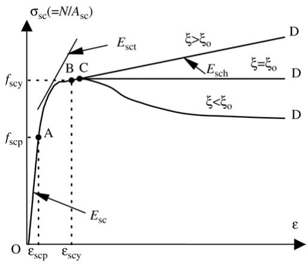  
Fig. 13. Typical axial load $( \sigma _ { \mathrm { S C } } )$ ) versus axial strain (ε) curves.

a short increase to point C. The smaller the confinement factor, the earlier the curve starts to fall down. It was found that the values of $\xi _ { 0 }$ for concrete-filled steel CHS and SHS can be given as 1.1 and 4.5 respectively [9].

Stage 4: Falling stage (from point C to point D). This occurs only when the confinement factor $( \xi )$ is less than $\xi _ { 0 }$ . The smaller the confinement factor, the steeper the curve fall.

The predicted curves are compared with the measured curves for the current tests in Figs. 4 and 5. It can be seen that reasonable agreement is achieved.

The column section capacities predicted using the mechanics model are compared with the current circular stub column tests. Fig. 14(a) shows the comparisons, where a mean of 0.915 and a COV (coefficient of variation) of 0.038 are obtained. Fig. 14(b) shows the comparisons between column sectional capacity predicted using the mechanics model with the current square stub column test results, where a mean of 0.952 and a COV of 0.054 are obtained.

# 4. Simplified model

# 4.1. Section capacity

Fig. 15(1) and (2) show the relationships between axial stress $( \sigma _ { \mathrm { s c } } = N / A _ { \mathrm { s c } } )$ ) and axial strain (ε) of the composite columns with circular and square sections under different conditions respectively. It can be concluded that the $\sigma _ { \mathrm { s c } } - \varepsilon$ relationships show strain hardening or an elastic–perfectly plastic behaviour with larger confinement factor $( \xi )$ , while for columns with smaller $\xi$ , the $\sigma _ { \mathrm { s c } } - \varepsilon$ curves are of degrading types.

The load corresponding to the longitudinal strain $\varepsilon _ { \mathrm { s c y } }$ was chosen as the ultimate strength of the stub columns. Using the procedure in Fig. 13 for the three different types of load–strain curves, Han [9] has determined the value of $\varepsilon _ { \mathrm { s c y } }$ as follows:

For concrete-filled steel CHS sections:

$$
\varepsilon_ {\mathrm {s c y}} = 1 3 0 0 + 1 2. 5 f _ {\mathrm {c}} ^ {\prime} + (6 0 0 + 3 3. 3 f _ {\mathrm {c}} ^ {\prime}) \cdot \xi^ {0. 2}. \tag {6a}
$$

  
(a) Circular sections.

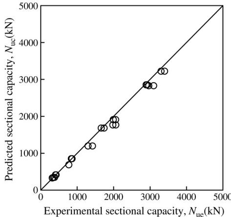  
(b) Square sections.   
Fig. 14. Comparison of sectional capacity between theoretical model and tests.

For concrete-filled steel SHS sections:

$$
\varepsilon_ {\mathrm {s c y}} = 1 3 0 0 + 1 2. 5 f _ {\mathrm {c}} ^ {\prime} + (5 7 0 + 3 1. 7 f _ {\mathrm {c}} ^ {\prime}) \cdot \xi^ {0. 2}. \tag {6b}
$$

The considerations for the determination of $\varepsilon _ { \mathrm { s c y } }$ can be summarized as follows:

(1) $\varepsilon _ { \mathrm { s c y } }$ is the strain corresponding to the peak load, for the $\sigma _ { \mathrm { s c } } - \varepsilon$ curves are of degrading types. While the $\sigma _ { \mathrm { s c } } - \varepsilon$ curves showed strain hardening or an elastic–perfectly plastic behaviour, the elastic–plastic stage, the $\sigma _ { \mathrm { s c } } - \varepsilon$ curves generally complete at the strain of $\varepsilon _ { \mathrm { s c y } }$ (point B in Fig. 13).   
(2) The steel reaches the yield strength $f _ { \mathrm { s y } }$ , whilst the concrete reaches its ultimate compressive strength $\sigma _ { 0 }$ (see Appendix A) at point B.   
(3) The axial stress $\sigma _ { \mathrm { s c } }$ increases relatively quickly with increase of axial strain when $\varepsilon < \varepsilon _ { \mathrm { s c y } }$ , while the axial stress $\sigma _ { \mathrm { s c } }$ increases relatively slowly, or even decreases with increase of axial strain when $\varepsilon > \varepsilon _ { \mathrm { s c y } }$ (see Fig. 13).

It was found that, within the parameter range of $f _ { \mathrm { s y } } ~ = ~ 2 0 0 { - } 7 0 0 ~ \mathrm { M P a }$ , $\begin{array} { r l } { f _ { \mathrm { c u } } } & { { } = } \end{array}$ $3 0 { \mathrm { - } } 1 2 0 \ \mathrm { M P a }$ and $\alpha = 0 . 0 3 – 0 . 2$ , $\varepsilon _ { \mathrm { s c y } }$ ranges from 2740 to $5 2 0 0 ~ { \mu \varepsilon }$ for concrete-filled steel CHS columns, whilst $\varepsilon _ { \mathrm { s c y } }$ ranges from 2680 to $5 0 5 0 \mu \varepsilon$ for concrete-filled steel SHS columns.

For convenience of analysis, the “nominal yielding strength” of the composite sections $( f _ { \mathrm { s c y } } )$ is defined as follows:

$$
f _ {\mathrm {s c y}} = \frac {N _ {\mathrm {u o}}}{A _ {\mathrm {s c}}} \tag {7}
$$

in which

$N _ { \mathrm { u o } }$ – sectional capacity of the composite column;

$A _ { \mathrm { s c } }$ – cross-section area of the composite section.

The compressive strength ratio of the composite sections $( \gamma _ { \mathrm { c } } = f _ { \mathrm { s c y } } / f _ { \mathrm { c k } } )$ ) so determined according to the mechanics model in this paper is plotted in Fig. 16 against the confinement

  
(a) fcu=30MPa

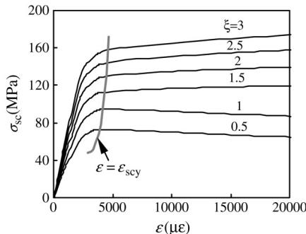

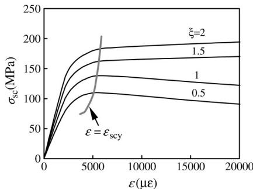  
(b) fcu=60 MPa   
(c) fcu=90 MPa   
(1) Circular sections.   
Fig. 15. $\sigma _ { \mathrm { s c } }$ versus $\varepsilon$ relations.

factor $( \xi )$ . It can be seen from Fig. 16 that the ratio $\gamma _ { \mathrm { c } } = f _ { \mathrm { s c y } } / f _ { \mathrm { c k } }$ increases when the confinement factor $( \xi )$ increases. Formulae for $f _ { \mathrm { s c y } }$ can be obtained by using the regression analysis method, i.e.

For concrete-filled steel CHS columns:

$$
f _ {\mathrm {s c y}} = (1. 1 4 + 1. 0 2 \xi) \cdot f _ {\mathrm {c k}} \tag {8a}
$$

  
(a) fcu=30 MPa

  
(b) fcu=60 MPa   
(c) fcu=90 MPa   
(2) Square sections.   
Fig. 15. (continued).

For concrete-filled steel SHS columns:

$$
f _ {\mathrm {s c y}} = (1. 1 8 + 0. 8 5 \xi) \cdot f _ {\mathrm {c k}} \tag {8b}
$$

The validity limit of Eq. (8) is: $0 . 1 < \xi < 5$ .

It can be found that Eq. (8) is easier to use in calculations compared with the former simplified model, which was presented by Han et al. [12].

  
(a) Concrete-filled steel CHS.

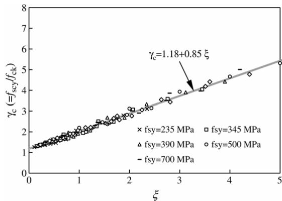  
(b) Concrete-filled steel SHS.   
Fig. 16. $\gamma _ { \mathrm { c } }$ $( = f _ { \mathrm { s c y } } / f _ { \mathrm { c k } } )$ versus $\xi$ relations.

The concrete-filled steel CHS column section capacity predicted using formula (7) are compared with the current test results in Fig. 17(a) and (b) for columns with circular and square sections respectively, where a mean value of 0.888 and a COV (coefficient of variation) of 0.033 for circular columns, and a mean value of 1.011 and a COV of 0.055 for square columns are obtained.

# 4.2. Axial load versus axial deformation relations

On the basis of the numerical model mentioned above, according to the regression analysis method, the $\sigma _ { \mathrm { s c } } - \varepsilon$ relations shown in Fig. 13 can be expressed as follows:

(1) Stage OA $( 0 < \varepsilon \le \varepsilon _ { \mathrm { s c p } }$ ):

$$
\sigma = E _ {\mathrm {s c}} \cdot \varepsilon \tag {9}
$$

where $E _ { \mathrm { s c } }$ is the elastic modulus of the composite sections, and can be given as

$$
E _ {\mathrm {s c}} = f _ {\mathrm {s c p}} / \varepsilon_ {\mathrm {s c p}} \tag {10}
$$

  
(a) Circular sections.

  
(b) Square sections.   
Fig. 17. Comparison of sectional capacity between the simplified model and test.

$f _ { \mathrm { s c p } }$ and $\varepsilon _ { \mathrm { s c p } }$ are the stress and strain corresponding to point A in Fig. 13, and can be given as:

(1) For concrete-filled steel CHS sections:

$$
f _ {\mathrm {s c p}} = \left[ 0. 1 9 2 \left(f _ {\mathrm {s y}} / 2 3 5\right) + 0. 4 8 8 \right] \cdot f _ {\mathrm {s c y}} \tag {11}
$$

$$
\varepsilon_ {\mathrm {s c p}} = 3. 2 5 \times 1 0 ^ {- 6} f _ {\mathrm {s y}}. \tag {12}
$$

(2) For concrete-filled steel SHS sections:

$$
f _ {\mathrm {s c p}} = \left[ 0. 2 6 3 \cdot \left(f _ {\mathrm {s y}} / 2 3 5\right) + 0. 3 6 5 \cdot \left(3 0 / f _ {\mathrm {c u}}\right) + 0. 1 0 4 \right] \cdot f _ {\mathrm {s c y}} \tag {13}
$$

$$
\varepsilon_ {\mathrm {s c p}} = 3. 0 1 \times 1 0 ^ {- 6} f _ {\mathrm {s y}} \tag {14}
$$

where the unit for $f _ { \mathrm { s y } }$ and $f _ { \mathrm { c u } }$ is $\mathrm { N } / \mathrm { m m } ^ { 2 }$

(2) Stage AB $( \varepsilon _ { \mathrm { s c p } } < \varepsilon \leq \varepsilon _ { \mathrm { s c y } } )$ ):

In this stage, $\sigma _ { \mathrm { s c } } - \varepsilon$ can be given as

$$
\varepsilon^ {2} + a \cdot \sigma^ {2} + b \cdot \varepsilon + c \cdot \sigma + d = 0 \tag {15}
$$

in which

$$
a = \frac {- \left(\varepsilon_ {\mathrm {s c y}} - \varepsilon_ {\mathrm {s c p}}\right) ^ {2} - 2 e \cdot \left(\varepsilon_ {\mathrm {s c y}} - \varepsilon_ {\mathrm {s c p}}\right)}{\left(f _ {\mathrm {s c y}} ^ {2} - f _ {\mathrm {s c p}} ^ {2}\right) + \left(\varepsilon_ {\mathrm {s c y}} - \varepsilon_ {\mathrm {s c p}}\right) \cdot \left(- 2 f _ {\mathrm {s c p}} \cdot E _ {\mathrm {s c}}\right) + e \cdot \left(2 f _ {\mathrm {s c y}} \cdot k - 2 f _ {\mathrm {s c p}} \cdot E _ {\mathrm {s c}}\right)};
$$

$$
b = - 2 \varepsilon_ {\mathrm {s c p}} - 2 a \cdot f _ {\mathrm {s c p}} \cdot E _ {\mathrm {s c}} - c \cdot E _ {\mathrm {s c}};
$$

$$
c = \frac {2 (\varepsilon_ {\mathrm {s c y}} - \varepsilon_ {\mathrm {s c p}}) + (2 f _ {\mathrm {s c y}} \cdot k - 2 f _ {\mathrm {s c p}} \cdot E _ {\mathrm {s c}}) \cdot a}{E _ {\mathrm {s c}} - k};
$$

$$
d = - \varepsilon_ {\mathrm {s c p}} ^ {2} - a \cdot f _ {\mathrm {s c p}} ^ {2} - b \cdot \varepsilon_ {\mathrm {s c p}} - c \cdot f _ {\mathrm {s c p}};
$$

$$
e = \frac {(f _ {\mathrm {s c y}} - f _ {\mathrm {s c p}}) - E _ {\mathrm {s c}} \cdot (\varepsilon_ {\mathrm {s c y}} - \varepsilon_ {\mathrm {s c p}})}{E _ {\mathrm {s c}} - k}.
$$

Here, when $\xi < \xi _ { 0 }$ , $k = 0$ ; when $\xi \ge \xi _ { \mathrm { o } }$ , $k = E _ { \mathrm { s c h } }$ , where $E _ { \mathrm { s c h } }$ is the tangent modulus in the hardening stage. For concrete-filled steel CHS columns, $\xi _ { 0 } = 1 . 1$ , $E _ { \mathrm { s c h } } = 2 7 0 \xi - 1 0 0$ . For concrete-filled steel SHS columns, $\xi _ { 0 } = 4 . 5$ , $E _ { \mathrm { s c h } } = 3 0 \xi - 4 0$ .

(3) Hardening or descending stage BD $( \varepsilon > \varepsilon _ { \mathrm { s c y } } )$ ):

For concrete-filled steel CHS sections:

$$
\sigma = \left\{ \begin{array}{l l} f _ {\mathrm {s c y}} + E _ {\mathrm {s c h}} \left(\varepsilon - \varepsilon_ {\mathrm {s c y}}\right) & (\xi \geq 1. 1) \\ \frac {f _ {\mathrm {s c y}} \cdot \varepsilon}{D \left(\varepsilon - \varepsilon_ {\mathrm {s c y}}\right) ^ {2} + \varepsilon} & (\xi <   1. 1) \end{array} \right. \tag {16a}
$$

in which

$$
D = p \cdot \xi^ {2} + q \cdot \xi + r;
$$

$$
p = 0. 5 2 \beta_ {\mathrm {c}} ^ {2} + 5. 6 \beta_ {\mathrm {c}} - 5. 8 5;
$$

$$
q = - 1. 3 6 \beta_ {\mathrm {c}} ^ {2} - 1 0. 2 \beta_ {\mathrm {c}} + 7. 3;
$$

$$
r = 0. 4 4 \beta_ {\mathrm {c}} ^ {2} + 9. 4 \beta_ {\mathrm {c}} - 4. 8 \mathrm {g};
$$

$$
\beta_ {\mathrm {c}} = f _ {\mathrm {c u}} / 3 0,
$$

where the unit for $f _ { \mathrm { c u } }$ is $\mathrm { N } / \mathrm { m m } ^ { 2 }$ .

For concrete-filled steel SHS sections:

$$
\sigma = \left\{ \begin{array}{l l} f _ {\mathrm {s c y}} + E _ {\mathrm {s c h}} \left(\varepsilon - \varepsilon_ {\mathrm {s c y}}\right) & (\xi \geq 4. 5) \\ f _ {\mathrm {s c y}} \cdot \left(1 - \beta_ {\xi} + \beta_ {\xi} \cdot \exp - \left(\frac {\varepsilon - \varepsilon_ {\mathrm {s c y}}}{m}\right)\right) & (\xi <   4. 5) \end{array} \right. \tag {16b}
$$

in which

$$
\beta_ {\xi} = - 0. 1 9 4 \ln \xi + 0. 4 4 5;
$$

$$
m = (n \cdot \xi + l) \times 1 0 ^ {- 3};
$$

$$
n = 0. 5 \beta_ {\mathrm {c}} + 0. 1 8;
$$

$$
l = 0. 8 \beta_ {\mathrm {c}} + 3. 7 4;
$$

$$
\beta_ {\mathrm {c}} = f _ {\mathrm {c u}} / 3 0,
$$

where the unit for $f _ { \mathrm { c u } }$ is $\mathrm { N } / \mathrm { m m } ^ { 2 }$ .

Figs. 4 and 5 compare the calculated $N { - } \varepsilon$ relation curves among the tests, the mechanics model and the simplified model. Comparisons of $\sigma _ { \mathrm { s c } } - \varepsilon$ relation curves between the mechanics model and the simplified model are shown in Fig. 18; it can be seen that good agreement is achieved.

# 5. Comparisons with current code provisions

The sectional capacities predicted using the following six design methods are compared with the stub column test results:

– ACI [1].   
– AIJ [2].   
– AISC-LRFD [3].   
– BS5400 [5].   
– EC4 [7].

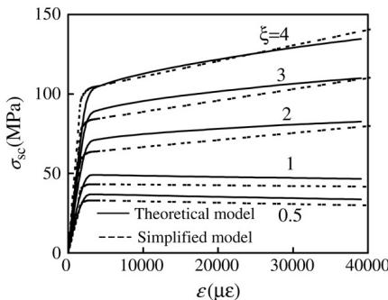  
(a) fcu=30MPa

  
(b)fcu=60 MPa

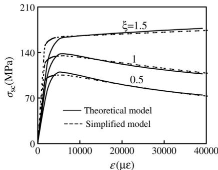  
(c)fcu=90 MPa   
(1) Circular sections.   
Fig. 18. Comparison of predicted $\sigma _ { \mathrm { s c } }$ versus $\varepsilon$ curves between the theoretical model and simplified model.

In all the design calculations, the material partial safety factors were set to unity.

Predicted section capacities $( N _ { \mathrm { u c } } )$ using the different methods are compared with test results $( N _ { \mathrm { u e } } )$ . For overall comparisons, Table 2 shows both the mean value $( \mu )$ and the coefficient of variation (COV) of the ratio of $N _ { \mathrm { u c } } / N _ { \mathrm { u e } }$ for the different design methods.

Results in Table 2 show that ACI [1], AIJ [2], AISC-LRFD [3] and BS5400 [5] are conservative for predicting the sectional capacities of the specimens with circular sections.

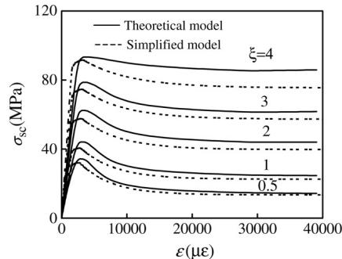  
(a) fcu=30MPa

  
(b) fcu=60 MPa

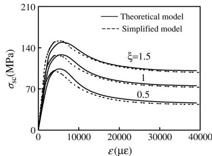  
（c $) \ f _ { \mathrm { c u } } = 9 0 \ : \mathrm { M P a }$   
(2) Square sections.   
Fig. 18. (continued).

Table 2 Comparison between predicted section capacities $( N _ { \mathrm { u c } } )$ ) and test results $( N _ { \mathrm { u e } }$ )   

<table><tr><td rowspan="3">Section type</td><td colspan="10">Nuc/Nue</td></tr><tr><td colspan="2">ACI (1999)</td><td colspan="2">AIJ (1997)</td><td colspan="2">AISC-LRFD (1999)</td><td colspan="2">BS5400 (1979)</td><td colspan="2">EC4 (1994)</td></tr><tr><td>μ</td><td>COV</td><td>μ</td><td>COV</td><td>μ</td><td>COV</td><td>μ</td><td>COV</td><td>μ</td><td>COV</td></tr><tr><td>Circular</td><td>0.788</td><td>0.039</td><td>0.843</td><td>0.028</td><td>0.785</td><td>0.041</td><td>0.952</td><td>0.054</td><td>1.006</td><td>0.049</td></tr><tr><td>Square</td><td>0.919</td><td>0.050</td><td>0.919</td><td>0.050</td><td>0.916</td><td>0.052</td><td>0.878</td><td>0.054</td><td>1.027</td><td>0.067</td></tr></table>

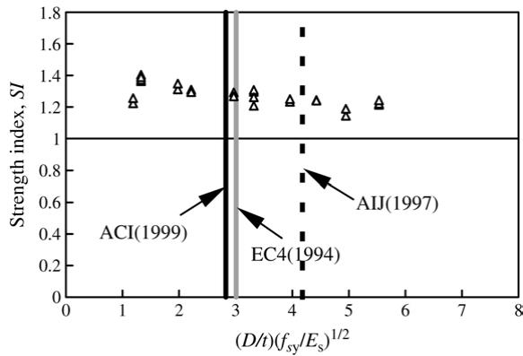  
Fig. 19. Strength index (SI) versus $( D / t ) \cdot \sqrt { f _ { \mathrm { s y } } / E _ { s } }$ relations (circular columns).

Overall, ACI [1] and AISC-LRFD [3] gave a sectional capacity about $2 0 \%$ lower than the results obtained in the tests. AIJ [2] and BS5400 [5] gave a section capacity about $1 6 \%$ and $5 \%$ lower than the measured ultimate strengths respectively. Overall, the methods proposed by EC4 [7] and BS5400 [5] give means of 1.006 and 0.952, and COVs of 0.049 and 0.054 respectively, are the best means predicted.

Results in Table 2 also clearly show that ACI [1], AIJ [2], AISC-LRFD [3] and BS5400 [5] are conservative for predicting the sectional capacities of the specimens with square sections. Overall, the four codes gave a sectional capacity about $1 0 \%$ lower than the results obtained in the tests. However, EC4 [7] gave a section capacity about $3 \%$ higher than these of the measured ultimate strength, and gave an unsafe prediction. Overall, the methods proposed by ACI [1] and AIJ [2] give a mean of 0.919 and a COV of 0.050, is the best mean predicted.

The existing codes (ACI-1999, AISC-LRFD-1999, AIJ-1997, BS5400-1979 and EC4- 1994) were calibrated only for NC-filled members. They are used in this paper to predict the section capacity $( N _ { \mathrm { u c } } )$ of SCC-filled HSS stub columns. It seems that the conclusion regarding predictions using existing design codes made for NC-filled HSS stub columns remains the same for SCC-filled HSS stub columns.

# 6. Discussions on the upper limits of the $D / t$ and $B / t$ ratios

The limiting values of the diameter-to-thickness ratio for a circular tube and the widthto-thickness ratio for a square tube are given in the different codes. The current stub column test results were used to examine the limiting diameter (width)-to-thickness ratio for the composite columns.

Figs. 19 and 20 show the strength index (SI) versus diameter (width)-to-thickness rations relations for circular and square sections, respectively, where the strength index (SI) is calculated from Eq. (1). The limiting values of the diameter-to-thickness ratio for the composite sections, given in ACI [1], AIJ [2] and EC4 [7], were also given in Figs. 19 and 20.

  
Fig. 20. Strength index $( S I )$ versus $( B / t ) \cdot \sqrt { f _ { \mathrm { s y } } / E _ { s } }$ relations (square sections).

The following observations can be made from Figs. 19 and 20: in general, the values of SI obtained for both circular and square specimens become smaller with increase of the diameter (width)-to-thickness ratio since the confining effect becomes smaller in this case. However, the strength index (SI) does not decrease significantly with increase of the diameter (width)-to-thickness ratio, which means that the diameter (width)-tothickness ratio effect in the composite columns does not clearly appear, since the concrete core can prevent the local buckling. It was found that, from the viewpoint of the maximum strength, the current limitation of diameter (width)-to-thickness ratio for the composite columns in AIJ [2], i.e. the limit value of 1.5 times that of unfilled steel tube, is appropriate.

# 7. Conclusions

The present study is an attempt to study the behaviour of SCC-filled HSS stub columns. On the basis of the results of this study, the following conclusions can be drawn within the scope of these tests:

(1) 50 stub column test results, with a wide range of diameter (width)-to-thickness ratio for HSS sections filled with SCC, were reported in this paper.   
(2) A simplified model is developed for calculating the section capacity and the axial load versus axial deformation relationships of the composite stub columns.   
(3) Comparisons are made with predicted section capacity using existing codes, such as ACI-1999, AIJ-1997, AISC-LRFD-1999, BS5400-1979 and EC4-1994. It seems that the conclusion regarding predictions using existing design codes made for NC-filled HSS stub columns remains the same for SCC-filled HSS stub columns.   
(4) The test results were compared to examine the limiting diameter (width)-to-thickness ratio for the composite columns. It was found that, from the viewpoint of the maximum strength, the current limitation of diameter (width)-to-thickness ratio in AIJ-1997, i.e. the limit value of 1.5 times that of unfilled steel tube, is appropriate.

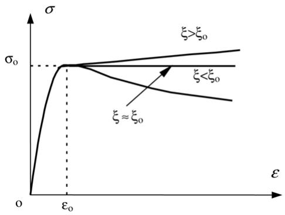  
Fig. 21. A schematic view of axial stress $( \sigma _ { \cdot }$ ) versus axial strain (ε) relationship for concrete.

# Acknowledgements

The tests reported herein were made possible by financial support from the National Natural Science Foundation of China (No. 50425823). The authors wish to thank Mr. Zhi-Bo Chen and Miss Guo-Jie Wang for their assistance in the experiments. This project forms part of a collaborative research programme of Fuzhou University and Monash University.

# Appendix A. Stress–strain relations of the confined concrete

A typical stress–strain curve for confined concrete is shown in Fig. 21, where the confinement factor $( \xi )$ is defined as [12,10]

$$
\xi = \frac {A _ {\mathrm {s}} \cdot f _ {\mathrm {s y}}}{A _ {\mathrm {c}} \cdot f _ {\mathrm {c k}}} = \alpha \cdot \frac {f _ {\mathrm {s y}}}{f _ {\mathrm {c k}}} \tag {A.1}
$$

in which $A _ { \mathrm { s } }$ is the cross-section area of steel tube; $A _ { \mathrm { c } }$ is the cross-section area of concrete; $\alpha = A _ { \mathrm { s } } / A _ { \mathrm { c } }$ is defined as the steel ratio; $f _ { \mathrm { s y } }$ is the yield stress of steel tube, and $f _ { \mathrm { c k } }$ is the compression strength of concrete. The value of $f _ { \mathrm { c k } }$ is determined using $6 7 \%$ of the compression strength of cubic blocks. Detailed expressions are given in [10].

It can be seen from Fig. 21 that the higher the confinement factor $( \xi )$ , the higher the compression strength of confined concrete. It can also be seen from Fig. 21 that the higher $\xi$ , the more ductile the confined concrete. The confinement factor $( \xi )$ , to some extent, represents the composite action of steel tubes and concrete core.

The stress $( \sigma )$ versus strain (ε) relations for steel CHS confined concrete are given as

$$
y = 2 x - x ^ {2} \quad (x \leq 1) \tag {A.2a}
$$

$$
y = \left\{ \begin{array}{l l} 1 + q \cdot \left(x ^ {0. 1 \xi} - 1\right) & (\xi \geq 1. 1 2) \\ \frac {x}{\beta \cdot (x - 1) ^ {2} + x} & (\xi <   1. 1 2) \end{array} \quad (x > 1) \right. \tag {A.2b}
$$

in which

$$
\begin{array}{l} x = \frac {\varepsilon}{\varepsilon_ {0}}; \\ y = \frac {\sigma}{\sigma_ {0}}; \\ \end{array}
$$

$$
\begin{array}{l} \sigma_ {\mathrm {o}} = \left[ 1 + (- 0. 0 5 4 \cdot \xi^ {2} + 0. 4 \cdot \xi) \cdot \left(\frac {2 4}{f _ {\mathrm {c}} ^ {\prime}}\right) ^ {0. 4 5} \right] \cdot f _ {\mathrm {c}} ^ {\prime} \tag {A.3} \\ \varepsilon_ {\mathrm {o}} = \varepsilon_ {\mathrm {c c}} + \left[ 1 4 0 0 + 8 0 0 \cdot \left(\frac {f _ {\mathrm {c}} ^ {\prime}}{2 4} - 1\right) \right] \cdot \xi^ {0. 2} (\mu \varepsilon); \\ \varepsilon_ {\mathrm {c c}} = 1 3 0 0 + 1 2. 5 \cdot f _ {\mathrm {c}} ^ {\prime} (\mu \varepsilon); \\ q = \frac {\xi^ {0 . 7 4 5}}{2 + \xi}; \\ \beta = (2. 3 6 \times 1 0 ^ {- 5}) ^ {[ 0. 2 5 + (\xi - 0. 5) ^ {7} ]} \cdot f _ {\mathrm {c}} ^ {\prime 2} \cdot 3. 5 1 \times 1 0 ^ {- 4}. \\ \end{array}
$$

The units for stress and strain are $\mathrm { N } / \mathrm { m m } ^ { 2 }$ and $\mu \varepsilon$ respectively.

The stress $( \sigma )$ versus strain $( \varepsilon )$ relations for steel SHS confined concrete are given as

$$
\begin{array}{l} y = 2 \cdot x - x ^ {2} \quad (x \leq 1) (A.4a) \\ y = \frac {x}{\beta \cdot (x - 1) ^ {\eta} + x} \quad (x > 1) (A.4b) \\ \end{array}
$$

in which

$$
\begin{array}{l} x = \frac {\varepsilon}{\varepsilon_ {0}}; \\ y = \frac {\sigma}{\sigma_ {0}}; \\ \sigma_ {0} = \left[ 1 + (- 0. 0 1 3 5 \cdot \xi^ {2} + 0. 1 \cdot \xi) \cdot \left(\frac {2 4}{f _ {\mathrm {c}} ^ {\prime}}\right) ^ {0. 4 5} \right] \cdot f _ {\mathrm {c}} ^ {\prime} \tag {A.5} \\ \varepsilon_ {\mathrm {o}} = \varepsilon_ {\mathrm {c c}} + \left[ 1 3 3 0 + 7 6 0 \cdot \left(\frac {f _ {\mathrm {c}} ^ {\prime}}{2 4} - 1\right) \right] \cdot \xi^ {0. 2} (\mu \varepsilon); \\ \varepsilon_ {\mathrm {c c}} = 1 3 0 0 + 1 2. 5 \cdot f _ {\mathrm {c}} ^ {\prime} (\mu \varepsilon); \\ \eta = 1. 6 + 1. 5 / x; \\ \beta = \left\{ \begin{array}{l l} \frac {f _ {\mathrm {c}} ^ {\prime 0 . 1}}{1 . 3 4 \sqrt {1 + \xi}} & (\xi \leq 3. 0) \\ \frac {f _ {\mathrm {c}} ^ {\prime 0 . 1}}{1 . 3 4 \sqrt {1 + \xi} \cdot (\xi - 2) ^ {2}} & (\xi > 3. 0). \end{array} \right. \\ \end{array}
$$

The units for stress and strain are $\mathrm { N } / \mathrm { m m } ^ { 2 }$ and $\mu \varepsilon$ respectively.

# References

[1] ACI 318-99. Building code requirements for structural concrete and commentary. Farmington Hills (MI), Detroit (USA): American Concrete Institute; 1999.   
[2] AIJ. Recommendations for design and construction of concrete filled steel tubular structures. Tokyo (Japan): Architectural Institute of Japan; 1997.   
[3] AISC-LRFD. Load and resistance factor design specification for structural steel buildings. 2nd ed. Chicago (USA): American Institute of Steel Construction (AISC); 1999.   
[4] SAA. Steel structures, Australian standard AS4100. Sydney (Australia): Standards Association of Australia; 1998.   
[5] British Standard Institute. BS5400, Part 5, Concrete and composite bridges. London, UK; 1979.   
[6] Bryan BG. On the stability of a plane plate under thrusts in its own plane with application on the buckling of the sides of a ship. Proceedings of the London Mathematical Society 1891;54.   
[7] Eurocode 4. Design of composite steel and concrete structures, Part 1.1: General rules and rules for buildings (together with United Kingdom National Application Document). DD ENV 1994-1-1:1994. London W1A2BS: British Standards Institution; 1994.   
[8] Han LH. Tests on stub columns of concrete-filled RHS sections. Journal of Constructional Steel Research 2002;58(3):353–72.   
[9] Han LH. Concrete-filled steel tubular structures (the second version). Peking: China Science Press; 2004. [in Chinese].   
[10] Han LH, Huo JS. Concrete-filled HSS columns after exposure to ISO-834 standard fire. Journal of Structural Engineering, ASCE 2003;129(1):68–78.   
[11] Han LH, Yao GH. Behaviour of concrete-filled hollow structural steel (HSS) columns with pre-load on the steel tubes. Journal of Constructional Steel Research 2003;59(12):1455–75.   
[12] Han LH, Zhao XL, Tao Z. Tests and mechanics model of concrete-filled SHS stub columns, columns and beam–columns. Steel and Composite Structures—An International Journal 2001;1(1):51–74.   
[13] O’Shea MD, Bridge RQ. Tests on circular thin-walled steel tubes filled with medium and high strength concrete. Department of Civil Engineering Research Report No. R755. Sydney (Australia): University of Sydney; 1997.   
[14] O’Shea MD, Bridge RQ. Tests on circular thin-walled steel tubes filled with very high strength concrete. Department of Civil Engineering Research Report No. R754. Sydney (Australia): University of Sydney; 1997.   
[15] O’Shea MD, Bridge RQ. Behaviour of thin-walled box sections with lateral restraint. Department of civil engineering research report No. R739. Sydney (Australia): University of Sydney; 1997.   
[16] Persson B. A comparison between mechanical properties of self-compacting concrete and the corresponding properties of normal concrete. Cement and Concrete Research 2001;31(2):193–8.   
[17] Schneider SP. Axially loaded concrete-filled steel tubes. Journal of Structural Engineering, ASCE 1998; 124(10):1125–38.   
[18] Uy B. Strength of concrete filled steel box columns incorporating local buckling. Journal of Structural Engineering, ASCE 2000;126(3):341–52.   
[19] Uy B. Strength of short concrete filled high strength steel box columns. Journal of Constructional Steel Research 2001;57(2):113–34.   
[20] Uy B, Bradford MA. Elastic local buckling of concrete filled box columns. Engineering Structures 1996; 18(3):193–200.   
[21] Zhu WZ, Peter JMB. Permeation properties of self-compacting concrete. Cement and Concrete Research 2003;33(6):921–6.