# Behavior of steel fiber reinforced concrete-filled steel tube columns under axial compression

Yiyan Lu, Na Li, Shan Li ⇑ , Hongjun Liang

School of Civil Engineering, Wuhan University, Wuhan 430072, China

# h i g h l i g h t s

- Study on steel fiber reinforced concrete-filled steel tube column under axial load.   
- Steel fibers have no obvious effects on the failure mode and the load capacity.   
- Steel fibers significantly improve the ductility.   
- Design equations for axial load capacity and ductility index are proposed.

# a r t i c l e i n f o

Article history:

Received 8 July 2014

Received in revised form 18 June 2015

Accepted 14 July 2015

Available online 20 July 2015

Keywords:

Concrete-filled steel tube (CFST) columns

Steel fiber reinforced concrete (SFRC)

High strength concrete

Axial compression

Load capacity

Ductility

# a b s t r a c t

This paper presents an experimental work for short steel tube columns filled with plain concrete and steel fiber reinforced concrete under axial load. The study aimed to explore the effect of steel fiber on the behavior of concrete-filled steel tube (CFST) columns with different concrete strengths and thicknesses of steel tube. Thirty-six specimens were tested with steel fiber volume percentages of $0 \%$ , $0 . 6 \%$ , $0 . 9 \%$ and $1 . 2 \%$ , thicknesses of steel tube of 3, 4 and 5 mm and concrete strengths from 50 to 70 MPa. The failure modes, ultimate loads and axial load-axial shortening relationships are presented. Experimental results show that steel fiber fails to change the failure mode of CFST columns, but delays the local buckling of steel tube through bridging the plastic cracks near the sliding plane and improving the shear-frictional resistance of concrete. This beneficial effect from steel fibers also leads to significant improvement of the ductility and the energy dissipation capacity of CFST columns. Compared with thicker steel tube, adding steel fibers to concrete is a more effective and economical method in enhancing the ductility of CFST columns. The results also indicate that the presence of steel fibers has no obvious effect on the ultimate load of CFST columns. Design formulas for the load capacity and ductility of CFST columns are proposed, and the predictions agree well with the experimental results from this study and the literature.

$^ { © }$ 2015 Elsevier Ltd. All rights reserved.

# 1. Introduction

Concrete-filled steel tube (CFST) columns have been widely used in modern structures. This is mainly due to the combination of the advantages of both steel and concrete, such as the high strength, ductility, stiffness and fire resistance, and economic and rapid construction [1]. The enhanced mechanical properties of CFST columns can be explained in terms of composite action between the perimeter steel tube and the concrete core. The steel tube provides lateral confinement to the infill concrete while the concrete prevents inward local buckling of the steel tube.

High strength concrete has recently become an attractive alternative to normal strength concrete in CFST columns because of smaller column size and less self weight. However, high strength concrete is characterized by a reduced dilation and a more brittle failure in comparison with normal strength concrete [2]. This is rather unfavorable to concrete confinement and load transfer, and consequently a sharp drop of axial load happens for those CFST columns with high strength concrete [3,4]. To obtain a ductile behavior, a tube with high strength or small diameter-to-thickness ratio is needed [5,6], which is certain to increase the construction cost. In this situation, improving the performance of concrete has been expected to be another way of achieving a better behavior of the steel tube columns filled with high strength concrete.

Adding fibers into plain concrete has been proved to be an effective method of eliminating its inherent brittleness. The fibers

bridge the cracks in the matrix and transfer the applied load to the matrix, thus fiber reinforced concrete has better post-crack behavior than plain concrete. For example, when a diagonal shear crack occurs in steel fiber reinforced concrete, steel fibers crossing the shear failure plane provide additional shear frictional resistance. This helps to a shear transfer across the shear plane, and then a smoother drop of axial load [7]. The presence of fibers also leads to higher impact resistance and greater flexural and tensile strengths [8]. These property enhancements depend on a number of factors, such as matrix strength, fiber volume and fiber surface bonding characteristics [9,10].

The use of fiber reinforced concrete as infilling to improve the behavior of CFST columns has been studied for several decades. The earlier studies on this subject were carried out to validate the feasibility of enhancing their fire resistance [11–15]. In recent years, the behavior of fiber reinforced concrete-filled steel tube columns at room temperature has been an increasing concern. The behavior of steel tube columns filled with fiber reinforced low, and normal strength concrete have been investigated by Campione et al. [16,17], Gopal and Manoharan [18], Ellobody and Ghazy [19], Ellobody [20,21], Tao et al. [22] and Gopal [23]. In those studies, the CFST columns were of slender columns or/and tested under eccentrically load, and the enhanced flexural and tensile strengths of fiber reinforced concrete were applied to ease the increasing strain gradient associated with increasing flexure. Therefore, some beneficial effects of composite behavior in terms of strengths are obtained. In addition, the presence of steel fibers provides a higher stiffness, which delays the increasing of lateral deflection, and then enhances the ductility and the energy dissipation capacity of CFST columns.

With the increasing use of high strength concrete in CFST columns, steel fibers has also been introduced into high strength concrete to obtain a ductile behavior. In the case of steel tube columns filled with high strength concrete, like the above mentioned studies, the enhanced tensile and flexural strengths and higher stiffness of steel fiber reinforced concrete were applied to improve their behavior. Tokgoz and Dundar [24] stated that when rectangular steel tube columns filled with steel fiber reinforced high strength concrete were subjected to eccentric load, the use of fiber reinforced concrete improved the ductility and the deformation capacity but had little effect on the ultimate strength. Portolés [25] reported experimental investigations on slender steel tube columns filled with normal, high and ultra-high strength concrete under eccentric load. The infill concrete included plain concrete, steel fiber reinforced concrete and bar reinforced concrete. The results showed that in the case of normal strength concrete, the steel tube columns filled with fiber reinforced concrete exhibited better performance than the steel tube columns filled with plain concrete and similar performance to the steel tube columns filled with bar reinforced concrete. However, the addition of steel fibers did not help in the case of high and ultra-high strength concrete because the global behavior predominated over the section behavior for slender columns. Liew and Xiong [26] presented an experimental investigation of short CFST columns with ultra-high strength concrete of compressive strength close to $2 0 0 \mathrm { M P a }$ . They reached the conclusions that the ductility and strength of steel tube columns filled with ultra-high strength concrete can be improved by adding steel fibers into concrete, and at least $1 \%$ volume of steel fibers is needed to obtain an effective enhancement. Tao et al. [27] conducted an experimental study to find an effective method to improve the ductility of CFST columns with square cross section. The authors concluded that in the aspect of increasing the ductility of stub CFST columns, improving the performance of concrete core by adding steel fibers is a more effective and economic way than enhancing the local buckling of steel tube. This is reasonable because most of the load capacity of CFST columns, especially

those with thin-wall tubes, was contributed by the concrete core. To realize a minimum cost design of SFRCFST columns, Hatzigeorgiou and Beskos [28] developed a computer program. In this program, the cost of CFST columns was taken as the optimization module, and the strength and stability requirements were described as the constraints of the optimum design.

Based on the above analysis, it seems that using fiber reinforced concrete as infilling in CFST column is an effective method to improve their behavior in many cases. However, the studies on the steel tube columns filled with fiber reinforced concrete are relatively recent, and those on the steel tube columns filled with steel fiber reinforced high strength concrete are especially lacking. Furthermore, those tests were focused on the beneficial effects of enhanced the tensile and flexural strengths and stiffness compared with plain concrete. Because the length-to-diameter of low story columns of high-rise buildings are relative small, and those columns with high strength concrete are more susceptible to a brittle shear failure under axial load [29], we conducted experimental tests to investigate the reinforcing effect of steel fibers on the short steel tube columns filled with high strength concrete. Specifically, thirty-six specimens, including nine plain concrete-filled steel tube (PCFST) specimens and twenty-seven steel fiber reinforced concrete-filled steel tube (SFRCFST) specimens, were tested under axial load. The failure modes, ultimate loads and axial load-axial shortening relationships were obtained from the tests. The confined concrete strength is calculated based on the experimental results. The effects of the steel fiber volume percentage, the concrete strength and the thickness of steel tube on the ultimate load and the ductility of SFRCFST columns are discussed in this paper. Furthermore, Design formulas are proposed to predict the load capacity and the ductility of steel tube columns filled with plain concrete and those filled with steel fiber reinforced concrete.

# 2. Experimental program

# 2.1. Test specimens

Thirty-six concrete-filled steel tube (CFST) specimens, including nine plain concrete-filled steel tube (PCFST) specimens and twenty-seven steel fiber reinforced concrete-filled steel tube (SFRCFST) specimens, were tested under axial load. The tested parameters included concrete strength, thickness of steel tube, and steel fiber volume percentage. All specimens had the same length to diameter ratio of 3. The details of all specimens are summarized in Table 1. The specimens are labeled as follows. Letter C represents the concrete, followed by the concrete strength grade. The following numbers represent the thickness of steel tube and steel fiber volume percentage, respectively. The specimens are classified into nine groups according to concrete strength grade and thickness of steel tube. Each group includes one benchmark PCFST specimen and three SFRCFST specimens. These four columns have the same concrete strength grade and thickness of steel tube, but different steel fiber volume percentages. In Table 1, D is the external diameter of steel tube, t is the thickness of steel tube, L is the length of the specimens, $f _ { y }$ is the yield strength of steel tube, $f _ { \mathrm { c u } }$ is the cubic compressive strength of concrete, including plain concrete (PC) and steel fiber reinforced concrete (SFRC) in this study, h is the confinement index of the steel tube and $V _ { f }$ is the steel fiber volume percentage.

# 2.2. Material properties

The steel frameworks of all specimens were fabricated from seamless circular steel tubes. Three different tube thicknesses of 3, 4 and 5 mm were used to achieve different diameter-to-thickness ratios. The average values of yield strength, ultimate tensile strength and elastic modulus for the steel tubes were $3 0 6 \mathrm { M P a }$ , 417 MPa and 205 GPa, respectively. Three different concrete strength grades of C50, C60 and C70 were considered. The concrete mixtures were made with Portland cement, river sand, granite stone of particle size 5–10 mm, fly ash and silica fume. Super-plasticizer was used to ensure a workability of self-consolidating. The mix designs for plain concrete are shown in Table 2. The slump flow of fresh concrete and the cube strength were determined according to Chinese codes CECS 203: 2006 [30] and GB/T 50081–2002 [31], respectively. The mean measured cube strengths at 28 days for the C50, C60 and C70 concrete were 53.7, 60.9 and 69.7 MPa, respectively. The slump flows for three concrete mixtures were all about $6 5 0 \mathrm { m m }$ .

Table 1 Details of the specimens.   

<table><tr><td>Group</td><td>Specimen</td><td>D(mm)</td><td>t(mm)</td><td>L(mm)</td><td>fy(MPa)</td><td>fcu(MPa)</td><td>θ</td><td>Vf(%)</td></tr><tr><td rowspan="4">C50-3</td><td>C50-3-0</td><td>129</td><td>3</td><td>387</td><td>306</td><td>53.7</td><td>0.71</td><td>0</td></tr><tr><td>C50-3-0.6</td><td>129</td><td>3</td><td>387</td><td>306</td><td>55.3</td><td>0.69</td><td>0.6</td></tr><tr><td>C50-3-0.9</td><td>129</td><td>3</td><td>387</td><td>306</td><td>56.3</td><td>0.68</td><td>0.9</td></tr><tr><td>C50-3-1.2</td><td>129</td><td>3</td><td>387</td><td>306</td><td>58.8</td><td>0.65</td><td>1.2</td></tr><tr><td rowspan="4">C50-4</td><td>C50-4-0</td><td>131</td><td>4</td><td>393</td><td>306</td><td>53.7</td><td>0.95</td><td>0</td></tr><tr><td>C50-4-0.6</td><td>131</td><td>4</td><td>393</td><td>306</td><td>55.3</td><td>0.93</td><td>0.6</td></tr><tr><td>C50-4-0.9</td><td>131</td><td>4</td><td>393</td><td>306</td><td>56.3</td><td>0.91</td><td>0.9</td></tr><tr><td>C50-4-1.2</td><td>131</td><td>4</td><td>393</td><td>306</td><td>58.8</td><td>0.87</td><td>1.2</td></tr><tr><td rowspan="4">C50-5</td><td>C50-5-0</td><td>133</td><td>5</td><td>399</td><td>306</td><td>53.7</td><td>1.20</td><td>0</td></tr><tr><td>C50-5-0.6</td><td>133</td><td>5</td><td>399</td><td>306</td><td>55.3</td><td>1.17</td><td>0.6</td></tr><tr><td>C50-5-0.9</td><td>133</td><td>5</td><td>399</td><td>306</td><td>56.3</td><td>1.15</td><td>0.9</td></tr><tr><td>C50-5-1.2</td><td>133</td><td>5</td><td>399</td><td>306</td><td>58.8</td><td>1.10</td><td>1.2</td></tr><tr><td rowspan="4">C60-3</td><td>C60-3-0</td><td>129</td><td>3</td><td>387</td><td>306</td><td>60.9</td><td>0.63</td><td>0</td></tr><tr><td>C60-3-0.6</td><td>129</td><td>3</td><td>387</td><td>306</td><td>62.4</td><td>0.61</td><td>0.6</td></tr><tr><td>C60-3-0.9</td><td>129</td><td>3</td><td>387</td><td>306</td><td>64.0</td><td>0.60</td><td>0.9</td></tr><tr><td>C60-3-1.2</td><td>129</td><td>3</td><td>387</td><td>306</td><td>66.2</td><td>0.58</td><td>1.2</td></tr><tr><td rowspan="4">C60-4</td><td>C60-4-0</td><td>131</td><td>4</td><td>393</td><td>306</td><td>60.9</td><td>0.84</td><td>0</td></tr><tr><td>C60-4-0.6</td><td>131</td><td>4</td><td>393</td><td>306</td><td>62.4</td><td>0.82</td><td>0.6</td></tr><tr><td>C60-4-0.9</td><td>131</td><td>4</td><td>393</td><td>306</td><td>64.0</td><td>0.80</td><td>0.9</td></tr><tr><td>C60-4-1.2</td><td>131</td><td>4</td><td>393</td><td>306</td><td>66.2</td><td>0.78</td><td>1.2</td></tr><tr><td rowspan="4">C60-5</td><td>C60-5-0</td><td>133</td><td>5</td><td>399</td><td>306</td><td>60.9</td><td>1.06</td><td>0</td></tr><tr><td>C60-5-0.6</td><td>133</td><td>5</td><td>399</td><td>306</td><td>62.4</td><td>1.03</td><td>0.6</td></tr><tr><td>C60-5-0.9</td><td>133</td><td>5</td><td>399</td><td>306</td><td>64.0</td><td>1.01</td><td>0.9</td></tr><tr><td>C60-5-1.2</td><td>133</td><td>5</td><td>399</td><td>306</td><td>66.2</td><td>0.98</td><td>1.2</td></tr><tr><td rowspan="4">C70-3</td><td>C70-3-0</td><td>129</td><td>3</td><td>387</td><td>306</td><td>69.7</td><td>0.55</td><td>0</td></tr><tr><td>C70-3-0.6</td><td>129</td><td>3</td><td>387</td><td>306</td><td>71.6</td><td>0.53</td><td>0.6</td></tr><tr><td>C70-3-0.9</td><td>129</td><td>3</td><td>387</td><td>306</td><td>74.6</td><td>0.51</td><td>0.9</td></tr><tr><td>C70-3-1.2</td><td>129</td><td>3</td><td>387</td><td>306</td><td>76.4</td><td>0.50</td><td>1.2</td></tr><tr><td rowspan="4">C70-4</td><td>C70-4-0</td><td>131</td><td>4</td><td>393</td><td>306</td><td>69.7</td><td>0.74</td><td>0</td></tr><tr><td>C704-0.6</td><td>131</td><td>4</td><td>393</td><td>306</td><td>71.6</td><td>0.72</td><td>0.6</td></tr><tr><td>C70-4-0.9</td><td>131</td><td>4</td><td>393</td><td>306</td><td>74.6</td><td>0.69</td><td>0.9</td></tr><tr><td>C70-4-1.2</td><td>131</td><td>4</td><td>393</td><td>306</td><td>76.4</td><td>0.67</td><td>1.2</td></tr><tr><td rowspan="4">C70-5</td><td>C70-5-0</td><td>133</td><td>5</td><td>399</td><td>306</td><td>69.7</td><td>0.93</td><td>0</td></tr><tr><td>C70-5-0.6</td><td>133</td><td>5</td><td>399</td><td>306</td><td>71.6</td><td>0.90</td><td>0.6</td></tr><tr><td>C70-5-0.9</td><td>133</td><td>5</td><td>399</td><td>306</td><td>74.6</td><td>0.87</td><td>0.9</td></tr><tr><td>C70-5-1.2</td><td>133</td><td>5</td><td>399</td><td>306</td><td>76.4</td><td>0.85</td><td>1.2</td></tr></table>

Table 2 Mix designs for plain concrete.   

<table><tr><td>Nominal concrete strength</td><td>Cement (kg/m3)</td><td>Fly ash (kg/m3)</td><td>Silica fume (kg/m3)</td><td>Water (kg/m3)</td><td>Sand (kg/m3)</td><td>Gravel (kg/m3)</td><td>Super-plasticizer (kg/m3)</td></tr><tr><td>C50</td><td>336</td><td>132</td><td>27</td><td>189.9</td><td>747</td><td>856</td><td>3.3</td></tr><tr><td>C60</td><td>366</td><td>144</td><td>30</td><td>177.1</td><td>730</td><td>837</td><td>4.8</td></tr><tr><td>C70</td><td>366</td><td>144</td><td>30</td><td>163.3</td><td>736</td><td>844</td><td>7.8</td></tr></table>

A hooked-end type steel fiber was used in the concrete mixtures. The steel fibers had a length of $3 0 \mathrm { m m }$ , diameter of $0 . 5 2 \mathrm { m m }$ , aspect ratio of 57.6, and density of $7 8 5 0 \mathrm { k g } / \mathrm { m } ^ { 3 }$ . The tensile strength of the steel fiber, as provided by the manufacturer, was larger than $1 0 6 0 \mathrm { M P a }$ . The steel fiber reinforced concrete compositions were not optimized for the different fiber–matrix compositions; rather, commercially available steel fibers were added to the mixtures designed for plain concrete. Steel fiber reinforced concrete with three different volume percentages of $0 . 6 \%$ , 0.9% and $1 . 2 \%$ were used as infilling. The slump flow of steel fiber reinforced concrete for fresh concrete of each batch was larger than $5 5 0 \mathrm { m m }$ . Three concrete cubes for each fiber reinforced concrete batch were cast at the same time of concrete pouring. The compressive strengths of the steel fiber reinforced concrete at 28 days are shown in Table 1.

# 2.3. Specimen preparation

A stiffened end cap of $1 0 \mathrm { m m }$ was attached at the base of each steel tube. The concrete was filled without any vibrations, and then the specimens were left to cure in the laboratory for about 28 days. Prior to testing, the top surface of concrete core was roughened with a wire brush and a thin layer of high strength cement was poured on the roughened surface. This procedure was adopted to minimize the effect of concrete shrinkage so that the steel tube and the concrete core can be loaded simultaneously during testing.

# 2.4. Test set-up and instrumentation

The tests were conducted using a universal testing machine with a capacity of $5 0 0 0 \mathrm { k N }$ . The test arrangement is shown in Fig. 1. The load was applied in an increment of $5 0 \mathrm { k N }$ before peak load. Each load interval was maintained for 2–3 min. The load was slowly applied near and after the peak load to investigate the post-peak behavior of the specimens.

Four linear variable differential transducers (LVDTs) were located vertically to measure the axial shortening of the specimens. Eight strain gauges were placed at the mid-height of the steel tube to measure the vertical deformation and perimeter expansion at four symmetric locations.

# 3. Test results and discussions

# 3.1. Failure modes and test observations

The PCFST specimens present shear failure of the concrete core. After the external steel tube is removed, an obvious shear plane in concrete is found to exist among the bulges, as shown in Fig. 2. The formation of the major diagonal crack contributes to axial load

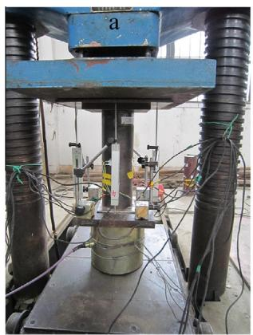

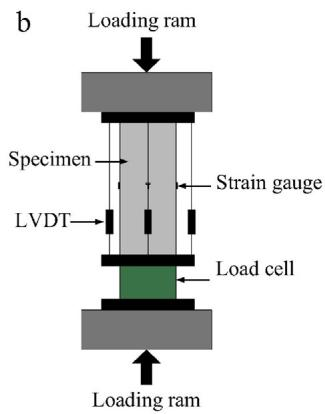

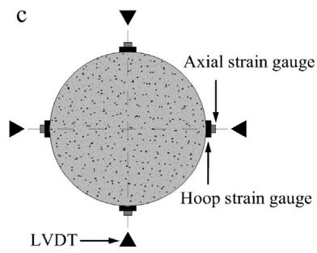  
Fig. 1. Test arrangement: (a) photograph; (b) diagrammatic view; (c) location of strain gauges and LVDTs.

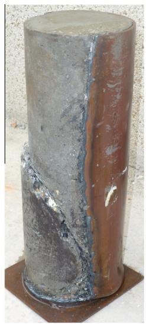  
Fig. 2. Shear failure plane in the concrete core.

drop. The force transfer through shear-friction on the cracked surfaces is the main mechanism for plain concrete of maintaining the resistance to the applied axial load. Those columns, especially with high strength concrete, experienced a sudden loss of axial load.

The failure mode of the SFRCFST specimens is similar to that of the PCFST specimens. This is because that the mechanical role of steel fiber is activated only after the appearance of cracking, i.e., the shear plane in concrete core. However, the presence of the SFRC delays the bulge formation of the steel tube. This is because that the confinement from the steel fibers delays the displacement between opposing sliding plane, and thus relieves the concrete expansion pressures on the exterior steel tube. In addition, the SFRCFST specimens exhibited a more moderate drop of axial load. This may be due to the bridging effect of the steel fibers crossing the concrete cracks. This beneficial effect from steel fibers provides additional shear-frictional resistance to the sliding and allows the transfer of shear forces across the cracked planes [8,32].

# 3.2. Ultimate load

The maximum load during loading is defined as the ultimate load. The ultimate loads of the specimens are shown in Table 3. The effects of the concrete strength and the thickness of steel tube on the ultimate load of the SFRCFST specimens are as expected: when the concrete strength increases, the ultimate load increases;

when the thickness of steel tube increases, so is the ultimate load. Adding steel fibers into concrete had slight effect on the ultimate load of the CFST specimens. Compared with the benchmark PCFST specimens, the SFRCFST specimens with $0 . 6 \%$ , $0 . 9 \%$ and $1 . 2 \%$ steel fibers obtained $2 . 0 { - } 6 . 0 \%$ , $4 . 0 { - } 1 0 . 0 \%$ and $5 . 0 { - } 1 4 . 0 \%$ ultimate load enhancements, respectively.

# 3.2.1. Strength index

To evaluate the section behavior of CFST columns, the strength index SI is defined as:

$$
S I = \frac {N _ {u}}{A _ {s} f _ {y} + A _ {c} f _ {c} ^ {\prime}} \tag {1}
$$

where $N _ { u }$ is the ultimate load, $A _ { s }$ and $A _ { c }$ are the areas of the steel tube and the concrete core, respectively, $f _ { y }$ is the yield strength of the steel tube, and $f _ { \mathrm { c } } ^ { \prime }$ is the cylinder strength of concrete (PC and SFRC), and given by $f _ { c } ^ { \prime } = 0 . 8 f _ { \mathrm { c u } }$ .

The strength indexes are listed in Table 3. These values ranged between 1.16 and 1.39 and were correlated with the thickness of the steel tube, the concrete strength and the steel fiber volume percentage. Generally, strength index increased with the increasing of the thickness of the steel tube, and decreased with the increasing of the concrete strength. The SFRCFST specimens had a higher strength index than the corresponding CFST specimens. Because steel fibers across cracks control and arrest crack widths adjacent to the shear plane, a much greater deformability of high strength concrete and a greatly improve shear resistance of the cracked plane are obtained. This is beneficial for a uniform development of steel confinement and the composite action between steel tube and concrete core, and consequently a better section behavior.

The revolution of strength index for the PCFST and SFRCFST specimens in terms of the concrete strength is shown in Figs. 3a. With the increasing of the concrete strength, the trend line for the strength index of the PCFST specimens is almost horizontal. However, the values of strength index for the SFRCFST specimens show a decreasing trend when the concrete strength increased. This is because that the strength index enhancement due to steel fibers was not so significant for the specimens with higher strength concrete.

If the strength index is studied in terms of the thickness of steel tube, as shown in Fig. 3b, the strength index for PCFST and SFRCFST specimens both show an increasing trend with the increasing of the thickness of steel tube. The reason is that thicker steel tube can provide more confinement to concrete core and has a higher ability of resisting local buckling. Thus a more efficient composite action between concrete core and steel tube is expected. It can also be seen from Fig. 3b that the trend line for the SFRCFST specimens

Table 3 Test results for the specimens.   

<table><tr><td>Group</td><td>Specimen</td><td>δu (mm)</td><td>Ne(kN)</td><td>λ</td><td>α</td><td>β</td><td>σcc(MPa)</td><td>σccfc&#x27;</td><td>SI</td><td>E (kN·mm)</td><td>DI</td><td>DI/(DI)c</td><td>Nc(kN)</td><td>Ne/Nc</td></tr><tr><td rowspan="4">C50-3</td><td>C50-3-0</td><td>2.51</td><td>1068</td><td>0.54</td><td>-0.40</td><td>0.74</td><td>67.54</td><td>1.57</td><td>1.22</td><td>4418</td><td>2.13</td><td>1.06</td><td>1074</td><td>0.995</td></tr><tr><td>C50-3-0.6</td><td>2.48</td><td>1093</td><td>0.60</td><td>-0.45</td><td>0.69</td><td>72.00</td><td>1.63</td><td>1.23</td><td>5075</td><td>2.29</td><td>0.93</td><td>1105</td><td>0.989</td></tr><tr><td>C50-3-0.9</td><td>2.41</td><td>1118</td><td>0.67</td><td>-0.52</td><td>0.64</td><td>76.70</td><td>1.70</td><td>1.24</td><td>6542</td><td>2.83</td><td>0.93</td><td>1121</td><td>0.997</td></tr><tr><td>C50-3-1.2</td><td>2.84</td><td>1162</td><td>0.79</td><td>-0.64</td><td>0.52</td><td>86.05</td><td>1.83</td><td>1.26</td><td>8902</td><td>3.20</td><td>0.83</td><td>1154</td><td>1.007</td></tr><tr><td rowspan="4">C50-4</td><td>C50-4-0</td><td>3.24</td><td>1280</td><td>0.58</td><td>-0.44</td><td>0.71</td><td>78.54</td><td>1.83</td><td>1.28</td><td>7289</td><td>2.18</td><td>1.05</td><td>1265</td><td>1.012</td></tr><tr><td>C50-4-0.6</td><td>2.86</td><td>1360</td><td>0.74</td><td>-0.59</td><td>0.57</td><td>92.00</td><td>2.08</td><td>1.34</td><td>8373</td><td>2.60</td><td>1.02</td><td>1301</td><td>1.045</td></tr><tr><td>C50-4-0.9</td><td>2.61</td><td>1403</td><td>0.83</td><td>-0.68</td><td>0.47</td><td>100.70</td><td>2.24</td><td>1.37</td><td>9130</td><td>2.92</td><td>0.93</td><td>1321</td><td>1.062</td></tr><tr><td>C50-4-1.2</td><td>3.17</td><td>1459</td><td>0.94</td><td>-0.83</td><td>0.28</td><td>114.74</td><td>2.44</td><td>1.39</td><td>13,518</td><td>3.36</td><td>0.85</td><td>1356</td><td>1.076</td></tr><tr><td rowspan="4">C50-5</td><td>C50-5-0</td><td>2.97</td><td>1454</td><td>0.53</td><td>-0.39</td><td>0.74</td><td>83.06</td><td>1.93</td><td>1.29</td><td>7818</td><td>2.21</td><td>1.02</td><td>1462</td><td>0.994</td></tr><tr><td>C50-5-0.6</td><td>2.88</td><td>1470</td><td>0.56</td><td>-0.42</td><td>0.72</td><td>86.95</td><td>1.97</td><td>1.29</td><td>9941</td><td>2.94</td><td>1.12</td><td>1504</td><td>0.977</td></tr><tr><td>C50-5-0.9</td><td>2.96</td><td>1518</td><td>0.64</td><td>-0.49</td><td>0.66</td><td>94.97</td><td>2.11</td><td>1.32</td><td>13,060</td><td>3.01</td><td>0.94</td><td>1527</td><td>0.994</td></tr><tr><td>C50-5-1.2</td><td>2.64</td><td>1569</td><td>0.77</td><td>0.62</td><td>0.54</td><td>109.89</td><td>2.34</td><td>1.34</td><td>16,550</td><td>3.99</td><td>1.00</td><td>1564</td><td>1.023</td></tr><tr><td rowspan="4">C60-3</td><td>C60-3-0</td><td>2.31</td><td>1095</td><td>0.43</td><td>-0.31</td><td>0.81</td><td>67.78</td><td>1.39</td><td>1.16</td><td>4032</td><td>2.07</td><td>1.04</td><td>1142</td><td>0.961</td></tr><tr><td>C60-3-0.6</td><td>2.67</td><td>1128</td><td>0.51</td><td>-0.38</td><td>0.76</td><td>72.96</td><td>1.46</td><td>1.18</td><td>5177</td><td>2.12</td><td>0.86</td><td>1171</td><td>0.963</td></tr><tr><td>C60-3-0.9</td><td>2.52</td><td>1147</td><td>0.56</td><td>-0.42</td><td>0.72</td><td>76.82</td><td>1.50</td><td>1.18</td><td>7782</td><td>3.24</td><td>1.07</td><td>1194</td><td>0.960</td></tr><tr><td>C60-3-1.2</td><td>2.17</td><td>1192</td><td>0.69</td><td>-0.54</td><td>0.62</td><td>85.78</td><td>1.62</td><td>1.20</td><td>10,715</td><td>4.33</td><td>1.13</td><td>1224</td><td>0.974</td></tr><tr><td rowspan="4">C60-4</td><td>C60-4-0</td><td>3.52</td><td>1320</td><td>0.52</td><td>-0.38</td><td>0.75</td><td>80.12</td><td>1.64</td><td>1.24</td><td>8618</td><td>2.17</td><td>1.06</td><td>1334</td><td>0.989</td></tr><tr><td>C60-4-0.6</td><td>2.52</td><td>1389</td><td>0.66</td><td>-0.51</td><td>0.64</td><td>91.37</td><td>1.83</td><td>1.28</td><td>11,843</td><td>2.71</td><td>1.08</td><td>1368</td><td>1.016</td></tr><tr><td>C60-4-0.9</td><td>2.63</td><td>1430</td><td>0.74</td><td>-0.59</td><td>0.57</td><td>98.96</td><td>1.93</td><td>1.30</td><td>18,839</td><td>3.56</td><td>1.15</td><td>1394</td><td>1.026</td></tr><tr><td>C60-4-1.2</td><td>2.83</td><td>1452</td><td>0.79</td><td>0.64</td><td>0.52</td><td>104.98</td><td>1.98</td><td>1.30</td><td>21,466</td><td>4.12</td><td>1.05</td><td>1427</td><td>1.018</td></tr><tr><td rowspan="4">C60-5</td><td>C60-5-0</td><td>2.76</td><td>1548</td><td>0.58</td><td>-0.44</td><td>0.71</td><td>93.19</td><td>1.91</td><td>1.30</td><td>6900</td><td>2.08</td><td>0.98</td><td>1531</td><td>1.011</td></tr><tr><td>C60-5-0.6</td><td>3.15</td><td>1581</td><td>0.63</td><td>-0.48</td><td>0.67</td><td>98.93</td><td>1.98</td><td>1.31</td><td>9165</td><td>2.40</td><td>0.93</td><td>1570</td><td>1.007</td></tr><tr><td>C60-5-0.9</td><td>2.97</td><td>1609</td><td>0.68</td><td>-0.53</td><td>0.63</td><td>104.93</td><td>2.05</td><td>1.32</td><td>13,396</td><td>3.41</td><td>1.08</td><td>1599</td><td>1.006</td></tr><tr><td>C60-5-1.2</td><td>3.17</td><td>1661</td><td>0.76</td><td>-0.61</td><td>0.55</td><td>114.75</td><td>2.17</td><td>1.34</td><td>22,096</td><td>3.85</td><td>0.97</td><td>1636</td><td>1.016</td></tr><tr><td rowspan="4">C70-3</td><td>C70-3-0</td><td>2.28</td><td>1266</td><td>0.66</td><td>-0.51</td><td>0.64</td><td>86.85</td><td>1.56</td><td>1.23</td><td>6444</td><td>2.04</td><td>1.04</td><td>1226</td><td>1.032</td></tr><tr><td>C70-3-0.6</td><td>3.58</td><td>1287</td><td>0.72</td><td>-0.57</td><td>0.59</td><td>91.88</td><td>1.60</td><td>1.23</td><td>8439</td><td>2.36</td><td>0.97</td><td>1259</td><td>1.022</td></tr><tr><td>C70-3-0.9</td><td>3.26</td><td>1301</td><td>0.85</td><td>-0.71</td><td>0.44</td><td>102.86</td><td>1.72</td><td>1.21</td><td>10,686</td><td>2.91</td><td>0.97</td><td>1296</td><td>1.028</td></tr><tr><td>C70-3-1.2</td><td>2.70</td><td>1356</td><td>0.91</td><td>-0.78</td><td>0.34</td><td>109.09</td><td>1.78</td><td>1.24</td><td>17,999</td><td>4.54</td><td>1.19</td><td>1321</td><td>1.026</td></tr><tr><td rowspan="4">C70-4</td><td>C70-4-0</td><td>3.46</td><td>1469</td><td>0.65</td><td>-0.50</td><td>0.65</td><td>96.46</td><td>1.73</td><td>1.28</td><td>8762</td><td>2.45</td><td>1.21</td><td>1418</td><td>1.036</td></tr><tr><td>C70-4-0.6</td><td>2.17</td><td>1482</td><td>0.68</td><td>-0.53</td><td>0.63</td><td>100.26</td><td>1.75</td><td>1.27</td><td>9746</td><td>3.61</td><td>1.45</td><td>1456</td><td>1.018</td></tr><tr><td>C70-4-0.9</td><td>2.48</td><td>1496</td><td>0.71</td><td>-0.56</td><td>0.60</td><td>105.01</td><td>1.76</td><td>1.25</td><td>13,609</td><td>3.78</td><td>1.24</td><td>1495</td><td>1.001</td></tr><tr><td>C70-4-1.2</td><td>2.01</td><td>1542</td><td>0.8</td><td>-0.65</td><td>0.50</td><td>114.02</td><td>1.87</td><td>1.27</td><td>17,158</td><td>4.95</td><td>1.28</td><td>1523</td><td>1.012</td></tr><tr><td rowspan="4">C70-5</td><td>C70-5-0</td><td>2.52</td><td>1659</td><td>0.62</td><td>-0.47</td><td>0.68</td><td>103.85</td><td>1.86</td><td>1.30</td><td>6320</td><td>2.05</td><td>0.99</td><td>1615</td><td>1.027</td></tr><tr><td>C70-5-0.6</td><td>2.04</td><td>1673</td><td>0.64</td><td>-0.49</td><td>0.66</td><td>107.21</td><td>1.87</td><td>1.29</td><td>8316</td><td>2.96</td><td>1.17</td><td>1658</td><td>1.009</td></tr><tr><td>C70-5-0.9</td><td>2.02</td><td>1712</td><td>0.73</td><td>-0.58</td><td>0.58</td><td>118.36</td><td>1.98</td><td>1.29</td><td>12,180</td><td>3.61</td><td>1.16</td><td>1701</td><td>1.013</td></tr><tr><td>C70-5-1.2</td><td>2.62</td><td>1774</td><td>0.81</td><td>-0.66</td><td>0.49</td><td>128.38</td><td>2.10</td><td>1.32</td><td>17,320</td><td>4.36</td><td>1.08</td><td>1732</td><td>1.024</td></tr></table>

is above that for the PCFST specimens. This indicates that the addition of steel fiber had a beneficial effect on composite action between steel tube and concrete.

The combined influence of the concrete strength and the thickness of steel tube can be evaluated through the confinement index h, as defined by Eq. (2):

$$
\theta = \frac {A _ {s} f _ {y}}{A _ {c} f _ {c} ^ {\prime}} \tag {2}
$$

The effect of confinement index h on the strength index SI is shown in Fig. 4. With the increasing of confinement index, strength index experienced a steady increase, and then kept a certain value. When confinement index is relatively small, strength index shows an obvious increase with the increasing of confinement index. However, when confinement index reaches a level of 0.9, increasing the value of confinement index had no obvious effect on strength index.

The effect of steel fibers on strength index can also be found from Fig. 4. For the specimens of the same group, the confinement index decreased slightly with the increasing of steel fiber volume percentage. It is worth noting that in the case of the specimens with C50 and C60 concrete, strength index generally increased with the decreasing of the confinement index, i.e. increased with the increasing of steel fiber volume percentage. However, for the specimens with C70 concrete, this phenomenon is not observed until $1 . 2 \%$ steel fibers are added into concrete. It may be concluded that when concrete with higher strength is used as infilling in CFST

columns, a larger volume percentage of steel fibers is needed to improve the composite action between steel tube and concrete core.

# 3.2.2. Axial strength of confined concrete

The steel fiber plays its strengthening effect by bridging the cracks in concrete and enhancing its tension capacity and thus their role is reduced in compressive stress state. Moreover, in concrete-filled steel tube columns, the concrete core is confined by steel tube, which leads to a decrease of steel fiber reinforcing effect. In this situation, the mechanical role of steel fiber in CFST columns is activated only after the appearance of cracking and the yield of steel tube. At this time, the concrete is close to its ultimate strength and the CFST column is approaching their ultimate load. Therefore, the confinement provided by steel fibers is ignored in calculating the strength of confined concrete core.

The strength of confined concrete core $\sigma _ { \mathrm { c c } }$ is determined by Eq. (3):

$$
\sigma_ {\mathrm {c c}} = f _ {c} ^ {\prime} + k \sigma_ {r} \tag {3}
$$

where $k$ is the confinement coefficient and equal to 4.1 according to Richart et al. [33]; and $\sigma _ { r }$ is the confining pressure provided by steel tube.

For the steel tube in a CFST column, a hoop tensile stress $\sigma _ { s \theta }$ initiated by concrete expansion and a longitudinal compressive stress $\sigma _ { s z }$ induced by the axial load are developed. The stresses of the

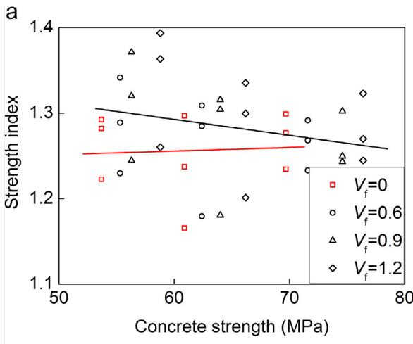

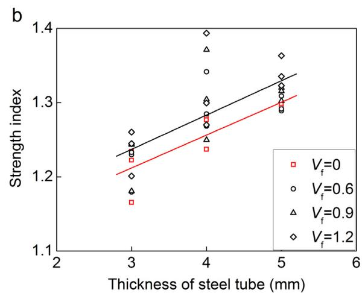  
Fig. 3. Strength index in terms of: (a) concrete strength, and (b) thickness of steel tube.

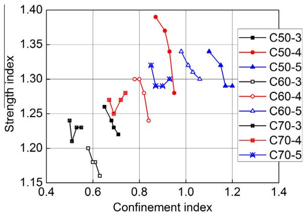  
Fig. 4. Strength index versus confinement index.

steel tube $\sigma _ { s z }$ and $\sigma _ { s \theta }$ in the yielding condition are given by Eqs. (4) and (5), respectively.

$$
\sigma_ {s} \theta = \alpha f _ {y} \tag {4}
$$

$$
\sigma_ {s z} = \beta f _ {y} \tag {5}
$$

where $\mathscr { X }$ and $\beta$ are the coefficients determined based on the test results.

The confining pressure $\sigma _ { r }$ is correlated to the hoop tensile stress $\sigma _ { s \theta }$ of steel tube, and the relationship between $\sigma _ { s \theta }$ and $\sigma _ { r }$ is given in Eq. (6):

$$
\sigma_ {r} = - \frac {2 t}{D - 2 t} \sigma_ {s \theta} \tag {6}
$$

In CFST columns, the concrete core is subjected to tri-axial compression, which leads to strength enhancements of concrete. To evaluate the confining effect on concrete strength, Sakino et al. [34] assumed that the difference between the ultimate load $N _ { u }$ and the nominal squash load $N _ { 0 }$ is provided by the confining effect on concrete strength, and this gain depends upon the tube strength $N _ { s } ,$ , and thus:

$$
N _ {u} - N _ {0} = \lambda N _ {s}; \lambda = \frac {N _ {u} - N _ {0}}{N _ {s}} \tag {7}
$$

where $\lambda$ is the augmentation factor determined based on experimental results, and $N _ { 0 }$ and $N _ { s }$ are determined by Eqs. (8) and (9), respectively.

$$
N _ {0} = A _ {\mathrm {s}} f _ {y} + A _ {\mathrm {c}} f _ {c} ^ {\prime} \tag {8}
$$

$$
N _ {s} = A _ {\mathrm {s}} f _ {y} \tag {9}
$$

where $A _ { s }$ and $A _ { c }$ are the areas of the steel tube and the concrete core, respectively, $f _ { y }$ is the yield strength of steel tube.

When $N _ { u }$ is set as the experimental results, the augmentation factor $\lambda$ is determined according to Eqs. (7–9) and the values are shown in Table 3. It is worth noting that the value of k increased with the steel fiber volume percentage. This indicated an improved composite action between the steel tube and the high strength concrete core. This may be due to the fact that for steel fiber reinforced concrete, the axial strain at the ultimate load is slightly increased compared to that of plain concrete.

On the other hand, based on the ultimate equilibrium theory, $N _ { u }$ can also be described as the summation of the axial strength of the concrete core and the steel tube at the ultimate state, as shown in Eq. (10):

$$
N _ {u} = A _ {c} \sigma_ {c c} + A _ {s} \sigma_ {s z} \tag {10}
$$

From Eqs. 3–10, the factor $\lambda$ is given by:

$$
\lambda = \beta - 1 - \frac {D - 2 t}{2 (D - t)} k \alpha \tag {11}
$$

The relationship between a and $\beta$ can be obtained from the assumption that steel stresses at the ultimate state given by Eqs. (4) and (5) satisfies the von Mises yield criterion given by

$$
\sigma_ {s \theta} ^ {2} - \sigma_ {s \theta} \sigma_ {s z} + \sigma_ {s z} ^ {2} = f _ {y} ^ {2} \tag {12}
$$

when Eqs. (4) and (5) are subsisted into Eq. (12), the relationship between $\mathscr { X }$ and $\beta$ is expressed by:

$$
\alpha^ {2} - \alpha \beta + \beta^ {2} = 1. 0 \tag {13}
$$

For a fixed value of k, the values of $\mathscr { X }$ and $\beta$ are determined by solving Eqs. (11) and (13) (see Table 3). The values of $\mathscr { X }$ and $\beta$ are closely correlated with the steel fiber volume percentage. The revolution of $\alpha$ and $\beta$ in terms of steel fiber volume percentage are shown in Fig. 5. With the increasing of steel fiber volume percentage, the absolute value of $\mathscr { X }$ increased while the value of $\beta$ decreased. That is to say, the steel tube provided more confinement to the concrete core while carried less axial loads with the increasing of steel fiber volume percentage.

Due to the enhanced confinement provided by the steel tube, the strength of concrete core increased. The values of $\sigma _ { c c }$ are determined with $N _ { u }$ being the experimental results and shown in Table 3. The ratio of $\sigma _ { c c }$ and $f _ { c } ^ { \prime }$ ranged between 1.39 and 2.44.

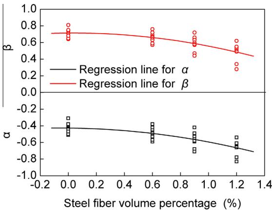  
Fig. 5. The relationship between a, $\beta$ and steel fiber volume percentage.

Generally, the value of $\sigma _ { c c } / f _ { \mathrm { c } } ^ { \prime }$ increased with the steel fiber volume percentage. Because the confining pressure $\sigma _ { r }$ is higher when a thicker steel tube is used, the strength of the concrete core increased more significantly for the specimens with thicker steel tube. In addition, the value of $\sigma _ { c c } / f _ { c } ^ { \prime }$ decreased with the increasing of concrete strength.

# 3.3. Axial load-axial shortening behavior

# 3.3.1. Axial load-axial shortening curves

To evaluate the effects of the tested parameters on the axial behavior of SFRCFST columns, the axial load-axial shortening curves for some specimens are shown in Fig. 6. The axial shortening is the average value of the four LVDTs. The axial load-axial shortening curves for all specimens experienced a softening stage after reaching the ultimate load.

Fig. 6a shows the effect of the concrete strength on the behavior of the SFRCFST specimens. In the linear stage, the slope of the specimens with higher strength concrete is deeper, indicating a higher stiffness. In the softening stage, the decreasing branch of the specimens with higher strength concrete exhibited a deeper slope, and the axial shortening at $8 5 \%$ of the ultimate strength decreased with the increasing of the concrete strength. It can be concluded from this that increasing the concrete strength decreased the deformation capacity and the ductility of SFRCFST specimens.

Fig. 6b compares the behavior of the SFRCFST specimens with different thicknesses of steel tube. The specimens with thicker steel tube exhibited a longer linear axial load-axial shortening response and a increasing axial shortening at $8 5 \%$ of the ultimate load. Thicker steel tube not only has higher shear resistance, but provides higher lateral confinement to concrete. The greater confining pressure across the crack face prompts greater shear transfer capacity and delays failure [32].

The effect of steel fiber is determined by comparing the behavior of the SFRCFST specimens with that of the corresponding PCFST specimens. Fig. 6c shows the axial load-axial shortening curves for the specimens of group C70-5. Similar axial load-axial shortening behavior was also found in other groups. The PCFST specimens and SFRCFST specimens exhibited similar axial load-axial shortening response, in which an ascending branch was followed by a descending branch. Somewhat differently, the slope of the decreasing branches for the SFRCFST specimens was smaller than that for the PCFST specimens, representing an improved post-peak behavior from the addition of steel fibers. This is because that greater confining pressure across the crack faces promotes greater shear transfer capacity, and then delays failure. This series of tests confirms that adding steel fibers helps to improve the ductility and deformation capacity of the CFST columns.

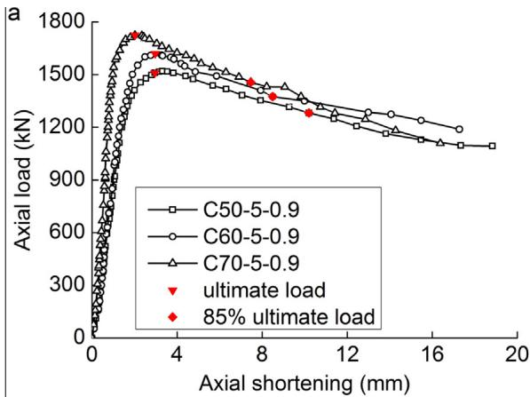

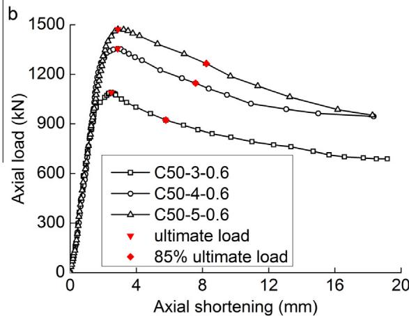

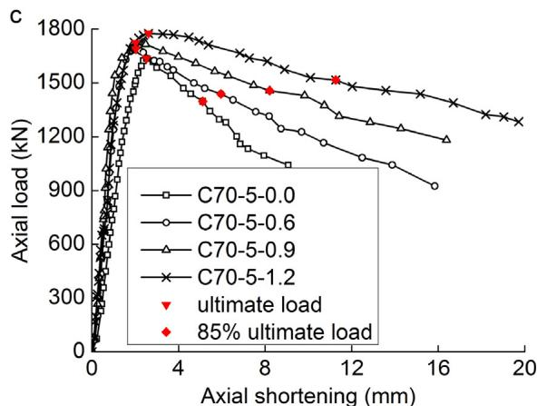  
Fig. 6. Comparisons of axial load-axial shortening responses in terms of: (a) concrete strength, (b) thickness of steel tube, and (c) steel fiber volume percentage.

# 3.3.2. Energy dissipation capacity

Due to the substantial enhancement of the deformation capacity of the CFST columns, the energy dissipation capacity can also be significantly improved. The energy dissipation capacity is calculated according to the axial load-axial shortening curves till $8 5 \%$ of the ultimate load in the decreasing branch. The calculated energy dissipation capacity E for each specimen is shown in Table 3. In comparison to the corresponding PCFST specimens, the energy dissipation capacity of the SFRCFST specimens with $0 . 6 \%$ , $0 . 9 \%$ and $1 . 2 \%$ steel fibers obtain enhancements of 14.9– $3 1 . 7 \%$ , $2 5 . 3 \substack { - 9 4 . 1 \% }$ and $8 5 . 5 \substack { - 2 2 0 . 2 \% }$ , respectively. This phenomenon contributed to the enhanced energy dissipation capacity of infill concrete. Steel fibers improve the energy dissipation

capacity of concrete due to the higher lateral strain capacity imparted by steel fibers and the energy dissipation during pull-out of fibers which bridge tension and shear cracks in the failing matrix.

# 3.3.3. Ductility index

In order to quantify the ductility of columns, a ductility index (DI) has been used in [35,36] and defined as:

$$
D I = \frac {\varepsilon_ {8 5}}{\varepsilon_ {u}} \tag {14}
$$

where $\varepsilon _ { u }$ is the strain at the ultimate load $N _ { u } ,$ and $\varepsilon _ { 8 5 }$ is the strain when the load falls to $0 . 8 5 ~ N _ { u }$ .

Because the strain values obtained by strain gauges represent the localized deformation of steel tube, a deviation occurs between the actual deformation of the specimen and the measured strain values, especially after yielding of the steel tube [37]. In this paper, the DI is predicted by Eq. (15):

$$
D I = \frac {\delta_ {8 5}}{\delta_ {u}} \tag {15}
$$

where $\delta _ { u }$ is the axial shortening at $N _ { u } ,$ , and $\delta _ { 8 5 }$ is the axial shortening at the load value of $0 . 8 5 ~ N _ { u }$ in the descending branch of axial load-axial shortening curve. $\delta _ { u }$ and $\delta _ { 8 5 }$ are both the average values of the four LVDTs.

The ductility indexes are shown in Table 3. The addition of steel fibers, a high steel fiber volume percentage in particular, significantly improved the ductility index of the specimens. The DI for the PCFST specimens were about 2.0, while the SFRCFST specimens with $1 . 2 \%$ steel fibers can reach a value of 4.0. The DI was also affected by the thickness of steel tube and the concrete strength. It can also be inferred from Table 3 that a relative high steel fiber volume percentage, at least $0 . 9 \%$ , is needed to obtain a ductile behavior.

The effect of the thickness of steel tube is determined by comparing the ductility index of the PCFST specimens with $3 \mathrm { m m }$ steel tube with the ductility index of the PCFST columns with 4 and 5 mm steel tube, as well comparing the ductility index of the PCFST columns with $4 \mathrm { m m }$ steel tube with the ductility index of the PCFST columns with 5 mm steel tube. The ductility enhancement achieved by increasing the thickness of steel tube was no obvious, being lower than $2 0 \%$ .

The effect of the concrete strength on the ductility index is shown in Fig. 7. When the concrete strength increased, the ductility index for the SFRCFST specimens increased. This situation is quite different from that for the PCFST specimens. This may be

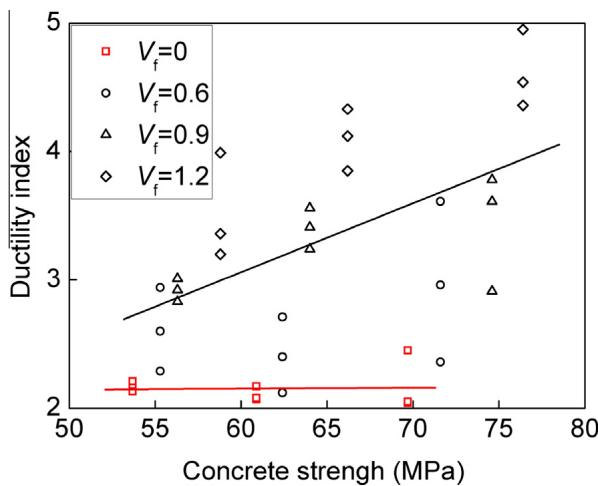  
Fig. 7. The effect of concrete strength on the ductility index.

Table 4 ANOVA table for the ductility index.   

<table><tr><td>Source</td><td>DF</td><td>Sum of squares</td><td>MS</td><td>F</td><td>P</td></tr><tr><td>Thickness of steel tube</td><td>2</td><td>5.24</td><td>2.62</td><td>6.75</td><td>0.004</td></tr><tr><td>Concrete strength</td><td>2</td><td>3.93</td><td>1.97</td><td>5.08</td><td>0.013</td></tr><tr><td>Steel fiber volume percentage</td><td>3</td><td>25.74</td><td>8.58</td><td>22.14</td><td>0.000</td></tr></table>

due to the improved interfacial bond strength between the concrete matrix and the steel fiber for the higher strength concrete. It also can be seen from Fig. 7 that for the specimens of the same group, the ductility increased with the increasing of the steel fiber volume percentage.

Fig. 7 also shows that the addition of steel fibers can substantially enhance the ductility index of the specimens. The effect of the steel fibers is determined by comparing the ductility index of the SFRCFST specimens with that of the corresponding PCFST specimens. Compared with the benchmark PCFST specimens, the SFRCFST specimens with $0 . 6 \%$ , $0 . 9 \%$ and $1 . 2 \%$ steel fibers obtained increments of $2 . 0 { - } 4 7 . 0 \%$ , $3 3 . 0 \mathrm { - } 7 6 . 0 \%$ and $5 0 . 0 { - } 1 2 3 . 0 \%$ , respectively. By comparison, using steel fiber reinforced concrete is a more effective method to improve the ductility index of the CFST columns than using thicker steel tube. In addition, adding steel fibers will not significantly increase the construction cost and difficulty. It should also be noted that the addition of steel fibers is also beneficial for the fire resistance of the CFST columns [38– 40]. This is an additional merit of adding steel fibers to concrete.

The degrees of the effects of the tested parameters on the ductility index of the specimens can also be analyzed using the Analysis Of Variance (ANOVA) technique. From ANOVA table (Table 4), the steel fiber volume percentage has the most significant effect on the ductility index of the CFST specimens. The thickness of steel tube and concrete strength has respectively less effects compared to the steel fiber volume percentage.

# 4. Predictions of the load capacity and ductility index

# 4.1. Load capacity

On the basis of Section 3.2.2, the load capacity of CFST columns can be described as:

$$
N _ {u} = N _ {0} + \lambda N _ {s} \tag {16}
$$

$N _ { u }$ can also be expressed as:

$$
\frac {N _ {u}}{N _ {0}} = 1 + \lambda \frac {N _ {s}}{N _ {0}} \tag {17}
$$

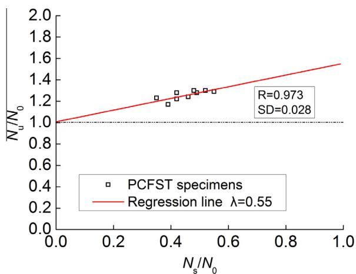  
Fig. 8. The relationships between $N _ { u } / N _ { 0 }$ and $N _ { s } / N _ { 0 } .$ .

Table 5 The characteristics of specimens and comparisons of the experiments and predictions.   

<table><tr><td>Ref.</td><td>D (mm)</td><td>t (mm)</td><td>fc(MPa)</td><td>fy (MPa)</td><td>Ne (kN)</td><td>Nc (kN)</td><td>Ne/Nc</td><td>NAsc (kN)</td><td>Ne/NAsc</td><td>NEC4 (kN)</td><td>Ne/NEC4</td></tr><tr><td rowspan="6">[41]</td><td>167</td><td>3.1</td><td>60.0</td><td>300</td><td>1873</td><td>1936</td><td>0.968</td><td>1634</td><td>1.146</td><td>1658</td><td>1.130</td></tr><tr><td>114</td><td>3.6</td><td>60.0</td><td>301</td><td>1095</td><td>1101</td><td>0.995</td><td>885</td><td>1.237</td><td>962</td><td>1.138</td></tr><tr><td>114</td><td>5.6</td><td>60.0</td><td>302</td><td>1365</td><td>1361</td><td>1.003</td><td>1047</td><td>1.304</td><td>1195</td><td>1.142</td></tr><tr><td>167</td><td>3.1</td><td>44.0</td><td>303</td><td>1710</td><td>1618</td><td>1.057</td><td>1331</td><td>1.285</td><td>1421</td><td>1.203</td></tr><tr><td>114</td><td>3.6</td><td>44.0</td><td>304</td><td>1042</td><td>963</td><td>1.082</td><td>753</td><td>1.384</td><td>861</td><td>1.210</td></tr><tr><td>114</td><td>5.6</td><td>44.0</td><td>305</td><td>1314</td><td>1237</td><td>1.062</td><td>927</td><td>1.418</td><td>1106</td><td>1.188</td></tr><tr><td rowspan="8">[42]</td><td>114</td><td>4.0</td><td>24.8</td><td>343</td><td>948</td><td>926</td><td>1.023</td><td>679</td><td>1.397</td><td>851</td><td>1.114</td></tr><tr><td>114</td><td>4.0</td><td>73.9</td><td>343</td><td>1308</td><td>1362</td><td>0.961</td><td>1090</td><td>1.200</td><td>1169</td><td>1.119</td></tr><tr><td>114</td><td>4.9</td><td>27.4</td><td>365</td><td>1380</td><td>1154</td><td>1.195</td><td>834</td><td>1.654</td><td>1048</td><td>1.317</td></tr><tr><td>114</td><td>4.9</td><td>82.9</td><td>365</td><td>1787</td><td>1628</td><td>1.097</td><td>1282</td><td>1.393</td><td>1392</td><td>1.284</td></tr><tr><td>114</td><td>5.0</td><td>45.5</td><td>365</td><td>1413</td><td>1327</td><td>1.065</td><td>992</td><td>1.425</td><td>1174</td><td>1.203</td></tr><tr><td>114</td><td>3.8</td><td>57.6</td><td>343</td><td>1067</td><td>1181</td><td>0.904</td><td>931</td><td>1.146</td><td>1030</td><td>1.036</td></tr><tr><td>114</td><td>3.9</td><td>31.9</td><td>343</td><td>998</td><td>968</td><td>1.031</td><td>724</td><td>1.378</td><td>877</td><td>1.137</td></tr><tr><td>114</td><td>3.8</td><td>98.9</td><td>343</td><td>1359</td><td>1561</td><td>0.871</td><td>1286</td><td>1.057</td><td>1313</td><td>1.035</td></tr><tr><td rowspan="12">[43]</td><td>89</td><td>2.7</td><td>25.2</td><td>360</td><td>610</td><td>541</td><td>1.127</td><td>399</td><td>1.529</td><td>482</td><td>1.266</td></tr><tr><td>89</td><td>2.7</td><td>28.9</td><td>360</td><td>630</td><td>562</td><td>1.122</td><td>418</td><td>1.506</td><td>497</td><td>1.269</td></tr><tr><td>89</td><td>2.7</td><td>28.2</td><td>360</td><td>524</td><td>558</td><td>0.939</td><td>415</td><td>1.263</td><td>494</td><td>1.061</td></tr><tr><td>113</td><td>2.9</td><td>25.2</td><td>360</td><td>754</td><td>763</td><td>0.989</td><td>571</td><td>1.320</td><td>695</td><td>1.084</td></tr><tr><td>113</td><td>2.9</td><td>28.9</td><td>360</td><td>730</td><td>796</td><td>0.917</td><td>603</td><td>1.211</td><td>720</td><td>1.014</td></tr><tr><td>113</td><td>2.9</td><td>28.2</td><td>360</td><td>745</td><td>790</td><td>0.943</td><td>597</td><td>1.247</td><td>715</td><td>1.042</td></tr><tr><td>89</td><td>2.7</td><td>37.6</td><td>360</td><td>610</td><td>610</td><td>1.000</td><td>464</td><td>1.315</td><td>531</td><td>1.149</td></tr><tr><td>89</td><td>2.7</td><td>40.0</td><td>360</td><td>630</td><td>623</td><td>1.011</td><td>476</td><td>1.323</td><td>540</td><td>1.166</td></tr><tr><td>89</td><td>2.7</td><td>37.8</td><td>360</td><td>524</td><td>611</td><td>0.858</td><td>465</td><td>1.128</td><td>532</td><td>0.986</td></tr><tr><td>113</td><td>2.9</td><td>37.6</td><td>360</td><td>754</td><td>874</td><td>0.863</td><td>677</td><td>1.114</td><td>776</td><td>0.971</td></tr><tr><td>113</td><td>2.9</td><td>40.0</td><td>360</td><td>730</td><td>895</td><td>0.815</td><td>697</td><td>1.047</td><td>792</td><td>0.922</td></tr><tr><td>113</td><td>2.9</td><td>37.8</td><td>360</td><td>745</td><td>875</td><td>0.851</td><td>678</td><td>1.099</td><td>777</td><td>0.958</td></tr><tr><td rowspan="14">[44]</td><td>165</td><td>2.8</td><td>48.3</td><td>363</td><td>1662</td><td>1745</td><td>0.952</td><td>1433</td><td>1.160</td><td>1487</td><td>1.117</td></tr><tr><td>190</td><td>1.9</td><td>41.0</td><td>256</td><td>1678</td><td>1556</td><td>1.079</td><td>1351</td><td>1.242</td><td>1296</td><td>1.295</td></tr><tr><td>190</td><td>1.5</td><td>48.3</td><td>306</td><td>1695</td><td>1738</td><td>0.975</td><td>1531</td><td>1.107</td><td>1425</td><td>1.189</td></tr><tr><td>190</td><td>1.1</td><td>41.0</td><td>186</td><td>1377</td><td>1321</td><td>1.042</td><td>1200</td><td>1.148</td><td>1058</td><td>1.302</td></tr><tr><td>190</td><td>0.9</td><td>41.0</td><td>211</td><td>1350</td><td>1302</td><td>1.037</td><td>1190</td><td>1.135</td><td>1038</td><td>1.301</td></tr><tr><td>165</td><td>2.8</td><td>80.2</td><td>363</td><td>2295</td><td>2381</td><td>0.964</td><td>2033</td><td>1.129</td><td>1958</td><td>1.172</td></tr><tr><td>190</td><td>1.9</td><td>74.7</td><td>256</td><td>2592</td><td>2472</td><td>1.049</td><td>2218</td><td>1.169</td><td>1988</td><td>1.304</td></tr><tr><td>190</td><td>1.5</td><td>80.2</td><td>306</td><td>2602</td><td>2614</td><td>0.996</td><td>2359</td><td>1.103</td><td>2087</td><td>1.247</td></tr><tr><td>190</td><td>1.1</td><td>80.2</td><td>186</td><td>2295</td><td>2406</td><td>0.954</td><td>2225</td><td>1.031</td><td>1885</td><td>1.218</td></tr><tr><td>165</td><td>2.8</td><td>108.0</td><td>363</td><td>2673</td><td>2936</td><td>0.911</td><td>2555</td><td>1.046</td><td>2371</td><td>1.127</td></tr><tr><td>190</td><td>1.9</td><td>108.0</td><td>256</td><td>3360</td><td>3377</td><td>0.995</td><td>3073</td><td>1.093</td><td>2675</td><td>1.256</td></tr><tr><td>190</td><td>1.5</td><td>108.0</td><td>306</td><td>3260</td><td>3376</td><td>0.966</td><td>3078</td><td>1.059</td><td>2666</td><td>1.223</td></tr><tr><td>190</td><td>1.1</td><td>108.0</td><td>186</td><td>3058</td><td>3175</td><td>0.963</td><td>2950</td><td>1.037</td><td>2472</td><td>1.237</td></tr><tr><td>190</td><td>0.9</td><td>108.0</td><td>211</td><td>3070</td><td>3167</td><td>0.969</td><td>2953</td><td>1.040</td><td>2462</td><td>1.247</td></tr><tr><td rowspan="4">[45]</td><td>100</td><td>1.9</td><td>110.0</td><td>404</td><td>1125</td><td>1154</td><td>1.007</td><td>992</td><td>1.174</td><td>946</td><td>1.232</td></tr><tr><td>100</td><td>1.9</td><td>110.0</td><td>404</td><td>1085</td><td>1154</td><td>0.971</td><td>992</td><td>1.132</td><td>946</td><td>1.188</td></tr><tr><td>100</td><td>1.9</td><td>110.0</td><td>404</td><td>1100</td><td>1154</td><td>0.929</td><td>992</td><td>1.078</td><td>946</td><td>1.129</td></tr><tr><td>100</td><td>1.9</td><td>110.0</td><td>404</td><td>1170</td><td>1154</td><td>0.988</td><td>992</td><td>1.146</td><td>946</td><td>1.201</td></tr><tr><td rowspan="13">[46]</td><td>125</td><td>1.0</td><td>84.7</td><td>232</td><td>1275</td><td>1141</td><td>1.086</td><td>1043</td><td>1.187</td><td>903</td><td>1.371</td></tr><tr><td>125</td><td>1.0</td><td>84.7</td><td>232</td><td>1239</td><td>1141</td><td>1.055</td><td>1043</td><td>1.154</td><td>903</td><td>1.332</td></tr><tr><td>127</td><td>2.0</td><td>84.7</td><td>258</td><td>1491</td><td>1310</td><td>1.083</td><td>1154</td><td>1.225</td><td>1059</td><td>1.334</td></tr><tr><td>127</td><td>2.0</td><td>84.7</td><td>258</td><td>1339</td><td>1310</td><td>0.973</td><td>1154</td><td>1.100</td><td>1059</td><td>1.198</td></tr><tr><td>133</td><td>3.5</td><td>84.7</td><td>352</td><td>1995</td><td>1807</td><td>1.035</td><td>1498</td><td>1.238</td><td>1500</td><td>1.231</td></tr><tr><td>133</td><td>3.5</td><td>84.7</td><td>352</td><td>1991</td><td>1807</td><td>1.033</td><td>1498</td><td>1.235</td><td>1500</td><td>1.229</td></tr><tr><td>133</td><td>3.5</td><td>84.7</td><td>352</td><td>1962</td><td>1807</td><td>1.018</td><td>1498</td><td>1.217</td><td>1500</td><td>1.211</td></tr><tr><td>133</td><td>4.7</td><td>84.7</td><td>352</td><td>2273</td><td>2015</td><td>1.045</td><td>1625</td><td>1.280</td><td>1679</td><td>1.227</td></tr><tr><td>133</td><td>4.7</td><td>84.7</td><td>352</td><td>2158</td><td>2015</td><td>0.992</td><td>1625</td><td>1.215</td><td>1679</td><td>1.165</td></tr><tr><td>133</td><td>4.7</td><td>84.7</td><td>352</td><td>2253</td><td>2015</td><td>1.035</td><td>1625</td><td>1.269</td><td>1679</td><td>1.217</td></tr><tr><td>127</td><td>7.0</td><td>84.7</td><td>429</td><td>3404</td><td>2546</td><td>1.229</td><td>1928</td><td>1.593</td><td>2106</td><td>1.418</td></tr><tr><td>127</td><td>7.0</td><td>84.7</td><td>429</td><td>3370</td><td>2546</td><td>1.217</td><td>1928</td><td>1.577</td><td>2106</td><td>1.404</td></tr><tr><td>127</td><td>7.0</td><td>84.7</td><td>429</td><td>3364</td><td>2546</td><td>1.215</td><td>1928</td><td>1.574</td><td>2106</td><td>1.401</td></tr><tr><td>Mean</td><td></td><td></td><td></td><td></td><td></td><td></td><td></td><td>1.025</td><td></td><td>1.250</td><td></td></tr><tr><td>Standard deviation</td><td></td><td></td><td></td><td></td><td></td><td></td><td></td><td></td><td></td><td></td><td></td></tr><tr><td>Coefficient of variation</td><td></td><td></td><td></td><td></td><td></td><td></td><td></td><td></td><td></td><td></td><td></td></tr><tr><td></td><td></td><td></td><td></td><td></td><td></td><td></td><td></td><td></td><td></td><td></td><td></td></tr></table>

Fig. 8 shows the relationships between experimental load capacity $N _ { e }$ of PCFST specimens and the yield load of the steel tube $N _ { s }$ . The value of $\lambda$ is obtained as 0.55 through a regression analysis.

If we substitute Eqs. (2), (8) and (9) into Eq. (16), the axial load capacity $N _ { u }$ for PCFST columns cane be expressed as:

$$
N _ {u} = A _ {c} f _ {c} ^ {\prime} (1 + 1. 5 5 \theta) \tag {18}
$$

In order to evaluate the accuracy of the proposed formulas, the experimental results of fifty-seven PCFST specimens reported in [41–46] are selected to compare with the predicted results according to Eq. (18), EC4 [47] and AISC 360-10 [48]. Table 5 shows the characteristics of the selected specimens, the experiments and the predictions. The comparisons are also shown in Fig. 9. From Table 5 and Fig. 9, it can be seen that Eq. (18) can give a reasonable

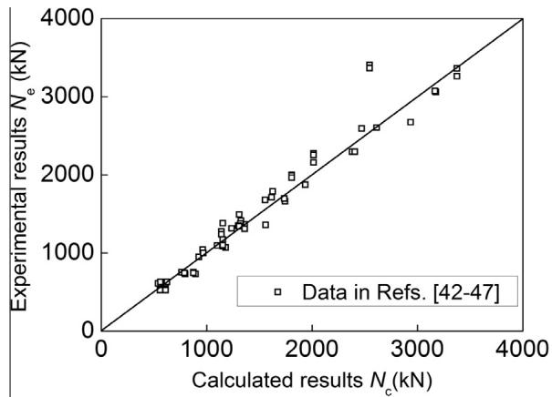

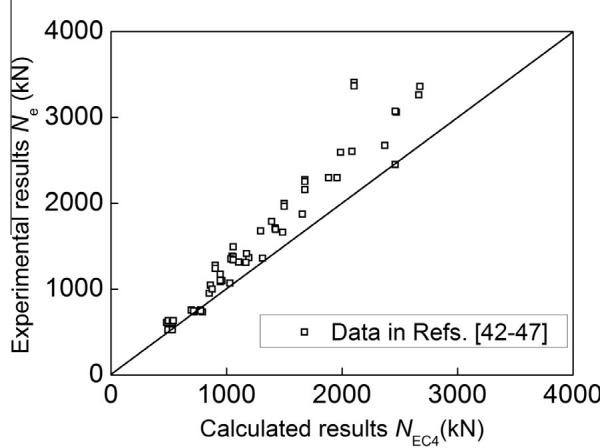

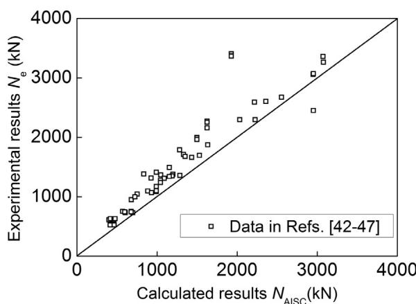  
Fig. 9. Comparisons between experiments in Refs. [41–46] and predictions of the proposed formula, EC4 and AISC 360-10.

prediction for the PCFST columns in the literature. The mean of the predictions to experiments is 1.021. The standard deviation of $N _ { e } / N _ { c }$ is 0.112 while its coefficient of variation is 0.109. The codes generally overestimates the axial load capacity of circular PCFST columns. The mean of the predictions to experimental results by EC4 is 1.216. The standard deviation of $N _ { e } / N _ { \mathrm { E C 4 } }$ is 0.145 while its coefficient of variation is 0.119. The mean of the predictions to experimental results by AISC 360-10 is 1.250. The standard deviation of $N _ { e } / N _ { \mathrm { A I S C } }$ is 0.181 while its coefficient of variation is 0.145. By comparison, the proposed formula gives a more accurate prediction of the steel tube columns filled with plain concrete. It is reminded that the satisfaction of experimental results is not an

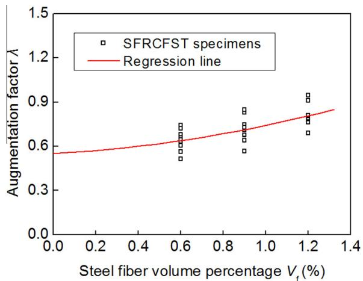  
Fig. 10. The relationships between k and steel fiber volume percentage $V _ { f }$

end in itself, but in this case, it proves the accuracy of the proposed formula.

From Table 3, it can be seen that the value of $\lambda$ is varied with steel fiber volume percentage $V _ { f } ,$ the relationships between k and steel fiber volume percentage $V _ { f }$ are shown in Fig. 10. By regression analysis, the relationship can be expressed as follows.

$$
\lambda \left(V _ {f}\right) = 0. 5 5 + 7 V _ {f} + 1 0 0 0 V _ {f} ^ {2} \tag {19}
$$

Thus, the load capacity is expressed as:

$$
N _ {u} = A _ {c} f _ {c} ^ {\prime} (1 + (1. 5 5 + 7 V _ {f} + 1 0 0 0 V _ {f} ^ {2}) \theta) \tag {20}
$$

When $V _ { f }$ is set to zero, Eq. (20) reduces to Eq. (18). Table 3 includes the calculated load capacity $N _ { c }$ according to Eq. (20) and the comparison $N _ { e } / N _ { c }$ The mean value of $N _ { e } / N _ { c }$ is 1.010 with a standard deviation of 0.025. The comparisons of experimental results in this study to predictions of Eq. (20) are also shown in Fig. 11. From Tables 3 and 5 and Figs. 9 and 11, it is can be concluded that the proposed formula can be used to accurately calculate the axial load capacity of short CFST columns, including PCFST and SFRCFST columns.

# 4.2. Ductility index

The ductility index of CFST column was correlated with steel fiber volume percentage, concrete strength and the thickness of steel tube. Among these three parameters, the steel fiber volume percentage has the most significant effect on the ductility index. The effects of concrete strength and the thickness of steel tube

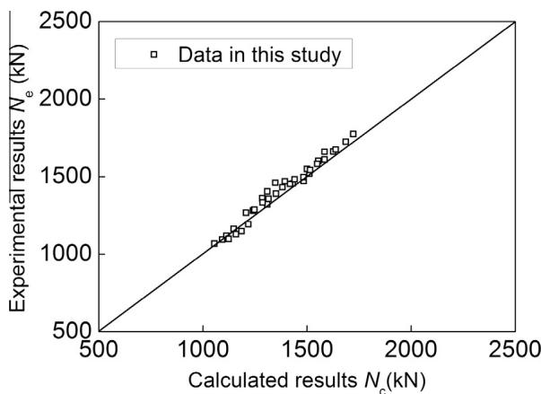  
Fig. 11. Comparisons between experiments in this study and calculated results of the proposed formula.

are reflected by the comprehensive parameter of confinement index. The ductility index can be expressed as a function of the steel fiber volume percentage and the confinement index (see Eq. (21)).

$$
D I = 1. 1 \times 1 0 ^ {4} V _ {f} ^ {2} + 0. 3 \theta + 1. 9 \tag {21}
$$

The comparisons between the calculated results and the experimental results are shown in Table 3. The ratios of the experimental and calculated values show a mean value of 1.055 and a standard deviation of 0.133. Thus, we can use Eq. (21) to predict the ductility index of the columns. It should be noted that Eq. (21) is obtained based on the experimental results of the CFST columns with relative small cross section. To predict the ductility of actual CFST columns reasonably, the effect of column diameter on the ductility should be studied.

# 5. Conclusions

In this paper, thirty-six experimental tests on concrete-filled steel tube specimens were conducted under axial load for plain concrete and steel fiber reinforced concrete. The objective of the study is to explore the effect of steel fiber on the axial behavior of steel tube columns filled with high strength concrete. The effects of the thickness of steel tube and the concrete strength were also investigated. Based on the test results, the following conclusions are reached.

1. Adding steel fibers into concrete core has little effect on the failure mode of the CFST columns, but somewhat delays the local buckling of the steel tubes in the SFRCFST columns. This is because that the confinement from steel fibers provides shear-frictional resistance to sliding and allows the transfer of shear forces across the cracked planes.   
2. SFRCFST columns exhibit slightly higher ultimate loads in comparison with the corresponding PCFST columns. However, the addition of steel fibers improves the composite action between the steel tube and concrete core, and leads to a higher concrete strength enhancement. This beneficial effect increases with the increasing of the thickness of steel tube, and decreases when concrete strength increases.   
3. Adding steel fibers into concrete core leads to substantial enhancements of ductility and energy dissipation capacity of CFST columns, and at least $0 . 9 \%$ steel fiber volume percentage is needed to obtain a ductile behavior. Furthermore, this method is found to be more effective and economic than increasing the thickness of steel tube in improving those properties of CFST columns.   
4. Formulas for prediction of the load capacity of CFST columns are proposed, and the predictions agree well with the experimental results from this study and the literature. A design equation is also proposed to predict the ductility, and can give reasonable predictions.

The current phase of the study is focused on validating the effectiveness of adding steel fibers into concrete to improve the ductility of short CFST columns, and then gaining a quantitative expression. Additional research through experimental tests and FEM analysis is under way. Based on the extensive studies, we will revise the proposed equation for ductility, thus obtaining more accurate results. And then, a minimum design method, simultaneously taking the ductility, the strength and the cost of the CFST columns into consideration, will be proposed. This work is done to use the steel fiber reinforced concrete to improve the axial behavior, especially the ductility, of CFST columns economically and effectively.

# Acknowledgements

The funding for this investigation was provided by the Doctoral Fund of Ministry of Education of China (Grant no. 20110141110002). The authors greatly appreciate their financial support.

# Appendix A

A.1. EC4 [47]

$$
N _ {\mathrm {E C} 4} = f _ {y} A _ {s} + f _ {c} ^ {\prime} A _ {c} \tag {A.1}
$$

where $f _ { c } ^ { \prime }$ is the cylinder compressive strength of concrete.

For circular composite columns with relative slenderness ratios (-k) less than 0.5, confinement effects should be incorporated in the compressive strength of CFST column. The plastic compressive resistance of circular CFST columns is determined by:

$$
N _ {\mathrm {E C} 4} = \eta_ {a} f _ {y} A _ {s} + \left(1 + \eta_ {c} \frac {t}{D} \frac {f _ {y}}{f _ {c} ^ {\prime}}\right) f _ {c} ^ {\prime} A _ {c} \tag {A.2}
$$

where t is the thickness of the steel tube, $\eta _ { a }$ is the steel reduction factor, $\eta _ { c }$ is concrete enhancement factor. $\eta _ { \mathrm { a } }$ and $\eta _ { \mathrm { c } }$ both are functions of the column relative slenderness and given by Eqs. (A3)-(A4), respectively.

$$
\eta_ {a} = 0. 2 5 (3 + 2 \bar {\lambda}) \leqslant 1 \tag {A.3}
$$

$$
\eta_ {c} = 4. 9 - 1 8. 5 \bar {\lambda} + 1 7 \bar {\lambda} ^ {2}) \geqslant 0 \tag {A.4}
$$

A.2. AISC 360-10 [48]

if $P _ { \mathrm { n 0 } } \leqslant 2 . 2 5 P _ { \mathrm { e } }$

$$
N _ {\mathrm {A I S C}} = P _ {\mathrm {n} 0} \times 0. 6 5 8 ^ {E _ {\mathrm {p} 0}} \tag {A.5}
$$

$$
i f P _ {\mathrm {n} 0} > 2. 2 5 P _ {\mathrm {e}}
$$

$$
N _ {\mathrm {A I S C}} = 0. 8 7 7 P _ {\mathrm {e}} \tag {A.6}
$$

where $P _ { \mathrm { e } }$ is the elastic critical buckling load and $P _ { \mathrm { n 0 } }$ is the nominal axial strength and can be determined following:

For compact section $( D / t \leqslant \lambda _ { p } = 0 . 1 5 E _ { s } / f _ { y } )$ :

$$
P _ {\mathrm {n} 0} = f _ {y} A _ {s} + 0. 9 5 f _ {c} ^ {\prime} A _ {c} \tag {A.7}
$$

For non-compact section $( \lambda _ { p } \leqslant D / t \leqslant \lambda _ { r } = 0 . 1 9 E _ { s } / f _ { y } )$ ):

$$
P _ {\mathrm {n o}} = P _ {p} - \frac {P _ {p} - P _ {y}}{\lambda_ {r} - \lambda_ {p}} \left(\lambda - \lambda_ {p}\right) ^ {2} \tag {A.8}
$$

where

$$
P _ {y} = f _ {y} A _ {s} + 0. 7 f _ {c} ^ {\prime} A _ {c} \tag {A.9}
$$

For slender section $( \lambda _ { r } \leqslant D / t \leqslant \lambda _ { \mathrm { m a x } } = 0 . 3 1 E _ { s } / f _ { y } )$ ):

$$
P _ {\mathrm {n} 0} = f _ {c r} A _ {s} + 0. 7 f _ {c} ^ {\prime} A _ {c} \tag {A.10}
$$

$$
f _ {c r} = \frac {0 . 7 2 f _ {y}}{\left(\frac {D}{t} \frac {f _ {y}}{E _ {s}}\right) ^ {0 . 2}} \tag {A.11}
$$

where $f _ { c r }$ is critical stress.

# References

[1] N.E. Shanmugam, B. Lakshmi, State of the art report on steel–concrete composite columns, J. Constr. Steel Res. 57 (10) (2001) 1041–1080.   
[2] T. Wee, M. Chin, M. Mansur, Stress–strain relationship of high-strength concrete in compression, ASCE J. Mater. Civ. Eng. 8 (2) (1996) 70–76.   
[3] S.M. Zhang, Y.Y. Wang, Failure modes of short columns of high-strength concrete-filled steel tubes, China Civ. Eng. J. 37 (9) (2004) 1–10.

[4] Z. Tao, L.H. Han, D.Y. Wang, Strength and ductility of stiffened thin-walled hollow steel structural stub columns filled with concrete, Thin Wall Struct. 10 (46) (2008) 1113–1128.   
[5] J. Zeghiche, K. Chaoui, An experimental behaviour of concrete-filled steel tubular columns, J. Constr. Steel Res. 61 (1) (2005) 53–66.   
[6] T. Fujimoto, A. Mukai, I. Nishiyama, Behavior of eccentrically loaded concrete-filled steel tubular columns, ASCE J. Struct. Eng. 130 (2) (2004) 203–212.   
[7] H.H. Lee, Shear strength and behavior of steel fiber reinforced concrete columns under seismic loading, Eng. Struct. 29 (7) (2007) 1253–1262.   
[8] H.T. Wang, L.C. Wang, Experimental study on static and dynamic mechanical properties of steel fiber reinforced lightweight aggregate concrete, Constr. Build. Mater. 38 (2013) 1146–1151.   
[9] P.S. Song, S. Hwang, Mechanical properties of high-strength steel fiberreinforced concrete, Constr. Build. Mater. 19 (9) (2004) 669–673.   
[10] M. Valle, O. Buyukozturk, Behavior of fiber reinforced high-strength concrete under direct shear, ACI Mater. J. 90 (2) (1993) 122–133.   
[11] V.K.R. Kodur, Design equations for evaluating fire resistance of SFRC-Filled HSS columns, J. Struct. Eng. 124 (6) (1998) 671–677.   
[12] V.K.R. Kodur, T.T. Lie, Fire resistance of circular steel columns filled with steel fiber-reinforced concrete, J. Struct. Eng. 122 (7) (1996) 776–782.   
[13] V.K.R. Kodur, Performance-based fire resistance design of concrete-filled steel columns, J. Constr. Steel Res. 51 (1) (1999) 21–36.   
[14] V.K.R. Kodur, T.T. Lie, Fire performance of concrete-filled hollow steel columns, J. Fire. Prot. Eng. 7 (3) (1995) 89–97.   
[15] T.T. Lie, M. Chabot, A method to predict the fire resistance of circular concrete filled hollow steel columns, J. Fire. Prot. Eng. 2 (4) (1990) 111– 124.   
[16] G. Campione, L.L. Mendola, L. Sanpaolesi, N. Scibilia, G. Zingone, Behavior of fiber reinforced concrete-filled tubular columns in compression, Mater. Struct. 35 (250) (2002) 332–337.   
[17] G. Campione, S. Mindess, N. Scibilia, G. Zingone, Strength of hollow circular steel sections filled with fibre-reinforced concrete, Can. J. Civ. Eng. 27 (2000) 364–372.   
[18] S.R. Gopal, P.D. Manoharan, Experimental behaviour of eccentrically loaded slender circular hollow steel columns in-filled with fibre reinforced concrete, J. Constr. Steel Res. 62 (5) (2006) 513–520.   
[19] E. Ellobody, M.F. Ghazy, Experimental investigation of eccentrically loaded fibre reinforced concrete-filled stainless steel tubular columns, J. Constr. Steel Res. 76 (2012) 167–176.   
[20] E. Ellobody, Numerical modelling of fibre reinforced concrete-filled stainless steel tubular columns, Thin Wall Struct. 63 (2013) 1–12.   
[21] E. Ellobody, Nonlinear behaviour of eccentrically loaded FR concrete-filled stainless steel tubular columns, J. Constr. Steel Res. 90 (2013) 1–12.   
[22] Z. Tao, B. Uy, L.H. Han, Z.B. Wang, Analysis and design of concrete-filled stiffened thin-walled steel tubular columns under axial compression, Thin Wall Struct. 47 (12) (2009) 1544–1556.   
[23] S.R. Gopal, P.D. Manoharan, Tests on fibre reinforced concrete filled steel tubular columns, Steel Compos. Struct. 4 (2004) 37–48.   
[24] S. Tokgoz, C. Dundar, Experimental study on steel tubular columns in-filled with plain and steel fiber reinforced concrete, Thin Wall Struct. 48 (6) (2010) 414–422.   
[25] J.M. Portolés, E. Serra, M.L. Romero, Influence of ultra-high strength infill in slender concrete-filled steel tubular columns, J. Constr. Steel Res. 86 (2013) 107–114.   
[26] J.Y.R. Liew, D.X. Xiong, Ultra-high strength concrete filled composite columns for multi-storey building construction, Adv. Struct. Eng. 15 (9) (2012) 1487– 1503.

[27] Z. Tao, L.H. Han, D.Y. Wang, Experimental behaviour of concrete-filled stiffened thin-walled steel tubular columns, Thin Wall Struct. 45 (5) (2007) 517–527.   
[28] G.D. Hatzigeorgiou, D.E. Beskos, Minimum cost design of fibre-reinforced concrete-filled steel tubular columns, J. Constr. Steel Res. 61 (2) (2005) 167– 182.   
[29] W.L.A. Oliveira, S. De Nardin, A.L.H.C. El Debs, M.K. El Debs, Influence of concrete strength and length/diameter on the axial capacity of CFT columns, J. Constr. Steel Res. 65 (12) (2009) 2103–2110.   
[30] CECS 203-2006. Technical specifications for self compacting concrete application, China plan press, Beijing, 2006.   
[31] GB/T 50081–2002. Standard for test method of mechanical properties on ordinary concrete, China Architecture & Building Press, Beijing, 2003.   
[32] M. Haskett, D.J. Oehlers, M.S. Mohamed Ali, S.K. Sharma, Evaluating the shearfriction resistance across sliding planes in concrete, Eng. Struct. 33 (4) (2011) 1357–1364.   
[33] FE. Richart, A. Brandzaeg, RL. Brown, The failure of plain and spirally reinforced concrete in compression, Bulletin No. 190, Univ. Illinois, Engineering Experimental Station, Urbana, Ill, 1929.   
[34] K. Sakino, H. Nakahara, S. Morino, I. Nishiyama, Behavior of centrally loaded concrete-filled steel-tube short columns, J. Struct. Eng. 130 (2) (2004) 180– 188.   
[35] L.H. Han, Tests on stub columns of concrete-filled RHS sections, J. Constr. Steel Res. 58 (3) (2002) 353–372.   
[36] Z. Tao, L.H. Han, Z.B. Wang, Experimental behaviour of stiffened concrete-filled thin-walled hollow steel structural (HSS) stub columns, J. Constr. Steel Res. 61 (7) (2005) 962–983.   
[37] S.H. Cai, Modern steel tube confined concrete structures (Revised edition), China Communications Press, Beijing, 2007.   
[38] M.L. Romero, V. Moliner, A. Espinos, C. Ibañez, A. Hospitaler, Fire behavior of axially loaded slender high strength concrete-filled tubular columns, J. Constr. Steel Res. 67 (12) (2011) 1953–1965.   
[39] V. Moliner, A. Espinos, M.L. Romero, A. Hospitaler, Fire behavior of eccentrically loaded slender high strength concrete-filled tubular columns, J. Constr. Steel Res. 83 (2013) 137–146.   
[40] P. Schaumann, V. Kodur, O. Bahr, Fire behaviour of hollow structural section steel columns filled with high strength concrete, J. Constr. Steel Res. 65 (8–9) (2009) 1794–1802.   
[41] F. Abed, M. Alhamaydeh, S. Abdalla, Experimental and numerical investigations of the compressive behavior of concrete filled steel tubes (CFSTs), J. Constr. Steel Res. 80 (2013) 429–439.   
[42] G. Giakoumelis, D. Lam, Axial capacity of circular concrete-filled tube columns, J. Constr. Steel Res. 60 (7) (2004) 1049–1068.   
[43] P.K. Gupta, S.M. Sarda, M.S. Kumar, Experimental and computational study of concrete filled steel tubular columns under axial loads, J. Constr. Steel Res. 63 (2) (2007) 182–193.   
[44] M. O’Shea, R. Bridge, Design of circular thin-walled concrete filled steel tubes, J. Struct. Eng. 126 (11) (2000) 1295–1303.   
[45] Q. Yu, Z. Tao, Y.X. Wu, Experimental behaviour of high performance concretefilled steel tubular columns, Thin Wall Struct. 46 (4) (2008) 362–370.   
[46] K.F. Tan, X.C. Pu, S.H. Cai, Study on the mechanical properties of steel extrahigh strength concrete encased in steel tubes, J. Build Struct. 20 (1) (1999) 10– 15 (in Chinese).   
[47] EN 1994-1-1, Design of composite steel and concrete structures, Part 1–1: General rules and rules for buildings, European Committee for Standardization, London, 2004. 2004.   
[48] AISC 360-10, Specification for Structural Steel Buildings, American Institute of Steel Construction, Chicago, 2010.