# Behavior of concrete-filled steel tubular stub columns and beams using dune sand as part of fine aggregate

Wei-Hua Wang a,b , Lin-Hai Han b,⇑ , Wei Li b , Yi-Hai Jia c

a College of Civil Engineering, Huaqiao University, Xiamen 361021, PR China   
b Department of Civil Engineering, Tsinghua University, Beijing 100084, PR China   
c State Key Laboratory of Silica Sand Utilization, Beijing 101500, PR China

# h i g h l i g h t s

- We provide new test data for dune sand CFST stub columns and beams.   
- We analyze strength and ductility indexes for dune sand CFST members.   
- We check the feasibility of current codes for dune sand CFST members.

# a r t i c l e i n f o

Article history:

Received 29 July 2013

Received in revised form 8 October 2013

Accepted 31 October 2013

Available online 28 November 2013

Keywords:

Concrete filled steel tube (CFST)

Dune sand

Stub column

Beam

Compressive strength

Flexural strength

# a b s t r a c t

The concrete using the dune sand as fine aggregate is usually regarded as having low workability and low ductility, although it has certain economic advantages. Using the dune sand concrete as the filling substance of tubular structures is possibly a way to use this kind of material, for the outer tube can provide confinement to its core concrete and thus enhance the ductility of the dune sand concrete. This paper is an attempt to investigate the behavior of concrete-filled steel tubular (CFST) stub columns and beams using dune sand as part of the fine aggregate. A series of CFST stub columns and CFST beams with $1 0 \%$ fine aggregate replacement ratio of dune sand are tested. For the stub column specimens, the main test parameters for stub column specimens are the steel ratio, the concrete strength and the cross-sectional type. For the beam specimens, the test parameter is the cross-sectional depth. The failure modes, loaddeformation relation and the strain distribution of composite stub column and beam specimens are reported, and the strength and the ductility of test specimens are discussed using various indexes. The formulae for the compressive and flexural strength of normal CFST members are tentatively used to predict the strength of composite members using dune sand.

$^ { © }$ 2013 Elsevier Ltd. All rights reserved.

# 1. Introduction

River sand resources are excessively exploited against the background of the increasing demand of the fine aggregate in the concrete production. As one of the possible alternative options, the abundant dune sand from deserts may be used in the concrete mixtures instead of the river sand.

In China, the desertification area reaches nearly a quarter of the land area, and the dune sand has been used in constructions for approximately 100 years. In 1920, the dune sand concrete was used in building construction in China, and a specification of super fine sand concrete (BJG19-65) was published in 1965 [1]. According to the specification, the fineness modulus of super fine sand was defined as less than 1.5 or the average particle size was less

⇑ Corresponding author at: Department of Civil Engineering, Tsinghua University, Beijing 100084, PR China. Tel./fax: +86 10 62797067.

E-mail address: lhhan@tsinghua.edu.cn (L.-H. Han).

than $0 . 2 5 \mathrm { m m }$ . The average grain size ranged from 0.25 to $0 . 5 \mathrm { m m }$ was defined as the fine sand, and it was classified as the coarse sand when the average particle size was larger than $0 . 5 \mathrm { m m }$ . The diameter of dune sand ranges from 0.08 to $0 . 6 3 \mathrm { m m }$ , and the fineness modulus is usually 0.45-0.88 [2,3]. The low fineness modulus and the poor gradation are the critical problems when using the dune sand for making concrete. The fresh concrete mixture using the dune sand as the fine aggregate has several special characteristics, such as high cohesiveness, small slump, poor fluidity and easy of segregation and low workability. In addition, the compressive strength of the dune sand concrete is usually low too [2,4].

Some research has been conducted on the workability and the mechanical behavior of cement pastes or mortars with dune sand powder [2–5]. Zhang et al. [5] carried out experimental research on the performance of mortar and concrete made of Tengri dune sand and Mu Us dune sand (both in China). Chemical composition and physical properties of dune sand were presented, after the

# Nomenclature

<table><tr><td>Ac</td><td>cross-sectional area of concrete</td></tr><tr><td>As</td><td>cross-sectional area of steel</td></tr><tr><td>Asc</td><td>cross-sectional area of composite member, given by 
As + Ac</td></tr><tr><td>b</td><td>width of composite beams sections</td></tr><tr><td>B</td><td>width of square stub column sections</td></tr><tr><td>D</td><td>outside diameter of circular CFST sections</td></tr><tr><td>Ec</td><td>modulus of elasticity of concrete</td></tr><tr><td>fc</td><td>characteristic cylinder strength of concrete</td></tr><tr><td>fck</td><td>characteristic compressive strength of concrete</td></tr><tr><td></td><td>(fck = 0.67 fc for normal strength concrete)</td></tr><tr><td>fcu</td><td>compressive strength concrete cube</td></tr><tr><td>fy</td><td>yield strength of steel</td></tr><tr><td>fscy</td><td>nominal yielding strength of composite sections</td></tr><tr><td>fu</td><td>ultimate strength of steel</td></tr><tr><td>h</td><td>depth of composite beam sections</td></tr><tr><td>K0.2</td><td>initial flexural stiffness</td></tr></table>

<table><tr><td>K0.6</td><td>working stage flexural stiffness</td></tr><tr><td>L</td><td>axial length of stub columns or beams</td></tr><tr><td>M</td><td>bending moment</td></tr><tr><td>Mu</td><td>ultimate flexural strength</td></tr><tr><td>N</td><td>axial load</td></tr><tr><td>Nu</td><td>ultimate compressive strength</td></tr><tr><td>t</td><td>wall thickness of steel tubes</td></tr><tr><td>um</td><td>mid-span deflection of composite beams</td></tr><tr><td>Wsc</td><td>modulus of composite beam sections</td></tr><tr><td>α</td><td>steel ratio (=As/Ac)</td></tr><tr><td>Δ</td><td>axial shortening of stub columns</td></tr><tr><td>ξ</td><td>confinement factor of composite section ( = α ·fy/fck)</td></tr><tr><td>ε</td><td>strain</td></tr><tr><td>εp</td><td>peak strain related to maximum axial load</td></tr><tr><td>εy</td><td>yield strain</td></tr><tr><td>φ</td><td>curvature at mid-span of beams</td></tr><tr><td>γm</td><td>flexural strength index</td></tr></table>

additives were added to the fresh concrete mixture, the maximum cube concrete strength at 28 days was 51.4 MPa with a slump of $4 5 \mathrm { m m }$ . Al-Harthy et al. [3] presented the properties of concrete using different concrete mixtures, the workability ranged from $1 6 \mathrm { m m }$ to $1 2 2 \mathrm { m m }$ and the percentages of dune sand replacement was from $1 0 \%$ to $1 0 0 \%$ . Compared to the fully replacement, when the fine aggregate were partially replaced, the workability improved and the strength of concrete decreased with the increase in dune sand replacement. Alhozaimy et al. [6] reported the properties of the high strength concrete under normal and autoclaved curing using the white sand or the dune sand. Results showed that it was possible to use the dune sand or the white sand as $3 0 \%$ partial cement replacement under autoclaved curing. One of the benefits of using dune sand as the fine aggregate is that the construction cost will be reduced in some desert area. Although the workability and the strength of the dune sand concrete may not be as good as the normal concrete, the dune sand could still be an available alternative material as the fine aggregate in concrete mixture if proper curing methods are taken. Filling the concrete consisting of dune sand into steel tubes may be a possible way to use this kind of materials.

Concrete-filled steel tubular (CFST) structures have been widely used in high-rise buildings or bridges, and the blooming research on the mechanical behavior of CFST structures have been carried out in the past decades [7–11]. The mechanical behavior on the normal CFST members under axial compression and bending were sufficiently studied [12–15]. Recently, studies were also conducted on the CFST stub columns with special concrete infilling, such as the high performance plain concrete, the lightweight concrete

and the recycled aggregate concrete [16–18]. Due to the confinement of the outer steel tube, CFST structures using the dune sand concrete (using dune sand as part of the fine aggregate) are expected to have favorable performance under static or dynamic loading.

To date, the mechanical performance of CFST members using the concrete consisting of dune sand as part of the fine aggregate (dune sand CFST) has not been studied yet. There’s no test data found in literature for such kind of CFST members. Hence, the objectives of this research are as follows: (1) to study the compressive and flexural behavior of dune sand CFST members by tests. (2) to check the feasibility of current codes in the prediction of the stiffness and strength of dune sand CFST members. A $1 0 \%$ fine aggregate replacement ratio of the dune sand is used for the practical reason in this investigation, i.e. the mass of the dune sand is $1 0 \%$ of the total mass of fine aggregate, and the normal curing method can be applied in the experiments.

# 2. Experimental program

# 2.1. Specimen preparation

There are 26 stub column and beam specimens in total, including 10 dune sand CFST stub columns, 4 stub columns with hollow steel section, 6 dune sand reinforcement concrete (RC) stub columns and 6 dune sand CFST beams with rectangular cross section. The components of concrete mixture were shown in Fig. 1. The test parameters for composite column specimens were the confinement factor, the compressive strength of the concrete, and the cross-sectional type. Each specimen had a duplicated one with same parameters and loading conditions. The summary of the dune sand CFST columns is listed in Table 1, where the confinement factor n ¼  A f $\begin{array} { r } { \xi = \frac { A _ { s } f _ { y } } { A _ { c } f _ { \mathrm { c k } } } = \alpha \frac { f _ { y } } { f _ { \mathrm { c k } } } , A _ { s } } \end{array}$ As fy and $A _ { \mathrm { c } }$ are areas of steel tubes and core concrete, respectively; $\mathscr { X }$

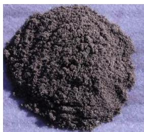  
(a) Dune sand fine aggregate

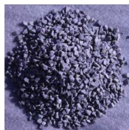  
(b) Coarse aggregate

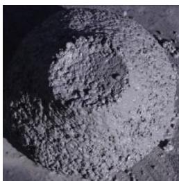  
(c) Concrete mixture   
Fig. 1. Components of concrete mixture.

is the steel ratio.) The test parameter for beam specimens was the depth of beam sections. The summary of the dune sand CFST beams is listed in Table 2. The total height (H) of stub columns was $5 2 0 \mathrm { m m }$ (including two $2 0 \mathrm { m m }$ thick cover plates), and the total length (L) of the beams was $4 0 0 0 \mathrm { m m }$ with a clear span of $3 8 0 0 \mathrm { m m }$ . The cross-sectional profiles of those RC stub columns were equal to those of the core concrete in CFST specimens. Four and six longitudinal reinforcing bars with the diameter of $1 0 \mathrm { m m }$ were assigned for the RC columns with a square or circular cross-section, respectively. For all dune sand RC stub columns, the diameter of stirrups was 6 mm and the separation distance was $1 0 0 \mathrm { m m }$ . The cross-sectional details can be found in Fig. 2(a and b) for the column and beam specimens, respectively.

Cover plates with a thickness of $2 0 \mathrm { m m }$ were used for all specimens to ensure the integrity and the load transfer. One cover plate was welded to the tube end before the concrete placement, and the other one was welded after the solidification and surface treatment of core concrete.

# 2.2. Material properties

The concrete with the cube strength of C50 and C80 was used in the tests. The mixture proportions for core concrete are listed in Table 3, where the dune sand replacement of fine aggregate was $1 0 \%$ for all specimens. The compressive cubic strength $( f _ { \mathrm { c u } } )$ for C50 and C80 concrete was 54 MPa and 78 MPa, respectively. The slump for C50 and C80 concrete was $2 2 0 \mathrm { m m }$ and $1 3 0 \mathrm { m m }$ , respectively. To ensure the compaction of the core concrete, the fresh concrete was vibrated for 2 min using concrete vibrator during the placement. The normal curing method is used for all specimens.

For the steel material, the measured average yield strength $( f _ { \mathrm { y } } )$ , the ultimate strength $\left( f _ { \mathrm { u } } \right)$ , the modulus of elasticity $\left( E _ { s } \right)$ and the Poisson’s ratio $( \gamma _ { s } )$ are listed in Table 4.

# 2.3. Test setup and instrumentation

The schematic view of the test setup for stub columns is shown in Fig. 2(a), where the experiment was conducted on a machine with a loading capacity of 5000 kN. Strain gauges were arranged at the mid-height of the column, and two displacement transducers were installed to record the axial shortening of the specimens.

The schematic view of the test setup for beam specimens is shown in Fig. 2(b). The load was applied on two quarter points by a rigid spread beam, and two curvature gauges were placed nearby the mid-span to record the curvature of beam. Three steel strain gauges were placed longitudinally at the mid-span of beam specimens, as shown in Fig. 2(b).

For the loading protocol of the specimens, the load control method was used before the specimen yielded, where the ultimate strength is estimated by DBJ specification tentatively. Each loading interval was 1/10 of the estimated ultimate strength. The displacement control method was applied after the yielding with a speed of $5 \mathrm { m m / m i n }$ until the failure.

# 3. Test results

# 3.1. Stub columns

# (1) Failure modes

The whole test was performed in a smooth and controlled way. Fig. 3 shows the typical failure modes of stub column specimens subjected to compression. For the unfilled hollow steel tube specimens, both inward and outward local buckling occurred on the steel tubes, as shown in Fig. 3(a). For the composite stub columns, only the outward local buckling was shown on steel tubes, and the buckling position was lower than that of the hollow tubes, as shown in Fig. 3(b). Moreover, severer local buckling was found for the specimen with a thinner tube wall thickness. For the hollow steel tubes with circular cross sections, both inward and outward buckling located at about 2/3 height and near the top end of columns. For composite CFST columns, the inward local buckling of steel tubes were prevented and only the outward local buckling was found, as shown in Fig. 3(d). Failure modes of square and circular dune sand RC columns were presented in Fig. 3(e and f). A large amount of diagonal cracks appeared on the concrete surface, and the concrete crushed near the loaded ends.

Table 1 Summary of stub column specimens.   

<table><tr><td rowspan="2">No.</td><td rowspan="2">Cross-sectional type</td><td rowspan="2">Specimen label</td><td rowspan="2">Cross-sectional dimension B(mm) × B(mm) × t (mm)/D(mm) × t (mm)</td><td rowspan="2">Confinement factor ξ</td><td rowspan="2">Strength of core concrete fcu(MPa)</td><td rowspan="2">Peak displacement (mm)</td><td colspan="2">Compressive strength (kN)</td></tr><tr><td>Measured</td><td>Eq. (A.1)</td></tr><tr><td>1</td><td rowspan="6">t B</td><td>S-3-8-1</td><td>160 × 160 × 3.46</td><td>0.55</td><td>78</td><td>2.55</td><td>2011</td><td>2172a</td></tr><tr><td>2</td><td>S-3-8-2</td><td>160 × 160 × 3.46</td><td>0.55</td><td>78</td><td>2.15</td><td>2333</td><td></td></tr><tr><td>3</td><td>S-3-5-1</td><td>160 × 160 × 3.46</td><td>0.79</td><td>54</td><td>1.85</td><td>1784</td><td>1798a</td></tr><tr><td>4</td><td>S-3-5-2</td><td>160 × 160 × 3.46</td><td>0.79</td><td>54</td><td>1.78</td><td>1812</td><td></td></tr><tr><td>5</td><td>S-5-8-1</td><td>160 × 160 × 5.43</td><td>0.92</td><td>78</td><td>1.92</td><td>2751</td><td>2771a</td></tr><tr><td>6</td><td>S-5-8-2</td><td>160 × 160 × 5.43</td><td>0.92</td><td>78</td><td>2.08</td><td>2791</td><td></td></tr><tr><td>7</td><td rowspan="4">t B</td><td>S-S-3-1</td><td>160 × 160 × 3.46</td><td>-</td><td>-</td><td>1.36</td><td>577</td><td>606a</td></tr><tr><td>8</td><td>S-S-3-2</td><td>160 × 160 × 3.46</td><td>-</td><td>-</td><td>1.09</td><td>635</td><td></td></tr><tr><td>9</td><td>S-S-5-1</td><td>160 × 160 × 5.43</td><td>-</td><td>-</td><td>2.23</td><td>1165</td><td>1179a</td></tr><tr><td>10</td><td>S-S-5-2</td><td>160 × 160 × 5.43</td><td>-</td><td>-</td><td>2.70</td><td>1193</td><td></td></tr><tr><td>11</td><td rowspan="4">t B</td><td>S-R-5-1</td><td>153 × 153</td><td>-</td><td>54</td><td></td><td>801</td><td>799a</td></tr><tr><td>12</td><td>S-R-5-2</td><td>153 × 153</td><td>-</td><td>54</td><td></td><td>796</td><td></td></tr><tr><td>13</td><td>S-R-8-1</td><td>153 × 153</td><td>-</td><td>78</td><td></td><td>1420</td><td>1421a</td></tr><tr><td>14</td><td>S-R-8-2</td><td>153 × 153</td><td>-</td><td>78</td><td></td><td>1422</td><td></td></tr><tr><td>15</td><td rowspan="2">t D</td><td>C-3-8-1</td><td>Φ160 × 3.46</td><td>0.58</td><td>78</td><td>5.65</td><td>2044</td><td>2057a</td></tr><tr><td>16</td><td>C-3-8-2</td><td>Φ160 × 3.46</td><td>0.58</td><td>78</td><td>4.60</td><td>2069</td><td></td></tr><tr><td>17</td><td rowspan="2">t D</td><td>C-S-3-1</td><td>Φ160 × 3.46</td><td>-</td><td>-</td><td>6.88</td><td>722</td><td>729a</td></tr><tr><td>18</td><td>C-S-3-2</td><td>Φ160 × 3.46</td><td>-</td><td>-</td><td>8.37</td><td>736</td><td></td></tr><tr><td>19</td><td rowspan="2">t D</td><td>C-R-8-1</td><td>Φ153</td><td>-</td><td>78</td><td></td><td>1215</td><td>1192a</td></tr><tr><td>20</td><td>C-R-8-2</td><td>Φ153</td><td>-</td><td>78</td><td></td><td>1168</td><td></td></tr></table>

a Average value.

Table 2 Summary of beam specimens.   

<table><tr><td rowspan="2">No.</td><td rowspan="2">Cross-sectional type</td><td rowspan="2">Specimen label</td><td rowspan="2">Sectional dimension b × h × t (mm)</td><td rowspan="2">Strength of core concrete fcu (MPa)</td><td rowspan="2">Mid-span deflection um (mm)</td><td colspan="3">Flexural strength Mu (kN m)</td></tr><tr><td>Measured</td><td>Eq. (A.2)</td><td></td></tr><tr><td>1</td><td rowspan="6">t h</td><td>B160-1</td><td>160 × 160 × 3.46</td><td>78</td><td>192.8</td><td>59.3</td><td>59.4a</td><td>55.6</td></tr><tr><td>2</td><td>B160-2</td><td>160 × 160 × 3.46</td><td>78</td><td>189.7</td><td>59.5</td><td></td><td></td></tr><tr><td>3</td><td>B240-1</td><td>160 × 240 × 3.46</td><td>78</td><td>197.1</td><td>136.8</td><td>140.8a</td><td>107.8</td></tr><tr><td>4</td><td>B240-2</td><td>160 × 240 × 3.46</td><td>78</td><td>197.8</td><td>144.9</td><td></td><td></td></tr><tr><td>5</td><td>B320-1</td><td>160 × 320 × 3.46</td><td>78</td><td>198.2</td><td>208.6</td><td>206.0a</td><td>176.2</td></tr><tr><td>6</td><td>B320-2</td><td>160 × 320 × 3.46</td><td>78</td><td>195.3</td><td>203.3</td><td></td><td></td></tr></table>

a Average value.

  
(a) Stub column

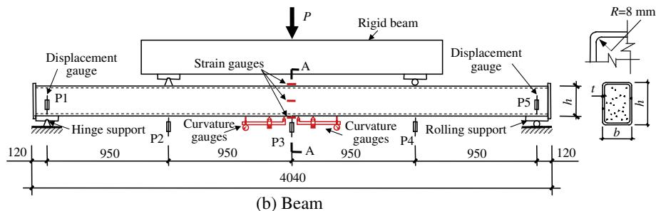  
Fig. 2. Schematic view of test setup (Units: mm).

Table 3 Mixture proportions and material properties of concrete.   

<table><tr><td>Core concrete</td><td>Cement (kg/m3)</td><td>Water (kg/m3)</td><td>Sand (kg/m3)</td><td>Coarse aggregate (kg/m3)</td><td>Water reducer (kg/m3)</td><td>28 days fcu (MPa)</td><td>Ec (N/mm2)</td></tr><tr><td>C50</td><td>477</td><td>181</td><td>607</td><td>1128</td><td>6.68</td><td>54</td><td>3.43 × 104</td></tr><tr><td>C80</td><td>485</td><td>144</td><td>618</td><td>1147</td><td>6.79</td><td>78</td><td>3.72 × 104</td></tr></table>

Table 4 Material properties of steel.   

<table><tr><td>Thickness or diameter (mm)</td><td>fy(MPa)</td><td>fu(MPa)</td><td>Es(N/mm2)</td><td>Poisson&#x27;s ratio</td></tr><tr><td>3.46</td><td>363</td><td>530</td><td>2.03 × 10^5</td><td>0.297</td></tr><tr><td>5.43</td><td>353</td><td>529</td><td>2.05 × 10^5</td><td>0.303</td></tr><tr><td>10</td><td>426</td><td>623</td><td>2.02 × 10^5</td><td>0.287</td></tr><tr><td>6</td><td>398</td><td>491</td><td>2.10 × 10^5</td><td>0.290</td></tr></table>

After the test, the outer steel tube was removed to inspect the failure mode of inner concrete. Fig. 4(a and b) show failure modes of core concrete for square and circular CFST columns, respectively. It was found that the core concrete was crushed where the steel tube buckled, while the concrete integrity was well kept. No cracks

were found on the core concrete except the crushed zone. Besides, the crushed area for square CFST columns was larger than that of circular CFST columns when the same axial shortening was reached. It is due to the fact that the outer tube with circular cross section could provide a better confinement to core concrete.

# (2) Axial load (N) versus axial shortening (D) responses

The axial load (N) versus the axial shortening (D) curves for all stub column specimens were presented in Fig. 5. For square CFST specimens, the axial load descended quickly after it reached the peak point, as shown in Fig. 5(a). When comparing the residual strength of S-3-8 series $( f _ { \mathrm { c u } } = 7 8 \mathrm { M P a } )$ ) and that of the S-3-5 series $( f _ { \mathrm { c u } } = 5 4 \ : \mathrm { M P a } ) _ { \mathrm { \ell } }$ ), it was found that the strength of the core concrete only had a moderate effect on the residual bearing capacity of

square CFST columns. It can also be found that the thickness of steel tube (t) had an obvious effect on the peak displacement, which was defined as the axial shortening corresponding to the maximum axial load. For instance, for the S-3-8 $\dot { t } = 3 . 4 6 \mathrm { m m }$ and S-5-8 $\mathit { \check { t } } = 5 . 4 3 \ : \mathrm { m m } .$ ) series, the peak displacements were $1 . 2 2 \mathrm { m m }$ and $2 . 4 7 \mathrm { m m }$ (average value), respectively.

N–D curves of hollow steel tubes are shown in Fig. 5(b). The N– D curves fell down more slowly for specimens with a thicker steel tube, after the ultimate compressive strength was reached.

For circular CFST specimens, the load decrease was moderate after the ultimate compressive strength was reached, as shown in Fig. 5(c), which may due to the more effective confinement provided by the outer tube. The ultimate compressive strength of CFST specimen was significantly higher than that of hollow steel tube. When compared to the square specimens, the N–D curves of the circular specimens fell down slowly after the ultimate compressive

strength was reached. Besides, the average peak displacement of the circular specimens was about twice of that of the square counterpart.

N-D curves of RC stub column specimens are illustrated in Fig. 5(d). When compared to N–D curves of composite counterparts shown in previous figures, the axial load of RC stub columns fell down more quickly after the ultimate compressive strength was reached. The brittle failure occurred on the specimens using high strength concrete. When compared to the specimens with higher concrete strength, the load decrease is slower for specimens with lower concrete strength.

(3) Axial load (N) versus strain (e) responses

Fig. 6 shows typical N–e curves of column specimens, where S1– S4 are the compressive axial strain recorded by the steel strain

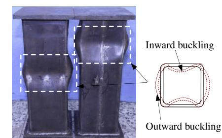  
(a) Square hollow steel tubes

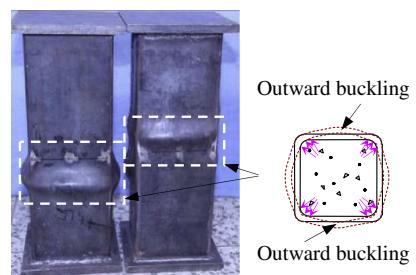  
(b) Square CFST columns

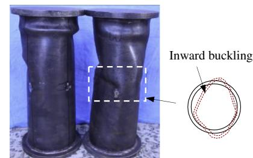  
(c) Circular hollow steel tubes

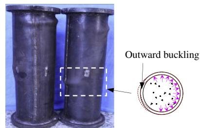  
(d) Circular CFST columns

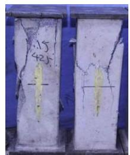  
(e) Square RC columns

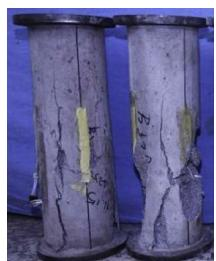  
(f) Circular RC columns   
Fig. 3. Failure modes of stub columns.

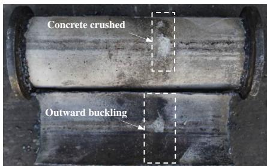  
(a) Circular CFST columns

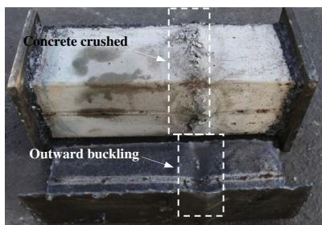  
(b) Square CFST columns   
Fig. 4. Failure modes of inner concrete.

gauges, as shown in Fig. 2. The S5 is the nominal average axial strain, calculated from the measured axial shortening (D) normalized by the total height (H). Due to the composite action between the core concrete and the steel tube, the core concrete of dune sand CFST columns could provide a support to the steel tube when it buckled locally, and only outward buckling was found on the steel

tube. However, significant differences were found on the strain of steel tubes, due to the different local buckling degree occurred on the steel tubes. The peak strain $\left( \varepsilon _ { \mathrm { p } } \right)$ related to the maximum axial load was also presented out in Fig. 6. It can be seen that the strength development of composite members was more quickly than that of the hollow steel tube. The peak strains of the circular

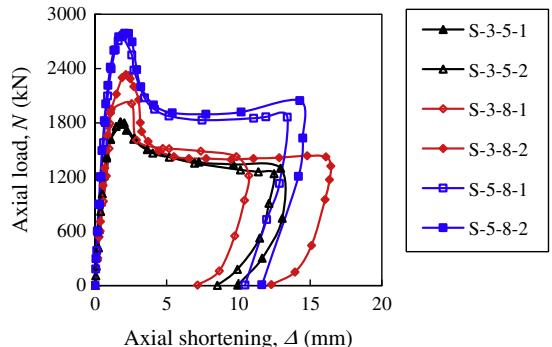  
(a) Square CFST columns

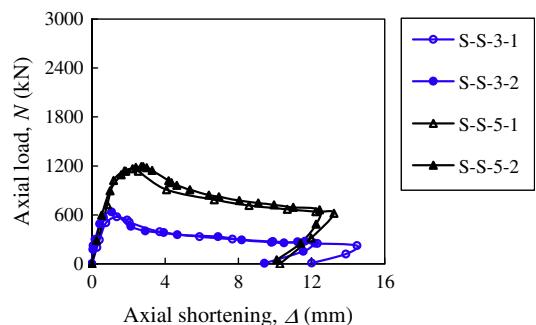  
(b) Square hollow steel tubes

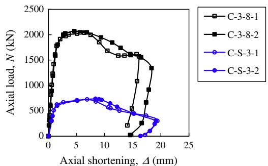  
(c) Circular columns

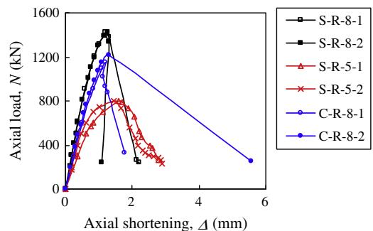  
(d) RC columns   
Fig. 5. Axial versus axial shortening (N–D) relationships of compressive stub columns.

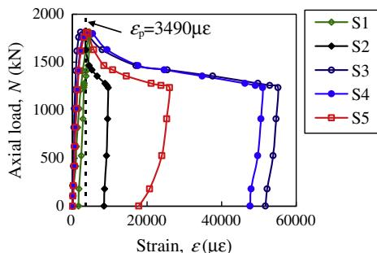  
(a) Square CFST column (S-3-5-2)

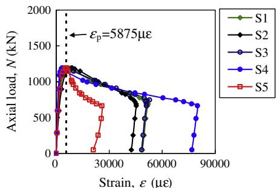  
(b) Square hollow steel tube (S-S-5-2)

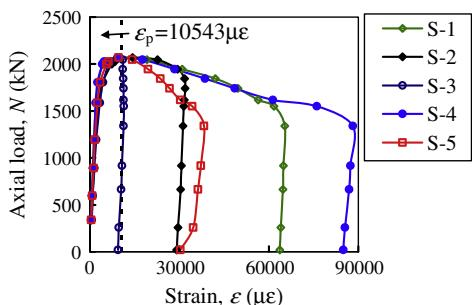  
(c) Circular CFST column (C-3-8-2)   
Fig. 6. Typical axial load versus strain (N–e) curves of compressive stub columns.

composite specimens were larger than those of the square specimens, for the circular cross section confined the core concrete better and delayed the strength development.

# 3.2. Beams

# (1) Failure modes

Fig. 7 shows the failure modes of composite beam specimens. It can be seen in general, the failure mode of all specimens was overall bending, as shown in Fig. 7(a). Fig. 7(b) shows a detailed view of the buckling mode on the steel tube. A series of wave like outward local buckling was found in the compressive steel tubes between two loading points. The outward local buckling was more obvious for the specimens with a higher beam depth. After the test, the outer steel tube was removed, and it was found that the core concrete was crushed where the outward local buckling occurred, as shown in Fig. 7(b). The typical crack pattern for core concrete of beam specimen is illustrated in Fig. 7(c). It was found that the core concrete in the bottom tensile zone cracked, and both amount and width of cracks increased with the increase of beam depth. Most cracks extended less than half of the beam height, and some of them extended above the axial centre line. That was due to the neutral axis moved up when the concrete cracked [14], and this could also be demonstrated in Fig. 12.

Fig. 8 illustrates the typical deflection curves of beam specimens where $M _ { \mathbf { u } }$ is the ultimate flexural strength when the tensile fiber strain of the bottom steel reached $1 0 { , } 0 0 0 \mu \varepsilon$ . The sinusoids with the same peak value are presented in dashed lines for comparison. It was found that the deflection curves of flexural specimens at different load levels fitted half-sine waves well, even when the mid-span deflections were very large.

(2) Moment (M) versus mid-span deflection $( u _ { \mathrm { m } } )$ relationships

The moment (M) versus mid-span deflection $( u _ { \mathrm { m } } )$ curves of the beam specimens were presented in Fig. 9, where $M$ is the

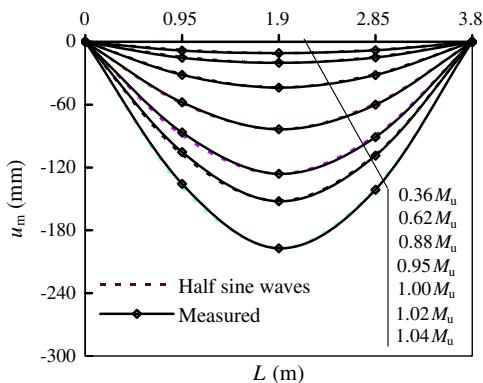  
Fig. 8. Typical deformation curves of beam specimens (B-24-1).

recorded cross-sectional moment, $u _ { \mathrm { m } }$ is the corresponding midspan deflection. It can be seen that after the steel tube walls yielded, the cross-sectional moment $( M )$ at the mid-span still increased with the increase of midspan deflection. The maximum cross-sectional moment rose greatly with the increase of beam depth. The cross-sectional moment corresponding to the maximum tensile fibre strain of $1 0 { , } 0 0 0 \mu \varepsilon$ was defined as the ultimate flexural strength $\left( M _ { \mathrm { u } } \right)$ of composite beams [7] (Fig. 10). It should be noted that the cross-sectional moment still developed when the $1 0 { , } 0 0 0 \mu \varepsilon$ strain was reached, while the increase of the load was less than $1 0 \%$ .

The typical moment (M) versus extreme fibre compressive and tensile strains (e) relationships are shown in Fig. 10. The steel yielding strain $\mathit { \Omega } _ { \mathit { \varepsilon } _ { y } } = 1 8 1 5 \mu \mathrm { { z } ) }$ of both tensile zone and compressive zone are presented in the figure as well. It can be seen that the strains at different positions showed a significantly difference. The strain on the top surface was under compression and the strains at the mid-height and the bottom surface was under tension. It was due to the fact that the neutral axis location was moved up when the concrete was filled.

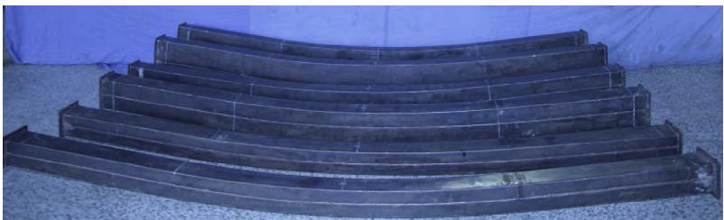  
(a) General view

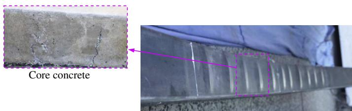  
(b) Compressive core concrete (B-320-1)

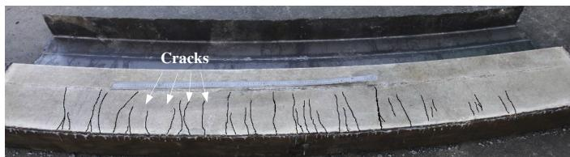  
(c) Typical concrete cracks (B-320-1)   
Fig. 7. Failure modes of beam specimens.

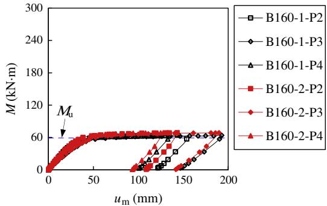  
(a) Sectional height $h { = } 1 6 0 \ \mathrm { m m }$

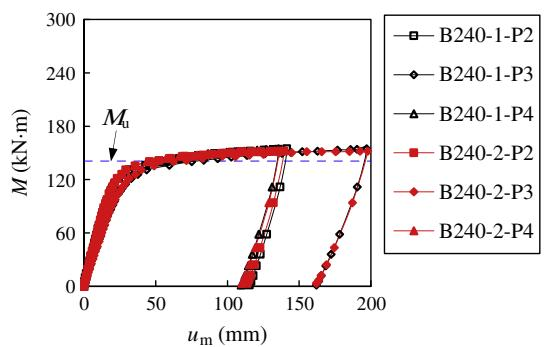  
(b) Sectional height $h { = } 2 4 0 \ \mathrm { m m }$

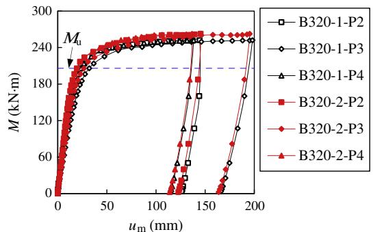  
(c) Sectional height $h { = } 3 2 0 \ \mathrm { m m }$   
Fig. 9. Comparison on $M - u _ { \mathrm { m } }$ curves of flexural beams.

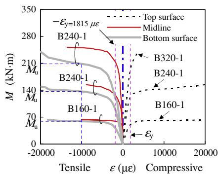  
(a) Contradistinctive specimen-1

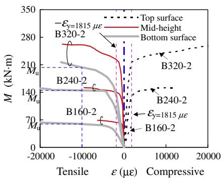  
(b) Contradistinctive specimen-2   
Fig. 10. Moment (M) versus longitudinal strain (e) of steel tube wall at the mid-span of flexural beams.

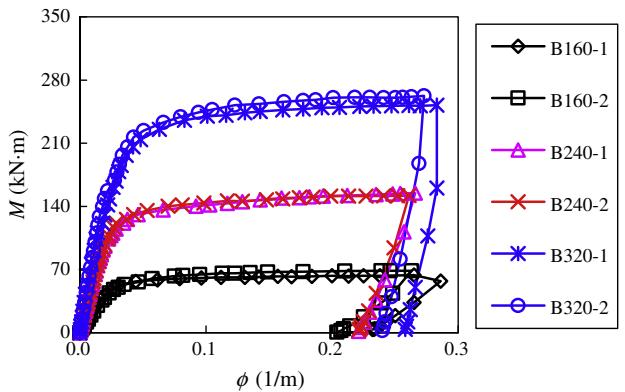  
Fig. 11. Moment (M) versus curvature $\left( \phi \right)$ curves of composite beams.

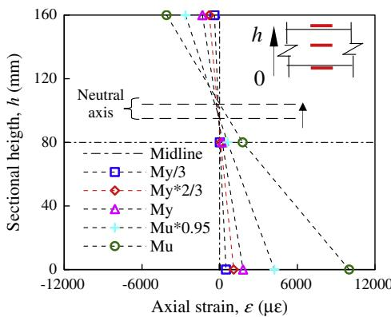  
Fig. 12. Steel strain distributions at mid-span (B160-1).

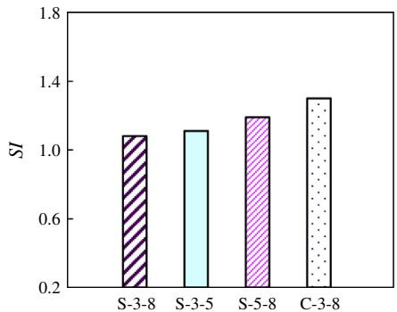  
(a) CFST stub columns

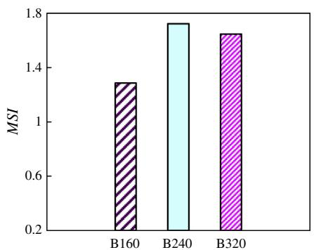  
(b) CFST Beams

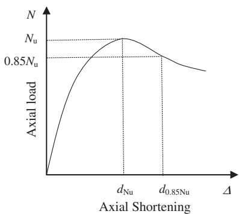  
Fig. 13. Strength index.   
(a) Stub columns

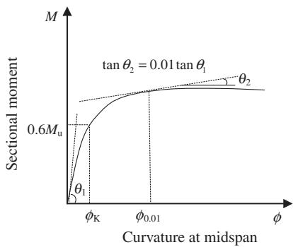  
(b) Flexural beams

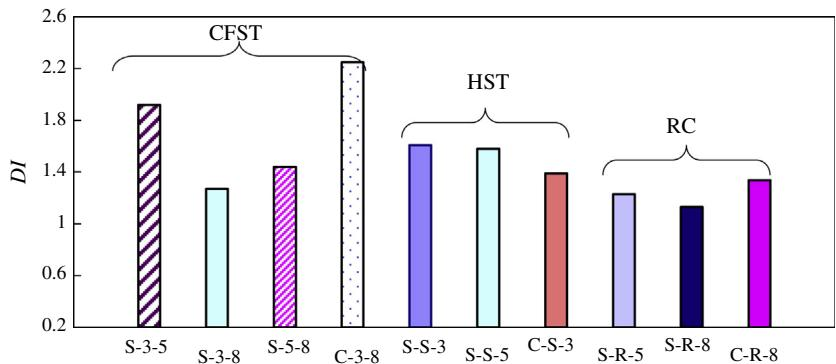  
Fig. 14. Calculation of ductility index.   
(a) Stub column specimens

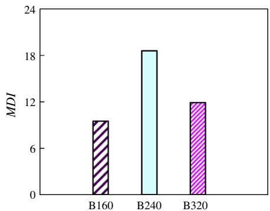  
(b) Flexural beam specimens   
Fig. 15. Ductility index.

Table 5 Calculated results of compressive of composite stub columns (kN).   

<table><tr><td>No.</td><td>Specimen label</td><td>Measured results (Average)</td><td>AlJ</td><td>AlJ/measured</td><td>AISC</td><td>AISC/measured</td><td>EC4</td><td>EC4/measured</td><td>DBJ (Eq. (A.1))</td><td>DBJ/measured</td></tr><tr><td>1</td><td>S-3-8-1</td><td>2172</td><td>2141</td><td>0.986</td><td>2141</td><td>0.986</td><td>2380</td><td>1.096</td><td>2362</td><td>1.087</td></tr><tr><td>2</td><td>S-3-8-2</td><td></td><td></td><td></td><td></td><td></td><td></td><td></td><td></td><td></td></tr><tr><td>3</td><td>S-3-5-1</td><td>1798</td><td>1683</td><td>0.936</td><td>1683</td><td>0.936</td><td>1841</td><td>1.024</td><td>1833</td><td>1.019</td></tr><tr><td>4</td><td>S-3-5-2</td><td></td><td></td><td></td><td></td><td></td><td></td><td></td><td></td><td></td></tr><tr><td>5</td><td>S-5-8-1</td><td>2771</td><td>2471</td><td>0.892</td><td>2471</td><td>0.892</td><td>2698</td><td>0.974</td><td>2791</td><td>1.007</td></tr><tr><td>6</td><td>S-5-8-2</td><td></td><td></td><td></td><td></td><td></td><td></td><td></td><td></td><td></td></tr><tr><td>7</td><td>C-3-8-1</td><td>2057</td><td>1848</td><td>0.898</td><td>1807</td><td>0.878</td><td>2109</td><td>1.025</td><td>1926</td><td>0.936</td></tr><tr><td>8</td><td>C-3-8-2</td><td></td><td></td><td></td><td></td><td></td><td></td><td></td><td></td><td></td></tr><tr><td></td><td>Mean</td><td></td><td></td><td>0.928</td><td></td><td>0.923</td><td></td><td>1.030</td><td></td><td>1.013</td></tr><tr><td></td><td>Standard deviation</td><td></td><td></td><td>0.043</td><td></td><td>0.049</td><td></td><td>0.050</td><td></td><td>0.062</td></tr></table>

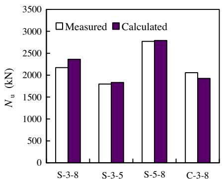  
(a) Stub columns

  
(b) Flexural beams   
Fig. 16. Comparison between measured and calculated results.

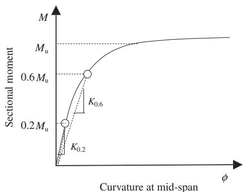  
Fig. 17. Calculation of flexural stiffness.

Moment (M) versus curvature $\left( \phi \right)$ curves of composite beams with different section depths are shown in Fig. 11, where the curvature $\left( \phi \right)$ was recorded by two curvature gauges. It can be found that a similar pattern was found for specimens with different parameters. The M–/ curves were nearly linear before the mid-span sectional moments $( M )$ reached about $0 . 6 M _ { \mathrm { u } }$ . The development of curvature slowed down after the specimen yielded. All the dune sand CFST beam specimens exceeded a curvature of 0.2.

Typical strain distributions of the beam cross sections at different load levels are illustrated in Fig. 12. It could be found that the cross-sectional steel strain distributions fit the plane section assumption well during the loading process. The location of the neutral axis was near the mid-height of the beam before the specimen yielded, and it moved up as the bending deflection increased.

# 4. Analysis and discussion

# 4.1. Strength index

# (1) Stub columns

The strength index (SI) of composite stub columns can be defined as [19]:

$$
S I = \frac {N _ {\max}}{A _ {\mathrm {c}} f _ {\mathrm {c k}} + A _ {\mathrm {s}} f _ {\mathrm {y}}} \tag {1}
$$

where $N _ { \mathrm { m a x } }$ is the measured maximum value of the compressive load. The strength index (SI) thus calculated for tested stub columns were illustrated in Fig. 13(a), where it can be found that the strength index (SI) for all square dune sand CFST stub columns were higher than 1.0 due to the confinement provided by the outer steel tube. For the columns with the square cross section, the confinement factors $\left( \xi \right)$ for specimen S-3-8 series, S-3-5 series and S-5-8 series were 0.55, 0.79 and 0.92, respectively, where $\xi$ was defined as $A _ { \mathrm { s } } f _ { \mathrm { y } } / A _ { \mathrm { c } } f _ { \mathrm { c k } }$ [19]. It can be found that for the square dune sand CFST column, the SI increased with the increase of the confinement factor. For the columns with circular cross section, the confinement factor was 0.58, while the corresponding SI was 1.3. It was due to the good confinement of the circular steel tube to the core concrete.

# (2) Beams

For the beam specimens, the moment strength index of flexural beams is defined as:

$$
M S I = \frac {M _ {\mathrm {u}}}{A _ {\mathrm {s}} \cdot f _ {\mathrm {y}} \cdot z _ {\mathrm {y}}} \tag {2}
$$

where $M _ { \mathbf { u } }$ is the ultimate flexural strength corresponding to the maximum tensile fibre strain of 0.01; $A _ { s }$ is the area of tensile steel tube (calculated as one half of the total area of the steel tube); $f _ { \mathrm { y } }$

is the yield strength of steel tubes; $z _ { \mathrm { y } }$ is the equivalent distance between the centroid of the tensile steel tubes and that of the compressive steel tubes. Fig. 13(b) illustrated the MSI thus obtained for the beam specimens with different sectional depths. It was found that the MSI for all composite specimens were significantly larger than 1, for the contribution of the in-filled concrete.

# 4.2. Ductility index

# (1) Stub columns

The structural ductility represents the ability to undergo large plastic deformation without significant strength degradation. A ductility index is introduced for the dune sand CFST stub column as follows [20]:

$$
D I = \frac {d \left(0 . 8 5 N _ {u}\right)}{d \left(N _ {u}\right)} \tag {3}
$$

where $d ( N _ { \mathrm { u } } )$ is the axial deformation corresponding to the ultimate compressive strength; $d ( 0 . 8 5 N _ { \mathrm { u } } )$ is the axial deformation when the load decreased to $8 5 \%$ of the ultimate compressive strength, as shown in Fig. 14(a). Fig. 15(a) shows the ductility index (DI) for the dune sand CFST stub columns, the hollow steel tubular stub columns and the RC stub columns. It was found that for square CFST column specimens, the ductility index (DI) decreased with the increase of core concrete strength. However, the DI increased with the increase of steel tube thickness. For circular CFST column specimens, the DI was much higher than that of the square counterpart. It was due to the circular steel tube provide a better confinement to the core concrete. Fig. 15(a) also illustrated the ductility index of the hollow steel tubes and the dune sand RC stub columns. As the concrete strength increased, the ductility index for RC stub columns fell down significantly due to the brittle failure of the high strength concrete. For the advantages of composite effect, the ductility of dune sand CFST stub columns was better than that of hollow steel tubes or RC stub columns.

# (2) Beams

For the beam specimens, the load kept increasing after the specimen yielded. The ductility index defined by Eq. (2) was not adapted. The ductility index (MDI) for flexural beams was defined herein, the MDI was calculated from the curvatures of the flexural beams (deformation behavior). The ductility index of the rectangular dune sand CFST beam was defined as:

$$
M D I = \frac {\phi_ {0 . 0 1}}{\phi_ {\mathrm {K}}} \tag {4}
$$

where $\phi _ { \mathrm { K } }$ is the mid-span curvature corresponding to $0 . 6 M _ { \mathrm { u } }$ , $\phi _ { 0 . 0 1 }$ is the mid-span curvature when the tangent stiffness decreased to $1 \%$ of the initial tangent stiffness from the moment (M) versus curvature $\left( \phi \right)$ curves, as shown in Fig. 14(b). The MDIs for the tested flexural beams are illustrated in Fig. 15(b). It was found that the ductility index for composite flexural beams increased with the cross-sectional depth when the depth changed from $1 6 0 \mathrm { m m }$ to $2 4 0 \mathrm { m m }$ , and decreased when the depth changed from $2 4 0 \mathrm { m m }$ to $3 2 0 \mathrm { m m }$ . One possible reason is that, for the specimens with the cross-sectional depth of $3 2 0 \mathrm { m m }$ , severer bucklings were shown on the steel tube. Due to the limitation of the test parameters and the amount of specimens, further study should be carried out on the ductility index for dune sand CFST beams in the future.

# 4.3. Ultimate strength and flexural stiffness prediction

In general, the behavior of CFST stub columns and beams using dune sand as $1 0 \%$ of fine aggregate are quite similar to the corresponding normal concrete-filled steel tubes. Therefore the following existing codes for normal CFST structures, e.g. DBJ/T13-51- 2010[21], AIJ-2008 [22], EC4-2004 [23] and AISC-360-10 [24] were adopted tentatively to predict the compressive strength of the CFST stub columns and the flexural strength of the beams for dune sand CFST members.

Table 6 Calculated results of flexural strength of composite beams (kN m).   

<table><tr><td>No.</td><td>Specimen label</td><td>Measured results (Average)</td><td>AlJ</td><td>AlJ/measured</td><td>AISC</td><td>AISC/measured</td><td>EC4</td><td>EC4/measured</td><td>DBJ (Eq.A.2)</td><td>DBJ/measured</td></tr><tr><td>1</td><td>B-160-1</td><td>59.4</td><td>55.5</td><td>0.934</td><td>55.5</td><td>0.934</td><td>56.1</td><td>0.944</td><td>55.6</td><td>0.936</td></tr><tr><td>2</td><td>B-160-2</td><td></td><td></td><td></td><td></td><td></td><td></td><td></td><td></td><td></td></tr><tr><td>3</td><td>B-240-1</td><td>140.8</td><td>103.4</td><td>0.734</td><td>103.4</td><td>0.734</td><td>104.7</td><td>0.744</td><td>107.8</td><td>0.766</td></tr><tr><td>4</td><td>B-240-2</td><td></td><td></td><td></td><td></td><td></td><td></td><td></td><td></td><td></td></tr><tr><td>5</td><td>B-320-1</td><td>206.0</td><td>164.2</td><td>0.797</td><td>164.4</td><td>0.798</td><td>166.7</td><td>0.809</td><td>176.2</td><td>0.855</td></tr><tr><td>6</td><td>B-320-2</td><td></td><td></td><td></td><td></td><td></td><td></td><td></td><td></td><td></td></tr><tr><td></td><td>Mean</td><td></td><td></td><td>0.822</td><td></td><td>0.822</td><td></td><td>0.832</td><td></td><td>0.852</td></tr><tr><td></td><td>Standard deviation</td><td></td><td></td><td>0.102</td><td></td><td>0.102</td><td></td><td>0.102</td><td></td><td>0.085</td></tr></table>

Table 7 Calculated results of flexural stiffness $( 1 0 ^ { 3 } \mathrm { k N } \mathrm { m } ^ { 2 } )$ ).   

<table><tr><td rowspan="2">No.</td><td rowspan="2">Specimen label</td><td colspan="3">Measured results</td><td rowspan="2">AIJ (K0.6)</td><td rowspan="2">AIJ/ measured</td><td rowspan="2">AISC (K0.6)</td><td rowspan="2">AISC/ measured</td><td rowspan="2">EC4 (K0.6)</td><td rowspan="2">EC4/ measured</td><td rowspan="2">DBJ (K0.6)</td><td rowspan="2">DBJ/ measured</td><td></td></tr><tr><td colspan="2">K0.2</td><td>K0.6</td><td></td></tr><tr><td>1</td><td>B-160-1</td><td>2.50</td><td>2.33</td><td>2.28</td><td>2.16</td><td>1.000</td><td>3.16</td><td>1.463</td><td>2.91</td><td>1.347</td><td>2.86</td><td>1.324</td><td></td></tr><tr><td>2</td><td>B-160-2</td><td colspan="2">2.16</td><td>2.04</td><td></td><td></td><td></td><td></td><td></td><td></td><td></td><td></td><td></td></tr><tr><td>3</td><td>B-240-1</td><td>5.38</td><td>5.29</td><td>5.14</td><td>5.18</td><td>5.90</td><td>1.139</td><td>9.32</td><td>1.799</td><td>8.48</td><td>1.637</td><td>8.36</td><td>1.614</td></tr><tr><td>4</td><td>B-240-2</td><td colspan="2">5.20</td><td>5.22</td><td></td><td></td><td></td><td></td><td></td><td></td><td></td><td></td><td></td></tr><tr><td>5</td><td>B-320-1</td><td>9.82</td><td>9.21</td><td>6.65</td><td>7.48</td><td>12.3</td><td>1.644</td><td>20.4</td><td>2.727</td><td>18.5</td><td>2.473</td><td>18.2</td><td>2.433</td></tr><tr><td>6</td><td>B-320-2</td><td colspan="2">8.59</td><td>8.31</td><td></td><td></td><td></td><td></td><td></td><td></td><td></td><td></td><td></td></tr><tr><td></td><td>Mean</td><td></td><td></td><td></td><td></td><td></td><td>1.261</td><td></td><td>1.996</td><td></td><td>1.819</td><td></td><td>1.790</td></tr><tr><td></td><td>Standard deviation</td><td></td><td></td><td></td><td></td><td></td><td>0.277</td><td></td><td>0.535</td><td></td><td>0.477</td><td></td><td>0.470</td></tr></table>

# (1) Stub columns

Han [7] has presented formulae to predict the ultimate compressive strength of normal concrete-filled steel tubes with rectangular and circular cross sections, which have been adopted in various Chinese local technical specifications including DBJ/T13- 51-2010 (DBJ code). The calculated results using these formulae were listed in Table 5, and plotted in Fig. 16(a). The calculated results using other codes were also listed in Table 5. The local buckling reduction was included in the codes of EC4 [23] and AISC [24], while the classification methods of hollow steel section were different in AISC and EC4 codes. The confinement of the outer steel wall was considered by the confinement factor $\xi$ in the DBJ code [21], and generally good agreements were achieved between calculated and measured results, as shown in Table 5. Mean values and standard deviations of calculated results ratio were also listed in Table 5. It can be found that the best predicted mean value was 1.013 calculated by DBJ code, and the standard deviation of various design codes varied from 0.043 to 0.062.

# (2) Beams

Han [7] proposed equations for the prediction of flexural strength for common CFST beams, which were also adopted for dune sand CFST beams. The comparison between the measured and the calculated results was shown in Fig. 16(b). It can be seen that generally good agreement was achieved, while the predicted results were conservative when $h = 2 4 0 \mathrm { m m }$ and $3 2 0 \mathrm { m m }$ . The calculated results of composite beams with various codes were listed in Table 6, where it can be seen that the calculated results from all codes are conservative when compared to the measured ones. Within the limited experimental data, the DBJ prediction gave the closest results with a mean value of 0.852, and the standard deviation was 0.085.

The measured flexural stiffness for composite beams at $0 . 2 M _ { \mathrm { u } }$ $( K _ { 0 . 2 } )$ or $0 . 6 M _ { \mathrm { u } } \left( K _ { 0 . 6 } \right)$ were shown in Fig. 17 and the calculated ones were listed in Table 7, where the flexural stiffness at $0 . 2 M _ { \mathrm { u } }$ and $0 . 6 M _ { \mathrm { u } }$ represented the initial flexural stiffness and working stage flexural stiffness, respectively [7]. In general, the working stage flexural stiffness was lower than the initial one. The measured results $( K _ { 0 . 6 } )$ were a little lower than the calculated one from different design codes. The AIJ code gave the best prediction, and the mean value and standard deviation were 1.261 and 0.277, respectively.

# 5. Conclusions

This study is an attempt to investigate the behavior of concretefilled steel tubular (CFST) stub columns and beams using dune sand as $1 0 \%$ replacement of the fine aggregate. The following conclusions can be drawn based on the limited analysis reported in the current paper.

(1) The concrete mixture using the dune sand as part of the fine aggregate will have a low slump and fluidity. However, the $1 0 \%$ fine aggregate replacement ratio of the dune sand was available for the in-filled concrete of steel tubes, when sufficient vibration and proper curing method is applied.   
(2) The dune sand concrete could work well with the outer steel tube in CFST stub columns and beams, no visible failure was found on the interface between the steel and concrete.   
(3) The failure modes and the behavior of dune sand CFST specimens were similar to those of normal CFST members. The strength index for square dune sand CFST stub columns

increased with the confinement factor, and the ductility indexes of CFST stub columns were better than those of RC columns. Higher strength index and ductility index could be achieved for the CFST stub columns with circular cross section when compared to the counterparts with square cross section, for the circular tube could provide a better confinement to the core concrete.

(4) The current codes could be used tentatively in the strength and stiffness prediction of dune sand CFST structures.

# Acknowledgements

The research reported in the paper is supported by the Tsinghua Initiative Scientific Research Program (No. 2011THZ03). The authors thank Rechsand Science & Technology Group for providing the concrete materials using the dune sand and for the preparation of test specimens.

# References

[1] Standard of Chinese Construction Ministry BJG19-65. Preparation and application standard of super-fine sand concrete. Beijing; 1965 [in Chinese].   
[2] Banfill P, Carr M. The properties of concrete made with very fine sand. Concrete 1987;3:11–6.   
[3] Al-Harthy AS, Halim MA, Taha R, Al-Jabri KS. The properties of concrete made with fine dune sand. Constr Build Mater 2007;21:1803–8.   
[4] Guettala S, Mezghiche B. Compressive strength and hydration with age of cement pastes containing dune sand powder. Constr Build Mater 2011;25(3):1263–9.   
[5] Zhang GX, Song JX, Yang JS, Liu XY. Performance of mortar and concrete made with a fine aggregate of desert sand. Build Environ 2006;41(11):1478–81.   
[6] Alhozaimy A, Jaafar MS, Al-Negheimish A, et al. Properties of high strength concrete using white and dune sand under normal and autoclaved curing. Constr Build Mater 2012;27(1):218–22.   
[7] Han LH. Concrete filled steel tube structures: theory and experience. Beijing: Science Press; 2007 [in Chinese].   
[8] Liang QQ, Uy B, Liew JYR. Nonlinear analysis of concrete-filled thin-walled steel box columns with local buckling effects. J Constr Steel Res 2006;62(6): 581–91.   
[9] Li W, Han LH, Zhao XL. Axial strength of concrete-filled double skin steel tubular (CFDST) columns with preload on steel tubes. Thin Wall Struct 2012;56:9–20.   
[10] Lam D, Gardner L. Structural design of stainless steel concrete filled columns. J Constr Steel Res 2008;64(11, SI):1275–82.   
[11] Yang YF, Han LH. Concrete filled steel tube (CFST) columns subjected to concentrically partial compression. Thin Wall Struct 2012;50:147–56.   
[12] Elchalakani M, Zhao XL, Grzebieta RH. Concrete-filled circular steel tubes subjected to pure bending. J Constr Steel Res 2001;57(11):1141–68.   
[13] Han LH. Flexural behavior of concrete-filled steel tubes. J Constr Steel Res 2004;60:313–37.   
[14] Han LH, Lu H, Yao GH, Liao FY. Further study on the flexural behavior of concrete-filled steel tubes. J Constr Steel Res 2006;62:554–65.   
[15] Moon J, Roeder CW, Lehman DE, Lee HE. Analytical modeling of bending of circular concrete-filled steel tubes. Eng Struct 2012;42:349–61.   
[16] Yang YF, Han LH. Experimental behaviour of recycled aggregate concrete filled steel tubular columns. J Constr Steel Res 2006;62:1310–24.   
[17] Lue DM, Liu JL, Yen T. Experimental study on rectangular CFT columns with high-strength concrete. J Constr Steel Res 2007;63(1):37–44.   
[18] Mouli M, Khelafi H. Strength of short composite rectangular hollow section columns filled with lightweight aggregate concrete. Eng Struct 2007;29(8): 1791–7.   
[19] Han LH. Tests on stub columns of concrete-filled RHS sections. J Constr Steel Res 2002;58(3):353–72.   
[20] Han LH, Hou C, Wang LQ. Square concrete filled steel tubular (CFST) members under loading and chloride corrosion: experiments. J Constr Steel Res 2012;71:11–25.   
[21] DBJ/T13-51-2010. Technical specification for concrete-filled steel tubular structures. Fuzhou (China): The Department of Housing and Urban-Rural Development of Fujian Province; 2010 [in Chinese].   
[22] AIJ. Recommendations for design and construction of concrete filled steel tubular structures. Architectural Institute of Japan (AIJ). Tokyo, Japan; 2008.   
[23] Eurocode 4 (EC4). Design of composite steel and concrete structures – Part1-1: General rules and rules for buildings. EN 1994-1-1:2004, Brussels, CEN; 2004.   
[24] ANSI/AISC 360-10. Specification for structural steel buildings. American Institute of Steel Construction, American National Standard; 2010.