# Study on preloading reduction of ultimate load of circular concrete-filled steel tubular columns

Fuyun Huang a,b,c,n,1 , Xinmeng Yu b,d , Baochun Chen b , Jianzhong Li a

a School of Civil Engineering, Tongji University, Shanghai 250001, PR China   
b School of Civil Engineering, Fuzhou University, Fujian 350801, PR China   
c Department of Civil and Environmental Engineering, University of Nevada, Reno 89512, USA   
d Department of Civil Engineering, Dongguan University of Technology, Guangdong Province 523808, PR China

  
CrossMark

# a r t i c l e i n f o

Article history:

Received 29 November 2014

Received in revised form

13 September 2015

Accepted 14 October 2015

Available online 27 October 2015

Keywords:

Concrete filled steel tubular column

Preloading reduction

Simplified method

Ultimate load capacity

Preloading test

FEM

# a b s t r a c t

In general, the calculation of ultimate load capacity (UL) of a concrete-filled steel tubular (CFST) column is based on the assumption that the load is resisted by both the steel tube and the concrete core simultaneously as a composite member. However, steel tubes of CFST columns are preloaded due to selfweight, wet concrete weight as well as temporary construction loads before the composite action is formed. There is still no consensus on how the preload affects the loading resistance of CFST columns and how to quantify the effect of preload on the ultimate strength.

The paper reported an experimental study on circular CFST columns subjected to preload. The testing results showed that the preloading effect increased with the increase of slenderness, decreased the ultimate load capacity and increased the deformation significantly at high preloading ratio, but did not have much influence on the ultimate load capacity at light preload. Then, a parametric analysis of coupled effects of preloading ratio with other parameters, such as slenderness ratio, eccentric ratio, as well as material properties, is presented. Finally, a simplified method is proposed to predict the ultimate load capacity of CFST columns with preload. The preloading reduction factor of simplified methods of UL based on regressive analysis can be used to evaluate the UL of CFST columns with preload after verified by overall comparison of total preloading tests.

$\circledcirc$ 2015 Elsevier Ltd. All rights reserved.

# 1. Introduction

Concrete-filled steel tube (CFST) has been widely used as compression dominant structural members in high-rise buildings and arch bridges. The success of CFST structures in recent decades is mainly due to the mutually beneficial structural interaction between steel tube and concrete core, the convenient construction procedure, as well as the high cost efficiency.

However, when CFST columns are used in high-rise buildings, a general construction process is to pump concrete into hollow steel tubes after completion of several storeys [1]. Similarly, when CFST members are used as ribs in arch bridges, the steel tube skeleton is usually erected before filling of wet concrete. The steel skeleton

has to sustain the self-weight and the weight of unhardened concrete before the composite action is finally formed [2]. In other words, the steel tubes are often subjected to preload arising from self-weight, unhardened concrete and construction imposed loads, etc. The scale of preload can be measured by the preloading ratio, $\beta _ { i }$ in the tube, i.e.,

$$
\beta = \sigma_ {0} / f _ {y} = \varepsilon_ {0} / \varepsilon_ {y} \tag {1}
$$

where $\sigma _ { 0 }$ and $\varepsilon _ { 0 }$ are the initial axial stress and strain in the tube; $f _ { y }$ and $\varepsilon _ { y }$ are the yield stress and strain of steel. Surely, this ratio should be safely controlled in design and construction.

The UL reduction factor (RF) $k _ { p }$ related to preload is defined as

$$
k _ {p} = N _ {u} ^ {\beta} / N _ {u} ^ {\beta = 0} \tag {2}
$$

where $N _ { u } ^ { \beta }$ is the UL of CFST column with preloading ratio of $\beta$ ; $N _ { u } ^ { \beta = 0 }$ is the UL of CFST column without preload.

In general, preload accelerates the yielding of steel tube and degrades the confinement effect on the concrete core, and therefore reduces the UL of the CFST column [3–7]. Several Chinese design codes, such as the DL/T 5085-1999 (1999) [8] and the

# Notation

a, m, b, n Regressive coefficients

k, q, A, B Calculation coefficients

$D$ Exterior diameter of steel tube

$e$ Eccentricity

$E _ { a }$ Young's modulus of steel

$E _ { c }$ Young's modulus of concrete

$f _ { c }$ Characteristic compressive strength of concrete

$f _ { c u }$ 28-day cubic strength of concrete

c u f p Proportional limit strength of steel

f Yield stress of steel

$\check { k _ { p } }$ & Kp UL reduction factor of CFST column with preload

$K _ { O }$ Load at $0 . 3 \%$ strain of column

$l _ { e }$ Effective length of column

L Length of CFST column

$N _ { 0 }$ The UL of stub CFST column

$N _ { p }$ Axial preload

$N _ { u }$ Load capacity of composite column

$N _ { u s }$ Ultimate load capacity of steel tube

$N _ { F E M } ^ { u }$ FE predicted UL of CFST column

DBJ13-51-2003 (2003) [9] have mentioned the effect of preload. However, in DL/T 5085-1999 [8], it just mentions the preload need to be considered, but does not tell how to determine its effect. A simplified formula to calculate the preloading reduction factor of UL for circular and square CFST columns was introduced into DBJ13-51-2003 [9], but it is limited to CFST members with slenderness ratio $\lambda < 1 0 0$ .

Recently, further experimental and numerical studies on preloaded CFST columns show that stub columns tend to fail by squashing, whereas intermediate and long columns tend to fail by overall buckling; higher preloading ratio might cause profound effect on slender CFST columns [10–15].

It is obvious that the effect of preload on CFST columns has attracted researchers' concern. However, some codes like ACI318- 85 (1985) [16] and Euro-code 4 (2004) [17] do not mention the preloading influence on UL, and also do not give the calculation method of preloading reduction factor. The existing calculation methods of UL need to update.

In this paper, new test data pertaining to circular CFST columns varying from stub columns to slender columns with preload are briefly introduced. Based on the tests, a parametric analysis of coupled effect of preload with other parameters, such as slenderness ratios, eccentric ratios, as well as material properties, is presented in this paper. Then, a simplified method is developed to evaluate the preloading reduction of UL of CFST columns. Finally, the comparisons between the total existing tests and corresponding calculations by using the simplified method are conducted.

# 2. Test and finite element model

# 2.1. Test

# 2.1.1. Specimens

In order to better understand the preloading effects on load capacity of CFST columns, a total of 12 CFST column specimens were tested at Fuzhou University, China. The specimens consisted of short $( 3 2 4 \mathrm { m m } )$ , intermediate $( 1 2 9 6 \mathrm { m m } )$ ) and long $1 9 4 4 \mathrm { m m } ,$ ) columns with the cross-section diameter of $1 0 8 ~ \mathrm { { m m } }$ and tube thickness of $4 \mathrm { m m }$ , and their corresponding slenderness is 12, 48

$N _ { T e s t } ^ { u }$ Testing UL of CFST column

$N _ { u } ^ { \beta }$ UL of CFST column with a preloading ratio of $\beta$

$N _ { u } ^ { \beta = 0 }$ UL of CFST column without preloading

$r _ { c }$ Radius of concrete core

$\beta$ Preloading ratio

0ε $\varepsilon _ { 0 }$ Initial axial strain in the tube caused by preload

$\varepsilon _ { c } , \varepsilon _ { c c }$ Concrete strains

$\varepsilon _ { p }$ Proportional limit strain of steel

$\varepsilon _ { y }$ Yield strain of steel

$\xi$ Confinement coefficient

λ Slenderness, for CFST simply supported column $\lambda = 4 L / D$

$\lambda _ { 0 }$ Normative slenderness coefficient, $\lambda _ { 0 } = \lambda / \lambda _ { p }$

$\lambda _ { p }$ Critical elastic buckling slenderness

$\nu _ { a }$ Poisson's ratio of steel

$\nu _ { c }$ Poisson's ratio of concrete

$\rho$ Load eccentricity ratio, $\rho = 2 e / D$

$\sigma _ { 0 }$ Initial axial stress in the tube caused by preloading

$\sigma _ { C }$ Concrete stress

Δ Ratio of RF

and 72, respectively.

The specimens were made by the seamless Q345 grade steel tubes, and the strength of Q345 is similar to that of A572 Grade 50 steel in the ASTM. Exterior diameter was $1 0 8 ~ \mathrm { { m m } }$ , and the wall thickness was $4 \mathrm { m m }$ for the A572 Grade 50 steel. 9 specimens were filled with C50 grade concrete and 3 were empty for comparison.

The preloading ratio and other parameters of these specimens are listed in Table 1, in which they are labelled in the form of “X– Y”, where “X” denotes the length of the specimen $S =$ short; $\mathrm { I } =$ intermediate; L long); “Y” denotes the preloading ratio $\scriptstyle 0 = 0 { \mathrm { P R } }$ ; $1 { = } 0 . 2 5 \mathrm { P R }$ or others; $2 { = } 0 . 5 \mathrm { P R }$ or others; $\mathrm { E } =$ Empty), such as the specimen of $" S  – 0 "$ is the stub CFST column without preload and “L-E” is the long empty column. The preloading ratios on the filled specimens were designed to 0.0, 0.25 and 0.50, respectively just as listed in Table 1. Otherwise, the material properties were given in Table 2.

# 2.1.2. Testing method

Preload was applied through four steel bars welded to the end steel plates of the tube. Concrete was filled only after the strain gauge readings on the bars had reached the predetermined preloading ratio and had been stable for two days. The preloading setup is shown in Fig. 1

The preloaded specimens were tested using a 5000 KN

Table 1   
Summary of static tests.   

<table><tr><td>Group</td><td>Label</td><td>PR (β)</td><td>λ</td><td>φl</td><td>NtTest(KN)</td><td>NtFEM(KN)</td><td>NtFEM/NtTest</td></tr><tr><td rowspan="4">S</td><td>S-0</td><td>0.0</td><td>12</td><td>1.0</td><td>1165</td><td>1240</td><td>1.06</td></tr><tr><td>S-1</td><td>0.25</td><td></td><td></td><td>1140</td><td>1206</td><td>1.06</td></tr><tr><td>S-2</td><td>0.54</td><td></td><td></td><td>1085</td><td>1180</td><td>1.09</td></tr><tr><td>S-E</td><td>0.0</td><td></td><td></td><td>418</td><td>412</td><td>0.99</td></tr><tr><td rowspan="4">I</td><td>I-0</td><td>0.0</td><td>48</td><td>0.675</td><td>792</td><td>798</td><td>1.01</td></tr><tr><td>I-1</td><td>0.25</td><td></td><td></td><td>804</td><td>794</td><td>0.99</td></tr><tr><td>I-2</td><td>0.50</td><td></td><td></td><td>729</td><td>785</td><td>1.08</td></tr><tr><td>I-E</td><td>0.0</td><td></td><td></td><td>398</td><td>390</td><td>0.98</td></tr><tr><td rowspan="4">L</td><td>L-0</td><td>0.0</td><td>72</td><td>0.570</td><td>734</td><td>711</td><td>0.97</td></tr><tr><td>L-1</td><td>0.24</td><td></td><td></td><td>731</td><td>683</td><td>0.93</td></tr><tr><td>L-2</td><td>0.48</td><td></td><td></td><td>702</td><td>671</td><td>0.96</td></tr><tr><td>L-E</td><td>0.0</td><td></td><td></td><td>372</td><td>357</td><td>0.96</td></tr><tr><td colspan="7">Standard deviation</td><td>5.26%</td></tr></table>

Table 2 Material properties of steel tube and concrete $( \mu = 1 0 ^ { - 6 }$ ).   

<table><tr><td>Material</td><td colspan="2">Mechanical properties</td></tr><tr><td rowspan="7">Steel tube</td><td>Yield strength (fy)</td><td>336.0 MPa</td></tr><tr><td>Yield strain (εy or εe2)</td><td>1980μ</td></tr><tr><td>Proportional limit strength (fp)</td><td>270 MPa</td></tr><tr><td>Proportional limit strain (εp or εe1)</td><td>1350μ</td></tr><tr><td>Ultimate strength (fu)</td><td>539.6 MPa</td></tr><tr><td>Young&#x27;s modulus (Ea)</td><td>2.0 × 10^5 MPa</td></tr><tr><td>Poisson&#x27;s ratio (νa)</td><td>0.286</td></tr><tr><td rowspan="4">Concrete</td><td>Cubic strength at 28 days (fcu)</td><td>54.9 MPa</td></tr><tr><td>Characteristic compressive strength of concrete (fc)</td><td>36.6 MPa</td></tr><tr><td>Young&#x27;s modulus (Ec)</td><td>3.45 × 10^4 MPa</td></tr><tr><td>Poisson&#x27;s ratio (νc)</td><td>0.168</td></tr></table>

hydraulic machine after the core concrete reached its design strength. The testing method is shown in Fig. 2. External load was applied step by step with an increment of $1 0 \%$ of the UL. The incremental load was halved once nonlinear response appeared (by observation). Then the specimens were loaded until no further loads could be applied. The ULs measured from the test were listed in Table 1.

# 2.1.3. Testing results

It was observed that the intermediate and long columns failed by overall buckling without significant plastic deformation before the UL was reached; the short columns failed by swelling out at the mid-height, which indicated plastic failure.

The three empty tubes in different lengths were tested for comparison, each characterised by quick failure once the maximum strength was reached. Preloading was acting on the tube only, so the load–displacement curves of the preloaded specimens coincide with the curves of the empty tubes in the initial stressing stage. Subsequent loading on the composite specimens involves both the tube and the concrete core; therefore the composite specimens were much stiffer than their empty counterparts.

The ultimate load capacities of the specimens, $N _ { u } ^ { T e s t }$ , are listed in Table 1. From Table 1, preloading caused UL reduction decreases with slenderness. With preloading ratio of about 0.5, the UL reduction, $k _ { p } = 1 - N _ { u } ^ { T e s t ( \beta = 0 . 5 ) } / N _ { u } ^ { T e s t ( \beta = 0 ) }$ , at various λ are $9 . 8 \%$ , $8 . 0 \%$ and $4 . 5 \%$ , respectively. This is different from the reduction range of 2– $8 \%$ when $\beta \leq 0 . 6 5$ concluded by Zhang et al. (1997) [4]. However, when the preloading ratio is about 0.25, the UL reduction is less than $3 . 0 \%$ and the change in stiffness is not significant. This agrees with Zhang et al. (1997) [4] and Liew & Xiong (2009) [1] in that when the preloading ratio was low, the influence of preload could be ignored. Therefore, it is reasonable to conclude that light preloading ratio has little effect on the UL of CFST columns.

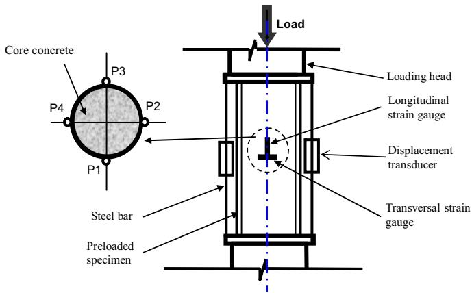  
Fig. 2. Test method.

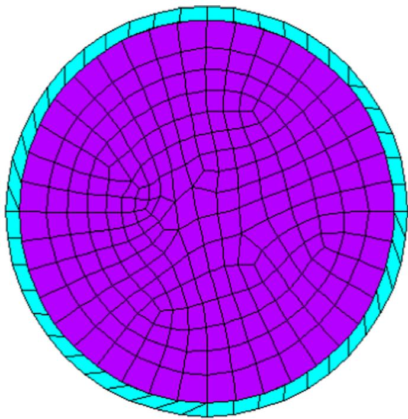  
Fig. 3. Discretization of CFST column cross-sections.

However, at a high preloading ratio $\beta = 0 . 5$ ), the UL decreases and the corresponding axial displacement increases except the short specimen which benefits from confinement effect. Therefore, high preloading ratio reduces the UL of CFST columns. In engineering practice, it would be better to keep the preloading ratio not too high.

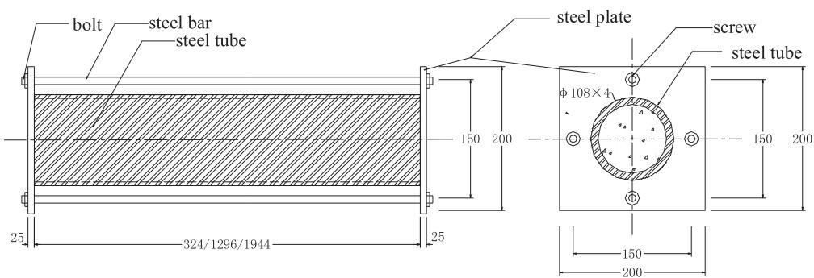  
Fig. 1. Preloading device (unit: mm).

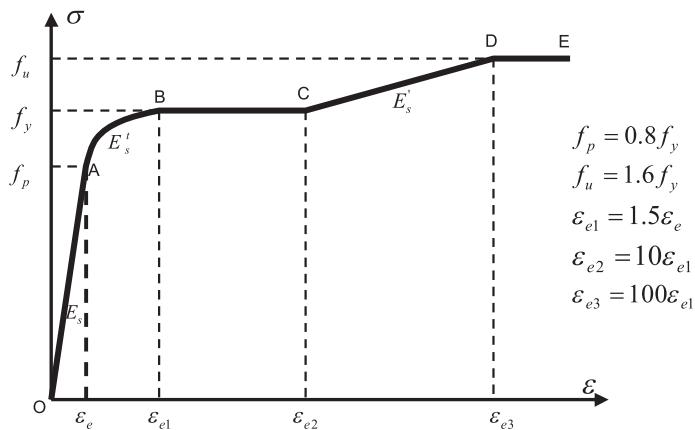  
Fig. 4. Stress–strain relationship of steel.

# 2.2. Finite element modelling

# 2.2.1. Finite element and material properties

The Beam188 beam element of the commercial software ANSYS (2011) [18] was adopted for numerical analysis on the CFST columns with preloading for both of steel tube and core concrete.

Beam188 element is a special and effective element for simulating and meshing arbitrary shaped section with more than one material. Each concrete and steel tube beam element shares a node. Therefore, the meshing points of segments at the interface of the concrete and steel tube are not necessary to couple with each other, which will be avoided to exert the complex interface implementation and simplified the model significantly compare to solid model. The cross section of the element is discretized into a number of Plane82 segments (42 for the tube section and 283 for the concrete section), as shown in Fig. 3.

It is assumed that there is no relative slippage between the steel tube and the concrete core. The stress–strain relationship of steel is assumed to follow a 5-segment polygonal curve which includes phases of linear elastic, elasto-plastic, plastic, strain hardening and second plastic flow (see Fig. 4).

The segmented constitutive relationship of confined concrete proposed by Han (2000) [19] was adopted for the concrete core modelling. The details are as follows:

$$
\left\{ \begin{array}{l} \sigma = \sigma_ {c} \left[ A \times \left(\varepsilon / \varepsilon_ {c}\right) - B \left(\varepsilon / \varepsilon_ {c}\right) ^ {2} \right] \quad (\text {i f} \varepsilon \leq \varepsilon_ {c}) \\ \sigma = \sigma_ {c} (1 - q) + \sigma_ {c} \times q \times \left(\varepsilon / \varepsilon_ {c}\right) ^ {0. 1 \xi} \quad (\text {i f} \varepsilon > \varepsilon_ {c}) \end{array} \right. \quad (\xi \geq 1. 1 2) \tag {3}
$$

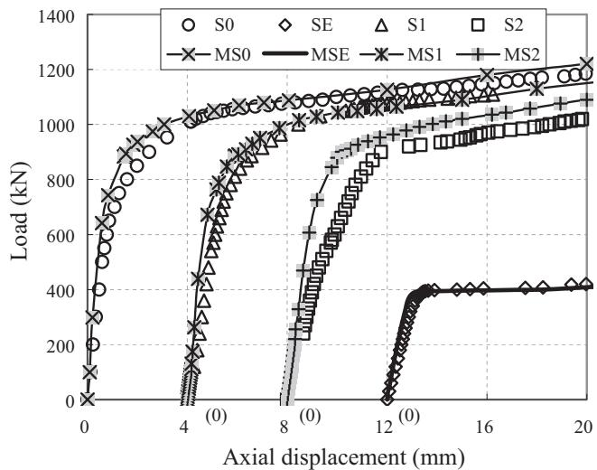  
a

  
b

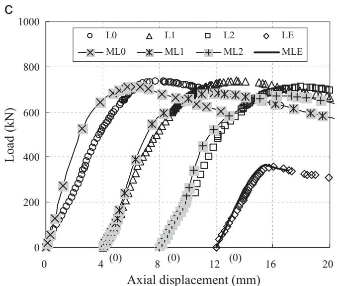  
Fig. 5. Comparison of test and modelling results.

Table 3 The eccentrically loaded specimens tested by Ref. [4].   

<table><tr><td>Specimen</td><td>Section (mm)</td><td>Number of specimen</td><td>L (mm)</td><td>Eccentricity e (mm)</td><td>λ</td><td>β</td><td>NTestu(KN)</td><td>NfEMu(KN)</td></tr><tr><td>SB-0</td><td>133 × 4.5</td><td>3</td><td>465</td><td>50</td><td>14</td><td>0.0</td><td>630*</td><td>621</td></tr><tr><td>SB-1</td><td></td><td>1</td><td></td><td></td><td></td><td>0.21</td><td>629</td><td>618</td></tr><tr><td>SB-2</td><td></td><td>1</td><td></td><td></td><td></td><td>0.30</td><td>627</td><td>612</td></tr><tr><td>SB-3</td><td></td><td>1</td><td></td><td></td><td></td><td>0.39</td><td>625</td><td>609</td></tr><tr><td>SB-4</td><td></td><td>1</td><td></td><td></td><td></td><td>0.48</td><td>614</td><td>603</td></tr><tr><td>SB-5</td><td></td><td>1</td><td></td><td></td><td></td><td>0.43</td><td>618</td><td>605</td></tr><tr><td>IB-0</td><td></td><td>1</td><td>1670</td><td></td><td>50</td><td>0.0</td><td>438</td><td>452</td></tr><tr><td>IB-1</td><td></td><td>1</td><td></td><td></td><td></td><td>0.22</td><td>430</td><td>446</td></tr><tr><td>IB-2</td><td></td><td>1</td><td></td><td></td><td></td><td>0.42</td><td>416</td><td>436</td></tr><tr><td>LB-0</td><td></td><td>2</td><td>2730</td><td>66</td><td>82</td><td>0.0</td><td>306*</td><td>304</td></tr><tr><td>LB-1</td><td></td><td>1</td><td></td><td></td><td></td><td>0.22</td><td>293</td><td>293</td></tr><tr><td colspan="2">Standard deviation of NfEMu/Ntestu</td><td></td><td></td><td></td><td></td><td></td><td></td><td>0.0269</td></tr></table>

* Average value.

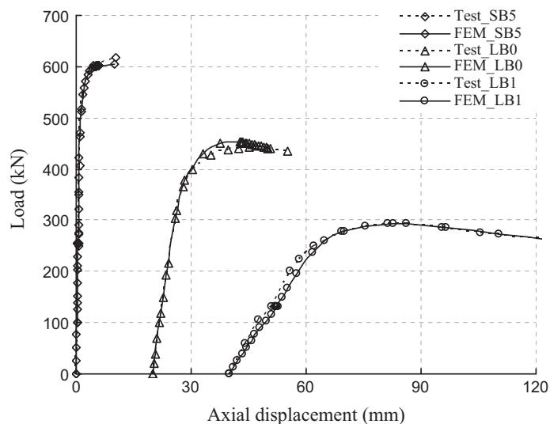  
Fig. 6. Comparison of test and predicted results of SB-5, LB-0, LB-1.

$$
\xi = \left(A _ {s} f _ {y}\right) / \left(A _ {c} f _ {c}\right) \tag {4}
$$

$$
\sigma_ {c} = f _ {c} \times [ 1. 1 9 4 + (1 3 / f _ {c k}) ^ {0. 4 5} \times (- 0. 0 7 4 8 5 \xi^ {2} + 0. 5 7 8 9 \xi) ] \tag {5}
$$

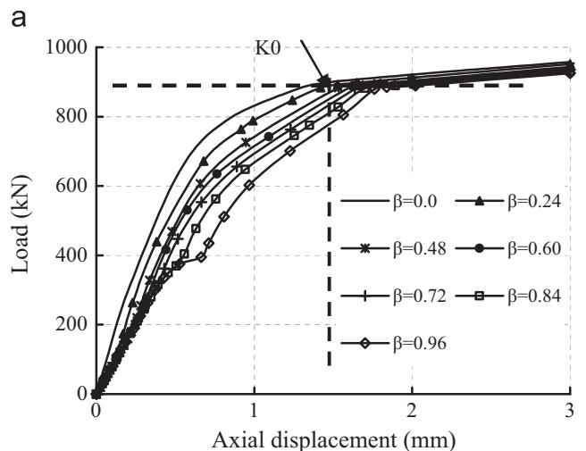

$$
\varepsilon_ {c} = \varepsilon_ {c c} + [ 1 4 0 0 + 8 0 0 (f _ {c} - 2 0) / 2 0 ] \xi^ {0. 2} \times 1 0 ^ {- 6} \tag {6}
$$

$$
\varepsilon_ {c c} = \left(1 3 0 0 + 1 4. 9 3 f _ {c}\right) \times 1 0 ^ {- 6} \tag {7}
$$

$$
q = k / (0. 2 + 0. 1 \xi) \tag {8}
$$

$$
A = 2 - k \tag {9}
$$

$$
B = 1 - k \tag {10}
$$

$$
k = 1 - 0. 1 \xi^ {0. 7 4 5} \tag {11}
$$

where, $f _ { c }$ is the characteristic compressive strength of concrete.

Similar to Han & Yao (2003) [5], a longitudinal imperfection of $L / 1 0 0 0$ is also considered. The Arc-Length iterative method is employed to capture the post-UL response.

The initial stressing condition is achieved by inactivating the concrete elements before the preload is fully applied, after which the concrete elements are activated to resist subsequent loads together with the tube.

# 2.2.2. Validation of FEM

2.2.2.1. Current test in this paper. The load–displacement

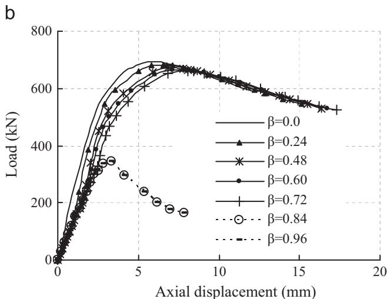  
Fig. 7. Preloading influence on the load capacity of CFST columns.

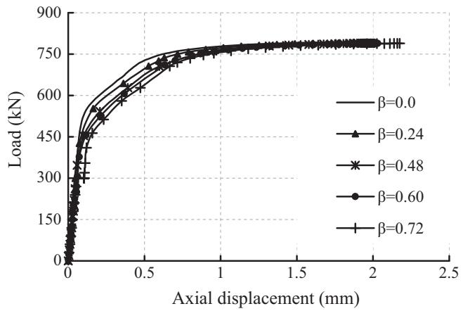  
a

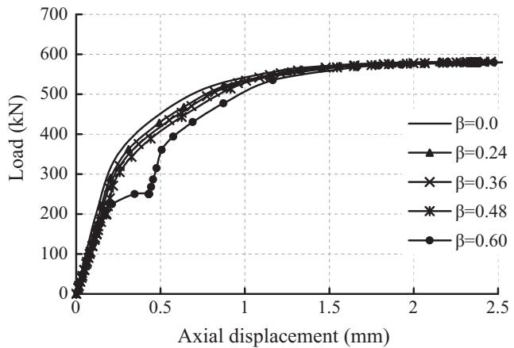  
b

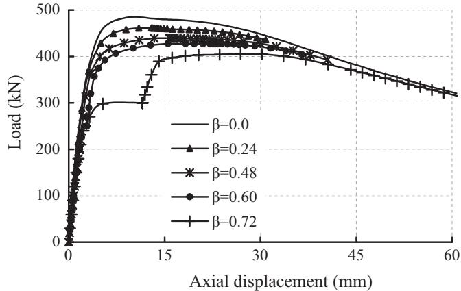  
C

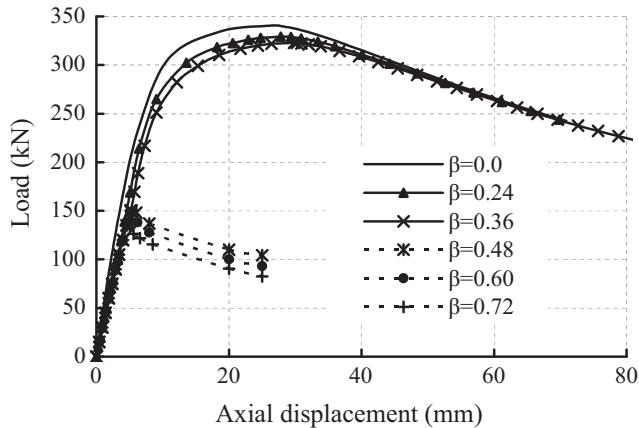  
d   
Fig. 8. Preloading influence on UL.

relationships measured from the tests and calculated by FEM are plotted in Fig. 5a–c. In order to make the comparison clearer, the curves in the figures are arbitrarily separated by a displacement offset of $4 \mathrm { m m }$ one by one. The predicted UL are also given in Table 1.

It can be seen that the predicted results for empty tubes agree very well with test results, but the accuracy of FE model of CFST specimens decrease while core concrete is involved. It was observed that the intermediate and long specimens started to develop lateral deformation at early stage of loading. Even though, the standard deviation of the ratio of the testing results to FE modelling is $5 . 6 1 \%$ , which means a reasonable agreement.

2.2.2.2. Zhang's (1997) test. The accuracy of the proposed FE model on eccentrically loaded CFST columns with preload is validated by modelling the tests conducted by Zhang et al. (1997) [4]. In the test, 14 specimens were fabricated in three lengths: short $( 4 6 5 \mathrm { m m } )$ , intermediate $1 6 7 0 \mathrm { m m } )$ and long $( 2 7 3 0 \mathrm { m m } )$ ). The geometric details of the specimens are given in Table 3. The material properties used in modelling are as follows:

Steel: $f _ { v } = 3 2 5 \mathrm { M P a }$ , $E _ { a } = 2 \times 1 0 ^ { 5 } \mathrm { M P a }$ , $\nu _ { a } = 0 . 2 8 6$ ;

Concrete: $f _ { c u } = 4 2 . 2 \mathrm { M P a }$ , $E _ { c } = 3 . 2 5 \times 1 0 ^ { 4 } \mathrm { M P a }$ , $\nu _ { c } = 0 . 1 6 7$

All the specimens are modelled with current FEM procedure and the results are listed in Table 3. Only the load-displacement curves of one each of the short (SB-5), intermediate (A120) and long (A202) specimens are shown in Fig. 6, in order to save space. Good agreement between modelling and test is achieved by separated arbitrarily with a displacement offset of $2 0 \mathrm { m m }$ one by one.

# 3. Parametric study on the UL reduction of CFST columns with preload by FEM

Previous studies show that the current FEM can predict the ultimate load capacities of CFST columns well with various preloading ratios, either concentrically or eccentrically load. Therefore, this FEM is used to carry out parametric study on the coupling influence of preloading ratios together with other parameters such as slenderness ratios, eccentricity ratios, and material properties. The cross-sectional parameters used in Section 2 are reused here.

# 3.1. Parametrical preloading ratio of $\beta$

# 3.1.1. The concentrically loaded CFST columns

The numerical analyses of axial loaded CFST columns with various preload are conducted. As examples, one short $\lambda = 1 2 ^ { \cdot }$ ) and one long ( $\lambda = 7 2$ ) CFST columns subjected to concentric loading are modelled with various preloading ratios. The numerical results are shown in Fig. 7a and b.

Because the preload is applied to the tube only, the stiffness of a preloaded column is initially less than a non-preloaded one. The stiffness increases at subsequent loading because the concrete core starts to work. For short columns, preload accelerates the plastic development, especially when the preloading ratio is high. When the preloading ratio (i.e., $\beta = 0 . 8 4$ and $\beta = 0 . 9 6$ ) exceeds the proportion limit of steel (about $0 . 8 f _ { y }$ ) the tube undergoes plastic deformation so that the displacement increases rapidly. However, this situation actually would never happen in engineering practice.

In Fig. 7a, the point $K _ { 0 }$ of the column without preload that is

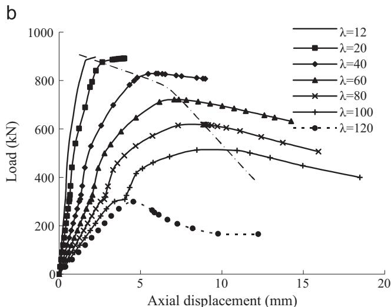  
Fig. 9. Effect of slenderness ratios on UL.

shown at the cross point with two dashed lines, is relevant to $0 . 3 \%$ of steel strain. $K _ { 0 }$ moves downwards with the increase of preloading ratio as marked by the vertical dash line. However, the UL of all preloading ratios do not differ too much (within $1 \%$ ). Therefore, preload does not affect the UL of short CFST column, which agrees with Yang & Han (2009) [7] and Patel et al. (2013) [15]. It also indicates that $0 . 3 \%$ of strain is not an appropriate representative indicator of the UL of CFST columns with preload, especially when the preloading ratio is high. Fig. 7b shows that the influence of preloading on long columns is more significant than on short columns. Preloading reduces the UL and increases the corresponding axial displacements. When $\beta \ge 0 . 8 4$ , the column fails by overall buckling, and which is prohibited.

# 3.1.2. The eccentrically loaded CFST column

The previous cases are used again to further understand the influence of eccentricity. Two eccentricity ratios, 0.1 and 0.4, are presented and the numerical results are plotted on Fig. 8a–d. It can be seen from the figures that the preloading effects on eccentrically or concentrically loaded CFST columns are similar: (a) preloading has very little influence on the UL of short columns; (b) preloading accelerates the plastic response of the columns, the displacement at UL also increases; (c) excessive preloading, e.g., $\rho = 0 . 1 \oplus \beta = 0 . 7 2$ and $\rho = 0 . 4 \oplus \beta = 0 . 6 0$ , makes the steel tube enter plastic phase even at preloading stage, therefore should be avoided in engineering practice.

For slender columns (Fig. 8c and d), compared with concentric

loading, eccentric loading intensifies the stress imbalance in the steel tube and therefore further degrades the buckling resistance of the columns, consequently, the UL decreases and the deformation increases. This trend accelerates with increase of preloading ratio. For example, in the case of long column with $\rho = 0 . 1 \oplus \lambda = 7 2$ , when $\beta = 0 . 7 2$ , the UL reduction reaches up to $2 0 \%$ and the axial displacement increases to $3 0 . 2 2 \mathrm { m m }$ from $9 . 0 9 \mathrm { m m }$ when no preloading is applied.

# 3.2. Slenderness ratio of λ

Fig. 9 is the load–displacement curves of different slenderness ratios of CFST columns with initial stress that are modelled. As an example, numerical results are plotted on Fig. 9a and b for two preloading ratios, 0.0 and 0.72. It can be seen from the figures that the ULs reduce and the corresponding deformations enlarge with the increase of slenderness ratio despite with or without initial stress. However, because the preloading ratio accelerates the plastic response, thus the displacement of the columns with initial stress is larger than the columns without initial stress that can be seen from the dash dotted lines of Fig. 9. Furthermore, the larger slenderness, the more distinct influence by initial stress.

# 3.3. Eccentricity ratio of $\rho$

Fig. 10 is the load–displacement curves of different eccentricity ratios of CFST columns. And also, for example, numerical results are plotted on Fig. 10a and b for both two preloading ratios of 0.0, 0.24 and two slenderness ratios of 12, 72, respectively. It can be seen from the figures that the ULs reduce with the increase of eccentricity ratio. Whereas for short columns the corresponding deformations enlarges with the increasing of eccentricity ratios (see Fig. 10a), but for long columns they are going up to maximum, and then going down (see Fig. 10b). Moreover, the displacement of the columns with initial stress is larger than the columns without initial stress because the preloading accelerates the plastic response. Nevertheless, if there are large eccentricity ratio, the preloading must be controlled, otherwise the tube will be buckled that can be seen from the dotted lines of Fig. 10, which should be restricted.

# 3.4. Concrete strength grades

To examine the concrete type influence on CFST columns with preload, a number of CFST columns filled with four grades of concrete (C30, C40, C50 and C60) with three length diameter ratios (12, 48 and 72) were studied numerically, and the numerical results are plotted in Fig. 11a–c, respectively. The rough parallelism of UL to preloading ratio curves with different grades of concrete in the figures indicates that the concrete strength effect is negligible. This agrees well with the conclusion in Han et al. (2003) [5]. Therefore, the concrete property effect is not considered in this parametric study.

# 3.5. The coupling influence of UL of CFST columns with preload

In order to have a complete coverage of possible configurations, the parameters studied here are as follows:

1. Steel: Q235, Q345 and Q390;   
2. Concrete: C50;   
3. β: 0, 0.1, 0.2, 0.3, 0.4, 0.5, 0.6, 0.7, 0.8;   
4. λ: 20, 40, 60, 80, 100, 120;   
5. ρ: 0, 0.05, 0.10, 0.20, 0.40, 0.60, 0.80, 1.0, 2.0.

Using the prescribed parameter range, a total of 327 effective

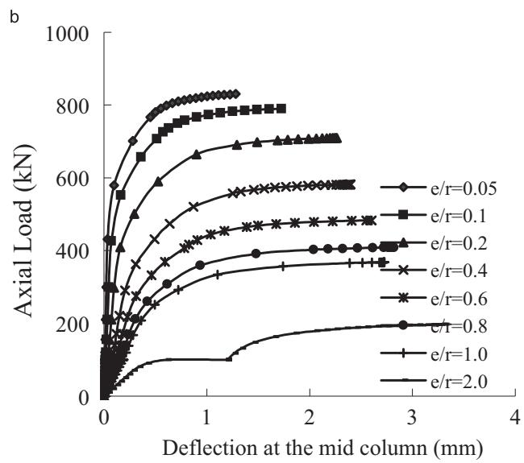

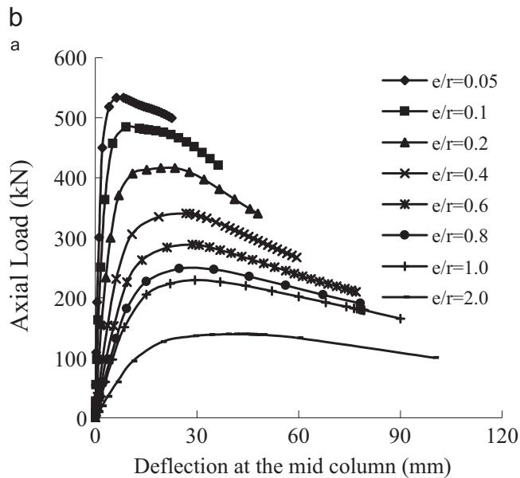

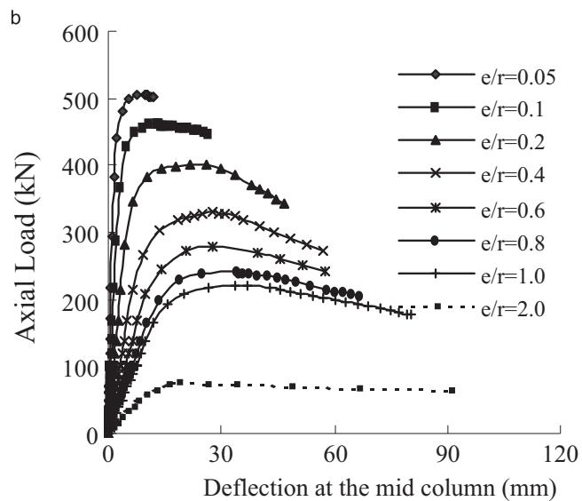  
Fig. 10. a. Effect of eccentricity ratios on UL of CFST columns $\lambda = 1 2$ ). b. Effect of slenderness ratios on UL of CFST columns $\lambda = 7 2$ ).

cases with various parameter combinations are modelled with current FE procedure. A number of data are extracted from the results to understand the influence on the UL of CFST columns with preload under different steel properties. As a simple example, the curves of UL reduction factors to preloading ratios of a CFST column ( $\lambda = 4 0$ , $\rho = 0 . 2$ ) are presented, as shown in Fig. 12. It is clear that preloading influence is more significant for higher grade of steel, and this influence increases with preloading ratio. This can be contributed to the relative strength between the steel and the concrete infill.

# 4. Development of simplified method for calculating the preloading reduction of UL

# 4.1. Calculating method of preloading reduction factor of UL

Generally, the UL calculation of CFST column with preloading, $N _ { u } ^ { \beta }$ , can be calculated by employing a strength reduction factor of preload, $k _ { p }$ , to multiply, $N _ { u } ^ { \beta = 0 }$ . That is

$$
N _ {u} ^ {\beta} = k _ {p} N _ {u} ^ {\beta = 0} \tag {12}
$$

Therefore, $k _ { p }$ , the preloading reduction factor is the mainly concerned in this paper, rather than the UL of CFST without preload because the $N _ { u } ^ { \beta = 0 }$ in Eq. (12) has been studied widely and also already can be calculated by using several Specifications like EU4, ACI 318-85 and DL/T 5085-1999.

Based on the parametric study in Section 3.5, the preloading reduction factor of UL of CSFT columns with preload that was regressively derived can be approximated as

$$
k _ {p} = - 0. 0 1 5 8 \cdot a \cdot m \cdot \beta^ {2} - 0. 0 8 4 7 \cdot b \cdot n \cdot \beta + 1. 0 \tag {13}
$$

where, $\left\{ { \begin{array} { l } { a = 3 . 3 5 2 { \cdot } { \lambda _ { 0 } ^ { 2 } } } \\ { b = 0 . 9 8 6 { \cdot } { \lambda _ { 0 } } } \end{array} } \right.$ when $\lambda _ { 0 } \leq 1$ , and $\left. b = 0 . 9 8 6 { \cdot } \lambda _ { 0 } \right.$

$$
\left\{ \begin{array}{l} a = 1. 7 6 8 \cdot \lambda_ {0} \\ b = 1. 0 6 3 \cdot \lambda_ {0} \end{array} \text {w h e n} \lambda_ {0} > 1 \right. \tag {14}
$$

where, $\left\{ \begin{array} { l } { m = e ^ { \rho ^ { 0 . 0 3 9 2 } } } \\ { n = e ^ { 1 . 2 0 9 \cdot \rho ^ { 0 . 0 9 8 } } } \end{array} \right.$ when $\rho \leq 0 . 8$ , and ⎪ 1.209 0.098⋅ρ

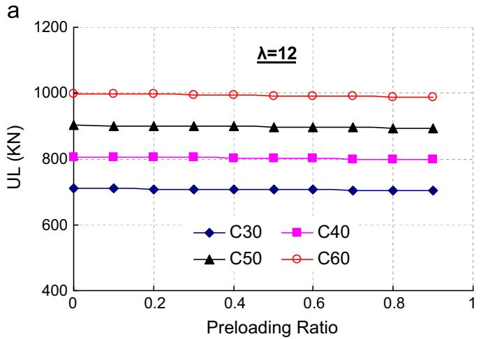

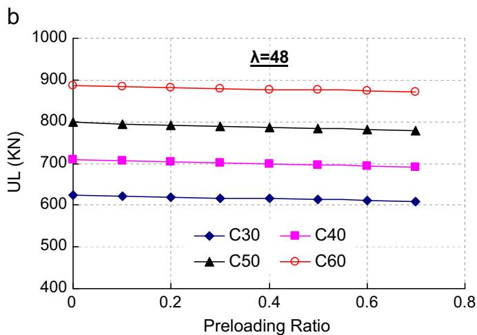

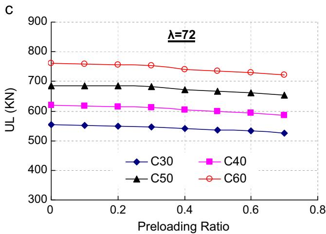  
Fig. 11. a. Effect of concrete strength on UL reduction of CFST columns $\lambda = 1 2$ ). b. Effect of concrete strength on UL reduction of CFST columns $\lambda = 4 8$ ). c. Effect of concrete strength on UL reduction of CFST columns $. \lambda = 7 2$ ).

$$
\left\{ \begin{array}{l} m = 0. 1 0 3 \cdot \rho + 2. 5 9 5 \\ n = 0. 3 8 2 \cdot \rho + 2. 9 0 5 \end{array} \text {w h e n} \rho > 0. 8 \right. \tag {15}
$$

and,

$$
\lambda_ {0} = \lambda / \lambda_ {p} \tag {16}
$$

where $\lambda _ { p }$ is the critical elastic buckling slenderness of hollow steel tube that depends on the type of steel only. That is, $\lambda _ { p }$ equals to 100, 80 and 75 for steel types Q235, Q345 and Q390, respectively.

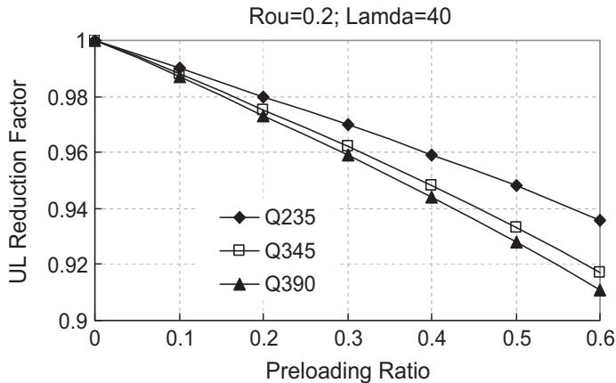  
Fig. 12. Effect of steel grade on UL reduction of CFST columns with preloading.

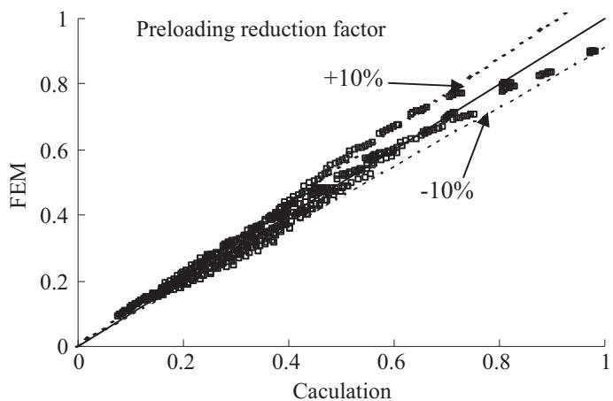  
Fig. 13. Comparison of $k _ { p }$ , predicted by FEM and the current simplified method.

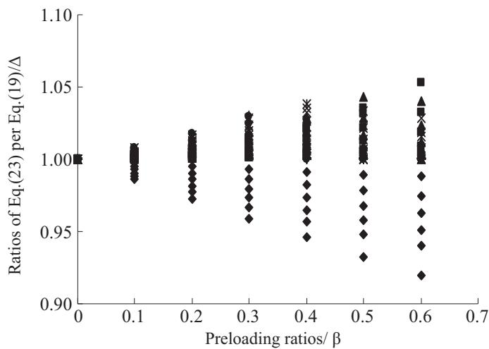  
Fig. 14. Comparison between Eqs. (23) and (19).

It can be seen from the comparison in Fig. 13 that the $k _ { p }$ predicted by Eq. (13) agrees well with those predicted by FEM. The difference is approximately within $1 0 \%$ .

Eq. (13) has been implemented in the update code of DBJ/T13- 136-2011(2011) [20], China, but it is somewhat complex yet. It can be also seen from Fig. 12 that the preloading reduction factors are linear while the preloading ratios are limited to 0.6. Therefore, in order to further simplify the calculation of $K _ { p }$ , based on the

Table 4 Total tests and corresponding calculated results by the current simplified RF methods.   

<table><tr><td rowspan="2">Literatures</td><td rowspan="2">Label</td><td rowspan="2">Slenderness ratio λ</td><td rowspan="2">Eccentricity ratio ρ</td><td rowspan="2">Preloading ratio β</td><td colspan="3">Kp</td></tr><tr><td>Tests</td><td>Eq. (13)</td><td>Eq. (17)</td></tr><tr><td rowspan="9">[12]</td><td>S-0</td><td>12</td><td>0.0</td><td>0.0</td><td>1.000</td><td>1.000</td><td>1.000</td></tr><tr><td>S-1</td><td>12</td><td>0.0</td><td>0.25</td><td>0.979</td><td>0.997</td><td>0.991</td></tr><tr><td>S-2</td><td>12</td><td>0.0</td><td>0.54</td><td>0.960</td><td>0.993</td><td>0.981</td></tr><tr><td>I-0</td><td>48</td><td>0.0</td><td>0.0</td><td>1.000</td><td>1.000</td><td>1.000</td></tr><tr><td>I-1</td><td>48</td><td>0.0</td><td>0.25</td><td>1.013</td><td>0.986</td><td>0.965</td></tr><tr><td>I-2</td><td>48</td><td>0.0</td><td>0.50</td><td>0.920</td><td>0.970</td><td>0.931</td></tr><tr><td>L-0</td><td>72</td><td>0.0</td><td>0.0</td><td>1.000</td><td>1.000</td><td>1.000</td></tr><tr><td>L-1</td><td>72</td><td>0.0</td><td>0.24</td><td>0.996</td><td>0.979</td><td>0.950</td></tr><tr><td>L-2</td><td>72</td><td>0.0</td><td>0.48</td><td>0.956</td><td>0.954</td><td>0.900</td></tr><tr><td rowspan="11">[1]</td><td>CS-40-30</td><td>12.93</td><td>0.0</td><td>0.25</td><td>-</td><td>0.997</td><td>0.991</td></tr><tr><td>CS-100-0</td><td>12.93</td><td>0.0</td><td>0.0</td><td>1.000</td><td>1.000</td><td>1.000</td></tr><tr><td>CS-100-30</td><td>12.93</td><td>0.0</td><td>0.25</td><td>0.863</td><td>0.997</td><td>0.991</td></tr><tr><td>CI-40-30</td><td>31.56</td><td>0.0</td><td>0.30</td><td>-</td><td>0.989</td><td>0.973</td></tr><tr><td>CI-100-0</td><td>31.56</td><td>0.0</td><td>0.0</td><td>1.000</td><td>1.000</td><td>1.000</td></tr><tr><td>CI-100-30</td><td>31.56</td><td>0.0</td><td>0.31</td><td>1.060</td><td>0.989</td><td>0.972</td></tr><tr><td>CI-130-40</td><td>31.56</td><td>0.0</td><td>0.38</td><td>-</td><td>0.986</td><td>0.965</td></tr><tr><td>CL-40-30</td><td>56.22</td><td>0.0</td><td>0.31</td><td>-</td><td>0.980</td><td>0.950</td></tr><tr><td>CL-100-0</td><td>56.22</td><td>0.0</td><td>0.0</td><td>1.000</td><td>1.000</td><td>1.000</td></tr><tr><td>CL-100-30</td><td>56.22</td><td>0.0</td><td>0.31</td><td>-</td><td>0.979</td><td>0.950</td></tr><tr><td>CL-130-40</td><td>56.22</td><td>0.0</td><td>0.40</td><td>-</td><td>0.972</td><td>0.935</td></tr><tr><td rowspan="6">[22]</td><td>D-1</td><td>28</td><td>0.128</td><td>0.44</td><td>-</td><td>0.962</td><td>0.963</td></tr><tr><td>D-2</td><td>28</td><td>0.128</td><td>0.57</td><td>-</td><td>0.950</td><td>0.952</td></tr><tr><td>D-3</td><td>50</td><td>0.0</td><td>0.50</td><td>-</td><td>0.969</td><td>0.928</td></tr><tr><td>D-4</td><td>50</td><td>0.0</td><td>0.47</td><td>-</td><td>0.971</td><td>0.932</td></tr><tr><td>D-5</td><td>23</td><td>0.154</td><td>0.65</td><td>0.840</td><td>0.953</td><td>0.954</td></tr><tr><td>D-6</td><td>23</td><td>0.0</td><td>0.0</td><td>1.000</td><td>1.000</td><td>1.000</td></tr><tr><td rowspan="8">[3]</td><td>IA-0</td><td>56</td><td>0.0</td><td>0.0</td><td>1.000</td><td>1.000</td><td>1.000</td></tr><tr><td>IA-1</td><td>56</td><td>0.0</td><td>0.0</td><td>1.000</td><td>1.000</td><td>1.000</td></tr><tr><td>IA-2</td><td>56</td><td>0.0</td><td>0.28</td><td>0.998</td><td>0.982</td><td>0.955</td></tr><tr><td>IA-3</td><td>56</td><td>0.0</td><td>0.4</td><td>0.809</td><td>0.972</td><td>0.935</td></tr><tr><td>LA-0</td><td>84</td><td>0.0</td><td>0.0</td><td>1.000</td><td>1.000</td><td>1.000</td></tr><tr><td>LA-1</td><td>84</td><td>0.0</td><td>0.0</td><td>1.000</td><td>1.000</td><td>1.000</td></tr><tr><td>LA-2</td><td>84</td><td>0.0</td><td>0.25</td><td>1.049</td><td>0.975</td><td>0.940</td></tr><tr><td>LA-3</td><td>84</td><td>0.0</td><td>0.40</td><td>-</td><td>0.957</td><td>0.903</td></tr><tr><td rowspan="10">[4]</td><td>IB-0</td><td>50</td><td>0.752</td><td>0.0</td><td>1.000</td><td>1.000</td><td>1.000</td></tr><tr><td>IB-1</td><td>50</td><td>0.752</td><td>0.22</td><td>0.982</td><td>0.960</td><td>0.958</td></tr><tr><td>IB-2</td><td>50</td><td>0.752</td><td>0.42</td><td>0.950</td><td>0.919</td><td>0.921</td></tr><tr><td>IB-3</td><td>50</td><td>0.752</td><td>0.58</td><td>0.941</td><td>0.883</td><td>0.890</td></tr><tr><td>IB-4</td><td>50</td><td>0.902</td><td>0.23</td><td>-</td><td>0.958</td><td>0.954</td></tr><tr><td>IB-5</td><td>50</td><td>0.902</td><td>0.42</td><td>-</td><td>0.919</td><td>0.917</td></tr><tr><td>LB-0</td><td>82</td><td>0.902</td><td>0.0</td><td>1.000</td><td>1.000</td><td>1.000</td></tr><tr><td>LB-1</td><td>82</td><td>0.902</td><td>0.22</td><td>0.958</td><td>0.930</td><td>0.929</td></tr><tr><td>LB-2</td><td>82</td><td>0.902</td><td>0.41</td><td>0.922</td><td>0.864</td><td>0.867</td></tr><tr><td>LB-3</td><td>82</td><td>0.902</td><td>0.59</td><td>0.876</td><td>1.000</td><td>0.808</td></tr></table>

Notes: ‘–‘ denotes that there do not acquire testing result.

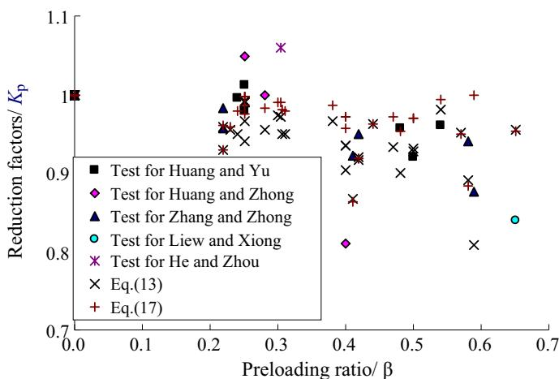  
Fig. 15. Demonstration of total tests and current simplified RF evaluated methods, $K _ { p }$ .

parametric study, a more simplified method formula is presented as follows,

$$
K _ {p} = 1 - 0. 2 4 \cdot f \left(\lambda_ {0}\right) \cdot f (\rho) \cdot \beta \tag {17}
$$

where,

$$
\left\{ \begin{array}{l} f \left(\lambda_ {0}\right) = \lambda_ {0} = \lambda / \lambda_ {p} \\ f (\rho) = 0. 2 \cdot \rho + 0. 9 8 \end{array} \right. \tag {18}
$$

Fig.14 shows the result of ratio ‘ Δ’ of Eq.(17) to Eq.(13) that is shown in Eq.(19). Eq.(19) means that if the ratios of ‘Δ’ are closer to 1.0, then the Eqs. (13) and (17) agree well with each other.

It is revealed in Fig. 14 that the ratios of $\cdot _ { \varDelta } .$ from Eq. (19) are close to 1.0, their average and deviation are 0.96 and 0.024, respectively, and their range are 0.91–1.05. Nevertheless, the difference of $\cdot _ { \varDelta } ,$ will be larger with the increase of preloading ratio because of the linear relationship for Eq. (17), and which will be up to $1 0 \%$ while the preloading ratios are over 0.6. Considering the preloading ratio is usually limited to 0.6, the further simplified

method of $K _ { p } ,$ , Eq. (17), can be used to calculate the preloading RF of UL.

$$
\Delta = K _ {p} / k _ {p} \tag {19}
$$

# 4.2. Comparison between test results and simplified method of RF

Table 4 and Fig.15 are the comparison and demonstration of total tests [1,3,4,12,21] and corresponding evaluation by using the current simplified RF method. It can be seen that RF of $K _ { p }$ predicted by Eqs. (13) and (17) agrees well with those test results. The averages for Eqs. (13) and (17) per test results are roughly 0.997 and 0.989, respectively, and the deviations are 0.050 and 0.052. Both the average and deviation are satisfied very well. The Eq. (17) has been accepted by the up-to-date National Specification of Design of CFST Arch Bridge (GB 50923, 2014) [22] in China, and can be referenced to other specifications.

# 5. Conclusions

CFST columns with preloading ratios of about 0.0, 0.25 and 0.5 were tested. The results show that preloading effect decreases with the increase of slenderness; light preloading does not have much influence the ultimate load capacity but increase the corresponding deformation.

A FEM procedure based on ANSYS was used to carry out numerical analysis on CFST columns. A five-segment polygonal curve of stress–strain relationship for steel and a segmental constitutive relationship for confined concrete were adopted in the numerical modelling. It shows that FEM modelling agrees well with test results.

The FEM procedure was further used to study the coupling influence of length, diameter ratio, eccentricity and material properties on the UL of CFST columns with preload. Finally, a simplified method is proposed based on the parametric study to calculate the preloading reduction factor of ultimate load capacities of CFST columns.

It is concluded from this research that:

The structural responses of concentrically and eccentrically loaded short CFST columns with preload are similar. Small preloading ratio does not affect the UL and stiffness of CFST columns; but, high preloading ratio decreases the UL and increases the deformation significantly. Larger slenderness and eccentric loading further intensify the effect, and reduces the UL up to $2 0 \%$ .

Preloading influence is more significant for higher grade of steel, and this effect increases with preloading ratio.

The UL reduction factor of simplified method obtained from regressive analysis can be used to evaluate the UL of CFST columns with preload, and which has been also verified with good satisfactory by compared with the testing results.

It is better to restrict the preloading ratio as less as possible in engineering practice to mitigate the preloading influence.

# Acknowledgement

I would like to appreciate with Professor Ian G. Buckle,

University of Nevada, Reno, who gives a lot of advises for the paper. The researches were funded by national NSFC project, 51208111 and Fujian Provincial Project, 2013J05071, China.

# Appendix A. Supplementary material

Supplementary data associated with this article can be found in the online version at http://dx.doi.org/10.1016/j.tws.2015.10.015.

# References

[1] J.Y.R. Liew, D.X. Xiong, Effect of preload on the axial capacity of concrete-filled composite columns, J. Constr. Steel Res. 65 (2009) 709–722.   
[2] B.C. Chen, Examples of Concrete Filled Steel Tubular Arch Bridges (II), China Communication Press, Beijing, 2008 (in Chinese).   
[3] S.J. Huang, S.T. Zhong, S.Z. Yan, H.L. Cao, Experimental research of pre-stress effect on bearing capacity of concrete filled steel tubular axial compressive members, J. Harbin Univ. C.E. Archit. 29 (6) (1996) 44–50 (in Chinese).   
[4] X.Q. Zhang, S.T. Zhong, S.Z. Yan, W. Lin, H.L. Cao, Experimental study about the effect of initial stress on bearing capacity of concrete filled steel tubular members under eccentric compression, J. Harbin Univ. C.E. Archit. 30 (1) (1997) 50–56 (in Chinese).   
[5] L.H. Han, G.H. Yao, Behaviour of concrete-filled hollow structural steel (HSS) columns with pre-load on the steel tubes, J. Constr. Steel Res. 59 (2003) 1455–1475.   
[6] D.X. Xiong, X.X. Zha, A numerical investigation on the behaviour of concretefilled steel tubular columns under initial stresses, J. Constr. Steel Res. 63 (2007) 599–611.   
[7] Y.F. Yang, L.H. Han, Experiments on rectangular concrete-filled steel tubes loaded axially on a partially stressed cross-sectional area, J. Constr. Steel Res. 65 (2009) 1617–1630.   
[8] DL/T5085-1999, China Electric Power Industry Standard: Design Specifications for Steel-Concrete Composite Structures, China Electric Power Press, China, 1999 (in Chinese).   
[9] DBJ13-51-2003, Technical Specifications for CFST Structures, Construction Specifications of Fujian Province, China, 2003 (in Chinese).   
[10] J. Huo, X. Zeng, Y. Xiao, Cyclic behaviours of concrete-filled steel tubular columns with pre-load after exposure to fire, J. Constr. Steel Res. 67 (2011) 727–739.   
[11] W. Li, L.H. Han, X.L. Zhao, Axial strength of concrete-filled double skin steel tubular (CFDST) columns with preload on steel tubes, Thin-Walled Struct. 56 (2012) 9–20.   
[12] F.Y. Huang, X.M. Yu, B.C. Chen, The structural performance of axially loaded CFST columns under various loading conditions, Steel Compos. Struct. 13 (5) (2012) 451–471.   
[13] Y.L. Shi, S. Wang, W.D. Wang, Research on behavior of the joint with concretefilled steel tubular column under pre-load in steel tube, J. Civ. Archit. Environ. Eng. 34 (6) (2012) 19–24 (in Chinese).   
[14] Y. Li, J.H. Zhao, W.B. Liang, S. Wang, Unified solution of bearing capacity for concrete-filled steel tube columns with initial stress under axial compression, J. Civ. Archit. Environ. Eng. 35 (3) (2013) 63–69 (in Chinese).   
[15] V.I. Patel, Q.Q. Liang, M.N.S. Hadi, Numerical analysis of circular concrete-filled steel tubular slender beam-columns with preload effects, Int. J. Struct. Stab. Dyn. 13 (3) (2013) 1250065-1–1250065-23.   
[16] ACI 318-85, Building Code Requirements for Structural Concrete and Commentary, Farmington Hills, American Concrete Institute, Detroit, USA, 1985.   
[17] Eurocode 4, BS EN 1994-1-1, Design of Composite Steel and Concrete Structures, Part 1.1: General Rules and Rules for Buildings, Commission of European Communities, Brussels, 2004.   
[18] A.N.S.Y.S.Inc, Theory Reference Releases 12.1, 2011.   
[19] L.H. Han, Modern CFST Structures, Science and Technology Press, Beijing, 2000 (in Chinese).   
[20] GB50923, Technical Code of Concrete Filled Steel Tube Arch Bridges, China Planning Press, Beijing, China, 2014 (in Chinese).   
[21] DBJ/T13-136-2011, Technical Specifications for CFST Arch Structures, Construction specifications of Fujian Province, China, 2011 (in Chinese).   
[22] X. He, S.X. Zhou, W.S. Wang, Experimental study on load bearing capacity of concrete filled steel tube members with initial stress, Mod. Transp. Technol. 3 (6) (2006) 38–42 (in Chinese).