# Experimental study on axially compressed circular CFST columns with improved confinement effect

Liusheng He a, ⁎, Yangang Zhao b , Siqi Lin

a Research Institute of Structural Engineering and Disaster Reduction, Tongji Univ., Shanghai 200092, China   
b Department of Architecture, Kanagawa Univ., Kanagawa 2218686, Japan

# a r t i c l e i n f o

Article history:

Received 19 June 2017

Received in revised form 17 October 2017

Accepted 19 October 2017

Available online 5 November 2017

Keywords:

Concrete-filled-steel-tube

Confinement

Compressive

Strength

Corrugation

Lubricated

# a b s t r a c t

The concrete-filled-steel-tube (CFST) column has been widely used in construction due to the benefit of composite action between inner concrete and exterior steel tube. Under axial compression, the steel tube is subjected to biaxial stress state in the hoop and axial direction, and the hoop stress component provides confinement for the inner concrete. However, the existence of axial stress component accelerates the buckling of steel tube, which hinders its confinement effect to inner concrete and accordingly column's axial compressive strength and ductility. This paper aims to enhance the axial compressive strength and ductility of CFST stub columns by improving its confinement effect provided by the steel tube. CFST stub columns axially loaded/unloaded were experimentally studied for different cases: a) varying concrete strength, b) lubrication on the contact between steel tube and concrete and c) corrugations in the steel tube that are introduced to intentionally weaken the tube vertically. It was found that axial compressive strength of CFST stub columns was effectively enhanced by reducing the axial stress in the steel tube. The introduction of corrugations in the steel tube led to largely concentrated axial deformation which reduced axial stress in other portions of the steel tube and consequently resulted in “tighter” hoop confinement to the inner concrete; both axial compressive strength and ductility were enhanced.

$©$ 2017 Elsevier Ltd. All rights reserved.

# 1. Introduction

CFST columns are being widely used in engineering practice, such as high-rise buildings, bridges and subways, owning to their excellent seismic performance including high axial compressive strength, stiffness and ductility. In CFST columns, steel tube confines the inner concrete, which effectively enhances the axial load bearing capacity of concrete; inner concrete provides partial support for steel tube and thus prevents or at least delays the local buckling of steel tube. Moreover, the steel tube functions as the permanent formwork in casting the inner concrete, which saves material cost and construction time. Of interest in this study are the CFST stub columns using circular steel tubes, which are considered more effective in offering post-yield strength and stiffness than those with square or rectangular cross sections [1]. There are extensive experimental studies available on circular CFST columns, with primary research focuses on tube diameter-to-thickness ratio [2–6], concrete strength [7–9] or bond behavior between steel tube and concrete [10–13].

The composite action between steel tube and inner concrete is the key factor in compressive behavior of CFST columns. However, at the

initial elastic stage under compression, there is no composite action due to the different dilation of steel tube and concrete. To be more specific, the steel tube expands faster in the radial direction than the concrete core because the Poisson's ratio for steel is larger than that for concrete. With the increase of axial compression, the compressed concrete starts to plasticize, the lateral expansion of the concrete catch up with that of the tube and confinement effect initiates [14]. After micro cracks in the concrete propagate and the steel tube enters into the inelastic outward buckling, the efficiency of composite action degrades. To improve the composite action, various types of external confinement were proposed, such as installment of steel rings [15], ties [16], spirals [17], jackets [18], or FRP wraps [19–23]. With all these added external confinements, the composite action was improved to varying extent. However, it is worth mentioning that the improved composite action was provided by the added strips/layers, not by the steel tube itself. Under axial compression, the steel tube can be assumed to be in biaxial plane stress state, in axial and hoop stress state, where the hoop stress component provides the confinement to the inner concrete. The overall axial capacity of CFST columns may be enhanced if the confinement provided by hoop stress in the steel tube itself can be increased somehow, even without needing external confinement. To the best knowledge of the authors, there is no literature available yet regarding enhancing axial capacity of CFST columns through increasing the confinement provided by the steel tube itself.

This paper focuses on improving the confinement effect in CFST columns by two methods: a) eliminating contact by lubrication and b) introducing corrugations. The influence of the axial stress in the steel tube on column's axial compressive strength and ductility and effectiveness of using corrugations to achieve larger confinement effect were investigated through a series of experimental tests.

# 2. Mechanical behavior of stub CFST columns

The stress state of steel tube and concrete in CFST columns is schematically shown in Fig. 1. Under axial compression, the steel tube undertakes part of the axial strength N by the axial stress component $\sigma _ { s z }$ ; the hoop stress component $\sigma _ { s \theta }$ produces the lateral confining pressure $\sigma _ { \mathrm { r } }$ , which confines the inner concrete (Fig. 1a and b). With lateral confinement provided by the steel tube, the inner concrete is subjected to triaxial compressive stress state and its axial compressive strength capacity is greatly enhanced. The compressive strength of the confined concrete, $f _ { \mathrm { c c } } ,$ can be obtained by [24]

$$
f _ {\mathrm {c c}} = f _ {\mathrm {c}} + k \sigma_ {r} \tag {1}
$$

where $f _ { \mathrm c }$ is the unconfined compressive strength of concrete; $k$ is a coefficient; and $\sigma _ { \mathrm { r } }$ is the lateral confining pressure. Richart et al. [25] found that the average value of $k$ was 4.1, which is commonly adopted by many researchers. Eq. (1) suggests that an increase of the lateral confining pressure provided by the steel tube would result in a higher axial compressive strength.

According to Fig. 1c, the equilibrium of $\sigma _ { \mathrm { r } }$ and $\sigma _ { s \theta }$ gives

$$
(D - 2 t) \sigma_ {\mathrm {r}} = - 2 t \sigma_ {\mathrm {s} \theta} \tag {2}
$$

where $D$ is the external diameter of the steel tube, t is its plate thickness, and the minus sign $( - )$ stands for compressive stress.

Rewriting Eq. (2) gives

$$
\sigma_ {\mathrm {r}} = \frac {- 2 t}{D - 2 t} \sigma_ {s \theta} \tag {3}
$$

Substituting Eq. (3) into Eq. (1) gives

$$
f _ {\mathrm {c c}} = f _ {\mathrm {c}} - k \frac {2 t}{D - 2 t} \sigma_ {\mathrm {s} \theta} \tag {4}
$$

For the thin-walled steel tube in stub CFST columns, it is reasonable to ignore the relatively small radial stress of the steel tube. Thus, the steel tube can be assumed to be in biaxial plane stress state and Von Mises yield criterion can be applied.

$$
\sigma_ {s \theta} ^ {2} - \sigma_ {s \theta} \sigma_ {s z} + \sigma_ {s z} ^ {2} = f _ {s} ^ {2} \tag {5}
$$

where $f _ { s }$ is steel tube yield strength.

Eq. (4) reveals that, for a certain concrete mix, its confined compressive strength can be enhanced if the hoop stress component $\sigma _ { s \theta }$ in steel tube can be somehow increased. As shown in Fig. 1c, the hoop stress component $\sigma _ { s \theta }$ is tensile $( + )$ and axial stress componen $\sigma _ { s z }$ is compressive $( - )$ . Taking into consideration of the signs, the hoop stress component $\sigma _ { s \theta }$ will increase if the axial stress component $\sigma _ { s z }$ can be reduced when the steel tube yields according to Eq. (5).

# 3. Test preparation

# 3.1. Test specimens

A length-to-diameter ratio of 3 was selected to ensure stub column behavior [26]. Table 1 summarizes a total of 11 specimens designed. The concrete was commercial ready-mixed concrete with normal mixing and curing techniques. Four grades of concrete, with cylinder (with a diameter of $1 0 0 ~ \mathrm { { m m } }$ and height of $2 0 0 \mathrm { { m m } }$ ) strengths of 29.5, 43.5, 58.0 and $8 1 . 6 ~ N / m m ^ { 2 }$ respectively, were used for specimens in both Groups 1 and 2. The concrete cylinder strength of specimens in Group 3 was $5 2 . 3 ~ N / m m ^ { 2 }$ . All steel tubes were cold-formed carbon steel and seam welded by machine welding, and they had the same diameter of $1 6 5 . 2 \ : \mathrm { m m }$ and thickness of $3 . 7 \mathrm { m m }$ .

The specimens were clarified into three groups: Group 1 belongs to the reference common CFST columns with both concrete and steel tube compressed; Group 2 actually consists of tubed concrete columns with only the inner concrete core directly compressed; corrugation is introduced to the steel tubes in Group 3. The inside surface of steel tubes in Group 2 was lubricated with grease prior to the casting of the inner concrete, to eliminate the friction between steel tube and inner concrete. Details of the corrugation in Group 3 will be described later. Three coupons were randomly cut from the steel tube and were tested according to standard procedures [27]. The yield strengths of the steel tube were found to be 366.0 MPa for Groups 1 and 2, and 372.6 MPa for Group 3,

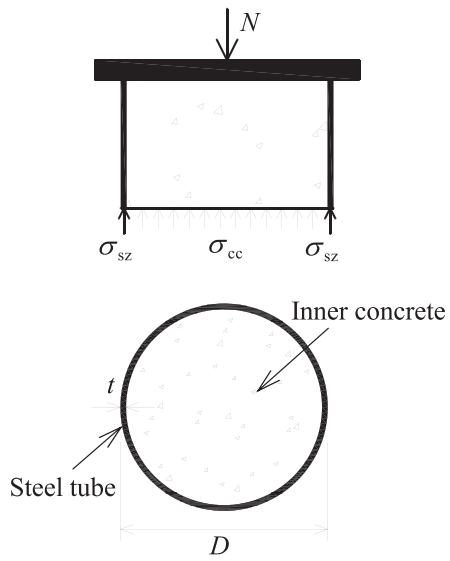  
(a)

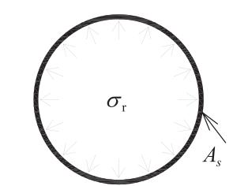

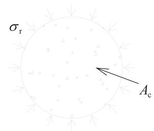  
(b) Steel tube and inner concrete

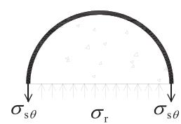

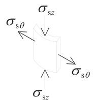  
(c)   
Fig. 1. Stress state of a circular CFST column in a limited state.

Table 1 Summary of test specimens.   

<table><tr><td>Group</td><td>Specimen</td><td>D (mm)</td><td>t (mm)</td><td>fc(N/mm2)</td><td>fs(N/mm2)</td><td>D/t</td><td>ξ = fsAs/fcAc</td><td>N0(kN)</td><td>Nu/N0</td></tr><tr><td rowspan="4">1</td><td>SC-29</td><td>165.2</td><td>3.7</td><td>29.5</td><td>366.0</td><td>44.6</td><td>1.19</td><td>1264</td><td>1.13</td></tr><tr><td>SC-43</td><td></td><td></td><td>43.5</td><td></td><td></td><td>0.81</td><td>1538</td><td>1.09</td></tr><tr><td>SC-58</td><td></td><td></td><td>58.0</td><td></td><td></td><td>0.61</td><td>1821</td><td>1.15</td></tr><tr><td>SC-81</td><td></td><td></td><td>81.6</td><td></td><td></td><td>0.43</td><td>2283</td><td>1.10</td></tr><tr><td rowspan="4">2</td><td>C-29</td><td>165.2</td><td>3.7</td><td>29.5</td><td>366.0</td><td>44.6</td><td>1.19</td><td>1264</td><td>1.29</td></tr><tr><td>C-43</td><td></td><td></td><td>43.5</td><td></td><td></td><td>0.81</td><td>1538</td><td>1.13</td></tr><tr><td>C-58</td><td></td><td></td><td>58.0</td><td></td><td></td><td>0.61</td><td>1821</td><td>1.22</td></tr><tr><td>C-81</td><td></td><td></td><td>81.6</td><td></td><td></td><td>0.43</td><td>2283</td><td>1.28</td></tr><tr><td rowspan="3">3</td><td>SC-52-0</td><td>165.2</td><td>3.7</td><td>52.3</td><td>372.6</td><td>44.6</td><td>0.68</td><td>1722*</td><td>1.09</td></tr><tr><td>SC-52-1</td><td></td><td></td><td></td><td></td><td></td><td></td><td></td><td>1.13</td></tr><tr><td>SC-52-2</td><td></td><td></td><td></td><td></td><td></td><td></td><td></td><td>1.15</td></tr></table>

* Though $A _ { \mathrm { c } }$ of SC-52-1 and SC-52-2 at the corrugations is smaller than SC-52-0 $A _ { \mathrm { c } }$ was taken as the same for all the three specimens in Group 3, for the convenience of comparison. Note: D-outside diameter of the steel tube; t-thickness of the steel tube; fc-concrete cylinder strength; fs-steel tube yield stress; Ac-sectional area of concrete; $A _ { s }$ -sectional area of steel tube; $N _ { 0 } .$ -nominal axial strength; $N _ { \mathbf { u } }$ -maximum strength obtained in test.

respectively. The specimens were named in the form of SC(C)- $- f _ { c } ( - \mathrm { i } )$ , where “SC” represents the steel tube and inner concrete, “C” represents the inner concrete, $" f _ { c } "$ is the cylinder strength of inner concrete, and “i” describes the number of corrugations in the steel tubes of specimens in Group 3.

# 3.2. Test setup and instrumentation

Specimens were tested under a universal testing machine with a maximum capacity of 5000 kN. All specimens were tested under displacement control. Axial shorting, that is, the relative displacement between the top and bottom loading plates, was recorded by two linear variable differential transducers (LVDTs) with a stroke of $5 0 ~ \mathrm { m m }$ installed in parallel with the longitudinal axis of specimens, as shown in Fig. 2a. For specimens in Groups 1 and 3, the axial compressive load was applied to both the inner concrete and steel tube through loading plates with a thickness of $5 0 ~ \mathrm { m m }$ , as shown in Fig. 2b; for specimens in Group 2 with lubricated steel tube, only the inner concrete was compressed through smaller loading plates with a thickness of $5 0 \mathrm { m m }$ , as shown in Fig. 2c.

To measure the axial and hoop strains in the steel tubes, two bidirectional strain gauges were installed on the external surface of the steel tube at the mid-height for specimens in Groups 1 and 2, as shown in Fig. 3a. Multiple bidirectional strain gauges were used to measure the strains at proper locations of specimens in Group 3. For Specimens SC-52-0 and SC-52-2, three locations, upper (a radius's distance from the top end), middle, and lower (a radius's distance from the bottom end), were measured as shown in Fig. 3b and d. For Specimen SC-52-1, strain at the middle location was not measured because of

the existence of a corrugation there, as shown in Fig. 3c. Instead, PI gauge, a type of PI-shape displacement transducer capable of measuring micro deformation, was used to measure the axial deformation at the corrugation for Specimens SC-52-1 and SC-52-2. At each corrugation, four PI gauges were evenly arranged along circumference and their average was used in the quantification of axial deformation at the corrugation as described later.

# 3.3. Corrugation detail

Fig. 3e shows the details of the corrugation, which was made through fine cutting a thicker steel tube made from the same steel grade. An integral tube was fabricated by welding together the corrugation portion and the rest. Though the thickness at the corrugation was the same as other parts of a complete tube, the confinement effect to the inner concrete at the corrugation was stronger in view of the thicker equivalent thickness. Given an “inward narrowing” depth of one tube thickness (t) at corrugations in this study, the equivalent thickness for confining concrete at the corrugation is $\sqrt { 2 } t$ , a roughly $4 0 \%$ increase of confining steel there. According to Eq. (3), the increased thickness will give higher confinement to the inner concrete, given the same level of hoop stress.

The “inward narrowing” of the steel tube at the corrugation resulted in a weak point, e.g., a point of stress concentration vertically. Therefore, the axial stress at that point was larger compared to elsewhere, which also resulted in concentrated axial deformation thereby and accordingly reduced axial stress level in the other parts of the steel tube. As previously discussed, the reduced axial stress component in the steel tube

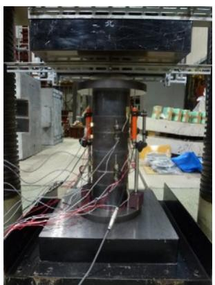  
(a) Arrangement

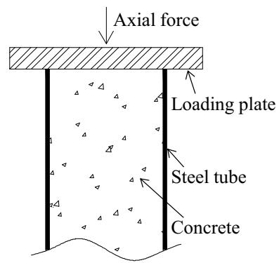  
(b) Groups 1 and 3

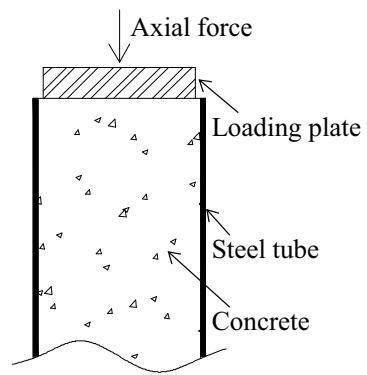  
(c) Group 2   
Fig. 2. Test setup.

  
Fig. 3. Illustration of instrumentation.

will produce larger hoop stress component (which confines the inner concrete) when the steel tube yields.

# 4. Test results and discussions

# 4.1. Axial compressive strength

All specimens were centrally compressed until $5 \%$ of column length, or loading stopped when the drop of axial strength was larger than $2 5 \%$ of the maximum measured axial strength $\mathrm { \Delta } N _ { u }$ in Table 1). For the convenience of comparison, the nominal axial strength $N _ { 0 }$ is defined as

$$
N _ {0} = f _ {s} A _ {s} + f _ {c} A _ {c} \tag {6}
$$

where $f _ { s }$ is steel tube yield strength; $A _ { s }$ is the sectional area of steel tube; $f _ { \mathrm c }$ is concrete cylinder strength and $A _ { \mathrm { c } }$ is the sectional area of concrete.

Table 1 also summarizes the nominal axial strength $N _ { 0 }$ and the normalized maximum axial strength $\frac { N _ { u } } { N _ { 0 } }$ (ratio between the maximum measured axial strength $N _ { u }$ and nominal axial strength $N _ { 0 }$ ).

Fig. 4 shows the measured axial load versus compressive strain response and deformed shape for specimens in Groups 1 and 2. The ordinate is the measured axial load and the abscissa of axial shorting is ratio of axial displacement measured by LVDTs to the length of columns. As described earlier that the interface between steel tube and concrete of specimens in Group 2 was lubricated, there was no friction force acting on the steel tube and accordingly the steel tube was in null axial stress state. Since specimens in Group 2 were compressed only on the inner

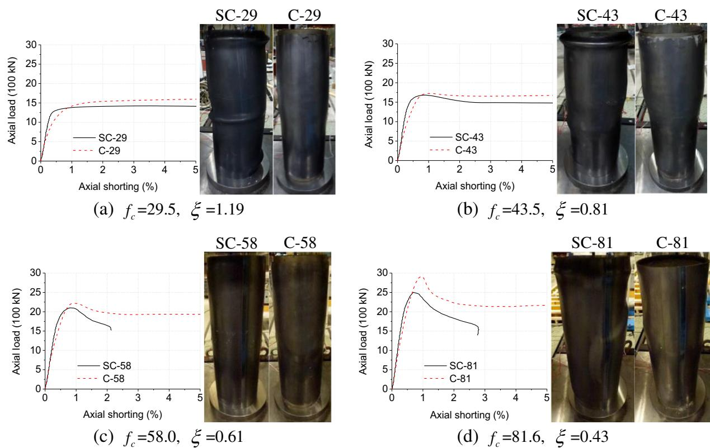  
Fig. 4. Axial load-deformation curve and failure mode for specimens in Groups 1 and 2.

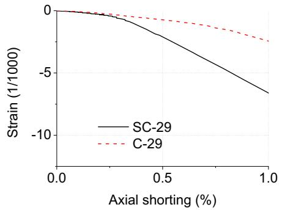  
(a) =1.19

  
(b) =0.81

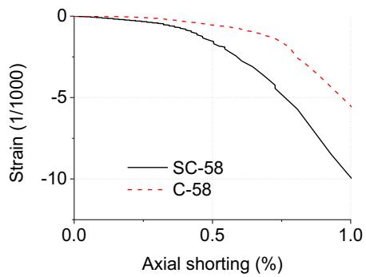  
(c) =0.61

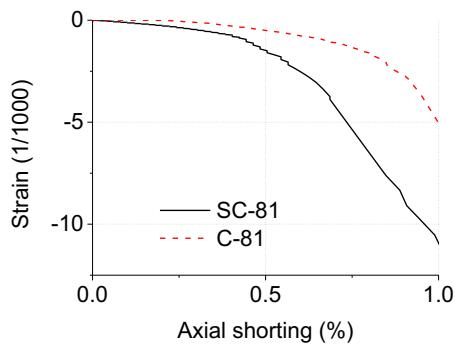  
(d) =0.43   
Fig. 5. Comparison of hoop strain between specimens in Groups 1 and 2.

concrete and the steel tube itself did not directly contribute to the axial strength, their axial strength was smaller at first. For instance, at an axial shorting of $0 . 2 5 \% ,$ , the axial strength of Specimen SC-29 in Group 1 was 1041 kN, whereas that of Specimen C-29 in Group 2 was 764 kN, approximately $2 7 \%$ lower. With the increase of axial shorting, the axial strength of specimens in Group 2 became larger, which was credited to the more effective confinement to the inner concrete provided by the steel tube. For instance, at an axial shorting of $2 \% ,$ , the axial strength of Specimen C-29 in Group 2 was 1541 kN, approximately $9 \%$ larger than that of Specimen SC-29 in Group 1 $1 4 1 3 ~ \mathrm { k N }$ . Without axial stress acting on the steel tube in Group 2, the steel tube was subjected to one-directional hoop tension and local buckling was largely avoided or delayed. Unlike the steel tube in Group 1 which was subjected to bi-directional stress and buckled obviously, hoop expansion without tube local buckling was the typical failure mode for specimens in Group 2. By eliminating axial stress in the steel tube, the maximum axial strength was enhanced by the range of $3 \%$ to $1 7 \%$ . For instance, the maximum axial strength of Specimen SC-29 in Group 1 was $1 4 2 4 \mathrm { k N } ,$ , whereas that of Specimen C-29 in Group 2 was $1 6 2 5 \mathrm { k N } ,$ approximately $1 4 \%$ larger. Also, specimens in Group 2 exhibited smaller post-peak strength decrease and larger axial deformability (especially as shown in Fig. 4c and d). Such improved axial deformability means good ductility and may be very useful in a building subjected to seismic excitation. Fig. 4 also revealed that the axial compressive strengths of CFST columns with using higher strength concrete were enhanced considerably.

# 4.2. Confinement effect

The confinement effect is the key for the most obvious advantage of CFST columns: the greatly enhanced compressive capacity. The confinement effect is usually quantified by the confinement coefficient, defined

as the confinement to inner concrete coming from the exterior steel tube. The confinement coefficient $\xi$ [28] is expressed by

$$
\xi = \frac {f _ {s} A _ {s}}{f _ {c} A _ {c}} \tag {7}
$$

where $A _ { s }$ and $A _ { \mathrm { c } }$ are the cross-section area of steel tube and concrete; $f _ { s }$ and $f _ { \mathrm c }$ are the strength of steel and concrete, respectively.

The axial compressive capacity is the joint function of steel tube and concrete. With the confinement provided by steel tube, CFST columns may have high ductility and energy dissipation ability even though the concrete may have been cracked or crushed when the axial load

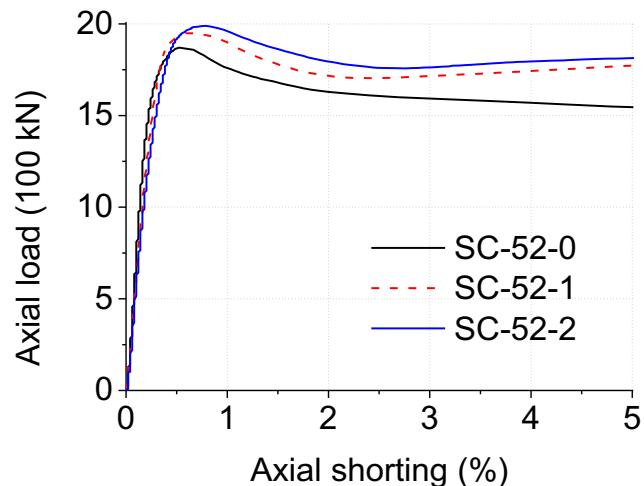  
Fig. 6. Axial load-deformation curves for specimens in Group 3.

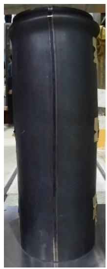  
(a) SC-52-0

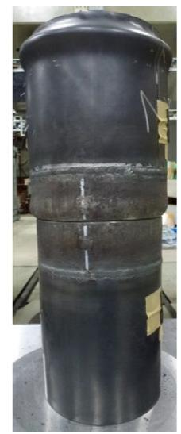  
(b) SC-52-1

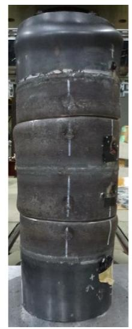  
(c) SC-52-2

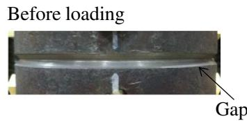

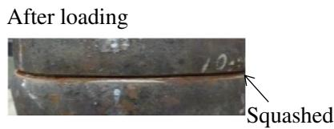  
(d) Enlarged view of corrugation   
Fig. 7. Specimens in Group 3 after the completion of loading.

attains a certain level [29]. However, this does not mean a continuous growth of axial strength with increasing confinement coefficient. As shown in Table 1, the normalized maximum axial strength $( N _ { \mathrm { u } } / N _ { 0 } )$ was not proportional to the confinement coefficient. From Fig. 4 it can be seen that the post-peak behavior was closely related to the confinement coefficient. The drop of maximum axial strength is inversely proportional to the confinement coefficient. Taking specimens in Group 2 (confinement coefficients of 1.19, 0.81, 0.61, and 0.43 respectively) for instance, the drop of maximum axial strength at an axial shortening of $2 \%$ were 0, $4 \%$ , $1 1 \% ,$ and $2 4 \%$ respectively. Specimens in Group 1 shared the similar pattern. It can be concluded that a larger confinement coefficient ensures better ductility with smaller post-peak axial strength decrease. As shown in Fig. 4a, the two specimens with a confinement coefficient of 1.19 exhibited hardened load-deformation curve. The other three pairs of specimens, with confinement coefficients of 0.81, 0.61, and 0.43 respectively, showed softened load-deformation curves, with notable post-peak axial strength decrease (Fig. 4b–d). It is reasonable to infer that a confinement coefficient of about unity would give load-deformation curves with no strength decrease, which is consistent with the previous findings by Johansson [29].

A higher confinement level means a tighter “jacketing” from the steel tube to concrete. More specifically, larger hoop expansion of the steel tube will result in severe inner concrete damage, while smaller hoop expansion of the steel tube provides larger confinement for the inner concrete and thus larger axial compressive strength. To see more clearly the different confinement effect, the hoop strain at the

mid-height was compared for the four pairs of specimens in Groups 1 and 2, as shown in Fig. 5. For specimens in Group 2 with only the inner concrete compressed, the steel tube with null axial stress provided higher confinement effect, manifested by the much smaller hoop strain. Improving the confinement effect through reducing axial stress in steel tube proved to be a promising solution.

# 4.3. Performance of corrugation

As described previously, corrugations were introduced in Group 3, to examine the feasibility of having improved confinement effect by reducing tube's axial stress level in an innovative way. It is worth mentioning that the introduction of corrugations will not undermine one important advantage of using CFST columns: the steel tube still serves as formwork for placing the concrete.

Fig. 6 shows the obtained axial load-deformation curves for specimens in Group 3. With the introduction of corrugations, the axial compressive strength was enhanced and the axial deformation at the maximum strength was extended. Compared to the baseline Specimen SC-52-0 without corrugation, the axial strength of Specimen SC-52-1 with one corrugation was increased by $4 . 4 \%$ and that of Specimen SC-52-2 with two corrugations was increased by $6 . 3 \%$ . The reasoning behind is that, with corrugations, a major portion of axial compressive deformation was concentrated at the vertically weak corrugations and thus the axial stress level in the steel tube was reduced. Taking the axial deformation of Specimen SC-52-0 at the moment of maximum

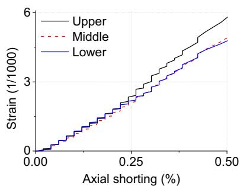  
(a) SC-52-0

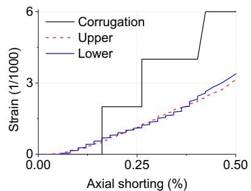  
(b) SC-52-1

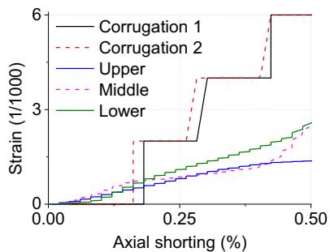  
(c) SC-52-2   
Fig. 8. Axial strain distribution of specimens in Group 3.

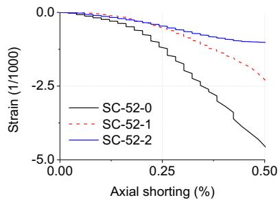  
(a)Upper

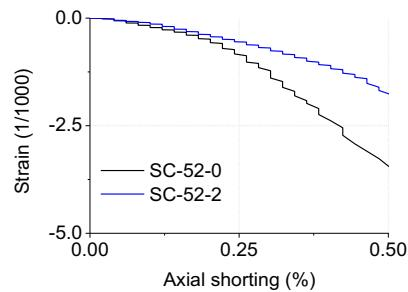  
(b)Middle

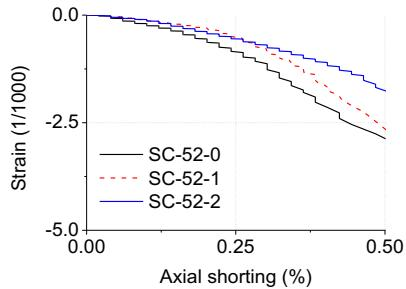  
(c) Lower   
Fig. 9. Comparison of hoop strain in the steel tube for specimens in Group 3.

axial strength as the reference, the counterpart of Specimen SC-52-1 was increased by $1 5 . 4 \%$ and that of Specimen SC-52-2 was increased by $3 4 . 6 \%$ . These extended axial deformation at the moment of maximum axial strength demonstrated that the ductility was improved with the introduction of corrugations in the steel tube. Another evidence for the improved ductility was the smaller strength degradation of specimens with corrugations in the steel tube after the peak strength.

Fig. 7 shows the deformation observed in test. End steel tube buckling was the typical failure mode in all three specimens, similar to common CFST columns such as specimens in Group 1. Different from common CFST columns (Fig. 7a), axial compressive deformation concentrated at the corrugation, as shown in Fig. 7b and c. With the increase in compression, the gap at the corrugation decreased and eventually squashed as shown in Fig. 7d. The closure of corrugation under compression became the source for the concentrated axial compressive deformation there.

As shown in Fig. 3, the axial strain/deformation distribution in the steel tube was measured by strain/PI gauge. For comparison purpose, the axial deformation at corrugation measured by PI gauge was converted to strain data, which was the ratio between the measured average axial deformation and the distance between two anchoring points of PI gauge ( $5 0 ~ \mathrm { m m }$ in this study). Fig. 8 shows the comparison of axial strain for specimens in Group 3 at several locations (detailed in Fig. 3d). For Specimen SC-52-0 without corrugations, axial strain at three locations, upper, middle and lower part of the steel tube, was nearly the same along the height. Specimens SC-52-1 with one corrugation and SC-52-2 with two corrugations behaved similarly: the axial strain in the steel tube was nearly the same, and the strain almost doubled at the corrugation. With much larger compressive deformation concentrated at corrugations, the axial strain in the steel tube was effectively reduced. Compared to Specimen SC-52-0, the axial strain in the steel tube away from the corrugation was about half of that in Specimen SC-52-1. Increasing the number of corrugations further reduced the axial strain level in the steel tube (see Specimens SC-52-1 and SC-52-2).

Similarly, the hoop strain in the steel tube was used to indirectly compare the confinement level of the three specimens in Group 3. As shown in Fig. 9, Specimen SC-52-2 with two corrugations showed the smallest hoop strain and thus largest confinement effect, and Specimen SC-52-0 with no corrugations showed the largest hoop strain and thus smallest confinement effect, which were consistent with tested axial strength (Fig. 6). CFST columns with small confinement effect exhibited small axial strength. The introduction of corrugations in the steel tube proved to be an effective means to enhance the confinement effect.

# 5. Conclusions

This study experimentally investigated the feasibility of enhancing confinement effect and accordingly axial compressive strength and ductility of CFST stub columns by reducing the axial stress in the steel tube. Corrugations were introduced in the steel tube as an innovative means to realize this objective. The major findings are summarized as follows:

• The confinement coefficient was verified to be the key parameter for ductility. A larger confinement coefficient ensured smaller post-peak axial strength decrease. It was confirmed that a confinement coefficient of no smaller than unity would have load-deformation curves with no strength softening.   
• It was found feasible to have better confinement effect by reducing the axial stress in the steel tube. By compressing only on the inner concrete in the lubricated steel tube, the steel tube provided “tighter” confinement to the inner concrete and thus axial strength capacity was enhanced; the post-peak ductility and deformability were also improved.   
• By introducing corrugations in the steel tube, axial deformation was largely concentrated thereby, which reduced the axial stress elsewhere in the steel tube and thus better confinement effect to the inner concrete was achieved. Compared with the CFST columns without corrugations in the steel tube, those with corrugations exhibited higher axial compressive strength, extended axial deformation at the maximum strength and smaller strength decrease after the peak strength.   
• In practice, it is difficult to have ideal lubricated surface between the inner concrete and exterior steel tube. Therefore, introduction of corrugations in the steel tube is recommended as a promising way for enhancing confinement effect.   
• In this preliminary study, the corrugation was made through cutting a thicker steel tube, which was prone to cause stress concentration and was also practically not economical. An easy and economical way for producing proper corrugations is needed. Also, future studies on numerical modeling of CFST columns with corrugations in the steel tube for detailed investigations (such as the influence of material imperfection, stress concentration and residual stresses in the presence of high axial compressive loads, optimization of corrugation configuration and among others) and the behavior under both bending and compression and cyclic loading are essential.

# Acknowledgements

Our sincere thanks go to Dr. Takasuke Saito for his great assistance offered in preparing and conducting experimental work. Our thanks also go to Mr. Sota Fukazawa for his great help in the experimental work.

# References

[1] S. Schneider, Axially loaded concrete-filled steel tubes, J. Struct. Eng. 125 (10) (1998) 1125–1138.   
[2] K. Sakino, H. Nakahara, S. Morino, A. Nishiyama, Behavior of centrally loaded concrete-filled steel-tube short columns, J. Struct. Eng. 130 (2) (2004) 180–188.   
[3] L.H. Han, G.H. Yao, X.L. Zhao, Tests and calculations for hollow structural steel (HSS) stub columns filled with self-consolidating concrete (SCC), J. Constr. Steel Res. 61 (9) (2005) 1241–1269.   
[4] P.K. Gupta, S.M. Sarda, M.S. Kumar, Experimental and computational study of concrete filled steel tubular columns under axial loads, J. Constr. Steel Res. 63 (2) (2007) 182–193.   
[5] Z.H. Lu, Y.G. Zhao, Suggested empirical models for the axial capacity of circular CFT stub columns, J. Constr. Steel Res. 66 (2010) 850–862.

[6] F. Abed, M. AlHamaydeh, S. Abdalla, Experimental and numerical investigations of the compressive behavior of concrete filled steel tubes (CFSTs), J. Constr. Steel Res. 80 (2013) 429–439.   
[7] G. Giakoumelis, D. Lam, Axial capacity of circular concrete-filled tube columns, J. Constr. Steel Res. 60 (7) (2004) 1049–1068.   
[8] Z.W. Yu, F.X. Ding, C.S. Cai, Experimental behavior of circular concrete-filled steel tube stub columns, J. Constr. Steel Res. 63 (2) (2007) 165–174.   
[9] D. Lam, L. Gardner, Structural design of stainless steel concrete filled columns, J. Constr. Steel Res. 64 (11) (2008) 1275–1282.   
[10] J.Q. Xue, B. Briseghella, B.C. Chen, Effects of debonding on circular CFST stub columns, J. Constr. Steel Res. 69 (1) (2012) 64–76.   
[11] F.Y. Liao, L.H. Han, Z. Tao, Behaviour of CFST stub columns with initial concrete imperfection: analysis and calculations, Thin-Walled Struct. 70 (2013) 57–69.   
[12] Zhong Tao, Tian-Yi Song, Brian Uy, Lin-Hai Han, Bond behavior in concrete-filled steel tubes, J. Constr. Steel Res. 120 (2016) 81–93.   
[13] Yu Chen, Ran Feng, Yongbo Shao, Xiaotian Zhang, Bond-slip behaviour of concretefilled stainless steel circular hollow section tubes, J. Constr. Steel Res. 130 (2017) 248–263.   
[14] Z.H. Lu and Y.G. Zhao, Mechanical behavior and ultimate strength of circular CFT columns subjected to axial compression loads, In: Proceedings 14th WCEE (2008), Beijing, China.   
[15] M.H. Lai, J.C.M. Ho, Confinement effect of ring-confined concrete-filled-steel-tube columns under uni-axial load, Eng. Struct. 67 (2014) 123–141.   
[16] J.C.M. Ho, M.H. Lai, Behaviour of uni-axially loaded CFST columns confined by tie bars, J. Constr. Steel Res. 83 (2013) 37–50.   
[17] M.H. Lai, J.C.M. Ho, Effect of continuous spirals on uni-axial strength and ductility of CFST columns, J. Constr. Steel Res. 104 (2015) 235–249.

[18] M.H. Lai, J.C.M. Ho, Axial strengthening of thin-walled concrete-filled-steel-tube columns by circular steel jackets, Thin-Walled Struct. 97 (2015) 11–21.   
[19] S.R. Gopal, P.D. Manoharan, Tests on fiber reinforced concrete filled steel tubular columns, Steel Compos. Struct. 4 (1) (2004) 37–48.   
[20] Y.M. Hu, T. Yu, J.G. Teng, FRP-confined circular concrete-filled thin steel tubes under axial compression, J. Compos. Constr. 15 (5) (2011) 850–860.   
[21] J.F. Dong, Q.Y. Wang, Z.W. Guan, Structural behaviour of recycled aggregate concrete filled steel tube columns strengthened by CFRP, Eng. Struct. 48 (2013) 532–542.   
[22] Zhi-Bin Wang, Qing Yu, Zhong Tao, Behaviour of CFRP externally-reinforced circular CFST members under combined tension and bending, J. Constr. Steel Res. 106 (2015) 122–137.   
[23] Tianyu Xie, Togay Ozbakkaloglu, Behavior of steel fiber-reinforced high-strength concrete-filled FRP tube columns under axial compression, Eng. Struct. 90 (2015) 158–171.   
[24] J.B. Mander, M.J.N. Priestley, R. Park, Theoretical stress-strain model for confined concrete, J. Struct. Eng. 114 (8) (1988) 1804–1826.   
[25] F.E. Richart, A. Brandtzaeg, R.L. Brown, A study of the failure of concrete under combined compressive stresses, Bulletin No. 185, University of Illinois, Engineering Experimental Station, 1928.   
[26] T.V. Galambos, Guide to Stability Design Criteria for Metal Structures, Fifth Edition John Wiley & Sons, 1998.   
[27] J.R. Davis, Tensile Testing, Second Edition ASM International, 2004.   
[28] Zhong Tao, Zhi-Bin Wang, Qing Yu, Finite element modeling of concrete-filled steel stub columns under axial compression, J. Constr. Steel Res. 89 (2013) 121–131.   
[29] M. Johansson, The efficiency of passive confinement in CFT columns, Steel Compos. Struct. 2 (5) (2002) 379–396.