# Behaviour of concrete-filled cold-formed high strength steel circular stub columns

Meini Su a, Yancheng Cai b,1,\*, Xuerui Chen a, Ben Young b,1

$^{a}$ Department of Mechanical, Aerospace, and Civil Engineering, The University of Manchester, Manchester, UK   
$^{b}$ Department of Civil and Environmental Engineering, The Hong Kong Polytechnic University, Hong Kong, China

# ARTICLEINFO

Keywords:

Concrete-filled steel tube

Circular hollow sections

Cold-formed steel

High strength steel

Stub columns

# ABSTRACT

This paper presents the experimental and numerical investigations of concrete-filled cold-formed high strength steel (CFHSS) circular stub columns. Firstly, a series of tests was conducted on CFHSS circular tubular sections filled with three different concrete grades, i.e., C40, C80 and C120. The CFHSS circular tubular sections had the nominal $0.2\%$ proof stress (yield stress) up to $1100\mathrm{MPa}$ . The test specimens were subjected to uniform axial compression. The ultimate loads and failure modes of the specimens were obtained and reported in this paper. Secondly, an extensive numerical study accounting for the confinement effect, as well as the non-linearities of materials, geometry and contacts was performed. Upon validation against the test results, a parametric investigation was conducted. A wide range of the cross-section dimensions and section slenderness of CFHSS circular tubular sections inflated with different grades of concrete were considered. The structural behaviour of concrete-filled CFHSS stub columns was investigated, including the ultimate load, end shortening, strength enhancement index and ductility index. Finally, the experimental and numerical results were used to assess the suitability of the design equations specified in the existing American Specifications (AISC and ACI), European Code (EC4) and Japanese Code (AIJ) for the compressive strength of the concrete-filled CFHSS circular stub columns. It was found that the predictions from the existing international design specifications were generally conservative, except for EC4. The predictions by the AIJ are the least conservative and least scattered. However, by using the effective section area of steel tubes for slender cross sections, EC4 provided the most accurate and consistent predictions than the other design specifications.

# 1. Introduction

Applications of concrete-filled steel tubular members have covered a wide area in civil and structural engineering industry for their excellent structural performance. They have been used as mega columns in super high-rise buildings, chord members in long-span composite bridges, piles in floodwall structures, bridge piers and transmission towers [1]. The applications could be further extended in submarine pipeline structures, as show in the recent works by Wang et al. [2] and Wang and Han [3]. Their excellent structural performance is mainly benefited from the interactions between the inner concrete and outer steel tube, for example, the steel tube provides confinement to the infilled concrete while the infilled concrete prevents the inward buckling and delays the local buckling of the steel tube [4]. These contribute to the structural behaviour of the concrete-filled members, e.g., increased bearing

capacity and ductility for concrete-filled steel columns under axial loading condition. Hence, concrete-filled steel columns may provide economic efficiency than structural steel or reinforced concrete columns due to the reduced column size and increased effective space in buildings.

Concrete-filled circular steel tubes are one of the most popular composite columns used in the structures. Research works on concrete-filled steel tubes conducted by Schneider [5] showed that compared to square and rectangular columns, circular ones offer substantial post-yield strength and stiffness. In the last few decades, experimental, numerical and analytical investigations have been carried out on the structural behaviour of concrete-filled steel circular columns under various loading conditions, as summarized in literature [6-11]. Commonly, there are two methods for increasing the resistance of concrete-filled steel columns [1]. The first method is by increasing the

area of the cross sections. However, this might be impractical or uneconomic, as the increased area will induce larger structural weight with less useable area and subsequently increase the cost of foundation. Alternatively, using high strength materials such as high strength steel and concrete could be an effective way.

A great number of investigations on the structural behaviour of concrete-filled circular steel stub columns have been conducted. These may be clarified as three types as discussed in Wei et al. [1], i.e., conventional strength steel infilled with high strength concrete, high strength steel infilled with conventional strength concrete and high strength steel infilled with high strength concrete, where the high strength steel is set as the yield stress not less than $525\mathrm{MPa}$ $(f_y\geq 525$ MPa), while the high strength concrete refers to the compressive cylinder strength $(f_{ck})$ not less than $70\mathrm{MPa}$ $(f_{ck}\geq 70\mathrm{MPa})$ , as per specified in the American Specification for Structural Steel Buildings (AISC) [12].

A recent review on the experimental investigation of concrete-filled steel circular stub columns [1] showed that most of the tests were conducted on conventional strength steel filled with high strength concrete ( $f_{y} < 525\mathrm{MPa}$ with $f_{ck} \geq 70\mathrm{MPa}$ ) [13-26] with a few on high strength steel filled with conventional strength concrete ( $f_{y} \geq 525\mathrm{MPa}$ with $f_{ck} < 70\mathrm{MPa}$ ) [17,26-28]. However, there was very limit experimental investigation on concrete-filled steel circular stub columns, where high strength steel ( $f_{y} \geq 525\mathrm{MPa}$ ) filled with high strength concrete ( $f_{ck} \geq 70\mathrm{MPa}$ ) were designed. Four tests were conducted by Sakino et al. [17], where the stub columns were designed by steel tubes with yield stresses of $f_{y} = 525\mathrm{MPa}$ and $f_{y} = 843\mathrm{MPa}$ filled by concretes with cylinder strengths of $f_{ck} = 77\mathrm{MPa}$ and $f_{ck} = 85\mathrm{MPa}$ . Eight tests were conducted by Wei et al. [1], where steel (Grade Q900) circular tubes with nominal yield strength of $900\mathrm{MPa}$ and concrete with nominal cubic strength of $140\mathrm{MPa}$ were used. Nonetheless, up to date, investigation of high strength steel circular tubes filled with high strength concretes is limited.

Design of concrete-filled steel circular stub columns are provided in current international design specifications, such as the AISC [12], the "Eurocode 4: Design of Composite Steel and Concrete Structures - Part 1.1: General Rules and Rules for Buildings" (EC4) [29], the "Recommendations for Design and Construction of Concrete Filled Steel Tubular Structures (AIJ)" [30] and the "Building Code Requirements for Structural Concrete (ACI318M - 14) and Commentary (ACI318RM-14)" [31]. It should be noted that limitations of the design rules are specified in these specifications, including limits of section slenderness of the circular steel tube, the yield stress of steel and the compressive strength of concrete. However, it should be noted that the design of high strength circular steel tubes filled with high strength concrete are not explicitly specified in these design codes, e.g., for columns with $f_{y} \geq 900 \mathrm{MPa}$ with $f_{ck} \geq 80 \mathrm{MPa}$ . This will be discussed further in the later section of this paper.

Hence, in this study, experimental and numerical investigations were carried out on the structural behaviour of concrete-filled cold-formed high strength steel (CFHSS) circular stub columns. The circular steel tubes are classified as high strength steel in the present study as they had the nominal $0.2\%$ proof stress $(f_{0.2})$ greater than $525\mathrm{MPa}$ as specified in AISC [12]. Firstly, a total of 17 tests was conducted on CFHSS circular tubular sections filled with three different concrete grades, namely C40, C80 and C120. The tested CFHSS circular tubular sections had the nominal $f_{0.2}$ up to $1100\mathrm{MPa}$ . The test specimens were subjected to uniform axial compression in order to obtain the ultimate loads and failure modes. Secondly, an extensive numerical study accounting for the confinement effect, as well as the non-linearities of materials, geometry and contacts was performed. After a successful model validation against the test results, a parametric study was conducted by using the validated numerical model, where a wide range of the cross-section dimensions and section slenderness of CFHSS circular tubular sections filled with different grades of concrete were considered. The structural behaviour of concrete-filled CFHSS stub columns was investigated, including the ultimate load, end shortening, strength enhancement

Table 1 Material properties of CFHSS circular tubes.   

<table><tr><td rowspan="2">Sections</td><td rowspan="2">Es(GPa)</td><td colspan="2">f0.2(MPa)</td><td rowspan="2">fu(MPa)</td><td rowspan="2">εu(%)</td><td rowspan="2">εf(%)</td><td rowspan="2">n</td></tr><tr><td>Nominal</td><td>Measured</td></tr><tr><td>89 × 3</td><td>203</td><td>900</td><td>980</td><td>1093</td><td>2.1</td><td>9.4</td><td>5</td></tr><tr><td>89 × 4</td><td>209</td><td>1100</td><td>1084</td><td>1242</td><td>2.5</td><td>10.3</td><td>5</td></tr><tr><td>108 × 4</td><td>208</td><td>1100</td><td>1233</td><td>1327</td><td>2.2</td><td>10.5</td><td>6</td></tr><tr><td>133 × 4</td><td>210</td><td>1100</td><td>1164</td><td>1278</td><td>2.3</td><td>10.5</td><td>6</td></tr></table>

Table 2 Cylinder strengths of concrete.   

<table><tr><td rowspan="2">Concrete grades</td><td colspan="2">Concrete cylinder strengths (fck)</td></tr><tr><td>28th day (MPa)</td><td>Column test day (MPa)</td></tr><tr><td>C40</td><td>34.9</td><td>35.5</td></tr><tr><td>C80</td><td>79.9</td><td>85.7</td></tr><tr><td>C120</td><td>112.7</td><td>114.9</td></tr></table>

index and ductility index. Finally, the experimental and numerical results were used to assess the suitability of the design rules specified in the current international specifications, i.e., AISC360-10 [12], EC4 [29], AIJ [30] and ACI [31].

# 2. Experimental program

# 2.1. Material properties

The CFHSS circular tubes were used as the outer skin of the concrete-filled steel stub column specimens. The nominal dimensions $(D\times t)$ of the steel tubes were $89.0\times 3.0\mathrm{mm}$ , $89.0\times 4.0\mathrm{mm}$ , $108.0\times 4.0\mathrm{mm}$ and $133.0\times 4.0\mathrm{mm}$ , where $D$ and $t$ are the outer diameter and thickness of the tubes, respectively. The steel tubes of $89.0\times 3.0\mathrm{mm}$ had the nominal $0.2\%$ proof stress $(f_{0.2})$ of $900\mathrm{MPa}$ , while the steel tubes of $89.0\times 4.0\mathrm{mm}$ , $108.0\times 4.0\mathrm{mm}$ and $133.0\times 4.0\mathrm{mm}$ had the $f_{0.2}$ of $1100\mathrm{MPa}$ .

The curved coupons were extracted from the circular tubes at $90^{\circ}$ angle from the weld in the longitudinal direction of the tubes. The nominal gauge length and width of the curved tensile coupons were 25 mm and 4 mm, respectively [32]. The coupon specimens were tested in a 50-kN MTS testing machine. Two linear strain gauges were adhered on both faces at the middle of the coupon. An extensometer was mounted on the coupons over a gauge length of $25\mathrm{mm}$ . Displacement control test method was used with loading rates of $0.05\mathrm{mm / min}$ and $0.5\mathrm{mm / min}$ for the elastic range and plastic range, respectively. The results from the strain gauges were used to determine the Young's modulus $(E_{s})$ of the coupon specimens. The rest of the material properties were determined from the stress-strain curves that measured by the extensometer. The results of the coupon tests are presented in Table 1, including the $E_{s}, f_{0.2}$ , ultimate strength $(f_{u})$ and the corresponding ultimate strain $(\varepsilon_{u})$ , fracture strain $(\varepsilon_{f})$ , and the Ramberg-Osgood parameter $n$ calculated as $n = \ln (0.01 / 0.2) / \ln (f_{0.01} / f_{0.2})$ , where $f_{0.01}$ is the nominal $0.01\%$ proof stress.

Three different grades of concrete (C40, C80 and C120) with the respective nominal cylinder strengths $(f_{ck})$ of $40\mathrm{MPa}$ , $80\mathrm{MPa}$ and $120\mathrm{MPa}$ were prepared to infill the steel tubes. Concrete cylinders were prepared to determine the concrete strengths. The concrete cylinder had the nominal diameter of $150\mathrm{mm}$ and height of $300\mathrm{mm}$ . The cylinder tests were conducted in accordance with the procedures in the ACI [31]. Two series of cylinder compression tests were conducted to obtain the cylinder strength $(f_{ck})$ , one on the 28th day after casting and the other on the actual date of the corresponding stub column tests. The average test results of the different concrete grades are presented in Table 2.

Table 3 Dimensions of CFHSS circular stub columns.   

<table><tr><td>Specimens</td><td>D(mm)</td><td>t(mm)</td><td>L(mm)</td><td>As(mm2)</td><td>Ac(mm2)</td><td>D/t</td></tr><tr><td>89 × 3-C0-A</td><td>88.9</td><td>2.97</td><td>267.0</td><td>801.8</td><td>-</td><td>29.9</td></tr><tr><td>89 × 3-C40-A</td><td>88.8</td><td>3.00</td><td>267.0</td><td>808.6</td><td>5383.3</td><td>29.6</td></tr><tr><td>89 × 3-C80-A</td><td>88.9</td><td>2.98</td><td>267.0</td><td>804.6</td><td>5405.4</td><td>29.8</td></tr><tr><td>89 × 3-C120-A</td><td>88.9</td><td>3.00</td><td>266.5</td><td>809.7</td><td>5398.9</td><td>29.6</td></tr><tr><td>89 × 4-C0-B</td><td>89.0</td><td>3.91</td><td>267.0</td><td>1045.2</td><td>-</td><td>22.8</td></tr><tr><td>89 × 4-C40-B</td><td>88.9</td><td>3.91</td><td>266.5</td><td>1043.5</td><td>5158.1</td><td>22.7</td></tr><tr><td>89 × 4-C80-B</td><td>89.0</td><td>3.91</td><td>267.0</td><td>1044.8</td><td>5172.1</td><td>22.8</td></tr><tr><td>89 × 4-C120-B</td><td>88.9</td><td>3.89</td><td>267.0</td><td>1039.0</td><td>5169.6</td><td>22.9</td></tr><tr><td>108 × 4-C0-B</td><td>108.2</td><td>3.93</td><td>324.0</td><td>1287.4</td><td>-</td><td>27.5</td></tr><tr><td>108 × 4-C40-B</td><td>108.3</td><td>3.9</td><td>323.0</td><td>1279.6</td><td>7939.0</td><td>27.8</td></tr><tr><td>108 × 4-C80-B</td><td>108.2</td><td>3.94</td><td>323.5</td><td>1290.8</td><td>7907.5</td><td>27.5</td></tr><tr><td>108 × 4-C120-B</td><td>108.6</td><td>3.98</td><td>329.0</td><td>1307.9</td><td>7951.7</td><td>27.3</td></tr><tr><td>133 × 4-C0-B</td><td>133.2</td><td>3.92</td><td>399.0</td><td>1592.1</td><td>-</td><td>34.0</td></tr><tr><td>133 × 4-C40-B</td><td>133.4</td><td>3.95</td><td>398.5</td><td>1606.4</td><td>12370.2</td><td>33.8</td></tr><tr><td>133 × 4-C80-B</td><td>133.3</td><td>3.93</td><td>398.5</td><td>1597.6</td><td>12364.3</td><td>33.9</td></tr><tr><td>133 × 4-C120-B</td><td>133.2</td><td>3.94</td><td>398.0</td><td>1599.7</td><td>12330.8</td><td>33.8</td></tr><tr><td>133 × 4-C120-B-r</td><td>133.1</td><td>3.94</td><td>399.0</td><td>1599.0</td><td>12319.0</td><td>33.8</td></tr></table>

# 2.2. Specimen design and labelling

A series of concrete-filled CFHSS circular stub column specimens were designed by using the CFHSS circular tubes (see Table 1) as the outer skin. Each series of tubes were inflated with those three different grades of concrete (see Table 2), i.e., C40, C80 and C120. In addition, to reflect the effects of inflated concrete in the same specimen series, the CFHSS circular stub columns that without inflated concrete were also designed. Hence, there are 17 stub column specimens in this study, including 4 series and one repeated specimen, as shown in Table 3. The parameters of the specimens mainly included variations of $D / t$ ranging from 22.7 to 34.0, the two different grades of steel and the three different grades of concrete. The nominal length $(L)$ of each CFHSS tube was taken as $3D$ in order to make sure that each specimen would not fail by overall buckling. The mean values of the measured section dimensions and lengths of the tubular stub column specimens were summarized in Table 3. The calculated cross-sectional areas of steel tube $(A_{s})$ and inflated concrete $(A_{c})$ are also included. All the steel circular tubes were wire cut at both ends before infilling concrete. Concrete of different grades was then cast into the steel circular tubes and vibrator was also used in the casting process.

The stub column specimens were labelled by distinguishing their nominal section dimensions and nominal concrete cylinder strengths. For example, specimen $89 \times 4$ -C40-A indicates that the outer tube of the specimen is a CFHSS circular tubular section having the nominal section dimensions of $89 \times 4$ ( $D \times t$ ), and the symbol following the hyphen indicates the grade of infilled concrete, where C40 means the nominal cylinder strength of $40\mathrm{MPa}$ . It should be noted that the symbol “C0” means there is no infilled concrete, i.e., it is a CFHSS circular stub column specimen with hollow section. The last segment represents the nominal strengths of the steel tubes, where “A” and “B” for the $f_{0,2}$ of $900\mathrm{MPa}$ and $1100\mathrm{MPa}$ , respectively. If it is a repeated test, it is indicated by the last letter “r”. The details of the concrete-filled CFHSS circular tubular stub column specimens are shown in Table 3.

# 2.3. Test setup and procedure

The experimental investigation was carried out in the Structural Laboratory at The University of Hong Kong. A $5000\mathrm{kN}$ capacity servo-controlled hydraulic testing machine was used to apply axial compressive force to the concrete-filled CFHSS stub column specimens. Four 50-mm range Linear Voltage Differential Transducers (LVDTs) were used to measure the end shortening of the specimens. These four LVDTs were placed between the top and bottom bearing plates at evenly located positions. To prevent "elephant foot" failure, end-stiffeners (steel rings)

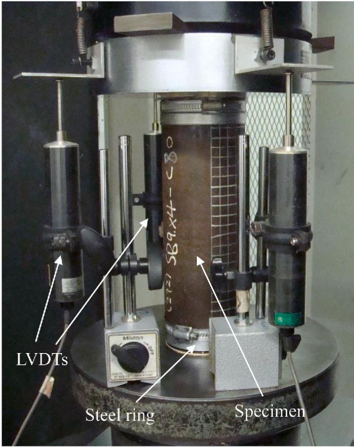  
Fig. 1. Test setup of concrete-filled CFHSS circular stub column Specimen 89 $\times$ 4-C80-B.

with height of $30~\mathrm{mm}$ were used near each end of the column prior to testing. Grid lines with mesh size of $20~\mathrm{mm}$ were drawn on half surfaces of the specimens to observe the failure modes. It should be noted that, for the stub columns infilled with concrete, the top surface of the column might not be at the same level as the end of the steel tube due to shrinkage of the concrete. Hence, plaster materials were used to fill the small gap between the steel tube and infilled concrete [33]. A typical test setup for the concrete-filled CFHSS circular stub column is shown in Fig. 1.

A special ball bearing was used at the top end of the specimen. An initial load of around $4\mathrm{kN}$ was applied to the specimens. During pre

Table 4 Test results of concrete-filled CFHSS circular tubular stub columns.   

<table><tr><td>Specimens</td><td>Pt(kN)</td><td>δu(mm)</td><td>δu,0.85(mm)</td><td>Nor.</td></tr><tr><td>89 × 3-C0-A</td><td>926</td><td>3.8</td><td>4.9</td><td>1.00</td></tr><tr><td>89 × 3-C40-A</td><td>1400</td><td>8.1</td><td>17.6</td><td>1.51</td></tr><tr><td>89 × 3-C80-A</td><td>1554</td><td>4.6</td><td>10.3</td><td>1.68</td></tr><tr><td>89 × 3-C120-A</td><td>1880</td><td>4.1</td><td>9.8</td><td>2.03</td></tr><tr><td>89 × 4-C0-B</td><td>1431</td><td>6.1</td><td>8.3</td><td>1.00</td></tr><tr><td>89 × 4-C40-B</td><td>1914</td><td>8.6</td><td>13.7</td><td>1.34</td></tr><tr><td>89 × 4-C80-B</td><td>2083</td><td>7.0</td><td>25.0</td><td>1.46</td></tr><tr><td>89 × 4-C120-B</td><td>2324</td><td>5.4</td><td>17.5</td><td>1.62</td></tr><tr><td>108 × 4-C0-B</td><td>1749</td><td>5.3</td><td>6.7</td><td>1.00</td></tr><tr><td>108 × 4-C40-B</td><td>2433</td><td>15.8</td><td>17.0</td><td>1.39</td></tr><tr><td>108 × 4-C80-B</td><td>2783</td><td>5.7</td><td>13.1</td><td>1.59</td></tr><tr><td>108 × 4-C120-B</td><td>2729</td><td>24.0</td><td>-</td><td>1.56</td></tr><tr><td>133 × 4-C0-B</td><td>2078</td><td>5.3</td><td>6.3</td><td>1.00</td></tr><tr><td>133 × 4-C40-B</td><td>3110</td><td>10.0</td><td>13.7</td><td>1.50</td></tr><tr><td>133 × 4-C80-B</td><td>3764</td><td>6.8</td><td>16.5</td><td>1.81</td></tr><tr><td>133 × 4-C120-B</td><td>4111</td><td>5.2</td><td>12.0</td><td>1.98</td></tr><tr><td>133 × 4-C120-B-r</td><td>4203</td><td>5.6</td><td>12.1</td><td>2.02</td></tr></table>

Note: "Nor." represents the $P_{t}$ normalized by that without inflated concrete in the same series.

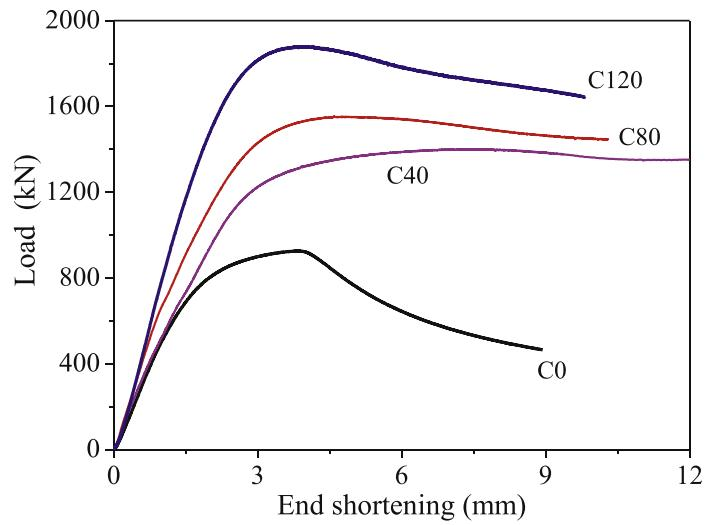  
(a) Series $89\times 3$ -A

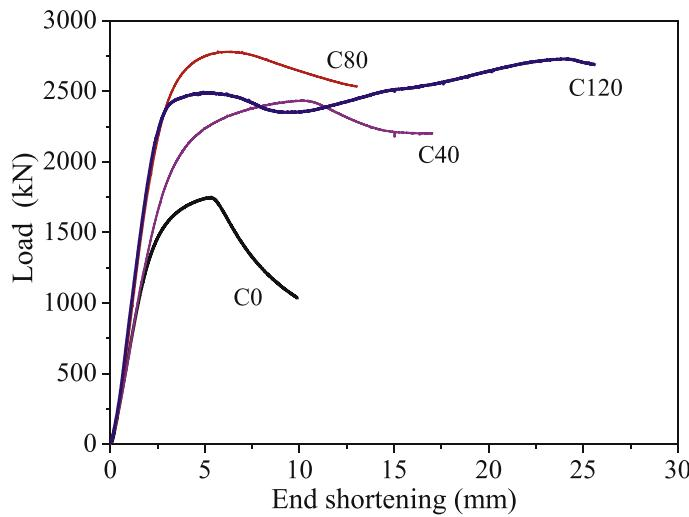  
(c) Series $108\times 4$ -B

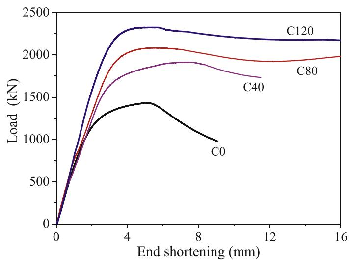  
(b) Series $89\times 4$ -B

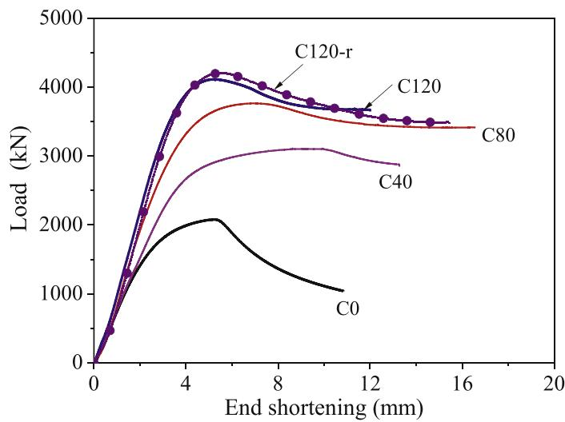  
(d) Series $133 \times 4$ -B   
Fig. 2. Load-end shortening curves of concrete-filled CFHSS circular stub columns.

loading, any possible gaps between the specimen and the contacting surfaces of the testing machine were eliminated. The bearing was then locked after pre-loading. Hence, the load was applied uniformly across the whole composite cross-section. Compressive load was applied by displacement control to the specimens with a constant rate of $0.2\mathrm{mm}/$ min using the servo-controlled hydraulic testing machine. By using this test method, the tests could be continued after experiencing the peak loads. The stub column tests were stopped when clear drops of axial loads were observed. A data logger was used to record the readings from the LVDTs and loads at the interval of 1 s. The load-end shortening responses of the test specimens were thus obtained.

# 2.4. Test strengths and curves

The compressive behaviour of the stub columns was observed during the tests. The ultimate load $(P_{t})$ of the test and the corresponding endshortening $(\delta_{u})$ , as well as the end-shortening $(\delta_{u,0.85})$ at $0.85P_{t}$ after each specimen experienced its ultimate load are shown in Table 4. The applied load versus axial end-shortening relationship was obtained for each column specimen (see Fig. 2(a)-(d)), where the applied load was recorded from the actuator and the end-shortening was measured by the average readings of the LVDTs. One repeated test was conducted on

specimen $133 \times 4$ -C120-B-r, and the ultimate load of the repeated test was very close to the first test (Specimen $133 \times 4$ -C120-B) result with a difference of $2.2\%$ . This small difference indicated the reliability of the test results. The ultimate loads of the concrete-filled stub column specimens were normalized with those without inflated concrete for the same series, as shown in Table 4. It is clearly shown that the ultimate loads of the tubular specimens were significantly improved by the inflated of concrete in this study, namely, $51\% - 103\%$ for Series $89 \times 3$ , $34\% - 62\%$ for Series $89 \times 4$ , $39\% - 59\%$ for Series $108 \times 4$ and $50\% - 202\%$ for Series $133 \times 4$ .

# 2.5. Failure modes

All the concrete-filled CFHSS circular stub columns failed by the crushing of the infilled concrete together with outward buckling of the steel tubes at some locations. It should be noted that the use of steel rings at the ends of the columns was able to prevent the "elephant foot" failure of the specimens. The local buckling failure was observed for all the specimens. The inward and outward local buckling behaviour was found in specimens without infilled concrete, i.e., specimens $89 \times 3$ -C0-A, $89 \times 4$ -C0-B, $108 \times 4$ -C0-B and $133 \times 4$ -C0-B. However, the inward local buckling phenomenon was not observed in all the concrete-filled CFHSS

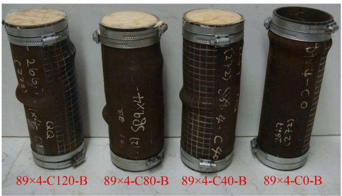  
Fig. 3. Failure modes of CFHSS circular stub column specimens for Series 89 $\times 4$ .

circular stub columns, as it was prevented by the filled concrete in the steel tubes. Fig. 3 illustrates the failure modes of the tested concretefilled CFHSS circular stub column Series $89 \times 4$ . The failure mode of specimen $89 \times 4$ -C0-B that without filled concrete are also presented.

# 3. Numerical investigation

# 3.1. Development of FEM

Finite element model (FEM) was developed to simulate the tests of concrete-filled CFHSS circular stub column specimens. A commercial software ABAQUS of version 6.14 [34] was used to develop the FEM. The measured specimen dimensions (see Table 3), and material properties of the steel (see Table 1) and concrete (see Table 2) presented in Section 2 of this paper were used in the analysis of FEM.

# 3.1.1. General

The steel tube and concrete core were assigned by the S4R (four-node shell element with reduced integration) and the C3D8R (8-node linear brick element with reduced integration and hourglass control), respectively. Based on the mesh convergence study, the element mesh size of $D / 15$ for the steel tube and $D / 7.5$ for the concrete core was used. The meshed concrete core and CFHSS circular tube are shown in Fig. 4(a)-(b). The engineering stress-strain curves of CFHSS measured by the coupon tests were converted to true stress-true plastic strain curves. The true stress-true plastic strain curves were mimic by means of a piecewise linear stress-strain model.

The interactive behaviour between the steel tube and concrete was simulated using the interaction algorithm in ABAQUS [34]. The inner surface of the steel tube and the outer surface of the filled concrete were defined to be a contact pair, of which the former acted as slave surface and the latter acted as master surface. Previous investigations [35] have shown that a friction coefficient from 0.1 to 0.5 generally causes limited effect on the prediction of the ultimate strength, but a smaller friction factor may induce a convergent problem with large deformation. It should be noted that different friction coefficients have been used in literature, for examples, coefficients of 0.25 [36], 0.3 [37] and 0.6 [38]. In the present study, the friction factor of 0.25 in the tangential direction between the concrete and steel was used, while the "hard contact" behaviour in the normal direction was assumed with no penetration allowed between the surfaces.

Local imperfections were considered in the FEM of the circular tubular stub column specimens that without inflated concrete (i.e., specimens $89 \times 3$ -C0-A, $89 \times 4$ -C0-B, $108 \times 4$ -C0-B and $133 \times 4$ -C0-B), as those FEM for CFHSS circular tubular stub columns performed by Ma et al. [39]. However, local imperfections of steel tubes for concrete-filled CFHSS circular stub columns were not considered. This is because the influence of local imperfections on the behaviour of concrete-filled steel

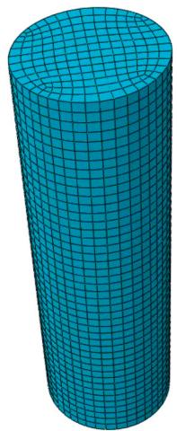  
(a) Meshed concrete core

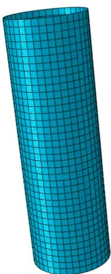  
(b) Meshed steel tube

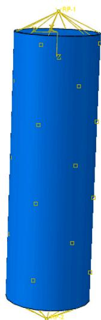  
(c) Assembled concrete-filled CFHSS stub column   
Fig. 4. Meshed and assembled concrete-filled CFHSS circular stub column.

stub columns is negligible due to the filled concrete. This has been proved by the sensitivity study for the effects of imperfections on the structural behaviour of concrete-filled stainless steel and carbon steel tubular stub columns, as detailed in Tao et al. [40,41]. Hence, unlike the

FEM for CFHSS circular tubular stub columns [39], the initial imperfections of steel tubes were not considered in the FEM for the concrete-filled CFHSS stub columns in the present study.

A reference node located at the centroid of the cross-section for each column end was defined. The reference node was coupled with the corresponding cross-section at each column end in displacements and rotations. Hence, the boundary conditions of each stub column were associated with the reference nodes at both ends. The reference nodes were restrained against all degrees of freedom, except for the longitudinal displacement (along the length direction of the stub column) at the loading point. A typical assembled specimen with the reference nodes coupled with the cross-section ends is shown in Fig. 4(c). A specified axial displacement was assigned to the reference node at the loading point. General Static analysis step was adopted. Hence, the adopted displacement control method in the tests was simulated in the FEM analyses. The nonlinear geometric parameter (NLGEOM) was enabled to deal with the large displacement analysis.

# 3.1.2. Parameters of the confined concrete

The lateral expansion of the infilled concrete is confined by the outer steel tube when the stub columns subjected to axial compression. This confinement helps to increase the strength and ductility of concrete, which refers as "composite action" between the steel tube and infilled concrete [4,42]. In this study, the confined model of concrete that proposed by Tao et al. [43] was adopted in the FEM.

The key parameters in determining the "concrete damaged plasticity" of the confined concrete model were summarized in the following. These included the dilation angle $(\psi)$ , flow potential eccentricity, the ratio of the compressive strength under biaxial loading to uniaxial compressive strength $(f_{b0} / f_{ck})$ , the ratio of the second stress invariant on the tensile meridian to that on the compressive meridian $(K)$ , viscosity parameter, compressive behaviour and fracture energy $(G_F)$ .

The dilation angle was assumed to be a function of the "confinement factor, $\xi c$ for concrete filled steel stub column specimens with circular cross-section [43], as given by Equation (1):

$$
\psi = \left\{ \begin{array}{l l} 5 6. 3 \left(1 - \xi_ {c}\right) & \text {f o r} \xi_ {c} \leq 0. 5 \\ 6. 6 7 2 e ^ {\frac {7 . 4}{4 . 6 4 + \xi_ {c}}} & \text {f o r} \xi_ {c} > 0. 5 \end{array} \right. \tag {1}
$$

In which the confinement factor $\xi_{c}$ is determined by Equation (2):

$$
\xi_ {c} = \frac {A _ {\mathrm {s}} f _ {0 . 2}}{A _ {c} f _ {c k}} \tag {2}
$$

where $A_{s}$ and $A_{c}$ are cross-sectional areas of steel tube and filled concrete, respectively.

The flow potential eccentricity and viscosity parameters were taken as $-0.1$ and $0$ , respectively. The ratio of $f_{b0} / f_{ck}$ was determined by $1.5f_{ck}^{0.075}$ , as suggested by Papanikolaou and Kappos [44]. Hence, in the validation of the FEM, the actual ratios of $f_{b0} / f_{ck}$ for concretes C40, C80 and C120 were taken as 1.148, 1.074 and 1.051, respectively, based on the respective measured strengths of $35.5\mathrm{MPa}$ , $85.7\mathrm{MPa}$ and $114.9\mathrm{MPa}$ , as shown in Table 2.

The ratio of $K$ is one of the important parameters for determining the yield surface of concrete plasticity model. It is commonly taken from 0.5 to 1.0 by the researchers while the default value is 2/3 in ABAQUS [34]. In this study, the equation proposed by Yu et al. [45] was used to calculate the ratio of $K$ . Thus, the values of $K$ were 0.72, 0.71 and 0.70 for concrete grades of C40, C80 and C120, respectively. In addition, the fracture energy $(G_{F})$ was determined based on reference [46,47], which are 0.068, 0.11 and 0.143 for concrete grades of C40, C80 and C120, respectively.

Table 5 Comparison of ultimate loads between test results and FE predictions.   

<table><tr><td>Specimens</td><td>Pt(kN)</td><td>PEFA(kN)</td><td>Pt/PEFA</td></tr><tr><td>89 × 3-C0-A</td><td>926</td><td>903</td><td>1.03</td></tr><tr><td>89 × 3-C40-A</td><td>1400</td><td>1339</td><td>1.05</td></tr><tr><td>89 × 3-C80-A</td><td>1554</td><td>1497</td><td>1.04</td></tr><tr><td>89 × 3-C120-A</td><td>1880</td><td>1709</td><td>1.10</td></tr><tr><td>89 × 4-C0-B</td><td>1431</td><td>1377</td><td>1.04</td></tr><tr><td>89 × 4-C40-B</td><td>1914</td><td>1965</td><td>0.97</td></tr><tr><td>89 × 4-C80-B</td><td>2083</td><td>2096</td><td>0.99</td></tr><tr><td>89 × 4-C120-B</td><td>2324</td><td>2427</td><td>0.96</td></tr><tr><td>108 × 4-C0-B</td><td>1749</td><td>1787</td><td>0.98</td></tr><tr><td>108 × 4-C40-B</td><td>2433</td><td>2506</td><td>0.97</td></tr><tr><td>108 × 4-C80-B</td><td>2783</td><td>2766</td><td>1.01</td></tr><tr><td>108 × 4-C120-B</td><td>2729</td><td>2933</td><td>0.93</td></tr><tr><td>133 × 4-C0-B</td><td>2078</td><td>2089</td><td>0.99</td></tr><tr><td>133 × 4-C40-B</td><td>3110</td><td>3095</td><td>1.00</td></tr><tr><td>133 × 4-C80-B</td><td>3764</td><td>3471</td><td>1.08</td></tr><tr><td>133 × 4-C120-B</td><td>4111</td><td>3916</td><td>1.05</td></tr><tr><td>133 × 4-C120-B-r</td><td>4203</td><td>3916</td><td>1.07</td></tr><tr><td></td><td></td><td>Mean</td><td>1.01</td></tr><tr><td></td><td></td><td>COV</td><td>0.050</td></tr></table>

# 3.2. Stress-strain of the confined concrete model

As mentioned previously, the stress-strain model (three stages) of the infilled concrete that considering the strain hardening/softening rule of concrete core as proposed by Tao et al. [43], employing the developed models [48,49], was used in this study, as illustrated in the following.

The initial stage $(0 < \varepsilon \leq \varepsilon_{c0})$ of the curve was determined by Equation (3) [48]:

$$
\frac {\sigma}{f _ {c k}} = \frac {A X + B X ^ {2}}{1 + (A - 2) X + (B + 1) X ^ {2}} \quad 0 <   \varepsilon \leq \varepsilon_ {c 0} \tag {3}
$$

In which $X = \varepsilon / \varepsilon_{c0}$ ; $A = E_{c} \varepsilon_{c0} / f_{ck}$ ; $B = (A - 1)^{2} / 0.55 - 1$ ; $E_{c}$ is the Young's modulus of the filled concrete; $\varepsilon_{c0}$ is the strain at peak stress under uniaxial compression determined by using Equation (4) [49].

$$
\varepsilon_ {c 0} = 0. 0 0 0 7 6 + \sqrt {\left(0 . 6 2 6 f _ {c k} - 4 . 3 3\right) \times 1 0 ^ {- 7}} \tag {4}
$$

In the second stage $(\varepsilon_{c0} < \varepsilon \leq \varepsilon_{cc})$ of the curve, the relationship of stress-strain was determined by the following Equations (5) and (6):

$$
\frac {\varepsilon_ {c c}}{\varepsilon_ {c 0}} = e ^ {k} \tag {5}
$$

$$
k = (2. 9 2 2 4 - 0. 0 0 3 6 7 f _ {c k}) \left(\frac {f _ {B}}{f _ {c k}}\right) ^ {0. 3 1 2 4 + 0. 0 0 2 f _ {c k}} \tag {6}
$$

where $f_{B}$ represents the confining stress in concrete at strain of $\varepsilon_{cc}$ . The confining stress of $f_{B}$ was determined by Equation (7):

$$
f _ {B} = \frac {\left(1 + 0 . 0 2 7 f _ {0 . 2}\right) e ^ {- 0 . 0 2 \frac {D}{t}}}{1 + 1 . 6 e ^ {- 1 0} \left(f _ {c k}\right) ^ {4 . 8}} \tag {7}
$$

The last stage $(\varepsilon_{cc} < \varepsilon)$ , i.e., descending branch, of the stress-strain curve was determined by Equation (8):

$$
\sigma = f _ {r} + \left(f _ {c k} - f _ {r}\right) \exp \left[ - \left(\frac {\varepsilon - \varepsilon_ {c c}}{\alpha}\right) ^ {\beta} \quad \varepsilon \geq \varepsilon_ {c c} \right. \tag {8}
$$

where $f_{r}$ is the residual stress as determined by Equation (9). The parameters $\alpha$ and $\beta$ are the factors that influence the shape of curve.

$$
f _ {r} = 0. 7 \left(1 - e ^ {- 1. 3 8 \xi_ {c}}\right) f _ {c} \leq 0. 2 5 f _ {c} \tag {9}
$$

The parameter $\alpha$ is calculated as:

$$
\alpha = 0. 0 4 - \frac {0 . 0 3 6}{1 + e ^ {6 . 0 8 \xi_ {\mathrm {c}} - 3 . 4 9}} \tag {10}
$$

The parameter $\beta$ is taken as 1.2 for concrete-filled circular steel stub columns [43].

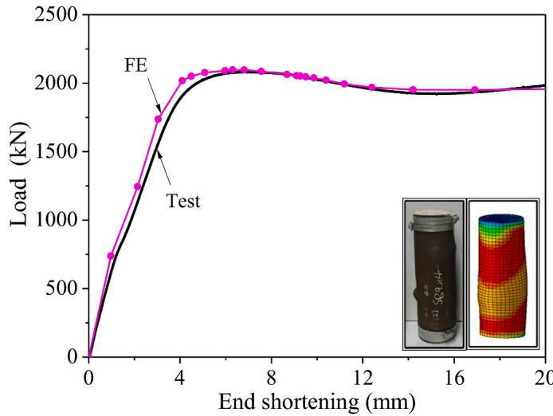  
Fig. 5. Comparison of test results and numerical predictions for Specimen $89 \times$ 4-C80-B.

# 3.3. Validation of FEM

Based on the developed FEM by using the measured dimensions and material properties, the modelling parameters as well as the confined concrete model, the analysis of the FE were performed. The developed FEM was validated by comparing the FE results with the test results in terms of the ultimate loads, failure modes and the load-end shortening curves. The comparison of the ultimate loads $(P_{t})$ from tests with those $(P_{FEA})$ predicted from the FE analysis are shown in Table 5. The mean value of the $P_{t} / P_{FEA}$ is 1.01 with the corresponding coefficient of variation (COV) of 0.050. It is shown that the developed FEM can successfully replicate the ultimate capacities of the concrete-filled CFHSS circular stub columns. Fig. 5 illustrates the comparison of load-end shortening curves and failure modes obtained from the test and FEA for specimen $89\times 4$ -C80-B.

# 4. Parametric study

# 4.1. Design of specimens

The validated FEM was used to perform a further study on the behaviour of concrete-filled CFHSS circular stub columns. The parameters that may affect the structural behaviour of the stub columns were considered, including the cross-section dimensions, section slenderness (ratios of $D / t$ ), 0.2% proof stress of the steel tubes (steel grades), strengths of infilled concrete (concrete grades). A total of 32 specimens were carefully designed to cover a wide range of parameters. The values of $D$ and the ratios of $D / t$ varied from 78 to 300 mm and from 26.0 to 60.0, respectively. The stress-strain curves of sections $89 \times 3$ and $133 \times 4$ having the respective nominal $f_{0.2}$ of 900 MP and 1100 MPa were used. As those of the test specimens, the grades of the infilled concrete were C40, C80 and C120 (i.e., the nominal $f_{ck}$ of 40, 80 and 120 MPa), and the length of each stub column was taken to be 3.0D. The dimensions of concrete-filled CFHSS circular stub columns used in this parametric study are detailed in Table 6. The criterion for the specimen labelling is the same as those described in Section 2.2 of this paper. In this sense, the "A" and "B" represent the different steel grades by using stress-strain curves of sections $89 \times 3$ ( $f_{0.2} = 900$ MPa) and $133 \times 4$ ( $f_{0.2} = 1100$ MPa), respectively. The CFHSS stub columns without infilled concrete are also included, as distinguished by the segment "C0".

# 4.2. Definition of parameters

The parametric study of the concrete-filled CFHSS circular stub

Table 6 Dimensions and results of concrete-filled CFHSS circular stub columns in parametric study.   

<table><tr><td>Specimens</td><td>D/t</td><td>As(mm2)</td><td>Ac(mm2)</td><td>PFEA(kN)</td><td>δu(mm)</td><td>δu,0.85(mm)</td><td>Nor.</td></tr><tr><td>78 × 3-C0-A</td><td>26.0</td><td>706.9</td><td>-</td><td>773</td><td>2.87</td><td>3.72</td><td>1.00</td></tr><tr><td>78 × 3-C40-A</td><td>26.0</td><td>706.9</td><td>4071.5</td><td>1259</td><td>4.30</td><td>6.97</td><td>1.63</td></tr><tr><td>78 × 3-C80-A</td><td>26.0</td><td>706.9</td><td>4071.5</td><td>1366</td><td>3.68</td><td>6.47</td><td>1.77</td></tr><tr><td>78 × 3-C120-A</td><td>26.0</td><td>706.9</td><td>4071.5</td><td>1435</td><td>2.62</td><td>5.70</td><td>1.86</td></tr><tr><td>160 × 4-C0-A</td><td>40.0</td><td>1960.4</td><td>-</td><td>2047</td><td>4.72</td><td>5.96</td><td>1.00</td></tr><tr><td>160 × 4-C40-A</td><td>40.0</td><td>1960.4</td><td>18145.8</td><td>3760</td><td>8.01</td><td>12.79</td><td>1.84</td></tr><tr><td>160 × 4-C80-A</td><td>40.0</td><td>1960.4</td><td>18145.8</td><td>4050</td><td>6.56</td><td>11.29</td><td>1.98</td></tr><tr><td>160 × 4-C120-A</td><td>40.0</td><td>1960.4</td><td>18145.8</td><td>4629</td><td>3.75</td><td>9.92</td><td>2.26</td></tr><tr><td>240 × 5-C0-A</td><td>48.0</td><td>3691.4</td><td>-</td><td>3614</td><td>5.81</td><td>6.76</td><td>1.00</td></tr><tr><td>240 × 5-C40-A</td><td>48.0</td><td>3691.4</td><td>41547.6</td><td>7322</td><td>11.18</td><td>17.71</td><td>2.03</td></tr><tr><td>240 × 5-C80-A</td><td>48.0</td><td>3691.4</td><td>41547.6</td><td>8116</td><td>6.56</td><td>15.75</td><td>2.25</td></tr><tr><td>240 × 5-C120-A</td><td>48.0</td><td>3691.4</td><td>41547.6</td><td>9497</td><td>5.51</td><td>13.56</td><td>2.63</td></tr><tr><td>300 × 5-C0-A</td><td>60.0</td><td>4633.8</td><td>-</td><td>3820</td><td>6.00</td><td>7.21</td><td>1.00</td></tr><tr><td>300 × 5-C40-A</td><td>60.0</td><td>4633.8</td><td>66052.0</td><td>9343</td><td>12.96</td><td>21.40</td><td>2.45</td></tr><tr><td>300 × 5-C80-A</td><td>60.0</td><td>4633.8</td><td>66052.0</td><td>11,166</td><td>6.87</td><td>17.68</td><td>2.92</td></tr><tr><td>300 × 5-C120-A</td><td>60.0</td><td>4633.8</td><td>66052.0</td><td>13,379</td><td>5.68</td><td>13.25</td><td>3.50</td></tr><tr><td>78 × 3-C0-B</td><td>26.0</td><td>706.9</td><td>-</td><td>905</td><td>2.97</td><td>3.33</td><td>1.00</td></tr><tr><td>78 × 3-C40-B</td><td>26.0</td><td>706.9</td><td>4071.5</td><td>1446</td><td>4.86</td><td>7.51</td><td>1.60</td></tr><tr><td>78 × 3-C80-B</td><td>26.0</td><td>706.9</td><td>4071.5</td><td>1534</td><td>4.24</td><td>7.28</td><td>1.70</td></tr><tr><td>78 × 3-C120-B</td><td>26.0</td><td>706.9</td><td>4071.5</td><td>1601</td><td>3.98</td><td>6.29</td><td>1.77</td></tr><tr><td>160 × 4-C0-B</td><td>40.0</td><td>1960.4</td><td>-</td><td>2360</td><td>4.45</td><td>6.07</td><td>1.00</td></tr><tr><td>160 × 4-C40-B</td><td>40.0</td><td>1960.4</td><td>18145.8</td><td>4584</td><td>10.33</td><td>18.57</td><td>1.94</td></tr><tr><td>160 × 4-C80-B</td><td>40.0</td><td>1960.4</td><td>18145.8</td><td>4571</td><td>7.62</td><td>12.85</td><td>1.94</td></tr><tr><td>160 × 4-C120-B</td><td>40.0</td><td>1960.4</td><td>18145.8</td><td>5072</td><td>4.05</td><td>11.39</td><td>2.15</td></tr><tr><td>240 × 5-C0-B</td><td>48.0</td><td>3691.4</td><td>-</td><td>4177</td><td>5.90</td><td>6.73</td><td>1.00</td></tr><tr><td>240 × 5-C40-B</td><td>48.0</td><td>3691.4</td><td>41547.6</td><td>8197</td><td>12.96</td><td>20.27</td><td>1.96</td></tr><tr><td>240 × 5-C80-B</td><td>48.0</td><td>3691.4</td><td>41547.6</td><td>9029</td><td>6.56</td><td>18.11</td><td>2.16</td></tr><tr><td>240 × 5-C120-B</td><td>48.0</td><td>3691.4</td><td>41547.6</td><td>10,238</td><td>5.43</td><td>15.21</td><td>2.45</td></tr><tr><td>300 × 5-C0-B</td><td>60.0</td><td>4633.8</td><td>-</td><td>4409</td><td>6.56</td><td>7.76</td><td>1.00</td></tr><tr><td>300 × 5-C40-B</td><td>60.0</td><td>4633.8</td><td>66052.0</td><td>10,602</td><td>14.74</td><td>23.65</td><td>2.40</td></tr><tr><td>300 × 5-C80-B</td><td>60.0</td><td>4633.8</td><td>66052.0</td><td>11,712</td><td>7.32</td><td>18.49</td><td>2.66</td></tr><tr><td>300 × 5-C120-B</td><td>60.0</td><td>4633.8</td><td>66052.0</td><td>13,274</td><td>9.85</td><td>14.35</td><td>3.01</td></tr></table>

Note: "Nor." represents the $P_{FEA}$ normalized by that without inflated concrete in the same series.

columns aims to study its structural behaviour under axial compression. These included the ultimate load, end shortening, the strength enhancement index $(SI)$ , and the section constraining factor $(\xi)$ as well as the ductility index $(DI)$ [33]. In the calculation of the $SI$ and the $\xi$ ,

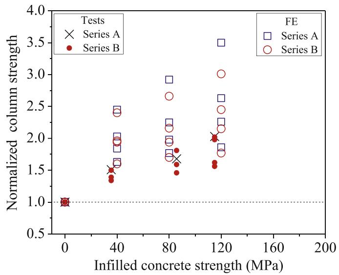  
(a) Sorted by different steel grades

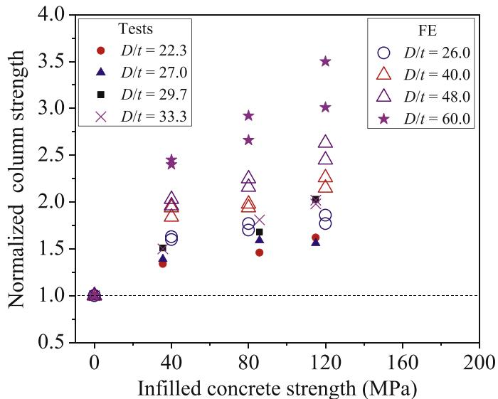  
(b) Sorted by different $D / t$ ratios   
Fig. 6. Comparison of column strength enhancement with different inflated concrete strengths.

measured values of the material properties (see Table 1), the concrete cylinder strengths at the day of the stub column tests (see Table 2) and specimen dimensions (see Table 3) were used.

The strength enhancement index $(SI)$ , as expressed in Equation (11), is defined by the ratio of the ultimate compressive load $(P_u)$ of the concrete-filled steel tubular stub column to the sum of the strengths of the individual constituent components (i.e., the concrete core and steel tube). The parameter $SI$ reflects the contribution of composite action in concrete-filled CFHSS circular stub columns. A $SI$ value higher than 1.0 indicates that the positive interaction between the steel hollow section and the concrete core was achieved. The positive interaction benefits from the confinement effect of the concrete core from the steel tube, as well as the contribution of the concrete core to the delay or elimination of the local buckling in the steel tubular hollow section.

$$
\boldsymbol {S I} = P _ {u} / \left(f _ {0. 2} A _ {s} + f _ {c k} A _ {c}\right) \tag {11}
$$

The section constraining factor $(\xi)$ , as expressed in Equation (12), is defined by the ratio of the yield strength of steel hollow section $(f_{0,2}A_s)$

Table 7 Comparison of the behaviour for concrete-filled CFHSS circular stub columns.   

<table><tr><td>Specimens</td><td>ξ</td><td>SI</td><td>DI</td></tr><tr><td>89 × 3-C0-A</td><td>-</td><td>-</td><td>1.29</td></tr><tr><td>89 × 3-C40-A</td><td>4.15</td><td>1.42</td><td>2.17</td></tr><tr><td>89 × 3-C80-A</td><td>1.70</td><td>1.24</td><td>2.24</td></tr><tr><td>89 × 3-C120-A</td><td>1.28</td><td>1.33</td><td>2.39</td></tr><tr><td>89 × 4-C0-B</td><td>-</td><td>-</td><td>1.36</td></tr><tr><td>89 × 4-C40-B</td><td>6.18</td><td>1.46</td><td>1.59</td></tr><tr><td>89 × 4-C80-B</td><td>2.56</td><td>1.32</td><td>3.57</td></tr><tr><td>89 × 4-C120-B</td><td>1.90</td><td>1.35</td><td>3.24</td></tr><tr><td>108 × 4-C0-B</td><td>-</td><td>-</td><td>1.26</td></tr><tr><td>108 × 4-C40-B</td><td>5.60</td><td>1.31</td><td>1.08</td></tr><tr><td>108 × 4-C80-B</td><td>2.35</td><td>1.23</td><td>2.30</td></tr><tr><td>108 × 4-C120-B</td><td>1.77</td><td>1.08</td><td>-</td></tr><tr><td>133 × 4-C0-B</td><td>-</td><td>-</td><td>1.19</td></tr><tr><td>133 × 4-C40-B</td><td>4.26</td><td>1.35</td><td>1.37</td></tr><tr><td>133 × 4-C80-B</td><td>1.76</td><td>1.29</td><td>2.43</td></tr><tr><td>133 × 4-C120-B</td><td>1.31</td><td>1.25</td><td>2.31</td></tr><tr><td>133 × 4-C120-B-r</td><td>1.31</td><td>1.28</td><td>2.16</td></tr><tr><td>78 × 3-C0-A</td><td>-</td><td>-</td><td>1.30</td></tr><tr><td>78 × 3-C40-A</td><td>4.25</td><td>1.47</td><td>1.62</td></tr><tr><td>78 × 3-C80-A</td><td>2.13</td><td>1.34</td><td>1.76</td></tr><tr><td>78 × 3-C120-A</td><td>1.42</td><td>1.21</td><td>2.18</td></tr><tr><td>160 × 4-C0-A</td><td>-</td><td>-</td><td>1.26</td></tr><tr><td>160 × 4-C40-A</td><td>2.65</td><td>1.42</td><td>1.60</td></tr><tr><td>160 × 4-C80-A</td><td>1.32</td><td>1.20</td><td>1.72</td></tr><tr><td>160 × 4-C120-A</td><td>0.88</td><td>1.13</td><td>2.65</td></tr><tr><td>240 × 5-C0-A</td><td>-</td><td>-</td><td>1.16</td></tr><tr><td>240 × 5-C40-A</td><td>2.18</td><td>1.39</td><td>1.58</td></tr><tr><td>240 × 5-C80-A</td><td>1.09</td><td>1.17</td><td>2.40</td></tr><tr><td>240 × 5-C120-A</td><td>0.73</td><td>1.10</td><td>2.46</td></tr><tr><td>300 × 5-C0-A</td><td>-</td><td>-</td><td>1.20</td></tr><tr><td>300 × 5-C40-A</td><td>1.72</td><td>1.30</td><td>1.65</td></tr><tr><td>300 × 5-C80-A</td><td>0.86</td><td>1.14</td><td>2.57</td></tr><tr><td>300 × 5-C120-A</td><td>0.57</td><td>1.07</td><td>2.33</td></tr><tr><td>78 × 3-C0-B</td><td>-</td><td>-</td><td>1.12</td></tr><tr><td>78 × 3-C40-B</td><td>5.05</td><td>1.47</td><td>1.55</td></tr><tr><td>78 × 3-C80-B</td><td>2.53</td><td>1.34</td><td>1.72</td></tr><tr><td>78 × 3-C120-B</td><td>1.68</td><td>1.22</td><td>1.58</td></tr><tr><td>160 × 4-C0-B</td><td>-</td><td>-</td><td>1.36</td></tr><tr><td>160 × 4-C40-B</td><td>3.14</td><td>1.52</td><td>1.80</td></tr><tr><td>160 × 4-C80-B</td><td>1.57</td><td>1.22</td><td>1.69</td></tr><tr><td>160 × 4-C120-B</td><td>1.05</td><td>1.14</td><td>2.81</td></tr><tr><td>240 × 5-C0-B</td><td>-</td><td>-</td><td>1.14</td></tr><tr><td>240 × 5-C40-B</td><td>2.59</td><td>1.38</td><td>1.56</td></tr><tr><td>240 × 5-C80-B</td><td>1.29</td><td>1.18</td><td>2.76</td></tr><tr><td>240 × 5-C120-B</td><td>0.86</td><td>1.10</td><td>2.80</td></tr><tr><td>300 × 5-C0-B</td><td>-</td><td>-</td><td>1.18</td></tr><tr><td>300 × 5-C40-B</td><td>2.04</td><td>1.32</td><td>1.60</td></tr><tr><td>300 × 5-C80-B</td><td>1.02</td><td>1.10</td><td>2.53</td></tr><tr><td>300 × 5-C120-B</td><td>0.68</td><td>1.00</td><td>1.46</td></tr></table>

to the compressive strength of the concrete core section $(f_{ck}A_c)$ . The $\xi$ is one of the factors that reflect the confinement of steel tube to the concrete core, with the higher value of $\xi$ indicating stronger confinement effect.

$$
\xi = \left(f _ {0. 2} A _ {s}\right) / \left(f _ {c k} A _ {c}\right) \tag {12}
$$

The ductility index $(DI)$ , as expressed in Equation (13), is defined as the ratio of the $\delta_{u,0.85}$ to $\delta_{u}$ ; where $\delta_{u}$ is the end-shortening at $P_{w}$ and $\delta_{u,0.85}$ is the end-shortening at $85\%$ of the $P_{u}$ after the specimen experiences the $P_{u}$ . The higher value of the parameter $DI$ represents that the better ductility of the specimens.

$$
\boldsymbol {D I} = \delta_ {u, 0. 8 5} / \delta_ {u} \tag {13}
$$

# 4.3. Influence of parameters

The parametric study results are presented in Table 6, including $P_{FEA}$ , $\delta_{u}$ and $\delta_{u,0.85}$ for the concrete-filled CFHSS circular stub column specimens. The stub column specimens without inflated concrete (specimens $D \times t$ -C0-A and $D \times t$ -C0-B), which had the same nominal section sizes as

  
Fig. 7. Effects of $D / t$ on $SI$ for different filled concrete strengths.

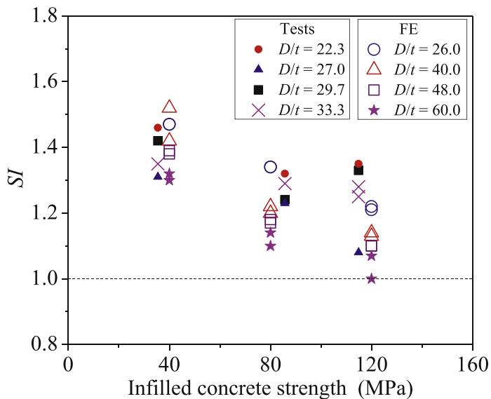  
Fig. 8. Effects of inflated concrete strength on strength enhancement index (SI) for different ratios of $D / t$ .

those specimens with the filled concrete, were also included. The areas of the steel tube $(A_{s})$ and concrete core $(A_{c})$ for each specimen, calculated based on the nominal section dimensions, are presented. In addition, the ultimate loads of the concrete-filled CFHSS circular stub column specimens were normalized by the ultimate load of the CFHSS tubular specimen (without inflated concrete) in the same series, as indicated by "Nor." in Table 6. These normalized column strengths were plotted against the inflated concrete strengths associated with different grades of circular steel tubes and the ratios of $D / t$ , as shown in Fig. 6(a)-(b), respectively. It was generally found that the normalized column strength increased linearly with the increment of the inflated concrete strength for the CFHSS circular stub column specimens with a given value of $D / t$ (see Fig. 6(b)), where the inflated concrete strength of "0" in the horizontal axis means the CFHSS circular stub column specimens without any inflated concrete. Similar findings have been presented by Cai et al. [33] for concrete-filled cold-formed and hot-finished steel elliptical tubular stub columns.

The behaviour of the concrete-filled CFHSS circular stub column specimens was investigated in terms of the parameters of $SI, \xi$ and $DI$

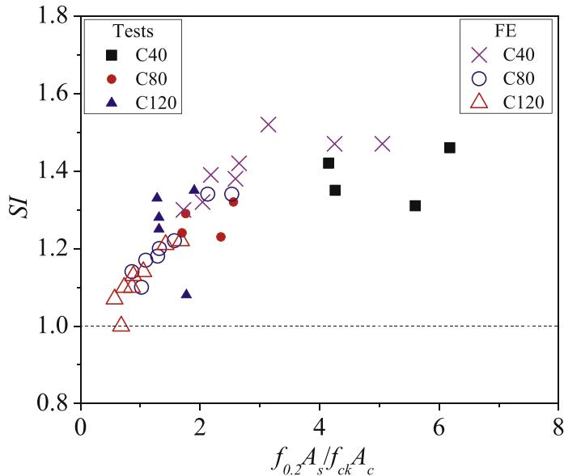  
Fig. 9. Effects of section constraining factor on $SI$ for different filled concrete strengths.

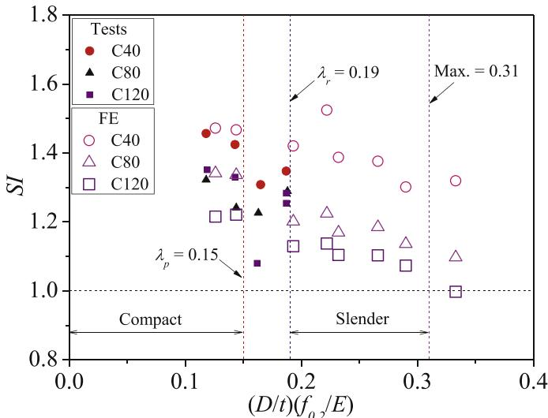  
Fig. 10. Effects of section slenderness limit on $SI$ for AISC [12].

based on the results from the tests and FEA, as shown in Table 7. Fig. 7 presents the relationships between the strength enhancement index $(SI)$ and ratios of $D / t$ for different grades of inflated concrete strength. As shown in Fig. 7, under a given inflated concrete strength, the value of $SI$ decreased regularly as the value of $D / t$ increased regardless of different material properties of steel used for the outer tubes. Similar finds have been presented in Wei et al. [1]. Generally, the value of $SI$ also decreases with the increment of the inflated concrete strength under the same value $D / t$ , as illustrated in Fig. 8. As shown in Fig. 8, under a given inflated concrete strength, a smaller value of $D / t$ (i.e., from slender to compact) generally yielded a better strength enhancement due to the larger $SI$ value, as already reflected in Fig. 7.

The relationship between $SI$ and $\xi$ is presented in Fig. 9. It was found that, for the concrete-filled CFHSS circular stub column specimens, as the value of $\xi$ increased, a better strength enhancement was generally achieved (larger value of $SI$ ). However, the rate of increment for $SI$ started to be maintained or even reduced when the value of $\xi$ exceeded 4.0. Further evaluation of this relationship is recommended for the value of $\xi$ exceeds 4. The values of $SI$ were also plotted against the section slenderness limits from different design specifications, i.e., AISC [12],

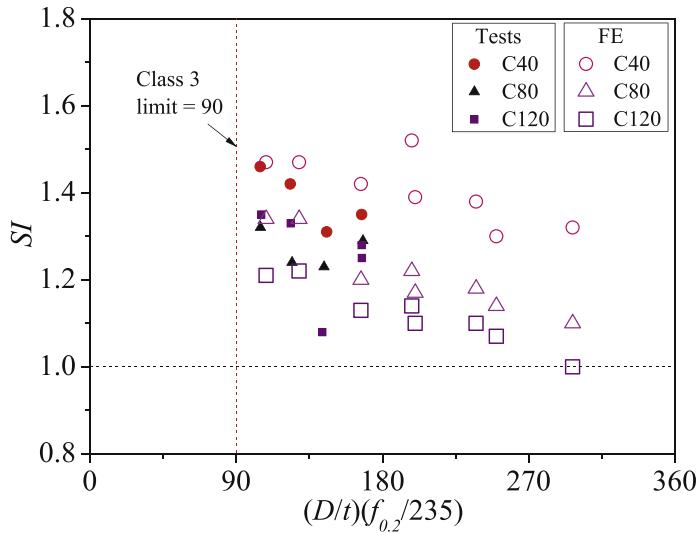  
Fig. 11. Effects of section slenderness limit on $SI$ for EC4 [29].

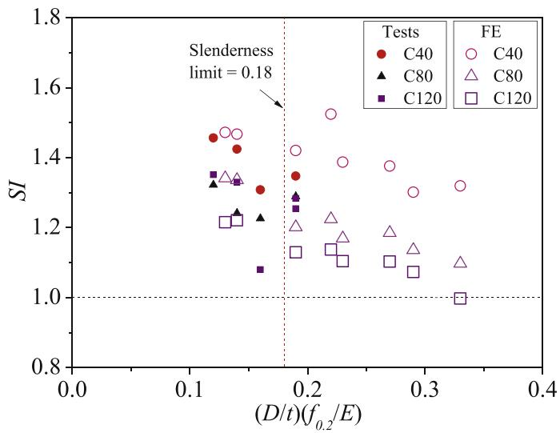  
Fig. 12. Effects of section slenderness limit on $SI$ for AIJ [30].

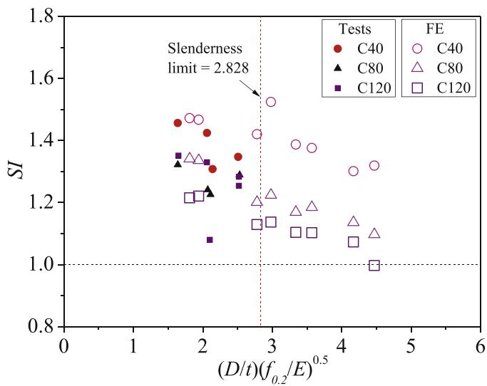  
Fig. 13. Effects of section slenderness limit on $SI$ for ACI [31].

EC4 [29], AIJ [30] and ACI [31] in Figs. 10-13, respectively. These will be discussed further in the later parts of this paper.

The ductility indexes $(DI)$ of the CFHSS stub columns with and without infilled concrete are presents in Table 7. As shown in the table, the values of $DI$ for the concrete-filled CFHSS circular stub column specimens were higher than those of specimens without infilled concrete, except for specimen $108 \times 4$ -C40-B. These results proofed that the ductility of the CFHSS circular stub column specimens could be enhanced by the infilled concrete, as discussed in Section 1 of this paper.

# 5. Assessment of existing design rules

# 5.1. General

Design of concrete-filled steel circular stub columns are provided by the existing international design specifications, as mentioned in Section 1 of this paper. Hence, in the present study, these existing design rules were used to calculate the nominal strengths of concrete-filled CFHSS circular stub columns, including design specifications of AISC [12], EC4 [29], AIJ [30] and ACI [31]. It should be noted that limitations of the design rules are specified in these specifications.

# 5.2. Eurocode 4: Design of Composite Steel and Concrete Structures (EC4)

EC4 [29] covers the design rules for encased, partially encased and concrete-filled columns both with and without reinforcements. In the present study, no reinforcement was used in the concrete-filled CFHHS stub columns. It should be noted that concrete grades over C60 are beyond the upper limit as stated in EC4 [29], where the strength classes of the normal weight concrete used in composite members range from C20/C25 to C50/C60 only. The compressive resistance of concrete-filled steel columns given in EC4 [29] accounts for not only the beneficial confining effect of the steel tube on the concrete, but also the corresponding reduction to the strength of the steel tube caused by those circumferential stresses arising from the restriction of the lateral expansion of the concrete. The nominal strength of a concrete-filled steel circular tubular column $(P_{EC4})$ in this study refers to those specified in Section 6.7.3 in EC4 [29], which can be calculated by Equation (14):

$$
P _ {E C 4} = \eta_ {a 0} f _ {0. 2} A _ {s} + f _ {c k} A _ {c} \left[ 1 + \eta_ {c 0} \frac {t}{D} \frac {f _ {0 . 2}}{f _ {c k}} \right] \tag {14}
$$

The steel reduction factor $\eta_{a0}$ and the concrete enhancement factor $\eta_{c0}$ for a composite section under pure axial load are given by Equation (15a)-(b), respectively:

$$
\eta_ {a 0} = 0. 2 5 (3 + 2 \bar {\lambda}) \leq 1 \tag {15a}
$$

$$
\eta_ {c 0} = 4. 9 - 1 8. 5 \bar {\lambda} + 1 7 \bar {\lambda} ^ {2} \geq 0 \tag {15b}
$$

where $\overline{\lambda}$ is the relative member slenderness [29]. EC4 [29] considers the confinement effect in circular columns when $\overline{\lambda}$ does not exceed 0.5. The values of $\overline{\lambda}$ are smaller than 0.5 for all the test and numerical specimens in the present study. It should be noted that the effective length factor was taken as 0.5 for all stub columns (with fixed ends) examined in the present study.

A local slenderness limit of the outer tube, $(D / t)(f_{0.2} / 235)\leq 90$ , is specified in Table 6.3 of EC4 [29], beyond which the local buckling needs to be explicitly accounted for. This limit for concrete-filled tubes is the same as the Class 3 slenderness limit for unfilled tubes (i.e., the beneficial effect of the infilled concrete on inhibiting the inward local buckling of the outer tube is ignored). Thus, a further investigation was recommended to determine a more appropriate limit for concrete-filled tubes [50]. In the present study, both the test specimens (shown in Table 3) and numerical specimens (shown in Table 6) exceed the above slenderness limit. Hence, in the present calculation for the cross-section

strengths of these specimens, an effective cross-section area $(A_{eff})$ by Equation (16) was used instead of the full cross-section area. This approach was also adopted by Wang et al. [50] to determine the cross-section strength of concrete-filled double skin CHS tubular stub columns.

$$
A _ {e f f} = A _ {s} \left[ \frac {9 0}{D / t} \frac {2 3 5}{f _ {0 . 2}} \right] ^ {0. 5} \tag {16}
$$

# 5.3. Specification for Structural Steel Buildings (AISC)

The nominal compressive strength $(P_{AISC})$ of concrete-filled steel circular tubular sections under axial loading refers to the design rules specified in Section I2.2 b in AISC [12]. These design rules apply to specimens with $f_{0.2} \leq 525\mathrm{MPa}$ and $21 \leq f_{ck} \leq 69\mathrm{MPa}$ . For the cross-section strengths of concrete-filled steel circular stub columns, sections are categorized as compact, non-compact or slender according to the diameter-to-thickness $(\lambda = D / t)$ ratios of the outer tubes, as specified in Section I1.4 and Table I1.1 a of AISC [12]. This has been discussed and assessed by Wang et al. [50] and Lai and Varma [51] for composite concrete-filled circular stub columns. The value of $P_{AISC}$ was determined by Equations (17)-(19):

For compact sections $(\lambda \leq \lambda_p)$

$$
P _ {A I S C} = P _ {p} \tag {17a}
$$

$$
P _ {p} = f _ {0. 2} A _ {s} + 0. 9 5 f _ {c k} A _ {c} \tag {17b}
$$

$$
\lambda_ {p} = 0. 1 5 E _ {s} / f _ {0. 2} \tag {17c}
$$

where $P_{p}$ is the compressive strength of compact sections; $\lambda_{p}$ is the slenderness limit for determining whether a section is compact or noncompact.

For non-compact sections $(\lambda_p < \lambda \leq \lambda_r)$ ,

$$
P _ {A I S C} = P _ {p} - \frac {P _ {p} - P _ {y}}{\left(\lambda_ {r} - \lambda_ {p}\right) ^ {2}} \left(\lambda - \lambda_ {p}\right) ^ {2} \tag {18a}
$$

$$
P _ {y} = f _ {0. 2} A _ {s} + 0. 7 f _ {c k} A _ {c} \tag {18b}
$$

$$
\lambda_ {r} = 0. 1 9 E _ {s} / f _ {0. 2} \tag {18c}
$$

where $P_{y}$ is the compressive strength of non-compact sections; $\lambda_r$ is the slenderness limit for determining whether a section is non-compact or slender.

For slender sections $(\lambda_r < \lambda \leq \lambda_{lim})$

$$
P _ {n o} = f _ {c r} A _ {s} + 0. 7 f _ {c k} A _ {c} \tag {19a}
$$

$$
f _ {c r} = 0. 7 2 f _ {0. 2} / \left(\frac {D}{t} \frac {f _ {0 . 2}}{E _ {s}}\right) ^ {0. 2} \tag {19b}
$$

$$
\lambda_ {l i m} = 0. 3 1 E _ {s} / f _ {0. 2} \tag {19c}
$$

where $f_{cr}$ is the compressive strength of slender sections. In the present study, all the CFHSS specimens are categorized as compact, noncompact or slender sections based on the above criterion except Series $300 \times 5$ -B specimens in the parametric study, whose section slenderness $(\lambda)$ exceeds the limit of $0.31E_{s} / f_{0.2}$ . Since the section slenderness beyond this value is not explicitly specified in the AISC [12], the effective section area in Equation (16) is also adopted in the calculation of the nominal strengths $(P_{AISC})$ for Series $300 \times 5$ -B specimens.

Table 8 Comparison of test and FE results with predictions from different design codes.   

<table><tr><td>Specimens</td><td>Pu/PEC4</td><td>Pu/PAlSC</td><td>Pu/PAIJ</td><td>Pu/PCl</td></tr><tr><td>89 × 3-C40-A</td><td>1.00 (1.07)#</td><td>1.44</td><td>1.20</td><td>1.47</td></tr><tr><td>89 × 3-C80-A</td><td>0.94 (0.99)#</td><td>1.26</td><td>1.11</td><td>1.31</td></tr><tr><td>89 × 3-C120-A</td><td>1.04 (1.09)#</td><td>1.36</td><td>1.22</td><td>1.42</td></tr><tr><td>89 × 4-C40-B</td><td>1.02 (1.06)#</td><td>1.47</td><td>1.20</td><td>1.49</td></tr><tr><td>89 × 4-C80-B</td><td>0.98 (1.01)#</td><td>1.34</td><td>1.15</td><td>1.38</td></tr><tr><td>89 × 4-C120-B</td><td>1.03 (1.06)#</td><td>1.37</td><td>1.20</td><td>1.42</td></tr><tr><td>108 × 4-C40-B</td><td>0.92 (1.02)#</td><td>1.33</td><td>1.08</td><td>1.34</td></tr><tr><td>108 × 4-C80-B</td><td>0.91 (1.00)#</td><td>1.25</td><td>1.07</td><td>1.28</td></tr><tr><td>108 × 4-C120-B</td><td>0.83 (0.90)#</td><td>1.11</td><td>0.97</td><td>1.14</td></tr><tr><td>B</td><td></td><td></td><td></td><td></td></tr><tr><td>133 × 4-C40-B</td><td>0.94 (1.07)#</td><td>1.42</td><td>1.13 (2.28)#</td><td>1.39</td></tr><tr><td>133 × 4-C80-B</td><td>0.97 (1.08)#</td><td>1.43</td><td>1.15 (2.28)#</td><td>1.36</td></tr><tr><td>133 × 4-C120-B</td><td>0.98 (1.08)#</td><td>1.42</td><td>1.15 (2.28)#</td><td>1.34</td></tr><tr><td>B</td><td></td><td></td><td></td><td></td></tr><tr><td>133 × 4-C120-B-r</td><td>1.00 (1.10)#</td><td>1.45</td><td>1.18 (2.28)#</td><td>1.37</td></tr><tr><td>78 × 3-C40-A</td><td>1.04 (1.08)#</td><td>1.49</td><td>1.24</td><td>1.51</td></tr><tr><td>78 × 3-C80-A</td><td>1.00 (1.04)#</td><td>1.36</td><td>1.18</td><td>1.41</td></tr><tr><td>78 × 3-C120-A</td><td>0.94 (0.97)#</td><td>1.24</td><td>1.11</td><td>1.30</td></tr><tr><td>160 × 4-C40-A</td><td>1.01 (1.14)#</td><td>1.55</td><td>1.23 (2.28)#</td><td>1.48</td></tr><tr><td>160 × 4-C80-A</td><td>0.92 (1.01)#</td><td>1.38</td><td>1.10 (2.28)#</td><td>1.28</td></tr><tr><td>160 × 4-C120-A</td><td>0.91 (0.99)#</td><td>1.34</td><td>1.08 (2.28)#</td><td>1.23</td></tr><tr><td>A</td><td></td><td></td><td></td><td></td></tr><tr><td>240 × 5-C40-A</td><td>1.00 (1.15)#</td><td>1.57</td><td>1.22 (2.28)#</td><td>1.46 (1.91)#</td></tr><tr><td>240 × 5-C80-A</td><td>0.91 (1.02)#</td><td>1.40</td><td>1.09 (2.28)#</td><td>1.26 (1.55)#</td></tr><tr><td>240 × 5-C120-A</td><td>0.90 (0.99)#</td><td>1.36</td><td>1.08 (2.28)#</td><td>1.21 (1.43)#</td></tr><tr><td>A</td><td></td><td></td><td></td><td></td></tr><tr><td>300 × 5-C40-A</td><td>0.95 (1.12)#</td><td>1.55</td><td>1.17 (2.28)#</td><td>1.38 (1.88)#</td></tr><tr><td>300 × 5-C80-A</td><td>0.90 (1.03)#</td><td>1.42</td><td>1.09 (2.28)#</td><td>1.24 (1.55)#</td></tr><tr><td>300 × 5-C120-A</td><td>0.90 (1.00)#</td><td>1.37</td><td>1.07 (2.28)#</td><td>1.19 (1.41)#</td></tr><tr><td>A</td><td></td><td></td><td></td><td></td></tr><tr><td>78 × 3-C40-B</td><td>1.03 (1.12)#</td><td>1.48</td><td>1.22</td><td>1.50</td></tr><tr><td>78 × 3-C80-B</td><td>0.99 (1.06)#</td><td>1.35</td><td>1.16</td><td>1.39</td></tr><tr><td>78 × 3-C120-B</td><td>0.94 (1.00)#</td><td>1.24</td><td>1.10</td><td>1.29</td></tr><tr><td>160 × 4-C40-B</td><td>1.08 (1.26)#</td><td>1.68</td><td>1.30 (2.28)#</td><td>1.58 (2.13)#</td></tr><tr><td>160 × 4-C80-B</td><td>0.93 (1.05)#</td><td>1.41</td><td>1.11 (2.28)#</td><td>1.30 (1.65)#</td></tr><tr><td>160 × 4-C120-B</td><td>0.90 (1.01)#</td><td>1.35</td><td>1.07 (2.28)#</td><td>1.23 (1.50)#</td></tr><tr><td>B</td><td></td><td></td><td></td><td></td></tr><tr><td>240 × 5-C40-B</td><td>0.98 (1.17)#</td><td>1.58</td><td>1.19 (2.28)#</td><td>1.44 (2.02)#</td></tr><tr><td>240 × 5-C80-B</td><td>0.91 (1.05)#</td><td>1.42</td><td>1.09 (2.28)#</td><td>1.27 (1.65)#</td></tr><tr><td>240 × 5-C120-B</td><td>0.89 (1.01)#</td><td>1.36</td><td>1.06 (2.28)#</td><td>1.20 (1.49)#</td></tr><tr><td>B</td><td></td><td></td><td></td><td></td></tr><tr><td>300 × 5-C40-B</td><td>0.96 (1.16)#</td><td>1.58 (2.28)#</td><td>1.17 (2.28)#</td><td>1.39 (2.03)#</td></tr><tr><td>300 × 5-C80-B</td><td>0.86 (1.00)#</td><td>1.37 (1.86)#</td><td>1.03 (2.28)#</td><td>1.18 (1.57)#</td></tr><tr><td>300 × 5-C120-B</td><td>0.82 (0.94)#</td><td>1.28 (1.62)#</td><td>0.98 (2.28)#</td><td>1.09 (1.37)#</td></tr><tr><td>B</td><td></td><td></td><td></td><td></td></tr><tr><td>Mean</td><td>0.95 (1.05)#</td><td>1.40 (1.44)#</td><td>1.13 (1.33)#</td><td>1.34 (1.49)#</td></tr><tr><td>COV</td><td>0.063</td><td>0.080</td><td>0.065</td><td>0.085</td></tr><tr><td></td><td>(0.066)#</td><td>(0.136)#</td><td>(0.151)#</td><td>(0.154)#</td></tr></table>

Note: $(\mathbf{x})^{\#}$ result by using reduced cross section area of steel tube.

# 5.4. Recommendations for Design and Construction of Concrete Filled Steel Tubular Structures (AIJ)

The Specification AIJ [30] provides Equation (20) for estimating the nominal strength $(P_{ALJ})$ of concrete-filled CFHSS circular stub columns. It should be noted that a coefficient of 1.27 is applied to a steel tube to consider the increase in the strength of the concrete due to concrete confinement. This value represents a hoop stress of $0.19f_{0.2}$ and an axial stress of $0.89f_{0.2}$ in the steel tube [1]. It was obtained by evaluating the relationship between the measured and squash strengths $(A_{s}f_{0.2} + 0.85A_{c}f_{ck})$ of circular CFST short columns using both conventional-strength and high-strength materials [1]. It should be noted that Equation (20) applies to specimens with $f_{0.2} \leq 590\mathrm{MPa}$ and $18 \leq f_{ck} \leq 90\mathrm{MPa}$ . In addition, the section slenderness of the outer tubes should be not greater than $0.18E_{s} / f_{0.2}$ [1]. In this study, the $A_{s}$ replaced by $A_{eff}$ in Equation (16) is also adopted in the calculation of nominal strength $(P_{ALJ})$ for those specimens with the section slenderness beyond this limit $(0.18E_{s} / f_{0.2})$ .

$$
P _ {A I J} = 1. 2 7 f _ {0. 2} A _ {s} + 0. 8 5 f _ {c k} A _ {c} \tag {20}
$$

# 5.5. Building Code Requirements for Structural Concrete and commentary (ACI)

The Chapter 10 in the ACI [31] specifies design rules for concrete-filled tubular sections subjected to axial loading. The ACI [31] neither differentiates among section types, nor makes an explicit allowance for concrete confinement effects. The nominal compressive strength is specified in Section 22.4.2.2 of ACI [31], as shown in Eq. (21):

$$
P _ {A C I} = f _ {0. 2} A _ {s} + 0. 8 5 f _ {c} A _ {c} \tag {21}
$$

Equation (21) applies to specimens with $f_{ck} \geq 17.2 \, \mathrm{MPa}$ . It should be noted that the use of the full cross-section area $(A_s)$ for a steel tube requires its thickness to satisfy the condition $t \geq D [f_{0.2} / (8E_s)]^{0.5}$ , as specified in Section 10.3.1.6 of ACI [31]. The thickness of the steel tube should be large enough to attain the longitudinal yield stress before buckling outward [31]. The compressive design resistance of a section beyond this limit is not explicitly covered by ACI [31]. Similarly, to allow comparisons to be made herein, the $A_{eff}$ as specified in Equation (14) was also adopted for those specimens with section slenderness beyond the limit of $D [f_{0.2} / (8E_s)]^{0.5}$ .

# 5.6. Comparisons with nominal strength predictions

The ultimate load $(P_{u})$ from experimental $(P_{t})$ and numerical results $(P_{FEA})$ were compared with the nominal strengths predicted by the aforementioned specification [12,29-31], as summarized in Table 8. Comparisons were performed with all safety factors set to unity. In the comparisons, the specimens without filled concrete were not included, as this study mainly focused on the structural behaviour of concrete filled CFHSS column specimens.

In the calculation of the nominal strengths (unfactorized design strengths) for the test specimens, measured values of the material properties (see Table 1) and specimen dimensions (see Table 3) were used, which enables a direct comparison between test results and compressive strengths predicted from existing design rules. In calculating the compressive strength of the test specimens, the concrete cylinder strength at the day of the stub column test were used (see Table 2). The stress-strain curves of cold-worked materials did not possess sharp yield points. Hence, the measured $0.2\%$ proof stress $(f_{0.2})$ was used as the yield strength in calculating the compressive strength for the test specimens. For specimens generated in the parametric study, the measured $f_{0.2}$ of sections $89\times 4$ and $133\times 4$ were used for specimen series A and B, respectively. The nominal cylinder strengths of the concrete were used. This is because, in the FE model for the parametric study, measured stress-strain curves of the CFHSS circular sections $89\times 4$ and $133\times 4$ were used together with the stress-strain curves obtained from the confined concrete model which developed based on nominal concrete strengths.

The mean values for the ratios of the test and FE strength-to-predicted strength with the corresponding coefficient of variation (COV) were obtained, as shown in Table 8. Overall, predictions from the current international design specifications were conservative for concrete-filled CFHSS circular stub columns, as the mean values for the ratios of the test and FE strength-to-predicted strength were larger than 1.0, except for the predictions $(P_{u} / P_{EC} = 0.95)$ by EC4 [29]. Predictions by the AIJ [32] were less conservative and less scattered than those predicted by the AISC [4] and ACI [33] for CFHSS circular stub column specimens, as reflected by smaller mean values. The mean values of $P_{u} / P_{AISC}$ , $P_{u} / P_{ALI}$ and $P_{u} / P_{ACI}$ and are 1.40, 1.13 and 1.34 with the corresponding COVs of 0.080, 0.065 and 0.085.

It should be noted that some circular tubes of the specimens exceed the section slenderness limit of the design rules. However, no explicit design rules were specified for these specimens. As mentioned earlier, the effective cross-section area $(A_{\mathrm{eff}})$ of the steel tube in Equation (16)

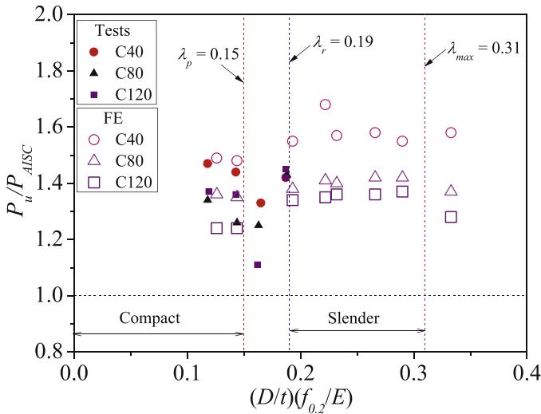  
Fig. 14. Comparisons of test and FE results with predictions from AISC [12].

  
Fig. 15. Comparisons of test and FE results with predictions from EC4 [29].

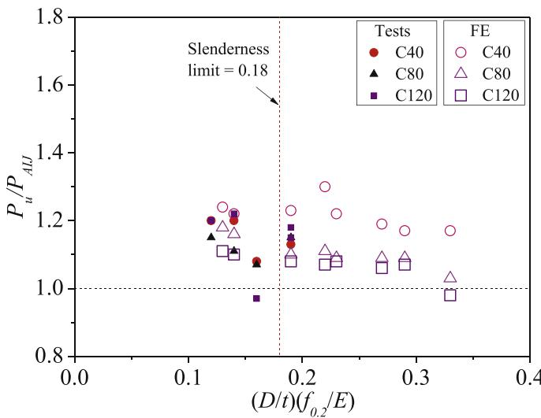  
Fig. 16. Comparisons of test and FE results with predictions from AIJ [30].

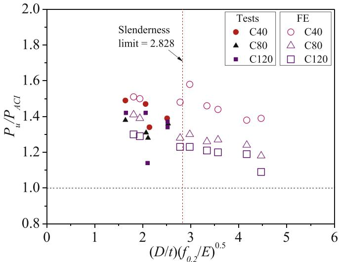  
Fig. 17. Comparisons of test and FE results with predictions from ACI [31].

was also adopted in the design calculation. Hence, the full cross-section area $(A_{s})$ of these steel tubes were replaced by the $A_{eff}$ in the calculation of predictions. These predictions were also shown in Table 8, as distinguished by $\text{以}^{\# ,\text{一}}$ . It should be noted that the limit of section slenderness in the design codes are different, as specified in the design rules in previous sections of this paper, and summarized in Wei et al. [1]. For the predictions by EC4 [29], the predictions became overall conservative, i.e., the mean value of 0.95 compared with that of $1.05^{\#}$ with the COV almost maintained. In addition, EC4 [29] provides the most accurate and least scattered predictions among the predictions [12,29-31], i.e., the mean value closest to 1.00 with the smallest value of COV. This may indicate that the reduced cross-section area should be used in the design calculations for CFHSS circular stub column specimens that exceed the section slenderness limit (Class 3) in EC4 [29]. However, by using the reduced cross section areas, the predictions by the design codes of AISC [12], AIJ [30] and ACI [31] become more conservative and more scattered, as reflected by the larger mean value and COV. The comparisons of design predictions with the section slenderness of the tubes for CFHSS circular stub column specimens were shown in Figs. 14-17, for the four different design specifications. In these figures, the original design rules with full cross-section area $(A_{s})$ of the steel tubes were used. In addition, it was found that the strength enhancement index of SI was generally decreased as the value of section slenderness increased for different design specifications, as illustrated in Figs. 10-13 for AISC [12], EC4 [29], AIJ [30] and ACI [31], respectively. The decreasing was decreased in a similar manner for different grades of filled concrete.

The summary of the comparisons between test and FE strengths with predictions are presented in Table 9. Generally, it was found that more conservative with less scattered predictions were provided by the AISC [12], AIJ [30] and ACI [31] codes for the relatively lower strength of concrete, as evidenced by the relatively larger mean values with smaller

COVs, e.g., mean value of 1.51 with COV of 0.062 for infilled concrete C40 compared with that of 1.33 with COV of 0.070 for infilled concrete C120 by the AISC [12], as shown in Table 9. As for the predictions by EC4 [29], less unconservative predictions with smaller values of COV were found, e.g., mean value of 0.99 with COV of 0.047 for infilled concrete C40 compared with that of 0.93 with COV of 0.073 for infilled concrete C120. However, when the effective section areas were used for the specimens with section slenderness exceed the codified limits (Class 3), the predictions become more conservative for infilled lower strengths of concrete for EC4 [29]. Similar findings were shown for the predictions by the other design codes, i.e., the AISC [12], AIJ [30] and ACI [31].

# 6. Conclusions

The structural behaviour of concrete-filled high strength steel (CFHSS) circular stub columns has been investigated in the present study. A series of tests was conducted on CFHSS circular tubes filled with three different grades of concrete (i.e., C40, C80 and C120). The CFHSS circular tubular sections had the nominal $0.2\%$ proof stress (i.e. the yield stress) up to $1100\mathrm{MPa}$ . The 17 test specimens were subjected to uniform axial compression. The ultimate loads, failure modes and full load-end shortening curves of these CFHSS circular stub columns have been presented in this paper. An extensive numerical study accounting for the confinement effect, as well as the non-linearities of materials, geometry and contacts have also been performed by using a validated finite element model. The behaviour of CFHSS circular stub columns has been investigated, including the ultimate load, the end shortening, the strength enhancement index and the ductility index. Finally, experimental and numerical results have been used to assess the suitability of the design equations specified in the current international specification, including American Specifications (AISC and ACI), European Code (EC4) and Japanese Code (AIJ) for the cross-section strength of CFHSS stub columns. Findings from the present study are summarized below:

- For specimens with the same ratio of outer diameter to thickness $(D / t)$ of the steel tubes, the strength enhancement generally decreases as the filled concrete strength (up to grade C120) increases.   
- For specimens with the same filled concrete strength, the smaller value of $D / t$ (from slender section to compact section) of the tube provides a better strength enhancement.   
- A higher section constraining factor (ranging from 0.57 to 6.18 in this study) generally leads to a better strength enhancement of a specimen. However, Further evaluation of this relationship is recommended for the value of section constraining factor exceeds 4.0.   
- Generally, normalized column strengths (normalized by the strengths of columns without inflated concrete for the same series) increase linearly with the increment of the inflated concrete strength.   
- It was found that the predictions from the current international design specifications were generally conservative, except for EC4. The predictions by the AIJ [30] are the least conservative and least scattered.

Table 9 Summary of comparisons of test and FE results with codified predictions for different filled concrete grades.   

<table><tr><td rowspan="2" colspan="2">Cases</td><td colspan="5">CFHSS circular stub column specimens</td></tr><tr><td>No. Of columns</td><td>Pu/PEC4</td><td>Pu/PAISC</td><td>Pu/PAIJ</td><td>Pu/PCI</td></tr><tr><td rowspan="2">Infilled concrete C40</td><td>Mean</td><td>12</td><td>0.99 (1.12)#</td><td>1.51 (1.57)#</td><td>1.20 (1.46)#</td><td>1.45 (1.68)#</td></tr><tr><td>COV</td><td></td><td>0.047 (0.057)#</td><td>0.062 (0.155)#</td><td>0.047 (0.175)#</td><td>0.048 (0.172)#</td></tr><tr><td rowspan="2">Infilled concrete C80</td><td>Mean</td><td>12</td><td>0.93 (1.03)#</td><td>1.37 (1.41)#</td><td>1.11 (1.29)#</td><td>1.31 (1.45)#</td></tr><tr><td>COV</td><td></td><td>0.044 (0.027)#</td><td>0.042 (0.110)#</td><td>0.038 (0.113)#</td><td>0.052 (0.094)#</td></tr><tr><td rowspan="2">Infilled concrete C120</td><td>Mean</td><td>13</td><td>0.93 (1.01)#</td><td>1.33 (1.35)#</td><td>1.10 (1.25)#</td><td>1.26 (1.36)#</td></tr><tr><td>COV</td><td></td><td>0.073 (0.059)#</td><td>0.070 (0.091)#</td><td>0.071 (0.105)#</td><td>0.082 (0.075)#</td></tr><tr><td rowspan="2">All cases</td><td>Mean</td><td>37</td><td>0.95 (1.05)#</td><td>1.40 (1.41)#</td><td>1.13 (1.33)#</td><td>1.34 (1.49)#</td></tr><tr><td>COV</td><td></td><td>0.063 (0.066)#</td><td>0.080 (0.136)#</td><td>0.065 (0.151)#</td><td>0.085 (0.154)#</td></tr></table>

Note: $(\mathbf{x})^{\#}$ result by using reduced cross section area of steel tube.

- By using the effective section area of steel tubes for slender cross sections, EC4 provides the most accurate with least scattered predictions than the other design specifications.   
- The design predictions using the specifications that considered in this study are less conservative and less scattered for CFHSS circular tubes filled with higher strength concrete.

# Authors statements

The roles of all authors for this manuscript are listed below:

SU Meini: Conceptualization, Methodology and Supervision, Data curation, Writing - review & editing; CAI Yancheng: Formal analysis, Writing - original draft preparation, Visualization, Writing - review & editing; CHEN Xuerui: Data curation and Software; YOUNG Ben: Conceptualization, Methodology, Supervision, Writing - review & editing.

# Declaration of competing interest

The authors declare that they have no known competing financial interests or personal relationships that could have appeared to influence the work reported in this paper.

# Acknowledgments

We would like to thank the technicians in the Structural Engineering Laboratory at The University of Hong Kong for helping the test program.

# References

[1] J. Wei, X. Luo, Z. Lai, A.H. Varma, Experimental behavior and design of high-strength circular concrete-filled steel tube short columns, J. Struct. Eng. 146 (1) (2019), 04019184.   
[2] F.C. Wang, L.H. Han, W. Li, Analytical behavior of CFDST stub columns with external stainless steel tubes under axial compression, Thin-Walled Struct. 127 (2018) 756-768.   
[3] F.C. Wang, L.H. Han, Analytical behavior of carbon steel-concrete stainless steel double-skin tube (DST) used in submarine pipeline structure, Mar. Struct. 63 (2019) 99-116.   
[4] L.H. Han, Concrete-filled steel tubes structure-theory to practice [In Chinese]. Science Press, Beijing, 2007.   
[5] S.P. Schneider, Axially loaded concrete-filled steel tubes", J. Struct. Eng. ASCE 124 (10) (1998) 1125-1138.   
[6] S. Thai, H.-T. Thai, B. Uy, T. Ngo, Concrete-filled steel tubular columns: test database, design and calibration, J. Constr. Steel Res. 157 (2019) 161-181.   
[7] L.H. Han, W. Li, R. Bjorhovde, Developments and advanced applications of concrete-filled steel tubular (CFST)structures: Members, J. Constr. Steel Res. 100 (2014) 211-228.   
[8] I. Nishiyama, S. Morino, K. Sakino, et al., Summary of Research on Concrete-Filled Structural Steel Tube Column System Carried Out under the US-Japan Cooperative Research on Composite and Hybrid Structures, Building Research Institute, Ibaraki Prefecture, Japan, 2002.   
[9] D.K. Kim, A Database for Composite Columns," M.S. thesis, School of Civil and Environmental Engineering, Georgia Institute of Technology, 2005.   
[10] C.D. Goode, Composite columns—1819 tests on concrete-filled steel tube columns compared with Eurocode 4, Struct. Eng. 86 (16) (2008) 33–38.   
[11] J.F. Hajjar, B.C. Gourley, C. Tort, M.D. Denavit, P.H. Schiller, N. Leipzig Mundis, Steel-Concrete Composite Structural Systems, Department of Civil and Environmental Engineering, Northeastern University, Boston, Massachusetts, 2019. http://www.northeastern.edu/compositesystems.   
[12] AISC, Specification for Structural Steel Buildings, in: AISC 360, AISC, Chicago, 2016.   
[13] R. Bergmann, Load introduction in composite columns filled with high strength concrete, in: P. Grundy, A. Holgate, B. Wong (Eds.), Tubular Structure VI, Proc., 6th Int. Symp. On Tubular Structures, Taylor & Francis, Melbourne, VIC, 1994, pp. 373-380.   
[14] M.D. O'Shea, R.Q. Bridge, Circular thin-walled tubes with high strength concrete, in: Composite Construction in Steel and Concrete III, in: C.D. Buckner, B. M. Shahrooz (Eds.) vols. 780-793, ASCE, New York, 1996.   
[15] M.D. O'Shea, R.Q. Bridge, Design of circular thin-walled concrete filled steel tubes, J. Struct. Eng. 126 (11) (2000) 1295-1303.   
[16] G. Giakoumelis, D. Lam, Axial capacity of circular concrete filled tube columns, J. Constr. Steel Res. 60 (7) (2004) 1049-1068.   
[17] K. Sakino, H. Nakahara, S. Morino, A. Nishiyama, Behavior of centrally loaded concrete-filled steel-tube short columns, J. Struct. Eng. 130 (2) (2004) 180-188.

[18] J. Zeghiche, K. Chaoui, An experimental behaviour of concrete-filled steel tubular columns, J. Constr. Steel Res. 61 (1) (2005) 53-66.   
[19] Q. Yu, Z. Tao, Y.X. Wu, Experimental behaviour of high performance concrete-filled steel tubular columns, Thin-Walled Struct. 46 (4) (2008) 362-370.   
[20] J.Y.R. Liew, D.X. Xiong, Effect of preload on the axial capacity of concrete-filled composite columns, J. Constr. Steel Res. 65 (3) (2009) 709-722.   
[21] W.L.A. de Oliveira, S. De Nardin, A.L.H. de Cresce El, M.K. El Debs, Influence of concrete strength and length/diameter on the axial capacity of CFT columns, J. Constr. Steel Res. 65 (12) (2009) 2103-2110.   
[22] G. Chen, Z. Xu, Z. Yang, Z. Tian, Experimental study on behavior of short steel tubular columns filled with ultra-high strength concrete mixed with stone chip subjected to axial load, J. Build. Struct. 32 (3) (2011) 82-89 [In Chinese].   
[23] T. Ekmekyapar, B.J.M. Al-Eliwi, Experimental behaviour of circular concrete filled steel tube columns and design specifications, Thin-Walled Struct. 105 (2016) 220-230.   
[24] J.Y.R. Liew, M. Xiong, D. Xiong, Design of concrete filled tubular beam-columns with high strength steel and concrete, Structure 8 (2016) 213-226.   
[25] M.X. Xiong, D.X. Xiong, J.Y.R. Liew, Axial performance of short concrete filled steel tubes with high- and ultra-high-strength materials, Eng. Struct. 136 (2017) 494-510.   
[26] S.P. Schneider, Axially loaded concrete-filled steel tubes, J. Struct. Eng. 124 (10) (1998) 1125-1138.   
[27] N.J. Gardner, R. Jacobson, Structural behavior of concrete filled steel tubes, ACI J 64 (1967) 404-413.   
[28] L. Ma, S. Li, L. Zhu, Q. Song, Y. Wei, L. Zhang, Z. Zhang, X. Sha, Experimental study on axial compression behavior of concrete filled high strength circular steel tubular short columns, Ind. Constr. 46 (7) (2016) 16-21 [In Chinese.]   
[29] E.C.4 Eurocode, Design of Composite Steel and Concrete Structures. 1-1: General Rules and Rules for Buildings Control, EN 1994-1-1, European Committee for Standardization (CEN), Brussels, Belgium, 2004. CEN.   
[30] AIJ, Recommendations for Design and Construction of Concrete Filled Steel Tubular Structures, Architectural Institute of Japan (AIJ), Tokyo, 2008.   
[31] ACI, Building Code Requirements for Structural Concrete (ACI 318M-14) and Commentary (ACI 318RM-14), American Concrete Institute, Detroit, USA, 2014.   
[32] J.-L. Ma, T.-M. Chan, B. Young, Material properties and residual stresses of cold-formed high strength steel hollow sections, J. Constr. Steel Res. 109 (2015) 152-165.   
[33] Y. Cai, W.M. Quach, B. Young, Experimental and numerical investigation of concrete-filled hot-finished and cold-formed steel elliptical tubular stub columns, Thin-Walled Struct. 145 (2019) 106437.   
[34] ABAQUS Analysis User's Manual, ABAQUS, Inc., 2017. Version 6.14.   
[35] X. Dai, D. Lam, Numerical modelling of the axial compressive behavior of short concrete-filled elliptical steel columns, J. Constr. Steel Res. 66 (7) (2010) 931–942.   
[36] Thai Huu-Tai, Uy Brian, Mahbub Khan, Tao Zhong, Mashiri Fidelis, Numerical modelling of concrete-filled steel box columns incorporating high strength materials, J. Constr. Steel Res. 102 (2014) 256-265.   
[37] D. Lam, X.H. Dai, L.H. Han, Q.X. Ren, W. Li, Behaviour of inclined, tapered and STS square CFST stub columns subjected to axial load, Thin-Walled Struct. 54 (2012) 94-105.   
[38] Al-Ani Yahia Raad, Finite element study to address the axial capacity of the circular concrete-filled steel tubular stub columns, Thin-Walled Struct. 126 (2018) 2-15.   
[39] J.-L. Ma, T.-M. Chan, B. Young, Design of cold-formed high-strength steel tubular stub columns, J. Struct. Eng. 144 (6) (2018), 04018063.   
[40] Z. Tao, B. Uy, F.-Y. Liao, L.-H. Han, Nonlinear analysis of concrete-filled square stainless steel stub columns under axial compression, J. Constr. Steel Res. 67 (2011) 1719-1732.   
[41] Z. Tao, B. Uy, L.-H. Han, Z.-B. Wang, Analysis and design of concrete-filled stiffened thin-walled steel tubular columns under axial compression, Thin-Walled Struct. 47 (2009) 1544-1556.   
[42] L.H. Han, G.H. Yao, Z. Tao, Performance of concrete-filled thin-walled steel tubes under pure torsion, Thin-Walled Struct. 45 (1) (2007) 24-36.   
[43] Z. Tao, Z.B. Wang, Q. Yu, Finite element modelling of concrete-filled steel stub columns under axial compression, J. Constr. Steel Res. 89 (2013) 121-131.   
[44] V.K. Papanikolaou, A.J. Kappos, Confinement-sensitive plasticity constitutive model for concrete in triaxial compression, Int. J. Solid Struct. 44 (21) (2007) 7021-7048.   
[45] T. Yu, J.G. Teng, Y.L. Wong, S.L. Dong, Finite element modeling of confined concrete-I: drucker-Prager type plasticity model, Eng. Struct. 32 (3) (2010) 665-679.   
[46] FIP, CEB-FIP Model Code 1990, Thomas Telford Ltd., London, 1993.   
[47] Z.P. Bazant, E. Becq-Giraudon, Statistical prediction of fracture parameters of concrete and implications for choice of testing standard, Cement Concr. Res. 32 (4) (2002) 529-556.   
[48] A.K. Samani, M.M. Attard, A stress-strain model for uniaxial and confined concrete under compression, Eng. Struct. 41 (2012) 335-349.   
[49] B. De Nicolo, L. Pani, E. Pozzo, Strain of concrete at peak compressive stress for a wide range of compressive strength, Mater. Struct. 27 (1994) 206-210.   
[50] F. Wang, B. Young, L. Gardner, Compressive testing and numerical modelling of concrete-filled double skin CHS with austenitic stainless steel outer tubes, Thin-Walled Struct. 141 (2019) 345-359.   
[51] Z. Lai, A.H. Varma, High-strength rectangular CFT members: database, modeling, and design of short columns, J. Struct. Eng. 144 (5) (2018), 04018036.