# Behaviour of concrete-filled steel-tube columns strengthened with high-strength CFRP textile grid-reinforced high-ductility engineered cementitious composites

Yuhong Yan, Hongjun Liang, Yiyan Lu ⇑ , Yue Huang

School of Civil Engineering, Wuhan University, Wuhan 430072, China

# HIGHLIGHTS

 Behaviour of CFST columns strengthened with CFRP textile grid-reinforced ECC was studied.   
 The failure modes, load-bearing capacity, and confining effect were evaluated.   
 Prediction models for the load-bearing capacity are proposed.

# ARTICLEINFO

Article history:

Received 30 March 2020

Received in revised form 6 October 2020

Accepted 7 October 2020

Available online 23 October 2020

Keywords:

Concrete-filled steel tube

Strengthening

Carbon fibre-reinforced polymer

Textile grid

Engineered cementitious composite

# ABSTRACT

In this study, a new strengthening technique was developed to improve the mechanical behaviour, fire resistance, and corrosion resistance of concrete-filled steel tubes (CFSTs). The proposed technique involved the strengthening of CFST columns using high-strength carbon fibre-reinforced polymer (CFRP) textile grid-reinforced high-ductility engineered cementitious composite (ECC). The behaviour of composite columns under axial compression was investigated. A total of 30 specimens, which comprised 27 strengthened columns and three un-strengthened control specimens, were subjected to experimental tests. The parameters considered for the tests were the number of CFRP textile grid layers, diameter–thickness ratio, and concrete strength. The experimental results showed that strengthened specimens exhibited a better strengthening effect than the control specimens. Unlike brittle failure, which occurred when the CFST columns were strengthened with FRP sheets, the ductility of the columns strengthened with CFRP textile grid-reinforced ECC was as good as that of CFSTs because of the occurrence of progressive failure. The in-filled concrete, whose strength increased owing to the confinement of the CFRP textile grids, resisted most of the loads on the strengthened columns. Based on different models, equations were derived to predict the load-bearing capacity, and the predicted results showed high accuracy.

$^ { © }$ 2020 Elsevier Ltd. All rights reserved.

# 1. Introduction

Concrete-filled steel-tube (CFST) columns are widely used in structures, such as high-rise buildings, long-span structures, and industrial buildings, owing to their high strength and ductility [1]. However, the use of several CFST columns is considered to be incapable of satisfying the relevant safety and usability requirements owing to the degradation in mechanical behaviour caused by fire, chemical corrosion, and physical ageing [2,3]. Therefore, advanced materials and techniques have been applied in the retrofitting of CFST columns to solve the problems mentioned above.

Fibre-reinforced polymers (FRPs) have drawn significant attention owing to advantages, such as high strength, light weight, and good corrosion resistance [4]. Moreover, the process of wrapping FRPs is easy, and the effect of wrapping on the structural appearance of FRPs after strengthening can be ignored. Xiao et al. [5,6] were the first to develop confining CFST structures using the FRP, which were identified as confined concrete-filled tubular structures. Several studies based on their work have been conducted recently. It has been reported that the outward buckling of a steel tube can be delayed using FRP wraps. The additional confinement provided to the concrete core can increase the strength of the structure [7– 11]. The number of FRP layers adopted has a significant effect on the behaviour of the columns. Hu et al. [12] and Lu et al. [13] performed axial tests on confined circular CFSTs, and the results showed that an increase in the number of FRP layers significantly

enhanced the load-bearing and deformation capacities of the columns.

However, organic epoxy resins used in the FRP strengthening technique have disadvantages: poor performance at high temperatures and on direct fire [14], low durability under wet–dry or freeze–thaw cycles [15], inability to work on moist surfaces, susceptibility to ultraviolet radiation, and hazards to manual workers. Some researchers applied an inorganic matrix as an alternative adhesive to organic epoxy resins to overcome these problems [16]. Widely applied inorganic matrix adhesives include magnesium phosphate cement, magnesium oxychloride cement, and geopolymer cement [17]. Most inorganic matrix adhesives offer advantages, such as high-temperature functionality and excellent corrosion resistance. The application of an inorganic matrix to the FRP strengthening technique can solve the strength degradation problem when organic epoxy resins are exposed to high temperatures, adverse environments, or both. However, when combined with FRP sheets, the penetration and impregnation efficiencies of inorganic matrices are lower than those of organic epoxy resins, which create an unsatisfactory strengthening effect. Thus, continuous-fibre sheets are typically replaced with textile grids. The new composites are called textile-reinforced concrete (TRC) or textile-reinforced mortar (TRM) [18]. TRC has been extensively used in structural retrofitting, particularly for the strengthening of concrete and masonry [19–25]. A problem associated with the use of TRC strengthening layers is that the ultimate strain of the inorganic matrix is generally lower than that of FRP textile grids. Inorganic matrix cracks develop before the FRP attains its ultimate strain, which leads to stress concentration in the FRP textile grids and induces the premature failure of the TRC. Moreover, the wide premature cracks can create a free passage for harmful substances to penetrate the structure; this accelerates the deterioration of the structure.

Engineered cementitious composites (ECCs) can be used as an alternative material to conventional cement in TRC systems. The ECC was invented by Li [26–28] in the 1990 s. ECCs provide strain hardening with ultra-high ductility; the tensile strain capacity of the ECC is higher than that of FRP. The failure pattern of the ECC is multiple micro-cracking, with the crack widths equal to or less than $1 0 0 \mu \mathrm { { m } }$ [29]. Because of the combination of the excellent ductility and durability of ECCs with the high strength of FRPs, FRP textile grid-reinforced ECCs show potential in the structural strengthening of composites. Basalt fabric-reinforced ECC systems have been successfully applied in the repair of fire-damaged reinforced concrete (RC) slabs [30]. In their study, Gao et al. [30] used two types of cementitious matrix, i.e. ECC and a polymer-modified mortar (PMM). The test results indicated that ECCs were superior to PMMs in the strengthening system owing to their enhanced deformation, energy dissipation, and load-bearing capacity. It has been proven that the flexural behaviour is significantly improved in retrofitted RC beams [31]. ECCs exhibit a more ductile failure than epoxy mortar, mainly because of the multiple cracking behaviours of ECCs. Debonding of the strengthening layer occurs when high-strength and stiffness-reinforcing materials are embedded in the ECC. Thus, a reliable anchorage technique is required to prevent debonding failure [32]. Al-Gemeel et al. [33,34] investigated the axial performance of square and circular concrete columns confined using basalt textile grid-reinforced ECC. A cross-section of a square concrete column was converted to a circular section by casting the strengthening layer to maximise the confining effect. No debonding failure between the original concrete and strengthening layer was observed, and both the load-bearing capacity and ductility improved significantly. The test results also indicated that plain ECC (e.g. without a basalt textile grid) could be used as a strengthening layer, owing to the favourable strengthening effect.

Previous studies have shown the benefits of confining RC structures using FRP textile grid-reinforced ECCs in improving their mechanical behaviour. In this study, a novel composite structure, i.e. CFST columns strengthened with high-strength CFRP textile grid-reinforced high-ductility ECC, was developed. On the one hand, the CFRP was expected to provide additional confinement for the concrete core because of its high strength; on the other hand, the ECC was expected to act as a high-ductility adhesive, owing to its multiple cracking characteristics. Furthermore, the fire resistance and corrosion resistance of CFSTs could be enhanced owing to the ECC cover. This study focussed on the axial behaviour of CFST columns strengthened with high-strength CFRP textile grid-reinforced high-ductility ECC. The failure modes, load–deformation response, load-bearing capacities, ductility, and confining effects of the CFRP textile grid were analysed. Models were developed to predict the load-bearing capacities of the strengthened columns.

# 2. Experimental programme

# 2.1. Specimen design

A total of 30 columns, which comprised 27 CFST columns strengthened with high-strength CFRP textile grid-reinforced high-ductility ECC and three un-strengthened CFST columns used as control specimens, were constructed and subjected to experimental tests. The control columns had an outer diameter $\left( D _ { s } \right)$ of $1 4 0 \mathrm { m m }$ . The strengthened columns consisted of an inner CFST column and a CFRP textile grid-reinforced ECC composite ring in the outer region. The dimensions of the inner CFST columns were the same with those of the control columns, and the thickness of the strengthening layer was $1 5 ~ \mathrm { m m }$ . The cross-sections of the control and strengthened specimens are shown in Fig. 1. The control and strengthened specimens had the same height (L) of $5 0 0 ~ \mathrm { { m m } }$ , with height-to-diameter ratios $\left( L / D \right)$ of 3.57 and 2.94, respectively. The test parameters included the number of CFRP textile grid layers $n _ { \mathrm { f } }$ (one, two, and three layers), diameter–thickness ratio $D _ { s } / t$ (70, 46.7, and 35, and thicknesses of the steel tube walls t were 2, 3, and $4 \ m \mathrm m$ , respectively), and concrete strength (C30, C40, and C50). The details of the specimens are listed in Table 1, in which tY-CZ (e.g. t2-C30) and NX-tY-CZ (e.g. N1-t2-C30) denote the control and strengthened columns, respectively. The terms are described as follows: ’NX’ represents X layers of a CFRP textile grid, ’tY’ denotes the thickness of the steel tube wall, ’CZ’ represents the design strength of concrete, and $f _ { \mathrm { c u } }$ is the 28-day cube compressive strength of concrete.

# 2.2. Specimen production

Different grades of fresh concrete were poured into welded circular steel tubes. After the in-filled concrete hardened and were cured for seven days, the strengthening layer was applied. The construction process was performed as follows. (1) The fresh ECC was trowelled directly onto the steel tube surface to complete the initial layer having a thickness of $3 { \mathrm { - } } 6 ~ \mathrm { m m }$ (it should be noted that the final thickness of the strengthening layer was $1 5 ~ \mathrm { m m }$ for all the specimens; thus, the thickness of each ECC layer depended on the designed layers of the grid). (2) A layer of the CFRP textile grid was wrapped, gently stretched, and pressed against the matrix. (3) Another ECC layer with the same thickness was applied to cover the grid completely. (4) Steps 2 and 3 were repeated until all the designed layers of the grids were applied. (5) A $2 0 0 ~ \mathrm { { m m } }$ length overlap of the grid was added after the last layer of the grid was applied. Next, the last layer of ECC was applied and smoothened using a trowel. Fig. 2 shows the process of constructing the

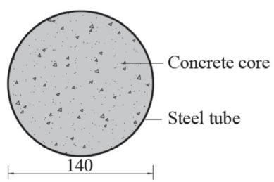  
(a) Cross-section of CFST column

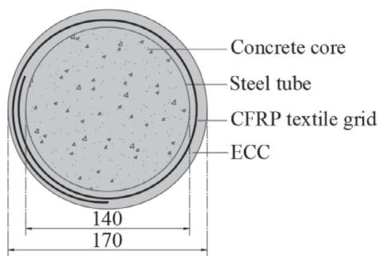  
(b) Cross-section of strengthened column   
Fig. 1. Sectional dimension.

Table 1 Designed specimens.   

<table><tr><td>Specimen</td><td>nf</td><td>t (mm)</td><td>Ds/t</td><td>fcu (MPa)</td><td>Nu (kN)</td><td>DI</td><td>SI</td></tr><tr><td>t2-C30</td><td>-</td><td>2</td><td>70</td><td>35.2</td><td>1130</td><td>1.371</td><td>-</td></tr><tr><td>t2-C40</td><td>-</td><td>2</td><td>70</td><td>46.1</td><td>1303</td><td>1.325</td><td>-</td></tr><tr><td>t2-C50</td><td>-</td><td>2</td><td>70</td><td>54.8</td><td>1420</td><td>1.154</td><td>-</td></tr><tr><td>N1-t2-C30</td><td>1</td><td>2</td><td>70</td><td>35.2</td><td>1360</td><td>1.315</td><td>1.068</td></tr><tr><td>N2-t2-C30</td><td>2</td><td>2</td><td>70</td><td>35.2</td><td>1452</td><td>1.305</td><td>1.140</td></tr><tr><td>N3-t2-C30</td><td>3</td><td>2</td><td>70</td><td>35.2</td><td>1485</td><td>1.558</td><td>1.166</td></tr><tr><td>N1-t2-C40</td><td>1</td><td>2</td><td>70</td><td>46.1</td><td>1509</td><td>1.436</td><td>1.082</td></tr><tr><td>N2-t2-C40</td><td>2</td><td>2</td><td>70</td><td>46.1</td><td>1585</td><td>1.439</td><td>1.137</td></tr><tr><td>N3-t2-C40</td><td>3</td><td>2</td><td>70</td><td>46.1</td><td>1639</td><td>1.382</td><td>1.175</td></tr><tr><td>N1-t2-C50</td><td>1</td><td>2</td><td>70</td><td>54.8</td><td>1667</td><td>1.149</td><td>1.119</td></tr><tr><td>N2-t2-C50</td><td>2</td><td>2</td><td>70</td><td>54.8</td><td>1712</td><td>1.110</td><td>1.149</td></tr><tr><td>N3-t2-C50</td><td>3</td><td>2</td><td>70</td><td>54.8</td><td>1700</td><td>1.231</td><td>1.141</td></tr><tr><td>N1-t3-C30</td><td>1</td><td>3</td><td>46.7</td><td>35.2</td><td>1516</td><td>1.574</td><td>1.120</td></tr><tr><td>N2-t3-C30</td><td>2</td><td>3</td><td>46.7</td><td>35.2</td><td>1499</td><td>1.494</td><td>1.107</td></tr><tr><td>N3-t3-C30</td><td>3</td><td>3</td><td>46.7</td><td>35.2</td><td>1571</td><td>1.415</td><td>1.160</td></tr><tr><td>N1-t3-C40</td><td>1</td><td>3</td><td>46.7</td><td>46.1</td><td>1664</td><td>1.628</td><td>1.118</td></tr><tr><td>N2-t3-C40</td><td>2</td><td>3</td><td>46.7</td><td>46.1</td><td>1706</td><td>1.581</td><td>1.146</td></tr><tr><td>N3-t3-C40</td><td>3</td><td>3</td><td>46.7</td><td>46.1</td><td>1781</td><td>1.318</td><td>1.196</td></tr><tr><td>N1-t3-C50</td><td>1</td><td>3</td><td>46.7</td><td>54.8</td><td>1639</td><td>1.216</td><td>1.036</td></tr><tr><td>N2-t3-C50</td><td>2</td><td>3</td><td>46.7</td><td>54.8</td><td>1761</td><td>1.415</td><td>1.113</td></tr><tr><td>N3-t3-C50</td><td>3</td><td>3</td><td>46.7</td><td>54.8</td><td>1814</td><td>1.397</td><td>1.146</td></tr><tr><td>N1-t4-C30</td><td>1</td><td>4</td><td>35</td><td>35.2</td><td>1642</td><td>1.606</td><td>1.072</td></tr><tr><td>N2-t4-C30</td><td>2</td><td>4</td><td>35</td><td>35.2</td><td>1696</td><td>1.565</td><td>1.107</td></tr><tr><td>N3-t4-C30</td><td>3</td><td>4</td><td>35</td><td>35.2</td><td>1744</td><td>1.439</td><td>1.139</td></tr><tr><td>N1-t4-C40</td><td>1</td><td>4</td><td>35</td><td>46.1</td><td>1846</td><td>1.589</td><td>1.080</td></tr><tr><td>N2-t4-C40</td><td>2</td><td>4</td><td>35</td><td>46.1</td><td>1890</td><td>1.570</td><td>1.106</td></tr><tr><td>N3-t4-C40</td><td>3</td><td>4</td><td>35</td><td>46.1</td><td>1924</td><td>1.486</td><td>1.125</td></tr><tr><td>N1-t4-C50</td><td>1</td><td>4</td><td>35</td><td>54.8</td><td>1999</td><td>1.157</td><td>1.089</td></tr><tr><td>N2-t4-C50</td><td>2</td><td>4</td><td>35</td><td>54.8</td><td>2028</td><td>1.560</td><td>1.105</td></tr><tr><td>N3-t4-C50</td><td>3</td><td>4</td><td>35</td><td>54.8</td><td>2071</td><td>1.954</td><td>1.128</td></tr></table>

strengthening layer. After the specimens were cured for 14 days, both ends of each specimen were wrapped using an $8 0 ~ \mathrm { m m }$ wide CFRP sheet to prevent the failure of the ends.

# 2.3. Material properties

# 2.3.1. Concrete and steel tube

The concrete was cast using the following constituent materials: 42.5R ordinary Portland cement, fly ash, coarse aggregate with sizes of $5 { - } 1 5 \ \mathrm { m m }$ , fine river sand, and polycarboxylic acid as a superplasticiser. Three different mix proportions (Table 2) were adopted to obtain the target strength grades of C30, C40, and C50, and the actual measured compressive strength values of the cube specimens were 35.2, 46.1, and 54.8 MPa, respectively. Tensile tests were performed to determine the mechanical properties of the steel using coupons cut out from the steel tube. The average values of the yield strength $( f _ { \mathrm { y } } )$ , elastic modulus $\left( E _ { s } \right)$ , elongation rate, and Poisson’s ratio, as calculated using the same three coupons for each thickness, are listed in Table 3.

# 2.3.2. CFRP textile grid

The reinforcement used in the study was a unidirectional highstrength CFRP textile grid composed of carbon fibre yarns in the transversal direction (load direction) and glass fibre yarns in the longitudinal direction (Fig. 3). The main functions of the glass fibre yarns were to fix the carbon fibre yarns and form a complete grid. Each carbon fibre yarn comprised four $^ { 1 2 \mathrm { ~ k ~ } }$ carbon fibres, and the surface of each yarn was coated with a thin and flexible resin. The cross-sectional area $( A _ { f } )$ of a single carbon fibre yarn was determined using a scanning electron microscopy image (Fig. 4). The area weight, tensile strength $\sigma _ { \mathrm { f } }$ ultimate strain $\varepsilon _ { \mathrm { f } } ,$ and elastic modulus $E _ { \mathrm { f } }$ were provided by the manufacturer (Table 4). Both the glass and carbon fibre yarns were spaced $2 0 \mathrm { m m }$ apart in two orthogonal directions.

# 2.3.3. ECC

The constituent materials of the ECC were 42.5R ordinary Portland cement, Class I fly ash, silica sand with a grain size that was not larger than $0 . 1 8 ~ \mathrm { m m }$ , polycarboxylic acid as the superplasti-

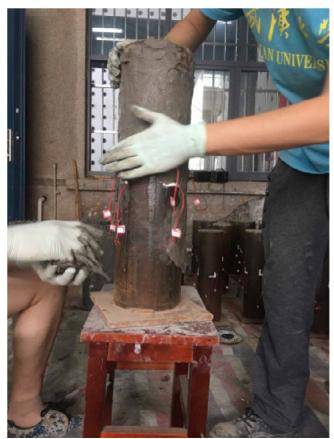  
(a) Applying ECC

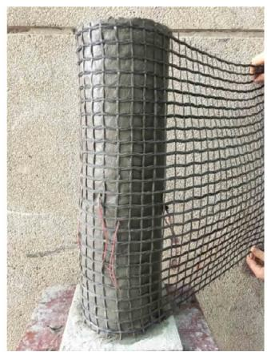  
(b) Wrapping grid

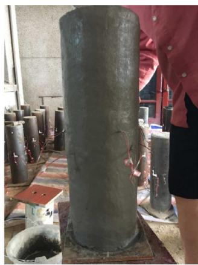  
(c) Completed   
Fig. 2. Application of the strengthening layer.

Table 2 Mix design for concrete $\scriptstyle ( \log / \mathrm { m } ^ { 3 } )$   

<table><tr><td>Strength grade</td><td>Cement</td><td>Fly ash</td><td>River sands</td><td>Coarse aggregate</td><td>Water</td><td>Superplasticizer</td><td>Cube compressive strength fu (MPa)</td></tr><tr><td>C30</td><td>336</td><td>144</td><td>787</td><td>810</td><td>201</td><td>1.7</td><td>35.2</td></tr><tr><td>C40</td><td>377</td><td>162</td><td>787</td><td>810</td><td>179</td><td>3.5</td><td>46.1</td></tr><tr><td>C50</td><td>416</td><td>179</td><td>787</td><td>810</td><td>159</td><td>5</td><td>54.8</td></tr></table>

Table 3 Steel properties.   

<table><tr><td>Thickness (mm)</td><td>fy(MPa)</td><td>Es(GPa)</td><td>Elongation rate (%)</td><td>Poisson&#x27;s ratio</td></tr><tr><td>2</td><td>413</td><td>208</td><td>25.0</td><td>0.27</td></tr><tr><td>3</td><td>320</td><td>205</td><td>21.5</td><td>0.27</td></tr><tr><td>4</td><td>321</td><td>205</td><td>21.2</td><td>0.26</td></tr></table>

ciser, and polyvinyl alcohol (PVA) fibres. The dosage of the superplasticiser must be low to obtain a relatively thick-flowing ECC so that the ECC can be attached to the steel tube surface. However, very low superplasticiser content causes the fibres to conglobate. After several trials were attempted, the cementitious material content (cement and fly ash) was set at $0 . 0 5 \%$ . The volume content of the fibre in the matrix was $2 \%$ , which was consistent with those of previous studies. The details of the design mix are listed in Table 5. The PVA fibres were provided by the Chinese manufacturer, and each fibre had a diameter of $2 0 \mu \mathrm { m }$ and a length of $1 5 \mathrm { m m }$ . The tensile strength, elastic modulus, and elongation values were 1300 MPa, 37 GPa, and $7 \%$ , respectively. The 28-day cube compres-

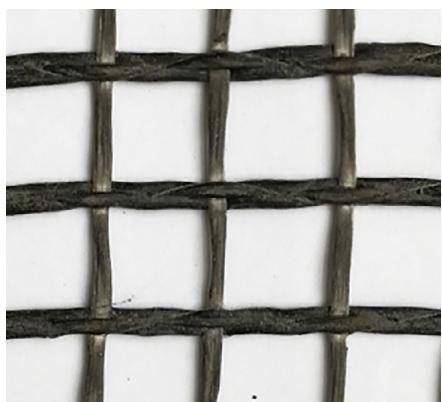  
Fig. 3. Unidirectional CFRP textile grid.

sive strength of the ECC specimens, each having dimensions of $1 0 0 ~ \mathrm { { m m } \times 1 0 0 ~ \mathrm { { m m } \times 1 0 0 ~ \mathrm { { m m } } } }$ , was 32 MPa. The tensile strength properties were obtained through uniaxial direct tensile tests performed according to the specifications of the Japan Society of Civil Engineers [35]. A dog-bone-shaped coupon having a $6 0 ~ \mathrm { { m m } }$ width at both ends and a $3 0 ~ \mathrm { m m }$ width in the middle of the deformation measurement region was used for the tests. Two linear variable differential transformers (LVDTs) were fixed on each specimen to measure and record the deformations within a measurement length of $8 0 ~ \mathrm { m m }$ . The load was recorded using a force transducer. Two spherical hinges were coaxially connected to each specimen to provide a narrow range of rotation. The detailed dimensions of the tensile specimens and loading device are depicted in Fig. 5. Experimental tests were conducted using a ’SANS’ electronic universal testing machine, and displacement at a constant rate of $0 . 1 \ \mathrm { m m / m i n }$ was applied to control the loading process. After the

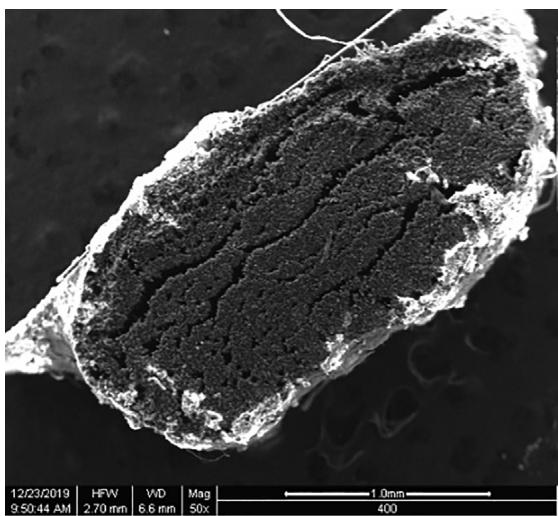  
Fig. 4. SEM image of a CFRP yarn.

Table 4 Mechanical properties of CFRP textile grid.   

<table><tr><td>Textile</td><td>Af (mm2)</td><td>σf (MPa)</td><td>εf (%)</td><td>Ef (GPa)</td><td>Area weight (g/m2)</td><td>Spacing (mm)</td></tr><tr><td>CFRP</td><td>1.16</td><td>3400</td><td>1.48</td><td>230</td><td>200</td><td>20</td></tr></table>

Table 5 Mix proportions of ECC $\scriptstyle ( \log / \mathrm { m } ^ { 3 } )$ .   

<table><tr><td>Cement</td><td>Fly ash</td><td>Silica sand</td><td>Water</td><td>Superplasticizer</td><td>PVA</td></tr><tr><td>450</td><td>854</td><td>469</td><td>326</td><td>0.68</td><td>26</td></tr></table>

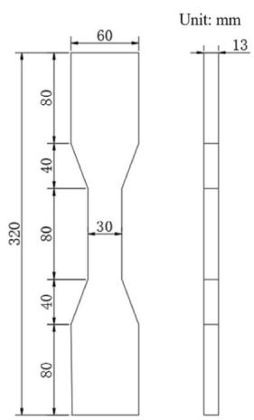  
(a) Dimensions

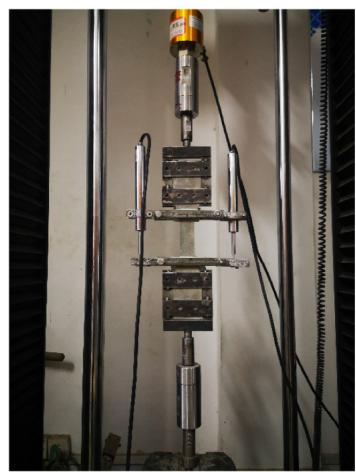  
(b) Test setup   
Fig. 5. Tensile test of ECC.

coupon ruptured, the test was terminated. The stress–strain curve indicated strain-hardening characteristics (Fig. 6). The ultimate tensile strength and the corresponding strain of the ECC were 4.3 MPa and $2 . 5 \%$ , respectively.

# 2.4. Test setup and instrumentation

Axial compressive tests were performed using a 30,000 kN universal testing machine. The axial shortening was recorded using

two LVDTs vertically fixed with a magnetic stand beside the specimen. A 5000 kN annular force transducer located under each specimen was used to monitor the axial load. A $5 0 \mathrm { m m }$ thick steel shim was placed between the specimen and force transducer. Eight strain gauges, each with a length of $3 ~ \mathrm { m m }$ , were fixed around the steel tube surface at the mid-height of the tube. Another eight strain gauges with a length of $3 0 ~ \mathrm { m m }$ each were fixed on the ECC surface at the same positions. The test setup and instrumentation layout are depicted in Fig. 7.

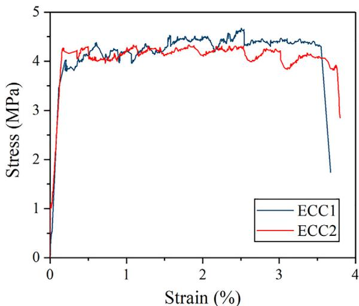  
Fig. 6. Tensile stress–strain curves of ECC.

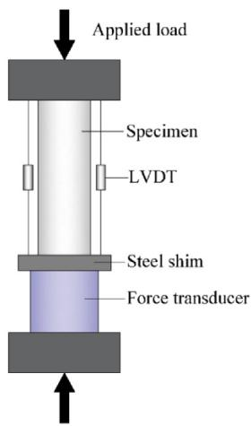  
(a) Schematic view

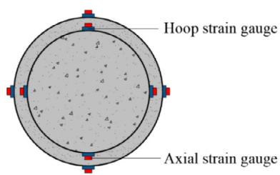

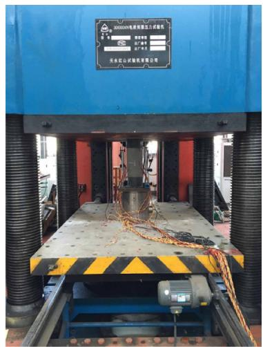  
(b) Location of strain gauges   
(c) Loading system   
Fig. 7. Test setup and instrumentation layout.

Pre-loading was performed before the actual loading to close up the gap between the specimen and instrument and to ensure that the applied load was concentric with the specimen. The load

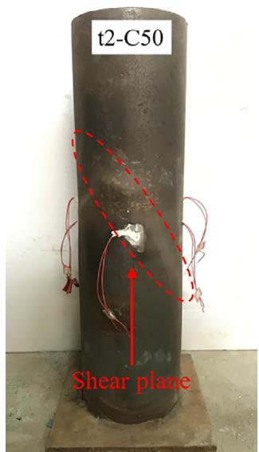  
Fig. 8. Failure mode of control column.

applied during the pre-loading process was controlled to within $2 0 \%$ of the bearing capacity. During the actual loading, the load increment in the elastic stage was 1/15 of the load-bearing capacity, and that in the plastic stage was 1/30. At each increment step, the load was sustained for 3 min. The test was terminated when the applied load decreased to $7 5 \%$ of the ultimate load.

# 3. Experimental results and discussion

# 3.1. Failure modes

The control columns showed a shear failure mode

(Fig. 8). During the elastic stage, there were no apparent changes on the specimen surface. When the steel jacket yielded, the axial deformation and the axial and hoop strains monitored using the instruments increased rapidly. The peak load on the specimen was reached shortly. At this point, slight local bulges of the steel tube occurred, and with continuous loading, a clear shear line was observed.

The failure modes of the strengthened columns are shown in Fig. 9. The axial deformations increased linearly with the applied load until the load reached approximately $8 5 \%$ of the ultimate load. As the tests progressed, the growth rate increased gradually. Several fine longitudinal and diagonal cracks appeared on the ECC surface, and the length and number of cracks rapidly increased with

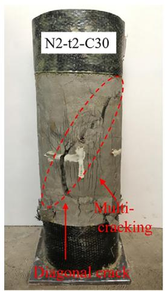

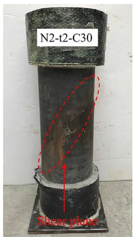  
(b)

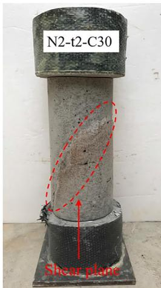  
（c）

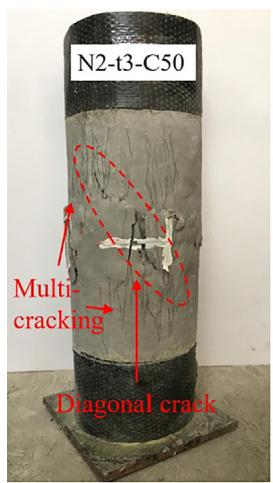  
(d）

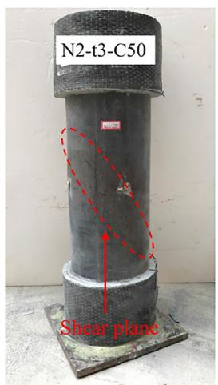  
(e）

  
(f）  
Fig. 9. Failure mode of strengthened columns.

axial load, which indicated a multi-cracking mode. When the peak load was reached, the cracks widened, accompanied by the fracturing of the CFRP textile grid. With a decrease in the applied load, a visible wide diagonal crack was observed. The integrity of the strengthening layer was maintained during the loading process, i.e. no debonding failure of the strengthening layer occurred. After the coat was removed on completion of the tests, a shear line connected by the bulges was observed on the steel tube surface. On removal of the steel tube, a shear plane could be observed in the concrete core. Fig. 9(a)–(c) show the failure of the components of Specimen N2-t2-C30; Fig. 9(d)–(f) correspond to those of N2-t3- C50. A comparison between the failure of these specimens shows that the shear plane in the concrete core, shear bulge line in the steel tube, and diagonal crack in the strengthening layer appeared at the same location. Thus, it can be inferred that the failure mode of the strengthened column was dominated by the failure mode of the original CFST. The shear failure of the CFST remained unchanged after strengthening, and the failure mode of the strengthening layer was closely related to that of the original CFST.

# 3.2. Axial load–axial shortening curves

Typical axial load–axial shortening curves of CFST columns strengthened with CFRP textile grid-reinforced ECC and unstrengthened CFST columns are shown in Fig. 10 and summarised for all the specimens (Figs. 11–13). Additionally, the typical curve of CFST columns strengthened with FRP sheets, plotted according to Ref. [12,13], is shown in Fig. 10 for comparison. During the first loading phase (OA) of the CFST column strengthened with CFRP textile grid-reinforced ECC, the axial load linearly increased with axial shortening until the applied load reached approximately $8 0 \%$ of the ultimate load. No visible cracks were observed, and the ECC influence the generation of hoop tensile stresses in the strengthening layer. In the second phase (AB), cracks were formed in the ECC, and the hoop stresses were transferred to the CFRP textile grids. Under confinement, the load-bearing capacity of the column improved, and the deformation capacity increased slightly (Point B versus Point D). In the last phase, the applied load gently decreased with the progressive rupturing of the fibre filaments. For the FRP sheet strengthening system, hardening occurred beyond Point E (the same axial shortening as that of Point B). Finally, brittle failure occurred at significant axial shortening owing to the rupture of the FRP sheets. The above analysis indicated that the performance of the CFST columns strengthened using CFRP textile gridreinforced ECC was quite different from that strengthened using FRP sheets (the ultimate strain was significantly lower than that

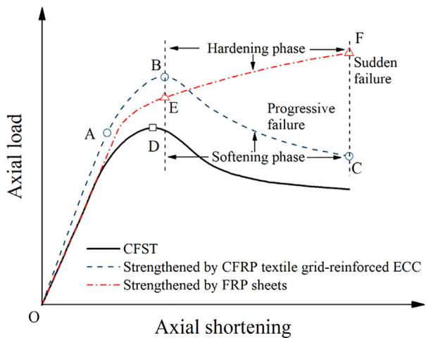  
Fig. 10. Typical axial load – axial shortening curve.

when FRP sheets were used). The reasons are because although ECC was a high-ductility inorganic matrix, the impregnate efficiency of the fibres in ECC was not as high as when epoxy resins were used. Therefore, fibre filaments embedded in ECC could not remain united when subjected to external loads, and the stress distribution in the fibre roving was non-uniform. In this case, the strain efficiency $k _ { \mathrm { e } } \left( k _ { \mathrm { e } } = \varepsilon _ { \mathrm { f l } } / \varepsilon _ { \mathrm { f u } } , \right.$ where $\varepsilon _ { \mathrm { f l } }$ and $\varepsilon _ { \mathrm { f u } }$ are the failure hoop strain and ultimate tensile strain of the fibres, respectively) of the CFRP textile decreased, which reduced the confinement effect. However, the application of the strengthening layer of CFRP textile grid-reinforced ECC enhanced the load-bearing capacity, increased the initial stiffness because of the enlarged cross-section, and achieved excellent ductility owing to progressive failure instead of brittle failure.

Fig. 11 depicts the effect of $n _ { \mathrm { f } }$ on the axial load–axial shortening curves of the strengthened columns. The slope for the elastic stage of the specimens slightly varied as $n _ { \mathrm { f } }$ changed, which indicated a minimal effect of the grid at this stage. With an increase in $n _ { \mathrm { f } } ,$ the elastic–plastic stage was lengthened, the deformation capacity increased, and the load-bearing capacity was enhanced because, during the elastic–plastic stage, axial shortening and lateral deformation developed rapidly. When the CFRP textile grids were wrapped, the concrete core received additional confinement, and the outward local bulging of the steel tube was suppressed. The higher the value of $n _ { \mathrm { f } } ,$ the more significant the suppression effect.

The effects of $D _ { s } / t$ on the axial load–axial shortening curves for the strengthened columns are depicted in Fig. 12. The thickest steel tube had the highest load-bearing capacity, stiffness, and deformation capacity. All the advantages were observed in the strengthened columns based on the curves. In addition, the stronger confinement provided for the concrete core by the thicker steel tube with a smaller $D _ { s } / t$ value was a crucial factor in performance improvement.

Fig. 13 shows the effect of concrete strength on the axial load– axial shortening curves for the strengthened columns. An increase in the concrete strength increased the stiffness and ultimate load values of the specimens. Axial shortening in the ultimate state was observed to decrease. In the decreasing branch of the curves, the load decreased more rapidly for higher concrete strength. The axial shortening at $8 5 \%$ of the ultimate load was lower and exhibited higher brittleness.

# 3.3. Lateral deformation

The development trend of the lateral deformation of the components in strengthened columns was evaluated by introducing the ratio $\varepsilon _ { \mathrm { h } } / \varepsilon _ { \mathrm { v } } ,$ where $\varepsilon _ { \mathrm { h } }$ and $\varepsilon _ { \mathrm { v } }$ are the hoop strain and vertical strain of the components (including the steel tube and ECC) during loading, respectively. Typical $N / N _ { \mathrm { u } } - \varepsilon _ { \mathrm { h } } / \varepsilon _ { \mathrm { v } }$ curves were plotted (Fig. 14); in Fig. 14, N is the applied load during loading, and $N _ { \mathrm { u } }$ is the loadbearing capacity. During the elastic stage, the $\varepsilon _ { \mathrm { h } } / \varepsilon _ { \mathrm { v } }$ of the steel tube was relatively unchanged and was close to the Poisson’s ratio of the steel tube (provided in Table 3). This closeness was attributed to the fact that the Poisson’s ratio of the in-filled concrete was lower than that of the steel tube. In this case, the interaction between the two components under axial loading was negligible, and the lateral deformation of the steel tube was unaffected by concrete. For the strengthening layer, the value was assumed to be approximately equal to that of the matrix (ECC) according to previous studies [22,36] because it is difficult to measure the strain of the CFRP textile. From the curves, it was observed that the evolution trend for the lateral deformation of the CFRP textile was similar to that of the steel tube, and their $\varepsilon _ { \mathrm { h } } / \varepsilon _ { \mathrm { v } }$ values were close, which indicated deformation compatibility. When the applied load was increased to $8 0 \% { - } 9 0 \%$ of $N _ { \mathbf { u } }$ , the $\varepsilon _ { \mathrm { h } } / \varepsilon _ { \mathrm { v } }$ of both the steel tube and CFRP textile increased at high speeds. This increase was attributed

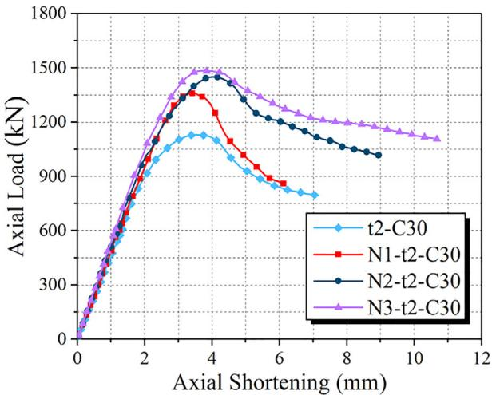  
(a)

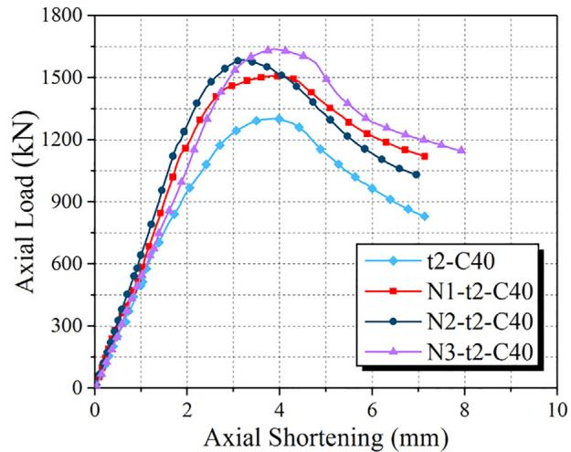  
（b)

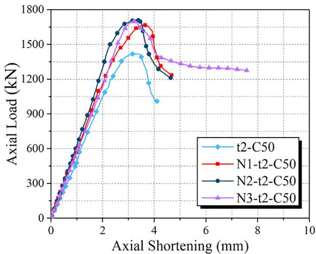  
（c）

  
(d）

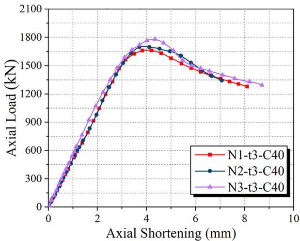  
(e）

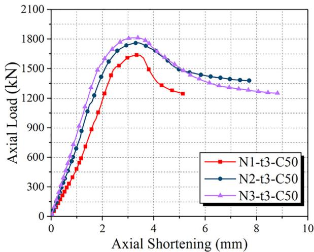  
(f)   
Fig. 11. Effect of $n _ { \mathrm { f } }$ on axial load – axial shortening curves.

to the cracking and dilation of the in-filled concrete, which induced the lateral deformation of the steel tube and CFRP textile. In this process, the lateral deformations of the three components were similar, and the confinement provided by the CFRP textile grid and steel tube to the concrete core improved.

# 3.4. Load-bearing capacity

The results for the load-bearing capacities $( N _ { \mathrm { u } } )$ of all the columns are presented in Table 1. The CFST columns exhibited improvement in $N _ { \mathrm { u } }$ after strengthening. The improvement mainly

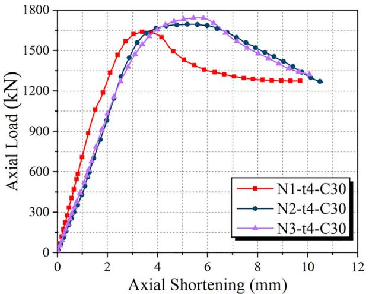  
(g）

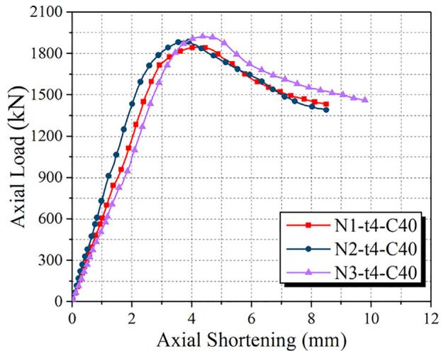  
(h)

  
(i   
Fig. 11 (continued)

resulted from the additional confinement of the concrete core provided by the CFRP textile grid wrapped in the hoop direction. Additionally, the enlargement of the cross-sectional area by the ECC, which could resist loads in the longitudinal direction, also improved the load-bearing capacity of the columns. The test results showed a maximum increase of $3 1 . 4 \%$ after strengthening (compared to Specimens N3-t2-C30 and t2-C30) and a minimum increase of $1 5 . 8 \%$ (compared to Specimens N1-t2-C40 and t2- C40). As the concrete strength increased, the enhancement ratio decreased. Fig. 15 shows the load on each component (steel tube, in-filled concrete, and ECC) at the ultimate state of the strengthened columns. Here, the bearing capacity of the steel tube was calculated using $A _ { \mathrm { s } } f _ { \mathrm { y } }$ (where $A _ { s }$ is the cross-sectional area of the steel tube and $f _ { \mathrm { y } }$ is the yield strength). Similarly, the bearing capacity of ECC was computed using 0.95AECCfck,ECC (where $A _ { \mathrm { E C C } }$ is the crosssectional area of the ECC, $f _ { \mathrm { c k , E C C } }$ is 0.76 times the cube compressive strength of the ECC, and 0.95 is the dimensional conversion factor). For the in-filled concrete, the bearing capacity was determined by subtracting the bearing capacities of the steel tube and ECC from that of the strengthened column. It should be noted that the bearing capacity of the in-filled concrete carried the confinement provided by the steel tube and CFRP textile grid. Additionally, the load ratio of each component is labelled in Fig. 15. It was evident that the in-filled concrete bore most of the loads, and the percent-

ages of the resisted load ranged from $5 6 . 3 \%$ to $6 9 . 2 \%$ . On the one hand, concrete occupied most of the cross-sectional area and resisted a significant proportion of the loads; on the other hand, the confining pressure retarded the lateral deformation development of concrete and significantly enhanced the bearing capacity of the concrete core. Hence, an increase in $n _ { \mathrm { f } }$ and $f _ { \mathrm { c u } }$ could improve the load-bearing capacity of the strengthened columns. When the thickness of the steel tube wall was increased, i.e. $D _ { s } / t$ decreased, the load resisted by the steel tube increased considerably. Although the thicker steel tube offered greater confinement to the concrete core, the load borne by in-filled concrete decreased with $D _ { s } / t$ . This decrease indicated that the contribution of steel, which directly resisted the vertical load, was more significant than that of the confinement provided to the concrete core.

# 3.5. Ductility

The ductility of the specimens was evaluated in terms of the ductility index (DI), which is expressed as follows:

$$
D I = \Delta_ {0. 8 5} / \Delta_ {\mathrm {u}} \tag {1}
$$

where $\Delta _ { \mathbf { u } }$ and $\Delta _ { 0 . 8 5 }$ are the axial shortening corresponding to $N _ { \mathrm { u } }$ and $0 . 8 5 N _ { \mathrm { u } }$ during the descending stage, respectively. The calcu-

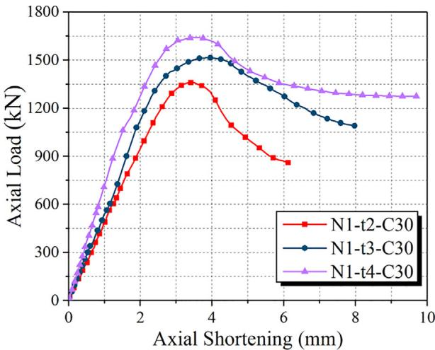  
(a)

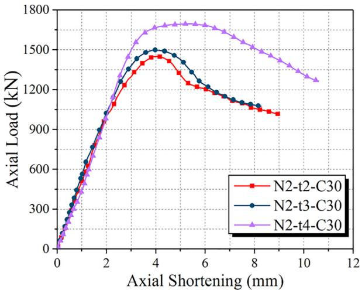  
（b)

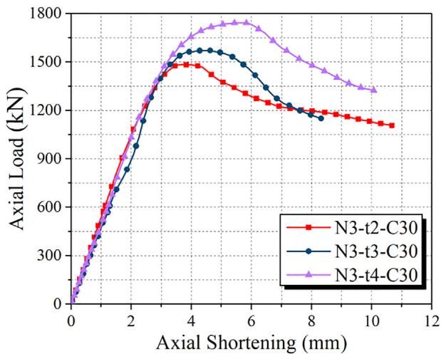  
（c）

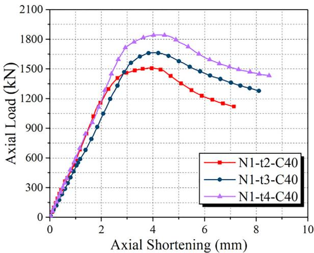  
(d）

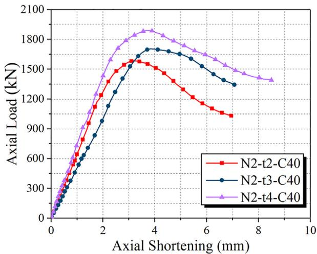  
(e）

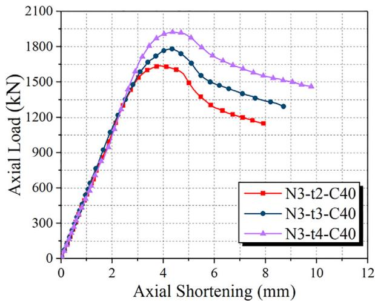  
(f)   
Fig. 12. Effect of $D _ { s } / t$ on axial load – axial shortening curves.

lated values of the DI are listed in Table 1. It was found that the DI of the specimens before and after strengthening were relatively close. t2-C30 had a value of 1.371 before strengthening; after strengthening, its values ranged from 1.315 to 1.558. t2-C40 had a DI value of

1.325 before strengthening, but after strengthening, the values ranged from 1.382 to 1.439. The DI value for t2-C50 before strengthening was 1.154 but was 1.110–1.231 after strengthening. These results indicated that the strengthened columns had a similar

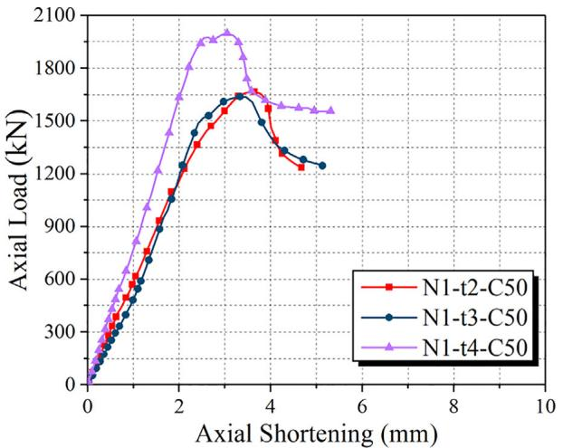  
（g）

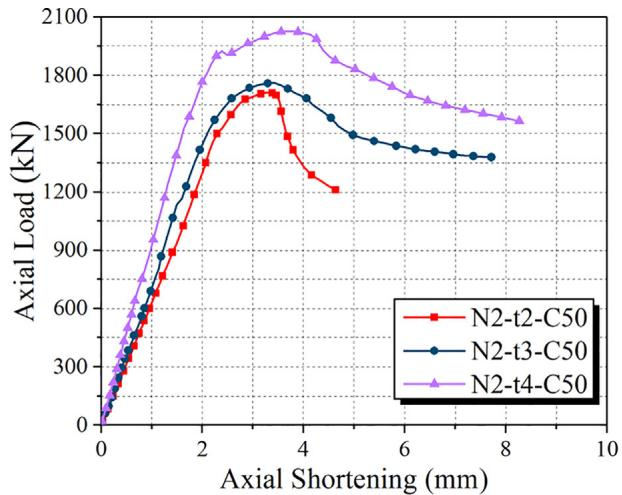  
(h)

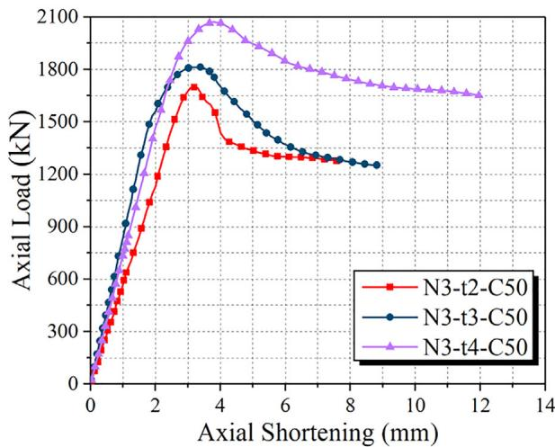  
(   
Fig. 12 (continued)

load–axial shortening response to the CFST columns after the peak load was reached. The increasing ratio of DI when $n _ { \mathrm { f } }$ increased from 1 to 2 and 3, $D _ { s } / t$ decreased from 70 to 46.7 and 35, and $f _ { \mathrm { c u } }$ increased from 35.2 MPa to 46.1 and 54.8 MPa (Fig. 16), were analysed to evaluate the parameter effects on the strengthened column ductility. In most specimens, a higher $n _ { \mathrm { f } }$ led to lower ductility owing to the brittle rupturing of the CFRP textiles (Fig. 16(a)). However, it was found that some specimens with two or three layers of CFRP exhibited higher ductility than specimens with one layer. The reason for this contrary result can be explained by the fact that in the strengthening layer, different layers of CFRP textiles were separate in the ECC. Because it was difficult to guaranty that all the layers of textile were wholly stretched during construction, stresses were unevenly distributed among different textile layers during loading, and textile rovings in different layers did not rupture simultaneously. When the first layer of textile ruptured, the load started to decrease, and the second or third layer still functioned as a load-bearing part until all the textiles ruptured. This behaviour occurred more frequently when additional layers of textiles were (Fig. 16(a)). Except for three points, the increasing ratios when $D _ { s } /$ t decreased from 70 to 46.7 and 35 were greater than zero (Fig. 16(b)), which signified improvement in the ductility of the specimens. This phenomenon occurred because a thicker steel tube

confined the concrete core more significantly and delayed the cracking and crushing of concrete Fig. 16(c) depicts the effect of concrete strength. When $f _ { \mathrm { c u } }$ increased from 35.2 to 46.1 MPa, the increasing ratios ranged between $- 0 . 1$ and $+ 0 . 1$ ; when it increased from 35.2 to $5 4 . 8 \mathrm { M P a }$ , the ductility significantly decreased, as most increasing ratios were negative and lower than 0.1. The results indicated that when the concrete strength was low, the ductility values of the specimens for different concrete strength grades were close. In this case, the post-peak performance was mainly influenced by the steel tube and strengthening layer. However, when the concrete strength increased to a relatively high level, the brittleness of the concrete core was noticeable and significantly affected the behaviour of the strengthened columns, i.e. led to a decrease in ductility.

# 3.6. Confining effect of CFRP textile grid

A strength index (SI) was introduced to evaluate the confining effect of the CFRP textile grid on the original CFST columns. In this study, the SI was defined as the ratio of the experimental loadbearing capacity to the sum of the calculated ultimate load of each component, excluding the contribution of the CFRP textile grid. The equation is expressed as follows:

  
(a)

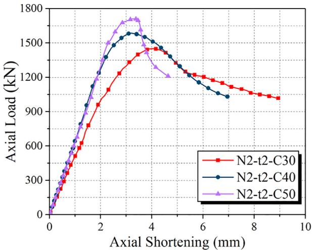  
（b)

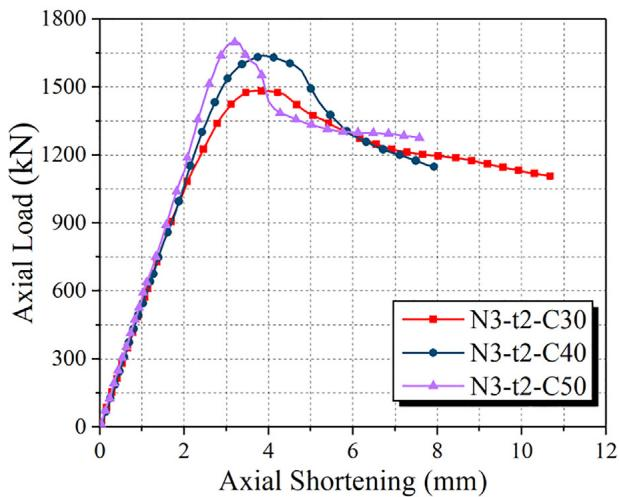  
（c）

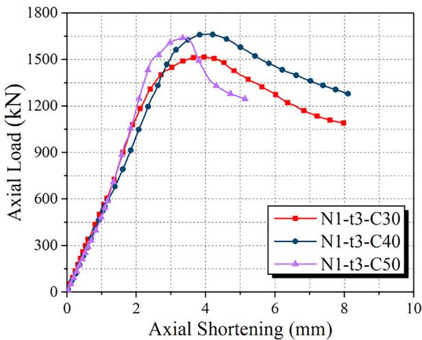  
(d）

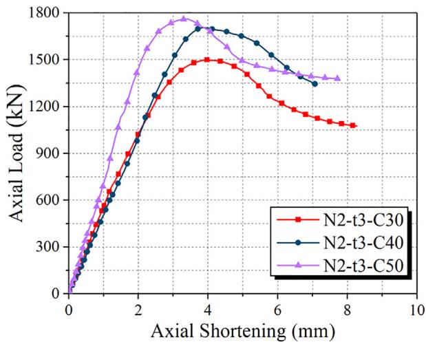  
(e）

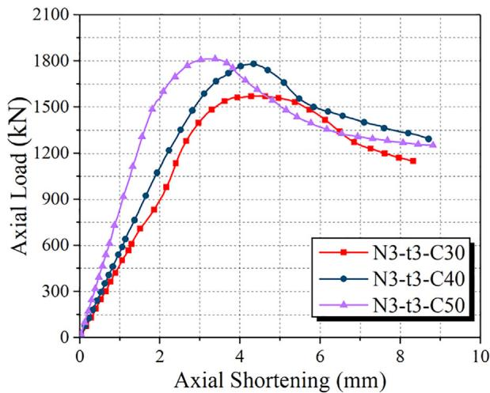  
(f)   
Fig. 13. Effect of concrete strength on axial load – axial shortening curves.

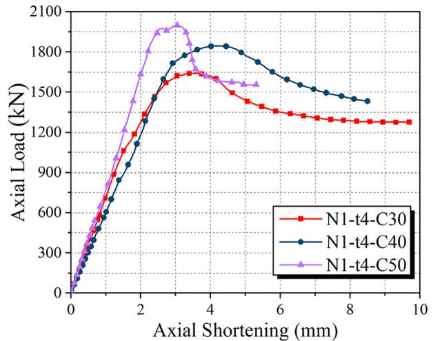  
（g）

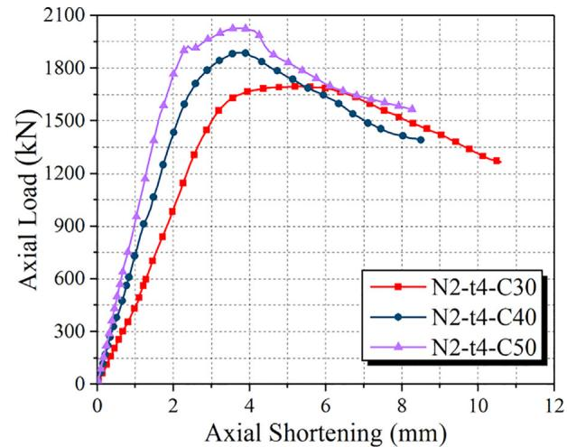  
(h)

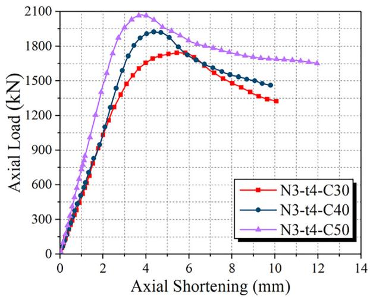  
  
Fig. 13 (continued)

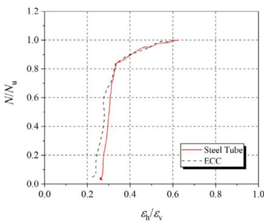  
(a) N2-t2-C30

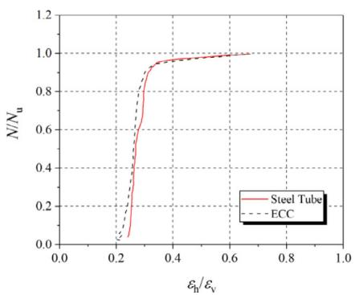  
(b) N3-t3-C50

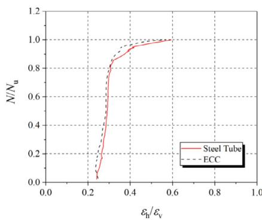  
(c) N2-t4-C30   
Fig. 14. Typical $N / N _ { \mathrm { u } } - \varepsilon _ { \mathrm { h } } / \varepsilon _ { \mathrm { v } }$ curves of strengthened columns.

$$
S I = \frac {N _ {\mathrm {u}}}{N _ {\mathrm {C F S T}} + N _ {\mathrm {E C C}}} \tag {2}
$$

where $N _ { \mathrm { C F S T } }$ is the calculated load-bearing capacity of the original CFST. The equation for calculating $N _ { \mathrm { C F S T } }$ is specified in a Chinese code [37], as follows:

$$
N _ {\mathrm {C F S T}} = \left\{ \begin{array}{l} A _ {\mathrm {c}} f _ {\mathrm {c k}} (1 + \alpha \xi) \xi \leqslant 1 / (\alpha - 1) ^ {2} \\ A _ {\mathrm {c}} f _ {\mathrm {c k}} (1 + \xi + \sqrt {\bar {\xi}}) \xi > 1 / (\alpha - 1) ^ {2} \end{array} \right. \tag {3}
$$

where $A _ { \mathrm { c } }$ is the cross-sectional area of the concrete core; $f _ { \mathrm { c k } }$ is equal to 0.76 times the cube compressive strength; $\xi$ is the confinement

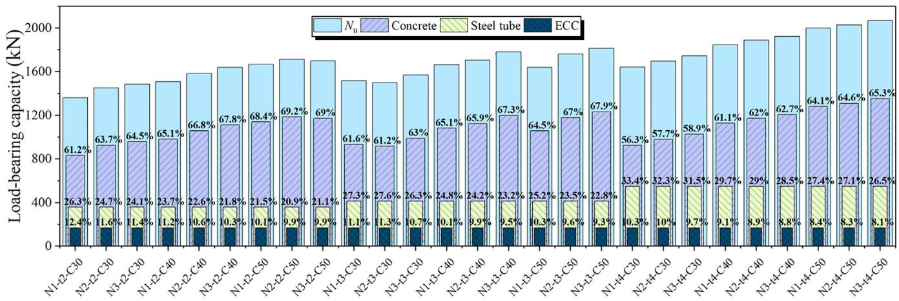  
Fig. 15. Load on components.

coefficient of the CFST expressed as $\xi = A _ { \mathrm { s } } f _ { \mathrm { y } } / A _ { \mathrm { c } } f _ { \mathrm { c k } } ; \alpha$ is assumed to have a value of 2.0 when the concrete strength grade is equal to or less than C50, and a value of 1.8 was adopted within the range

of C55 to C80. $N _ { \mathrm { E C C } }$ is the load contribution of the ECC and is calculated as described in Section 3.4 The calculated values of the SI are listed in Table 1.

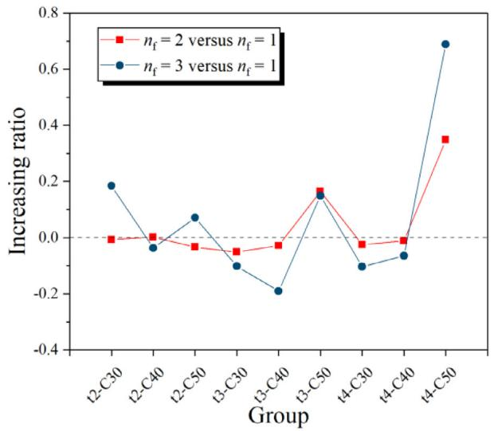  
(a) nf

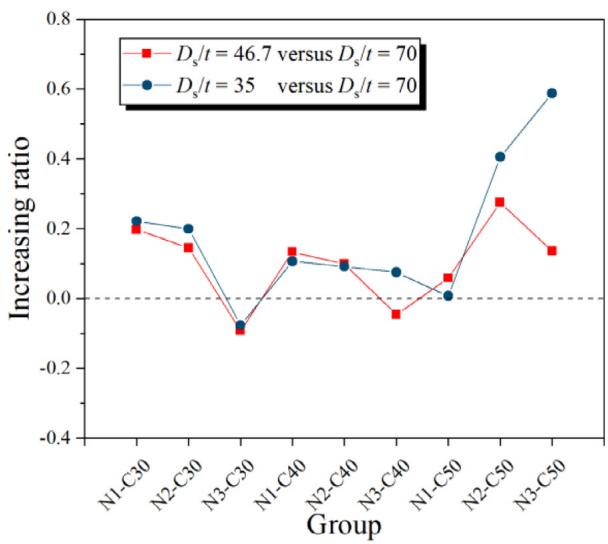  
(b) Ds/t

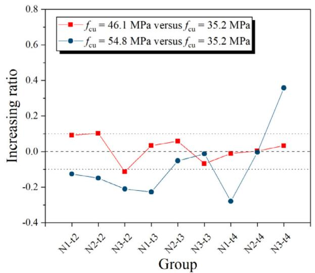  
(c) concrete strength   
Fig. 16. Effect of parameters on ductility increasing ratio.

Fig. 17(a) shows the influence of $n _ { \mathrm { f } }$ on the SI. An increase in $n _ { \mathrm { f } }$ increased the SI, which indicated that although the CFRP textile grid did not wrap the concrete directly, the confinement still functioned effectively. Thus, the higher reinforcement ratio of the textile exhibited a higher confining effect and strengthened the concrete core. Fig. 17(b) depicts the influence of $D _ { s } / t .$ Except for the discreteness of some data, the values of the SI increased with $D _ { s } / t ,$ , i.e. the confinement provided by the CFRP textile grid was more effective when the thickness of the steel tube wall was thinner. The effect of concrete strength on the SI is shown in Fig. 17(c). When the strength of concrete increased from 35.2 to 54.8 MPa, the variations in the SI value were minimal, and the slope of the trend line was close to zero. This trend indicated that the confining effect of the CFRP textile grid was insensitive to changes in concrete strength within the designed range.

# 4. Prediction of load-bearing capacity

The concrete core, steel tube, ECC, and CFRP textile grid contributed to the load-bearing capacities of the strengthened columns. Because of the confinement provided by the steel tube and CFRP textile grid, the concrete core existed in a complex triaxial state of stress when an axial load was applied. Thus, a prediction model based on the strength of the materials and the confining effect was derived as follows:

$$
N _ {\mathrm {u p}} = N _ {\mathrm {c}} + N _ {\mathrm {s}} + N _ {\mathrm {s c}} + N _ {\mathrm {E C C}} + N _ {\mathrm {F R P}} \tag {4}
$$

where $N _ { \mathrm { c } } , \ N _ { s } ,$ , and $N _ { \mathrm { s c } }$ are the loads provided by the unconfined concrete, steel tube, and steel tube confinement, respectively. The sum of these three terms indicates the load-bearing capacity of the original CFST and is equal to $N _ { \mathrm { C F S T } } .$ The methods for calculating $N _ { \mathrm { E C C } }$ and $N _ { \mathrm { C F S T } }$ have been described in Section 3.4 and 3.6, respectively. $N _ { \mathrm { F R P } }$ is the load applied by the confinement of the CFRP textile grid.

Previous studies have been focussed on TRM-confined concrete, and strength prediction models have been developed. Ombres et al. [38] established a TRM-confined concrete model based on a database of 152 compression tests; Triantafillou et al. [39] proposed a model in which concrete was confined with carbon TRM; a TRMconfined model was recommended in ACI 549.4R-13 [40]. These models (Table 6) were used to predict the $N _ { \mathrm { F R P } } . f _ { \mathrm { c c } } , f _ { \mathrm { c 0 } }$ , and $f _ { \mathrm { l u } }$ are the confined concrete strength, unconfined concrete strength, and lateral confining pressure, respectively. $f _ { \mathrm { l u } }$ is defined as follows:

$$
f _ {\mathrm {l u}} = \frac {2 n _ {\mathrm {f}} k _ {\mathrm {e}} \varepsilon_ {\mathrm {f}} E _ {\mathrm {f}} A _ {\mathrm {f}}}{D _ {\mathrm {c}} b} \tag {5}
$$

where $D _ { \mathrm { c } }$ is the diameter of the concrete core, $b$ is the space between two carbon fibre yarns. In some studies on textile grids embedded in mortar [21,25], the value of $k _ { \mathrm { e } }$ was assumed to be 0.5.

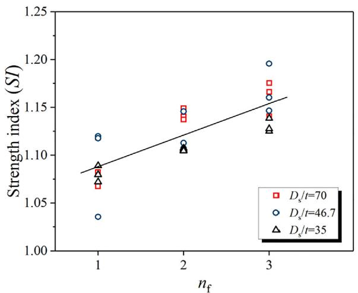  
(a）

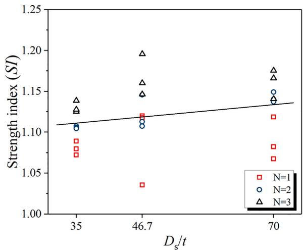  
(b)

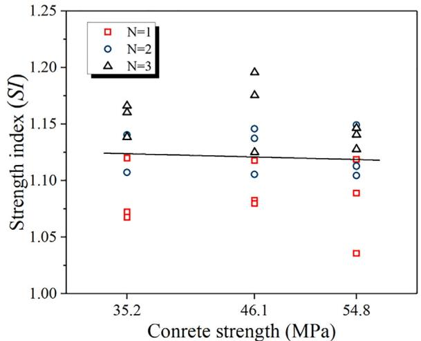  
（c）  
Fig. 17. Effect of parameters on SI.

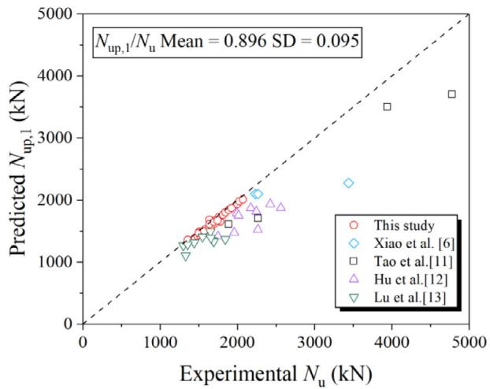  
(a) Ombres

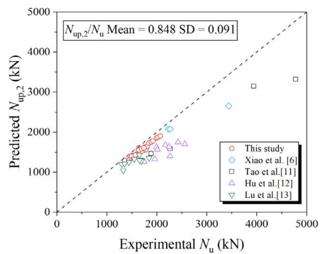  
(b) Triantafillou

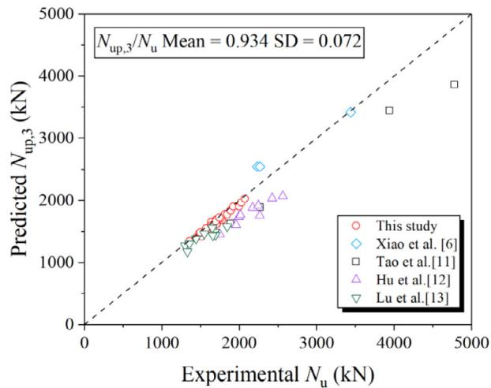  
(c) ACI   
Fig. 18. Comparison between $N _ { \mathrm { u } }$ and $N _ { \mathsf { u p } }$

The $N _ { \mathrm { F R P } }$ values calculated using the Ombres, Triantafillou, and ACI models were substituted into Equation (4) to obtain the results for $N _ { \mathrm { u p , 1 } }$ , $N _ { \mathrm { u p } , 2 }$ , and $N _ { \mathrm { u p } , 3 }$ , respectively. Additional data were required to guaranty the accuracy and applicability of these models, in addition to the test results obtained in this study. However, previous studies on textile grid-reinforced ECCs (concrete) for the strengthening of CFST were limited. Thus, a set of experimental data obtained for CFST strengthened with FRP sheets was extracted from the literature [6,11–13] and compared with the calculated results (Fig. 18). Almost all the predicted values were found to be lower than the experimental values. The mean values of $N _ { \mathrm { { u p } } } / N _ { \mathrm { { u } } }$ using the Ombres, Triantafillou, and ACI models were 0.896, 0.848, and 0.934, respectively, and the corresponding standard deviations were 0.095, 0.091, and 0.072. Comparatively, the Triantafillou model provided the most conservative predicted results, and both the Ombres and ACI models had high accuracy in predict-

Table 6 Prediction models.   

<table><tr><td>Model</td><td>Analytical expressions</td><td>NFRP</td></tr><tr><td>Ombres model</td><td>fcc/fc0=1+0.913(flu/fc0)0.5</td><td>0.913(flu/fc0)0.5fc0Ac</td></tr><tr><td>Triantafillou model</td><td>fcc/fc0=1+1.9(flu/fc0)1.27</td><td>1.9(flu/fc0)1.27fc0Ac</td></tr><tr><td>ACI model</td><td>fcc/fc0=1+3.1flu/fc0</td><td>3.1fluAc</td></tr></table>

ing $N _ { \mathrm { u } }$ . Thus, the proposed models were suitable for predicting the load-bearing capacity of the strengthened columns.

# 5. Conclusions

This paper presents the findings of an experimental study on CFST columns strengthened with high-strength CFRP textile gridreinforced high-ductility ECC. Thirty specimens were subjected to axial loading tests in this study. The following conclusions of the study were drawn:

(1) Shear failure of the concrete core occurred in the strengthened column, and the steel tubes bulged at the shear plane. On the surface of the ECC along the shear plane, a wide crack was formed, accompanied by the fracturing of the CFRP textile grid. Around the wide crack, a multiple-cracking mode of the cracks was observed. Unlike the brittle failure that occurred when CFST columns were strengthened with FRP sheets, the columns strengthened with CFRP textile gridreinforced ECC exhibited progressive failure.   
(2) A comparison of the strengthened columns with the control columns showed that the load-bearing capacity increased by $1 5 . 8 \% 3 1 . 4 \%$ , which indicated a desirable improvement after strengthening. The in-filled concrete resisted most of the

loads on the strengthened columns, and the percentages of the loads borne by the in-filled concrete ranged from $5 6 . 3 \%$ to $6 9 . 2 \%$ . With an increase in $n _ { \mathrm { f } } ,$ the load resisted by the in-filled concrete increased. Although the bearing capacity of the in-filled concrete was enhanced when $D _ { s } / t$ decreased owing to the greater confinement provided by the steel tube, the percentages of the resisted load decreased because of the more significant increase in the bearing capacity of the steel tube.

(3) The strengthened columns exhibited good ductility, similar to the CFST columns, which could be attributed to the progressive failure of the strengthened columns. Generally, a higher confining level provided by the CFRP textile grid yielded lower ductility. However, some of the specimens with additional CFRP textile grid layers exhibited higher ductility because the different textile layers did not rupture simultaneously.   
(4) Prediction models for load-bearing capacity were developed, and it was found that the load-bearing capacity of the strengthened columns was contributed by the original CFST, ECC, and the CFRP textile grid confinement. Three different TRM-confined concrete models proposed in previous studies were used to predict the confinement of the CFRP textile grid. It was found that the Ombres and ACI models provided high accuracy in predicting the load-bearing capacity of the strengthened columns.

# CRediT authorship contribution statement

Yuhong Yan: Methodology, Formal analysis, Data curation, Writing - original draft, Visualization. Hongjun Liang: Validation, Writing - review & editing. Yiyan Lu: Conceptualization, Supervision, Project administration, Funding acquisition. Yue Huang: Writing - review & editing.

# Declaration of Competing Interest

The authors declare that they have no known competing financial interests or personal relationships that could have appeared to influence the work reported in this paper.

# Acknowledgements

This work was supported by the National Natural Science Foundation of China (Grant No. 51878520) and Special Project on Technical Innovation of Hubei (Grant No. 2019ACA142).

# References

[1] L.-H. Han, W. Li, R. Bjorhovde, Developments and advanced applications of concrete-filled steel tubular (CFST) structures: Members, J. Constr. Steel Res. 100 (2014) 211–228.   
[2] Y.-X. Hua, L.-H. Han, Q.-L. Wang, C. Hou, Behaviour of square CFST beamcolumns under combined sustained load and corrosion: Experiments, Thin-Wall. Struct. 136 (2019) 353–366.   
[3] F. Gao, H. Zhu, H. Liang, Y. Tian, Post-fire residual strength of steel tubular Tjoint with concrete-filled chord, J. Constr. Steel Res. 139 (2017) 327–338.   
[4] H. Liang, S. Li, Y. Lu, J. Hu, Z. Liu, Electrochemical performance of corroded reinforced concrete columns strengthened with fiber reinforced polymer, Compos. Struct. 207 (2019) 576–588.   
[5] Y. Xiao, Applications of FRP Composites in Concrete Columns, Adv. Struct. Eng. 7 (4) (2004) 335–343.   
[6] Y. Xiao, W. He, K.-K. Choi, Confined Concrete-Filled Tubular Columns, J. Struct. Eng. 131 (3) (2005) 488–497.   
[7] K.-K. Choi, Y. Xiao, Analytical Model of Circular CFRP Confined Concrete-Filled Steel Tubular Columns under Axial Compression, J. Compos. Constr. 14 (1) (2010) 125–133.   
[8] T. Yu, Y.M. Hu, J.G. Teng, FRP-confined circular concrete-filled steel tubular columns under cyclic axial compression, J. Constr. Steel Res. 94 (2014) 33–48.   
[9] T. Yu, Y.M. Hu, J.G. Teng, Cyclic lateral response of FRP-confined circular concrete-filled steel tubular columns, J. Constr. Steel Res. 124 (2016) 12–22.

[10] M.C. Sundarraja, G.G. Prabhu, Experimental study on CFST members strengthened by CFRP composites under compression, J. Constr. Steel Res. 72 (2012) 75–83.   
[11] Z. Tao, L.-H. Han, J.-P. Zhuang, Axial Loading Behavior of CFRP Strengthened Concrete-Filled Steel Tubular Stub Columns, Adv. Struct. Eng. 10 (1) (2007) 37– 46.   
[12] Y.M. Hu, T. Yu, J.G. Teng, FRP-Confined Circular Concrete-Filled Thin Steel Tubes under Axial Compression, J. Compos. Constr. 15 (5) (2011) 850–860.   
[13] Y.Y. Lu, N. Li, S. Li, Behavior of FRP-Confined Concrete-Filled Steel Tube Columns, Polymers-Basel, 6 (2014) 1333-1349.   
[14] R. Barnes, J. Fidell, Performance in Fire of Small-Scale CFRP Strengthened Concrete Beams, J. Compos. Constr. 10 (6) (2006) 503–508.   
[15] H. Liang, S. Li, Y. Lu, T. Yang, The combined effects of wet-dry cycles and sustained load on the bond behavior of FRP-concrete interface, Polym. Compos. 40 (3) (2019) 1006–1017.   
[16] H. Toutanji, Y. Deng, Comparison between Organic and Inorganic Matrices for RC Beams Strengthened with Carbon Fiber Sheets, J. Compos. Constr. 11 (5) (2007) 507–513.   
[17] J.-G. Dai, S. Munir, Z. Ding, Comparative Study of Different Cement-Based Inorganic Pastes towards the Development of FRIP Strengthening Technology, J. Compos. Constr. 18 (3) (2014).   
[18] L.N. Koutas, Z. Tetta, D.A. Bournas, T.C. Triantafillou, Strengthening of Concrete Structures with Textile Reinforced Mortars: State-of-the-Art Review, J. Compos. Constr. 23 (1) (2019).   
[19] T. Trapko, Behaviour of fibre reinforced cementitious matrix strengthened concrete columns under eccentric compression loading, Mater. Design 54 (2014) 947–954.   
[20] P. Colajanni, M. Fossetti, G. Macaluso, Effects of confinement level, crosssection shape and corner radius on the cyclic behavior of CFRCM confined concrete columns, Constr. Build. Mater. 55 (2014) 379–389.   
[21] P. Colajanni, F. De Domenico, A. Recupero, N. Spinella, Concrete columns confined with fibre reinforced cementitious mortars: Experimentation and modelling, Constr. Build. Mater. 52 (2014) 375–384.   
[22] L. Ombres, Concrete confinement with a cement based high strength composite material, Compos. Struct. 109 (2014) 294–304.   
[23] T. Trapko, Effect of eccentric compression loading on the strains of FRCM confined concrete columns, Constr. Build. Mater. 61 (2014) 97–105.   
[24] R. Ortlepp, S. Ortlepp, Textile reinforced concrete for strengthening of RC columns: A contribution to resource conservation through the preservation of structures, Constr. Build. Mater. 132 (2017) 150–160.   
[25] J. Donnini, S. Spagnuolo, V. Corinaldesi, A comparison between the use of FRP, FRCM and HPM for concrete confinement, Compos. Part B-Eng. 160 (2019) 586–594.   
[26] V.C. Li, C. Leung, Steady-state and multiple cracking of short random fiber composites, J. Eng. Mech. 118 (1992) 2246–2264.   
[27] V.C. Li, D.K. Mishra, H.C. Wu, Matrix design for pseudo-strain-hardening fibre reinforced cementitious composites, Mater. Struct. 28 (1995) 586–595.   
[28] Y.M. Lim, V.C. Li, Durable repair of aged infrastructures using trapping mechanism of engineered cementitious composites, Cement Concr. Comp. 19 (1997) 373–385.   
[29] V.C. Li, Tailoring ECC for Special Attributes: A Review, Int. J. Concr. Struct. Mater. 6 (3) (2012) 135–144.   
[30] W.Y. Gao, K.X. Hu, J.G. Dai, K. Dong, K.Q. Yu, L.J. Fang, Repair of fire-damaged RC slabs with basalt fabric-reinforced shotcrete, Constr. Build. Mater. 185 (2018) 79–92.   
[31] Y.-Z. Zheng, W.-W. Wang, J.C. Brigham, Flexural behaviour of reinforced concrete beams strengthened with a composite reinforcement layer: BFRP grid and ECC, Constr. Build. Mater. 115 (2016) 424–437.   
[32] X. Yang, W.-Y. Gao, J.-G. Dai, Z.-D. Lu, K.-Q. Yu, Flexural strengthening of RC beams with CFRP grid-reinforced ECC matrix, Compos. Struct. 189 (2018) 9– 26.   
[33] A.N. AL-Gemeel, Y. Zhuge, Experimental investigation of textile reinforced engineered cementitious composite (ECC) for square concrete column confinement, Constr. Build. Mater. 174 (2018) 594.   
[34] A.N. Al-Gemeel, Y. Zhuge, Using textile reinforced engineered cementitious composite for concrete columns confinement, Compos. Struct. 210 (2019) 695–706.   
[35] JSCE, Recommendations for design and construction of high performance fiber reinforced cement composite with multical fine cracks (HPFRCC), 2008.   
[36] M. Di Ludovico, A. Prota, G. Manfredi, Structural Upgrade Using Basalt Fibers for Concrete Confinement, J. Compos. Constr. 14 (5) (2010) 541–552.   
[37] Ministry of Housing and Urban-Rural Development of the People’s Republic of China (MOHURD), Technical code for concrete filled steel tubular structures, GB 50936-2014, China Architecture & Building Press, Beijing, 2014.   
[38] L. Ombres, S. Mazzuca, Confined Concrete Elements with Cement-Based Composites: Confinement Effectiveness and Prediction Models, J. Compos. Constr. 21 (3) (2017).   
[39] T.C. Triantafillou, C.G. Papanicolaou, P. Zissimopoulos, T. Laourdekis, Concrete Confinement with Textile-Reinforced Mortar Jackets, ACI Struct. J. 1 (2006) 28–37.   
[40] ACI, Guide to Design and Construction of Externally Bonded Fabric-Reinforced Cementitious Matrix (FRCM) systems for Repair and Strengthening Concrete and Masonry Structures. ACI 549.4R-13. USA: American Concrete Institute, 2013.