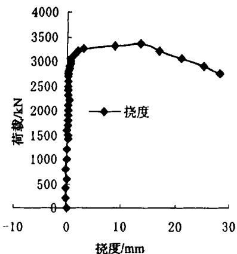
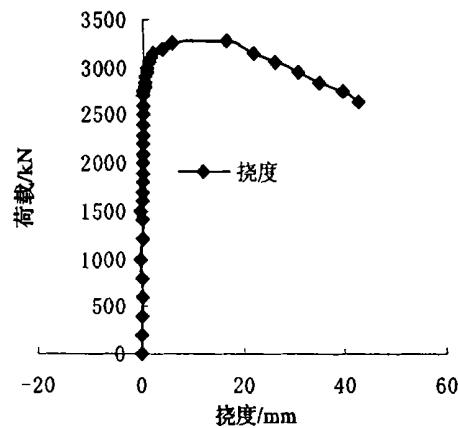
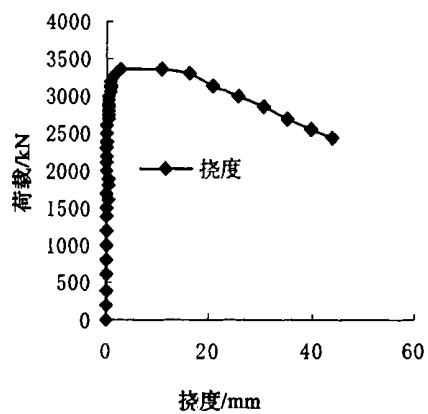
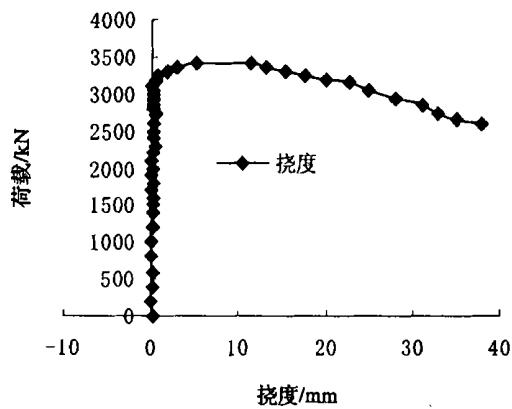
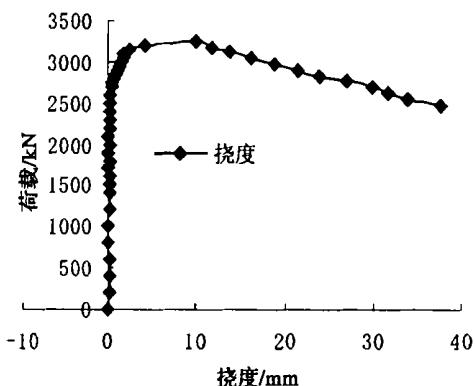
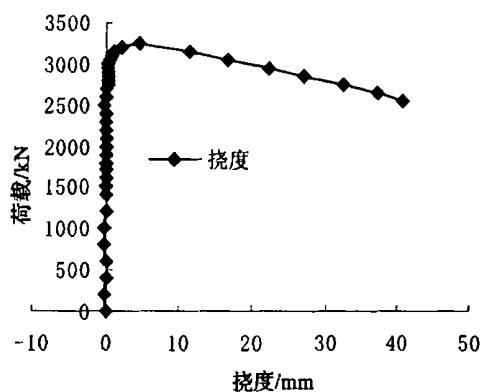

# 钢管混凝土轴压长柱承载力的试验研究

李 斌1‚2‚闻 洋2

西安建筑科技大学 陕西 西安 包头钢铁学院建筑工程系 内蒙古 包头

摘要 通过对 个钢管混凝土长柱试件的试验分析 探讨了影响钢管混凝土长柱承载力的因素 引入切线模量概念 从理论上推导出钢管混凝土轴压长柱承载力的公式

关键词 钢管混凝土 长柱 承载力

中图分类号： 文献标识码：A

# Experimental study on bearing capacity of long concrete filled steel tubular columns with axial compression

LI Bin1‚2‚WEN Yang2

（1．Xi’an U niversity of Architecture T echnology‚Xi’an 710055‚China；2．Department of Civil Engineering

Baotou Institute of Steel‚Baotou014010‚China）

Abstract :By experimental research of twelve concretefilled stel tubes which have four kinds of length-to-diame ter ratio‚we can get the influence factors of the bearing capacity of long concrete filled steel tubular columns T he tangential modulus and the conception of metal material are led to the limit bearing capacity formula of the concrete-filled steel tube long column subjected to axial compression

Key words：concrete-filled steel tubes；long column；bearing capacity

钢管混凝土（concrete-filled steel tube）是指在钢管中填充混凝土而形成的构件‚这种构件是在劲性钢筋混凝土 螺旋配筋混凝土以及钢结构的基础上演变和发展起来的一种新型结构体系 钢管混凝土是利用钢管和混凝土两种材料在受力过程中的相互制约 使钢管和混凝土均处于复杂的受力状态 充分发挥两种材料的优点 使承载力得到提高 延性得到较大的改善 它的出现引起了工程界的极大关注 并广泛地应用在实际工程中［1］

# 1 钢管混凝土构件的理论分析

假设：杆件是两端铰接的理想直杆；临界状态时‚杆轴挠曲线为正弦曲线。

临界力计算公式为

$$
N _ {c r} = \frac {\pi^ {2}}{l ^ {2}} \left(E _ {g t} I _ {g} + E _ {h t} I _ {h}\right)
$$

式中： $E _ { h t }$ 、 $E _ { g t }$ 分别是混凝土和钢材的切线模量。

Ih、 $I _ { g }$ 分别是混凝土和钢管的惯性矩。

I h ＝ π r4 $I _ { g } { \approx } { \pi } { r } ^ { 2 } t ( r ^ { + 1 . 5 } t )$ 和 ${ \boldsymbol { \alpha } } { \approx } 2 { \boldsymbol { \mathit { \Omega } } } _ { t } / { \boldsymbol { \mathit { \Gamma } } } _ { r }$ 。代入并整理后得

$$
N _ {c r} = \frac {\pi^ {2} A _ {h}}{\lambda^ {2}} m \tag {1}
$$

式中： $m = 2 \alpha E _ { g t } + 1 . 5 \alpha ^ { 2 } E _ { g t } + E _ { h t }$ ； $\lambda = 4 l / D$ ‚ $\lambda$ 是钢管混凝土的长细比； $D$ 是钢管的外直径； ${ A _ { h } } ^ { 2 } = \pi { r ^ { 2 } }$ 。

在临界状态‚当钢管的纵向应力等于或小于比例极限 $\sigma _ { p }$ 时‚采用钢材的弹性模量；当纵向应力大于比例极限时 切线模量按下式计算［2］

$$
E _ {g t} = \frac {\left(\sigma_ {s} - \sigma_ {g}\right) \sigma_ {g}}{\left(\sigma_ {s} - \sigma_ {p}\right) \sigma_ {p}} E _ {g} \tag {2}
$$

式中： $\sigma _ { g }$ －临界状态时钢管的纵向应力。

$\sigma _ { s }$ －钢材的屈服应力。

由于核心混凝土受力性能的不同 其切线模量分两种情况 临界状态钢管应力低于比例极限时 紧箍力很小或不产生 混凝土单向受压 临界状态钢管应力高于比例极限时 产生紧箍力 混凝土三向受压 两种情况采用不同的应力 应变关系曲线来确定混凝土的切线模量［3］

混凝土单向受压 采用如下应力应变关系

$$
\sigma_ {h} = R _ {a} \left[ 2 \frac {\varepsilon_ {h}}{\varepsilon_ {u}} - \left(\frac {\varepsilon_ {h}}{\varepsilon_ {u}}\right) ^ {2} \right]
$$

得 ${ E } _ { h t } = \frac { \mathrm { d } \mathfrak { o } _ { h } } { \mathrm { d } \mathfrak { e } _ { h } } = { R } _ { a } \bigg ( \frac { 2 } { \mathfrak { e } _ { u } } - 2 \frac { \mathfrak { e } _ { h } } { \mathfrak { e } _ { u } ^ { 2 } } \bigg )$ Eht ＝ R （3）

式中： $\mathfrak { e } _ { u } = 2 0 0 0 \times 1 0 ^ { - 6 }$ 为混凝土的极限压应变；

$R _ { a }$ －混凝土的棱柱强度‚ $R _ { a } = 0 . 8 R _ { o }$

$\mathfrak { E } _ { h }$ －临界状态时混凝土的应变。

# （2）混凝土三向受压

核心混凝土的应力－应变关系：

$$
\sigma_ {h} = \sigma_ {0} \left[ 1. 6 2 \frac {\varepsilon_ {h}}{\varepsilon_ {o}} - 0. 6 2 \left(\frac {\varepsilon_ {h}}{\varepsilon_ {o}}\right) ^ {2} \right] \tag {4}
$$

式中 $\sigma _ { 0 }$ 是核心混凝土的承载力 $\mathfrak { s } _ { 0 } = \left\lceil 2 0 0 0 + 5 0 0 \frac { \alpha \sigma _ { s } } { R _ { s } } \right\rceil 1 0 ^ { - 6 }$ 是核心混凝土的极限压应变。于是得：

$$
E _ {h t} = \frac {\mathrm {d} \sigma_ {h}}{\mathrm {d} \varepsilon_ {h}} = \sigma_ {o} \left(\frac {1 . 6 2}{\varepsilon_ {o}} - 1. 2 4 \frac {\varepsilon_ {h}}{\varepsilon_ {o} ^ {2}}\right) \tag {5}
$$

有了 $E _ { g t }$ 、 $E _ { h t }$ 由式（1）可确定构件的临界力 $N _ { c r }$ 。

# 2 试验概况

为了了解长细比较大的钢管混凝土轴心受压柱的力学性能和承载力 本文进行了 组共计 个钢管混凝土长柱试件的试验研究

试件所用钢材是外直径为 $2 1 9 \mathrm { m m }$ 壁厚为 $7 _ { \mathrm { m m } }$ 无缝钢管 试件分为 组 第 组长细比为 型号 $D$ $\times _ { t } \times L$ 为 $2 1 9 \times 7 \times 9 9 0 \mathrm { { m m } }$ 第 组长细比为 型号 $\boldsymbol { D } \times \boldsymbol { \mathbf { \mathit { 1 } } } \times \boldsymbol { \mathbf { \mathit { L } } }$ 为 $2 1 9 \times 7 \times 1 2 0 0 ~ \mathrm { m m }$ 第 组长细比型号 $\mathbf { \Omega } _ { } ^ { \prime } D \times \mathbf { \Omega } _ { t } \times L \mathbf { \Omega } _ { \prime } \times \mathbf { \Omega } _ { t } \times \mathbf { \Omega } _ { t } \times \mathbf { \Omega } _ { t } \times \mathbf { \Omega } _ { t } \times \mathbf { \Omega } _ { t } \times \mathbf { \Omega } _ { t } \times \mathbf { \Omega } _ { t } \times \mathbf { \Omega } _ { t } \times \mathbf { \Omega } _ { t } \times \mathbf { \Omega } _ { t } \times \mathbf { \Omega } _ { t } \times \mathbf { \Omega } _ { t } \times \mathbf { \Omega } _ { t } \times \mathbf { \Omega } _ { t } \times \mathbf { \Omega } _ { t } \times \mathbf { \Omega } _ { t } ,$ ）为 $2 1 9 { \times } 7 { \times } 1 4 2 0 ~ \mathrm { m m }$ ‚第4组长细比为30‚型号（ $\boldsymbol { D } \times \boldsymbol { \mathbf { \mathit { t } } } \times \boldsymbol { L }$ ）为 $2 1 9 \times 7 \times 1 6 4 0 \mathrm { m m }$ 。

试件加工时应注意保证钢管两端的截面平整‚以避免试件在受力过程中的受力不均匀。从技术经济及构件的延性性能方面考虑 在钢管混凝土构件中 核心混凝土的强度等级不低于 $\mathrm { C 3 0 ^ { [ 4 ] } }$ 本试验采用 混凝土。

本试验所用的试件 核心混凝土的强度不变 钢管的壁厚不变 只有试件的长度在变化 试件的养护方法为在室内进行浇水自然养护

表1 钢管混凝土试件与试验结果一览表  

<table><tr><td>试件</td><td>D×t×L/mm</td><td>fy/MPa</td><td>fck/MPa</td><td>长细比λ</td><td>Nu0/kN</td><td>Nu/c/kN</td><td>Nu/Nu0</td></tr><tr><td>GZSJ1-1</td><td>219×7×990</td><td>273</td><td>40.9</td><td>18</td><td>3300</td><td>3277.6</td><td>0.993</td></tr><tr><td>GZSJ1-2</td><td>219×7×990</td><td>273</td><td>40.9</td><td>18</td><td>3350</td><td>3277.6</td><td>0.978</td></tr><tr><td>GZSJ1-3</td><td>219×7×990</td><td>273</td><td>40.9</td><td>18</td><td>3450</td><td>3277.6</td><td>0.950</td></tr><tr><td>GZSJ2-1</td><td>219×7×1200</td><td>273</td><td>40.9</td><td>22</td><td>3390</td><td>3198.9</td><td>0.944</td></tr><tr><td>GZSJ2-2</td><td>219×7×1200</td><td>273</td><td>40.9</td><td>22</td><td>3270</td><td>3198.9</td><td>0.978</td></tr><tr><td>GZSJ2-3</td><td>219×7×1200</td><td>273</td><td>40.9</td><td>22</td><td>3380</td><td>3198.9</td><td>0.946</td></tr><tr><td>GZSJ3-1</td><td>219×7×1420</td><td>273</td><td>40.9</td><td>26</td><td>3180</td><td>3070.4</td><td>0.966</td></tr><tr><td>GZSJ3-2</td><td>219×7×1420</td><td>273</td><td>40.9</td><td>26</td><td>3420</td><td>3070.4</td><td>0.898</td></tr><tr><td>GZSJ3-3</td><td>219×7×1420</td><td>273</td><td>40.9</td><td>26</td><td>3250</td><td>3070.4</td><td>0.945</td></tr><tr><td>GZSJ4-1</td><td>219×7×1640</td><td>273</td><td>40.9</td><td>30</td><td>3200</td><td>2956.3</td><td>0.924</td></tr><tr><td>GZSJ4-2</td><td>219×7×1640</td><td>273</td><td>40.9</td><td>30</td><td>3250</td><td>2956.3</td><td>0.910</td></tr><tr><td>GZSJ4-3</td><td>219×7×1640</td><td>273</td><td>40.9</td><td>30</td><td>3450</td><td>2956.3</td><td>0.857</td></tr></table>

注：表中符号 $D , t , { \cal L }$ 分别为钢管的外径、壁厚和长度； $f _ { \mathrm { y } } , f _ { \mathrm { c k } }$ 分别为钢管的屈服强度和混凝土强度抗压标准值； $N _ { \mathbf { u } } ^ { 0 }$ 为试件实测极限荷载；$N _ { \mathrm { u } } ^ { c }$ 为试件用式（1）的计算极限荷载。

# 3 试验结果与分析

# 3．1 试件加载的全过程分析

对试验的全过程观测表明 所有试件都有较好的延性 并且都形成较好的挠曲线 试验开始时 试件按其预计荷载的 $1 / 1 0$ 进行加载‚在受荷初期‚试件处于弹性阶段‚其外形无明显变化‚当荷载加至临界荷载的$40 \% - 5 0 \%$ 时‚钢管表面出现轻微的铁皮脱落‚并且由于柱端和端板焊接有边缘效应或由于柱端混凝土不能全面接触 使钢管局部受力较大 所以试件两个端部开始出现剪切滑移线 随着荷载增加 滑移线由试件的端部向中部发展最终布满全部管壁 当荷载将要达到临界荷载时 采取连续加载的方式 试件的侧向位移急剧增大 钢管侧弯方向的环向应变增大到一定值后有一个明显的减小 这说明钢管发生侧弯后纵向应变突然增大远远超过环向应变 促使环向应变减小 而试件承载力迅速下降 试件形成较好的近似正弦曲线

# 3．2 试件的典型关系曲线及结果分析

本次试验获得的荷载－挠度的关系曲线如图1所示。

由图可知 钢管混凝土轴压长柱在开始加载时挠度基本为零 并且变化不大 所以曲线趋于水平 当荷载加至临界荷载时 挠度变形突然增大 曲线陡然下降 然后随着荷载的下降挠度变形逐渐增大 属于典型的失稳破坏 试验结果表明 在长细比较大的情况下 组成钢管混凝土的钢管和混凝土之间仍可协同互补 共同工作‚从而使钢管混凝土长柱具有较高的承载力和较好的力学性能。

试件的极限承载力汇总于表 由表 可知 各钢管混凝土试件的计算临界荷载较实测的极限承载力偏小 钢管混凝土试件的 ${ N _ { u } ^ { c } } / { \ N _ { u } ^ { 0 } }$ 的平均值为 均方差为 可见符合得较好

# 4 结论

基于对本次钢管混凝土轴压长柱的试验研究及分析‚可初步得到以下结论：

管以及三向应力状态下核心混凝土切线模量公式的选择较为合理 能真实反映钢管混凝土临界状态下的受力状况  
引入切线模量公式推导的钢管混凝土轴心受压长柱承载力公式基本上符合工程实际 能为工程设计人员的设计和施工提供一定的理论依据 简化稳定计算过程  
（3） 本次试验的这些钢管混凝土试件的破坏均属于非弹性失稳破坏。

  
GZSJ1-2挠度-荷载的关系

  
GZSJ2-2挠度-荷载的关系

  
GZSJ2-3挠度-荷载的关系

  
GZSJ3-2挠度-荷载的关系

  
GZSJ3-3挠度-荷载的关系

  
GZSJ4-2挠度-荷载的关系  
图 荷载 挠度的关系曲线

# 参考文献：

［1］ 钟善桐．钢管混凝土结构［M］．哈尔滨：黑龙江科学技术出版社‚1994  
金属结构的屈曲强度 北京科学出版社中译本  
蒋家奋 汤关祚 三向应力混凝土 北京 中国铁道出版社  
中国工程建设标准化协会标准 钢管混凝土结构设计与施工规程 中国计划出版社 北京