# 大长细比钡管混凝土轴心受压柱承载方的试验研究 关

韩林海 姜绍飞

曹宇清 哀彦声

哈尔滨建筑大学 哈尔滨 又又从 山西 省电力勘测设计院 太原

阎善章

电力规划设计总院 北京 创叉

摘 要 进行 了 个钢管混凝土 和 个 空钢 管轴 心 受压构件 的 试脸研究 研究结 果表明， 由 于填充 了混凝土， 可以 有效地延缓钢管的局部屈 曲， 从而 使钢管混凝土长柱具有较高的承载力 通过试脸结果表明， 对 于长 细比 为 一 巧 的钢管混凝土柱，《钢 一 混凝土组合结构设计规程》 中有关承载 力计 算公式 的计 算结果与实测结果相 比偏于保守， 浇灌混凝土以后， 钢管混凝土构件的承载力较空钢管可提高 $3 0 \%$ 左右

关健词 钢管混凝土 长柱 承载力 长细 比

# EXPERIMENTAL STUDIES ON THE BEHAVIOR AND STRENGTH OF VERY SLENDER CONCRETE FILLED STEEL TUBULAR COLUMNS

Han LinhaiJiang Shaofei

(Harbin University of Civil Enginering

民 呱毗 Harbin150008)

月 叩 Yuan Yansheng

‘ 叭 讹 头万

犯 ‘ 斌 刃

Yan Shanzhang

(Electric Power Planning & Enginering InstituteBeijing100011)

引 ， 们 司 《 代 】 妇‘ jectedto axially loading wasexperimentally investigated.A totalof fifteen specimensincluding eleven CFSTcolumns and four vacant steel tube columnswere studied.Experimental results indicate that theconcrete infilldelays the developmentof localbuckling of the stel tubeand thus increasing itscompressive load.The loading capacity 〔 下 山 以 阴 划 耐政叱 《 路 刃 一 食 ℃ 食 孤沈 父 〕 吮 皿 。 叱 同 一 than those vacant steel tubular columns.

印 比 比 卜习 沼

钢管混凝土 由于具有承载 力高、 塑性 和韧性好， 经济效果好和施工方便等优点而受到工程界的重视。 尤其是近 年来， 在 国 内外， 无论是在工程应用方 面还是 在理论研究方面都取得了突破性进展和显著成就， 许多国家都已 制定 了相应规范或规程〔 ” 。

以 往对钢管混凝土长柱的承载力研究 主要集 中在 长细 比 对于钢管混凝 土柱 ， 其 长

细 比 $\lambda = 4 L / D , L$ 和 $D$ 分别 为构件的计算 长度和截面外直径 为 以下， 对在 $\lambda = 1 0 0$ $\sim 1 2 8$ 的范围只有少量 的试 验数据， 而 对长细 比 $\lambda$ 在 以 上构件的研究则 尚少见。

为 了 了解长细 比较大 $( \lambda \ \geqslant 1 3 0 )$ 的 钢 管

混凝土轴心受压柱的力学性 能和承载力 ， 本文进行了共计 个钢管混凝土长柱 的试验研究， 同时， 还进行 了 个空钢管柱的试验研究， 以 了解 当空钢管中填充混凝 土后承 载力的变化情况

# 试验概况

# 试件的设计及制作

共进行了 个钢管混凝土构件， 个空钢管构件的试验研究 试件设计时变化的主要参数有长细 比 又 和混凝土强度 $f _ { \infty ^ { \circ } }$ 试件的设计情况见表 ， 表 中， $L$ 为构件的计算长

度 $\pmb { D }$ 为钢 管外直径 $t$ 为 钢 管 壁 厚 $f _ { \mathbf { a } }$ 和 $f _ { \mathbf { y } }$ 分别为混凝土立方试块强度和钢材的屈服极限 。

试 件采 用 的 钢 管 为 $\Phi 1 0 8 \times 4$ 无缝管 ，钢材 强 度 由拉 伸试 验 确 定。 在 进 行 钢 材材性试验前， 将钢管沿纵 向剖开， 做 成标准试件， 按标 准 的材料 力 学方 法 进行 拉 伸试验， 可测得其屈服强度、 抗拉强度及 弹性 模量， 分别为 、 和 $2 . 1 1 7 \times$ $1 0 ^ { 5 } ~ \mathrm { { M P a } }$ ， 钢材典型的应力 一 应变关系 曲线如图 所示

裹 试件及试脸结果  

<table><tr><td>试件号</td><td>D*t*L/mm</td><td>λ</td><td>fα/MPa</td><td>fy/MPa</td><td>Na,c/kN</td><td>Na,e/kN</td><td>Na,d/Nα,e</td></tr><tr><td>S113-1</td><td>108*4.0*4158</td><td>113</td><td>-</td><td>348.1</td><td>-</td><td>246</td><td>-</td></tr><tr><td>S113-2</td><td>108*4.0*4158</td><td>113</td><td>-</td><td>348.1</td><td>-</td><td>238</td><td>-</td></tr><tr><td>SC154-1</td><td>108*4.0*4158</td><td>154</td><td>31.8</td><td>348.1</td><td>203</td><td>342</td><td>0.594</td></tr><tr><td>SC154-2</td><td>108*4.0*4158</td><td>154</td><td>31.8</td><td>348.1</td><td>203</td><td>292</td><td>0.696</td></tr><tr><td>SC154-3</td><td>108*4.0*4158</td><td>154</td><td>46.8</td><td>348.1</td><td>241</td><td>298</td><td>0.809</td></tr><tr><td>SC154-4</td><td>108*4.0*4158</td><td>154</td><td>46.8</td><td>348.1</td><td>241</td><td>280</td><td>0.861</td></tr><tr><td>SC149-1</td><td>108*4.0*4023</td><td>149</td><td>46.8</td><td>348.1</td><td>256</td><td>318</td><td>0.803</td></tr><tr><td>SC149-2</td><td>108*4.0*4023</td><td>149</td><td>46.8</td><td>348.1</td><td>256</td><td>320</td><td>0.798</td></tr><tr><td>SC141-1</td><td>108*4.0*3807</td><td>141</td><td>31.8</td><td>348.1</td><td>237</td><td>350</td><td>0.678</td></tr><tr><td>SC141-2</td><td>108*4.0*3807</td><td>141</td><td>31.8</td><td>348.1</td><td>237</td><td>370</td><td>0.640</td></tr><tr><td>S96-1</td><td>108*4.0*3510</td><td>96</td><td>-</td><td>348.1</td><td>-</td><td>306</td><td>-</td></tr><tr><td>S96-2</td><td>108*4.0*3510</td><td>96</td><td>-</td><td>348.1</td><td>-</td><td>310</td><td>-</td></tr><tr><td>SC130-1</td><td>108*4.0*3510</td><td>130</td><td>31.8</td><td>348.1</td><td>278</td><td>400</td><td>0.696</td></tr><tr><td>SC130-2</td><td>108*4.0*3510</td><td>130</td><td>31.8</td><td>348.1</td><td>278</td><td>390</td><td>0.714</td></tr><tr><td>SC130-3</td><td>108*4.0*3510</td><td>130</td><td>46.8</td><td>348.1</td><td>330</td><td>440</td><td>0.750</td></tr></table>

注 长细 比 凡对于 钢管混 凝 土构件 $\lambda { = } 4 L / D$ 对于 空 钢管柱 $\lambda { = } L / i$ ， 为空 钢管构件截 面 的 回转半径

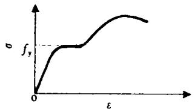  
图 钢材典型 的应力 一 应变 关 系 曲线

在进行试件加工 时， 首先按所要求的长度做出空钢 管， 并 保证钢 管 两端截 面 的平整 对应每个试件加工 两 个 直 径 为 $1 1 0 \mathrm { m m }$ 、厚为 $1 0 \mathrm { m m }$ 的圆钢板作为试件的盖板， 先在空钢管的一端将盖板焊上， 另一端等混凝土浇灌之后再焊接。 盖板及空 钢管的几何 中心对中， 并保证焊缝的质量。

由于构件非常细 长， 浇灌混凝土 比较 困难 在进行混凝土浇灌时， 先将钢管竖立 保证它与地面至少呈 $7 0 ^ { \circ }$ 角 ， 使未焊盖板的截面位于顶部， 然后从开 口 处灌入混 凝 土。 为了保证混凝土的密实度 ， 采用 $\Phi 5 0$ 插人式振捣棒伸人钢管内部振捣， 在试件的底部 同 时用振捣棒在钢管的外部进行侧振。 混凝土浇灌两个星期之后 ， 用高强水泥砂浆将另一端的混凝 土表 面 与钢 管抹平， 然后再焊上 另一盖板， 以期尽可能保证钢管 与核心混凝 土在施荷初期就共同受力。 为了 便于采用刀 铰加 载 ， 在 盖 板 的 中 心 各 加 焊 直 径 $2 0 \mathrm { m m }$ 高

$4 0 \mathrm { m m }$ 的圆钢作为栓头。

试件中混凝 土采 用 自然养护 的办法。 混凝土的立方试块强度 由同条件下成型养护成型的 $1 5 \ \mathrm { c m }$ 立方试块按标准材料力学实验方法测得 本次试验共采用 了两种强度的混凝土， 其强度及配合 比如表 所示。

叼时

表 混凝土的配合比  

<table><tr><td>混凝土强度 /MPa</td><td>水</td><td>425号硅酸盐水泥</td><td>中砂</td><td>5~30mm的石子</td><td>FDN减水剂</td><td>木钙</td></tr><tr><td>31.8</td><td>185</td><td>430</td><td>535</td><td>1250</td><td>-</td><td>-</td></tr><tr><td>46.8</td><td>154</td><td>550</td><td>630</td><td>1170</td><td>8.25</td><td>1.1</td></tr></table>

# 加载装置和加载方法

本次试验在 哈尔滨建筑大 学力 学 一 结构实验中心的 $5 0 0 0 \mathsf { k N }$ 长柱试验机上进行。

试验 时试件直 接 放 在 压 力 机 上，’两 端采用刀铰， 进行一次压缩 试验。

为了保证试件的对中， 在 试件两端设置了特别加工制作的加荷板 图 ， 加荷板由高强钢材制成， 在其上 按 预 定 偏 心 距 设 置相应的条形 凹槽， 与刀 口 铰的刀 口 相 吻合刀 口 铰通过螺栓 固定在压力机的 两端 压板上。 为保证 试验安全以及试验过程 中构件的对中准确， 在加荷板的 中心位置处设置一孔径为 $2 1 \mathrm { m m }$ 深 为 $4 1 \mathrm { m m }$ 的圆孔 ， 与盖板上 的栓头吻合

在每个试件中截面每隔 $9 0 ^ { \circ }$ 贴纵 向及环向各一的共八片电阻应 变片， 以 测量应变 的

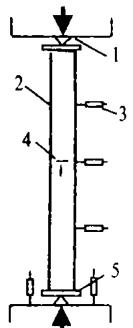

伪   
典型的加载装置示意  
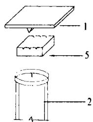  
一 刀 口 铰 一 试件 一 位移计  
一 应变片 一 加荷板

变化规律。 同时， 在试件弯 曲平 面 内沿 柱 高四分点处还设置 了三个电测位移计以测定试件的侧向挠度变化， 在柱端设置两个位移计测量试件的纵向总变形。 图 所示 为典型 的加载装置示意

在加荷初期， 每级荷载 约为极 限荷载 的加 载后 期， 每 级 荷 载 为 极 限 荷 载 的。 每 次 持 荷 $2 \sim 3 \mathrm { { m i n } }$ ， 构 件 接 近 破 坏时， 连续缓慢加载直至构件破坏时停止。

# 试验结果与分析

# 破坏形 态及特征

试验结果表 明， 本次实验 的所有试件均表现为柱 子 发 生 侧 向挠 曲， 丧失 稳定 而 破坏。 当荷载较小 的时候， 跨 中挠度变形 较小或变化 很 不 明显。 当荷 载 达 到 极 限荷 载 的$6 0 \% \sim 7 0 \%$ 时， 跨 中挠度 开始 明显增加 当跨 中挠 度 达到某 一 临界 值 时， 荷 载 开 始下降， 而变形则迅速发展。

钢管混凝土柱与空钢管柱二者的破坏形态有较大的差别， 钢管混凝土柱表现 出较好的塑性和稳定性， 且钢管没有明显的局部屈曲 空钢管柱则往往首先在试件 中截 面处发生屈 曲， 形成塑性铰而破坏 图 和图 分别给出了构件达到破坏时空钢管柱与钢管混凝土柱的形态示意图。 由于核心混凝土的存在， 钢管混凝土柱的屈 曲模态与空钢管柱相比具有很大的差别， 这也可能是二者承载力具有较大差别的一个重要原因。

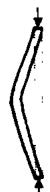  
（a)

(b)   
构件屈曲模态示意图  
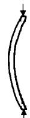  
一 空 钢管柱 一 钢管混凝土柱

# 试验结 果及分析

本次试验获得 的荷载 一 变形 关系 曲线如 图 所 示 。

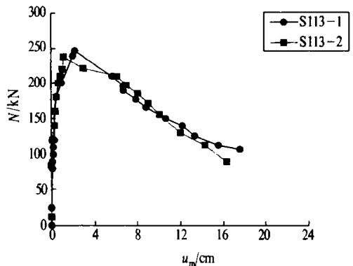  
(a)

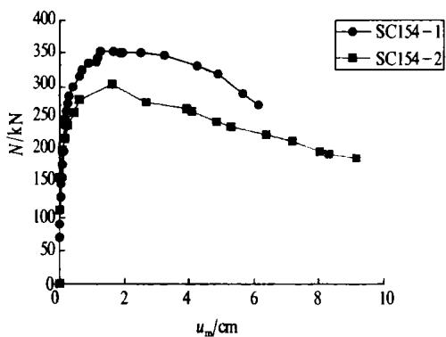  
伪

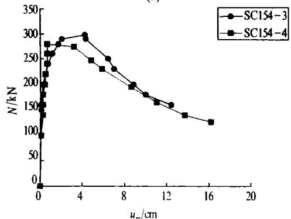  
又

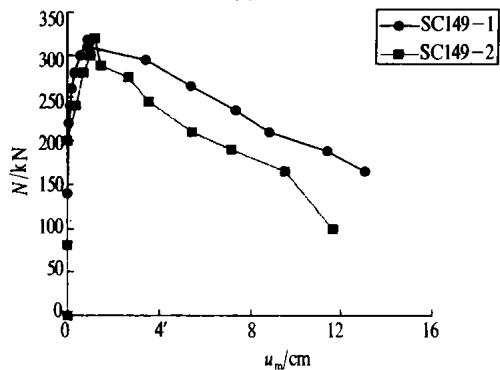  
(d)

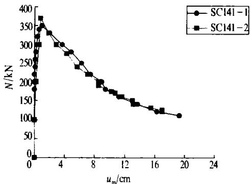  
（e）

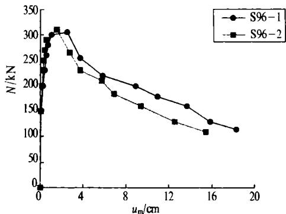

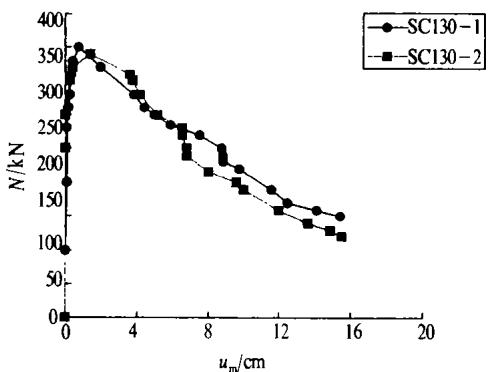  
（g）

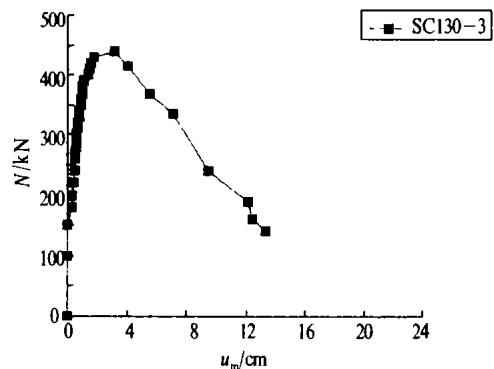  
伪   
图 荷载 一 变形关系曲线

由图 所不 的 曲线可 以 看 出， 无论是钢管混凝 土构件， 还 是钢管构件， 其破 坏 均 表现出一定 的延性性质。

试件的极 限承载力汇总于 表 。 可 见， 在其它参数 相 同 的 条件 下， 随 着 长 细 比 的增大， 钢管 混 凝 土 试 件 的稳 定 承 载 力 逐 渐 降低 仅从本次试验 的结果来看， 在长 细 比和其他条件相 同时， 混凝 上强度 的变化对构件稳定承载力的影 响不 明显 由表 也可 以看出， 对于 同样 的空钢 管， 由于填充 了混凝 土之后 ， 构件的承载力 约提 高 $3 0 \%$ 左右。 本次试验结果表 明， 在大 长细 比的情 况 下， 组 成钢管混凝土的钢管和混凝土之 间仍可协同互补， 共 同工作， 从而 使钢 管混凝 上长 柱 具 有较高的承载力和较好的力学性能。

# 对《 汀 钢 一 混凝土组合结 构设计规程》 中有关规定的讨论

在《 钢 一 混凝 土组 合 结 构 设 计 规 程》厂 中， 对钢管混凝土长柱轴压稳定承载力的验算公式如下

$$
N _ {\alpha} = \varphi A _ {\mathrm {s c}} f _ {\mathrm {s c y}} \tag {1}
$$

式 中 $A _ { \mathrm { s c } }$ 钢 管 混 凝 土 构 件 截 面 面 积$( \pi D ^ { 2 } / 4 )$

$f _ { \mathrm { s c y } }$ 钢管混凝 土 轴压强度设计指

表 稳定 系 数 $\varphi$ 值  

<table><tr><td colspan="2">λ=4L/D</td><td>10</td><td>20</td><td>30</td><td>40</td><td>50</td><td>60</td><td>70</td><td>80</td></tr><tr><td rowspan="2">钢</td><td>Q235</td><td>1.000</td><td>0.998</td><td>0.989</td><td>0.972</td><td>0.946</td><td>0.912</td><td>0.860</td><td>0.819</td></tr><tr><td>Q345</td><td>1.000</td><td>0.998</td><td>0.987</td><td>0.966</td><td>0.935</td><td>0.895</td><td>0.844</td><td>0.783</td></tr><tr><td>材</td><td>Q390</td><td>1.000</td><td>0.998</td><td>0.987</td><td>0.966</td><td>0.934</td><td>0.892</td><td>0.840</td><td>0.778</td></tr><tr><td colspan="2">λ=4L/D</td><td>90</td><td>100</td><td>110</td><td>120</td><td>130</td><td>140</td><td>150</td><td></td></tr><tr><td rowspan="2">钢</td><td>Q235</td><td>0.760</td><td>0.692</td><td>0.617</td><td>0.521</td><td>0.444</td><td>0.383</td><td>0.333</td><td></td></tr><tr><td>Q345</td><td>0.712</td><td>0.632</td><td>0.541</td><td>0.455</td><td>0.387</td><td>0.334</td><td>0.291</td><td></td></tr><tr><td>材</td><td>Q390</td><td>0.705</td><td>0.622</td><td>0.529</td><td>0.444</td><td>0.379</td><td>0.327</td><td>0.284</td><td></td></tr></table>

标， 参见文献

$\varphi$ 轴压稳定系数， 根据文献 ， 如表 所 示 。

根据式 ， 对本次 试验进行的共计个钢管混凝土长柱的承载力进行 了验算， 计算结果 $( N _ { \alpha , \mathrm { c } } )$ 及 与 实测值 $( N _ { \alpha , \mathrm { e } } )$ 的对 比 情 况列 于 表 ， 可 见， 计算值与实测值之 比 了 $N _ { \mathrm { c r } \rho } / N _ { \mathrm { c r } \rho }$ 在 $0 . 5 9 4 \sim 0 . 8 6 1$ 范 围 内 变 化， 平 均 值 为， 均 方 差 为 。 可 见 ， 《 厂钢 一 混凝土组合结构设计规程》 所提供的承载力计算公式计算结果 与本次试验结果相比偏于保守。

# 结 论

基于对本次钢管混凝土轴压长柱 的试验研究及分析， 可初步得到以下结论

钢管混凝土的稳定承载力 随长细 比的增大而降低  
混凝土强度的变化， 对钢管混凝土长柱稳定承载力的影响不明显  
空钢管柱较灌入混凝土后 的钢 管混凝土柱承载力低 $30 \%$ 左右  
《钢 一 混凝土组合结构设计规程》归 厂 中有关钢管混凝土轴压稳定承载力的计算结果与本次试验的实测结果相 比偏于 保 守 。

# 参考文献

万 女 伪 吧 】 路 一 伪of International Codes and Practices Innsbruck,1997.9  
韩林海， 钟善桐 钢管混凝土力学 大连 大 连理 工 大学出版社 ， 望拓  
国家电力公司 印 厂 钢 一 混凝 土组合结 构 设 计 规程 报批稿 北京 卯

# 睡参鲜

# 第八届 空 间结构优秀论文 揭榜

男 年 月在上海举行的 空间结 构委员会全体 会议上通过 了以 下 篇论文作为第八届 空间 结 构优秀论文  
蓝天 膜结 构的发展及其在中国的应用 前景  
沈世钊 、 陈 听等 单层球 面 网 壳、 单层 柱 面 网 壳稳定 性脸算公式 二篇 合一  
钱基宏、 赵基达、 宋涛等 浙江 省 黄龙体育中心 主体育场挑蓬风荷载及 内场 风环境模拟实验研究。  
沈祖炎、 陈扬骥、 陈以 一等 上海市八万 人体育场 屋盖的整体模型 和节点试脸研究  
尹德枉、 赵红华 网 架质量事故实例 及原 因 分析  
尹思 明、 胡 流珊等 西 昌铁路分局 体 育活 动 中心 多次 预应 力 钢 网 壳及盖 结 构设计 与研究· 中国钢协空 间结构协会秘书处